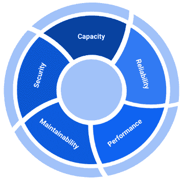
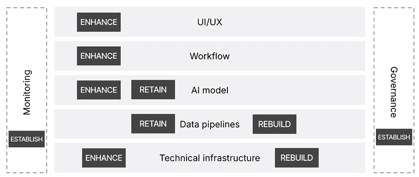
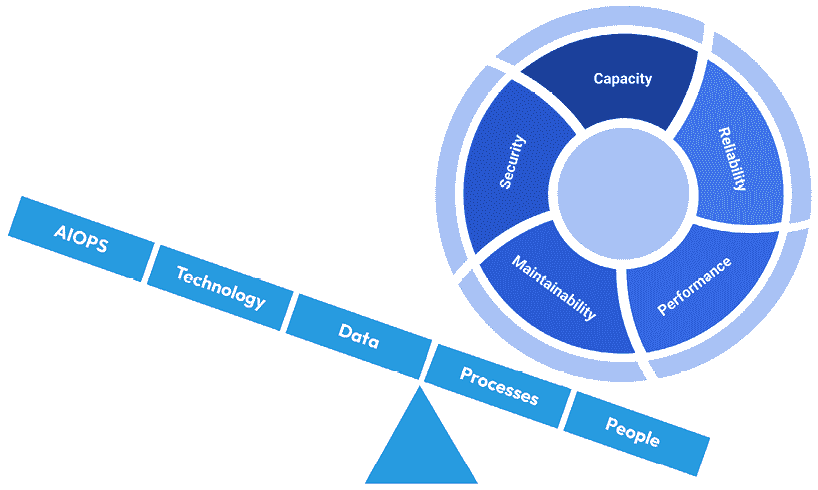
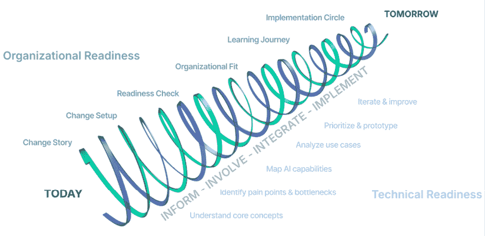
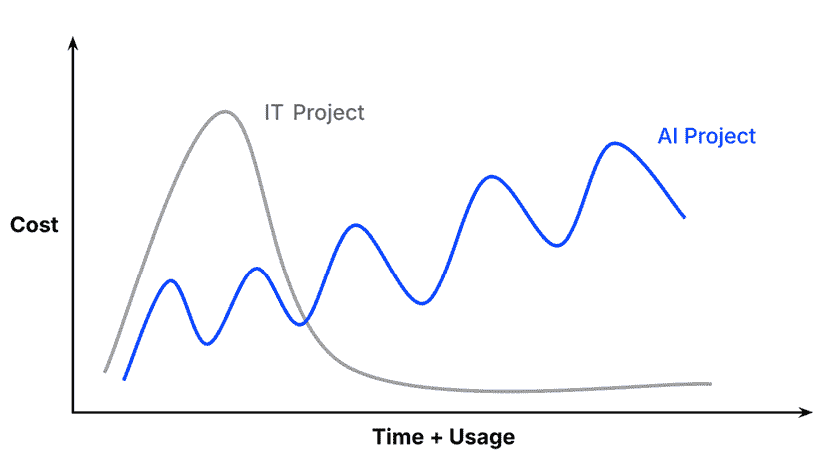
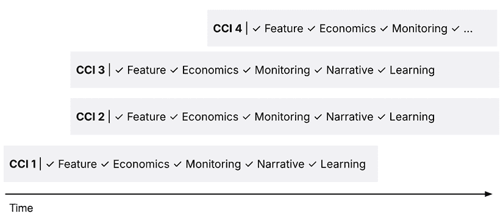

# 9

# 扩展 AI 驱动系统和工作流程

在前面的章节中，我们已经探讨了从识别高影响力的 AI 用例到有效地原型设计和验证其潜力的旅程。然而，从原型阶段过渡到完全运营、可扩展的系统带来了一系列独特的挑战——以及机遇。

**扩展 AI**不仅仅是使你的原型更大。相反，它涉及从探索性验证到稳健的运营交付的谨慎过渡，确保你的 AI 解决方案不仅有效，而且在长期内也是可持续的。

本章将引导你通过将 AI 原型扩展到生产就绪系统的关键过程，为你提供一个高级路线图，说明你在 AI 之旅中可以期待什么。然而，请注意，尽管发现和原型设计 AI 解决方案的过程往往相当标准化，但有效地扩展它们在很大程度上取决于你特定的组织。

因此，将本章视为一个入门指南，而不是一个详细的蓝图。

在本章中，我们将涵盖以下主要主题

+   理解人工智能产品生命周期

+   扩展 AI 解决方案的核心目标

+   从原型到生产：核心组件和策略

+   扩展的五个杠杆

+   调整人员和目标：扩展 AI 的组织方面

+   在规模上管理成本

+   监控和指标

+   扩展 AI 解决方案的实用步骤

# 理解人工智能产品生命周期

那么，“扩展 AI 解决方案”究竟意味着什么呢？在实践中，这意味着在 AI 产品生命周期的两个不同阶段之间积极转换：**发现**和**交付**。虽然这些阶段可能看起来是线性的，但事实上，它们代表了不同的操作模式，每个模式都有其独特的目标、方法和挑战。

让我们先谈谈人工智能产品生命周期中“发现”和“交付”阶段之间的区别。有什么区别？

**发现**阶段是探索性阶段，你的主要目标是验证。在这个阶段，你正在积极测试你的假设——你的 AI 用例在技术上是否可行，是否产生可衡量的价值，以及是否有效地解决实际业务需求。这正是你在*第七章*和*第八章*中所做的。在发现阶段，你的重点不是完美或完全的稳健性；相反，你是在快速原型设计、实验、学习和适应。发现阶段拥抱不确定性，并鼓励快速迭代以最小化投资风险并迅速发现关键见解。

**交付**，另一方面，是将经过验证的使用案例扩展到稳健、可靠和可操作的系统中。在这个阶段，关键目标从探索和验证转移到稳定性、可维护性和运营集成。交付需要与发现不同的工具集。交付不仅仅是快速行动（有时甚至可能有些混乱），它涉及周密的规划、纪律性的执行以及遵守确保你的 AI 解决方案满足业务标准的流程，这些标准包括可扩展性、可靠性、性能、可维护性和安全性。

从发现阶段过渡到交付阶段不仅仅是技术里程碑，它代表着心态和方法的根本性变化。以下是发现阶段和交付阶段之间的快速比较。

| **发现阶段** | **交付阶段** |
| --- | --- |
| 快速迭代 | 结构化规划 |
| 实验心态 | 严格治理 |
| 最小限制 | 明确标准 |
| 非正式流程 | 正式流程 |
| 创新重点 | 可扩展性重点 |

表 9.1：AI 解决方案发现阶段和交付阶段的比较

从一开始就清楚地认识到这种区别将帮助你避免常见的陷阱，即过早地将探索性原型扩展到完整的生产系统，或者相反，意外地将僵化的交付框架应用于推动创新。换句话说，过早扩展会导致生产中的脆弱原型。过晚扩展会让你陷入**原型炼狱**。

## 清单：你准备好扩展了吗？

在我们深入交付阶段之前，先解决一个问题。你怎么知道是时候从发现阶段切换到交付阶段了呢？虽然没有一种适合所有情况的答案，但在过去几年的应用人工智能咨询中，我开发了一个内部清单，帮助我识别那些**准备好**投入生产的 AI 解决方案，以及那些很可能无法满足现实世界要求并可能导致大量资源浪费的解决方案。请注意，这个清单并不能保证成功。它更多的是为了防止你过早地进入生产阶段，并展示那些（可能）仍然缺失的盲点。以下是我用来决定是否从发现阶段转向交付阶段的标准：

| **标准** | **描述** | **如何衡量（示例）** | **红旗** |
| --- | --- | --- | --- |
| 明确验证的价值 | 原型已展示出明确且可衡量的商业价值或影响（例如，降低成本、节省时间、用户满意度）。 | 返利模型、A/B 测试结果、KPI 提升（例如，≥ 20%）。 | 没有跟踪指标；收益不明确。 |
| 正面用户反馈 | 初始用户持续提供正面反馈或对原型表现出强烈的参与和热情。 | NPS ≥ 40，SUS ≥ 70，正面调查/访谈。 | 完全没有用户反馈。用户感到困惑、不参与或批评。 |
| 技术可行性已证明 | 核心技术问题或风险已得到解答或缓解 - 对 AI 解决方案在技术上是可行的有很高的信心。 | IT 批准完成；通过技术审查，工作原型。 | 经常出现错误，依赖未来的增强，设置脆弱。 |
| 需求增长 | 增加的用户需求表明组织对更广泛的应用感兴趣或存在明确的潜在应用范围。 | 使用趋势、等待名单、内部请求。 | 使用保持平稳或下降。高流失率。不清楚谁需要它。 |
| 领导层支持已获得 | 高级利益相关者或决策者（通常在相应的业务单元）已明确表示愿意资助 AI 解决方案的未来发展。 | 预算已批准；赞助商已指定。 | 没有赞助商。没有所有权。 |
| 道德和合规性检查通过 | 虽然你可能还没有考虑到所有道德和合规性相关的细节，但很明显，总的来说，你的 AI 解决方案将符合你组织的道德和合规性标准。 | 数据保护影响评估已完成，合规性检查通过。 | 存在开放合规性问题；未知风险。 |
| 集成路径已理解 | 对于 AI 原型如何在现有工作流程、系统和流程中集成已有明确的认识。 | 界面已定义；架构和所有者已对齐。 | 不清楚它如何融入现有工作流程或谁负责实施。 |

表 9.2：从发现到交付准备情况评估清单

简而言之，价值很大，红旗较少。

作为一个实际例子，假设你成功创建了一个功能原型，你的 RFP 聊天机器人分析器不仅能处理新的（未知）提案，而且每周至少能节省忙碌的销售人员 1 小时的时间，达到最低价值阈值。除了早期测试用户外，你组织中的更多人现在正在积极要求访问。你的清单显示了价值验证、用户热情、坚实的技术可行性和稳健的利益相关者支持。在这个阶段，转向交付模式既是逻辑上的，也是及时的。

当你准备好进行这种转变时，请记住：从原型过渡到生产就绪的 AI 解决方案并不仅仅是像我们在上一章中探讨的那样扩大你的原型。通常，它涉及对可以直接转移的内容、需要增强的内容以及必须完全重建的内容进行仔细评估。

现在我们知道了我们是否准备好扩展（或不是），让我们来看看扩展成功实际上是什么样子。

# 扩展 AI 解决方案的核心目标

正如我们在本章开头发现的那样，扩展不仅仅是交付更大的软件。它是关于满足五个核心目标，使您的 AI 系统在扩展规模上具有可行性。这些目标包括容量、可靠性、性能、可维护性和安全性。每个目标都在确保您的 AI 系统不仅在技术上工作，而且仍然是对您业务的资产而不是负债方面发挥着关键作用。

图 9.1：五个 AI 扩展目标

首先，在我们深入探讨如何实现这些目标之前，让我们对这些目标的意义、它们的典型关键指标和里程碑有一个高层次的了解。

## 容量

**容量扩展** 是您的 AI 系统处理不断增加的数据量、用户和交易而不会崩溃或使成本失控的能力。这通常涉及两个维度：向上扩展（向单个系统添加更多资源，如 CPU、内存或存储）和向外扩展（添加更多实例或节点以分担工作负载）。真正的容量规划平衡这两者，确保增长可以快速且经济高效地得到支持。

容量扩展的关键指标和里程碑的一些示例如下：

+   **负载处理：** 跟踪系统在性能下降之前可以支持多少请求或交易。

+   **负载下的延迟：** 监控随着使用量的增长，响应时间是否保持在约定的预期范围内。

+   **数据新鲜度：** 检查数据管道是否可靠地在规定时间内提供最新的输入。

+   **弹性成本概况：** 观察随着系统扩展，每请求或每用户的成本是否保持稳定（或下降）。

一些典型的挑战包括：

+   过度依赖脆弱的原型修复（手动导出、脚本）。

+   在单一系统中遇到瓶颈（如数据库、队列、API）。

+   供应商速率限制或许可限制在早期测试中不可见。

+   “以防万一”过度配置基础设施，导致浪费支出。

高容量确保您的 AI 解决方案与您的业务同步增长。它防止了导致信任下降的减速和中断，避免了昂贵的重建，并通过保持扩展效率来保护利润率。简单来说：强大的容量在现实世界的压力下使采用可持续。

## 可靠性

**可靠性** 是您的 AI 系统在现实世界条件下提供一致和正确结果的能力。一个可靠的系统不仅保持在线，而且即使在数据、使用或条件发生变化时，也能产生用户可以信赖的输出。

一些关键指标和里程碑示例，有助于跟踪可靠性包括：

+   **系统可用性：** 跟踪系统正常运行时间与服务级别协议的符合情况。

+   **管道成功率：** 监控数据处理是否一致地完成且无错误。

+   **模型准确性和稳定性：** 在一段时间内衡量模型准确性、精确度、召回率或其他相关 KPI。

+   **恢复速度：** 评估系统在失败或中断后恢复的速度。

+   **输出一致性**：检查预测在运行和环境之间是否保持稳定。

在构建可靠系统时可能会遇到的一些典型挑战包括（但不限于）：

+   由于数据漂移导致模型准确度下降。

+   静默数据损坏或对质量监控的缺失。

+   过度拟合到不反映现实世界变异性测试条件。

+   基础设施的单点故障或脆弱的重试机制。

+   警报疲劳 - 过多的信号而没有可操作性的优先级排序。

可靠的 AI 系统通过与用户和利益相关者建立信任。它们减少了昂贵的停机时间，防止错误输出传播到业务决策中，并鼓励广泛采用。不可靠的系统，无论是由于故障还是不准确的预测，都会迅速侵蚀信心，可能比完全不使用 AI 更具有破坏性。

## 性能

**性能**是您的 AI 系统快速有效地响应用户交互或处理需求的能力。一个性能良好的系统以用户期望的速度提供见解，而不进行过多的资源消耗。为了衡量性能，您可以利用以下关键指标和里程碑：

+   **响应时间**：跟踪从用户请求到系统响应所需的时间。

+   **吞吐量**：衡量系统可以处理多少请求或事务

    同时进行。

+   **资源效率**：监控 CPU、GPU 和内存利用率相对于工作负载。

+   **优化影响**：比较模型架构或服务技术（例如，更小的模型、量化）以平衡准确性和效率。

    记得包括更多与您的组织用例相关的指标和里程碑。

在构建性能良好的系统时，您可能会遇到以下一些挑战：

+   准确但速度过慢或成本过高的模型。

+   由低效管道或网络瓶颈引起的延迟峰值。

+   模型按需启动时的冷启动延迟。

+   缺乏优化，导致计算浪费和更高的成本。

高性能通过确保交互感觉无缝来推动用户采用。它还提高了生产率并降低了基础设施成本。另一方面，性能不佳会导致用户沮丧、工作流程缓慢和投资回报率下降。

## 可维护性

**可维护性**是指您的 AI 系统在一段时间内可以轻松管理、更新和故障排除的难易程度。一个可维护的系统是模块化的、文档齐全的，并且设计为在需求和数据变化时安全地演变。

你可以跟踪的一些指标和里程碑示例包括：

+   **部署节奏**：跟踪新功能、模型或修复可以推出的频率。

+   **变更安全性**：监控新版本失败率以及出现问题时它们可以多快地回滚。

+   **文档质量**：评估系统设计、数据流和流程是否被清晰地记录和可访问。

+   **入职速度**：衡量新团队成员如何快速成为系统生产力。

这里有一些你应该注意的挑战：

+   混乱的代码、管道或基础设施，使更新变得有风险。

+   缺乏标准化测试，导致未检测到的回归。

+   糟糕的文档，减慢了新团队成员的进度。

+   手动部署会增加错误风险并延迟改进。

可维护的人工智能系统降低运营风险和成本。它们允许团队更快地迭代，安全地修复问题，并适应新的要求。没有可维护性，人工智能解决方案会迅速积累技术债务，使它们变得脆弱、昂贵且难以进化，从而削弱其长期商业价值。

## 安全

**安全**是保护您的 AI 系统的数据、模型和基础设施免受未经授权的访问、滥用或泄露。随着原型扩展到生产阶段，安全对于合规性、信任和弹性变得至关重要。

一些关键指标和里程碑示例包括：

+   **数据保护**：验证敏感数据在传输和静止状态下是否加密。

+   **访问控制**：监控基于角色的权限和身份管理实践。**合规准备**：跟踪遵守 GDPR、HIPAA、SOC2 或 ISO/IEC 27001 等框架的情况。

+   **模型鲁棒性**：评估对对抗性输入、模型盗窃或数据泄露等风险的暴露。

+   **可审计性**：确保在需要时可以追踪系统活动和数据流。

你可能会遇到的典型挑战包括：

+   过于宽泛或模糊的访问权限，暴露了敏感数据。

+   在受控系统之外存在影子数据副本。

+   人工智能特有的漏洞（例如，LLM 中的提示注入，推理攻击）。

+   在团队或地区之间不统一地应用合规标准。

安全的人工智能系统保护您的组织免受监管处罚、声誉损害和运营中断。强大的安全实践也建立用户信任，促进人工智能解决方案的更广泛采用。相比之下，弱安全可能会阻碍扩展努力，招致法律风险，并损害利益相关者的信心。

这五个目标——容量、可靠性、性能、可维护性和安全性——共同描述了当人工智能系统扩展时**成功的样子**。但了解目标还不够。为了真正实现它们，你需要了解你的原型组件如何演变到生产阶段。一些元素可以直接迁移，而其他元素必须重建或加固以适应现实世界。在下一节中，我们将重新审视人工智能解决方案的核心组件，并探讨指导它们从原型到生产的策略——保留、增强、重建或建立。

# 从原型到生产：核心组件和策略

当从发现转向交付时，原型充当了您生产系统的种子。在原型设计期间组装的核心组件不会消失——它们会进化。一些可以几乎不变地向前推进，其他则需要为了规模而重建，还有一些全新的组件必须首次添加。

要使这种进化变得实用，通过清晰的策略来审视每个组件很有帮助：**保留**、**增强**、**重建**或**建立**。这些策略可以防止浪费，避免**废弃 AI**（在生产中无法使用的原型），并确保您将精力集中在最重要的地方。

下面的图表回顾了在*第八章*中引入的核心组件，现在叠加了它们的交付策略：

图 9.2：将 AI 组件从原型转移到生产的策略

为了使这一点更加具体，*表 9.3*提供了每个组件的详细视图——推荐的交付策略、为什么该策略很重要以及您可以用来实施该策略的常见策略：

| **组件** | **交付策略** | **解释** | **常见策略** |
| --- | --- | --- | --- |
| AI 模型核心 | 保留和增强 | 如果在原型设计期间训练的模型及其架构有效，您通常可以在生产中在此基础上构建。最重要的是，性能是否在真实的生产数据和条件下保持，这通常需要持续的工作或调整，但不需要对整个模型进行彻底的改造。 |

+   使用适当的指标在更大、更多样化的数据集上进行验证（例如，对于预测，使用 RMSE/MAE；对于分类，使用精确率/召回率/F1；对于排名，使用提升/AUC；对于 LLM，使用通过/失败或人工审查）

+   建立反馈循环以捕获用户更正和记录边缘情况

+   与更快或更便宜的替代方案进行基准测试，以确保投资回报率

+   比较不同供应商或模型提供者的弹性和性能

+   改进提示

+   在更多数据上微调模型

|

| 基本工作流程集成 | 增强 | 核心工作流程（用户交互模式、如何消费见解等）保持不变，但集成必须更深入，以允许构建增强的用户体验。 |
| --- | --- | --- |

+   通过 API 或连接器将功能直接嵌入到企业系统中（CRM、ERP、CMS）

+   设计方便性：用户不应需要离开他们的正常工作流程（回想一下*第五章*中的 TRICUS 原则）

+   早期涉及*后期采用者*以鼓励除热情的测试者之外的采用

|

| 概念数据管道 | 保留 | 您数据管道的设计逻辑（使用哪些数据、如何流动、如何转换等）应从原型到生产保持一致。如果它发生重大变化，原型可能没有反映真实的生产需求。演变的是物理实现。 |
| --- | --- | --- |

+   从原型到生产保留整体数据流设计

+   验证所选来源和转换在规模上是否真实

+   将管道逻辑与治理规则（所有权、隐私、保留）保持一致

|

| 技术数据管道 | 重建 | 虽然概念流程保持不变，但技术构建必须升级。原型通常使用快速修复，如 CSV 导出或脚本。但这些无法扩展。生产管道必须自动化、监控，并足够弹性以适应现实世界的数据量。 |
| --- | --- | --- |

+   自动化数据移动（例如，用计划作业替换手动导出）

+   在必要时使用编排工具（例如，Airflow、Prefect 或云调度器）

+   添加质量检查（在处理前标记缺失值、重复项或错误）

+   启用日志和警报（以便失败立即可见）

+   构建弹性（重试、回退或备份以防止小错误破坏管道）

|

| 治理和合规 | 建立 | 治理和合规在原型设计阶段往往（故意）被忽视，但在迁移到生产阶段时是必不可少的。一个忽视隐私、安全或监管规则的运行中的 AI 系统可能带来的风险大于价值。在生产中，治理确保您的系统值得信赖、可审计，并与法律和组织标准保持一致。 |
| --- | --- | --- |

+   使用基于角色的权限限制访问

+   定义明确的数据收集、存储和删除政策

+   记录关键决策，例如使用了哪些数据集和模型以及为什么

+   早期涉及法律、合规和安全团队以防止后期问题

+   与相关法规保持一致（例如，GDPR、HIPAA、SOC 2、行业特定规则）

|

| 用户体验和培训 | 增强 | 原型通过早期采用者验证了可用性。对于可能抵制变化的更晚采用者，生产需要进一步细化以适应更广泛的受众。成功的交付取决于培训、支持和无缝融入广泛日常工作流程的用户体验。 |
| --- | --- | --- |

+   使用多样化的用户群体测试接口以改进可用性和可访问性

+   开发入职和培训计划以简化采用

+   提供持续的支持渠道（帮助台、应用内支持、文档）

+   在推出后收集结构化反馈以推动持续改进

|

| 监控和维护 | 建立 | 监控在原型中很少存在，但在生产中至关重要。AI 模型随着数据、环境和用户行为的变化而退化。没有系统的监控和维护，性能会随着时间的推移而下降。 |
| --- | --- | --- |

+   记录输入和输出以创建故障排除的审计跟踪

+   在不同间隔持续跟踪技术、运营和战略指标（参见本章中的*监控和指标*部分）

+   通过比较新数据与训练数据来检测模型漂移

+   定义重新训练触发器（例如，当准确度低于阈值时）

+   为错误或停机时间建立事件响应操作手册

|

| 其他基础设施 | 重建或增强 | 预期对支持所有先前组件的规模化需求进行重大升级。 |
| --- | --- | --- |

+   用企业级环境替换试验设置（笔记本电脑、SaaS 账户）

+   根据安全和规模需求，将工作负载迁移到云、本地或混合基础设施

+   实施 CI/CD 管道以可靠地部署更新（参见后续的 AIOps 部分）

+   根据应用程序的关键性，规划备份、故障转移和灾难恢复以增强弹性。

|

表 9.3：从发现到交付的组件过渡概述

这种细微的方法——明确识别保留、增强、重建或建立的内容——至关重要。成功规模化的关键是平衡原型中验证过的元素与仅在生产中出现的新的运营需求。

简而言之，从原型到生产的过渡更多是关于深思熟虑的规模化，而不是简单的**扩大规模**。通过明确区分发现和交付阶段，并系统地管理这一过渡，您的组织为可靠、可持续和有影响力的 AI 部署打下基础。

在这个基础之上，接下来的问题是：**实践中是什么因素使得这些策略得以实现**？

要进行深思熟虑的规模化，您需要在人员、流程、数据、技术和运营方面拥有正确的推动力。这些是规模化的五个杠杆，我们将在下一节中探讨。

# 规模化的五个杠杆

仅靠技术很难实现 AI 的规模化。即使有明确的目标和定义良好的组件策略，成功也取决于将它们付诸实践的组织力量。这些力量以**五个关键杠杆**的形式出现：**人员**、**流程**、**数据**、**技术**和**AI 运营（AIOps）**。

每个杠杆都扮演着独特的角色：

+   **人员**提供交付所需的技能、领导和采用。

+   **流程**提供了结构，但不会扼杀敏捷性。

+   **数据**为每个 AI 系统提供动力。

+   **技术**提供安全高效地服务模型的基础设施。

+   **AIOps**确保一旦部署，AI 系统在长时间内保持准确性、可信度和价值。

单独来看，这些杠杆增强了规模化特定方面的能力。共同作用，它们可以为您提供更大的杠杆，以成功地将 AI 原型转化为可持续、受控且符合业务需求的解决方案——正如以下图示所描述的最佳方式。

图 9.3：实现 AI 规模化目标的关键杠杆

让我们更详细地探讨这些关键推动力。

## 人员

在发现阶段，你很可能依赖一个遵循两比萨法则（[`aws.amazon.com/executive-insights/content/amazon-two-pizza-team/`](https://aws.amazon.com/executive-insights/content/amazon-two-pizza-team/)）的小型敏捷团队。团队成员可能身兼数职，承担从数据科学到基础设施管理，再到商业分析和非正式利益相关者沟通的多样化责任。

然而，当从发现阶段过渡到交付阶段时，是时候重新考虑团队的结构和规模了。不再是两比萨，你应该准备订购*完整的自助餐*。将你的 AI 解决方案扩展到生产涉及扩大团队的大小和多样性，分配明确定义的角色和责任，并确保你在关键领域拥有正确的专业知识深度。

随着你团队的规模扩大，你的团队自然会从紧密的创新单元演变为一个更广泛的跨职能团队，这个团队共同拥有实现可扩展性、可靠性、性能、可维护性和安全性的多样化能力。在许多情况下，这可能意味着将项目完全转交给一个完全不同的交付团队。

这个交付团队通常包括专门的数据科学家或 AI 专家，确保模型的准确性和可靠性，ML 和数据工程师负责管理可扩展的数据基础设施，以及 IT 基础设施专家在规模上维护系统性能和安全。你还将涉及专门的业务领域专家或产品所有者，确保 AI 解决方案与实际业务需求保持紧密一致，并继续创造价值。

虽然原型设计通常在最小程度的正式监督下进行，但扩展到交付阶段意味着明确与组织的内部框架、治理政策和法规合规要求保持一致。与数据治理、IT 安全、企业架构、合规、法律专家或工作委员会（员工代表机构）等内部团队的协作成为日常业务。

与最终用户的互动也将变得更加结构化和正式化。定期的用户培训课程、全面的文档和持续的支持系统对于推动广泛采用至关重要。这也涉及到为你的解决方案获得一致的支持。并非每个用户都愿意与 AI 合作 - 一些用户可能担心被取代，或者训练一个未来可能取代他们工作的 AI 模型。预见这些担忧并积极与用户互动将变得更加重要。

随着你涉及更多的人和利益相关者，沟通和管理变得越来越重要，我们将在本章后面更深入地探讨这一点。

但你究竟如何让所有这些人保持联系、保持一致并朝着正确的方向前进呢？这就是下一个关键杠杆 - 流程 - 发挥作用的地方。

## 流程

正如你的团队结构必须从原型设计发展到生产阶段一样，你对流程的方法也需要成熟。

在发现阶段，敏捷性至关重要，但可能是不正式的。快速迭代、最小限制和松散结构化的冲刺允许你的原型团队快速创新并在面对新的见解或挑战时轻松调整方向。

然而，当你进入交付阶段时，保持敏捷性变得更加复杂。你现在需要协调更大的团队，管理多个利益相关者，并符合既定的内部政策，同时还要交付可预测的结果。在交付模式下，敏捷并不意味着没有结构地工作。相反，它意味着在提供清晰性、一致性和治理的框架内嵌入敏捷原则，这些是有效管理复杂性的必要条件。

实际上，这通常涉及采用诸如 Scrum([`www.scrum.org`](https://www.scrum.org/))、Kanban([`www.atlassian.com/agile/kanban`](https://www.atlassian.com/agile/kanban))或扩展敏捷方法，如 Scaled Agile Framework (SAFe) ([`scaledagile.com/`](https://scaledagile.com/))等框架。这些框架通过定义明确的角色、结构化的计划周期和系统化的协作流程来正式化敏捷性，使多个团队能够以敏捷的方式工作，同时在更广泛的组织中保持一致性。定期的冲刺周期现在变得更加系统性地计划、审查和调整。产品负责人、Scrum 大师和敏捷教练等额外角色指导团队，促进跨团队协作，并持续重新调整优先级和期望。

你采用哪种流程框架在很大程度上取决于你的组织，特别是已经在那里建立的 IT 交付流程。

例如，如果你的组织仍然主要采用传统的（瀑布）IT 交付模型，那么从一开始就引入完全敏捷的 AI 项目可能会造成困惑或阻力。习惯于固定范围、严格时间表和顺序工作流程的团队可能会发现敏捷交付方法不熟悉或具有破坏性。在这种情况下，更有效的方法可能是从较小的、自包含的 AI 倡议开始，这不需要广泛的组织变革。或者，你可以将 AI 交付框架与现有的阶段门或里程碑驱动流程对齐，同时在这些阶段内嵌入敏捷周期——如迭代模型开发或实验。这种混合方法尊重组织的交付文化，同时在最有价值的领域引入敏捷性。

## 数据

虽然敏捷流程有助于你管理团队协作和任务协调，但你的 AI 系统的有效性仍然取决于另一个关键维度——**数据**。没有清晰、稳健和可扩展的数据管道，即使是最结构化的敏捷流程也无法实现有效的 AI 交付。

在原型设计阶段，数据处理通常是一项动手操作、临时性的活动。团队使用小型、精心挑选的数据集进行工作——有时是手动提取、离线清理，或者仅为了测试一个想法而一次性收集。在探索阶段，这是可以接受的，因为目标是证明可行性，而不是为了规模或可靠性进行优化。

然而，一旦进入交付阶段，这些临时管道很快就会变成一种负担。生产系统需要自动化、弹性、安全的数据流，能够持续运行并处理现实世界的混乱，如不规则输入、缺失字段、版本不匹配和规模波动。

换句话说，虽然你的数据管道的概念逻辑可能从原型转移到生产，但技术实现几乎总是需要重建。原型可能能够处理手动上传的 CSV 文件和几百条记录。你的生产系统现在必须从云仓库、CRM 系统或实时 API 自动提取数据，并且每天能够处理数百万行数据。

这种过渡引发了一些关键问题，你需要在交付阶段早期解决这些问题：

+   你的数据刷新周期是否定义良好且自动化？

+   你是否有对输入的一致架构和版本控制？

+   你如何处理实时中的异常或不完整数据？

+   数据存储在哪里，谁可以访问？

+   你的数据源是否为跨用例或地区扩展做好了未来准备？

这些问题的答案不仅影响性能，还影响安全、合规性和可维护性。随着你的系统规模扩大，你对监管风险的暴露也会增加，尤其是如果你的数据包括个人信息或敏感信息。在交付过程中，你需要与数据治理和合规团队紧密合作，以确保你的管道满足内部和外部要求，例如 GDPR、HIPAA 或行业特定标准。

另一个关键考虑因素是**数据血缘**。在原型设计中，通常没有人会问数据从哪里来或如何转换——只要它能工作。但在生产中，你需要从端到端跟踪和审计数据流。如果一个模型开始表现出不可预测的行为，你需要确定问题是否出在模型逻辑上，还是在上游数据源的一个微妙变化上。许多组织使用 OpenLineage ([`openlineage.io/`](https://openlineage.io/))或 DataHub ([`datahub.com/`](https://datahub.com/))等工具实现数据血缘，这些工具可以与 Airflow、Spark 或 dbt 等现代数据平台集成。

最后，不要低估**标准化**的价值。原型设计通常快速且粗糙——定制脚本、自定义文件格式和一次性数据修复。在规模扩大时，这会创造**技术债务**。

交付应旨在实现标准化的预处理逻辑，以可重用的 ETL 组件和跨团队、应用程序共享的数据合约的形式：

+   **可重用 ETL 组件**是模块化的**提取-转换-加载（ETL）**构建块，可以在多个项目中应用，而不是每次都编写自定义数据摄取脚本。**可重用性**提高了一致性，减少了错误，并加快了入职速度。例如，一个可重用的 ETL 组件可能是一个用于清理时间序列数据或加载客户记录到数据仓库的标准化的函数。您可以在 Azure 指南中了解更多关于 ETL 概念的信息（[`learn.microsoft.com/en-us/azure/architecture/data-guide/relational-data/etl`](https://learn.microsoft.com/en-us/azure/architecture/data-guide/relational-data/etl)）。

+   **共享数据合约**定义了团队或服务之间交换数据的结构、格式和期望。它们作为正式协议（如数据 API）并帮助确保数据的生产者和消费者保持同步。例如，一个合约可能指定客户 ID 字段必须是非空字符串，并具有特定的格式。像 Protocol Buffers 和 Apache Avro 这样的工具，或支持数据合约范式的工具（例如 DataHub、OpenMetadata），有助于强制执行这些规定。有关数据合约的更多信息，请参阅此 DataHub 博客文章：[`datahub.com/blog/the-what-why-and-how-of-data-contracts/`](https://datahub.com/blog/the-what-why-and-how-of-data-contracts/)。

这些实践不仅减少了返工，而且使更多团队能够在彼此的工作基础上构建，而不会引入脆弱的依赖。在您的交付方法中将数据视为一等公民，确保您的模型拥有在生产中茁壮成长的基础。

**技术债务**

技术债务是指为了快速交付而采取捷径在软件、数据或系统设计中的隐藏成本。就像财务债务一样，它可能会随着时间的推移积累利息——以增加维护负担、降低灵活性和增加失败风险的形式。

在 AI 项目中，技术债务通常表现为未记录的脚本、手动数据管道，甚至供应商锁定。

虽然这些可能在原型中是可以接受的，但如果未得到解决，它们将成为扩展、可靠性和协作的障碍。

当合适的人选到位，敏捷流程正式化，生产级数据管道成形时，成功 AI 交付的下一个推动者是您的技术堆栈。现在让我们来谈谈它。

## 技术

在原型阶段，技术起到了辅助作用，但在交付阶段，它成为实现上述扩展目标的核心支柱。

在发现阶段，你的团队可能使用的是轻量级环境。可能有人手动启动了虚拟机，在 Jupyter 笔记本中训练模型，并通过临时仪表板共享结果。这些设置非常适合学习和快速实验 - 但在许多情况下，它们无法扩展。这意味着要从临时设置转移到结构良好、受监控和管理的环境，这些环境集成到你的更广泛的企业基础设施中。

这种过渡通常会引发三个关键问题：

1.  **你的基础设施能否与你的 AI 工作负载一起扩展？**

AI 系统通常需要与传统软件应用非常不同的资源配置。从用于模型推理的 GPU 到用于服务 API 的自适应容器，你的交付基础设施必须能够动态适应工作负载峰值。这不仅仅是向问题投入更多的计算能力 - 这是要高效地管理计算，确保资源弹性，并避免成本激增。这里的关键原则是**适应性**。你希望一个系统能够快速扩展以满足需求，而不会过度配置闲置的资源并增加成本。*快速扩展*意味着什么 - 是几毫秒还是几天 - 完全取决于你的用例。对于许多内部应用，如果需要，手动增加一点服务器容量通常比从一开始就投入大量努力构建一个完全自动化的 Kubernetes 设置更实际。关键是，你实际上能够随着工作负载的增长而扩展。

1.  **你的工具和平台是否支持运营移交？**

在原型设计阶段使用的工具（例如，本地开发环境、SaaS API）通常缺乏在生产环境中所需的访问控制、监控或集成钩子。在交付过程中，你的堆栈至少应该支持版本控制（例如，Git），可能还需要 CI/CD 自动化，以及肯定需要强大的监控和日志记录。正确的选择完全取决于你的用例。例如，实时系统通常比批量工作负载需要更多的自动化和可观察性。最重要的是，你的工具能够使开发到运营的过渡更加顺畅，而不会增加不必要的手动修补工作。

1.  **你是否可以最小化重建次数？**

虽然你的原型的一些组件可能需要重新设计，但尽量减少不必要的重建。如果你的原型设计工具与你的生产平台兼容（例如，使用 Azure ML Studio 或 Vertex AI），你可能能够重用模型端点或管道配置。这就是为什么从一开始就选择正确的工具 - 支持实验和交付的工具 - 可以显著简化你的扩展之旅。

在这个方面，另一个重要的考虑因素是**模块化**。在规模上交付 AI 并不意味着构建一个单体系统。相反，模块化架构允许你隔离组件——模型、API、管道和仪表板——并独立地发展它们。这使得更换技术、升级单个组件以及降低故障风险变得更容易。

**安全性**也与你的技术栈紧密相连。你做出的基础设施决策，例如云服务提供商、访问架构或数据存储格式，将直接影响满足内部安全和合规要求的多容易（或困难）。与你的 IT 和信息安全团队紧密合作，选择符合操作需求和监管预期的技术。

因此，虽然在原型设计阶段技术可能退居次要位置，但在交付时，它成为了一个关键启用程序。你在这里做出的选择将要么加速你的 AI 采用，要么成为限制规模、增加成本或引入不必要风险的障碍。

## AIOps

一旦你的 AI 系统上线，在生产中运行并交付价值，你的工作还没有完成；这只是监控、维护和优化的持续循环的开始。由于数据漂移、用户期望的演变或商业条件的变化，AI 模型自然会随时间退化。这就是我们下一个启用程序的作用：AIOps。

AIOps 指的是一系列操作实践、工具和流程，确保你的 AI 模型在长时间内保持准确、有用和可信。它类似于**DevOps**，专注于可靠地部署和运营传统软件，但将这些实践扩展到 AI 的独特挑战——例如监控模型准确性、检测数据漂移和管理重新训练周期。

在原型设计阶段，模型性能可能通过快速评估来衡量：一个测试数据集、几个指标和一些非正式的利益相关者验证。但在生产中，你需要严格的、**持续的监控**——因为从用户行为到上游数据源再到市场动态，任何东西都可能意外地发生变化。因此，AIOps 最关键的作用是持续监控你的 AI 系统，并在事情偏离轨道时向你的团队发出警报。这包括：

+   **模型性能监控**：准确率、精确度、召回率或其他关键绩效指标是否低于可接受的阈值？

+   **数据漂移检测**：输入数据的特征是否随时间变化，这可能需要你更新或调整你的模型或提示？

+   **管道健康**：从摄取到推理的所有系统是否运行顺畅，或者是否存在瓶颈或故障？

+   **延迟和可用性**：你的 AI 服务是否足够快地响应用户和工作流程？

结构良好的 AIOps 将在问题出现时自动标记问题，从而实现快速调查和解决。这不仅仅是避免每个问题，而是在问题变成更大的问题之前捕捉它们。

因此，一个健康的 AIOps 设置也包括反馈和迭代的机制。这意味着除了标记问题之外，你还能随着时间的推移应用更正，并使用更新数据重新训练模型。许多组织犯了一个错误，将模型部署视为一次性事件。实际上，AI 模型就像活系统一样，需要更新、重新训练、版本控制和偶尔的完全替换。AIOps 为你提供了管理这一生命周期的结构。

为了实现这一点并做出正确的决定，你需要清晰的归属。**下个月谁负责检查模型性能？如果模型突然产生错误，谁会被告知？**

在一个良好的 AIOps 设置中，很清楚谁将做什么，以及总体上谁对 AI 系统的健康负责。如果你还没有专门的 MLOps 或 AIOps 职能，从小处着手：实施性能仪表板，自动化漂移检测，并定义每个用例的*可接受性能*意味着什么。然后，随着你的 AI 足迹增长，逐步发展这些实践。

这些五个促进因素——人员、流程、数据、技术和 AIOps——为你提供了扩展 AI 并成功所需的组织肌肉和结构弹性。

## 实际案例：扩展 RFP 聊天机器人分析器

为了使这些概念更具体，让我们回顾一下我们之前章节中的 RFP 聊天机器人分析器原型，并看看当它经过深思熟虑地扩展到生产时会发生什么：

1.  **应用清单**：假设聊天机器人原型已经展现出可衡量的价值。反馈热情，需求已超出初始测试组，领导层已为下一步工作确保了预算。准备清单已有效完成：价值得到验证，技术可行性得到证明，以及理解了整合路径。*表 9.4*展示了应用清单的一个示例：

| **标准** | **评估** | **红旗/关注点** |
| --- | --- | --- |
| 价值 |

+   具有访问权限的销售人员每月处理 RFP 的速度提高了约 10 小时；每年节省约 10K 小时。

+   高吞吐量而不增加成本，更快的响应时间。

| 无。 |
| --- |
| 用户反馈 | 早期测试者的反馈非常积极 | 更广泛的调查仍待定。UI 仍需改进。 |
| 技术可行性 |

+   IT 审查完成。

+   性能已经足够好，足以有用。

|

+   GenAI 堆栈仍处于新阶段。平台决策仍悬而未决。

|

| 增长需求 | 早期测试者热情但尚未鼓励内部推广项目。 | 更广泛的需求信号待定。 |
| --- | --- | --- |
| 领导支持 |

+   销售部门负责人同意赞助实施的第一年，并分配预算。

+   IT 分配一个项目经理。

| 无。 |
| --- |
| 道德 | 法律/合规性审查仍在进行中，但尚未发现任何初始障碍。 | 最终批准正在进行中。 |
| 集成路径 | 嵌入 CRM/SharePoint 工作流程。 | 集成测试尚未完成。 |

表 9.4：RFP 聊天机器人分析器的就绪清单

1.  **定义扩展目标**：随着交付的临近，团队明确了五个扩展目标：

    +   **容量**：确保聊天机器人能够同时处理至少 10 个活跃的 RFP，而不会减慢速度。

    +   **可靠性**：保持至少 90%的准确性（10 个聊天请求中有 9 个处理完毕，提供完整、真实的信息）并确保系统在关键投标周期中可用。

    +   **性能**：保持响应时间在 10 秒以下，即使是大型、复杂的提案。

    +   **可维护性**：允许有效地监控和测试新模型，预计每 6 个月更新一次。

    +   **安全**：使用加密、访问控制和可审计性保护敏感的 RFP 数据。

1.  **应用组件策略**：使用*表 9.3*中的框架，团队将原型元素映射到其交付策略：

    +   **AI 模型核心（保留）**：保留了现有的模型方法，但用额外的、合规性强的文件进行了更加严格的测试。

    +   **工作流程集成（增强）**：不是使用单独的界面，聊天机器人被直接嵌入到 CRM 中，销售人员可以在他们的日常工作中使用它。

    +   **技术数据管道（重建）**：用自动连接器从共享驱动器直接提取 RFP，取代了手动 PDF 上传。

    +   **治理和合规性（建立）**：增加了日志记录以跟踪文档访问，合规性官员审查了处理敏感数据的政策。

    +   **监控和维护（建立）**：建立了仪表板以跟踪准确性、延迟和利用率，并设置了故障或异常的警报。

1.  **利用五个推动因素**：扩展需要不仅仅是技术。组织拉动了五个杠杆来支持过渡：

    +   **人员**：组建了一个新的跨职能团队，由专门的产品负责人领导，并得到 IT 和销售专家的支持。

    +   **流程**：敏捷冲刺继续进行，但增加了更正式的测试、文档和发布门。

    +   **数据**：管道自动化，治理团队定义了保留和隐私政策。

    +   **技术**：原型从试验设置转移到云托管解决方案。团队选择了一个与他们的 CRM 兼容的定制供应商解决方案（混合方法）。

    +   **AIOps**：在 IT 领域，实施了持续监控以检测数据漂移、跟踪采用情况并触发重新训练。产品负责人负责控制这些关键绩效指标。

1.  **结果**：通过遵循这种结构化方法，RFP 聊天机器人分析器扩展成了一个生产就绪的系统，它：

    +   在销售组织内每年节省数千小时，并允许更快地响应 RFP。

    +   即使引入了新的文档格式，也保持了稳定的准确性。

    +   在公司的合规框架内安全运行。

    +   由于无缝的 CRM 集成而实现了广泛采用。

    +   为其他 AI 用例的发展奠定了关键基础。

因此，组织最终得到了一个解决方案，它扩展了原型中证明的价值，自然地融入了现有的工作流程，并且获得了更广泛用户群体的支持。

当然，扩展 AI 解决方案的过程很少像这个例子所展示的那样简单。每个组织在过程中都会遇到自己的摩擦点、权衡和意外。

从流程角度来看，将敏捷交付实践嵌入以销售为导向的环境中可能会产生摩擦，特别是如果业务利益相关者期望严格的截止日期或立即的结果。数据管道也可能变得脆弱——特别是对于可能意外到来的新 RFP。

在技术方面，将聊天机器人深度集成到 CRM 或 SharePoint 等系统中可能会引发实施问题或成本争议，因为这可能会影响其他团队。衡量采用率、准确性和成本趋势也可能变得复杂——使用量的激增可能会迅速将推理成本推高到最初的预测之上。在人员方面，一旦聊天机器人达到不太懂技术或持怀疑态度的销售团队，采用率可能会放缓，需要更强的培训和变革管理。

为了进一步探讨这些挑战，我们现在将聚焦于扩展过程中的三个特别敏感的领域：资助、使用和批准你所构建内容的人员；大规模运行 AI 解决方案的成本；以及随着你的 AI 足迹在组织内增长，你监控所发生情况的能力。

# 对齐人员和目标：AI 扩展的组织方面

到目前为止，我们谈论了很多关于技术使能器，这些使能器允许你在整个组织中扩展 AI 系统。但如果你的员工不支持，这一切都将微不足道。

实施 AI 需要得到那些 AI 意图增强的员工的认可。这种组织准备需要与技术准备紧密同步，如下面的图所示：

图 9.4：同步技术和组织准备就绪

*图 9.4* 展示了在扩展 AI 解决方案时技术和组织准备之间的关键平衡。成功的 AI 实施不仅需要强大的技术系统，还需要积极参与、准备充分的员工。仅仅发展技术（如开发 AI 模型或基础设施）是不够的。同时，组织需要适应和改变，确保员工理解和接受新的 AI 工具。这包括解决员工担忧、提供培训和将 AI 集成到现有工作流程中。

简而言之：无论你的解决方案多么先进，如果预期使用它的人不相信它，那么它就无法产生结果。将人工智能融入日常运营不仅仅是一项纯粹的技术练习——它是一种文化转变。一种转型。它触及人们的工作方式、他们的决策方式以及他们在组织中的角色。

员工很少因为不理解其好处而抵制人工智能。他们抵制它是因为他们不相信这些好处适用于他们。为什么他们要支持可能颠覆他们的工作或重写熟悉流程的系统？为什么他们甚至要接受一个人工智能系统可能比他们自己更好地完成部分工作的未来？

**人工智能焦虑**是真实的——当“为什么”不清楚或没有说服力时，抵制变化的本能也是真实的。

这就是为什么组织准备就绪必须与技术准备就绪同步发展。前面的图表显示了这两个力量如何随着时间的推移共同增长。一个没有另一个就会产生摩擦、阻力，最终导致失败。

随着你沿着人工智能之旅不断前进，从理解核心概念到推出实际用例，你的组织必须与之并行进化。你不仅仅是实施软件，而是在引导人们进行思维方式的转变：帮助他们理解人工智能如何融入他们的工作，它改变了什么，以及为什么它很重要。

不幸的是，许多倡议在这里遇到了困难。最常见的陷阱出奇地一致：模糊的战略叙述、过度炒作的承诺、缺乏培训、缺乏变革支持，以及缺乏反馈机制。他们专注于交付模型，而不是支持模型周围的人。

以人为本的人工智能转型颠覆了这种逻辑。它不是从算法开始的。它从员工开始。

重点是“这个模型能做什么？”转向“**这将如何帮助某人更好地完成工作？**”以及“**我们如何向我们的员工解释这个解决方案？**”

这意味着将技术进步的速度与组织实际能够吸收的变化速度相一致。

这并不意味着暂停一切，直到整个组织都“准备好”。但这确实意味着认识到人工智能的成功建立在两个基础之上：你系统的成熟度以及你人员的**准备就绪**。就像你的技术堆栈一样，组织准备就绪可以（并且应该）逐步发展，一步一个脚印。

这段旅程始于一个引人入胜的改变故事，它不仅解释了正在发生什么变化，还解释了为什么。它继续以专门的团队引导转型，一个结构化的学习之旅，使员工能够有意义地与人工智能互动，以及持续的反馈循环，以确保组织随着解决方案的进化而进化。

简单来说：没有一家公司仅仅因为拥有最快的模型或最干净的数据而被 AI 改变。改变发生在人们感到被赋予力量，而不是被工具所取代时。这就是将能力转化为影响的原因。这就是为什么最终扩展 AI 与心理学和信任一样，与基础设施和算法一样重要。

接下来，我们将讨论在您扩展 AI 解决方案时如何管理成本。

# 规模化成本管理

添加到目前为止我们讨论的所有元素显然会增加您 AI 解决方案的成本。因此，一旦您的 AI 解决方案在生产中扩展并开始累积成本，一个问题会反复出现，来自财务、来自领导层、来自您自己的团队：**这还值得吗**？

答案取决于您是否准备好如何应对*AI 项目与传统 IT 项目在行为上的不同，尤其是在成本方面*。

看一下以下简化的插图：

图 9.5：IT 项目成本与 AI 项目成本对比

您在这里看到的是一个常见的模式。

在传统的 IT 项目中，大多数成本通常是前置的。在实施过程中，您会大量投资——构建系统、集成软件和培训用户——然后成本通常会随着时间的推移而趋于平稳。无论您有 100 个用户还是 10,000 个用户，每个用户的成本都保持相对稳定（除了软件许可可能基于使用量之外）。

AI 项目遵循一个非常不同的节奏。

尽管早期开发成本可能较低——特别是如果您从现成的组件开始——但 AI 引入了随着解决方案增长而出现的振荡和扩展成本。模型再训练、微调和一般模型维护引入了一个周期性的成本块，随着时间的推移会再次出现，导致您的 AI 解决方案的维护成本（或多或少可预测）会周期性地上升和下降。这使得预算解决方案变得困难，因为您总是需要保留一些储备金以应对意外情况，例如，由于底层数据变化。

此外，AI 成本通常随着使用量的增加而更明显地扩展。一个每天处理 50 个查询的模型可能运行成本低廉。但当您将相同的模型扩展到处理多个业务单元的 50,000 个每日请求时，推理成本、计算负载和延迟处理基础设施可能会迅速增加成本。在试点阶段看起来效率很高的解决方案在扩展后可能会变得出乎意料地昂贵——尤其是在需要保持响应时间和模型准确性的负载下。这是因为 AI 模型通常依赖于专门的硬件，如 GPU 或高性能 CPU，这些硬件比您平均的 IT 堆栈要昂贵得多。

那么，您如何应对这个问题？

不要试图从一开始就模拟每个边缘成本案例。相反，我建议一个更实用和可扩展的方法：我们之前在*第七章*中介绍的价值阈值和成本上限模型。

这里是这些方法的快速回顾：

+   **价值阈值**是指 AI 用例需要产生的最低商业价值——通常定义为时间节省、增加转化率、成本避免或其他与业务相关的指标

+   **成本上限**定义了分配给开发、部署和维护该解决方案的最大年度预算——包括基础设施、许可和内部资源

如果您的 AI 用例的成本低于成本上限且高于价值阈值，则被视为净正面——合理且具有商业价值。如果等式两边的任何一方发生变化，您的治理流程应强制重新评估：要么提高阈值，要么优化系统以将成本控制在可控范围内。

让我们看看一个简单的例子。

假设您的 AI 系统被客户支持代理用于自动总结投诉电子邮件：

+   **价值阈值**可能被定义为：每个代理每周至少节省 3 小时。

+   如果有 50 个代理在使用，那么每周就是 150 小时 × 52 周 = 每年 7,800 小时。

+   以平均每小时 50 美元的内部成本率计算，那将是每年 39 万美元的价值。

+   如果总成本（基础设施、供应商费用和维护）每年限制在 100,000 美元，则解决方案在合理范围内。但如果计算成本因工作量增加而激增，这可能会使年度成本超过 300K 美元。现在您需要重新评估：您能否通过显示更多部门受益来提高价值阈值？

+   或者您需要降低成本（例如，通过使用更便宜的模型、更多缓存或异步处理）？

人工智能经济学需要积极的管理。您的 AI 解决方案不是一个“部署一次，走人”的系统。它是一个活的产品，需要定期的成本-性能评估。没有它们，您可能会面临基础设施成本逐渐增加、供应商账单未监控或低效的工作流程随着时间的推移侵蚀您的投资回报率。

这就是为什么这种简单的成本/价值框架如此强大。您不需要完美的会计模型。您只需要清楚了解成功是什么样的，您愿意投入多少来实现它，以及何时平衡点偏移得太远。

换句话说：不要过分关注确切的价值。确保您的 AI 解决方案持续超过一个真实、可触达的阈值（您在*第四章*中定义的）。当成本开始上升，几乎不可避免地会上升时，将其视为智能、战略重新校准的检查点。

在下一节中，我们将讨论定义和衡量商业影响的具体方法，采用清晰和可操作性的指标以保持与组织目标的协调一致。

# 监控和指标

我们已经在几个地方提到了监控——作为 AI 解决方案的一个专用组件，作为 AIOps 的一个关键部分，甚至在原型评估期间，您测量模型准确度时也是如此。每一次提及都反映了同样的现实：监控不是一个单独的步骤或工具，而是一根贯穿整个 AI 生命周期的线。

随着规模的扩大，变化是什么。监控从偶尔的检查或技术保障转变为成为一门独立的学科——它将系统健康、用户行为、成本信号和业务成果联系起来。

这不仅包括传统的指标，如延迟或准确率，还包括**防止不安全输出的防护措施**、跟踪潜在的**个人身份信息（PII）泄露**以及在生成模型中检测越狱尝试。这些隐私和安全维度与性能或可靠性一样重要，因为它们直接影响信任、合规性和用户安全。

到目前为止，我们主要关注数据作为推动我们 AI 的动力——我们摄取、清洗并输入模型的数据。但一旦我们的 AI 解决方案上线并投入使用，它就开始产生自己的数据，例如使用数据、性能指标和操作日志。这一新层与最初用于训练系统的数据一样重要。换句话说，AI 系统不仅消耗数据，还生成数据。成功扩展 AI 意味着知道如何使用这些数据来跟踪什么有效，什么无效，以及下一次优化应该发生在哪里。

从这个意义上说，监控不仅仅是用来捕捉失败的事情，而是一种复杂的形式分析，如果做得好，可以让你回答诸如以下问题：

+   用户是否真正与 AI 解决方案互动？

+   我们能否始终保持高性能？

+   我们是否看到随着时间的推移，输出变得越来越不有帮助？

如您所见，这不仅仅是工程问题，也是业务问题。如果一个模型默默失去相关性或准确性，用户将停止信任它。如果每推理一次的计算成本在价值没有相应增加的情况下上升，您可能正在走向负回报率。

AI 在生产中的最小监控设置在*表 9.5*中展示：

| **监控标准** | **描述** |
| --- | --- |
| **使用指标** | 预测次数、查询处理次数、活跃用户数、峰值使用时间和 API 响应时间。 |
| **性能指标** | 模型级别的统计数据，例如，准确率、精确率、召回率或业务特定的等效指标（例如，解决的投诉数量、加速的提案、受影响的转化）。 |
| **成本指标** | 每用户、每 API 调用或每部门的推理成本。计算峰值。扩展模式。 |
| **反馈数据** | 用户更正、点赞/踩评分和标记行为。任何能提供对现实世界模型质量洞察的信息。 |
| **系统健康** | 管道可靠性、延迟、错误率、再培训间隔以及数据摄入的成功/失败率。 |

表 9.5：生产中需要监控的最小指标集

当然，仅仅收集这些数据是不够的——你需要将其投入使用。这就是为什么仪表板不应该只为数据科学家构建，而应该为商业用户和产品经理共同使用。将你的指标与**价值阈值/成本上限**框架对齐。如果性能低于定义的关键绩效指标（KPI），则应触发调查或再培训。同样，如果没有价值增加而使用量激增，这也值得你的关注。

并且不要忘记：AI 在这里也能有所帮助。例如：

+   使用 AI 异常检测来标记模型准确性的突然下降

+   预测用户成本可能超过预算上限的时间

+   根据用户反馈提出增强用户参与度的策略

为了跟踪不断增长的复杂性，以下是一个简单的方法来组织你的监控标准，通过将其分解为三个相互关联的层级：

| **层级** | **焦点** | **示例指标和信号** |
| --- | --- | --- |
| 技术 | 基础设施和系统健康 |

+   管道正常运行时间和故障率

+   推理延迟

+   数据摄入成功/失败

+   基础设施使用（CPU/GPU/内存）

|

| 运营 | 解决方案性能和用户交互 |
| --- | --- |

+   每天的预测数量

+   活跃用户/部门

+   模型准确性、精确度、召回率

+   每次预测或每用户的成本

+   再培训频率

+   反馈循环活动（例如，标记的结果，点赞/踩）

|

| 战略 | 业务影响和对齐 |
| --- | --- |

+   实现的价值阈值（例如，节省的时间，影响的转化）

+   成本上限状态（例如，预计支出与预算）

+   随时间推移的使用趋势

+   每个部门或流程区域的回报率信号

|

表 9.6：组织监控指标框架

这种分层方法确保你不仅保持系统在线（技术），而且还确保它保持有用（运营）和有价值（战略）。随着你扩展 AI 解决方案，这种结构化、多层次的监控变得至关重要——不仅是为了证明你的系统正在工作，而且是为了持续优化、适应并将它们引导到最重要的方面。

我们现在将重点转向将我们的学习应用于实践。下一节将重点介绍你可以如何采取渐进步骤来扩展 AI。

# 扩展 AI 解决方案的实用步骤

扩展 AI 可能会相当令人不知所措。是的，它是复杂的。是的，它是跨职能的。那么，你如何在不过度消耗资源或失去焦点的情况下前进？

一种经过验证的方法是在**完整、封闭的增量**中工作——这与在原型阶段交付原子 AI 用例非常相似。将每个增量视为一个具有明确边界的迷你项目：它可以从头到尾交付，显示出可衡量的价值，并为下一轮提供经验教训。

一个强大的增量通常包括：

+   **一个具体的用例或功能**：足够窄以完成，但足够有意义以产生影响。

+   **定义的价值阈值和成本上限**：始终保持业务案例可见。

+   **一个监控计划**：跟踪技术性能和商业影响。

+   **清晰的变革叙事**：向受影响的用户解释*为什么*。

+   **一个学习计划**：为人们提供采用解决方案的知识和支持。

这些增量可以根据您组织的资源限制和优先级顺序或并行开发（*图 9.6*）。

图 9.6：随时间推移的完整封装增量开发（示意图）

这种方法之所以有效，是因为每个增量都足够小，可以管理风险，但又足够完整，可以建立信任和动力。

让我们回顾一下 RFP 聊天机器人分析器的例子，以及您如何构建完整、封装的增量。

## 示例：分阶段扩展 RFP 聊天机器人分析器

下面是如何逐步增长 RFP 聊天机器人分析器：

1.  **增量 1**：扩展到另一个销售团队：

    +   **用例**：将聊天机器人部署到原始试点团队之外。

    +   **价值阈值**：每个销售人员每周至少节省一小时。

    +   **监控**：跟踪新 RFP 格式的准确性、每个代表的用法和节省的时间。

    +   **叙事**：*我们将扩展到另一个团队，看看这些好处是否在更大规模上仍然有效*。

    +   **学习**：收集采用反馈并完善入职材料。

1.  **增量 2**：嵌入 CRM：

    +   **用例**：从独立界面迁移到 CRM。

    +   **价值阈值**：通过更好的工作流程集成，将采用率提高 20%。

    +   **监控**：比较独立版本和 CRM 集成版本的使用情况。

    +   **叙事**：*现在您不需要单独的登录——聊天机器人会在您已经工作的地方迎接您*。

    +   **学习**：记录集成挑战并创建可重用的模式，用于未来的 AI 应用。

1.  **增量 3**：添加合规性文档处理：

    +   **用例**：在合规性重的 RFP 上训练或微调聊天机器人。

    +   **价值阈值**：将手动合规性审查时间减少 30%。

    +   **监控**：特别跟踪与合规性相关的部分的准确性。

    +   **叙事**：*我们将扩展聊天机器人的范围，进入最困难的领域之一：合规性*。

    +   **学习**：加强处理敏感数据和与合规官员合作的过程。

每个增量都是独立的：它提前定义了成功，包括采用计划，并提供了下一周期的教训。

每个增量都增强了信心，提高了对齐度，并为你提供了一个可以从中学习的具体成果——无论是使用聊天机器人的新部门，还是推动工作流程的升级模型，或者是减少停机时间的改进再培训流程。

## 增量作为敏捷史诗

如果您熟悉敏捷方法，可以将这些增量视为史诗级任务：可以分解为更小的故事或任务但仍然能够独立提供有意义价值的工作单元。每个史诗级任务都有一个明确的目标、成功标准和学习成果——就像这里描述的增量一样。如果您想了解更多关于敏捷开发和特别是史诗级任务的信息，请访问这个网站：[`resources.scrumalliance.org/Article/epic-agile`](https://resources.scrumalliance.org/Article/epic-agile)。

这也与**流程杠杆**有关。虽然原型设计通常依赖于松散结构化的冲刺，但扩展需要更严格的规划和协调。如果您已经知道如何处理其他项目的敏捷项目，那么您就处于优势地位。通过将每个扩展增量视为**史诗级任务**，您为团队提供了一个共享的容器，它平衡了敏捷性和结构：足够灵活以适应，但足够正式以协调利益相关者并跟踪进度。

在实践中，这意味着：

1.  **将增量定义为史诗级任务**：每个史诗级任务专注于扩展一个结果（例如，聊天机器人的 CRM 集成）。

1.  **分解为故事和任务**：技术团队处理集成工作，治理团队定义政策，培训团队准备入职——所有这些都在同一个史诗级任务中进行。

1.  **关闭循环**：在开始下一个史诗级任务之前，回顾您的对齐点（价值阈值、成本上限、采用、学习）。

逐步进行，这种增量方法允许您可持续和负责任地扩展 AI。每个周期都带来实际的价值，同时也在技术和文化上增强了您组织为未来做好准备的能力。

以一个真实的例子来说明：我合作的一家 B2B 公司有一个支持团队，他们为简单的客户支持聊天机器人进行了原型设计。在探索阶段，他们在不同的产品上构建了三个聊天机器人，证明了这一概念：这些机器人可以回答大约 80%的客户问题，减少工单数量，并让项目经理（他们一直在处理支持工作）能够专注于他们的实际工作。

他们没有急于在各个地方推出聊天机器人，而是将扩展视为一系列**自包含的增量**：

1.  **增量 1：建立平台**

由于需要覆盖 30 多个产品，团队意识到他们需要一个共享的中心来集中管理聊天机器人知识，同时允许每个产品进行适应性调整。他们选择了一个聊天机器人平台供应商，而不是从头开始构建，并将他们的第一个增量定义为设置具有基本监控、反馈循环和基于团队的访问等治理功能的平台。这为每个未来的聊天机器人提供了相同的基础：对性能的可见性、用户标记问题的方法以及持续改进的流程。

1.  **增量 2 及以后**: **逐个添加机器人**

一旦平台建立，他们为每条产品线（网站）添加了一个聊天机器人。每个机器人都是其自身的增量 - 足够小以监控采用率和影响，但足够完整以向特定客户群体提供价值。只有在验证了使用率和准确性之后，他们才会继续进行下一步。

结果是分层扩展方法：首先平台，然后逐步更新聊天机器人。这保持了低风险，允许快速的学习周期，并确保每次扩展都建立在经过验证的基础上。8 个月后，公司有 20 个不同的聊天机器人上线，每月处理超过 10,000 条消息，并在一级客户服务中节省了数千小时的支援时间。

# 摘要

在本章中，我们探讨了从原型到生产的真正需要，而不仅仅是技术。

我们考虑了几个方面。首先是发现到交付的转变，以及需要重建与重用的内容。我们还讨论了扩展人工智能的五个关键推动因素（人员、流程、数据、技术和 AIOps）。人工智能扩展的一个重要方面，实践者必须真正关注的是如何吸引那些批准、使用和操作您的人工智能解决方案的人员。我们探讨了价值阈值和成本上限如何帮助您管理特定的人工智能成本。本章还强调了生成、跟踪和采取监控数据以推动持续改进的重要性。扩展人工智能永远不仅仅是关于性能基准或技术正常运行时间。它关于创建一个系统 - 包括技术、人员和流程 - 随着其增长而学习、适应和创造价值。因为在大规模下，人工智能不仅仅是您交付的东西；它是您与之共存的东西。

在下一章中，我们将探讨如何成功地将人工智能扩展到产生有意义的商业影响。

|

#### 现在解锁本书的独家优惠

扫描此二维码或访问[`packtpub.com/unlock`](https://packtpub.com/unlock)，然后按书名搜索。 |  |

| **注意**：在开始之前，请准备好您的购买发票。* |
| --- |
