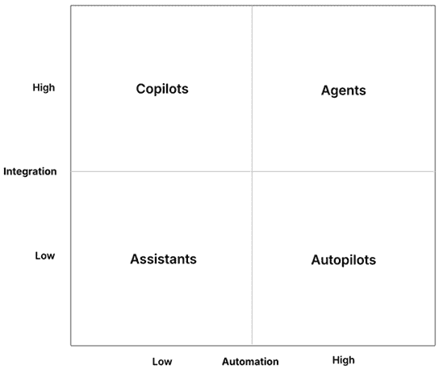
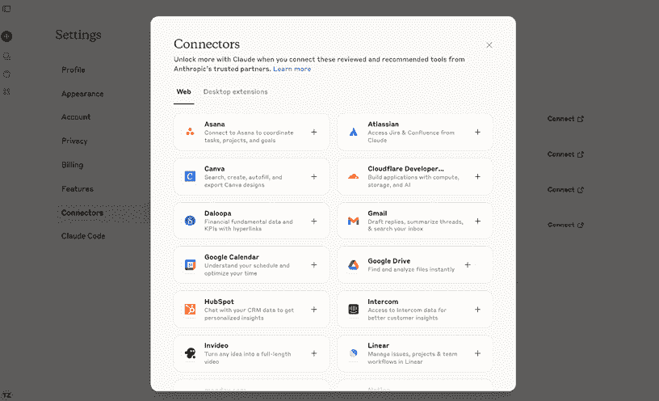
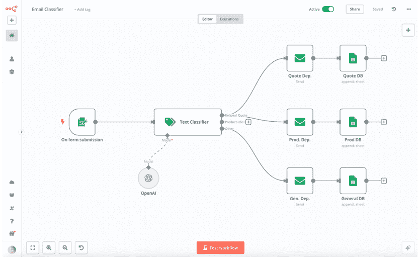
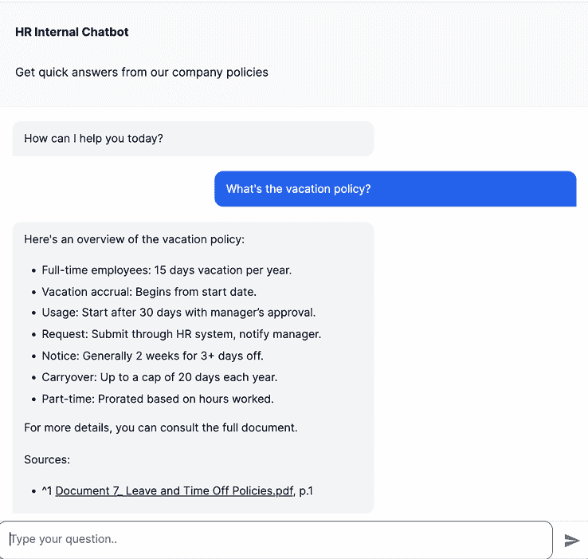
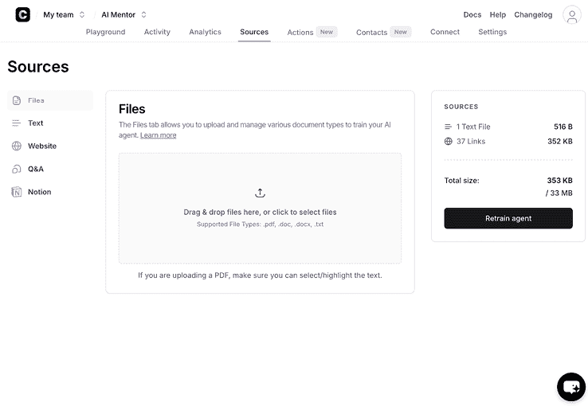
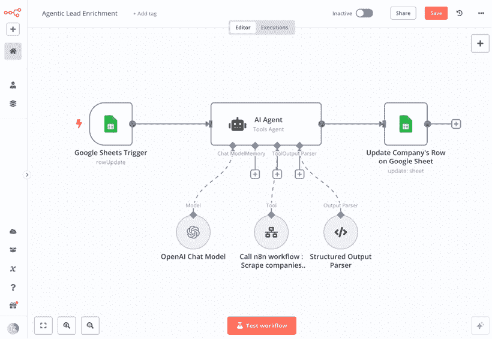
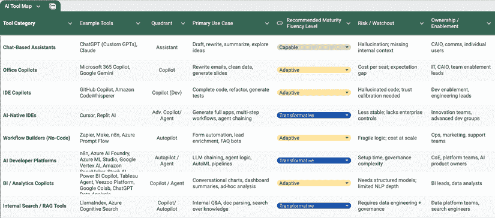
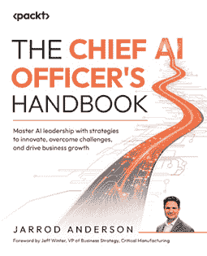
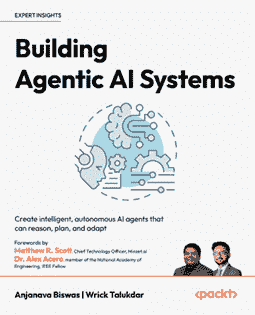

# 10

# 利用您的 AI 工具包

您已经走了很长的路。

您现在已经了解了现代 AI 的真正含义。您已经确定了高影响力的 AI 用例，设计了它们并优先排序，构建了工作原型，甚至探索了如何在您的组织中扩展这些原型。但仍然缺少一个主要部分——这并不是更多的理论。最终，是工具。不是那种需要六个月采购周期或跨职能 IT 协调的工具，而是团队可以立即开始使用以解决实际问题、测试真实想法和创造真实价值的工具。

在最后一章中，我们将转向实际赋能，向您展示如何将 AI 直接带入员工的双手、团队和业务单元。不是通过大规模的改革或太空跳跃赌注，而是通过日益强大、出人意料地易于访问的日常工具，这些工具旨在融入您组织现有的工作流程。

为了理解这些工具，我们将使用本书中早期介绍的一个框架：**集成-自动化（IA-AI）框架**——这是一个评估 AI 工具能做什么、如何融入您的运营以及您可以合理预期的回报率的实用视角。

在本章中，我们将涵盖以下主要主题：

+   重新审视集成-自动化框架

+   AI 助手：易于入门工具

+   共飞行员：深度集成到工作流程中

+   自动驾驶仪：业务流程自动化工具

+   AI 代理：自主任务处理

+   AI 工具采用框架

+   AI 工具地图：实用指南

# 重新审视集成-自动化框架

在我们开始之前，让我们快速回顾一下我们在*第六章*中讨论的 IA-AI 框架。这个框架根据系统集成和任务自动化的水平对 AI 项目进行分类。它定义了四个渐进式的用例类型，分布在四个象限中，如下所示：

+   **助手**是低集成度、低自动化工具，如 ChatGPT——非常适合写作、总结、构思或只是实验。

+   **共飞行员**深度集成但仍需要人工输入——想想微软 365 共飞行员在 Word 或 Excel 中的使用。

+   **自动驾驶仪**高度自动化但集成度较低——例如，一个 24/7 工作而不接触内部系统的聊天机器人。

+   **代理**是最先进的象限——它们结合了高集成度和高自动化，以最小的人为输入完成您业务中的全部任务。

让我们再次审视这个框架（*图 10.1*）。

图 10.1：集成-自动化框架

每个象限支持 AI 旅程的不同阶段。最好的组织并不是试图直接跳入代理复杂性——他们是有条不紊地排序工具，将它们与实际世界的成熟度相匹配，并在团队中逐步构建能力。

本章将带您了解：

+   探索哪些工具（以及忽略哪些工具）？

+   每个工具如何融入您的 AI 赋能路线图？

+   它们解锁了哪些能力，以及针对哪些人？

+   如何推出它们而不会压倒您的组织？

不论您是负责引导公司 AI 努力的个体贡献者，团队领导，还是指导企业 AI 战略的执行官，本章为您提供了**将 AI 付诸实践的实用蓝图**——从您团队明天可以开启的工具开始。

让我们从第一个象限开始：助手。

# AI 助手：易于入门的工具

如果您想在您的业务内部开始构建 AI 能力，这个象限是您开始的地方。

**AI 助手**是**低集成度**、**低自动化**的工具。这意味着它们不会触及您的内部系统，也不会代表您采取自主行动。但它们**确实**提供了几乎零摩擦的即时价值。这些工具是您在组织内构建 AI 素养的入门点——无需为每个小型用例单独调用 API 或开启 IT 工单。

有几种工具属于这个象限，例如**ChatGPT (OpenAI)** [`openai.com/`](https://openai.com/)**，**Claude (Anthropic)** [`claude.ai`](https://claude.ai)**，和**Poe (Quora 的多模型聊天包装器)** [`poe.com/login`](https://poe.com/login)**]。除了这些知名品牌，还有许多专注于不同领域的较小变体，例如**Langdock** ([`www.langdock.com/`](https://www.langdock.com/))，它非常重视数据主权和控制。许多大型企业也开始构建这些工具的内部版本。

这些工具通常围绕一个简单的聊天界面构建，例如 ChatGPT 推广的界面。

*图 10.2* 展示了 Claude 的聊天界面。

图 10.2：聊天助手界面（此处为 Claude）

您向助手提供提示，它们就会生成回应。这正是它们如此强大的原因——它们是*通才*。它们不需要固定的集成点或明确的工作流程。它们就在您需要它们的时候出现。

这些助手可以：

+   几秒钟内总结密集文档

+   重写并个性化电子邮件

+   发起标题、标题或产品名称的头脑风暴

+   起草职位描述、简报或提案

+   从杂乱文本中提取结构化数据

+   翻译文本或调整语气和复杂性

+   按需生成想法、大纲或演讲要点

这些任务会消耗时间，耗尽精力，很少能证明进行完整项目的合理性。但有了能干的助手，你可以卸下*精神上的重负*，更快地继续前进。对于几乎所有商业职能的个人来说，这就像拥有一个超快的研究助手、作家、分析师和项目合作者，全部都在一个标签页中。例如，销售经理使用 ChatGPT 来撰写客户提案邮件的初稿，然后通过定制的 GPT 来检查语气和清晰度是否符合公司指南。原本可能需要相当努力的任务现在可以在显著更短的时间内完成——并且一致性更高。

这些工具开箱即用时不连接到您的内部系统，这几乎消除了采用的技术障碍。这正是它们作为第一步如此有效的原因。

## 为什么它们有效

助手的真正力量不在于它们能做什么，而在于它们所规范的内容。助手是通往 AI 流利的最容易的途径。它们做以下事情：

+   **鼓励实验**：无需设置或承诺——只需提问，看看会发生什么。

+   **创造即时生产力提升**：即使是单个提示也能节省一个小时。

+   **民主化 AI 的使用**：无需培训。任何会使用搜索栏的人都可以使用 AI 助手。

+   **养成习惯**：一旦人们获得一次胜利，他们就会继续回来——而这种一致性会积累动力。

一旦一些团队成员开始定期使用通用 AI 助手，其他人也会效仿。你会注意到人们：

+   向同事请求提示模板

+   比较不同模型之间的输出质量

+   创建他们自己的内部 GPT 或工作流程

+   分享节省时间或改进草稿的成果

这就是小型*AI 习惯*的开始，人们会建立自己的直觉，了解何时将任务委托给 AI，何时信任它，何时完善它。这是 AI 流利的基础。

这些工具也激发了自下而上的创新。与自上而下的软件推广不同，助手让好奇的人可以按自己的方式探索。通常，这会导致意想不到的过程改进或原型想法，这些想法从战略手册中是永远不会出现的。在成熟的公司中，一些最有价值的 AI 用例并非始于自上而下的倡议，而是始于一位员工使用 ChatGPT 和一个共享提示库巧妙地创造的一个解决方案。我看到了一个特别引人注目的例子，其中一家领先的德国媒体公司的两位编辑开始收集用于日常任务（如改进标题、创建文章摘要或编写预览文本）的有效的提示，并与同事分享。现在，这些提示的最佳版本以**文章 AI 工具**的形式被整个组织中的数千名编辑使用，迅速成为不可或缺的日常伴侣。而且这些助手并没有停滞不前。特别是在 ChatGPT 和 Claude 等主要平台上，新功能正在快速推出，例如 ChatGPT 中的任务（[`help.openai.com/en/articles/10291617-tasks-in-chatgpt`](https://help.openai.com/en/articles/10291617-tasks-in-chatgpt)），这允许您安排提示自动运行（例如，每天早上跟踪新闻提及）。另一方面，Claude 专注于推出大量连接器（[`www.anthropic.com/news/connectors-directory`](https://www.anthropic.com/news/connectors-directory)）到 Jira、Confluence 或 Google Drive 等工具，以及利用他们的**模型上下文协议（MCP）**添加自定义连接器的一种便捷方式。*图 10.3*显示了 Claude 使用其连接器集成多个工具。

图 10.3：Claude 中的连接器，用于更深入的集成

这意味着这个象限的一些经典限制——手动复制粘贴、缺乏上下文、集成有限——开始逐渐消失。虽然助手永远不会完全取代更嵌入式或自动化的解决方案，但它们正迅速成为通往这些解决方案的强大桥梁。

在您推出人工智能助手之前，您需要引入支持机制，建立规则和护栏，以确保它们的安全和有效使用。让我们看看您如何做到这一点。

## 人工智能助手集成的组织考虑因素

尽管人工智能助手易于采用，但它们仍然受益于轻微的治理。这包括：

+   **使用指南**：提供清晰的“可做与不可做”清单。例如，不要粘贴敏感数据。可以使用它来改进草稿或总结复杂材料。

+   **提示库**：创建针对您团队定制的模板或示例提示（例如，“使用金字塔原理框架为董事会会议构建这个演示”）。

+   **精选访问**：一些组织选择集中管理登录或许可证（例如，ChatGPT Pro 账户）以跟踪使用情况并简化预算。

+   **轻量级赋能**：进行现场演示、简短的工作坊或办公时间。即使是 15 分钟的用例演示视频也能帮助将无意识或怀疑的用户转变为好奇的用户。

这里的关键原则是轻量级。今天，每位员工都可以通过他们的个人手机或浏览器访问 ChatGPT。你施加的摩擦或限制越多，员工就越有可能默认使用他们的个人版本——这通常被称为**影子 AI**，这是一个从*影子 IT*借用的术语，其中员工在没有组织批准或治理的情况下带来自己的 AI 工具。而影子 AI 正是你想要避免的。这不仅是为了数据隐私，还因为它将使用与组织学习脱节。你不仅希望人们使用 AI，你还想了解他们是如何使用 AI 的，并帮助他们随着时间的推移变得更好。这改变了文化对话，从“*我们能使用 AI 吗？*”转变为“*我们如何使用？*”。

## 领导力影响

AI 助手可能最初是单个工具，但它们更广泛的影响在很大程度上取决于领导者的反应。

对于部门负责人和团队领导，目标不是微观管理使用，而是引导。鼓励团队分享他们最喜欢的提示，突出节省的时间，或举办非正式的“提示星期五”，让员工演示巧妙的使用案例。这从底层建立动力。

对于高管——尤其是 CAIO、CDO 或数字化转型领导者——AI 助手是早期表明文化变革的机会。不是通过大胆的声明，而是通过小规模的赋能行为：

+   分享你个人发现有用的提示。

+   转发一份带有注释的文档：*用 Claude 总结了一下——出乎意料地好*。

+   在团队检查中询问“*这些天你在用 ChatGPT 做什么？*”。

这些微小的信号很重要。它们表明 AI 不仅被容忍，而且你正在积极邀请员工加入这一旅程。当领导者将 AI 工具视为工作的一部分（而不仅仅是作为一项宏伟计划或风险因素）时，这给了其他人同样的权利去做同样的事情。

接下来，我们将探讨第二个象限：协作者——直接嵌入你现有生产力应用的 AI 工具。

# 协作者：深度集成到工作流程中

由于助手通常存在于浏览器标签中，**协作者**则存在于你整天使用的工具中。他们将一层智能带入熟悉的环境——你会在你的文档、表格、收件箱、笔记本和会议中直接找到协作者。这就是它们如此强大的原因：它们已经存在于工作发生的地方。

然而，协作者是被定义为相对被动的。他们建议，有时甚至主动，但他们不会代表你采取行动（我们很快会谈到另一个象限）。对于协作者来说，人类不仅参与其中，而且处于驾驶员的位置。

你现在可能已经看到了一些：

+   **Microsoft 365 Copilot** 可以撰写会议摘要或将您的 500 字更新重写为老板可能会阅读的内容。

+   **Google Gemini** 在 Gmail 中弹出，带有“*帮助我写…*”按钮。

+   **GitHub Copilot** 建议代码，注释它，或在你浪费 15 分钟之前捕捉到那个缺失的大括号。

深度集成使 Copilot 能够在上下文中茁壮成长。它们通常知道你现在正在做什么：

+   在 **Excel** 中，您可以说，“*将其转换为瀑布图*”，它就会自动构建。

+   在 **Outlook** 中，您可以突出显示一封电子邮件并提示，“*告诉珍妮我更喜欢选项 2*”，它将知道从之前的电子邮件中 *选项 2* 的含义。

+   在 **Docs** 中，您可以添加新行并说，“*总结一下结论*”，Copilot 已经阅读了此文档中的所有内容。

+   在 **PowerPoint** 中，您可以上传产品简报并获得 10 张幻灯片 - 在您的自定义 **企业形象**（**CI**）中。

+   在 **VS Code** 中，您可以说“*在这里调用 weather_forecast 函数*”，Copilot 就知道这个函数期望哪些参数。

下表为您提供了一个受欢迎的 Copilot 列表，它们的典型用户表面以及它们添加的价值：

| **套件/工具** | **典型表面** | **它添加了什么** |
| --- | --- | --- |
| Microsoft 365 Copilot | Outlook、Word、Excel、PowerPoint 和 Teams | 起草回复、重写段落、构建数据透视表和自动生成幻灯片 |
| Copilot Studio/Power Automate | 低代码画布 | 构建您自己的特定领域聊天或表单机器人，并连接到 Dataverse 或 SharePoint |
| Google Workspace + Gemini | Gmail、Docs、Sheets、Slides 和 Meet | “帮助我写…” 按钮、数据清理助手、幻灯片主题和通话记录 |
| GitHub Copilot | VS Code 和 JetBrains IDEs | 预测下一行，生成测试，解释代码，并建议重构 |
| Google Colab (Gemini 窗格) | Jupyter 风格笔记本 | 内联代码生成、单元格解释和一键数据清理步骤 |

表 10.1：比较受欢迎的 Copilot

这些工具共同将生成式 AI 带到熟悉的工作表面上，而不强迫用户进入新环境。

## 为什么它们有效

Copilot 消除了我们与助手一起使用的许多复制粘贴工作，并使 AI 增强的工作流程更加无缝。当正确使用时，Copilot 对于已经使用 Microsoft 365 或 Google Workspace 等平台并具有内置 Copilot 集成的组织来说可以非常有效。这扩展了现有工作流程，无需任何更大的行为改变，并满足用户当前的需求，使 AI 的采用更加平滑且不那么令人生畏，而不是要求人们学习新平台。

然而，让我们谈谈期望，因为这是许多团队出错的地方。

当副驾驶推出时，我听到的最常见的反馈是“这就是全部吗？”人们通常期望的是更接近魔法按钮的东西，而不是一个有用的推动。这是公平的。尽管有大胆的市场营销和炫目的演示，但大多数副驾驶的互动出奇地……安静。它们不会重写您的整个电子表格。它们不会交付最终产品。它们所做的只是提供一个更快的起点、一个更智能的建议或一个更干净的草稿。

这不是失望，这正是重点。副驾驶不会为您做工作。它们是在帮助您使工作更顺畅。一旦您习惯了这一点，就很难回头了。

现在让我们来谈谈在您的组织中推出副驾驶（copilots）之前需要考虑的关键因素。

## 组织考虑因素

尽管副驾驶很方便，但它们并不总是即插即用。因为它们触及敏感系统并嵌入到核心业务流程中，它们需要深思熟虑的推广和管理：

+   **许可和成本预期**：例如，Microsoft Copilot 可能是按用户每月计费，通常比标准的 Microsoft 365 许可证贵得多。许多组织在更广泛的推广之前，会从有限的试点开始以评估投资回报率。

+   **数据访问控制**：这些工具可以访问用户可以访问的一切——共享驱动器、收件箱和日历。审查默认可访问的文档和系统至关重要，特别是如果副驾驶生成的输出可能会暴露机密信息。

+   **培训和赋能**：大多数副驾驶用户并非因为功能不足而失败，而是因为期望不明确。简短的演示和快速启动包可以显著提高采用率和感知价值。

+   **性能预期**：这些工具功能强大，但并非魔法。团队需要了解副驾驶模型的优势和局限性。例如，M365 副驾驶在底层数据结构良好时可能难以处理细微的 Excel 分析。

+   **供应商锁定**：另一个需要考虑的维度是供应商锁定的风险。许多公司选择使用他们已经使用的平台的副驾驶集成，然后就把 AI 集成当作完成了。然而，副驾驶应该被视为一个起点，而不是终点。对于价值较低的流程，这里那里的一些复制粘贴工作就足够了。对于更专业或更高级的流程，高级用户通常仍然更喜欢更高程度的定制或自动化，并且减少人工介入。但在我们讨论这些之前，让我们先了解一下副驾驶对领导力的影响。

## 领导力影响

业务领导者在他们团队中副驾驶的推广和实施中扮演着至关重要的角色——这个角色远不止是批准额外许可证的预算。

与通用助手不同，副驾驶是按照设计嵌入到您的流程中的，这意味着它们有可能加速实际业务流程。但只有当您决定谁可以访问、如何推广以及在哪里实际使用时，这一点才成立。

这不是“打开它，让每个人自己弄清楚”的情况。Copilot 可以做很多事情 - 但它们所做的并不都是同等有价值的。例如，Microsoft Copilot 在 Outlook 中可以撰写完整的电子邮件回复。但你的销售团队真的应该用它来回复客户吗？可能不是 - 至少在没有监督的情况下不应该。在这种情况下，一个匆忙生成的 AI 电子邮件可能会损害信任，而不是节省时间。

一个更好的领导举措可能是定义在你的组织中 Copilot 是用来做什么的：

+   在 Outlook 中，用它来起草内部更新，而不是外部沟通。

+   在 Excel 中，用它来发现趋势或清理数据，而不是构建最终的预测。

+   在 Word 中，用它来重构草稿笔记，而不是从头开始生成提案。

领导者应该清楚地传达这些期望。不是因为人们需要手把手地教，而是因为清晰性推动更智能的采用。

同样重要的是：尽早决定**谁将首先获得 Copilot**。你不需要一个完美的推广计划 - 但你需要一个战略性的计划。优先考虑高杠杆角色：

+   销售运营团队深陷于预测表格中。

+   策略分析师在处理幻灯片和 Excel。

+   内部沟通或人力资源部门起草公司范围内的更新。

给他们早期访问。设定一个时间框架（例如，8 周）。然后，收集反馈：通过测量获得 Copilot 访问权限的类似团队和没有访问权限的团队之间的性能来量化，或者通过调查试点参与者来定性。不要只是问，“你喜欢它吗？”而是：

+   它实际上取代了什么？

+   你信任它做什么？

+   什么仍然感觉是手工的？

+   这值得额外的费用吗？

这有助于你区分新事物和真正的投资回报，并为基于实际工作流程的更广泛推广奠定基础，而不是基于假设。

对于数字领导者、CAIO 或转型官员来说，Copilot 也是你组织数据准备性的早期试金石。Copilot 的一个隐藏价值是它们揭示了你的内部知识薄弱之处。如果一个 Copilot 无法生成好的提案，因为你的材料散布在 15 个文档中且没有一致性，那不是工具的错 - 这是对文档债务的洞察。

将 Copilot 不仅视为工具，而且视为知识工作的可重复使用的构建块的领导者将看到真正的回报。这就是复利价值开始的地方。

现在，让我们看看下一个象限：自动驾驶仪 - 任务不仅更容易完成，而且开始自行完成。

# 自动驾驶仪：商业工作流程自动化工具

如果 Copilot 能帮助你工作更快，**自动驾驶仪**旨在通过让系统接管整个任务来帮助你工作更少。

自动驾驶仪工具是**高自动化**和**低集成**：它们可以用最少的 human input 运行流程，但并不一定位于你的日常应用程序内部。相反，它们通常在后台运行，就像一个数字运营团队在安静而一致地处理重复性工作。

这是业务流程自动化与人工智能相遇的象限。您不必提示工具帮助您重写某些内容，而是可以自动化整个内容工作流程——例如，在 CRM 中监听新的销售线索，从电子邮件中提取公司名称，并根据这些数据生成个性化的跟进。虽然自动驾驶可以完全从头开始构建，但这是无代码工作流程构建者大放异彩的领域。最受欢迎的例子包括：

+   **Zapier** ([`zapier.com`](https://zapier.com)) 是无代码自动化工具的品类之王。提供最多的集成，并连接常见的 SaaS 集成（例如，*当在 Typeform 中提交表单时，发送 Slack 消息并写入 Google 表格*）。

+   **Make**([`www.make.com/`](https://www.make.com/)) 与 Zapier 类似，但提供更简单的 UI 和更具竞争力的定价模型，集成数量略少。

+   **n8n** ([`n8n.io`](https://n8n.io)) 是一个支持 AI 逻辑和代理的开源替代品，具有可脚本化的流程。

查看图 10.4 中的 n8n 支持票务分类工作流程。

图 10.4：n8n 中的 LLM 驱动的票务分类工作流程

这个分类工作流程是经典**无代码工作流程**与人工智能能力交互的一个很好的例子。工作流程从左到右执行。在这种情况下，工作流程在网站表单提交时触发。在第二步中，表单内容被 AI 文本分类器解析，并向 LLM 发送提示——在这种情况下，来自 OpenAI。LLM 的结果是分类，可以是三个支持票务类别之一。n8n 根据内容路由表单，将其转发到相应的电子邮件地址，并在支持票务数据库中更新记录。

虽然详细讨论这些工具超出了本书的范围，但以下表格为您提供了简要的概述和比较：

| **工具** | **成立时间** | **优势** | **局限性** |
| --- | --- | --- | --- |
| Zapier, San Francisco, USA | 2012 |

+   7,000+ 集成

+   简单的 UX 和稳定性

+   强大的错误处理

|

+   规模化时昂贵

+   开发者扩展性弱

+   有限的分享/协作

|

| Make, Prague, EU (Celonis 的一部分) | 2012 |
| --- | --- |

+   比 Zapier 便宜

+   非技术用户的视觉编辑器

+   支持导入/导出

+   GDPR 合规性（欧洲提供商）

|

+   2,000+ 集成

+   没有原生代码块

|

| n8n, Berlin, Germany | 2019 |
| --- | --- |

+   可自托管，开源版本可用

+   原生 Python/JS 脚本

+   适用于 AI 集成

+   GDPR 合规性（欧洲提供商）

|

+   较小的集成库

+   更技术化的界面

|

| Microsoft Power Automate, Redmond, USA | 2019 | 完全集成到 Microsoft 生态系统 |
| --- | --- | --- |

+   供应商锁定风险

+   学习曲线陡峭

|

表 10.2：流行无代码平台的比较

当 Zapier、Make 和 n8n 等工具最初作为通用自动化平台起步时，它们越来越多地拥抱人工智能集成以保持相关性。这些平台现在支持从基本的 LLM 操作到更智能的人工智能驱动的工作流程。

但还有另一类工具——那些以人工智能为基础构建，而不是作为增强的工具。

这些是**人工智能开发平台**，从头开始构建、部署和运行人工智能驱动的流程、应用程序和代理（我们稍后会讨论）。每个主要的云服务提供商都有自己的这些人工智能平台版本。以微软的 Azure 产品为例，它是那些已经在微软生态系统中投入的企业的一个受欢迎的选择：

+   **Azure AI Foundry**([`ai.azure.com/`](https://ai.azure.com/))：一个中心枢纽，让您可以在一个地方构建由通用人工智能（GenAI）驱动的应用程序，例如定制的共飞行员或面向客户的聊天机器人。

+   **Azure Machine Learning Studio**([`azure.microsoft.com/en-us/products/machine-learning`](https://azure.microsoft.com/en-us/products/machine-learning))：更专注于传统的机器学习和 AutoML 工作流程——例如客户流失预测、需求预测或回归建模。

+   **其他云服务提供商**提供类似的 AI 套件，例如 Google Cloud 上的 Vertex AI ([`cloud.google.com/vertex-ai`](https://cloud.google.com/vertex-ai)) 和 AWS 上的 SageMaker ([`aws.amazon.com/sagemaker`](https://aws.amazon.com/sagemaker)/)。

在主要云服务提供商之外，还有越来越多的轻量级、SaaS 友好的通用人工智能平台，针对特定的领域或用例。以下是一些值得注意的平台：

+   **Chatbase** ([`www.chatbase.co/`](https://www.chatbase.co/))：让您能在几分钟内将文档或网站转换为聊天机器人界面。特别适用于机器人入职、内部帮助台或可搜索的知识库。

+   **Harvey AI** ([`www.harvey.ai/`](https://www.harvey.ai/))：专注于法律文件和合同工作用例的人工智能平台。附带集成的流程构建器。

+   **Synthesia** ([`www.synthesia.io/`](https://www.synthesia.io/))：使用通用人工智能从文本输入生成基于头像的视频。广泛用于自动化培训、入职或营销的视频内容。

这样想：如果 Zapier 和 n8n 是添加了人工智能的自动化平台，那么像 Azure AI Foundry 这样的工具则是添加了自动化的人工智能平台。SaaS 工具如 Chatbase 和 Harvey 已经为您预先构建了许多东西，针对特定的用例，并允许（通常是有限的）定制。

您选择哪个取决于您团队的技术深度、基础设施需求以及更广泛的目标。但它们都指向同一个方向：从*人工智能作为助手*到*人工智能作为系统*的转变。然而，这些工具通常不会立即深入到您的 IT 系统中。您通常可以从文件上传或 webhook 开始，随着项目的进行逐步构建集成。

我的建议是选择一个平台，让您能够快速测试（并可能扩展）在助手形式中发现和验证的用例。这可能意味着引入一个无代码的工作流程构建器，如 n8n，扩展您已有的 Zapier 许可证，或者为您的开发者提供访问 AI 平台，如 AI Foundry 的权限，这完全取决于您的组织。快速访问一个多功能平台的可能性比工具本身更重要。拥有一个中心平台的好处之一是您可以快速测试与特定领域供应商解决方案（如 Harvey）相比，自定义集成表现得多好（或是否可行）。最终，这又是一个是买还是做的决定。如果您想深入了解这一点，我写了一篇关于 AI 是买还是做的文章：[`blog.tobiaszwingmann.com/p/ai-make-vs-buy`](https://blog.tobiaszwingmann.com/p/ai-make-vs-buy)。

那么，这些自动驾驶仪在哪里呢？你可能已经熟悉一些典型的流程自动化用例：自动发送电子邮件、路由表单数据，以及在不同系统之间同步数据。但是，将 AI 加入其中可以显著扩大其价值。您可以使用 AI 来增强多个任务，使自动化更好、更便宜、更快，或者只是更具可扩展性。以下是一些例子：

+   **客户入职**：解析新客户提交的文件，使用 LLM 提取相关元数据，填充内部系统，并通知账户经理。

+   **内容再利用**：监控 Google Drive 文件夹中的新内容，使用 AI 提取见解，生成 LinkedIn 帖子和摘要，并在 Buffer 或 HubSpot 中排队。

+   **潜在客户评分和丰富**：当潜在客户进入您的 CRM 时，使用 LinkedIn 的数据对其进行丰富，使用 LLM 分析职位名称，并根据关键词将其分配到正确的销售流程。

+   **内部报告**：每周总结支持工单数据，并在 Slack 频道中发布一份简单的趋势报告。

+   **调查分析**：使用 LLM 对客户调查中的自由格式反馈进行分类，并标记紧急问题。

一个经典的自动驾驶用例是一级支持聊天机器人 - 一个自动处理您网站上常规客户问题的 AI 系统，就像一个更智能、更互动的常见问题解答。

有几种方法可以构建这个：

+   使用 **n8n** 创建一个自定义的由 LLM 驱动的聊天机器人，该机器人连接到您的知识库并通过 Web UI 运行。这给了您控制权，但需要手动准备数据。

图 10.5：使用 n8n 构建的简单 HR 聊天机器人自动驾驶仪

+   使用 **Azure AI Foundry** 构建一个自定义聊天应用，该应用连接到企业数据源和其他 Microsoft 应用程序。

+   使用垂直平台如 **Chatbase** 在几分钟内启动聊天机器人 - 只需上传一些 PDF 文件或链接您的帮助中心，它就会立即生成一个可用的机器人（*图 10.6*）。

图 10.6：用于向 Chatbase 添加文件的界面

每种方法都自动化了相同的任务——处理常见问题，无需人工参与——但在控制、速度和集成之间有不同的权衡。

正是自动导航器在这里大放异彩：它们易于引入，灵活适应，强大到足以将一次性胜利转变为始终在线的系统。无论您是从拖放式聊天机器人构建器开始，还是从完全定制的流程开始，这些工具都使得在不每次都调用 IT 的情况下自动化实际工作成为可能。

## 为什么它们有效

自动导航器不仅节省时间。它们改变了工作发生的**方式**——通过将临时手动任务转变为可扩展的无手操作工作流程。以下是它们为何能够持续存在的原因：

+   **从小处着手**：许多工作流程都是从单个提示或一次性任务开始的。使用自动导航器工具，这种初始的成功可以转化为只需最小努力即可重复的自动化流程。

+   **释放思维空间**：魔法不仅仅是速度——它是专注。自动导航器处理无聊、脆弱或无脑的任务，这样您的团队能够专注于真正重要的事情。

+   **它们创造杠杆作用**：小型工作流程可以节省几分钟。但当它们每天在五个团队中运行 50 次时，您开始挽回几天的时间。

+   **无需规模即可扩展**：这里的大多数工具都是为了商业用户而构建的——不仅仅是开发者——因此，您无需扩大您的 IT 团队来扩大您的自动化足迹。

与协助和提供建议的副驾驶员不同，自动导航器采取行动。它们不会等待您点击**开始**；一旦设置好，它们就会全天候运行、路由、转换、更新、总结或聊天。

这就是为什么先从助手或副驾驶员开始是明智的：它们帮助您了解 AI 增加价值的地方，它失败的地方，以及自动化安全的地方。一旦这种理解到位，自动导航器就是合乎逻辑的下一步——但它们需要更多的结构和监督，因为当软件开始自行做事时，就需要更多地考虑所有权、责任和治理。

## 组织考虑因素

由于它们的自动化程度很高，通常由数据事件或系统活动触发，自动导航器需要比助手或副驾驶员更多的监督：

+   **定义自动化边界**：并非每个流程都从完全自主中受益。例如，将支持票务路由到正确的团队可以安全地自动化，但自动发送退款批准而不进行人工监督可能会使您面临财务或合规风险。一种良好的做法是将流程分类为**可安全自动化**、**需要人工介入**和**永不自动化**。一些组织甚至为新工作流程进行**自动化审查**，就像轻量级的代码审查一样。

+   **审计和日志记录**：确保自动化——尤其是涉及 LLM 的自动化——被跟踪。你希望了解什么被生成、何时生成以及为谁生成。当工作流程在后台运行时，不可见性可能会迅速变成一种负担。想象一下，一个每周对数千份调查回复进行分类的自动驾驶系统：如果分类逻辑出现偏差或损坏，你可能直到基于错误数据做出重大决策时才注意到。适当的审计轨迹——记录哪些工作流程运行了，它接收了什么输入，以及生成了什么输出——允许你回溯和故障排除。在受监管的行业（如医疗保健或金融）中，这些日志甚至可能是强制性的。

+   **成本控制**：一些自动化，尤其是具有高频触发器或复杂 AI 调用的自动化，很容易产生令人惊讶的账单。例如，每当在频道中发布 Slack 消息时，就会调用 LLM 的 Zapier 工作流程可能会每周产生数千次调用。考虑批处理（例如，每小时处理消息而不是即时处理）、缓存（存储常见输出以避免重复的 API 调用）或使用上限（在每日阈值后停止工作流程）等技术，以保持成本可预测。对于可能具有高工作负载的工作流程，在部署新的自动化之前，考虑在小型样本上运行成本模拟，以估计其财务影响。

+   **影子自动化风险**：就像*影子 IT*一样，员工很容易开始构建不受监控的工作流程。虽然这显示了主动性，但也创造了风险。为了在创新与治理之间取得平衡，你可能会考虑建立一个工作流程注册表，让员工记录他们的自动化。其他人创建了*自动化小组*或内部实践社区，让高级用户分享模板、获取反馈并避免重复造轮子。

**注意事项**

不要过度依赖 AI 来优化工作流程。仅仅因为你可以使用大型语言模型（LLM）并不意味着你应该这样做。许多自动化步骤更适合用基本逻辑（例如，if/then，正则表达式，查找表）来处理。将 AI 保留在需要判断、细微差别或文本转换的步骤上。

## 领导力影响

自动驾驶系统通常源于*草根创新*——一位高级用户在周末将某些东西连接起来并与团队分享。但领导层有很大的机会将这些自下而上的突破系统化。

作为领导者，你的角色是：

+   **发现可重复的胜利**：看看一个团队自动化了什么，然后问，“还有谁可以用到这个？”

+   **投资重用**：帮助团队将单个工作流程转化为可共享的模板或内部库。

+   **支持工具访问**：提供 n8n 或 Make 等无代码工具的许可证，并授权非工程团队安全地使用它们。

+   **创建反馈循环**：询问团队正在自动化什么，什么仍然是手动操作，以及上周什么出了问题。这创造了一个健康的自动化文化——一个人们构建、改进和分享的文化。

最重要的是，规范化自动化思维模式。当创建一个新流程时，问自己*这个可以自动化吗？*不是为了避免责任，而是确保你最聪明的人不会陷入重复性工作。

对于数字顶级领导（CAIOs、CTOs 或运营负责人），自动驾驶仪提供了独特的 AI 赋能视角。它们在战略和执行之间架起桥梁——让你的组织可以实验、学习和优化，而无需等待集中路线图或重大 IT 投资。

事实上，你的一些最高回报率的 AI 用例可能不是来自 LLM 研究或供应商合作，而是一个巧妙的自动化，将 20 分钟的任务变成每天 2 秒的任务。

接下来，我们将进入最后一个象限：代理——在这里，AI 不仅自动化工作，而且开始代表你决定、适应和行动。

# AI 代理：自主任务处理

如果自动驾驶仪自动化任务，**代理**则更进一步：它们决定、行动、适应，甚至随着时间的推移而改进。这就是 AI 不再是被动助手，而成为运营行动者的地方。

代理结合了深度系统访问和自主执行。它们不会等待手动指令。它们根据目标、数据或触发器采取行动，并且可以在工具、部门和决策之间执行多步骤工作流程。它们不协助工作，而是运行工作。

你可能已经看到了这个的早期阶段：

+   一个 AI 系统，可以总结会议、标记行动项，并在相应项目中自动创建 Jira 工单。

+   一个聊天机器人，不仅像自动驾驶仪一样回答常见问题，还能验证用户身份、重置密码、获取运输详情，以及升级支持工单。

+   一个销售代理，负责研究潜在客户、撰写个性化的电子邮件，并更新 CRM 记录。

大多数代理 AI 工具本质上依赖于以下四个构建块：

+   **LLMs**用于推理和决策。

+   **工具或函数调用**框架，用于与真实世界系统交互（例如，OpenAI 函数，LangChain）。

+   **记忆**或任务历史记录，以便在步骤之间访问知识和保持上下文感知。

+   **自动化运行时**用于协调工作流程。

这使得代理非常强大，但也非常复杂。它们需要仔细设计、测试、监控，并且通常需要 AI 和传统逻辑的结合才能可靠地执行。因此，它们通常不是最佳起点，正如我们之前讨论的那样。

**代理工具**并非适合所有人。但如果你的团队具备基本的脚本编写技能或技术人员，这些工具可以帮助你部署自己的代理。这些工具不是大多数团队开始的地方。但对于拥有技术人员或准备扩展的先进原型组织，它们提供了真正的杠杆。你通常可以在上面看到自动驾驶仪的 AI 无代码工具上构建 AI 代理。在这种情况下，代理只是你工作流程中的一个单独节点。

这里有一个来自**n8n**中潜在客户丰富化工作流程的例子，其中由 AI 代理节点完成繁重的工作，可以使用来自 OpenAI 的 LLM 来控制网络爬虫工具，为一家公司添加相关信息，然后将输出存储在 Google Sheets 文档中：

图 10.7：n8n 中用于潜在客户丰富化的 AI 代理

正如你所见，这个工作流程看起来相对简单，因为我们不需要连接复杂的规则，比如要抓取哪个网站，如果网站没有提供或者网站上没有找到相关信息会发生什么。这些都是代理根据我们给出的提示来处理的事情。

除了在现有的工作流程自动化工具之上构建，另一种构建 AI 代理的有效方法是使用更针对开发者的代理框架，例如 CrewAI([`www.crewai.com/`](https://www.crewai.com/))和 LangGraph ([`www.langchain.com/langgraph`](https://www.langchain.com/langgraph))。这些框架的优点是它们通常提供更多的可定制性，但它们通常不提供像 n8n 或 Zapier 这样的工具所提供的全面路由和自动化逻辑，这些工具在规模自动化工作流程方面拥有超过十年的经验。这就是为什么即使是简单的条件逻辑或基本事物，如 HTTP 请求，通常也必须手动编码。

**代理框架**如这些在需要并行运行多个代理的情况下特别出色——例如，一个多代理系统，其中一个*代理*进行研究，另一个生成摘要，第三个在发布前进行 QA 检查结果。最终，确定哪些部分更适合作为静态自动化，哪些应该由代理处理，这是学习旅程的一部分，通常涉及大量的试错。

## 当它们工作时

在这个象限中，真正的问题不是*他们为什么能工作*？其价值显而易见。如果你能够运行整个工作流程，确定步骤，选择工具，执行它们，无需人工干预即可即时适应，并且几乎零边际成本地完成，那么其优势不言而喻。这是运营的梦想：无需规模扩张，但实现自动化。在团队休息时也能进行的工作。

不，真正的问题是：代理实际上是在什么时候工作的？

在实践中，代理很难破解。它们比本书中任何其他类别的 AI 系统对工作流程的混乱、边缘情况、权限、上下文模糊性和工具访问性更敏感。

与生活在生产力工具内部的 Copilots 不同，或者与遵循清晰的**if-this-then-that**流程的自动驾驶仪不同，代理必须导航动态环境并做出实时决策——通常是在信息不完整或不一致的情况下。这种程度的自主性需要不仅仅是良好的技术。实际上，它需要所有扩展杠杆都到位，这是我们讨论过的*第九章*：

+   **人员方面：** 你需要真正负责代理流程的所有者，即使它跨越了公司壁垒。在他们周围，你需要一个团队，随时准备监控、优化和改进代理（见下文 AIOps）。将代理视为数字同事，而不是工具。

+   **流程**：你不能以瀑布式的方式规划代理，因为你永远无法预见到它们会遇到的所有边缘情况。代理将自行探索未知领域。这意味着敏捷交付 - 短周期、快速反馈循环和迭代 - 这样你就可以在它们以未预期的方式表现时快速适应。

+   **数据**：代理依赖于结构化、授权和可访问的数据，这些数据提供了足够的上下文以可靠地行动。不，启动一个 MCP 服务器并不能解决这个问题。数据成熟度是首要的；简单的连接器随后才会到来。

+   **技术方面：** 在将代理暴露于生产系统之前，提供安全的运行时环境 - API、连接器和沙箱环境。在这个阶段，可靠性、可观察性和安全措施是不可协商的。

+   **AIOps**：在所有 AI 解决方案类型中，代理需要最重的监控、日志记录和干预。如果你的团队之前从未发布过至少一个 Copilot 或自动驾驶仪实施，那么你可能还没有准备好使用代理。

最重要的是，你需要抵制将整个业务流程交给数字瑞士军刀并期待奇迹的诱惑。

大多数失败发生在团队要求代理过早、过多地执行任务，而这些环境尚未准备好的情况下。最好的代理擅长一件事。它们是通过以更简单、更高的人类在环参与度（如助手或 Copilots）的形式交付工作的 AI 解决方案而获得的能力。这将自然地告诉你哪些任务或工作流程适合更多的**AI 移交**。

在这个背景下，*代理工具*本身？坦白说，这是最容易的部分。

## 组织考虑因素

部署代理不仅仅是技术决策，它是一场组织变革。你正在赋予软件代表你的业务行动的权力。这改变了所有权、监督、问责制和信任的动态。

与增强人类用户的助手或 Copilots 不同，代理系统可以在没有持续监督的情况下运行。这意味着你需要将它们视为数字团队成员，而不是工具。它们需要政策、范围、升级路径和质量保证。

以下是组织必须做出的四个关键转变，以实现代理工具的运营化：

1.  **定义边界**：并非每个任务都应该自动化。并非每个工具都应该有权访问敏感系统。团队需要明确的指导方针，了解代理被允许做什么 - 以及人类输入不可协商的地方。这包括：

    +   哪些工作流程可以完全自动化，哪些可以部分由代理领导？

    +   当代理在继续之前应该请求人类确认吗？

    +   他们被允许访问或更新哪些数据源或系统？

就像为新员工设置访问权限一样考虑。你不会在第一天就给实习生无限制的数据库访问权限。你的代理应该受到同样的纪律约束。

1.  **实施安全网**：由于代理是自主运行的，它们需要内置的安全保障。这些包括：

    +   限制速率以避免垃圾邮件式地轰炸外部系统或过载 API。

    +   对输出质量进行限制（例如，验证生成内容是否符合业务规则）。

    +   当出现问题时采取的回退行为（例如，通知人类而不是无限期地重试）。

    +   在推广前进行隔离环境（沙盒中的代理测试）。

确保实施操作程序以监控和控制生产中的代理解决方案。

安全网让你有信心将你的代理从实验阶段推广出去，并赢得用户的信任。

1.  **确保可观察性**：与代理相关的最大组织风险之一是隐形。如果工作流程出现故障或行为异常，有人会注意到吗？有效的代理采用需要：

    +   对每个动作进行记录和审计跟踪。

    +   对代理逻辑和提示进行版本控制。

    +   对于运行时错误、决策分支或*边缘情况*，提供仪表板或警报。

没有可观察性，你就无法掌控——你只是在猜测。

1.  **建立所有权**：这是最容易被忽视的部分。每个代理都需要一个人类所有者。这个人需要：

    +   监控系统。

    +   审查并改进其行为。

    +   决定何时退役、再培训或升级。

没有明确的所有权，代理变成*幽灵进程*——没有人知道它们是如何工作的，为什么它们这样做，或者它们最后一次更新是什么时候。这是快速走向风险、失败或放弃的途径。成功使用代理的组织将它们视为活系统：它们会进化、适应，并需要关怀。

## 领导力影响

对于领导者来说，AI 代理既是强大的机会，也是对你数字成熟度的真正考验。为什么？因为代理不仅需要工具的推广。它们需要真正的文化转变。你要求团队信任一个做出决策的系统。你不仅引入 AI 作为增强剂，还作为业务流程的参与者。

这一切都改变了。

在代理驱动的环境中，有效的领导力看起来是这样的：

1.  **设定信任标准**：团队会反映你的态度。如果你不断质疑代理工具的可靠性，预期会出现广泛的犹豫。如果你过度吹嘘它们，预期会失望。但如果你公开探索代理适用和不适用的地方，你给人们提供了一个平衡、可用的操作手册。信任不是从技术开始的。它始于领导行为。

1.  **将迭代与完美正常化**：没有任何代理系统一开始就是完美的。目标不是构建无瑕疵的自主性 - 而是学习在您的环境中哪种自主性是有效的。领导者应该为团队创造心理安全感，让他们测试、迭代并随着时间的推移改进代理。这意味着奖励学习速度，而不仅仅是交付速度。问自己，*这个代理做对了什么？* *它在哪些方面遇到了困难？* *我们学到了什么？* 这将实验转化为改进 - 将失败转化为进步。

1.  **转变您的运营模式**：代理采用改变了工作完成的节奏。审批更快。任务被委派给工作流程，而不是个人。周转时间缩短。但如果你继续围绕这些新能力保留旧流程，你将扼杀价值。领导者必须重新构想团队结构和期望：

    +   能否围绕更高价值的监督重新设计角色？

    +   SLA 会因为自动化加快交付而改变吗？

    +   性能指标应该转向反映代理工作流程吗？

换句话说，不要只是将代理插入到您的组织中。为它们组织起来。最终，代理系统与其说是关于复杂的 AI，不如说是关于设计用于规模、弹性和自主性的工作流程。当您的团队不再思考*我能用这个工具做什么？*而是开始问，*这个工具能代表我做什么？*，您就进入了代理领域。

现在我们已经探讨了不同类别的 AI 工具 - 从入门级助手到高级自主代理 - 是时候考虑您的组织如何实际采用它们了。

# AI 工具采用框架

当您开始评估 AI 工具及其在您组织中的应用时，一个自然的问题就是：**您应该从哪里开始？**

本节提出一个框架，该框架提供了一个结构化的路径，用于评估您当前的 AI 工具景观，确定改进的机会，并将 AI 采用融入您更广泛的工具策略中。

而不是关注抽象的成熟度标签，这个框架将您的**AI 工具采用之旅**建立在直接影响日常工作的具体阶段上。

让我们详细探讨这些阶段：

1.  **诊断您的当前状态**：从您在路线图过程中检查的部门或产品开始，进行简单的自我评估。

    +   我们今天使用哪些工具 - AI 助手、副驾驶、自动驾驶仪或 AI 代理？

    +   有哪些行为或例子支持这一点？

    +   我们的盲点在哪里？

    +   根据我们的路线图上的用例，需要哪些工具？

这不需要过于正式。一个简短的研讨会、内部投票或部门负责人同步可以揭示诚实、有方向的见解。即使只覆盖 3-5 个关键领域，也可以揭示主要差距和机会。

目标不是完美；而是意识。最重要的是实现对您今天所处的位置的**共同理解**。

1.  **识别下一级举措**：一旦你知道每个团队的位置，定义提升**一个工具级别**将是什么样子：

    +   **从 AI 助手到副驾驶**：例如，支持代表从随意使用 ChatGPT 撰写电子邮件草稿转变为在他们的工单系统中嵌入副驾驶，建议回复和摘要。

    +   **从副驾驶到自动驾驶仪**：例如，支持团队开始自动化整个工作流程，如 AI 处理工单分类和路由，无需人工干预。

    +   **从自动驾驶仪到 AI 代理**：例如，重新思考支持模型，使自主 AI 代理从头到尾处理常见问题，仅将边缘案例升级给人类代表。

我建议用行为和结果来界定这些举措，而不是用流行语。你可以从以下问题开始：

+   我们能进一步自动化哪些流程？

+   我们能加速哪些决策？

+   AI 可以直接承担哪些任务？

+   业务的潜在影响是什么？

1.  **有目的地优先考虑**：并非每个团队成员都应该同时进步。使用该模型来优先考虑投资和支持将产生最大影响的地方：

    +   需求已经在哪里出现（人们进行实验，构建小型原型）？

    +   哪些手动流程正在造成重大瓶颈？

    +   领导层最开放于哪些变革？

关注下一阶段的 3-4 个**试点**领域。为他们配备正确的工具，跟踪结果，然后将学习成果扩展到其他领域。从*已经显示出 AI 熟练迹象并具有高运营影响*的单位开始（如支持或运营）。

1.  **将其转变为持续对话**：这个框架不是一个目的地——它是一段旅程。使用它来：

    +   按团队设定季度 AI 采用目标

    +   指导赋能和技能提升计划

    +   跟踪跨职能进展

    +   庆祝胜利（例如，*市场营销刚刚从副驾驶转变为自动驾驶仪！*）

随着时间的推移，这成为你用于 AI 成熟度的共同语言。

1.  **嵌入战略规划中**：最后，将 AI 的采用直接与你的业务目标联系起来。例如：

    +   如果你的目标是**减少招聘时间**，问：将招聘从助手转变为副驾驶对这个指标有什么影响？

    +   如果目标是**提高客户解决时间**，问：将支持从副驾驶转变为自动驾驶仪能解锁什么？

当工具采用成为你谈论**业务绩效**的一部分时，AI 就不再是副项目。它成为竞争力和战略的自然驱动者。

现在您已经看到团队在能力上的发展，让我们通过一个快速的工具参考来汇总所有内容，您可以使用它来支持这种增长。

# AI 工具地图：一本实用指南

每天都有新的 AI 工具推出——每天都有另一个悄然消失。

尝试跟踪所有这些是徒劳的。但在某些情况下，对整个格局的高层次了解有帮助，尤其是在你指导实验或支持使用实际工具的团队时。

因此，我创建了 AI 工具图，您可以在*图 10.8*中查看，并通过此链接下载（[`github.com/PacktPublishing/The-Profitable-AI-Advantage/blob/main/ch10/AI_Tool_Map.xlsx`](https://github.com/PacktPublishing/The-Profitable-AI-Advantage/blob/main/ch10/AI_Tool_Map.xlsx)）；随着工具的发展，这个工具图会不断更新。AI 工具图按功能分组不同的 AI 工具，显示它们在您的 AI 旅程中的位置，它们在集成-自动化 AI 框架的哪个象限中，突出实际用例，并标记需要注意的事项。

图 10.8：AI 工具图

将其视为您穿越炒作的捷径，这样您就可以专注于使用什么，何时使用，以及谁应该负责推广。

本节的目的在于向您展示如何将 AI 采用从以工具为先的思维模式转变为以意图和流畅性为先的方法。最成功的组织并不是那些追逐每一个新应用的组织，而是那些在各个职能中建立一致、团队级别的流畅性，从而推动真正的业务影响。使用上述框架，您可以指导进度并有意地选择工具，一步一个脚印。目标不是完美，而是可见的、共享的、战略性的向真正转型迈进。

# 摘要

您已经看到了框架。您已经研究了用例。您已经构建了原型并探索了如何扩展它们。

但最终，是工具将您的 AI 战略转化为可衡量的业务成果。不是因为它们是神奇的，而是因为它们是可用的。**今天**。

一些工具——如 ChatGPT 和 GitHub Copilot——可以带来快速、个人的成功。其他工具——如 n8n 和 Azure AI Foundry（或 Azure 上的服务生态系统）——则解锁了更多可扩展的自动化和系统级转型。

但它们都有一个共同点：只有在被赋予探索、执行和分享成功经验的人手中才能发挥作用。

不论是营销人员使用 ChatGPT 重写电子邮件，还是产品团队搭建一个由 LLM 驱动的助手，亦或是你的运维负责人在 n8n 中自动化报告，AI 已经从未来的概念转变为实际的功能杠杆。

获胜的公司不会是那些拥有最多工具的公司。它们将是那些学会了如何早期、频繁且在整个组织中有效地使用其中一些工具的公司。真正的优势不是令人印象深刻的科技堆栈。而是一个知道如何学习、适应和每天使用 AI 来构建的组织。

您不需要一个大型的发布。您只需要开始，并在前进的过程中构建您的路线图。因为 AI 转型并非从一场主题演讲开始。

它始于一个简单的提示，一个工作流程，以及一个愿意按下**运行**按钮的团队。

感谢您与我一同踏上这段旅程。我希望这本书能赋予您识别机会、优先考虑项目以及将 AI 扩展到您的业务中——并构建您的**盈利 AI 优势**。

# 请保持关注

要跟上生成式人工智能和大型语言模型领域的最新发展，请订阅我们的每周通讯 AI_Distilled，网址为 [`packt.link/8Oz6Y`](https://packt.link/8Oz6Y)。

[packt.com](https://packt.com)

订阅我们的在线数字图书馆，全面访问超过 7,000 本书和视频，以及帮助您规划个人发展和职业发展的行业领先工具。更多信息，请访问我们的网站。

# 为什么订阅？

+   通过来自超过 4,000 名行业专业人士的实用电子书和视频，节省学习时间，增加编码时间

+   通过为您量身定制的技能计划提高学习效率

+   每月免费获得一本电子书或视频

+   完全可搜索，便于快速访问关键信息

+   复制粘贴、打印和收藏内容

在 [www.packt.com](https://www.packt.com) 上，您还可以阅读一系列免费的技术文章，注册各种免费通讯，并享受 Packt 书籍和电子书的独家折扣和优惠。

# 其他书籍

您可能会喜欢

如果您喜欢这本书，您可能会对 Packt 的其他书籍感兴趣：

**《首席人工智能官手册**》

Jarrod Anderson

ISBN: 978-1-83620-085-7

+   作为首席人工智能官（CAIO）开发和执行 AI 战略，确保道德合规

+   从构思到部署掌握敏捷 AI 项目管理

+   通过案例研究应用确定性和概率性 AI 概念

+   设计和实现用于自主系统优化的 AI 代理

+   使用经过验证的设计原则创建以人为本的 AI 系统

+   通过数据隐私和模型保护措施增强 AI 安全性

**构建代理式人工智能系统**

Anjanava Biswas, Wrick Talukdar

ISBN: 978-1-80323-875-3

+   掌握生成式人工智能和代理系统的核心原则

+   了解 AI 代理如何在动态环境中运作、推理和适应

+   使 AI 代理能够分析自己的行为并改进

+   实现 AI 代理可以利用外部工具和规划复杂任务的系统

+   应用方法以增强人工智能的透明度、责任和可靠性

+   探索 AI 代理在各个行业的实际应用

# Packt 正在寻找像您这样的作者

如果您有兴趣成为 Packt 的作者，请访问 [authors.packtpub.com](https://authors.packtpub.com) 并今天申请。我们已与数千名开发人员和科技专业人士合作，就像您一样，帮助他们将见解分享给全球科技社区。您可以提交一般申请，申请我们正在招募作者的特定热门话题，或提交您自己的想法。

# 分享您的想法

现在你已经完成了《The Profitable AI Advantage》，我们非常想听听你的想法！如果你从亚马逊购买了这本书，请点击此处直接进入该书的亚马逊评论页面，分享你的反馈或在该购买网站上留下评论。

你的评论对我们和科技社区都非常重要，并将帮助我们确保我们提供高质量的内容。
