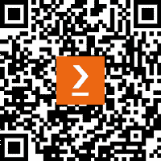

# *序言*

**人工智能** *(***AI***) 通常被认为是一种机器或计算机系统执行通常需要人类智能的任务的能力。无论你对人工智能的想象是什么——2001 太空漫游中的 HAL 9000、终结者中的阿诺德·施瓦辛格，还是星际迷航：下一代中的布伦特·斯宾纳扮演的数据——它可能只代表了该领域日益增长的能力中的一个或两个方面。

*直到最近，大多数人工智能技术都围绕着机器学习展开——本质上是一种应用统计学的自动化。如果你已经忘记了大学里的统计学课程，那么它基本上就是使用大量数据样本来预测未来的数据（例如，通过查看最近的家庭价格来预测未来的家庭价格）。然而，在过去的半年里，* **生成式人工智能** *(或简称**GenAI**) 突然崭露头角。生成式人工智能可能是过去一百年中创造的最关键的技术之一。这对个人和组织来说都是一个分水岭时刻，可能重新定义了什么是具有创造力——甚至* *甚至是思考* *的能力。*

*如果你一直生活在地下，那么生成式人工智能就是一些最疯狂的技术文化现象背后的力量，如 OpenAI 的 ChatGPT、Midjourney、Dall-E 和 Grok（以及其他众多商业项目）。生成式人工智能服务可以“创建”基于其训练数据的内容，这些内容类似于人们可以创造的事物。与需要花费几分钟或几小时来创作内容相比，许多生成式人工智能解决方案可以在几秒钟内返回响应。*

*一些最激动人心的用例围绕着内容摘要、以几乎类似人类的方式对内容进行推理、模式匹配、预测和分析。生成式人工智能还可以混合操作模式或上下文——例如，根据时间序列数据预测值，并为其编写叙述。*

*在这本书中，我们将探讨一些将不同类型人工智能的扩展能力与微软的 Power Platform 工具（包括 Power Apps、Power Automate 和* *Copilot Studio*）相结合的激动人心的方法。*

# *本书面向的对象*

*本书旨在为那些对探索和实验人工智能和自动化感兴趣，但可能在该领域没有丰富技术经验的人士而编写。这包括那些通常被归类为知识工作领域的专业人士，如商业决策者、销售人员、行政助理、业务发展经理、人力资源代表和* *商业分析师*。*

*本书的内容假设你对机器学习或人工智能概念没有任何了解（尽管这当然有助于理解一些更* *复杂的话题）。*

# *本书涵盖的内容*

*第一章*，*人工智能服务简介*，介绍了人工智能的一些基本概念。

*第二章*, 《配置环境以支持 AI 服务》，概述了激活订阅和启用环境中 AI 服务的必要步骤。

*第三章*, 《与 ChatGPT 对话》，介绍了与 ChatGPT 的交互。

*第四章*, 《使用 ChatGPT 和 Copilot 创建流程》，演示了如何使用 AI 协助创建 Power Automate 流程。

*第五章*, 《使用 Copilot 启动 Power App》，专注于 Copilot 通过对话界面帮助设计和修改基本 Power App 的强大功能。

*第六章*, 《使用情感分析处理数据》，展示了如何利用机器学习功能来分析文本，并根据积极、消极或中性的情感触发操作。

*第七章*, 《利用 Power Automate 和 AI 构建 PowerPoint 演示文稿》，探讨了如何使用 Power Automate 和 ChatGPT 根据从互联网获取的内容创建 PowerPoint 演示文稿。

*第八章*, 《使用身份验证构建活动注册应用》，展示了如何处理政府颁发的身份证明文件以验证注册者的身份，然后发送自动会议确认。

*第九章*, 《实现 AI 赋能的简历筛选器》，结合文档识别、实体提取和 GPT 服务来处理提交的简历，并评估其是否与特定职位描述相匹配。

*第十章*, 《使用 GPT 创建管理摘要》，演示了如何使用 GPT 生成文档的管理摘要并将其插入文档或演示文稿中。

*第十一章*, 《使用 AI 在 SharePoint 库中标记图像》，展示了如何使用 Azure 计算机视觉服务根据内容对图像进行分类，然后更新文档库中的描述和标签。

*第十二章*, 《创建基于生成式 AI 的聊天机器人》，探讨了新的 Copilot Studio 界面，用于创建可以通过 ChatGPT 和通过一组文档内容进行推理来提供答案的对话机器人。

*第十三章*, 《发布基于生成式 AI 的聊天机器人》，利用在第十二章中创建的对话机器人，并指导如何使机器人对最终用户可用。

# 为了充分利用本书

为了使您的学习体验更加丰富，我们推荐以下组件：

+   免费试用订阅的 Azure 租户([`azure.microsoft.com/en-us/free/ai-services/`](https://azure.microsoft.com/en-us/free/ai-services/))

+   OpenAI GPT 订阅([`www.openai.com`](https://www.openai.com))

+   Microsoft 365 试用订阅([`www.microsoft365.com`](https://www.microsoft365.com))

+   AI Builder 试用容量([`learn.microsoft.com/en-us/ai-builder/ai-builder-trials`](https://learn.microsoft.com/en-us/ai-builder/ai-builder-trials))

# 下载示例代码文件

你可以从 GitHub 下载本书的示例代码文件[`github.com/PacktPublishing/Power-Platform-and-the-AI-Revolution`](https://github.com/PacktPublishing/Power-Platform-and-the-AI-Revolution)。如果代码有更新，它将在 GitHub 仓库中更新。

我们还有其他来自我们丰富的书籍和视频目录的代码包，可在[`github.com/PacktPublishing/`](https://github.com/PacktPublishing/)找到。查看它们吧！

# 使用的约定

本书使用了多种文本约定。

`文本中的代码`: 表示文本中的代码单词、数据库表名、文件夹名、文件名、文件扩展名、路径名、虚拟 URL、用户输入和 Twitter 处理。以下是一个示例：“将下载的 `WebStorm-10*.dmg` 磁盘镜像文件作为系统中的另一个磁盘挂载。”

代码块设置如下：

```py
html, body, #map {
 height: 100%;
 margin: 0;
 padding: 0
}
```

当我们希望将你的注意力引到代码块的一个特定部分时，相关的行或项目将以粗体显示：

```py
[default]
exten => s,1,Dial(Zap/1|30)
exten => s,2,Voicemail(u100)
exten => s,102,Voicemail(b100)
exten => i,1,Voicemail(s0)
```

任何命令行输入或输出都按照以下方式编写：

```py
$ mkdir css
$ cd css
```

**粗体**: 表示新术语、重要单词或你在屏幕上看到的单词。例如，菜单或对话框中的单词以**粗体**显示。以下是一个示例：“从**管理**面板中选择**系统信息**。”

小贴士或重要笔记

它看起来像这样。

# 联系我们

我们始终欢迎读者的反馈。

**一般反馈**: 如果你对此书的任何方面有疑问，请通过 customercare@packtpub.com 给我们发邮件，并在邮件主题中提及书名。

**勘误**: 尽管我们已经尽一切努力确保内容的准确性，但错误仍然可能发生。如果你在这本书中发现了错误，我们将不胜感激，如果你能向我们报告这一点。请访问[www.packtpub.com/support/errata](http://www.packtpub.com/support/errata)并填写表格。

**盗版**: 如果你在互联网上以任何形式遇到我们作品的非法副本，如果你能提供位置地址或网站名称，我们将不胜感激。请通过版权@packtpub.com 与我们联系，并提供材料的链接。

**如果你有兴趣成为作者**: 如果你有一个你擅长的主题，并且你对撰写或为书籍做出贡献感兴趣，请访问[authors.packtpub.com.](http://authors.packtpub.com.)

# 分享你的想法

一旦你阅读了《Power Platform 和 AI 革命》，我们很乐意听到你的想法！请[点击此处直接跳转到亚马逊评论页面](https://packt.link/r/1835086365)

（针对此书）并分享您的反馈。

您的评论对我们和科技社区都非常重要，它将帮助我们确保我们提供高质量的内容。

# 下载此书的免费 PDF 副本

感谢您购买此书！

您喜欢在路上阅读，但无法随身携带您的印刷书籍吗？

您选择的设备是否与您的电子书购买不兼容？

请放心，现在每购买一本 Packt 书籍，您都可以免费获得该书的 DRM 免费 PDF 版本。

在任何地方、任何地点、任何设备上阅读。直接从您最喜欢的技术书籍中搜索、复制和粘贴代码到您的应用程序中。

优惠不仅限于此，您还可以获得独家折扣、时事通讯和每日免费内容的每日电子邮件。

按照以下简单步骤获取优惠：

1.  扫描下面的二维码或访问链接



[`packt.link/free-ebook/978-1-83508-636-0`](https://packt.link/free-ebook/978-1-83508-636-0)

1.  提交您的购买证明

1.  就这些！我们将直接将您的免费 PDF 和其他优惠发送到您的电子邮件。
