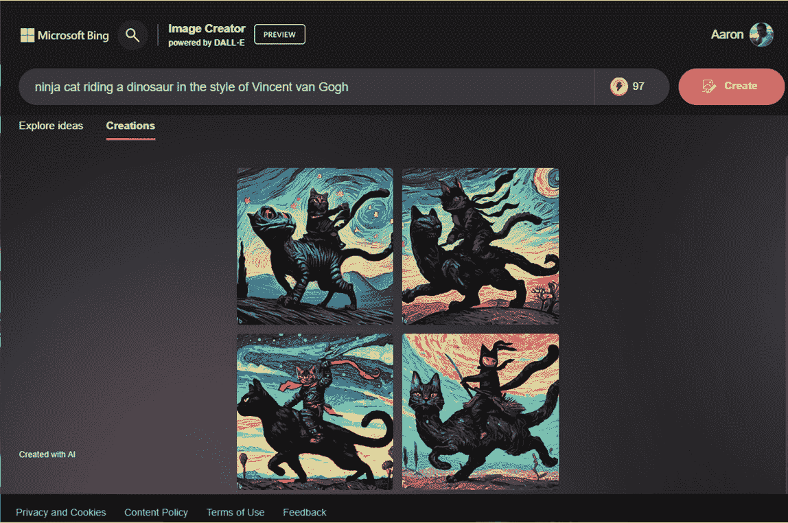

# 1

# 人工智能服务简介

在过去的几年里，人工智能（AI）领域取得了显著的进步，彻底改变了各个领域，并重塑了我们思考和技术互动的方式。最近引起广泛关注的一个特别迷人的 AI 分支是**生成式 AI**。通过使机器展现出创造力（或者更具体地说，创造力的外观），生成式 AI 在艺术、音乐、设计和讲故事等领域开辟了新的前沿，除了聊天和人类交互。

在我们过于深入之前，让我们先讨论一些核心概念，以帮助大家了解这一切是如何运作的。

所有这些 AI 术语是什么意思？特别是，生成式 AI 指的是一类可以自主生成新内容（某种程度上是原创内容）的算法和模型。与依赖于预定义规则或明确指令的传统 AI 系统不同，生成式 AI 系统旨在从模式和现有数据中学习，以产生新颖的输出。这些系统利用深度学习技术，如**生成对抗网络**（GANs）、**变分自编码器**（VAEs）和**循环神经网络**（RNNs），来模拟人类大脑的创造性过程。

正如你们将看到的，AI 有自己的词汇表。当我们说诸如*生成对抗网络*和*变分自编码器*之类的术语时，我们指的是什么？让我们快速偏离一下，定义一下我们将要使用的术语：

+   **算法**：算法是一组规则（通常用计算机编程语言表达），在解决问题时遵循这些规则。

+   **神经网络**：当我们谈论神经网络时，我们指的是基于我们对人类大脑和神经系统的理解而构建的计算机系统和交互。像人类大脑一样，人工神经网络的基本构建块被称为神经元（节点），每个节点都连接到其他节点。这些连接具有权重和偏差的概念，当输入达到某个阈值时，它们会在链中的下一个节点上翻转。想象一下，神经网络就像由节点组成的网格层，每个节点连接到相邻层上的多个节点，每个节点的输出被用来影响相邻层节点的输入。

+   **GAN**：GAN 由两个基于相同源数据的神经网络组成，它们通过竞争来相互对抗。GAN 可以创建独特但模仿种子数据的合成数据。

+   **VAE**：VAE 是一种具有两个功能的算法。第一个功能将复杂的数据结构转换为一个更简化的版本，其中包含一定程度的随机性，而第二个功能则从简化的版本生成一个更复杂的结果。想象一下编码函数就像对一棵树进行高分辨率拍照，将其下采样（使其仍然看起来像一棵树，但可能缺少一些数据并且可能看起来有些模糊），并添加一些随机像素。当解码函数被激活时，它检索存储的简化数据，并使用它来重新构建一棵树的高分辨率图像。新的图片看起来与原始图片相似，但部分原因是由于原始数据简化的损失，部分原因是编码器插入了一定程度的随机性，新的图片也有所不同。

+   **RNN**：RNN 是一种可以处理序列数据的人工神经网络，它通过保留之前步骤的信息来处理。

+   **AI 模型**：AI 模型是一种模仿人类智能的数学算法，通过处理数据来做出预测和生成输出。它通过训练数据学习执行特定任务，如图像识别或自然语言处理。

+   **大型语言模型**：大型语言模型是一种 AI 模型，旨在理解和生成连贯且与上下文相关的、类似人类的文本。流行的 ChatGPT 就是一个大型语言模型的例子。

深度学习和 AI 系统背后还有许多更复杂的概念（包括更多类型的神经网络和 AI 模型）。

除了生成式 AI 之外，目前还有许多类型的 AI 模型正在使用，例如那些被设计来完成以下任务：

+   估算航运路线

+   预测交通模式和拥堵

+   寻找天气异常

+   识别图片中的物体

这些不同类型的模型都依赖于大量现有数据和专门设计的算法，以及训练程序来帮助模型“学习”如何预测或识别事物。

在这本书中，我们将使用各种 AI 技术——从预构建、以特定目的为导向的模型到生成式 AI。当你到达最后的示例和练习时，我希望你会有一些关于如何利用 AI 加速你的团队、组织甚至个人生活的激动人心的想法。

# 生成式 AI 可以做哪些事情？

生成式 AI 的显著力量在于其创造真实多样输出并展现类似人类创造力的能力。例如，在视觉艺术领域，生成式 AI 可以创作逼真的画作，生成逼真的图像，甚至帮助设计具有特定美学的新产品。在音乐创作中，生成式 AI 算法可以创作原创旋律和和声，模仿不同作曲家的风格或创造全新的音乐流派。同样，在叙事领域，生成式 AI 可以开发引人入胜的故事，写诗，或生成逼真的对话。

生成式 AI 的影响远远超出了艺术和创造性追求。它已经在包括数据增强、合成数据生成、视频游戏设计和药物发现等各个领域找到了应用。生成式 AI 技术还可以帮助增强现有内容，实现高质量的图像放大、文本摘要，甚至生成与人类语音非常相似的语音合成！AI 能够做到的未来仅限于构建和训练模型的人们的创造力。

然而，生成式 AI 并非没有挑战。如滥用或传播有偏见内容的潜在问题等伦理问题需要解决。在 AI 系统的创造力和其与社会价值观的一致性之间找到正确的平衡是一个需要仔细考虑的关键方面。

道德和负责任的 AI

负责任地使用 AI 对于确保其在市场上的成功至关重要。负责任的 AI 包括公平（公平对待每一位用户）、包容性（确保所有种族、性别和能力的人都有权使用系统）、透明度（理解 AI 模型如何得出结论）和问责制（确保人们可以为 AI 系统的决策承担责任）。

负责任的 AI 设计和使用涵盖了所有 AI 系统的各个方面，从机器学习模型具有代表性的数据样本且不持有对国籍或性别的偏见，到确保生成式 AI 在没有得到同意的情况下不被用于创建人们的肖像（有时称为**深度伪造**）。

微软在部分程度上一直在致力于建立道德和负责任的 AI 原则。您可以在以下链接中了解更多关于他们的承诺：[`www.microsoft.com/en-us/ai/responsible-ai`](https://www.microsoft.com/en-us/ai/responsible-ai)。

总的来说，生成式 AI 代表了在 AI 领域的一个重大突破。通过利用机器学习和深度神经网络的力量，生成式 AI 系统可以开启新的创造力和创新领域，商业自动化以及人机交互。

不提这些，它还在释放许多忍者猫恐龙混合体：

图 1.1 – Bing 图像创建者，由 DALL-E 提供支持

让我们转换一下思路，了解各种类型的 AI 在商业环境中的应用，特别是与微软的 Power Platform 相关的应用。

# 什么是 Power Platform？

Power Platform 是一套全面的 **低代码** 和 **无代码** 工具套件，旨在赋予个人和组织创建定制业务应用、自动化流程、分析数据和开发虚拟代理的能力。它由四个主要组件组成：

+   **Power Apps**：此组件使用户能够通过拖放功能构建网页和移动应用程序，同时连接到各种数据源。

+   **Power Automate**：之前称为 Microsoft Flow，它允许创建自动化工作流，整合和同步多个应用程序和服务之间的数据和流程。Power Automate 已从仅作为云端的流程自动化平台扩展到包括流程挖掘和 **机器人流程** **自动化**（**RPA**）。

+   **Power BI**：此组件提供强大的数据分析可视化功能，将原始数据转化为有意义的见解和交互式报告。

+   **Copilots**：此组件允许创建无需编码的智能聊天机器人，使组织能够提供即时支持和与客户的互动。

这些工具共同赋予所有技能水平的用户推动数字化转型、提高生产力和在其组织中创新的能力。本书将主要关注将 AI 服务和模型与 Power Platform 的 Power Automate、Power App 和 Copilots 组件集成。

什么是无代码或低代码软件？

微软将 Power Platform 工具定位为一个鼓励 **无代码** 和 **低代码** 解决方案的开发环境。那么，这些是什么？无代码正如其名——创作者从小部件、组件或模块中组装解决方案的一种 **所见即所得**（**WYSIWYG**）的方式。生成一个可工作的解决方案不需要正式的开发经验。

低代码软件，比无代码软件高一个层次，涉及使用简化的开发语言与可用的连接器或模块结合使用。Power Platform 利用一种名为 **Power Fx** 的语言，其结构类似于流行 Office 宏或电子表格公式的语法。

Power Platform 工具还可以支持 **代码优先** 或 **代码优先** 的创作（这与低代码或无代码方法截然相反），这意味着您可以与 REST API 接口交互或使用传统的开发环境，如 Visual Studio。

## 了解 Power Automate

Power Automate 是一个工作流和流程自动化工具。作为一个无代码/低代码解决方案，Power Automate 依赖于各种组件或构建块来创建自动化。

下面是一些与 Power Automate 相关的术语列表，您将在本书中看到：

+   **流程**：Power Automate 的基本单元，流程是由连接器、条件和任务组成的逻辑分组，用于执行自动化操作。

+   **连接器**：连接器是配置组件，用于定义与服务和应用程序通信所需的参数。

+   **触发器**：触发器是导致流程开始的事件或活动，例如 *当创建新文件时* 或 *当向 SQL 数据库表添加一行时*。

+   **操作**：操作是描述正在执行的动作和评估的逻辑步骤或单元，例如 *复制文件*、*检查值是否大于或等于* 或 *向 SQL 数据库表添加一行*。

我们将在本书的许多练习和示例中使用 Power Automate。

进一步阅读

要了解更多关于 Power Automate 的信息，请查看 *《使用 Microsoft Power Automate 进行工作流自动化，第二版》* ([`www.packtpub.com/product/workflow-automation-with-microsoft-power-automate-second-edition/9781803237671`](https://www.packtpub.com/product/workflow-automation-with-microsoft-power-automate-second-edition/9781803237671))。

## 了解协作者

**协作者**技术（不要与 *某物的协作者* 混淆）赋予用户设计和部署聊天机器人的能力，以与人们互动，提供即时支持和参与。通过可视化界面和预构建模板，创作者可以轻松定义对话流程，连接和集成各种系统，并使用 **自然语言理解**（**NLU**）来训练聊天机器人。

有这么多协作者

我们将尽量使事情简单明了，但微软在其产品中融入了协作者的命名法。有 **Microsoft 365 协作者**（一个内置在 Microsoft 365 体验中的生成式 AI 助手）、**Viva Sales 中的协作者**（一个连接 Outlook 和其他协作工作负载与 Dynamics CRM 的生成式 AI 助手）以及 **安全协作者**（一个用于威胁搜索和管理的 AI 助手）。

Power Platform 有自己的协作者功能集，包括 **AI 协作者**（一个用于创建 Power Apps 和流程的 AI 启用生成式助手）和 **协作者工作室**，这是一个用于创建——您猜对了——协作者的网络界面。**协作者**（在协作者工作室中）是经过改进的 Power Virtual Agents——聊天机器人，可以启用以在其他应用程序中提供答案和启动工作流。

由于我们将在本书的一些练习中使用协作者，您也需要熟悉它们的术语：

+   **主题**：主题代表您的聊天机器人可以处理的主要领域或主题。每个主题都包含触发器、操作和响应，以引导对话流程。

+   **触发器**：触发器是启动对话或将其引导到特定主题的条件或用户输入。它们可以基于关键词、短语或系统事件。

+   **操作**：操作是聊天机器人针对用户输入或触发器执行的操作或步骤。它们可以包括发送消息、提问、调用 API 或执行计算。

+   **实体**：实体是聊天机器人可以从用户输入中提取的信息片段。

+   **响应**：响应是聊天机器人用于与用户沟通的消息或内容。

Copilots 可以部署到各种位置和界面，包括网站和 Microsoft Teams。

进一步阅读

想要了解更多关于 Copilots 的信息，请阅读《Empowering Organizations with Power Virtual Agents》：[`www.packtpub.com/product/empowering-organizations-with-power-virtual-agents/9781801074742`](https://www.packtpub.com/product/empowering-organizations-with-power-virtual-agents/9781801074742).

## 了解 Power Apps

Power Platform 的 Power Apps 组件使用户能够在没有广泛编码知识的情况下创建自定义的网页和移动应用程序。它提供了一个低代码开发环境，用户可以在其中通过可视设计应用程序界面、定义数据源以及通过一系列预构建的连接器添加功能。

与 Power Automate 和 Copilots 一样，Power Apps 有一些术语您应该了解：

+   **屏幕**：屏幕是应用程序的构建块，代表不同的视图或页面。每个屏幕可以包含各种控件和组件。

+   **控件**：控件是用于显示数据、捕获用户输入或触发操作的交互式元素。示例包括文本框、按钮、库、表单和图表。

+   **数据源**：数据源是应用程序数据存储的地方，例如 SharePoint、Microsoft Dataverse（以前称为 Common Data Service）、Excel、SQL 数据库或通过连接器的外部系统。

+   **公式**：Power Apps 使用公式（Power Fx 语言）进行计算、操作数据和控制应用程序行为。公式可用于属性、事件和操作中。

+   **数据卡**：数据卡是表单内数据输入控件的容器。它们代表数据源的字段，并使用户能够查看和编辑数据。

+   **库**：库是用于显示列表或数据集合的控件。它们可以根据需要定制，以显示不同的布局，例如表格或卡片库。

Power Platform 最令人兴奋的新功能之一是“描述以设计”功能，它允许您使用自然语言为 Power App 建立框架。我们将在 *第五章*，*使用 Copilot 引导 Power App* 中稍作探讨。

进一步阅读

想要了解更多关于使用 Microsoft Power Apps 创建应用程序的信息，请查看《Learn Microsoft Power Apps, Second Edition》：[`www.packtpub.com/product/learn-microsoft-power-apps-second-edition/9781801070645`](https://www.packtpub.com/product/learn-microsoft-power-apps-second-edition/9781801070645).

## 了解 AI Builder 技术

AI Builder 是 Power Platform 的原始 AI 组件，允许用户将 AI 能力集成到他们的 Power Apps 和 Power Automate 工作流程中。它使即使没有广泛 AI 专业知识的使用者也能构建和部署用于常见业务场景的 AI 模型。

### 使用预构建模型

AI Builder 提供了一系列预构建模型和示例，这些模型可以根据特定需求进行定制。这些模型涵盖了各种 AI 能力，如表单处理、目标检测、预测、文本分类和情感分析。用户可以使用他们的数据训练和优化这些模型，或者利用现有的数据连接器。

使用 AI Builder，用户可以自动化从表单中提取数据，对结果进行分类和预测，分析文本中的情感，并在图像中识别对象。这些 AI 能力增强了 Power Apps 和 Power Automate 的功能和能力——您将在本书中获得实际操作经验！

我们将在*第六章*“使用情感分析处理数据”中，使用情感分析功能。

我们将在*第八章*“使用身份验证构建活动注册应用”中，使用 AI Builder 文档阅读器。

最后，在*第九章*“实现 AI 驱动的简历筛选器”中，您将学习如何训练 AI Builder 模型从简历中提取关键数据。

### 使用自定义模型

与预构建模型相比，自定义模型允许用户创建和训练符合其特定业务需求的定制 AI 模型。预构建模型已经针对常见场景进行了训练，而自定义模型允许您使用自己的数据来训练模型以满足专业化的需求。

我们将在*第九章*“使用 Copilot 和 Power Apps 构建简历筛选器”中，使用自定义模型来处理非结构化数据。

## 理解 Power Platform 许可证

Power Platform 的许可结构可能有点复杂，但以下是主要许可选项的概述：

+   **Power Apps 和 Power Automate 免费版**：Power Apps 和 Power Automate 提供了一个免费版本，该版本提供基本功能以及对连接器和功能的有限访问。此许可计划有时被称为*种子提供*。

+   **Power Apps 和 Power Automate 每用户计划**：这些是付费计划，提供增强功能以及对连接器和功能的更广泛访问，按用户计费。这些计划适用于需要高级功能且按月或按年许可的个人用户。

+   **Power Apps 和 Power Automate 每应用或每流程计划**：这些计划允许组织为特定的应用或流程许可，而不是为单个用户许可。当组织拥有大量用户但只有一小部分用户需要访问特定应用或流程时，这些计划很有用。

+   **与 Microsoft 365 和 Dynamics 365 计划的 Power Apps 和 Power Automate 许可证**：Power Apps 和 Power Automate 也包含在多种 Microsoft 365 和 Dynamics 365 计划中。这些计划提供对 Power Platform 功能的更广泛访问，同时还包括其他 Microsoft 生产力和企业应用程序。

需要注意的是，某些高级功能、附加包、连接器和基于容量的使用可能需要额外的许可证或更高等级的计划。此外，Microsoft 定期更新和改进其许可证选项，因此建议咨询官方 Microsoft 许可证文档或直接联系 Microsoft 以获取有关 Power Platform 许可证选项的最新信息。

AI Builder 是一种按容量计费的特性——与 Power Apps 和 Power Automate 每用户、每应用或每流程计划分开。以下是关键方面的概述：

+   **免费使用**：AI Builder 提供有限的免费使用量，允许用户免费探索和体验其基本功能。

+   **基于消费的定价**：当使用量超过免费限制或需要更高级的功能时，AI Builder 容量许可证开始生效。它遵循基于消费的定价模式，组织购买容量以启用 AI Builder 的功能。

+   **容量类型**：AI Builder 许可证提供两种容量类型——AI Builder 独立容量和 AI Builder 容量附加包：

    +   **AI Builder 独立容量**：此类容量仅用于 AI Builder，涵盖 AI Builder 模型和服务的消耗。

    +   **AI Builder 容量附加包**：此容量是现有 Power Apps 和 Power Automate 容量的附加包。它允许组织扩展其现有容量，使其包括 AI Builder 功能。

+   **容量单位**：AI Builder 容量以容量单位衡量，每个单位提供一定水平的计算资源和性能。所需的容量单位数量取决于 AI Builder 的使用量和部署的模型的复杂性。

在确定组织的适当容量许可证时，需要考虑用户总数、预期使用量和所需的特定 AI Builder 功能。组织可能需要分配足够的容量单位以确保最佳性能和可扩展性。

若要获取关于 AI Builder 容量许可证的精确细节，包括定价、特定功能和许可协议，建议参考官方微软文档或咨询微软许可专家，以确保符合您组织的需求并适当许可。

进一步阅读

若要深入了解 Power Platform 许可证，请参阅[`learn.microsoft.com/en-us/power-platform/admin/pricing-billing-skus`](https://learn.microsoft.com/en-us/power-platform/admin/pricing-billing-skus)和[`learn.microsoft.com/en-us/ai-builder/administer-licensing`](https://learn.microsoft.com/en-us/ai-builder/administer-licensing)。如果这一切仍然像泥巴一样模糊不清，您可以联系微软合作伙伴([`partner.microsoft.com/en-us/marketing`](https://partner.microsoft.com/en-us/marketing/find-microsoft-partners))。

# 探索其他 AI 服务

现在我们已经花了一些时间了解了一些生成式 AI 和 Power Platform 的功能，让我们来看看市场上的一些 AI 服务。

## 使用 Azure AI 服务

微软在 **Azure AI 服务**（以前称为 Azure 认知服务）的伞形下提供了一系列 AI 和机器学习功能。这些服务使开发者能够在不从头开始构建复杂的 AI 算法的情况下，将智能功能添加到他们的应用程序中。借助 Azure 认知服务，开发者可以访问预构建的模型和 **应用程序编程接口**（**API**），将视觉、语音、语言和决策制定等功能集成到他们的应用程序中。

具有视觉功能的包括以下服务：

+   **计算机视觉**：此服务使图像分析和物体检测成为可能。计算机视觉可以执行诸如识别场景中的物体（*狗*、*飞盘*和*树*）以及执行上下文图像分析（*在树下，有一只狗正在接飞盘*）和光学字符识别等任务。

+   **人脸识别**：人脸识别服务用于识别图像数据中的面部存在，以及识别和分析图像中的面部。您可能使用人脸识别服务来验证某人的身份是否与政府颁发的身份证件相符，或者用于模糊处理图片或视频中的面部内容。

+   **自定义视觉**：自定义视觉服务，现在是图像分析 4.0 的一部分，使开发者能够创建自定义图像识别模型，用于根据视觉特征对内容进行标记和添加标签。

Azure 认知服务包括多个语言和语音 API，提供以下功能：

+   **语音识别**：语音识别服务提供了一系列语音转文本、文本转语音、内容翻译和说话人识别功能。

+   **语言**：该服务基于自然语言理解，具有多个子服务和功能，包括执行关键词提取、命名实体识别以及检测**个人身份信息**（**PII**）的能力。语言服务还可以在两种语言之间提供文本翻译，对文本体进行分类并确定其情感，以及执行内容摘要。

+   **翻译器**：虽然语言服务处理文本到文本的内容转换，但翻译器服务可以提供实时基于机器的翻译。

+   **语言理解**（**LUIS**）：LUIS 服务是一个机器学习模型，可以从自然语言对话中预测整体意义和内容提取。

+   **QnA Maker**：您可以将 QnA Maker 服务视为一个机器人或回答服务，它可以对半结构化内容进行推理并提供客户答案。

与 Azure AI 服务一起提供的决策模型也提供了独特的功能：

+   **内容审查员**：内容审查员服务提供对可能冒犯性、不受欢迎、不安全或存在其他风险的内容的分析。

+   **个性化推荐**：通过行为和习惯分析，个性化推荐服务帮助选择为您的客户选择的内容体验。

+   **异常检测器**：异常检测器服务允许您监控和检测基于时间的数据集中的不一致性。

Azure AI 服务还包括 **Azure OpenAI 服务**，该服务包含多个语言模型，包括 GPT-3 和 Codex，以支持内容生成、摘要和自然语言到代码的翻译。

变化即将到来

如果有什么是恒定的，那就是变化。随着 AI 领域的发展，新的功能、服务或能力会取代旧的对立面。在未来几年里，您将需要告别 LUIS 和 QnA Maker 服务，因为它们将被淘汰。Microsoft 建议将启用 LUIS 的应用程序和服务过渡到对话语言理解，并使用 Azure AI 语言服务中的问答功能重新配置 QnA Maker 服务。

一起，这个服务家族为开发者提供了将 AI 基础功能编程添加到他们的应用程序中的机制，而无需在 AI 模型方面有大量经验，从而改善用户体验，并在医疗保健和客户服务等领域推动创新。

进一步阅读

如需了解 Azure 认知服务的完整产品系列，请访问 [`learn.microsoft.com/en-us/azure/cognitive-services/what-are-cognitive-services`](https://learn.microsoft.com/en-us/azure/cognitive-services/what-are-cognitive-services)。

## 与 OpenAI 模型合作

OpenAI 是 GPT-3、GPT-4 和 DALL-E 图像生成平台等流行模型的背后组织。

OpenAI 提供了一系列先进的 AI 技术和服务，旨在赋予个人和组织利用 AI 力量的能力。让我们来看看他们的部分产品：

+   **生成式预训练转换器**（**GPT**）：这是 OpenAI 的旗舰语言模型。它能够生成连贯且与上下文相关的文本，这使得它在自然语言处理、文本补全和聊天机器人开发等任务中非常有用。

+   **OpenAI API**：这项服务为开发者提供了轻松访问 OpenAI 模型的方式，使他们能够将语言生成功能集成到他们的应用程序或服务中。

+   **图像 API**：图像 API 提供了基于文本提示创建或编辑新图像和现有图像的方法。

+   **OpenAI Gym**：这是一个用于开发比较强化学习算法的工具包。它提供了一系列预构建的环境和工具，用于训练和评估 AI 代理。

+   **OpenAI 平台**：OpenAI 平台提供了一套用于研究、开发和部署 AI 模型的工具和资源。它包括模型训练基础设施、协作功能和模型管理工具。

+   **OpenAI 学者计划**：这是一个研究实习项目，旨在支持来自代表性不足背景的有志于 AI 研究的学者。它提供指导、津贴和资源，以帮助参与者提升他们的 AI 知识并贡献于该领域。

与 Microsoft 一样，OpenAI 强调道德考虑和负责任的 AI 开发。

进一步阅读

在这本书中，我们将主要关注通过 Power Platform 直接或通过 Azure AI 服务暴露的 OpenAI 服务。OpenAI 的产品也可以单独获取。有关使用 OpenAI 平台进行开发的更多信息，请访问[`platform.openai.com/overview`](https://platform.openai.com/overview)。

## 与 Google、Anthropic 等公司的服务合作

虽然我们将主要关注在 Microsoft 云中提供的服务（更具体地说，是 Power Platform AI Builder、Azure AI 服务和 OpenAI），但它们现在并不是 AI 领域的唯一大玩家。目前还有几个其他 AI 平台——既有通用的也有特定的——正在开发中。其中一些甚至现在就开放供你实验！

这里有一些你可能遇到的服务列表：

+   **Google Bard**：基于 Google 的**对话应用语言模型**（**LaMDA**），Bard 是由 Google 研究团队开发的高级语言模型。LaMDA 的训练涉及对话而非孤立的提示，这使得它能够理解深层含义并参与更深入的对话交流。你可以在[`bard.google.com`](https://bard.google.com)与 Bard 开始对话。

+   **Anthropic Claude**：Claude 是另一种类型的对话式 AI 模型。Anthropic 在处理 AI 模型时采取了一些不同的方法，他们使用一种称为宪法 AI 的方法进行训练。宪法 AI 涉及监督学习和审查，以便 AI 从反馈中学习，生成无害的输出。与 Claude 在[`claude.ai`](https://claude.ai)交谈。

+   **Midjourney**：与 ChatGPT、Bard 和 Claude 使用文本作为输入和输出不同，Midjourney 是一个基于 AI 的艺术生成平台。Midjourney 可以通过文本提示来创建高质量的艺术作品。在[`www.midjourney.com/`](https://www.midjourney.com/)体验 Midjourney。

AI 也融入了无数的插件和扩展中。进行一次或两次快速的互联网搜索，很快就能发现您可以尝试的新工具。

# 摘要

希望对生成 AI 中涉及的某些计算类型、算法和框架的高层次理解，能让您在接触它时感到不那么可怕。虽然机器可能（目前）还没有来“找”我们，但它们无疑将影响未来多年商业和客户之间的互动。

现在，是时候通过准备您的开发环境来开始您的 AI 之旅了！
