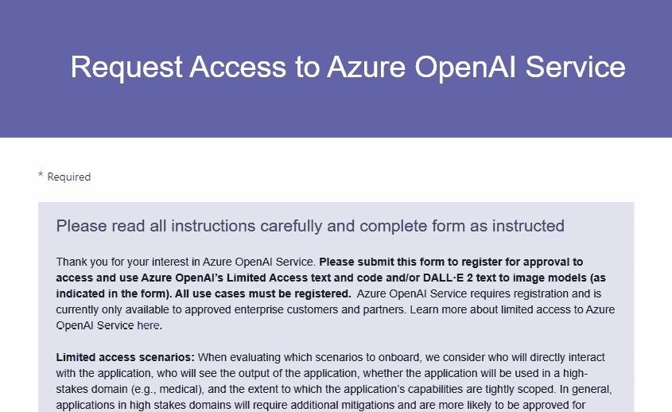
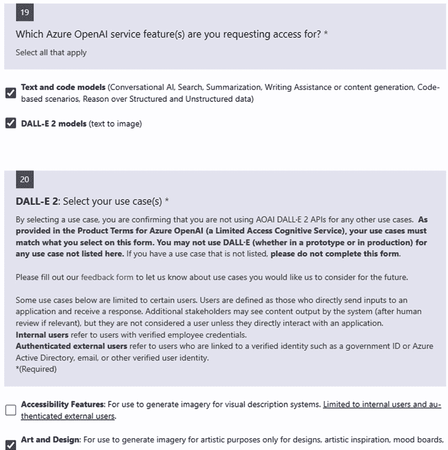
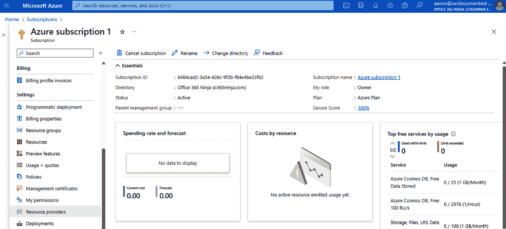
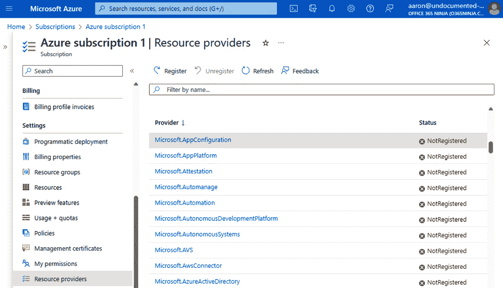
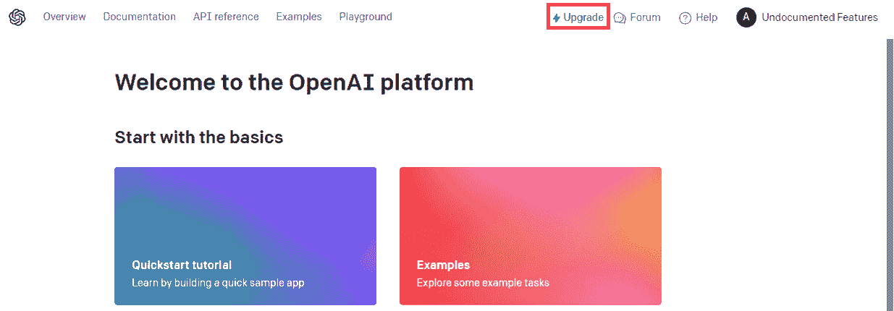
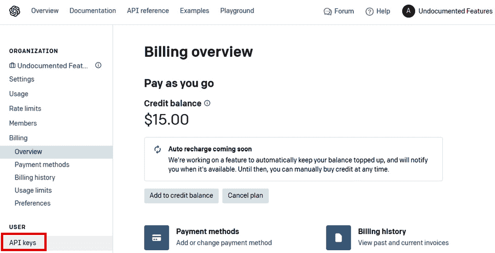
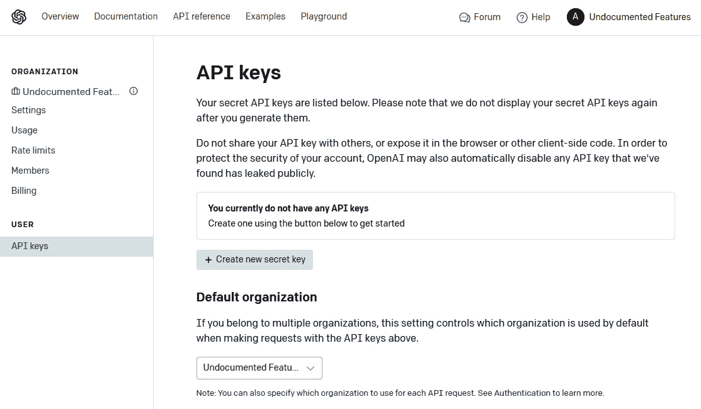
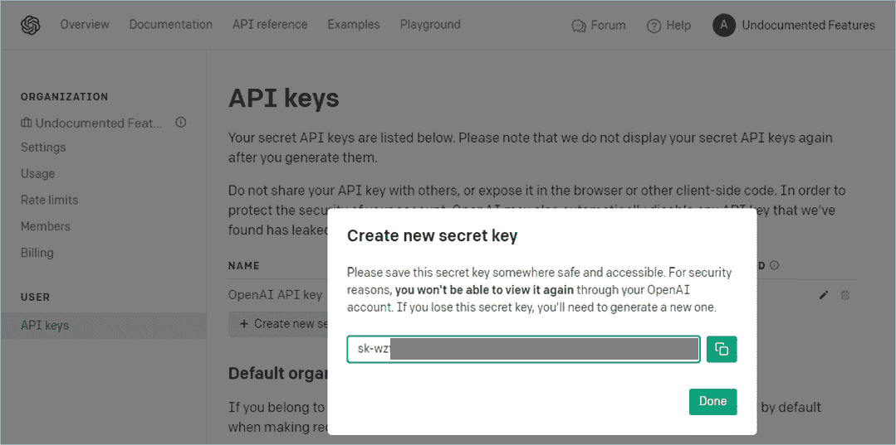
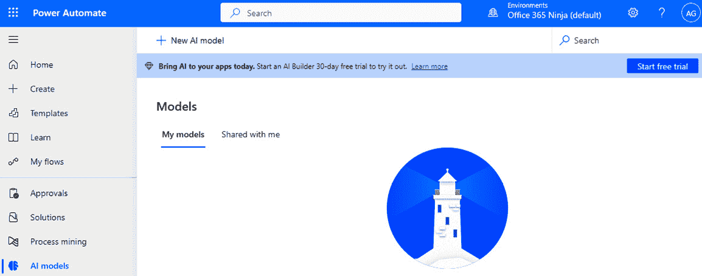

# 2

# 配置支持 AI 服务的环境

在本章中，我们将开始探索如何获取和设置您将需要执行本书练习的各种服务和环境。

由于本书主要关注与 Microsoft 生态系统中的 AI 服务一起工作，我们将花费大部分时间与 Azure 和 Power Platform 服务一起工作。在本章结束时，我们将介绍如何连接到其他 AI 平台，以防您想将它们作为学习的一部分。

注意

其中一些服务可能提供个人交互使用的免费试用，但大多数将需要某种形式的支付，以便任何以编程方式访问资源（如从 Power App）的用户。您可能需要相应地制定预算，以充分利用可用的平台。

对于那些只会在低代码场景（如 AI Builder 或 Power Apps 或 Power Automate 中的 OpenAI 动作）中使用 AI 的用户，配置 Azure 中的 OpenAI 服务资源可能不是必需的，您可以跳转到*配置 Power Platform*部分。然而，如果您想深入了解 Azure 提供的 AI 服务世界，请继续阅读。

# 配置 Azure

在 Azure 环境中，有几种方式可以使用基于 OpenAI 的服务，如 ChatGPT。根据您的上下文，您可能愿意使用公共服务如 ChatGPT 来满足您的生成需求。但是，如果您想在 Azure 租户的范围内配置 OpenAI 以处理您自己的数据集，您将需要请求访问 Azure OpenAI 服务。

在您的 Azure 租户中启用 OpenAI 的好处之一是您可以将其连接到您自己的租户数据。当您开始审查公共或免费 AI 接口的服务条款时，您会注意到服务提供商可以声称拥有您产生的结果的所有权，以及使用您提供的数据来进一步训练模型。如果您旨在使用 AI 来处理您自己的专有数据（这可能包含从**个人身份信息**（PII）到商业机密的各种内容），您需要确保您始终控制着通过系统传输的任何数据（从数据治理的角度以及内容所有权的角度来看）。

注意

OpenAI 为 ChatGPT 提供企业订阅，可以保护您的提示、源数据和结果不被用于训练通用模型。

## 为 Azure OpenAI 服务请求 API 访问

由于 AI 服务的快速发展和**生成 AI**（GenAI）可能带来的潜在风险，Microsoft 限制了访问 OpenAI 服务。作为其负责任的 AI 承诺的一部分，Microsoft 致力于确保其提供的服务以安全的方式被使用。

为了使用 Azure 服务，您需要一个 Azure 订阅。

小贴士

要查找您的 Azure 订阅，请导航到 Azure 门户 ([`portal.azure.com`](https://portal.azure.com)) 并在 **搜索** 栏中输入 `Subscriptions`。订阅 ID 的格式为 GUID，您在请求过程中需要提供。有关查看您的 Azure 订阅的更多信息，请参阅 [`learn.microsoft.com/en-us/azure/azure-portal/get-subscription-tenant-id`](https://learn.microsoft.com/en-us/azure/azure-portal/get-subscription-tenant-id)。

要开始请求访问 Azure OpenAI 服务，请按照以下步骤操作：

1.  使用浏览器，导航到 [`aka.ms/oai/access`](https://aka.ms/oai/access)。

图 2.1 – 请求访问 Azure OpenAI 服务

1.  使用您的姓名和 Azure 订阅 ID 填写表格。

1.  选择您想要使用的 Azure OpenAI 服务。可用的选项包括 **文本和代码模型** 和 **DALL-E 2 模型**。请参阅 *图 2.2*：

图 2.2 – 选择 Azure OpenAI 服务模型

1.  为每个模型选择用例。在选择用例时，请注意，如果您不是当前的微软 MVP 或 RD，选择 **最有价值专家 (MVP) 或区域总监 (RD) 演示用** 将导致拒绝。

1.  确保填写所有必填字段，例如您组织的电话号码或公司网站。

1.  对于 **问题 18**，您必须选择 **我承认这些条款适用于使用 Azure OpenAI 服务**。阅读问题中链接的条款，包括法律条款、Azure 预览版产品的支持条款，以及 Azure OpenAI 服务的行为准则。

1.  对于 **问题 19**，您必须选择 **是的，我声明** 以确认符合服务要求，并承认微软正在监控完成和生成 API 的使用。

1.  点击 **提交**。

表格将被发送到微软进行审查和批准。目前，请求审查大约需要 10 个工作日。一旦您的访问得到批准，您就能在 Azure 门户中创建和使用 OpenAI 资源。

## 在 Azure 中设置 OpenAI 服务资源

一旦微软批准了您在 Azure 租户中的 OpenAI 服务，就到了设置它的时候了！

您需要与 OpenAI 一起工作的所有服务已经存在——它们只是等待被启用。为了利用本书中的示例，您需要注册几个资源提供者。

Azure 资源提供者是一组 REST 操作，旨在支持特定 Azure 服务的功能，例如用于 Azure 认知搜索服务的 *Microsoft.Search*。此提供者指定用于管理服务各个方面的 REST 操作，包括配置搜索索引和启用基于语义搜索的应用程序的开发。

资源提供者按订阅进行注册和启用。在本节中，我们将采取必要的步骤来启用支持以后使用 Azure OpenAI 服务的连接：

1.  导航到 Azure 门户 ([`portal.azure.com`](https://portal.azure.com)) 并选择 **订阅**。

1.  选择您用于注册 OpenAI 服务访问的订阅之一。

1.  在 **设置** 下，选择 **资源提供者**，如图 *图 2*.3* 所示：

图 2.3 – 导航 Azure 订阅

1.  从资源提供者列表中选择 **Microsoft.AppConfiguration**：

图 2.4 – 选择 Microsoft.AppConfiguration 资源提供者

1.  点击 **注册**。

1.  对于本书中将使用的以下服务提供者，重复 *步骤 4* 和 *步骤 5*：

    +   Microsoft.AppPlatform

    +   Microsoft.App

    +   Microsoft.Authorization

    +   Microsoft.BotService

    +   Microsoft.CognitiveSearch

    +   Microsoft.CognitiveServices

    +   Microsoft.Insights

    +   Microsoft.Logic

    +   Microsoft.ManagedIdentity

    +   Microsoft.KeyVault

    +   Microsoft.Storage

    +   Microsoft.Web

当你使用 Azure OpenAI 扩展你的用例时，你需要启用这些功能以开始与模型和服务一起工作。

# 配置 ChatGPT 的 API 访问

虽然任何人都可以浏览到 OpenAI 并免费交互式地使用 ChatGPT，但如果你想在应用程序和自动化中使用 ChatGPT，你需要获得 API 访问权限。

要注册 API 访问，请按照以下步骤操作：

1.  使用浏览器，导航到 [`beta.openai.com/signup`](https://beta.openai.com/signup)。

1.  在 **创建您的账户** 页面上，输入一个电子邮件地址并点击 **继续**。或者，您可以使用 OAuth 连接通过 Google、Microsoft 账户或 Apple ID 进行身份验证。

1.  为您的新 OpenAI 账户输入一个密码并点击 **继续**。

1.  检查您在 *步骤 2* 中提供的账户，以确认消息。点击链接以确认您的身份并继续注册流程。

1.  在 **告诉我们关于您的情况** 注册页面上，添加您的个人详细信息，包括您的 **全名**、**组织** 和 **生日** 信息。点击 **同意**。

1.  如果你之前已经注册，你可能会收到一条关于升级到付费计划以开始使用 API 的消息。点击 **继续**。

1.  如果需要，在 **欢迎使用 OpenAI 平台** 概览页面上点击 **升级**，如图 *图 2*.5* 所示：

图 2.5 – OpenAI 平台概览页面

1.  否则，在导航菜单中点击 **API 密钥**。

1.  点击 **开始验证** 以开始电话验证过程。

1.  在 **验证您的电话号码** 页面上，输入一个能够接收短信的设备的电话号码。点击 **发送代码**。

1.  在 **输入代码** 页面上，输入您从 OpenAI 验证服务收到的六位数字代码。

1.  点击**开始** **支付计划**。

1.  在**您最好描述自己**页面，选择最能描述您的使用场景的分类（**个人**或**公司**）。

1.  在**设置支付计划**页面，输入您的信用卡信息并点击**继续**。

1.  在**配置支付**页面，输入**初始信用购买**的值。您可以选择介于 5 美元和 50 美元之间的任何金额。

1.  在**支付摘要**页面，点击**确认支付**。您将被收取**配置支付**页面和摘要中指定的金额。

1.  在**计费概览**页面，在**用户**下的导航菜单中选择**API 密钥**。见*图 2.6*：

图 2.6 – 选择 API 密钥

1.  在**API 密钥**页面，选择**创建新** **密钥**：

图 2.7 – 创建新的 API 密钥

1.  在**创建新密钥**弹出窗口中，输入 API 密钥的名称（例如 OpenAI API 密钥）并点击**创建** **密钥**。

1.  将显示的值复制到安全位置。当您从其他应用程序和服务连接到 OpenAI 服务时，您将需要此值。一旦您点击**完成**，此值将被隐藏，并且您将无法在未来检索它：

图 2.8 – 捕获 API 密钥

重要提示

像对待金钱一样保护此 API 密钥值。如果它被泄露或被盗，其他人可以使用它来执行针对您的账户余额的 API 调用和查询。如果它丢失或被盗，您需要返回此页面，生成新的密钥，然后通过点击垃圾桶图标撤销旧密钥。此外，如果 OpenAI 检测到您的密钥已被保存或发布到公共位置（如 GitHub），您的密钥将被无效化，您需要生成一个新的。

1.  点击**完成**。

当您配置其他服务以与 ChatGPT 集成时，您将为此服务提供此 API 密钥进行身份验证。

# 配置您的工作站

有许多工具可以帮助您构建和部署基于 AI 的应用程序。为了本书的目的，您可能需要下载和部署一些工具：[工具](https://code.visualstudio.com/download)

+   [Visual Studio Code：](https://code.visualstudio.com/download)

+   [Azure 开发者 CLI：](https://aka.ms/azure-dev/install)

+   [Python 3.9+：](https://www.python.org/downloads/)

+   [Node.js 14+：](https://nodejs.org/en/download/)

+   [Git：](https://git-scm.com/download/win)

+   [PowerShell 7+：](https://github.com/powershell/powershell) https://github.com/powershell/powershell

使用提供的链接下载并安装每个工具。请确保使用所有工具的默认安装选项，因为本书中的任何示例都将引用默认选项和路径。

# 配置 Power Platform

最后，我们将设置 Power Platform 所需的必要订阅和先决服务。

通过 Power Platform 工具中的 AI Builder 可用的 AI 模型需要 AI Builder 许可证以及访问 Microsoft Dataverse 的权限。要开始，请按照以下步骤操作：

1.  导航到 Microsoft Power Automate 网站端口（[`make.powerautomate.com`](https://make.powerautomate.com)）并使用管理员账户登录。

1.  从导航菜单中选择**AI 中心**。

1.  在**发现 AI 功能**页面，选择**AI 模型**。

1.  如果需要，选择**创建数据库**以创建新的 Dataverse 数据库。

1.  在**新数据库**页面，选择一个**货币**和**语言**值，然后点击**创建** **我的数据库**。

1.  如果你还没有 AI Builder 容量，你应该在页面顶部看到**开始免费试用**横幅，如图 *图 2*.9* 所示。选择它：

图 2.9 – 开始 AI Builder 的免费试用

1.  按提示注册或延长试用。

就这样！你就可以在 Power Automate 和 Power Apps 中使用 AI Builder 了！

# 摘要

在本章中，你配置了使用 AI 服务所需的所有先决条件——包括 Azure 中的 OpenAI、ChatGPT 和 Power Platform AI Builder。你还配置了工作站，以便将 AI 应用部署到 Azure。

接下来，我们将以最终用户身份开始与 ChatGPT 互动，以了解其工作原理。
