# 3

# 与 ChatGPT 对话

如果你正在阅读这本书，你可能至少听说过围绕 ChatGPT 的炒作。但是，你实际上看到它做什么了吗？它是如何工作的？你知道什么是提示吗？如何与之互动？

也许你已经对其进行了些探索，所以你接下来的问题可能是一些诸如*我该如何向它发送数据？*和*我该如何从它那里获取数据？*以及*什么是令牌，为什么它们很重要？*这样的问题。

如果是这样，你就来对地方了。在本章中，我们将通过 ChatGPT 界面进行一些探索，以熟悉其工作方式，然后转向 Power Automate，在那里你将学习处理 ChatGPT 数据的基础知识。

# 作为用户与 ChatGPT 合作

作为用户与 ChatGPT 合作非常简单。首先，你只需打开一个网络浏览器并导航到[`chat.openai.com`](https://chat.openai.com)。

设置

希望你已经开始了一个 ChatGPT 账户（它是*第二章*，*配置支持 AI 服务的环境*)的作业之一）。

一旦登录，请使用你之前注册的凭据登录：

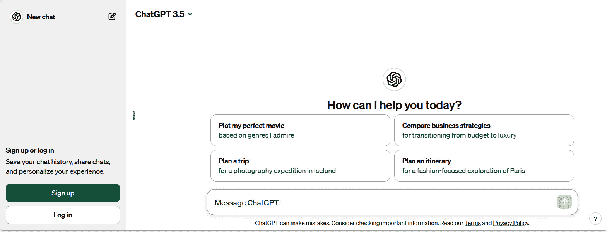

图 3.1 – 登录 ChatGPT

一旦你登录，你就可以立即开始向模型发送问题（**提示**），如图*图 3.2*所示：

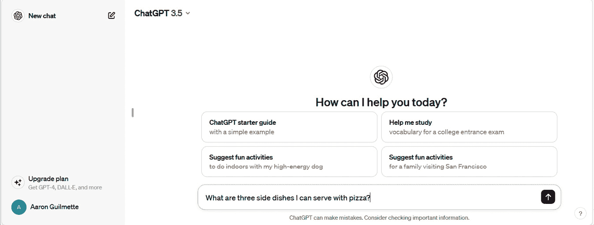

图 3.2 – 向 ChatGPT 发送提示

在输入提示后，ChatGPT 将以内容（在这种情况下，是披萨配菜的想法）进行回应。

你不仅限于向 ChatGPT 提交简单的问题，你甚至可以提交场景和背景信息以帮助指导 ChatGPT 的回应。这种框架被称为**上下文**。例如，你可以通过以下几种方式向 ChatGPT 提供上下文：

+   向一个 10 岁的孩子解释弦理论。

+   你是一位技术作家。描述混合砂浆所需的步骤。

+   你是一位网页开发者。为具有简单一级菜单的网页生成基本的 HTML 代码。

+   这里有一份动物列表：老虎、猫、狗、灰熊、羚羊、蜘蛛。将它们按从小到大的顺序排列。

ChatGPT 是会话式的，允许你回顾之前的提示和回应，以进一步细化你的输出。

# 那么，什么是令牌？

我很高兴你问了这个问题！当你与 ChatGPT（或其他语言模型和服务）互动时，这会出现。在 ChatGPT 的上下文中，令牌是模型处理的最小文本单元。它可能小到单个字符，常见的字母组合、前缀和后缀，甚至整个单词，具体取决于模型的配置。

从成本和计费的角度来看，模型通常根据你提交的令牌数量以及你收到的作为响应的令牌数量来收费。让我们以图 3.2 中展示的示例提示为例 – 我可以提供哪些披萨配菜？

使用像 OpenAI 的 Tokenizer 这样的工具，你可以计算出发送此请求将花费多少成本：

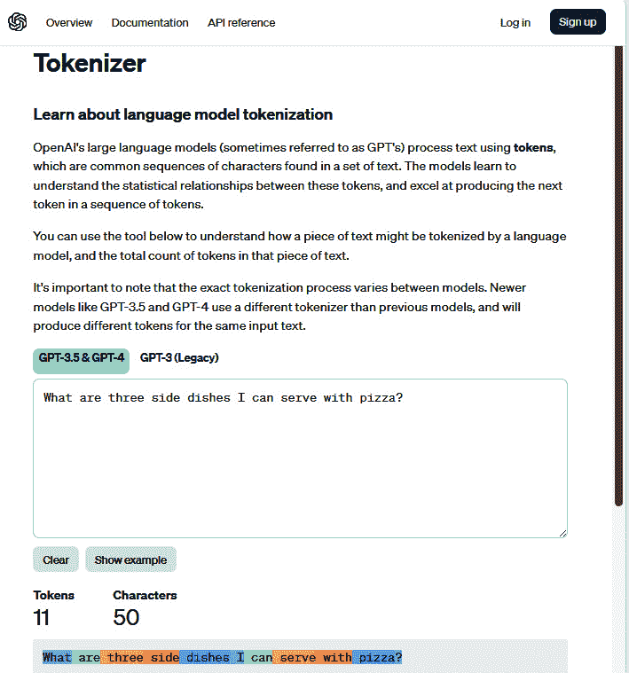

图 3.3 – 查看 Tokenizer 的结果

如你所见，这个请求花费了 11 个令牌。底部区域显示了 OpenAI 如何拆分句子。

响应令牌的计数方式相同。考虑到这一点，你可能发现将问题和响应标准以最小化令牌使用的方式框架化是有用的（或者根据你的预算，这是必要的）。根据你所消费的服务，你的使用可能被不同地计算。始终了解定价和计费模式非常重要，以确保你不会收到意外的账单！

在处理完会计任务后，我们将查看如何将数据发送到 ChatGPT。

# 向 ChatGPT 发送提示

作为最终用户与 ChatGPT 一起工作相当简单。那么，使用 Power Automate 做同样的事情有多难呢？答案是，这并不那么糟糕。

你有两个主要选项可以将数据传递给 OpenAI ChatGPT 服务本身：内置的 HTTP（高级）连接器或第三方 OpenAI 连接器。我们将快速介绍这两种选项，你可以根据需要调整其中任何一个。

这两个示例都将通过简单的文本提示构建为即时云流。对于这两个示例，你需要你在 *第二章*，*配置支持* *AI 服务* 的环境中创建的 OpenAI API 密钥。

## HTTP

HTTP 方法是两种方法中更复杂的一种，但它也提供了最大的灵活性。

更新后的参数信息

就像所有云服务一样，OpenAI 可能会不事先通知就更改端点和其他参数。你可以在 [`platform.openai.com/api-reference/completions`](https://platform.openai.com/api-reference/completions) 获取最新的端点和参数。

要开始构建流程，请按照以下步骤操作：

1.  启动网页浏览器并导航到 Power Automate 网络门户 ([`make.powerautomate.com`](https://make.powerautomate.com))。

1.  从导航菜单中，点击 **创建**，然后，在 **从空白开始** 下选择 **即时云流**。见 *图 3**.4*：

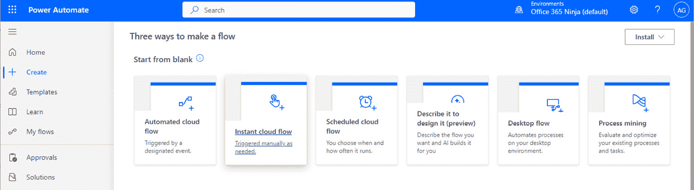

图 3.4 – Power Automate 门户

1.  在 **构建即时云流** 页面上，添加一个 **流名称** 值，然后选择 **手动触发流** 触发器。点击 **创建**：

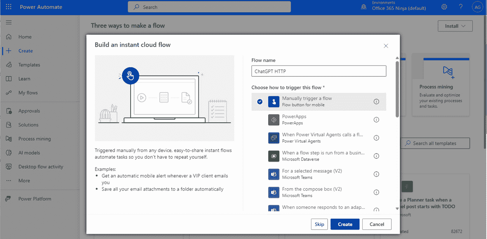

图 3.5 – 创建空白即时云流

1.  在画布区域，点击 **手动触发流** 以展开触发器。

1.  点击 **添加输入** 并选择 **文本** 输入类型：

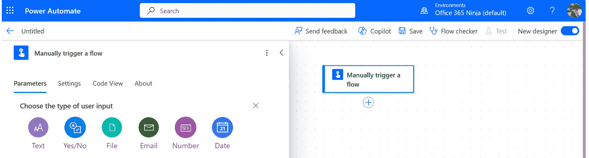

图 3.6 – 选择输入类型

1.  在 `提示` 中

为什么我的 Power Automate 画布看起来不同？

根据您的设置，您可能正在查看经典 Power Automate 画布或新的设计器界面。您可以使用页面右上角的 **新设计器** 开关在两种体验之间切换。界面略有不同，因此请随意调整并使用您更喜欢的任何一个。如果在设计过程中切换视图，您将需要在继续之前保存您的作品。

1.  点击 **新建步骤**。

1.  在 **选择操作** 对话框中，选择 **HTTP (高级)** 触发器：

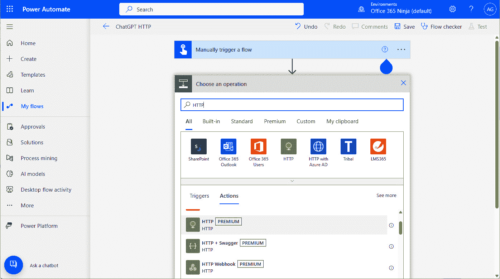

图 3.7 – 选择 HTTP (高级) 触发器

1.  在 HTTP 动作的第一个部分填写以下数据：

| **方法** | `Post` |
| --- | --- |
| **URI** | `https://api.openai.com/v1/chat/completions` |

接下来，您需要添加两个不同的头部。头部是在 HTTP 事务期间发送的信息数据。在这种情况下，您将发送一个包含您的 OpenAI API 密钥的 *Authorization* 头部，以及描述数据事务类型的 *Content-Type* 头部：

| **头部** | **值** |
| --- | --- |
| 授权 | `Bearer <OpenAI API key>` |
| 内容类型 | `application/json` |

最后，您需要为 `正文` 参数输入值。`正文` 将包含有关正在使用的模型类型、提示动态内容对象、要返回的完成数量以及其他指导信息。见 *图 3.8*：

| **正文** |
| --- |

```py
{
```

```py
  "model": "gpt-4",
```

```py
  "messages": [
```

```py
    {
```

```py
      "role": "system",
```

```py
      "content": "You are a helpful assistant."
```

```py
    },
```

```py
    {
```

```py
      "role": "user",
```

```py
      "content": "**TRIGGER DYNAMIC CONTENT**
```

```py
    }
```

```py
  ],
```

```py
  "max_tokens": 1000,
```

```py
  "temperature": 0,
```

```py
  "n": 1,
```

```py
  "stream": false,
```

```py
  "logprobs": null,
```

```py
  "stop": null
```

```py
}
```

|

输出结果如下所示：

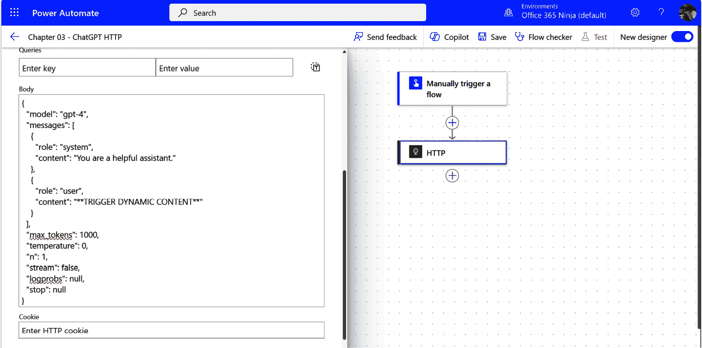

图 3.8 – 填写 HTTP 动作

1.  在 **正文** 部分，选择 ****TRIGGER DYNAMIC CONTENT****（包括方括号）并替换为通过点击闪电图标表示第 6 步提示的动态内容令牌：

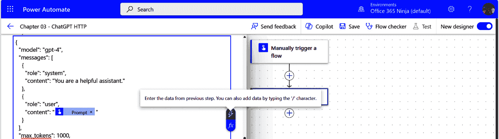

图 3.9 – 更新提示体

1.  点击 **保存**。

保存后，就是时候测试它了！

1.  点击菜单栏上的 **测试** 图标以验证其是否正常工作。

1.  在 **测试流程** 飞出菜单中选择 **手动** 单选按钮，然后点击 **测试**：

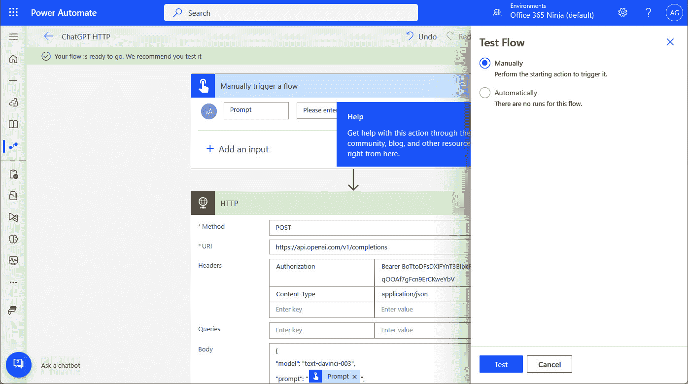

图 3.10 – 测试流程

1.  在提示中输入您的文本，然后选择 `列出烘焙蛋糕的成分`：

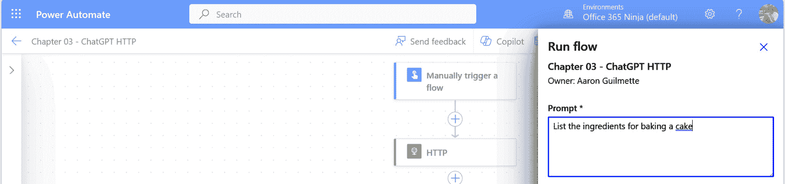

图 3.11 – 输入提示

1.  点击 **完成**。

1.  滚动到 **输出** 部分，然后查找 **正文** 字段。见 *图 3.9*：

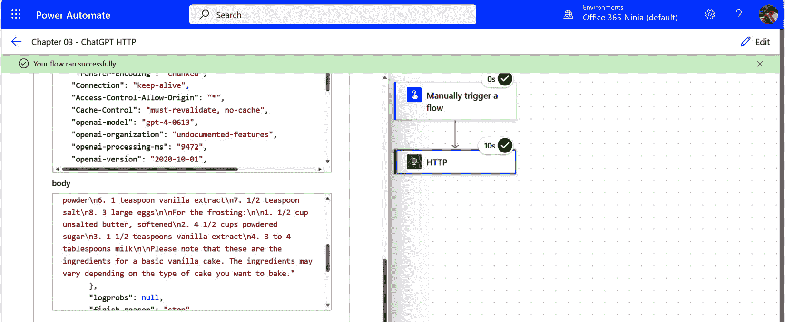

图 3.12 – 完成输出

现在您已经看到了如何以复杂的方式进行操作，让我们看看如何使用预构建的连接器。

## OpenAI GPT-3 完成内容

使用预构建的连接器使得与 ChatGPT 交互的任务变得更加简单。

我们将创建另一个即时云流程来查看其功能：

1.  启动网络浏览器并导航到 Power Automate 网络门户([`make.powerautomate.com`](https://make.powerautomate.com))。

1.  从导航菜单中，点击**创建**。然后，在**从空白开始**下选择**即时****云流程**。

1.  在**构建即时云流程**页面，添加**流程名称**值，然后选择**手动触发流程**触发器。点击**创建**。

转换方向

要在**手动触发流程**卡片中查看必要的选项，你需要切换到经典视图。完成后可以切换回来。

1.  在画布区域，点击**手动触发流程**以展开触发。

1.  点击**添加输入**并选择**文本**输入类型。

1.  在`上下文`。

1.  选择**上下文**输入的省略号（**…**），然后点击**添加选项****下拉列表**：

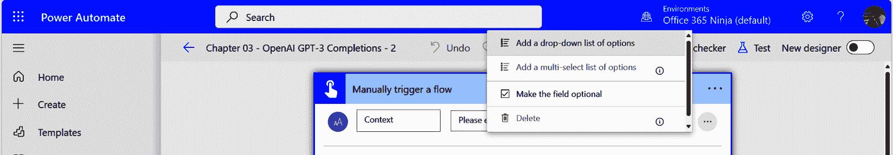

图 3.13 – 添加下拉列表

1.  用`user`角色填充列表。这将用于通知 GPT 谁在与系统交互。该字段区分大小写，因此请确保以小写输入：

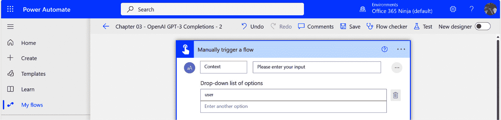

图 3.14 – 配置下拉列表

1.  点击**添加输入**并选择**文本**输入类型。

1.  在`提示`。

1.  点击**新建步骤**。

1.  在**选择一个操作**对话框中，在**OpenAI（独立发布者）**下选择**聊天完成（预览）**操作，如图*图 3*.12*所示：

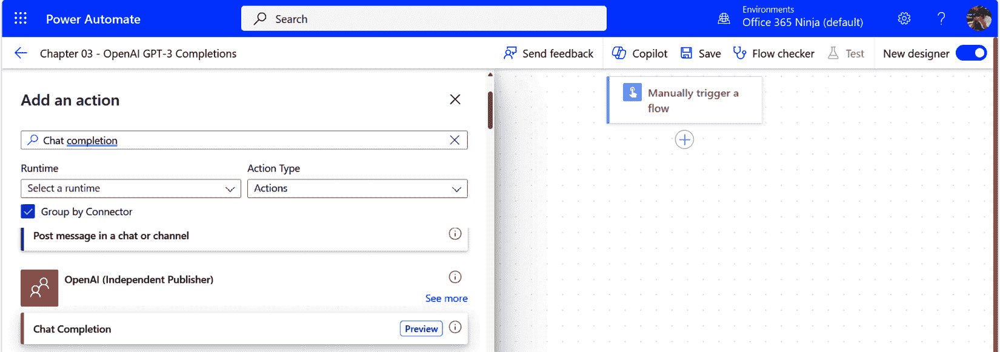

图 3.15 – 选择聊天完成（预览）操作

1.  在`Bearer <APIKEY>`格式下并点击**接受**：

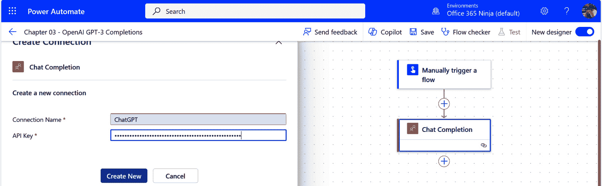

图 3.16 – 配置连接

1.  选择**高级参数**下拉菜单，然后选择**正文/模型**和**正文/消息**。

1.  在`gpt-3.5-turbo`。

关于模型

虽然有多个模型可供选择，但你最可能使用的最常见模型是**gpt-3.5-turbo**、**gpt-4**和**gpt-4-turbo**。gpt-3.5-turbo 模型是一个性价比极高的日常模型，而 gpt-4 模型则具有一些改进的功能调用支持，可以处理更多的标记。gpt-4-turbo 模型具有更高的标记计数支持，并且还具有视觉能力。在其他上下文中，你可能使用**dall-e-3**模型通过**图像 API**生成图像。

1.  在**正文/消息**区域，点击**添加****新项**。

1.  在`上下文`动态内容标记。

1.  在`提示`动态内容标记。

1.  在`1000`。见图*图 3*.17*：

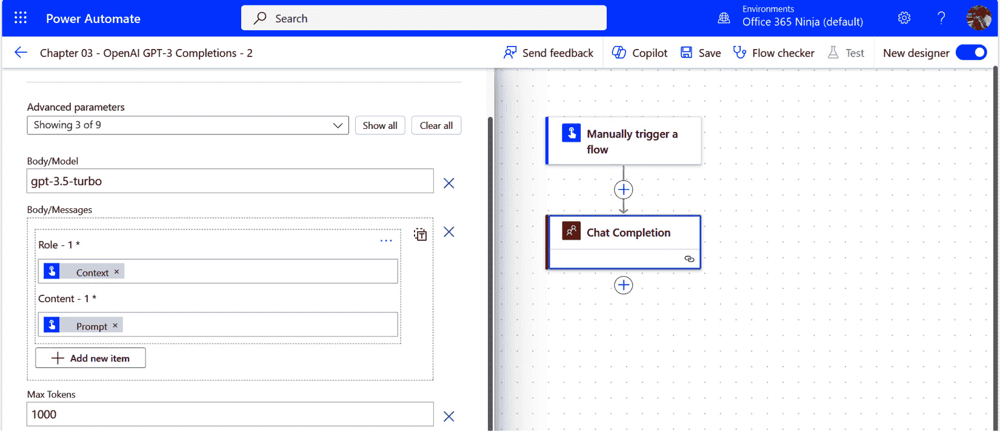

图 3.17 – 配置聊天完成卡片

1.  点击**保存**。

就像之前一样，让我们来测试一下：

1.  在菜单栏上点击**测试**图标。

1.  在**测试流程**弹出窗口中，选择**手动**单选按钮。

1.  如果提示，点击**继续**以登录并授权 OpenAI 连接。

1.  在 **上下文** 下拉菜单中，选择一个角色。

1.  在 `列出蛋糕的成分以及简要的制备说明`：

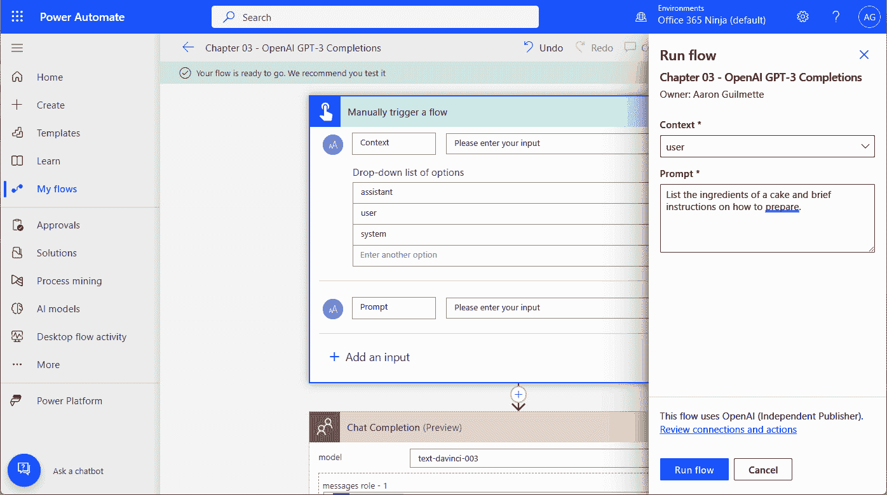

图 3.18 – 测试 OpenAI Chat Completions 流

1.  点击 **运行流程**。

1.  点击 **流程运行页面** 以重定向到运行历史记录。

1.  选择运行，然后滚动到 **输出** 部分的 **Choices** 区域以查看详细数据：

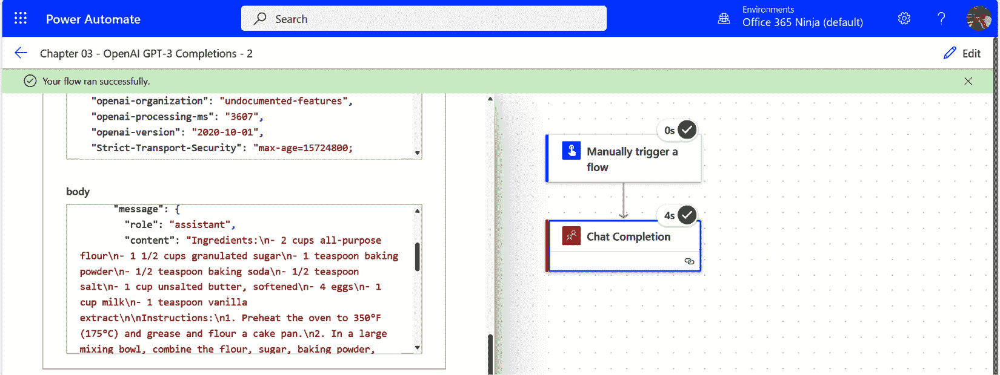

图 3.19 – 查看输出

到目前为止，一切顺利！

现在你有了这个输出，下一步是什么？你可以将这个输出输入到其他流程或过程中！

# 从 ChatGPT 获取数据

当你审查测试流程的输出时，你可能会注意到 ChatGPT 的答案（或响应）是以特定的方式组织的：

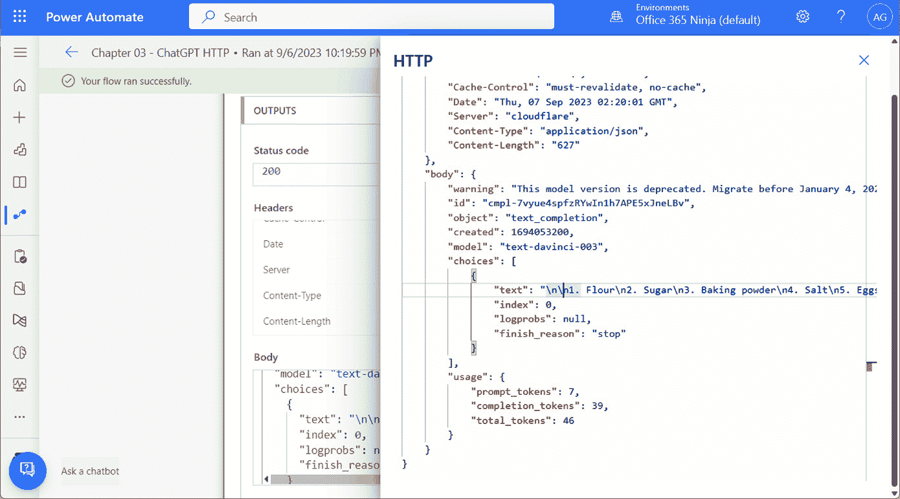

图 3.20 – ChatGPT 响应数据

结构，它是 `name:value` 对结构或表示法。

## 那么，JSON 究竟是什么呢？

让我们来看看我们例子中的几个字段：

```py
"body": {
        "object": "text_completion",
        "model": "gpt-3.5-turbo",
        "choices": [
            {
                "text": "\n\n1\. Flour\n2\. Sugar\n3\. Baking powder\n4\. Salt\n5\. Eggs\n6\. Milk\n7\. Butter or oil\n8\. Vanilla extract",
                "index": 0,
                "logprobs": null,
                "finish_reason": "stop"
            }
        ],
        "usage": {
            "prompt_tokens": 7,
            "completion_tokens": 39,
            "total_tokens": 46
        }
    }
```

在这个例子中，body 标签或名称用于表示 JSON 响应的内容。在 `name:value` 上下文中，`body` 是名称，而大括号 `{` 和 `}` 之间的所有内容都是其值。

JSON 还允许你使用相同的结构或表示法嵌套对象。在这种情况下，下一个 `name:value` 对是 `"object": "text_completion"`，将 `object` 定义为 `name`，将 `text_completion` 定义为其值。这种嵌套 `name:value` 对的过程可以扩展到 64 个级别。

除了简单的 `name:value` 对之外，JSON 还支持数组构造。一个 `name:value` 对表示名称与其对应值之间的一对一关系，而数组可以被视为一对多关系。例如，我有五个孩子：

+   Liberty

+   Hudson

+   Glory

+   Anderson

+   Victory

+   确实是一个孩子的数组！在 JSON 中，数组对象由方括号 `[` 和 `]` 表示。

+   如果我用 JSON 格式描述我的孩子，我可能会构建一个像这样的数据样本：

```py
{
"children": [
          "Liberty",
          "Hudson",
          "Glory",
          "Anderson",
          "Victory"
     ]
}
```

JSON 数组对象也可以包含它们自己的 `name:value` 对，每个分组由其自己的大括号集合表示。

+   这里有一个例子：

```py
{
     "children": [
          {
               "name": "Liberty",
               "age": "20"
          }
          {
               "name": "Hudson",
               "age": "18"
          }
          {
               "name": "Glory",
               "age": "16"
          }
          {
               "name": "Anderson",
               "age": "14"
          }
          {
               "name": "Victory",
               "age": "12"
          }
     ]
}
```

JSON 的一个好处是它易于阅读和理解。

现在我已经通过在书中突出他们的特点来满足孩子们，让我们回到处理 ChatGPT 的 JSON 格式化输出的任务上来。

## 在 Power Automate 中处理 ChatGPT 的 JSON 输出

我们可以只打印响应体，但正如你在图 3.15 中看到的，响应体包含的不仅仅是文本输出。我们真正想要的数据存储在 `choices` 子对象中的一个 `name:value` 对中。为了只访问这部分数据，我们将使用 `compose` 动作中的表达式来提取我们想要的输出，并将其保存到变量中以供以后使用。

从 Power Automate 流程中，你可以按照以下步骤操作：

1.  在**HTTP**操作之后，选择**新建步骤**：

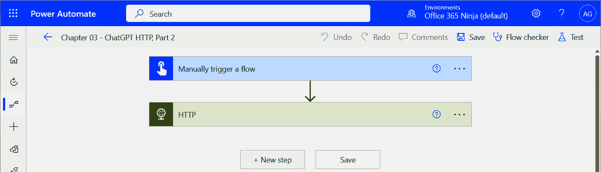

图 3.21 – 添加新步骤

1.  在**选择一个操作**框中，搜索并选择**Compose**操作。

1.  选择**Compose**操作的**输入**框。如果需要，点击**添加动态内容**链接以显示弹出窗口。

1.  在表达式构建器框中，开始键入`outputs`并选择**outputs**函数：

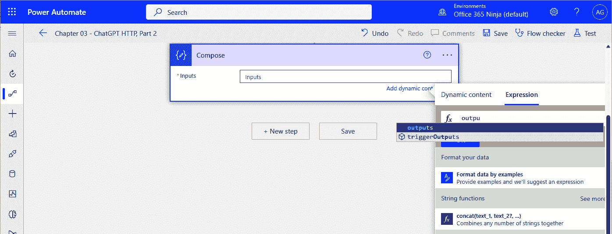

图 3.22 – 添加 triggerOutputs 函数

1.  你可以用以下文本完成其余的功能：

    ```py
    outputs('HTTP')?['body/choices'][0]['text']
    ```

    让我们深入探讨这个表达式：

    在这个例子中，`'HTTP'`引用了前面的操作。我们正在寻找该操作的结果（因此使用`outputs`函数）。`?`字符用于选择我们想要引用的元素、参数或子对象。在这种情况下，我们正在选择 body 元素。从查看测试流程的输出*图 3.20*中，我们知道 body 元素本身有许多子元素或子对象（`body/choices`）。

    根据生成的输出类型，`[0]`)。我们在这个元素内部寻找的名称/值对的名称是**text**。

    因此，当阅读表达式时，它说“*使用 HTTP 操作的输出，在 body/choices 元素中查找，选择第一个元素，然后在该元素内部，捕获* *text 对象*的值。”

1.  然后，点击**添加步骤**。

1.  选择**初始化** **变量**操作。

1.  在`ComposeOutput`中，并将**类型**设置为**字符串**。

1.  在**值**框中，添加表示**Compose**变量**输出**内容对象的动态内容令牌，如图*图 3.23*所示：

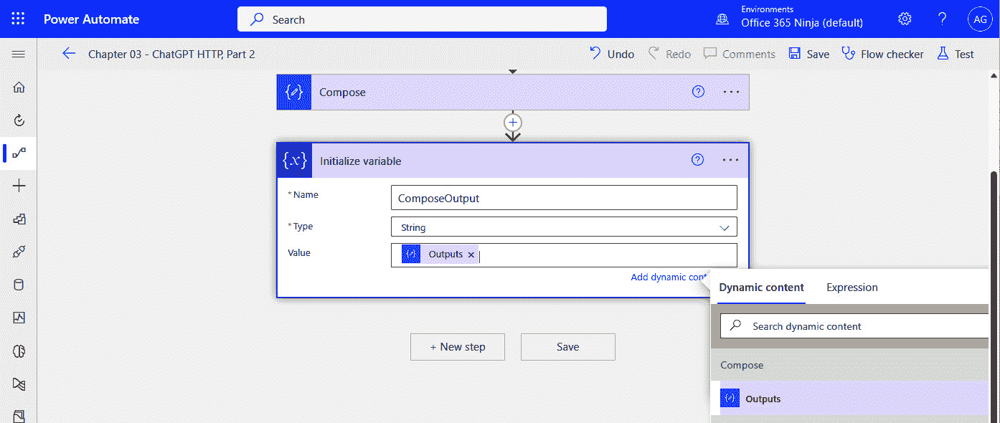

图 3.23 – 添加初始化变量步骤

1.  当你完成时，点击**保存**然后重新测试。

在这一点上，你可以转到流程的运行历史记录并检查输出：

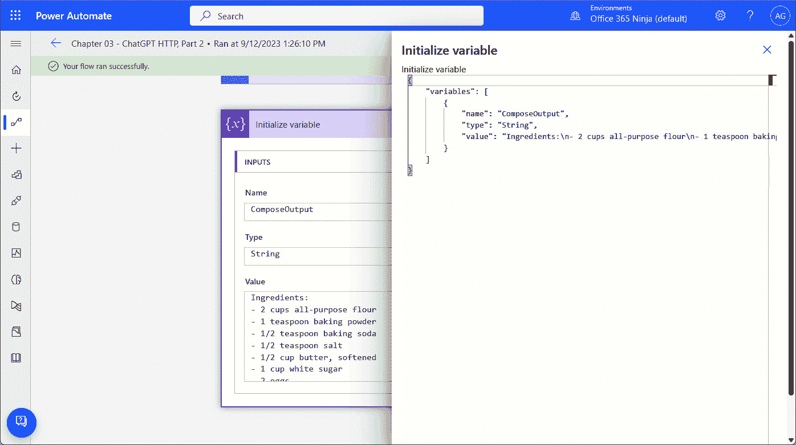

图 3.24 – 查看流程的输出

就这样！你已经成功地将数据发送到 ChatGPT 并接收了数据（并且在过程中学习了一些关于 JSON 的知识）。

# 摘要

在本章中，你迈出了使用 ChatGPT 和生成式 AI 与 Power Platform 相结合的第一步。通过你创建的示例流程，你能够接收输入，使用两个不同的操作将其发送到 ChatGPT，然后提取响应。

在下一章，我们将探讨使用 AI 来帮助构建更复杂的流程。
