# 7

# 使用 Power Automate 和 AI 构建 PowerPoint 演示文稿

如果您曾经面临过为老板或活动俱乐部准备演示文稿的最后一刻要求，您并不孤单。无论是熟悉的内容还是您以前从未见过的内容，压缩信息并使其对观众易于理解都不是一件小事情。

在本章中，我们将从大家最喜欢的开源知识库维基百科开始，使用 ChatGPT 总结其部分内容并将其插入到 PowerPoint 演示文稿中。

通过一点调整，您可以在存储在 SharePoint、内部企业网站或其他数字内容源中的文档上重复使用这种类型的摘要工具。

# 许可证要求

在 Power Platform 中使用 AI 模型和连接器的几个先决条件：

+   包含 Microsoft Dataverse 的订阅

+   AI Builder 容量（或试用容量）

+   Power Apps 或 Power Automate 高级许可证

如果您尚未启用 Dataverse 和 AI Builder 容量，请参阅*第二章*，*配置支持 AI 服务的环境*，以及*第六章*，*使用情感分析处理数据*。

由于 Power Automate 没有内置的 PowerPoint 连接器，这个特定的解决方案需要第三方连接器产品，由软件供应商**Encodian**提供。此连接器允许您将标准的 Power Automate 对象转换为 PowerPoint 内容。

Encodian 在[`www.encodian.com/product/flowr/`](https://www.encodian.com/product/flowr/)提供免费的 30 天试用，包括 500 个积分的 Flowr 连接器：

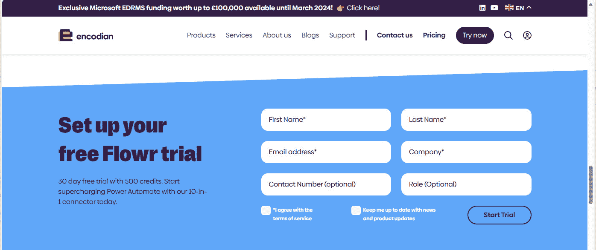

图 7.1 – 设置 Flowr 试用

在注册后，您将收到一个 API 密钥（如图*图 7.2*.2*所示），您可以使用它来配置 Power Automate 中的 Encodian 连接器：


图 7.2 – Encodian API 密钥示例

一旦激活，您将想要创建一个通用的 PowerPoint 模板文件，这样您就可以在需要时保存和重复使用它！

# 了解 Encodian Flowr 连接器

在您开始处理流程之前，您需要了解如何使用 Encodian Flowr 连接器和其动作。在本节中，我们将查看使此流程正常工作所需的关键部分。为了成功使用连接器和动作，您需要了解以下概念、术语和动作：

+   输入格式化

+   令牌

+   **填充** **PowerPoint** 动作

+   **合并** **演示文稿** 动作

让我们快速浏览一下这些领域的每个部分！

## 输入格式化

Encodian 的许多内容操作都需要使用结构化数据。在这种情况下，结构化数据通常以**JavaScript 对象表示法**（**JSON**）语法提供：

```py
{
   "object1" : "value1",
   "object2" :  "value2—electric boogaloo"
}
```

如此简单示例所示，JSON 文本格式化为**键/值**（想想*术语：定义*）对。JSON，就像许多编程结构一样，也有**数组**或**集合**的概念。数组或集合是一组相似的对象。

假设你想要列出一个包含各种食物的集合。当格式化为 JSON 时，它可能看起来像这样：

```py
{
  "foods": [{
    "category": "fruit",
    "data": [
      {"type": "orange","count": 1},
      {"type": "strawberry","count": 7},
      {"type": "apple","count": 3}]
    },
  {
    "category": "grain",
    "data": [
      {"type": "sorghum","count": 1},
      {"type": "wheat","count": 3}]
  }]
}
```

在`foods` JSON 对象中，你可以看到如何指定数据值的几个示例。既有标准键/值对（如`"category":"fruit"`），用于标识单个对象，也有数组（如`"data": [{"type": "sorghum","count":1},{"type":"wheat","count": 3}]`），用于标识键/值对组。

JSON 对象可以包含各种数据类型，包括**字符串**（文本）、**整数**（数字）、**数组**（字符串或键/值对的集合）、**布尔**值（True 或 False），以及其他 JSON 对象。

进一步阅读

JSON 是一种非常灵活的格式，用于处理结构化内容，因为它既易于阅读，又与平台和语言无关。有关处理 JSON 对象和语法的更多信息，请参阅[`www.w3schools.com/JS/js_json_intro.asp`](https://www.w3schools.com/JS/js_json_intro.asp)。你还可以使用[`jsonformatter.org/`](https://jsonformatter.org/)等工具来帮助确保你的 JSON 格式正确。

## 标记

Flowr 的几个操作与特别格式化的**标签**（或 Encodian 所说的**标记**）一起工作，连接器将使用这些标签以查找和替换的方式与您提供的内容一起使用。

例如，假设你想要 Flowr 将单词或短语“The quick brown fox did some things”放入一个文档中。你可能会决定将这个短语分配给名为`fox`的标记。在文档模板中，你会通过输入一系列方括号和尖括号包围的标记名称来指示你想要此文本出现的位置：

```py
<<[fox]>>
```

请参阅*图 7**.3*以了解 PowerPoint 幻灯片中一个标记的示例：

![图 7.3 – 在 PowerPoint 幻灯片中查看<<[fox]>>标记](img/B21234_07_03.jpg)

图 7.3 – 在 PowerPoint 幻灯片中查看<<[fox]>>标记

## 填充 PowerPoint

**填充 PowerPoint**操作正是其名称所表示的——它是将内容放入 PowerPoint 幻灯片的主要操作。在分配标记值后，**填充 PowerPoint**操作将搜索模板文件，用值替换标记。此操作的输入将是标记/内容键/值对以及任何源 PowerPoint 模板文件。输出将是一个完成的 PowerPoint 幻灯片。

## 合并演示文稿

最后，可以使用**合并演示文稿**操作将修改后的 PowerPoint 页面编译成一个单一、连贯的文档。输入将是生成的 PowerPoint 文件（通常，每个文件一个幻灯片）和输出将是一个多幻灯片的 PowerPoint 演示文稿。

现在你已经熟悉了我们将要在流程中使用的核心概念，是时候开始工作了！

# 与维基百科文章交互

由于本例中内容的来源将是一个维基百科文章，因此了解如何收集数据非常重要。维基百科有一个 API 端点 ([`en.wikipedia.org/w/api.php`](https://en.wikipedia.org/w/api.php))，它以 JSON 格式返回页面内容，如图 7.4 所示：

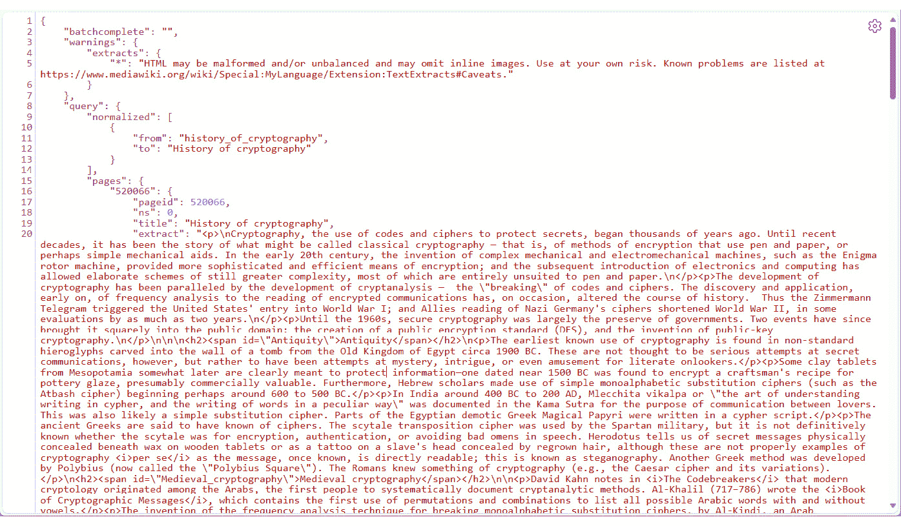

图 7.4 – 查看维基百科文章的 JSON 输出

链接是通过以下组件构建的：

+   API URL：[`en.wikipedia.org/w/api.php`](https://en.wikipedia.org/w/api.php)

+   **操作**参数：查询

+   **格式**参数：JSON

+   **标题**参数：维基百科文章的标题

+   属性（**Prop**）参数：提取（文章的全部内容）

我们将使用的数据本身位于 **extract** 节点中，嵌套在 **query** JSON 对象内。

在审阅维基百科文章时，你可能会注意到标题是 2 级标题 (`<H2>`) 标签和 3 级标题 (`<H3>`) 标签的混合，其中 `<H2>` 标签用作主要主题标题，而 `<H3>` 标签表示子主题。对于这个流程，我们将专注于将 `<H2>` 标签内的内容作为一个单元处理。*图 7.5* 展示了文本作为 `<H2>` 标题显示的示例：

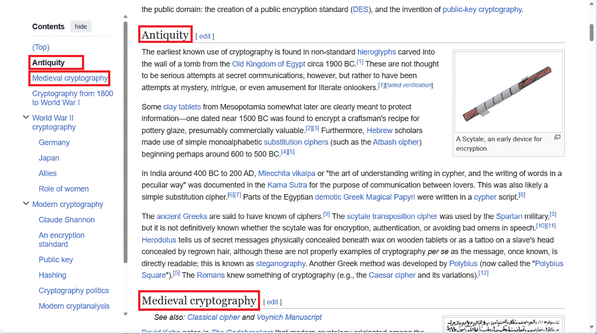

图 7.5 – 查看维基百科文章

你可以通过查看所选网络浏览器中的文档源来确认这一点，如图 7.6 所示：

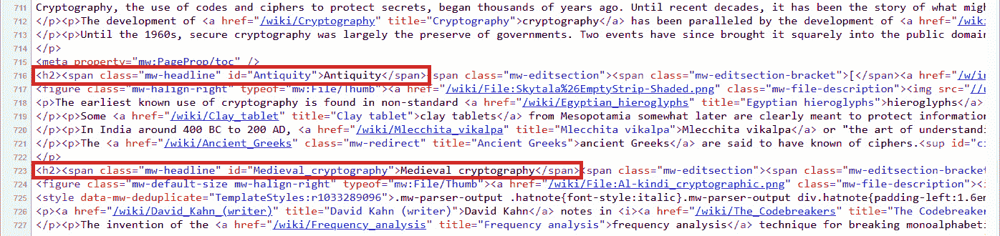

图 7.6 – 查看维基百科文章的源代码

在使用这些信息方面，我们将使用以下结构来总结内容：

```py
{
     "title" : "value of the <H2> tag"
     "page" : "1 of number of <H2> tags"
     "content" : "AI-generated summary of the content following an <H2> tag"
}
```

将其转换为 Flowr 连接器的工作方式，我们将创建三个标记：

```py
<<[title]>>
<<[page]>>
<<[content]>>
```

现在你已经对如何操作有了基本的了解，让我们创建一个 PowerPoint 模板来存放生成的内容！

# 创建 PowerPoint 模板

在执行任何流程之前，你需要创建一个模板，以便 **填充 PowerPoint** 动作有所操作。对于这个示例，我们将在模板文件中使用单个幻灯片。

要创建一个简单的模板文件，请按照以下步骤操作：

1.  启动 PowerPoint 并选择 **新建**。你可以选择 **空白演示文稿** 或使用主题模板文件：

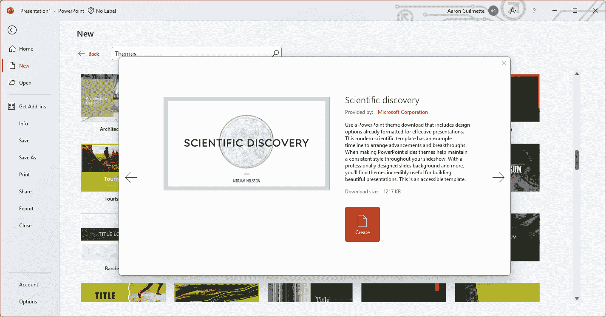

图 7.7 – 创建新的模板文件

1.  编辑文件的内容，将其放置在你之前识别的标记中。你可以对标记应用格式，例如 **加粗** 或 *斜体*：

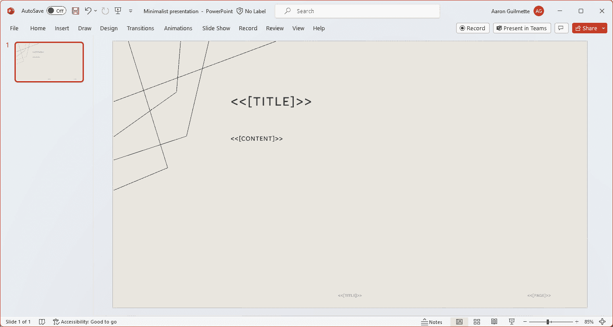

图 7.8 – 使用内容标记更新模板

1.  将文档保存在 SharePoint 或 OneDrive for Business 网站上：

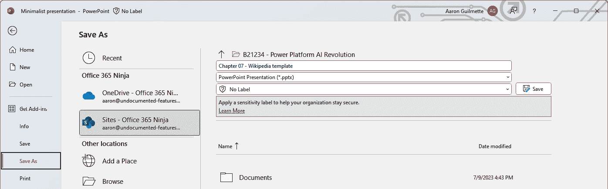

图 7.9 – 保存 PowerPoint 模板文件

完成这些后，是时候开始构建我们的流了！

# 创建流

流将由两个执行离散操作的章节组成，分为作用域以帮助管理：

+   **作用域 1**：生成内容摘要

+   **作用域 2**：向 PowerPoint 模板添加内容

关于作用域

Power Automate 包含一个经常被忽视的控制对象，称为**作用域**。作用域本质上是一个逻辑容器，可以用来将操作分组。作用域可以展开和折叠，使您更容易可视化和管理复杂流的部分。

虽然这个流使用了作用域，但它们本质上是有组织的对象。如果你不习惯添加它们，你不需要这么做。

如果我遇到困难怎么办？

如果由于某种原因遇到障碍（找不到功能、选项没有显示或某些内容不清楚），帮助只需点击一下！您可以从我们的 GitHub 网站下载本章的工件：[`github.com/PacktPublishing/Power-Platform-and-the-AI-Revolution`](https://github.com/PacktPublishing/Power-Platform-and-the-AI-Revolution)。

## 创建生成内容摘要的作用域

要开始创建流，请按照以下步骤操作：

1.  导航到 Power Automate Maker Portal ([`make.powerautomate.com`](https://make.powerautomate.com))。

1.  从导航窗格中选择**创建**。然后，在**从空白开始**下选择**即时****云流**。

1.  在**构建即时云流**页面，输入**流****名称**值。

1.  在**选择触发此流的方式**下，选择**手动触发流**。然后，点击**创建**：

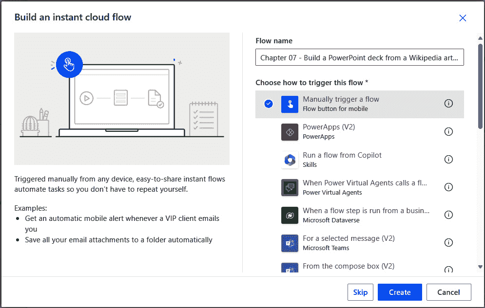

图 7.10 – 创建新流

1.  点击**手动触发流**操作以展开**手动触发****流**弹出菜单。

1.  选择**参数**选项卡并选择**添加****一个输入**：

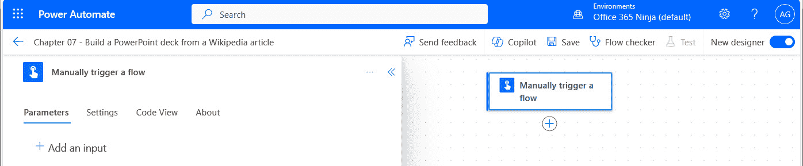

图 7.11 – 添加输入

1.  对于**选择用户输入类型**提示，选择**文本**输入类型。

1.  如果需要，修改输入提示，使用描述应提供的内容类型的描述 – 例如，`输入维基百科` `文章 URL`：

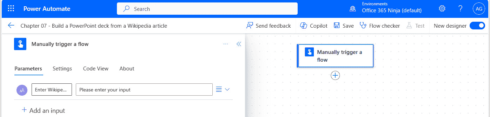

图 7.12 – 自定义文本输入提示

1.  在**手动触发流**卡片下，点击**+**然后**添加****一个操作**。

1.  在`作用域`中，选择**作用域****控制**操作：

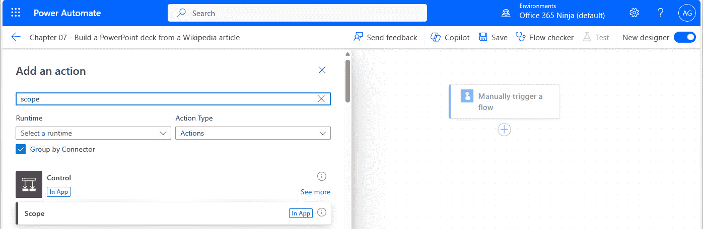

图 7.13 – 添加作用域控制操作

1.  通过点击**作用域**并编辑字段来点击深红色的`Scope – Generate Summaries`：

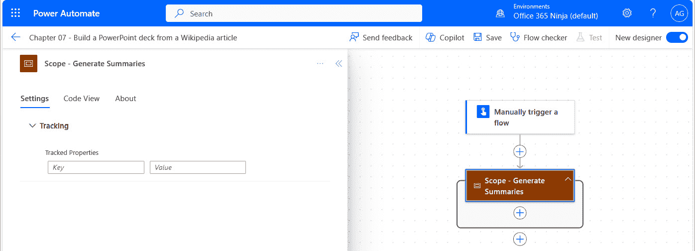

图 7.14 – 更新作用域的名称

1.  在画布上的**范围**卡片中，点击**+**图标然后选择**添加** **一个操作**。

1.  在**添加操作**弹出菜单中，选择**Compose**操作：

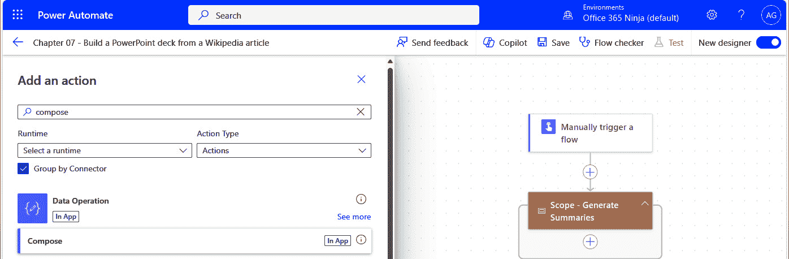

图 7.15 – 添加 Compose 操作

1.  在`/`字符处或点击*𝑓**x*图标以打开`last(split(triggerBody()?['text'],'/'))`并点击`/`字符作为分隔符，表达式将取文本输入字符串的最后一个值（来自`History_of_Cryptography`。见*图 7**.13*）：

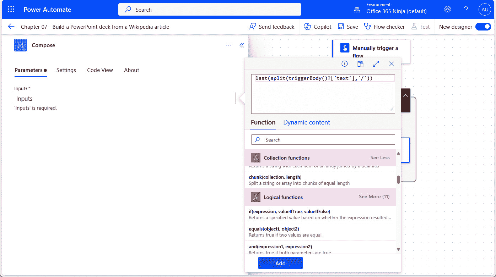

图 7.16 – 添加表达式

1.  在**范围 – 生成摘要**控制卡片中，在**Compose**卡片之后点击**+**并选择**添加** **一个操作**。

1.  在**添加操作**弹出菜单中，选择**HTTP**操作。

1.  在`/`字符处或点击*𝑓**x*图标以打开`concat('https://en.wikipedia.org/w/api.php?action=query&format=json&titles=',outputs('Compose'),` **'&prop=extracts')**并点击`CONCAT`函数以组合维基百科 API 端点、查询和格式化参数以及提取的标题值：

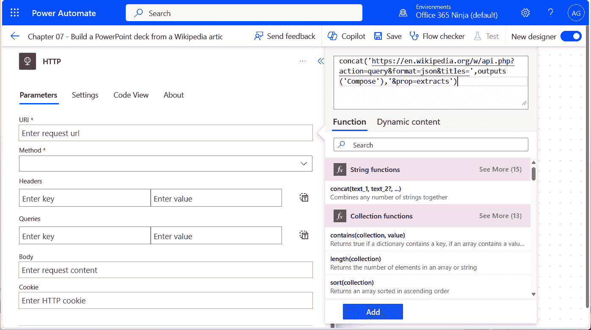

图 7.17 – 自定义 HTTP 操作

1.  在**方法**下拉菜单中，选择**GET**。

1.  点击**保存**。不要退出 Power Automate 流程画布。

接下来，我们将开始配置内容处理。

## 配置 JSON 参数

在本节中，我们将导入 JSON 模式或内容结构的定义。要获取模式输出，您需要手动构造带有必要参数的 API 端点，然后插入文章名称。按照以下步骤操作：

1.  打开一个新的浏览器标签页，导航到[`en.wikipedia.org`](https://en.wikipedia.org)，并搜索你选择的任何文章。在这个例子中，`/`字符 – 例如，`History_of_cryptography`。见*图 7**.1**8*：

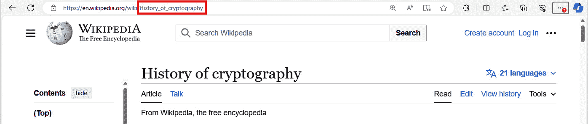

图 7.18 – 提取维基百科文章的相对 URL

1.  打开一个新的浏览器标签页并导航到维基百科 API 端点：[`en.wikipedia.org/w/api.php`](https://en.wikipedia.org/w/api.php)。

1.  在 URL 末尾附加`?action=query&format=json&prop=extracts&titles=`然后将复制的维基百科文章值粘贴到 URL 栏的末尾 – 例如，`?action=query&format=json&prop=extracts&titles=History_of_cryptograpy`。结果应该是一个包含维基百科文章文本的 JSON 格式对象，如图*图 7**.1**9*所示：

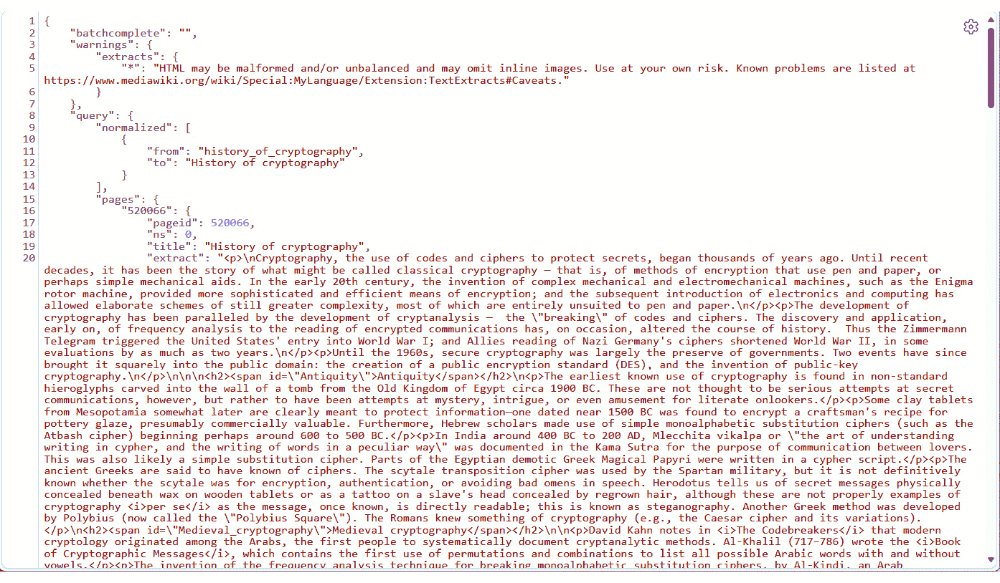

图 7.19 – 查看维基百科 API 的 JSON 输出

1.  选择所有内容（*Ctrl* + *A*）并将其复制到缓冲区（*Ctrl* + *C*）。

1.  切换回包含 Power Automate 流程的浏览器标签页。

1.  在**范围 – 生成摘要**控制卡中，在**HTTP**卡之后，点击**+**并选择**添加****一个操作**。

1.  在**添加操作**弹出菜单中，选择**解析****JSON**操作：

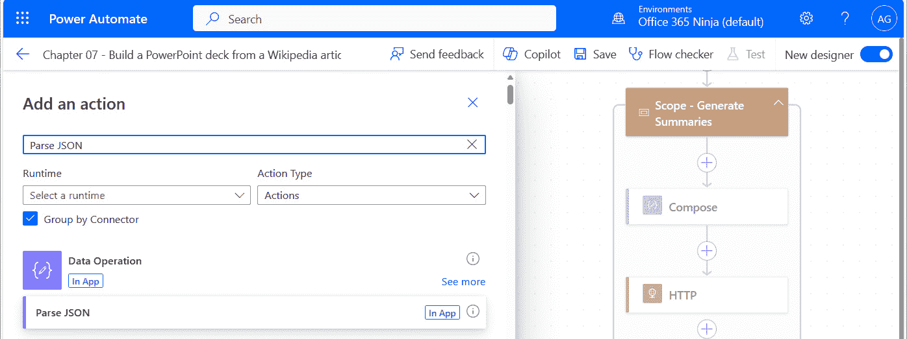

图 7.20 – 添加解析 JSON 操作

1.  在**解析 JSON**弹出菜单中，选择**参数**选项卡。

1.  在**内容**文本区域内部，选择动态内容图标，然后选择**HTTP**操作的**输出**对象：

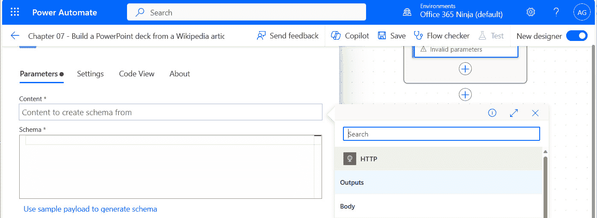

图 7.21 – 添加 HTTP 输出对象

1.  将缓冲区的内容粘贴到**模式**区域，如图*图 7**.**22*所示：

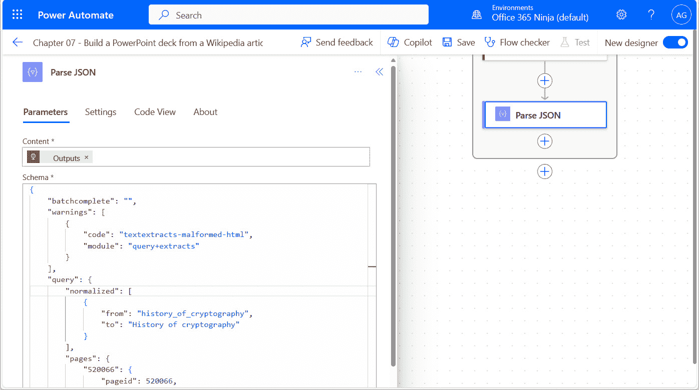

图 7.22 – 使用维基百科 API 输出填充内容

1.  点击**保存**图标。不要退出 Power Automate 流程画布。

## 自定义 GPT 提示

与完成提示一起工作，既是一门艺术，也是一门科学。要获得一致的良好结果，可能需要进行大量的微调。

提示框架

正如古语所说，“垃圾输入，垃圾输出。”AI 模型变得越来越复杂，能够理解指令。为了获得好的结果，你需要提供好的指令。就像人们可以通过例子模仿和学习一样，AI 模型也可以。提示框架是帮助解释符合你期望的结果类型的一种方式。有关常见提示框架的示例，请访问[`www.undocumented-features.com/2023/12/15/chatgpt-patterns-practices-and-prompts/`](https://www.undocumented-features.com/2023/12/15/chatgpt-patterns-practices-and-prompts/)。

在本节中，你将创建一个自定义提示，ChatGPT 可以使用它来构建数据对象。按照以下步骤操作：

1.  在**范围 – 生成摘要**控制卡中，在**解析 JSON**卡之后，点击**+**并选择**添加****一个操作**。

1.  在**添加操作**弹出菜单中，选择**使用提示创建文本**操作：

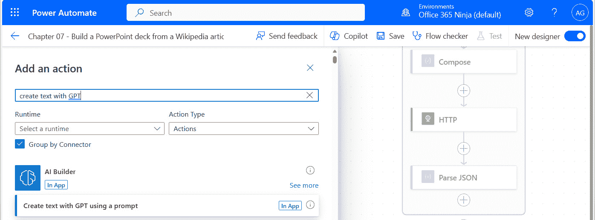

图 7.23 – 添加使用提示创建文本的操作

1.  在**提示**下拉菜单中，选择**新****自定义提示**：

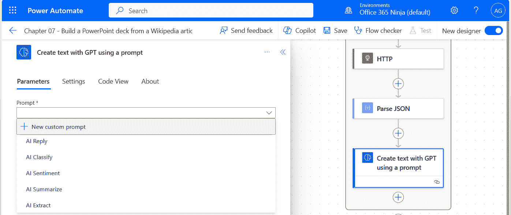

图 7.24 – 选择新的自定义提示选项

1.  给提示命名，例如`Summarize` `Wikipedia article`。

1.  在**提示**区域，粘贴类似于以下提示的文本：

    ```py
    You are generating content for a PowerPoint slide deck. Your input is a Wikipedia article. The output must be a well-structured JSON array and must adhere to the length requirement of 75 words or less. Each slide will be represented as an object inside the JSON array. Write a summary of the input body('Http') .
    Data is divided into sections separated by use of the H2 HTML tag. Each H2 section should be summarized as a separate paragraph. For every H2 tag, generate only one paragraph. The content summarization paragraph must be limited to a maximum of 75 words long. Each section will be used as a separate page in a slide deck. Each paragraph should be represented as an individual JSON object. Each object must include the following components:
    Title: Use the text of the HTML H2 tag
    Page: Page information in the form of "x of y," where x is the current page or paragraph, and y is the total number of slides that will be generated
    Content: The formatted paragraph data from each H2 tag, limited to a maximum length of 75 words.
    Do not deviate from the provided JSON format:
    [{
    "title" : "Hanging gardens of Babylon",
    "page" : "1 of 1"
    "content" : "The hanging gardens of Babylon are one of the seven wonders of the ancient world. The exquisite, tiered gardens contained a wide variety of trees, shrubs, flowers, and vines. According to legend, the Hanging Gardens were built by King Nebuchadnezzar for his wife, Queen Amytis, because she missed the gardens and landscape from her homeland. The exact location of the Hanging Gardens has never been definitively established." }]
    Ensure the output of the JSON array is well-formatted, with a separate object for each paragraph and the content keyword not to exceed 75 words.
    ```

以下截图显示了这一点：

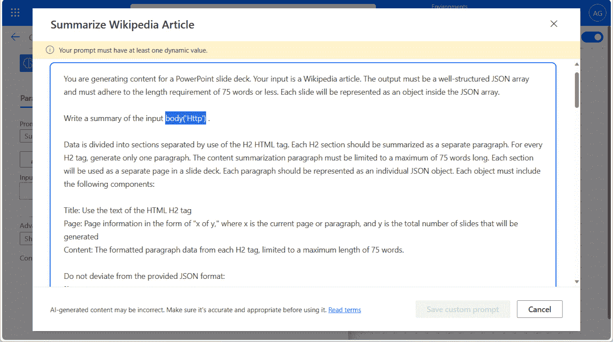

图 7.25 – 添加提示值

1.  注意横幅，表明需要动态值。通过按*Ctrl* + *C*复制*图 7**.20*中高亮的值，**body(‘Http’)**。然后，点击**添加动态值**。提示中的高亮部分应替换为动态值占位符。请参阅*图 7**.2**6*：

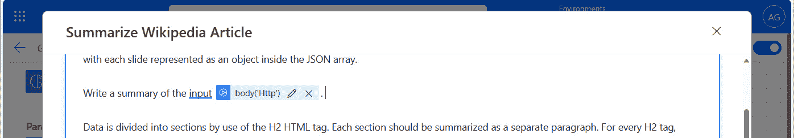

图 7.26 – 查看更新的动态值标记

1.  要测试提示，滚动到提示定制区域的底部。切换到包含维基百科 API 内容的浏览器标签，全选并使用*Ctrl* + *C*将其复制到您的计算机缓冲区：

1.  切换回包含定制 AI 提示的浏览器标签。在**测试你的提示**区域，粘贴复制的维基百科 API 输出，如图*图 7**.2**7*所示：

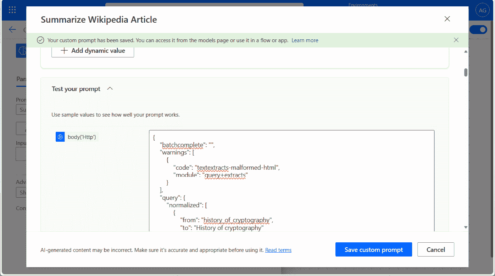

图 7.27 – 将数据加载到测试你的提示区域

1.  滚动到**测试你的提示**区域的底部并点击**测试提示**。

1.  等待 AI Builder 提示生成响应。检查响应以确保它符合您的要求：

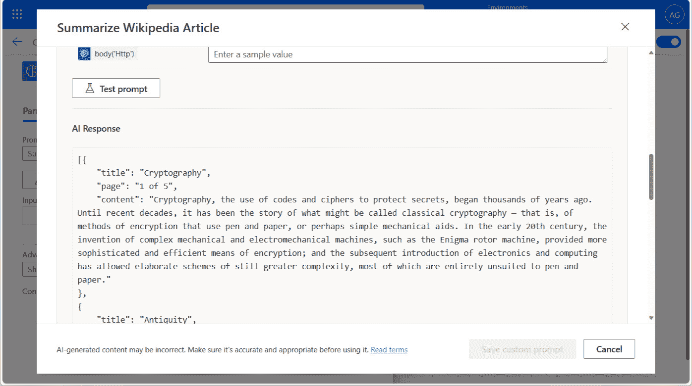

图 7.28 – 查看 AI 生成的文本内容

1.  点击**Input Body(‘Http’)**字段内部，选择动态内容图标，然后选择**解析 JSON**动作的**Body**对象：

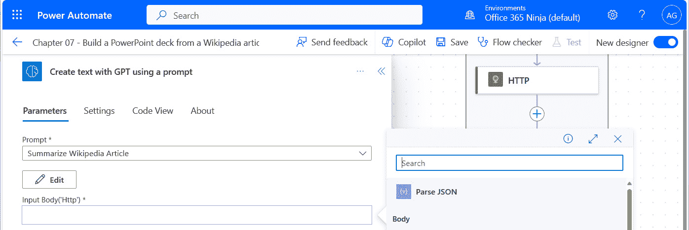

图 7.29 – 将 Body 对象添加到输入 Body(‘Http’)字段

1.  点击**创建文本**后使用 GPT 的提示动作旁边的**+**图标，并选择**添加** **一个动作**。

1.  选择**解析 JSON**动作。此动作将 GPT 输出转换为可以稍后遍历的数组对象。

1.  在**解析 JSON**动作弹出窗口中，将动作重命名为**解析 JSON –** **创建数组**。

1.  在**参数**选项卡中，点击**内容**字段内部。选择动态内容图标，然后在**创建文本**后使用 GPT 的提示动作下选择**文本**标记。见*图 7**.**30*：

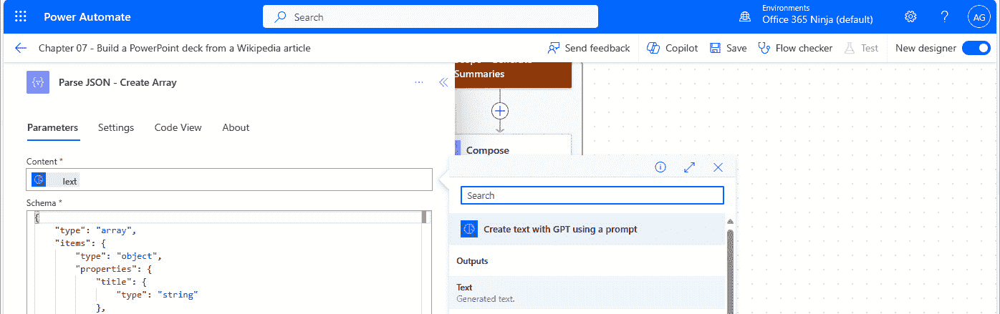

图 7.30 – 添加文本动态内容标记

1.  在**模式**区域，复制并粘贴以下内容：

    ```py
    {
        "type": "array",
        "items": {
            "type": "object",
            "properties": {
                "title": {
                    "type": "string"
                },
                "page": {
                    "type": "string"
                },
                "content": {
                    "type": "string"
                }
            },
            "required": [
                "title",
                "page",
                "content"
            ]
        }
    }
    ```

    此模式定义可以通过运行到这一点为止的流程，复制输出，然后将其粘贴到**解析** **JSON**弹出窗口上的**使用样本有效载荷生成模式**中获取。

1.  点击**保存**。不要关闭 Power Automate 流程画布。

到目前为止，您已创建了一个可以接受维基百科文章 URL 并将其总结为各自的 JSON 对象的流程。接下来，我们将处理将数据发送到 PowerPoint 模板的工作。

## 创建生成幻灯片的作用域

在本节中，我们将把 JSON 对象数组转换为 PowerPoint 幻灯片。按照以下步骤处理 AI 生成的文本内容：

1.  在画布上滚动到流程的底部并选择**+**图标，位于**Scope – Generate** **Summaries**控制之外：

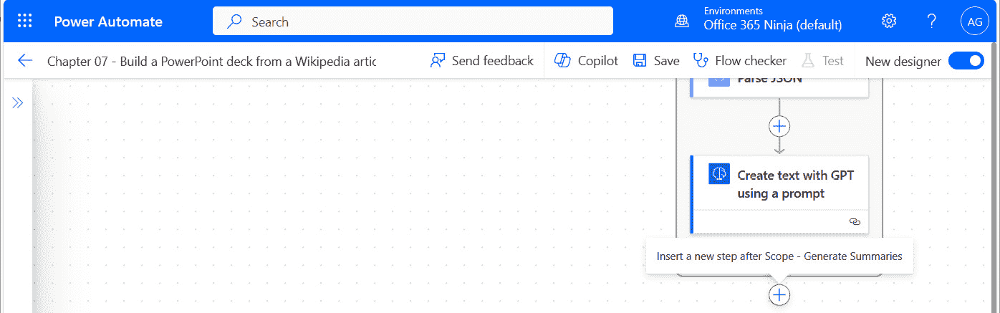

图 7.31 – 添加新步骤

1.  添加一个新的作用域控制，并将其重命名为`Scope -` `Generate Slides`。

1.  点击“**+**”图标并在“**范围 - 生成幻灯片**”卡片内选择“**添加**”**操作**。

1.  根据您保存模板文件的位置，选择 SharePoint Online 或 OneDrive for Business 的**获取文件内容使用路径**操作：

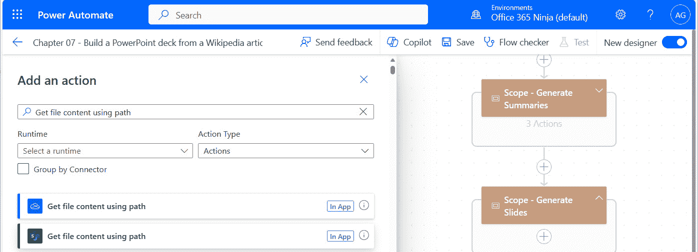

图 7.32 – 添加获取文件内容使用路径操作

1.  在“**获取文件内容使用路径**”弹出窗口中，定位文件。如果您使用的是 OneDrive for Business 操作，请使用文件夹浏览器选择**文件路径**字段。如果您使用的是 SharePoint Online 操作，请选择文件所在的**站点地址**值，然后在“**文件路径**”字段中使用文件夹浏览器选择文件：

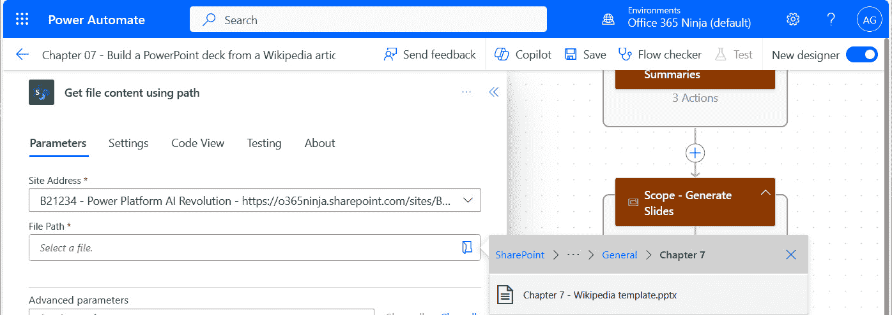

图 7.33 – 选择 PowerPoint 模板文件

1.  在“**范围 – 生成幻灯片**”卡片中，点击“**+**”图标并选择“**添加**”**操作**。

1.  添加**应用至每个**控件。

1.  在“**应用至每个**”控件弹出窗口中，选择**参数**选项卡。

1.  在“**从先前步骤中选择一个输出**”字段中，添加您之前创建的“**解析 JSON – 创建数组**”操作的**Body**输出：

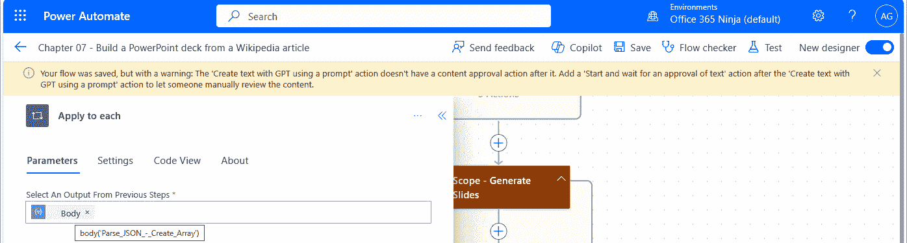

图 7.34 – 添加来自解析 JSON – 创建数组操作的 Body 输出

1.  在“**应用至每个**”控件卡片中，点击“**+**”并选择“**添加**”**操作**。

1.  选择**解析 JSON**操作。

1.  将“**解析 JSON –**”**PPT Values**重命名。

1.  在“**参数**”选项卡上的“**解析 JSON – PPT 值**”弹出窗口中，点击“**内容**”字段内部。

1.  选择**当前项**动态内容令牌。见*图 7**.**35*：

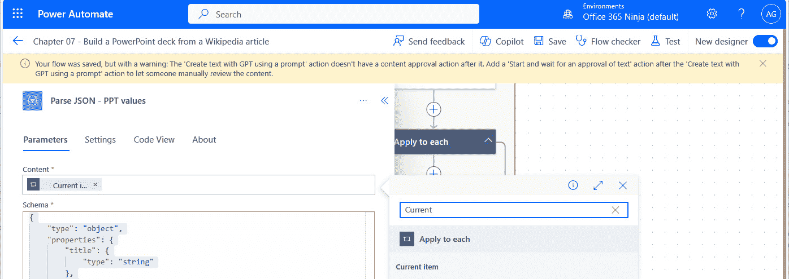

图 7.35 – 选择当前项动态内容令牌

1.  在**模式**区域，复制并粘贴以下值：

    ```py
    {
        "type": "object",
        "properties": {
            "title": {
                "type": "string"
            },
            "page": {
                "type": "string"
            },
            "content": {
                "type": "string"
            }
        }
    }
    ```

    此内容可以通过运行流程到这一点，查看**运行历史记录**区域，选择**使用提示创建文本**操作的输出，然后将其粘贴到**使用示例有效负载生成****模式**弹出窗口中获取：

1.  点击**保存**。不要关闭 Power Automate 流程画布。

接下来，我们将开始向 Encodian 连接器发送数据。

## 使用 Encodian Flowr

在此部分，您将开始与 Flowr 连接器交互。使其工作可能有些棘手，所以请按照以下步骤操作：

1.  在“**应用至每个**”卡片中，点击“**解析 JSON – PPT 值**”后面的“**+**”图标并选择“**添加**”**操作**。

1.  添加**填充 PowerPoint**操作：

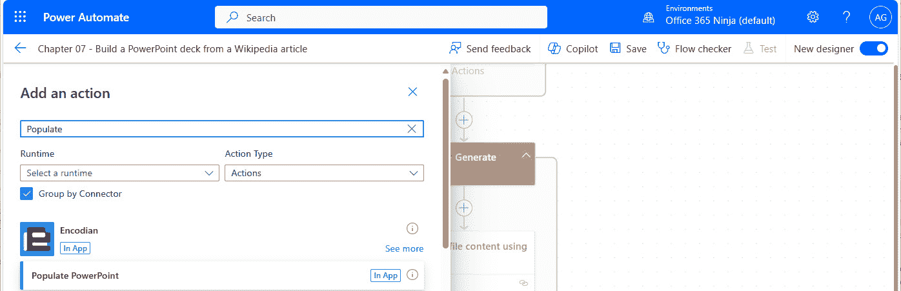

图 7.36 – 添加填充 PowerPoint 操作

1.  在“**填充 PowerPoint**”弹出窗口中，为 Encodian 连接输入一个**连接名称**值并添加您的**API 密钥**。点击“**创建新**”以完成设置：

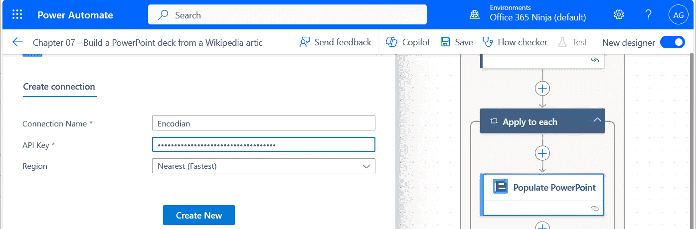

图 7.37 – 配置 Encodian 连接

1.  在“Populate PowerPoint”弹出窗口中，点击 **高级** **参数**下拉菜单旁边的“显示所有”：

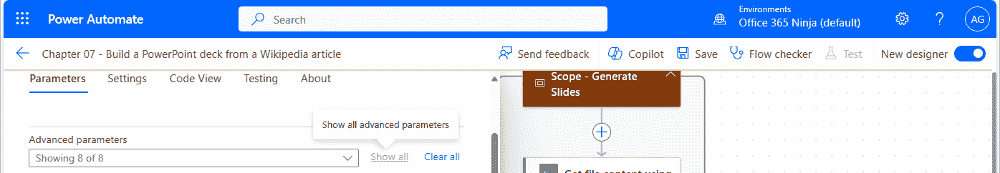

图 7.38 – 展示所有可用参数

1.  在“文件内容”字段内点击，选择动态内容图标，然后为配置的存储位置（无论是**SharePoint Online**还是**OneDrive for Business**）选择“文件内容”令牌：

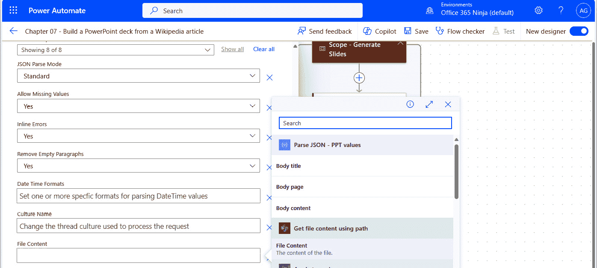

图 7.39 – 添加文件内容令牌

1.  在“JSON 数据”字段中，定义连接器将用于替换模板文件中内容令牌的 JSON 结构。例如，本练习使用 **title**、**content** 和 **page** 令牌。JSON 定义应类似于以下示例：

    ```py
    {
    "title": "@{body('Parse_JSON_-_PPT_values')?['title']}",
    "content" : "@{body('Parse_JSON_-_PPT_values')?['content']}",
    "page": "@{body('Parse_JSON_-_PPT_values')?['page']}"
    }
    ```

它应该看起来像这样：

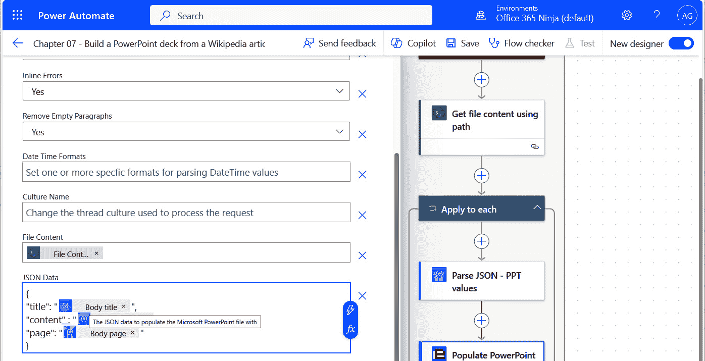

图 7.40 – 配置 JSON 数据属性

您可以输入定义（例如 `"title" : " "`）然后从动态内容令牌列表中选择相应的参数值。输出应从“解析 JSON – PPT 值”操作中选择。或者，如果您已将操作重命名以遵循练习，您可以复制并粘贴整个 JSON 定义。

1.  在“应用至每张卡片”内，点击“Populate PowerPoint”操作后的 **+** 图标并选择“添加”**操作**。

1.  选择“Compose”操作。

1.  在“Compose PowerPoint Slides”。

1.  在“Compose PowerPoint slides”弹出窗口的“参数”选项卡中，点击“输入”字段并粘贴以下内容：

    ```py
    {
    "fileName": ".pptx",
    "fileContent": {
    "$content-type": "application/vnd.openxmlformats-officedocument.presentationml.presentation",
    "$content":
    }
    }
    ```

1.  在 `"` 字符上的 `.` 字符（`"`）。如果没有引号，您将收到 JSON 格式错误：

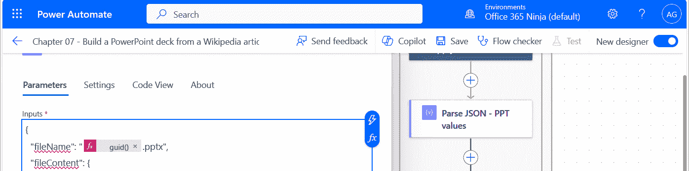

图 7.41 – 将 guid() 函数添加到文件名中

1.  在 `"$content":` 和点击动态内容图标。选择 **File Content** 动态内容令牌。见 *图 7**.**42*：

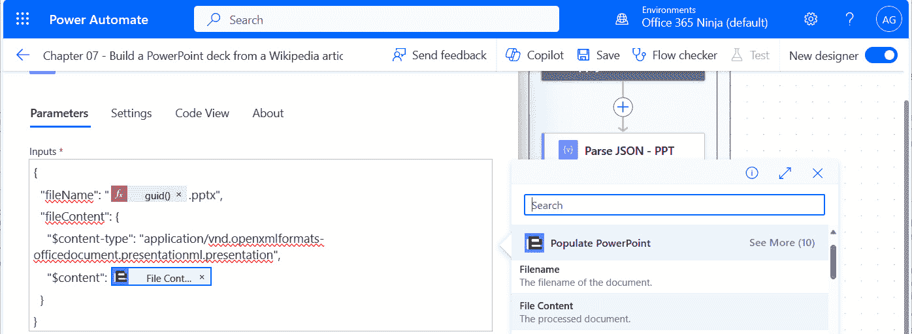

图 7.42 – 添加文件内容动态内容令牌

1.  在“Apply each card”内，点击“Compose PowerPoint Slides”操作下方的 **+** 图标并选择“添加”**操作**。

1.  选择“合并演示文稿”操作。

1.  输入 `Presentation.pptx`）。

1.  在“高级参数”下，选择“显示所有”。

1.  在 `<``guid>.PPTX` 名称中：

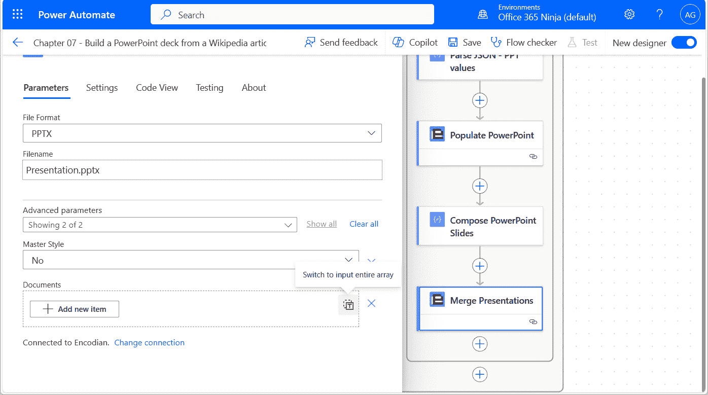

图 7.43 – 更改输入类型

1.  在“文档项”字段内点击，并选择动态内容令牌图标。在“组合演示文稿幻灯片”下，选择“输出”：

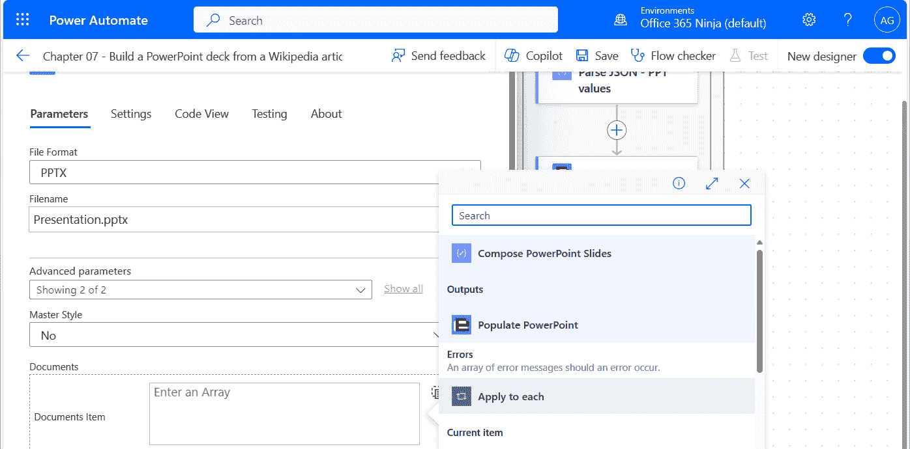

图 7.44 – 更新文档项字段

1.  收起 **合并演示文稿** 飞出菜单。

1.  将 **合并演示文稿** 卡片拖动到 **应用至每个** 和 **范围 – 生成幻灯片** 卡片之外，并将其放置在范围卡片下方的 **+** 图标上。参见 *图 7**.**45*：

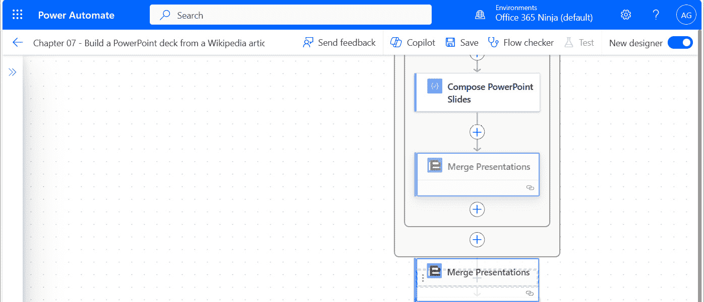

图 7.45 – 移动合并演示文稿卡片

此步骤顺序是必要的，以确保可以从动态内容菜单中选择 **组合 PowerPoint 幻灯片** 输出。

1.  点击 **合并演示文稿** 后的 **+** 图标，然后选择 **添加步骤** 将其添加到流程末尾。

1.  根据您希望输出位置选择 **创建文件** 动作（SharePoint 或 OneDrive for Business），它不必存储模板文件的同一位置。

1.  在 **创建文件** 飞出菜单中，选择位置（如果您选择 OneDrive for Business，则为 **文件夹路径** 位置；如果您选择 SharePoint Online，则为 **网站地址** 和 **文件夹路径** 位置）。

1.  在 **文件名** 字段中，从 **合并演示文稿** 动作中添加 **文件名** 动态内容令牌。

1.  在 **文件内容** 字段中，添加来自 **合并演示文稿** 动作的 **文件内容** 动态内容令牌，如图 *图 7**.4**6* 所示：

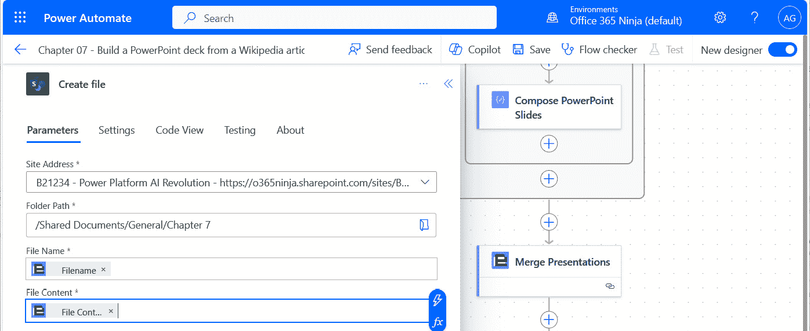

图 7.46 – 选择文件内容动态内容令牌

1.  点击 **保存**。

点击 **流程检查器** 区域以确保您的流程不包含明显错误。完成这些后，就是时候测试流程了！

# 测试流程

要测试流程，请按照以下步骤操作：

1.  打开一个新的浏览器标签页。导航到维基百科 ([`en.wikipedia.org`](https://en.wikipedia.org)) 并搜索您选择的文章。例如，您可以尝试搜索 `航海` 或 `密码学历史`。

1.  在文章加载后，点击 URL 栏并使用 *Ctrl* + *C* 复制 URL 值。

1.  切换回运行 Power Automate 画布的浏览器标签页。

1.  点击标记为 **测试** 的 **试管** 图标：

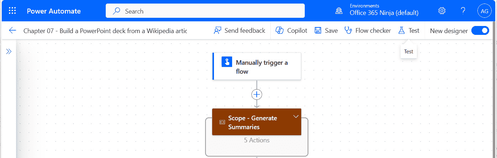

图 7.47 – 准备测试流程

1.  在 **测试流程** 飞出菜单中，选择 **手动** 单选按钮并点击 **测试**。

1.  如果提示，确认任何权限并点击 **继续**：

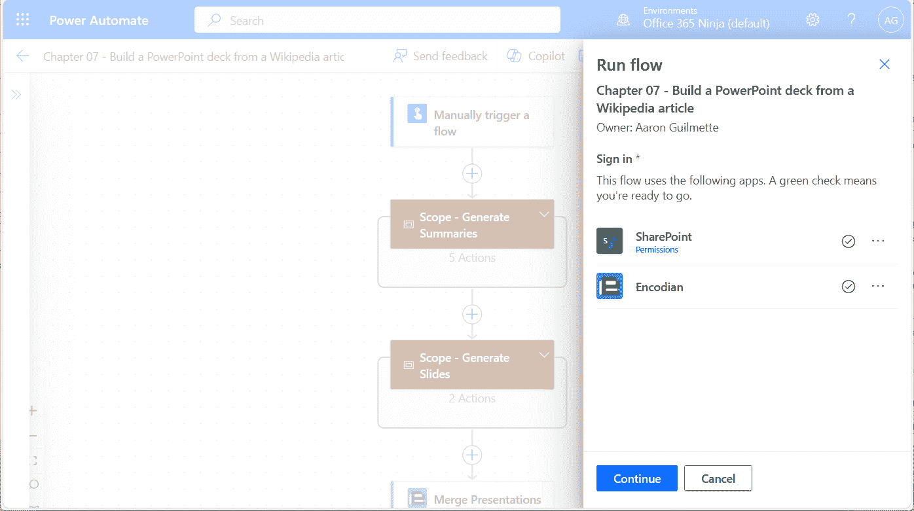

图 7.48 – 确认流程的权限

1.  将复制的维基百科 URL 粘贴到提示区域，然后点击 **运行流程**：

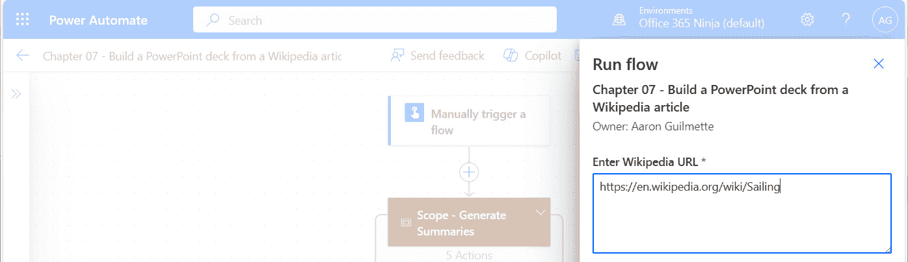

图 7.49 – 输入 URL

1.  点击 **完成** 返回画布并观察流程运行执行。

1.  在流程执行时等待：

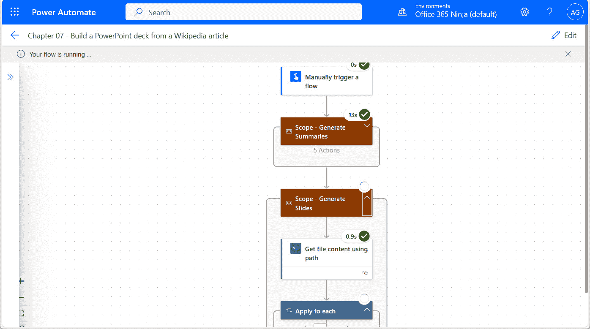

图 7.50 – 等待流程完成

1.  流程完成后，导航到您指定完成演示文稿应保存的位置。

1.  打开演示文稿：

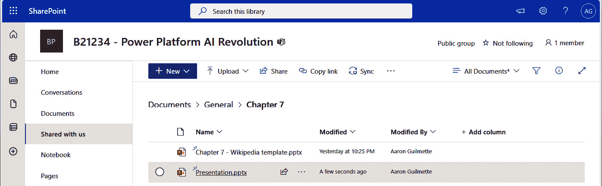

图 7.51 – 启动演示文稿

1.  查看完成的演示文稿，注意幻灯片中的内容标记是如何被传递给 Encodian Flowr 连接器的相应 JSON 值所替换的：

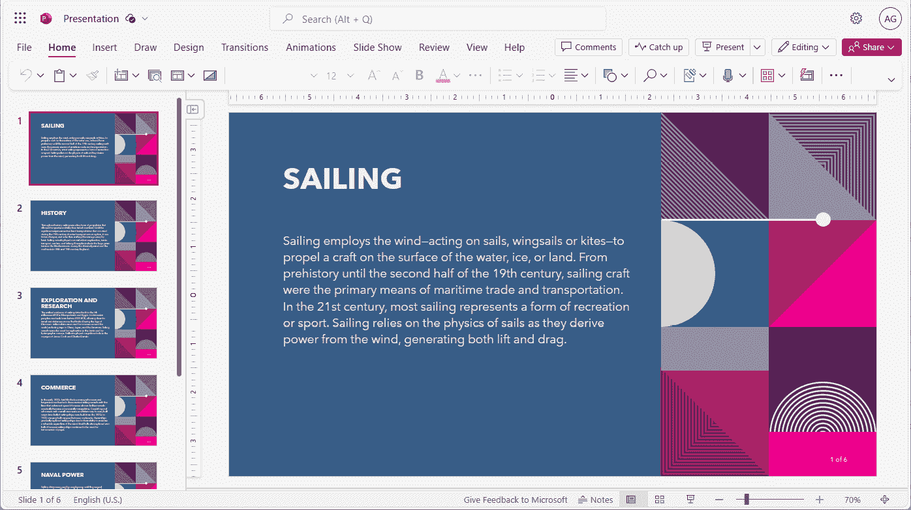

图 7.52 – 查看完成的演示文稿

就这样！您现在已经通过抓取网站内容创建了一个完整的 PowerPoint 演示文稿。

# 进一步探索

想想您可以用哪些方式进一步扩展、重用或重新利用此类解决方案，从不同类型的内容源构建幻灯片：

+   季度报告

+   执行摘要

+   销售报告

通过将生成式 AI 的力量与 Microsoft 365 Apps 文档创建工具的自动化功能相结合，您可以轻松创建演示文稿！

# 摘要

本章展示了通过利用生成式 AI 的强大功能所能实现的令人难以置信的能力。通过使用本地的 AI Builder ChatGPT 连接器，您能够从世界上最大的在线百科全书获取网络内容，对其进行总结，并将其转换为 PowerPoint 演示文稿（借助 Encodian Flowr 连接器的帮助）。

使用在这里学到的技能，您可以调整此流程，从存储在 SharePoint、OneDrive 或其他网站和文档中的内容中提取报告和演示文稿。

在下一章中，我们将学习如何使用 AI Builder ID 读取器模型。
