# 8

# 构建具有身份验证的事件注册应用

有时候，身份验证和验证是确定产品或服务资格所必需的。在本章中，您将学习关于 AI Builder 身份证明内容提取功能的相关内容。

AI Builder 身份证明文档阅读器是一个预构建的模型，它可以识别护照、驾照和其他身份证明文件中的内容。

# 设计解决方案

当思考如何构建一个处理身份的解决方案时，我立刻想到了某种事件注册应用或场景，它将需要身份验证或验证——这似乎是个不错的想法。

许多组织举办活动。虽然一些活动注册可能是内部的（例如大型组织的年度技术或销售会议）并且可能不需要身份验证，但许多活动是行业或主题聚焦的，吸引了来自众多公司的参与者。这似乎是一个完美的目标场景。

我心中有一个关于我希望这个解决方案如何工作的想法。然而，当与新兴技术产品合作时，有时您想要做的事情并不完全符合产品的功能。作为解决方案设计师，重要的是要灵活，并拥有一种心态，以便在您发现障碍时能够调整方向。

当深入到解决方案的细节时，我面临了几个挑战：

+   基于 **Power Apps** 的解决方案需要租户身份和许可，这两者都不适合外部用户。

+   **Microsoft Forms** 允许文件上传，但仅限于内部（租户）用户——再次，使其不适合外部用例。

+   **Power Pages** 解决方案可以接受上传，但解决方案需要相当数量的权限设置和管理，此外还需要设计整个网站界面和创建 Dataverse 表格。虽然有一个基本的事件注册应用模板可用，但仍然需要大量定制和修改才能应用这种验证逻辑。

+   **SharePoint Online** 可以接受文件上传，但通常仅限于认证用户。有一个请求文件 API 允许匿名上传，但它需要 SharePoint 管理员启用，并为记录创建一个定制的 API 文件链接。

如您从选项列表中可以看到，有许多障碍需要克服——无论是许可、编码挑战还是最终用户的易用性。在选择如何实施解决方案时，所有这些都必须考虑在内——可能需要绕过产品中的一些限制，尤其是如果您试图最小化对第三方产品的投资或限制整体产品开发时间。

在此解决方案中，我们将选择一个允许简单表单设计（使用 Microsoft Forms）并利用 SharePoint Online API（尽管它需要一点自定义开发工作）的路径。

*图 8**.1* 展示了此解决方案将如何工作的整体工作流程：

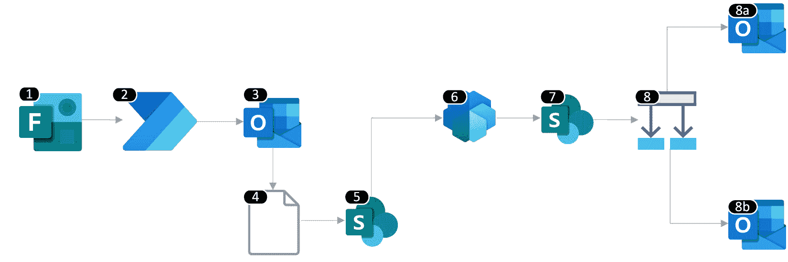

图 8.1 – 事件注册和身份验证工作流程

1.  让我们分解一下：

1.  用户使用 Microsoft Forms 链接填写事件注册表单。

1.  Power Automate 触发并处理表单响应，请求用户上传数据。

1.  用户收到一封带有上传其身份证明文件说明的电子邮件。

1.  用户点击生成的电子邮件中的链接上传身份证明文件。

1.  身份证明文件存储在 SharePoint Online 中。

1.  AI Builder 被触发以验证身份证明文件。

1.  SharePoint Online 事件注册列表更新以反映文档验证是否成功或失败。

1.  Power Automate 条件检查身份验证状态：

    1.  如果身份验证成功，用户将收到确认电子邮件。

    1.  如果身份验证失败，用户将收到失败通知。

接下来，我们将查看此解决方案的许可前提条件。

# 许可前提条件

在 Power Platform 中使用 AI 模型和连接器有几个前提条件：

+   包含 Microsoft Dataverse 的订阅

+   AI Builder 容量（或试用容量）

+   Power Apps 或 Power Automate 高级许可

+   包含 Microsoft Teams 的订阅

+   包含 Exchange Online 的订阅

+   Outlook 桌面应用程序

如果您尚未启用 Dataverse 和 AI Builder 容量，请参阅*第二章*，*配置支持 AI 服务的环境*，以及*第六章*，*使用* *情感分析* *处理数据*。

# 配置解决方案前提条件

在开始工作流程配置之前，您需要创建一个 SharePoint 列表来存储注册者的信息，以及一个可以添加到确认电子邮件中的 Teams 会议链接。

## 配置 SharePoint Online

默认情况下，SharePoint Online 限制为经过身份验证的用户——无论是同一租户的用户还是之前兑换过嘉宾邀请的外部用户。然而，SharePoint 允许匿名共享链接以及一个用户生成文件上传请求并发送给匿名或其他未经身份验证用户的功能。我们将以编程方式利用文件请求功能，使 SharePoint Online 允许作为工作流程一部分的匿名上传。

进一步阅读

有关文件请求功能的更多信息，请参阅 [`learn.microsoft.com/en-us/sharepoint/enable-file-requests`](https://learn.microsoft.com/en-us/sharepoint/enable-file-requests) 和 [`support.microsoft.com/en-us/office/create-a-file-request-f54aa7f8-2589-4421-b351-d415fc3b83af`](https://support.microsoft.com/en-us/office/create-a-file-request-f54aa7f8-2589-4421-b351-d415fc3b83af)。要使此功能正常工作（例如，不限制匿名外部访问、启用匿名或 **任何人** 链接，以及为 **任何人** 链接设置适当的权限），请确保您的环境已正确配置。

让我们逐步了解确保 SharePoint Online 正确配置的要求。

### 创建 SharePoint 网站

为了接收文件上传，您需要设置一个新的 SharePoint 网站。要配置新的 SharePoint 网站，请按照以下步骤操作：

1.  导航到 SharePoint Online 管理中心 ([`admin.microsoft.com`](https://admin.microsoft.com))，点击 **显示全部…**，然后在 **管理中心** 下选择 **SharePoint**。

1.  展开 **网站** 并选择 **活动网站**。

1.  点击 **创建**。

1.  在 **创建网站：选择网站类型** 页面上，选择 **团队网站**。

1.  在 **选择模板** 页面上，选择 **标准团队**。

1.  在 **预览并使用“标准团队”模板** 页面上，点击 **使用模板**。

1.  在 `事件注册`。

1.  添加 **组所有者** 名称并点击 **下一步**。

1.  点击 **创建网站**。

1.  点击 **完成**。

在您创建网站后，请确保捕获完整的网站 URL - 它将在以后需要。完整的 URL 将采用 `https://<tenant>.sharepoint.com/sites/<sitename>` 的格式。您可以通过在 SharePoint 管理设置中选择网站以展开网站属性并复制 **查看网站** 链接来检索网站 URL，如图 *图 8**.2* 所示：

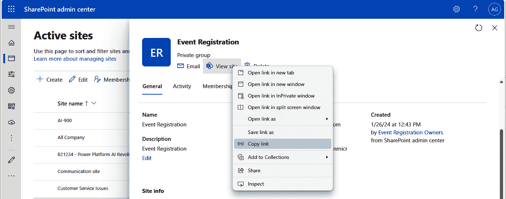

图 8.2 – 复制 SharePoint 网站链接

接下来，您需要在 SharePoint 管理中心配置 **任何人** 链接设置。

### 启用任何人链接

第一项要求是确保在租户级别启用了 **任何人** 链接。为此，请按照以下步骤操作：

1.  导航到 SharePoint Online 管理中心 ([`admin.microsoft.com`](https://admin.microsoft.com))，点击 **显示全部…**，然后在 **管理中心** 下选择 **SharePoint**。

1.  展开 **策略** 并选择 **共享**。确保 SharePoint 访问控制滑块已移动到顶部（**任何人**）。见 *图 8**.3*：

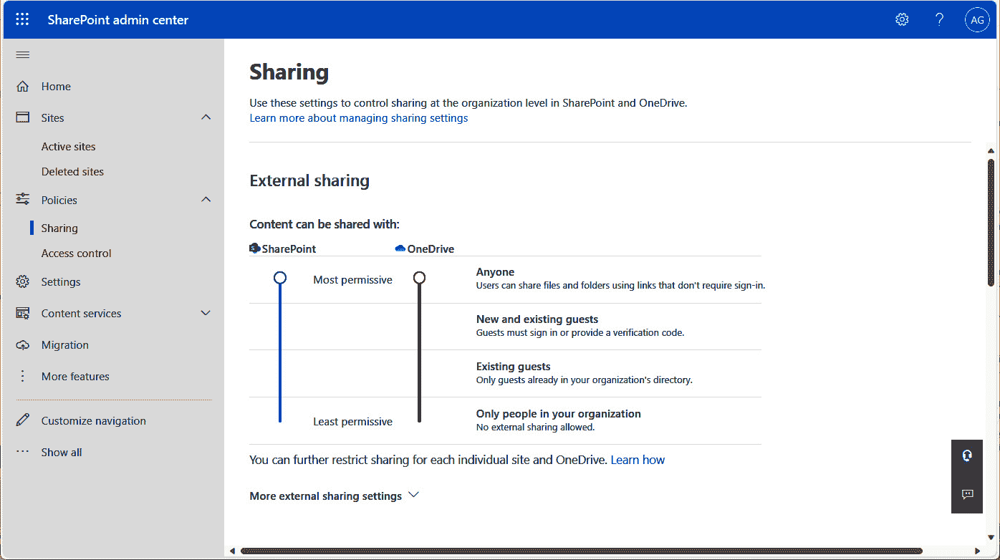

图 8.3 – 配置 SharePoint 外部共享访问控制级别

1.  展开 **更多外部共享** **设置** 下拉菜单。

1.  确保已清除 **仅允许特定安全组用户外部共享** 复选框（未勾选）：

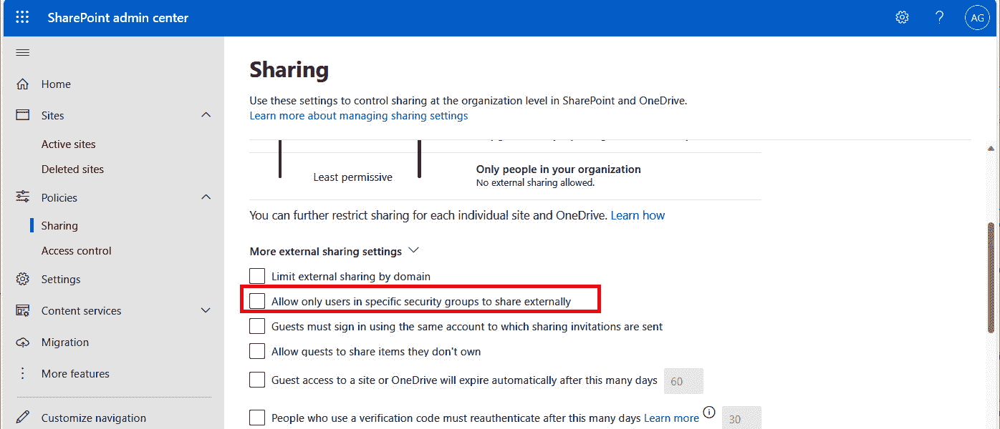

图 8.4 – 配置更多外部共享设置

1.  在 **为任何人链接选择过期和权限选项** 下，确保 **文件夹** 设置为 **查看、编辑** 和 **上传**：

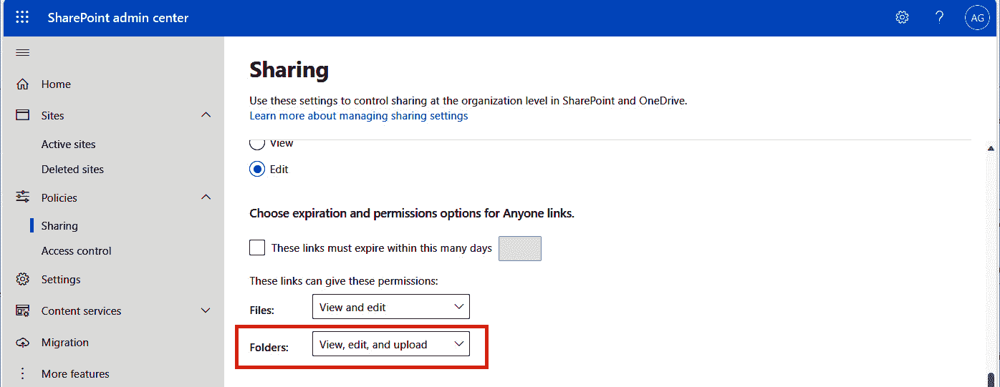

图 8.5 – 配置附加 SharePoint 设置

1.  单击 **保存**。

下一步是创建一个文档库，用于存储与会者的身份文件。

### 配置 SharePoint 文档库

此解决方案需要一个存储位置来保存上传的身份文件。虽然您可以使用默认的文档库，但它的显示名称（**文档**）与其实际名称（**共享文档**）不同，这往往会导致更多的故障排除。

要创建新的 SharePoint 文档库，请按照以下步骤操作：

1.  导航到 **事件注册** SharePoint 站点。

1.  单击 **新建** 然后选择 **文档库**。

1.  在 **创建新文档库** 页面上，选择 **空白库**。

1.  在 **名称** 字段中输入 `Uploads` 并单击 **创建**。

就这样！接下来，我们将为与会者创建一个 SharePoint 列表。

### 配置 SharePoint 列表

配置 SharePoint 列表的最后一部分。该列表将用于存储注册者信息以及跟踪身份验证状态。按照以下步骤操作：

1.  导航到 **事件注册** SharePoint 站点。

1.  单击 **新建** 然后选择 **列表**：

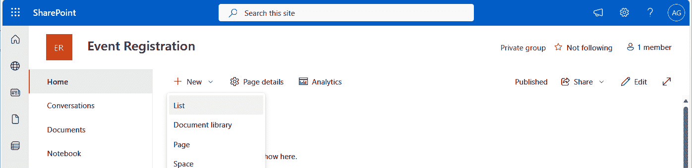

图 8.6 – 创建新列表

1.  在 **创建列表** 页面上，选择 **空白列表**。

1.  输入 `Attendees` 并单击 **创建**。

1.  在 **与会者** 列表中，单击 **添加列**。选择 **文本** 作为类型并单击 **下一步**：

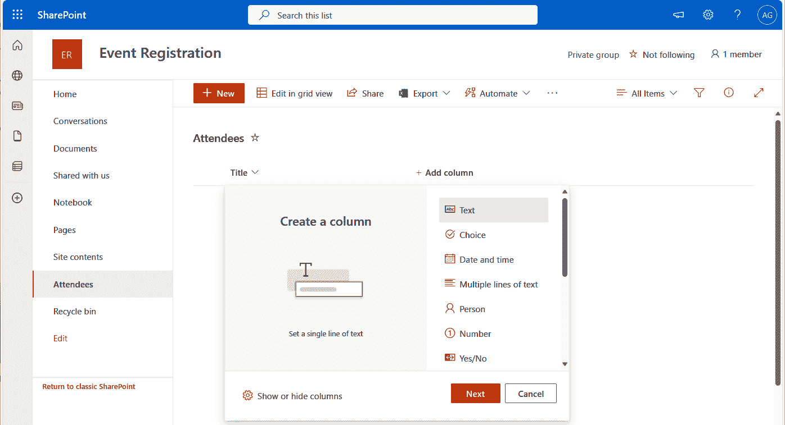

图 8.7 – 配置新列

1.  将列命名为 `First name` 并单击 **保存**。

1.  使用 *表 8.1* 中的列名和类型重复添加列：

| **列名** | **列类型** |
| --- | --- |
| 姓氏 | 文本 |
| 电话号码 | 文本 |
| 出生日期 | 文本 |
| 电子邮件 | 文本 |
| 验证状态 | 选择：待提交、通过、失败 |
| 有效期 | 文本 |
| 身份数据 | 文本 |

表 8.1 – SharePoint 列表列信息

### 更新 SharePoint Online 设置

接下来，您需要配置 SharePoint Online 租户以显示 **请求文件** 操作。按照以下步骤操作：

1.  启动提升的 PowerShell 提示符。

1.  安装 SharePoint Online 管理 PowerShell 模块的最新版本：

    ```py
    Install-Module Microsoft.Online.SharePoint.PowerShell -Force
    ```

1.  使用 `<tenant>-admin` 连接到 SharePoint Online 管理界面以引用您的站点。参见 *图 8**.8*，其中租户名称为 `o365ninja`。您的租户名称是在 Microsoft 365 设置期间建立的，格式为 `tenant.onmicrosoft.com`：

    ```py
    Connect-SPOService -Url https://<tenant>-admin.sharepoint.comhttps://<tenant>-admin.sharepoint.com
    ```

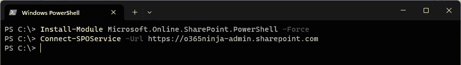

图 8.8 – 连接到 SharePoint Online

1.  接下来，您需要在您之前创建的 SharePoint 网站上启用**请求文件**功能。在 SharePoint 管理 Shell 中使用以下 cmdlet：

    ```py
    Set-SpoSite -Identity <SiteURL> -RequestFileLinkEnabled $True
    ```

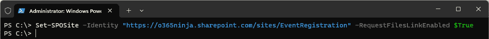

图 8.9 – 启用文件请求功能

1.  更新设置后，导航到活动注册解决方案的 SharePoint Online 网址。选择**上传**以显示之前创建的文档库。

1.  在名为 `RegistrationData` 的新文件夹上右键单击，并搜索**请求文件**选项，如图**8.10**所示。10*。如果可见，则一切配置都正确：

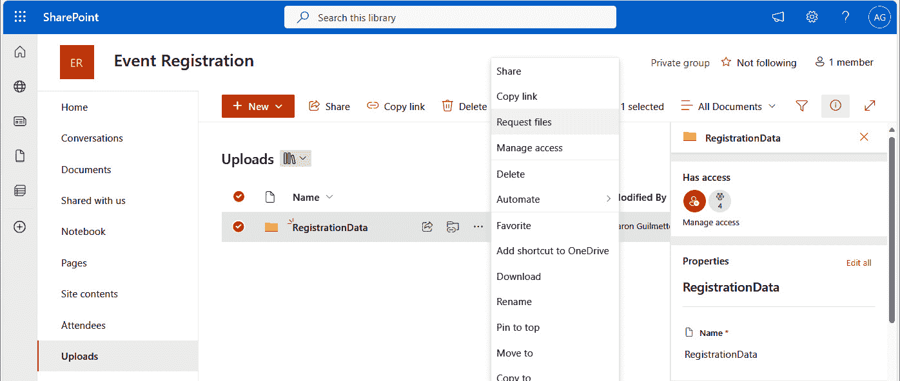

图 8.10 – 查看请求文件选项的可用性

接下来，是时候配置一个 Teams 会议了。

## 建立一个 Teams 会议

如果您的活动将通过 Microsoft Teams 在线进行，则可以执行此可选步骤。在这个过程中，您将创建一个会议并将其导出为 ICS 文件。虽然您可以手动生成 ICS 文件，但直接从 Outlook 导出要容易得多。要创建会议，请按照以下步骤操作：

1.  导航到 Microsoft Teams，并从左侧轨道中选择**日历**以打开日历应用。

1.  点击**新建会议**旁边的下拉菜单，选择**市政厅**。虽然网络研讨会确实有注册，但它已集成到应用程序中，目前还没有方法将流程注入到原生网络研讨会注册过程中。现场活动计划在 2024 年停用，会议组织者应安排网络研讨会或**市政厅**活动。见图**8.11**：

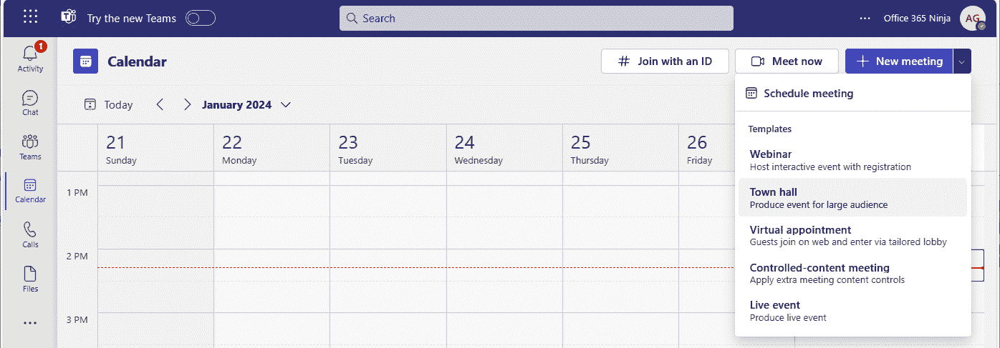

图 8.11 – 创建新的市政厅会议

1.  配置会议的详细信息，包括**标题**、**开始日期**、**结束日期**和**描述**值。

1.  滚动到邀请底部，并在**与会者**下选择**公开**：

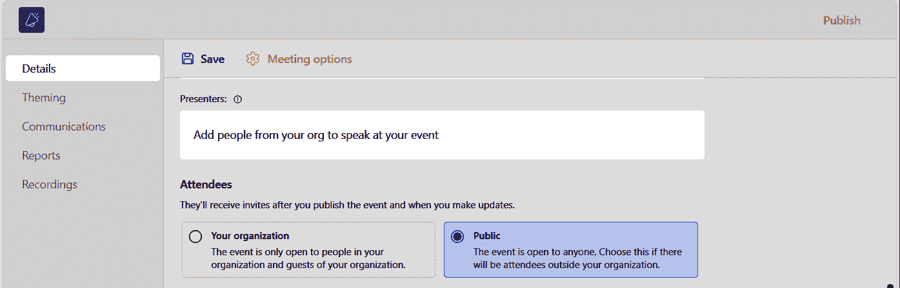

图 8.12 – 配置会议设置

1.  点击**保存**。

1.  点击**发布**以发布会议。

1.  启动 Outlook 桌面客户端。

1.  导航到由 Teams 会议向导创建的日历事件。打开会议。

1.  点击**文件**以打开**后台**选项卡，然后选择**另存为**。

1.  导航到一个 OneDrive for Business 或 SharePoint Online 网站以保存 ICS 文件。确保选中**保存所选约会**单选按钮，然后点击**保存**：

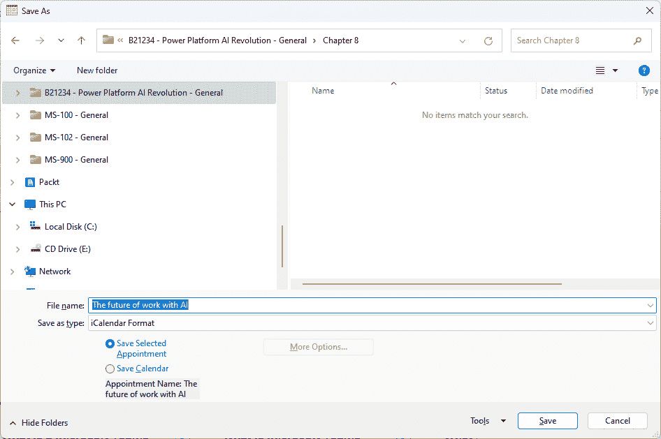

图 8.13 – 保存日历文件

注册完成后并验证身份，此日历约会将通过成功确认电子邮件发送。

## 构建输入表单

最后的准备步骤是构建一个将被活动参与者用于注册的 Microsoft 表单。要配置表单，请按照以下步骤操作：

1.  导航到 Microsoft 表单([`forms.microsoft.com`](https://forms.microsoft.com))并点击**新建表单**：

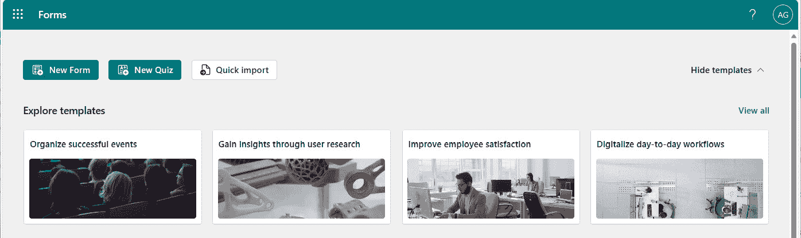

图 8.14 – 创建新的 Microsoft 表单

1.  为表单命名，并添加**姓名**、**姓氏**、**电子邮件**和**电话号码**文本字段：

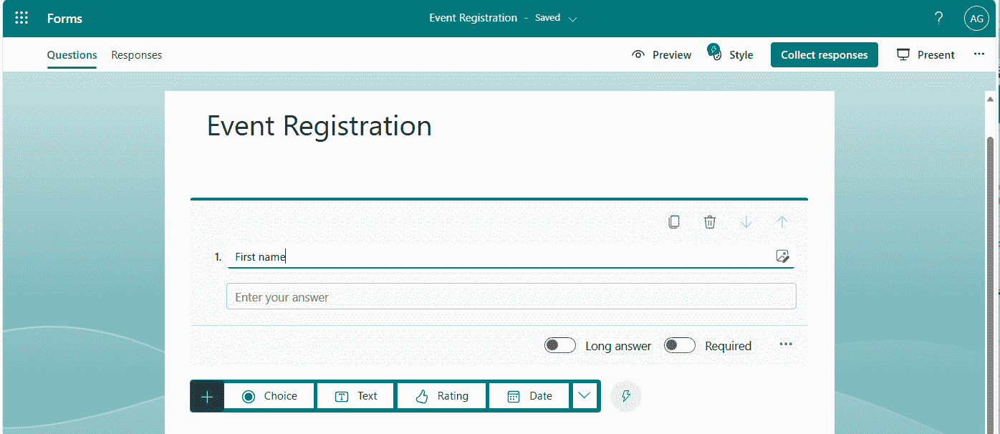

图 8.15 – 添加字段

1.  展开省略号并选择**设置**，如图*图 8**.16*所示：

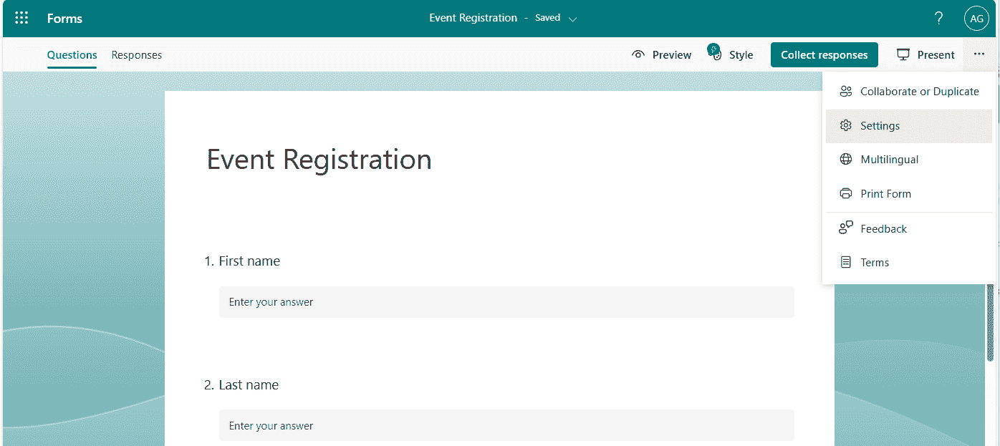

图 8.16 – 配置表单设置

1.  在**谁可以填写此表单**下，确保选中**任何人都可以响应**单选按钮：

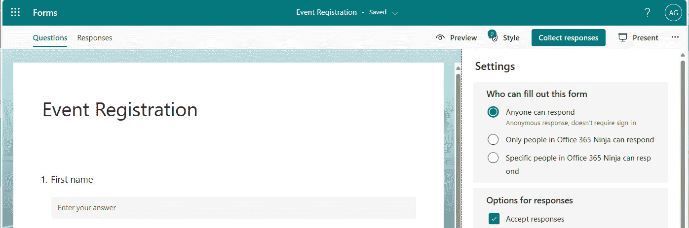

图 8.17 – 更新表单设置

1.  点击**收集响应**，然后将表单链接复制到文本文件中，以便在测试阶段使用：

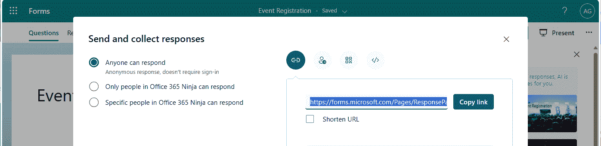

图 8.18 – 复制表单链接

配置好先决条件后，是时候开始一些自动化工作了！

# 创建流程

此解决方案有两个流程——一个是在表单响应时触发，另一个是在身份证明文件上传到 SharePoint 时触发。

如果我遇到困难怎么办？

如果由于某种原因遇到障碍（找不到功能、选项未显示或内容不明确），帮助只需点击一下！您可以从我们的 GitHub 网站下载本章的工件：[`github.com/PacktPublishing/Power-Platform-and-the-AI-Revolution`](https://github.com/PacktPublishing/Power-Platform-and-the-AI-Revolution)。

让我们开始第一个流程！

## 配置处理表单提交的流程

此流程在表单提交时触发。表单处理完毕后，注册者将收到一封电子邮件，提示他们上传身份证明文件。如前所述，表单确实允许原生文件上传，但需要用户验证到 Microsoft 365 租户（这对外部用户来说并不理想）。

### 处理表单

在本节中，您将首先处理 Microsoft 表单数据。按照以下步骤操作：

1.  打开浏览器并导航到 Power Automate 制作门户([`make.powerautomate.com`](https://make.powerautomate.com))，选择**创建**，然后点击**自动****云流程**。

1.  在**构建自动云流程**页面，输入**流程名称**值，然后选择**当有新响应提交时**触发器。点击**创建**。

1.  在画布上，点击**当有新响应提交时**触发器。如有必要，点击**更改连接**登录到 Microsoft 365：

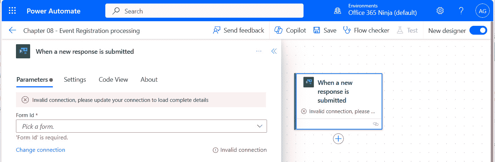

图 8.19 – 使用凭据更新触发器

1.  点击**表单 ID**下拉菜单，并选择**事件****注册**表单：

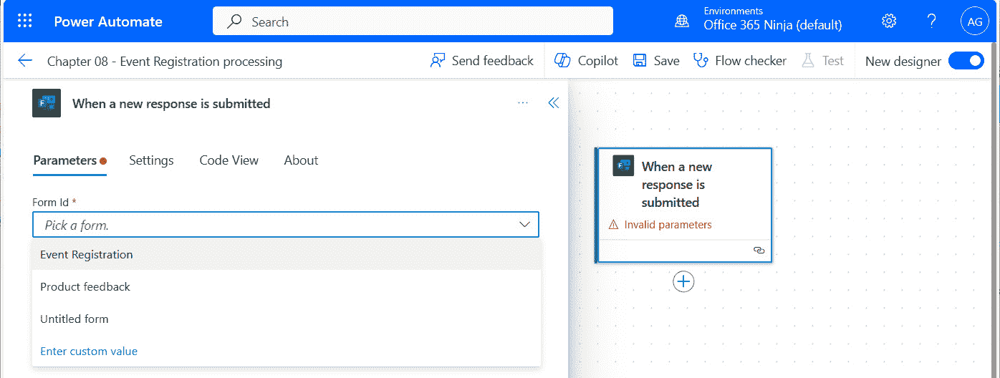

图 8.20 – 选择表单

1.  点击 **+** 符号添加一个动作并选择 **作用域** 控件。

1.  将作用域控件重命名为 `Processing the form`。见 *图 8**.21*：

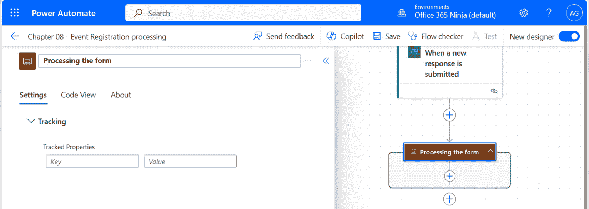

图 8.21 – 更新作用域名称

1.  在 **Scope** 控件内部，点击 **添加** **一个动作**。

1.  在 **添加一个动作** 弹出窗口中，选择 **获取响应** **详细信息** 动作。

1.  在 **表单 ID** 下，选择 **Event Registration** 表单。

1.  在 **Response Id** 下，选择 **响应通知列表 Response Id** 的动态内容令牌。该操作将插入到 **Apply each** 或 **For each** 包装器中（取决于您是否使用 **经典设计器** 或 **新设计器**）：

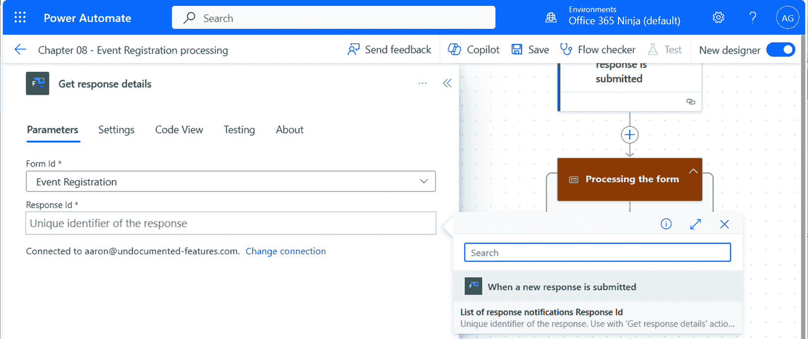

图 8.22 – 配置获取响应详细信息

1.  在 **每个** 包装器中，在 **获取响应详细信息** 之后，点击 **添加** **一个动作**。

1.  选择 `ComposeUnique`。**Compose** 动作将用于生成一个唯一 ID，该 ID 将用于命名由 **请求文件** 动作提交的证据。

1.  在 **输入** 文本框中添加一个表达式。在 **函数** 选项卡上，粘贴以下内容：

    ```py
    concat(utcNow('yyyyMMddHHMMss'),'_',)
    ```

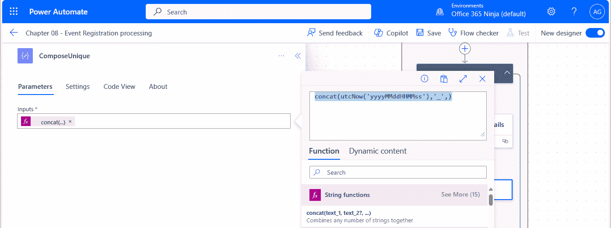

图 8.23 – 配置 Compose 动作

1.  在最后一个逗号 (`,`) 和关闭括号 (`)`) 之间的文本区域中点击。点击 **动态内容** 选项卡，然后从 **获取响应详细信息** 动作中添加 **Email** 动态内容令牌。见 *图 8**.24*：

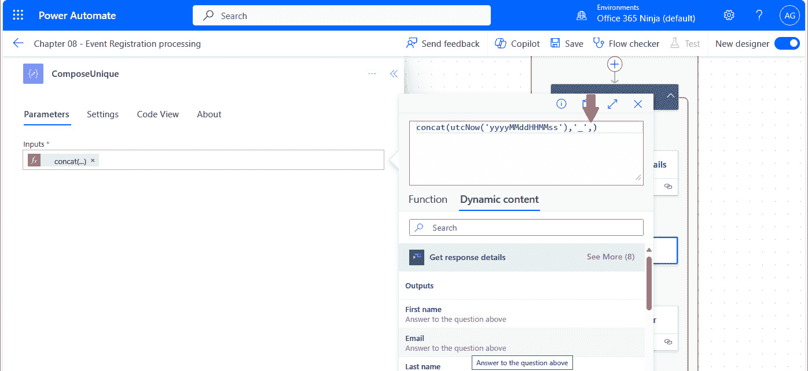

图 8.24 – 使用 Email 令牌更新 Compose 动作

完成后，函数值应类似于以下示例：

```py
concat(utcNow('yyyyMMddHHMMss'),'_',body('Get_response_details')?['r05e4d4be0beb4bb7b64c3b502b312d63'])
```

这用于组合一个由流程执行的当前日期和时间以及响应者的提交的电子邮件地址组成的值。您不能复制并粘贴整个值，因为它直接对应于此环境中特定的表单对象。

进一步阅读

有关 `Concat` 函数的更多信息，请参阅 [`learn.microsoft.com/en-us/power-platform/power-fx/reference/function-concatenate`](https://learn.microsoft.com/en-us/power-platform/power-fx/reference/function-concatenate)。有关 `UtcNow` 函数的更多信息，请参阅 [`learn.microsoft.com/en-us/power-platform/power-fx/reference/function-now-today-istoday`](https://learn.microsoft.com/en-us/power-platform/power-fx/reference/function-now-today-istoday)。

1.  在 **Apply to each** 包装器内部，在 **ComposeUnique** 动作之后点击 **添加一个动作**。选择 **创建新文件夹** SharePoint 动作。

1.  在 **创建新文件夹** 弹出窗口中，在 **站点地址** 下选择 **Event Registration** 站点。

1.  在 **列表或库** 下，选择您之前创建的 **Uploads** 文档库。

1.  在**文件夹路径**下，从**ComposeUnique**操作中添加**输出**动态内容令牌，如图*图 8**.25*所示：

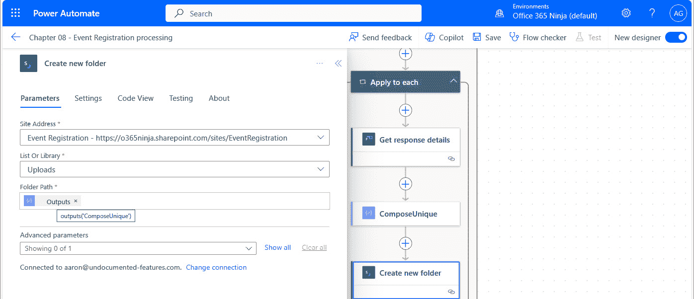

图 8.25 – 配置创建新文件夹操作

1.  在**Apply to each**包装器内部，在**创建新文件夹**操作之后点击**添加操作**。选择**创建项目**SharePoint 操作。

1.  在**创建项目**弹出窗口中，在**站点地址**下选择**事件注册**站点。

1.  在**列表名称**下，选择**参会者**列表。

1.  在**高级参数**下，在**标题**下选择**输出**动态内容令牌从**ComposeUnique**操作。

1.  在`toUpper()`下。

1.  将光标置于括号`(`和`)`之间。选择**动态内容**选项卡，然后从**获取响应详情**操作中添加**姓氏**动态内容令牌。输出应类似于以下内容：

    ```py
    toUpper(body('Get_response_details')?['rd5fe1d483e4d4f23ac7a55bbbed1c004'])
    ```

    证件使用*大写*格式。参会者可能不会全部使用大写输入他们的详细信息，因此需要进行转换以确保任何比较操作都成功。

1.  在`toUpper()`下。

1.  将光标置于括号`(`和`)`之间。选择**动态内容**选项卡，然后从**获取响应详情**操作中添加**姓氏**动态内容令牌。输出应类似于以下内容：

    ```py
    toUpper(body('Get_response_details')?['rfd1546de5f714c8da504d988e5c692ec'])
    ```

1.  在**电话号码**下，从**获取响应详情**操作中选择**电话号码**动态内容令牌。

1.  在**电子邮件**下，从**获取响应详情**操作中选择**电子邮件**动态内容令牌。

警告

不要从**获取响应详情**操作中选择**响应者电子邮件**动态内容令牌。**响应者电子邮件**动态内容令牌链接到提交表单的认证用户。如果表单是由你的 Microsoft 365 租户之外的人提交的（这是本解决方案的目标），则此令牌值将是*匿名*。

1.  在**验证状态值**下，选择**待提交**选项。参见*图 8**.26*中完成的**创建项目**操作配置：

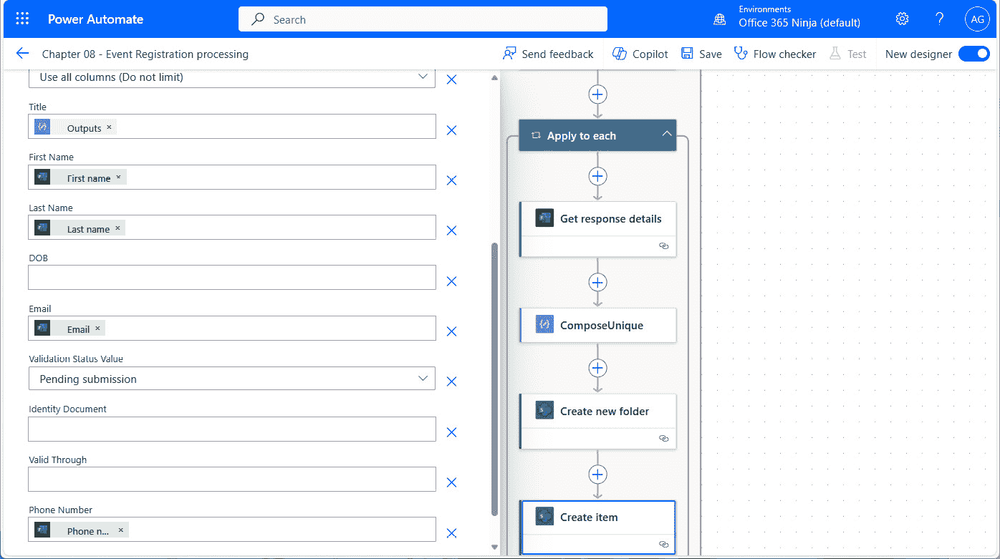

图 8.26 – 配置创建项目操作

1.  点击**保存**。

接下来，你将使用 SharePoint Online REST API 生成 SharePoint Online 文件请求。

### 生成文件请求链接

在本节中，你将在**处理表单**作用域内部创建一个新的作用域。这将帮助你将生成链接和发送电子邮件相关的任务分组。按照以下步骤操作：

1.  在**Apply to each**包装器外部和**处理表单**作用域控制内部点击**+**号。选择**添加操作**并选择**作用域**控制。

1.  将新作用域的名称更新为`生成 SharePoint Online 文件请求`。

1.  在**生成 SharePoint Online 文件请求作用域**内部点击**添加操作**。

1.  选择**向 SharePoint 发送 HTTP 请求**操作。

1.  在**站点地址**下，选择**事件** **注册**站点。

1.  在**方法**下，选择**POST**。

1.  在`'Uploads'`下是包含在先决条件部分创建的**RegistrationData**文件夹的文档库）：

    ```py
    _api/web/Lists/GetByTitle('Uploads')/GetItemById('@{body('Create_new_folder')?['ID']}')/ShareLink
    ```

    此特殊 URI 路径定位到`Uploads`文档库，然后添加在上一节中创建的文件夹的唯一标识符。

1.  在**高级参数**下，点击**显示全部**以显示**正文**区域。

1.  将以下数据粘贴到**正文**区域：

    ```py
    {
    "request": {
     "createLink" : true,
     "settings" : {
        "allowAnonymousAccess" : true,
        "linkKind" : 6,
        "restrictShareMembership": false,
        "updatePassword": false,
        "password" : "",
        "description": "@{outputs('ComposeUnique')}",
        "role" : 8,
        "applicationLink" : false,
        "limitUseToApplication" : false
        }
      }
    }
    ```

    此 JSON 值将被发送到 SharePoint Online 以触发文件请求。

进一步阅读

更多关于请求文件时 SharePoint Online REST API 函数的结构信息，请参阅[`learn.microsoft.com/en-us/graph/api/driveitem-createlink?view=graph-rest-1.0&tabs=http`](https://learn.microsoft.com/en-us/graph/api/driveitem-createlink?view=graph-rest-1.0&tabs=http)。

1.  验证操作配置中的设置。见*图 8**.27*：

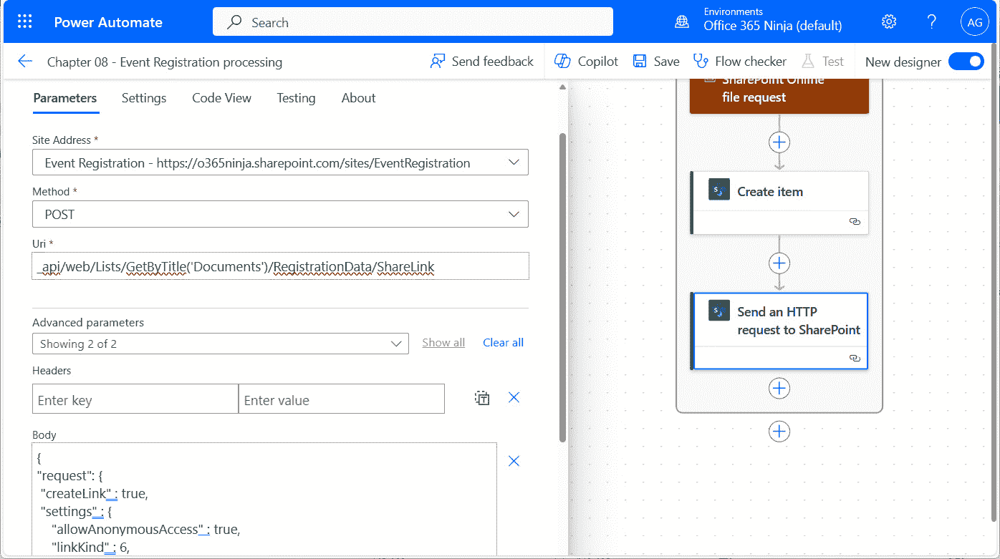

图 8.27 – 配置发送 HTTP 请求到 SharePoint 操作

1.  在**SharePoint Online 文件请求**范围内，在**发送 HTTP 请求到 SharePoint**操作之后点击**添加操作**。

1.  选择**编写**操作。

1.  重命名`ComposeURL`。

1.  在**输入**字段中插入一个表达式，并输入以下值：

    ```py
    body('Send_an_HTTP_request_to_SharePoint')?['body']?['d/ShareLink/sharingLinkInfo/url']
    ```

    此操作将**发送 HTTP 请求到 SharePoint**操作的输出提取为动态创建的 SharePoint URL。

    此表达式是从查看先前的流程运行中得出的，以确定从**发送 HTTP 请求到 SharePoint**操作的输出中可用的哪些属性。见*图 8**.28*：

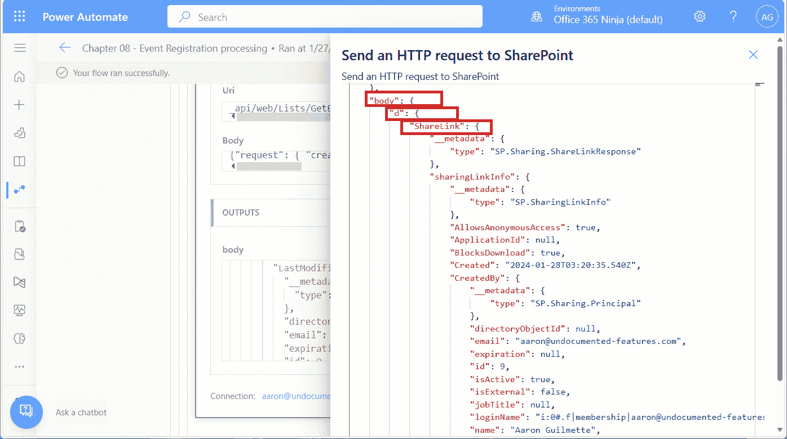

图 8.28 – 查看成功的发送 HTTP 请求到 SharePoint 操作的输出

从 JSON 输出角度来看，结构如下：

```py
{
    "statusCode": 200,
    "headers": {
        "Cache-Control": "no-store, max-age=0, private"
    },
    "body": {
        "d": {
            "ShareLink": {
                "sharingLinkInfo": {
                    "AllowsAnonymousAccess": true,
                    "Description": "20240128030134_user@domain.com",
                    "IsCreateOnlyLink": true,
                    "IsDefault": true,
                    "IsEditLink": true,
                    "LimitUseToApplication": false,
                    "LinkKind": 6,
                    "RequiresPassword": false,
                    "RestrictedShareMembership": false,
                    "SharingLinkStatus": 1,
                    "Url": "https://o365ninja.sharepoint.com/:f:/s/EventRegistration/EmlH2cOzMrRLsLRK6AjhXUwB97IiZxGyd2hQOv9GySxTSA"
                }
            }
        }
    }
}
```

需要存储在`Url`键/值对中的属性，以便参会者上传他们的身份证明文件。Power Automate 允许您使用`/`字符导航 JSON 结构的层级。从`Url`节点遍历 JSON 对象可以揭示引用 URL 所需的层次结构：

`Url` > `sharingLinkInfo` > `ShareLink` > `d` > `body`

当将其转换为 Power Automate 语法时，它变为以下内容：

```py
body('Send_an_HTTP_request_to_SharePoint')?['body']?['d/ShareLink/sharingLinkInfo/url']
```

点击**添加**。

1.  在**SharePoint Online 文件请求**范围内，在**ComposeURL**操作之后点击**添加操作**。

1.  选择**发送电子邮件 V2** Outlook 操作。

1.  在**发送电子邮件（V2）**操作弹出窗口中，使用**获取响应** **详细信息**操作的**电子邮件**动态内容令牌填写**收件人**字段。

1.  在**Subject**名称中输入，并在**Body**区域创建一个基本的电子邮件消息。务必包括来自**ComposeURL**操作的**Outputs**动态内容值（因为它包含参会者上传身份证明文件所需的 URL），如图*图 8.29*所示。29*：

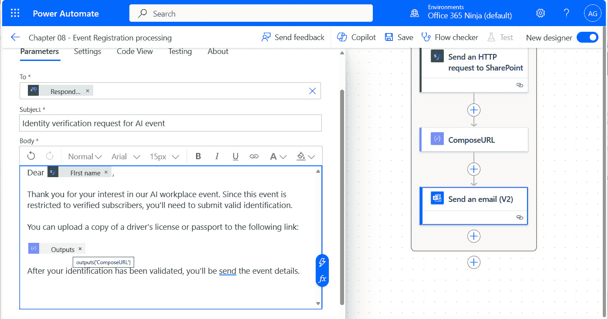

图 8.29 – 配置发送电子邮件（V2）操作

1.  点击**Save**。

到目前为止，您可以通过提交表单并查看是否收到注册者的电子邮件来测试流程。否则，让我们开始创建第二个流程！

## 处理身份证明文件

到目前为止，您已创建了一个处理 Microsoft Forms 响应的流程，并使用其中的数据为注册者生成一个自定义文件上传链接。在下一个流程中，您将使用 AI Builder 身份证明文件读取器从上传的文件中提取数据，并更新**Attendees** SharePoint 列表中相应的参会者注册行。

让我们开始吧！

1.  从 Power Automate 制作门户([`make.powerautomate.com`](https://make.powerautomate.com))，点击**Create**并选择**Automated Cloud Flow**。

1.  输入**Flow name**值并选择**When a file is created (properties only)** SharePoint 触发器，如图*图 8.30*所示：

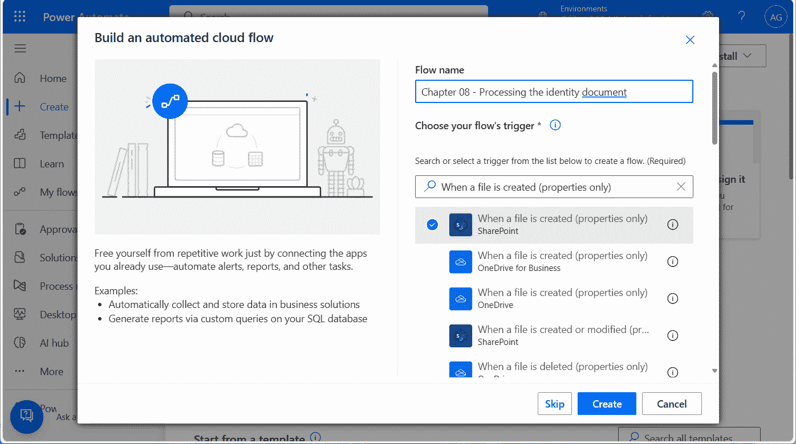

图 8.30 – 创建新的流程

1.  点击**Create**。

1.  选择**When a file is created (properties only)**触发器以打开弹出窗口。

1.  在**Site Address**下，选择**Event Registration**网站。

1.  在**Library Name**下，选择**Uploads**。

1.  由于**When a file is created (properties only)**操作在文件夹创建时也会触发，因此排除文件夹创建活动很重要。选择操作的**Settings**选项卡。在**Trigger conditions**下，点击**Add**。

1.  在字段中输入`@equals(triggerOutputs()?['body/{IsFolder}'],false)`以过滤掉涉及文件夹创建的事件。见图*图 8.31*：

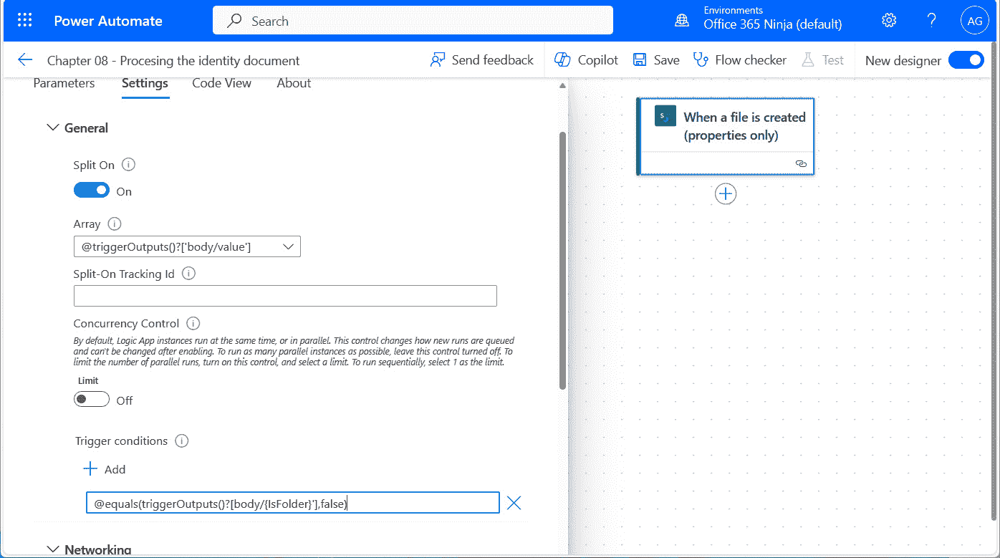

图 8.31 – 添加触发条件

1.  接下来，通过添加`(concat(utcNow('yyyyMMddHHMMss'),'_',body('Get_response_details')?['value']))`将上传文件的正文内容引入流程中。

1.  在**Get file content using path**弹出窗口中，在**Site Address**下选择**Event Registration**网站。

1.  在**File path**字段中，选择**When a file is created (properties only)**操作下的**Full Path**动态内容令牌。

    当流程运行时，如果存在多个新文件，Power Automate 可能会添加**For each**或**Apply to each**控件。如果没有自动添加，请点击**+**，然后选择**Add an action**。选择**Apply to each**控件，并将**Get file content**操作拖入其中。

注意

如果**动态内容**控制没有显示任何动态内容值，您可以尝试切换到经典 Power Automate 设计器并重新添加**获取文件内容使用路径**操作。如果需要，您可以在之后保存并切换回**新** **设计器**。

1.  在**获取文件内容使用路径**操作之后，点击**添加操作**并选择**从身份证明文件中提取信息** AI Builder 操作，如图*图 8.32*所示：

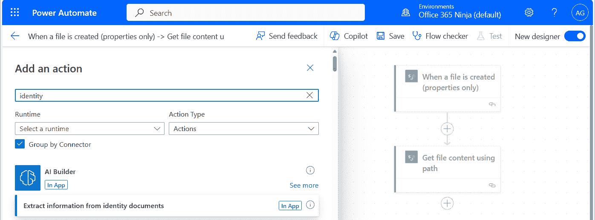

图 8.32 – 添加 AI Builder 操作

1.  在**从身份证明文件中提取信息**飞出窗口中，从**获取文件内容使用** **路径**操作添加**文件内容**动态令牌：

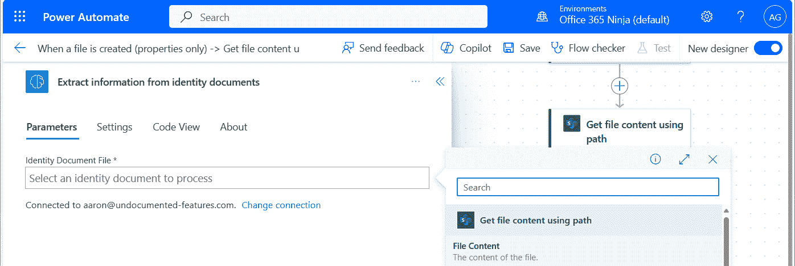

图 8.33 – 选择与 AI Builder 一起使用的文件内容

1.  在**从身份证明文件中提取信息**操作之后，点击**添加操作**并选择**获取项目** SharePoint 操作。

1.  在**网站地址**下，选择**事件** **注册**网站。

1.  在**列表名称**下，选择**与会者**列表。

1.  在**高级参数**下拉菜单中，选择**过滤** **查询**参数。

1.  在`Title eq'`。

1.  在**Filter Query**字段内点击并添加一个表达式。

1.  在文本区域中输入`split(triggerOutputs()?['body/{Path}'],'/')?[1]`并点击**Filter Query**字符串中的`'`字符。完成的值应类似于以下内容：

    ```py
    Title eq '@{split(triggerOutputs()?['body/{Path}'],'/')?[1]}'
    ```

    该表达式操作 SharePoint 项目路径，提取 `/` 字符后面的值。此路径值与 SharePoint 列表中相应项目的项目名称值相同。

1.  在**获取项目**操作之后，点击**添加操作**并选择**获取** **项目**操作：

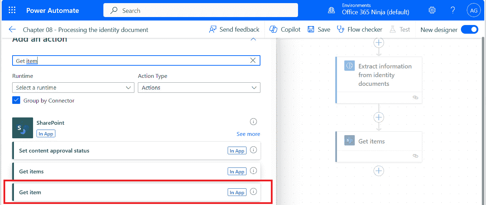

图 8.34 – 选择获取项目操作

确保获取的是**获取项目**操作（而不是**获取项目**操作）。**获取项目**返回项目集合，而**获取项目**返回单个项目。

1.  在**网站地址**下，选择**事件** **注册**网站。

1.  在**列表名称**下，选择**与会者**列表。

1.  在**Id**字段区域点击。选择表达式图标。

1.  在`first(outputs('Get_items')?['body/value'])?['id']`上点击**添加**：

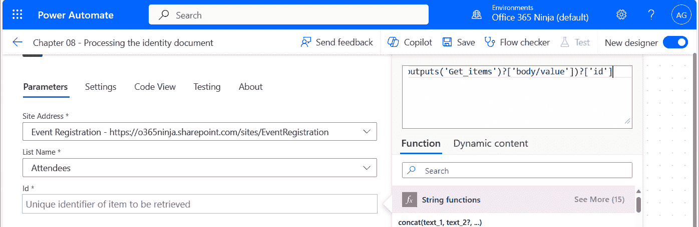

图 8.35 – 配置项目表达式

之前的表达式使用过滤查询返回单个项目。这个表达式在此基础上通过查找**获取项目**操作的`id`属性，使用*步骤 20*中表达式的输出。

1.  在**获取项目**操作之后，选择**添加操作**并选择**条件**控制。

1.  配置**条件**控制飞出窗口。在**条件表达式**区域，根据*表 8.2*配置条件：

| **条件** | **操作** | **条件** |
| --- | --- | --- |
| **从身份证明文档中提取信息** AI Builder 操作的 **名字** | **包含** | **从获取项** SharePoint 操作中提取的 **名字** |
| **从身份证明文档中提取信息** AI Builder 操作的 **姓氏** | **包含** | **从获取项** SharePoint 操作中提取的 **姓氏** |

表 8.2 – 配置条件控制值

28. 检查 **条件** 控制配置。参见 *图 8**.36*:

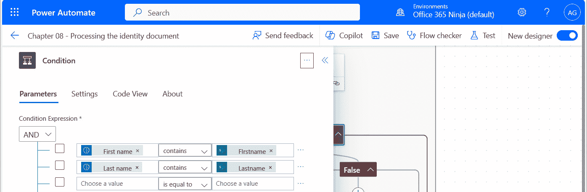

图 8.36 – 检查条件控制

29. 在 **条件** 控制的 **True** 分支中，点击 **添加操作**。选择 **更新项** SharePoint 操作。

30. 在 **更新项** 飞出窗口中，在 **站点地址** 下，选择 **事件** **注册** 网站。

31. 在 **列表名称** 下，选择 **与会者** 列表。

32. 在 **Id** 字段中，添加来自 **获取项** (not **获取项**) 操作的 **ID** 动态内容令牌。参见 *图 8**.37*:

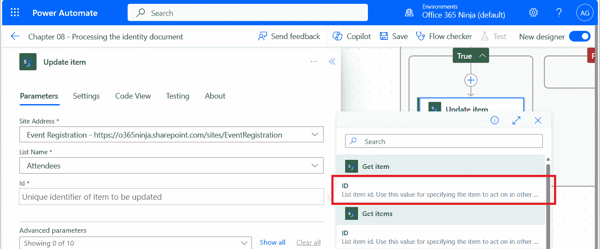

图 8.37 – 配置更新项操作

33. 在 **高级参数** 下，点击 **显示全部**。

34. 在 **DOB** 字段中，添加来自 AI Builder **从身份证明文档中提取信息** 操作的 **出生日期** 动态内容值。

35. 在 **验证状态值** 下拉菜单中，选择 **通过**。

36. 在 **身份证明文档** 字段中，选择来自 AI Builder **从身份证明文档中提取信息** 操作的 **文件编号** 动态内容值。

37. 在 **有效期** 字段中，从 AI Builder **从身份证明文档中提取信息** 操作中选择 **到期日期** 动态内容值。参见 *图 8**.38*:

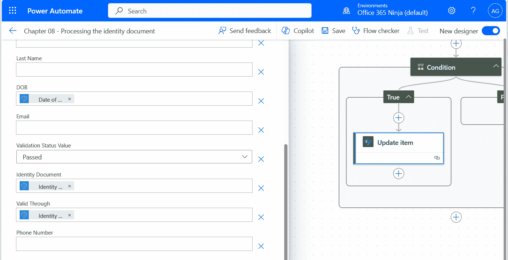

图 8.38 – 配置更新项操作

38. 点击 **保存**。

要完成此流程，我们将配置通知电子邮件。

## 发送确认消息

按照以下步骤操作：

1.  在 **条件** 控制的 **True** 分支中，在 **更新项** 操作后点击 **添加操作**。选择 **获取文件内容** 操作。

1.  重命名 `Get` `calendar invitation`。

1.  在 **站点地址** 下拉菜单中，选择从 *建立 Teams 会议* 预先步骤中保存的 ICS 日历文件所在的站点。

1.  在 **文件路径** 字段中，点击文件夹图标并浏览到保存的 ICS 文件。参见 *图 8**.39*:

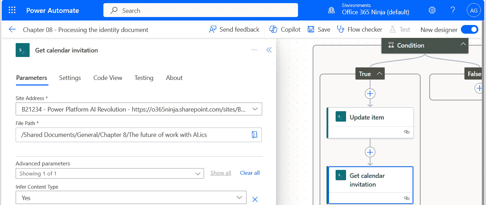

图 8.39 – 获取会议邀请的 ICS 日历文件

1.  在 **条件** 控制的 **True** 分支中，在 **获取日历邀请** 操作后点击 **添加操作**。选择 **发送电子邮件（****V2）** 操作。

1.  选择 **发送电子邮件（****V2）** 操作。

1.  在 **收件人** 字段中，选择来自 **获取** **项** 操作的 **电子邮件** 动态内容令牌。

1.  在 `Congratulations! Your event registration` `is complete!`。

1.  在 **正文** 区域，输入一条消息。

1.  在 **高级参数** 下，选中复选框以启用 **附件** 参数。

1.  在 `Meeting.ics`) 附件中。

1.  在 **内容** 字段中，从 **Get calendar invitation** 操作添加 **File Content** 动态内容令牌：

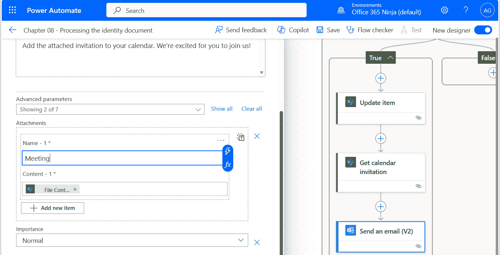

图 8.40 – 将附件添加到电子邮件消息中

1.  在 **附件** 区域，点击 **切换到输入整个数组** 图标。

1.  移除 **File Content** 动态对象周围的引号。见 *图 8**.41*：

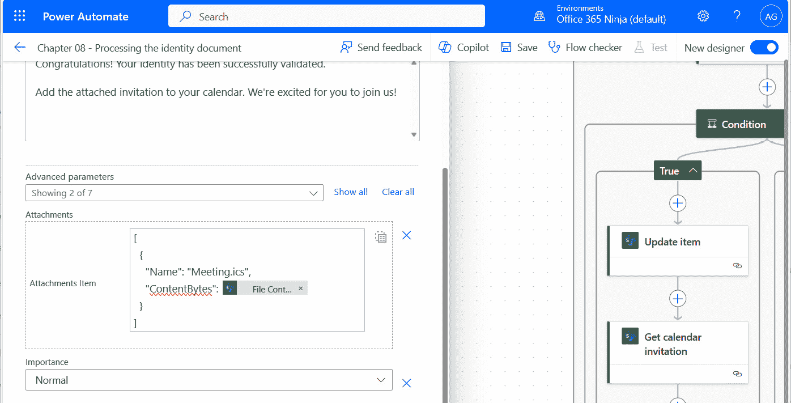

图 8.41 – 更新附件区域

1.  在这里，重要的是要移除动态内容令牌周围的引号——否则，附件将显示为 `base64` 编码的文件，无法添加到日历中。

1.  在 **Condition** 控制的 **True** 分支下，右键单击 **Update item** 操作并选择 **复制操作**，如 *图 8**.42* 所示：

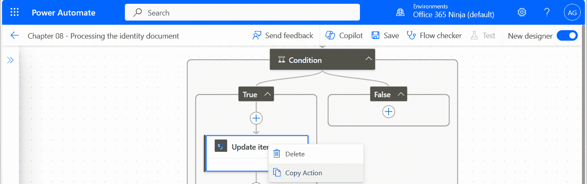

图 8.42 – 复制操作

1.  在 **False** 分支的 **Condition** 控制中，点击 **+** 并选择 **粘贴操作**：

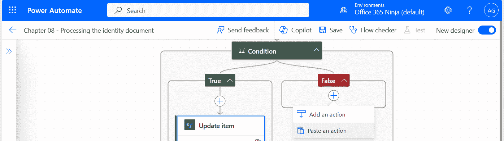

图 8.43 – 粘贴操作

1.  将操作重命名为 `Update item – Failed`。

1.  在 **高级参数** 下，删除 **DOB**、**Identity document** 和 **Valid through** 的动态内容令牌。

1.  在 **Validation Status Value** 下拉菜单中，选择 **Failed**。

1.  在 **Condition** 控制的 **True** 分支下，右键单击 **Send an email (V2)** 操作并选择 **复制操作**。

1.  在 **False** 分支的 **Condition** 控制中，点击 **Update item – Failed** 操作后面的 **+** 符号，然后点击 **粘贴操作**。

1.  将操作重命名为 `Send an email (V2) – Failed`。

1.  使用表示注册不完整的消息更新 **Subject** 值。

1.  使用解决问题的说明更新 **正文** 值。

1.  在 **高级参数** 下，点击 **X** 符号以移除配置的附件：

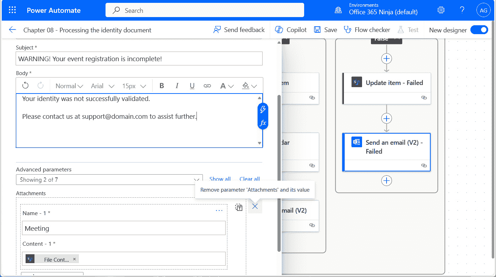

图 8.44 – 移除附件

1.  点击 **保存**。

现在是关键时刻！

# 测试流程

你可能已经想在你构建流程时测试这个流程——这是完全可以的。这是学习过程的一部分，并且是验证你的语法是否正确以及你是否选择了正确的动态内容令牌的重要步骤。

要测试流程，你需要一些东西：

+   一个可以接收确认消息的电子邮件账户

+   一个包含全名、出生日期、到期日期和文件编号的驾照或护照（可以是真实的或来自互联网的样本）

+   带有摄像头（或已数字化身份证明文件）的手机或平板设备

要执行流程，请按照以下步骤操作：

1.  导航到您在先决条件部分创建的 Microsoft 表单。您应该在“构建输入表单”部分的*步骤 5*中捕获表单 URL。

1.  使用与您将要提交的身份证明文件匹配的姓名填写表格。请确保您使用的是可以访问的电子邮件地址。在此示例中，我们将使用以下示例护照卡为 HAPPY TRAVELER：

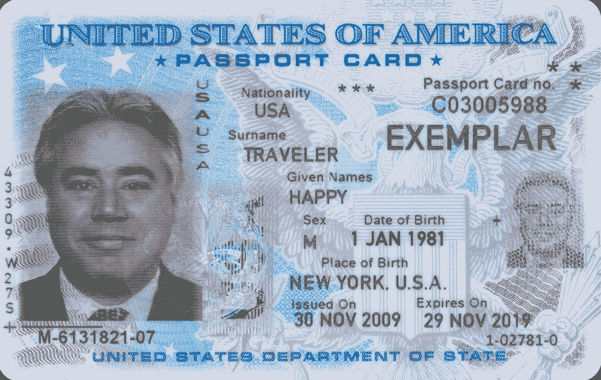


测试技巧

使用混合大小写输入姓名（例如 `Happy Traveler`）以确保您也在测试将**姓氏**和**名字**值转换为大写的`toUpper()`函数。

1.  检查您的电子邮件以获取自动响应。响应应包含一个上传链接：

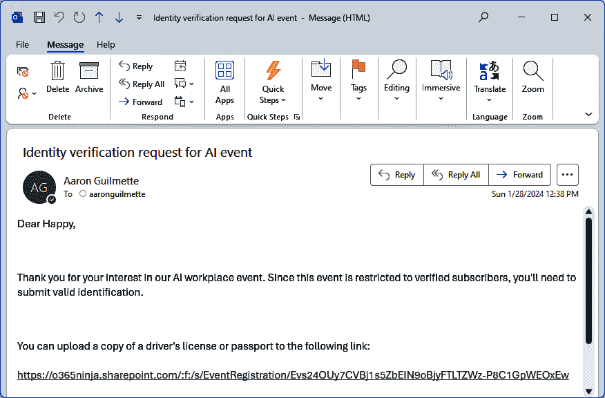

图 8.46 – 查看提交的电子邮件

1.  点击链接。您应该会被重定向到一个可以上传文件的页面：

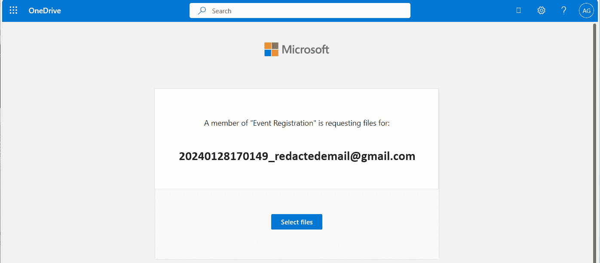


1.  点击**选择文件**。浏览到之前保存的图像文件或使用您的移动设备上的照片应用拍摄新照片。

1.  点击**上传**。

1.  等待包含 ICS 日历附件的确认消息：

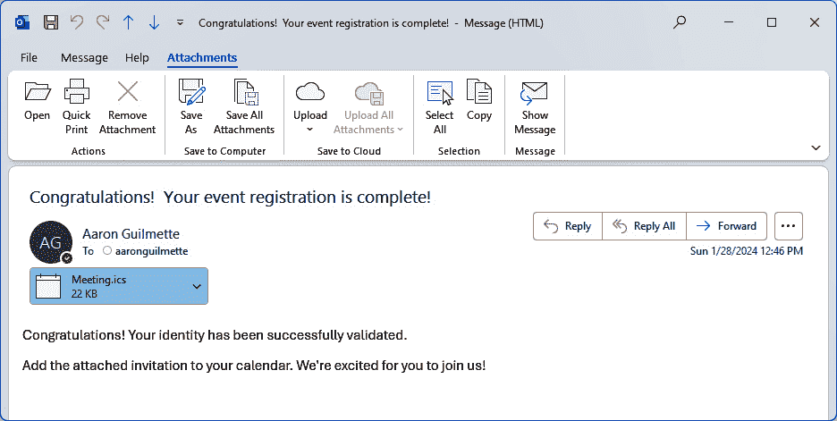


1.  双击附件将其添加到您的日历：

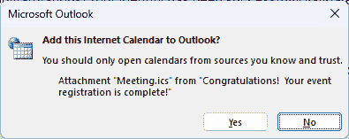


1.  查看包含加入链接的会议信息：

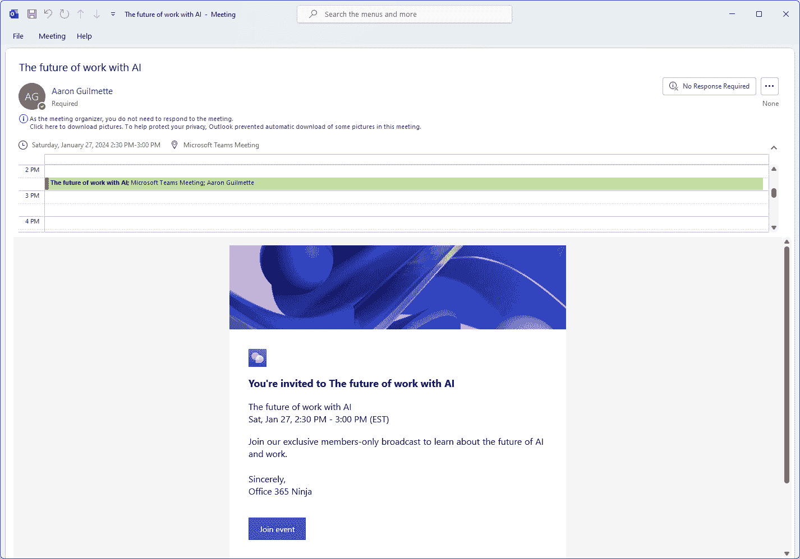


1.  导航到**事件注册**网站并选择**参会者**列表。点击条目以查看提取的信息：

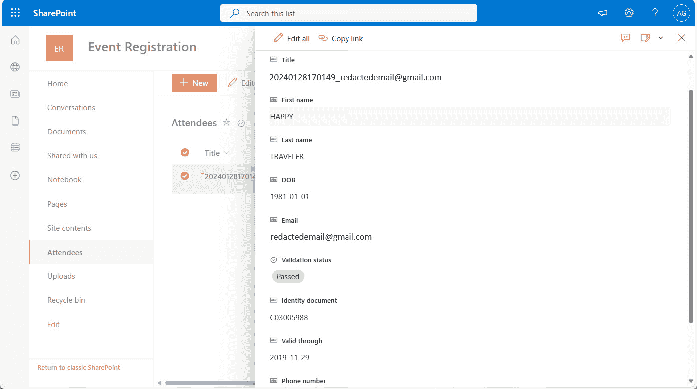

图 8.51 – 查看参会者信息

恭喜！您已成功验证流程！

您也可以尝试提交不同组合的身份证明文件和姓名来测试失败场景。

# 进一步探索

有很多不同的方法来实现这个解决方案。一个想法可能是使用 Zoom 会议而不是 Microsoft Teams 会议。为此，您需要 Zoom 客户端和日历客户端。您将能够直接通过 Zoom 界面下载 ICS 文件，而不是手动生成。请参阅[`support.zoom.com/hc/en/article?id=zm_kb&sysparm_article=KB0060791`](https://support.zoom.com/hc/en/article?id=zm_kb&sysparm_article=KB0060791)。

另一个想法可能是实施更健壮的身份证明文件验证机制，例如验证文件是否仍然有效或是否有与文件关联的文档识别号。

# 摘要

本章中的练习展示了 Power Automate 和 SharePoint Online 工具的许多高级功能。您能够在不到一个小时的时间内成功接受匿名用户的上传，使用原生 AI Builder 文档阅读器处理身份信息，并生成带有会议附件的电子邮件！

通过本章获得的知识，您可以进一步强化您的身份处理需求。

在下一章中，我们将学习如何使用另一个 AI Builder 模型进行文本提取。
