# 10

# 使用 GPT 制作执行摘要

许多人都需要准备某种类型的提案——无论是响应 RFP、提交工作说明书、向客户提出解决方案，还是展示季度业务报告。执行报告是这些文档的关键特性——将关键点以高级、易于消化的概述形式汇总在一起。

在本章中，我们将探讨如何利用生成式 AI 的力量来推理内容、构建执行摘要，并将其插入文档中。我们将使用一些熟悉的工具（如 Encodian 和 Cloudmersive 连接器）来实现这一点！

# 设计解决方案

如果你已经完成了*第七章*中的练习，“使用 Power Automate 构建 PowerPoint 演示文稿”，以及*第九章*中的练习，“实现 AI 增强的简历筛选器”，你已经熟悉了 Encodian Flowr 和 Cloudmersive 连接器。此解决方案基于这两个连接器，并结合了 OpenAI ChatGPT 的力量。

# 许可证先决条件

在 Power Platform 中使用 AI 模型和连接器有几个先决条件：

+   Power Automate 高级许可

+   OpenAI 订阅

+   Encodian 免费试用

+   Cloudmersive 免费层账户

如果你还没有启用 Dataverse 和 AI Builder 容量，请参阅*第二章*，“配置支持 AI 服务的环境”，以及*第六章*，“使用情感分析处理数据”。

# 配置解决方案先决条件

在开始工作流配置之前，你需要解决一些先决条件——即获取 OpenAI、Encodian 和 Cloudmersive 的免费、试用或付费订阅，设置模板文档，并确保你有存储完成文档的位置。

让我们快速查看如何准备这些内容。

## 启用订阅

如果你已经有了这些，那就太好了！如果没有，你可以参考*第二章*以获取关于 OpenAI 订阅配置的信息，*第七章*以获取 Encodian 试用，以及*第九章*以注册免费 Cloudmersive 订阅。

## 准备文档模板

如果你已经完成了*第七章*中的练习，你将熟悉*图 10*.1 中显示的`<<[]>>`：

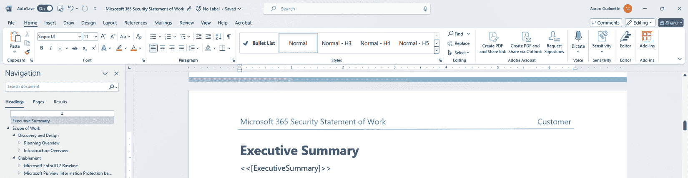

图 10.1 – 在文档中放置令牌

在*图 10*.1 中，**<<[ExecutiveSummary]>>**令牌代表 Flowr 将插入由 GPT 服务生成的执行摘要内容的位置。

## 设置云存储提供商

在本章中，我们将使用包含 Office 365 或 Microsoft 365 订阅的 OneDrive for Business 服务。您可以使用其他解决方案（例如 Dropbox 或 Google Drive），但您必须单独配置这些解决方案并使用适当的连接器。

# 创建流程

在所有先决条件都准备就绪后，是时候开始使用一些自动化工作了！

如果我遇到困难怎么办？

如果您因某些原因遇到障碍（您找不到功能、某个选项没有显示或某些内容不清楚），帮助只需点击一下！您可以从我们的 GitHub 网站下载本章的工件，网址为 [`github.com/PacktPublishing/Power-Platform-and-the-AI-Revolution`](https://github.com/PacktPublishing/Power-Platform-and-the-AI-Revolution)。

我们将从触发器开始。

## 配置触发器

此流程最适合手动触发，您将提供用作执行摘要基础的文档。

如您所知，GPTs 使用提示来提供关于要执行的任务类型的指令。您可以选择在触发器中提前提供整个提示，或者将提示语言的基础移动到稍后，并允许在触发器中进行自定义或调整。

在此流程中，我们将采用后一种方法。此触发器将使用四个输入变量：

+   您想要包含在摘要中的文档部分列表

+   您想要从摘要中排除的文档部分列表

+   一个可以输入额外指令以定制响应的地方

+   文件上传输入

要配置流程，请按照以下步骤操作：

1.  导航到 Power Automate 制作门户（[`make.powerautomate.com`](https://make.powerautomate.com)）并选择**创建**。

1.  在**从空白处开始**下，选择**即时****云流程**。

1.  在`Generate executive summary`下选择**手动触发流程**触发器。点击**创建**。

1.  选择**手动触发流程**触发器。在弹出窗口中，选择**添加****输入**。

1.  选择**文本**：

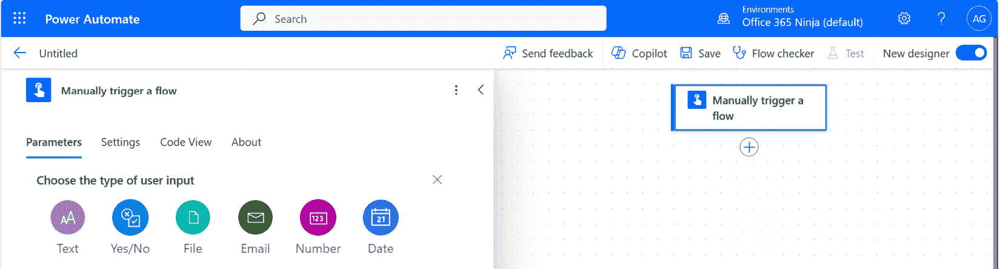

图 10.2 – 选择文本输入

1.  替换`Inclusions`。这将是一个文本区域，您可以描述要在流程中包含的文档部分或组件。在文本区域中，您可以替换（`scope of work and project deliverables`），如*图 10*.*3*所示：

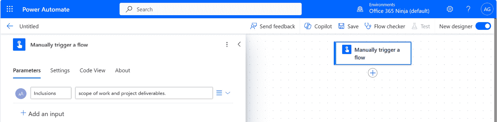

图 10.3 – 自定义输入

备注

需要注意的是，您用作建议的文本与**默认文本**（在没有提供自定义的情况下将自动包含的文本）不同。Power Automate 目前不支持默认文本。您必须在流程运行期间填写此文本。

根据您组织的作业范围如何构建以及您的典型执行摘要看起来如何，您可能需要进一步自定义此设置。

1.  点击**添加****输入**。

1.  替换`包含内容`。这将是一个文本区域，您可以在此描述文档的章节或组件，以便包含在您的流程中。在文本区域中，您可以替换`项目治理、项目管理、绩效期、资源规划、客户资源承诺和定价`）。根据您组织的工作范围如何构建以及您的典型执行摘要看起来如何，您可能需要进一步自定义此内容。

1.  点击**添加输入**。

1.  替换`附加说明`。这将是一个文本区域，您可以在此提供任何其他相关说明，例如可能对特定客户重要的事情。在文本区域中，您可以替换`关注与客户的积极成果和合作机会`。

1.  点击**添加输入**并选择**文件**。

1.  替换`上传`。

配置触发器后，是时候开始处理文档了。

## 转换文档

由于 GPT 只能处理文本形式的内容（而不是 Word 文档的二进制格式），因此需要将其转换。以下步骤将发送文档到 Cloudmersive 连接器以将其转换为纯文本：

1.  触发后，点击**+**并选择**添加一个动作**。

1.  在 `Cloudmersive` 中，滚动到**Cloudmersive 文档转换**连接器，并点击**查看更多**：

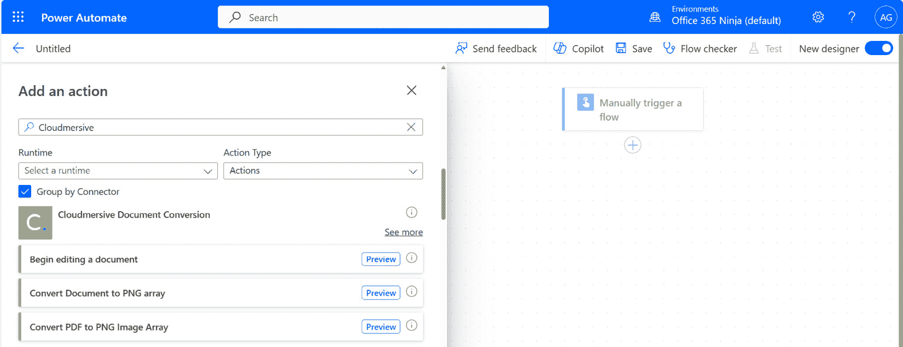

图 10.4 – 选择连接器

1.  选择**将 Word DOCX 文档转换为文本 (txt)** 动作，如图*图 10.5*所示。5*：

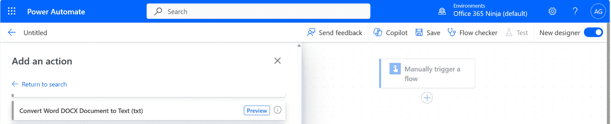

图 10.5 – 选择转换动作

1.  **将 Word DOCX 转换为文档到文本 (txt)** 的飞出菜单出现。在**要执行操作的输入文件**框中，在**手动触发一个** **流程**动作下添加**文件内容 contentBytes**的动态内容令牌：

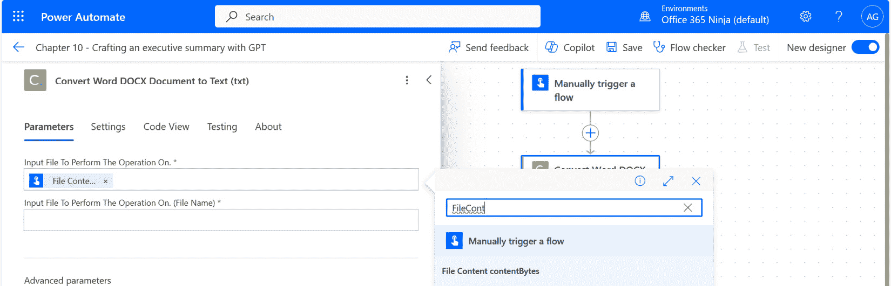

图 10.6 – 添加 File Content contentBytes 动态内容令牌

1.  在**要执行操作的输入文件（文件名）**框中，在**手动触发一个** **流程**动作下添加**文件内容 name**的动态内容令牌。

现在，我们将数据发送到 OpenAI 的 ChatGPT 进行处理！

## 将内容发送到 GPT

在本节中，我们将配置保存附件所需的步骤，并为提交简历的候选人添加 SharePoint 列表项。我们将使用 HTTP 高级连接器来完成本节。

在我们这样做之前，让我们先探索将被发送到 OpenAI 的 JSON 有效负载。此有效负载包含有关将要使用的模型的信息、提示信息以及将控制模型如何响应的参数：

```py
{
  "model": "gpt-4",
  "messages": [
    {
      "role": "system",
      "content": "You are a system architect collaborating with an account executive on a statement of work for a new customer."
    },
    {
      "role": "user",
      "content": "Generate an executive summary for the included content. Focus on the following areas of the document: **Inclusions** Exclude the following sections from the executive summary: **Exclusions** Use the following additional information to write a compelling closing statement: **Additional Instructions** The completed executive summary should be between 225 and 350 words."
    }
  ],
  "max_tokens": 5000,
  "temperature": 0,
  "n": 1,
  "stream": false,
  "logprobs": null,
  "stop": null
}
```

在审查此代码示例时，有几个关键区域：

+   `model`：在这个例子中，我们将使用**gpt-4**。您可以使用其他模型，但 GPT-4 是 OpenAI 目前提供的最先进的模型。

+   `messages`：此对象定义了两个角色，**system** 和 **user**，每个角色都关联一个 **content** 键/值对。**system** 角色代表您作为开发者向 GPT 提供的内部指令。相关的内容键是您可以提供系统角色指令的地方。在这种情况下，您指示 GPT 扮演系统架构师。**user** 角色是请求 GPT 执行任务的个人或服务。其内容键/值对用于提供请求上下文和指令。

+   `max_tokens`：这是您希望服务消耗的最大标记数。如您从 *第三章* 的 *与 ChatGPT 交谈* 中所回忆的那样，标记是 GPT 将请求分解成的内容块（单词或单词的一部分）。每份文档可能有所不同，但 5,000 个标记大约相当于 10-15 页双倍行距的文档。您可以使用 OpenAI 的 Tokenizer ([`platform.openai.com/tokenizer`](https://platform.openai.com/tokenizer)) 来估计您的源文档包含多少标记：

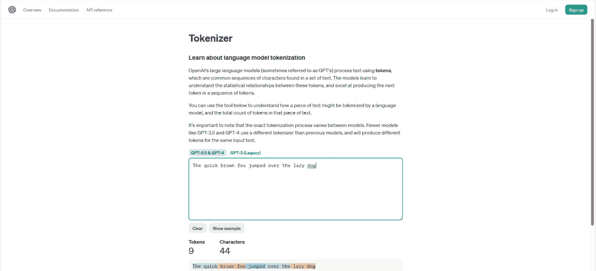

图 10.7 – 使用 OpenAI Tokenizer

+   `temperature`：这是一个参数（介于 0 和 1 之间的值），它控制响应中展现的随机性和创造力。接近零的值更确定，而接近 1 的值更具创造性。

+   `n`：提供多少个完成选项。

+   `stream`：这允许发送部分消息内容。在这种情况下，我们希望将整个响应体作为一个单一实体发送。

您还会注意到一些被星号包围的内容，例如 ****包含**** 和 ****排除****。这些只是您将用动态内容标记替换的占位符。

让我们开始吧！

1.  在 **将 Word DOCX 文档转换为文本 (txt)** 动作之后，在 **HTTP** 连接器下添加 **HTTP** 动作：

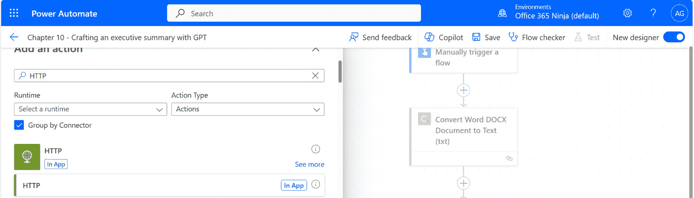

图 10.8 – 添加 HTTP 动作

1.  在 `https://api.openai.com/v1/chat/completions`

    这是 OpenAI 服务的聊天完成端点。

1.  在 **方法** 下，选择 **POST**。

1.  在 **授权** 的 **键** 字段下。

1.  接下来，你需要你的 OpenAI API 密钥。在 `Bearer <OpenAI AI key>` 的 `Bearer sk-qztnj1CoTtoXFsXXlFYnT3ClbkFJqOOBf7gFcn9ErCKqeYbV` 的 **值** 字段下。参见 *图 10**.9*：

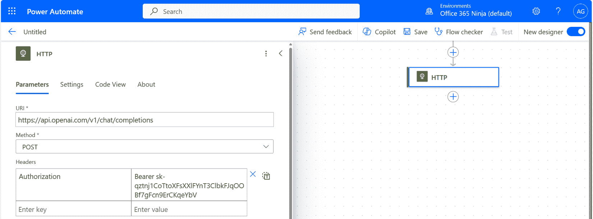

图 10.9 – 配置 HTTP 授权

不，那不是一个真正的密钥，所以不要尝试使用它。它只是看起来像。

1.  **正文** 字段是我们将向 GPT 发送请求的地方。我们将发送的请求将结构化为 JSON 有效负载。您可以复制以下有效负载（从本节开头重复）：

    ```py
    {
      "model": "gpt-4",
      "messages": [
        {
          "role": "system",
          "content": "You are a system architect collaborating with an account executive on a statement of work for a new customer."
        },
        {
          "role": "user",
          "content": "Generate an executive summary for the included content. Focus on the following areas of the document: **Inclusions** Exclude the following sections from the executive summary: **Exclusions** Use the following additional information to write a compelling closing statement: **Additional Instructions** The completed executive summary should be between 225 and 350 words."
        }
      ],
      "max_tokens": 5000,
      "temperature": 0,
      "n": 1,
      "stream": false,
      "logprobs": null,
      "stop": null
    }
    ```

1.  选择文本 ****包含**** 并将其替换为 **包含** 动态内容标记，来自 **手动触发流程** 动作。

1.  选择文本****排除项****并将其替换为来自**手动触发一个** **流程**操作的**排除项**动态内容令牌。

1.  选择文本****附加说明****并将其替换为**附加说明**动态内容令牌，来自**手动触发流程**操作。见*图 10**.10*：

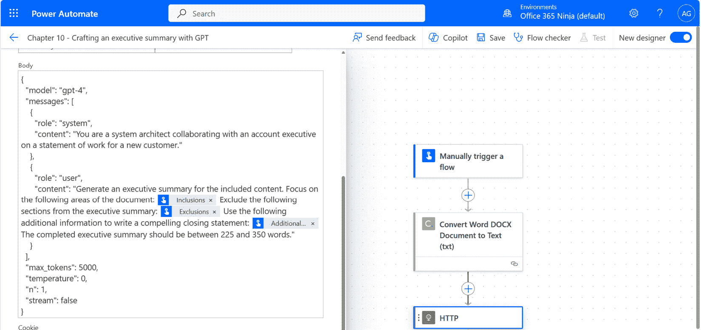

图 10.10 – 配置 HTTP 操作的正文

1.  在**HTTP**操作之后，添加**解析** **JSON**操作。

1.  在**内容**字段中，选择来自**HTTP**操作的**正文**动态内容令牌。

1.  在**模式**文本区域字段中，粘贴以下内容：

    ```py
    {
        "type": "object",
        "properties": {
            "id": {
                "type": "string"
            },
            "object": {
                "type": "string"
            },
            "created": {
                "type": "integer"
            },
            "model": {
                "type": "string"
            },
            "choices": {
                "type": "array",
                "items": {
                    "type": "object",
                    "properties": {
                        "index": {
                            "type": "integer"
                        },
                        "message": {
                            "type": "object",
                            "properties": {
                                "role": {
                                    "type": "string"
                                },
                                "content": {
                                    "type": "string"
                                }
                            }
                        },
                        "logprobs": {},
                        "finish_reason": {
                            "type": "string"
                        }
                    },
                    "required": [
                        "index",
                        "message",
                        "logprobs",
                        "finish_reason"
                    ]
                }
            },
            "usage": {
                "type": "object",
                "properties": {
                    "prompt_tokens": {
                        "type": "integer"
                    },
                    "completion_tokens": {
                        "type": "integer"
                    },
                    "total_tokens": {
                        "type": "integer"
                    }
                }
            },
            "system_fingerprint": {}
        }
    }
    ```

    **模式**定义了输出的格式。在 Power Automate 中，它来自直接对 ChatGPT API 运行 HTTP POST 请求的实际输出。有几种方法可以自己完成，例如使用 Postman ([`www.postman.com`](https://www.postman.com)) 运行基本查询，如图*图 10**.11*所示：

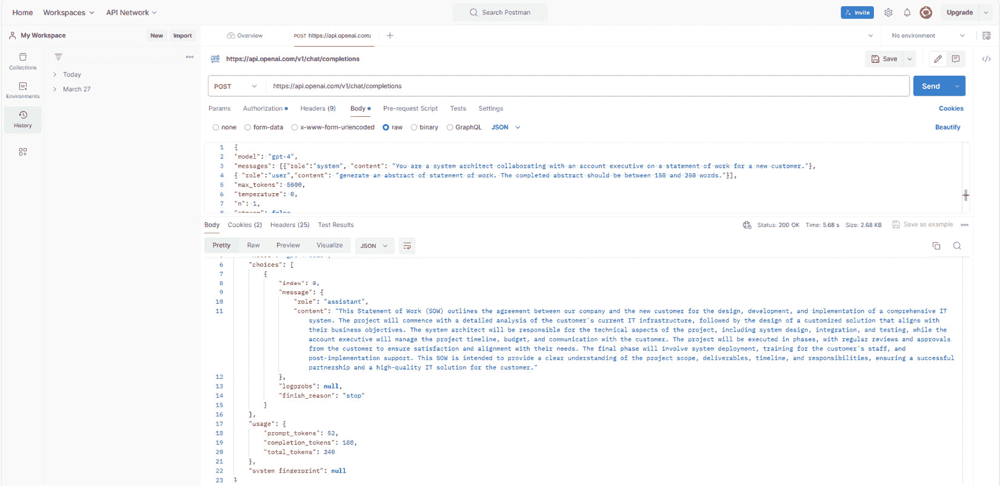

图 10.11 – 通过 Postman 生成模式源文件

生成输出后，您可以在**解析 JSON**弹出窗口中点击**使用示例有效负载生成模式**，然后复制/粘贴来自原始 ChatGPT 输出的内容，如图*图 10**.12*所示：

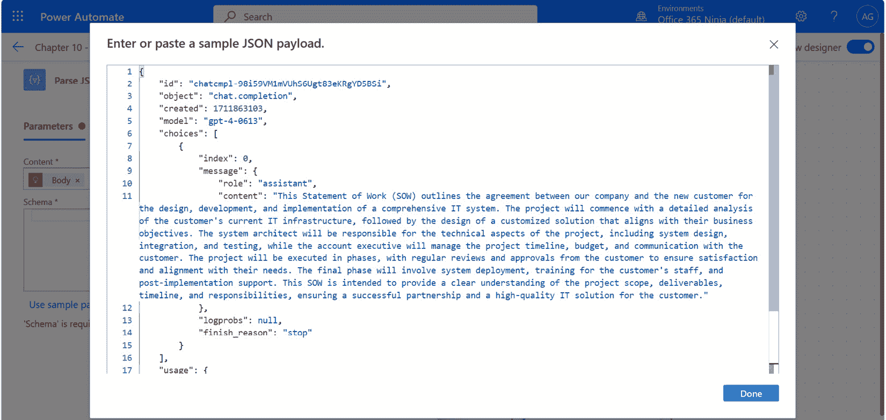

图 10.12 – 添加 JSON 有效负载以生成模式

在此阶段，您可以点击**保存**以保存您的进度。接下来，我们将使用此输出并将其插入到 Word 文档中。

## 填充文档并保存新文件

我们在这个例子中已经接近完成！我们将按照以下步骤处理 Word 文档，然后将输出发送到 OneDrive for Business：

1.  在**解析 JSON**操作之后，添加**填充 Word 文档**Encodian 操作。

1.  在**解析 JSON**弹出窗口中，在**文件内容**字段中，在**手动触发一个** **流程**操作下添加**文件内容 contentBytes**动态内容令牌。

1.  在**文档数据**文本区域字段中，输入以下内容：

    ```py
    {
    "ExecutiveSummary" : "**Body Content**"
    }
    ```

1.  将****正文内容****替换为来自**解析 JSON**操作的**正文内容**动态内容令牌，如图*图 10**.13*所示：

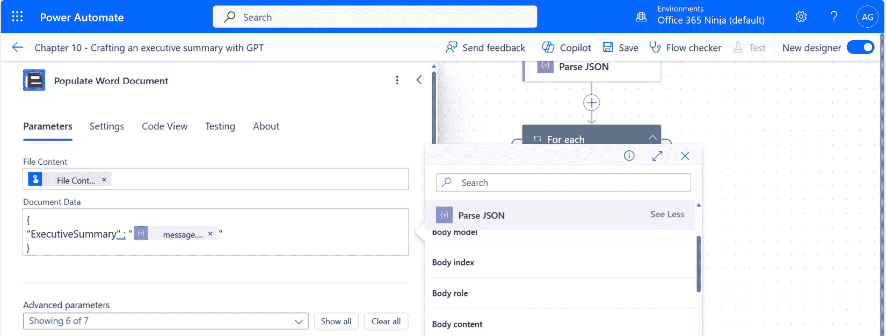

图 10.13 – 配置填充 Word 文档操作

1.  添加**创建文件**OneDrive for Business 操作。

1.  在`concat(utcNow('yyyyMMddHHmm'),'_',triggerBody()?['file']?['name'])`。这将通过连接日期戳和文件的原始名称来创建一个文件。

1.  在**文件内容**字段中，在**填充 Word 文档**操作下添加**文件内容**动态令牌。见*图 10**.14*：

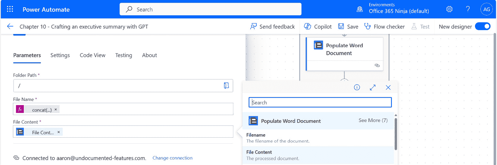

图 10.14 – 配置填充 Word 文档操作

1.  点击**保存**。

现在，到了关键时刻！

# 测试流程

要测试流程，您需要一个结构化的 Word 文档，例如添加了**<<[ExecutiveSummary]>>**令牌的工作说明书。准备好后，让我们一起来测试这个流程：

1.  从流程设计者处，点击**测试**。

1.  选择**手动**单选按钮，然后点击**测试**。

1.  填写**包含内容**、**排除内容**和**附加说明**（见*图 10.15*中的屏幕文本）区域。使用样本文本根据您使用的 Word 文档创建自己的包含内容和排除内容：

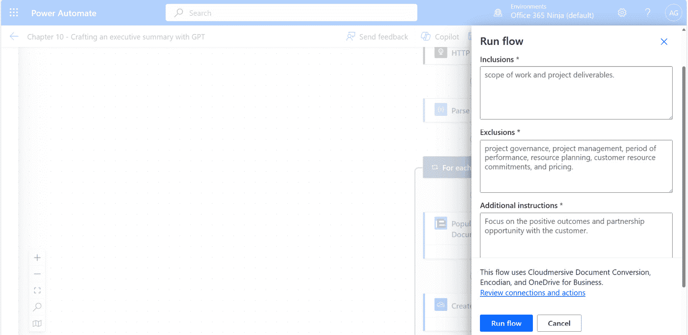

图 10.15 – 测试流程

1.  点击**导入**并浏览到样本工作说明书。

1.  点击**运行流程**。

1.  查看输出步骤以确保一切正常：

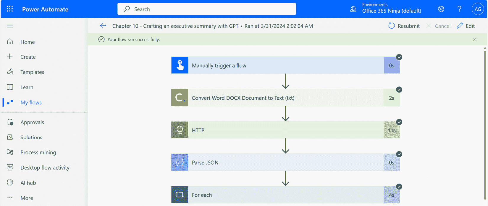

图 10.16 – 查看流程运行步骤

1.  浏览到 OneDrive for Business，查看根目录中新建的文件。打开它并导航到文档中您放置**<<[****ExecutiveSummary]>>**令牌的部分。

1.  查看插入的内容。根据需要做出任何编辑，以确保内容适合您的用例：

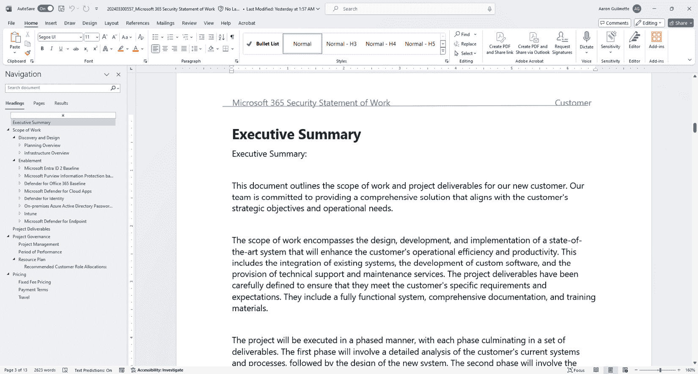

图 10.17 – 查看更新的 Word 文档

恭喜！您已成功验证了流程！

如果流程错误地将简历分类，您可以轻松地返回并调整提示以提高或降低置信度要求。

# 进一步探索

现在您已成功创建了一份工作说明书的执行摘要，您可以考虑以下想法来扩展它：

+   修改以将输出文件保存到 Teams 网站、Google Drive 或 DropBox 存储位置

+   将其用作模板流程以创建其他标准文档部分

+   构建一个更定制的提示以完成摘要

+   添加更多令牌以进一步定制输出以满足特定客户或业务需求

+   使用 AI Builder 自定义提示操作而不是发送 HTTP 操作到 OpenAI

# 摘要

在本章中，我们汇集了两个第三方连接器，以帮助操作和增强 Word 文档。我们不是使用本机 AI 构建器组件，而是使用 HTTP 连接器直接将内容发送到 OpenAI ChatGPT 端点。

在下一章中，我们将使用 AI 工具自动识别图片。
