# 11

# 在 SharePoint 库中使用 AI 标记图像

想象一个场景，你有一些现场工作人员、承包商、员工或其他人在使用一个应用程序拍照并将照片上传到 SharePoint 网站上。这可能出于任何原因——工作人员可能是在拍卖会上捕捉库存、调查设施、记录工作流程或在公司野餐会上拍照。

一旦大量数据进入你的环境，对其进行分类和标记变得越来越困难。为什么不让 AI 尝试一下呢？

在这个解决方案中，我们将展示如何让 AI 做这件事。通过利用 Azure 计算机视觉和 Power Automate，你将能够处理图像（无论是现有的库还是新到达的内容），加速你组织中内容分类的过程。

在我们深入解决方案的核心之前，让我们快速了解一下我们将要使用的技术。

# 什么是计算机视觉？

Azure 计算机视觉是微软云服务，它使用 AI 算法和深度学习模型来分析和提取图像中的洞察力。计算机视觉可以用于执行多种图像分析和处理任务。Azure 计算机视觉具有多种不同的功能，包括：

+   **图像分类**：这指的是通过识别内容中的主要对象来整体分类图像。例如，你可能训练一个模型来识别像 *图 11.1* 这样的图像，并使用“狗”这个词。


图 11.1 – 将图像分类为狗

+   **对象检测**：与图像分类类似，对象检测用于识别图像中的对象。对象通过使用称为 **边界框** 的类型边界来指示。对象检测通常可以在单个图像中识别不同类型的对象，如图 *图 11.2* 所示。

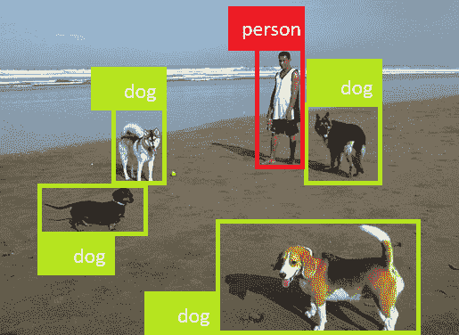

图 11.2 – 在图像中检测对象

+   **语义分割**：这是对对象分类的另一种看法，语义分割指的是对对象单个像素的分类。这种分类机制可能用于跟踪物品在视频流或捕获的视频文件中移动的情况。

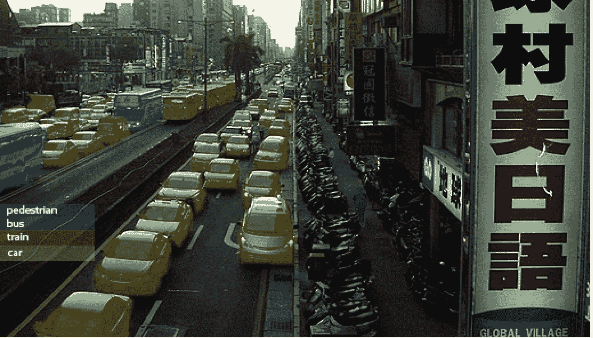

图 11.3 – 查看语义分割图像

+   **图像分析**：这种检测采用多种技术，包括机器学习模型识别常见特征（边缘、颜色、形状、模式和边界）并应用特定领域的知识来识别和描述对象。

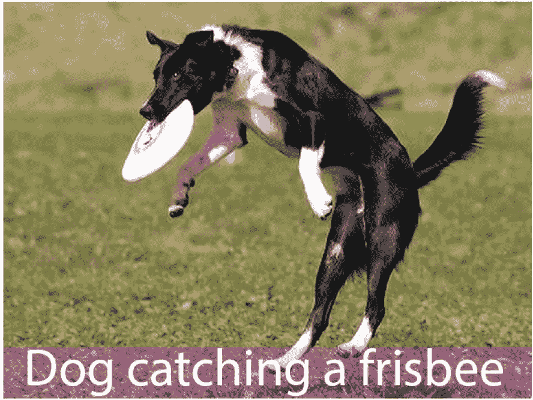

图 11.4 – 使用图像分析处理图像

+   **人脸检测**：一种特殊对象检测形式，用于在图像中识别人脸。分类和其他技术可以用来提供高级识别（如识别个人）。


图 11.5 – 图像中的面部识别

+   **光学字符识别（OCR）**：另一种特殊对象检测形式，OCR 识别图像中的字母和单词。


图 11.6 – 图像中检测到的文本

在每个示例中，计算机视觉能够处理图片并提取单个特征和对象，使它们可以通过其他计算机化系统访问。

# 设计解决方案

如简介所暗示，我们将使用 Azure 计算机视觉服务（最初是 Azure 认知服务的一部分，现在重新命名为 Azure AI 服务）。

# 许可先决条件

在 Microsoft Power Platform 中使用 AI 模型和连接器有几个先决条件：

+   Power Automate 的高级许可

+   Azure 订阅

+   SharePoint Online 订阅

一旦这些设置就绪，就是时候设置计算机视觉了！

# 配置解决方案先决条件

在开始工作流配置之前，你需要先设置一些事情——即，一个计算机视觉服务和 SharePoint 网站。

## 创建计算机视觉服务

按照以下步骤在 Azure 订阅中创建一个计算机视觉服务：

1.  导航到 Azure 门户([`portal.azure.com`](https://portal.azure.com))并登录。

1.  在`计算机视觉`下选择**计算机视觉**。

1.  在**计算机视觉**页面，点击**创建**。

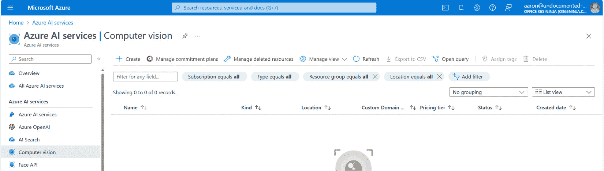

图 11.7 – 创建计算机视觉服务

1.  选择一个订阅、资源组、区域，输入一个名称（必须在整个 Azure 空间中唯一），并选择一个定价层。点击**审查+** **创建**。

1.  在确认屏幕上，点击**创建**。

1.  在**部署概览**页面，点击**转到资源**。

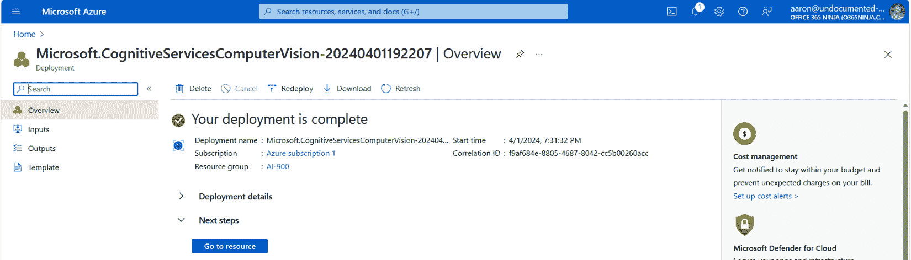

图 11.8 – 审查概览页面

1.  在**资源管理**下，选择**密钥**和**端点**。

1.  点击**显示密钥**。复制一个 API 密钥和端点，并保存以备后用。

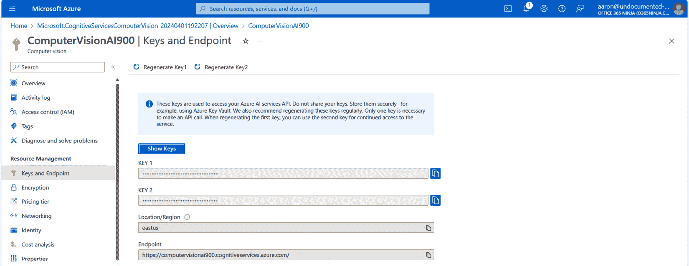

图 11.9 – 查看密钥和端点页面

接下来，我们将设置一个 SharePoint 库来存储图像。

## 配置 SharePoint 库

虽然你可以创建一个标准的 SharePoint 库，但创建一个 Microsoft Teams 团队并在团队附加的 SharePoint 库上构建（从项目角度和更广泛的功能角度来看）都有好处。

1.  启动 Microsoft Teams（或导航到 [`teams.microsoft.com`](https://teams.microsoft.com)）并创建一个团队（**团队** | **+** | **创建团队** | **从头开始创建**）。

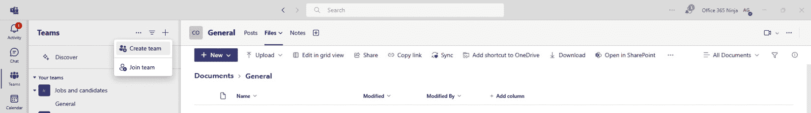

图 11.10 – 创建团队

1.  团队创建后，导航到 **通用** 通道，选择 **文件** 选项卡，然后选择 **在 SharePoint 中打开** 以导航到团队的连接 SharePoint 网站。

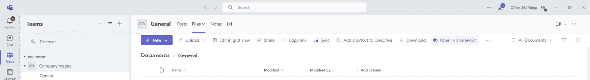

图 11.11 – 打开团队的连接 SharePoint 网站

1.  从菜单中选择 **主页**，然后点击 **新建** | **文档库**。

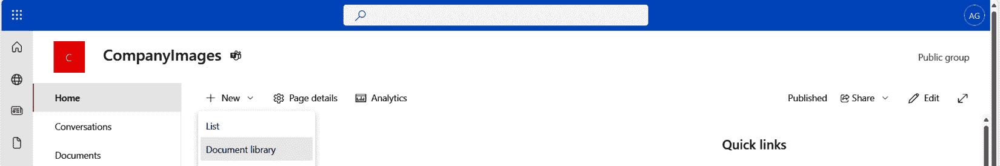

图 11.12 – 创建新的文档库

1.  从可用选项列表中，选择 **媒体库**，如图 *图 11*.13* 所示。

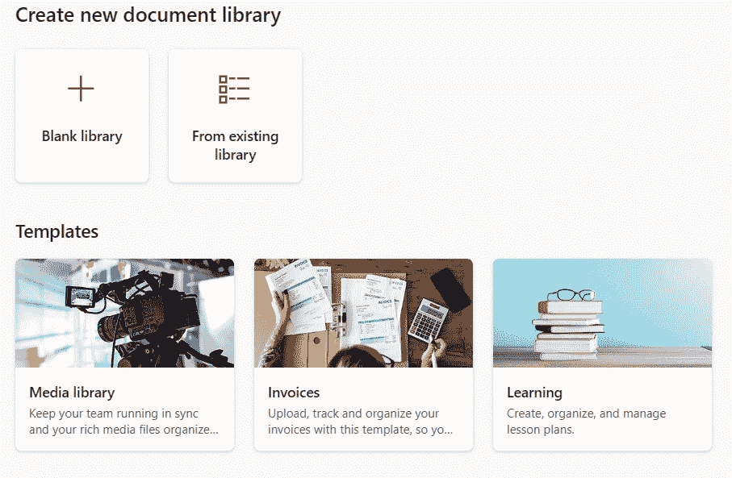

图 11.13 – 创建媒体库

1.  点击 **使用模板**。

1.  点击 **创建**。

1.  选择 **不添加这些功能** 复选框，点击 **下一步**，然后点击 **明白了**。

1.  在媒体库内部，选择齿轮图标以展开 **设置** 飞出菜单。选择 **库设置**。

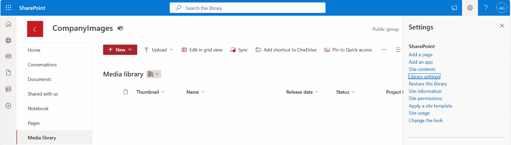

图 11.14 – 展开设置飞出菜单

1.  在 **库设置** 飞出菜单中，选择 **更多库设置**。

1.  在 **列** 下，选择 **从现有网站列添加**，如图 *图 11*.15* 所示：

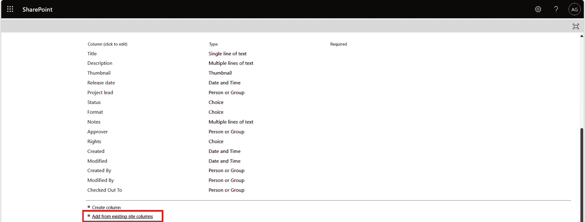

图 11.15 – 添加列

1.  在 **从网站列添加列** 页面上，从 **可用网站列** 列表中选择 **关键词** 并点击 **添加**。此列将保存计算机视觉在处理图像时生成的关键词。

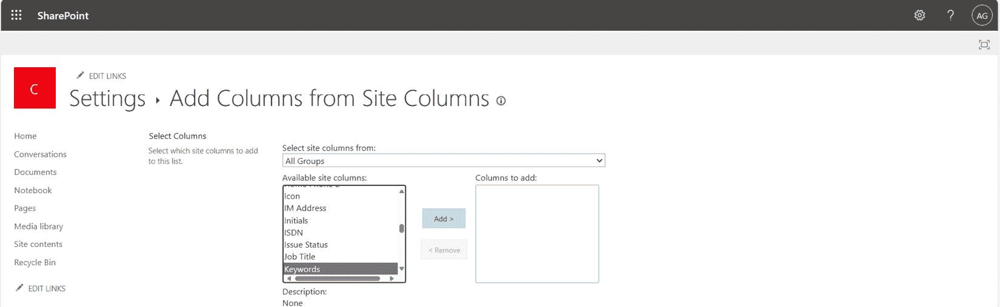

图 11.16 – 添加关键词列

1.  完成后点击 **确定**。

1.  点击网站导航栏中的 **媒体库** 返回到媒体库页面。

1.  选择 **视图** 下拉菜单（默认设置为 **所有媒体**），然后选择 **编辑当前视图**。

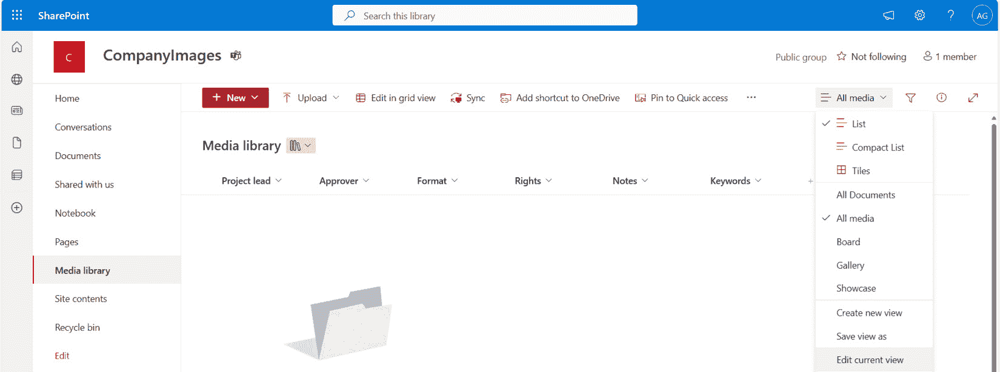

图 11.17 – 编辑当前视图

1.  在 **列** 下，向下滚动并选择 **描述**。

1.  将页面滚动到最底部并点击 **确定** 保存更改。

根据您的屏幕大小和浏览器缩放，您可能需要向右滚动才能看到额外的列。到此为止，您已经准备好了一个用于图像的库！

# 创建流程

所有先决条件都已准备就绪，现在是时候开始使用一些自动化工作了！我们将从触发器开始。

## 配置触发器

此流程与自动触发器配合使用最佳，其中它可以处理新图像，当它们被插入到库中时。

要配置流程，请按照以下步骤操作：

1.  导航到 Power Automate 制作门户([`make.powerautomate.com`](https://make.powerautomate.com))并选择**创建**。

1.  在**从空白开始**下，选择**自动化****云流程**。

1.  在`更新图像描述`操作中，选择**当文件创建时（仅属性）**SharePoint 触发器。

1.  点击**创建**。

1.  在**当文件创建时（仅属性）**弹出窗口中，在**站点地址**下，选择包含您在先决条件部分创建的媒体文档库的 SharePoint 站点。

1.  在**库名称**下，选择在先决条件部分配置的库。

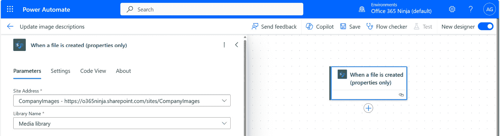

图 11.18 – 配置触发器

在**当文件创建时（仅属性）**弹出窗口中，选择**设置**选项卡。

在`@or(endsWith(triggerOutputs()?['body/Name'],'.jpg'),endsWith(triggerOutputs()?['body/Name'],'.jpeg'),endsWith(triggerOutputs()?['body/Name'],'.bmp'),endsWith(triggerOutputs()?['body/Name'],'.png'),endsWith(triggerOutputs()?['body/Name'],'.gif'))`

这将创建一个触发条件，仅处理以 `.jpg`、`.jpeg`、`.bmp`、`.png` 或 `.gif` 结尾的文件扩展名。见*图 11.19*。

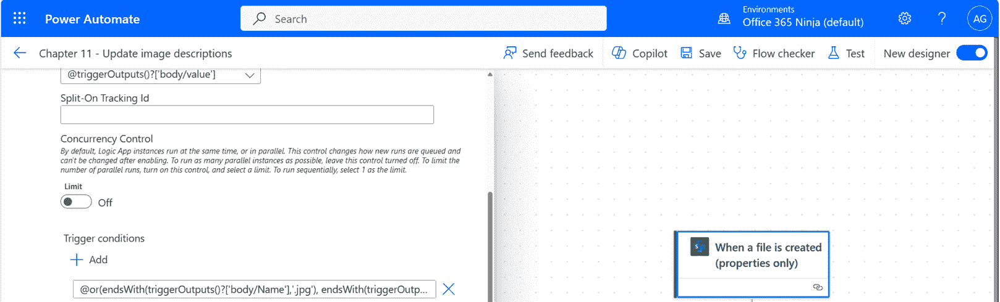

图 11.19 – 配置触发条件

进一步阅读

您可以在此处了解用于创建条件和表达式的**工作流定义语言**：[`learn.microsoft.com/en-us/azure/logic-apps/workflow-definition-language-functions-reference`](https://learn.microsoft.com/en-us/azure/logic-apps/workflow-definition-language-functions-reference)。

1.  按**添加操作**并选择**初始化变量**。

1.  通过在变量操作名称后追加`– 描述`来更新变量操作的名称。

1.  在`描述`。

1.  在**类型**字段中，选择**字符串**。见*图 11.20*。

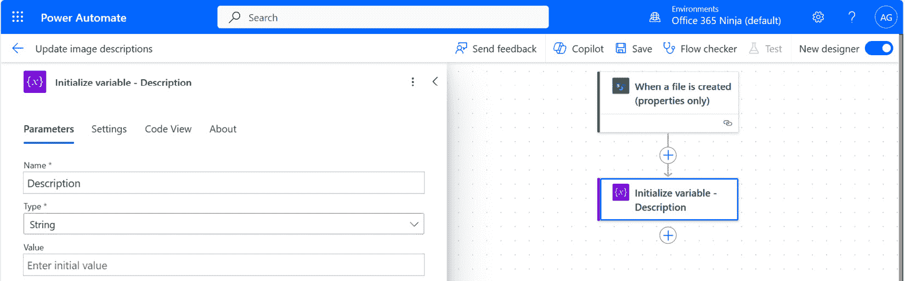

图 11.20 – 添加描述变量操作

1.  在**初始化变量 - 描述**操作之后，添加另一个**初始化****变量**操作。

1.  通过在变量操作名称后追加`– 关键字`来更新变量操作的名称。

1.  在`关键字`。

1.  在**类型**字段中，选择**字符串**。

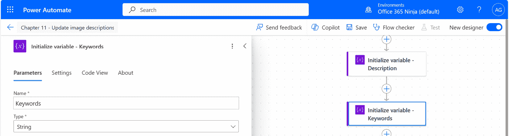

图 11.21 – 添加关键字变量操作

配置好触发器和变量后，是时候开始使用 AI 进行工作了！

## 使用计算机视觉

在本节中，我们将导入已上传文件的內容，并将其发送到之前配置的 Azure AI 服务。让我们开始吧！

1.  在**初始化变量 - 关键字**操作之后，添加**获取文件内容**SharePoint 操作。

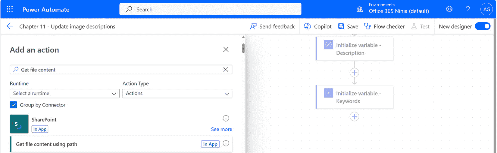

图 11.22 – 添加使用路径获取文件内容操作

1.  在**获取文件内容使用路径**弹出菜单中，在**站点地址**下，选择此练习的站点。

1.  在**文件标识符**下，选择**完整路径**动态内容令牌，位于**当文件创建时（仅属性）**操作下。

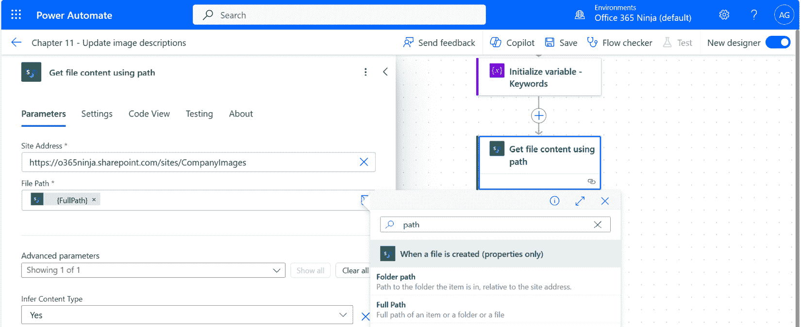

图 11.23 – 配置获取文件内容操作

1.  在**获取文件内容使用路径**操作之后，添加**描述图像**计算机视觉 API 操作。见*图 11*.24*。

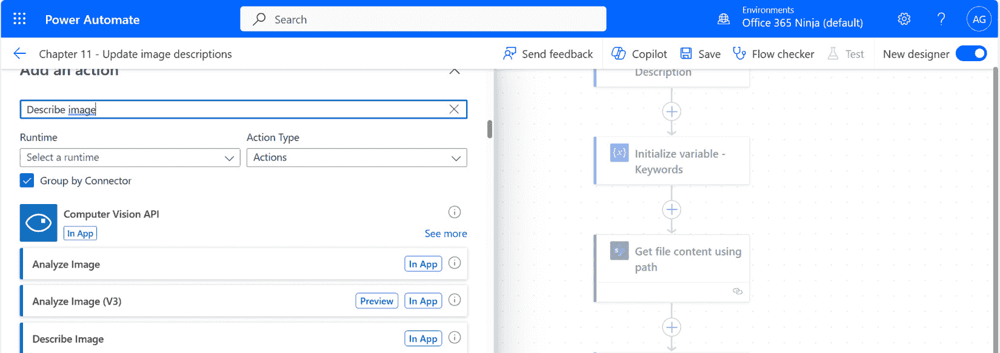

图 11.24 – 添加描述图像操作

1.  在**创建连接**弹出菜单中，在**连接名称**框中输入一个名称。

1.  将**身份验证类型**设置为**API 密钥**。

1.  在**账户密钥**字段中，输入在完成先决条件时保存的计算机视觉 API 密钥。

1.  在**站点 URL**字段中，输入在完成先决条件时保存的端点 URL。

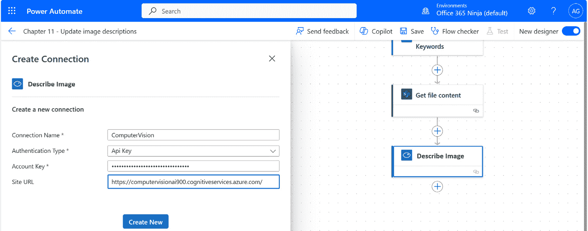

图 11.25 – 配置 API 连接

1.  点击**创建新**。

1.  在**描述图像**弹出菜单中，在**图像内容**下，选择**图像源**。

1.  在**图像源**下，选择**文件内容**动态内容令牌，位于**获取文件内容使用** **路径**操作下。

1.  点击**保存**。

到目前为止，我们可以运行一个测试来确定我们需要处理哪种类型的输出。你需要一个或两个可以上传到媒体库的文件。

按照以下步骤运行快速测试以检查**描述** **图像**操作的输出。

1.  在流程设计器内部，点击**测试**。

1.  选择**手动**单选按钮。

1.  在另一个浏览器标签或窗口中，导航到包含媒体库的 SharePoint Online 站点。

1.  通过拖放或使用上传按钮将你的图像添加到库中。

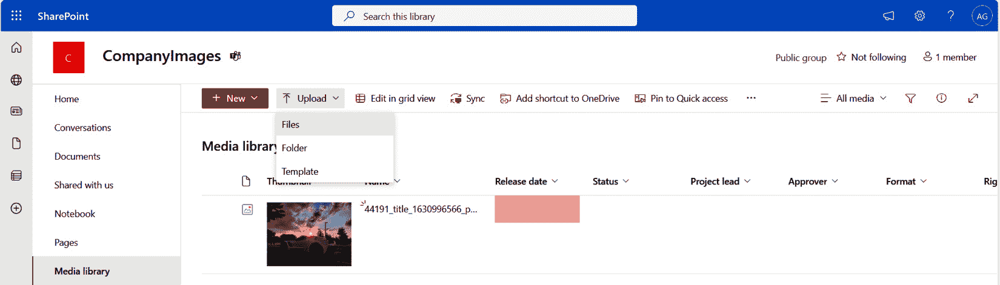

图 11.26 – 上传测试图像

1.  在流程完成之后，切换回具有流程设计器的浏览器标签或窗口，并查看运行历史记录。

1.  完成后，选择**描述图像内容**操作，然后在弹出菜单中滚动到**输出**部分。检查**正文**区域。

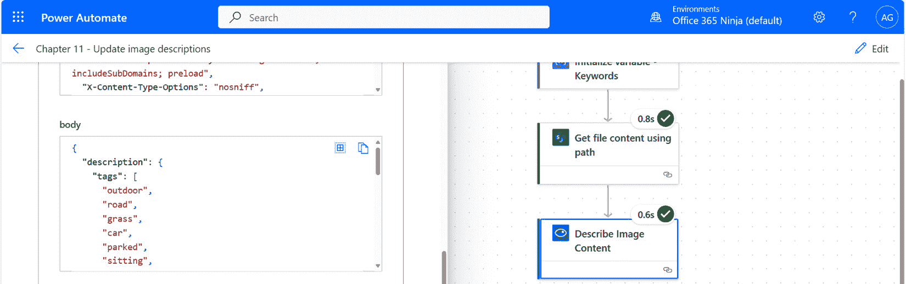

图 11.27 – 检查正文区域

正文输出是一个结构化的 JSON 对象，包含一些值得注意的架构项——`tags`对象将被添加到媒体库的**关键词**列中，而**字幕**列中的值将被添加到**描述**中。

1.  在流程设计器中点击**编辑**以返回编辑流程。

1.  添加**设置** **变量**操作。

1.  将`– 描述`重命名为标题。

1.  在**名称**下，选择**描述**。

1.  在**值**字段中，添加来自**描述图像内容**操作的**字幕文本**动态内容令牌，如图*图 11*.27*所示。

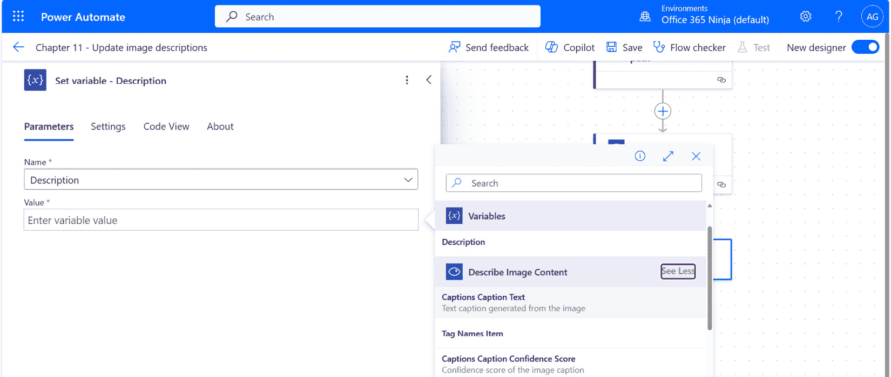

图 11.28 – 更新描述变量

1.  添加另一个**设置****变量**操作。

1.  将`– Keywords`重命名为标题。

1.  在**值**字段中，添加一个表达式。将以下表达式粘贴到其中：

    ```py
    join(outputs('Describe_Image_Content')?['body/description/tags'],',')
    ```

    此表达式将**描述图像**操作输出的所有单个关键词连接起来，并用逗号分隔。

1.  点击**保存**。

接下来，我们将这些更新发送回上传的图像文件。

## 更新库中的图像详细信息

现在您有了包含内容更新的变量，是时候将它们应用到库中的原始图像上了。

1.  在**设置变量 – 关键词**操作之后，添加**更新文件属性**SharePoint 操作。

1.  在**更新文件属性**弹出窗口中，在**网站地址**下选择包含媒体库的网站地址。

1.  在**库名称**下，选择媒体库。

1.  在**ID**下，从**当文件创建时（仅属性）**触发操作中选择**ID**动态内容令牌。

1.  展开**高级参数**下拉菜单并选择**关键词**和**描述**复选框。

1.  在**关键词**字段中，在**变量**部分下添加**关键词**动态内容令牌。

1.  在**描述**字段中，在**变量**部分下添加**描述**动态内容令牌。见*图 11.29*。

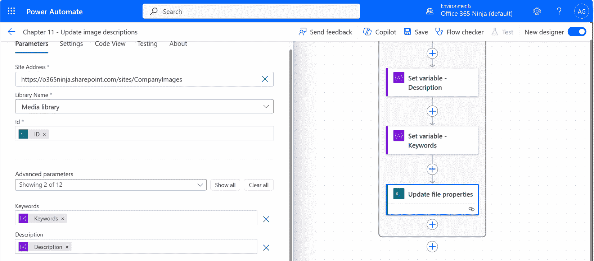

图 11.29 – 更新文件属性

1.  点击**保存**。

现在，到了关键时刻！

# 测试流程

现在流程已完全配置，让我们试试看！

1.  点击测试图标。

1.  如果您之前已经跟随操作并测试了流程，可以选中**自动**单选按钮，然后选择**使用最近使用的触发器**，然后选择流程的先前运行。如果没有，选择**手动**。做出选择后，点击**测试**。

1.  如有必要，上传文件。

1.  检查流程运行历史记录以确保流程已成功完成。如果没有，根据错误进行调整并重试。

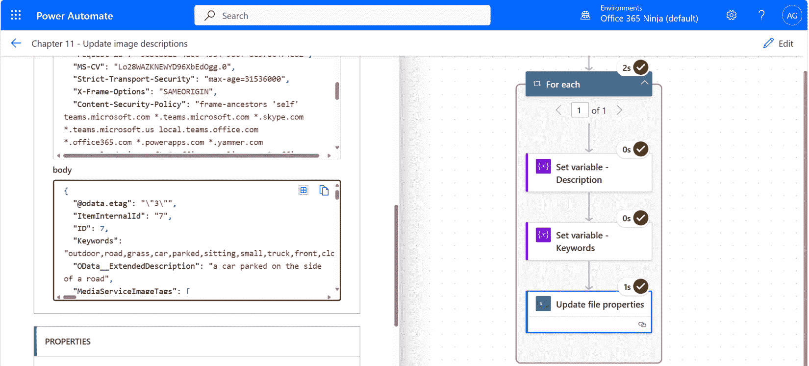

图 11.30 – 查看流程运行历史

1.  接下来，导航到包含媒体库的 SharePoint 网站。

1.  如*图 11.31*所示，查看**关键词**和**描述**列中的内容。

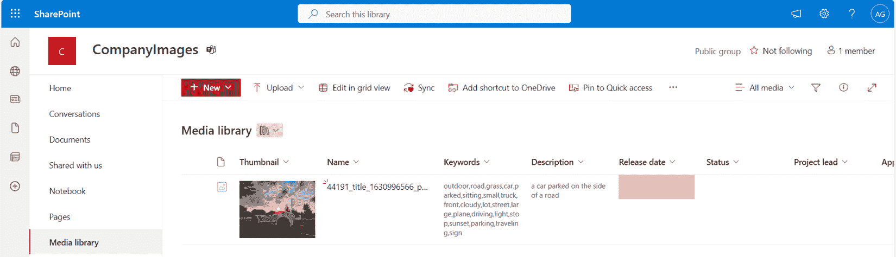

图 11.31 – 查看更新的字段

1.  为了验证内容确实可搜索，您可以在 SharePoint 中点击主页图标进入主 SharePoint 登录页面。在**关键词**列中输入一个词或图像描述的一部分。您应该从您的媒体库中找到该图像的搜索结果。

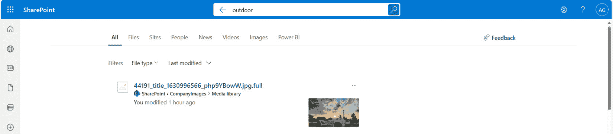

图 11.32 – 查看搜索输出

恭喜！您已成功验证流程！

# 进一步探索

现在你已经掌握了基础知识，思考一下在其他章节中学到的内容，以及它们如何有助于扩展这个流程：

+   在团队频道中发布通知，说明图片已被分类

+   生成媒体库中添加的图片描述的摘要

探索如何进一步增强你组织中其他的工作流程。

# 摘要

在本章中，我们介绍了 Azure AI 服务计算机视觉 API。此 API 允许你执行图像内容识别和标记，并提供包含描述（或标题）以及关键词（标签）的文本输出。

在下一章中，我们将利用生成式 AI 的力量来创建一个能够回答问题的机器人！
