# 12

# 创建基于生成式 AI 的机器人

到目前为止，我们做的是在人类交互方面相当有限的事情——你创建一个文件，启动一个流程，发送一封电子邮件，然后将它交给一个应用程序或流程，并等待结果。这可以很棒。

然而，在与人打交道时，有时需要更多——比如一定程度的响应和跟进，有人（或某物）能够理解他们的问题——即使这些问题表述得并不完全正确。这就是生成式、对话式 AI 机器人可以发挥作用的地方。

在许多大型公司中，人力资源部门是其中最繁忙的部门之一——不断有人试图弄清楚最新的福利表格在哪里，休假累积政策是什么，或者在哪里申请公司信用卡。虽然自网站创建以来，**常见问题解答**（**FAQ**）网站一直是自助服务世界的基石，但它们的管理、更新和搜索可能会变得繁琐。它们依赖于人们使用正确的关键词或短语来找到答案，如果你不知道某个技术的术语，这可能会是一种令人沮丧的经历。在这样的时期，直接拿起电话找人询问会更容易一些。

如果有更好的方法呢？如果你能构建一个能够以某种方式理解这些问题背后的意图的应用程序呢？

如果我告诉你，存在一种更智能的方法，而且这种方法存在于 Microsoft 365 中呢？

# 了解解决方案

在这个解决方案中，我们将探索新的 Copilot Studio，这是协同助手的升级版——之前被称为 Power Virtual Agents。这一套开发工具使用引导式、无代码的图形界面，使用户能够构建强大的聊天机器人。

这些聊天机器人用于自动化对话，与客户或员工互动，无需直接人工干预——非常适合我们的人力资源场景。

在我们深入探讨之前，让我们从高层次上谈谈协同助手的特性和功能：

+   **跨 Microsoft 365 生态系统的集成**：聊天机器人可以集成到各种 Microsoft 产品和服务（如 Dynamics 365、Power BI 和 Azure 服务）中，以及通过 API 与外部系统集成。这种集成使得聊天机器人能够在对话流程中执行复杂操作，并从其他系统中检索数据。

+   **使用 AI 和自然语言处理**：协同助手使用 Microsoft 的 AI 和自然语言处理能力来理解和解释用户输入，使聊天机器人能够以更自然、更有效的方式响应查询。

+   **可定制的流程**：协同助手作者可以定义特定的流程或**主题**，这些流程或主题指导聊天机器人的响应和行动，基于对话上下文。

让我们来看看与协同助手一起工作的基础要素。

## 主题究竟是什么？

主题本质上是由聊天机器人或对话机器人可以采取的对话路径。它们是聊天机器人的最基本构建块。作者定义聊天机器人可以回答的主题，填充将导致机器人采取特定路径的问题或关键词（称为**触发器**），并以预定义的内容、答案或工作流程结束。

例如，想象你创建了一个旨在回答有关费用报告问题的聊天机器人。你考虑用户可能提出的常见请求，例如*我应该在哪儿提交我的费用报告？*，*我可以报销餐费吗？*，或*我的费用报告多久能支付？*你可以为这些问题创建一个主题，并在触发器中填充诸如*费用*，*提交费用报告*，或*报销计划*之类的短语。当用户输入这些单词或短语（或类似的内容）时，将启动适当的对话节点。

在这条路径上，你可能配置机器人提出细化问题。用户的答案可以保存到**变量**中，然后用于检查**条件**（想想这本书前面提到的 Power Automate 流程），这可以进一步将对话引导到已决定的路径。最终，你可能显示一些非常简单的内容，比如网页链接或转到另一个主题。你也可以返回更复杂的内容，比如从数据库检索记录或转交给代理人的交互。

Copilot Studio 还提供了各种**系统主题**。这些内置主题负责你副驾驶的许多基础部分，例如开始和结束对话或错误处理。你不能删除系统主题，尽管你可以禁用它们。*图 12.1*展示了内置的系统主题。

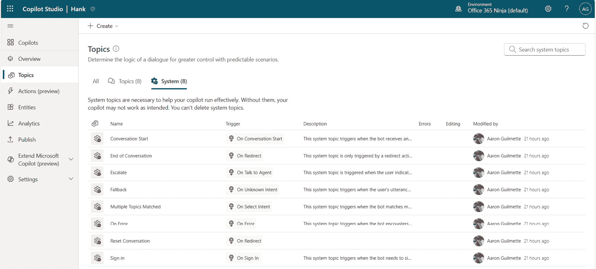

图 12.1 – 查看系统主题

## 什么是生成式回答？

我们迄今为止讨论的主题是预定义的对话路径——要么是你创建的精选主题，要么是在你的副驾驶首次创建时添加的系统定义主题。生成式回答略有不同——而不是设计路径，它们允许你提供信息（文档、网站或其他数据源），生成式 AI 可以据此进行推理并尝试返回答案。即使没有创建特定主题，生成式回答也会返回信息。

在上一节的费用报告示例的基础上进行扩展，假设用户正在寻找有关如何分类费用的信息。他们输入了`expense`关键词，但主题将他们引导到费用报告应用程序。

在这种情况下，“费用”关键词触发了关于提交费用报告的主题，但它并不符合他们的意图。然而，你可能有一个表格嵌入在文档中，解释了合格的费用项目和类别。协同助手允许你通过称为**检索增强生成**（**RAG**）的过程利用这种类型的现有文档知识。通过更新协同助手的配置以包含数据源，你可以允许协同助手“阅读”内容并根据其理解动态回答问题。

通过利用精心挑选的主题和生成式 AI，协同助手可以提供卓越的服务体验，并帮助客户和员工找到他们需要的答案。

# 设计解决方案

在开发协同助手时，必须回答的第一个问题是，“这个协同助手的目的是什么？”在这种情况下，我们将构建一个基于预定义主题和组织内容（RAG）的人力资源问题解答协同助手。内容将来源于一组人力资源政策文件样本，包括组织的员工手册、休假政策、互联网使用政策、手机政策以及在家工作政策。

在设计聊天机器人时，你需要考虑以下问题：

+   应包含哪些主题？

+   主题的可能场景有哪些？这些场景属于哪些类别，例如信息性、任务完成或故障排除？

+   作为用户，你可以说出哪些触发词、短语或问题来激活特定主题？

+   你期望或认为哪些信息或结果是有帮助的？

绘制对话节点树图可能很有帮助，组织主题，并优化如何最好地引导用户问题。参见*图 12.2*，了解如何绘制主题的示例。

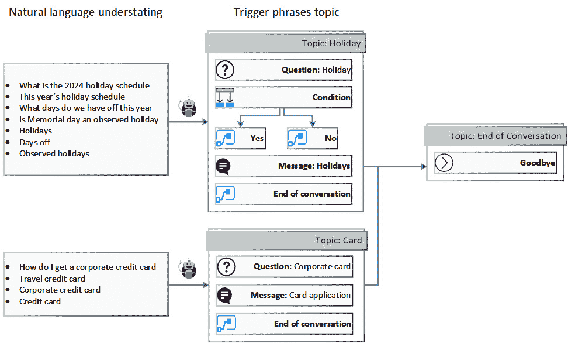

图 12.2 – 主题流程示例

你可以为每个主题区域创建一个图表，不断优化，直到你确定了帮助你的聊天机器人用户获取所需信息的最有效路径。你还需要注意结果，例如导航到特定的文件或网站，提供明确的答案，以及确定你将作为工作流程一部分使用的数据源。

备注

虽然确实可以将协作伙伴配置为直接从 SharePoint 网站或其他受保护内容中提取数据，但这个过程要复杂得多（包括 Entra ID 应用程序注册和 API 权限委派），并且这比我们在本书中追求的解决方案要复杂得多。如果您想了解更多关于扩展到 SharePoint Online 和 OneDrive for Business 中存储的内容的信息，请访问 [`learn.microsoft.com/en-us/microsoft-copilot-studio/nlu-generative-answers-sharepoint-onedrive`](https://learn.microsoft.com/en-us/microsoft-copilot-studio/nlu-generative-answers-sharepoint-onedrive)。

接下来，我们将探讨从许可角度出发，启用这些功能所需具备的条件。

# 许可前提条件

Copilot Studio 和协作伙伴需要许可（类似于 Microsoft 365 套件中的其他功能）。在本章中，我们将重点关注内部协作伙伴及其要求。为了完成这里提供的示例，您需要一个 Copilot Studio 许可证（无论是 Copilot Studio 租户订阅还是 Copilot for Microsoft 365）。

许可指南

有关精确的 Copilot 许可场景的更多信息，请访问 [`go.microsoft.com/fwlink/?linkid=2085130`](https://go.microsoft.com/fwlink/?linkid=2085130)。

此解决方案还将使用 ChatGPT 生成某些类型的答案。如果您为本书中其他章节配置了 OpenAI 订阅，您可以继续使用该订阅。

# 准备解决方案前提条件

在我们开始使用 Copilot Studio 之前，您需要收集可用于生成式 AI 答案的文档。

在本章中，我们将使用一组示例组织政策文档，包括涵盖远程办公、骚扰和公司信用卡政策的内 容。您可以收集自己的或使用这里提供的集合：[`github.com/PacktPublishing/Power-Platform-and-the-AI-Revolution`](https://github.com/PacktPublishing/Power-Platform-and-the-AI-Revolution)。

# 创建协作伙伴

在收集到源数据后，是时候开始使用 Copilot Studio 进行工作了！

要创建您的协作伙伴，请按照以下步骤操作。

1.  导航到 Copilot Studio ([`copilotstudio.microsoft.com`](https://copilotstudio.microsoft.com))。

1.  点击“**创建自定义协作伙伴**”或“**新建协作伙伴**”以开始操作。

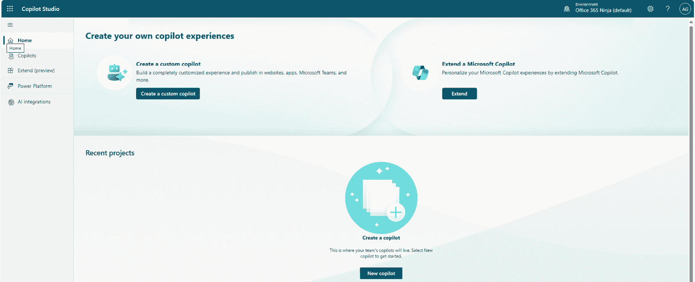

图 12.3 – 启动 Copilot Studio

1.  在“**创建协作伙伴**”页面，输入协作伙伴名称并选择一种语言。点击“**创建**”。

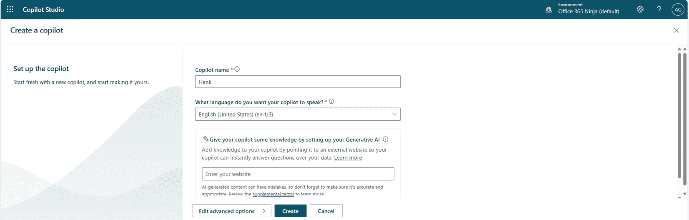

图 12.4 – 初始化协作伙伴

1.  请等待 Copilot Studio 设置您的协作伙伴。

接下来，是时候用一些主题更新您的新协作伙伴了！

# 定制协作伙伴

首先，我们将开始配置我们的精选内容和对话路径。如您之前所回忆的，这种类型的配置，称为**主题**，当您对用户可能提出的问题以及最佳匹配内容的位置有一个想法时使用。您还可以使用主题将您的共乘者与其他 Power Platform 组件，如流程，集成在一起。

## 创建一个使用 ChatGPT 的新主题

创建新主题的过程与创建 Power Automate 流程非常相似。像流程一样，主题有**触发器**和**操作**，可以利用**条件**来确定要采取的路径。

在这个例子中，我们将创建一个简单的主题：

1.  在**主题**页面上，点击**创建**。指向**主题**，然后选择**使用共乘者创建描述**。

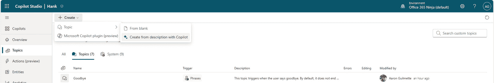

图 12.5 – 创建新主题

1.  在“假日”。

1.  在“告诉用户今年观察到的假日”和“列出”公司支付的假日”。

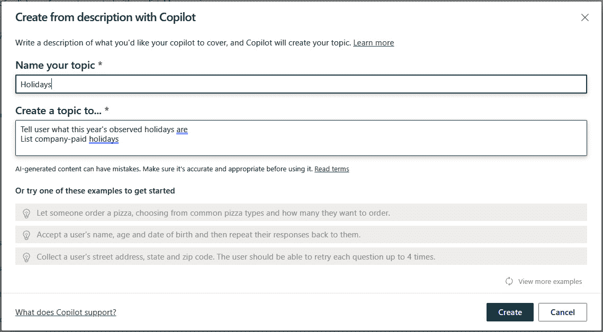

图 12.6 – 向共乘者提供说明

1.  点击**创建**。

1.  查看生成的触发器。如果您有其他想法（或想删除一些生成的触发短语），您可以在**短语**卡片中点击**编辑**来配置其他将激活此主题的单词或短语。

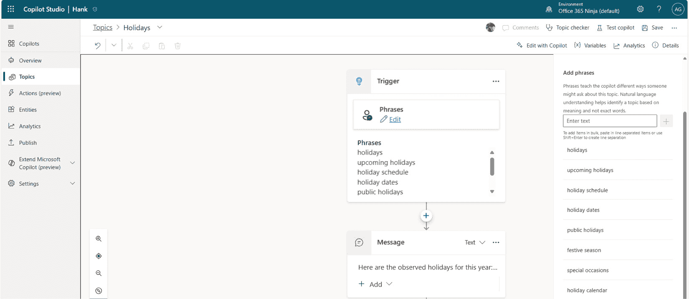

图 12.7 – 查看触发短语

1.  您可以看到 Copilot Studio 已填充了一个**消息**卡片，其中包含机器人将返回的响应。虽然这可能很有帮助，但它排除了我们观察到的许多假日。请继续删除任何已配置的消息卡片，方法是点击卡片右上角的省略号并选择**删除**，如图 *图 12.8* 所示：

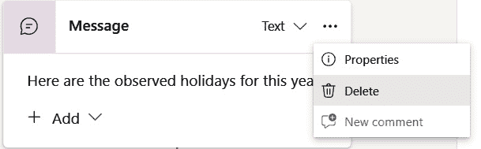

图 12.8 – 删除卡片

1.  在触发卡下点击**+**来添加一个节点。选择**提问**。

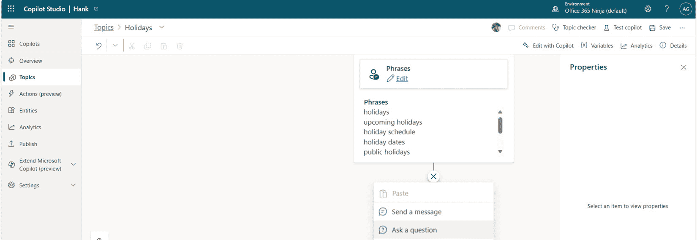

图 12.9 – 添加问题节点

1.  我们希望允许用户提前规划他们的假期日程，因此我们需要一个选项来查看他们想要查看的年份的假日日程。

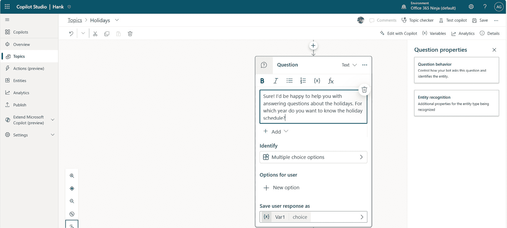

图 12.10 – 添加问题文本

1.  在**识别**框中，选择**用户的整个响应**。这将允许虚拟代理捕获用户输入的文本响应。

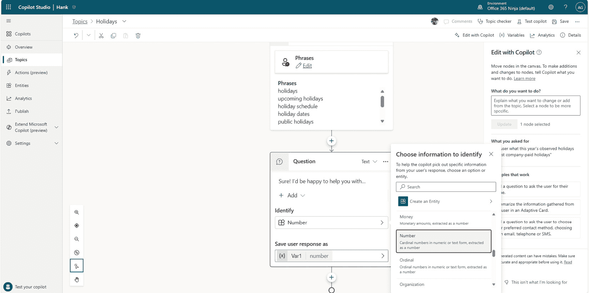

图 12.11 – 更新识别变量类型

1.  在**年份**（见图 *图 12.12*）下。

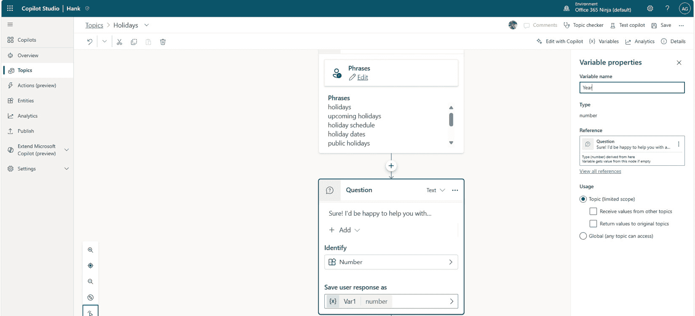

图 12.12 – 更新变量名

1.  在**问题**卡片之后，选择**+**并添加一个节点。然后，选择**创建**流程。

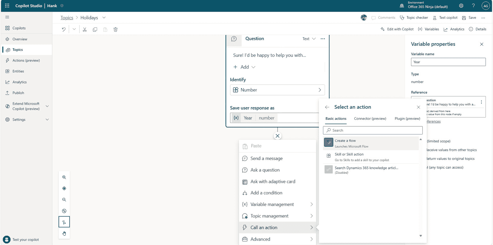

图 12.13 – 添加流程操作

1.  等待 Power Automate 的新浏览器窗口打开。片刻之后，它应该会显示两个卡片 – **当 Power Virtual Agents 调用一个流程** 和 **将返回值返回给 Power Virtual Agents**，如图 *图 12**.14* 所示：

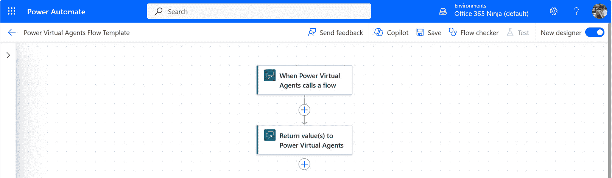

图 12.14 – 查看带有 PVA 动作的 Power Automate 画布

1.  选择 `Prompt`，然后将 `Prompt` 文本放在提示框中。

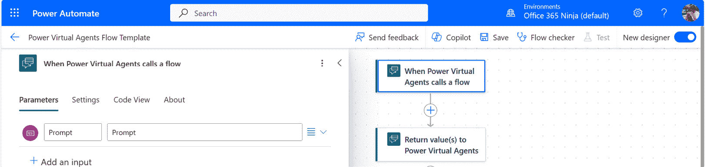

图 12.15 – 添加文本输入

1.  添加一个 `ChatCompletion` 并将其类型设置为 **字符串**（见 *图 12**.16*）。

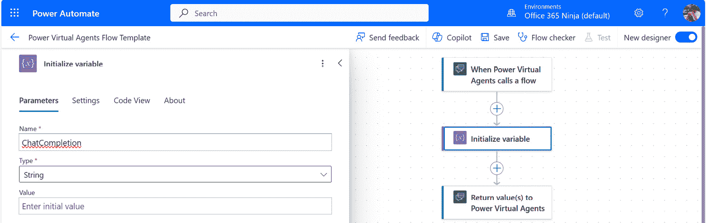

图 12.16 – 初始化变量

1.  添加一个 **HTTP** 动作。

1.  在 **URI** 字段中，输入 [`api.openai.com/v1/chat/completions`](https://api.openai.com/v1/chat/completions)。

1.  在 **方法** 下拉菜单中，选择 **POST**。

1.  添加一个名为 `Authorization` 的头，其值为 `Bearer <OpenAI key>`（见 *图 12**.17*）。

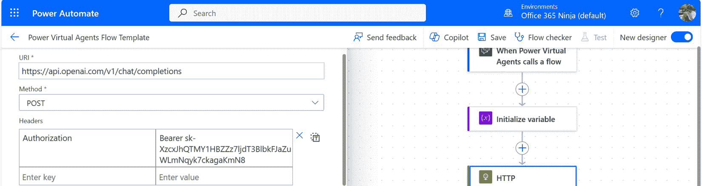

图 12.17 – 配置 HTTP 动作

1.  在 **正文** 字段中输入以下文本。您可以根据需要替换假期：

    ```py
    {
        "model": "gpt-4",
        "messages": [
            {
                "role": "system",
                "content": "You are a helpful HR assistant."
            },
            {
                "role": "user",
                "content": "Generate a list of the following holidays for the year **PROMPT**. The output format should be a bulleted list of the name of the holiday, followed by the day of the week, month, day, and year. For example, \n New Year's Day: Wednesday, January 1, 2024\n. Generate the list using the following holidays: New Year's Day, Martin Luther King Jr Day, Memorial Day, Independence Day, Labor Day, Veterans Day, Thanksgiving Day, Day after Thanksgiving Day, Christmas Eve, Christmas Day, New Year's Eve""
            }
        ],
        "max_tokens": 5000,
        "temperature": 0,
        "n": 1,
        "stream": false,
        "logprobs": null,
        "stop": null
    }
    ```

1.  将 `**PROMPT**` 文本替换为 **当 Power Virtual Agents 调用一个** **流程** 触发器中的 **提示** 动态内容令牌。

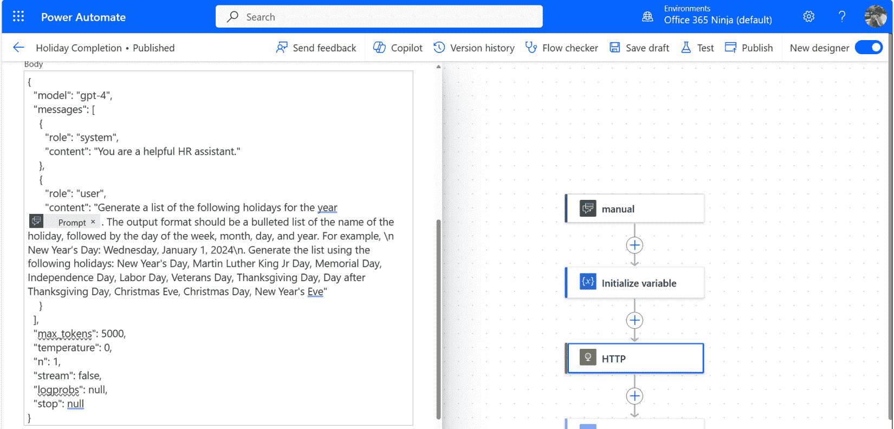

图 12.18 – 使用提示动态内容令牌更新正文

1.  在 **HTTP** 动作之后，添加一个 **解析** **JSON** 动作。

1.  在 **内容** 字段中，选择 **HTTP** 动作的 **正文** 动态内容令牌。

1.  在 **模式** 文本区域中，粘贴以下内容：

    ```py
    {
        "type": "object",
        "properties": {
            "id": {
                "type": "string"
            },
            "object": {
                "type": "string"
            },
            "created": {
                "type": "integer"
            },
            "model": {
                "type": "string"
            },
            "choices": {
                "type": "array",
                "items": {
                    "type": "object",
                    "properties": {
                        "index": {
                            "type": "integer"
                        },
                        "message": {
                            "type": "object",
                            "properties": {
                                "role": {
                                    "type": "string"
                                },
                                "content": {
                                    "type": "string"
                                }
                            }
                        },
                        "logprobs": {},
                        "finish_reason": {
                            "type": "string"
                        }
                    },
                    "required": [
                        "index",
                        "message",
                        "logprobs",
                        "finish_reason"
                    ]
                }
            },
            "usage": {
                "type": "object",
                "properties": {
                    "prompt_tokens": {
                        "type": "integer"
                    },
                    "completion_tokens": {
                        "type": "integer"
                    },
                    "total_tokens": {
                        "type": "integer"
                    }
                }
            },
            "system_fingerprint": {}
        }
    }
    ```

    如果这看起来很熟悉，那应该是。这是当你从 OpenAI 的 ChatGPT 完成端点的 API 调用中粘贴文本时生成的模式。您可以通过创建手动流程、配置 HTTP 动作，然后发送聊天完成请求（步骤 15 到 20）来自己生成它。如您所记得，该模式定义了 JSON 输出对象的格式。

    查看 *图 12**.19* 以了解配置的模式看起来像什么。

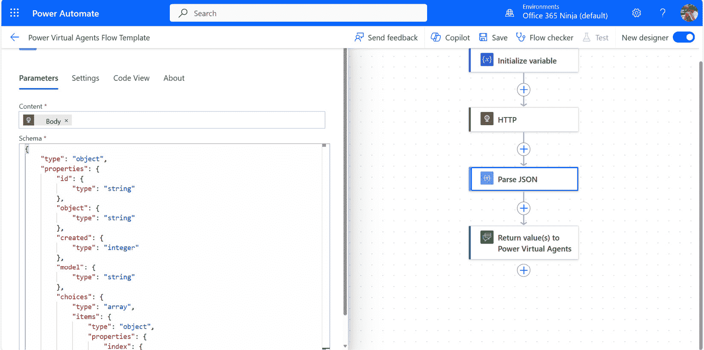

图 12.19 – 配置解析 JSON 动作

1.  在 **解析 JSON** 动作之后，添加一个 **设置** **变量** 动作。

1.  在 **设置变量** 动作的 **名称** 下拉菜单中，选择您之前创建的 **ChatCompletion** 变量。

1.  在 **值** 字段中，选择 **解析 JSON** 动作的 **正文内容** 动态内容令牌，如图 *图 12**.20* 所示：

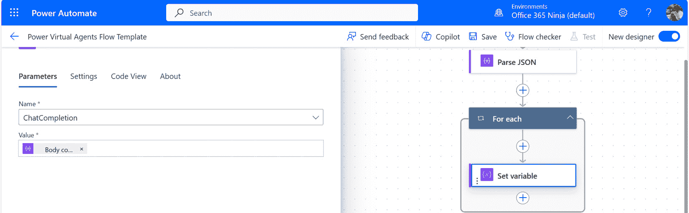

图 12.20 – 配置设置变量动作

1.  选择 **将返回值返回给 Power Virtual** **Agents** 动作。

1.  点击 **添加输出** 并选择 **文本** 作为类型。

1.  将输出名称设置为 `Completion`。

1.  将输出的值设置为 **ChatCompletion** 变量的动态内容令牌。

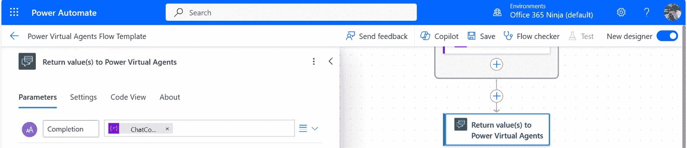

图 12.21 – 配置返回值

1.  如果需要，将流程重命名为 `假日完成`（或类似名称），以便在查看您的流程时能够识别它。

1.  点击 **保存**。

1.  返回到已打开 Copilot Studio 的浏览器标签页。可能会要求您刷新它。

1.  在问题卡片后，点击 **+** 再次调用动作。这次，应该会显示 **假日完成** 流程供您选择，如图 *图 12**.**22* 所示：

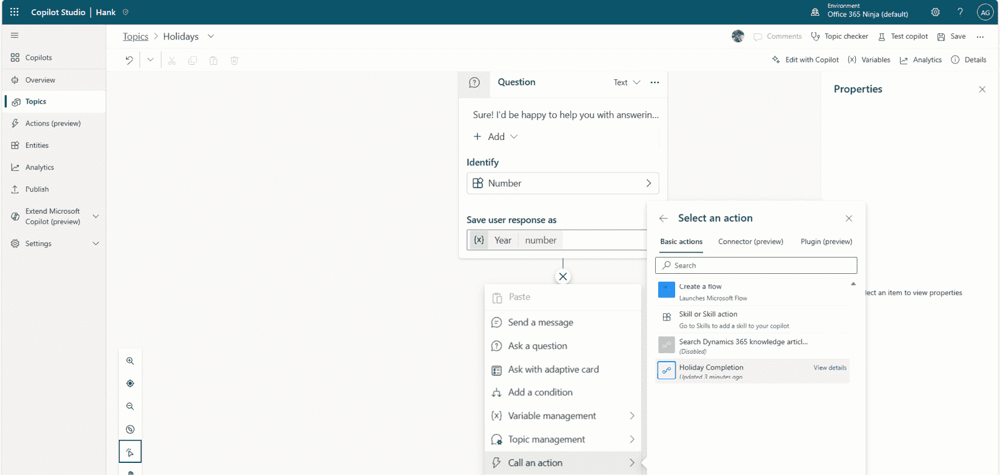

图 12.22 – 添加假日完成动作

1.  使用您在 *步骤 10* 中设置的 **提示** 变量（**年份**）更新动作。这将配置 Copilot 发送 **年份** 变量，该变量将在 **假日完成** 流程中用作输入。

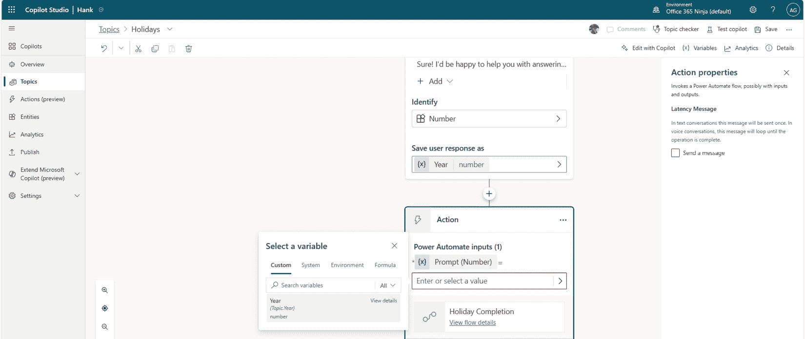

图 12.23 – 设置要发送到流程的变量

1.  在动作完成后，点击 **+** 并添加 **发送一条** **消息** 卡片。

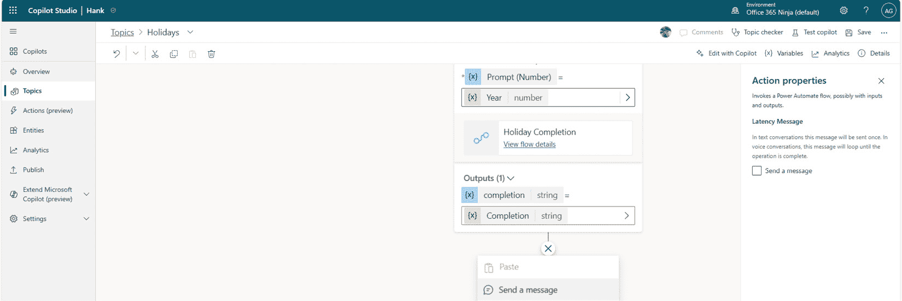

图 12.24 – 添加发送消息卡片

1.  使用文本自定义消息卡片。您可以选择 **{x}** 图标来插入您在此节点中使用的变量。例如，添加 **年份** 变量将显示用户输入的年份，而输入 **完成** 变量将插入 ChatGPT 返回的值。

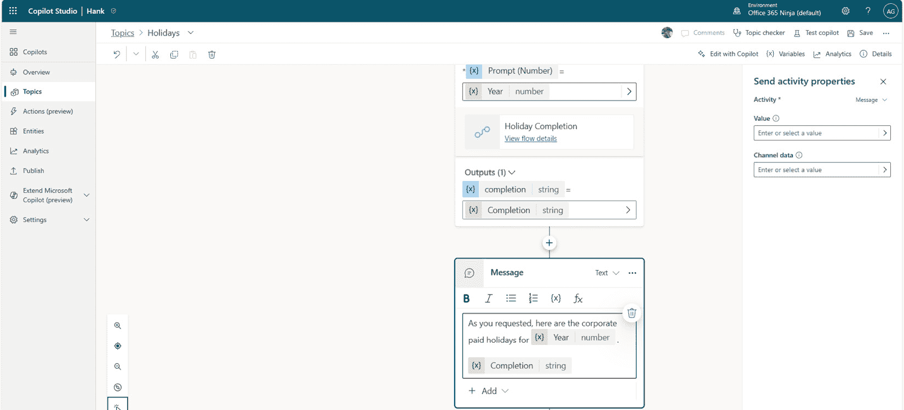

图 12.25 – 配置消息卡片

1.  在消息卡片后添加一个节点，指向 **主题管理**，然后选择 **结束对话**。

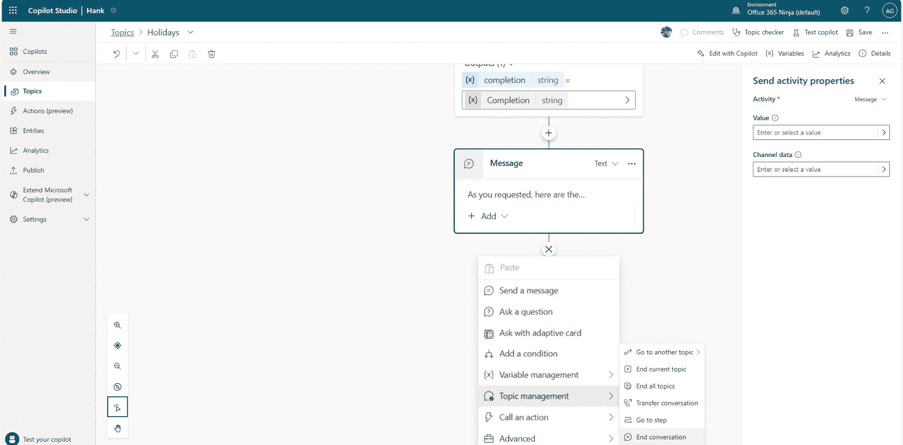

图 12.26 – 添加结束对话节点

1.  点击 **保存**。

让我们继续前进，继续自定义 Copilot。

## 禁用模板主题

每个 Copilot 都带有一些基本主题模板。在使您的 Copilot 公开之前，您应该禁用未使用的或模板主题，以确保您的 Copilot 如预期那样表现，并且只返回相关内容。

要禁用主题，请按照以下步骤操作：

1.  在 Copilot Studio 中，选择 **主题**。

1.  将鼠标悬停在 **第一部分**（一个示例主题）上以显示 **更多** **选项** 省略号。

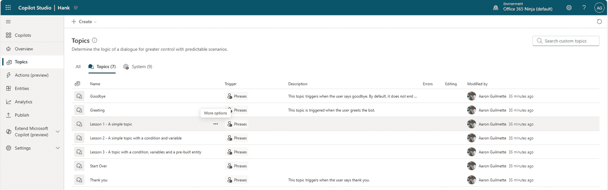

图 12.27 – 探索主题

1.  点击省略号以展开 **更多选项** 面板，然后选择要禁用主题的 **状态** 切换或选择要完全删除主题的 **删除** 选项。如果删除主题，您将收到确认提示。

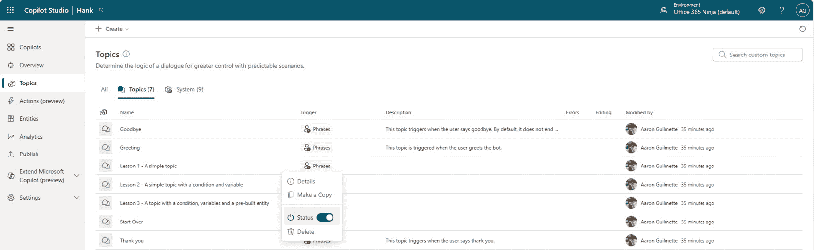

图 12.28 – 禁用和删除主题

1.  对 **第二部分** 和 **第三部分** 主题重复此操作。

现在，您的机器人将只响应适当的主题。

## 为生成式 AI 添加内容

在这一点上，我们将添加我们的组织内容，以增强我们的机器人回答问题的能力。

生成式 AI 有三个主要的内容来源：

+   公共网站

+   存储在 Dataverse 中的文件

+   存储在 OneDrive for Business 和 SharePoint Online 中的文件

来自公共网站和存储在 Dataverse 中的内容都非常容易配置和集成。存储在 OneDrive for Business 和 SharePoint Online 中的文件需要从认证方面进行大量配置，更多地属于**代码化**开发类别。

在此示例中，我们将添加我们的库存文件。

在线内容

对于用于开发此解决方案的示例在线内容，请参阅位于 [`github.com/PacktPublishing/Power-Platform-and-the-AI-Revolution`](https://github.com/PacktPublishing/Power-Platform-and-the-AI-Revolution) 的*第十二章* 文件。

要开始配置生成式主题，请按照以下步骤操作：

1.  导航到 Copilot Studio ([`copilotstudio.microsoft.com`](https://copilotstudio.microsoft.com)) 并打开您新创建的 Copilot。

1.  在 Copilot 的**概览**页面，选择**添加文件**。

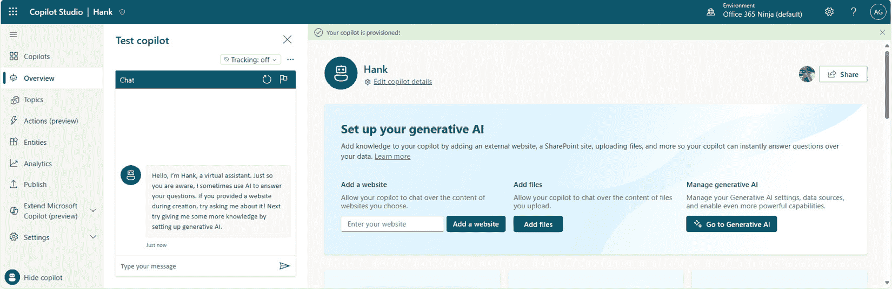

图 12.29 – 测试生成式 AI 响应

1.  在**生成式 AI**页面，您可以将策略文档文件拖动到**上传文档**区域，或者选择**点击浏览**链接导航到包含策略文档文件的源文件夹。

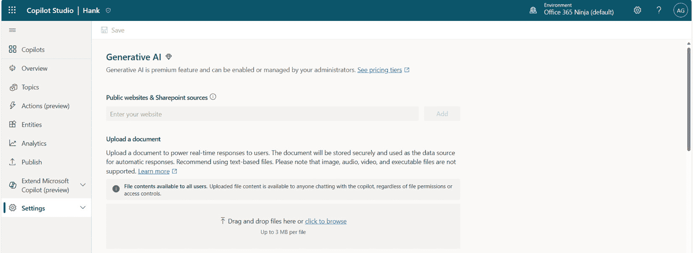

图 12.30 – 配置生成式 AI 源

1.  在您将文件上传到 Dataverse 后，Copilot Studio 将启动索引过程。在索引过程完成后，您将能够就这些策略文档中的内容提问！

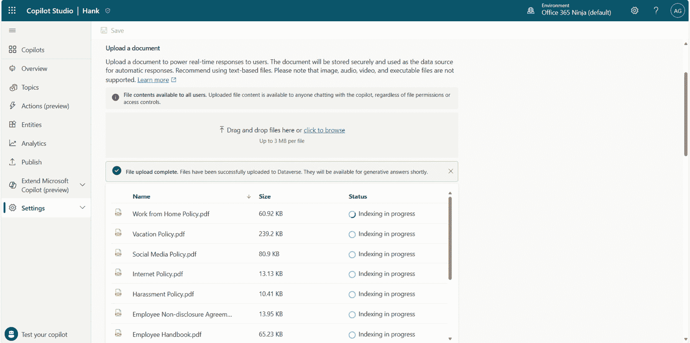

图 12.31 – 索引策略文档

1.  在内容被索引后，向下滚动到页面底部。仅上传内容本身并不能启用生成式 AI 功能，因此我们还需要这样做。启用**使用生成式答案增强对话覆盖**的滑块切换。

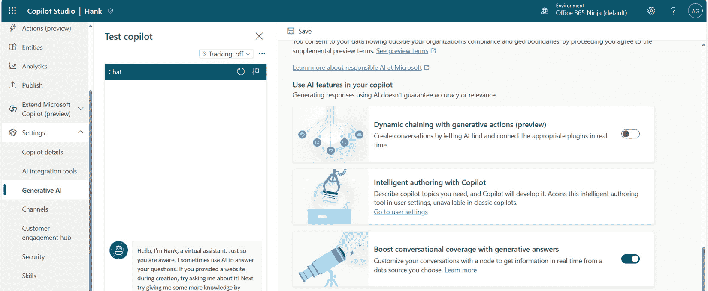

图 12.32 – 启用生成式答案功能

1.  点击面板顶部的**保存**图标。状态栏应更新，指示 Copilot Studio 正在启用生成式答案，如图 *图 12**.33* 所示：

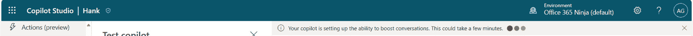

图 12.33 – 保存更改

1.  要验证其已准备好使用，请返回到**主题** > **系统**并查找**对话增强**系统主题。

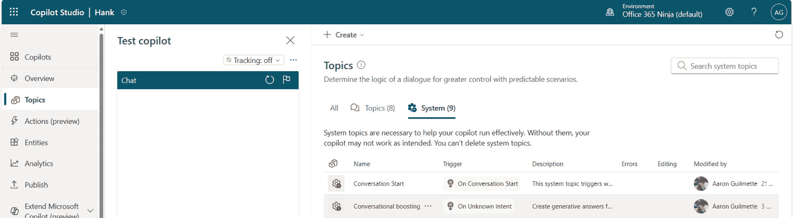

图 12.34 – 验证已创建对话增强主题

接下来，我们将测试我们的副驾驶！

# 测试副驾驶

在本节中，我们将测试我们的两个副驾驶配置 – 基于 ChatGPT 的 **假期** 主题和生成答案。

## 假期主题

首先，我们将测试我们创建的 **假期** 主题：

1.  点击导航栏中的 **测试副驾驶** 按钮以打开 **测试副驾驶** 聊天弹出窗口。

1.  一旦弹出窗口出现，输入一个触发短语以启动 **假期** 主题：

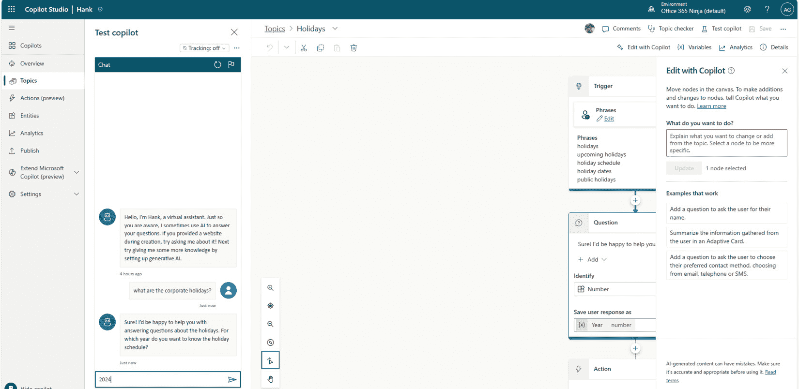

图 12.35 – 测试副驾驶

1.  检查输出。如果您成功完成所有操作，您的机器人应该会响应它从 ChatGPT 获取的输出！

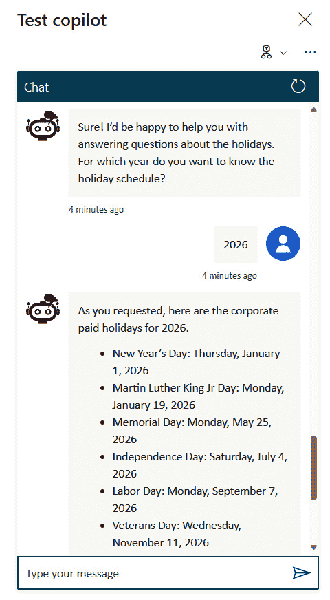

图 12.36 – 检查 ChatGPT 的数据

这真是太棒了！

接下来，让我们问一个问题，这个问题只能通过生成答案增强来回答。

## 生成答案

为了查看生成答案学到了什么信息，尝试向您的新副驾驶问一个问题，您可以从上传的文档中获取这个问题：

1.  在聊天区域，向您的副驾驶提问。在这个例子中，您可能会问一些像 *什么是* *歧视政策？* 的问题。

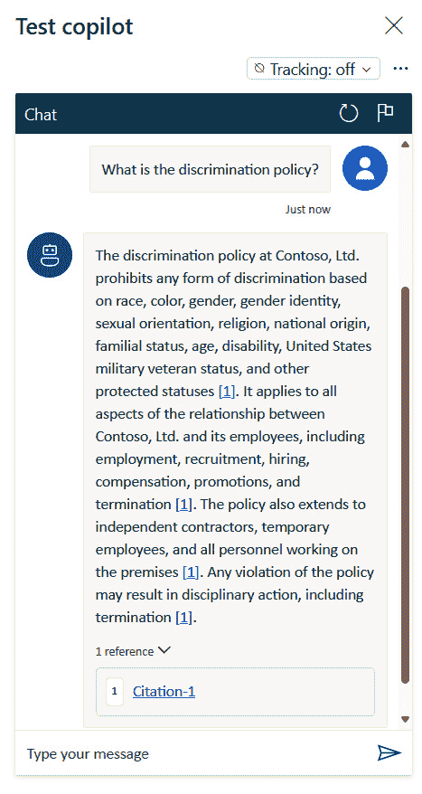

图 12.37 – 向副驾驶请求基于生成答案的响应

1.  点击引用链接以调出上传的政策文件。

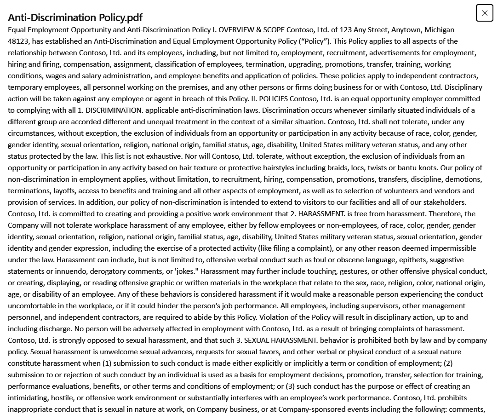

图 12.38 – 检查副驾驶答案的原始材料

恭喜！您已经构建了一个包含两种不同类型人工智能增强内容的副驾驶！

# 进一步探索

这只是触及了副驾驶能为您的组织做什么的表面。您可以构建一个巨大的副驾驶来处理大量数据，或者几个更小、更具体的副驾驶，用于帮助用户根据组织知识提供答案。

你有什么想法可以扩展这个副驾驶？考虑使用条件来导航到新的对话节点和主题，例如以下内容：

+   创建一个关于企业信用卡的主题，并提供多项选择以导航到卡片申请应用或费用报告网站。

+   在精心策划的主题末尾集成一个问题，以了解答案是否有用。如果不是，链接到 **对话增强** 主题，让用户请求生成答案以获取更多详细信息。

# 摘要

在本章中，我们探讨了将生成人工智能集成到副驾驶（以前称为 Power Virtual Agents）的不同方法。您能够通过专门定制的提示向 ChatGPT 发送请求，以获取公司假期的答案，而 RAG 允许您根据您上传到 Dataverse 的组织内容回答问题。

这些想法中的每一个都可以扩展，以创建更多功能性的合作者（copilots）。

在下一章中，我们将使这个合作者（copilot）可供人们使用！
