# 13

# 发布基于生成式 AI 的机器人

在上一章中，您能够构建一个聊天机器人（或在新术语中称为 **copilot**），该机器人利用了两个不同的生成式 AI 功能——将数据发送到 ChatGPT 进行评估，以及在 Dataverse 中加载文档以进行生成式答案推理。

在本章的最后，我们将介绍发布聊天机器人的必要步骤，使其可供人们提问。

不再拖延，让我们开始吧！

# 在 Teams 上发布机器人

发布机器人是经历一系列步骤使其可供用户使用的过程。微软使用“频道”一词来描述机器人将发布的服务的、应用或目的地。

根据您创建的机器人类型，您可能希望将其发布到 Microsoft Teams、公共网站、Facebook 或其他服务。将机器人发布到不同位置的能力将取决于其身份验证设置。

在本例中，我们将使机器人可供 Microsoft Teams 用户使用。默认情况下，您的机器人已配置为 Teams 和 Power Apps 身份验证，因此从这里开始是有意义的。

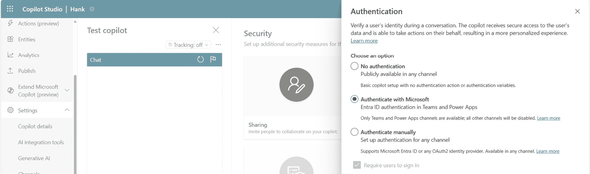

图 13.1 – 查看机器人的身份验证配置

## 发布机器人

要将机器人发布到 Teams，您可以简单地遵循以下步骤：

1.  导航到 Copilot Studio ([`copilotstudio.microsoft.com`](https://copilotstudio.microsoft.com)) 并选择您的机器人。

1.  在导航菜单中，展开 **设置** 并选择 **频道**。

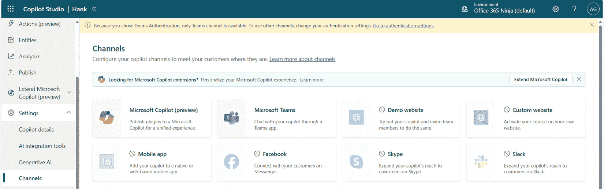

图 13.2 – 查看频道页面

1.  选择 **Microsoft Teams**。

1.  在 **Microsoft Teams** 快捷菜单中，在页面底部点击 **打开** **Teams**。

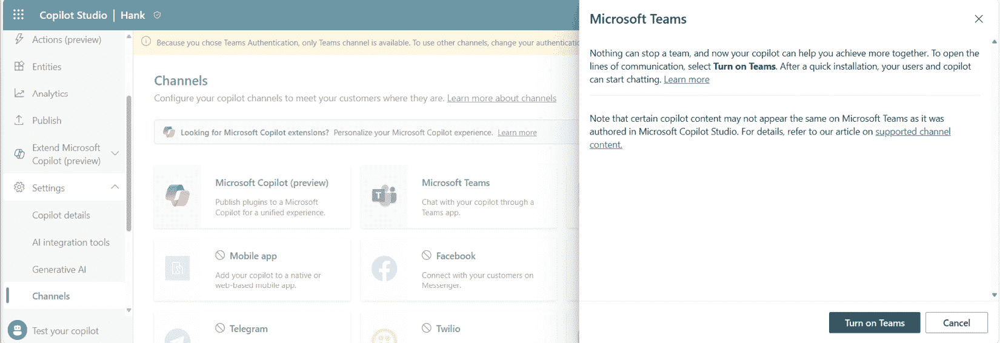

图 13.3 – 启用 Teams 的 Copilot

1.  确认它已被启用。

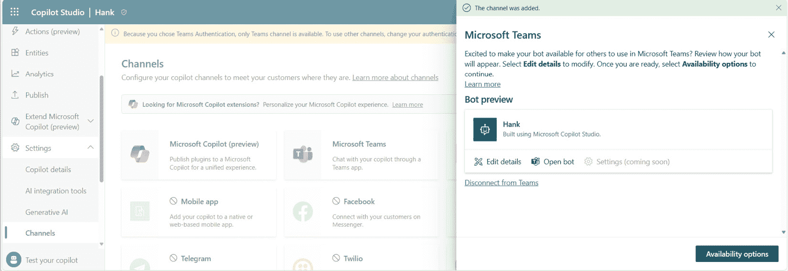

图 13.4 – 确认已启用 Teams 集成

如果需要，您可以点击 **编辑详情** 来更改机器人的显示特性，包括图标、图标颜色、描述以及此机器人是否可以添加到团队（或者它是否只是沿着左侧轨道的机器人）。完成设置更新后，点击 **保存**。

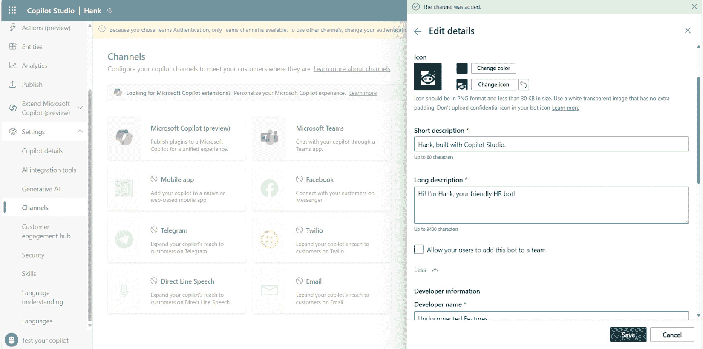

图 13.5 – 配置额外的机器人设置

1.  选择 **可用性选项**。

1.  在 **在 Teams 应用商店中显示** 下，您可以选择 **显示给我的队友和共享用户** 以使其对您的同事可用，或者您可以点击 **显示给我的组织中的所有人**。选择 **显示给我的组织中的所有人** 选项将在 Teams 管理中心生成一个自定义应用请求（需要管理员批准）。

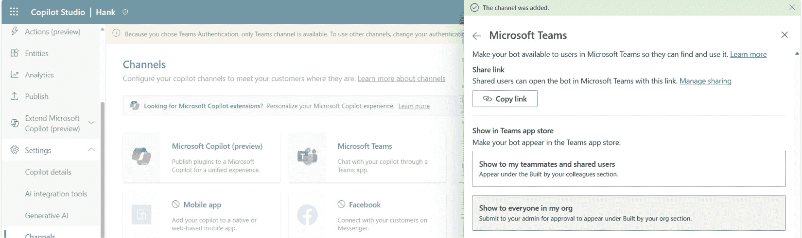

图 13.6 – 分享机器人

1.  点击**向我组织中的所有人展示**。然后，在下一页上，点击**提交给管理员** **审批**按钮。

1.  在导航菜单中选择**发布**。

1.  如果您的机器人没有自动发布，请点击**发布**。

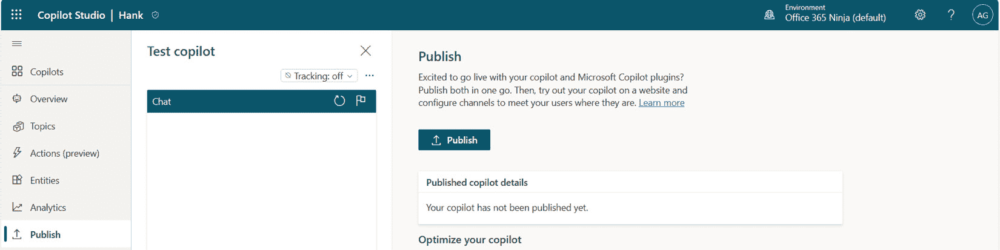

图 13.7 – 开始发布过程

1.  当提示确认时，点击**发布**。

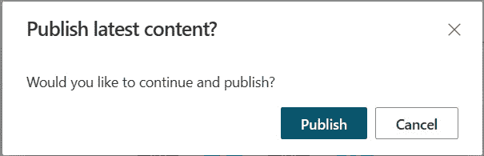

图 13.8 – 确认发布操作

接下来，我们将查看我们的机器人在团队中的外观。

## 测试机器人

在本节中，您将了解您的机器人在团队中的工作方式。按照以下步骤操作：

1.  从**通道** > **Microsoft Teams** 快捷菜单中选择**打开机器人**。

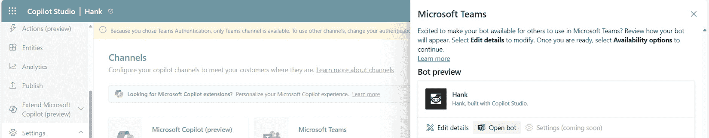

图 13.9 – 在团队中打开机器人

1.  您可以启动 Microsoft Teams 的桌面版或网页版。

1.  一旦团队启动，您应该会看到您的聊天机器人。点击**添加**。这将把您的应用安装到团队的左侧轨道中。

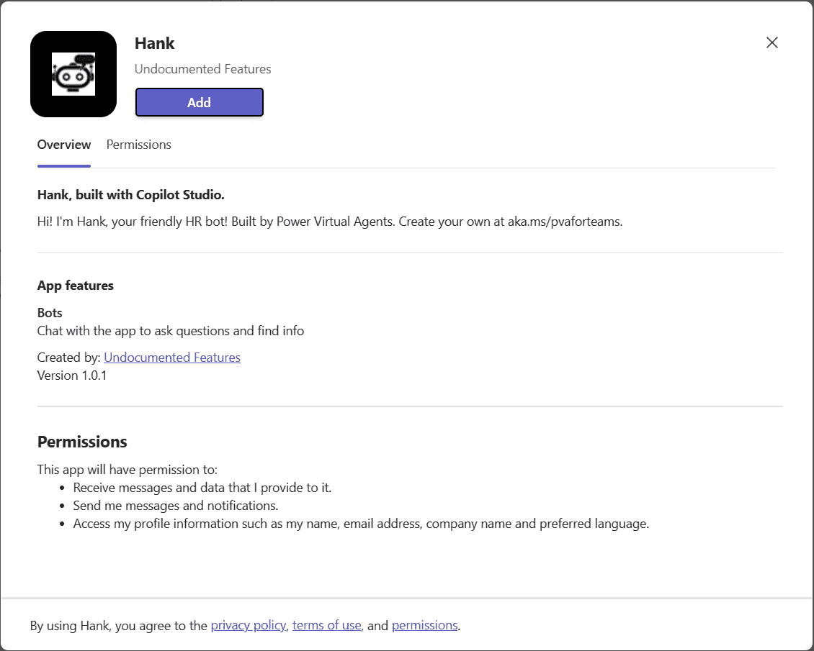

图 13.10 – 添加您的聊天机器人

1.  您可以像之前测试时一样向它提问。

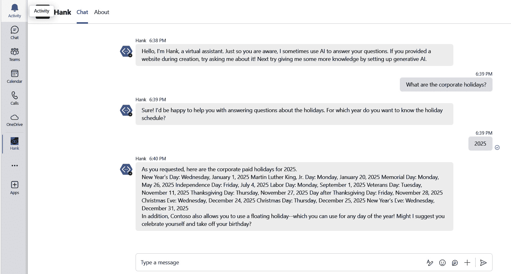

图 13.11 – 向团队机器人提问

现在您已经测试过了，是时候批准它并使其在整个组织中可用！

## 批准机器人

批准机器人是一个相对简单的练习，尽管您需要 Microsoft Teams 的管理权限。您可以通过以下快速流程批准机器人：

1.  导航到 Microsoft Teams 管理中心([`admin.teams.microsoft.com`](https://admin.teams.microsoft.com))。

1.  在导航菜单中，展开**团队应用**并选择**管理应用**。

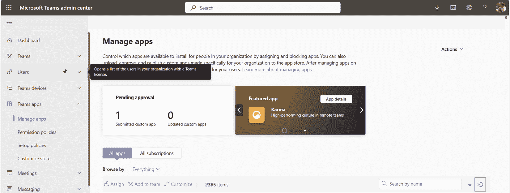

图 13.12 – 管理团队应用商店

注意，有一个自定义应用正在等待审批。

1.  在**按名称搜索**框中，开始输入您机器人的名称。注意，您的机器人应用的状态为**阻止**，如图*图 13*.13 所示。

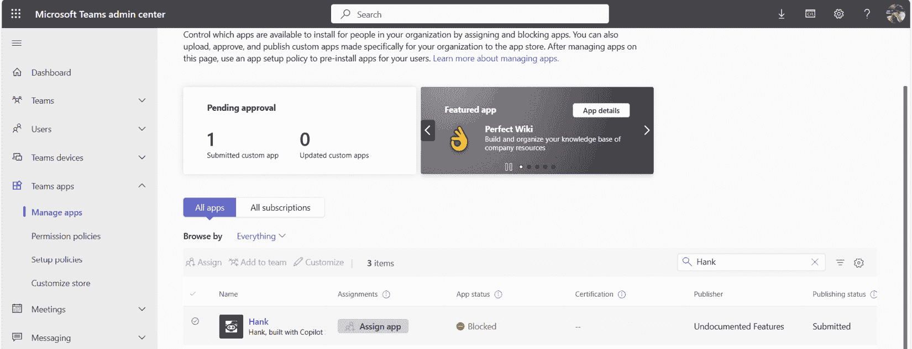

图 13.13 – 查看机器人应用的状况

1.  点击应用的**名称**。

1.  点击**发布**以使应用在团队应用商店中可用。

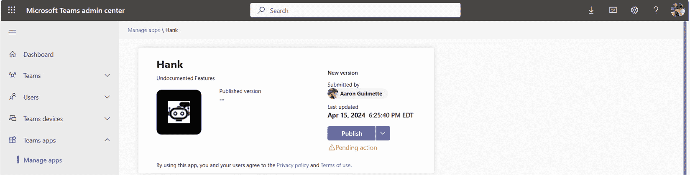

图 13.14 – 发布机器人应用

1.  当提示确认时，点击**发布**。

您的 Microsoft 365 组织中的其他用户现在可以前往团队应用商店查找机器人！

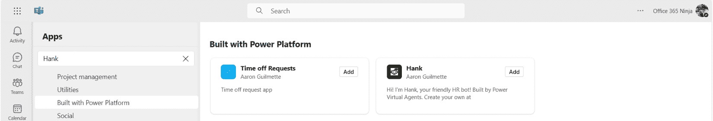

图 13.15 – 在团队应用商店中定位机器人

接下来，我们将探讨将机器人发布到其他渠道，例如公共网站。

# 将机器人发布到网站

大多数情况下，您会创建针对内部或外部用户的机器人——因为这两类用户有不同的需求。

在本节中，我们将切换我们刚刚构建的机器人的身份验证方法，以便它可以在公共频道（如网站或 Facebook）上使用。在现实世界中，您可能会为不同的场景构建不同的机器人。

没有网站？没问题

如果您没有开发网站可以工作——这没问题！您可以去 [`www.wordpress.com`](https://www.wordpress.com) 并注册一个免费托管网站。在这个例子中，我们将使用 WordPress 网站。

要将机器人发布到网站，请按照以下步骤操作：

1.  导航到 Copilot Studio ([`copilotstudio.microsoft.com`](https://copilotstudio.microsoft.com)) 并选择您的机器人。

1.  展开设置并选择 **安全**。

1.  在 **安全** 页面上，选择 **身份验证**。

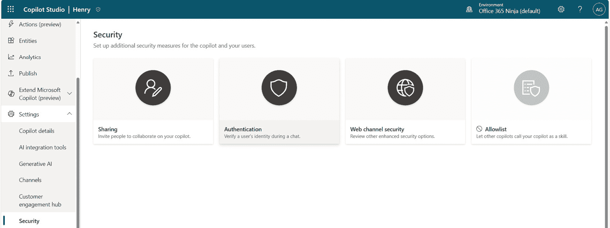

图 13.16 – 更新机器人的安全设置

1.  在 **身份验证** 快捷菜单中，选择 **无身份验证** 并点击 **保存**。

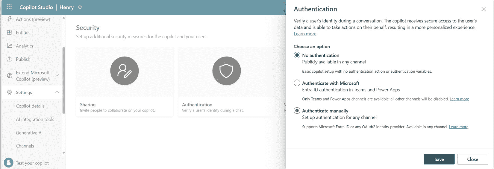

图 13.17 – 选择无身份验证

1.  查看保存此配置？对话框并点击 **保存**。

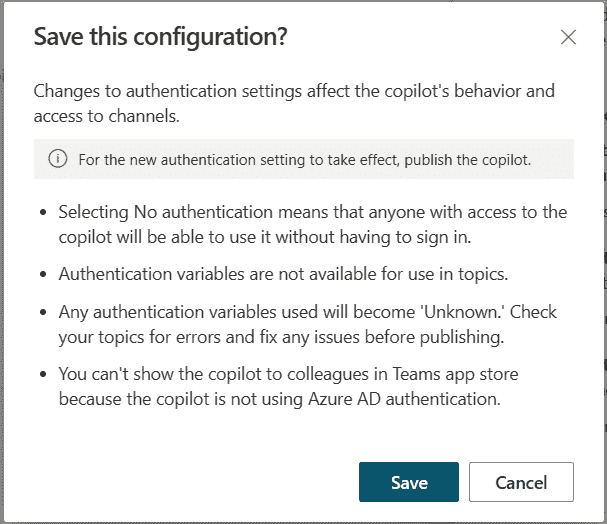

图 13.18 – 查看保存对话框

1.  在 **设置** 下，点击 **频道**。注意，其他频道现在已解锁。

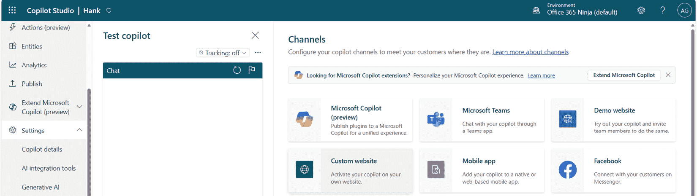

图 13.19 – 查看可用频道

1.  选择 **自定义** **网站** 频道。

1.  在 **自定义网站** 快捷菜单中，您应该看到一个标记为 **默认嵌入代码** 的部分。我们将在我们的网站上使用此代码。

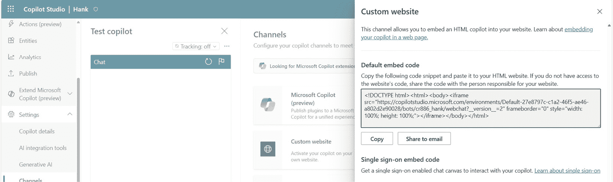

图 13.20 – 查看自定义网站代码

1.  在新浏览器窗口中，导航到您的网站管理界面。

1.  创建或编辑一个页面。

1.  接下来，您需要进入您网站的 HTML 或文本视图。如果您使用的是 WordPress，可以通过点击编辑窗口的 **文本** 标签来实现，如图 *图 13**.21* 所示。

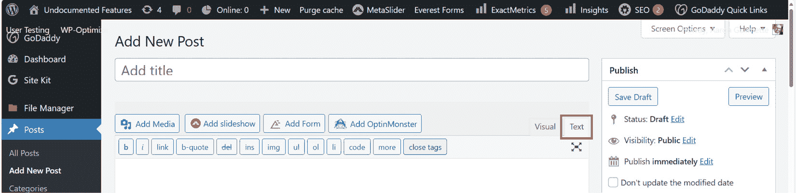

图 13.21 – 切换到文本/HTML 视图

1.  切换回包含 Copilot Studio 自定义网站代码的浏览器标签。复制代码并将其粘贴到 HTML 编辑器中。根据您的主题，您可能需要编辑大小参数。例如，删除 `"style=width:100%; height: 100%"` 标签可能有助于您看到原始显示大小。见图。

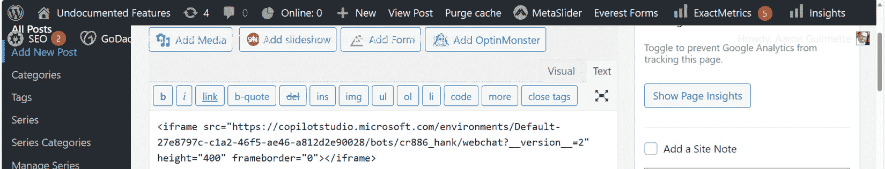

图 13.22 – 更新网站代码

1.  点击 **发布** 将帖子或页面发布到您的网站上。

就这些了！

# 将机器人发布到 Facebook

机器人也可以是您在社交媒体网站（如 Facebook）上业务的扩展。在这个例子中，我们将发布一个机器人通过 Facebook Messenger 回答问题。

开始 Facebook 之旅！

为了与 Facebook 集成，您需要一个现有的 Facebook 商业应用。您还需要在 Facebook 开发者 ([`developers.facebook.com`](https://developers.facebook.com)) 上注册。

要开始，请按照以下步骤操作：

1.  导航到 Copilot Studio ([`copilotstudio.microsoft.com`](https://copilotstudio.microsoft.com)) 并选择您的机器人。

1.  从导航面板中展开 **设置** 并选择 **通道**。

1.  选择 **Facebook**。

1.  注意在 **Facebook** 飞出窗口中出现的字段，包括 **Facebook 应用 ID**、**Facebook 应用密钥**、**页面 ID** 和 **页面访问令牌**。

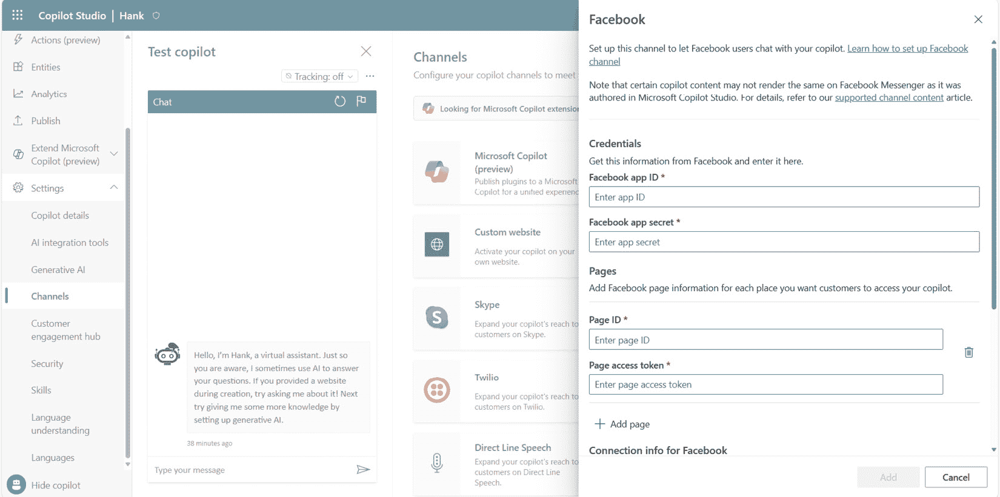

图 13.23 – 查看 Facebook 设置飞出窗口

1.  打开一个新的浏览器标签页。导航到 [`developers.facebook.com`](https://developers.facebook.com) 并使用管理您组织 Facebook 页面或应用的 ID 登录。

1.  从导航菜单中选择 **我的应用**。

图 13.24 – 登录 Facebook 开发者网站

1.  选择您现有的应用或页面。

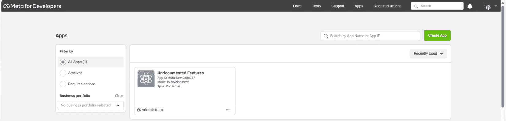

图 13.25 – 选择您的 Facebook 页面或应用

1.  展开应用设置，并选择 **基本**。

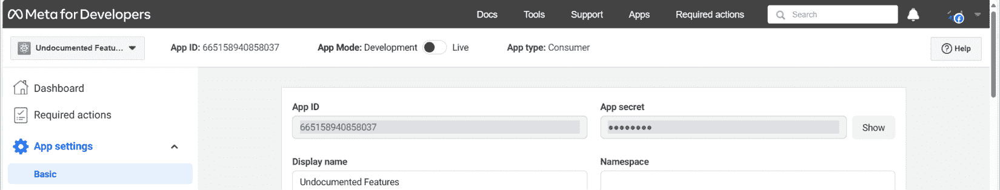

图 13.26 – 获取 Facebook 安全数据

1.  将 **App ID** 和 **App secret** 值复制到 Copilot Studio Facebook 通道设置中的相应位置。

1.  在 Facebook 开发者设置页面，选择 **高级**。

1.  启用 **允许 API 访问应用设置** 切换，并点击 **保存更改**。

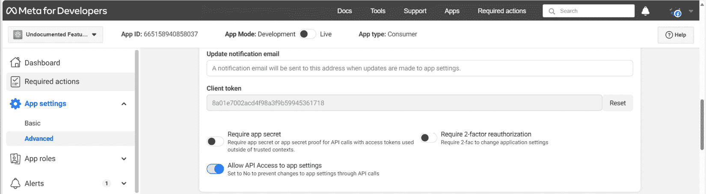

图 13.27 – 启用 API 访问

1.  点击 **仪表板**，然后选择 **设置** 的 **Messenger** 应用。

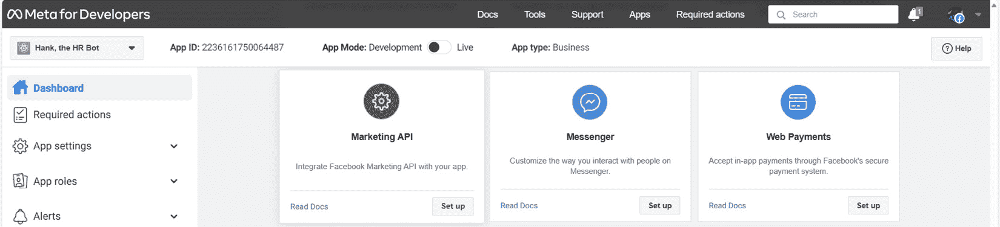

图 13.28 – 设置 Messenger 应用

1.  根据您 Facebook 属性的当前状态，您可能需要设置一个新的页面或连接一个现有的页面。您将需要此信息来生成访问令牌。在这种情况下，我们有一个应用和一个页面，但需要将它们连接到 Messenger，因此我们将点击 **连接**。

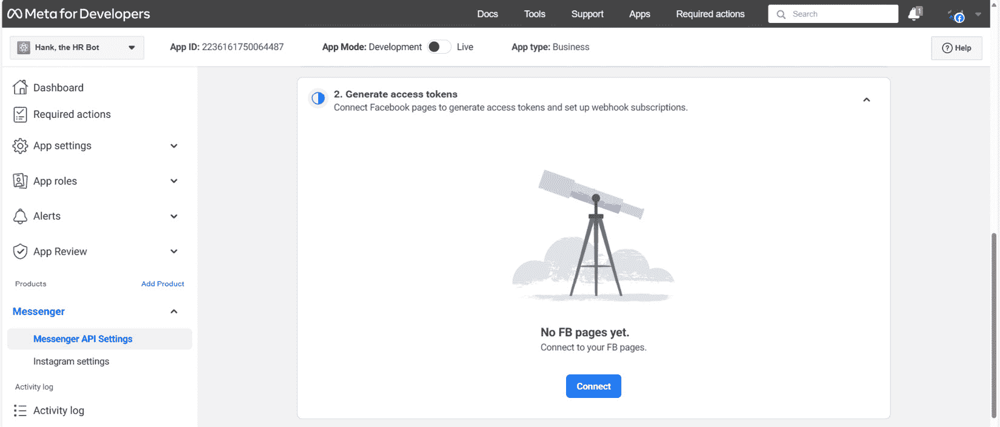

图 13.29 – 将机器人应用连接到 Facebook 页面

1.  连接后，确认数据访问。点击 **继续**。

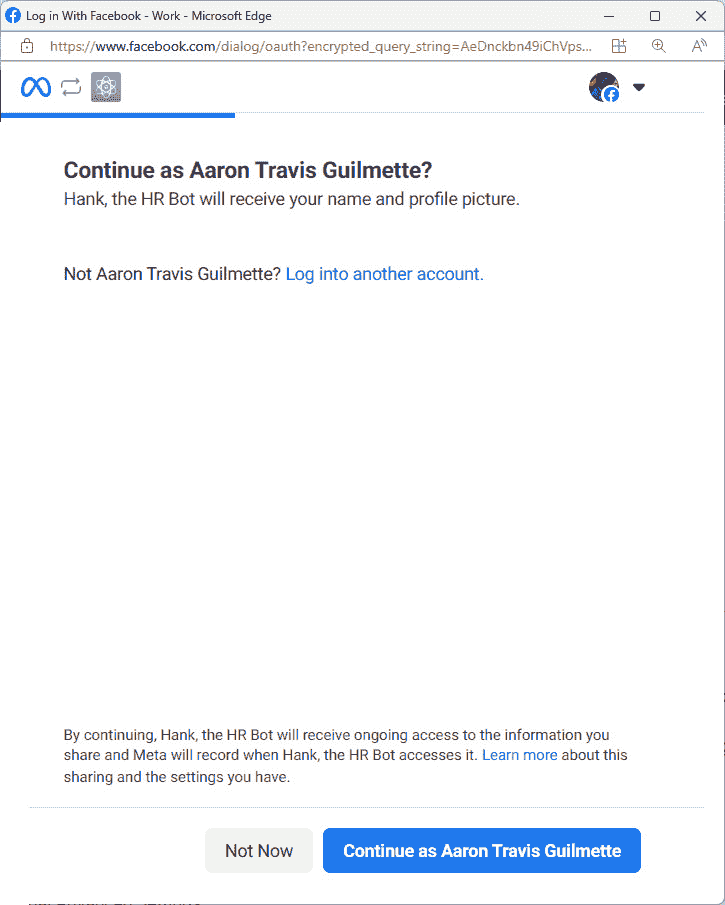

图 13.30 – 确认数据访问确认

1.  确认您的机器人将访问哪些资产。在这种情况下，我们只是允许它访问 HR 机器人 Facebook 应用。

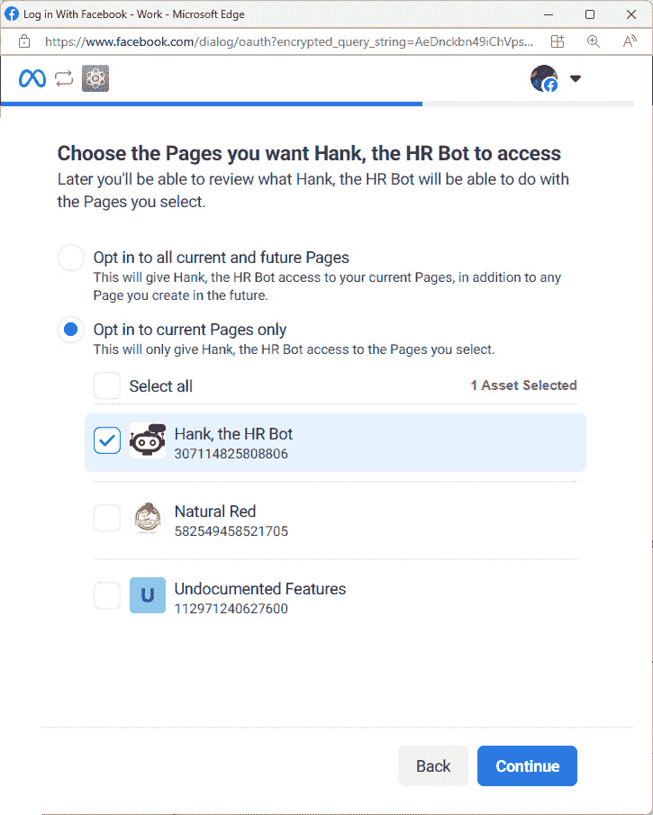

图 13.31 – 授予访问权限

1.  页面连接后，您可以生成一个访问令牌，如图 *图 13*.32* 所示：

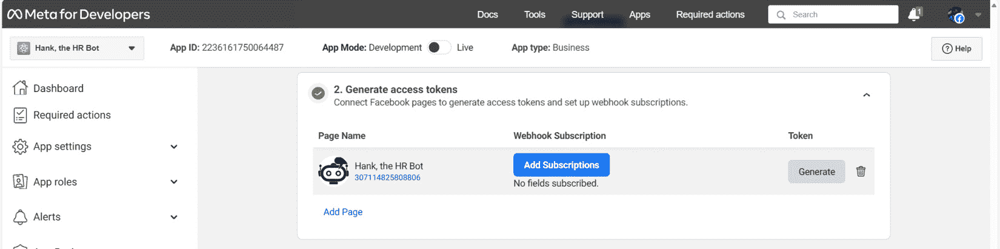

图 13.32 – 生成访问令牌

1.  点击**我理解**，然后将令牌复制到剪贴板。

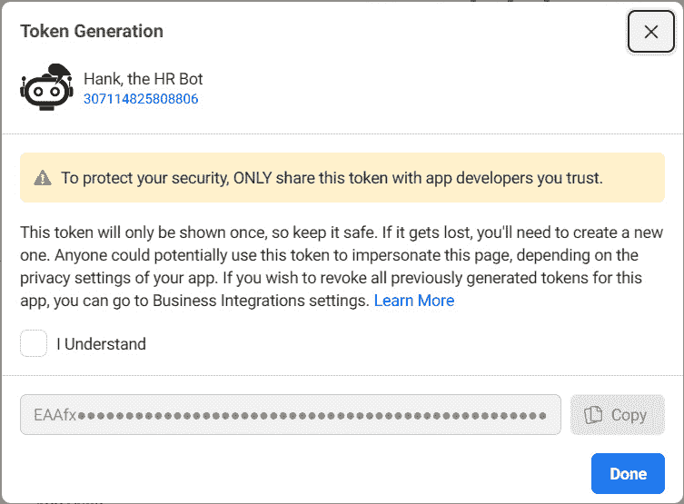

图 13.33 – 获取页面访问令牌

1.  将访问令牌粘贴到 Copilot Studio 中的**页面访问令牌**字段。

1.  在 Facebook 开发者页面上，点击**页面 ID**值并将其粘贴到 Copilot Studio 中的**页面 ID**字段。

1.  在 Copilot Studio 的**Facebook**飞出中点击**添加**以保存配置并生成**回调 URL**和**验证**令牌值。

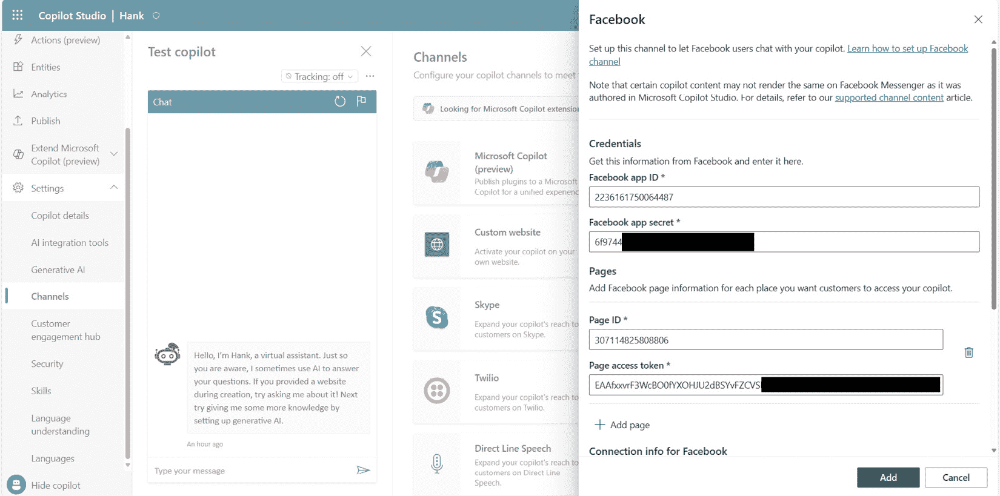

图 13.34 – 配置 Facebook 飞出

1.  在**配置 webhooks**下，点击**配置**。

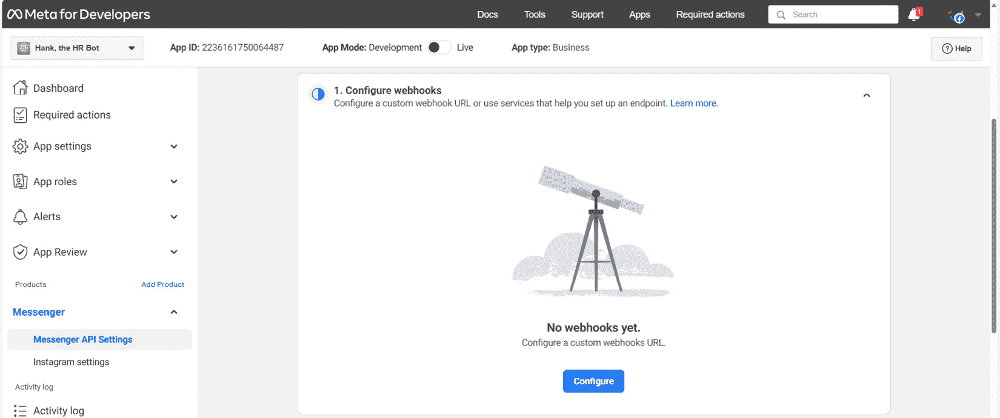

图 13.35 – 配置 webhook

1.  将 Copilot Studio 中**Facebook**飞出页面的**回调 URL**和**验证令牌**参数复制到相应的字段，然后点击**验证**和**保存**。

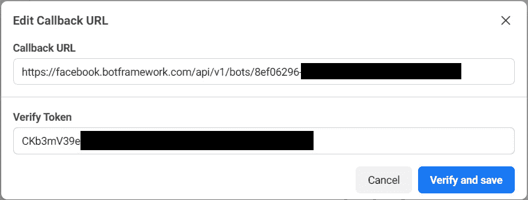

图 13.36 – 更新 webhook 设置

1.  在**Webhook Fields**字段旁边点击**管理**。

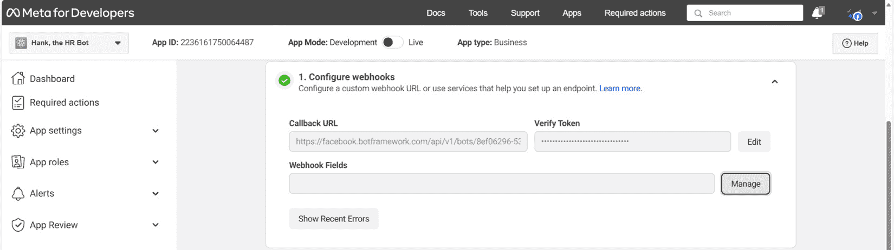

图 13.37 – 管理 webhooks

1.  在`messages`

1.  `messaging_postbacks`

1.  `messaging_optins`

1.  `message_deliveries`

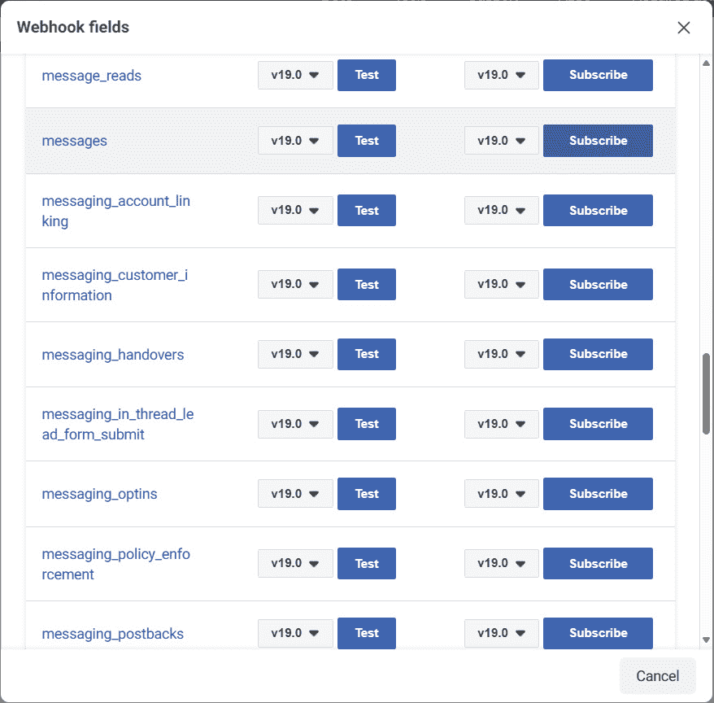

图 13.38 – 订阅 webhooks

1.  点击**X**关闭对话框。

1.  确保已更新**Webhooks Fields**字段。

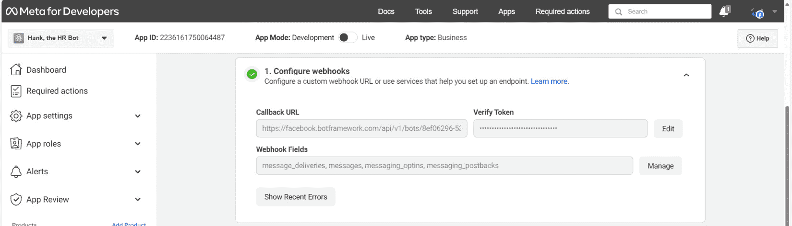

图 13.39 – 确认 webhook 字段已更新

1.  配置这些项目后，您需要通过展开**App Review**并点击**提交审查**来将您的机器人应用程序提交给 Facebook 进行审查。如果您的业务尚未通过 Facebook 验证，您需要通过提供支持性文件来完成此操作。Facebook 这样做是为了确保 API 不被滥用并遵守负责任的数据保护实践。

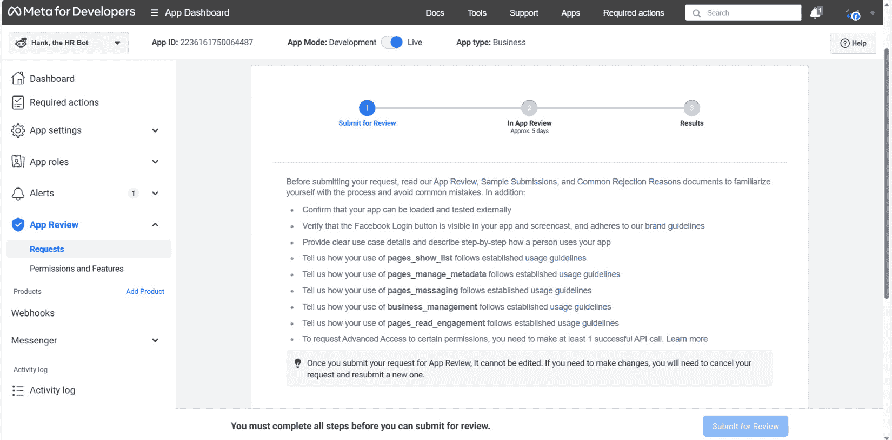

图 13.40 – 使用 Facebook 提交机器人进行审查

完成这些操作后，您的机器人可以通过 Facebook Messenger 开始回答问题！

# 将机器人发布到其他端点

除了与流行的社交媒体和通讯应用集成外，您还可以扩展您的对话机器人到其他应用。

有关开发机器人集成和其他专业代码解决方案的更多信息，请参阅[`learn.microsoft.com/en-us/microsoft-copilot-studio/publication-connect-bot-to-custom-application`](https://learn.microsoft.com/en-us/microsoft-copilot-studio/publication-connect-bot-to-custom-application)。

# 摘要

本章指导您将您的机器人扩展到诸如 Teams、公共网站和 Facebook 等地方。在这些场景中，您学习了如何集成您开发的对话机器人，扩展其覆盖范围和实用性。

这本书就到这里了。我希望您探索生成式 AI、OpenAI 和 Azure 以及 Microsoft Power Platform 中的 AI Builder 解决方案强大功能的过程和我撰写关于它们一样有趣！
