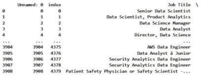
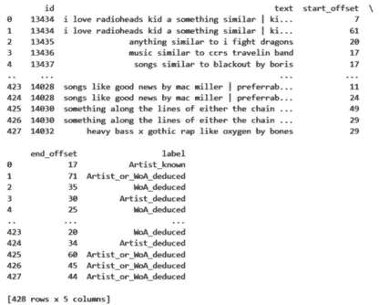
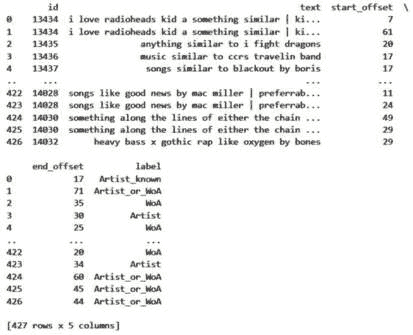
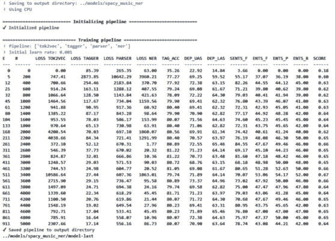
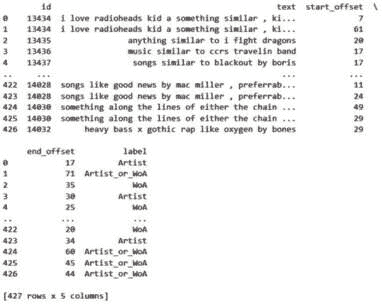

# 第五章：信息提取入门

在本章中，我们将介绍**信息提取**的基础知识。信息提取是从文本中提取非常具体信息的任务。例如，您可能想知道新闻文章中提到的公司。您不必花时间阅读整篇文章，可以使用信息提取技术几乎立即访问这些公司。

我们将从从工作公告中提取电子邮件地址和URL开始。然后，我们将使用称为**Levenshtein距离**的算法来查找相似字符串。接下来，我们将从文本中提取重要关键词。之后，我们将使用**spaCy**在文本中查找命名实体，稍后，我们将在spaCy中训练自己的命名实体识别模型。然后，我们将进行基本的情感分析，最后，我们将训练两个自定义情感分析模型。

您将学习如何使用现有工具和训练自己的模型进行信息提取任务。

本章我们将涵盖以下食谱：

+   使用正则表达式

+   查找相似字符串 – Levenshtein距离

+   提取关键词

+   使用spaCy进行命名实体识别

+   使用spaCy训练自己的NER模型

+   微调BERT进行NER

# 技术要求

本章的代码位于本书GitHub仓库中名为`Chapter05`的文件夹中（[https://github.com/PacktPublishing/Python-Natural-Language-Processing-Cookbook-Second-Edition/tree/main/Chapter05](https://github.com/PacktPublishing/Python-Natural-Language-Processing-Cookbook-Second-Edition/tree/main/Chapter05)）。

如前几章所述，本章所需的包是Poetry环境的一部分。或者，您可以使用`requirements.txt`文件安装所有包。

# 使用正则表达式

在本食谱中，我们将使用正则表达式在文本中查找电子邮件地址和URL。正则表达式是特殊的字符序列，用于定义搜索模式，可以通过Python的`re`包创建和使用。我们将使用工作描述数据集并编写两个正则表达式，一个用于电子邮件，一个用于URL。

## 准备工作

在这里下载工作描述数据集：[https://www.kaggle.com/andrewmvd/data-scientist-jobs](https://www.kaggle.com/andrewmvd/data-scientist-jobs)。它也可以在本书的GitHub仓库中找到：[https://github.com/PacktPublishing/Python-Natural-Language-Processing-Cookbook-Second-Edition/blob/main/data/DataScientist.csv](https://github.com/PacktPublishing/Python-Natural-Language-Processing-Cookbook-Second-Edition/blob/main/data/DataScientist.csv)。将其保存到`/data`文件夹中。

笔记本位于[https://github.com/PacktPublishing/Python-Natural-Language-Processing-Cookbook-Second-Edition/blob/main/Chapter05/5.1_regex.ipynb](https://github.com/PacktPublishing/Python-Natural-Language-Processing-Cookbook-Second-Edition/blob/main/Chapter05/5.1_regex.ipynb)。

## 如何操作...

我们将从CSV文件中读取数据到`pandas` DataFrame中，并使用Python的`re`包来创建正则表达式并搜索文本。步骤如下：

1.  导入**re**和**pandas**包：

    ```py
    import re
    import pandas as pd
    ```

1.  读取数据并检查其内容：

    ```py
    data_file = "../data/DataScientist.csv"
    df = pd.read_csv(data_file, encoding='utf-8')
    print(df)
    ```

    输出将会很长，应该像这样开始：



图5.1 – DataFrame输出

1.  **get_list_of_items**辅助函数接受一个DataFrame作为输入，并将其某一列转换为列表。它接受DataFrame和列名作为输入。首先，它获取列值，这是一个列表的列表，然后将其展平。然后，它通过将列表转换为集合来删除重复项，并将其转换回列表：

    ```py
    def get_list_of_items(df, column_name):
        values = df[column_name].values
        values = [item for sublist in values for item in sublist]
        list_of_items = list(set(values))
        return list_of_items
    ```

1.  在这一步中，我们定义了**get_emails**函数来获取**Job Description**列中出现的所有电子邮件。正则表达式由三个部分组成，这些部分出现在方括号中，后面跟着量词：

    +   **[^\s:|()\']+**是正则表达式的用户名部分，后面跟着一个**@**符号。它由一个字符组组成，显示在方括号中。这个组中的任何字符都可以在用户名中出现一次或多次。这使用**+**量词来表示。用户名中的字符可以是任何字符，但不能是空格（**\s**）、冒号（**:**）、竖线（**|**）和引号（**'**）。**^**字符表示字符类的否定。引号在正则表达式中是一个特殊字符，必须使用反斜杠转义才能调用字符的常规意义。

    +   **[a-zA-Z0-9\.]+**是域名的一部分，后面跟着一个点。这部分是简单的字母数字字符，小写或大写，并且点出现一次或多次。由于点是特殊字符，我们使用反斜杠来转义它。**a-z**表达式表示从*a*到*z*的字符范围。

    +   **[a-zA-Z]+**是域名的一部分，即顶级域名，如**.com**、**.org**等。通常，这些顶级域名不允许出现数字，正则表达式匹配出现一次或多次的小写或大写字母。

    这个正则表达式足以解析数据集中的所有电子邮件，并且不会出现任何假阳性。你可能会发现，在你的数据中，需要对正则表达式进行一些额外的调整：

    ```py
    def get_emails(df):
        email_regex = '[^\s:|()\']+@[a-zA-Z0-9\.]+\.[a-zA-Z]+'
        df['emails'] = df['Job Description'].apply(
            lambda x: re.findall(email_regex, x))
        emails = get_list_of_items(df, 'emails')
        return emails
    ```

1.  我们现在将使用之前的功能从DataFrame中获取电子邮件：

    ```py
    emails = get_emails(df)
    print(emails)
    ['hrhelpdesk@phila.gov', 'talent@quartethealth.com', …, 'careers@edo.com', 'Talent.manager@techquarry.com', 'resumes@nextgentechinc.com', …, 'talent@ebay.com', …, 'info@springml.com',…]
    ```

1.  `re`包中的`finditer`函数。它在一个文本中找到所有匹配项，并将它们作为`Match`对象返回。我们可以通过使用`span()`对象方法来找到匹配的开始和结束位置。它返回一个元组，其中第一个元素是匹配的开始，第二个元素是匹配的结束：

    ```py
    def get_urls(df):
        url_regex = '(http[s]?://(www\.)?[A-Za-z0-9–_\.\-]+\.[A-Za-z]+/?[A-Za-z0-9$\–_\-\/\.]*)[\.)\"]*'
        df['urls'] = df['Job Description'].apply(
            lambda x: [
                x[item.span()[0]:item.span()[1]] 
                for item in re.finditer(url_regex, x)
            ]
        )
        urls = get_list_of_items(df, 'urls')
        return urls
    ```

1.  我们将以类似的方式获取URL：

    ```py
    urls = get_urls(df)
    print(urls)
    ```

    结果的一部分可能看起来像这样：

    ```py
    ['https://youtu.be/c5TgbpE9UBI', 'https://www.linkedin.com/in/emma-riley-72028917a/', 'https://www.dol.gov/ofccp/regs/compliance/posters/ofccpost.htm', 'https://www.naspovaluepoint.org/portfolio/mmis-provider-services-module-2018-2028/hhs-technology-group/).', 'https://www.instagram.com/gatestonebpo', 'http://jobs.sdsu.edu', 'http://www.colgatepalmolive.com.', 'http://www1.eeoc.gov/employers/upload/eeoc_self_print_poster.pdf', 'https://www.gofundme.com/2019https', 'https://www.decode-m.com/', 'https://bit.ly/2lCOcYS',…]
    ```

## 还有更多……

编写正则表达式可能会迅速变成一件杂乱无章的事情。我使用正则表达式测试网站来输入我期望匹配的文本和正则表达式。此类网站的一个例子是[https://regex101.com/](https://regex101.com/)。

# 寻找相似字符串 – Levenshtein距离

在进行信息提取时，在许多情况下，我们处理拼写错误，这可能会给任务带来复杂性。为了解决这个问题，有几种方法可用，包括Levenshtein距离。此算法找到将一个字符串更改为另一个字符串所需的编辑/添加/删除的数量。例如，要将单词*put*更改为*pat*，需要将*u*替换为*a*，这是一个更改。要将单词*kitten*更改为*smitten*，需要进行两个编辑：将*k*更改为*m*并在开头添加一个*s*。

在本配方中，你将能够使用这种技术来找到与拼写错误的电子邮件的匹配项。

## 准备工作

我们将使用与之前配方中相同的包和数据科学家职位描述数据集，以及`python-Levenshtein`包，它是Poetry环境的一部分，并包含在`requirements.txt`文件中。

笔记本位于[https://github.com/PacktPublishing/Python-Natural-Language-Processing-Cookbook-Second-Edition/blob/main/Chapter05/5.2_similar_strings.ipynb](https://github.com/PacktPublishing/Python-Natural-Language-Processing-Cookbook-Second-Edition/blob/main/Chapter05/5.2_similar_strings.ipynb)。

## 如何操作…

我们将数据集读入一个`pandas` DataFrame，并使用从中提取的电子邮件来搜索拼写错误的电子邮件。你的步骤应该格式化如下：

1.  运行语言工具文件。此文件包含我们在之前的配方中创建的**get_emails**函数：

    ```py
    %run -i "../util/lang_utils.ipynb"
    ```

1.  执行必要的导入：

    ```py
    import pandas as pd
    import Levenshtein
    ```

1.  将数据读入一个**pandas** DataFrame对象：

    ```py
    data_file = "../data/DataScientist.csv"
    df = pd.read_csv(data_file, encoding='utf-8')
    ```

1.  使用**get_emails**函数从DataFrame中过滤掉所有电子邮件，该函数在之前的配方中有更详细的解释，*使用正则表达式*：

    ```py
    emails = get_emails(df)
    ```

1.  **find_levenshtein**函数接收一个DataFrame和一个输入字符串，并计算它与电子邮件列中每个字符串之间的Levenshtein距离。它接收一个输入字符串和一个包含电子邮件的DataFrame，并在其中创建一个新列，该列的值是输入与DataFrame中的电子邮件地址之间的Levenshtein距离。该列名为**distance_to_[input_string]**：

    ```py
    def find_levenshtein(input_string, df):
        df['distance_to_' + input_string] = \
            df['emails'].apply(lambda x: Levenshtein.distance(
                input_string, x))
        return df
    ```

1.  在这一步，我们定义了**get_closest_email_lev**函数，它接收一个包含电子邮件的DataFrame和一个要匹配的电子邮件，并返回DataFrame中与输入最接近的电子邮件。我们通过使用**find_levenshtein**函数创建一个包含到输入电子邮件距离的新列，然后使用**pandas**中的**idxmin()**函数找到最小值的索引。我们使用最小索引来找到最近的电子邮件：

    ```py
    def get_closest_email_lev(df, email):
        df = find_levenshtein(email, df)
        column_name = 'distance_to_' + email
        minimum_value_email_index = df[column_name].idxmin()
        email = df.loc[minimum_value_email_index]['emails']
        return email
    ```

1.  接下来，我们将电子邮件加载到新的 DataFrame 中，并使用拼写错误的电子邮件地址 **rohitt.macdonald@prelim.com** 在新的 **email** DataFrame 中查找匹配项：

    ```py
    new_df = pd.DataFrame(emails,columns=['emails'])
    input_string = "rohitt.macdonald@prelim.com"
    email = get_closest_email_lev(new_df, input_string)
    print(email)
    ```

    该函数返回正确的电子邮件地址拼写 `rohit.mcdonald@prolim.com`：

    ```py
    rohit.mcdonald@prolim.com
    ```

## 还有更多...

Levenshtein 包包括其他字符串相似度测量方法，您可以在 [https://rapidfuzz.github.io/Levenshtein/](https://rapidfuzz.github.io/Levenshtein/) 中探索。在本节中，我们查看 **Jaro 距离**。

我们可以使用另一个函数，即 Jaro 相似度，它将两个字符串之间的相似度输出为一个介于 `0` 和 `1` 之间的数字，其中 `1` 表示两个字符串完全相同。过程类似，但我们需要具有最大值的索引而不是最小值，因为 Jaro 相似度函数对更相似的字符串返回更高的值。让我们一步步来：

1.  **find_jaro** 函数接收一个 DataFrame 和一个输入字符串，并计算它与电子邮件列中每个字符串之间的 Jaro 相似度：

    ```py
    def find_jaro(input_string, df):
        df['distance_to_' + input_string] = df['emails'].apply(
            lambda x: Levenshtein.jaro(input_string, x)
        )
        return df
    ```

1.  **get_closest_email_jaro** 函数使用我们在上一步中定义的函数来找到与输入最接近的电子邮件地址：

    ```py
    def get_closest_email_jaro(df, email):
        df = find_jaro(email, df)
        column_name = 'distance_to_' + email
        maximum_value_email_index = df[column_name].idxmax()
        email = df.loc[maximum_value_email_index]['emails']
        return email
    ```

1.  接下来，我们使用拼写错误的电子邮件地址 **rohitt.macdonald@prelim.com** 在新的电子邮件 DataFrame 中查找匹配项：

    ```py
    email = get_closest_email_jaro(new_df, input_string)
    print(email)
    ```

    输出如下：

    ```py
    rohit.mcdonald@prolim.com
    ```

1.  Jaro 相似度函数的一个扩展是 **Jaro-Winkler 函数**，它给单词的末尾附加一个权重，并且这个权重降低了末尾拼写错误的重要性。例如，让我们看看以下函数：

    ```py
    print(Levenshtein.jaro_winkler("rohit.mcdonald@prolim.com",
        "rohit.mcdonald@prolim.org"))
    ```

    这将输出以下内容：

    ```py
    1.0
    ```

# 提取关键词

在这个菜谱中，我们将从文本中提取关键词。我们将使用包含新闻文章的 BBC 新闻数据集。您可以在[*第 4 章*](B18411_04.xhtml#_idTextAnchor106)中了解更多关于数据集的信息，该章节的标题为 *使用 K-Means 进行句子聚类：无监督 *文本分类*。

从文本中提取关键词可以快速了解文章的主题，也可以作为标签系统的依据，例如，在网站上。

为了正确提取，我们需要训练一个 TF-IDF 向量化器，我们将在提取阶段使用它。

## 准备工作

在这个菜谱中，我们将使用 `sklearn` 包。它是 Poetry 环境的一部分。您也可以通过安装 `requirements.txt` 文件来与其他包一起安装它。

BBC 新闻数据集可在 Hugging Face 上获得 [https://huggingface.co/datasets/SetFit/bbc-news](https://huggingface.co/datasets/SetFit/bbc-news)。

笔记本位于 [https://github.com/PacktPublishing/Python-Natural-Language-Processing-Cookbook-Second-Edition/blob/main/Chapter05/5.3_keyword_extraction.ipynb](https://github.com/PacktPublishing/Python-Natural-Language-Processing-Cookbook-Second-Edition/blob/main/Chapter05/5.3_keyword_extraction.ipynb)。

## 如何做到这一点...

要从给定文本中提取关键词，我们首先需要一个我们将拟合向量器的文本语料库。一旦完成，我们就可以使用它从与处理语料库相似的文本中提取关键词。以下是步骤：

1.  运行语言工具笔记本：

    ```py
    %run -i "../util/lang_utils.ipynb"
    ```

1.  导入必要的包和函数：

    ```py
    from datasets import load_dataset
    from nltk import word_tokenize
    from math import ceil
    from sklearn.feature_extraction.text import TfidfVectorizer
    from nltk.corpus import stopwords
    ```

1.  加载训练和测试数据集，将它们转换为**pandas** DataFrame对象，并打印出训练DataFrame以查看其外观。DataFrame有三个列，一列用于新闻文章文本，一列用于数字格式的标签，另一列用于标签文本：

    ```py
    train_dataset = load_dataset("SetFit/bbc-news", split="train")
    test_dataset = load_dataset("SetFit/bbc-news", split="test")
    train_df = train_dataset.to_pandas()
    test_df = test_dataset.to_pandas()
    print(train_df)
    print(test_df)
    ```

    结果应类似于以下内容：

    ```py
         text  label     label_text
    0  wales want rugby league training wales could f... 2  sport
    1     china aviation seeks rescue deal scandal-hit j...  business
    ...     ...    ...            ...
    1223  why few targets are better than many the econo... 1  business
    1224  boothroyd calls for lords speaker betty boothr... 4  politics
    [1225 rows x 3 columns]
         text  label     label_text
    0  carry on star patsy rowlands dies actress pats... 3  entertainment
    1    sydney to host north v south game sydney will ... 2  sport
    ..     ...    ...            ...
    998  stormy year for property insurers a string of ... 1  business
    999  what the election should really be about  a ge... 4  politics
    [1000 rows x 3 columns]
    ```

1.  创建向量器并将其拟合到训练数据文本上。要了解更多关于向量器的信息，请参阅[*第3章*](B18411_03.xhtml#_idTextAnchor067)。在*使用TF-IDF表示文本*的配方中讨论了TF-IDF向量器。我们使用英语停用词，最小文档频率为**2**，最大文档频率为95%（要了解更多关于停用词的信息，请参阅[*第1章*](B18411_01.xhtml#_idTextAnchor013)中的*移除停用词*配方）：

    ```py
    vectorizer = TfidfVectorizer(stop_words='english', 
        min_df=2, max_df=0.95)
    vectorizer.fit(train_df["text"])
    ```

1.  现在，我们将定义一些辅助函数。第一个函数将按TF-IDF分数对坐标矩阵进行排序。它接受由向量器创建的向量转换成的坐标矩阵。该坐标矩阵的**col**属性提供单词索引，**data**属性提供每个单词的TF-IDF分数。该函数从这个数据创建一个元组列表，其中元组的第一个值是索引，第二个值是TF-IDF分数。然后它按TF-IDF分数对元组列表进行排序并返回排序结果。这将给我们具有最大TF-IDF分数的单词或最具有该特定新闻稿特征的单词：

    ```py
    def sort_data_tfidf_score(coord_matrix):
        tuples = zip(coord_matrix.col, coord_matrix.data)
        return sorted(tuples, key=lambda x: (x[1], x[0]), 
            reverse=True)
    ```

1.  下一个函数**get_keyword_strings**将获取给定向量的关键词。它返回给定向量的提取关键词。它接受拟合的向量器、要提取的关键词数和输入文本的排序向量作为输入。该函数首先将**index_dict**变量定义为键为单词索引、值为相应单词的字典。然后它遍历排序向量并将字典中的单词追加到**words**列表变量中。它达到所需单词数时停止。由于该函数遍历排序向量，它将给出具有最高TF-IDF分数的单词。这些单词将是该文档中最常使用但在其他文档中未使用的单词，从而给我们一个关于文章主题的想法：

    ```py
    def get_keyword_strings(vectorizer, num_words, sorted_vector):
        words = []
        index_dict = vectorizer.get_feature_names_out()
        for (item_index, score) in sorted_vector[0:num_words]:
            word = index_dict[item_index]
            words.append(word)
        return words
    ```

1.  **get_keywords_simple**函数将返回给定文本的关键词列表。它接受输入文本、拟合的向量器和所需单词数。它使用向量器为输入文本创建一个向量，然后使用**sort_data_tfidf_score**函数对向量进行排序，并最终使用**get_keyword_strings**函数获取顶级单词：

    ```py
    def get_keywords_simple(vectorizer, input_text,
        num_output_words=10):
        vector = vectorizer.transform([input_text])
        sorted = sort_data_tfidf_score(vector.tocoo())
        words = get_keyword_strings(vectorizer, num_output_words, 
            sorted)
        return words
    ```

1.  我们使用之前的函数处理测试数据集中的第一篇文本。我们从测试数据中的第一篇文章中提取关键词列表，使用**get_keywords_simple**函数。我们发现一些关键词适合摘要，而一些则不太合适：

    ```py
    print(test_df.iloc[0]["text"])
    keywords = get_keywords_simple(vectorizer,
        test_df.iloc[0]["text"])
    print(keywords)
    ```

    结果将如下所示：

    ```py
    carry on star patsy rowlands dies actress patsy rowlands  known to millions for her roles in the carry on films  has died at the age of 71.  rowlands starred in nine of the popular carry on films  alongside fellow regulars sid james  kenneth williams and barbara windsor...
    ['carry', 'theatre', 'scholarship', 'appeared', 'films', 'mrs', 'agent', 'drama', 'died', 'school']
    ```

## 还有更多...

现在，我们将使用一种更复杂的方法来从新闻摘要中提取关键词。我们将使用一个向量器，它不仅对单个单词进行评分，还对双词和三词进行评分。我们还将使用spaCy名词短语来确保输出的双词和三词是有意义的。要了解更多关于名词短语的信息，请参阅[*第2章*](B18411_02.xhtml#_idTextAnchor042)中的*提取名词短语*配方。这种方法的优势在于，我们不仅得到单个单词作为输出，还有短语，例如*周六早晨*而不是单独的*周六*和*早晨*。

1.  创建新的向量器并将其拟合到训练摘要中。由于spaCy实体可能包含它，我们从停用词列表中排除了单词**the**：

    ```py
    stop_words = list(stopwords.words('english'))
    stop_words.remove("the")
    trigram_vectorizer = TfidfVectorizer(
        stop_words=stop_words, min_df=2,
        ngram_range=(1,3), max_df=0.95)
    trigram_vectorizer.fit(train_df["summary"])
    ```

1.  现在，定义**get_keyword_strings_all**函数。它将从排序向量中获取所有关键词，它对获取多少个单词没有限制：

    ```py
    def get_keyword_strings_all(vectorizer, sorted_vector):
        words = []
        index_dict = vectorizer.get_feature_names_out()
        for (item_index, score) in sorted_vector:
            word = index_dict[item_index]
            words.append(word)
        return words
    ```

1.  接下来，我们定义**get_keywords_complex**函数，该函数输出主要关键词和最多三个单词长的短语：

    ```py
    def get_keywords_complex(
        vectorizer, input_text, spacy_model, num_words=70
    ):
        keywords = []
        doc = spacy_model(input_text)
        vector = vectorizer.transform([input_text])
        sorted = sort_coo(vector.tocoo())
        ngrams = get_keyword_strings_all(vectorizer, sorted)
        ents = [ent.text.lower() for ent in doc.noun_chunks]
        for i in range(0, num_words):
            keyword = ngrams[i]
            if keyword.lower() in ents and not
            keyword.isdigit() and keyword not in keywords:
                keywords.append(keyword)
        return keywords
    ```

1.  现在，我们将在第一个测试摘要上使用之前的函数：

    ```py
    keywords = get_keywords_complex(trigram_vectorizer,
        test_df.iloc[0]["summary"], small_model)
    print(keywords)
    ```

    结果将如下所示：

    ```py
    ['the gop', 'the 50 states', 'npr', '11 states', 'state', 'republican governors', 'the dems', 'reelection', 'the helm', 'grabs']
    ```

# 使用spaCy进行命名实体识别

**命名实体识别**（**NER**）是从文本中解析地点、人物、组织等名称的任务。这在许多下游任务中可能很有用。例如，你可以想象一个场景，你希望根据文章中提到的人物对文章集进行排序，例如，在研究某个特定人物时。

在这个配方中，我们将使用NER从BBC数据集中的文章文本中解析出命名实体。我们将加载包和解析引擎，并遍历NER结果。

## 准备工作

在这个配方中，我们将使用spaCy。要正确运行它，你需要下载一个语言模型。我们将下载小型和大型模型。这些模型占用大量的磁盘空间：

```py
python -m spacy download en_core_web_sm
python -m spacy download en_core_web_lg
```

笔记本位于[https://github.com/PacktPublishing/Python-Natural-Language-Processing-Cookbook-Second-Edition/blob/main/Chapter05/5.4_named_entity_extraction.ipynb](https://github.com/PacktPublishing/Python-Natural-Language-Processing-Cookbook-Second-Edition/blob/main/Chapter05/5.4_named_entity_extraction.ipynb)。

## 如何做到这一点...

NER在spaCy对输入文本的处理过程中自动发生。通过`doc.ents`变量访问实体。我们将输入一篇关于苹果iPhone的文章，并查看哪些实体将从其中解析出来。让我们看看步骤：

1.  运行语言工具文件。这将导入必要的包和函数并初始化spaCy引擎：

    ```py
    %run -i "../util/lang_utils.ipynb"
    ```

1.  初始化文章文本。这是一篇来自 [https://www.globalsmt.net/social-media-news/iphone-12-apple-makes-jump-to-5g/:](https://www.globalsmt.net/social-media-news/iphone-12-apple-makes-jump-to-5g/:)

    ```py
    article = """iPhone 12: Apple makes jump to 5G
    Apple has confirmed its iPhone 12 handsets will be its first to work on faster 5G networks.
    The company has also extended the range to include a new "Mini" model that has a smaller 5.4in screen.
    The US firm bucked a wider industry downturn by increasing its handset sales over the past year.
    But some experts say the new features give Apple its best opportunity for growth since 2014, when it revamped its line-up with the iPhone 6.
    …
    "Networks are going to have to offer eye-wateringly attractive deals, and the way they're going to do that is on great tariffs and attractive trade-in deals,"
    predicted Ben Wood from the consultancy CCS Insight. Apple typically unveils its new iPhones in September, but opted for a later date this year.
    It has not said why, but it was widely speculated to be related to disruption caused by the coronavirus pandemic. The firm's shares ended the day 2.7% lower.
    This has been linked to reports that several Chinese internet platforms opted not to carry the livestream,
    although it was still widely viewed and commented on via the social media network Sina Weibo."""
    ```

1.  在这里，我们创建 spaCy **Doc** 对象并使用它来提取实体。**Doc** 对象是通过在文本上使用小 spaCy 模型创建的。该模型提取不同的属性，包括命名实体。我们打印出解析出的实体的长度以及实体本身，包括起始和结束字符信息以及实体类型（命名实体标签的含义可以在 spaCy 文档的 [https://spacy.io/models/en](https://spacy.io/models/en) 找到）：

    ```py
    doc = small_model(article)
    print(len(doc.ents))
    small_model_ents = doc.ents
    for ent in doc.ents:
        print(ent.text, ent.start_char, ent.end_char, ent.label_)
    ```

    当我们打印出结果时，我们可以看到不同类型的实体，包括基数词、百分比、人名、日期、组织以及一个 `NORP` 实体，代表 **国籍或宗教或** **政治团体**：

    ```py
    44
    12 7 9 CARDINAL
    Apple 11 16 ORG
    5 31 32 CARDINAL
    …
    a later date this year 2423 2445 DATE
    2.7% 2594 2598 PERCENT
    Chinese 2652 2659 NORP
    Sina Weibo 2797 2807 PERSON
    ```

## 还有更多…

我们可以通过以下步骤比较小模型和大模型的表现：

1.  从 *How to do it…* 部分的 *步骤 3* 开始运行相同的步骤，但使用大型模型：

    ```py
    doc = large_model(article)
    print(len(doc.ents))
    large_model_ents = doc.ents
    for ent in doc.ents:
        print(ent.text, ent.start_char, ent.end_char, ent.label_)
    ```

    结果将如下所示：

    ```py
    46
    12 7 9 CARDINAL
    Apple 11 16 ORG
    5 31 32 CARDINAL
    …
    the day 2586 2593 DATE
    2.7% 2594 2598 PERCENT
    Chinese 2652 2659 NORP
    Sina Weibo 2797 2807 PERSON
    ```

1.  大型模型解析出的实体更多，我们可以看看它们之间的差异。我们打印出两个列表；一个列表包含小模型识别的实体，另一个列表包含大模型识别但小模型没有识别的实体：

    ```py
    small_model_ents = [str(ent) for ent in small_model_ents]
    large_model_ents = [str(ent) for ent in large_model_ents]
    in_small_not_in_large = set(small_model_ents) \ 
        - set(large_model_ents)
    in_large_not_in_small = set(large_model_ents) \ 
        - set(small_model_ents)
    print(in_small_not_in_large)
    print(in_large_not_in_small)
    ```

    结果将如下所示：

    ```py
    {'iPhone 11', 'iPhone', 'iPhones'}
    {'6', 'the day', 'IDC', '11', 'Pro', 'G\nApple', 'SE'}
    ```

你可以看到，两个模型提供的结果之间存在一些差异。

# 使用 spaCy 训练自己的 NER 模型

在上一个菜谱中，我们使用了预训练的 spaCy 模型来提取命名实体。这个 NER 模型在很多情况下已经足够使用。然而，可能会有其他时候，我们希望从头开始创建一个新的模型。在这个菜谱中，我们将训练一个新的 NER 模型来解析音乐家和他们的艺术作品的名字。

## 准备工作

我们将使用 spaCy 包来训练一个新的 NER 模型。除了 `spacy` 之外，你不需要其他任何包。我们将使用的数据来自 [https://github.com/deezer/music-ner-eacl2023](https://github.com/deezer/music-ner-eacl2023)。数据文件已预先加载在数据文件夹中（[https://github.com/PacktPublishing/Python-Natural-Language-Processing-Cookbook-Second-Edition/blob/main/data/music_ner.csv](https://github.com/PacktPublishing/Python-Natural-Language-Processing-Cookbook-Second-Edition/blob/main/data/music_ner.csv)），你需要从本书的 GitHub 仓库将其下载到 `data` 目录中。

笔记本位于 [https://github.com/PacktPublishing/Python-Natural-Language-Processing-Cookbook-Second-Edition/blob/main/Chapter05/5.5_training_own_spacy_model.ipynb](https://github.com/PacktPublishing/Python-Natural-Language-Processing-Cookbook-Second-Edition/blob/main/Chapter05/5.5_training_own_spacy_model.ipynb)。

## 如何操作…

我们将定义我们的训练数据，然后使用它来训练一个新的模型。然后我们将测试该模型并将其保存到磁盘。步骤如下：

1.  运行语言工具文件：

    ```py
    %run -i "../util/lang_utils.ipynb"
    ```

1.  导入其他函数和包：

    ```py
    import pandas as pd
    from spacy.cli.train import train
    from spacy.cli.evaluate import evaluate
    from spacy.tokens import DocBin
    from sklearn.model_selection import train_test_split
    ```

1.  在这一步，我们加载数据并打印出来：

    ```py
    music_ner_df = pd.read_csv('../data/music_ner.csv')
    print(music_ner_df)
    ```

    数据有五个列：`id`、`start offset`、`end offset`、`text`和`label`。如果句子中有一个以上的实体，则句子会重复，因为每个命名实体有一行。数据中有428个条目。



图5.2 – DataFrame输出

1.  在这里，我们将**_deduced**从标签中删除，因此标签现在是**Artist**、**WoA (work of art)**、**Artist_or_WoA**：

    ```py
    def change_label(input_label):
        input_label = input_label.replace("_deduced", "")
        return input_label
    music_ner_df["label"] = music_ner_df["label"].apply(change_label)
    print(music_ner_df)
    ```

    结果将如下所示：



图5.3 – DataFrame输出

1.  在这一步，我们创建存储处理数据的**DocBin**对象。**DocBin**对象是spaCy模型输入数据所必需的（要了解更多信息，请参阅[*第4章*](B18411_04.xhtml#_idTextAnchor106)中的*训练spaCy textcat模型*配方）：

    ```py
    train_db = DocBin()
    test_db = DocBin()
    ```

1.  在这里，我们创建一个唯一的ID列表并将其拆分为训练和测试数据。我们想要获取唯一ID的原因是因为句子在数据集中重复。有227个唯一的ID（或句子），训练数据中有170个句子，测试数据中有57个句子：

    ```py
    # Get a unique list of unique ids
    ids = list(set(music_ner_df["id"].values))
    print(len(ids))
    # Split ids into training and test
    train_ids, test_ids = train_test_split(ids)
    print(len(train_ids))
    print(len(test_ids))
    ```

    结果将如下所示：

    ```py
    227
    170
    57
    ```

1.  在这里，我们创建并保存训练和测试数据到**DocBin**对象中。我们遍历ID，对于每个ID，我们获取句子。我们使用小型模型处理句子，然后得到一个spaCy **Doc**对象。然后，我们遍历句子中的实体并将它们添加到**Doc**对象的**ents**属性中。处理后的**Doc**对象然后进入一个**DocBin**对象：

    ```py
    for id in ids:
        entity_rows = music_ner_df.loc[music_ner_df['id'] == id]
        text = entity_rows.head(1)["text"].values[0]
        doc = small_model(text)
        ents = []
        for index, row in entity_rows.iterrows():
            label = row["label"]
            start = row["start_offset"]
            end = row["end_offset"]
            span = doc.char_span(start, end, label=label, 
                alignment_mode="contract")
            ents.append(span)
        doc.ents = ents
        if id in train_ids:
            train_db.add(doc)
        else:
            test_db.add(doc)
    train_db.to_disk('../data/music_ner_train.spacy')
    test_db.to_disk('../data/music_ner_test.spacy')
    ```

1.  在这一步，我们训练模型。我们使用**data**文件夹中的**spacy_config_ner.cfg**配置文件。您可以在[https://spacy.io/usage/training/#quickstart](https://spacy.io/usage/training/#quickstart)创建自己的定制配置文件。输出显示了每个epoch的损失、准确率、精确率、召回率、F1分数和其他指标。最后，它将模型保存到指定的目录：

    ```py
    train("../data/spacy_config_ner.cfg", output_path="../models/spacy_music_ner")
    ```

    输出将如下所示：



图5.4 – 模型训练输出

1.  在这一步，我们加载训练好的模型并使用它对训练期间未见过的数据进行处理。我们从测试集中获取一个ID，获取具有该ID的所有测试数据行，并加载句子。然后我们打印出句子和标注的实体。然后，我们使用我们的模型（与其他预训练的spaCy模型完全相同的方式）处理句子并打印出它解析的实体：

    ```py
    nlp = spacy.load("../models/spacy_music_ner/model-last")
    first_test_id = test_ids[0]
    test_rows = music_ner_df.loc[music_ner_df['id'] 
        == first_test_id]
    input_text = entity_rows.head(1)["text"].values[0]
    print(input_text)
    print("Gold entities:")
    for index, row in entity_rows.iterrows():
        label = row["label"]
        start = row["start_offset"]
        end = row["end_offset"]
        span = doc.char_span(start, end, label=label,
            alignment_mode="contract")
        print(span)
    doc = nlp(input_text)
    print("Predicted entities: ")
    for entity in doc.ents:
        print(entity)
    ```

    我们看到生成的实体相当不错（输出结果可能有所不同）：

    ```py
    songs with themes of being unable to settle | ex hoziers someone new elle kings exes and ohs
    Gold entities:
    hoziers
    someone new
    elle kings
    exes and ohs
    Predicted entities:
    hoziers
    someone new
    elle kings
    exes and
    ```

1.  在这里，我们使用 spaCy 的 **evaluate** 函数评估模型。我们看到 **WoA** 和 **Artist** 标签的指标低但为两位数，而 **Artist_or_WoA** 标签的 F1 分数约为 10%。这是因为它比其他两个标签的数据量少得多。总体而言，根据统计数据，模型的性能并不很好，这是因为我们整体的数据量非常小：

    ```py
    evaluate('../models/spacy_music_ner/model-last', '../data/music_ner_tes t.spacy')
    ```

    统计数据可能会有所不同，但以下是我得到的结果（输出已压缩）：

    ```py
    {'token_acc': 1.0,
     'token_p': 1.0,
     'token_r': 1.0,
     'token_f': 1.0,
     'tag_acc': 0.800658978583196,
    …
     'ents_p': 0.4421052631578947,
     'ents_r': 0.42,
     'ents_f': 0.4307692307692308,
     'ents_per_type': {'WoA': {'p': 0.4358974358974359,
       'r': 0.425,
       'f': 0.43037974683544306},
      'Artist_or_WoA': {'p': 0.1,
       'r': 0.09090909090909091,
       'f': 0.09523809523809525},
      'Artist': {'p': 0.5217391304347826,
       'r': 0.4897959183673469,
       'f': 0.5052631578947369}},
     'speed': 3835.591242612551}
    ```

## 相关内容

spaCy 命名实体识别模型是一个神经网络模型。你可以从 spaCy 文档中了解更多关于其架构的信息：[https://spacy.io/models#architecture](https://spacy.io/models#architecture)。

# 微调 BERT 用于命名实体识别

在这个配方中，我们将微调预训练的 BERT 模型以用于命名实体识别任务。从头开始训练模型和微调模型之间的区别如下。微调 NLP 模型，如 BERT，涉及取一个预训练模型并对其进行修改以适应你的特定任务，例如本例中的 NER。预训练模型已经存储了大量的知识，结果可能比从头开始训练模型要好。

我们将使用与上一个配方类似的数据，创建一个可以将实体标记为 `Artist` 或 `WoA` 的模型。数据来自同一个数据集，但使用 IOB 格式进行标记，这是我们将要使用的 `transformers` 包所必需的。我们还只使用了 `Artist` 和 `WoA` 标签，移除了 `Artist_or_WoA` 标签，因为该标签的数据量不足。

对于这个配方，我们将使用 Hugging Face 的 `Trainer` 类，尽管也可以使用 PyTorch 或 Tensorflow 训练 Hugging Face 模型。更多信息请参阅 [https://huggingface.co/docs/transformers/training](https://huggingface.co/docs/transformers/training)。

## 准备工作

我们将使用 Hugging Face 的 `transformers` 包。它在 Poetry 环境中已预加载。你也可以从 `requirements.txt` 文件中安装此包。

笔记本位于 [https://github.com/PacktPublishing/Python-Natural-Language-Processing-Cookbook-Second-Edition/blob/main/Chapter05/5.6_fine_tune_bert.ipynb](https://github.com/PacktPublishing/Python-Natural-Language-Processing-Cookbook-Second-Edition/blob/main/Chapter05/5.6_fine_tune_bert.ipynb)。

## 如何做到这一点...

我们将加载数据并进行预处理，训练模型，然后评估它，最后我们将使用它对未见过的数据进行处理。你的步骤应该格式化如下：

1.  运行语言工具笔记本：

    ```py
    %run -i "../util/lang_utils.ipynb"
    ```

1.  导入其他包和函数：

    ```py
    from datasets import (
        load_dataset, Dataset, Features, Value,
        ClassLabel, Sequence, DatasetDict)
    import pandas as pd
    from transformers import AutoTokenizer, AutoModel
    from transformers import DataCollatorForTokenClassification
    from transformers import (
        AutoModelForTokenClassification,
        TrainingArguments, Trainer)
    import numpy as np
    from sklearn.model_selection import train_test_split
    from evaluate import load
    ```

1.  在这个步骤中，我们使用 pandas 的 **read_csv** 函数加载音乐命名实体识别数据集。然后我们定义一个函数，它接受一个标签，将其在下划线处分割，并移除最后一部分（**_deduced**）。然后我们将此函数应用于 **label** 列。我们还替换了 **|** 字符，以防它可能干扰我们的代码：

    ```py
    music_ner_df = pd.read_csv('../data/music_ner.csv')
    def change_label(input_label):
        input_label = input_label.replace("_deduced", "")
        return input_label
    music_ner_df["label"] = music_ner_df["label"].apply(
        change_label)
    music_ner_df["text"] = music_ner_df["text"].apply(
        lambda x: x.replace("|", ","))
    print(music_ner_df)
    ```

    输出将类似于以下内容：



图 5.5 – 数据集 DataFrame

1.  在这里，我们开始我们的数据预处理。我们从 **id** 列中获取唯一 ID 的列表。我们遍历这个列表，获取与给定 ID 对应的句子。然后，我们使用 spaCy 小型模型处理文本，并将 DataFrame 中的实体添加到 **Doc** 对象中。然后，我们将每个句子存储在一个字典中，其中键是句子文本字符串，值是 **Doc** 对象：

    ```py
    ids = list(set(music_ner_df["id"].values))
    docs = {}
    for id in ids:
        entity_rows = music_ner_df.loc[music_ner_df['id'] == id]
        text = entity_rows.head(1)["text"].values[0]
        doc = small_model(text)
        ents = []
        for index, row in entity_rows.iterrows():
            label = row["label"]
            start = row["start_offset"]
            end = row["end_offset"]
            span = doc.char_span(start, end, label=label,
                alignment_mode="contract")
            ents.append(span)
        doc.ents = ents
        docs[doc.text] = doc
    ```

1.  现在，我们以 IOB 格式加载数据。这种格式是微调 BERT 所必需的，与 spaCy 使用的格式不同。为此，我们加载一个单独的数据文件，**../data/music_ner_bio.bio**。我们创建一个标签映射字典，并为标记、NER 标签和跨度初始化空列表。然后，我们遍历从数据文件中读取的句子数据。对于每个句子，每行都是一个词及其标签的配对。我们将单词添加到 **words** 列表，并将与标签对应的数字添加到 **tags** 列表。我们还从之前步骤中创建的 **Doc** 对象字典中获取跨度，并将其添加到 **spans** 列表：

    ```py
    data_file = "../data/music_ner_bio.bio"
    tag_mapping = {"O": 0, "B-Artist": 1, "I-Artist": 2, 
        "B-WoA": 3, "I-WoA": 4}
    with open(data_file) as f:
        data = f.read()
    tokens = []
    ner_tags = []
    spans = []
    sentences = data.split("\n\n")
    for sentence in sentences:
        words = []
        tags = []
        this_sentence_spans = []
        word_tag_pairs = sentence.split("\n")
        for pair in word_tag_pairs:
            (word, tag) = pair.split("\t")
            words.append(word)
            tags.append(tag_mapping[tag])
        sentence_text = " ".join(words)
        try:
            doc = docs[sentence_text]
        except:
            pass
        ent_dict = {}
        for ent in doc.ents:
            this_sentence_spans.append(f"{ent.label_}: {ent.text}")
        tokens.append(words)
        ner_tags.append(tags)
        spans.append(this_sentence_spans)
    ```

1.  在这里，我们将数据分为训练集和测试集。为此，我们拆分 **spans** 列表的索引。然后，我们为训练数据和测试数据创建单独的标记、NER 标签和 **spans** 列表：

    ```py
    indices = range(0, len(spans))
    train, test = train_test_split(indices, test_size=0.1)
    train_tokens = []
    test_tokens = []
    train_ner_tags = []
    test_ner_tags = []
    train_spans = []
    test_spans = []
    for i, (token, ner_tag, span) in enumerate(
        zip(tokens, ner_tags, spans)
    ):
        if i in train:
            train_tokens.append(token)
            train_ner_tags.append(ner_tag)
            train_spans.append(span)
        else:
            test_tokens.append(token)
            test_ner_tags.append(ner_tag)
            test_spans.append(span)
    print(len(train_spans))
    print(len(test_spans))
    ```

    输出将如下所示：

    ```py
    539
    60
    ```

1.  在这一步，我们从在 *步骤 6* 中编译的训练和测试列表中创建新的 DataFrames。然后，我们将 **tokens** 列的内容与空格连接起来，以获取句子字符串而不是单词列表。然后，我们使用 **dropna()** 函数删除空数据，并打印测试 DataFrame 的内容：

    ```py
    training_df = pd.DataFrame({"tokens":train_tokens,
        "ner_tags": train_ner_tags, "spans": train_spans})
    test_df = pd.DataFrame({"tokens": test_tokens,
        "ner_tags": test_ner_tags, "spans": test_spans})
    training_df["text"] = training_df["tokens"].apply(
        lambda x: " ".join(x))
    test_df["text"] = test_df["tokens"].apply(lambda x: " ".join(x))
    training_df.dropna()
    test_df.dropna()
    print(test_df)
    ```

    结果将如下所示：

    ```py
                                                   tokens  \
    0   [i, love, radioheads, kid, a, something, simil...
    1   [bluesy, songs, kinda, like, evil, woman, by, ...
    ...
    58  [looking, for, like, electronic, music, with, ...
    59  [looking, for, pop, songs, about, the, end, of...
                                                 ner_tags  \
    0       [0, 0, 1, 3, 4, 0, 0, 0, 0, 0, 0, 0, 1, 2, 0]
    1                         [0, 0, 0, 0, 3, 4, 0, 1, 2]
    ...
    58      [0, 0, 0, 0, 0, 0, 0, 0, 0, 0, 0, 0, 0, 0, 0]
    59                     [0, 0, 0, 0, 0, 0, 0, 0, 0, 0]
                                                    spans  \
    0     [Artist: radioheads, Artist_or_WoA: aphex twin]
    1            [WoA: evil woman, Artist: black sabbath]
    ...
    58  [WoA: the piper at the gates of dawn, Artist: ...
    59  [WoA: the piper at the gates of dawn, Artist: ...
                                                     text
    0   i love radioheads kid a something similar , ki...
    1   bluesy songs kinda like evil woman by black sa...
    ...
    58  looking for like electronic music with a depre...
    59   looking for pop songs about the end of the world
    ```

1.  在这里，我们加载预训练模型和分词器，并初始化 **Dataset** 对象。**Features** 对象描述了数据和其属性。我们创建一个训练集和一个测试集 **Dataset** 对象。我们使用之前创建的 **Features** 对象和之前步骤中初始化的 DataFrames。然后，我们将这些新创建的 **Dataset** 对象添加到 **DatasetDict** 中，一个条目用于训练数据集，另一个用于测试数据。然后，我们打印出结果对象：

    ```py
    tokenizer = AutoTokenizer.from_pretrained('bert-base-uncased')
    features = Features(
        {'tokens': Sequence(feature=Value(dtype='string',
                id=None),
            length=-1, id=None),
                'ner_tags': Sequence(feature=ClassLabel(
                    names=['O', 'B-Artist', 'I-Artist',
                    'B-WoA', 'I-WoA'], id=None),
                    length=-1, id=None),
                'spans': Sequence(
                    feature=Value(dtype='string',id=None),
                    length=-1, id=None),
                'text': Value(dtype='string', id=None)
                        })
    training_dataset = Dataset.from_pandas(
        training_df, features=features)
    test_dataset = Dataset.from_pandas(test_df, features=features)
    dataset = DatasetDict({"train":training_dataset, 
        "test":test_dataset})
    print(dataset["train"].features)
    label_names = \
        dataset["train"].features["ner_tags"].feature.names
    print(dataset)
    ```

    结果将如下所示：

    ```py
    {'tokens': Sequence(feature=Value(dtype='string', id=None), length=-1, id=None), 'ner_tags': Sequence(feature=ClassLabel(names=['O', 'B-Artist', 'I-Artist', 'B-WoA', 'I-WoA'], id=None), length=-1, id=None), 'spans': Sequence(feature=Value(dtype='string', id=None), length=-1, id=None), 'text': Value(dtype='string', id=None)}
    DatasetDict({
        train: Dataset({
            features: ['tokens', 'ner_tags', 'spans', 'text'],
            num_rows: 539
        })
        test: Dataset({
            features: ['tokens', 'ner_tags', 'spans', 'text'],
            num_rows: 60
        })
    })
    ```

1.  在这一步，我们创建了一个名为 **tokenize_adjust_labels** 的函数，该函数将为词的部分分配正确的标签。我们定义了 **tokenize_adjust_labels** 函数。BERT 分词器将一些词拆分成组件，我们需要确保每个词的部分都被分配相同的标签。该函数首先使用预加载的分词器对所有文本样本进行分词。然后，它遍历分词样本的输入 ID，并根据词的部分调整标签：

    ```py
    def tokenize_adjust_labels(all_samples_per_split):
        tokenized_samples = tokenizer.batch_encode_plus(
        all_samples_per_split["text"])
        total_adjusted_labels = []
        for k in range(0, len(tokenized_samples["input_ids"])):
            prev_wid = -1
            word_ids_list = tokenized_samples.word_ids(
                batch_index=k)
            existing_label_ids = all_samples_per_split[
                "ner_tags"][k]
            i = -1
            adjusted_label_ids = []
            for wid in word_ids_list:
                if (wid is None):
                    adjusted_label_ids.append(-100)
                elif (wid != prev_wid):
                    i = i + 1
                    adjusted_label_ids.append(existing_label_ids[i])
                    prev_wid = wid
                else:
                    label_name =label_names[existing_label_ids[i]]
                    adjusted_label_ids.append(existing_label_ids[i])
            total_adjusted_labels.append(adjusted_label_ids)
        tokenized_samples["labels"] = total_adjusted_labels
        return tokenized_samples
    ```

1.  在数据集上使用之前的函数：

    ```py
    tokenized_dataset = dataset.map(tokenize_adjust_labels, 
        batched=True)
    ```

1.  在这里，我们初始化数据合并对象。数据合并器简化了训练数据的手动处理，例如，对所有的输入进行填充和截断，以确保它们具有相同的长度：

    ```py
    data_collator = DataCollatorForTokenClassification(tokenizer)
    ```

1.  现在，我们创建**compute_metrics**函数，该函数计算评估指标，包括精确度、召回率、F1分数和准确率。在函数中，我们删除所有带有标签**-100**的标记，这些是特殊标记。此函数使用**seqeval**评估方法，这是常用的用于评估NER任务的评估方法：

    ```py
    metric = load("seqeval")
    def compute_metrics(data):
        predictions, labels = data
        predictions = np.argmax(predictions, axis=2)
        data = zip(predictions, labels)
        data = [
            [(p, l) for (p, l) in zip(prediction, label) 
                if l != -100]
            for prediction, label in data
        ]
        true_predictions = [
            [label_names[p] for (p, l) in data_point]
            for data_point in data
        ]
        true_labels = [
            [label_names[l] for (p, l) in data_point]
            for data_point in data
        ]
        results = metric.compute(predictions=true_predictions, 
            references=true_labels)
        flat_results = {
            "overall_precision": results["overall_precision"],
            "overall_recall": results["overall_recall"],
            "overall_f1": results["overall_f1"],
            "overall_accuracy": results["overall_accuracy"],
        }
        for k in results.keys():
          if (k not in flat_results.keys()):
            flat_results[k + "_f1"] = results[k]["f1"]
        return flat_results
    ```

1.  在这里，我们加载预训练的BERT模型（由于我们的输入是小写，所以使用未分词版本）。然后通过初始化**TrainingArguments**对象来指定训练参数。此对象包含模型超参数。然后通过提供训练参数、数据集、分词器、数据收集器和**metrics**函数来初始化**Trainer**对象。然后开始训练过程：

    ```py
    model = AutoModelForTokenClassification.from_pretrained(
        'bert-base-uncased', num_labels=len(label_names))
    training_args = TrainingArguments(
        output_dir="./fine_tune_bert_output",
        evaluation_strategy="steps",
        learning_rate=2e-5,
        per_device_train_batch_size=16,
        per_device_eval_batch_size=16,
        num_train_epochs=7,
        weight_decay=0.01,
        logging_steps = 1000,
        run_name = "ep_10_tokenized_11",
        save_strategy='no'
    )
    trainer = Trainer(
        model=model,
        args=training_args,
        train_dataset=tokenized_dataset["train"],
        eval_dataset=tokenized_dataset["test"],
        data_collator=data_collator,
        tokenizer=tokenizer,
        compute_metrics=compute_metrics
    )
    trainer.train()
    ```

    输出将包括不同的信息，包括以下内容：

    ```py
    TrainOutput(global_step=238, training_loss=0.25769581514246326, metrics={'train_runtime': 25.8951, 'train_samples_per_second': 145.703, 'train_steps_per_second': 9.191, 'total_flos': 49438483110900.0, 'train_loss': 0.25769581514246326, 'epoch': 7.0})
    ```

1.  在这一步，我们评估微调后的模型：

    ```py
    trainer.evaluate()
    ```

    对于**Artist**标签，它达到了76%的F1分数，而对于**WoA**标签，它达到了52%的F1分数：

    ```py
    {'eval_loss': 0.28670933842658997,
     'eval_overall_precision': 0.6470588235294118,
     'eval_overall_recall': 0.7096774193548387,
     'eval_overall_f1': 0.6769230769230768,
     'eval_overall_accuracy': 0.9153605015673981,
     'eval_Artist_f1': 0.761904761904762,
     'eval_WoA_f1': 0.5217391304347826,
     'eval_runtime': 0.3239,
     'eval_samples_per_second': 185.262,
     'eval_steps_per_second': 12.351,
     'epoch': 7.0}
    ```

1.  保存模型：

    ```py
    trainer.save_model("../models/bert_fine_tuned")
    ```

1.  现在，加载训练好的模型：

    ```py
    model = AutoModelForTokenClassification.from_pretrained("../models/bert_fine_tuned")
    tokenizer = AutoTokenizer.from_pretrained(
        "../models/bert_fine_tuned")
    ```

1.  在这里，我们在一个未见过的文本上测试微调后的模型。我们初始化**text**变量。然后加载**pipeline**包以创建我们将使用的管道。一个文本处理管道将文本传递给模型，并得到最终的处理输出值。这个特定的管道指定了任务为**token-classification**，即使用哪个微调模型，相应的分词器，以及聚合策略。聚合策略参数指定了当使用多个模型时如何组合多个模型的结果。然后我们在文本上运行管道：

    ```py
    text = "music similar to morphine robocobra quartet | featuring elements like saxophone prominent bass"
    from transformers import pipeline
    pipe = pipeline(task="token-classification",
        model=model.to("cpu"), tokenizer=tokenizer,
        aggregation_strategy="simple")
    pipe(text)
    # tag_mapping = {"O": 0, "B-Artist": 1, "I-Artist": 2, "B-WoA": 3, "I-WoA": 4}
    ```

    输出将会有所不同。以下是一个示例输出，它识别了音乐艺术家，*Morphine* *Robocobra Quartet*：

    ```py
    [{'entity_group': 'LABEL_0',
      'score': 0.9991929,
      'word': 'music similar to',
      'start': 0,
      'end': 16},
     {'entity_group': 'LABEL_1',
      'score': 0.8970744,
      'word': 'morphine robocobra',
      'start': 17,
      'end': 35},
     {'entity_group': 'LABEL_2',
      'score': 0.5060059,
      'word': 'quartet',
      'start': 36,
      'end': 43},
     {'entity_group': 'LABEL_0',
      'score': 0.9988042,
      'word': '| featuring elements like saxophone prominent bass',
      'start': 44,
      'end': 94}]
    ```

我们可以看到，模型分配的标签是正确的。
