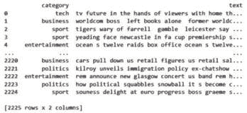
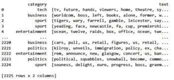
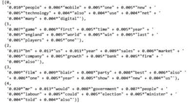
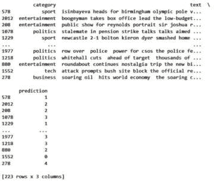
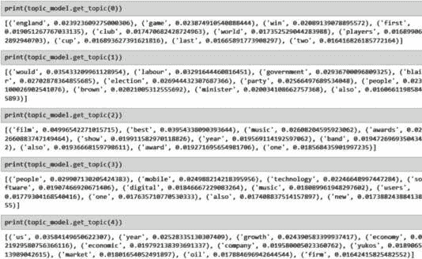
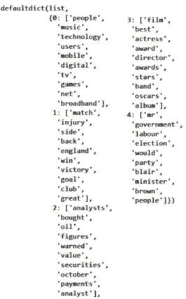

# 6

# 主题建模

在本章中，我们将介绍**主题建模**，即对文本语料库中存在的主题进行分类。主题建模是一种非常有用的技术，可以让我们了解哪些主题出现在文档集中。例如，主题建模用于社交媒体的趋势发现。此外，在许多情况下，将主题建模作为数据集初步数据分析的一部分是有用的，以了解其中包含哪些主题。

有许多不同的算法可以完成这项工作。所有这些算法都试图在不同文本之间找到相似性，并将它们放入几个聚类中。这些不同的聚类表示不同的主题。

在本章中，您将学习如何通过各种技术使用BBC新闻数据集创建和使用主题模型。这个数据集包含以下主题的新闻：政治、体育、商业、科技和娱乐。因此，我们知道在每种情况下，我们需要有五个主题聚类。在现实场景中情况可能并非如此，您将需要估计主题聚类的数量。关于如何做到这一点的一个很好的参考是Andriy Burkov的《百页机器学习书》（第112页）。

本章包含以下食谱：

+   使用**gensim**进行LDA主题建模

+   使用SBERT进行社区检测聚类

+   使用BERT进行K-Means主题建模

+   使用BERTopic进行主题建模

+   使用上下文化的主题模型

# 技术要求

在本章中，我们将使用与[*第4章*](B18411_04.xhtml#_idTextAnchor106)中相同的BBC数据集。数据集位于本书的GitHub仓库中：

[https://github.com/PacktPublishing/Python-Natural-Language-Processing-Cookbook-Second-Edition/blob/main/data/bbc-text.csv](https://github.com/PacktPublishing/Python-Natural-Language-Processing-Cookbook-Second-Edition/blob/main/data/bbc-text.csv)

它也通过Hugging Face提供：

[https://huggingface.co/datasets/SetFit/bbc-news](https://huggingface.co/datasets/SetFit/bbc-news)

注意

本书使用此数据集时已获得研究者的许可。与该数据集相关的原始论文如下：

Derek Greene和Pádraig Cunningham. “在核文档聚类中解决对角优势问题的实用解决方案”，载于第23届国际机器学习会议（ICML’06），2006年。

原始文章文本内容中的所有权利，包括版权，均归BBC所有。

请确保将GitHub上`util`文件夹中的所有Python笔记本下载到您计算机上的`util`文件夹中。您计算机上的目录结构应与GitHub仓库中的设置相匹配。在本章的多个食谱中，我们将访问此目录中的文件。

# 使用gensim进行LDA主题建模

**潜在狄利克雷分配**（**LDA**）是主题建模中最古老的算法之一。它是一种统计生成模型，用于计算不同单词的概率。一般来说，LDA是较长的文本的好模型选择。

我们将使用主主题建模算法之一，LDA，为BBC新闻文本创建一个主题模型。我们知道BBC新闻数据集有五个主题：科技、政治、商业、娱乐和体育。因此，我们将使用五个作为预期的聚类数量。

## 准备工作

我们将使用`gensim`包，它是poetry环境的一部分。您也可以安装`requirements.txt`文件以获取该包。

数据集位于[https://github.com/PacktPublishing/Python-Natural-Language-Processing-Cookbook-Second-Edition/blob/main/data/bbc-text.csv](https://github.com/PacktPublishing/Python-Natural-Language-Processing-Cookbook-Second-Edition/blob/main/data/bbc-text.csv)，应下载到`data`文件夹。

笔记本位于[https://github.com/PacktPublishing/Python-Natural-Language-Processing-Cookbook-Second-Edition/blob/main/Chapter06/6.1_topic_modeling_gensim.ipynb](https://github.com/PacktPublishing/Python-Natural-Language-Processing-Cookbook-Second-Edition/blob/main/Chapter06/6.1_topic_modeling_gensim.ipynb)。

## 如何操作...

LDA模型需要数据是干净的。这意味着需要从文本中删除停用词和其他不必要的标记。这包括数字和标点符号。如果跳过此步骤，可能会出现围绕停用词、数字或标点的主题。

我们将使用`gensim`包中的`simple_preprocess`函数加载数据，清理它并进行预处理。然后我们将创建LDA模型。任何主题模型都需要工程师提前估计主题的数量。我们将使用五个，因为我们知道数据中存在五个主题。有关如何估计主题数量的更多信息，请参阅本章的介绍部分。

步骤如下：

1.  执行必要的导入：

    ```py
    import pandas as pd
    import nltk
    import re
    from nltk.corpus import stopwords
    from gensim.utils import simple_preprocess
    from gensim.models.ldamodel import LdaModel
    import gensim.corpora as corpora
    from pprint import pprint
    from gensim.corpora import MmCorpus
    ```

1.  加载停用词和BBC新闻数据，然后打印生成的数据框。在这里，我们使用NLTK的标准停用词列表。正如我们在[*第4章*](B18411_04.xhtml#_idTextAnchor106)中看到的，在*使用K-Means聚类句子：无监督文本分类*配方中，**said**这个词也被视为这个数据集中的停用词，因此我们必须手动将其添加到列表中。

    ```py
    stop_words = stopwords.words('english')
    stop_words.append("said")
    bbc_df = pd.read_csv("../data/bbc-text.csv")
    print(bbc_df)
    ```

    结果将类似于以下内容：



图6.1 – BBC新闻数据框输出

1.  在这一步中，我们将创建**clean_text**函数。此函数从文本的第一行删除额外的空白，从第二行删除数字。然后它使用来自**gensim**的**simple_preprocess**函数。**simple_preprocess**函数将文本拆分为一个标记列表，将它们转换为小写，并删除过长或过短的标记。然后我们从列表中删除停用词：

    ```py
    def clean_text(input_string):
        input_string = re.sub(r'[^\w\s]', ' ', input_string)
        input_string = re.sub(r'\d', '', input_string)
        input_list = simple_preprocess(input_string)
        input_list = [word for word in input_list if word not in 
            stop_words]
        return input_list
    ```

1.  现在，我们将函数应用于数据。文本列现在包含一个单词列表，这些单词都是小写且没有停用词：

    ```py
    bbc_df['text'] = bbc_df['text'].apply(lambda x: clean_text(x))
    print(bbc_df)
    ```

    结果看起来会类似于这样：



图6.2 – 处理后的BBC新闻输出

在这里，我们将使用`gensim.corpora.Dictionary`类来创建一个从单词到其整数ID的映射。这是为了然后创建文本的词袋表示。然后，使用这个映射，我们创建语料库作为词袋。要了解更多关于词袋概念的信息，请参阅[*第3章*](B18411_03.xhtml#_idTextAnchor067)，*将文档放入词袋中*。在这个配方中，我们不会使用`sklearn`的`CountVectorizer`类，而是使用`gensim`包提供的类：

```py
texts = bbc_df['text'].values
id_dict = corpora.Dictionary(texts)
corpus = [id_dict.doc2bow(text) for text in texts]
```

1.  在这一步，我们将初始化并训练LDA模型。我们将传递预处理和向量化的数据（**corpus**），单词到ID映射（**id_dict**），主题数量，我们将其初始化为五个，块大小和遍历次数。块大小决定了每个训练块中使用的文档数量，遍历次数指定了训练过程中对语料库的遍历次数。您可以尝试这些超参数以查看它们是否可以改进模型。这里使用的参数，每个块100个文档和20次遍历，是通过实验选择的，以产生一个好的模型：

    ```py
    num_topics = 5
    lda_model = LdaModel(corpus=corpus,
                         id2word=id_dict,
                         num_topics=num_topics,
                         chunksize=100,
                         passes=20)
    pprint(lda_model.print_topics())
    ```

    结果会有所不同。我们的输出看起来像这样：



图6.3 – 我们的LDA输出

## 更多内容...

现在，让我们保存模型并将其应用于新的输入：

1.  定义**save_model**函数。要保存模型，我们需要模型本身、我们想要保存它的路径、向量器（**id_dict**）、我们想要保存向量器的路径、语料库以及语料库将被保存的路径。该函数将把这些三个组件保存到它们对应的路径：

    ```py
    def save_model(lda, lda_path, id_dict, dict_path, 
        corpus, corpus_path):
        lda.save(lda_path)
        id_dict.save(dict_path)
        MmCorpus.serialize(corpus_path, corpus)
    ```

1.  使用我们刚刚定义的函数保存模型、单词到ID字典和向量化的语料库：

    ```py
    model_path = "../models/bbc_gensim/lda.model"
    dict_path = "../models/bbc_gensim/id2word.dict"
    corpus_path = "../models/bbc_gensim/corpus.mm"
    save_model(lda_model, model_path, id_dict, dict_path, 
        corpus, corpus_path)
    ```

1.  加载保存的模型：

    ```py
    lda_model = LdaModel.load(model_path)
    id_dict = corpora.Dictionary.load(dict_path)
    ```

1.  定义一个新的示例进行测试。这个示例是关于体育主题的：

    ```py
    new_example = """Manchester United players slumped to the turf
    at full-time in Germany on Tuesday in acknowledgement of what their
    latest pedestrian first-half display had cost them. The 3-2 loss at
    RB Leipzig means United will not be one of the 16 teams in the draw
    for the knockout stages of the Champions League. And this is not the
    only price for failure. The damage will be felt in the accounts, in
    the dealings they have with current and potentially future players
    and in the faith the fans have placed in manager Ole Gunnar Solskjaer.
    With Paul Pogba's agent angling for a move for his client and ex-United
    defender Phil Neville speaking of a "witchhunt" against his former team-mate
    Solskjaer, BBC Sport looks at the ramifications and reaction to a big loss for United."""
    ```

1.  在这一步，我们将使用相同的**clean_text**函数对文本进行预处理，然后将其转换为词袋向量并通过模型运行。预测结果是一个元组列表，其中每个元组的第一个元素是主题编号，第二个元素是文本属于该特定主题的概率。在这个例子中，我们可以看到主题1是最可能的，即体育，这是正确的识别：

    ```py
    input_list = clean_text(new_example)
    bow = id_dict.doc2bow(input_list)
    topics = lda_model[bow]
    print(topics)
    ```

    结果会有所不同。我们的结果看起来像这样：

    ```py
    [(1, 0.7338447), (2, 0.15261793), (4, 0.1073401)]
    ```

# 使用SBERT进行社区检测聚类

在这个配方中，我们将使用**SentenceTransformers**（**SBERT**）包中包含的社区检测算法。SBERT将使我们能够轻松地使用BERT模型对句子进行编码。请参阅[*第3章*](B18411_03.xhtml#_idTextAnchor067)中的*使用BERT和OpenAI嵌入代替词嵌入*配方，以获取有关如何使用句子转换器的更详细解释。

此算法常用于在社交媒体中寻找**社区**，但也可以用于主题建模。此算法的优点是它非常快。它最适合较短的文本，例如在社交媒体上找到的文本。它还只发现文档数据集中的主要主题，而LDA则将所有可用文本进行聚类。社区检测算法的一个用途是寻找社交媒体上的重复帖子。

## 准备工作

在这个配方中，我们将使用SBERT包。它包含在poetry环境中。你也可以通过安装`requirements.txt`文件来一起安装其他包。

笔记本位于[https://github.com/PacktPublishing/Python-Natural-Language-Processing-Cookbook-Second-Edition/blob/main/Chapter06/6.2_community_detection.ipynb](https://github.com/PacktPublishing/Python-Natural-Language-Processing-Cookbook-Second-Edition/blob/main/Chapter06/6.2_community_detection.ipynb)。

## 如何操作...

我们将使用BERT句子转换器模型对文本进行转换，然后对生成的嵌入应用社区检测聚类算法。

1.  执行必要的导入。在这里，你可能需要从NLTK下载停用词语料库。请参阅[*第1章*](B18411_01.xhtml#_idTextAnchor013)中的*移除停用词*配方，以获取有关如何操作的详细说明。

    ```py
    import pandas as pd
    import nltk
    import re
    from nltk.corpus import stopwords
    from sentence_transformers import SentenceTransformer, util
    ```

1.  运行**语言****工具**文件：

    ```py
    %run -i "../util/lang_utils.ipynb"
    ```

1.  加载BBC数据并打印：

    ```py
    bbc_df = pd.read_csv("../data/bbc-text.csv")
    print(bbc_df)
    ```

    结果将看起来像*图6**.1*。

1.  加载模型并创建嵌入。请参阅[*第3章*](B18411_03.xhtml#_idTextAnchor067)中的*使用BERT和OpenAI嵌入代替词嵌入*配方，以获取有关句子嵌入的更多信息。社区检测算法需要嵌入以张量的形式存在；因此，我们必须将**convert_to_tensor**设置为**True**：

    ```py
    model = SentenceTransformer('all-MiniLM-L6-v2')
    embeddings = model.encode(bbc_df["text"], convert_to_tensor=True)
    ```

1.  在这一步，我们将创建聚类。我们将指定相似度的阈值，在0到1的范围内为**0.7**。这将确保生成的社区彼此非常相似。最小社区大小为10；这意味着至少需要10篇新闻文章来形成一个聚类。如果我们想要更大、更通用的聚类，我们应该使用更大的最小社区大小。更细粒度的聚类应使用更小的数字。任何成员数量较少的聚类将不会出现在输出中。结果是列表的列表，其中每个内部列表代表一个聚类，并列出原始数据框中聚类成员的行ID：

    ```py
    clusters = util.community_detection(
        embeddings, threshold=0.7, min_community_size=10)
    print(clusters)
    ```

    结果可能会有所不同，可能看起来像这样：

    ```py
    [[117, 168, 192, 493, 516, 530, 638, 827, 883, 1082, 1154, 1208, 1257, 1359, 1553, 1594, 1650, 1898, 1938, 2059, 2152], [76, 178, 290, 337, 497, 518, 755, 923, 1057, 1105, 1151, 1172, 1242, 1560, 1810, 1813, 1882, 1942, 1981], [150, 281, 376, 503, 758, 900, 1156, 1405, 1633, 1636, 1645, 1940, 1946, 1971], [389, 399, 565, 791, 1014, 1018, 1259, 1288, 1440, 1588, 1824, 1917, 2024], [373, 901, 1004, 1037, 1041, 1323, 1499, 1534, 1580, 1621, 1751, 2178], [42, 959, 1063, 1244, 1292, 1304, 1597, 1915, 2081, 2104, 2128], [186, 193, 767, 787, 1171, 1284, 1625, 1651, 1797, 2148], [134, 388, 682, 1069, 1476, 1680, 2106, 2129, 2186, 2198]]
    ```

1.  在这里，我们将定义一个函数，用于按簇打印最常见的单词。我们将使用社区检测算法创建的簇和原始数据框。对于每个簇，我们首先选择代表它的句子，然后使用 **get_most_frequent_words** 函数获取最常见的单词，该函数我们在 [*第4章*](B18411_04.xhtml#_idTextAnchor106) 的 *使用 K-Means 对句子进行聚类：无监督文本分类* 菜谱中定义。此函数也位于我们在第二步中运行的 **lang_utils** 笔记本中：

    ```py
    def print_words_by_cluster(clusters, input_df):
        for i, cluster in enumerate(clusters):
            print(f"\nCluster {i+1}, {len(cluster)} elements ")
            sentences = input_df.iloc[cluster]["text"]
            all_text = " ".join(sentences)
            freq_words = get_most_frequent_words(all_text)
            print(freq_words)
    ```

1.  现在，使用该函数对模型输出（**截断**）进行处理。我们可以看到，与原始 BBC 数据集中的五个主题相比，有更多具体的簇：

    ```py
    Cluster 1, 21 elements
    ['mr', 'labour', 'brown', 'said', 'blair', 'election', 'minister', 'prime', 'chancellor', 'would', 'party', 'new', 'campaign', 'told', 'government', ...]
    Cluster 2, 19 elements
    ['yukos', 'us', 'said', 'russian', 'oil', 'gazprom', 'court', 'rosneft', 'russia', 'yugansk', 'company', 'bankruptcy', 'auction', 'firm', 'unit', ...]
    Cluster 3, 14 elements
    ['kenteris', 'greek', 'thanou', 'iaaf', 'said', 'athens', 'tests', 'drugs', 'olympics', 'charges', 'also', 'decision', 'test', 'athletics', 'missing', ...]
    Cluster 4, 13 elements
    ['mr', 'tax', 'howard', 'labour', 'would', 'said', 'tory', 'election', 'government', 'taxes', 'blair', 'spending', 'tories', 'party', 'cuts',...]
    Cluster 5, 12 elements
    ['best', 'film', 'aviator', 'director', 'actor', 'foxx', 'swank', 'actress', 'baby', 'million', 'dollar', 'said', 'win', 'eastwood', 'jamie',...]
    Cluster 6, 11 elements
    ['said', 'prices', 'market', 'house', 'uk', 'figures', 'mortgage', 'housing', 'year', 'lending', 'november', 'price', 'december', 'rise', 'rose', ...]
    Cluster 7, 10 elements
    ['lse', 'deutsche', 'boerse', 'bid', 'euronext', 'said', 'exchange', 'london', 'offer', 'stock', 'would', 'also', 'shareholders', 'german', 'market',...]
    Cluster 8, 10 elements
    ['dollar', 'us', 'euro', 'said', 'currency', 'deficit', 'analysts', 'trading', 'yen', 'record', 'exports', 'economic', 'trade', 'markets', 'european',...]
    ```

# 使用 BERT 进行 K-Means 主题建模

在这个菜谱中，我们将使用 K-Means 算法进行无监督主题分类，使用 BERT 嵌入对数据进行编码。这个菜谱与 [*第4章*](B18411_04.xhtml#_idTextAnchor106) 中的 *使用 K-Means 对句子进行聚类 – 无监督文本分类* 菜谱有许多相似之处。

K-Means 算法用于找到任何类型数据的相似簇，并且是查看数据趋势的一种简单方法。在进行初步数据分析时，它经常被用来快速检查数据集中出现的数据类型。我们可以使用它与文本数据，并使用句子转换器模型对数据进行编码。

## 准备工作

我们将使用 `sklearn.cluster.KMeans` 对象进行无监督聚类，以及使用 HuggingFace `sentence transformers`。这两个包都是 poetry 环境的一部分。

笔记本位于 [https://github.com/PacktPublishing/Python-Natural-Language-Processing-Cookbook-Second-Edition/blob/main/Chapter06/6.3-kmeans_with_bert.ipynb](https://github.com/PacktPublishing/Python-Natural-Language-Processing-Cookbook-Second-Edition/blob/main/Chapter06/6.3-kmeans_with_bert.ipynb)。

## 如何操作...

在这个菜谱中，我们将加载 BBC 数据集，并使用句子转换器包对其进行编码。然后，我们将使用 K-Means 聚类算法创建五个簇。之后，我们将对测试集进行模型测试，以查看它在未见数据上的表现如何：

1.  执行必要的导入：

    ```py
    import re
    import string
    import pandas as pd
    from sklearn.model_selection import train_test_split
    from sklearn.cluster import KMeans
    from nltk.probability import FreqDist
    from nltk.corpus import stopwords
    from sentence_transformers import SentenceTransformer
    ```

1.  运行语言工具文件。这将使我们能够在这个菜谱中重用 **print_most_common_words_by_cluster** 函数：

    ```py
    %run -i "../util/lang_utils.ipynb"
    ```

1.  读取并打印数据：

    ```py
    bbc_df = pd.read_csv("../data/bbc-text.csv")
    print(bbc_df)
    ```

    结果应该看起来像 *图6**.1* 中的那样。

1.  在这一步中，我们将数据分为 **训练** 和 **测试**。我们将测试集的大小限制为整个数据集的 10%。训练集的长度为 2002，测试集的长度为 223：

    ```py
    bbc_train, bbc_test = train_test_split(bbc_df, test_size=0.1)
    print(len(bbc_train))
    print(len(bbc_test))
    ```

    结果将如下所示：

    ```py
    2002
    223
    ```

1.  在这里，我们将把文本列表分配给**documents**变量。然后，我们将读取**all-MiniLM-L6-v2**模型用于句子嵌入并编码文本数据。接下来，我们将初始化一个具有五个聚类的KMeans模型，将**n_init**参数设置为**auto**，这决定了算法运行的次数。我们还将**init**参数设置为**k-means++**。此参数确保算法更快地收敛。然后我们将训练初始化后的模型：

    ```py
    documents = bbc_train['text'].values
    model = SentenceTransformer('all-MiniLM-L6-v2')
    encoded_data = model.encode(documents)
    km = KMeans(n_clusters=5, n_init='auto', init='k-means++')
    km.fit(encoded_data)
    ```

1.  按主题打印出最常见的单词：

    ```py
    print_most_common_words_by_cluster(documents, km, 5)
    ```

    结果可能会有所不同；我们的结果如下所示：

    ```py
    0
    ['said', 'people', 'new', 'also', 'mr', 'technology', 'would', 'one', 'mobile', ...]
    1
    ['said', 'game', 'england', 'first', 'win', 'world', 'last', 'would', 'one', 'two', 'time',...]
    2
    ['said', 'film', 'best', 'music', 'also', 'year', 'us', 'one', 'new', 'awards', 'show',...]
    3
    ['said', 'mr', 'would', 'labour', 'government', 'people', 'blair', 'party', 'election', 'also', 'minister', ...]
    4
    ['said', 'us', 'year', 'mr', 'would', 'also', 'market', 'company', 'new', 'growth', 'firm', 'economy', ...]
    ```

    我们可以看到，主题的映射如下：0是技术，1是体育，2是娱乐，3是政治，4是商业。

1.  现在，我们可以使用测试数据来查看模型在未见数据上的表现如何。首先，我们必须在测试数据框中创建一个预测列，并用每个测试输入的聚类编号填充它：

    ```py
    bbc_test["prediction"] = bbc_test["text"].apply(
        lambda x: km.predict(model.encode([x]))[0])
    print(bbc_test)
    ```

    结果可能会有所不同；这是我们的输出：



图6.4 – 在测试数据框上运行K-Means的结果

1.  现在，我们将创建一个聚类编号和主题名称之间的映射，这是我们通过查看每个聚类的最频繁单词手动发现的。然后，我们将使用映射和之前步骤中创建的**prediction**列，为测试集中的每个文本创建一个预测的主题名称列。现在，我们可以比较模型的预测与数据的真实值。我们将使用**sklearn**中的**classification_report**函数获取相应的统计数据。最后，我们将打印出预测的分类报告：

    ```py
    topic_mapping = {0:"tech", 1:"sport",
        2:"entertainment", 3:"politics", 4:"business"}
    bbc_test["pred_category"] = bbc_test["prediction"].apply(
        lambda x: topic_mapping[x])
    print(classification_report(bbc_test["category"],
        bbc_test["pred_category"]))
    ```

    结果将如下所示：

    ```py
                   precision    recall  f1-score   support
         business       0.98      0.96      0.97        55
    entertainment       0.95      1.00      0.97        38
         politics       0.97      0.93      0.95        42
            sport       0.98      0.96      0.97        47
             tech       0.93      0.98      0.95        41
         accuracy                           0.96       223
        macro avg       0.96      0.97      0.96       223
     weighted avg       0.96      0.96      0.96       223
    ```

    分数非常高——几乎完美。其中大部分归功于我们使用的句子嵌入模型的质量。

1.  定义一个新的示例：

    ```py
    new_example = """Manchester United players slumped to the turf
    at full-time in Germany on Tuesday in acknowledgement of what their
    latest pedestrian first-half display had cost them. The 3-2 loss at
    RB Leipzig means United will not be one of the 16 teams in the draw
    for the knockout stages of the Champions League. And this is not the
    only price for failure. The damage will be felt in the accounts, in
    the dealings they have with current and potentially future players
    and in the faith the fans have placed in manager Ole Gunnar Solskjaer.
    With Paul Pogba's agent angling for a move for his client and ex-United
    defender Phil Neville speaking of a "witchhunt" against his former team-mate
    Solskjaer, BBC Sport looks at the ramifications and reaction to a big loss for United."""
    ```

1.  打印新示例的预测：

    ```py
    predictions = km.predict(model.encode([new_example]))
    print(predictions[0])
    ```

    输出将如下所示：

    ```py
    1
    ```

聚类编号1对应于体育，这是正确的分类。

# 使用BERTopic进行主题建模

在这个示例中，我们将探索BERTopic包，它提供了许多不同且通用的工具用于主题建模和可视化。如果你想要对创建的主题聚类进行不同的可视化，它特别有用。这个主题建模算法使用BERT嵌入来编码数据，因此得名“BERT”。你可以在[https://maartengr.github.io/BERTopic/algorithm/algorithm.html](https://maartengr.github.io/BERTopic/algorithm/algorithm.html)了解更多关于该算法及其组成部分的信息。

默认情况下，BERTopic包使用HDBSCAN算法以无监督的方式从数据中创建聚类。您可以在[https://hdbscan.readthedocs.io/en/latest/how_hdbscan_works.html](https://hdbscan.readthedocs.io/en/latest/how_hdbscan_works.html)了解更多关于HDBSCAN算法的工作原理。然而，也可以自定义BERTopic对象的内部工作方式以使用其他算法。还可以将其管道中的其他自定义组件替换掉。在本配方中，我们将使用默认设置，您也可以尝试其他组件。

最终生成的主题质量非常高。这可能有几个原因。其中之一是使用BERT嵌入的结果，我们曾在[*第4章*](B18411_04.xhtml#_idTextAnchor106)中看到，它对分类结果产生了积极影响。

## 准备工作

我们将使用BERTopic包为BBC数据集创建主题模型。该包包含在poetry环境中，也是`requirements.txt`文件的一部分。

笔记本位于[https://github.com/PacktPublishing/Python-Natural-Language-Processing-Cookbook-Second-Edition/blob/main/Chapter06/6.3-kmeans_with_bert.ipynb](https://github.com/PacktPublishing/Python-Natural-Language-Processing-Cookbook-Second-Edition/blob/main/Chapter06/6.3-kmeans_with_bert.ipynb)。

## 如何操作...

在本配方中，我们将加载BBC数据集并再次对其进行预处理。预处理步骤将包括分词和移除停用词。然后我们将使用BERTopic创建主题模型并检查结果。我们还将对未见过的数据进行主题模型测试，并使用`classification_report`查看准确度统计信息：

1.  执行必要的导入：

    ```py
    import pandas as pd
    import numpy as np
    from bertopic import BERTopic
    from sklearn.model_selection import train_test_split
    from sklearn.metrics import classification_report
    ```

1.  运行语言工具文件：

    ```py
    %run -i "../util/lang_utils.ipynb"
    ```

1.  定义和修改停用词，然后读取BBC数据：

    ```py
    stop_words = stopwords.words('english')
    stop_words.append("said")
    stop_words.append("mr")
    bbc_df = pd.read_csv("../data/bbc-text.csv")
    ```

    在这一步，我们将预处理数据。我们首先使用NLTK中的`word_tokenize`方法进行分词，正如在[*第1章*](B18411_01.xhtml#_idTextAnchor013)中的*将句子分割成单词 – 分词*配方所示。然后移除停用词，最后将文本重新组合成一个字符串。我们必须执行最后一步，因为BERTopic使用的是句子嵌入模型，该模型需要一个字符串，而不是单词列表：

    ```py
    bbc_df["text"] = bbc_df["text"].apply(
        lambda x: word_tokenize(x))
    bbc_df["text"] = bbc_df["text"].apply(
        lambda x: [w for w in x if w not in stop_words])
    bbc_df["text"] = bbc_df["text"].apply(lambda x: " ".join(x))
    ```

1.  在这里，我们将数据集分为训练集和测试集，指定测试集的大小为10%。因此，我们将得到2002个训练数据点和223个测试数据点：

    ```py
    bbc_train, bbc_test = train_test_split(bbc_df, test_size=0.1)
    print(len(bbc_train))
    print(len(bbc_test))
    ```

    结果将如下所示：

    ```py
    2002
    223
    ```

1.  从数据框中提取文本列表：

    ```py
    docs = bbc_train["text"].values
    ```

1.  在这一步，我们将初始化**BERTopic**对象，然后将其拟合到在*步骤6*中提取的文档上。我们将指定要生成的主题数量为六个，比我们寻找的五个多一个。这是因为BERTopic与其他主题建模算法的一个关键区别在于它有一个特殊的**丢弃**主题，编号为-1。我们也可以指定更多的主题数量。在这种情况下，它们将比商业、政治、娱乐、科技和体育这五大类别更窄：

    ```py
    topic_model = BERTopic(nr_topics=6)
    topics, probs = topic_model.fit_transform(docs)
    ```

1.  在这里，我们将打印出结果主题模型的信息。除了**丢弃**主题外，主题与人类标注员分配的黄金标签很好地对齐。该函数打印出每个主题的最具代表性的单词，以及最具代表性的文档：

    ```py
    print(topic_model.get_topic_info())
    ```

    结果会有所不同；这里是一个示例结果：

    ```py
       Topic  Count                                 Name  \
    0     -1    222             -1_also_company_china_us
    1      0    463             0_england_game_win_first
    2      1    393      1_would_labour_government_blair
    3      2    321             2_film_best_music_awards
    4      3    309  3_people_mobile_technology_software
    5      4    294             4_us_year_growth_economy
                                          Representation  \
    0  [also, company, china, us, would, year, new, p...
    1  [england, game, win, first, club, world, playe...
    2  [would, labour, government, blair, election, p...
    3  [film, best, music, awards, show, year, band, ...
    4  [people, mobile, technology, software, digital...
    5  [us, year, growth, economy, economic, company,...
                                     Representative_Docs
    0  [us retail sales surge december us retail sale...
    1  [ireland win eclipses refereeing errors intern...
    2  [lib dems unveil election slogan liberal democ...
    3  [scissor sisters triumph brits us band scissor...
    4  [mobiles media players yet mobiles yet ready a...
    5  [consumer spending lifts us growth us economic...
    ```

1.  在这一步，我们将打印出主题。我们可以从单词中看到，零号主题是体育，第一个主题是政治，第二个主题是娱乐，第三个主题是科技，第四个主题是商业。



图6.5 – BERTopic生成的主题

1.  在这一步，我们将使用**generate_topic_labels**函数生成主题标签。我们将输入用于主题标签的单词数量，分隔符（在这种情况下，这是一个下划线），以及是否包含主题编号。结果，我们将得到一个主题名称列表。我们可以从生成的主题中看到，我们可以将*would*作为停用词包括在内：

    ```py
    topic_model.generate_topic_labels(
        nr_words=5, topic_prefix=True, separator='_')
    ```

    结果将与以下类似：

    ```py
    ['-1_also_company_china_us_would',
     '0_england_game_win_first_club',
     '1_would_labour_government_blair_election',
     '2_film_best_music_awards_show',
     '3_people_mobile_technology_software_digital',
     '4_us_year_growth_economy_economic']
    ```

1.  在这里，我们将定义一个**get_prediction**函数，该函数为我们提供文本输入和相应模型的主题编号。该函数转换输入文本，并输出一个包含两个列表的元组。一个是主题编号列表，另一个是分配给每个主题的概率列表。列表按最可能的主题顺序排序，因此我们可以取第一个列表的第一个元素作为预测的主题并返回它：

    ```py
    def get_prediction(input_text, model):
        pred = model.transform(input_text)
        pred = pred[0][0]
        return pred
    ```

1.  在这一步，我们将在测试数据框中定义一个用于预测的列，然后使用我们在上一步定义的函数为数据框中的每个文本获取预测。然后我们将创建一个主题编号到黄金主题标签的映射，我们可以用它来测试主题模型的有效性：

    ```py
    bbc_test["prediction"] = bbc_test["text"].apply(
        lambda x: get_prediction(x, topic_model))
    topic_mapping = {0:"sport", 1:"politics",
        2:"entertainment", 3:"tech", 4:"business", -1:"discard"}
    ```

1.  在这里，我们将在测试数据框中创建一个新列，用于记录使用我们创建的映射预测的主题名称。然后我们将过滤测试集，只使用那些未被预测为丢弃主题-1的条目：

    ```py
    bbc_test["pred_category"] = bbc_test["prediction"].apply(
        lambda x: topic_mapping[x])
    test_data = bbc_test.loc[bbc_test['prediction'] != -1]
    print(classification_report(test_data["category"],
        test_data["pred_category"]))
    ```

    结果将与这个类似：

    ```py
                   precision    recall  f1-score   support
         business       0.95      0.86      0.90        21
    entertainment       0.97      1.00      0.98        30
         politics       0.94      1.00      0.97        46
            sport       1.00      1.00      1.00        62
             tech       0.96      0.88      0.92        25
         accuracy                           0.97       184
        macro avg       0.96      0.95      0.95       184
     weighted avg       0.97      0.97      0.97       184
    ```

    测试分数非常高。这反映了编码模型，BERTopic模型，它也是一个句子转换模型，就像之前的食谱中一样。

1.  在这一步，我们将定义一个新的示例来测试模型并打印它。我们将使用**pandas**包中的**iloc**函数来访问**bbc_test**数据框的第一个元素：

    ```py
    new_input = bbc_test["text"].iloc[0]
    print(new_input)
    howard dismisses tory tax fears michael howard dismissed fears conservatives plans £4bn tax cuts modest . defended package saying plan tories first budget hoped able go . tories monday highlighted £35bn wasteful spending would stop allow tax cuts reduced borrowing spending key services . ...
    ```

    这个例子是关于政治的，应该是主题1。

1.  从模型中获得预测并打印出来：

    ```py
    print(topic_model.transform(new_input))
    ```

    结果将是一个正确的预测：

    ```py
    ([1], array([1.]))
    ```

## 更多内容...

现在，我们可以找到与特定单词、短语或句子相似的主题。这样，我们就可以轻松地找到在数据集中与文本相对应的主题。我们将使用一个单词、一个短语和一个句子来查看模型如何展示相应的主题：

1.  使用相应的相似度分数找到与**体育**这个词最相似的主题。将主题编号和相似度分数组合成一个元组列表并打印它们。元组是输入文本与特定主题之间的主题编号和相似度分数的组合：

    ```py
    topics, similarity = topic_model.find_topics("sports", top_n=5)
    sim_topics = list(zip(topics, similarity))
    print(sim_topics)
    ```

    最相似的主题是主题0，它是体育类：

    ```py
    [(0, 0.29033981040460977), (3, 0.049293092462828376), (-1, -0.0047265937178774895), (2, -0.02074380026102955), (4, -0.03699168959416969)]
    ```

1.  重复前面的步骤，对**商业与经济**示例短语进行操作：

    ```py
    topics, similarity = topic_model.find_topics(
        "business and economics",
        top_n=5)
    sim_topics = list(zip(topics, similarity))
    print(sim_topics)
    ```

    在这里，最相似的主题是主题4，它是商业类：

    ```py
    [(4, 0.29003573983158404), (-1, 0.26259758927249205), (3, 0.15627005753581313), (1, 0.05491237184012845), (0, 0.010567363445904386)]
    ```

1.  现在重复以下示例句子的相同过程：**"YouTube删除了一段公开披露频道是否获得广告分成、模糊了哪些创作者从平台上获益最多的代码片段。"**。我们预计这最相似于技术主题：

    ```py
    input_text = """YouTube removed a snippet of code that publicly disclosed whether a channel receives ad payouts,
    obscuring which creators benefit most from the platform."""
    topics, similarity = topic_model.find_topics(
        input_text, top_n=5)
    sim_topics = list(zip(topics, similarity))
    print(sim_topics)
    ```

    在输出中，我们可以看到最相似的主题是主题3，它是技术类：

    ```py
    [(3, 0.2540850599909866), (-1, 0.172097560474608), (2, 0.1367798346494483), (4, 0.10243553209139492), (1, 0.06954579004136925)]
    ```

# 使用上下文主题模型

在这个菜谱中，我们将探讨另一个主题模型算法：上下文主题模型。为了产生更有效的主题模型，它将嵌入与词袋文档表示相结合。

我们将向您展示如何使用训练好的主题模型，并输入其他语言的数据。这个特性特别有用，因为我们可以在一种语言中创建一个主题模型，例如，拥有许多资源的语言，然后将其应用于资源较少的另一种语言。为了实现这一点，我们将利用多语言嵌入模型来编码数据。

## 准备工作

我们需要`contextualized-topic-models`包来完成这个菜谱。它是poetry环境的一部分，并在`requirements.txt`文件中。

笔记本位于[https://github.com/PacktPublishing/Python-Natural-Language-Processing-Cookbook-Second-Edition/blob/main/Chapter06/6.5-contextualized-tm.ipynb](https://github.com/PacktPublishing/Python-Natural-Language-Processing-Cookbook-Second-Edition/blob/main/Chapter06/6.5-contextualized-tm.ipynb)。

## 如何操作...

在这个菜谱中，我们将加载数据，然后将其分为句子，预处理它，并使用**gsdmm**模型将句子聚类为主题。如果您想了解更多关于算法的信息，请参阅[https://pypi.org/project/contextualized-topic-models/](https://pypi.org/project/contextualized-topic-models/)的包文档。

1.  执行必要的导入：

    ```py
    import pandas as pd
    from nltk.corpus import stopwords
    from contextualized_topic_models.utils.preprocessing import( 
        WhiteSpacePreprocessingStopwords)
    from contextualized_topic_models.models.ctm import ZeroShotTM
    from contextualized_topic_models.utils.data_preparation import( 
        TopicModelDataPreparation)
    ```

1.  抑制警告：

    ```py
    import warnings
    warnings.filterwarnings('ignore')
    warnings.filterwarnings("ignore", category = DeprecationWarning)
    import os
    os.environ["TOKENIZERS_PARALLELISM"] = "false"
    ```

1.  创建停用词列表并读取数据：

    ```py
    stop_words = stopwords.words('english')
    stop_words.append("said")
    bbc_df = pd.read_csv("../data/bbc-text.csv")
    ```

1.  在这一步，我们将创建预处理对象并使用它来预处理文档。**contextualized-topic-models**包提供了不同的预处理程序，这些程序准备数据以用于主题模型算法。这个预处理程序对文档进行分词，移除停用词，并将它们放回字符串中。它返回预处理文档的列表、原始文档的列表、数据集词汇表以及原始数据框中的文档索引列表：

    ```py
    documents = bbc_df["text"]
    preprocessor = WhiteSpacePreprocessingStopwords(
        documents, stopwords_list=stop_words)
    preprocessed_documents,unpreprocessed_documents,vocab,indices =\
        preprocessor.preprocess()
    ```

1.  在这里，我们将创建**TopicModelDataPreparation**对象。我们将传递嵌入模型名称作为参数。这是一个多语言模型，可以将文本编码成各种语言并取得良好的效果。然后我们将它在文档上拟合。它使用嵌入模型将文本转换为嵌入，并创建一个词袋模型。输出是一个**CTMDataset**对象，它代表了主题模型训练算法所需格式的训练数据集：

    ```py
    tp = TopicModelDataPreparation(
        "distiluse-base-multilingual-cased")
    training_dataset = tp.fit(
        text_for_contextual=unpreprocessed_documents,
        text_for_bow=preprocessed_documents)
    ```

1.  在这一步，我们将使用**ZeroShotTM**对象创建主题模型。术语**zero shot**意味着该模型对文档没有任何先验信息。我们将输入词袋模型的词汇量大小、嵌入向量的大小、主题数量（**n_components**参数）以及训练模型所需的轮数。我们将使用五个主题，因为BBC数据集有那么多主题。当你将此算法应用于你的数据时，你需要对不同数量的主题进行实验。最后，我们将初始化的主题模型拟合到训练数据集上：

    ```py
    ctm = ZeroShotTM(bow_size=len(tp.vocab),
        contextual_size=512, n_components=5,
        num_epochs=100)
    ctm.fit(training_dataset)
    ```

1.  在这里，我们将检查主题。我们可以看到它们很好地与黄金标签匹配。主题0是科技，主题1是体育，主题2是商业，主题3是娱乐，主题4是政治：

    ```py
    ctm.get_topics()
    ```

    结果会有所不同；这是我们得到的结果：



图6.6 – 上下文主题模型输出

1.  现在，我们将初始化一个新的新闻稿件，这次使用西班牙语，以查看基于英语文档训练的主题模型在另一种语言的新闻文章上的效果如何。这篇特定的新闻稿件应该属于科技主题。我们将使用**TopicModelDataPreparation**对象对其进行预处理。为了然后在编码后的文本上使用该模型，我们需要创建一个数据集对象。这就是为什么我们必须将西班牙语新闻稿件包含在一个列表中，然后传递给数据准备过程。最后，我们必须将数据集（仅包含一个元素）通过模型传递：

    ```py
    spanish_news_piece = """IBM anuncia el comienzo de la "era de la utilidad cuántica" y anticipa un superordenador en 2033.
    La compañía asegura haber alcanzado un sistema de computación que no se puede simular con procedimientos clásicos."""
    testing_dataset = tp.transform([spanish_news_piece])
    ```

1.  在这一步，我们将获取之前步骤中创建的测试数据集的主题分布。结果是列表的列表，其中每个单独的列表代表特定文本属于该主题的概率。这些概率在单独的列表中与主题编号具有相同的索引：

    ```py
    ctm.get_doc_topic_distribution(testing_dataset)
    ```

    在这种情况下，最高的概率是主题0，这确实是科技：

    ```py
    array([[0.5902461,0.09361929,0.14041995,0.07586181,0.0998529 ]],
          dtype=float32)
    ```

## 参见

想了解更多关于上下文相关主题模型的信息，请参阅[https://contextualized-topic-models.readthedocs.io/en/latest/index.html](https://contextualized-topic-models.readthedocs.io/en/latest/index.html).
