# 第七章：可视化文本数据

本章致力于创建用于 NLP 工作不同方面的可视化，其中许多我们在前面的章节中已经完成。在处理 NLP 任务时，可视化非常重要，因为它们帮助我们更容易地看到已完成工作的整体情况。

我们将创建不同类型的可视化，包括语法细节、词性和主题模型的可视化。完成本章后，你将能够创建引人入胜的图像来展示和解释各种 NLP 任务的输出。

本章中你可以找到以下食谱：

+   可视化依存句法

+   可视化词性

+   可视化 NER

+   创建混淆矩阵图

+   构建词云

+   从 Gensim 可视化主题

+   从 BERTopic 可视化主题

# 技术要求

本章我们将使用以下包：`spacy`、`matplotlib`、`wordcloud` 和 `pyldavis`。它们是 `poetry` 环境和 `requirements.txt` 文件的一部分。

本章我们将使用两个数据集。第一个是 BBC 新闻数据集，位于[https://github.com/PacktPublishing/Python-Natural-Language-Processing-Cookbook-Second-Edition/tree/main/data/bbc_train.json](https://github.com/PacktPublishing/Python-Natural-Language-Processing-Cookbook-Second-Edition/tree/main/data/bbc_train.json)和[https://github.com/PacktPublishing/Python-Natural-Language-Processing-Cookbook-Second-Edition/tree/main/data/bbc_test.json](https://github.com/PacktPublishing/Python-Natural-Language-Processing-Cookbook-Second-Edition/tree/main/data/bbc_test.json)。

注意

本书使用此数据集已获得研究者的许可。与此数据集相关的原始论文如下：

Derek Greene 和 Pádraig Cunningham. “Kernel 文档聚类中对角优势问题的实用解决方案，”在 2006 年第 23 届国际机器学习会议 (ICML’06) 上发表。

原始文章文本内容的版权等所有权利均归 BBC 所有。

第二个是 Sherlock Holmes 文本，位于[https://github.com/PacktPublishing/Python-Natural-Language-Processing-Cookbook-Second-Edition/tree/main/data/sherlock_holmes.txt](https://github.com/PacktPublishing/Python-Natural-Language-Processing-Cookbook-Second-Edition/tree/main/data/sherlock_holmes.txt)。

# 可视化依存句法

在这个食谱中，我们将学习如何使用 `displaCy` 库并可视化依存句法。它展示了文本中单词之间的语法关系，通常是一句话。

关于如何创建依存句法的详细信息可以在[*第2章*](B18411_02.xhtml#_idTextAnchor042)中找到，在*获取依存句法*食谱中。我们将创建两个可视化，一个用于短文本，另一个用于长多句文本。

完成这个食谱后，你将能够创建具有不同格式化选项的语法结构可视化。

## 准备工作

`displaCy` 库是 `spacy` 包的一部分。为了让 `displaCy` 正常工作，您至少需要 `spacy` 包的 2.0.12 版本。`poetry` 环境和 `requirements.txt` 中的版本是 3.6.1。

笔记本位于 [https://github.com/PacktPublishing/Python-Natural-Language-Processing-Cookbook-Second-Edition/blob/main/Chapter07/7.1_dependency_parse.ipynb](https://github.com/PacktPublishing/Python-Natural-Language-Processing-Cookbook-Second-Edition/blob/main/Chapter07/7.1_dependency_parse.ipynb)。

## 如何操作...

为了可视化依赖关系解析，我们将使用 `displaCy` 包的功能首先显示一个句子，然后一起显示两个句子：

1.  导入必要的包：

    ```py
    import spacy
    from spacy import displacy
    ```

1.  运行语言工具文件：

    ```py
    %run -i "../util/lang_utils.ipynb"
    ```

1.  定义输入文本并使用小型模型进行处理：

    ```py
    input_text = "I shot an elephant in my pajamas."
    doc = small_model(input_text)
    ```

1.  现在，我们将定义不同的可视化选项。`render` 命令，我们将这些选项作为参数提供。我们将 `jupyter` 参数设置为 `True` 以确保在笔记本中正确可视化。对于非 Jupyter 可视化，您可以省略此参数。我们将 `style` 参数设置为 `'dep'`，因为我们希望得到依赖关系解析输出。输出是依赖关系解析的视觉表示：

    ```py
    options = {"add_lemma": True,
            "compact": True,
            "color": "green",
            "collapse_punct": True,
            "arrow_spacing": 20,
            "bg": "#FFFFE6",
            "font": "Times",
            "distance": 120}
    displacy.render(doc, style='dep', options=options, jupyter=True)
    ```

输出显示在 *图 7**.1* 中。

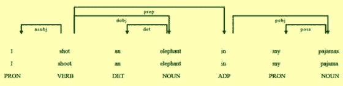

图 7.1 – 依赖关系解析可视化

1.  在这一步，我们将可视化保存到文件中。我们首先从 **pathlib** 包中导入 **Path** 对象。然后初始化一个字符串，其中包含我们想要保存文件的路径，并创建一个 **Path** 对象。我们使用相同的 **render** 命令，这次将输出保存到变量中，并将 **jupyter** 参数设置为 **False**。然后我们使用 **output_path** 对象将输出写入相应的文件：

    ```py
    from pathlib import Path
    path = "../data/dep_parse_viz.svg"
    output_path = Path(path)
    svg = displacy.render(doc, style="dep", jupyter=False)
    output_path.open("w", encoding="utf-8").write(svg)
    ```

    这将创建依赖关系解析并将其保存到 `../data/dep_parse_viz.svg`。

1.  现在，让我们定义一个较长的文本，并使用小型模型进行处理。这样，我们将能够看到 **displaCy** 如何处理较长的文本：

    ```py
    input_text_list = "I shot an elephant in my pajamas. I hate it 
        when elephants wear my pajamas."
    doc = small_model(input_text_list)
    ```

1.  在这里，我们可视化新文本。这次，我们必须输入从处理后的 **spacy** 对象中提取的句子列表，以表明存在多个句子：

    ```py
    displacy.render(list(doc.sents), style='dep', options=options, 
        jupyter=True)
    ```

    输出应该看起来像 *图 7**.2* 中的那样。我们看到第二个句子的输出从新的一行开始。

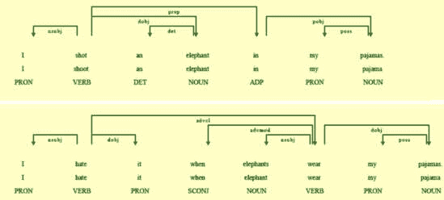

图 7.2 – 几个句子的依赖关系解析可视化

# 可视化词性

在这个菜谱中，我们可视化词性计数。具体来说，我们统计了《福尔摩斯探案集》中不定式和过去或现在动词的数量。这可以让我们了解文本主要讲述的是过去还是现在的事件。我们可以想象，类似的工具可以用来评估文本的质量；例如，形容词很少但名词很多的书籍可能不适合作为小说。

在完成这个配方后，您将能够使用`matplotlib`包创建不同动词类型的条形图，这些动词是用`spacy`包标记的。

## 准备工作

我们将使用`spacy`包进行文本分析，并使用`matplotlib`包创建图表。它们是`poetry`环境的一部分，并在`requirements.txt`文件中。

笔记本位于[https://github.com/PacktPublishing/Python-Natural-Language-Processing-Cookbook-Second-Edition/blob/main/Chapter07/7.2_parts_of_speech.ipynb](https://github.com/PacktPublishing/Python-Natural-Language-Processing-Cookbook-Second-Edition/blob/main/Chapter07/7.2_parts_of_speech.ipynb)。

## 如何操作...

我们将创建一个函数，该函数将按时态计数动词的数量，并在条形图上绘制每个时态：

1.  导入必要的包：

    ```py
    import spacy
    import matplotlib.pyplot as plt
    ```

1.  运行文件和语言实用工具文件。语言实用工具笔记本加载**spacy**模型，文件实用工具笔记本加载**read_text_file**函数：

    ```py
    %run -i "../util/lang_utils.ipynb"
    %run -i "../util/file_utils.ipynb"
    ```

1.  加载《福尔摩斯探案集》的文本：

    ```py
    text_file = "../data/sherlock_holmes.txt"
    text = read_text_file(text_file)
    ```

1.  在这里，我们定义动词标记列表，一个用于现在时，一个用于过去时。我们没有定义另一个列表，但在下一步中使用它，那就是不定式动词，它只有一个标记，**VB**。如果您已经完成了[*第1章*](B18411_01.xhtml#_idTextAnchor013)中的*词性标注*配方，您会注意到标记与那里使用的**spacy**标记不同。这些标记更详细，并使用**tag_**属性而不是在简化标记集中使用的**pos_**属性：

    ```py
    past_tags = ["VBD", "VBN"]
    present_tags = ["VBG", "VBP", "VBZ"]
    ```

1.  在这一步中，我们创建**visualize_verbs**函数。该函数的输入是文本和**spacy**模型。我们检查每个标记的**tag_**属性，并将现在式、过去式和不定式动词的数量添加到字典中。然后我们使用**pyplot**接口将这些数量绘制成条形图。我们使用**bar**函数定义条形图。第一个参数列出条形的*x*坐标。下一个参数是条形的高度列表。我们还设置了**align**参数为“center”，并使用**color**参数提供了条形的颜色。**xticks**函数设置*x*轴的标签。最后，我们使用**show**函数显示生成的图表：

    ```py
    def visualize_verbs(text, nlp):
        doc = nlp(text)
        verb_dict = {"Inf":0, "Past":0, "Present":0}
        for token in doc:
            if (token.tag_ == "VB"):
                verb_dict["Inf"] = verb_dict["Inf"] + 1
            if (token.tag_ in past_tags):
                verb_dict["Past"] = verb_dict["Past"] + 1
            if (token.tag_ in present_tags):
                verb_dict["Present"] = verb_dict["Present"] + 1
        plt.bar(range(len(verb_dict)),
            list(verb_dict.values()), align='center',
            color=["red", "green", "blue"])
        plt.xticks(range(len(verb_dict)),
            list(verb_dict.keys()))
        plt.show()
    ```

1.  在《福尔摩斯探案集》的文本上运行**visualize_verbs**函数，使用小的**spacy**模型：

    ```py
    visualize_verbs(text, small_model)
    ```

    这将在*图7.3*中创建图表。我们看到书中大多数动词都是过去式，这对于小说来说是合理的。然而，也有相当数量的现在式动词，这可能是直接引语的一部分。

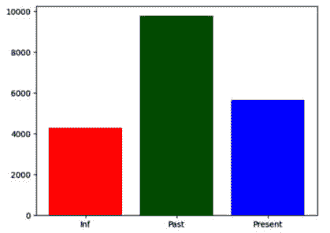

图7.3 – 《福尔摩斯探案集》中的不定式、过去式和现在式动词

# 命名实体可视化

使用`displacy`包创建引人入胜且易于阅读的图像。

在完成这个配方后，您将能够使用不同的格式选项在文本中创建命名实体的可视化，并将结果保存到文件中。

## 准备工作

`displaCy`库是`spacy`包的一部分。你需要至少`spacy`包的2.0.12版本才能使`displaCy`工作。`poetry`环境和`requirements.txt`文件中的版本是3.6.1。

笔记本位于[https://github.com/PacktPublishing/Python-Natural-Language-Processing-Cookbook-Second-Edition/blob/main/Chapter07/7.3_ner.ipynb](https://github.com/PacktPublishing/Python-Natural-Language-Processing-Cookbook-Second-Edition/blob/main/Chapter07/7.3_ner.ipynb)。

## 如何做到这一点...

我们将使用`spacy`解析句子，然后使用`displacy`引擎来可视化命名实体：

1.  导入**spacy**和**displacy**：

    ```py
    import spacy
    from spacy import displacy
    ```

1.  运行语言工具文件：

    ```py
    %run -i "../util/lang_utils.ipynb"
    ```

1.  定义要处理的文本：

    ```py
    text = """iPhone 12: Apple makes jump to 5G
    Apple has confirmed its iPhone 12 handsets will be its first to work on faster 5G networks.
    The company has also extended the range to include a new "Mini" model that has a smaller 5.4in screen.
    The US firm bucked a wider industry downturn by increasing its handset sales over the past year.
    But some experts say the new features give Apple its best opportunity for growth since 2014, when it revamped its line-up with the iPhone 6.
    "5G will bring a new level of performance for downloads and uploads, higher quality video streaming, more responsive gaming,
    real-time interactivity and so much more," said chief executive Tim Cook.
    There has also been a cosmetic refresh this time round, with the sides of the devices getting sharper, flatter edges.
    The higher-end iPhone 12 Pro models also get bigger screens than before and a new sensor to help with low-light photography.
    However, for the first time none of the devices will be bundled with headphones or a charger."""
    ```

1.  在这一步，我们使用小型模型处理文本。这给我们一个**Doc**对象。然后我们修改对象以包含标题。这个标题将是NER可视化的部分：

    ```py
    doc = small_model(text)
    doc.user_data["title"] = "iPhone 12: Apple makes jump to 5G"
    ```

1.  在这里，我们为可视化显示设置了颜色选项。我们将绿色用于**ORG**标记的文本，黄色用于**PERSON**标记的文本。然后我们设置**options**变量，它包含颜色。最后，我们使用**render**命令来显示可视化。作为参数，我们提供**Doc**对象和之前定义的选项。我们还设置**style**参数为**"ent"**，因为我们只想显示实体。我们将**jupyter**参数设置为**True**，以便直接在笔记本中显示：

    ```py
    colors = {"ORG": "green", "PERSON":"yellow"}
    options = {"colors": colors}
    displacy.render(doc, style='ent', options=options, jupyter=True)
    ```

    输出应该看起来像*图7.4*。

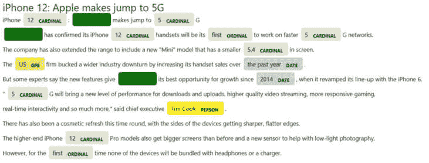

图7.4 – 命名实体可视化

1.  现在我们将可视化保存到HTML文件中。我们首先定义**路径**变量。然后，我们使用相同的**render**命令，但这次我们将**jupyter**参数设置为**False**，并将命令的输出分配给**html**变量。然后我们打开文件，写入HTML，并关闭文件：

    ```py
    path = "../data/ner_vis.html"
    html = displacy.render(doc, style="ent",
        options=options, jupyter=False)
    html_file= open(path, "w", encoding="utf-8")
    html_file.write(html)
    html_file.close()
    ```

    这将创建一个包含实体可视化的HTML文件。

# 创建混淆矩阵图

当处理机器学习模型时，例如，NLP分类模型，创建混淆矩阵图可以是一个非常好的工具，用来查看模型犯的错误，以便进一步改进。模型“混淆”了一个类别为另一个类别，因此得名**混淆矩阵**。

在完成这个配方后，你将能够创建一个SVM模型，评估它，然后创建一个混淆矩阵可视化，这将详细告诉你模型犯了哪些错误。

## 准备工作

我们将使用句子转换器模型作为向量器，为BBC新闻数据集创建一个SVM分类器。然后我们将使用`ConfusionMatrixDisplay`对象创建一个更信息丰富的混淆矩阵。该分类器与[*第4章*](B18411_04.xhtml#_idTextAnchor106)配方*使用SVM进行监督文本分类*相同。

数据集位于[https://github.com/PacktPublishing/Python-Natural-Language-Processing-Cookbook-Second-Edition/tree/main/data/bbc_train.json](https://github.com/PacktPublishing/Python-Natural-Language-Processing-Cookbook-Second-Edition/tree/main/data/bbc_train.json)和[https://github.com/PacktPublishing/Python-Natural-Language-Processing-Cookbook-Second-Edition/tree/main/data/bbc_test.json](https://github.com/PacktPublishing/Python-Natural-Language-Processing-Cookbook-Second-Edition/tree/main/data/bbc_test.json)。

笔记本位于[https://github.com/PacktPublishing/Python-Natural-Language-Processing-Cookbook-Second-Edition/blob/main/Chapter07/7.4_confusion_matrix.ipynb](https://github.com/PacktPublishing/Python-Natural-Language-Processing-Cookbook-Second-Edition/blob/main/Chapter07/7.4_confusion_matrix.ipynb)。

## 如何实现...

1.  导入必要的包和函数：

    ```py
    from sklearn.svm import SVC
    from sentence_transformers import SentenceTransformer
    from sklearn.metrics import confusion_matrix
    import matplotlib.pyplot as plt
    from sklearn.metrics import ConfusionMatrixDisplay
    ```

1.  运行简单的分类器工具文件：

    ```py
    %run -i "../util/util_simple_classifier.ipynb"
    ```

1.  读取训练和测试数据，并对训练数据进行洗牌。我们洗牌数据是为了确保没有长序列的单个类别，这可能会在训练过程中使模型产生偏差，或者排除某些类别的较大部分：

    ```py
    train_df = pd.read_json("../data/bbc_train.json")
    test_df = pd.read_json("../data/bbc_test.json")
    train_df.sample(frac=1)
    ```

1.  在这一步，我们加载转换器模型并创建**get_sentence_vector**函数。该函数接受文本和模型作为参数，然后创建并返回向量。**encode**方法接受一个文本列表，因此为了编码一段文本，我们需要将其放入一个列表中，然后获取**返回**对象的第一元素，因为模型也返回一个编码向量列表：

    ```py
    model = SentenceTransformer('all-MiniLM-L6-v2')
    def get_sentence_vector(text, model):
        sentence_embeddings = model.encode([text])
        return sentence_embeddings[0]
    ```

1.  在这里，我们创建**train_classifier**函数。该函数接受向量化输入和正确答案。然后创建并训练一个SVC对象并返回它。训练可能需要几分钟时间：

    ```py
    def train_classifier(X_train, y_train):
        clf = SVC(C=0.1, kernel='rbf')
        clf = clf.fit(X_train, y_train)
        return clf
    ```

1.  在这一步，我们训练和测试分类器。首先，我们创建一个包含目标标签的列表。然后我们创建一个**vectorize**函数，该函数使用**get_sentence_vector**函数，但指定要使用的模型。然后我们使用简单分类器工具文件中的**create_train_test_data**函数来获取训练集和测试集的向量化输入和标签。该函数接受训练和测试数据框、向量化方法和文本所在的列名。结果是向量化的训练和测试数据以及两个数据集的真实标签。然后，我们使用**train_classifier**函数创建一个训练好的SVM分类器。我们打印训练数据的分类报告，并使用**test_classifier**函数打印测试数据的分类报告：

    ```py
    target_names=["tech", "business", "sport",
        "entertainment", "politics"]
    vectorize = lambda x: get_sentence_vector(x, model)
    (X_train, X_test, y_train, y_test) = create_train_test_data(
        train_df, test_df, vectorize,
        column_name="text_clean")
    clf = train_classifier(X_train, y_train)
    print(classification_report(train_df["label"],
            y_train, target_names=target_names))
    test_classifier(test_df, clf, target_names=target_names)
    ```

    输出应该是以下这样的：

    ```py
                   precision    recall  f1-score   support
             tech       1.00      1.00      1.00       321
         business       1.00      1.00      1.00       408
            sport       1.00      1.00      1.00       409
    entertainment       1.00      1.00      1.00       309
         politics       1.00      1.00      1.00       333
         accuracy                           1.00      1780
        macro avg       1.00      1.00      1.00      1780
     weighted avg       1.00      1.00      1.00      1780
                   precision    recall  f1-score   support
             tech       0.97      0.95      0.96        80
         business       0.98      0.97      0.98       102
            sport       0.98      1.00      0.99       102
    entertainment       0.96      0.99      0.97        77
         politics       0.98      0.96      0.97        84
         accuracy                           0.98       445
        macro avg       0.97      0.97      0.97       445
     weighted avg       0.98      0.98      0.98       445
    ```

1.  现在，我们创建一个从数字标签到文本标签的映射，然后在测试数据框中创建一个新列，显示文本标签预测：

    ```py
    num_to_text_mapping = {0:"tech", 1:"business",
        2:"sport", 3:"entertainment", 4:"politics"}
    test_df["pred_label"] = test_df["prediction"].apply(
        lambda x: num_to_text_mapping[x])
    ```

1.  在这一步中，我们使用**sklearn**的**confusion_matrix**函数创建一个混淆矩阵。该函数接受真实标签、预测和类别名称作为输入。然后我们创建一个**ConfusionMatrixDisplay**对象，该对象接受混淆矩阵和要显示的名称。然后我们使用该对象创建混淆矩阵图，并使用**matplotlib**库显示：

    ```py
    cm = confusion_matrix(
        test_df["label_text"],
        test_df["pred_label"], labels=target_names)
    disp = ConfusionMatrixDisplay(
        confusion_matrix=cm,
        display_labels=target_names)
    disp.plot()
    plt.show()
    ```

    结果显示在*图7.5*中。生成的图清楚地显示了哪些类别有重叠以及它们的数量。例如，很容易看出有两个例子被预测为关于商业，但实际上是关于政治的。

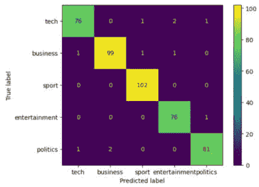

图7.5 – 混淆矩阵可视化

# 构建词云

词云是一种很好的可视化工具，可以快速查看文本中普遍存在的话题。它们可以在初步数据分析阶段和演示目的中使用。词云的一个特点是，大字体单词表示更频繁的话题，而小字体单词表示较少频繁的话题。

完成这个食谱后，你将能够从文本中创建词云，并在词云上应用图片蒙版，这将生成一个酷炫的图像。

我们将使用书籍《福尔摩斯探案集》的文本，我们将使用的图片蒙版是福尔摩斯头像的剪影。

## 准备工作

我们将使用`wordcloud`包来完成这个食谱。为了显示图像，我们需要`matplotlib`包。它们都是`poetry`环境的一部分，并且包含在`requirements.txt`文件中。

笔记本位于[https://github.com/PacktPublishing/Python-Natural-Language-Processing-Cookbook-Second-Edition/blob/main/Chapter07/7.5_word_clouds.ipynb](https://github.com/PacktPublishing/Python-Natural-Language-Processing-Cookbook-Second-Edition/blob/main/Chapter07/7.5_word_clouds.ipynb)。

## 如何操作...

1.  导入必要的包和函数：

    ```py
    import matplotlib.pyplot as plt
    from wordcloud import WordCloud, STOPWORDS
    ```

1.  运行文件工具笔记本。我们将使用该笔记本中的**read_text_file**函数：

    ```py
    %run -i "../util/file_utils.ipynb"
    ```

1.  读取书籍文本：

    ```py
    text_file = "../data/sherlock_holmes.txt"
    text = read_text_file(text_file)
    ```

1.  在这一步中，我们定义了**create_wordcloud**函数。该函数接受要处理的文本、停用词、结果保存的文件名以及是否在图像上应用蒙版（默认为**None**）。它创建**WordCloud**对象，将其保存到文件，然后输出结果图。我们提供给**WordCloud**对象的可选参数包括最小字体大小、最大字体大小、宽度、高度、最大单词数和背景颜色：

    ```py
    def create_wordcloud(text, stopwords, filename, 
        apply_mask=None):
        if (apply_mask is not None):
            wordcloud = WordCloud(
                background_color="white", max_words=2000,
                mask=apply_mask, stopwords=stopwords,
                min_font_size=10, max_font_size=100)
            wordcloud.generate(text)
            wordcloud.to_file(filename)
            plt.figure()
            plt.imshow(wordcloud, interpolation='bilinear')
            plt.axis("off")
            plt.show()
        else:
            wordcloud = WordCloud(min_font_size=10,
                max_font_size=100, stopwords=stopwords,
                width=1000, height=1000, max_words=1000,
                background_color="white").generate(text)
            wordcloud.to_file(filename)
            plt.figure()
            plt.imshow(wordcloud, interpolation="bilinear")
            plt.axis("off")
            plt.show()
    ```

1.  在《福尔摩斯探案集》的文本上运行**create_wordcloud**函数：

    ```py
    create_wordcloud(text, set(STOPWORDS), 
        "../data/sherlock_wc.png")
    ```

这将结果保存到位于`data/sherlock_wc.png`的文件中，并创建显示在*图7.6*（你的结果可能略有不同）中的可视化。

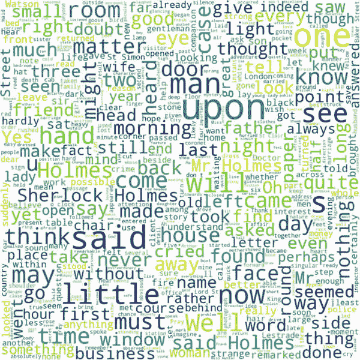

图7.6 – 福尔摩斯词云可视化

## 还有更多...

我们还可以对词云应用遮罩。在这里，我们将夏洛克·福尔摩斯的轮廓应用到词云上：

1.  执行额外的导入：

    ```py
    import numpy as np
    from PIL import Image
    ```

1.  读取遮罩图像并将其保存为**numpy**数组：

    ```py
    sherlock_data = Image.open("../data/sherlock.png")
    sherlock_mask = np.array(sherlock_data)
    ```

1.  在夏洛克·福尔摩斯的书文本上运行该函数：

    ```py
    create_wordcloud(text, set(STOPWORDS),
        "../data/sherlock_mask.png",
        apply_mask=sherlock_mask)
    ```

这将把结果保存到位于`data/sherlock_mask.png`的文件中，并创建如图7.7所示的可视化（你的结果可能略有不同）：

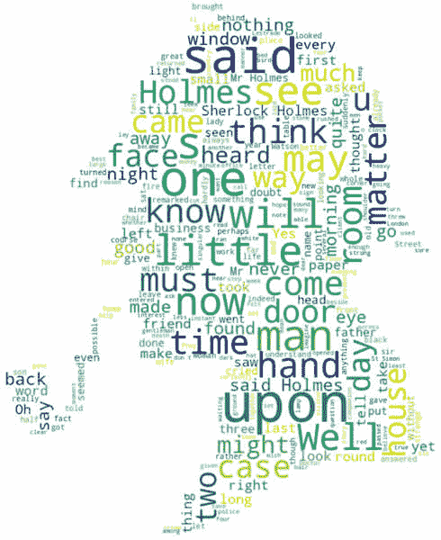

图7.7 – 带遮罩的词云

## 参见

请参阅`wordcloud`文档，[https://amueller.github.io/word_cloud/](https://amueller.github.io/word_cloud/)，以获取更多选项。

# 从Gensim可视化主题

在这个配方中，我们将可视化我们在[*第6章*](B18411_06.xhtml#_idTextAnchor156)中创建的**潜在狄利克雷分配**（**LDA**）主题模型。这种可视化将使我们能够快速看到与每个主题最相关的单词以及主题之间的距离。

在完成这个配方后，你将能够加载现有的LDA模型并为它的主题创建可视化，既可以在Jupyter中查看，也可以保存为HTML文件。

## 准备工作

我们将使用`pyLDAvis`包来创建可视化。它在`poetry`环境和`requirements.txt`文件中可用。

我们将加载我们在[*第6章*](B18411_06.xhtml#_idTextAnchor156)中创建的模型，然后使用`pyLDAvis`包创建主题模型可视化。

笔记本位于[https://github.com/PacktPublishing/Python-Natural-Language-Processing-Cookbook-Second-Edition/blob/main/Chapter07/7.6_topics_gensim.ipynb](https://github.com/PacktPublishing/Python-Natural-Language-Processing-Cookbook-Second-Edition/blob/main/Chapter07/7.6_topics_gensim.ipynb)。

## 如何操作...

1.  导入必要的包和函数：

    ```py
    import gensim
    import pyLDAvis.gensim
    ```

1.  定义模型文件的路径。模型是在[*第6章*](B18411_06.xhtml#_idTextAnchor156)中训练的：

    ```py
    model_path = "../models/bbc_gensim/lda.model"
    dict_path = "../models/bbc_gensim/id2word.dict"
    corpus_path = "../models/bbc_gensim/corpus.mm"
    ```

1.  在这一步中，我们加载这些路径指向的对象。如果你在这一步遇到**FileNotFoundError**错误，这意味着你没有创建字典、语料库和模型文件。在这种情况下，回到[*第6章*](B18411_06.xhtml#_idTextAnchor156)，即*使用Gensim进行LDA主题建模*配方，创建模型和相关文件：

    ```py
    dictionary = gensim.corpora.Dictionary.load(dict_path)
    corpus = gensim.corpora.MmCorpus(corpus_path)
    lda = gensim.models.ldamodel.LdaModel.load(model_path)
    ```

1.  在这里，我们使用前面的文件创建**PreparedData**对象，并将可视化保存为HTML。该对象是可视化方法所必需的：

    ```py
    lda_prepared = pyLDAvis.gensim.prepare(lda, corpus, dictionary)
    pyLDAvis.save_html(lda_prepared, '../data/lda-gensim.html')
    ```

1.  在这里，我们启用Jupyter的**显示**选项，并在笔记本中显示可视化。你会看到每个主题及其重要的单词。要选择特定的主题，用鼠标悬停在它上面。当你悬停在它们上面时，你会看到每个主题的最重要单词会发生变化：

    ```py
    pyLDAvis.enable_notebook()
    pyLDAvis.display(lda_prepared)
    ```

    这将创建如图7.8所示的可视化（你的结果可能会有所不同）：

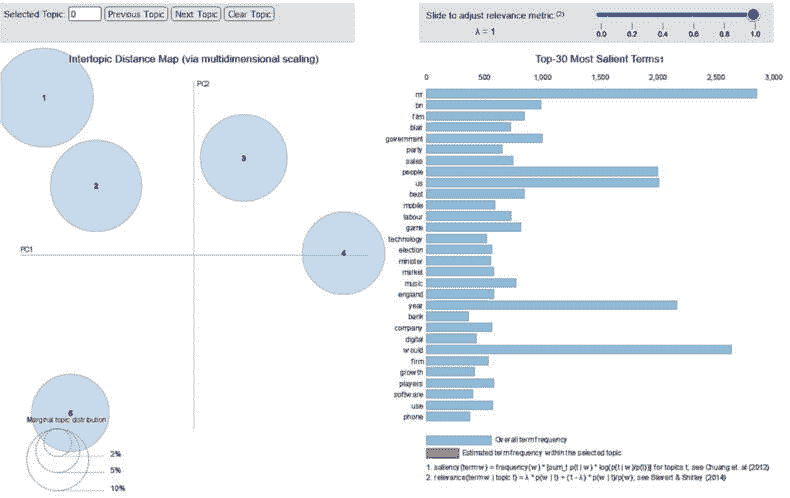

图7.8 – LDA模型可视化

## 参见

使用`pyLDAvis`，也可以可视化使用`sklearn`创建的模型。有关更多信息，请参阅包文档：[https://github.com/bmabey/pyLDAvis](https://github.com/bmabey/pyLDAvis)。

# BERTopic主题可视化

在本食谱中，我们将创建并可视化BBC数据上的BERTopic模型。BERTopic包提供了几个可视化选项，我们将使用其中几个。

在本食谱中，我们将以与[*第6章*](B18411_06.xhtml#_idTextAnchor156)中的*使用BERTopic进行主题建模*食谱类似的方式创建主题模型。然而，与[*第6章*](B18411_06.xhtml#_idTextAnchor156)不同，我们不会限制创建的主题数量，这将导致数据中超过5个原始主题。这将允许进行更有趣的可视化。

## 准备工作

我们将使用`BERTopic`包来创建可视化。它在`poetry`环境中可用。

## 如何操作...

1.  导入必要的包和函数：

    ```py
    import pandas as pd
    import numpy as np
    from bertopic import BERTopic
    from bertopic.representation import KeyBERTInspired
    ```

1.  运行语言工具文件：

    ```py
    %run -i "../util/lang_utils.ipynb"
    ```

1.  读取数据：

    ```py
    bbc_df = pd.read_csv("../data/bbc-text.csv")
    ```

1.  这里，我们从一个dataframe对象中创建一个训练文档列表。然后我们初始化一个表示模型对象。在这里，我们使用**KeyBERTInspired**对象，它使用BERT提取关键词。

    此对象创建主题的名称（表示）；它比默认版本做得更好，默认版本包含大量停用词。然后我们创建主主题模型对象并将其拟合到文档集中。在本食谱中，与[*第6章*](B18411_06.xhtml#_idTextAnchor156)中的*使用BERTopic进行主题建模*食谱相比，我们不限制创建的主题数量。这将创建更多主题：

    ```py
    docs = bbc_df["text"].values
    representation_model = KeyBERTInspired()
    topic_model = BERTopic(
        representation_model=representation_model)
    topics, probs = topic_model.fit_transform(docs)
    ```

1.  在此步骤中，我们显示一般主题可视化。它显示了创建的所有42个主题。如果你悬停在每个圆圈上，你会看到主题表示或名称。表示由主题中的前五个单词组成：

    ```py
    topic_model.visualize_topics()
    ```

    这将创建如图7**.9**所示的可视化（你的结果可能会有所不同）。

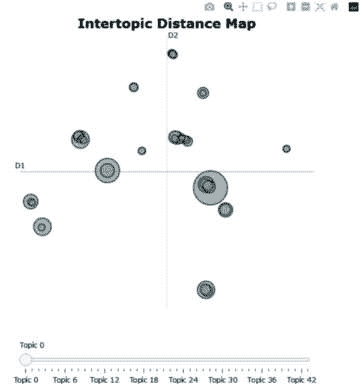

图7.9 – BERTopic模型可视化

1.  这里，我们创建了一个主题层次结构的可视化。如果主题相关，这个层次结构会将不同的主题聚集在一起。我们首先使用主题模型对象的`hierarchical_topics`函数创建层次结构，然后将其传递给`visualize_hierarchy`函数。组合不同主题的节点有自己的名称，如果你悬停在它们上面，你可以看到：

    ```py
    hierarchical_topics = topic_model.hierarchical_topics(
        bbc_df["text"])
    topic_model.visualize_hierarchy(
        hierarchical_topics=hierarchical_topics)
    ```

    这将创建如图7**.10**所示的可视化。

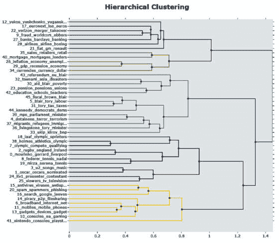

图7.10 – BERTopic层次可视化

如果你悬停在节点上，你会看到它们的名称。

1.  在此步骤中，我们创建一个条形图，显示主题的前几个单词。我们通过使用主题模型对象的`visualize_barchart`函数的`top_n_topics`参数来指定要显示的主题数量：

    ```py
    topic_model.visualize_barchart(top_n_topics=15)
    ```

    这将创建一个类似于此的可视化：


图7.11 – BERTopic单词得分

1.  在这里，我们创建训练集中单个文档的可视化。我们将 *步骤 4* 中创建的文档列表提供给 **visualize_documents** 函数。它将文档聚类到主题中。如果你将鼠标悬停在单个圆圈上，你可以看到文档：

    ```py
    topic_model.visualize_documents(docs)
    ```

    结果将类似于以下可视化：

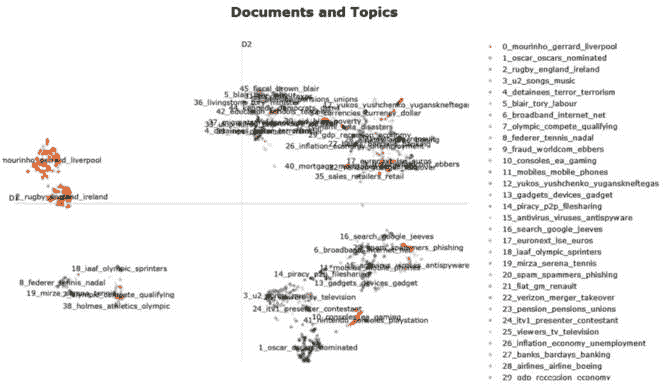

图 7.12 – BERTopic 文档可视化

如果你将鼠标悬停在节点上，你会看到单个文档的文本。

## 参见

+   通过 BERTopic 可用额外的可视化工具。有关更多信息，请参阅包文档：[https://maartengr.github.io/BERTopic/index.html](https://maartengr.github.io/BERTopic/index.html)。

+   要了解更多关于 **KeyBERTInspired** 的信息，请参阅 [https://maartengr.github.io/BERTopic/api/representation/keybert.html](https://maartengr.github.io/BERTopic/api/representation/keybert.html)。
