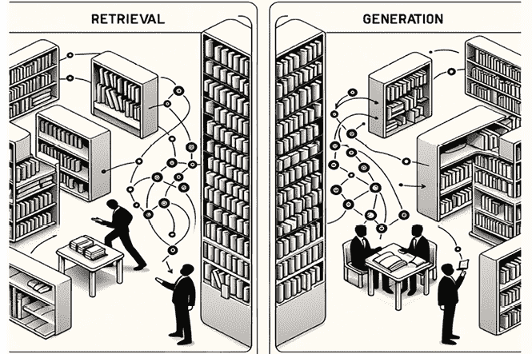
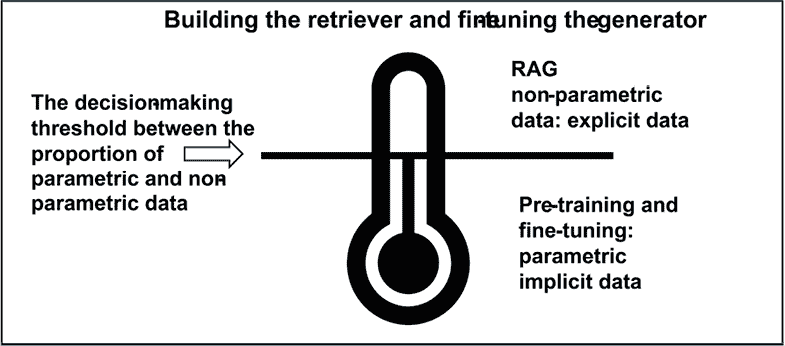
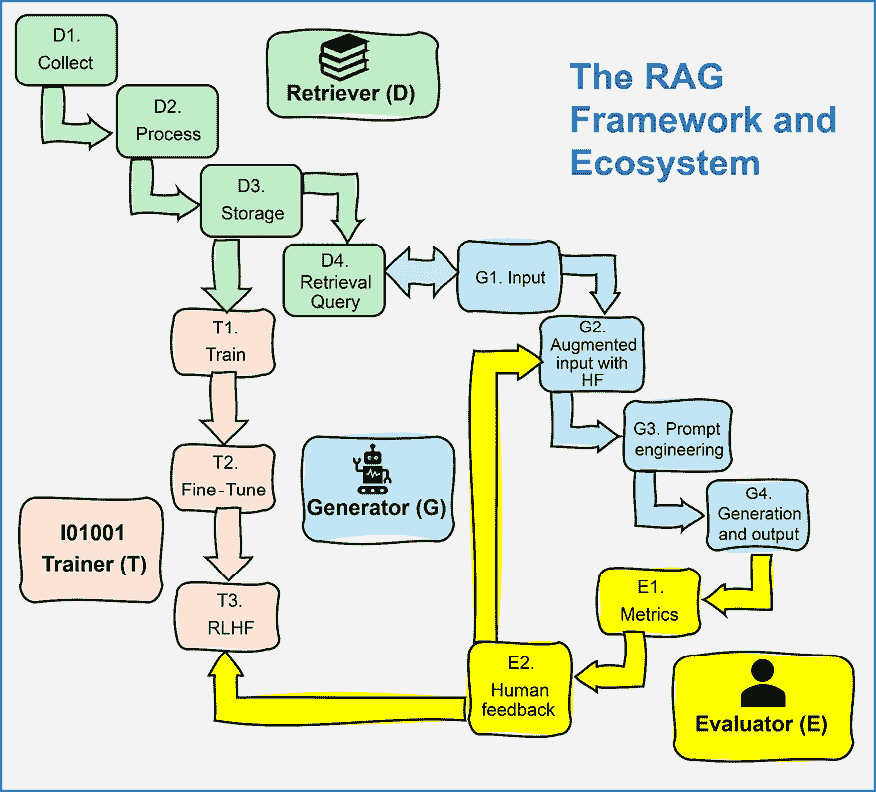
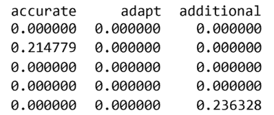

# 为什么需要检索增强生成？

即使是最先进的生成式 AI 模型也只能根据它们训练的数据生成响应。它们无法提供关于其训练数据之外信息的准确答案。生成式 AI 模型根本不知道它们不知道！这导致输出不准确或不恰当，有时被称为幻觉、偏见，或者简单地说，胡言乱语。

**检索增强生成**（**RAG**）是一个框架，通过结合基于检索的方法和生成模型来解决这个问题。它实时从外部来源检索相关数据，并使用这些数据生成更准确和上下文相关的响应。集成了 RAG 检索器的生成式 AI 模型正在以前所未有的效率和力量改变这个领域。RAG 的一个关键优势是其适应性。它可以无缝应用于任何类型的数据，无论是文本、图像还是音频。这种多功能性使 RAG 生态系统成为增强生成式 AI 能力的可靠和高效工具。

然而，项目经理已经遇到了各种生成式 AI 平台、框架和模型，例如 Hugging Face、Google Vertex AI、OpenAI、LangChain 等等。新增的一层新兴的 RAG 框架和平台，如 Pinecone、Chroma、Activeloop、LlamaIndex 等，只会增加复杂性。因此，为特定项目找到合适的模型和 RAG 资源配置对项目经理来说可能具有挑战性。没有一劳永逸的解决方案。挑战巨大，但一旦实现，回报将是巨大的！

我们将从这个章节开始，从高层次上定义 RAG 框架。然后，我们将定义三种主要的 RAG 配置：朴素 RAG、高级 RAG 和模块化 RAG。我们还将比较 RAG 和微调，并确定何时使用这些方法。RAG 只能存在于一个生态系统中，我们将在本章设计和描述一个。数据需要从某个地方来，并经过处理。检索需要一个有组织的环境来检索数据，而生成式 AI 模型有输入限制。

最后，我们将深入探讨本章的实践方面。我们将从头开始构建一个 Python 程序，以运行基于关键字搜索和匹配的入门级朴素 RAG。我们还将编写一个基于向量搜索和基于索引检索的高级 RAG 系统。最后，我们将构建一个模块化 RAG，它同时考虑了朴素 RAG 和高级 RAG。到本章结束时，你将获得对 RAG 框架的理论理解，并在构建 RAG 驱动的生成式 AI 程序方面获得实践经验。这种动手方法将加深你的理解，并为你准备后续章节。

简而言之，本章涵盖了以下主题：

+   定义 RAG 框架

+   RAG 生态系统

+   在 Python 中实现简单的关键词搜索和匹配 RAG

+   在 Python 中使用向量搜索和基于索引的 RAG 的高级 RAG

+   构建模块化的 RAG 程序

让我们从定义 RAG 开始。

# 什么是 RAG？

当一个生成式 AI 模型不知道如何准确回答时，有人说它是在幻想或产生偏见。简单来说，它只是产生了胡言乱语。然而，所有这些都归结于当模型的训练没有包括超出经典模型配置请求的信息时，无法提供充分响应的不可能性。这种混淆通常会导致随机序列的最可能输出，而不是最准确的输出。

RAG 在生成式 AI 结束的地方开始，它提供了 LLM 模型缺乏的信息以准确回答。RAG 是为 LLM 设计的（Lewis 等人，2020）。RAG 框架将执行优化的信息检索任务，生成生态系统将添加这些信息到输入（用户查询或自动提示）以产生改进的输出。RAG 框架可以用以下图示在高级别上总结：



图 1.1：由 RAG 驱动的生成式 AI 的两个主要组件

将自己想象成一个图书馆里的学生。你需要写一篇关于 RAG 的论文。比如，像 ChatGPT 一样，或者任何其他 AI 辅助工具，你已经学会了如何阅读和写作。就像任何**大型语言模型**（**LLM**）一样，你已经接受了足够的训练来阅读高级信息、总结信息并撰写内容。然而，就像你从 Hugging Face、Vertex AI 或 OpenAI 找到的任何超人类 AI 一样，有许多事情你并不知道。

在**检索**阶段，你会在图书馆里寻找关于你需要的话题的书籍（*图 1.1*的左侧）。然后，你回到自己的座位，自己或与同学一起执行检索任务，并从这些书籍中提取所需的信息。在**生成**阶段（*图 1.1*的右侧），你开始撰写你的论文。你是一个由 RAG 驱动的生成式人类代理，就像一个由 RAG 驱动的生成式 AI 框架一样。

当你继续在 RAG 上撰写你的论文时，你会遇到一些棘手的话题。你没有时间去浏览所有可用的信息！作为生成式人类代理的你，就像生成式 AI 模型一样陷入了困境。你可能尝试写一些东西，就像生成式 AI 模型在其输出几乎没有意义时所做的。但就像生成式 AI 代理一样，你不会意识到内容是否准确，直到有人纠正你的论文，你得到一个能对你的论文进行排名的成绩。

到目前为止，你已经达到了自己的极限，决定转向一个 RAG 生成式 AI 辅助工具以确保你得到正确的答案。然而，你被可用的 LLM 模型和 RAG 配置的数量所困惑。首先，你需要了解可用的资源以及 RAG 是如何组织的。让我们来了解一下主要的 RAG 配置。

# 天真、高级和模块化 RAG 配置

一个 RAG 框架必然包含两个主要组件：一个检索器和一个生成器。生成器可以是任何 LLM 或基础多模态 AI 平台或模型，例如 GPT-4o、Gemini、Llama 或初始架构的数百种变体之一。检索器可以是任何新兴的框架、方法和工具，如 Activeloop、Pinecone、LlamaIndex、LangChain、Chroma 等。

现在的问题是决定三种类型的 RAG 框架（Gao et al., 2024）中哪一种将适合项目的需求。我们将在本章的“代码中的天真、高级和模块化 RAG”部分用代码展示这三种方法：

+   **天真 RAG**：这种类型的 RAG 框架不涉及复杂的数据嵌入和索引。通过关键词访问合理数量的数据可能很有效，例如，增强用户的输入并获得满意的响应。

+   **高级 RAG**：这种类型的 RAG 涉及更复杂的场景，例如使用向量搜索和基于索引的检索。高级 RAG 可以用多种方法实现。它可以处理多种数据类型，以及结构化或非结构化的多模态数据。

+   **模块化 RAG**：模块化 RAG 将视野扩展到包括任何涉及天真 RAG、高级 RAG、机器学习和完成复杂项目所需任何算法的场景。

然而，在继续之前，我们需要决定是应该实现 RAG 还是微调模型。

# RAG 与微调的比较

RAG 并不总是微调的替代品，微调也不能总是替代 RAG。如果我们积累过多的数据在 RAG 数据集中，系统可能会变得过于繁琐难以管理。另一方面，我们无法对动态、不断变化的数据进行模型微调，例如每日天气预报、股市价值、公司新闻以及所有形式的日常事件。

是否实现 RAG 或微调模型的决定取决于参数化信息与非参数化信息的比例。从头开始训练或微调的模型与 RAG 之间的基本区别可以用参数化和非参数化知识来概括：

+   **参数化**：在一个由 RAG 驱动的生成式 AI 生态系统中，参数化部分指的是通过训练数据学习到的生成式 AI 模型的参数（权重）。这意味着模型的知识存储在这些学习到的权重和偏差中。原始训练数据被转换成一种数学形式，我们称之为参数化表示。本质上，模型“记住”了从数据中学到的东西，但数据本身并没有明确存储。

+   **非参数**：相比之下，RAG 生态系统的非参数部分涉及存储可以直接访问的显式数据。这意味着数据始终保持可用，并且可以在需要时查询。与参数化模型不同，其中知识间接地嵌入在权重中，RAG 中的非参数数据允许我们查看和使用每个输出的实际数据。

RAG 与微调之间的区别在于生成式 AI 模型必须处理的静态（参数化）和动态（非参数）不断变化的数据量。过度依赖 RAG 的系统可能会变得过载且难以管理。过度依赖微调生成模型的系统将显示出其无法适应日常信息更新的能力。

在图 1.2 中有一个决策阈值，展示了 RAG 驱动的生成式 AI 项目经理在实施非参数（显式数据）RAG 框架之前，必须评估生态系统训练的参数化生成式 AI 模型的潜力。RAG 组件的潜力也需要仔细评估。



图 1.2：增强 RAG 或微调 LLM 之间的决策阈值

最后，在 RAG 驱动的生成式 AI 生态系统中，增强检索器和生成器之间的平衡取决于项目的具体需求和目标。RAG 和微调不是相互排斥的。

RAG 可以用来提高模型的整体效率，与微调相结合，作为增强 RAG 框架内检索和生成组件性能的方法。我们将在第九章“赋予 AI 模型力量：微调 RAG 数据和人类反馈”中微调一部分检索数据。

现在我们将看到 RAG 驱动的生成式 AI 如何涉及一个由许多组件组成的生态系统。

# RAG 生态系统

RAG 驱动的生成式 AI 是一个可以在许多配置中实现的框架。RAG 的框架运行在一个广泛的生态系统中，如图 1.3 所示。然而，无论你遇到多少检索和生成框架，最终都会归结为以下四个领域及其相关问题：

+   **数据**：数据从哪里来？它是可靠的吗？是否足够？存在版权、隐私和安全问题吗？

+   **存储**：在处理之前或之后，数据将如何存储？将存储多少数据？

+   **检索**：如何检索正确数据以增强用户输入，使其在生成模型足够之前？哪种类型的 RAG 框架将对项目成功？

+   **生成**：哪种生成式 AI 模型将适合所选的 RAG 框架？

数据、存储和生成领域在很大程度上取决于你选择的 RAG 框架类型。在做出选择之前，我们需要评估我们正在实施的生态系统中参数化和非参数化知识的比例。“图 1.3”表示 RAG 框架，它包括无论实施何种类型 RAG 的主要组件：



图 1.3：生成式 RAG 生态系统

+   **检索器（D）**负责数据收集、处理、存储和检索

+   **生成器（G）**负责输入增强、提示工程和生成

+   **评估器（E）**负责处理数学指标、人工评估和反馈

+   **训练器（T）**负责初始预训练模型和微调模型

这四个组件中的每一个都依赖于它们各自的生态系统，这些生态系统共同构成了 RAG 驱动的生成式 AI 管道的整体。在接下来的章节中，我们将提到 D、G、E 和 T 这些领域。让我们从检索器开始。

## 检索器（D）

RAG 生态系统中的检索器组件负责收集、处理、存储和检索数据。因此，RAG 生态系统的起点是一个数据摄取过程，其第一步是收集数据。

### 收集（D1）

在当今世界，AI 数据与我们媒体播放列表的多样性一样。它可以是从博客文章中的一段文本到表情包，甚至是通过耳机流过的最新热门歌曲。而且，这还远不止于此——文件本身也形形色色。想想看，PDF 文件中充满了各种细节，网页、直接切入主题的纯文本文件，整齐组织的 JSON 文件，吸引人的 MP3 旋律，MP4 格式的视频，或 PNG 和 JPG 格式的图片。

此外，大量数据是非结构化的，以不可预测和复杂的方式存在。幸运的是，许多平台，如 Pinecone、OpenAI、Chroma 和 Activeloop，提供了现成的工具来处理和存储这个数据丛林。

### 处理过程（D2）

在多模态数据处理的数据收集阶段（D1）中，可以使用网络爬虫技术或其他信息来源，从网站中提取各种类型的数据，如文本、图像和视频。然后，这些数据对象被转换以创建统一的特征表示。例如，数据可以被分块（分割成更小的部分）、嵌入（转换为向量）和索引，以增强搜索性和检索效率。

我们将介绍这些技术，从本章的“在 Python 中构建混合自适应 RAG”部分开始。在接下来的章节中，我们将继续构建更复杂的数据处理功能。

### 存储（D3）

在这个管道阶段，我们已经收集并开始处理来自互联网的大量多样化数据——视频、图片、文本，等等。现在，我们如何利用所有这些数据使其变得有用？

这就是像 Deep Lake、Pinecone 和 Chroma 这样的向量存储器发挥作用的地方。想象一下，这些是超级智能的库，它们不仅存储你的数据，而且将其转换为向量等数学实体，从而实现强大的计算。它们还可以应用各种索引方法和其他技术，以实现快速访问。

我们不是将数据保留在静态的电子表格和文件中，而是将其转变为动态的、可搜索的系统，它可以支持从聊天机器人到搜索引擎的各种应用。

### 检索查询（D4）

检索过程由用户输入或自动化输入（G1）触发。

为了快速检索数据，我们在将其转换为合适的格式后，将其加载到向量存储和数据集中。然后，通过结合关键词搜索、智能嵌入和索引，我们可以有效地检索数据。例如，余弦相似性可以找到密切相关的项目，确保搜索结果不仅快速，而且高度相关。

一旦检索到数据，我们就增强输入。

## 生成器（G）

在 RAG 生态系统中，输入和检索之间的界限变得模糊，如*图 1.3*所示，它代表了 RAG 框架和生态系统。用户输入（G1），无论是自动的还是人类的，都会与检索查询（D4）交互，以增强输入，然后再将其发送到生成模型。

生成流程从输入开始。

### 输入（G1）

输入可以是一批自动化任务（例如处理电子邮件）或通过**用户界面**（**UI**）的人类提示。这种灵活性允许你无缝地将 AI 集成到各种专业环境中，提高各行业的生产力。

### 带有 HF 的增强输入（G2）

**人类反馈**（**HF**）可以添加到输入中，如*评估者（E）下的*人类反馈（E2）*部分所述。人类反馈将使 RAG 生态系统具有相当大的适应性，并能够完全控制数据检索和生成 AI 输入。在本章的*在 Python 中构建混合自适应 RAG*部分，我们将构建带有人类反馈的增强输入。

### 提示工程（G3）

检索器（D）和生成器（G）都严重依赖提示工程来准备生成 AI 模型将需要处理的标准化和增强信息。提示工程将检索器的输出和用户输入结合起来。

### 生成和输出（G4）

生成 AI 模型的选择取决于项目的目标。Llama、Gemini、GPT 和其他模型可以满足各种需求。然而，提示必须满足每个模型的规格。例如，我们将在这本书中实现的 LangChain 框架，通过提供可适应的接口和工具，有助于简化各种 AI 模型到应用的集成。

## 评估者（E）

我们经常依赖数学指标来评估生成式 AI 模型的表现。然而，这些指标只给出了部分画面。重要的是要记住，AI 有效性的最终测试归结为人类评估。

### 指标（E1）

模型在缺乏数学指标的情况下无法评估，例如余弦相似度，这与任何 AI 系统一样。这些指标确保检索到的数据是相关且准确的。通过量化数据点之间的关系和相关性，它们为评估模型性能和可靠性提供了坚实的基础。

### 人类反馈（E2）

无论是 RAG 驱动的还是非 RAG 驱动的生成式 AI 系统，以及数学指标是否似乎足够，都无法逃避人类评估。最终，人类评估决定为人类用户设计的系统将被接受或拒绝，被赞扬或批评。

自适应 RAG 引入了人类、现实生活、实用反馈因素，这将改善由 RAG 驱动的生成式 AI 生态系统。我们将在**第五章**，**通过专家人类反馈提升 RAG 性能**中实现自适应 RAG。

## 训练者（T）

标准的生成式 AI 模型使用大量通用数据进行预训练。然后，我们可以使用特定领域的数据对模型进行微调（T2）。

我们将在**第九章**，**赋予 AI 模型能力：微调 RAG 数据和人类反馈**中进一步将静态 RAG 数据集成到微调过程中。我们还将集成人类反馈，这提供了可以集成到微调过程中的宝贵信息，这可以通过**从人类反馈中进行强化学习**（**RLHF**）的变体来实现。

我们现在可以开始用 Python 编写入门级、高级和模块化 RAG 的代码。

# 代码中的朴素、高级和模块化 RAG

本节通过基本教育示例介绍了朴素、高级和模块化 RAG。程序构建了关键词匹配、向量搜索和基于索引的检索方法。使用 OpenAI 的 GPT 模型，它根据输入查询和检索到的文档生成响应。

笔记本的目标是让对话代理回答有关 RAG 的一般性问题。我们将从底层开始，从头开始用 Python 构建检索器，并在八个代码部分中运行生成器，这些部分分为两部分：

**第一部分：基础和基本实现**

1.  **环境**设置以集成 OpenAI API

1.  **生成器**函数使用 GPT-4o

1.  **数据**设置，使用文档列表（`db_records`）

1.  **查询**用户输入

**第二部分：高级技术和评估**

1.  **检索指标**以衡量检索响应

1.  **朴素 RAG**，具有关键词搜索和匹配功能

1.  **高级 RAG**，具有向量搜索和基于索引的搜索

1.  **模块化 RAG**实现灵活的检索方法

要开始，请打开 GitHub 仓库中的`RAG_Overview.ipynb`。我们将首先建立笔记本的基础，并探索基本实现。

## 第一部分：基础和基本实现

在本节中，我们将设置环境，为生成器创建一个函数，定义一个用于打印格式化响应的函数，并定义用户查询。

第一步是安装环境。

以下笔记本实现的章节标题遵循代码中的结构。因此，你可以遵循笔记本中的代码或阅读这个自包含的部分。

### 1. 环境

主要要安装的包是 OpenAI，通过 API 访问 GPT-4o：

```py
!pip install openai==1.40.3 
```

确保冻结你安装的 OpenAI 版本。在 RAG 框架生态系统中，我们将需要安装几个包来运行高级 RAG 配置。一旦我们稳定了安装，我们将冻结已安装的包的版本，以最小化我们实现的库和模块之间的潜在冲突。

一旦安装了`openai`，你将需要在 OpenAI 上创建一个账户（如果你还没有的话）并获取一个 API 密钥。在运行 API 之前，请确保检查费用和支付计划。

一旦你有了密钥，请将其存储在安全的地方，并按以下方式从 Google Drive 等地方检索，例如，如下代码所示：

```py
#API Key
#Store you key in a file and read it(you can type it directly in the notebook but it will be visible for somebody next to you)
from google.colab import drive
drive.mount('/content/drive') 
```

你可以使用 Google Drive 或任何其他你选择的方法来存储你的密钥。你可以从文件中读取密钥，或者你也可以选择直接在代码中输入密钥：

```py
f = open("drive/MyDrive/files/api_key.txt", "r")
API_KEY=f.readline().strip()
f.close()

#The OpenAI Key
import os
import openai
os.environ['OPENAI_API_KEY'] =API_KEY
openai.api_key = os.getenv("OPENAI_API_KEY") 
```

这样，我们已经为我们的项目设置了主要资源。现在我们将为 OpenAI 模型编写一个生成函数。

### 2. 生成器

代码导入`openai`以生成内容，并导入`time`来测量请求所需的时间：

```py
import openai
from openai import OpenAI
import time
client = OpenAI()
gptmodel="gpt-4o"
start_time = time.time()  # Start timing before the request 
```

现在我们创建一个函数，该函数创建一个包含指令和用户输入的提示：

```py
def call_llm_with_full_text(itext):
    # Join all lines to form a single string
    text_input = '\n'.join(itext)
    prompt = f"Please elaborate on the following content:\n{text_input}" 
```

该函数将尝试调用`gpt-4o`，为模型添加额外的信息：

```py
 try:
      response = client.chat.completions.create(
         model=gptmodel,
         messages=[
            {"role": "system", "content": "You are an expert Natural Language Processing exercise expert."},
            {"role": "assistant", "content": "1.You can explain read the input and answer in detail"},
            {"role": "user", "content": prompt}
         ],
         temperature=0.1  # Add the temperature parameter here and other parameters you need
        )
      return response.choices[0].message.content.strip()
    except Exception as e:
        return str(e) 
```

注意，在此场景中，指令消息保持通用，以便模型保持灵活性。`temperature`（温度）设置得较低（更精确），为`0.1`。如果你希望系统更具创造性，可以将`temperature`设置为更高的值，例如`0.7`。然而，在这种情况下，建议请求精确的响应。

当我们调用生成式 AI 模型时，我们可以添加`textwrap`来格式化响应为一个漂亮的段落：

```py
import textwrap
def print_formatted_response(response):
    # Define the width for wrapping the text
    wrapper = textwrap.TextWrapper(width=80)  # Set to 80 columns wide, but adjust as needed
    wrapped_text = wrapper.fill(text=response)
    # Print the formatted response with a header and footer
    print("Response:")
    print("---------------")
    print(wrapped_text)
    print("---------------\n") 
```

生成器现在已准备好，在我们需要时调用。由于生成式 AI 模型的概率性质，它可能会在每次调用时产生不同的输出。

程序现在实现了数据检索功能。

### 3. 数据

数据收集包括文本、图像、音频和视频。在本笔记本中，我们将关注通过天真、高级和模块化配置进行**数据检索**，而不是数据收集。我们将在第二章“使用 Deep Lake 和 OpenAI 的 RAG 嵌入向量存储”中收集和嵌入数据。因此，我们将假设我们所需的数据已经处理并收集，因此已经清理并分割成句子。我们还将假设该过程包括将句子加载到名为`db_records`的 Python 列表中。

这种方法说明了我们在*RAG 生态系统*部分中描述的 RAG 生态系统的三个方面以及*图 1.3*中描述的系统组件：

+   **检索器（D**）有三个**数据处理**组件，**收集（D1**），**处理（D2**）和**存储（D3**），它们是检索器的准备阶段。

+   因此，**检索器查询（D4**）独立于检索器的第一阶段（收集、处理和存储）。

+   数据处理阶段通常会在激活检索器查询之前独立完成，正如我们将在*第二章*中实施的那样。

此程序假设数据处理已完成，数据集已准备好：

```py
db_records = [
    "Retrieval Augmented Generation (RAG) represents a sophisticated hybrid approach in the field of artificial intelligence, particularly within the realm of natural language processing (NLP).",
…/… 
```

我们可以显示数据集的格式化版本：

```py
import textwrap
paragraph = ' '.join(db_records)
wrapped_text = textwrap.fill(paragraph, width=80)
print(wrapped_text) 
```

输出将`db_records`中的句子连接起来以供显示，正如以下摘录中所示，但`db_records`保持不变：

```py
Retrieval Augmented Generation (RAG) represents a sophisticated hybrid approach in the field of artificial intelligence, particularly within the realm of natural language processing (NLP)… 
```

程序现在准备好处理查询。

### 4. 查询

**检索器**（*图 1.3*中的**D4**）查询过程取决于数据处理的方式，但查询本身只是用户输入或来自另一个 AI 代理的自动化输入。我们都梦想着用户能够向软件系统引入最佳输入，但在现实生活中，意外的输入会导致不可预测的行为。因此，我们必须构建能够考虑不精确输入的系统。

在本节中，我们将设想一个场景，其中组织中的数百名用户已经听到“RAG”与“LLM”和“向量存储”相关联。其中许多人希望了解这些术语对部署在部门中的对话代理的软件团队意味着什么，以保持同步。经过几天后，他们听到的术语在记忆中变得模糊，所以他们向对话代理，在本例中为 GPT-4o，提出以下查询来解释他们记得的内容：

```py
query = "define a rag store" 
```

在这种情况下，我们将简单地存储程序主题的主要查询在`query`中，它代表了检索器和生成器之间的连接点。它将触发 RAG（朴素、高级和模块化）的配置。配置的选择将取决于每个项目的目标。

程序接收查询并将其发送到 GPT-4o 模型进行处理，然后显示格式化后的输出：

```py
# Call the function and print the result
llm_response = call_llm_with_full_text(query)
print_formatted_response(llm_response) 
```

输出结果揭示了真相。即使是最强大的生成式 AI 模型也无法猜出对 AI 一无所知的用户在真诚地试图找出什么。在这种情况下，GPT-4o 将回答如下输出摘录所示：

```py
Response:
---------------
Certainly! The content you've provided appears to be a sequence of characters
that, when combined, form the phrase "define a rag store." Let's break it down
step by step:…
… This is an indefinite article used before words that begin with a consonant sound.    - **rag**: This is a noun that typically refers to a pieceof old, often torn, cloth.    - **store**: This is a noun that refers to a place where goods are sold.  4\. **Contextual Meaning**:    - **"Define a rag store"**: This phrase is asking for an explanation or definition of what a "rag store" is. 5\. **Possible Definition**:    - A "rag store" could be a shop or retail establishment that specializes in selling rags,… 
```

输出看起来像是一种幻觉，但真的是这样吗？用户撰写查询时，带着每个初学者试图学习新主题的善意。GPT-4o，出于善意，尽其所能地使用其有限的上下文和概率算法进行处理，这甚至可能每次运行时产生不同的响应。然而，GPT-4o 对查询持谨慎态度。它并不非常清晰，因此以以下输出结束响应，要求用户提供更多上下文：

```py
…Would you like more information or a different type of elaboration on this content?… 
```

用户感到困惑，不知道该怎么办，GPT-4o 正在等待进一步的指令。软件团队必须采取行动！

生成式 AI 基于概率算法。因此，提供的响应可能因运行而异，提供相似（但不相同）的响应。

那就是 RAG 介入拯救情况的时候。我们将在这个笔记本中保留这个查询，看看由 RAG 驱动的 GPT-4o 系统是否能做得更好。

## 第二部分：高级技术和评估

在 *第二部分* 中，我们将介绍朴素、高级和模块化 RAG。目标是介绍这三种方法，而不是处理复杂的文档，这些文档我们将在这本书的后续章节中实现。

让我们先定义检索指标来衡量我们检索的文档的准确性。

### 1. 检索指标

本节探讨了检索指标，首先关注余弦相似度在评估文本文档相关性中的作用。然后，我们将通过结合同义词扩展和文本预处理来提高文本相似度计算的准确性，实现增强的相似度指标。

我们将在第七章“使用 Wikipedia API 和 LlamaIndex 构建可扩展的知识图谱 RAG”的“*指标计算和显示*”部分探索更多指标。

在本章中，让我们从余弦相似度开始。

#### 余弦相似度

余弦相似度衡量两个向量之间角度的余弦值。在我们的情况下，这两个向量是用户查询和语料库中的每个文档。

程序首先导入我们需要的类和函数：

```py
from sklearn.feature_extraction.text import TfidfVectorizer
from sklearn.metrics.pairwise import cosine_similarity 
```

`TfidfVectorizer` 导入将文本文档转换为 TF-IDF 特征矩阵的类。**词频-逆文档频率**（**TF-IDF**）量化了单词在文档集合中对文档的相关性，区分了常见单词和特定文本中重要的单词。因此，TF-IDF 将使用文档中的频率和语料库中的逆频率来量化文档中单词的相关性。`cosine_similarity` 导入我们将用于计算向量之间相似度的函数。

`calculate_cosine_similarity(text1, text2)` 然后计算查询（`text1`）和数据集中的每个记录之间的余弦相似度。

该函数将查询文本（`text1`）和数据集中的每个记录（`text2`）转换为向量器生成的向量。然后，它计算并返回两个向量之间的余弦相似度：

```py
def calculate_cosine_similarity(text1, text2):
    vectorizer = TfidfVectorizer(
        stop_words='english',
        use_idf=True,
        norm='l2',
        ngram_range=(1, 2),  # Use unigrams and bigrams
        sublinear_tf=True,   # Apply sublinear TF scaling
        analyzer='word'      # You could also experiment with 'char' or 'char_wb' for character-level features
    )
    tfidf = vectorizer.fit_transform([text1, text2])
    similarity = cosine_similarity(tfidf[0:1], tfidf[1:2])
    return similarity[0][0] 
```

此函数的关键参数包括：

+   `stop_words='english'`: 忽略常见的英语单词，以关注有意义的内客

+   `use_idf=True`: 启用逆文档频率加权

+   `norm='l2'`: 对每个输出向量应用 L2 归一化

+   `ngram_range=(1, 2)`: 考虑单词和双词组合

+   `sublinear_tf=True`: 应用对数词频缩放

+   `analyzer='word'`: 在单词级别分析文本

余弦相似度在某些情况下可能有限制。当处理模糊查询时，余弦相似度存在局限性，因为它严格基于文本向量表示之间的角度来衡量相似度。如果一个用户在本章的程序中提出一个模糊的问题，比如“什么是 rag？”而数据库主要包含关于“RAG”作为人工智能中的“检索增强生成”的信息，而不是“rag 布”，余弦相似度得分可能会很低。这种低分发生是因为数学模型缺乏对“rag”不同含义的区分能力。它只根据文本中相似词的出现和频率来计算相似度，而没有理解用户的意图或查询的更广泛上下文。因此，即使提供的答案在可用数据集中在技术上准确，如果查询的上下文在数据中没有得到良好表示，余弦相似度可能无法准确反映相关性。

在这种情况下，我们可以尝试增强相似度。

#### 增强相似度

增强相似度引入了利用自然语言处理工具的计算，以更好地捕捉词语之间的语义关系。使用如 spaCy 和 NLTK 等库，它对文本进行预处理以减少噪声，使用 WordNet 中的同义词扩展术语，并基于扩展词汇的语义丰富度计算相似度。这种方法旨在通过考虑比典型直接比较方法更广泛的上下文来提高两个文本之间相似度评估的准确性。

代码包含四个主要函数：

+   `get_synonyms(word)`: 从 WordNet 检索给定单词的同义词

+   `preprocess_text(text)`: 将所有文本转换为小写，词形还原获取词根，并从文本中过滤掉停用词（常见单词）和标点符号

+   `expand_with_synonyms(words)`: 通过添加同义词来增强单词列表

+   `calculate_enhanced_similarity(text1, text2)`: 计算预处理和同义词扩展文本向量之间的余弦相似度

`calculate_enhanced_similarity(text1, text2)`函数接受两个文本，并最终返回两个处理和同义词扩展文本之间的余弦相似度得分。这个得分量化了基于它们的语义内容和增强词集的文本相似度。

代码首先下载并导入必要的库，然后运行以`calculate_enhanced_similarity(text1, text2)`开始的四个函数：

```py
import spacy
import nltk
nltk.download('wordnet')
from nltk.corpus import wordnet
from collections import Counter
import numpy as np
# Load spaCy model
nlp = spacy.load("en_core_web_sm")
… 
```

增强相似度在度量方面更进一步，然而，将 RAG 与生成式人工智能集成面临着多个挑战。

无论我们实现哪种度量标准，我们都会面临以下限制：

+   **输入长度与文档长度对比**：用户查询通常较短，而检索到的文档则较长且内容丰富，这增加了直接相似度评估的复杂性。

+   **创意检索**：系统可能会创造性地选择满足用户期望但内容对齐意外导致指标得分较差的较长的文档。

+   **需要人类反馈**：通常，人类判断对于准确评估检索内容的相关性和有效性至关重要，因为自动指标可能无法完全捕捉用户满意度。我们将在 *第五章* 中探讨 RAG 的这一关键方面，即 *使用专家人类反馈提升 RAG 性能*。

我们将始终需要在数学指标和人类反馈之间找到正确的平衡。

我们现在准备好使用简单的 RAG 创建一个示例。

### 2. 简单 RAG

在组织内部，如法律和医学文件等定义明确的文档中，简单的 RAG 带有关键词搜索和匹配可以证明是高效的。这些文档通常有清晰的标题或图像标签。在这个简单的 RAG 函数中，我们将实现关键词搜索和匹配。为了实现这一点，我们将在代码中应用一种直接检索方法：

1.  将查询拆分为单个关键词

1.  将数据集中的每个记录拆分为关键词

1.  确定共同匹配的长度

1.  选择得分最高的记录

生成方法将：

+   使用检索查询的结果增强用户输入

+   请求生成模型，在这种情况下是 `gpt-4o`

+   显示响应

让我们编写关键词搜索和匹配函数。

#### 关键词搜索和匹配

最佳匹配函数首先初始化最佳得分：

```py
def find_best_match_keyword_search(query, db_records):
    best_score = 0
    best_record = None 
```

然后将查询拆分为关键词。每个记录也被拆分为单词以找到共同单词，测量共同内容的长度，并找到最佳匹配：

```py
# Split the query into individual keywords
    query_keywords = set(query.lower().split())
    # Iterate through each record in db_records
    for record in db_records:
        # Split the record into keywords
        record_keywords = set(record.lower().split())
        # Calculate the number of common keywords
        common_keywords = query_keywords.intersection(record_keywords)
        current_score = len(common_keywords)
        # Update the best score and record if the current score is higher
        if current_score > best_score:
            best_score = current_score
            best_record = record
    return best_score, best_record 
```

我们现在调用函数，格式化响应，并打印出来：

```py
# Assuming 'query' and 'db_records' are defined in previous cells in your Colab notebook
best_keyword_score, best_matching_record = find_best_match_keyword_search(query, db_records)
print(f"Best Keyword Score: {best_keyword_score}")
#print(f"Best Matching Record: {best_matching_record}")
print_formatted_response(best_matching_record) 
```

本笔记本的主要查询将是 `query = "定义一个 RAG 存储"`，以查看每种 RAG 方法是否产生可接受的输出。

关键词搜索在数据集中的句子列表中找到最佳记录：

```py
Best Keyword Score: 3
Response:
---------------
A RAG vector store is a database or dataset that contains vectorized data points.
--------------- 
```

让我们运行指标。

#### 指标

我们在本章的 *1. 检索指标* 节中创建了相似度指标。我们首先应用余弦相似度：

```py
# Cosine Similarity
score = calculate_cosine_similarity(query, best_matching_record)
print(f"Best Cosine Similarity Score: {score:.3f}") 
```

如本章第 *1. 检索指标* 节所述，输出相似度较低。用户输入较短，而响应较长且完整：

```py
Best Cosine Similarity Score: 0.126 
```

增强相似度将产生更好的得分：

```py
# Enhanced Similarity
response = best_matching_record
print(query,": ", response)
similarity_score = calculate_enhanced_similarity(query, response)
print(f"Enhanced Similarity:, {similarity_score:.3f}") 
```

增强功能产生的得分更高：

```py
define a rag store :  A RAG vector store is a database or dataset that contains vectorized data points.
Enhanced Similarity:, 0.642 
```

查询的输出现在将增强用户输入。

#### 增强输入

增强输入是用户输入和数据集中通过关键词搜索检测到的最佳匹配记录的串联：

```py
augmented_input=query+ ": "+ best_matching_record 
```

如果需要维护原因，将显示增强输入：

```py
print_formatted_response(augmented_input) 
```

输出随后显示增强输入已准备好：

```py
Response:
---------------
define a rag store: A RAG vector store is a database or dataset that contains
vectorized data points.
--------------- 
```

输入现在已准备好进行生成过程。

#### 生成

我们现在准备好调用 GPT-4o 并显示格式化的响应：

```py
llm_response = call_llm_with_full_text(augmented_input)
print_formatted_response(llm_response) 
```

以下是对响应的摘录，显示了 GPT-4o 能够理解输入并提供有趣、相关的响应：

```py
Response:
---------------
Certainly! Let's break down and elaborate on the provided content:  ### Define a
RAG Store:  A **RAG (Retrieval-Augmented Generation) vector store** is a
specialized type of database or dataset that is designed to store and manage
vectorized data points… 
```

原始的 RAG 在很多情况下可能足够用。然而，如果文档量变得过大或内容变得更加复杂，那么高级 RAG 配置将提供更好的结果。现在让我们来探索高级 RAG。

### 3. 高级 RAG

随着数据集的增大，关键词搜索方法可能运行时间过长。例如，如果我们有数百份文档，并且每份文档包含数百个句子，那么仅使用关键词搜索将变得具有挑战性。使用索引将减少计算负载，只需处理总数据的一小部分。

在本节中，我们将超越使用关键词搜索文本。我们将了解 RAG 如何将文本数据转换为数值表示，从而提高搜索效率和处理速度。与直接解析文本的传统方法不同，RAG 首先将文档和用户查询转换为向量，这些向量是数值形式，可以加快计算速度。简单来说，向量是一系列数字，代表文本的各种特征。简单的向量可能只计算单词出现次数（词频），而更复杂的向量，称为嵌入，可以捕捉更深层次的语用模式。

在本节中，我们将实现向量搜索和基于索引的搜索：

+   **向量搜索**：我们将把数据集中的每个句子转换为数值向量。通过计算查询向量（用户查询）与这些文档向量之间的余弦相似度，我们可以快速找到最相关的文档。

+   **基于索引的搜索**：在这种情况下，所有句子都使用**TF-IDF**（**词频-逆文档频率**）转换为向量，这是一种用于评估一个词在集合中的文档中重要性的统计度量。这些向量作为矩阵中的索引，允许快速进行相似度比较，而无需完全解析每个文档。

让我们从向量搜索开始，看看这些概念是如何付诸实践的。

#### 3.1 向量搜索

向量搜索将用户查询和文档转换为数值向量，从而实现数学计算，*在处理大量数据时能够更快地检索相关数据*。

程序遍历数据集的每一条记录，通过计算查询向量（用户查询）与数据集中每条记录的余弦相似度来找到最佳匹配的文档：

```py
def find_best_match(text_input, records):
    best_score = 0
    best_record = None
    for record in records:
        current_score = calculate_cosine_similarity(text_input, record)
        if current_score > best_score:
            best_score = current_score
            best_record = record
    return best_score, best_record 
```

然后代码调用向量搜索函数并显示找到的最佳记录：

```py
best_similarity_score, best_matching_record = find_best_match(query, db_records)
print_formatted_response(best_matching_record) 
```

输出结果是令人满意的：

```py
Response:
---------------
A RAG vector store is a database or dataset that contains vectorized data
points. 
```

响应是找到的最佳结果，就像原始 RAG 一样。这表明没有万能的解决方案。每种 RAG 技术都有其优点。指标将证实这一观察结果。

##### 指标

两种相似度方法以及原始 RAG 的指标是相同的，因为检索的是相同的文档：

```py
print(f"Best Cosine Similarity Score: {best_similarity_score:.3f}") 
```

输出结果为：

```py
Best Cosine Similarity Score: 0.126 
```

通过增强相似度，我们获得了与原始 RAG 相同的输出：

```py
# Enhanced Similarity
response = best_matching_record
print(query,": ", response)
similarity_score = calculate_enhanced_similarity(query, best_matching_record)
print(f"Enhanced Similarity:, {similarity_score:.3f}") 
```

输出结果证实了这一趋势：

```py
define a rag store :  A RAG vector store is a database or dataset that contains vectorized data points.
Enhanced Similarity:, 0.642 
```

那么为什么还要使用向量搜索，如果它与简单的 RAG 产生相同的输出呢？好吧，在小数据集中，一切看起来都很简单。但是当我们处理数百万个复杂文档的数据集时，关键词搜索将无法捕捉到向量可以捕捉到的细微差别。现在让我们用检索到的这些信息来增强用户查询。

##### 增强输入

我们将检索到的信息添加到用户查询中，不添加其他辅助信息，并显示结果：

```py
# Call the function and print the result
augmented_input=query+": "+best_matching_record
print_formatted_response(augmented_input) 
```

我们只在用户查询和检索到的信息之间添加了一个空格；没有其他东西。输出是令人满意的：

```py
Response:
---------------
define a rag store: A RAG vector store is a database or dataset that contains
vectorized data points.
--------------- 
```

现在让我们看看生成式 AI 模型对这种增强输入的反应。

##### 生成

现在我们使用增强后的输入调用 GPT-4o 并显示格式化的输出：

```py
# Call the function and print the result
augmented_input=query+best_matching_record
llm_response = call_llm_with_full_text(augmented_input)
print_formatted_response(llm_response) 
```

响应是有意义的，如下面的摘录所示：

```py
Response:
---------------
Certainly! Let's break down and elaborate on the provided content:  ### Define a RAG Store:  A **RAG (Retrieval-Augmented Generation) vector store** is a specialized type of database or dataset that is designed to store and manage vectorized data points… 
```

虽然向量搜索通过顺序遍历每个记录显著加快了查找相关文档的过程，但随着数据集大小的增加，其效率可能会降低。为了解决这个可扩展性问题，索引搜索提供了一种更高级的解决方案。现在让我们看看基于索引的搜索如何加速文档检索。

#### 3.2. 基于索引的搜索

基于索引的搜索比较用户查询的向量不是与文档内容的直接向量，而是与表示该内容的索引向量。

程序首先导入所需的类和函数：

```py
from sklearn.feature_extraction.text import TfidfVectorizer
from sklearn.metrics.pairwise import cosine_similarity 
```

`TfidfVectorizer`导入将文本文档转换为 TF-IDF 特征矩阵的类。TF-IDF 将使用文档中的频率来量化单词在文档中的相关性。该函数使用余弦相似度函数计算查询与矩阵中加权向量的相似度：

```py
def find_best_match(query, vectorizer, tfidf_matrix):
    query_tfidf = vectorizer.transform([query])
    similarities = cosine_similarity(query_tfidf, tfidf_matrix)
    best_index = similarities.argmax()  # Get the index of the highest similarity score
    best_score = similarities[0, best_index]
    return best_score, best_index 
```

函数的主要任务包括：

+   **转换查询**：使用提供的向量器将输入查询转换为 TF-IDF 向量格式

+   **计算相似度**：计算查询向量和 tfidf_matrix 中所有向量的余弦相似度

+   **识别最佳匹配**：在结果中找到最高相似度分数的索引（`best_index`）

+   **检索最佳分数**：提取最高的余弦相似度分数（`best_score`）

输出是找到的最佳相似度分数和最佳索引。

以下代码首先调用数据集向量器，然后通过其索引搜索最相似的记录：

```py
vectorizer, tfidf_matrix = setup_vectorizer(db_records)
best_similarity_score, best_index = find_best_match(query, vectorizer, tfidf_matrix)
best_matching_record = db_records[best_index] 
```

最后，结果会显示：

```py
print_formatted_response(best_matching_record) 
```

系统会找到与用户输入查询最相似的文档：

```py
Response:
---------------
A RAG vector store is a database or dataset that contains vectorized data
points.
--------------- 
```

我们可以看到，在运行 GPT-4o 之前，模糊的用户查询在检索级别产生了可靠的输出。

程序中接下来的指标与简单和高级 RAG 使用向量搜索时的指标相同。这是正常的，因为找到的文档与用户的输入查询最接近。我们将在*第二章*，*使用 Deep Lake 和 OpenAI 的 RAG 嵌入向量存储*中介绍更复杂的文档。现在，让我们看看影响单词在向量中表示方式的特征。

##### 特征提取

在将此文档添加到输入之前，运行以下单元格，该单元格再次调用`setup_vectorizer(records)`函数，但显示矩阵以便您可以看到其格式。以下是从句子中提取的“准确”和“附加”单词的示例：



图 1.4：矩阵格式

现在让我们增加输入。

##### 增强输入

我们将简单地以最小方式将查询添加到最佳匹配的记录中，以查看 GPT-4o 将如何反应并显示输出：

```py
augmented_input=query+": "+best_matching_record
print_formatted_response(augmented_input) 
```

输出接近或与向量搜索相同，但检索方法更快：

```py
Response:
---------------
define a rag store: A RAG vector store is a database or dataset that contains
vectorized data points.
--------------- 
```

我们现在将这个增强的输入插入到生成式 AI 模型中。

##### 生成

我们现在使用增强的输入调用 GPT-4o 并显示输出：

```py
# Call the function and print the result
llm_response = call_llm_with_full_text(augmented_input)
print_formatted_response(llm_response) 
```

对于输入初始模糊查询的用户，输出是有意义的：

```py
Response:
---------------
Certainly! Let's break down and elaborate on the given content:  ---  **Define a RAG store:**  A **RAG vector store** is a **database** or **dataset** that contains **vectorized data points**.  ---  ### Detailed Explanation:  1\. **RAG Store**:    - **RAG** stands for **Retrieval-Augmented Generation**. It is a technique used in natural language processing (NLP) where a model retrieves relevant information from a database or dataset to augment its generation capabilities… 
```

这种方法在特定领域组织内的封闭环境中工作得很好。在开放环境中，用户在提交请求之前可能需要详细说明。

在本节中，我们了解到 TF-IDF 矩阵预先计算文档向量，这使得可以更快、同时地进行比较，而无需重复向量转换。我们已经看到基于向量和索引的搜索如何提高检索效率。然而，在一个项目中，我们可能需要根据需要检索的文档应用朴素和高级的 RAG。现在让我们看看模块化 RAG 如何改进我们的系统。

### 4. 模块化 RAG

在实现 RAG 时，我们应该使用关键词搜索、向量搜索还是基于索引的搜索？每种方法都有其优点。选择将取决于几个因素：

+   **关键词搜索**适用于简单的检索

+   **向量搜索**适用于语义丰富的文档

+   **基于索引的搜索**在大数据量下提供速度。

然而，所有三种方法都可以完美地结合到一个项目中。例如，在一个场景中，关键词搜索可以帮助在处理之前找到明确定义的文档标签，如 PDF 文件的标题和标记的图像。然后，索引搜索将文档分组到索引子集中。最后，检索程序可以在索引数据集中搜索，找到一个子集，并且仅使用向量搜索遍历有限数量的文档以找到最相关的文档。

在本节中，我们将创建一个`RetrievalComponent`类，该类可以在项目的每个步骤中被调用以执行所需的任务。代码总结了我们在本章构建的三个方法，以及我们可以通过其主成员对`RetrievalComponent`进行总结的方法。

以下代码初始化类时选择搜索方法，并在需要时准备矢量器。`self`指的是当前类的实例，以便访问其变量、方法和函数：

```py
def __init__(self, method='vector'):
        self.method = method
        if self.method == 'vector' or self.method == 'indexed':
            self.vectorizer = TfidfVectorizer()
            self.tfidf_matrix = None 
```

在这种情况下，激活了向量搜索。

`fit`方法从记录中构建 TF-IDF 矩阵，适用于向量或索引搜索方法：

```py
 def fit(self, records):
        if self.method == 'vector' or self.method == 'indexed':
            self.tfidf_matrix = self.vectorizer.fit_transform(records) 
```

检索方法将查询引导到适当的搜索方法：

```py
 def retrieve(self, query):
        if self.method == 'keyword':
            return self.keyword_search(query)
        elif self.method == 'vector':
            return self.vector_search(query)
        elif self.method == 'indexed':
            return self.indexed_search(query) 
```

关键词搜索方法通过计算查询和文档之间的共同关键词来找到最佳匹配：

```py
 def keyword_search(self, query):
        best_score = 0
        best_record = None
        query_keywords = set(query.lower().split())
        for index, doc in enumerate(self.documents):
            doc_keywords = set(doc.lower().split())
            common_keywords = query_keywords.intersection(doc_keywords)
            score = len(common_keywords)
            if score > best_score:
                best_score = score
                best_record = self.documents[index]
        return best_record 
```

向量搜索方法计算查询 TF-IDF 和文档矩阵之间的相似性，并返回最佳匹配：

```py
 def vector_search(self, query):
        query_tfidf = self.vectorizer.transform([query])
        similarities = cosine_similarity(query_tfidf, self.tfidf_matrix)
        best_index = similarities.argmax()
        return db_records[best_index] 
```

索引搜索方法使用预计算的 TF-IDF 矩阵以快速检索最佳匹配文档：

```py
 def indexed_search(self, query):
        # Assuming the tfidf_matrix is precomputed and stored
        query_tfidf = self.vectorizer.transform([query])
        similarities = cosine_similarity(query_tfidf, self.tfidf_matrix)
        best_index = similarities.argmax()
        return db_records[best_index] 
```

我们现在可以激活模块化 RAG 策略。

#### 模块化 RAG 策略

当需要时，我们可以调用任何我们想要的 RAG 配置的检索组件：

```py
# Usage example
retrieval = RetrievalComponent(method='vector')  # Choose from 'keyword', 'vector', 'indexed'
retrieval.fit(db_records)
best_matching_record = retrieval.retrieve(query)
print_formatted_response(best_matching_record) 
```

在这种情况下，激活了向量搜索方法。

以下单元格选择最佳记录，如第 3.1 节“向量搜索”中所述，增强输入，调用生成模型，并显示如下摘录：

```py
Response:
---------------
Certainly! Let's break down and elaborate on the content provided:  ---
**Define a RAG store:**  A **RAG (Retrieval-Augmented Generation) store** is a specialized type of data storage system designed to support the retrieval and generation of information... 
```

我们已经构建了一个程序，演示了如何将不同的搜索方法——关键词、向量和基于索引的——有效地集成到 RAG 系统中。每种方法都有其独特的优势，并在数据检索的特定场景中满足特定需求。方法的选择取决于数据集大小、查询类型和性能要求，我们将在以下章节中探讨。

现在是时候总结本章的探索并进入下一个层次了！

# 摘要

生成式 AI 的 RAG 依赖于两个主要组件：检索器和生成器。检索器处理数据并定义搜索方法，例如通过关键词检索标记文档——生成器的输入，一个 LLM，在生成序列时受益于增强信息。我们探讨了 RAG 框架的三个主要配置：天真 RAG，通过关键词和其他入门级搜索方法访问数据集；高级 RAG，引入嵌入和索引以改进搜索方法；以及模块化 RAG，可以结合天真和高级 RAG 以及其他 ML 方法。

RAG 框架依赖于可以包含动态数据的数据集。生成式 AI 模型通过其权重依赖于参数数据。这两种方法并不相互排斥。如果 RAG 数据集过于庞大，微调可能很有用。当微调模型无法响应用户日常信息时，RAG 可以派上用场。RAG 框架还严重依赖于提供关键功能以使系统工作的生态系统。我们探讨了 RAG 生态系统的主体组件，从检索器到生成器，其中需要训练师和评估者。最后，我们用 Python 构建了一个入门级的天真、高级和模块化 RAG 程序，利用关键词匹配、向量搜索和基于索引的检索，增强 GPT-4o 的输入。

我们在下一章“RAG 嵌入向量存储与 Deep Lake 和 OpenAI”中的下一步是嵌入数据到向量中。我们将向量存储在向量存储中，以增强 RAG 生态系统检索函数的速度和精度。

# 问题

用*是*或*否*回答以下问题：

1.  RAG 是否旨在提高生成式 AI 模型的准确性？

1.  天真的 RAG 配置是否依赖于复杂的数据嵌入？

1.  微调是否总是比使用 RAG 更好的选择？

1.  RAG 是否从外部源实时检索数据以增强响应？

1.  RAG 是否只能应用于基于文本的数据？

1.  RAG 中的检索过程是由用户或自动输入触发的吗？

1.  余弦相似度和 TF-IDF 是否都是高级 RAG 配置中使用的指标？

1.  RAG 生态系统是否仅包括数据收集和生成组件？

1.  高级 RAG 配置能否处理多模态数据，如图像和音频？

1.  在评估 RAG 系统时，人类反馈是否无关紧要？

# 参考文献

+   *《知识密集型 NLP 任务的检索增强生成》* 由帕特里克·刘易斯、埃丹·佩雷斯、亚历山德拉·皮克图斯等人撰写：[`arxiv.org/abs/2005.11401`](https://arxiv.org/abs/2005.11401)

+   *《大型语言模型的检索增强生成：综述》* 由高云帆、熊云、高新宇等人撰写：[`arxiv.org/abs/2312.10997`](https://arxiv.org/abs/2312.10997)

+   OpenAI 模型：[`platform.openai.com/docs/models`](https://platform.openai.com/docs/models)

# 进一步阅读

+   要了解为什么推荐使用 RAG 驱动的生成式 AI 透明度，请参阅[`hai.stanford.edu/news/introducing-foundation-model-transparency-index`](https://hai.stanford.edu/news/introducing-foundation-model-transparency-index)

# 加入我们的 Discord 社区

加入我们社区的 Discord 空间，与作者和其他读者进行讨论：

[`www.packt.link/rag`](https://www.packt.link/rag)


