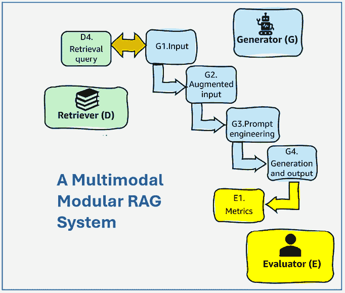
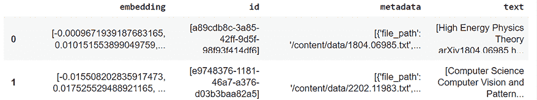
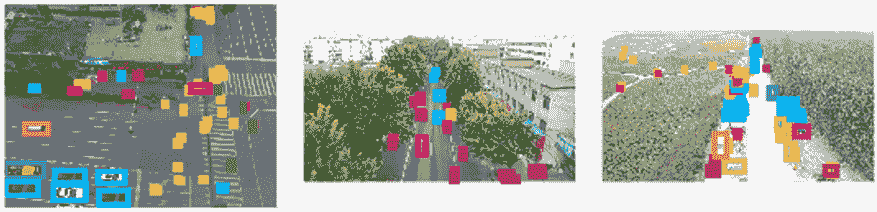
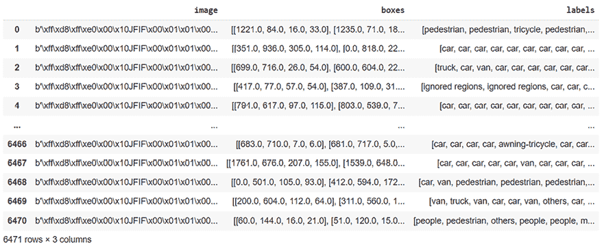
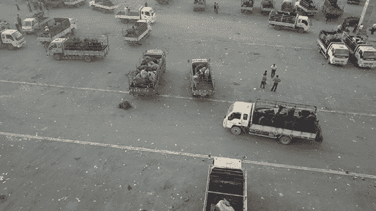
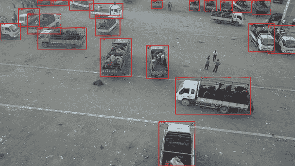
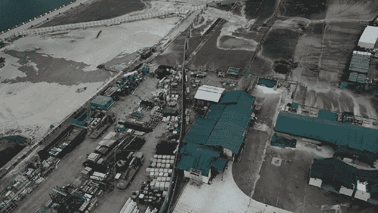
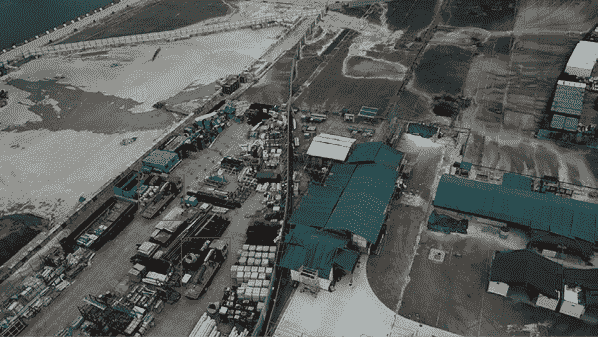

# 无人机技术的多模态模块化 RAG

在本章中，我们将通过模块化 RAG 将生成 AI 提升到新的水平。我们将构建一个使用不同组件或模块来处理不同类型数据和任务的系统。例如，一个模块使用 LLM 处理文本信息，正如我们在上一章所做的那样，而另一个模块管理图像数据，识别和标记图像中的对象。想象一下在无人机中使用这项技术，无人机已成为各个行业的关键，提供了增强的空中摄影、高效的农业监测和有效的搜救行动能力。它们甚至使用先进的计算机视觉技术和算法来分析图像并识别行人、汽车、卡车等对象。然后我们可以激活一个 LLM 代理来检索、增强并对用户的提问做出响应。

在本章中，我们将构建一个多模态模块化 RAG 程序，使用来自多个来源的文本和图像数据来生成关于无人机技术的响应。我们首先定义模块化 RAG 的主要方面，包括多模态数据、多源检索、模块化生成和增强输出。然后，我们将使用 LlamaIndex、Deep Lake 和 OpenAI 在 Python 中构建一个多模态模块化 RAG 驱动的生成 AI 系统，应用于无人机技术。

我们的系统将使用两个数据集：第一个包含上一章中我们构建的关于无人机的文本信息，第二个包含来自 Activeloop 的无人机图像和标签。我们将使用 Deep Lake 来处理多模态数据，使用 LlamaIndex 进行索引和检索，以及使用 OpenAI 的 LLM 进行生成查询。我们将添加包含文本和图像的多模态增强输出。最后，我们将为文本响应构建性能指标，并引入 GPT-4o，OpenAI 强大的**多模态 LLM**（**MMLLM**）的图像识别指标。到本章结束时，你将了解如何利用创新的多模态和多源功能构建一个多模态模块化 RAG 工作流程。

本章涵盖了以下主题：

+   多模态模块化 RAG

+   多源检索

+   OpenAI LLM 引导的多模态多源检索

+   Deep Lake 多模态数据集

+   基于图像元数据的检索

+   增强多模态输出

让我们先定义多模态模块化 RAG。

# 什么是多模态模块化 RAG？

多模态数据结合了不同形式的信息，如文本、图像、音频和视频，以丰富数据分析和理解。同时，当系统利用不同的模块来处理不同类型的数据和任务时，它就是一个模块化 RAG 系统。每个模块都是专业化的；例如，一个模块将专注于文本，另一个模块将专注于图像，展示了复杂的集成能力，增强了通过检索的多模态数据生成的响应。

本章的程序也将通过我们使用的两个数据集实现多源。我们将使用前几章中构建的无人机技术 LLM 数据集。我们还将使用包含由无人机捕获的数千个标记图像的 Deep Lake 多模态 VisDrone 数据集。

我们选择无人机作为示例，因为无人机在各个行业中已成为关键，提供了增强的空中摄影能力、高效的农业监测以及有效的搜救作业。它们还促进了野生动物追踪，简化了商业配送，并使基础设施检查更安全。此外，无人机支持环境研究、交通管理和消防。它们可以增强执法部门的监控，通过提高可访问性、安全性和成本效益来革新多个领域。

*图 4.1*包含本章我们将实施的流程。它基于*第一章*，*为什么检索增强生成？*中*图 1.3*所展示的生成 RAG 生态系统。我们在前几章中添加了嵌入和索引功能，但本章将专注于检索和生成。我们将构建的系统模糊了检索和生成之间的界限，因为生成器在检索（无缝评分和排名）以及本章笔记本中的生成方面都得到了大量使用。



图 4.1：多模态模块化 RAG 系统

本章旨在构建一个以无人机技术为重点的教育模块化 RAG 问答系统。你可以依赖前几章笔记本中实现的功能，例如*第二章*中的 Deep Lake 向量，*使用 Deep Lake 和 OpenAI 构建 RAG 嵌入向量存储*，以及*第三章*中的 LlamaIndex 索引，*使用 LlamaIndex、Deep Lake 和 OpenAI 构建基于索引的 RAG*。如有必要，请花时间回顾前几章并查看。

在本章中，我们将探讨多模态、多源、模块化 RAG 生态系统，如图*4.1*所示。我们将使用本章中用斜体表示的标题和副标题。此外，每个阶段都由*图 4.1*中的位置先行。

+   **(D4)** *加载*第三章中创建的*LLM 数据集*，其中包含关于无人机的文本数据。

+   **(D4)** 使用`VectorStoreIndex`初始化 LLM 查询引擎，并设置创建的索引用于查询引擎，这与**(G4)**重叠，因为两者都是 OpenAI GPT 模型下的检索器和生成器。

+   **(G1)** 定义多模态模块化 RAG 的*用户输入*，适用于 LLM 查询引擎（用于文本数据集）和多模态查询引擎（用于`VisDrone`数据集）。

一旦加载了文本数据集，创建了查询引擎，并将用户输入定义为文本数据集和多模态数据集的基线查询，过程将继续通过为 *第二章* 中创建的文本数据集生成响应来继续。

+   在查询文本数据集 **（G1）**、**（G2）** 和 **（G4）** 时，它们在同一个无缝的 LlamaIndex 流程中重叠，该流程检索数据和生成内容。响应在会话期间被保存为 `llm_response`。

现在，多模态 `VisDrone` 数据集将被加载到内存中并进行查询：

+   **（D4）** 多模态过程首先通过 *加载和可视化多模态数据集* 开始。然后程序继续通过 *导航多模态数据集结构*、*选择一个图像* 和 *添加边界框*。

然后，将应用于文本数据集的相同过程应用于 `VisDrone` 多模态数据集：

+   **（D4）** 通过使用 `VectorStoreIndex` 基于数据集 `VisDrone` 创建向量存储索引，并设置创建的索引以供查询引擎使用，通过 LlamaIndex 构建 *构建一个多模态查询引擎*，这与其重叠，作为 OpenAI GPT 的检索器和生成器 **（G4）**。

+   **（G1）** 多模态搜索引擎的用户输入与 *多模态模块化 RAG* 的用户输入相同，因为它用于 LLM 查询引擎（用于文本数据集）和多模态查询引擎（用于 `VisDrone` 数据集）。

多模态 `VisDrone` 数据集现在将被加载和索引，查询引擎已准备就绪。**（G1）** 用户输入的目的是让 LlamaIndex 查询引擎使用一个 LLM（在这种情况下，是一个 OpenAI 模型）从 VisDrone 中检索相关文档。然后，检索函数将追踪响应回其多模态数据集中的来源，以找到源节点的图像。实际上，我们正在使用查询引擎通过其文本响应来获取图像：

+   **（G1）**、**（G2）** 和 **（G4）** 在对 `VisDrone` 多模态数据集进行查询时在无缝的 LlamaIndex 查询中重叠。

+   处理响应 **（G4）** 以找到源节点并检索其图像，使我们回到 **（D4）** 进行图像检索。这导致选择和处理源节点的图像。

在这一点上，我们现在有了文本和图像响应。然后我们可以构建一个摘要，并在可视化每个阶段所花费的时间后应用准确度性能指标：

+   **（G4）** 我们在一个 *多模态模块化摘要* 中呈现了 LLM 响应和带有多模态响应图像的增强输出。

+   **（E）** 最后，我们创建一个 *LLM 性能指标* 和一个 *多模态性能指标*。然后我们将它们作为一个 *多模态模块化 RAG 性能指标* 相加。

从这个多模态模块化 RAG 系统中，我们可以得出两个结论：

+   我们在本章中构建的系统是 RAG 驱动的生成式 AI 在现实项目中设计的许多方法之一。每个项目都会有其特定的需求和架构。

+   从生成式 AI 到由 RAG 驱动的生成式 AI 的快速演变，需要在本章中相应地开发无缝集成的跨平台组件，如 LlamaIndex、Deep Lake 和 OpenAI。这些平台还与许多其他框架集成，例如 Pinecone 和 LangChain，我们将在**第六章**，*使用 Pinecone 扩展 RAG 银行客户数据*中讨论。

现在，让我们深入 Python，构建多模态模块化 RAG 程序。

# 为无人机技术构建多模态模块化 RAG 程序

在以下部分中，我们将从头开始使用 Python 逐步构建一个多模态模块化 RAG 驱动的生成式系统。我们将实现：

+   由 LlamaIndex 管理的 OpenAI LLM 处理和理解有关无人机的文本

+   深湖多模态数据集包含无人机图像及其标签

+   函数用于显示图像并在其中使用边界框识别对象

+   一个可以使用文本和图像回答有关无人机技术问题的系统

+   针对测量模块化多模态响应准确性的性能指标，包括使用 GPT-4o 进行图像分析

此外，请确保您已经在**第二章**中创建了 LLM 数据集，因为我们将在本节中加载它。然而，您可以在不运行笔记本的情况下阅读本章，因为它包含代码和解释，是自包含的。现在，让我们开始工作！

打开 GitHub 仓库中本章节的`Multimodal_Modular_RAG_Drones.ipynb`笔记本，网址为[`github.com/Denis2054/RAG-Driven-Generative-AI/tree/main/Chapter04`](https://github.com/Denis2054/RAG-Driven-Generative-AI/tree/main/Chapter04)。安装的包与上一章中**安装环境**部分列出的相同。以下每个部分都将指导您构建多模态模块化笔记本，从 LLM 模块开始。让我们一步一步地通过笔记本的每个部分。

## 加载 LLM 数据集

我们将加载在**第三章**中创建的无人机数据集。请确保插入您数据集的路径：

```py
import deeplake
dataset_path_llm = "hub://denis76/drone_v2"
ds_llm = deeplake.load(dataset_path_llm) 
```

输出将确认数据集已加载，并将显示您的数据集链接：

```py
This dataset can be visualized in Jupyter Notebook by ds.visualize() or at https://app.activeloop.ai/denis76/drone_v2
hub://denis76/drone_v2 loaded successfully. 
```

程序现在创建一个字典来保存数据，以便将其加载到 pandas DataFrame 中以可视化：

```py
import json
import pandas as pd
import numpy as np
# Create a dictionary to hold the data
data_llm = {}
# Iterate through the tensors in the dataset
for tensor_name in ds_llm.tensors:
    tensor_data = ds_llm[tensor_name].numpy()
    # Check if the tensor is multi-dimensional
    if tensor_data.ndim > 1:
        # Flatten multi-dimensional tensors
        data_llm[tensor_name] = [np.array(e).flatten().tolist() for e in tensor_data]
    else:
        # Convert 1D tensors directly to lists and decode text
        if tensor_name == "text":
            data_llm[tensor_name] = [t.tobytes().decode('utf-8') if t else "" for t in tensor_data]
        else:
            data_llm[tensor_name] = tensor_data.tolist()
# Create a Pandas DataFrame from the dictionary
df_llm = pd.DataFrame(data_llm)
df_llm 
```

输出显示了文本数据集的结构：`embedding`（向量）、`id`（唯一字符串标识符）、`metadata`（在这种情况下，数据的来源）和`text`，其中包含内容：



图 4.2：文本数据集结构和内容的输出

我们现在将初始化 LLM 查询引擎。

### 初始化 LLM 查询引擎

如同*第三章*，*使用 LlamaIndex、Deep Lake 和 OpenAI 构建基于索引的 RAG*，我们将从数据集（`ds`）的无人机文档集合（`documents_llm`）初始化一个向量存储索引。`GPTVectorStoreIndex.from_documents()`方法创建一个基于向量相似性提高文档检索速度的索引：

```py
from llama_index.core import VectorStoreIndex
vector_store_index_llm = VectorStoreIndex.from_documents(documents_llm) 
```

`as_query_engine()`方法配置此索引为具有特定参数的查询引擎，如同*第三章*中所述，用于相似性和检索深度，允许系统通过找到最相关的文档来回答查询：

```py
vector_query_engine_llm = vector_store_index_llm.as_query_engine(similarity_top_k=2, temperature=0.1, num_output=1024) 
```

现在，程序引入了用户输入。

#### 多模态模块化 RAG 的用户输入

在模块化 RAG 系统的上下文中定义用户输入的目的是制定一个查询，该查询将有效地利用基于文本和基于图像的能力。这允许系统通过利用多个信息源生成全面且准确响应：

```py
user_input="How do drones identify a truck?" 
```

在这个背景下，用户输入是**基准**、起点或用于评估系统能力的标准查询。它将建立系统利用其可用资源（例如，来自各种数据集的文本和图像数据）处理和响应查询的初始参考框架。在这个例子中，基准是经验性的，并将从该参考点评估系统。

#### 查询文本数据集

我们将像*第三章*中那样运行向量查询引擎请求：

```py
import time
import textwrap
#start the timer
start_time = time.time()
llm_response = vector_query_engine_llm.query(user_input)
# Stop the timer
end_time = time.time()
# Calculate and print the execution time
elapsed_time = end_time - start_time
print(f"Query execution time: {elapsed_time:.4f} seconds")
print(textwrap.fill(str(llm_response), 100)) 
```

执行时间令人满意：

```py
Query execution time: 1.5489 seconds 
```

输出内容也令人满意：

```py
Drones can identify a truck using visual detection and tracking methods, which may involve deep neural networks for performance benchmarking. 
```

程序现在加载多模态无人机数据集。

## 加载和可视化多模态数据集

我们将使用 Deep Lake 上现有的公开 VisDrone 数据集：[`datasets.activeloop.ai/docs/ml/datasets/visdrone-dataset/`](https://datasets.activeloop.ai/docs/ml/datasets/visdrone-dataset/)。我们**不会**创建向量存储，而是简单地加载现有的数据集到内存中：

```py
import deeplake
dataset_path = 'hub://activeloop/visdrone-det-train'
ds = deeplake.load(dataset_path) # Returns a Deep Lake Dataset but does not download data locally 
```

输出将显示一个链接到在线数据集，您可以使用 SQL 或如果您更喜欢，使用 Deep Lake 提供的工具进行自然语言处理命令来探索：

```py
Opening dataset in read-only mode as you don't have write permissions.
This dataset can be visualized in Jupyter Notebook by ds.visualize() or at https://app.activeloop.ai/activeloop/visdrone-det-train
hub://activeloop/visdrone-det-train loaded successfully. 
```

让我们显示摘要以在代码中探索数据集：

```py
ds.summary() 
```

输出提供了有关数据集结构的有用信息：

```py
Dataset(path='hub://activeloop/visdrone-det-train', read_only=True, tensors=['boxes', 'images', 'labels'])
tensor    htype            shape              dtype     compression
------    -----            -----              -----     -----------
boxes     bbox         (6471, 1:914, 4)       float32          None
images    image        (6471, 360:1500,                            
                        480:2000, 3)          uint8            jpeg
labels    class_label  (6471, 1:914)          uint32           None 
```

结构包含图像、图像中对象的边界框框，以及描述图像和边界框的标签。让我们在代码中可视化数据集：

```py
ds.visualize() 
```

输出显示了图像及其边界框：



图 4.3：显示边界框的输出

现在，让我们进一步显示数据集的内容在一个 pandas DataFrame 中，以查看图像的外观：

```py
import pandas as pd
# Create an empty DataFrame with the defined structure
df = pd.DataFrame(columns=['image', 'boxes', 'labels'])
# Iterate through the samples using enumerate
for i, sample in enumerate(ds):
    # Image data (choose either path or compressed representation)
    # df.loc[i, 'image'] = sample.images.path  # Store image path
    df.loc[i, 'image'] = sample.images.tobytes()  # Store compressed image data
    # Bounding box data (as a list of lists)
    boxes_list = sample.boxes.numpy(aslist=True)
    df.loc[i, 'boxes'] = [box.tolist() for box in boxes_list]
    # Label data (as a list)
    label_data = sample.labels.data()
    df.loc[i, 'labels'] = label_data['text']
df 
```

*图 4.4*中的输出显示了数据集的内容：



图 4.4：VisDrone 数据集的摘录

数据集中有 6,471 行图像和 3 列：

+   `image`列包含图像。数据集中图像的格式，如字节序列`b'\xff\xd8\xff\xe0\x00\x10JFIF\x00\x01\x01\x00...'`所示，是 JPEG。字节`b'\xff\xd8\xff\xe0'`特别表示 JPEG 图像文件的开始。

+   `boxes`列包含图像中边界框的坐标和尺寸，通常格式为`[x, y, width, height]`。

+   `labels`列包含`boxes`列中每个边界框的标签。

我们可以显示图像的标签列表：

```py
labels_list = ds.labels.info['class_names']
labels_list 
```

输出提供了标签列表，它定义了数据集的范围：

```py
['ignored regions',
 'pedestrian',
 'people',
 'bicycle',
 'car',
 'van',
 'truck',
 'tricycle',
 'awning-tricycle',
 'bus',
 'motor',
 'others'] 
```

通过这样，我们已经成功加载了数据集，现在将探索多模态数据集结构。

## 导航多模态数据集结构

在本节中，我们将选择一张图像并使用数据集的图像列来显示它。然后，我们将添加我们选择的标签的边界框。程序首先选择一张图像。

### 选择和显示图像

我们将选择数据集中的第一张图像：

```py
# choose an image
ind=0
image = ds.images[ind].numpy() # Fetch the first image and return a numpy array 
```

现在，让我们不显示边界框来显示它：

```py
import deeplake
from IPython.display import display
from PIL import Image
import cv2  # Import OpenCV
image = ds.images[0].numpy()
# Convert from BGR to RGB (if necessary)
image_rgb = cv2.cvtColor(image, cv2.COLOR_BGR2RGB)
# Create PIL Image and display
img = Image.fromarray(image_rgb)
display(img) 
```

显示的图像包含卡车、行人和其他类型的物体：



图 4.5：显示物体的输出

现在图像已显示，程序将添加边界框。

### 添加边界框并保存图像

我们已经显示了第一张图像。然后程序将检索所选图像的所有标签：

```py
labels = ds.labels[ind].data() # Fetch the labels in the selected image
print(labels) 
```

输出显示`value`，它包含标签的数值索引，以及`text`，它包含相应的文本标签：

```py
{'value': array([1, 1, 7, 1, 1, 1, 1, 6, 6, 6, 6, 6, 6, 6, 6, 6, 6, 1, 6, 6, 6, 6,
       1, 1, 1, 1, 1, 1, 6, 6, 3, 6, 6, 1, 1, 1, 1, 1, 1, 1, 1, 1, 1, 1,
       1, 6, 6, 6], dtype=uint32), 'text': ['pedestrian', 'pedestrian', 'tricycle', 'pedestrian', 'pedestrian', 'pedestrian', 'pedestrian', 'truck', 'truck', 'truck', 'truck', 'truck', 'truck', 'truck', 'truck', 'truck', 'truck', 'pedestrian', 'truck', 'truck', 'truck', 'truck', 'pedestrian', 'pedestrian', 'pedestrian', 'pedestrian', 'pedestrian', 'pedestrian', 'truck', 'truck', 'bicycle', 'truck', 'truck', 'pedestrian', 'pedestrian', 'pedestrian', 'pedestrian', 'pedestrian', 'pedestrian', 'pedestrian', 'pedestrian', 'pedestrian', 'pedestrian', 'pedestrian', 'pedestrian', 'truck', 'truck', 'truck']} 
```

我们可以在两列中显示值和相应的文本：

```py
values = labels['value']
text_labels = labels['text']
# Determine the maximum text label length for formatting
max_text_length = max(len(label) for label in text_labels)
# Print the header
print(f"{'Index':<10}{'Label':<{max_text_length + 2}}")
print("-" * (10 + max_text_length + 2))  # Add a separator line
# Print the indices and labels in two columns
for index, label in zip(values, text_labels):
    print(f"{index:<10}{label:<{max_text_length + 2}}") 
```

输出清楚地表示了图像标签的内容：

```py
Index     Label     
----------------------
1         pedestrian
1         pedestrian
7         tricycle  
1         pedestrian
1         pedestrian
1         pedestrian
1         pedestrian
6         truck     
6         truck    … 
```

我们可以按图像的类名字符串（标签）分组：

```py
ds.labels[ind].info['class_names'] # class names of the selected image 
```

我们现在可以分组并显示描述图像的所有标签：

```py
ds.labels[ind].info['class_names'] #class names of the selected image 
```

我们可以看到图像中包含的所有类别：

```py
['ignored regions',
 'pedestrian',
 'people',
 'bicycle',
 'car',
 'van',
 'truck',
 'tricycle',
 'awning-tricycle',
 'bus',
 'motor',
 'others'] 
```

标签类别的数量有时会超过人眼在图像中可以看到的数量。

现在我们添加边界框。我们首先创建一个函数来添加边界框，显示它们，并保存图像：

```py
def display_image_with_bboxes(image_data, bboxes, labels, label_name, ind=0):
    #Displays an image with bounding boxes for a specific label.
    image_bytes = io.BytesIO(image_data)
    img = Image.open(image_bytes)
    # Extract class names specifically for the selected image
    class_names = ds.labels[ind].info['class_names']
    # Filter for the specific label (or display all if class names are missing)
    if class_names is not None:
        try:
            label_index = class_names.index(label_name)
            relevant_indices = np.where(labels == label_index)[0]
        except ValueError:
            print(f"Warning: Label '{label_name}' not found. Displaying all boxes.")
            relevant_indices = range(len(labels))
    else:
        relevant_indices = []  # No labels found, so display no boxes
    # Draw bounding boxes
    draw = ImageDraw.Draw(img)
    for idx, box in enumerate(bboxes):  # Enumerate over bboxes
        if idx in relevant_indices:   # Check if this box is relevant
            x1, y1, w, h = box
            x2, y2 = x1 + w, y1 + h
            draw.rectangle([x1, y1, x2, y2], outline="red", width=2)
            draw.text((x1, y1), label_name, fill="red")
    # Save the image
    save_path="boxed_image.jpg"
    img.save(save_path)
    display(img) 
```

我们可以为特定标签添加边界框。在这种情况下，我们选择了`"truck"`标签：

```py
import io
from PIL import ImageDraw
# Fetch labels and image data for the selected image
labels = ds.labels[ind].data()['value']
image_data = ds.images[ind].tobytes()
bboxes = ds.boxes[ind].numpy()
ibox="truck" # class in image
# Display the image with bounding boxes for the label chosen
display_image_with_bboxes(image_data, bboxes, labels, label_name=ibox) 
```

现在显示的图像包含了卡车的边界框：

图 4.6：显示边界框的输出

现在我们激活一个查询引擎来检索并获得响应。

## 构建多模态查询引擎

在本节中，我们将查询 VisDrone 数据集并检索一个符合我们在本笔记本的“*用户输入的多模态模块 RAG*”部分中输入的用户输入的图像。为了实现这个目标，我们将：

1.  为包含 VisDrone 数据集的图像、框数据和标签的`df` DataFrame 的每一行创建一个向量索引。

1.  创建一个查询引擎，该引擎将查询数据集的文本数据，检索相关图像信息，并提供文本响应。

1.  解析响应中的节点以找到与用户输入相关的关键词。

1.  解析响应中的节点以找到源图像。

1.  将源图像的边界框添加到图像中。

1.  保存图像。

### 创建向量索引和查询引擎

代码首先创建一个文档，该文档将被处理以创建多模态无人机数据集的向量存储索引。我们在 GitHub 笔记本的*加载和可视化多模态数据集*部分创建的`df` DataFrame 没有唯一的索引或嵌入。我们将使用 LlamaIndex 在内存中创建它们。

程序首先为 DataFrame 分配一个唯一的 ID：

```py
# The DataFrame is named 'df'
df['doc_id'] = df.index.astype(str)  # Create unique IDs from the row indices 
```

这行代码向`df` DataFrame 添加了一个名为`doc_id`的新列。它通过将 DataFrame 的行索引转换为字符串为每一行分配唯一标识符。初始化了一个名为`documents`的空列表，我们将使用它来创建向量索引：

```py
# Create documents (extract relevant text for each image's labels)
documents = [] 
```

现在，`iterrows()`方法遍历 DataFrame 的每一行，生成一系列索引和行对：

```py
for _, row in df.iterrows():
    text_labels = row['labels'] # Each label is now a string
    text = " ".join(text_labels) # Join text labels into a single string
    document = Document(text=text, doc_id=row['doc_id'])
    documents.append(document) 
```

`documents`附加了数据集中的所有记录，并创建了一个 DataFrame：

```py
# The DataFrame is named 'df'
df['doc_id'] = df.index.astype(str)  # Create unique IDs from the row indices
# Create documents (extract relevant text for each image's labels)
documents = []
for _, row in df.iterrows():
    text_labels = row['labels'] # Each label is now a string
    text = " ".join(text_labels) # Join text labels into a single string
    document = Document(text=text, doc_id=row['doc_id'])
    documents.append(document) 
```

文档现在准备好使用`GPTVectorStoreIndex`进行索引：

```py
from llama_index.core import GPTVectorStoreIndex
vector_store_index = GPTVectorStoreIndex.from_documents(documents) 
```

数据集随后无缝地配备了我们可以可视化在索引字典中的索引：

```py
vector_store_index.index_struct 
```

输出显示现在已将索引添加到数据集中：

```py
IndexDict(index_id='4ec313b4-9a1a-41df-a3d8-a4fe5ff6022c', summary=None, nodes_dict={'5e547c1d-0d65-4de6-b33e-a101665751e6': '5e547c1d-0d65-4de6-b33e-a101665751e6', '05f73182-37ed-4567-a855-4ff9e8ae5b8c': '05f73182-37ed-4567-a855-4ff9e8ae5b8c' 
```

我们现在可以在多模态数据集上运行查询。

### 在 VisDrone 多模态数据集上运行查询

现在，我们将`vector_store_index`设置为查询引擎，正如我们在第三章的*向量存储索引查询引擎*部分所做的那样：

```py
vector_query_engine = vector_store_index.as_query_engine(similarity_top_k=1, temperature=0.1, num_output=1024) 
```

我们也可以在像第三章中 LLM 数据集那样对无人机图像数据集运行查询：

```py
import time
start_time = time.time()
response = vector_query_engine.query(user_input)
# Stop the timer
end_time = time.time()
# Calculate and print the execution time
elapsed_time = end_time - start_time
print(f"Query execution time: {elapsed_time:.4f} seconds") 
```

执行时间是令人满意的：

```py
Query execution time: 1.8461 seconds 
```

现在，我们将检查文本响应：

```py
print(textwrap.fill(str(response), 100)) 
```

我们可以看到输出是逻辑的，因此是令人满意的。

无人机使用各种传感器，如摄像头、激光雷达和 GPS，以识别和跟踪像卡车这样的物体。

### 处理响应

现在，我们将解析响应中的节点，以找到响应中的独特单词，并从中选择一个用于这个笔记本：

```py
from itertools import groupby
def get_unique_words(text):
    text = text.lower().strip()
    words = text.split()
    unique_words = [word for word, _ in groupby(sorted(words))]
    return unique_words
for node in response.source_nodes:
    print(node.node_id)
    # Get unique words from the node text:
    node_text = node.get_text()
    unique_words = get_unique_words(node_text)
    print("Unique Words in Node Text:", unique_words) 
```

我们找到了一个独特的单词（`'truck'`）及其独特的索引，这将直接带我们到生成响应的节点源图像：

```py
1af106df-c5a6-4f48-ac17-f953dffd2402
Unique Words in Node Text: ['truck'] 
```

我们可以选择更多的单词，并根据每个项目的具体要求以多种不同的方式设计这个函数。

现在，我们将通过源节点搜索图像，就像我们在上一章的*查询响应和源*部分的 LLM 数据集上所做的那样。多模态向量存储和查询框架是灵活的。一旦我们学会了如何在 LLM 和多模态数据集上执行检索，我们就准备好应对任何可能出现的情况了！

让我们选择并处理与图像相关的信息。

### 选择并处理源节点的图像

在运行图像检索和显示功能之前，让我们首先删除我们在本笔记本的*添加边界框并保存图像*部分中显示的图像，以确保我们正在处理一张新图像：

```py
# deleting any image previously saved
!rm /content/boxed_image.jpg 
```

我们现在可以搜索源图像，调用边界框，并显示和保存我们之前定义的功能：

```py
display_image_with_bboxes(image_data, bboxes, labels, label_name=ibox) 
```

程序现在通过关键字 `"truck"` 进行源节点搜索，应用边界框，并显示和保存图像：

```py
import io
from PIL import Image
def process_and_display(response, df, ds, unique_words):
    """Processes nodes, finds corresponding images in dataset, and displays them with bounding boxes.
    Args:
        response: The response object containing source nodes.
        df: The DataFrame with doc_id information.
        ds: The dataset containing images, labels, and boxes.
        unique_words: The list of unique words for filtering.
    """
…
            if i == row_index:
                image_bytes = io.BytesIO(sample.images.tobytes())
                img = Image.open(image_bytes)
                labels = ds.labels[i].data()['value']
                image_data = ds.images[i].tobytes()
                bboxes = ds.boxes[i].numpy()
                ibox = unique_words[0]  # class in image
                display_image_with_bboxes(image_data, bboxes, labels, label_name=ibox)
# Assuming you have your 'response', 'df', 'ds', and 'unique_words' objects prepared:
process_and_display(response, df, ds, unique_words) 
```

输出令人满意：



图 4.7：显示满意的结果

## 多模态模块化总结

我们已经逐步构建了一个多模态模块化程序，现在可以将其汇总。我们将创建一个函数来显示对用户输入的响应的源图像，然后打印用户输入和 LLM 输出，并显示图像。

首先，我们创建一个函数来显示多模态检索引擎保存的源图像：

```py
# 1.user input=user_input
print(user_input)
# 2.LLM response
print(textwrap.fill(str(llm_response), 100))
# 3.Multimodal response
image_path = "/content/boxed_image.jpg"
display_source_image(image_path) 
```

然后，我们可以显示用户输入、LLM 响应和多模态响应。输出首先显示文本响应（用户输入和 LLM 响应）：

```py
How do drones identify a truck?
Drones can identify a truck using visual detection and tracking methods, which may involve deep neural networks for performance benchmarking. 
```

然后，显示带有卡车边界框的图像：



图 4.8：显示边界框的输出

通过向经典的 LLM 响应中添加图像，我们增强了输出。多模态 RAG 输出增强通过向输入和输出添加信息来丰富生成式 AI。然而，对于所有 AI 程序，设计性能指标需要高效的图像识别功能。

## 性能指标

评估多模态模块化 RAG 的性能需要两种类型的测量：文本和图像。测量文本是直接的。然而，测量图像是一个相当大的挑战。分析多模态响应的图像相当不同。我们从多模态查询引擎中提取了一个关键词。然后，我们解析响应以显示源图像。然而，我们需要构建一种创新的方法来评估响应的源图像。让我们从 LLM 性能开始。

### LLM 性能指标

LlamaIndex 通过其查询引擎无缝调用了 OpenAI 模型，例如 GPT-4，并在其响应中提供了文本内容。对于文本响应，我们将使用与*第二章中*的*使用余弦相似度评估输出*部分以及*第三章中*的*向量存储索引查询引擎*部分相同的余弦相似度指标。

评估函数使用 `sklearn` 和 `sentence_transformers` 来评估两段文本之间的相似性——在这种情况下，是一个输入和一个输出：

```py
from sklearn.feature_extraction.text import TfidfVectorizer
from sklearn.metrics.pairwise import cosine_similarity
from sentence_transformers import SentenceTransformer
model = SentenceTransformer('all-MiniLM-L6-v2')
def calculate_cosine_similarity_with_embeddings(text1, text2):
    embeddings1 = model.encode(text1)
    embeddings2 = model.encode(text2)
    similarity = cosine_similarity([embeddings1], [embeddings2])
    return similarity[0][0] 
```

我们现在可以计算我们的基线用户输入和初始 LLM 响应之间的相似性：

```py
llm_similarity_score = calculate_cosine_similarity_with_embeddings(user_input, str(llm_response))
print(user_input)
print(llm_response)
print(f"Cosine Similarity Score: {llm_similarity_score:.3f}") 
```

输出显示了用户输入、文本响应以及两段文本之间的余弦相似度：

```py
How do drones identify a truck?
How do drones identify a truck?
Drones can identify a truck using visual detection and tracking methods, which may involve deep neural networks for performance benchmarking.
Cosine Similarity Score: 0.691 
```

输出令人满意。但现在我们需要设计一种方法来衡量多模态性能。

### 多模态性能指标

为了评估返回的图像，我们不能仅仅依赖于数据集中的标签。对于小型数据集，我们可以手动检查图像，但当系统扩展时，就需要自动化。在本节中，我们将使用 GPT-4o 的计算机视觉功能来分析图像，解析它以找到我们正在寻找的对象，并描述该图像。然后，我们将对 GPT-4o 提供的描述和它应该包含的标签应用余弦相似度。GPT-4o 是一个多模态生成 AI 模型。

让我们先对图像进行编码，以简化数据传输到 GPT-4o。Base64 编码将二进制数据（如图像）转换为 ASCII 字符，这些字符是标准文本字符。这种转换至关重要，因为它确保图像数据可以通过设计用于平滑处理文本数据的协议（如 HTTP）进行传输。它还避免了与二进制数据传输相关的问题，例如数据损坏或解释错误。

程序使用 Python 的 `base64` 模块对源图像进行编码：

```py
import base64
IMAGE_PATH = "/content/boxed_image.jpg"
# Open the image file and encode it as a base64 string
def encode_image(image_path):
    with open(image_path, "rb") as image_file:
        return base64.b64encode(image_file.read()).decode("utf-8")
base64_image = encode_image(IMAGE_PATH) 
```

我们现在创建一个 OpenAI 客户端并将模型设置为 `gpt-4o`：

```py
from openai import OpenAI
#Set the API key for the client
client = OpenAI(api_key=openai.api_key)
MODEL="gpt-4o" 
```

唯一单词将是 LLM 查询到我们通过解析响应获得的多元数据集的结果：

```py
u_word=unique_words[0]
print(u_word) 
```

我们现在可以将图像提交给 OpenAI GPT-4o：

```py
response = client.chat.completions.create(
    model=MODEL,
    messages=[
        {"role": "system", "content": f"You are a helpful assistant that analyzes images that contain {u_word}."},
        {"role": "user", "content": [
            {"type": "text", "text": f"Analyze the following image, tell me if there is one {u_word} or more in the bounding boxes and analyze them:"},
            {"type": "image_url", "image_url": {
                "url": f"data:image/png;base64,{base64_image}"}
            }
        ]}
    ],
    temperature=0.0,
)
response_image = response.choices[0].message.content
print(response_image) 
```

我们指示 `system` 和 `user` 角色分析图像以寻找我们的目标标签 `u_word`——在这种情况下，`truck`。然后我们将源节点图像提交给模型。描述图像的输出是令人满意的：

```py
The image contains two trucks within the bounding boxes. Here is the analysis of each truck:
1\. **First Truck (Top Bounding Box)**:
   - The truck appears to be a flatbed truck.
   - It is loaded with various materials, possibly construction or industrial supplies.
   - The truck is parked in an area with other construction materials and equipment.
2\. **Second Truck (Bottom Bounding Box)**:
   - This truck also appears to be a flatbed truck.
   - It is carrying different types of materials, similar to the first truck.
   - The truck is situated in a similar environment, surrounded by construction materials and equipment.
Both trucks are in a construction or industrial area, likely used for transporting materials and equipment. 
```

我们现在可以通过先添加一个 `"s"` 来与多个卡车在响应中进行对齐，然后将此响应提交给余弦相似度函数：

```py
resp=u_word+"s"
multimodal_similarity_score = calculate_cosine_similarity_with_embeddings(resp, str(response_image))
print(f"Cosine Similarity Score: {multimodal_similarity_score:.3f}") 
```

输出很好地描述了图像，但除了单词“`truck`”之外，还包含许多其他描述，这限制了其与请求输入的相似性：

```py
Cosine Similarity Score: 0.505 
```

一个人类观察者可能会批准图像和 LLM 响应。然而，即使得分非常高，问题仍然相同。复杂图像在详细和精确分析方面具有挑战性，尽管不断取得进展。让我们现在计算系统的整体性能。

### 多模态模块化 RAG 性能指标

为了获得系统的整体性能，我们将 LLM 响应和两个多模态响应性能的总和除以 `2`：

```py
score=(llm_similarity_score+multimodal_similarity_score)/2
print(f"Multimodal, Modular Score: {score:.3f}") 
```

结果表明，尽管观察结果的观察者可能感到满意，但自动评估复杂图像的相关性仍然很困难：

```py
Multimodal, Modular Score: 0.598 
```

该指标可以改进，因为人类观察者看到图像是相关的。这解释了为什么顶级 AI 代理，如 ChatGPT、Gemini 和 Bing Copilot，总是有一个包括点赞和踩的反馈过程。

让我们现在总结本章内容，并准备好进一步探索如何通过人类反馈来进一步提高 RAG 的性能。

# 摘要

本章带我们进入了多模态模块化 RAG 的世界，它使用不同的模块来处理不同的数据类型（文本和图像）和任务。我们利用了 LlamaIndex、Deep Lake 和 OpenAI 的功能，这些我们在前面的章节中进行了探索。Deep Lake VisDrone 数据集进一步介绍了我们如何使用无人机技术来分析图像和识别物体。该数据集包含图像、标签和边界框信息。在无人机技术方面的工作涉及多模态数据，这鼓励我们开发可以在许多领域使用的技能，例如野生动物追踪、简化商业配送和进行更安全的基础设施检查。

我们构建了一个多模态模块化 RAG 驱动的生成式 AI 系统。第一步是为 LLM 和多模态查询定义一个基线用户查询。我们首先查询了我们在*第三章*中实现的 Deep Lake 文本数据集。LlamaIndex 无缝运行查询引擎以检索、增强和生成响应。然后，我们加载了 Deep Lake VisDrone 数据集，并使用 LlamaIndex 将其在内存中索引以创建索引向量搜索检索管道。我们通过 LlamaIndex 查询它，它使用 OpenAI 模型（如 GPT-4）解析为关键词生成的文本。最后，我们搜索响应的源节点以找到源图像，显示它，并将 LLM 和图像响应合并为增强输出。我们对文本响应应用余弦相似度。评估图像具有挑战性，所以我们首先在检索到的图像上运行 GPT-4o 进行图像识别，以获得应用于余弦相似度的文本。

多模态模块化 RAG 驱动的生成式 AI 之旅使我们深入到 AI 的前沿。构建一个复杂的系统是现实生活中的 AI 项目的良好准备，这些项目通常需要实现多源、多模态和非结构化数据，从而导致模块化和复杂的系统。得益于对响应源的透明访问，可以利用、控制和改进 RAG 的复杂性。我们将看到如何利用响应源的透明度来引入人类反馈以改进 AI。下一章将带我们进一步探讨 AI 中的透明度和精确度。

# 问题

用*是*或*否*回答以下问题：

1.  多模态模块化 RAG 是否处理不同类型的数据，如文本和图像？

1.  无人机是否仅用于农业监测和航空摄影？

1.  本章中使用的 Deep Lake VisDrone 数据集是否仅用于文本数据？

1.  是否可以在无人机图像中添加边界框以识别如卡车和行人等物体？

1.  模块化系统是否为查询响应检索文本和图像数据？

1.  构建向量索引是否对于查询多模态 VisDrone 数据集是必要的？

1.  检索的图像是否在添加任何标签或边界框的情况下进行处理？

1.  多模态模块化 RAG 的性能指标是否仅基于文本响应？

1.  如本章所述的多模态系统是否只能处理与无人机相关的数据？

1.  在多模态 RAG 中评估图像是否像评估文本一样容易？

# 参考文献

+   LlamaIndex: [`docs.llamaindex.ai/en/stable/`](https://docs.llamaindex.ai/en/stable/)

+   Activeloop Deep Lake: [`docs.activeloop.ai/`](https://docs.activeloop.ai/)

+   OpenAI: [`platform.openai.com/docs/overview`](https://platform.openai.com/docs/overview)

# 进一步阅读

+   Retrieval-Augmented Multimodal Language Modeling, Yasunaga 等人 (2023), [`arxiv.org/pdf/2211.12561`](https://arxiv.org/pdf/2211.12561)

# 加入我们的 Discord 社区

加入我们社区的 Discord 空间，与作者和其他读者进行讨论：

[`www.packt.link/rag`](https://www.packt.link/rag)


