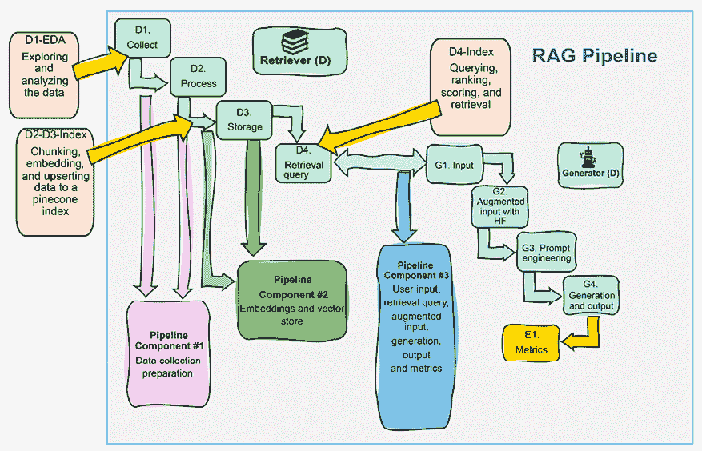
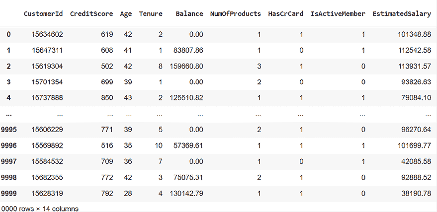
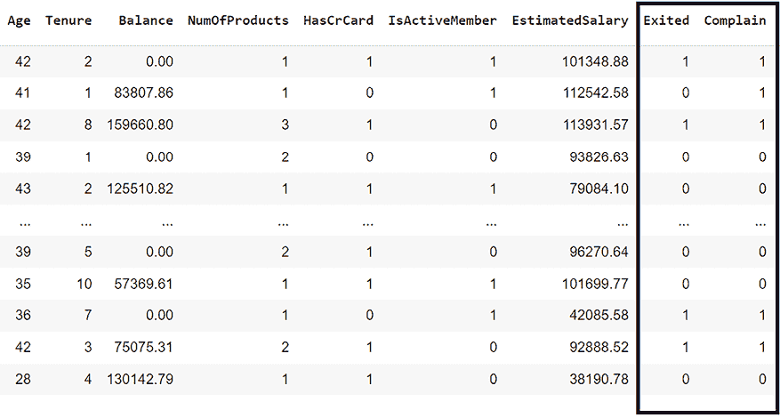
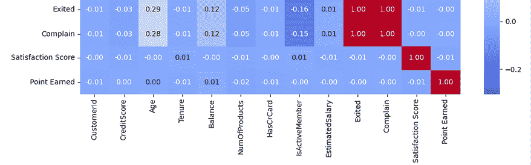
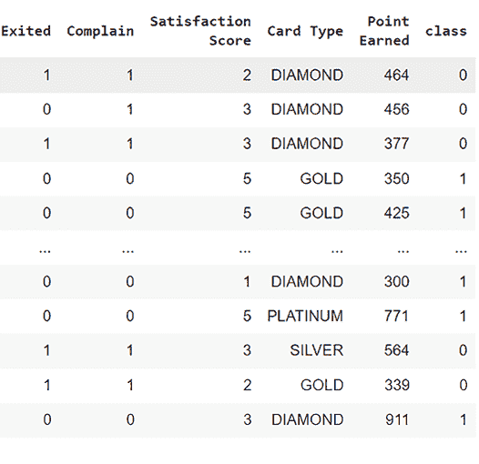
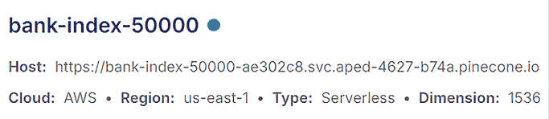

# 6

# 使用 Pinecone 缩放 RAG 银行客户数据

缩放 RAG 文档，无论是基于文本的还是多模态的，不仅仅是堆积和积累更多数据——它从根本上改变了应用程序的工作方式。首先，缩放是关于找到合适的数据量，而不仅仅是更多的数据。其次，随着数据的增加，对应用程序的需求可能会改变——它可能需要新的功能来处理更大的负载。最后，成本监控和速度性能将在缩放时限制我们的项目。因此，本章旨在为您提供利用 AI 解决您在项目中可能遇到的现实世界缩放挑战的最新技术。为此，我们将构建一个基于模式匹配的推荐系统，使用 Pinecone 来最小化银行客户流失（客户选择离开银行）。

我们将逐步介绍如何开发管道的第一个程序。在这里，您将学习如何下载 Kaggle 银行客户数据集并执行**探索性数据分析**（**EDA**）。这一基础步骤至关重要，因为它引导并支持您为下一阶段的处理准备数据集和您的 RAG 策略。我们的管道第二个程序将向您介绍 Pinecone 的强大组合——一个适合处理大规模向量搜索的向量数据库——以及 OpenAI 的 `text-embedding-3-small` 模型。在这里，您将在更新或插入记录之前对数据进行分块和嵌入，并将其放入我们将扩展到 1,000,000+ 向量的 Pinecone 索引中。我们将准备它以在令人满意的速度进行复杂的查询检索。最后，我们的管道第三个程序将向您展示如何使用 Pinecone 构建 RAG 查询，增强用户输入，并利用 GPT-4o 生成 AI 驱动的推荐。目标是通过对银行提供个性化、有洞察力的推荐来减少客户流失。到本章结束时，您将很好地理解如何将 Pinecone 和 OpenAI 技术的力量应用于您的 RAG 项目。

总结来说，本章涵盖了以下主题：

+   缩放 RAG 向量存储的关键方面

+   数据准备中的 EDA（探索性数据分析）

+   使用 Pinecone 向量存储进行缩放

+   客户银行信息的分块策略

+   使用 OpenAI 嵌入模型嵌入数据

+   数据更新插入

+   使用 Pinecone 进行 RAG 缩放

+   使用 GPT-4o 生成 AI 驱动的推荐以减少银行客户流失

让我们从定义如何使用 Pinecone 进行缩放开始。

# 使用 Pinecone 进行缩放

我们将使用 Pinecone 的创新向量数据库技术和 OpenAI 强大的嵌入能力来构建数据处理和查询系统。目标是构建一个推荐系统，鼓励客户继续与银行保持联系。一旦您理解了这种方法，您就可以将其应用于任何需要推荐（休闲、医疗或法律）的领域。为了理解和优化涉及到的复杂过程，我们将从零开始构建程序，使用最少的组件。在本章中，我们将使用 Pinecone 向量数据库和 OpenAI LLM 模型。

选择和设计架构取决于项目的具体目标。根据您项目的需求，您可以将此方法应用于其他平台。在本章中，我们将设计一个结合向量存储和生成式 AI 模型的架构，以简化操作并促进可扩展性。在明确了这一背景后，让我们来看看我们将用 Python 构建的架构。

## 架构

在本章中，我们将实现基于向量的相似性搜索功能，正如我们在第二章、第三章和第四章中所做的那样，这些章节分别是《使用 Deep Lake 和 OpenAI 构建 RAG 嵌入向量存储》、《使用 LlamaIndex、Deep Lake 和 OpenAI 构建基于索引的 RAG》和《构建基于 LlamaIndex 的 RAG》。我们将采用那些章节中设计的三个管道的结构，并将其应用于我们的推荐系统，如图 6.1 所示。如果需要，请在实现本章代码之前花时间回顾那些章节。



图 6.1：扩展由 RAG 驱动的生成式 AI 管道

我们将要构建的扩展推荐系统的主要特性可以总结为前面图中显示的三个管道：

+   **管道 1：收集和准备数据集**

在这个管道中，我们将使用标准查询和 k-means 聚类对数据集进行 EDA（探索性数据分析）。

+   **管道 2：扩展 Pinecone 索引（向量存储）**

在这个管道中，我们将看到如何将 1,000,000+个文档分块、嵌入并更新到 Pinecone 索引（向量存储）。

+   **管道 3：RAG 生成式 AI**

当我们查询超过 1,000,000 个向量的存储库并增强 GPT-4o 模型的输入以进行针对性推荐时，这个流程将使我们达到完全扩展的 RAG（Retrieval-Augmented Generation）。

我们将要探索的三个程序的主要理论和实际应用包括：

+   **可扩展和无服务器基础设施**：我们首先了解 Pinecone 的无服务器架构，它消除了服务器管理和扩展的复杂性。我们不需要管理存储资源或机器使用。这是一个基于无服务器索引的按需付费方法，例如，在`us-east-1`的**Amazon Web Services**（**AWS**）。因此，扩展和计费得到了简化，尽管我们仍然需要监控并最小化成本！

+   **轻量级和简化的开发环境**：我们的集成策略将最小化外部库的使用，保持轻量级开发堆栈。直接使用 OpenAI 生成嵌入，并使用 Pinecone 存储和查询这些嵌入简化了数据处理管道，提高了系统效率。尽管这种方法可能证明是有效的，但根据您的项目，其他方法也是可能的，正如本书其他章节所实施的那样。

+   **优化可扩展性和性能**：Pinecone 的向量数据库被设计用来有效地处理大规模数据集，确保随着数据量的增长，应用性能仍然令人满意。至于所有云平台和 API，在实施 Pinecone 和 OpenAI 时，检查隐私和安全约束。此外，持续监控系统性能和成本，正如我们在本章的*管道 2：扩展 Pinecone 索引（向量存储）*部分中所看到的。

现在让我们打开键盘来收集和处理`Bank Customer Churn`数据集。

# 管道 1：收集和准备数据集

本节将专注于处理和分析`Bank Customer Churn`数据集。我们将引导您完成设置环境、操作数据和应用**机器学习**（**ML**）技术的步骤。在使用算法作为工具之前，通过人工分析来获得数据集的“感觉”是很重要的。由于人类创造力的灵活性，人类洞察力始终是关键的。因此，我们将以三个主要步骤在 Python 中实施数据收集和准备：

1.  **收集和处理数据集**：

    +   设置 Kaggle 环境以进行身份验证和下载数据集

    +   收集和解压`Bank Customer Churn`数据集

    +   通过删除不必要的列简化数据集

1.  **探索性数据分析**：

    +   执行初步数据检查以了解我们所拥有的数据结构和类型

    +   调查客户投诉与流失（关闭账户）之间的关系

    +   探索年龄和薪资水平与客户流失的关系

    +   生成热图以可视化数值特征之间的相关性

1.  **训练 ML 模型**：

    +   准备 ML 数据

    +   应用聚类技术以发现客户行为中的模式

    +   评估不同聚类配置的有效性

    +   总结并过渡到由 RAG 驱动的生成式 AI

我们的目标是分析数据集并为其准备*管道 2：扩展 Pinecone 索引（向量存储）*。为了实现这一目标，我们需要对数据集进行初步的 EDA。此外，每个部分都旨在从头开始进行代码的实际演练，确保您获得实际经验和洞察力，了解数据科学工作流程。让我们从收集数据集开始。

## 1. 收集和处理数据集

让我们先在 Kaggle 上收集并处理`Bank` `Customer Churn`数据集：

[`www.kaggle.com/datasets/radheshyamkollipara/bank-customer-churn`](https://www.kaggle.com/datasets/radheshyamkollipara/bank-customer-churn)

文件`Customer-Churn-Records.csv`包含了一个银行 10,000 名客户记录的数据，该银行关注可能影响客户流失的各个方面。数据集由 Radheshyam Kollipara 上传，他正确地指出：

如我们所知，与保留现有客户相比，吸引新客户要昂贵得多。银行了解导致客户离开公司的因素是有利的。客户流失预防使公司能够开发忠诚度计划和保留活动，以尽可能多地保留客户。

下面是数据集中包含的列的详细信息，这些详细信息遵循 Kaggle 上的描述：

`RowNumber—对应记录（行）编号，对输出没有影响。`

`CustomerId—包含随机值，对客户离开银行没有影响。`

`Surname—客户的姓氏对其离开银行的决定没有影响。`

`CreditScore—可能会影响客户流失，因为信用评分较高的客户离开银行的可能性较低。`

`Geography—客户的位置可能影响其离开银行的决定。`

`Gender—探索性别在客户离开银行中是否起作用很有趣。`

`Age—这当然很重要，因为与年轻客户相比，年长客户离开银行的可能性较低。`

`Tenure—指客户成为银行客户的时间长度。通常，老客户更忠诚，离开银行的可能性更低。`

`Balance—也是客户流失的一个非常好的指标，因为与账户余额较低的人相比，账户余额较高的人离开银行的可能性较低。`

`NumOfProducts—指客户通过银行购买的产品数量。`

`HasCrCard—表示客户是否有信用卡。这一列也很相关，因为持有信用卡的人离开银行的可能性较低。`

`IsActiveMember—活跃客户离开银行的可能性较低。`

`EstimatedSalary—与余额一样，与高收入者相比，低收入者离开银行的可能性更高。`

`Exited—客户是否离开了银行。`

`Complain—客户是否投诉。`

`Satisfaction Score—客户对其投诉解决的评分。`

`Card Type—客户持有的卡类型。`

`Points Earned—客户使用信用卡获得的积分。`

现在我们知道了数据集包含的内容，我们需要收集它并对其进行 EDA 处理。让我们安装环境。

### 安装 Kaggle 的环境

要自动收集 Kaggle 数据集，您需要注册并创建一个 API 密钥，请访问[`www.kaggle.com/`](https://www.kaggle.com/)。在撰写此笔记本时，下载数据集是免费的。按照说明保存并使用您的 Kaggle API 密钥。请将密钥保存在安全的位置。在这种情况下，密钥存储在 Google Drive 上的一个文件中，我们需要将其挂载：

```py
#API Key
#Store your key in a file and read it(you can type it directly in the notebook but it will be visible for somebody next to you)
from google.colab import drive
drive.mount('/content/drive') 
```

程序现在读取 JSON 文件，并使用您的用户名和 API 密钥设置用于 Kaggle 认证的环境变量：

```py
import os
import json
with open(os.path.expanduser("drive/MyDrive/files/kaggle.json"), "r") as f:
    kaggle_credentials = json.load(f)
kaggle_username = kaggle_credentials["username"]
kaggle_key = kaggle_credentials["key"]
os.environ["KAGGLE_USERNAME"] = kaggle_username
os.environ["KAGGLE_KEY"] = kaggle_key 
```

我们现在已准备好安装 Kaggle 并对其进行认证：

```py
try:
  import kaggle
except:
  !pip install kaggle
import kaggle
kaggle.api.authenticate() 
```

就这样！这就是我们需要的所有东西。我们现在已准备好收集`银行客户流失`数据集。

### 收集数据集

现在我们将下载压缩的数据集，提取 CSV 文件，将其上传到 pandas DataFrame 中，删除我们将不会使用的列，并显示结果。让我们首先下载压缩的数据集：

```py
!kaggle datasets download -d radheshyamkollipara/bank-customer-churn 
```

输出显示了数据的来源：

```py
Dataset URL: https://www.kaggle.com/datasets/radheshyamkollipara/bank-customer-churn
License(s): other
bank-customer-churn.zip: Skipping, found more recently modified local copy (use --force to force download) 
```

我们现在可以解压数据：

```py
import zipfile
with zipfile.ZipFile('/content/bank-customer-churn.zip', 'r') as zip_ref:
    zip_ref.extractall('/content/')
print("File Unzipped!") 
```

输出应确认文件已解压：

```py
File Unzipped! 
```

CSV 文件已上传到名为`data1`的 pandas DataFrame 中：

```py
import pandas as pd
# Load the CSV file
file_path = '/content/Customer-Churn-Records.csv'
data1 = pd.read_csv(file_path) 
```

在这个场景中，我们将删除以下四个列：

+   `行号`: 我们不需要这些列，因为我们将为每条记录创建一个唯一的索引。

+   `姓氏`: 在这个场景中，目标是匿名化数据，不显示姓氏。我们将专注于客户档案和行为，例如投诉和信用卡消费（积分）。

+   `性别`: 在 2020 年代，消费者的感知和行为已经发生了变化。在样本项目中省略这些信息在道德上更加合理，并且同样高效。

+   `地理`: 在某些情况下，这个字段可能很有趣。对于这个场景，让我们去掉这个特性，以避免基于文化陈词滥调的输出过拟合。此外，如果我们想计算例如配送服务的距离，包括这个特性将需要更多信息：

```py
# Drop columns and update the DataFrame in place
data1.drop(columns=['RowNumber','Surname', 'Gender','Geography'], inplace=True)
data1 
```

由`data1`触发的输出显示了一个简化但足够的数据集：



图 6.2：触发的输出

这种方法的优点在于它优化了将要插入到 Pinecone 索引（向量存储）中的数据大小。在将数据插入 Pinecone 之前优化数据大小，通过删除不必要的字段来减少数据集，可以非常有好处。这减少了需要在向量存储中传输、存储和处理的 数据量。在扩展规模时，较小的数据大小可以导致查询性能更快和成本更低，因为 Pinecone 的定价可能取决于存储的数据量和用于查询的计算资源。

我们现在可以将新的 pandas DataFrame 保存到安全的位置：

```py
data1.to_csv('data1.csv', index=False)
!cp /content/data1.csv /content/drive/MyDrive/files/rag_c6/data1.csv 
```

您可以将其保存在最适合您的位置。只需确保保存它，因为我们将在本章的“管道 2：扩展 Pinecone 索引（向量存储）”部分使用它。我们现在将探索优化后的数据集，然后再决定如何在向量存储中实现它。

## 2. 探索性数据分析

在本节中，我们将使用 pandas 刚定义的数据执行 EDA，该数据包含来自银行的客户数据。EDA 是在应用任何与向量存储相关的 RAG 技术之前的一个关键步骤，因为它有助于我们理解数据中的潜在模式和趋势。

例如，我们的初步分析显示客户投诉与流失率之间存在直接相关性，表明提出投诉的客户更有可能离开银行。此外，我们的数据还显示，与年轻客户相比，50 岁及以上的客户不太可能流失。有趣的是，收入水平（尤其是 10 万美元的门槛）似乎并没有显著影响流失决策。

通过对这些洞察的仔细审查，我们将展示为什么直接跳入复杂的机器学习模型，尤其是深度学习，并不总是必要的或高效的，用于得出基本结论。在数据内部关系明显且模式直接的情况下，更简单的统计方法甚至基本的数据分析技术可能更合适且资源效率更高。例如，k-means 聚类分析可能非常有效，我们将在本章的“训练机器学习模型”部分实现它。

然而，这并不是要低估高级 RAG 技术的力量，我们将在本章的“管道 2：扩展 Pinecone 索引（向量存储）”部分探讨这些技术。在该部分，我们将在向量存储中应用深度学习，以揭示更微妙模式和复杂关系，这些关系通过经典的 EDA 并不明显。

如果我们显示 DataFrame 的列，我们可以看到找到模式是具有挑战性的：

```py
#   Column              Non-Null Count  Dtype
---  ------              --------------  -----
 0   CustomerId          10000 non-null  int64
 1   CreditScore         10000 non-null  int64
 **2   Age                 10000 non-null  int64**
 3   Tenure              10000 non-null  int64
 4   Balance             10000 non-null  float64
 5   NumOfProducts       10000 non-null  int64
 6   HasCrCard           10000 non-null  int64
 7   IsActiveMember      10000 non-null  int64
 **8   EstimatedSalary     10000 non-null  float64**
 **9   Exited              10000 non-null  int64**
 **10  Complain            10000 non-null  int64**
 11  Satisfaction Score  10000 non-null  int64
 12  Card Type           10000 non-null  object
 13  Point Earned        10000 non-null  int64 
```

`Age`、`EstimatedSalary` 和 `Complain` 是可能与 `Exited` 相关的可能决定性特征。我们还可以显示 DataFrame 以获得洞察，如下图中 `data1` 的摘录所示：



图 6.3：可视化客户投诉与银行流失（退出）之间的强相关性

主要特征似乎是 `Complain`，它导致 `Exited`（流失），如通过在 DataFrame 上运行标准计算所示：

```py
# Calculate the percentage of complain over exited
if sum_exited > 0:  # To avoid division by zero
    percentage_complain_over_exited = (sum_complain/ sum_exited) * 100
else:
    percentage_complain_over_exited = 0
# Print results
print(f"Sum of Exited = {sum_exited}")
print(f"Sum of Complain = {sum_complain}")
print(f"Percentage of complain over exited = {percentage_complain_over_exited:.2f}%") 
```

输出显示投诉与离开银行的客户（流失）之间非常高的 100.29% 比率。这意味着确实有投诉的客户离开了银行，这是一个自然的市场趋势：

```py
Sum of Exited = 2038
Sum of Complain = 2044
Percentage of complain over exited = 100.29% 
```

我们可以看到，只有少数客户（六位客户）在未投诉的情况下离开了银行。

运行以下来自 GitHub 的单元格；这些包含 Python 函数，是 `exited` 和 `complain` 比率的变体，并将产生以下输出：

+   使用`age=50`的阈值，`Age`和`Exited`显示，50 岁以上的人似乎不太可能离开银行：

    ```py
    Sum of Age 50 and Over among Exited = 634
    Sum of Exited = 2038
    Percentage of Age 50 and Over among Exited = 31.11% 
    ```

相反，输出结果显示，如果年轻客户不满意，他们似乎更有可能离开银行。你可以探索不同的年龄阈值来进一步分析数据集。

+   使用`salary_threshold=100000`的阈值，`Salary`和`Exited`似乎不是一个显著的特征，如输出所示：

    ```py
    Sum of Estimated Salary over 100000 among Exited = 1045
    Sum of Exited = 2038
    Percentage of Estimated Salary over 100000 among Exited = 51.28% 
    ```

尝试探索不同的阈值来分析数据集，以确认或反驳这一趋势。

让我们基于`data1` pandas DataFrame 创建一个热力图：

```py
import seaborn as sns
import matplotlib.pyplot as plt
# Select only numerical columns for the correlation heatmap
numerical_columns = data1.select_dtypes(include=['float64', 'int64']).columns
# Correlation heatmap
plt.figure(figsize=(12, 8))
sns.heatmap(data1[numerical_columns].corr(), annot=True, fmt='.2f', cmap='coolwarm')
plt.title('Correlation Heatmap')
plt.show() 
```

我们可以看到，最高的相关性存在于`Complain`和`Exited`之间：



图 6.4：热力图摘录

前面的热力图显示了数据集中每对特征（变量）之间的相关性。它显示了每对变量之间的相关系数，其范围可以从`-1`（低相关性）到`1`（高相关性），`0`表示没有相关性。

在此基础上，我们已经探索了几个特征。让我们构建一个机器学习模型来进一步探索。

## 3. 训练机器学习模型

让我们继续我们的 EDA，并使用机器学习模型进一步深入数据集。本节实现了使用聚类技术（特别是 k-means 聚类）训练机器学习模型，以探索数据集中的模式。我们将准备和处理数据以进行分析，应用聚类，然后使用不同的指标评估结果。这种方法对于提取洞察力而无需立即求助于更复杂的深度学习方法是有价值的。

k-means 聚类是一种无监督的机器学习算法，通过最小化每个聚类内的方差，将数据集划分为 k 个不同的、不重叠的聚类。该算法通过迭代地将数据点分配给 k 个聚类中的一个，基于最近的均值（质心），每次迭代后重新计算，直到收敛。

现在，让我们逐段分析代码。

### 数据准备和聚类

我们首先将我们章节的数据集`data1`复制到`data2`，以便在需要时能够回到`data1`，如果我们想尝试其他机器学习模型：

```py
# Copying data1 to data2
data2 = data1.copy() 
```

你可以用不同的特征集场景来探索数据。在这种情况下，我们将选择`'CreditScore'`、`'Age'`、`'EstimatedSalary'`、`'Exited'`、`'Complain'`和`'Point Earned'`：

```py
# Import necessary libraries
import pandas as pd
from sklearn.cluster import KMeans
from sklearn.preprocessing import StandardScaler
from sklearn.metrics import silhouette_score , davies_bouldin_score
# Assuming you have a dataframe named data1 loaded as described
# Selecting relevant features
features = data2[['CreditScore', 'Age', 'EstimatedSalary', 'Exited', 'Complain', 'Point Earned']] 
```

如标准实践，在运行机器学习模型之前，让我们对特征进行缩放：

```py
# Standardize the features
scaler = StandardScaler()
features_scaled = scaler.fit_transform(features) 
```

信用评分、估计的薪资和赚取的点（反映信用卡消费）是衡量客户在银行财务状况的良好指标。年龄因素，结合这些其他因素，可能会影响老年客户继续留在银行。然而，需要注意的是，投诉可能导致任何市场细分考虑离开，因为投诉和流失高度相关。

我们现在将尝试找到两个到四个簇，以确定这组特征的最佳簇数量：

```py
# Experiment with different numbers of clusters
for n_clusters in range(2, 5):  # Example range from 2 to 5
    kmeans = KMeans(n_clusters=n_clusters, n_init=20, random_state=0)
    cluster_labels = kmeans.fit_predict(features_scaled)
    silhouette_avg = silhouette_score(features_scaled, cluster_labels)
    db_index = davies_bouldin_score(features_scaled, cluster_labels)
    print(f'For n_clusters={n_clusters}, the silhouette score is {silhouette_avg:.4f} and the Davies-Bouldin Index is {db_index:.4f}') 
```

输出包含了对不同簇数量（从 2 到 4）的聚类性能评估，使用了两个指标——轮廓得分和戴维斯-博尔丁指数：

```py
For n_clusters=2, the silhouette score is 0.6129 and the Davies-Bouldin Index is 0.6144
For n_clusters=3, the silhouette score is 0.3391 and the Davies-Bouldin Index is 1.1511
For n_clusters=4, the silhouette score is 0.3243 and the Davies-Bouldin Index is 1.0802 
```

**轮廓得分**：此指标通过计算平均簇内距离（一个簇中每个点到同一簇中点的距离）和平均最近簇距离（每个点到下一个最近簇中点的距离）来衡量聚类的质量。得分范围从-1 到 1，高值表示簇之间分隔良好且内部凝聚力强。在此输出中，2 个簇的最高轮廓得分是 0.6129，表明与 3 个或 4 个簇相比，簇的分离度和凝聚力更好。

**戴维斯-博尔丁指数**：此指数通过比较簇内距离与簇间距离的比率来评估聚类质量。此指数的值越低，表示聚类越好，因为它们表明簇内方差较低，簇间分离度较高。输出中最小的戴维斯-博尔丁指数为 2 个簇的 0.6144，表明这种配置可能在评估的选项中提供了最有效的数据点分离。

对于两个簇，轮廓得分和戴维斯-博尔丁指数都表明聚类性能相对良好。但随着簇数量的增加至三个和四个，这两个指标都显示出聚类质量的下降，轮廓得分降低，戴维斯-博尔丁指数升高，表明簇的区分度和凝聚力较低。

### 聚类实现和评估

由于两个簇似乎是这个数据集和特征集的最佳选择，让我们用`n_clusters=2`运行模型：

```py
# Perform K-means clustering with a chosen number of clusters
kmeans = KMeans(n_clusters=2, n_init=10, random_state=0)  # Explicitly setting n_init to 10
data2['class'] = kmeans.fit_predict(features_scaled)
# Display the first few rows of the dataframe to verify the 'class' column
data2 
```

再次，正如在*2. 探索性数据分析*部分所示，投诉和退出之间的相关性已建立，如*图 6.5*中的 pandas DataFrame 摘录所示：



*图 6.5*：k-means 聚类输出摘录

第一个簇是`class=0`，代表投诉并离开银行的客户。

如果我们计算`Sum where 'class' == 0 and 'Exited' == 1`的行数，我们将获得投诉和客户离开银行之间的强相关性：

```py
# 1\. Sum where 'class' == 0
sum_class_0 = (data2['class'] == 0).sum()
# 2\. Sum where 'class' == 0 and 'Complain' == 1
sum_class_0_complain_1 = data2[(data2['class'] == 0) & (data2['Complain'] == 1)].shape[0]
# 3\. Sum where 'class' == 0 and 'Exited' == 1
sum_class_0_exited_1 = data2[(data2['class'] == 0) & (data2['Exited'] == 1)].shape[0]
# Print the results
print(f"Sum of 'class' == 0: {sum_class_0}")
print(f"Sum of 'class' == 0 and 'Complain' == 1: {sum_class_0_complain_1}")
print(f"Sum of 'class' == 0 and 'Exited' == 1: {sum_class_0_exited_1}") 
```

输出确认了投诉和客户流失（客户离开银行）之间密切相关：

```py
Sum of 'class' == 0: 2039
Sum of 'class' == 0 and 'Complain' == 1: 2036
Sum of 'class' == 0 and 'Exited' == 1: 2037 
```

第二个类别的下一个单元格`'class' == 1 and 'Complain' == 1`确认了投诉的客户中很少继续留在银行：

```py
# 2\. Sum where 'class' == 1 and 'Complain' == 1
sum_class_1_complain_1 = data2[(data2['class'] == 1) & (data2['Complain'] == 1)].shape[0] 
```

输出与我们观察到的相关性一致：

```py
Sum of 'class' == 1: 7961
Sum of 'class' == 1 and 'Complain' == 1: 8
Sum of 'class' == 1 and 'Exited' == 1: 1 
```

我们看到，使用经典方法找到有助于我们保留客户的特征具有挑战性，这些方法可能有效。然而，我们的策略现在将是使用 OpenAI 将客户记录转换为向量，并通过查询 Pinecone 索引来找到数据集中更深层次的模式，这些查询并不完全匹配数据集。

# 管道 2：扩展 Pinecone 索引（向量存储）

本节的目标是使用我们的数据集构建 Pinecone 索引，并将其从 10,000 条记录扩展到 1,000,000 条记录。尽管我们是在前几章获得的知识基础上构建的，但扩展的本质与样本数据集的管理不同。

该管道每个流程的清晰度具有欺骗性的简单性：数据准备、嵌入、上传到向量存储和查询以检索文档。我们已经在 *第二章* 和 *第三章* 中详细讨论了这些流程。

此外，除了用 Pinecone 代替 Deep Lake 并以略不同的方式使用 OpenAI 模型外，我们在向量存储阶段执行与 *第二章*、*第三章* 和 *第四章* 相同的功能：

1.  **数据准备**：我们将首先使用 Python 对数据集进行分块准备。

1.  **分块和嵌入**：我们将对准备好的数据进行分块，然后对分块数据进行嵌入。

1.  **创建 Pinecone 索引**：我们将创建一个 Pinecone 索引（向量存储）。

1.  **更新插入**：我们将上传嵌入的文档（在这种情况下，客户记录）以及每条记录的文本作为元数据。

1.  **查询 Pinecone 索引**：最后，我们将运行查询以检索相关文档，为 *管道 3：RAG 生成式 AI* 准备。

如果需要，你可以花所有需要的时间再次阅读 *第二章*、*第三章* 和 *第四章*，以了解数据准备、分块、嵌入和查询功能。

我们知道如何实现每个阶段，因为我们已经用 Deep Lake 和 Pinecone 做过，Pinecone 也是一种向量存储。那么问题在哪里？真正的问题是隐藏的现实项目挑战，我们将重点关注，从大小、成本和涉及的操作开始。

## 向量存储管理的挑战

通常，我们通过跳入代码开始一个部分。对于小规模数据来说，这样做是可以的，但扩展需要在进行之前做出项目管理决策！为什么？当我们用错误的决策或小数据集上的错误运行程序时，后果是有限的。但扩展是另一回事！扩展的基本原则和风险是错误也会呈指数级放大。

在运行任何一行代码之前，你必须面对以下痛点。你可以将这种方法应用于任何平台或模型。然而，在本章中，我们将平台限制在 OpenAI 和 Pinecone，以专注于流程，而不是平台管理。使用其他平台涉及谨慎的风险管理，这不是本章的目标。

让我们从 OpenAI 模型开始：

+   **嵌入用 OpenAI 模型**：OpenAI 持续改进并提供新的嵌入模型。在嵌入之前，请确保检查每个模型的特性，包括速度、成本、输入限制和 API 调用率，请参阅 [`platform.openai.com/docs/models/embeddings`](https://platform.openai.com/docs/models/embeddings)。

+   **生成用 OpenAI 模型**：OpenAI 持续发布新模型并淘汰旧模型。Google 也做同样的事情。将这些模型想象成赛车。你今天能用 1930 年的赛车赢得比赛吗？在扩展规模时，你需要最有效的模型。请查看 [`platform.openai.com/docs/models`](https://platform.openai.com/docs/models) 上的速度、成本、输入限制、输出大小和 API 调用率。

这意味着在扩展规模时，您必须持续考虑模型演化的速度和成本原因。然后，在技术考虑之外，您必须对按量付费的计费视角和技术限制有实时了解，例如：

+   **计费管理**：[`platform.openai.com/settings/organization/billing/overview`](https://platform.openai.com/settings/organization/billing/overview)

+   **包括速率限制的限制**：[`platform.openai.com/settings/organization/limits`](https://platform.openai.com/settings/organization/limits)

现在，一旦您创建了账户，让我们检查 Pinecone 的限制：

+   **云和区域**：云（AWS、Google 或其他）和区域（无服务器存储的位置）的选择会影响定价。

+   **使用**：这包括读取单元、写入单元和存储成本，包括云备份。更多信息请参阅 [`docs.pinecone.io/guides/indexes/back-up-an-index`](https://docs.pinecone.io/guides/indexes/back-up-an-index)。

您必须持续监控 Pinecone 的价格和使用情况，就像监控任何其他云环境一样。您可以使用以下链接进行操作：[`www.pinecone.io/pricing/`](https://www.pinecone.io/pricing/) 和 [`docs.pinecone.io/guides/operations/monitoring`](https://docs.pinecone.io/guides/operations/monitoring)。

我们正在实施的场景是许多实现本章目标的其他平台和框架方法之一。然而，约束是不变的，包括定价、使用、速度性能和限制。

现在，让我们通过关注之前章节中已探索的功能之外的问题点来实施 *Pipeline 2*。您可以在 GitHub 仓库中打开 `Pipeline_2_Scaling_a_Pinecone_Index.ipynb`。程序从安装环境开始。

## 安装环境

如前所述，程序仅限于 Pinecone 和 OpenAI，这有利于避免任何中间软件、平台和限制。请将您的 API 密钥存储在安全的位置。在这种情况下，API 密钥存储在 Google Drive 上：

```py
#API Key
#Store your key in a file and read it(you can type it directly in the notebook but it will be visible for somebody next to you)
from google.colab import drive
drive.mount('/content/drive') 
```

现在，我们安装 OpenAI 和 Pinecone：

```py
!pip install openai==1.40.3
!pip install pinecone-client==5.0.1 
```

最后，程序初始化 API 密钥：

```py
f = open("drive/MyDrive/files/pinecone.txt", "r")
PINECONE_API_KEY=f.readline()
f.close()
f = open("drive/MyDrive/files/api_key.txt", "r")
API_KEY=f.readline()
f.close()
#The OpenAI Key
import os
import openai
os.environ['OPENAI_API_KEY'] =API_KEY
openai.api_key = os.getenv("OPENAI_API_KEY") 
```

程序现在正在处理`Bank Customer Churn`数据集。

## 处理数据集

本节将专注于为分块准备数据集，将其分割成优化的文本分块以进行嵌入。程序首先检索我们在本章*Pipeline 1：收集和准备数据集*部分准备并保存的`data1.csv`数据集：

```py
!cp /content/drive/MyDrive/files/rag_c6/data1.csv /content/data1.csv 
```

然后，我们将数据集加载到 pandas DataFrame 中：

```py
import pandas as pd
# Load the CSV file
file_path = '/content/data1.csv'
data1 = pd.read_csv(file_path) 
```

我们确保数据集的 10,000 行被加载：

```py
# Count the chunks
number_of_lines = len(data1)
print("Number of lines: ",number_of_lines) 
```

输出确认这些行确实存在：

```py
Number of lines:  10000 
```

以下代码在此场景中非常重要。代表客户记录的每一行将变成`output_lines`列表中的一行：

```py
import pandas as pd
# Initialize an empty list to store the lines
output_lines = []
# Iterate over each row in the DataFrame
for index, row in data1.iterrows():
    # Create a list of "column_name: value" for each column in the row
    row_data = [f"{col}: {row[col]}" for col in data1.columns]
    # Join the list into a single string separated by spaces
    line = ' '.join(row_data)
    # Append the line to the output list
    output_lines.append(line)
# Display or further process `output_lines` as needed
for line in output_lines[:5]:  # Displaying first 5 lines for preview
    print(line) 
```

输出显示`output_lines`列表中的每一行都是一个单独的客户记录文本：

```py
CustomerId: 15634602 CreditScore: 619 Age: 42 Tenure: 2 Balance: 0.0 NumOfProducts: 1 HasCrCard: 1 IsActiveMember: 1 EstimatedSalary: 101348.88 Exited: 1 Complain: 1 Satisfaction Score: 2 Card Type: DIAMOND Point Earned: 464… 
```

我们确信每一行都是一个单独的预分块，具有明确定义的客户记录。现在，让我们将`output_lines`复制到`lines`以进行分块过程：

```py
lines = output_lines.copy() 
```

程序对`lines`列表进行质量控制，以确保在处理过程中没有丢失任何行：

```py
# Count the lines
number_of_lines = len(lines)
print("Number of lines: ",number_of_lines) 
```

输出确认存在 10,000 行：

```py
Number of lines:  10000 
```

就这样，数据已经准备好进行分块。

## 分块和嵌入数据集

在本节中，我们将对`lines`列表中的预分块进行分块和嵌入。每次构建具有结构化数据的预分块列表是不可能的，但如果是的话，它将提高模型的可追溯性、清晰度和查询性能。分块过程很简单。

### 分块

分块预分块的做法对于数据集管理非常重要。我们可以从存储为行的预分块列表中创建我们的分块：

```py
# Initialize an empty list for the chunks
chunks = []
# Add each line as a separate chunk to the chunks list
for line in lines:
    chunks.append(line)  # Each line becomes its own chunk
# Now, each line is treated as a separate chunk
print(f"Total number of chunks: {len(chunks)}") 
```

输出显示在处理过程中我们没有丢失任何数据：

```py
Total number of chunks: 10000 
```

那么为什么还要创建分块而不是直接使用行呢？在许多情况下，行可能需要额外的质量控制和处理，例如在之前的步骤中意外遗漏的数据错误。我们甚至可能有一些超过嵌入模型（该限制随时间不断演变）当前输入限制的分块。

为了更好地理解分块数据的结构，你可以使用以下代码检查分块长度和内容：

```py
# Print the length and content of the first 10 chunks
for i in range(3):
    print(len(chunks[i]))
    print(chunks[i]) 
```

输出将帮助人类控制器可视化分块数据，提供如下快照：

```py
224
CustomerId: 15634602 CreditScore: 619 Age: 42 Tenure: 2 Balance: 0.0 NumOfProducts: 1 HasCrCard: 1 IsActiveMember: 1 EstimatedSalary: 101348.88 Exited: 1 Complain: 1 Satisfaction Score: 2 Card Type: DIAMOND Point Earned: 464… 
```

分块现在将被嵌入。

### 嵌入

本节将需要仔细测试和考虑问题。我们将意识到*扩展需要比执行更多的思考*。每个项目都需要通过设计和测试提供特定数量的数据以提供有效的响应。我们还必须考虑管道中每个组件的成本和收益。例如，初始化嵌入模型并非易事！

在撰写本文时，OpenAI 提供了三个我们可以测试的嵌入模型：

```py
import openai
import time
embedding_model="text-embedding-3-small"
#embedding_model="text-embedding-3-large"
#embedding_model="text-embedding-ada-002" 
```

在本节中，我们将使用`text-embedding-3-small`。然而，你可以通过取消注释代码来评估其他模型。`embedding`函数将接受你选择的模型：

```py
# Initialize the OpenAI client
client = openai.OpenAI()
def get_embedding(text, model=embedding_model):
    text = text.replace("\n", " ")
    response = client.embeddings.create(input=[text], model=model)
    embedding = response.data[0].embedding
    return embedding 
```

在运行您选择的任何嵌入模型之前，请确保检查每个嵌入模型的成本和功能：[`platform.openai.com/docs/guides/embeddings/embedding-models`](https://platform.openai.com/docs/guides/embeddings/embedding-models)。

程序现在嵌入块，但嵌入过程需要战略选择，特别是为了有效地管理大型数据集和 API 速率限制。在这种情况下，我们将创建要嵌入的块批次：

```py
import openai
import time
# Initialize the OpenAI client
client = openai.OpenAI()
# Initialize variables
start_time = time.time()  # Start timing before the request
chunk_start = 0
chunk_end = 1000
pause_time = 3
embeddings = []
counter = 1 
```

我们将分批嵌入 1,000 个块，`chunk_start = 0`和`chunk_end = 1000`。为了避免可能的 OpenAI API 速率限制，我们在每个批次之间增加了`pause_time = 3`的暂停时间，暂停 3 秒钟。我们将存储嵌入到`embeddings = []`中，并从`counter = 1`开始计数批次。

代码分为三个主要部分，如下摘录所述：

+   通过批次迭代所有块：

    ```py
    while chunk_end <= len(chunks):
        # Select the current batch of chunks
        chunks_to_embed = chunks[chunk_start:chunk_end]… 
    ```

+   嵌入一批`chunks_to_embed`：

    ```py
    for chunk in chunks_to_embed:
          embedding = get_embedding(chunk, model=embedding_model)
          current_embeddings.append(embedding)… 
    ```

+   更新嵌入下一批块的起始和结束值：

    ```py
     # Update the chunk indices
        chunk_start += 1000
        chunk_end += 1000 
    ```

添加了一个函数，以防批次不是批次大小的完美倍数：

```py
# Process the remaining chunks if any
if chunk_end < len(chunks):
    remaining_chunks = chunks[chunk_end:]
    remaining_embeddings = [get_embedding(chunk, model=embedding_model) for chunk in remaining_chunks]
    embeddings.extend(remaining_embeddings) 
```

输出显示计数器和处理时间：

```py
All chunks processed.
Batch 1 embedded.
...
Batch 10 embedded.
Response Time: 2689.46  seconds 
```

响应时间可能看起来很长，并且每次运行都可能不同，但这正是扩展的本质！我们无法期望在非常短的时间内处理大量数据而不面临性能挑战。

如果我们希望检查一切是否顺利，我们可以显示一个嵌入：

```py
print("First embedding:", embeddings[0]) 
```

输出显示嵌入：

```py
First embedding: [-0.024449337273836136, -0.00936567410826683,… 
```

让我们验证我们是否有相同数量的文本块（客户记录）和向量（嵌入）：

```py
# Check the lengths of the chunks and embeddings
num_chunks = len(chunks)
print(f"Number of chunks: {num_chunks}")
print(f"Number of embeddings: {len(embeddings)}") 
```

输出确认我们已经准备好迁移到 Pinecone：

```py
Number of chunks: 10000
Number of embeddings: 10000 
```

我们现在已经分块并嵌入数据。我们将复制数据以模拟在此笔记本中的扩展规模。

### 复制数据

我们将复制分块和嵌入的数据；这样，您可以模拟体积，而无需为 OpenAI 嵌入付费。嵌入数据的成本和时间性能是线性的。因此，我们可以使用 50,000 个数据点的语料库来模拟扩展，并将响应时间和成本外推到任何所需的规模。

代码很简单。我们首先确定我们想要复制数据的次数：

```py
# Define the duplication size
dsize = 5  # You can set this to any value between 1 and n as per your experimentation requirements
total=dsize * len(chunks)
print("Total size", total) 
```

程序随后将复制块和嵌入：

```py
# Initialize new lists for duplicated chunks and embeddings
duplicated_chunks = []
duplicated_embeddings = []
# Loop through the original lists and duplicate each entry
for i in range(len(chunks)):
    for _ in range(dsize):
        duplicated_chunks.append(chunks[i])
        duplicated_embeddings.append(embeddings[i]) 
```

代码随后检查块的数量是否与嵌入的数量匹配：

```py
# Checking the lengths of the duplicated lists
print(f"Number of duplicated chunks: {len(duplicated_chunks)}")
print(f"Number of duplicated embeddings: {len(duplicated_embeddings)}") 
```

最后，输出确认我们已将数据复制了五次：

```py
Total size 50000
Number of duplicated chunks: 50000
Number of duplicated embeddings: 50000 
```

50,000 个数据点是一个良好的起始量，为我们提供了填充向量存储所需的数据。现在，让我们创建 Pinecone 索引。

## 创建 Pinecone 索引

第一步是确保我们的 API 密钥以我们偏好的变量名初始化，然后创建一个 Pinecone 实例：

```py
import os
from pinecone import Pinecone, ServerlessSpec
# initialize connection to pinecone (get API key at app.pinecone.io)
api_key = os.environ.get('PINECONE_API_KEY') or 'PINECONE_API_KEY'
pc = Pinecone(api_key=PINECONE_API_KEY) 
```

Pinecone 实例`pc`已经创建。现在，我们将选择索引名称、我们的云和区域：

```py
from pinecone import ServerlessSpec
index_name = [YOUR INDEX NAME] #'bank-index-900'for example
cloud = os.environ.get('PINECONE_CLOUD') or 'aws'
region = os.environ.get('PINECONE_REGION') or 'us-east-1'
spec = ServerlessSpec(cloud=cloud, region=region) 
```

我们已经指定了我们要一个位于 `'us-east-1'` 位置的 AWS 无服务器云实例 (`spec`)。我们现在可以使用以下代码创建名为 `'bank-index-50000'` 的索引（向量存储类型）：

```py
import time
import pinecone
# check if index already exists (it shouldn't if this is first time)
if index_name not in pc.list_indexes().names():
    # if does not exist, create index
    pc.create_index(
        index_name,
        dimension=1536,  #Dimension of the embedding model
        metric='cosine',
        spec=spec
    )
    # wait for index to be initialized
    time.sleep(1)
# connect to index
index = pc.Index(index_name)
# view index stats
index.describe_index_stats() 
```

我们向 `index_name` 和 `spec` 添加了以下两个参数：

+   `dimension=1536` 代表嵌入向量的长度，你可以将其适配到你选择的嵌入模型。

+   `metric='cosine'` 是我们将用于嵌入向量之间向量相似度的度量。你也可以选择其他度量，例如欧几里得距离：[`www.pinecone.io/learn/vector-similarity/`](https://www.pinecone.io/learn/vector-similarity/)。

当索引创建时，程序会显示索引的描述：

```py
{'dimension': 1536,
 'index_fullness': 0.0,
 'namespaces': {},
 'total_vector_count': 0} 
```

向量计数和索引满载量都是 `0`，因为我们还没有填充向量存储。太好了，现在我们准备好 upsert 了！

## Upserting

该部分的目标是用我们的 50,000 个嵌入向量及其相关元数据（块）填充向量存储。目标是完全理解扩展过程，并使用合成数据达到 50,000+ 个向量的水平。你可以回到前面的部分，并将数据复制到任何你希望的价值。然而，请注意，upsert 到 Pinecone 索引的时间是线性的。你只需将性能外推到你想要评估的大小，以获得大约需要的时间。在运行 upserting 过程之前检查 Pinecone 定价：[`www.pinecone.io/pricing/`](https://www.pinecone.io/pricing/)。

我们将使用三个字段来填充（upsert）向量存储：

+   `ids`: 包含每个块的唯一标识符，它将是一个计数器，我们在 upsert 数据时将其递增

+   `embedding`: 包含我们创建的向量（嵌入块）

+   `chunks`: 包含纯文本中的块，这是元数据

代码将以批量的方式填充数据。让我们首先定义批量 upsert 函数：

```py
# upsert function
def upsert_to_pinecone(data, batch_size):
    for i in range(0, len(data), batch_size):
        batch = data[i:i+batch_size]
        index.upsert(vectors=batch)
        #time.sleep(1)  # Optional: add delay to avoid rate limits 
```

我们将测量处理语料库所需的时间：

```py
import pinecone
import time
import sys
start_time = time.time()  # Start timing before the request 
```

现在，我们创建一个函数来计算批次的尺寸并将它们限制在 4 MB，这接近当前的 Pinecone upsert 批次大小限制：

```py
# Function to calculate the size of a batch
def get_batch_size(data, limit=4000000):  # limit set slightly below 4MB to be safe
    total_size = 0
    batch_size = 0
    for item in data:
        item_size = sum([sys.getsizeof(v) for v in item.values()])
        if total_size + item_size > limit:
            break
        total_size += item_size
        batch_size += 1
    return batch_size 
```

我们现在可以创建我们的 `upsert` 函数：

```py
def batch_upsert(data):
    total = len(data)
    i = 0
    while i < total:
        batch_size = get_batch_size(data[i:])
        batch = data[i:i + batch_size]
        if batch:
            upsert_to_pinecone(batch,batch_size)
            i += batch_size
            print(f"Upserted {i}/{total} items...")  # Display current progress
        else:
            break
    print("Upsert complete.") 
```

我们需要为我们要 upsert 的数据生成唯一的 ID：

```py
# Generate IDs for each data item
ids = [str(i) for i in range(1, len(duplicated_chunks) + 1)] 
```

我们将创建元数据以将数据集 upsert 到 Pinecone：

```py
# Prepare data for upsert
data_for_upsert = [
    {"id": str(id), "values": emb, "metadata": {"text": chunk}}
    for id, (chunk, emb) in zip(ids, zip(duplicated_chunks, duplicated_embeddings))
] 
```

我们现在拥有在 `data_for_upsert` 中 upsert 所需的一切：

+   `"id": str(ids[i])` 包含了我们使用种子创建的 ID。

+   `"values": emb` 包含了我们嵌入到向量中的块。

+   `"metadata": {"text": chunk}` 包含了我们嵌入的块。

我们现在运行批量 upsert 过程：

```py
# Upsert data in batches
batch_upsert(data_for_upsert) 
```

最后，我们测量响应时间：

```py
response_time = time.time() - start_time  # Measure response time
print(f"Upsertion response time: {response_time:.2f} seconds")  # Print response time 
```

输出包含有用的信息，显示了批次的进度：

```py
Upserted 316/50000 items...
Upserted 632/50000 items...
Upserted 948/50000 items...
…
Upserted 49612/50000 items...
Upserted 49928/50000 items...
Upserted 50000/50000 items...
Upsert complete.
Upsertion response time: 560.66 seconds 
```

时间显示，每处理 10,000 个数据点大约需要不到一分钟（56 秒）。你可以尝试更大的语料库。时间应该保持线性。

我们还可以查看 Pinecone 指数统计信息，以查看上传了多少个向量：

```py
print("Index stats")
print(index.describe_index_stats(include_metadata=True)) 
```

输出确认上传过程成功：

```py
Index stats
{'dimension': 1536,
 'index_fullness': 0.0,
 'namespaces': {'': {'vector_count': 50000}},
 'total_vector_count': 50000} 
```

上传输出显示我们上传了 50,000 个数据点，但输出显示较少，很可能是由于数据中的重复。

## 查询 Pinecone 索引

现在的任务是验证大型 Pinecone 索引的响应时间。让我们创建一个查询向量存储并显示结果的函数：

```py
# Print the query results along with metadata
def display_results(query_results):
  for match in query_results['matches']:
    print(f"ID: {match['id']}, Score: {match['score']}")
    if 'metadata' in match and 'text' in match['metadata']:
        print(f"Text: {match['metadata']['text']}")
    else:
        print("No metadata available.") 
```

我们需要一个嵌入函数来查询，使用与我们实现嵌入数据集块相同的嵌入模型：

```py
embedding_model = "text-embedding-3-small"
def get_embedding(text, model=embedding_model):
    text = text.replace("\n", " ")
    response = client.embeddings.create(input=[text], model=model)
    embedding = response.data[0].embedding
    return embedding 
```

我们现在可以查询 Pinecone 向量存储库以进行单元测试并显示结果和响应时间。我们首先初始化 OpenAI 客户端并开始计时：

```py
import openai
# Initialize the OpenAI client
client = openai.OpenAI()
print("Querying vector store")
start_time = time.time()  # Start timing before the request 
```

我们然后使用数据集中不存在的客户配置文件查询向量存储：

```py
query_text = "Customer Robertson CreditScore 632Age 21 Tenure 2Balance 0.0NumOfProducts 1HasCrCard 1IsActiveMember 1EstimatedSalary 99000 Exited 1Complain 1Satisfaction Score 2Card Type DIAMONDPoint Earned 399" 
```

查询嵌入与用于嵌入数据集的相同模型：

```py
query_embedding = get_embedding(query_text,model=embedding_model) 
```

我们运行查询并显示输出：

```py
query_results = index.query(vector=query_embedding, top_k=1, include_metadata=True)  # Request metadata
#print("raw query_results",query_results)
print("processed query results")
display_results(query_results) #display results
response_time = time.time() - start_time              # Measure response time
print(f"Querying response time: {response_time:.2f} seconds")  # Print response time 
```

输出显示了查询响应和时间：

```py
Querying vector store
Querying vector store
processed query results
ID: 46366, Score: 0.823366046
Text: CustomerId: 15740160 CreditScore: 616 Age: 31 Tenure: 1 Balance: 0.0 NumOfProducts: 2 HasCrCard: 1 IsActiveMember: 1 EstimatedSalary: 54706.75 Exited: 0 Complain: 0 Satisfaction Score: 3 Card Type: DIAMOND Point Earned: 852
Querying response time: 0.74 seconds 
```

我们可以看到响应质量令人满意，因为它找到了一个相似的配置文件。时间是出色的：`0.74 秒`。例如，当达到 1,000,000 个向量计数时，响应时间应该仍然保持在不到一秒。这就是 Pinecone 索引的魔力！

如果我们转到 Pinecone 上的我们的组织[`app.pinecone.io/organizations/`](https://app.pinecone.io/organizations/)，并点击我们的索引，我们可以监控我们的统计数据，分析我们的使用情况，等等，如图所示：



图 6.6：在 Pinecone 控制台中可视化 Pinecone 索引向量计数

我们现在的 Pinecone 索引已经准备好增强输入并生成内容。

# 管道 3：RAG 生成式 AI

在本节中，我们将使用 RAG 生成式 AI 自动化针对银行客户的定制和吸引人的营销信息，以鼓励他们保持忠诚。我们将基于我们的数据准备和 Pinecone 索引程序；我们将利用 Pinecone 向量数据库的高级搜索功能。我们将选择一个代表市场细分的目标向量来查询 Pinecone 索引。响应将被处理以提取最相似的 k 个向量。然后我们将用户输入与这个目标市场增强，并让 OpenAI 向目标市场发送带有定制信息的推荐。

您可以在 GitHub 上打开 `Pipeline-3_RAG_Generative AI.ipynb`。这个笔记本中的第一个代码部分，*安装环境*，与 `2-Pincone_vector_store-1M.ipynb` 中的相同，在本书前面的 *管道 2：扩展 Pinecone 索引（向量存储）* 部分中构建。第二个代码部分的 *Pinecone 索引* 也与 `2-Pincone_vector_store-1M.ipynb` 中的相同。然而，这次，Pinecone 索引代码检查是否存在 Pinecone 索引，如果存在则连接到它，而不是创建一个新的索引。

让我们运行一个使用 GPT-4o 的 RAG 示例。

## RAG 与 GPT-4o

在这段代码中，我们将查询 Pinecone 向量存储，增强用户输入，并使用 GPT-4o 生成响应。这与*第三章*，*使用 LlamaIndex、Deep Lake 和 OpenAI 构建基于索引的 RAG*中的 Deep Lake 和 OpenAI 生成模型的过程相同。然而，由于以下原因，在这种情况下，Pinecone 查询的性质和用法相当不同：

+   **目标向量**：用户输入在经典意义上不是一个问题。在这种情况下，它是一个代表市场细分档案的目标向量。

+   **用法**：这里的用法不是在经典对话意义上增强生成式 AI（问题、摘要）。在这种情况下，我们期望 GPT-4o 撰写一个引人入胜、定制的电子邮件来提供产品和服务的报价。

+   **查询时间**：在扩展应用程序时，速度至关重要。我们将测量包含 100 万+向量的 Pinecone 索引的查询时间。

### 查询数据集

我们需要一个嵌入函数来嵌入输入。为了兼容性，我们将简化并使用我们在*Pipeline 2：扩展 Pinecone 索引（向量存储）*的*嵌入*部分中使用的相同的嵌入模型：

```py
import openai
import time
embedding_model= "text-embedding-3-small"
# Initialize the OpenAI client
client = openai.OpenAI()
def get_embedding(text, model=embedding_model):
    text = text.replace("\n", " ")
    response = client.embeddings.create(input=[text], model=model)
    embedding = response.data[0].embedding
    return embedding 
```

我们现在准备好查询 Pinecone 索引。

### 查询目标向量

目标向量代表营销团队希望专注于推荐以提高客户忠诚度的市场细分。你的想象力和创造力是唯一的限制！通常，营销团队将参与此管道的设计团队。你可能想要组织研讨会，尝试各种场景，直到营销团队满意。如果你是营销团队的一员，那么你想要帮助设计目标向量。在任何情况下，我们对自适应创造力的洞察力将导致许多组织目标向量和查询的方法。

在这种情况下，我们将针对大约 42 岁（`Age 42`）的客户市场细分。我们不需要年龄严格为 42 或年龄范围。我们将让 AI 为我们完成这项工作。我们还针对估计工资为 100,000+（`EstimatedSalary 101348.88`）的客户，这对银行来说将是一笔损失。我们选择一个已经投诉（`Complain 1`）并似乎正在退出（`Exited 1`）银行的客户。让我们假设在这种情况下，`Exited 1`意味着客户已提出关闭账户的请求，但尚未最终确定。我们还应考虑营销部门选择了目标向量。

`query_text`代表我们正在搜索的客户档案：

```py
import time
start_time = time.time()  # Start timing before the request
# Target vector
 "
# Target vector
query_text = "Customer Henderson CreditScore 599 Age 37Tenure 2Balance 0.0NumOfProducts 1HasCrCard 1IsActiveMember 1EstimatedSalary 107000.88Exited 1Complain 1Satisfaction Score 2Card Type DIAMONDPoint Earned 501"
query_embedding = get_embedding(text,model=embedding_model) 
```

我们已经嵌入查询。现在让我们检索与目标向量匹配的前 k 个客户档案并解析结果：

```py
# Perform the query using the embedding
query_results = index.query(
    vector=query_embedding,
    top_k=5,
    include_metadata=True,
) 
```

我们现在打印响应和元数据：

```py
# Print the query results along with metadata
print("Query Results:")
for match in query_results['matches']:
    print(f"ID: {match['id']}, Score: {match['score']}")
    if 'metadata' in match and 'text' in match['metadata']:
        print(f"Text: {match['metadata']['text']}")
    else:
        print("No metadata available.")
response_time = time.time() - start_time              # Measure response time
print(f"Querying response time: {response_time:.2f} seconds")  # Print response time 
```

结果被解析以找到前 k 个匹配项以显示它们的分数和内容，如下面的输出所示：

```py
Query Results:
ID: 46366, Score: 0.854999781
Text: CustomerId: 15740160 CreditScore: 616 Age: 31 Tenure: 1 Balance: 0.0 NumOfProducts: 2 HasCrCard: 1 IsActiveMember: 1 EstimatedSalary: 54706.75 Exited: 0 Complain: 0 Satisfaction Score: 3 Card Type: DIAMOND Point Earned: 852
Querying response time: 0.63 seconds 
```

我们已经检索到了有价值的信息：

+   **排名**通过匹配目标向量的`top-k`向量。根据目标向量，排名将由 OpenAI 生成式 AI 模型自动重新计算。

+   **评分指标**通过提供的评分。返回一个评分，提供响应的指标。

+   **内容**包含排名最高和得分最好的内容。

这是一个一体化的自动化过程！AI 正在将我们带到新的高度，但我们当然需要人类控制来确认输出，正如前一章中关于人类反馈所描述的。

我们现在需要提取相关信息以增强输入。

## 提取相关文本

以下代码遍历顶级排名向量，搜索匹配的文本元数据，并将内容组合以准备增强阶段：

```py
relevant_texts = [match['metadata']['text'] for match in query_results['matches'] if 'metadata' in match and 'text' in match['metadata']]
# Join all items in the list into a single string separated by a specific delimiter (e.g., a newline or space)
combined_text = '\n'.join(relevant_texts)  # Using newline as a separator for readability
print(combined_text) 
```

输出显示`combined_text`，我们需要用于增强输入的相关文本：

```py
CustomerId: 15740160 CreditScore: 616 Age: 31 Tenure: 1 Balance: 0.0 NumOfProducts: 2 HasCrCard: 1 IsActiveMember: 1 EstimatedSalary: 54706.75 Exited: 0 Complain: 0 Satisfaction Score: 3 Card Type: DIAMOND Point Earned: 852 
```

我们现在准备好在 AI 生成之前增强提示。

## 增强提示

我们现在将通过添加三个文本来构建我们的提示：

+   `query_prompt`: 生成式 AI 模型的指令

+   `query_text`: 包含营销团队选择的目标配置文件的目标向量

+   `combined_context`: 查询选择的相似向量的浓缩元文

`itext`包含这三个变量：

```py
# Combine texts into a single string, separated by new lines
combined_context = "\n".join(relevant_texts)
#prompt
query_prompt="I have this customer bank record with interesting information on age, credit score and more and similar customers. What could I suggest to keep them in my bank in an email with an url to get new advantages based on the fields for each Customer ID:"
itext=query_prompt+ query_text+combined_context
# Augmented input
print("Prompt for the Generative AI model:", itext) 
```

输出是生成式 AI 模型的核心输入：

```py
Prompt for GPT-4: I have this customer bank record with interesting information on age, credit score and more and similar customers. What could I suggest to keep them in my bank in an email with an url to get new advantages based on the fields for each Customer ID:… 
```

我们现在可以为生成式 AI 模型准备请求。

## 增强生成

在本节中，我们将提交增强输入到 OpenAI 生成式 AI 模型。目标是获得一个定制的电子邮件，发送给通过目标向量获得的 Pinecone 索引营销段的客户。

我们首先创建一个 OpenAI 客户端，并选择 GPT-4o 作为生成式 AI 模型：

```py
from openai import OpenAI
client = OpenAI()
gpt_model = "gpt-4o 
```

我们接下来介绍一个时间性能测量：

```py
import time
start_time = time.time()  # Start timing before the request 
```

在这种场景下，我们每次只发送一个请求，因此响应时间应该是相对恒定的。我们现在开始创建我们的完成请求：

```py
response = client.chat.completions.create(
  model=gpt_model,
  messages=[ 
```

系统角色向模型提供一般指令：

```py
 {
      "role": "system",
      "content": "You are the community manager can write engaging email based on the text you have. Do not use a surname but simply Dear Valued Customer instead."
    }, 
```

用户角色包含我们设计的工程`itext`提示：

```py
 {
      "role": "user",
      "content": itext
    }
  ], 
```

现在，我们设置请求的参数：

```py
 temperature=0,
  max_tokens=300,
  top_p=1,
  frequency_penalty=0,
  presence_penalty=0
) 
```

参数设计用于获得低随机性但“有创意”的输出：

+   `temperature=0`: 响应中低随机性

+   `max_tokens=300`: 将响应长度限制为 300 个标记

+   `top_p=1`: 考虑所有可能的标记；完全多样性

+   `frequency_penalty=0`: 不会对频繁单词重复进行惩罚，以允许响应保持开放

+   `presence_penalty=0`: 不会对引入新主题进行惩罚，以允许响应找到我们的提示想法

我们发送请求并显示响应：

```py
print(response.choices[0].message.content) 
```

对于这个市场细分，输出是令人满意的：

```py
Subject: Exclusive Benefits Await You at Our Bank!
Dear Valued Customer,
We hope this email finds you well. At our bank, we are constantly striving to enhance your banking experience and provide you with the best possible services. We have noticed that you are a valued customer with a DIAMOND card, and we would like to offer you some exclusive benefits tailored just for you!
Based on your profile, we have identified several opportunities that could enhance your banking experience:
1\. **Personalized Financial Advice**: Our financial advisors are available to help you make the most of your finances. Whether it's planning for the future or managing your current assets, we are here to assist you.
2\. **Exclusive Rewards and Offers**: As a DIAMOND cardholder, you are eligible for special rewards and offers. Earn more points and enjoy exclusive discounts on various products and services.
3\. **Enhanced Credit Options**: With your current credit score, you may qualify for better credit options. We can help you explore these opportunities to improve your financial standing.
4\. **Complimentary Financial Health Check**: We understand the importance of financial well-being. Schedule a complimentary financial health check to ensure you are on the right track.
5\. **Loyalty Programs**: Participate in our loyalty programs and earn more points for every transaction. Redeem these points for exciting rewards and benefits.
To explore these new advantages and more, please visit the following link: [Exclusive Benefits](https://www.yourbank 
```

由于营销团队的目标是说服客户不要离开并增加他们对银行的忠诚度，我认为我们收到的输出电子邮件已经足够好了。让我们显示获取响应所需的时间：

```py
response_time = time.time() - start_time              # Measure response time
print(f"Querying response time: {response_time:.2f} seconds")  # Print response time 
```

显示响应时间：

```py
Querying response time: 2.83 seconds 
```

我们已经成功根据目标向量生成定制化响应。这种方法可能对某些项目足够，无论领域如何。让我们总结本章构建的 RAG 驱动的生成式推荐系统，并继续我们的旅程。

# 摘要

本章旨在开发一个使用 Pinecone 索引和针对减轻银行客户流失定制的 OpenAI 模型构建的缩放 RAG 驱动的生成式 AI 推荐系统。使用 Kaggle 数据集，我们展示了识别和解决导致客户不满和账户关闭的因素的过程。我们的方法涉及三个关键流程。

在构建 *流程 1* 时，我们通过删除非必要列来简化数据集，从而降低了数据复杂性和存储成本。通过 EDA，我们发现客户投诉和账户关闭之间存在强烈的关联，k-means 聚类模型进一步验证了这一点。然后，我们设计了 *流程 2* 来准备我们的 RAG 驱动系统以生成个性化推荐。我们使用 OpenAI 模型处理数据块，并将这些嵌入到 Pinecone 索引中。Pinecone 的持续 upsert 功能确保了无论数据量如何，都能高效地处理数据。最后，我们构建了 *流程 3* 来利用 Pinecone 中的超过 1,000,000 个向量，针对特定市场段提供定制化优惠，旨在提高忠诚度并减少流失。使用 GPT-4o，我们增强了查询以生成引人入胜的推荐。

一个代表关键市场段的关键向量成功应用展示了我们系统在制定有影响力的客户保留策略方面的潜力。然而，我们可以通过将 Pinecone 索引扩展到多模态知识库来改进推荐，这将在下一章中实现。

# 问题

1.  使用 Kaggle 数据集通常涉及下载和处理真实世界数据进行分析吗？

1.  Pinecone 是否能够有效地管理 AI 应用的大规模向量存储？

1.  k-means 聚类能否帮助验证客户投诉和客户流失等特征之间的关系？

1.  在数据库中使用超过一百万个向量是否会阻碍个性化客户互动的能力？

1.  在商业应用中使用生成式 AI 的主要目标是否是自动化并改进决策过程？

1.  轻量级开发环境对于快速原型设计和应用开发是否有优势？

1.  Pinecone 的架构是否能够自动扩展以适应不断增长的数据负载，而无需手动干预？

1.  生成式 AI 通常用于根据用户数据创建动态内容和推荐吗？

1.  使用类似 Pinecone 和 OpenAI 这样的 AI 技术是否需要大量的手动配置和维护？

1.  使用向量数据库和 AI 的项目是否预期能够有效地处理复杂查询和大数据集？

# 参考文献

+   Pinecone 文档：[`docs.pinecone.io/guides/get-started/quickstart`](https://docs.pinecone.io/guides/get-started/quickstart)

+   OpenAI 嵌入和生成模型：[`platform.openai.com/docs/models`](https://platform.openai.com/docs/models)

# 进一步阅读

+   Han, Y., Liu, C., & Wang, P. (2023). *向量数据库的全面调查：存储和检索技术，挑战*。

# 加入我们的 Discord 社区

加入我们的 Discord 空间，与作者和其他读者进行讨论：

[`www.packt.link/rag`](https://www.packt.link/rag)


