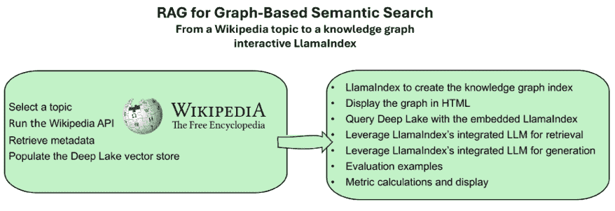
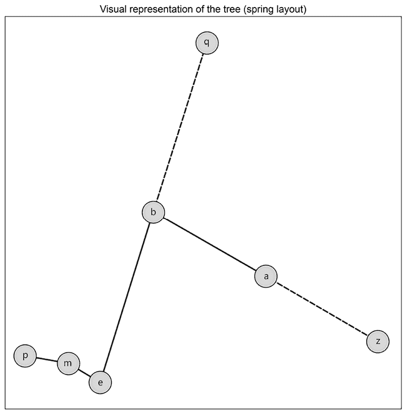
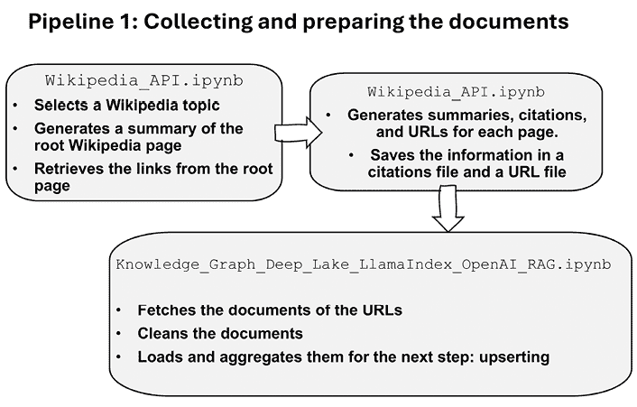
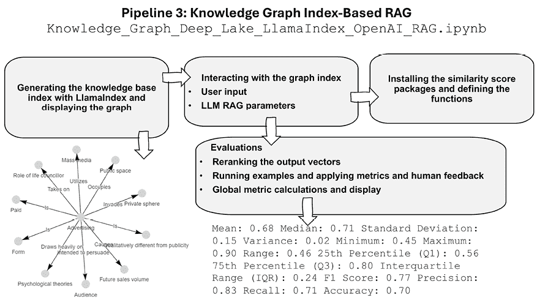
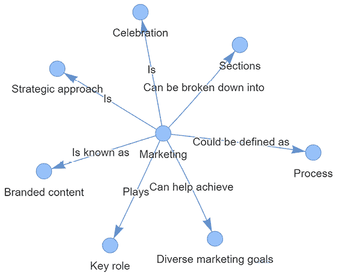
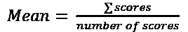
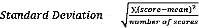

# 第七章：使用维基百科 API 和 LlamaIndex 构建可扩展的知识图谱 RAG

扩展的数据集可能会迅速变得难以管理。在实际项目中，数据管理产生的麻烦比人工智能还要多！项目经理、顾问和开发者不断努力获取启动任何项目所需的数据，更不用说一个由 RAG 驱动的生成式 AI 应用了。数据在以某种方式组织之前通常是未结构化的。维基百科是数据扩展导致信息大多可靠但有时不正确的一个好例子。现实生活中的项目通常像维基百科一样发展。数据在公司中不断积累，挑战数据库管理员、项目经理和用户。

主要问题之一是看到大量数据如何相互关联，**知识图谱**提供了一种有效的方式来可视化不同类型数据之间的关系。本章首先定义了一个为 RAG 驱动的生成式 AI 设计的知识库生态系统架构。该生态系统包含三个管道：数据收集、填充向量存储和运行基于知识图谱索引的 RAG 程序。然后我们将构建**管道 1：收集和准备文档**，其中我们将使用维基百科 API 构建一个自动化的维基百科检索程序。我们将简单地根据维基百科页面选择一个主题，然后让程序检索我们需要收集和准备的数据的元数据。系统将是灵活的，允许你选择任何你希望的主题。首先运行程序的使用案例是一个为希望提升技能以适应新工作的学生设计的营销知识库。下一步是构建**管道 2：创建和填充 Deep Lake 向量存储**。我们将利用 Deep Lake 内置的自动分块和 OpenAI 嵌入功能将数据加载到向量存储中。我们将深入了解数据集，探索这项技术奇迹是如何工作的。

最后，我们将构建**管道 3：基于知识图谱索引的 RAG**，其中 LlamaIndex 将自动构建知识图谱索引。将非常有趣地看到索引功能如何处理我们的数据，并生成显示我们数据中包含的语义关系的图表。然后我们将使用 LlamaIndex 内置的 OpenAI 功能查询该图表，以自动管理用户输入并生成响应。我们还将看到如何进行重新排序，并实现用于计算和显示系统性能的指标。

本章涵盖以下主题：

+   定义知识图谱

+   实现维基百科 API 以准备摘要和内容

+   以道德方式引用维基百科来源

+   使用维基百科数据填充 Deep Lake 向量存储

+   使用 LlamaIndex 构建知识图谱索引

+   显示 LlamaIndex 知识图谱

+   与知识图谱交互

+   使用知识图谱生成检索响应

+   重新排序检索响应的顺序以选择更好的输出

+   使用指标评估和衡量输出

让我们从定义基于知识的语义搜索的 RAG 架构开始。

# 基于知识图谱的语义搜索的 RAG 架构

如前所述，我们将在本章中构建一个基于图的 RAG 程序。该图将使我们能够直观地映射出 RAG 数据集文档之间的关系。它可以通过 LlamaIndex 自动创建，正如我们在本章的 *管道 3：基于知识图谱索引的 RAG* 部分中所做的那样。本章节的程序将针对任何维基百科主题进行设计，如图中所示：



图 7.1：从维基百科主题到与基于图的向量存储索引交互

我们将首先实现一个营销机构，其中知识图谱可以直观地映射出不同营销概念之间的复杂关系。然后，一旦你理解了过程，你就可以回过头来探索任何你感兴趣的主题。用更简单的话说，我们将无缝实现三个管道，以：

+   选择与 *营销* 相关的维基百科主题。然后，你可以使用你选择的主题运行该过程以探索生态系统。

+   使用维基百科 API 生成维基百科页面的语料库。

+   检索并存储每个页面的引用。

+   检索并存储每个页面的 URL。

+   在 Deep Lake 向量存储中检索并更新 URL 的内容。

+   使用 LlamaIndex 构建知识库索引。

+   定义用户输入提示。

+   查询知识库索引。

+   让 LlamaIndex 的内置 LLM 功能，基于 OpenAI 的嵌入模型，根据知识图谱中的嵌入数据生成响应。

+   使用句子转换器评估 LLM 的响应。

+   使用人类反馈评分评估 LLM 的响应。

+   提供关键函数的时间指标，如果需要，你可以将其扩展到其他函数。

+   运行指标计算并显示结果。

为了实现我们的目标，我们将利用前几章中已经构建的组件实现三个管道，如图中所示：


图 7.2：基于索引的 RAG 知识图谱生态系统

+   **管道 1：收集和准备文档** 将涉及使用维基百科 API 构建一个维基百科程序，以检索维基百科页面中的链接和所有页面的元数据（摘要、URL 和引用数据）。然后，我们将加载并解析 URL 以准备数据以便更新插入。

+   **管道 2：创建和填充 Deep Lake 向量存储** 将将 *管道 1* 准备的维基百科页面解析内容嵌入并更新到 Deep Lake 向量存储中。

+   **Pipeline 3: 基于知识图谱索引的 RAG** 将使用 LlamaIndex 的嵌入构建知识图谱索引并展示它。然后，我们将构建查询知识库索引的功能，并让 LlamaIndex 内置的 LLM 根据更新的数据集生成响应。

在本章的场景中，我们直接实现了一个增强检索系统，利用 OpenAI 的嵌入模型比增强输入更多。这种实现展示了我们可以用 LLM 改进实时数据检索的多种方式。没有传统规则。什么有效，就做什么！

三个管道的生态系统将由一个场景控制，该场景将允许管理员查询向量库或添加新的维基百科页面，正如我们将在本章中实现的那样。因此，生态系统的架构允许无限扩展，因为它一次处理和填充一组维基百科页面的向量数据集。系统仅使用 CPU 和优化的内存量。由于 LlamaIndex 知识图谱索引加载了整个数据集，这种方法有局限性。随着向量存储的增长，我们只能加载数据集的部分。或者，我们可以为每个主题创建一个 Deep Lake 向量存储，并在多个数据集上运行查询。这些是在实际项目中需要谨慎决策和计划的决定，具体取决于每个项目的特定要求。

我们现在将深入代码，开始一个树到图的沙盒。

## 从树构建图

图是由节点（或顶点）通过边（或弧）连接的集合。节点代表实体，边代表这些实体之间的关系或连接。例如，在我们本章的使用案例中，节点可以代表各种营销策略，边可以显示这些策略如何相互关联。这有助于新客户了解不同的营销策略如何协同工作以实现整体业务目标，促进更清晰的沟通和更有效的策略规划。在构建本章的管道之前，您可以在树到图沙盒中尝试操作。

您可以在 GitHub 上打开`Tree-2-Graph.ipynb`。提供的程序旨在使用 Python 中的 NetworkX 和 Matplotlib 在树结构中可视化关系。它特别创建了一个有向图，从给定的对中检查并标记友谊，然后以自定义的视觉属性显示此树。

程序首先定义了主要函数：

+   `build_tree_from_pairs(pairs)`: 从节点对列表构建一个有向图（树），可能识别一个根节点

+   `check_relationships(pairs, friends)`: 检查并打印每对的朋友关系状态

+   `draw_tree(G, layout_choice, root, friends)`: 使用`matplotlib`可视化树，根据友谊状态应用不同的边样式，并为节点定位提供不同的布局选项

然后，程序执行从树到图的转换过程：

+   节点对和友谊数据被定义。

+   树从对中构建。

+   关系与友谊数据进行了检查。

+   树使用选定的布局绘制，边以不同的样式绘制以表示友谊。

例如，程序首先定义了一组节点对及其朋友对：

```py
# Pairs
pairs = [('a', 'b'), ('b', 'e'), ('e', 'm'), ('m', 'p'), ('a', 'z'), ('b', 'q')]
friends = {('a', 'b'), ('b', 'e'), ('e', 'm'), ('m', 'p')} 
```

注意`('a', 'z')`不是朋友，因为它们不在`friends`列表中。`('b', 'q')`也不是。您可以想象任何类型的对之间的关系，例如相同的客户年龄、相似的工作、相同的国籍或您希望表示的任何其他概念。例如，`friends`列表可以包含社交媒体上的朋友关系、生活在同一国家的朋友关系或您能想象或需要的任何其他东西！

程序随后构建树并检查关系：

```py
# Build the tree
tree, root = build_tree_from_pairs(pairs)
# Check relationships
check_relationships(pairs, friends) 
```

输出显示了哪些对是朋友，哪些不是：

```py
Pair ('a', 'b'): friend
Pair ('b', 'e'): friend
Pair ('e', 'm'): friend
Pair ('m', 'p'): friend
Pair ('a', 'z'): not friend
Pair ('b', 'q'): not friend 
```

输出可以用于提供用于相似性搜索的有用信息。程序现在使用`'spring'`布局绘制图形：

```py
# Draw the tree
layout_choice = 'spring'  # Define your layout choice here
draw_tree(tree, layout_choice=layout_choice, root=root, friends=friends) 
```

`'spring'`布局吸引由边吸引的节点，模拟弹簧的效果。它还确保所有节点相互排斥以避免重叠。您可以深入研究`draw_tree`函数以探索和选择那里列出的其他布局。您还可以修改颜色和线型。

在这种情况下，朋友对用实线表示，不是朋友的对用虚线表示，如下面的图中所示：



图 7.3：弹簧布局的示例

您可以用不同的节点对来玩这个沙盒图。如果您想象用数百个节点来做这件事，您将开始欣赏我们在本章中用 LlamaIndex 的知识图索引构建的自动化功能！

让我们从架构转到代码，首先从收集和准备文档开始。

# 管道 1：收集和准备文档

这部分代码从维基百科检索我们需要的元数据，检索文档，清理它们，并将它们聚合起来以便插入到 Deep Lake 向量存储中。这个过程在以下图中说明：



图 7.4：管道 1 流程图

*管道 1*包括两个笔记本：

+   `Wikipedia_API.ipynb`，在这个文件中，我们将实现 Wikipedia API 以检索与我们选择的主题根页相关的页面 URL，包括每个页面的引用。如前所述，我们的主题是“营销”。

+   `Knowledge_Graph_Deep_Lake_LlamaIndex_OpenAI_RAG.ipynb`，在这个文件中，我们将实现所有三个管道。在管道 1 中，它将获取由`Wikipedia_API`笔记本提供的 URL，对其进行清理，并加载和聚合它们以进行更新插入。

我们将首先实现 Wikipedia API。

## 检索 Wikipedia 数据和元数据

让我们开始构建一个程序，与 Wikipedia API 交互以检索特定主题的信息，对检索到的文本进行标记化，并管理来自 Wikipedia 文章的引用。你可以在 GitHub 仓库中打开 `Wikipedia_API.ipynb` 并跟随操作。

程序首先安装我们需要的 `wikipediaapi` 库：

```py
try:
  import wikipediaapi
except:
  !pip install Wikipedia-API==0.6.0
  import wikipediaapi 
```

下一步是定义一个标记化函数，该函数将被调用来计算摘要的标记数量，如下面的摘录所示：

```py
def nb_tokens(text):
    # More sophisticated tokenization which includes punctuation
    tokens = word_tokenize(text)
    return len(tokens) 
```

此函数接受一个文本字符串作为输入，并使用 NLTK 库进行复杂的标记化（包括标点符号）来返回文本中的标记数量。接下来，为了开始检索数据，我们需要设置一个具有指定语言和用户代理的 Wikipedia API 实例：

```py
# Create an instance of the Wikipedia API with a detailed user agent
wiki = wikipediaapi.Wikipedia(
    language='en',
    user_agent='Knowledge/1.0 ([USER AGENT EMAIL)'
) 
```

在这种情况下，英语被定义为 `'en'`，你必须输入用户代理信息，例如电子邮件地址。现在我们可以定义与感兴趣的主题的 Wikipedia 页面相关联的主要主题和文件名：

```py
topic="Marketing"     # topic
filename="Marketing"  # filename for saving the outputs
maxl=100 
```

定义了三个参数：

+   `topic`: 检索过程的主题

+   `filename`: 将定制我们生成的文件的主题名称，这可以与主题不同

+   `maxl`: 我们将检索的页面的最大 URL 链接数

现在我们需要检索指定 Wikipedia 页面的摘要，检查页面是否存在，并打印其摘要：

```py
import textwrap # to wrap the text and display it in paragraphs
page=wiki.page(topic)
if page.exists()==True:
  print("Page - Exists: %s" % page.exists())
  summary=page.summary
  # number of tokens)
  nbt=nb_tokens(summary)
  print("Number of tokens: ",nbt)
  # Use textwrap to wrap the summary text to a specified width, e.g., 70 characters
  wrapped_text = textwrap.fill(summary, width=60)
  # Print the wrapped summary text
  print(wrapped_text)
else:
  print("Page does not exist") 
```

输出提供了请求的控制信息：

```py
Page - Exists: True
Number of tokens:  229
Marketing is the act of satisfying and retaining customers.
It is one of the primary components of business management
and commerce. Marketing is typically conducted by the seller, typically a retailer or manufacturer… 
```

提供的信息显示在运行完整搜索主题主页之前我们是否在正确的轨道上：

+   `Page - Exists: True` 确认页面存在。如果不存在，将显示 `print("Page does not exist")` 消息。

+   `Number of tokens: 229` 为我们提供了关于我们为项目管理评估检索的内容大小的见解。

+   `summary=page.summary` 的输出显示页面的摘要。

在这种情况下，页面存在，符合我们的主题，摘要也是有意义的。在我们继续之前，我们检查我们是否在正确的页面上工作以确保：

```py
print(page.fullurl) 
```

输出是正确的：

```py
https://en.wikipedia.org/wiki/Marketing 
```

现在我们已经准备好检索目标页面的 URL、链接和摘要：

```py
# prompt: read the program up to this cell. Then retrieve all the links for this page: print the link and a summary of each link.
# Get all the links on the page
links = page.links
# Print the link and a summary of each link
urls = []
counter=0
for link in links:
  try:
    counter+=1
    print(f"Link {counter}: {link}")
    summary = wiki.page(link).summary
    print(f"Link: {link}")
    print(wiki.page(link).fullurl)
    urls.append(wiki.page(link).fullurl)
    print(f"Summary: {summary}")
    if counter>=maxl:
      break
  except page.exists()==False:
    # Ignore pages that don't exist
    pass
print(counter)
print(urls) 
```

函数限制在程序开始时定义的 `maxl`。函数将检索最多 `maxl` 个链接的 URL，或者如果页面包含的链接少于请求的最大数量，则更少。然后我们在进行下一步并生成文件之前检查输出：

```py
Link 1: 24-hour news cycle
Link: 24-hour news cycle
https://en.wikipedia.org/wiki/24-hour_news_cycle
Summary: The 24-hour news cycle (or 24/7 news cycle) is 24-hour investigation and reporting of news, concomitant with fast-paced lifestyles… 
```

我们观察到我们得到了所需的信息，摘要也是可接受的：

+   `Link 1`: 链接计数器

+   `Link`: 从主题页面检索到的实际页面链接

+   `Summary`: 页面的链接摘要

下一步是将我们刚刚构建的函数应用于生成包含从 Wikipedia 页面检索的链接及其 URL 的引用的文本文件：

```py
from datetime import datetime
# Get all the links on the page
links = page.links
# Prepare a file to store the outputs
fname = filename+"_citations.txt"
with open(fname, "w") as file:
    # Write the citation header
    file.write(f"Citation. In Wikipedia, The Free Encyclopedia. Pages retrieved from the following Wikipedia contributors on {datetime.now()}\n")
    file.write("Root page: " + page.fullurl + "\n")
    counter = 0
    urls = []… 
```

`urls = []`将被添加以获得最终步骤所需的完整 URL 列表。输出是一个包含主题名称、`datetime`和以引用文本开头的引用的文件：

```py
Citation. In Wikipedia, The Free Encyclopedia. Pages retrieved from the following Wikipedia contributors on {datetime.now()}\n") 
```

在这种情况下，输出是一个名为`Marketing_citations.txt`的文件。该文件已下载并上传到 GitHub 仓库中该章节目录的`/citations`目录。

因此，引用页面已生成，在本笔记本中显示，并已保存到 GitHub 仓库中，以遵守维基百科的引用条款。最后一步是生成包含我们将用于获取所需页面内容的 URL 列表的文件。我们首先显示 URL：

```py
urls 
```

输出确认我们已获得所需的 URL：

```py
['https://en.wikipedia.org/wiki/Marketing',
 'https://en.wikipedia.org/wiki/24-hour_news_cycle',
 'https://en.wikipedia.org/wiki/Account-based_marketing',
… 
```

URL 将写入一个以主题为前缀的文件中：

```py
# Write URLs to a file
ufname = filename+"_urls.txt"
with open(ufname, 'w') as file:
    for url in urls:
        file.write(url + '\n')
print("URLs have been written to urls.txt") 
```

在这种情况下，输出是一个名为`Marketing_urls.txt`的文件，其中包含我们需要获取的页面的 URL。该文件已下载并上传到 GitHub 仓库中该章节目录的`/citations`目录。

现在，我们已经准备好为更新插入准备数据。

## 准备数据以进行更新插入

在 GitHub 章节目录中可以找到的`Knowledge_Graph_ Deep_Lake_LlamaIndex_OpenAI_RAG.ipynb`笔记本中，将处理`Wikipedia_API.ipynb`笔记本中提供的维基百科 API 的 URL。本笔记本的“安装环境”部分几乎与第二章、“使用 Deep Lake 和 OpenAI 构建 RAG 嵌入向量存储”、第三章、“使用 LlamaIndex、Deep Lake 和 OpenAI 构建基于索引的 RAG”中相应的部分相同。然而，在本章中，URL 列表是由`Wikipedia_API.ipynb`笔记本生成的，我们将检索它。

首先，转到笔记本的“场景”部分以定义工作流程的策略：

```py
#File name for file management
graph_name="Marketing"
# Path for vector store and dataset
db="hub://denis76/marketing01"
vector_store_path = db
dataset_path = db
#if True upserts data; if False, passes upserting and goes to connection
pop_vs=True
# if pop_vs==True, overwrite=True will overwrite dataset, False will append it:
ow=True 
```

参数将确定笔记本中三个管道的行为：

+   `graph_name="Marketing"`: 我们将读取和写入的文件的（主题）前缀。

+   `db="hub://denis76/marketing01"`: 深湖向量存储的名称。您可以选择您希望的数据集名称。

+   `vector_store_path = db`: 向量存储的路径。

+   `dataset_path = db`: 向量存储的数据集路径。

+   `pop_vs=True`: 如果为`True`，则激活数据插入；如果为`False`，则禁用。

+   `ow=True`: 如果为`True`，则覆盖现有数据集；如果为`False`，则追加。

然后，我们可以启动笔记本的“管道 1：收集和准备文档”部分。程序将下载本章前一部分生成的 URL 列表：

```py
# Define your variables
if pop_vs==True:
  directory = "Chapter07/citations"
  file_name = graph_name+"_urls.txt"
  download(directory,file_name) 
```

然后，它将读取文件并将 URL 存储在名为`urls`的列表中。本笔记本中“管道 1：收集和准备文档”部分的其余代码遵循与第三章中`Deep_Lake_LlamaIndex_OpenAI_RAG.ipynb`笔记本相同的流程。在第三章中，网页的 URL 是手动输入到列表中的。

代码将从 URL 列表中获取内容。然后程序清理并准备数据以填充 Deep Lake 向量存储。

# 管道 2：创建和填充 Deep Lake 向量存储

在`Deep_Lake_LlamaIndex_OpenAI_RAG.ipynb`这一节中的管道是用第三章中的*管道 2*的代码构建的。我们可以看到，通过将管道作为组件创建，我们可以快速重新利用和适应它们到其他应用中。此外，Activeloop Deep Lake 内置了默认的块处理、嵌入和更新功能，使得集成各种类型的不结构化数据变得无缝，正如我们在更新维基百科文档时所做的那样。

`display_record(record_number)`函数的输出显示了过程的无缝性。输出显示了 ID 和元数据，如文件信息、收集的数据、文本和嵌入向量：

```py
ID:
['a61734be-fe23-421e-9a8b-db6593c48e08']
Metadata:
file_path: /content/data/24-hour_news_cycle.txt
file_name: 24-hour_news_cycle.txt
file_type: text/plain
file_size: 2763
creation_date: 2024-07-05
last_modified_date: 2024-07-05
…
Text:
['24hour investigation and reporting of news concomitant with fastpaced lifestyles This article is about the fastpaced cycle of news media in technologically advanced societies.
Embedding:
[-0.00040736704249866307, 0.009565318934619427, 0.015906672924757004, -0.009085721336305141, …] 
```

有了这些，我们已经成功重新利用了第三章的*管道 2*组件，现在可以继续并构建图知识索引。

# 管道 3：基于知识图谱索引的 RAG

是时候创建一个基于知识图谱索引的 RAG 管道并与之交互了。如图所示，我们有很多工作要做：



图 7.5：从头开始构建知识图谱索引 RAG

在本节中，我们将：

+   生成知识图谱索引

+   显示图形

+   定义用户提示

+   定义 LlamaIndex 内置 LLM 模型的超参数

+   安装相似度得分包

+   定义相似度得分函数

+   运行相似度函数之间的样本相似度比较

+   重新排序 LLM 响应的输出向量

+   运行评估样本并应用指标和人工反馈得分

+   运行指标计算并显示它们

让我们按步骤进行，并首先生成知识图谱索引。

## 生成知识图谱索引

我们将使用`llama_index.core`模块中的`KnowledgeGraphIndex`类从一个文档集中创建知识图谱索引。我们还将计时索引创建过程以评估性能。

函数首先使用`time.time()`记录开始时间。在这种情况下，测量时间很重要，因为创建索引需要相当长的时间：

```py
from llama_index.core import KnowledgeGraphIndex
import time
# Start the timer
start_time = time.time() 
```

现在我们使用`from_documents`方法创建一个基于嵌入的`KnowledgeGraphIndex`。该函数使用以下参数：

+   `documents`是要索引的文档集

+   `max_triplets_per_chunk`设置为 2，限制每个块中的三元组数量以优化内存使用和处理时间

+   `include_embeddings`设置为`True`，表示应包含嵌入

因此，知识图谱索引仅用几行代码就创建完成了：

```py
#graph index with embeddings
graph_index = KnowledgeGraphIndex.from_documents(
    documents,
    max_triplets_per_chunk=2,
    include_embeddings=True,
) 
```

停止计时器并测量创建时间：

```py
# Stop the timer
end_time = time.time()
# Calculate and print the execution time
elapsed_time = end_time - start_time
print(f"Index creation time: {elapsed_time:.4f} seconds")
print(type(graph_index)) 
```

输出显示了时间：

```py
Index creation time: 371.9844 seconds 
```

显示图形类型：

```py
print(type(graph_index)) 
```

输出确认了知识图谱索引类：

```py
<class 'llama_index.core.indices.knowledge_graph.base.KnowledgeGraphIndex'> 
```

我们现在将设置我们的知识图谱索引的查询引擎，并配置它来管理相似度、响应温度和输出长度参数：

```py
#similarity_top_k
k=3
#temperature
temp=0.1
#num_output
mt=1024
graph_query_engine = graph_index.as_query_engine(similarity_top_k=k, temperature=temp, num_output=mt) 
```

参数将决定查询引擎的行为：

+   `k=3`设置考虑的前 N 个最相似结果的数目。

+   `temp=0.1`设置温度参数，控制查询引擎响应生成的随机性。它越低，越精确；越高，越有创造性。

+   `mt=1024`设置输出中最大令牌数，定义生成响应的长度。

然后使用我们定义的参数创建查询引擎：

```py
graph_query_engine = graph_index.as_query_engine(similarity_top_k=k, temperature=temp, num_output=mt) 
```

图索引和查询引擎已就绪。让我们显示图形。

## 显示图形

我们将使用`pyvis.network`创建一个图实例，`g`，这是一个用于创建交互式网络可视化的 Python 库。显示的参数与我们在这章的*从树构建图*部分定义的类似：

```py
## create graph
from pyvis.network import Network
g = graph_index.get_networkx_graph()
net = Network(notebook=True, cdn_resources="in_line", directed=True)
net.from_nx(g)
# Set node and edge properties: colors and sizes
for node in net.nodes:
    node['color'] = 'lightgray'
    node['size'] = 10
for edge in net.edges:
    edge['color'] = 'black'
    edge['width'] = 1 
```

已创建一个有向图，现在我们将将其保存为 HTML 文件以供进一步使用：

```py
fgraph="Knowledge_graph_"+ graph_name + ".html"
net.write_html(fgraph)
print(fgraph) 
```

`graph_name`在笔记本的*场景*部分定义。现在我们将以 HTML 文件的形式在笔记本中显示该图：

```py
from IPython.display import HTML
# Load the HTML content from a file and display it
with open(fgraph, 'r') as file:
    html_content = file.read()
# Display the HTML in the notebook
display(HTML(html_content)) 
```

您现在可以下载文件并在浏览器中显示它以与之交互。您还可以在笔记本中可视化它，如图下所示：



图 7.6：知识图谱

我们已经准备好与知识图谱索引进行交互。

## 与知识图谱索引交互

让我们现在定义执行查询所需的功能，就像我们在*第三章*的*管道 3：基于索引的 RAG*部分中所做的那样：

+   `execute_query`是我们创建的执行查询的函数：`response = graph_query_engine.query(user_input)`。它还测量所需时间。

+   `user_query="What is the primary goal of marketing for the consumer market?"`，我们将用它来执行查询。

+   `response = execute_query(user_query)`，这是封装在请求代码中并显示响应的。

输出提供了我们使用维基百科数据创建的最佳向量，并附有时间测量：

```py
Query execution time: 2.4789 seconds
The primary goal of marketing for the consumer market is to effectively target consumers, understand their behavior, preferences, and needs, and ultimately influence their purchasing decisions. 
```

我们现在将安装相似度评分包并定义我们需要的相似度计算函数。

## 安装相似度评分包和定义函数

我们首先从 Google Colab 上的**密钥**选项卡中检索 Hugging Face 令牌，它在笔记本的设置中被存储：

```py
from google.colab import userdata
userdata.get('HF_TOKEN') 
```

到 2024 年 8 月，Hugging Face 的`sentence-transformers`令牌是可选的。您可以忽略消息并注释代码。接下来，我们安装`sentence-transformers`：

```py
!pip install sentence-transformers==3.0.1 
```

我们接着创建一个使用嵌入的余弦相似度函数：

```py
from sklearn.metrics.pairwise import cosine_similarity
from sentence_transformers import SentenceTransformer
model = SentenceTransformer('all-MiniLM-L6-v2')
def calculate_cosine_similarity_with_embeddings(text1, text2):
    embeddings1 = model.encode(text1)
    embeddings2 = model.encode(text2)
    similarity = cosine_similarity([embeddings1], [embeddings2])
    return similarity[0][0] 
```

我们导入所需的库：

```py
import time
import textwrap
import sys
import io 
```

我们有一个相似度函数，并且可以使用它进行重新排序。

## 重新排序

在本节中，程序通过重新排序顶级结果来重新排序查询的响应，以选择其他可能更好的结果：

+   `user_query=" Which experts are often associated with marketing theory?"` 表示我们正在进行的查询。

+   `start_time = time.time()` 记录查询执行的开始时间。

+   `response = execute_query(user_query)` 执行查询。

+   `end_time = time.time()` 停止计时器，并显示查询执行时间。

+   `for idx, node_with_score in enumerate(response.source_nodes)` 遍历响应以检索响应中的所有节点。

+   `similarity_score3=calculate_cosine_similarity_with_embeddings(text1, text2)` 计算用户查询与从响应中检索到的节点中的文本之间的相似度得分。所有比较都显示出来。

+   `best_score=similarity_score3` 存储找到的最佳相似度得分。

+   `print(textwrap.fill(str(best_text), 100))` 显示最佳重新排序结果。

对于`user_query` `"Which experts are often associated with marketing theory?"`的初始响应是：

```py
Psychologists, cultural anthropologists, and market researchers are often associated with marketing
theory. 
```

响应是可接受的。然而，重新排序的响应更深入，并提到了营销专家的名字（以粗体字体突出显示）：

```py
Best Rank: 2
Best Score: 0.5217772722244263
[…In 1380 the German textile manufacturer **Johann Fugger****Daniel Defoe**  travelled from Augsburg to Graben in order to gather information on the international textile industry… During this period   a
London merchant published information on trade and economic resources of England and Scotland…] 
```

重新排序的响应更长，包含原始文档内容而不是 LlamaIndex 的 LLM 查询引擎提供的摘要。从 LLM 的角度来看，原始查询引擎的响应更好。然而，很难估计最终用户会喜欢什么。一些用户喜欢简短的答案，而一些用户喜欢长文档。我们可以想象许多其他重新排序文档的方式，例如修改提示、添加文档和删除文档。我们甚至可以决定微调一个 LLM，就像我们在第九章*赋予 AI 模型能力：微调 RAG 数据和人类反馈*中所做的那样。我们还可以像在第五章*通过专家人类反馈提升 RAG 性能*中那样引入人类反馈评分，因为在许多情况下，数学指标无法捕捉到响应的准确性（写作小说、长答案与短输入以及其他复杂响应）。但无论如何，我们都需要尝试！

让我们执行将要运行的示例的一些可能的指标。

## 示例指标

为了评估知识图谱索引的查询引擎，我们将运行十个示例并跟踪得分。`rscores`跟踪人类反馈得分，而`scores=[]`跟踪相似度函数得分：

```py
# create an empty array score human feedback scores:
rscores =[]
# create an empty score for similarity function scores
scores=[] 
```

根据项目的需求，可以增加尽可能多的示例。每个十个示例都有相同的结构：

+   `user_query`，这是查询引擎的输入文本

+   `elapsed_time`，这是系统响应的时间测量结果

+   `response = execute_query(user_query)` 执行查询

用户查询和输出与用于重新排序函数的示例相同：

```py
Query execution time: 1.9648 seconds
Psychologists, cultural anthropologists, and other experts in behavioral sciences are often
associated with marketing theory. 
```

然而，这次，我们将运行一个相似度函数，并要求人类给出一个评分：

```py
text1=str(response)
text2=user_query
similarity_score3=calculate_cosine_similarity_with_embeddings(text1, text2)
print(f"Cosine Similarity Score with sentence transformer: {similarity_score3:.3f}")
scores.append(similarity_score3)
human_feedback=0.75
rscores.append(human_feedback) 
```

在这个函数中：

+   `text1` 是查询引擎的响应。

+   `text2` 是用户查询。

+   `similarity_score3` 是余弦相似度得分。

+   `scores.append(similarity_score3)` 将相似度得分添加到 `scores` 中。

+   `human_feedback` 是人类相似度评估。我们可以像在 *第五章* 中所做的那样，用文档替换这个分数，或者我们可以用人类文本响应替换人类分数，这将成为事实。在两种情况下，相似度分数都会根据人类反馈内容重新计算。

+   `rscores.append(human_feedback)` 将人类分数添加到 `rscores` 中。

让我们回顾一下十个示例输出的几个，并在每个示例的末尾添加注释。

LLMs 是随机算法。因此，响应和得分可能因运行而异。

+   **示例 1**:

    +   **用户查询**: `哪些专家通常与营销理论相关联？`

    +   **响应**: 心理学家、文化人类学家以及其他行为科学专家通常与营销理论相关联。

    +   **余弦相似度得分**: `0.809`

    +   **人类反馈**: `0.75`

    +   **注释**: 响应是可以接受的，但可以更加具体，并提及专家的名字。然而，提示是模糊的，只提到了专家的一般情况。

+   **示例 3**:

    +   **用户查询**: `B2B 和 B2C 之间的区别是什么？`

    +   **响应**: B2B 企业向其他公司销售产品和服务，而 B2C 企业直接向客户销售。

    +   **余弦相似度得分**: `0.760`

    +   **人类反馈**: `0.8`

    +   **注释**: 响应是精确的，但在某些情况下，用户喜欢示例。

+   **示例 7**:

    +   **用户查询**: `农业营销服务局（AMS）维护哪些商品项目？`

    +   **响应**: 农业营销服务局（**AMS**）在五个商品领域维护项目：棉花和烟草、乳制品、水果和蔬菜、牲畜和种子以及家禽。

    +   **余弦相似度得分**: `0.904`

    +   **人类反馈**: `0.9`

    +   **注释**: 这个响应是准确且有趣的，因为信息包含在链接到主页的页面中。因此，这是从链接页面到主页的信息。我们可以要求维基百科搜索所有链接到主页的链接页面，并深入几层。然而，我们主要寻找的信息可能被不太相关的数据稀释。关于数据深度范围的决定取决于每个项目的需求。

我们现在将对余弦相似度得分和人类反馈得分进行度量计算。

### 度量计算和显示

示例的余弦相似度得分存储在 `scores` 中：

```py
print(len(scores), scores) 
```

展示了十个得分：

```py
10 [0.808918, 0.720165, 0.7599532, 0.8513956, 0.5457667, 0.6963912, 0.9036964, 0.44829217, 0.59976315, 0.47448665] 
```

我们可以根据每个项目的需求将评估扩展到更多其他示例。相同示例的人类反馈得分存储在 `rscores` 中：

```py
print(len(rscores), rscores) 
```

展示了十个人类反馈得分：

```py
10 [0.75, 0.5, 0.8, 0.9, 0.65, 0.8, 0.9, 0.2, 0.2, 0.9] 
```

我们应用度量来评估响应：

```py
mean_score = np.mean(scores)
median_score = np.median(scores)
std_deviation = np.std(scores)
variance = np.var(scores)
min_score = np.min(scores)
max_score = np.max(scores)
range_score = max_score - min_score
percentile_25 = np.percentile(scores, 25)
percentile_75 = np.percentile(scores, 75)
iqr = percentile_75 - percentile_25 
```

每个指标都可以提供几个见解。让我们逐一分析它们和获得的输出：

+   **中心趋势（平均值、中位数）**给我们一个典型分数的外观。

+   **变异性（标准差、方差、范围、四分位距）**告诉我们分数的分布情况，表明数据的稳定性或多样性。

+   **极值（最小值、最大值）**显示了数据集的范围。

+   **分布（百分位数）**提供了关于分数在值范围内的分布的见解。

让我们逐一分析从余弦相似度分数和人工反馈分数计算出的这些指标，并显示它们的输出：

1.  **平均值（平均）**:

    +   **定义**: 平均值是所有分数的总和除以分数的数量。

    +   **目的**: 它给出了数据的中心值，提供了一个典型得分的概念。

    +   **计算**:



+   **输出**: `平均值: 0.68`

1.  **中位数**:

    +   **定义**: 中位数是在分数按从小到大排序时中间的值。

    +   **目的**: 它提供了数据集的中心点，并且与平均值相比，受极端值（异常值）的影响较小。

    +   **输出**: `中位数: 0.71`

1.  **标准差**:

    +   **定义**: 标准差衡量每个分数与平均值差异的平均量。

    +   **目的**: 它给出了分数围绕平均值分布的概念。值越高，表示变异性越大。

    +   **计算**:



+   **输出**: `标准差: 0.15`

1.  **方差**:

    +   **定义**: 方差是标准差的平方。

    +   **目的**: 它也衡量分数的分布，显示它们与平均值的差异程度。

    +   **输出**: `方差: 0.02`

1.  **最小值**:

    +   **定义**: 最小值是数据集中的最小分数。

    +   **目的**: 它告诉我们最低值。

    +   **输出**: `最小值: 0.45`

1.  最大值:

    +   **定义**: 最大值是数据集中的最大分数。

    +   **目的**: 它告诉我们最高值。

    +   **输出**: `最大值: 0.90`

1.  **范围**:

    +   **定义**: 范围是最大值和最小值之间的差异。

    +   **目的**: 它显示了数据集从最低到最高值的范围。

    +   **计算**:

    *范围* = *最大值* - *最小值*

    +   **输出**: `范围: 0.46`

1.  **第 25 百分位数（Q1）**:

    +   **定义**: 第 25 百分位数是低于该值的 25%的分数。

    +   **目的**: 它提供了一个数据四分之一以下的数据点。

    +   **输出**: `第 25 百分位数（Q1）: 0.56`

1.  **第 75 百分位数（Q3）**:

    +   **定义**: 第 75 百分位数是低于该值的 75%的分数。

    +   **目的**: 它给出了低于该值的数据占四分之三的点。

    +   **输出**: `第 75 百分位数（Q3）: 0.80`

1.  **四分位距（IQR）**:

    +   **定义**: 四分位距是第 25 百分位数（Q1）和第 75 百分位数（Q3）之间的范围。

    +   **目的**：它测量数据的中间 50%，提供对数据分布的感觉，而不会受到极端值的影响。

    +   **计算**：

    *IQR* = *Q3* – *Q1*

    +   **输出**：`四分位距 (IQR)：0.24`

我们已经构建了一个基于知识图谱的 RAG 系统，与之互动，并使用一些示例和指标对其进行评估。让我们总结我们的旅程。

# **摘要**

在本章中，我们探讨了使用维基百科 API 和 LlamaIndex 创建可扩展的知识图谱 RAG 系统的方法。开发的技术和工具适用于各个领域，包括数据管理、营销以及任何需要组织化和可访问数据检索的领域。

我们的旅程始于 *Pipeline 1* 中的数据收集。该管道专注于自动化检索维基百科内容。使用维基百科 API，我们构建了一个程序，根据选定的主题（如营销）从维基百科页面收集元数据和 URL。在 *Pipeline 2* 中，我们创建并填充了 Deep Lake 向量存储。从 *Pipeline 1* 中检索的数据被嵌入并更新到 Deep Lake 向量存储中。该管道强调了将大量数据集成到结构化向量存储中的简便性，以便进行进一步的处理和查询。最后，在 *Pipeline 3* 中，我们引入了基于知识图谱索引的 RAG。使用 LlamaIndex，我们自动从嵌入的数据中构建知识图谱索引。该索引以视觉方式映射出不同信息片段之间的关系，提供了数据的语义概述。然后使用 LlamaIndex 内置的语言模型查询知识图谱以生成最佳响应。我们还实施了指标来评估系统的性能，确保准确高效的数据检索。

到本章结束时，我们已经构建了一个综合的、自动的 RAG 驱动的知识图谱系统，该系统能够以最小的人为干预收集、嵌入和查询大量维基百科数据。这段旅程展示了结合多个 AI 工具和模型以创建高效数据管理和检索管道的强大和潜力。现在你们都已经准备好在现实项目中实施基于知识图谱的 RAG 系统。在下一章中，我们将学习如何实现用于短期使用的动态 RAG。

# 问题

用是或否回答以下问题：

1.  章节是否专注于使用维基百科 API 和 LlamaIndex 构建可扩展的知识图谱 RAG 系统？

1.  本章讨论的主要用例是否与医疗数据管理相关？

1.  *Pipeline 1* 是否涉及使用 API 从维基百科收集和准备文档？

1.  在 *Pipeline 2* 中是否使用 Deep Lake 创建关系数据库？

1.  *Pipeline 3* 是否利用 LlamaIndex 构建知识图谱索引？

1.  系统是否设计为仅处理单个特定主题，例如营销，而没有灵活性？

1.  章节是否描述了如何从维基百科页面检索 URL 和元数据？

1.  运行章节中描述的管道需要 GPU 吗？

1.  知识图谱索引是否以视觉方式映射出数据片段之间的关系？

1.  在查询知识图谱索引的每一步都需要人工干预吗？

# 参考文献

+   维基百科 API GitHub 仓库：[`github.com/martin-majlis/Wikipedia-API`](https://github.com/martin-majlis/Wikipedia-API)

+   PyVis 网络：*Python 中的交互式网络可视化*。

# 进一步阅读

+   Hogan, A., Blomqvist, E., Cochez, M., et al. *知识图谱*。`arXiv:2003.02320`

# 加入我们的 Discord 社区

加入我们的 Discord 空间，与作者和其他读者进行讨论：

[`www.packt.link/rag`](https://www.packt.link/rag)


