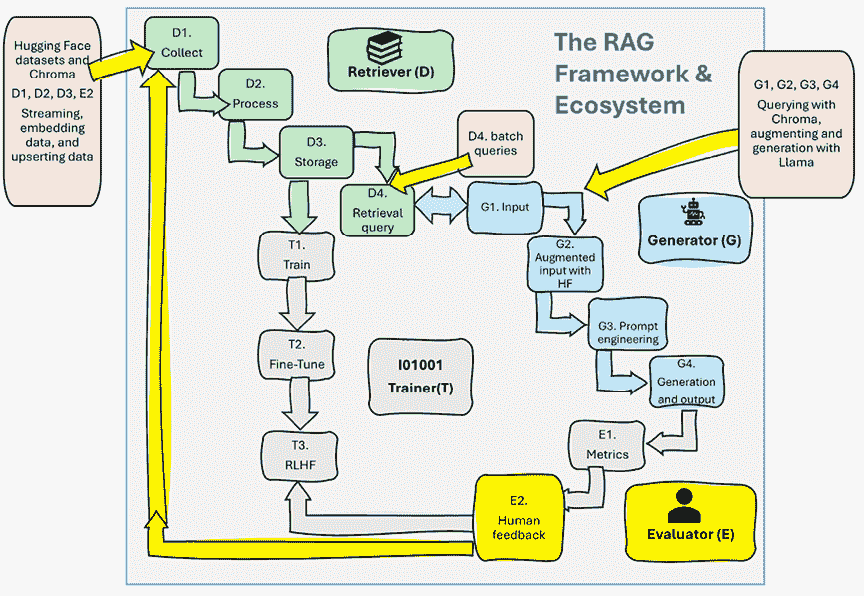

# 8

# 基于 Chroma 和 Hugging Face Llama 的动态 RAG

本章将带您进入动态 RAG 的实用性。在当今快速发展的环境中，迅速做出明智决策的能力比以往任何时候都更加重要。从医疗保健和科学研究到客户服务管理，各个领域的决策者越来越需要只在所需短时间内相关的实时数据。一次会议可能只需要临时但高度准备好的数据。因此，数据永久性的概念正在转变。并非所有信息都必须无限期存储；相反，在许多情况下，重点正在转向使用针对特定时间特定需求的精确、相关数据，例如每日简报或关键会议。

本章介绍了一种创新且高效的方法，通过嵌入和创建临时的色度集合来处理此类数据。每天早上，都会组装一个新的集合，其中只包含当天会议所需的必要数据，从而有效避免长期数据积累和管理开销。这些数据可能包括医疗团队讨论患者治疗的医疗报告，服务团队针对即时问题进行策略规划的客户互动，或研究人员进行日常实验决策的最新科学研究数据。然后，我们将构建一个 Python 程序来支持日常会议中的动态和高效决策，应用一个使用硬科学（任何自然科学或物理科学）数据集的方法论进行每日会议。这种方法将突出现代数据管理的灵活性和效率。在这种情况下，团队希望获取相关的科学信息，而无需搜索网络或与在线人工智能助手互动。约束条件是拥有一个免费、开源的助手，任何人都可以使用，这就是为什么我们将使用 Chroma 和 Hugging Face 资源。

第一步是创建一个临时的色度集合。我们将模拟处理每天编译的新数据集的处理过程，针对即将召开的会议的具体议程进行定制，确保相关性和简洁性。在这种情况下，我们将从 Hugging Face 下载 SciQ 数据集，该数据集包含数千个众包科学问题，例如与物理学、化学和生物学相关的问题。然后，程序将嵌入当天所需的相关数据，确保所有讨论点都有最新、最相关数据的支持。

用户可能会选择在会议前运行查询以确认其准确性和与当天目标的契合度。最后，随着会议的进行，任何出现的问题都会触发实时数据检索，通过**大型语言模型 Meta AI**（**Llama**）技术增强以生成动态闪卡。这些闪卡提供快速精确的响应，以确保讨论既富有成效又信息丰富。到本章结束时，你将掌握在各个领域实施开源免费动态 RAG 的技能。

总结一下，本章涵盖了以下主题：

+   动态 RAG 的架构

+   为动态 RAG 准备数据集

+   创建 Chroma 集合

+   在 Chroma 集合中嵌入和更新数据

+   批量查询集合

+   使用用户请求查询集合

+   使用查询的输出增强输入

+   配置 Hugging Face 的 Meta Llama 框架

+   根据增强输入生成响应

让我们从了解动态 RAG 的架构开始。

# 动态 RAG 的架构

想象一下，你身处一个信息每日都在变化的环境中。每天早上，你从全球收集超过 10,000 个问题和验证过的答案。挑战在于在会议期间快速有效地获取这些信息，而不需要长期存储或复杂的设施。

这种动态 RAG 方法使我们能够保持一个精简、响应迅速的系统，提供最新的信息，而不需要持续的数据存储负担。它非常适合数据相关性短暂但决策关键的环境。

我们将把这个方法应用到硬科学数据集上。然而，这种动态方法并不仅限于我们的特定例子。它在各个领域都有广泛的应用，例如：

+   **客户支持**：可以实时访问每日更新的常见问题解答，以快速响应用户咨询。

+   **医疗保健**：在会议期间，医疗团队可以使用最新的研究和患者数据来回答复杂与健康相关的问题。

+   **金融**：金融分析师可以查询最新的市场数据，以做出明智的投资和策略决策。

+   **教育**：教育工作者可以获取最新的教育资源和研究，以回答问题并提升学习。

+   **技术支持**：IT 团队可以使用最新的技术文档来解决问题并有效地指导用户。

+   **销售与营销**：团队可以快速获取最新的产品信息和市场趋势，以回答客户咨询并制定策略。

本章实现了一种动态 RAG 生态系统的类型。你的想象力是无限的，所以请随意将这个生态系统以不同的方式应用到你的项目中。现在，让我们看看动态 RAG 组件如何与我们描述在*第一章*，*为什么是检索增强生成？*，在*RAG 生态系统*部分中描述的生态系统相匹配。

我们将简化在实时决策环境中（如日常会议）集成和使用动态信息的流程，使用 Python 实现。以下是针对每个组件及其生态系统组件标签的创新策略的分解：



图 8.1：动态 RAG 系统

+   **临时 Chroma 集合创建（D1，D2，D3，E2）**：每天早上，都会为当天的会议设置一个专门的临时 Chroma 集合。这个集合不是为了会议后保存，而是仅满足当天的即时需求，并确保长期不会使数据系统杂乱无章。

+   **嵌入相关数据（D1，D2，D3，E2）**：该集合嵌入关键数据，如客户支持交互、医疗报告或科学事实。此嵌入过程将内容特别定制到会议议程中，确保所有相关信息都可在会议参与者的指尖。数据可能包括来自文档的人类反馈以及可能的其他生成 AI 系统。

+   **会议前的数据验证（D4）**：在会议开始之前，对这个临时 Chroma 集合运行一批查询，以确保所有数据都是准确的，并且与会议目标适当对齐，从而促进顺利和有信息的讨论。

+   **实时查询处理（G1，G2，G3，G4）**：在会议期间，系统被设计为处理参与者提出的自发查询。一个问题可以触发特定信息的检索，然后用于增强 Llama 的输入，使其能够动态生成闪卡。这些闪卡在会议期间用于提供简洁、准确的信息，从而提高讨论的效率和生产力。

我们将使用 Chroma，这是一个强大、开源、AI 原生向量数据库，旨在存储、管理和搜索集合中的嵌入向量。Chroma 包含了我们启动所需的一切，我们可以在我们的机器上运行它。它也非常适合涉及 LLMs 的应用。因此，Chroma 集合非常适合临时、成本效益高和实时的 RAG 系统。本章使用 Chroma 实现的动态 RAG 架构具有创新性和实用性。以下是这个快速变化的世界中需要考虑的一些关键点：

+   **效率和成本效益**：使用 Chroma 进行临时存储和 Llama 进行响应生成确保系统轻量级，不会产生持续存储成本。这使得它非常适合数据频繁刷新且不需要长期存储的环境。这对希望系统精简的决策者来说非常有说服力。

+   **灵活性**：系统的短暂性质允许每天集成新数据，确保始终可用最新信息。这在信息变化迅速的快节奏环境中尤其有价值。

+   **可扩展性**：该方法可扩展到其他类似的数据集，前提是它们可以有效地嵌入和查询。这使得它适用于各种超出给定示例的领域。可扩展性不仅包括增加数据量，还包括将框架应用于广泛领域和情况的能力。

+   **用户友好性**：系统的设计简单直观，使得那些可能不是技术专家但需要快速获得可靠答案的用户能够使用。这种简单性可以增强用户参与度和满意度。通过提供成本效益、透明和轻量级的 AI 来让用户满意，无疑会提高他们对 RAG 驱动的生成式 AI 的兴趣。

让我们现在开始构建一个动态 RAG 程序。

# 安装环境

环境专注于开源和免费资源，我们可以在我们的机器或免费的 Google Colab 账户上运行这些资源。本章将在 Google Colab 上使用 Hugging Face 和 Chroma 运行这些资源。

我们首先安装 Hugging Face。

## Hugging Face

我们将实现 Hugging Face 的开源资源来下载 Llama 模型的数据集。请在 [`huggingface.co/`](https://huggingface.co/) 上注册以获取您的 Hugging Face API 令牌。如果您使用 Google Colab，您可以在侧边栏中创建一个 Google Secret 并激活它。如果是这样，您可以注释以下单元格—`# 将您的 Hugging Face 令牌保存在安全位置`：

```py
#1.Uncomment the following lines if you want to use Google Drive to retrieve your token
from google.colab import drive
drive.mount('/content/drive')
f = open("drive/MyDrive/files/hf_token.txt", "r")
access_token=f.readline().strip()
f.close()
#2.Uncomment the following line if you want to enter your HF token manually
#access_token =[YOUR HF_TOKEN]
import os
os.environ['HF_TOKEN'] = access_token 
```

程序首先检索 Hugging Face API 令牌。请确保将其保存在安全的地方。您可以选择使用 Google Drive 或手动输入。到目前为止，安装似乎运行顺利。我们现在安装 `datasets`：

```py
!pip install datasets==2.20.0 
```

然而，存在一些冲突，例如与 Google Colab 预安装的较新版本的 `pyarrow` 冲突。这些快速移动的包之间的冲突很常见。当 Hugging Face 更新其包时，这种冲突将不再出现。但可能还会出现其他冲突。这种冲突不会阻止我们下载数据集。如果它阻止了，我们就必须卸载 Google Colab 包并重新安装 `pyarrow`，但其他依赖项可能会引发问题。我们必须接受这些挑战，正如在 *第二章* 的 *设置环境* 部分中解释的那样。

我们现在将安装 Hugging Face 的 `transformers` 包：

```py
!pip install transformers==4.41.2 
```

我们还安装了 accelerate 以在 GPU 上运行 PyTorch 包，这对于本笔记本来说非常推荐，其他特性还包括混合精度和加速处理时间：

```py
!pip install accelerate==0.31.0 
```

最后，我们将 `meta-llama/Llama-2-7b-chat-hf` 初始化为分词器和聊天模型交互。Llama 是由 Meta AI（前身为 Facebook AI）开发的一系列基于 transformer 的语言模型，我们可以通过 Hugging Face 访问：

```py
from transformers import AutoTokenizer
import tranformers
import torch
model = "meta-llama/Llama-2-7b-chat-hf"
tokenizer = AutoTokenizer.from_pretrained(model) 
```

我们通过 Hugging Face 的 pipeline 访问模型：

```py
pipeline = transformers.pipeline(
    "text-generation",
    model=model,
    torch_dtype=torch.float16,
    device_map="auto",
) 
```

让我们通过 pipeline 进行检查：

+   `transformers.pipeline` 是用于创建文本生成管道的函数。此管道抽象掉了在这个动态 RAG 生态系统中必须避免的许多复杂性。

+   `text-generation` 指定了管道设置的作业类型。在这种情况下，我们想要进行文本生成。

+   `model` 指定了我们选择的模型。

+   `torch_dtype=torch.float16` 将 PyTorch 张量的数据类型设置为 `float16`。这是动态 RAG 的一个关键因素，它减少了内存消耗并可以加快计算速度，尤其是在支持半精度计算的 GPU 上。半精度计算使用 16 位：标准 32 位精度的二分之一，用于更快、更轻的处理。这正是我们所需要的。

+   `device_map="auto"` 指示管道自动确定运行模型的最佳设备（CPU、GPU、多 GPU 等）。此参数对于优化性能和在尽可能有效的方式下自动将模型的层分配到可用的设备（如 GPU）特别重要。如果有多个 GPU 可用，它将在它们之间分配负载以最大化并行处理。如果你能访问 GPU，请激活它以加快此管道的配置。

Hugging Face 已准备就绪；接下来需要 Chroma。

## Chroma

以下行安装了我们的开源向量数据库 Chroma：

```py
!pip install chromadb==0.5.3 
```

仔细查看以下摘录输出，它显示了安装的包，特别是 **开放神经网络交换** (**ONNX**)：

```py
Successfully installed asgiref-3…onnxruntime-1.18.0… 
```

ONNX ([`onnxruntime.ai/`](https://onnxruntime.ai/)) 是本章动态 RAG 场景中的关键组件，因为它与 Chroma 完全集成。ONNX 是一种用于表示 **机器学习** (**ML**) 模型的标准格式，旨在使模型能够在不同的框架和硬件上使用，而无需锁定在一个生态系统中。

我们将使用 ONNX Runtime，这是一个专注于性能的引擎，用于运行 ONNX 模型。它作为 ML 模型的跨平台加速器，提供了一个灵活的接口，允许与特定硬件的库集成。这使得优化各种硬件配置（CPU、GPU 和其他加速器）成为可能。至于 Hugging Face，如果你能访问 GPU，建议在本章的程序中激活 GPU。此外，我们还将选择 ONNX Runtime 安装包内包含的模型。

我们现在已经安装了所需的 Hugging Face 和 Chroma 资源，包括 ONNX Runtime。Hugging Face 的框架在整个模型生命周期中使用，从访问和部署预训练模型到在其生态系统中对其进行训练和微调。ONNX 在其众多功能中，可以在训练后阶段介入，以确保模型在不同硬件和软件设置中的兼容性和高效执行。模型可以使用 Hugging Face 的工具开发和微调，然后转换为 ONNX 格式，以便使用 ONNX Runtime 进行广泛的优化部署。

我们现在将使用 spaCy 来计算当我们查询我们的向量存储时获得的响应与原始完成文本之间的准确性。以下命令从 spaCy 安装了一个中等大小的英语语言模型，适用于通用 NLP 任务：

```py
!python -m spacy download en_core_web_md 
```

这个标记为 `en_core_web_md` 的模型源自英文网络文本，它在速度和准确性之间进行了平衡，这是我们动态 RAG 所需要的。它在计算文本相似度方面效率很高。安装包后，您可能需要重新启动会话。

我们现在已经成功安装了用于动态 RAG 的开源、优化、成本效益的资源，并准备好开始运行程序的核心。

# 激活会话时间

在实际动态 RAG 项目中工作，例如在这个场景中，时间至关重要！例如，如果每日决策会议在上午 10 点，RAG 准备团队可能需要在上午 8 点开始准备这次会议，以便在线收集数据、处理公司数据批次或以任何其他必要的方式满足会议目标。

首先，如果可用，激活一个 GPU。例如，在 Google Colab 上，转到 **Runtime** | **Change runtime type** 并选择一个 GPU（如果可能且可用）。如果不使用 GPU，笔记本将运行得慢一些，但会在 CPU 上运行。然后，逐节阅读本章，逐个运行笔记本单元格，以深入了解整个过程。

以下代码在环境安装完成后，直到笔记本结束都会激活会话时间的测量：

```py
# Start timing before the request
session_start_time = time.time() 
```

最后，重新启动会话，再次转到 **Runtime**，然后点击 **Run all**。一旦程序完成，转到 **Total session time**，笔记本的最后部分。您将得到一个准备运行所需时间的估计。在每日会议前的剩余时间内，您可以多次调整数据、查询和模型参数以满足您的需求。

这种即时动态 RAG 方法将使任何拥有这些技能的团队在这个快速变化的世界中成为宝贵的资产。我们将通过下载和准备数据集来启动程序的核心。

# 下载和准备数据集

我们将使用 Welbl、Liu 和 Gardner（2017）创建的 SciQ 数据集，该方法通过 *众包* 生成高质量的、特定领域的多项选择题。SciQ 数据集包含 13,679 个多项选择题，旨在帮助训练用于科学考试的 NLP 模型。创建过程涉及两个主要步骤：选择相关段落和生成具有合理干扰项的问题。

在使用此数据集通过 Chroma 集合进行增强生成问题的上下文中，我们将实现 `question`、`correct_answer` 和 `support` 列。数据集还包含 `distractor` 列，其中包含错误答案，我们将删除这些列。

我们将集成准备好的数据集到一个检索系统中，该系统利用查询增强技术来增强基于特定科学主题或问题格式的相关问题的检索，用于 Hugging Face 的 Llama 模型。这将允许动态生成增强的实时补全，如章节程序中实现的那样。程序从 `sciq` 数据集中加载训练数据：

```py
# Import required libraries
from datasets import load_dataset
import pandas as pd
# Load the SciQ dataset from HuggingFace
dataset = load_dataset("sciq", split="train") 
```

数据集被过滤以检测非空的 `support` 和 `correct_answer` 列：

```py
# Filter the dataset to include only questions with support and correct answer
filtered_dataset = dataset.filter(lambda x: x["support"] != "" and x["correct_answer"] != "") 
```

我们现在将显示过滤后的行数：

```py
# Print the number of questions with support
print("Number of questions with support: ", len(filtered_dataset)) 
```

输出显示我们有 10,481 个文档：

```py
Number of questions with support:  10481 
```

我们需要清理 DataFrame，以便关注我们需要的列。让我们删除干扰项（问题的错误答案）：

```py
# Convert the filtered dataset to a pandas DataFrame
df = pd.DataFrame(filtered_dataset)
# Columns to drop
columns_to_drop = ['distractor3', 'distractor1', 'distractor2']
# Dropping the columns from the DataFrame
df.drop(columns=columns_to_drop, inplace=True) 
```

我们有正确答案和支持内容，我们现在将它们合并：

```py
# Create a new column 'completion' by merging 'correct_answer' and 'support'
df['completion'] = df['correct_answer'] + " because " + df['support']
# Ensure no NaN values are in the 'completion' column
df.dropna(subset=['completion'], inplace=True)
df 
```

输出显示了我们需要为检索准备数据的完成列，如下所示，DataFrame 中一个完成字段的摘录，其中 `aerobic` 是正确答案，因为它是一个连接词，其余文本是正确答案的支持内容：

```py
aerobic because "Cardio" has become slang for aerobic exercise that raises your heart rate for an extended amount of time. Cardio can include biking, running, or swimming. Can you guess one of the main organs of the cardiovascular system? Yes, your heart. 
```

程序现在显示 DataFrame 的形状：

```py
df.shape 
```

输出显示我们仍然有所有初始行和四列：

```py
(10481, 4) 
```

以下代码将显示列名：

```py
# Assuming 'df' is your DataFrame
print(df.columns) 
```

因此，输出显示了我们需要的前四列：

```py
Index(['question', 'correct_answer', 'support', 'completion'], dtype='object') 
```

数据现在已准备好嵌入和更新。

# 在 Chroma 集合中嵌入和更新数据

我们将首先创建 Chroma 客户端并定义一个集合名称：

```py
# Import Chroma and instantiate a client. The default Chroma client is ephemeral, meaning it will not save to disk.
import chromadb
client = chromadb.Client()
collection_name="sciq_supports6" 
```

在创建集合并将数据更新到集合之前，我们需要验证集合是否已经存在：

```py
# List all collections
collections = client.list_collections()
# Check if the specific collection exists
collection_exists = any(collection.name == collection_name for collection in collections)
print("Collection exists:", collection_exists) 
```

输出将返回 `True` 如果集合存在，否则返回 `False`：

```py
Collection exists: False 
```

如果集合不存在，我们将创建一个具有先前定义的 `collection_name` 的集合：

```py
# Create a new Chroma collection to store the supporting evidence. We don't need to specify an embedding function, and the default will be used.
if collection_exists!=True:
  collection = client.create_collection(collection_name)
else:
  print("Collection ", collection_name," exists:", collection_exists) 
```

让我们看看我们创建的集合字典的结构：

```py
#Printing the dictionary
results = collection.get()
for result in results:
    print(result)  # This will print the dictionary for each item 
```

输出显示了集合中每个项目的字典：

```py
ids
embeddings
metadatas
documents
uris
data
included 
```

让我们简要回顾一下我们场景中的三个关键字段：

+   `ids`：此字段表示集合中每个项目的唯一标识符。

+   `embeddings`：嵌入是文档的嵌入向量。

+   `documents`：这指的是我们合并了正确答案和支持内容的`completion`列。

我们现在需要一个轻量级的快速 LLM 模型用于我们的动态 RAG 环境。

## 选择模型

Chroma 将初始化一个默认模型，该模型可以是`all-MiniLM-L6-v2`。然而，让我们确保我们正在使用此模型并初始化它：

```py
model_name = "all-MiniLM-L6-v2"  # The name of the model to use for embedding and querying 
```

`all-MiniLM-L6-v2`模型是由 Wang 等人（2021）设计的，采用了一种最优的、增强的方法进行模型压缩，专注于蒸馏 Transformer 模型组件之间的自注意力关系。这种方法在教师模型和学生模型之间的注意力头数量上具有灵活性，提高了压缩效率。该模型已通过 ONNX 完全集成到 Chroma 中，如本章*安装环境*部分所述。

这个`MiniLM`模型的魔力基于通过教师模型和学生模型进行的压缩和知识蒸馏：

+   **教师模型**：这是原始的、通常更大且更复杂的模型，例如 BERT、RoBERTa 和 XLM-R，在我们的案例中，它已经在综合数据集上进行了预训练。教师模型具有高精度和对其训练任务的深入理解。它作为我们旨在转移的知识来源。

+   **学生模型**：这是我们较小的、较简单的模型`all-MiniLM-L6-v2`，它被训练来模仿教师模型的行为，这将对我们动态 RAG 架构非常有效。目标是让学生模型尽可能接近地复制教师模型的性能，但参数或计算成本显著减少。

在我们的案例中，`all-MiniLM-L6-v2`将加速嵌入和查询过程。我们可以看到，在超人类 LLM 模型的时代，如 GPT-4o，我们可以使用更小、经过压缩和蒸馏的模型来执行日常任务。让我们接下来嵌入数据。

## 嵌入和存储补全内容

在 Chroma 集合中嵌入和更新数据是无缝且简洁的。在这种情况下，我们将从我们的`df`数据集中提取的`completion_list`中嵌入和更新整个`df`补全内容：

```py
ldf=len(df)
nb=ldf  # number of questions to embed and store
import time
start_time = time.time()  # Start timing before the request
# Convert Series to list of strings
completion_list = df["completion"][:nb].astype(str).tolist() 
```

我们使用在创建集合时定义的`collection_exists`状态来避免加载数据两次。在这种情况下，集合是临时的；我们只想加载一次并使用一次。如果你尝试在这种临时场景中第二次加载数据，你会收到警告。然而，如果你希望尝试不同的数据集和方法，例如为另一个项目快速准备原型，你可以修改代码。

在任何情况下，在这种情况下，我们首先检查集合是否存在，然后更新`complete_list`中的`ids`和`documents`，并在`metadatas`字段中存储数据的`type`，即`completion`。

```py
# Avoiding trying to load data twice in this one run dynamic RAG notebook
if collection_exists!=True:
  # Embed and store the first nb supports for this demo
  collection.add(
      ids=[str(i) for i in range(0, nb)],  # IDs are just strings
      documents=completion_list,
      metadatas=[{"type": "completion"} for _ in range(0, nb)],
  ) 
```

最后，我们测量响应时间：

```py
response_time = time.time() - start_time  # Measure response time
print(f"Response Time: {response_time:.2f} seconds")  # Print response time 
```

输出显示，在这种情况下，Chroma 通过`onnx`激活了默认模型，正如本节引言中以及本章“安装环境”部分中所述：

```py
/root/.cache/chroma/onnx_models/all-MiniLM-L6-v2/onnx.tar.gz: 100%|██████████| 79.3M/79.3M [00:02<00:00, 31.7MiB/s] 
```

输出还显示，对于 10,000 多个文档的处理时间是令人满意的：

```py
Response Time: 234.25 seconds 
```

响应时间可能会有所不同，这取决于你是否在使用 GPU。当使用可访问的 GPU 时，时间符合动态 RAG 场景所需的时间。

到此为止，Chroma 向量存储已填充。让我们看看嵌入：

## 显示嵌入

程序现在获取嵌入并显示第一个：

```py
# Fetch the collection with embeddings included
result = collection.get(include=['embeddings'])
# Extract the first embedding from the result
first_embedding = result['embeddings'][0]
# If you need to work with the length or manipulate the first embedding:
embedding_length = len(first_embedding)
print("First embedding:", first_embedding)
print("Embedding length:", embedding_length) 
```

输出显示我们的完成内容已经被向量化，正如我们可以在第一个嵌入中看到的那样：

```py
First embedding: [0.03689068928360939, -0.05881563201546669, -0.04818134009838104,… 
```

输出还显示了嵌入长度，这很有趣：

```py
Embedding length: 384 
```

`all-MiniLM-L6-v2`模型通过将句子和段落映射到一个 384 维的空间来降低文本数据的复杂性。这比典型的 one-hot 编码向量的维数要低得多，例如 OpenAI 的`text-embedding-ada-002`有 1,526 维。这表明`all-MiniLM-L6-v2`使用密集向量，这些向量使用向量空间的所有维度来编码信息，以产生不同文档之间细微的语义关系，而不是稀疏向量。

稀疏向量模型，如**词袋模型**（**BoW**），在某些情况下可能很有效。然而，它们的主要局限性是它们不捕获单词的顺序或它们周围的上下文，这在训练 LLM 时理解文本的意义可能是至关重要的。

我们现在将文档嵌入到比完整的 LLM 更小的维度空间中的密集向量中，并将产生令人满意的结果。

# 查询集合

本节中的代码使用 Chroma 向量存储的集成语义搜索功能执行查询。它查询初始数据集中 Chroma 集合问题中所有向量的向量表示：

```py
dataset["question"][:nbq]. 
```

查询请求每个问题的一个最相关或相似的文档，`n_results=1`，你可以根据需要修改。

每个问题文本都被转换成一个向量。然后，Chroma 通过比较嵌入向量与我们的文档向量数据库，根据向量相似度来运行向量相似度搜索，以找到最接近的匹配项：

```py
import time
start_time = time.time()  # Start timing before the request
# number of retrievals to write
results = collection.query(
    query_texts=df["question"][:nb],
    n_results=1)
response_time = time.time() - start_time  # Measure response time
print(f"Response Time: {response_time:.2f} seconds")  # Print response time 
```

输出显示了 10,000 多个查询的令人满意的响应时间：

```py
Response Time: 199.34 seconds 
```

我们现在将分析 10,000 多个查询。我们将使用 spaCy 来评估查询结果，并将其与原始完成内容进行比较。我们首先加载本章“安装环境”部分中安装的 spaCy 模型：

```py
import spacy
import numpy as np
# Load the pre-trained spaCy language model
nlp = spacy.load('en_core_web_md')  # Ensure that you've installed this model with 'python -m spacy download en_core_web_md' 
```

程序随后创建了一个相似度函数，该函数接受两个参数（原始完成内容`text1`和检索到的文本`text2`）并返回相似度值：

```py
def simple_text_similarity(text1, text2):
    # Convert the texts into spaCy document objects
    doc1 = nlp(text1)
    doc2 = nlp(text2)

    # Get the vectors for each document
    vector1 = doc1.vector
    vector2 = doc2.vector

    # Compute the cosine similarity between the two vectors
    # Check for zero vectors to avoid division by zero
    if np.linalg.norm(vector1) == 0 or np.linalg.norm(vector2) == 0:
        return 0.0  # Return zero if one of the texts does not have a vector representation
    else:
        similarity = np.dot(vector1, vector2) / (np.linalg.norm(vector1) * np.linalg.norm(vector2))
        return similarity 
```

我们现在将对 10,000 个查询进行完整的验证运行。如下面的代码块所示，验证首先定义了我们需要的变量：

+   `nbqd` 用于仅显示前 100 条和最后 100 条结果。

+   `acc_counter` 测量相似度分数高于 0.5 的结果，您可以根据需要修改它。

+   `display_counter` 用于计算我们已显示的结果数量：

```py
nbqd = 100  # the number of responses to display, supposing there are more than 100 records
# Print the question, the original completion, the retrieved document, and compare them
acc_counter=0
display_counter=0 
```

程序会遍历 `nb` 个结果，在我们的案例中，这是我们的数据集的总长度：

```py
for i, q in enumerate(df['question'][:nb]):
    original_completion = df['completion'][i]  # Access the original completion for the question
    retrieved_document = results['documents'][i][0]  # Retrieve the corresponding document
    similarity_score = simple_text_similarity(original_completion, retrieved_document) 
```

代码访问原始完成内容并将其存储在 `original_completion` 中。然后，它检索结果并将其存储在 `retrieved_document` 中。最后，它调用我们定义的相似度函数 `simple_text_similarity`。原始完成内容和检索到的文档将相似度分数存储在 `similarity_score` 中。

现在，我们引入一个准确度指标。在这种情况下，相似度分数的阈值设置为 `0.7`，这是合理的：

```py
 if similarity_score > 0.7:
      acc_counter+=1 
```

如果 `similarity_score > 0.7`，则准确率计数器 `acc_counter` 会增加。显示计数器 `display_counter` 也会增加，仅对在函数开头定义的第一个和最后 `nbqd`（最大显示结果）进行计数：

```py
 display_counter+=1
    if display_counter<=nbqd or display_counter>nb-nbqd: 
```

显示的信息提供了对系统性能的洞察：

```py
 print(i," ", f"Question: {q}")
      print(f"Retrieved document: {retrieved_document}")
      print(f"Original completion: {original_completion}")
      print(f"Similarity Score: {similarity_score:.2f}")
      print()  # Blank line for better readability between entries 
```

输出显示了四个关键变量：

+   `{q}` 是提出的问题，即查询。

+   `{retrieved_document}` 是检索到的文档。

+   `{original_completion}` 是数据集中的原始文档。

+   `{similarity_score:.2f}` 是原始文档与检索到的文档之间的相似度分数，用于衡量每个响应的性能。

第一个输出提供了人类观察者控制查询结果并追踪其来源所需的信息。

输出的第一部分是问题，即查询：

```py
Question: What type of organism is commonly used in preparation of foods such as cheese and yogurt? 
```

输出的第二部分是检索到的文档：

```py
Retrieved document: lactic acid because Bacteria can be used to make cheese from milk. The bacteria turn the milk sugars into lactic acid. The acid is what causes the milk to curdle to form cheese. Bacteria are also involved in producing other foods. Yogurt is made by using bacteria to ferment milk ( Figure below ). Fermenting cabbage with bacteria produces sauerkraut. 
```

输出的第三部分是原始的完成内容。在这种情况下，我们可以看到检索到的文档提供了相关信息，但并非确切的原始完成内容：

```py
Original completion: mesophilic organisms because Mesophiles grow best in moderate temperature, typically between 25°C and 40°C (77°F and 104°F). Mesophiles are often found living in or on the bodies of humans or other animals. The optimal growth temperature of many pathogenic mesophiles is 37°C (98°F), the normal human body temperature. Mesophilic organisms have important uses in food preparation, including cheese, yogurt, beer and wine. 
```

最后，输出显示了由 spaCy 计算的相似度分数：

```py
Similarity Score: 0.73 
```

分数显示，尽管原始完成内容未被选中，但选中的完成内容是相关的。

当所有结果都已分析完毕后，程序会计算 10,000+个查询获得的准确率：

```py
if nb>0:
  acc=acc_counter/nb 
```

计算基于以下内容：

+   `Acc` 是获得的整体准确率

+   `acc_counter` 是大于 0.7 的 `Similarity` 分数的总和

+   `nb` 是查询数量。在这种情况下，`nb=len(df)`

+   `acc=acc_counter/nb` 计算所有结果的总体准确率

然后，代码显示测量的文档数量和总体相似度分数：

```py
 print(f"Number of documents: {nb:.2f}")
  print(f"Overall similarity score: {acc:.2f}") 
```

输出显示，所有返回的问题都得到了相关结果：

```py
Number of documents: 10481.00
Overall similarity score: 1.00 
```

这个令人满意的总体相似度分数表明，系统在封闭环境中工作。但我们需要更进一步，看看在会议中热烈讨论的开放环境中会发生什么！

# 提示和检索

这个部分是在实时查询会议期间要使用的部分。你可以根据需要调整界面。我们将关注功能。

让我们看看第一个提示：

```py
# initial question
prompt = "Millions of years ago, plants used energy from the sun to form what?"
# variant 1 similar
#prompt = "Eons ago, plants used energy from the sun to form what?"
# variant 2 divergent
#prompt = "Eons ago, plants used sun energy to form what?" 
```

你会注意到在第一个提示下面有两个被注释的变体。让我们澄清这一点：

+   `initial question`是从初始数据集中来的确切文本。与会者或用户不太可能以这种方式提问。但我们可以用它来验证系统是否正常工作。

+   `variant 1`与初始问题相似，可以提出。

+   `variant 2`发生了分歧，可能会带来挑战。

我们将为本节选择`variant 1`，并应该获得令人满意的结果。

我们可以看到，对于所有人工智能程序来说，人类控制是强制性的！当`variant 2`与自发提出的问题差异越大时，系统保持稳定并按我们期望的方式响应的挑战就越大。这个限制解释了为什么，即使一个动态的 RAG 系统可以快速适应，设计一个稳固的系统也需要仔细和持续的改进。

如果我们像上一节那样只使用一个提示来查询集合，这次我们将快速获得响应：

```py
import time
import textwrap
# Start timing before the request
start_time = time.time()
# Query the collection using the prompt
results = collection.query(
    query_texts=[prompt],  # Use the prompt in a list as expected by the query method
    n_results=1  # Number of results to retrieve
)
# Measure response time
response_time = time.time() - start_time
# Print response time
print(f"Response Time: {response_time:.2f} seconds\n")
# Check if documents are retrieved
if results['documents'] and len(results['documents'][0]) > 0:
    # Use textwrap to format the output for better readability
    wrapped_question = textwrap.fill(prompt, width=70)  # Wrap text at 70 characters
    wrapped_document = textwrap.fill(results['documents'][0][0], width=70)
    # Print formatted results
    print(f"Question: {wrapped_question}")
    print("\n")
    print(f"Retrieved document: {wrapped_document}")
    print()
else:
    print("No documents retrieved." 
```

响应时间很快：

```py
Response Time: 0.03 seconds 
```

输出显示检索到的文档是相关的：

```py
Response Time: 0.03 seconds
Question: Millions of years ago, plants used energy from the sun to form what?
Retrieved document: chloroplasts because When ancient plants underwent photosynthesis,
they changed energy in sunlight to stored chemical energy in food. The
plants used the food and so did the organisms that ate the plants.
After the plants and other organisms died, their remains gradually
changed to fossil fuels as they were covered and compressed by layers
of sediments. Petroleum and natural gas formed from ocean organisms
and are found together. Coal formed from giant tree ferns and other
swamp plants. 
```

我们已经成功检索到了查询结果。如果会议的与会者对它感到满意，这种语义向量搜索可能就足够了。你将始终有时间使用 Llama 改进 RAG 的配置。

Hugging Face Llama 现在将采取这个响应并写一个简短的 NLP 摘要。

# RAG 与 Llama

我们在*安装环境*部分初始化了`meta-llama/Llama-2-7b-chat-hf`。我们现在必须创建一个函数来配置 Llama 2 的行为：

```py
def LLaMA2(prompt):
    sequences = pipeline(
        prompt,
        do_sample=True,
        top_k=10,
        num_return_sequences=1,
        eos_token_id=tokenizer.eos_token_id,
        max_new_tokens=100, # Control the output length more granularly
        temperature=0.5,  # Slightly higher for more diversity
        repetition_penalty=2.0,  # Adjust based on experimentation
        truncation=True
    )
    return sequences 
```

你可以调整每个参数以满足你的期望：

+   `prompt`：模型用来生成输出的输入文本。它是模型响应的起点。

+   `do_sample`：一个布尔值（`True`或`False`）。当设置为`True`时，它启用随机采样，这意味着模型将根据它们的概率分布随机选择标记，从而产生更多样化的输出。

+   `top_k`：这个参数限制了在采样过程中选择标记时要考虑的最高概率词汇标记的数量。将其设置为`10`意味着模型将从最有可能的下一个标记的前 10 个中进行选择。

+   `num_return_sequences`：指定要返回的独立生成的响应数量。在这里，它被设置为`1`，意味着对于每个提示，函数将返回一个序列。

+   `eos_token_id`：这个标记标记了序列在标记形式中的结束。一旦生成，模型就会停止生成更多的标记。序列结束标记是一个指向 Llama 的`eos_token`的`id`。

+   `max_new_tokens`：限制模型可以生成的新的标记数量。这里设置为 `100`，它将输出限制在输入提示长度之外的最多 100 个标记。

+   `temperature`：这控制采样过程中的随机性。`0.5` 的温度使得模型的响应比更高温度时更不随机、更专注，但仍允许一些多样性。

+   `repetition_penalty`：一个修饰符，用于阻止模型重复相同的标记。`2.0` 的惩罚意味着已经使用的任何标记再次被选中的可能性较低，从而促进更多样化和更少重复的文本。

+   `truncation`：当启用时，它确保输出不会超过由 `max_new_tokens` 指定的最大长度，通过截断多余的标记。

提示将包含 Llama 的指令在 `iprompt` 中，以及笔记本的“提示和检索”部分中获得的结果。结果附加到 `iprompt`：

```py
iprompt='Read the following input and write a summary for beginners.'
lprompt=iprompt + " " + results['documents'][0][0] 
```

Llama 调用的增强输入是 `lprompt`。代码将测量所需时间并完成请求：

```py
import time
start_time = time.time()  # Start timing before the request
response=LLaMA2(lprompt) 
```

我们现在从响应中检索生成的文本，并显示 Llama 响应所需的时间：

```py
for seq in response:
    generated_part = seq['generated_text'].replace(iprompt, '')  # Remove the input part from the output

response_time = time.time() - start_time  # Measure response time
print(f"Response Time: {response_time:.2f} seconds")  # Print response timeLe 
```

输出显示 Llama 在合理的时间内返回了补全：

```py
Response Time: 5.91 seconds 
```

让我们将响应包装在一个漂亮的格式中以便显示：

```py
wrapped_response = textwrap.fill(response[0]['generated_text'], width=70)
print(wrapped_response) 
```

输出显示了一个技术上合理的补全：

```py
chloroplasts because When ancient plants underwent photosynthesis,
they changed energy in sunlight to stored chemical energy in food. The
plants used the food and so did the organisms that ate the plants.
After the plants and other organisms died, their remains gradually
changed to fossil fuels as they were covered and compressed by layers
of sediments. Petroleum and natural gas formed from ocean organisms
and are found together. Coal formed from giant tree ferns and other
swamp plants. Natural Gas: 10% methane (CH4) - mostly derived from
anaerobic decomposition or fermentation processes involving
microorganism such As those present In wetlands; also contains smaller
amounts Of ethene(C2H6), propiene/propadiene/( C3 H5-7). This is where
most petrol comes frm! But there're more complex hydrocarbons like
pentanes & hexans too which can come 
```

Llama 生成的摘要技术上是可以接受的。为了获得另一个，可能更好的结果，只要会话没有关闭，用户就可以多次运行查询和增强生成，使用不同的 Llama 参数。

您甚至可以尝试另一个 LLM。Dynamic RAG 不一定必须是 100% 开源的。如果需要，我们必须务实，引入任何必要的工具。例如，以下提示被提交到 ChatGPT，使用的是 GPT-4o，这是 Llama 查询的结果：

```py
Write a nice summary with this text: Question: Millions of years ago, plants used energy from the sun to form what?
Retrieved document: chloroplasts because When ancient plants underwent photosynthesis,
they changed energy in sunlight to stored chemical energy in food. The plants used the food and so did the organisms that ate the plants. After the plants and other organisms died, their remains gradually
changed to fossil fuels as they were covered and compressed by layers of sediments. Petroleum and natural gas formed from ocean organisms and are found together. Coal formed from giant tree ferns and other swamp plants. 
```

在这种情况下，OpenAI GPT-4o 的输出超过了 Llama 2，并产生了令人满意的结果：

```py
Millions of years ago, plants harnessed energy from the sun through photosynthesis to produce food, storing chemical energy. This energy was vital for the plants themselves and for the organisms that consumed them. Over time, the remains of these plants and animals, buried under sediment, transformed into fossil fuels. Ocean organisms' remains contributed to the formation of petroleum and natural gas, often found together, while the remains of giant tree ferns and swamp plants formed coal. 
```

如果需要，您可以将 `meta-llama/Llama-2-7b-chat-hf` 替换为在 *第四章*，*多模态模块化 RAG 用于无人机技术* 中实现的 GPT-4o，并配置它以获得这种输出级别。动态 RAG 的唯一规则是性能。有了这个，我们已经看到有许多方法可以实现动态 RAG。

一旦会话结束，我们就可以删除它。

## 删除集合

您可以使用以下代码手动删除集合：

```py
#client.delete_collection(collection_name) 
```

您也可以关闭会话以删除创建的临时动态 RAG 集合。我们可以检查我们创建的集合 `collection_name` 是否仍然存在：

```py
# List all collections
collections = client.list_collections()
# Check if the specific collection exists
collection_exists = any(collection.name == collection_name for collection in collections)
print("Collection exists:", collection_exists) 
```

如果我们仍在会话中工作在一个集合上，响应将是 `True`：

```py
Collection exists: True 
```

如果我们用代码或通过关闭会话删除集合，响应将是 `False`。让我们看看总会话时间。

# 总会话时间

以下代码测量会话开始和“安装环境”部分之后的间隔时间：

```py
end_time = time.time() - session_start_time  # Measure response time
print(f"Session preparation time: {response_time:.2f} seconds")  # Print response time 
```

输出可以有两个含义：

+   它可以衡量我们为 Chroma 集合、查询和 Llama 总结的每日数据集动态 RAG 场景所做的准备工作所需的时间。

+   它可以衡量在没有干预的情况下运行整个笔记本所需的时间。

在这种情况下，会话时间是无人干预的完整运行的结果：

```py
Session preparation time: 780.35 seconds 
```

整个过程不到 15 分钟，这符合动态 RAG 场景中准备时间的限制。这为会议前进行几次系统调整留出了空间。有了这个，我们已经成功走过了动态 RAG 的过程，现在我们将总结我们的旅程。

# 摘要

在一个快速发展的世界中，快速收集信息以供决策提供竞争优势。动态 RAG 是将 AI 快速且经济高效地引入会议室的一种方式。我们构建了一个系统，模拟了在每日会议中获取对硬科学问题的答案的需求。在安装和分析环境后，我们下载并准备了 SciQ 数据集，一个科学问答数据集，以模拟在会议期间会提出硬科学问题的日常会议。与会者不希望在他们必须做出决策时浪费时间搜索网络。这可能是一个营销活动、核实文章或任何需要硬科学知识的其他情况。

我们创建了一个 Chroma 集合向量存储。然后我们嵌入 10,000+文档，并使用`all-MiniLM-L6-v2`将数据和向量插入到我们机器上的 Chroma 向量存储中。这个过程证明是成本效益高且足够快速的。集合是在本地创建的，因此没有存储成本。集合是临时的，所以没有无用的空间使用或杂乱。然后我们查询了集合，以衡量我们设置的系统的准确性。结果令人满意，所以我们处理了整个数据集以确认。最后，我们创建了用户提示和查询功能，以便在会议期间实时使用。查询结果增强了用户对`meta-llama/Llama-2-7b-chat-hf`的输入，将查询转换为一个简短的摘要。

我们实施的动态 RAG 示例在投入生产前需要更多的工作。然而，它为开源、轻量级的 RAG 驱动生成 AI 提供了快速数据收集、嵌入和查询的路径。如果我们需要存储检索数据，又不想创建大型向量存储，我们可以通过微调将我们的数据集集成到 OpenAI GPT-4o-mini 模型中，例如，正如我们将在下一章中看到的。

# 问题

用*是*或*否*回答以下问题：

1.  脚本是否确保出于安全原因，Hugging Face API 令牌永远不会直接硬编码到笔记本中？

1.  在章节的程序中，这里使用的`accelerate`库是否用于促进 ML 模型在云平台上的部署？

1.  在这个脚本中，用户身份验证是否与访问 Chroma 数据库所需的 API 令牌分开？

1.  这个笔记本是否使用 Chroma 在动态检索过程中临时存储向量？

1.  这个笔记本是否配置为通过 GPU 优化实现查询的实时加速？

1.  这个笔记本的会话时间测量能否帮助优化动态 RAG 过程？

1.  这个脚本是否展示了 Chroma 与 ML 模型集成以增强检索性能的能力？

1.  这个脚本是否包含根据会话性能指标调整 Chroma 数据库参数的功能？

# 参考文献

+   *《众包多选题科学问题》*，作者：Johannes Welbl, Nelson F. Liu, Matt Gardner: [`arxiv.org/abs/1707.06209`](http://arxiv.org/abs/1707.06209).

+   *《MiniLMv2：用于压缩预训练 Transformer 的多头自注意力关系蒸馏》*，作者：Wenhui Wang, Hangbo Bao, Shaohan Huang, Li Dong, Furu Wei: [`arxiv.org/abs/2012.15828`](https://arxiv.org/abs/2012.15828).

+   Hugging Face Llama 模型文档：[`huggingface.co/docs/transformers/main/en/model_doc/llama`](https://huggingface.co/docs/transformers/main/en/model_doc/llama).

+   ONNX：[`onnxruntime.ai/`](https://onnxruntime.ai/).

# 进一步阅读

+   *《MiniLM：用于任务无关预训练 Transformer 压缩的深度自注意力蒸馏》*，作者：Wenhui Wang, Furu Wei, Li Dong, Hangbo Bao, Nan Yang, Ming Zhou: [`arxiv.org/abs/2002.10957`](https://arxiv.org/abs/2002.10957).

+   *《LLaMA：开放且高效的基座语言模型》*，作者：Hugo Touvron, Thibaut Lavril, Gautier Lzacard, 等：[`arxiv.org/abs/2302.13971`](https://arxiv.org/abs/2302.13971).

+   构建 ONNX Runtime 包：[`onnxruntime.ai/docs/build/custom.html#custom-build-packages`](https://onnxruntime.ai/docs/build/custom.html#custom-build-packages).

# 加入我们的 Discord 社区

加入我们社区的 Discord 空间，与作者和其他读者进行讨论：

[`www.packt.link/rag`](https://www.packt.link/rag)


