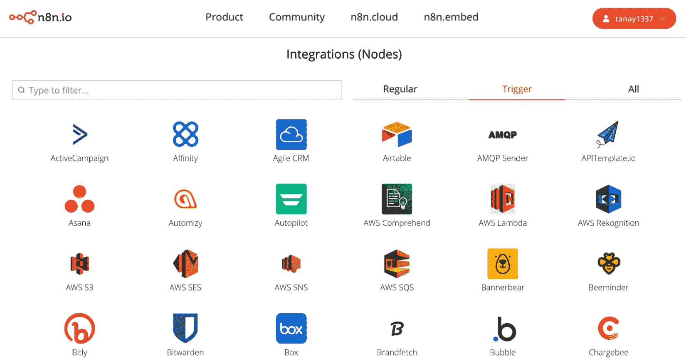
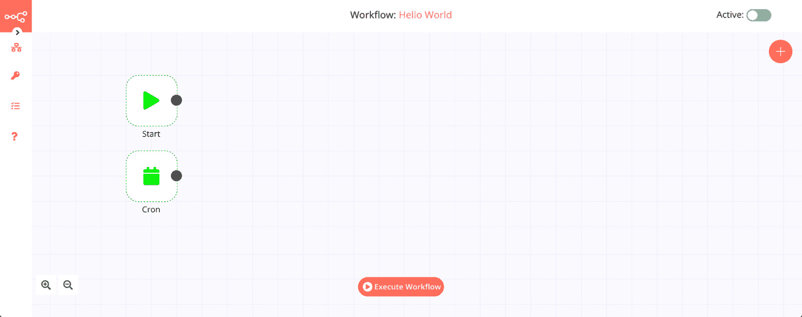
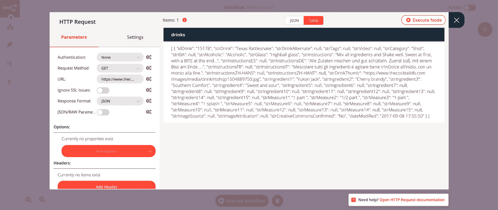
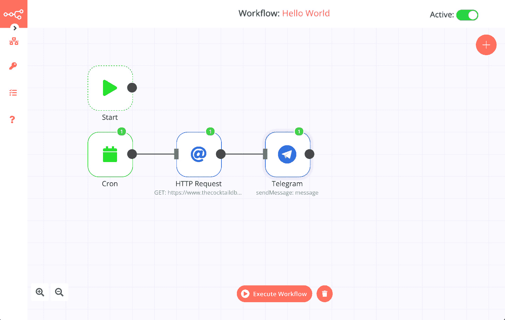

# *第二章*：使用编辑器 UI 创建工作流程

在本章中，您将学习如何使用 n8n 的 **编辑器 UI**。这将帮助您找到 n8n 的不同功能。您还将了解 n8n 中不同类型的节点以及如何使用它们。然后，您将学习如何构建工作流程以及处理动态数据以应对不同场景。最后，您将在 n8n 中创建您的第一个工作流程。

本章将涵盖以下主要主题：

+   编辑器 UI 简介

+   探索常规和触发节点

+   表达式 – 使用动态数据

+   工作流程 – 整合一切

+   创建您的第一个工作流程 – Hello World

# 技术要求

在继续本章之前，请准备以下技术要求列表：

+   确保 n8n 已安装。

+   确保 n8n 正在运行且编辑器 UI 已打开。

+   在 Telegram 上创建一个账户。

# 编辑器 UI 简介

编辑器 UI 是一个图形界面，允许您使用基于节点的方案创建自动化。n8n 从电影和电视行业汲取了基于节点的可视化的灵感，在该行业中，许多工具都拥有基于节点的系统。让我们看看我们这里有什么：

图 2.1 – n8n 中的编辑器 UI

让我们从左上角开始。您可以通过点击 n8n 标志下方的 **>** 按钮来展开菜单。

目前，我们将熟悉界面，以便我们可以在 n8n 中快速找到我们的位置。随着我们在本书的章节中前进，我们将更深入地探讨特定部分，例如 **执行**。让我们看看左侧的菜单栏。

首先，我们有 **工作流程** 菜单。在菜单中，我们有以下选项：

+   **新建**：创建新的工作流程。

+   **打开**：打开现有的工作流程。

+   **保存**：保存当前工作流程的更改。

+   **另存为**：保存当前工作流程。

+   **重命名**：重命名当前工作流程。

+   **删除**：删除当前工作流程。

+   **下载**：将工作流程作为 JSON 文件下载。

+   **从 URL 导入**：从 URL 导入工作流程。

+   **从文件导入**：从 JSON 文件导入工作流程。

+   **设置**：配置当前工作流程的设置。

请注意，由于我们尚未保存工作流程，其中一些选项将被灰色显示。

接下来，我们有 **凭据** 菜单。在这个菜单中，我们有以下两个选项：

+   **新建**：创建新的凭据。

+   **打开**：打开现有的凭据。

n8n 允许您连接到许多不同的应用程序、服务和 API。其中许多需要凭据进行身份验证。n8n 允许您在数据库中加密并保存这些凭据，以便在构建工作流程时可以快速重用。

接下来，我们有 **执行** 选项卡，它打开一个模态（弹出窗口），您可以在其中查看不同工作流程的执行情况。您还可以通过名称和状态过滤执行。

最后，我们有**帮助**标签，其中列出了对您有用的资源：

+   **文档**：一个链接到n8n文档的链接。n8n文档包含每个节点的详细信息、示例工作流程和参考。

+   **论坛**：n8n有一个非常活跃和友好的社区。如果您在任何事情上遇到困难，请随时在那里提出问题，有人会帮助您解决问题。

+   **工作流程**：此页面列出了社区提交的工作流程。这是一个获得您下一个自动化灵感的绝佳地方。

+   **关于n8n**：此选项打开一个模态窗口，其中包含有关n8n版本、GitHub存储库链接和许可证的详细信息。

在左下角，您会看到放大和缩小画布的选项。画布是编辑器UI中的网格框，您将在其中添加节点以创建工作流程。您还会注意到所有新的n8n工作流程都有一个**开始**节点。

在编辑器UI的底部中央，您会注意到一个标有**执行工作流程**按钮。这对于手动执行您在n8n中创建的工作流程非常有用。工作流程可以以两种方式运行：

+   **手动执行**：这些在您构建工作流程或进行一次性执行时非常有用。一次性执行的例子可以是迁移CSV文件中的所有数据到Google Sheets的工作流程。您可以通过点击**执行工作流程**按钮手动执行工作流程。

+   **自动执行**：一旦您的自动化准备就绪，大多数情况下，您希望它们在常规间隔或特定事件发生时运行。为了实现这一点，您需要激活一个工作流程。您可以通过点击左上角的**激活**按钮来这样做，这将改变切换的状态从非活动状态变为活动状态。请注意，您需要首先保存工作流程，然后才能激活它。

最后，我们在编辑器UI的右侧有一个**+**按钮。点击它将显示**节点**面板。您可以使用它向画布添加新节点并构建工作流程。您会注意到它有三个类别：**所有**、**常规**和**触发器**。让我们更深入地了解n8n中的节点，以了解这些部分的意义。

# 探索常规和触发节点

节点是n8n中工作流程的构建块。节点可以连接到应用程序、服务和API，并执行Node.js中一般可能执行的所有操作。每个节点根据其设计执行任务。完成后，数据将传递到下一个节点。这是上一个节点配置的任务执行的结果。

每个节点都有一个输入（左侧）和一个输出（右侧）。如果一个节点的输出连接到第二个节点的输入，则第二个节点将接收第一个节点的结果作为其输入。

注意

我们将在本书的后面部分更详细地介绍特定节点。

从抽象的角度来看，n8n中有两种类型的节点：

+   **常规节点**：常规节点对于处理**创建、读取、更新和删除**（**CRUD**）操作、转换数据和从互联网获取信息等事物非常有用。以下是一些常规节点的示例：

    +   **Airtable节点**：它可以读取、添加、更新和删除Airtable表中的数据。

    +   **函数节点**：它可以执行JavaScript代码，通常用于操作工作流数据。

    +   **Bubble节点**：此节点允许您创建、删除、更新和从Bubble获取对象。

您可以通过访问n8n网站的**应用与节点**页面（[https://n8n.io/integrations](https://n8n.io/integrations)）并点击**常规**选项卡来找到最新版本的n8n中的整个常规节点列表（见*Figure 2.2*）：

![Figure 2.2 – n8n附带的一些常规节点

Figure 2.2 – n8n附带的一些常规节点

+   **触发节点**：触发节点启动工作流的执行。这些节点可以根据基于时间间隔或来自外部系统的事件启动工作流。如果您想使工作流自动执行，则需要一个触发节点。除非有触发节点，否则无法激活工作流。以下是一些触发节点的示例：

    +   **Cron节点**：此节点可以配置为每分钟或每小时激活一次工作流，或使用自定义Cron表达式指定。

    +   **Telegram触发节点**：此节点可以配置为每次Telegram机器人收到消息时激活工作流。

您也可以通过点击**触发**选项卡（见*Figure 2.3*）来在n8n的**应用与节点**页面上找到触发节点的详尽列表：

中深入了解n8n的核心节点，*深入n8n的核心节点和数据*。为了将这个概念付诸实践，请按照以下步骤操作：

1.  让我们回到编辑器UI。首先，点击**起始**节点以便它被突出显示。这样做可以确保您添加到画布上的新节点将自动连接到突出显示的节点。

图2.5 – Hacker News节点的输出

您会注意到该节点从Hacker News返回100篇新闻文章。它为每个新闻条目产生各种信息。让我们花几分钟时间了解节点面板中的内容。

点击n8n中的任何节点都会打开节点详细信息视图，允许您配置节点、执行它并查看它接收或生成的数据。

让我们从节点面板的左上角开始。现在它写着“获取新闻”。

在节点名称下方，我们有两个选项卡：

+   **参数**：此选项卡包含配置任务的参数。大多数节点都有**资源**和**操作**字段。它们是将各种应用程序和API提供的广泛功能捆绑在一起的方式。

为了更好地理解这一点，让我们以CRM为例，您可以在其中存储个人和公司的数据。在n8n中，此CRM的节点将**人员**和**公司**作为资源。对于每个资源，它可能随后有创建、读取、更新和删除作为操作。

在这两个字段下方，您将看到所需的字段，例如**名称**。像姓氏一样，任何可选字段总是捆绑在**附加字段**部分下，这有助于保持UI整洁。

+   **设置**：此选项卡包含一些选项，例如添加备注，以及一些我们将在本书稍后讨论的其他设置，因为它们变得相关。

在节点面板的顶部中间，您将看到两个选项卡：

+   **JSON**：点击此选项卡将展示从**Hacker News**接收的JSON格式的数据。

图2.6 – 通过点击JSON选项卡查看输出

+   **表格**：表格视图是n8n显示数据的默认视图。

在面板的右上角，您会看到**执行节点**按钮。此按钮允许您手动执行此特定节点，而无需重新触发整个工作流或执行工作流中的后续节点。这在逐步构建工作流时测试工作流非常有用。然后，我们旁边有一个**X**按钮。您可以点击它返回到编辑器UI中的画布。

最后，在节点面板的底部，你会看到一个链接到你打开的节点文档。点击它以访问节点文档，其中包含带有该节点的示例工作流和一些常见问题解答。

当与节点一起工作时，你通常会需要在节点之间引用数据。这些数据通常是动态的。例如，天气数据可能每小时都会变化。让我们了解如何使用表达式在n8n中引用动态数据。

# 表达式 – 使用动态数据

考虑以下场景：你只想将新闻文章的名称和URL作为工作流数据的一部分，因为Hacker News节点返回的其他数据对你来说无关紧要。我们可以以几种方式过滤工作流数据，但在这里我们将使用**Set**节点。**Set**节点是n8n中的代码节点之一，可以帮助你配置工作流数据。为了创建上述场景的Set节点，请按照以下步骤操作：

1.  将**Set**节点添加到画布中，并将其连接到**获取新闻**节点。

图2.7 – 将Set节点添加到Hacker News节点

1.  现在，通过双击打开**Set**节点。将**仅保留集合**字段切换为true（绿色）。这将移除所有传入的工作流数据，并仅追加在**Set**节点中配置的新值。

1.  点击**添加值**按钮并选择**字符串**。你会注意到我们现在有两个字段：**名称**和**值**。这两个字段设计JSON数据结构。

1.  从**标题**中删除`propertyName`。

现在，标题的值将在节点每次迭代前一个节点接收到的100个项目时都不同。也有可能这100个值会完全不同，因为新的文章出现在Hacker News等地方。

由于这个原因，**值**字段需要是动态的，因为值会不断变化。你可以在n8n中使用表达式来实现这一点。

1.  要向字段添加表达式，点击字段旁边的齿轮图标，然后点击**添加表达式**。使用**值**字段执行此步骤。这些操作将打开表达式编辑器。

1.  在左侧，你会注意到**变量选择器**部分。点击当前节点，通过嵌套找到标题。它应该看起来像这样：

图2.8 – 使用n8n中的表达式编辑器选择帖子的标题

如果数据没有显示出来，请检查以下内容：

+   此节点与上一个节点相连。

+   前一个节点已经执行。

我们将对URL执行相同的步骤，然后点击**Set**节点的**执行节点**按钮。

图2.9 – Set节点的输出

多亏了**Set**节点和表达式，我们现在只在工作流中有了我们想要的相关数据。

表达式是n8n中的一个强大功能。你可以使用它们来引用工作流中的数据、其他节点、环境，甚至自生成数据。假设我们想在每篇新闻文章中添加一个随机ID。在`ID`中添加一个数值作为名称，然后点击**值**字段的**添加表达式**。

删除`0`并输入以下内容：`{{ Math.floor(Math.random() *1000) }}`。

表达式可以在双大括号之间执行JavaScript，在这里我们用它来生成三位随机数。假设我们希望ID以`ID_`开头。编辑表达式，使其看起来像这样：`ID_{{ Math.floor(Math.random() *1000) }}`。点击**执行节点**按钮查看结果。

图2.10 – 添加ID后的Set节点输出

你可以使用表达式做很多事情，我们将在本书的其余部分介绍更多概念。

既然我们已经了解了表达式，让我们进一步了解n8n中的工作流，以了解它们是什么。

# 工作流 – 整合一切

工作流是n8n中节点的一个集合。工作流可以从两个节点到数百个节点不等，包括调用子工作流。这些工作流可以保存在n8n的数据库中，并在后台运行，即使你没有打开n8n编辑器UI。

虽然n8n中的每个节点本身都非常强大，但当你开始连接这些节点时，n8n的真正潜力就显现出来了。在n8n中，你可以将一个节点连接到许多其他节点。工作流不一定要遵循线性结构。

现实世界的问题或任务通常由一系列步骤组成。n8n之所以强大，是因为你可以将复杂的过程和任务建模为工作流，即一系列执行步骤以完成更大过程的节点。

现在我们保存通过点击`我的第一个工作流`创建的工作流，并按*Enter*键。

工作流是JSON对象。你可以通过两种方式查看其底层的JSON：

+   点击**工作流**图标，然后点击**下载**按钮以下载JSON文件。

+   在画布上按*Ctrl* + *A*选择你的工作流中的所有节点，按*Ctrl* + *C*复制它们，然后在文本编辑器中粘贴JSON，按*Ctrl* + *V*。

下面是我们创建的工作流的JSON看起来是这样的：

图2.11 – 我们创建的工作流的JSON

如果你查看 JSON 文件，你会看到它包含了关于你工作流程中不同节点信息，它们是如何连接的，以及设置的参数。在前面的屏幕截图中，你可以注意到我们在 **设置** 节点中配置的标题、URL 和 ID，以及我们添加的表达式。

然后，你可以将这些文件与你的朋友和同事分享，以便他们可以在他们的 n8n 实例上加载它们并运行你创建的工作流程。他们可以将工作流程作为文件导入，或者将 JSON 粘贴到他们的编辑器界面中。

现在我们已经了解了工作流程，让我们在 n8n 中创建我们的第一个工作流程，它将在每天下午 6 点通过 Telegram 发送鸡尾酒配方。

# 创建你的第一个工作流程 – Hello World

现在，我们已经熟悉了 n8n 的编辑器界面、节点和工作流程，让我们创建一个新的工作流程，允许我们每天向 Telegram 发送一个随机鸡尾酒配方。按照以下步骤操作：

1.  在 n8n 上创建一个新的工作流程，点击 **工作流程** 图标，然后点击 **新建**。由于这是一个每天运行的自动化任务，我们需要添加一个触发节点。

1.  点击 **+** 按钮，点击 **触发** 选项卡，并选择 **Cron** 节点。

1.  从 **Cron** 节点的详细信息视图，点击 **添加 Cron 时间** 并将 **小时** 更改为 **18**。通过这样做，我们确保工作流程每天在 1800 小时运行。

1.  保存工作流程并将其命名为 **Hello World**。现在，工作流程将在 n8n 的默认时区 1800 小时触发。n8n 的默认时区是 **纽约**。

1.  让我们通过点击 **工作流程** 图标并选择 **设置** 来更改此特定工作流程的时间区域。在那里，你可以选择你的时区。

1.  完成这些操作后，点击 **保存** 按钮，并返回到编辑器界面。

![图 2.12 – 向编辑器界面添加 Cron 节点并保存工作流程]

图 2.12 – 向编辑器界面添加 Cron 节点并保存工作流程

1.  现在，通过点击它来突出显示 **Cron** 节点，然后将 **HTTP 请求** 节点添加到画布上。确保它连接到 **Cron** 节点。

我们将使用 **HTTP 请求** 节点，因为鸡尾酒 API 在 n8n 中没有节点。**HTTP 请求** 节点允许我们发起 HTTP 请求，并使我们能够调用 n8n 中尚未有节点的服务 API。我们将调用 CocktailDB API 的随机端点。

1.  在 **HTTP 请求** 节点的 **URL** 字段中输入 [https://www.thecocktaildb.com/api/json/v1/1/random.php](https://www.thecocktaildb.com/api/json/v1/1/random.php) 并点击 **执行节点** 按钮。你会注意到它返回了关于随机鸡尾酒的详细信息。

![图 2.13 – 向 CocktailDB API 的随机端点发起请求后 HTTP 请求节点的输出]

图 2.13 – 向 CocktailDB API 的随机端点发起请求后 HTTP 请求节点的输出

现在，我们将需要将此数据发送到 Telegram。为此，我们首先需要创建一个 Telegram 机器人。您可以使用 Telegram 移动应用、Web 应用或桌面应用程序来创建机器人。在示例截图（*图 2.14*）中，我正在使用 macOS 的桌面应用程序。要这样做，请按照以下步骤操作：

1.  在名称旁边带有蓝色和白色“已验证”符号的`BotFather`中搜索。要验证，请点击 BotFather 用户名。

图 2.14 – Telegram 应用中的 BotFather

1.  输入 `/newbot` 命令，并按照说明创建您的机器人。您可以随意命名，但用户名必须是唯一的。

1.  完成后，它将为您提供 HTTP API 的访问令牌。复制它；我们将在 n8n 中需要它。接下来，点击 BotFather 提供的机器人链接，并点击 **开始**。

1.  现在，前往 n8n 并添加一个 **Telegram** 节点。确保 Telegram 节点的输入连接到 **HTTP 请求** 节点的输出。您会注意到节点有一个名为 **凭证** 的部分。

1.  点击 **Telegram API** 字段，并从下拉菜单中选择 **创建新**。

1.  `Daily Drinks Bot` 以便在视觉上区分我的其他 Telegram 机器人。

1.  现在，将您从 BotFather 复制的访问令牌粘贴到 **访问令牌** 字段中，然后点击 **保存** 按钮。

1.  现在，我们需要聊天 ID。要找到它，请在您的网络浏览器中打开一个新标签页，并转到 https://api.telegram.org/bot<YourBOTToken>/getUpdates。

不要忘记将 `<YourBOTToken>` 替换为您从 BotFather 获得的访问令牌。如果您在那个页面上看不到任何内容，请向您的机器人发送消息并再次打开该 URL。然后您可以从那里复制聊天 ID 并将其粘贴到 n8n 的 **Chat ID** 字段中。

现在，我们必须为 **文本** 字段编写消息。我们将为此使用表达式。请随意编写您喜欢的消息。以下是我的样子：

图 2.15 – 使用表达式编辑器指定 Telegram 消息的内容

1.  返回 Telegram 节点面板，点击 **执行节点** 按钮。现在您应该能在 Telegram 上看到您的机器人发送的消息。以下是我的样子：

图 2.16 – 通过 Telegram 机器人发送的消息

现在我们已经启动了机器人，我们将需要激活工作流程，以便每天 18:00 小时获得新的鸡尾酒配方。

1.  返回编辑器 UI 中的画布，点击右上角的 **激活** 按钮，然后选择 **是**，然后激活并保存！我的最终工作流程看起来像这样：

![图 2.17 – 已激活的最终工作流程

图 2.17 – 已激活的最终工作流程

只要 n8n 在运行，你现在每晚都会收到鸡尾酒配方。恭喜你创建了你的第一个 n8n 工作流程！

# 摘要

在本章中，我们学习了 n8n 的编辑器 UI。然后我们了解了 n8n 中的两种节点类型。接着我们介绍了如何在 n8n 工作流程中引用动态数据，并进一步学习了 n8n 中的工作流程。最后，我们通过结合编辑器 UI、节点、表达式和工作流程的知识，创建了我们的第一个 n8n 工作流程。我们将利用本章学到的原则来构建处理我们产品后端的工作流程。对这些主题的理解将有助于在 n8n 中构建任何复杂程度的工作流程。

在下一章中，我们将深入探讨使 n8n 如此强大的核心节点。然后我们将看看 n8n 工作流程之间如何共享数据，并学习如何访问这些信息。
