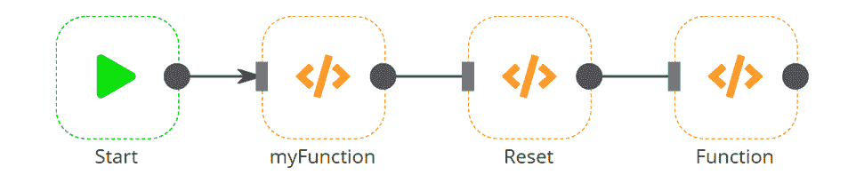
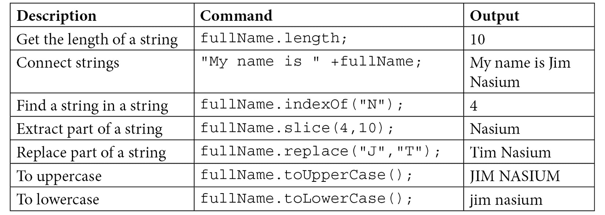
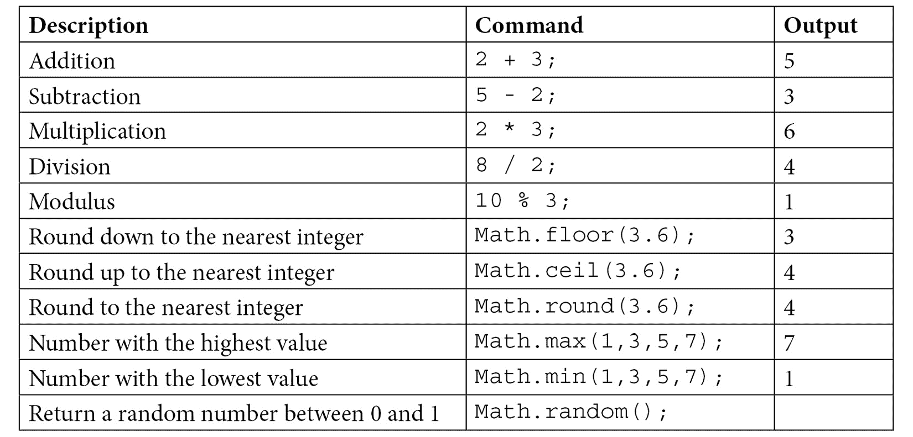

# 第四章：*第 3 章*：深入 n8n 的核心节点和数据

如果你曾经去过正在开始建造房屋的建筑工地，有时很难想象最终房屋会是什么样子，未来的业主可能非常兴奋地想要搬进房子，将其变成自己的家。如果他们能按照自己的意愿行事，他们可能会跳过房屋建造的这一部分，专注于所有细节，如油漆颜色、房间布局和家具摆放。

但如果所有住宅建造者都这样做，他们的房子都不会持久。他们没有合适的地基来支撑，房子的框架会很快失效。

对于学习设计计算机程序来说，同样的话也可以说。如果一个新开发者没有学习编程系统的基本部分和概念，那么应用程序的开发就会非常缓慢，并且往往质量较差。但与传统计算机程序员不同，不需要理解复杂的语法或编码结构，就可以熟练地使用无代码解决方案进行开发。

正确理解核心节点以及数据在 n8n 中的结构至关重要。没有这些基础概念，你将无法在 n8n 中取得很大进展。

本章涵盖了以下主题：

+   n8n中的数据结构简介

+   函数节点——在工作流中使用自定义 JavaScript

+   项目数组

+   HTTP 请求节点——与任何 **应用程序编程接口**（**API**）进行通信

+   Webhook 节点——处理实时事件

+   与数组和 **JavaScript 对象表示法**（**JSON**）对象一起工作

到本章结束时，你将学会以下内容：

+   使用 n8n 的数据结构来操纵和转换工作流中的数据

+   在你的低代码工作流中使用 JavaScript 来解锁自定义功能

+   调用 `HTTP 请求` 节点

+   使用 `Webhook` 节点处理实时事件，并根据这些数据触发工作流

+   在 n8n 内部处理数组和 JSON 对象，了解何时使用哪种数据格式，并在工作流中转换数据

# 技术要求

+   你应该已经安装了 n8n

+   n8n 应该正在运行，并且编辑器 **用户界面**（**UI**）已打开

+   你可以访问 GitHub 仓库，网址如下：[https://github.com/PacktPublishing/Rapid-Product-Development-with-n8n](https://github.com/PacktPublishing/Rapid-Product-Development-with-n8n)

# n8n中的数据结构简介

我热爱旅行到不同的国家，并从不同的视角体验生活。不同的文化和习俗让我着迷。

但不幸的是，我经常发现自己遇到麻烦，因为我只精通一种语言。如果没有共同的语言，很容易误解别人试图传达给我的信息。

n8n 也有它自己的语言版本，用于节点之间的通信。这种“语言”被称为 JSON，它是一种简单的文本格式，易于计算机和人类阅读。使用 JSON，n8n 可以传输文本和非文本（称为**二进制**）信息。

n8n 的开发者设计了工作流程中的每个节点，以便以这种特定的 JSON 格式接收和输出数据。这种标准数据结构允许 n8n 以无限的工作流程组合将这些节点链接在一起，以产生各种不同的解决方案。

理解 JSON 的总体情况以及 n8n 如何使用 JSON 是非常重要的。本节讨论了 JSON 如何表示信息以及两种不同的分组方式——对象和数组。我们还深入探讨了 n8n 如何在工作流程中使用 JSON 进行通信以及存储工作流程中的两种主要数据类型——JSON 和二进制数据。

在以下代码片段中，您将找到 JSON 格式信息的样本。此示例描述了一辆 2021 年红色的自动挡汽车：

```py
[
  {
    "vehicle": {
      "type": "car",
       "colour": "red",
       "year": 2021,
       "automatic": true
    }
  }
]
```

## JSON 语法

有几个语法项需要介绍，以便更容易理解这些 JSON 文件。这些项可以分为以下几类：

+   **值**—数据或信息

+   **键值对**—信息的名称及其本身

+   **对象**—键值对组

+   **数组**—值组

我们将在接下来的章节中了解更多关于这些内容。

### 值

值是 JSON 中表示的数据片段。一个值可以是：

+   一个字符串（一系列字母数字符号）

+   一个数字（标准数值）

+   JSON 对象（见*对象*部分）

+   一个数组（见*数组*部分）

+   一个布尔值（`true` 或 `false`）

### 键值对

需要首先理解的是 JSON 中的键值对。这些由双引号内的字段名和冒号分隔的值组成。

例如，`"fruit": "apple"` 是一个键值对，其中 `"fruit"` 是键，`"apple"` 是值。

您可以在 n8n 中引用一个键来检索与其配对的值。

### 对象

对象是一组键值对，用花括号括起来并用逗号分隔。例如，`{"name": "Jill", "age": 27, "certified": true}` 是一个包含三个键（`name`、`age` 和 `certified`）的对象，每个键都有一个值（`Jill`、`27` 和 `true`）。

他们的密钥可以引用对象中的值。

为了更进一步，让我们想象我们有一个以下的 JSON 对象：

```py
{"user1":
     {"name": "Jill", "age": 27, "certified": true},
 "user2":
     {"name": "James", "age": 43, "certified": false}
}
```

在此示例中，`user1.name` 将是 `Jill`，而 `user2.name` 将是 `James`。

### 数组

数组是一组用方括号括起来并用逗号分隔的值。例如，`[ "zero", "one", "two" ]` 是一个包含三个值的数组。

数组与对象类似，但它们没有键，因此它们的索引引用值。

索引是数组中值的位臵。索引值从零（0）开始，对于数组中的每个部分增加一。在我们的例子中，这些是数组的索引及其值：

+   `0`—`"零"`

+   1——“一”

+   2——“二”

## n8n JSON结构

在n8n中节点之间传递的JSON是一种特定的结构。它由至少一个对象的数组组成。

该对象内部包含一个或两个子对象。这两个对象键是`json`和`binary`。

### json对象

`json`对象是一个必需的对象。在其内部包含了作为节点执行结果看到的全部JSON数据。

`json`对象的内容是灵活的，可以是其他对象、数组和键值对的混合。

例如，如果你有一个设置笔记，将键`colour`设置为`red`值，节点输出将以以下JSON格式显示：

```py
[ { "colour": "red" } ]
```

但当此信息以n8n JSON格式存储时，在节点之间传递，看起来像这样：

```py
[
  {
    "json": {
      "colour": "red"
    }
  }
]
```

这样，节点就能理解信息是针对它们的，并将信息识别为测试信息。还有一个可选的二进制部分与json部分一起，稍后将会介绍。

以下图表展示了数据在节点之间传递的格式。它代表了数据框架：


图3.1 – n8n数据结构

在节点之间传递的整个数据集被构建成一个JSON数组。在该数组内部，有两个JSON对象——一个称为`JSON`，另一个称为`Binary`。`JSON`对象包含表示文本数据的键值对。同时，`Binary`对象包含二进制信息（可以将其视为文件）。除了`Binary`对象的实际数据外，还有一些元数据，如`mimeType`（这是数据包含的文件类型）、`fileExtension`和`fileName`。

### 二进制对象

n8n JSON数据结构中的第二个对象是`binary`对象。`binary`对象是一个可选组件，因为并非每个JSON数据集都包含二进制元素。但是当它提供时，该对象包含的信息通常代表文件系统中的一个文件。

但如果你要在n8n JSON数据中包含此对象，它具有特定的结构。在`binary`对象内部有一个键，其名称可以是任意的（在我们的例子中，我们将它称为`binaryKeyName`）。与此键关联的值是另一个对象。该对象由最多四个键值对组成：

+   `data`（必需）—Base64编码的二进制数据或唯一数据ID引用

+   `mimeType`（可选）—根据标准MIME类型存储在`data`值中的数据类型

+   `fileExtension`（可选）—表示`data`值中信息所具有的文件扩展名

+   `fileName`（可选）—描述`data`值中数据的文件名称

+   `path`（可选） - 文件在系统中的位置

当在n8n JSON数据中设置`binary`对象时，你将看到额外的`binary`对象，如下面的截图所示：


图 3.2 – n8n编辑器UI中的二进制数据

在下一节中，我们将查看`函数`节点。它允许你在没有节点执行你需要的精确动作时，在JavaScript中创建自定义代码。对于使用JavaScript代码操作信息，理解n8n数据结构变得极为重要。

# 函数节点 – 工作流程中的自定义JavaScript

有时候，对于你想要完成的操作，完美的n8n节点可能根本不存在。这是有道理的，因为可能发生无限多种不同的操作。这就是为什么n8n创建了`函数`节点：这样我们就有了一种创建我们自己的自定义动作的方法，我们将在下一节中学习如何做到这一点。

`函数`节点是n8n工具箱中最通用的节点。它可以执行JavaScript来操作其他节点输出的数据，并将其以标准n8n数据结构的形式输出。你可以在以下截图中看到它的表示：


](img/Figure_3.03_B17493.jpg)

图 3.3 – 函数节点

但`函数`节点的灵活性确实要求你能够使用一些JavaScript。与许多其他具有多个选项和参数可供选择的节点不同，`函数`节点只有一个参数——JavaScript代码字段。你将在该字段中完成所有工作。

JavaScript代码字段中意外地包含JavaScript。你将使用这种编程语言在`函数`节点内进行所有数据操作。虽然你不需要成为JavaScript专家，但更好地了解这种语言是有价值的。对于我们在本书中将要讨论的内容，对JavaScript的基本理解就足够了。

第一次在新`函数`节点中打开JavaScript代码字段时，你会注意到已经有几行代码：

```py
// Code here will run only once, no matter how many input items there are.
// More info and help: https://docs.n8n.io/nodes/n8n-nodes-base.function
// Loop over inputs and add a new field called 'myNewField' to the JSON of each one
for (item of items) {
  item.json.myNewField = 1;
}
// You can write logs to the browser console
console.log('Done!');
return items;
```

这为你提供了一个很好的例子，说明了`函数`节点是如何工作的。此脚本将值`1`赋给n8n数据结构中JSON对象的每个`myNewField`键。然后它将操作已完成的动作写入网页浏览器控制台。最后，它输出结果。

如果你执行这个`函数`节点，你将得到以下输出结果：

```py
[
  {
    " myNewField": 1
  }
]
```

那么，它是如何工作的呢？它之所以能工作，是因为`items`数组，我们将在下一节中介绍。

# 项目数组

这段代码的关键是`items`数组。它存储了传递给`函数`节点的上一个节点中n8n数据结构中的所有信息。方括号中的值代表你希望与之工作的`items`数组中JSON对象的索引。

最基本的`items`数组只有一个由零（0）索引号表示的对象，但`items`数组中可能有更多的对象，你可以使用与该对象关联的数组索引号访问每个这些对象。

在接下来的几节中，我们将简要讨论使用点符号引用`items`数组的不同部分，以及如何在我们转换信息后输出信息。此外，我们还将介绍如何访问除你所在的节点直接前一个节点之外的其他节点中的数据。

## 点符号

一旦你通过指定其索引号在`items`数组中选择了适当的对象，你需要确定你将处理JSON还是二进制对象。你可以通过使用所谓的`.`来完成此操作）。在我们的代码的第*1*行中，`items[0]`和`json`之间的点告诉n8n引用`items`数组中索引为`0`的`json`对象。

大多数情况下，你将在`json`对象中工作，但有些情况下你会使用`binary`对象。

为了更好地理解用于引用`items`数组不同部分的点符号，请参考以下表格，其中左侧是点符号名称，右侧是它引用的JSON部分：


## 输出数据

与其他编程语言中的函数一样，`Function`节点需要指示哪些信息被传递到程序的其余部分。这是通过代码的第二行完成的，它将更新后的`items`数组返回到下一个节点。

虽然修改`items`数组的值并将其传递给下一个节点是一种最佳实践，但从技术上讲，这不是必需的，你可以返回任何遵循正确的n8n数据结构的数组。

## 来自其他节点的数据（$items方法）

有时，有必要引用一个未直接连接到你正在工作的`Function`节点但之前已经执行过的节点的输出。在这种情况下，引用`items`数组将不会给你正确的信息。

要解决这个问题，你可以使用`$items`方法。此方法允许你访问节点中的所有数据，只要该节点在你正在工作的当前节点之前并且已经执行过。

让我们看看这个动作。让我们构建以下工作流程：

![图3.4 – 使用三个Function节点的基本工作流程



图3.4 – 使用三个Function节点的基本工作流程

由于这是一个默认的`Function`节点，`myFunction`节点的输出如下：

```py
[
  {
    "myVariable": 0
  },
  {
    "myVariable": 1
  }
]
```

`Reset`节点随后删除它接收到的所有内容，并将输出设置为空，如这里所示：

```py
[
  {
  }
]
```

我们在`Function`节点中设置JavaScript以输出前一个节点的信息，如下所示：

```py
return items;
```

正如你所见，我们最终得到与`Reset`节点相同的结果。

现在，让我们使用`$items`方法从`myFunction`节点中提取数据，实际上跳过了`Reset`节点。将`Function`节点中的JavaScript更改如下：

```py
items = $items("myFunction");
return items;
```

当你现在运行工作流时，你会看到`Function`节点的输出与`myFunction`节点的输出相匹配。

就像对`items`数组一样，你可以通过设置方括号中的索引来指定要引用的`$items`方法中的哪个项目。除了使用数组索引外，你还可以使用点符号来深入到数组和对象中引用。例如，以下方式访问特定信息是完全可接受的：

```py
items[0].json = $items("myFunction")[1].json;
```

## 数据操作

因为`Function`节点使用JavaScript，你可以使用JavaScript的所有功能来操作数据。对JavaScript及其功能的深入研究超出了本书的范围，但有一些有用的命令我们已经整理出来，以帮助你入门。

### 字符串

对于这些示例，我们将假设我们有一个名为`fullName`的变量，并且分配给它的值是`Jim Nasium`。请看以下表格：



### 数学

JavaScript也具有强大的数学能力。以下是一些实际例子：



正如你现在应该意识到的，`Function`节点非常强大。我们已经学会了如何在节点内部和从其他节点引用数据，操作字符串和数字，以及输出数据以便其他节点可以使用。

现在我们已经更好地理解了`Function`节点的能力以及我们可以用数据做什么，让我们看看如何通过`HTTP Request`节点从远程系统获取数据。

# HTTP请求节点 - 与任何API通信

计算机系统非常适合存储和处理大量数据，但计算机用户和开发者很快发现，并没有实际的标准允许这些计算机共享信息。

有些人有了一个聪明的想法，即使用新的Web标准来创建一种让这些系统进行通信的方式。他们会使用标准的请求方法来检索、添加、删除或更新远程计算机上的信息。除了这些功能外，他们甚至提供了使用各种方法来确保只有授权的个人才能访问数据的能力。

这种系统设置统称为Web API，这是今天处理远程数据最受欢迎的方式之一。有数千种不同的API可用，提供对广泛的数据和信息访问。

由于n8n的主要功能之一是将不同的系统连接起来以共享数据，因此与这些Web API进行通信是合情合理的。

在本节中，我们将学习API是如何工作的，它们的格式是怎样的，数据如何通过API传递，以及API支持的主要方法和它们返回的响应代码。最后，我们将进行一些基本的API调用，并了解如何确保这些调用的安全性。

## Web API 101

在我们查看`HTTP请求`节点之前，让我们先快速概述一下API是如何工作的，以便更好地理解它们如何允许系统与之交互。

Web API运行在互联网上大多数网站所使用的技术上，但与提供您最喜欢的网页或猫视频不同，配置为运行API的Web服务器允许远程系统发出请求，并根据之前接收到的输入以数据的形式回复请求。系统之间发送的数据通常格式化为JSON。

要查看最基础的API操作，让我们看看Random User API。打开您的网络浏览器，在地址栏中输入[https://randomuser.me/api/](https://randomuser.me/api/)。当您按下*Enter*键时，您将看到一些类似这样的文本：

```py
{"results":[{"gender":"female","name":{"title":"Miss","first":"Hanna","last":"Farias"},"location":{"street":{"number":4304,"name":"Rua São Paulo "},"city":"São Luís","state":"Piauí","country":"Brazil","postcode":35435,"coordinates":{"latitude":"-77.5289","longitude":"3.6948"},"timezone":{"offset":"-11:00","description":"Midway Island, Samoa"}},"email":"hanna.farias@example.com","login":{"uuid":"66406cea-46a3-47c4-a9aa-0717ab96ae41","username":"redbear531","password":"onlyme","salt":"xOlBVsMM","md5":"e5aaa5fa1141ced7a3d0b83edbd76ef5","sha1":"cacfc3f023c50af7c9da3a1bafdd5cd653663eab","sha256":"91e134083ebaf9a721a3f7890be3a186b56a0dde8e406f37abf4b68cb41e91a0"},"dob":{"date":"1951-02-27T05:42:48.601Z","age":70},"registered":{"date":"2010-05-19T04:21:25.465Z","age":11},"phone":"(65) 4693-1327","cell":"(81) 4446-9285","id":{"name":"","value":null},"picture":{"large":"https://randomuser.me/api/portraits/women/64.jpg","medium":"https://randomuser.me/api/portraits/med/women/64.jpg","thumbnail":"https://randomuser.me/api/portraits/thumb/women/64.jpg","medium":"https://randomuser.me/api/portraits/med/women/64.jpg","thumbnail":"https://randomuser.me/api/portraits/thumb/women/64.jpg"},"nat":"BR"}],"info":{"seed":"3e10360b4732e141","results":1,"page":1,"version":"1.3"}}
```

虽然这看起来像是一堆乱码，但如果您仔细观察，您将看到一些从我们的`函数`节点章节中熟悉的字符。我们遇到的是压缩或未格式化的JSON！

## API URL的解剖结构

要访问API，您将需要的必备物品之一是**统一资源定位符**（**URL**）。理解URL的不同部分至关重要，因为您或您的系统将经常需要自己构建URL，以便您可以处理所需的信息。

让我们看看一个虚构的API URL，分析URL的不同部分，并确定它们的目的。为此练习，我们将使用以下URL：[https://api.example.com/v3/computers?type=laptop&ram=32&hdd=1024](https://api.example.com/v3/computers?type=laptop&ram=32&hdd=1024)

API URL的各个部分将在以下章节中解释。

### 协议

在我们的例子中，这是URL中的https://部分。这通常将是http://或https://。这很重要，因为如果协议是http://，那么API服务器和客户端之间的数据不会被加密。任何人都可以看到这两台计算机之间传递的信息，包括密码。

总是要确保协议是https://。

### 基础URL

在我们的例子中，基础URL是[api.example.com](http://api.example.com)。它有时被称为**主机名**、**域名**或**域名系统（DNS）名称**。这些都指的是同一件事。基础URL通常是托管API的服务器。

### 端点

对于我们的例子，端点是/v3/computers。它有时被称为API路径。端点是静态的（即保持不变）或动态的（即根据请求的信息而变化）。虽然端点的使用没有绝对标准，但有一些常见的做法。

从我们的示例中，/v3 部分告诉我们这是 API 的第 3 版，而 /computers 部分告诉我们可以期待此端点返回一个或多个记录。

### 查询参数

示例中有三个查询参数——`type=laptop`、`ram=32` 和 `hdd=1024`。两个分隔符标识查询参数。`?` 分隔符将查询参数与 URL 的其余部分分开，而 `&` 分隔符将每个查询参数分开。

与 JSON 键值对类似，键是等于号（`=`）之前的部分，值是等于号（`=`）之后的部分。

## 其他参数

在使用特定端点和查询参数是控制 API 客户端和服务器之间传递的信息类型最常见的方式的同时，其他参数可以进一步修改信息流。

### 标头

标头通常用于提供有关 API 请求的元数据。它们通常会提供有关正在传输的数据类型、安全令牌或服务器信息的信息。

这些信息通常以键值对的形式传输。

### 主体参数

请求的主体通常携带完成请求所需的信息或数据，或者由服务器根据客户端提出的请求提供。

此信息通常以键值对的形式发送。

## HTTP 方法

与 API 交互有不同的方式，每种方式都会在托管 API 的服务器和请求操作的客户端上产生不同的结果。这些被称为 **方法**，可以被视为允许系统知道如何处理请求的动作动词。下一节将简要概述每种方法及其一般用途。

### GET

`GET` 是最常见的方法。每次您使用网络浏览器从网络服务器检索信息时都会使用它。

`GET` 通常用于从 API 中检索数据。

### POST

`POST` 方法是另一种最常用的方法。网络浏览器通常会使用此方法从网页表单提交信息。

`POST` 通常用于向 API 提交信息，然后由 API 作为新记录存储。

### DELETE

`DELETE` 方法通常用于在 API 的远程服务器上删除资源或记录。

### HEAD

`HEAD` 方法与 `GET` 方法非常相似，除了 API 只返回头部信息而不返回其他数据。

### PATCH

修补资源允许您只更改记录中的部分信息，而将其他所有内容保持与之前相同。

### PUT

`PUT` 方法与 `POST` 方法类似，如果不存在记录，则会在 API 服务器上创建一个新记录。但如果要放入 API 的信息有一个匹配的记录，则该记录将被覆盖并由新信息替换。

## 响应代码

当向 API 服务器发出请求并且数据及元数据返回给客户端时，还有一个响应代码。虽然深入探讨每个响应代码的含义以及如何使用它们进行详细的故障排除超出了本书的范围，但了解每个响应代码的分类以及它们代表的内容是至关重要的。

### 1xx (信息性)

请求已被服务器接收并正在处理中。请等待它完成。

### 2xx (成功)

所有的操作都按预期进行，或多或少。

### 3xx (重定向)

API 已经不在你请求的位置了。检查错误信息以获取关于新 API 位置的更多信息。

### 4xx (客户端错误)

你构建的 API 请求有误。检查错误信息，然后更新请求。

### 5xx (服务器错误)

服务器有问题，通常你无法做太多来解决这个问题。如果你有管理 API 服务器的个人/团队的联系方式，你可以向他们报告错误并看看他们是否能提供帮助。

既然我们已经了解了 API 的概念，让我们开始使用 n8n 的 `HTTP Request` 节点连接到一些 API。

## 基本API调用

让我们从简单的 API 调用开始。让我们从 GitHub 获取有关 n8n 项目的信息。

在 n8n 编辑器 UI 的画布中添加一个新的 `HTTP Request` 节点并打开它。请将所有参数保留在默认值，除了 `URL` 值。将 `URL` 值设置为 https://api.github.com/users/n8n-io/。

就这样！我们现在已经准备好通过 API 从服务器检索数据了！点击 **执行节点** 执行 API 请求。你应该得到一个类似以下响应：

```py
[
  {
     "login": "n8n-io",
     "id": 45487711,
     "node_id": "MDEyOk9yZ2FuaXphdGlvbjQ1NDg3NzEx",
     "avatar_url": "https://avatars.
       githubusercontent.com/u/45487711?v=4",
     "gravatar_id": "",
     "url": "https://api.github.com/users/n8n-io",
     "html_url": "https://github.com/n8n-io",
     "followers_url": "https://api.github.com/users/n8n-
       io/followers",
     "following_url": "https://api.github.com/users/n8n-
       io/following{/other_user}",
     "gists_url": "https://api.github.com/users/n8n-
       io/gists{/gist_id}",
     "starred_url": "https://api.github.com/users/n8n-
       io/starred{/owner}{/repo}",
     "subscriptions_url": "https://api.github.com/
       users/n8n-io/subscriptions",
     "organizations_url": "https://api.github.com/
       users/n8n-io/orgs",
     "repos_url": "https://api.github.com/users/n8n-
       io/repos",
     "events_url": "https://api.github.com/users/n8n-
       io/events{/privacy}",
     "received_events_url": "https://api.github.com/
       users/n8n-io/received_events",
     "type": "Organization",
     "site_admin": false,
     "name": "n8n - Workflow Automation",
     "company": null,
     "blog": "https://n8n.io",
     "location": "Berlin, Germany",
     "email": "hello@n8n.io",
     "hireable": null,
     "bio": "Free and open fair-code licensed node based 
       Workflow Automation Tool.",
     "twitter_username": "n8n_io",
     "public_repos": 12,
     "public_gists": 0,
     "followers": 0,
     "following": 0,
     "created_at": "2018-11-30T12:19:59Z",
     "updated_at": "2022-01-07T17:49:22Z"  }
]
```

你现在可以将其他节点连接到 `HTTP Request` 节点的输出，并按你的意愿处理信息，或者将其发送到另一个系统。

## 使用基本认证

现在，让我们尝试一个稍微复杂一点的操作。我们将查找 `HTTP Request` 节点以查询 API：

1.  浏览到 [https://upcdatabase.org/signup](https://upcdatabase.org/signup) 并创建一个账户。

1.  一旦你创建了账户，转到 [https://upcdatabase.org/apikeys](https://upcdatabase.org/apikeys) 并复制该页面的令牌。如果页面上没有令牌，创建一个新的令牌然后复制它。

1.  在 n8n 编辑器 UI 中，将一个新的 `HTTP Request` 节点添加到画布中。

1.  对于 **认证** 参数，选择 **基本认证**。

1.  接下来，点击 **创建新** 打开 **基本认证** 参数的新凭证窗口。

1.  在 `UPC` 输入值中输入，在 **用户** 字段中输入你的电子邮件地址，并将你的令牌粘贴到 **密码** 字段中。

1.  点击 `HTTP Request` 节点。注意，**基本认证**参数现在显示的是你刚刚创建的凭证名称。

1.  在 URL 参数字段中输入 [https://api.upcdatabase.org/product/765756931182](https://api.upcdatabase.org/product/765756931182)。

1.  您的 `HTTP 请求` 节点应该已经准备好。点击 **执行节点** 并查看您的结果。它们应该看起来像这样：

```py
[
  {
    "added_time": "2020-04-03 00:28:03",
    "modified_time": "2020-04-03 00:28:03",
    "title": "Raspberry Pi 4 4GB model - New 2019 4GB Ram",
    "alias": "",
    "description": "",
    "brand": "Raspberry Pi",
    "manufacturer": "",
    "mpn": "",
    "msrp": "64.99",
    "ASIN": "",
    "category": "",
    "metadata": {
      "age": null,
      "size": null,
      "color": null,
      "gender": null
    },
    "stores": null,
    "barcode": "765756931182",
    "success": true,
    "timestamp": 1620901566,
    "images": null
  }
]
```

尝试更改 URL 末尾的数字，并用你家里的其他 UPC 替换它，看看你能找到关于产品的哪些信息。

在本节中，我们介绍了 API 的基础知识，包括构成 API 的部分，信息如何通过 API 传输，不同的 **超文本传输协议**（**HTTP**）方法以及它们对应的响应代码。然后我们进行了基本的和安全性的 API 调用。

现在我们对 API 有更好的理解，让我们从获取我们从其他服务器请求的信息转向接收推送到 n8n 的信息。

# Webhook 节点 – 处理实时事件

你可以把 Webhooks 视为 API 的堂兄弟。实际上，你可以使用 `Webhook` 节点创建一个 API 服务器！

Webhook 监听 `GET`、`HEAD` 或 `POST` 请求，并在检测到请求时启动工作流程。`Webhook` 节点可以这样做，因为它是一个触发节点。

在本节中，我们将学习如何使用 n8n 创建 Webhook。作为构建的一部分，我们将学习如何向 Webhook 发送信息以及如何响应请求的信息。

## 创建基本的测试 Webhook

要构建基本的 Webhook，请按照以下说明操作：

1.  将一个 `Webhook` 节点添加到 n8n 编辑器 UI 画布中，并打开该节点。

1.  将所有参数值保留在默认值。

1.  通过点击 **Webhook URLs** 文本来展开 **Webhook URLs** 部分。

1.  在 **显示 URL 为** 部分下点击 **测试 URL** 开关。

1.  点击 URL 以将其复制到您的剪贴板（例如，[https://tephlon.app.n8n.cloud/webhook-test/373227bb-5fda-49e9-b491-54ef33db3eed](https://tephlon.app.n8n.cloud/webhook-test/373227bb-5fda-49e9-b491-54ef33db3eed))。

1.  关闭 `Webhook` 节点。

1.  保存工作流程。这很重要，因为 Webhook URL 在工作流程保存之前无法注册。

就这样！你已经创建了你第一个基本的 Webhook！

现在，让我们测试一下它是否正常工作！按照以下步骤操作：

1.  在 n8n 编辑器 UI 中，打开 `Webhook` 节点。

1.  点击 **执行节点** 按钮以启动 Webhook 监听。

1.  打开一个新的网页浏览器，将你之前复制的 Webhook URL 粘贴到地址栏中，然后按 *Enter*。

如果一切正常，你应该看到以下两个结果：

1.  在网页浏览器窗口中，你应该会看到以下信息：

    ```py
    {"message":"Workflow got started."}
    ```

1.  在 n8n 编辑器 UI 中，你应该在 `Webhook` 节点输出窗口中接收到一些信息，类似于以下内容：

    ```py
    [
      {
        "headers": {
          "host": "tephlon.app.n8n.cloud",
          "x-request-id": 
            "30d32a403776b5bbce58ce0ef8a4c245",
          "x-real-ip": "10.40.0.4",
          "x-forwarded-for": "10.40.0.4",
          "x-forwarded-host": "tephlon.app.n8n.cloud",
          "x-forwarded-port": "443",
          "x-forwarded-proto": "https",
          "x-scheme": "https",
          "sec-ch-ua-mobile": "?0",
          "dnt": "1",
          "upgrade-insecure-requests": "1",
          "user-agent": "Mozilla/5.0 (Windows NT 10.0; 
            Win64; x64) AppleWebKit/537.36 (KHTML, like 
            Gecko) Chrome/90.0.4430.212 Safari/537.36",
          "accept": "text/html,application/xhtml+xml,
            application/xml;q=0.9,image/avif,image/
            webp,image/apng,*/*;q=0.8,application/signed-
            exchange;v=b3;q=0.9",
          "sec-fetch-site": "none",
          "sec-fetch-mode": "navigate",
          "sec-fetch-user": "?1",
          "sec-fetch-dest": "document",
          "accept-encoding": "gzip, deflate, br",
          "accept-language": "en-CA,en-GB;q=0.9,en-
            US;q=0.8,en;q=0.7",
          "cookie": 
            "token=eyJhbGciOiJIUzI1NiIsInR5cCI6IkpXVCJ9.
             eyJpc3MiOiJjbG91ZCIsInN1YiI6NDAzMSwi
             dXNlcm5hbWUiOiJ0ZXBobG9uIiwiaWF0IjoxNj
             IwODIwMDYzLCJleHAiOjE2MjE0MjQ4NjN9.
             Q77PkeKY6OUbSJI5Ms56lWvTg8jqSvNOKCp325kTjKo"
        },
        "params": {},
        "query": {},
        "body": {}
      }
    ]
    ```

这是从网页浏览器发送到 n8n 的所有信息。虽然这里有一些有趣的数据，但目前没有有用的信息。

## 向 n8n 发送信息

由于我们有一个基本的 Webhook 在运行，让我们看看当我们向它发送一些信息作为 URL 中的查询时会发生什么。按照以下步骤操作：

1.  在n8n编辑器UI中，打开`Webhook`节点并按下**执行节点**按钮。

1.  在你之前使用的网页浏览器窗口中，将Webhook URL粘贴到地址栏中，但在按*Enter*之前，将`?fname=Jim&lname=Nasium`添加到URL的末尾。然后，按*Enter*。

在网页浏览器中看起来一切正常，但让我们仔细看看Webhook节点输出窗口中的`query`部分，如下所示：

```py
"query": {
  "fname": "Jim",
  "lname": "Nasium"
},
```

这些值与在网页浏览器中输入的URL末尾输入的值匹配。你现在可以使用从客户端接收到的这些信息在你的工作流程的其余部分中使用。

## 响应客户端

既然我们知道我们可以从客户端接收信息，那么让我们向发送者发送一条确认消息！按照以下步骤操作：

1.  在`Webhook`节点中，将`Response Mode`更改为`Last Node`。

1.  在`Webhook`节点下，添加一个`html`。

1.  接下来，添加一个`Webhook`节点并启用该选项。

1.  关闭`Webhook`节点。

1.  在n8n编辑器UI中添加一个`Set`节点，并将其连接到`Webhook`节点的输出。

1.  打开`Set`节点并添加一个`string`值。

1.  将值命名为`html`。

1.  点击**Value**旁边的齿轮，然后点击**添加表达式**选项。

1.  在**表达式**字段中的`<H1>感谢光临，{{$json["query"]["fname"]}} {{$json["query"]["lname"]}}!</H1>`。

1.  关闭`Set`节点。

让我们看看这能为我们做什么。在n8n编辑器UI中，点击`?fname=Jim&lname=Nasium`。

如果一切设置正确，你应该会收到一条大字显示的消息，内容为"`感谢光临，Jim Nasium！`"。

### 这是如何工作的？

当网页浏览器将信息发送到Webhook时，Webhook会抓取URL中的`fname=Jim&lname=Nasium`部分，并将其发送到`Set`节点。然后`Set`节点使用`fname`和`lname`的值动态生成**超文本标记语言**（**HTML**），Webhook使用它将HTML发送回网页浏览器。然后，网页浏览器相应地显示HTML。

我们实际上已经把n8n转换成了一个可以生成实时动态网页的Web服务器！

在结束本章之前，我们还有一个部分要介绍。让我们谈谈如何操作存储在数组和JSON对象中的数据。

# 处理数组和JSON对象

n8n使用了大量的数组和JSON对象，因此你需要熟悉它们。在本节中，我们将学习如何通过拆分、合并和写入这些项来操作数组和对象。

在n8n工作流程中有很多数据在传输，学习一些关于操作这些存储在数组和JSON对象中的数据的技巧和窍门是有益的。

在以下代码片段中，我们将使用一个包含三个具有相同键的JSON对象的数组作为示例：

```py
[
  {
    "species": "dog",
    "name": "Cocoa",
    "color": "brown"
  },
  {
    "species": "cat",
    "name": "Lucky",
    "color": "brown"
  },
  {
    "species": "cat",
    "name": "Skittles",
    "color": "grey"
  }
]
```

如果你使用n8n节点顶部**表格**选项卡查看这些信息，它看起来可能像这样：

![img/Table_3.03_B17493.jpg]

你可以在`Function`节点中通过将`Function`节点添加到n8n编辑器UI中，并将以下内容粘贴到JavaScript代码字段中生成此表格：

```py
items = [ { "json": { "species": "dog", "name": "Cocoa", "color": "brown"}}, { "json": { "species": "cat", "name": "Lucky", "color": "brown"}}, { "json": { "species": "cat", "name": "Skittles", "color": "grey"} } ];
return items;
```

现在，`Function`节点的输出应该与前面的表格匹配。

接下来，让我们学习如何使用`IF`节点从`Function`节点中分割数据。

## 将猫和狗分开

我们将要做的第一件事是将这个数组分成两个数组，使用`IF`节点。我们将所有狗发送到`true`输出，所有猫发送到`false`输出。

要这样做，请按照以下步骤操作：

1.  将一个`IF`节点连接到生成数组的节点的输出。

1.  打开`IF`节点并向节点添加一个`string`条件。

1.  在`值 1`字段中，点击齿轮图标并选择**添加表达式**。

1.  在**表达式**字段中将`{{$json["species"]}}`输入，并关闭表达式编辑器。

1.  在`值 2`字段中，将值输入为`dog`。

1.  关闭`IF`节点并执行工作流程。

1.  打开`IF`节点并查看`true`和`false`输出的结果。你应该会看到`false`输出中有两个条目，而`true`输出中有一个条目。

## 合并两个数组

现在我们已经将数组分开，让我们看看我们是否可以将它们再次合并在一起。我们将使用`Merge`节点来完成这项工作。请按照以下步骤操作：

1.  将一个`Merge`节点添加到n8n编辑器UI中。

1.  将`IF`节点的`true`输出连接到`Merge`节点的`输入 1`。

1.  将`IF`节点的`false`输出连接到`Merge`节点的`输入 2`。

1.  打开`Merge`节点。

1.  对于`模式`参数，选择**追加**。

1.  关闭`Merge`节点。

你的最终工作流程应该看起来像这样：

![Figure 3.5 – Splitting and merging an array workflow]

![img/Figure_3.05_B17493.jpg]

图3.5 – 分割和合并数组工作流程

现在是时候测试它了！执行工作流程。当它运行完成后，打开`Merge`节点。输出窗口应该显示数组再次合并在一起。

## 将相同的值添加到所有JSON对象中

现在，让我们假设我们想要向从`Merge`节点输出的所有记录中添加另一个键。让我们还假设每个键的副本都是相同的。

我们可以通过使用`Set`节点来完成这项工作。以下是你需要遵循的步骤：

1.  将一个`Set`节点添加到n8n编辑器UI中，并将其连接到`Merge`节点的输出。

1.  打开`Set`节点。

1.  添加一个新的布尔值并命名为`adopted`。

1.  将`adopted`的值设置为`true`。

1.  关闭`Set`节点。

为了检查它是否工作，执行工作流程并打开`IF`节点。输出窗口中的表格现在应该看起来像这样：

![img/Table_3.04_B17493.jpg]

使用`IF`、`Merge`和`Set`节点，我们可以快速轻松地执行一些重要的数据处理任务，而无需使用`Function`节点进行自定义编码。

# 摘要

本章介绍了一些关键概念，我们学习了如何在n8n中构建一些强大的工具。

我们首先介绍了 n8n 如何使用键值对、对象和数组等主要组件来结构化 JSON 数据。随后，我们展示了 n8n 如何在内部存储 JSON 和二进制数据。然后，我们讨论了如何使用 `Function` 节点，以及如何理解 `items` 数组、点表示法和 `$items` 方法。一旦函数的概念被掌握，我们就学习了 API 以及如何使用基本和认证调用来发送和接收数据。接下来，我们回顾了 Webhooks，并在 n8n 中使用它们来发送信息和生成 HTML 文件。最后，我们探讨了 n8n 如何与 JSON 对象和数组协同工作，包括如何操作存储在这些项目中的数据。

拥有这些新信息，你将顺利地开始使用 n8n 构建实用的工具。

在下一章中，你将运用这些新知识，并在 n8n 中构建三个应用程序！
