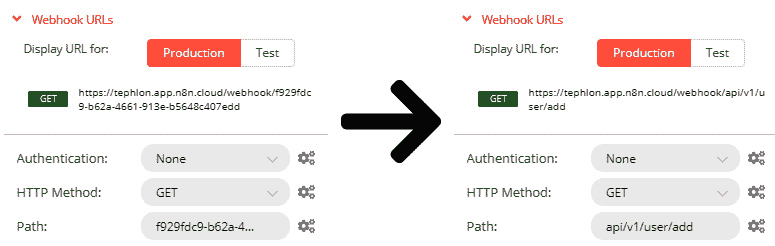
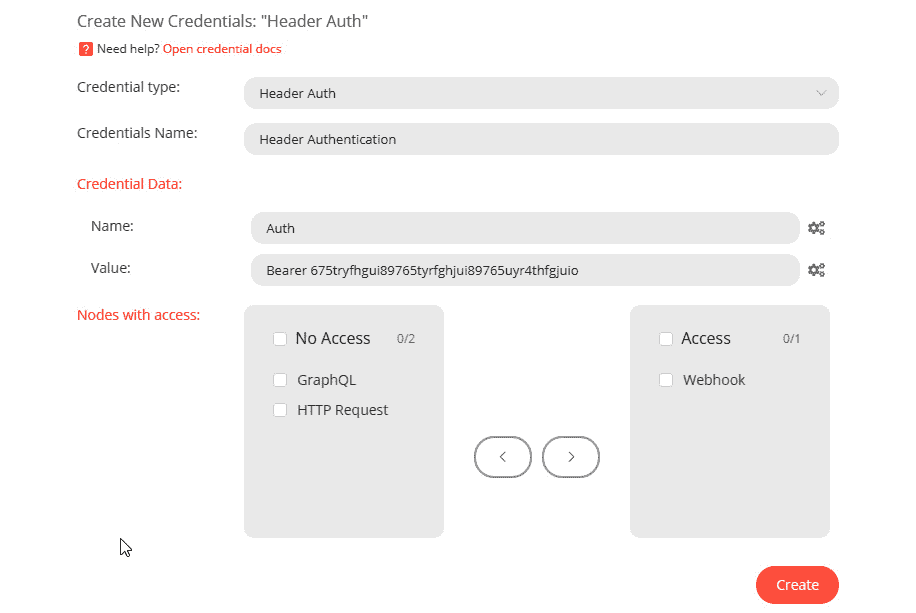

# 第七章：*第五章*：构建您的第一个API端点

沟通是所有关系的基础。良好或糟糕的关系通常由两个人传达他们的思想、感受和想法的能力来定义。沟通需要清晰、准确和值得信赖。

适当地共享信息对于计算机应用程序也是至关重要的。在两个不同的应用程序之间有标准的方式来发送和接收数据对于许多程序至关重要。

其中一个标准被称为**API**，代表**应用程序编程接口**。我们正在专门使用REST API架构风格。它被设计为快速提供信息并根据标准HTTP方法执行操作。

由于这是一个众所周知且理解的标准，在本章中，我们将向您展示如何使用n8n规划和构建API。我们将通过理解API的核心概念，并思考您希望最终产品执行的功能来帮助您规划API。您还将了解如何使用n8n构建、保护和测试您设计的API。

在本章中，我们将涵盖以下主题：

+   规划您项目的API

+   配置Webhook节点以处理请求

+   在n8n中构建API

+   保护您的API端点

+   测试您的API

到本章结束时，您将能够完成以下任务：

+   为API端点创建蓝图，以便在构建API时减少摩擦。

+   配置Webhook节点，使其能够处理发送到我们的API的请求并对其进行回复。

+   基于我们创建的蓝图，在n8n中构建一个API端点。

+   通过使用Webhook节点中可用的不同身份验证方法来确保您的API端点安全。

+   测试您的API以确保我们已实现的全部功能按预期工作。

# 技术要求

以下为本章节的技术要求：

+   n8n的一个工作版本。

+   一个网络浏览器。

+   访问本书的GitHub仓库：[https://github.com/PacktPublishing/Rapid-Product-Development-with-n8n](https://github.com/PacktPublishing/Rapid-Product-Development-with-n8n)。另一个有用的工具是Insomnia API工具，可在[https://insomnia.rest/](https://insomnia.rest/)找到。

# 规划您项目的API

在您开始构建API之前，您必须有一个稳固的路线图。此计划允许您更快地创建API，并确保设计一致且准确。

当您规划API时，需要考虑几个不同的维度。例如，良好的API设计，请参阅[https://swagger.io/specification/](https://swagger.io/specification/)上的OpenAPI规范。

## 易于理解

对于使用API的开发者来说，API的工作原理应该是几乎显而易见的。API应该有与类似API一致的术语，并充分描述它使用的信息和执行的操作。

## 以JSON格式输出数据

尽管有几种不同的数据格式可供使用，例如 XML、YAML 和 SOAP，但 REST API 最常以 JSON 格式输出数据。为了保持一致性，建议所有 API 至少能够以 JSON 格式输出数据。

## 使用 GET、HEAD 和 POST HTTP 方法

n8n 支持三种不同的 HTTP 方法（你可以将 HTTP 方法视为动作动词，告诉系统如何处理它接收到的请求）：

1.  `GET`

1.  `HEAD`

1.  `POST`

1.  `DELETE`

1.  `PATCH`

1.  `PUT`

尽管有几种其他的 HTTP 方法可用，例如 `UPDATE`，但在撰写本书时，n8n 不支持它们。

最常用的两个 HTTP 方法是 `GET` 和 `POST`，每个都提供特定的操作。

`GET` 方法通常用于尝试从 API 中检索（或获取）信息。它不应用于向 API 传递敏感信息。查询参数通常以人类可读的 URL 格式传递，并且经常存储在网页浏览器的历史记录中。

然而，这种方法的一个缺点是，当提交给服务器时，它不会在 URL 中显示所请求的所有信息。

注意

这假设在 API 的头信息中没有应用任何安全措施。

`POST` HTTP 方法通常用于向提供 API 的系统创建或添加新的记录。在 n8n 中，它也常用于更改记录，因为目前没有 `UPDATE` HTTP 方法支持。

使用 `POST` HTTP 方法的优点之一是，当提交给服务器时，它不会在 URL 中显示。

注意

有关响应代码的更多信息，请参阅 *HTTP 方法* 子节，位于 *HTTP 请求节点 – 与任何 API 交谈* 部分，见 [*第 3 章*](B17493_03_Final_PD_ePub.xhtml#_idTextAnchor039)*，深入了解 n8n 的核心节点和数据*。

## 了解你的 API 将做什么

精确了解你的 API 意在做什么至关重要，这不仅涉及 API 的功能，还涉及系统内部。一个简单的 API 调用可以在幕后高效地执行许多不同的操作。

一旦系统接收到 API 请求，就详细规划每个 API 调用的具体操作。这应该非常详细，并且要很好地记录。

## 有意义且一致的响应代码

在响应 API 调用时，可以使用几种不同的响应代码。然而，通常建议你限制自己使用 `2xx` 和 `4xx` 代码，因为大多数其他代码由其他系统处理，例如 web 服务器（尽管对此有一个例外）。

通常，建议你为每个声明的目的使用以下代码：

+   `200 (OK)`: 所有数据都已接收、处理并正确返回。无需进一步操作。

+   `201 (已创建)`: 通常与`POST`请求一起使用，这表示请求已导致创建新的资源，并且资源的信息已包含在结果中。

+   `202 (已接受)`: 当信息异步处理时，系统可能已经接收到了信息，但尚未在系统中激活，因此API可以返回一个`202`代码。这会让请求者知道信息已经到达目的地，但还不能访问。

+   `203 (非权威信息)`: 如果您正在缓存本地数据以减少对远程数据源的调用次数，您的API可以返回一个`203`响应代码，让用户知道他们接收到的信息是准确的，因为上次它拉取信息副本时是这样的，尽管在此期间可能已经发生了变化。

+   `204 (无内容)`: 有时，向API发出信息请求，但没有内容可以返回给用户。例如，如果API引用了一个动物列表（例如，猫、狗和马）并且用户请求了所有爬行动物的列表，结果中就不会有动物。这时，API会以`204`响应代码响应，让用户知道API打算发送回没有信息，并且没有错误导致API没有返回结果。

+   `206 (部分内容)`: API的`GET`请求生成数千条记录并不罕见。返回所有这些记录可能会对托管API的服务器和接收数据的客户端造成很大负担。在传输大量数据时，也可能会有相当大的带宽使用。

+   API只向请求者发送部分记录（通常称为分页）以减轻这个问题。它包括一个`206`响应代码，让我们知道还有更多信息要接收。

+   `400 (错误请求)`: 错误地编写API请求很简单，并且重要的是要让请求者知道他们犯了错误。例如，如果请求者通过电子邮件地址搜索用户，但要求系统在名字字段中查找信息，那么应该返回一个`400`响应。

+   `401 (未授权)`: 您应该使用某种类型的身份验证方案来保护您的API。当有人提供错误的身份验证信息时，应该生成并返回一个`401`响应代码给用户。

+   `403 (禁止访问)`: 有时，人们试图访问他们不应该访问的信息，无论他们是否已正确认证到系统中。在这种情况下，系统会向用户返回一个`403`响应代码。我经常在我将API设置为只能从特定的IP地址访问时使用这个响应代码，而IP地址不匹配。

+   `404` (`未找到`): 用户不小心输入错误的URL信息或资源移动的情况并不少见。当这种情况发生时，发起请求的用户将自动收到一个404错误。

    注意

    更多关于响应代码的信息，请参阅[*第3章*](B17493_03_Final_PD_ePub.xhtml#_idTextAnchor039)的*响应代码*部分，*深入n8n的核心节点和数据*。

## 一致的主语/动词设计

一种非常常见的API布局方式是使用**名词/动词**架构。这种设计背后的理念是，请求者从一个对象或项目开始，紧接着是对该对象执行的操作。

例如，如果我们创建一个会更改数据库中设备名称的API，请求路径可能看起来像这样：

```py
/device/rename
```

类似地，如果我们从数据库中删除该设备，API调用路径可能看起来像这样：

```py
/device/remove
```

## 提交数据

向API提交数据有几种不同的方式。完全取决于你希望用户如何将信息发送到你的API：

+   **主体**: API请求的主体是放置信息的一个常见位置。这通常用于POST HTTP请求。

+   `/record/237/delete`来完成这项任务。

+   `GET` HTTP方法，因为它用于请求特定信息。查询通常由URL表示，甚至以这种方式显示。例如，如果你要使用查询从系统中请求第237条记录，URL路径可能看起来像这样：[`https://api.example.com/record/display?recordID=237`](https://api.example.com/record/display?recordID=237)。`?`字符将API路径和查询分开。`recordID`是要搜索的数据键，而`237`是系统正在寻找的键的值。你还可以通过使用`&`字符将查询连接起来，在查询中包含多个键/值对；例如，`recordID=237&fname=Tim`。

+   **头部**: 你也可以在请求中将信息作为头部的一部分发送。这通常发生在你发送认证信息，如API令牌到API时。

## API版本控制

当你的系统发生变化和成熟时，你可能想要修改你的API。修改API工作方式的问题在于，这些更改可能会突然导致大量用户程序和脚本失败。这很快就会导致几个不满的客户。

一种解决这个问题的简单方法是为你的API创建多个版本。这样，人们可以继续使用他们之前的API版本的脚本，而新用户可以自动迁移到新版本。

然而，创建API的多个版本存在问题。随着版本数量的增加，维护整个系统和所有版本所需的工作量也会增加。

为了避免这种不断增长的努力，建议您在任何时候维护不超过两个版本的API。当API的新版本发布时，应明确通知用户，旧版本已被替换，并且将在合理的时间内停用（“合理”取决于受众，可能是几周或几年）。

## 记录您的API

设计过程中最重要的部分之一是记录API文档，以便其他人能够正确地使用它。这也有助于你在两年后回过头来排查问题时，能够弄清楚自己当时做了什么。

### OpenAPI规范

较常见的文档形式之一是OpenAPI规范([https://github.com/OAI/OpenAPI-Specification](https://github.com/OAI/OpenAPI-Specification))。学习这个规范只需要几个小时，并且可以与其他工具结合使用，以自动创建API测试平台和所有用户文档。

该规范使用JSON或YAML文件来概述API的行为以及如何为规范创建文档。

下面的内容是一个简单的JSON OpenAPI规范文件的详细内容：

```py
{"openapi": "3.0.0",
  "servers": [
    {"description": "User Example",
      "url": "https://virtserver.swaggerhub.com/
        tephlon/user-example/1.0.0"}
  ],
  "info": {"version": "1.0.0",
    "title": "User Example",
    "description": "Add a user with the API"},
  "paths": {
    "/api/v1/user/add": {
      "post": {
        "tags": ["Users"],
        "operationId": "addUser",
        "parameters": [
          {"name": "email",
            "in": "query",
            "description": "User's Email Address",
            "schema": {"type": "string"}
          },
          {"name": "password",
            "in": "query",
            "description": "User's Password",
            "schema": {"type": "string"}
          }
        ],
        "responses": {
          "200": {
            "description": "User Added Successfully",
            "content": {
              "application/json": {
                "schema": {
                  "properties": {
                    "userID": {"type" : "integer"}
                  }
                }
              }
            }
          }
        }
      }
    }
  }
}
```

这只是我们将在本章接下来的几节中构建的API的一小部分。

下面的截图显示了从该规范文件生成的文档：


图5.1 – 从OpenAPI规范文件生成的文档

我们已经为这个创建了完整的API定义，您可以在以下位置找到：

[https://github.com/PacktPublishing/Rapid-Product-Development-with-n8n/tree/main/Chapter%205](https://github.com/PacktPublishing/Rapid-Product-Development-with-n8n/tree/main/Chapter%205)

现在我们已经知道了如何设计API，是时候深入n8n并开始创建我们的API的基本设置了。

# 配置Webhook节点以处理请求

在n8n中构建API的核心节点是Webhook节点。虽然这表面上可能看起来有些奇怪，但当你以正确的思维方式去思考时，它就变得非常有意义。

Webhooks是一种位于系统上的网络服务，等待被调用以执行某些操作。与此同时，API是客户端用来在远程服务器上执行操作的服务的：


图5.2 – Webhook节点

因此，从客户端的角度看，API与从服务器的角度看Webhook是相同的！这就是为什么我们使用Webhook来创建API的原因。

Webhook节点是一个触发节点，当它接收到远程连接时执行工作流程。它收集接收到的信息，并根据这些信息执行操作。

## 参数

Webhook 节点通过在节点本身设置参数进行配置。这些参数中的每一个都会修改 Webhook 的行为，一些参数，如**认证**和**HTTP 方法**参数，甚至为用户提供了更多选项。

### Webhook URLs

如果你点击 Webhook 节点上显示为**Webhook URLs**的文本，它将在其下方打开一个小面板。你会看到两个按钮，一个上写着**生产**，另一个上写着**测试**。这些是可用的两种不同类型的 Webhook URL。

n8n 云中的这些 URL 通过组合 n8n 协议（`https://`）、主机名（`tephlon.app.n8n.cloud/`）、Webhook 根（生产为 `webhook`，测试为 `webhook-test`）和 Webhook 路径（`f929fdc9-b62a-4661-913e-b5648c407edd`）来构建。这创建了两个 Webhook 路径：`https://tephlon.app.n8n.cloud/webhook/f929fdc9-b62a-4661-913e-b5648c407edd` 用于**生产**，以及 [https://tephlon.app.n8n.cloud/webhook-test/f929fdc9-b62a-4661-913e-b5648c407edd](https://tephlon.app.n8n.cloud/webhook-test/f929fdc9-b62a-4661-913e-b5648c407edd) 用于**测试**：

 用于 `https://tephlon.app.n8n.cloud/webhook-test/api/v1/user/add` 的**测试**：




Figure 5.4 – 修改 Webhook 路径

两种不同的 Webhook URL 类型 – **生产**和**测试** – 用于不同的目的。**生产** URL 在你的工作流程已保存并设置为**活动**时使用。即使编辑器 UI 未打开，Webhook 也会响应。它旨在独立可用并完全自主工作。

**测试** URL 设计用于在构建和调试你的 API 时使用。它仍然需要将你的工作流程保存以注册 Webhook URL，但它只有在满足以下条件之一时才会激活：

+   你在编辑器 UI 中按下**执行工作流程**按钮。

+   当你在一个开放的节点上按下**执行节点**按钮时，这个节点要么是 Webhook 节点，要么是 Webhook 节点的子节点，并且没有可处理的信息缓存。

**测试** URL 在以下任一操作发生之前都可用：

+   进行连接尝试。

+   在编辑器 UI 中按下**停止**按钮。

+   自 Webhook 启动以来已过去 120 秒。

一旦发生这种情况，Webhook URL 将注销，工作流程将停止。

**测试** URL 的目的是提供一个简单的方法来查看在请求时每个节点发生了什么，并调试开发中的工作流程。

### 认证

由于API是人们以编程方式从系统中访问纯数据的一种非常常见的方式，因此您很可能希望保护这些数据。即使您的API将公开对每个人可用，设置API的注册和认证也是一个好主意，这样您可以跟踪谁在使用（或滥用）您的API。

虽然有许多不同的方面可以保护您的API（其中许多将在本章稍后部分介绍），但我们想快速查看您的API认证。这可以通过使用**认证**参数来完成。

认证参数有三个不同的选项：

+   无

+   基本认证

+   头部认证

选择**无**作为**认证**参数是显而易见的：Webhook在执行工作流或返回信息之前不会寻找任何形式的认证。虽然不使用任何认证的API有有效的用例（例如，您希望将Webhook用作Web服务器并显示网页内容），但通常这种做法是不受欢迎的。

**基本认证**是n8n可以使用的最简单的认证形式。它本质上发送一个基于Base64计算的用户名和密码版本到n8n，并将其与它记录在案的密码信息进行比较。

例如，如果我们为我们的API使用基本认证，并且所需的用户名和密码是`jim.nasium`和`123456`，API客户端将计算`jim.nasium:123456`的Base64版本（即`amltLm5hc2l1bToxMjM0NTY=`），并将其发送在头部请求中。

计算Base64值

如果您需要为`函数`节点生成Base64值，您可以使用以下代码为您完成。只需替换用户名和密码的值即可：

`var username = "jim.nasium";`

`var password = "123456";`

`var encoded = Buffer.from(username + ":" + password).toString('base64');`

虽然这比完全没有认证要好，但它并不算很好。由于Base64编码的文本很容易逆向工程，建议通过SSL/TLS证书等补充手段正确地保护API。

**头部认证**与**基本认证**类似，因为它在API请求的头部发送一个值。然而，不同之处在于它只是一个非常难以记忆的随机字符序列。

在**基本**和**头部认证**场景中，您需要创建凭证，这些凭证包含用户访问API所需的信息。没有这些凭证，您的用户将无法使用API。

### HTTP方法

正如我们在本章前面提到的，n8n Webhook节点支持三种不同的HTTP方法：

+   `GET`

+   `HEAD`

+   `POST`

根据您选择的HTTP方法，不同的选项将可供您使用。

#### 一般选项

所有方法都提供了四种选项：

+   响应内容类型

+   响应头

+   属性名称

+   原始正文

`/`")字符。

例如，如果您的API返回JSON数据，您将设置`text/json`。

要查看所有可用媒体类型的官方列表，请访问[https://www.iana.org/assignments/media-types/media-types.xhtml](https://www.iana.org/assignments/media-types/media-types.xhtml)上的**互联网数字分配机构**（**IANA**）**媒体类型**网页。

**响应头**选项允许您向头部添加额外的键值对，以提供额外的元数据给响应。这是关于用户从API接收的数据的信息。

它通常用于确认数据在发送者和接收者之间准确无误且未被篡改。它可能包含接收者可以计算以确定信息准确性的哈希算法，或表示接收信息的时间戳。

**属性名称**选项允许您仅返回特定值/键对的值。

例如，假设您已设置一个Webhook，输出以下JSON对象：

```py
{
  "response": "Hello!",
  "status": "Successful"
}
```

现在，如果我们修改该Webhook并添加**属性名称**选项，其值为**状态**，我们的输出将如下所示：

```py
Successful
```

如果您在键值对中有HTML，并且只想输出HTML以显示网页，这很有用。

最后一个选项是**原始体**。**原始体**选项是一个二进制（开或关）值，表示进入Webhook的信息是以原始格式，如XML或JSON。

#### 额外的POST选项

当您选择HTTP方法的**POST**时，将有一个额外的选项可用。这是**二进制数据**选项。此选项用于指示API期望请求中附加二进制数据。当您向系统上传文件时，这很有用。

## 响应代码

**响应代码**参数用于向发送者发送快速响应，让请求者知道其请求的结果。

我们在本章前面已经详细介绍了响应代码，所以我不打算再次讲解它们，但请确保您参考代码并回复适当的响应。

注意

当一切顺利时，您选择的响应代码将被发送。其他失败响应代码（例如，`404`）将由系统发送，此处不需要编程。

## 响应模式

**响应模式**选项控制Webhook如何响应请求。可以为响应模式选项设置两个选项：

+   接收时

+   最后一个节点

通常，如果您不向请求者返回数据，您将想要使用**接收时**选项。否则，如果您通过API发送信息，您应使用**最后一个节点**选项。

**接收时**选项将立即将**响应代码**选项的值发送回发送者。它不会等待工作流程完成再返回此代码。

与 **最后一个节点** 选项相比，事情变得更有趣。当你想向请求者返回信息时，此选项将启动一个工作流程，然后最后执行节点的结果（或部分结果）将以 JSON 格式返回给请求者。

### 响应数据选项

当你选择 **响应模式** 中的 **最后一个节点** 选项时，这将启用一个名为 **响应数据** 的新参数。**响应数据** 的三个选项如下：

+   所有条目

+   首条条目 JSON

+   首条目二进制

要了解此选项如何工作，我们将查看一个示例。假设我们有一个工作流程，其最终节点输出以下 JSON 数组：

```py
[
  {
   "name": "Jim Nasium",
    "city": "Berlin"
  },
  {
    "name": "Kris P. Bayken",
    "city": "Edmonton"
  }
]
```

此外，对于数组中的每个 JSON 对象，都有一个与对象关联的二进制文件；第一个是 `CV - Jim Nasium.pdf`，第二个是 `Resume - Kris P. Bayken.pdf`。

如果我们将 **响应数据** 参数设置为 **所有条目**，请求者将收到整个数组内容，但没有任何文件。

当我们将 **响应数据** 更改为 **首条目 JSON** 时，接收者将收到以下 JSON 对象：

```py
{
  "name": "Jim Nasium",
  "city": "Berlin"
}
```

最后，如果我们使用 `CV - Jim Nasium.pdf` 文件。

既然我们已经详细地了解了 Webhook 节点，现在是时候开始在 n8n 中构建我们的 API 了。

# 在 n8n 中构建 API

我们终于准备好开始在 n8n 中构建了！让我们先概述我们的项目。

## API 项目规范

对于我们的项目，我们将构建一个简单的用户管理 API，该 API 将修改 Airtable 数据库中的用户信息。我们将构建的大部分工作流程对 API 本身并不重要。我们只需要关注每个 API 的结果。

我们的 API 将有五个端点：

+   `POST /api/v1/user/add`

+   `GET /api/v1/user/list`

+   `GET /api/v1/user/search`

+   `POST /api/v1/user/delete`

+   `POST /api/v1/user/changepw`

我们 API 的基本 URL 将是 [https://tephlon.app.n8n.cloud/webhook](https://tephlon.app.n8n.cloud/webhook)，因为那是我的 n8n 云实例的 Webhook URL。

我们的 API 还将使用带有 `675tryfhgui89765tyrfghjui89765uyr4thfgjuio` 认证令牌值的头认证。

Airtable 数据库将存储以下信息：

+   **名字**：用户的名字

+   **姓氏**：用户的姓氏

+   **电子邮件**：用户的电子邮件地址

+   **密码哈希**：表示用户密码的计算值

    注意

    我们不存储用户密码的原因是为了安全。如果数据表遭到破坏，用户的密码就会泄露。通过存储基于用户密码的计算值，每次向 n8n 提供密码时都可以执行相同的计算，并将计算值与存储值进行比较。

## 创建凭证

第一步将是创建头认证：

1.  在 n8n 编辑器 UI 中，点击 "^" 图标，然后点击 **新建**。

1.  当提示时，选择 **头认证** 作为 **凭证类型**。

1.  在 `Header Authentication`

1.  `Auth`

1.  `Bearer 675tryfhgui89765tyrfghjui89765uyr4thfgjuio`

1.  `Webhook`

最终凭据表单应如下所示：




图5.5 – 头部认证凭据

1.  点击**创建**按钮以完成此过程。

## 创建Webhooks

接下来，让我们在n8n中创建Webhooks：

1.  创建五个新的Webhook节点，并按如下命名：

    +   `Add`

    +   `List`

    +   `Search`

    +   `Delete`

    +   `ChangePW`

1.  根据以下表格配置每个Webhook：


这样就应该完成了初始Webhook创建。请确保保存并激活工作流程。

## 工作流程的其余部分

虽然整个工作流程对于生成API的正确结果很重要，但它与API本身关系不大。

您可以在此处下载整个工作流程：[https://github.com/PacktPublishing/Rapid-Product-Development-with-n8n/blob/main/Chapter%205/User_Management_API.json](https://github.com/PacktPublishing/Rapid-Product-Development-with-n8n/blob/main/Chapter%205/User_Management_API.json)。

现在我们已经在n8n中构建了API，让我们看看如何进一步保护您的API端点。

# 保护您的API端点

在本章前面，我们讨论了使用Webhook授权来帮助保护您的API。这是一个重要的第一步，但这并不意味着您的API是安全的。您还可以采取一些额外措施来保护API。

## 使用SSL/TLS安全

SSL及其年轻的兄弟TLS是互联网上的常见安全标准。每次您在网站地址前看到`https`时，这意味着其中之一正在工作。

SSL/TLS的目的在于加密客户端软件（例如，网络浏览器、n8n和API客户端）与托管API的Web服务器之间的通信。这样，如果有人在你和API服务器之间设置自己，他们得到的将是一堆乱码，而不是用于访问该信息的API令牌和密码。

## 限制用户的来源

减少被恶意行为者关闭概率的一种方法是根据他们的来源限制谁可以访问您的API。例如，如果所有使用您的API的客户都来自德国，那么允许来自加拿大的人访问API就没有意义。

虽然这不是一个完美的解决方案，因为使用VPN相对容易绕过，但这意味着那些想要制造麻烦的人需要跳过另一个障碍。

如果您想将此选项提升到下一个层次，您甚至可以限制对单个IP地址的访问，这样只有来自特定办公室的人才能使用您的API。

## 代理您的API

将您的API放在代理后面是您可以做的最聪明的事情之一。以下是这样做的一些好处：

+   它阻止人们直接访问您的API服务器。

+   它隐藏了其他可能危险的开放端口。

+   它可以通过缓存请求并在不与API服务器通信的情况下返回结果来减少对API和其他工具的调用。

+   它可以将请求分散到多个服务器。

由于代理提供了所有这些优势，因此深入研究设置代理是值得的。

## 轮换安全令牌

由于每天都有安全漏洞发生，定期更改API令牌也是非常值得的。有几种不同的方法可以做到这一点，但你需要找到适合你的方法。

做这件事的最好方法之一是在一定期限后使令牌过期。到那时，用户将需要获取一个新的令牌。这可以自动化，以便在令牌过期后，系统知道去请求一个新的。

这样，即使你的令牌泄露，互联网上的人开始使用它，他们也只有短暂的访问权限，然后令牌会过期，需要生成新的令牌。

## 跟踪和限制请求数量

记录你API服务器上发生的每一个连接尝试非常重要。这为你提供了两个优势：

+   你可以识别你的API服务器上是否有任何异常行为发生。

+   你可以防止某个人或组织滥用API服务器。

用户（通过他们的令牌识别）和组织（通过他们的IP地址识别）应该将他们发出的调用数量限制在合理的速度。

## 在你的API响应中提供元数据

在你提供给用户的信息中嵌入有用的元数据是允许最终用户验证他们接收到的信息是否准确的好方法。以下是一些好的元数据示例：

+   在用户下载文件时提供**MD5**校验和值

+   指示查询返回的记录数

+   对用户来源的城市执行GeoIP查找，以便他们可以确认请求是合法的

+   以一定数量的字符返回结果的长度

一旦你的API安全，就是时候开始测试其健壮性了。

# 测试你的API

为你的API创建一个测试计划是设计和推出过程中的一个重要部分。如果你没有正确测试你的API，你无法预测你的客户将得到什么结果。

由于其重要性，让我们看看一些API测试的建议。

## 使用测试平台

虽然你可能能够手动测试一些小型或简单的API，但它们越大，测试就越困难。这不仅允许你进行更多的测试，而且在你做出更改后，你可以轻松地重新测试，知道测试与上一次相同。

如果你没有测试平台，你可以轻松地使用cURL命令行工具创建几个测试脚本，或者使用内置在Insomnia（`https://insomnia.rest`）中的文档和测试工具。

## 遵循文档

您创建或收到的文档非常重要。请确保您可以做文档所说的每一件事，而不会做它没有说您可以做的事情。

您应该能够毫无例外地完成文档中提到的每一件事。

## 尝试破坏它

这是测试过程中您可以玩得很开心的部分。以下是我过去成功尝试的一些想法：

+   使用不同的字符集发送信息。

+   将SQL命令作为用户名或密码输入，并查看这些命令是否在服务器上执行。

+   通过每秒成千上万次的调用来超载服务器。

+   尝试获取服务器上您不应能够访问的信息。

## 确认数据

当您测试API时，请确保您期望接收的数据就是您实际接收到的数据。查看一两个样本然后推断整个数据集返回的信息是准确的，这真的很简单。

## 持续测试

正如数据备份应该定期测试以确保数据可恢复一样，定期测试您的API也同样重要。

随着API运行的环境的改变，您的API的性能也会改变。以下是一些可能导致您的API开始表现不佳的环境变化：

+   用户数量突然增加

+   数据库大小增加

+   更大且更频繁的数据请求

+   设计不佳的代理

+   工作时间表的变化

通过持续测试和升级API，您可以确保API按预期运行，并继续让您的客户满意。

# 摘要

在本章中，我们向您展示了如何规划您的API并在n8n中使用Webhooks构建它。我们还介绍了如何测试和确保您的API在生产中正常工作。

虽然我们可能已经讨论了很多关于API的内容，但我们还有大量的内容需要探讨。

我没有详细讨论的一个API方面是，在n8n工作流程中操作API发送和接收的数据。如果API是计算机系统之间用来相互通信的语言，那么在n8n工作流程中发生的数据操作就是将那种API语言翻译成，以便两个或更多不同的系统可以通信，即使它们不知道彼此的语言。

我们将在下一章更深入地讨论这种数据操作，因为它不仅是一个重要的主题，而且是一个关键的主题。
