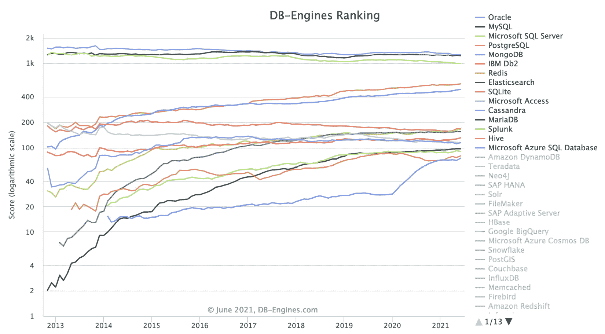
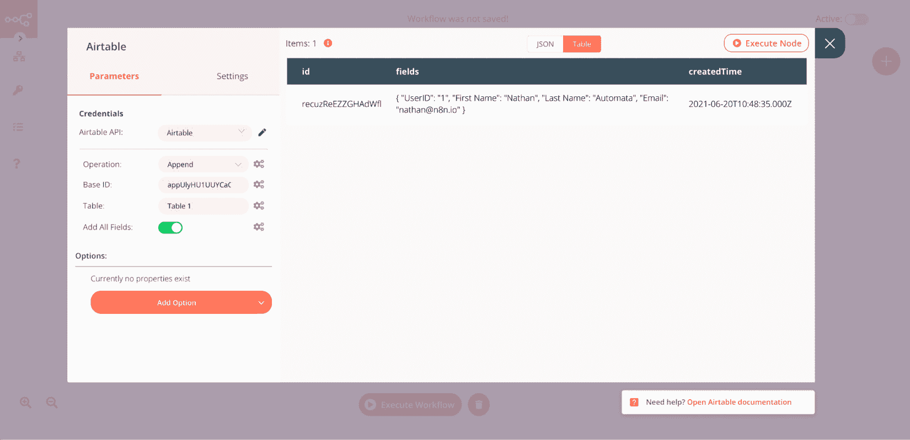
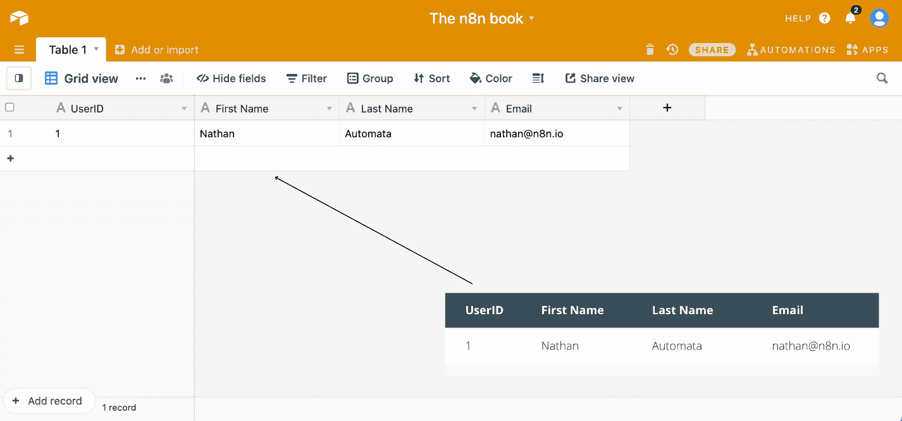
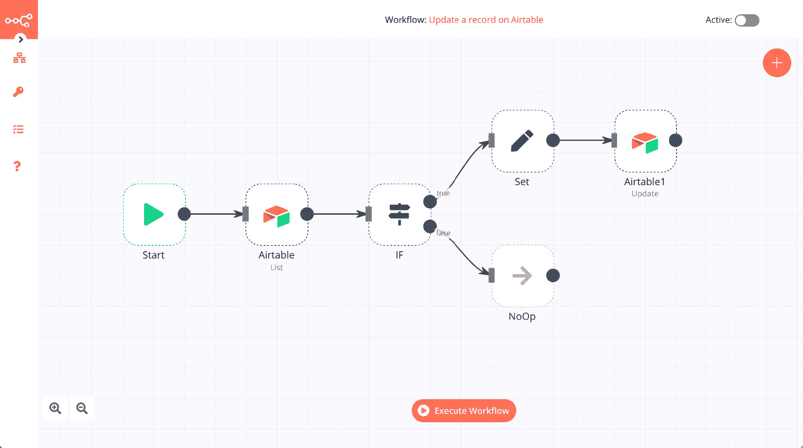
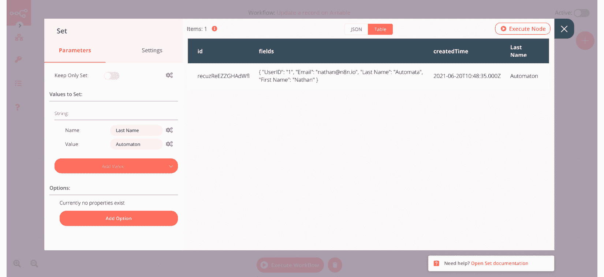
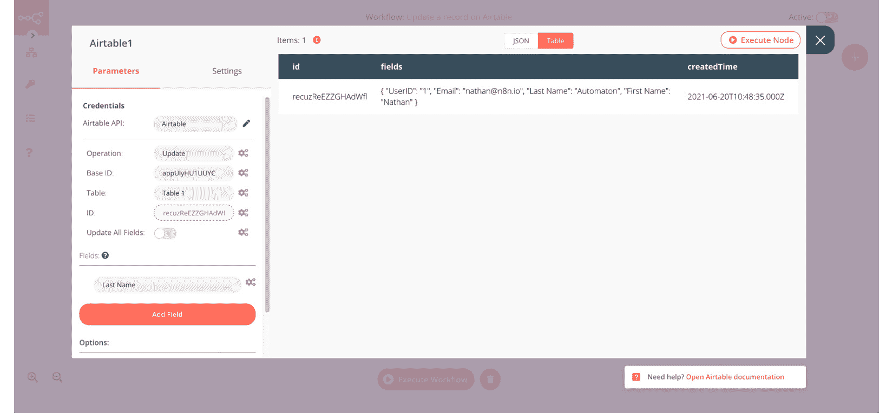

# 第八章：*第6章*：用无代码数据库为您的API供电

在本章中，您将学习如何使用无代码数据库进行数据存储。您将了解无代码数据库、为您的项目选择数据库以及如何向**Airtable**读写。您还将了解在处理这些数据库时的一些最佳实践。本章中学习到的概念将帮助您使用数据存储来存储用户生成数据并构建完整的产品。

本章将涵盖以下主要主题：

+   了解无代码数据库

+   为您的项目选择数据库

+   使用**Airtable**读写数据

+   与数据库一起工作的最佳实践

+   优化您的**应用程序编程接口**（**API**）以用于生产

# 技术要求

在继续本章之前，您需要准备以下技术要求列表：

+   您已在**Airtable**上创建了一个账户

+   n8n正在运行，并且编辑**用户界面**（**UI**）已打开

# 了解无代码数据库

数据库通常是产品的骨架。数据库通常是存储大量数据的系统。用户可以在查看和执行数据计算的同时添加、删除或修改数据。

数据库有多种形式，例如**结构化查询语言**（**SQL**）数据库、NoSQL数据库和时间序列数据库。根据用例，通常选择其中一种而不是另一种是有意义的。许多这些数据库使用查询语言来与数据库交互，以执行基本查询，如插入、读取、更新和删除数据。您可以在以下屏幕截图中看到一些数据库示例：

图6.1 – 来自db-engines.com的历史趋势图

由于我们专注于使用无代码工具构建产品，而且我们没有时间快速学习这些查询语言，因此我们需要寻找一些替代方案。幸运的是，已经有一些非常好的替代方案可供选择。其中最受欢迎的两个是**Airtable**和**Google Sheets**。与传统的数据库相比，这些工具更容易使用，因为它们采用了熟悉的类似电子表格的设计，比数据库模型更容易理解。由于这些工具也非常强大，越来越多的人开始在他们的项目中使用它们。

**Airtable**和**Google Sheets**都有一个n8n节点，我们可以使用这些节点来执行**创建、读取、更新和删除**（**CRUD**）操作，以为我们的API和应用提供动力。现在我们已经了解了无代码数据库是什么，让我们考虑一下我们如何在本书的持续时间中选择一个可以使用的产品。

# 为您的项目选择数据库

除了**Google Sheets**和**Airtable**之外，还有许多真正酷的无代码数据库，如**Baserow**、**Supabase**、**SeaTable**和**NocoDB**。我们如何选择适合我们产品的正确数据库？你可以问自己一些问题，这些问题可能会帮助你更容易地做出这个决定：

+   我希望数据库为我的项目做什么？

+   这个工具是否有n8n节点或至少一个API？

+   这个工具的社区和支持生态系统有多活跃？

+   产品的成熟度水平如何？它是否稳定？它是否在市场上存在足够长的时间，以至于用户已经对其进行了实战测试？

+   关于这个工具的教育资源是否广泛可用？学习曲线是什么样的？

在选择要包含在这本书中的无代码数据库时，我们问了自己同样的问题。我们决定选择**Airtable**，原因如下：

+   **Airtable**有一个庞大的社区和令人难以置信的支持系统。

+   **Airtable**有一个相当不错的API，并且有一个简单的身份验证系统。n8n也有一个很好的文档**Airtable**节点！

+   **Airtable**已经存在一段时间了，许多制造商都使用它来构建他们的项目。

+   **Airtable**定期发布大量的教育资源，并且入门非常简单。

以下截图提供了**Airtable**数据库的概述：

![图6.2 – Airtable拥有大量的教育资源和一个强大的社区

![图6.2 – Airtable拥有大量的教育资源和一个强大的社区

图6.2 – Airtable拥有大量的教育资源和一个强大的社区

当你问自己这些问题时，你的答案可能会根据你计划工作的项目而有所不同。这是完全可以的！每个工具都有自己的利基和超级能力，这可能使它更适合某种类型的项目。

现在我们已经确定**Airtable**是我们目前正确的选择，让我们看看我们如何可以从n8n工作流中使用它。

# 使用Airtable读取和写入数据

让我们从在`The n8n book`中从头创建一个新的基础开始。编辑所有现有的字段，以便我们有以下四个字段，字段类型为单行文本：

+   **用户ID**

+   **名字**

+   **姓氏**

+   **电子邮件**

这与上一章中数据被插入的表格非常相似。为了简洁起见，我们移除了**密码哈希**字段。你的表格现在应该看起来像这样：

![图6.3 – 这是你Airtable表格应该看起来的样子

![图6.3 – 这是你Airtable表格应该看起来的样子

图6.3 – 这是你Airtable表格应该看起来的样子

现在我们已经准备好了我们的表格，让我们转到n8n的编辑器UI，并遵循以下步骤：

创建一个新的工作流，并向其中添加一个**设置**节点。我们需要**设置**节点来确保我们向**Airtable**节点发送格式良好的数据。

打开`字符串类型`。对于这四个值中的每一个，执行以下操作。在`true`（绿色）中。在**值**字段中，输入任何你喜欢的。

点击**执行节点**按钮，你的**Set**节点应该看起来像这样：

.

修改`Append`，因为我们想从**Table 1**的**Table**字段插入数据，然后点击**执行节点**按钮。现在它应该看起来像这样：

![图6.6 – 执行上述步骤后的Airtable节点输出

图6.6 – 执行上述步骤后的Airtable节点输出

如果你回到你的**Airtable**基础，你会注意到记录已经被这个n8n工作流程添加到表中。恭喜你——你刚刚使用n8n在**Airtable**中添加了你的第一条记录！以下是展示你的**Airtable**表在这个阶段应该看起来什么样以及它与我们在**Set**节点中结构化的数据之间关系的截图：

![图6.7 – 插入到Airtable表中的记录以及它与Set节点中的数据的关系

图6.7 – 插入到Airtable表中的记录以及它与Set节点中的数据的关系

你可以用其他节点替换**开始**节点来获取你想要添加到**Airtable**的数据，并对**Set**节点进行适当的更改。你可能还记得上一章中，我们使用**Webhook**节点从我们创建的API中获取数据。

这种**Set**节点（用于以数据库期望的格式结构化数据）和**Airtable**节点（用于将数据插入到**Airtable**）的组合将在工作流程中保持不变。如果你想在某个其他项目中使用另一个数据库，你将用那个节点替换**Airtable**节点。

在数据库中插入数据时，以下是一些需要记住的关键事项：

+   电子表格和数据库都有列，例如**名字**和**姓氏**。你发送到数据库节点的数据需要与每行数据的这些列名相匹配。

+   很多次，你可能无法从API中获得最适合你的数据格式。在这种情况下，**Set**节点可以帮助你根据数据库的列重新建模你需要的数据，并丢弃你不需要的数据。

+   n8n中的电子表格和数据库节点会对输入数据的每个项目执行其配置的操作（例如`Append`）。

将操作作为`List`读取数据并输入与上一个工作流程相同的凭据和**Base ID**值。

点击**执行节点**按钮，输出应如下所示：

图6.8 – Airtable节点列表操作的输出

现在我们已经从`Update`和`Delete`的`List`操作中列出数据。

考虑以下场景：你需要找到一个名为`Nathan`的记录，并将该人的姓氏更新为`Automaton`。

然后，你可以构建一个类似于以下截图所示的流程来更新**Airtable**表中的特定记录：

图6.9 – 使用n8n工作流程在Airtable中更新特定记录

第一个`Nathan`。如果不是，n8n将转到`Nathan`，我们使用**Set**节点添加**姓氏**字段的新值。以下是配置和执行后的**Set**节点的外观：

图6.10 – 配置以Nathan为名的记录更新姓氏字段

最后，我们有**Airtable1**节点，它将更新记录。我们使用了来自第一个**Set**节点的记录ID（我们最初从**Airtable**节点获取）以及指定只更新**姓氏**字段。你可以在以下位置看到**Airtable1**节点：

图6.11 – 配置Airtable1节点以更新记录的姓氏字段

哇！该工作流程已更新**Airtable**中指定记录的**姓氏**列。你可以使用类似的工作流程来删除记录。

当将此流程作为API的一部分使用时，你可以获取要执行查找的文本以及要查找的列，以及使用**Webhook**节点更新的记录。然后，你可以使用表达式确保具有此工作流程的API端点可以处理动态请求，而无需为不同的列创建特定的流程。现在我们知道了如何使用n8n与无代码数据库一起工作，让我们来了解一下与数据库工作的最佳实践。

# 与数据库工作的最佳实践

在企业环境中使用数据库时，涉及到的不同方面有很多，但在无代码数据库中，情况可能略有不同。因为这些数据库的设计、构建和托管方式，我们在使用它们时需要稍微不同地思考。

让我们来看看一些关于数据库操作的最佳实践，以及你如何以既有效又高效的方式使用它们。

## 最小化带宽

虽然并非总是如此，但无代码数据库通常托管在互联网上的某个地方。这意味着你与数据库之间的可用带宽不如数据库托管在同一网络上的传统数据库那样多。

由于这种带宽现在非常宝贵（并且，根据你的数据库是如何托管/定价的，你可能真的在为发送和/或从数据库接收的每个字节付费），确保你明智地使用它非常重要。

## 压缩数据

通常，存储在数据库中的数据是文本形式的。文本数据具有非常高的压缩率，这减少了你与数据库之间需要发送或接收的信息量。

如果你能够在两个系统之间压缩数据，这将提高你事务的速度并减少你的带宽。

然而，请记住，这也会增加n8n和你的数据库上的**中央处理单元**（**CPU**）利用率，因为压缩需要在双方进行计算。

## 最小化API调用

对你的数据库的API调用，如带宽，可能很昂贵（如果你按API请求付费，实际上是这样）。它们占用资源，减慢你的应用程序（因为应用程序需要等待调用完成或超时），并增加对数据库的依赖性。

如果你尽一切可能减少API调用，这些问题可以最小化，在某些情况下，甚至可以完全避免。

## 最小化数据库查询

由于数据库通常运行非常快，我们作为开发者很容易在访问数据库时变得懒惰。为什么还要修改代码，用单个查询写入数据库中的三条记录，而直接在三个单独的查询中写入每条记录要容易得多呢？

这种类型的编程可能适用于位于你所在网络上的大型数据库，但当它们可以位于地球的另一端，通过波动互联网连接时，这些查询必须进行优化和最小化。

## 最小化数据库写入

虽然从数据库读取数据是一回事，但向数据库写入数据则是完全不同的事情。写入操作通常比数据库上的读取操作消耗更多的资源，并且执行时间更长，这通常是因为数据需要在内存中移动，有时甚至在磁盘上。

由于写入你数据库的成本相对较高，只有在你绝对需要时才写入数据，并且每次写入尽可能多的数据。这将使每次数据库写入都物有所值。

## 启用数据缓存

如果我们真正致力于最小化n8n和数据库之间读取和写入的数据量，一个很好的策略是将选定的数据库表的一个副本存储在n8n本地，无论是存储在内存中还是在本地**JavaScript对象表示法**（**JSON**）文件中。

然后，每次需要向数据库发出请求时，您可以先询问数据库自上次缓存更新以来是否已更改。如果已更改，则n8n应仅拉取对数据库所做的更改，并将这些更改写入缓存数据。如果没有更改，则可以跳过更新缓存，并可以在本地执行查询。

这可能是在数据库中查看数据的一种更有效的方式，而不是每次都查询数据库。这不仅加快了您的数据库查找速度，而且在长期内也减少了数据库调用次数。

## 备份数据库

您的数据库是您应用程序的核心。数据库必须尽可能可用，如果数据库丢失，您有方法可以恢复它。

您最好的防御措施是尽可能频繁地备份您的数据库。这样，您将最小化数据丢失量并减少恢复所需的时间。

## 记录交易

另一种确保您可以从数据丢失和数据覆盖中恢复的方法是记录数据库上发生的每笔交易到一个单独的交易表中。这样，如果您的数据库不可用的时间与最后备份的时间之间有差距，您可以重新创建那些交易。

此外，如果您的数据库备份完全丢失，您仍然可以通过再次执行交易来从数据丢失中恢复。这比从备份中恢复要慢得多，但比丢失所有数据要好得多。

## 使用记录引用和表视图

当您使用需要多次输入的数据时，在另一个数据库表中创建一个具有唯一记录ID的单独记录比每次都重复写入相同的数据更有效。

例如，如果我在创建一个需要引用用户信息（如姓名、姓氏和地址）的数据库，我可以在每次需要时将所有这些信息写入数据库表。但如果我们将这些信息写入用户表，我们就可以仅引用存储在表中的**UserID**值，而不是整个记录。

这允许您减少需要传输的信息量，并最小化写入的大小。

## 保护您的数据库

由于这些数据库托管在互联网上，并且通常可以从互联网上的任何地方访问，因此它们得到适当的保护至关重要。确保所有凭证和API密钥都安全存储，并且没有硬编码到您的应用程序中。

此外，确保所有事务都通过加密的连接（即**超文本传输协议安全**，简称**HTTPS**）进行，如果可能的话，只允许特定的**互联网协议**（**IP**）地址与数据库通信。

## 在数据库上执行计算

您的数据库可能比您用于托管n8n的系统强大得多。因此，如果可能的话，让数据库执行计算，特别是如果目标是提供数据库上已有数据的汇总统计信息。

而不是将所有数据发送到n8n进行处理，使用查询函数（如`COUNT`、`MIN`和`MAX`）在数据库上执行处理。这会将计算（即CPU负载）转移到数据库上，并减少需要在数据库和您的应用程序之间传输的信息量。

## 对数据库进行负载测试

开发者构建的应用程序在开发和测试中运行良好，但一旦投入生产，由于资源限制（例如，CPU达到最大值；存储太慢；带宽限制），数据库无法处理负载的情况并不少见。

确保您在数据库投入生产之前有负载测试数据库的方法。这样，您将能够确保在成为问题之前数据库拥有所有必要的资源。

现在我们数据库已准备就绪，让我们看看如何设计和构建API，以向用户提供最佳性能。

# 优化您的API以投入生产

您的API可能是您应用程序最重要的部分之一，因为它通常是您的客户读取和写入数据的主要方式。鉴于这种重要性，您的API从一开始就准备好投入生产至关重要。

这里有一些确保您的API准备好投入生产的方法。

## 减少数据库调用

与数据库的最佳实践非常一致，您需要读取和写入数据库的次数越少，您的应用程序性能越好。使用上一节中提到的许多策略来完成此操作。

## 在API之前缓存数据

如果您的API背后有相对静态的数据，您可以使用的技巧之一是在API前面放置一个缓存系统，这样您就可以在不实际接触API的情况下向用户提供用户请求的信息。缓存系统会定期用来自API的信息更新自己，如果它确定基于对API的相同调用，API提供的数据没有发生变化，缓存系统将仅发送它已存储在本地的数据，而不会打扰API。

## 最小化API调用

一些API要求你必须拥有数据库中的信息才能进行数据库查询。一个很好的例子是用户账户。通常，你会使用API查询用户表以找到所需的用户。然后，你会再次查询API，寻找该用户的具体信息。

你可以选择在应用程序中保留用户表的本地副本，并使用它来查找用户ID。然后，有了这些信息在手，你只需查询一次API就能获取所需的信息。

## 要求身份验证

虽然互联网上有许多公开的API，但即使你免费提供API服务，也非常重要要求进行身份验证。这增加了用户的责任感，并减少了API被滥用的可能性。

如果有人滥用你的API，身份验证可以使其更容易追踪该个人，并解决他们系统的问题或阻止他们干扰你的API。

## 在传输过程中加密API数据

除非你的数据在传输过程中被加密（即，当它在应用程序和数据库之间传输时），否则API密钥、凭证和敏感数据容易受到窃听的威胁。

在传输过程中保护这些数据的最简单方法是，在提供API的服务器上安装**安全套接字层**（**SSL**）证书。这加密了数据，大大减少了有人监听你的API对话的可能性。

## 跟踪API请求

确保如果你在互联网上提供API，肯定会有一些人试图滥用该API。这就是为什么在需要处理这些滥用者时，记录所有API交易日志至关重要。

确保你至少跟踪以下信息：

+   时间戳

+   API调用

+   参数

+   IP地址

+   认证密钥

这将为你提供进行数据分析的基础信息，以确定滥用者是谁以及他们可能在何处工作。

## 将API用户与IP地址关联

与前一项一致，如果你能让你的API只允许用户从特定的IP或IP范围内访问，这可以减少API被滥用的可能性，并在用户信息被泄露的情况下帮助他们。

## 限制每个用户每秒的API调用次数

如果你限制用户访问API的速度，这将有助于更均匀地分配资源给所有用户，同时减少用户意外对API进行**拒绝服务**（**DoS**）攻击的可能性。

## 正确记录API

如果您为您的用户和开发者提供了适当的 API 文档，他们将更容易正确使用您的 API，并保持错误日志的清洁。这将提高客户满意度，并减轻需要帮助这些人的支持团队的压力。

# 摘要

在本章中，我们学习了关于无代码数据库的知识，为您的项目选择无代码数据库，如何向 **Airtable** 读写数据，以及在与数据库工作以及优化生产环境中的 API 时的一些最佳实践。本章学到的概念将帮助您在项目中使用数据存储来存储用户生成数据并构建完整的产品。

在下一章中，我们将探讨如何在 n8n 工作流中转换您的数据。我们将进行一些实际操作练习，包括在不同 n8n 工作流之间共享数据，合并来自不同表格的数据集，以及在这些数据集上执行一些分析和计算。
