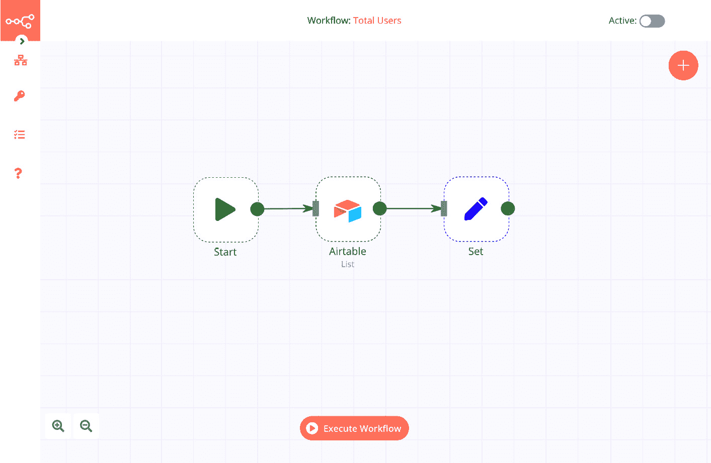
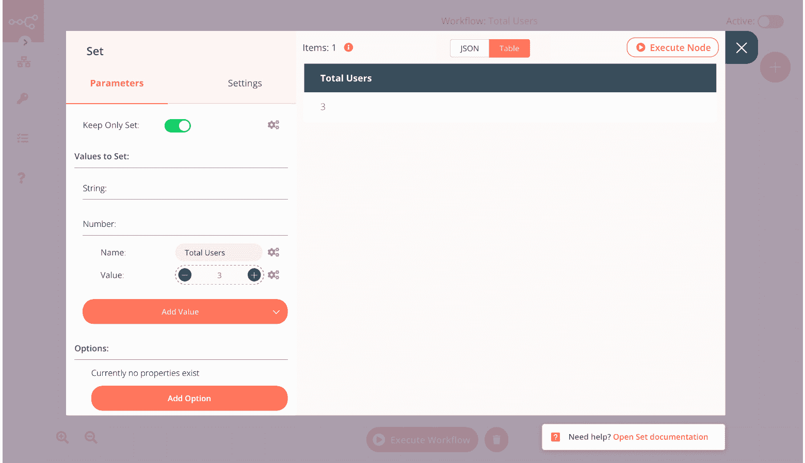
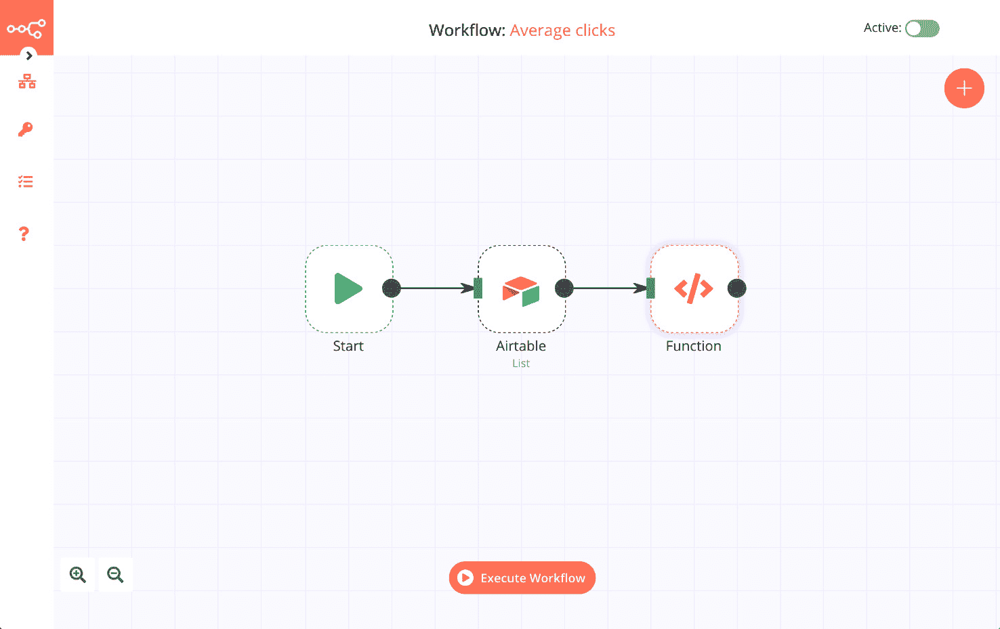
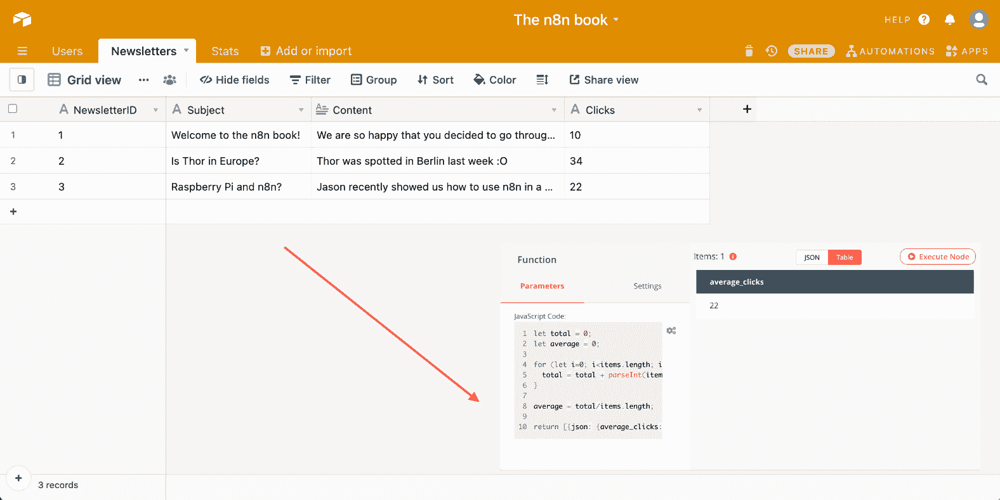

# 第九章：*第七章*: 在工作流中转换您的数据

在本章中，您将学习如何在工作流中操作数据，以便您创建的API可以以有用的格式返回数据。您还将了解在工作流之间共享数据，处理数组和JSON对象，合并数据集，以及执行分析和计算。

本章将涵盖以下主要主题：

+   在工作流之间共享数据

+   合并数据集

+   执行计算和分析

# 技术要求

在继续本章之前，您需要准备以下技术要求：

+   您应该在Airtable上创建了一个账户。

+   n8n应该正在运行，并且编辑器UI应该已打开。

您可以在GitHub上找到本章的完整代码示例[https://github.com/PacktPublishing/Rapid-Product-Development-with-n8n/tree/main/Chapter%207](https://github.com/PacktPublishing/Rapid-Product-Development-with-n8n/tree/main/Chapter%207)

# 在工作流之间共享数据

当您使用n8n构建工作流时，您可能会发现自己重复某些模式。这些模式的例子可能包括将数据推送到Airtable，将数据转换成特定格式，或执行有关传入数据有效性的检查。在其他时候，随着工作流中节点数量超过20或30个，管理这么多不同的节点和逻辑可能会变得困难。

如果您有编程背景，您可能可以将此与创建函数或模块联系起来，以便您可以创建可重用的代码块，这些代码块是模块化的且易于管理。n8n允许您使用**执行工作流**节点来完成此操作。

让我们考虑一个工作流：我们需要使用**Hacker News**节点获取数据，在工作流中过滤数据以仅包括文章的标题和URL，并将数据插入到Airtable中。为了说明目的，让我们将这个工作流分解成两部分：

+   从Hacker News获取数据

+   过滤数据并将其插入到Airtable

要执行此操作，请按照以下步骤进行：

1.  打开n8n编辑器UI并创建一个新的**工作流**。添加一个**Hacker News**节点并将其连接到**开始**节点。

1.  为**Hacker News**节点选择**所有**资源。现在，添加一个**执行工作流**节点并将其连接到**Hacker News**节点。从现在起，我们将把这个工作流称为**工作流1**。

1.  保存这个**工作流**。现在它应该看起来像这样：


图7.1 – 使用执行工作流节点创建的工作流

1.  在新标签页中创建一个新的**工作流**。在这个新的**工作流**中，添加一个**设置**节点和一个**Airtable**节点。

1.  将文章的`title`和`url`属性连接并插入到`{{{$json["title"]}}}`

1.  `{{{$json["url"]}}}`

1.  现在，配置`http://localhost:5678/workflow/297`，因此ID将是**297**。

这就是我的**工作流**及其ID的样子：


图7.2 – 过滤和将数据插入Airtable的工作流

1.  现在，回到带有**执行工作流**节点的工作流，并输入新工作流的ID。执行工作流。

你会注意到**工作流1**运行**工作流2**，获取它返回的数据，并在**执行工作流**节点中显示。这就是你如何在n8n中在多个工作流之间共享数据并将它们分解成更易于管理的块的方法。

让我们了解我们创建的两个工作流之间数据是如何传递的。**工作流1**中的**执行工作流**节点将数据传递给**工作流2**的**开始**节点。正因为如此，**工作流2**中的所有节点都必须连接到**开始**节点。**工作流2**的最后一个节点将数据发送回**工作流1**中的**执行工作流**节点，如图所示：


图7.3 – 两个工作流之间的数据流

让我们看看**执行工作流**节点提供的选项。**源**字段允许你指定节点应该如何查找工作流：

+   **数据库**：通过其ID从数据库加载工作流。

+   **本地文件**：从本地保存的文件加载工作流。此路径必须相对于n8n运行的位置。

+   **参数**：从参数加载工作流。在这里，你可以提供工作流JSON。

+   **URL**：从URL加载工作流。

现在，让我们看看我们如何使用**合并**节点在n8n工作流中合并数据集。

# 合并数据集

在[*第6章*](B17493_06_Final_PD_ePub.xhtml#_idTextAnchor116)，*用无代码数据库为API供电*中，我们学习了如何将Airtable用作我们应用程序的无代码数据库。让我们在此基础上构建一个示例，以可视化新闻通讯管理应用程序的数据库可能看起来是什么样子。通常，数据库为不同类别的数据点有不同的表，我们可以使用唯一的ID在不同表之间引用数据。让我们通过以下示例来了解这一点：

1.  打开你创建的名为**n8n书籍**的Airtable基础数据库，如[*第6章*](B17493_06_Final_PD_ePub.xhtml#_idTextAnchor116)，*用无代码数据库为API供电*。将**表1**重命名为**用户**。

1.  向其中添加两个新表，分别称为**新闻通讯**和**统计**。在**新闻通讯**表中，添加以下列：

**NewsletterID**（单行文本）

**主题**（单行文本）

**内容**（长文本）

**点击量**（单行文本）

1.  在表中添加一个名为**NewsletterID1**的条目。现在它看起来应该是这样的：


图7.4 – 创建和填充新闻通讯表

1.  在**统计**表中，添加以下列：

**UserID**（单行文本）

**点击**（单行文本）

1.  向名为**UserID1**的表中添加一个条目。现在它应该看起来像这样：

![图7.5 – 创建和填充统计表

![img/Figure_7.05_B17493.jpg]

图7.5 – 创建和填充统计表

现在，我们有三个具有唯一ID的表，可以用来在不同表之间交叉引用数据。

假设我们想知道每个用户点击了多少次。我们想知道这个数字，以便在点击次数大于9时，我们可以发送电子邮件，感谢他们的积极参与。为了构建这个工作流程，我们需要两个关键信息：用户的电子邮件地址和他们的点击次数。这两个细节都位于不同的表中，仅通过唯一的**UserID**连接。让我们使用**Merge**节点来获取我们所需的所有信息。

1.  打开编辑器UI并添加一个`fields`对象。由于我们不需要时间戳和**Airtable**节点的ID，我们可以去掉它们。您可以使用**Set**节点或**Function**/**Function Item**节点来完成此操作。我使用了**Function**节点，以下代码如下：

    ```py
    const newItems = [];
    for(let i=0; i<items.length; i++) {
    newItems.push({json: items[i].json.fields});
    }
    return newItems;
    ```

上述代码确保只有`fields`数组由该节点返回。数据现在应该如下所示：

![图7.6 – 这是函数节点应该看起来的数据

![img/Figure_7.06_B17493.jpg]

图7.6 – 这是函数节点应该看起来的数据

1.  现在，添加一个**Merge**节点并将**输入1**连接到**Function**节点。

1.  现在，我们需要从**统计**表中获取数据。通过添加一个**Airtable**节点（我们将称之为**Airtable1**），以及一个**Function**（或**Set**）节点（我们将称之为**Function1**），并将其连接到**Merge**节点的**输入2**，执行本节开头提到的相同步骤。工作流程应该如下所示：

![图7.7 – 这是工作流程应该看起来的样子

![img/Figure_7.07_B17493.jpg]

图7.7 – 这是工作流程应该看起来的样子

1.  打开**Merge**节点并将**模式**设置为**按键合并**。

1.  在**属性输入1**和**属性输入2**字段中输入**UserID**。我们这样做是因为**UserID**是连接两个不同表中的两个数据集的字段。

1.  执行工作流程；**Merge**节点的结果应该看起来像这样：

![图7.8 – 合并节点合并来自两个不同表的数据

![img/Figure_7.08_B17493.jpg]

图7.8 – 合并节点合并来自两个不同表的数据

注意

n8n的最新版本也包含一个可以使用的项目列表节点。

现在我们已经得到了我们需要的两份数据，我们可以在**Merge**节点之后添加一个**IF**节点和电子邮件节点（例如**发送电子邮件**或**Gmail**节点），以便我们可以感谢新闻通讯的积极参与者。

**合并**节点有几种不同的模式，可以用来以最适合你用例的格式合并数据。现在我们已经知道如何使用n8n在流程中合并数据集，让我们学习如何在n8n中使用JavaScript进行计算和分析。

# 执行计算和分析

您可以在n8n中使用JavaScript在表达式中，并使用**函数**节点执行数学计算和基本分析。

让我们使用*合并数据集*部分中的新闻通讯数据库来尝试一些计算。我们已经向表中添加了一些更多记录。如果您想使用我们的记录，可以使用以下链接克隆**Airtable**：[https://airtable.com/invite/l?inviteId=invRJMGCMu7HWQzKW&inviteToken=3b6fbc536ccc17cf24fbeb01b5e8a253fe99afd27616f3abaeaffb046cedf8aa&utm_source=email](https://airtable.com/invite/l?inviteId=invRJMGCMu7HWQzKW&inviteToken=3b6fbc536ccc17cf24fbeb01b5e8a253fe99afd27616f3abaeaffb046cedf8aa&utm_source=email)。

让我们从我们的**Airtable**数据库中计算一些东西：

+   用户数量

+   每个新闻通讯的平均点击次数

+   用户点击次数的最高值

要这样做，请按照以下步骤操作：

1.  打开**编辑器UI**并打开一个新的**工作流**。添加一个**Airtable**节点并列出**用户**表中的所有记录。

1.  添加一个**集合**节点并将其连接到**Airtable**节点。我们的**工作流**应该如下所示：

![图7.9 – 用户表中计算总用户数的工作流



图7.9 – 用户表中计算总用户数的工作流

1.  将**仅保留集合**设置为*true*。这将移除所有传入的工作流数据，并且只追加在**集合**节点中配置的新值。

1.  添加一个**数字**类型的值并命名为**总用户数**。为**值**字段添加一个表达式：

    ```py
    {{$items.length}}
    ```

这将计算**Airtable**节点返回的项目总数，这也就是用户的总数。执行此节点将导致此值被返回三次（每次为一个项目）。

1.  在节点的**设置**区域，将**执行一次**设置为*true*。现在，你的工作流应该会为你计算**用户**表中的总用户数。来自**集合**节点的结果应该如下所示：

图7.10 – **集合**节点的输出



图7.10 – **集合**节点的输出

让我们计算每个新闻通讯的**平均点击次数**值。

1.  创建另一个**工作流**并添加一个列出**新闻通讯**表中所有条目的**Airtable**节点。添加一个**函数**节点并将其连接到**Airtable**节点。工作流应该如下所示：

![图7.11 – 计算每个新闻通讯平均点击次数的工作流



图7.11 – 计算每个新闻通讯平均点击次数的工作流

1.  在**函数**节点中，添加以下JavaScript代码：

    ```py
    let total = 0;
    let average = 0;
    for (let i=0; i<items.length; i++) {
      total = total + parseInt(items[i].json.fields.Clicks);
    }
    average = total/items.length;
    return [{json: {average_clicks: average}}];
    ```

在前面的代码中，我们遍历了由`total`变量返回的所有记录。我们使用`parseInt()`函数，因为`Clicks`的值是`String`数据类型，我们需要将其转换为`integer`数据类型。最后，我们通过将`total`点击次数除以新闻通讯的数量（我们使用`items.length`来计算，就像在先前的流程中做的那样）来计算`average`值。这为我们提供了每份新闻通讯的平均点击次数。以下截图说明了这一点：

![Figure 7.12 – 计算每份新闻通讯的平均点击次数



图7.12 – 计算每份新闻通讯的平均点击次数

最后，让我们计算每个用户的最高点击次数。

1.  创建另一个工作流程，并添加一个列出**Stats**表中所有条目的**Airtable**节点。添加一个**函数**节点并将其连接到**Airtable**节点。工作流程应类似于*图7.11*中所示。

1.  在**函数**节点中，添加以下JavaScript代码：

    ```py
    const clicks = [];
    let highest = 0;
    for (let i=0; i<items.length; i++) {
    clicks.push(items[i].json.fields.Clicks);
    }
    highest = Math.max(...clicks);
    return [{json: {highest_clicks: highest}}];
    ```

在前面的代码中，我们将所有点击次数添加到一个名为`clicks`的数组中。然后，我们使用`Math.max()`函数来找到该数组中的最大值。这为我们提供了每个用户的最高点击次数。以下截图说明了这一点：


图7.13 – 计算每个用户的最高点击次数

`Math`是一个有用的内置对象，可以用于许多这些计算。你可以在[https://developer.mozilla.org/en-US/docs/Web/JavaScript/Reference/Global_Objects/Math](https://developer.mozilla.org/en-US/docs/Web/JavaScript/Reference/Global_Objects/Math)了解更多信息。

这些是一些基本的示例，说明了你可以如何使用JavaScript进行计算，创建用于分析的工作流程，从而从通过你的API和应用程序积累的数据中获得洞察。

# 摘要

在本章中，我们学习了在n8n中在多个工作流程之间共享数据，在工作流程内合并来自不同来源的数据，以及如何使用JavaScript在工作流程内执行计算和分析。本章学到的概念将帮助你在使用我们的自定义API将数据发送到其他服务或无代码工具时。

在下一章中，我们将介绍Bubble API并将其集成到n8n中。我们将学习如何处理Bubble数据和流程，以及如何配置n8n以接收由Bubble发起的事件和数据。
