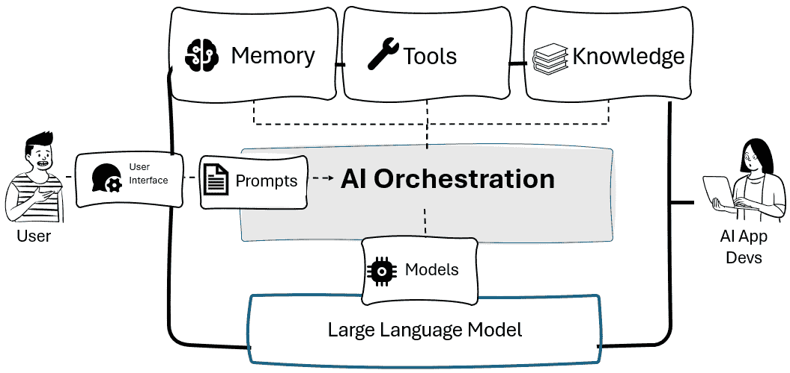
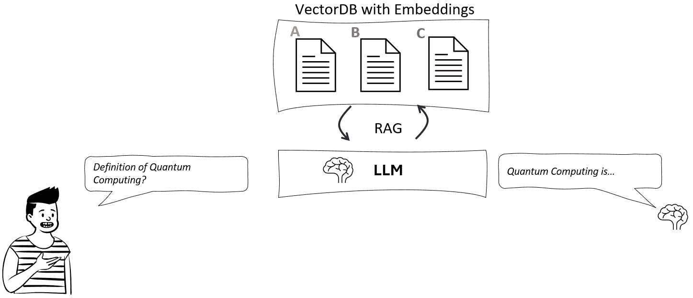
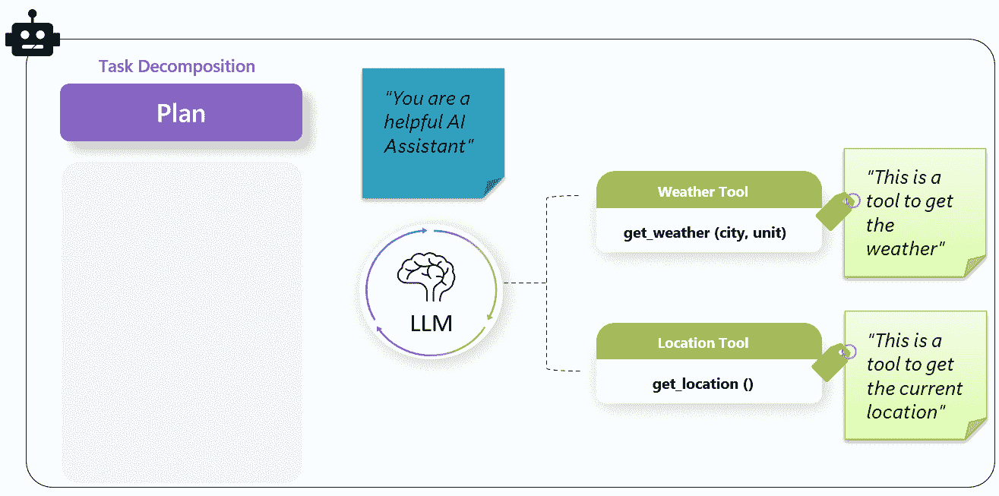
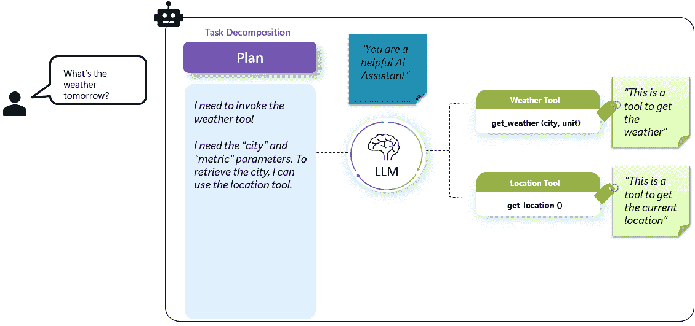
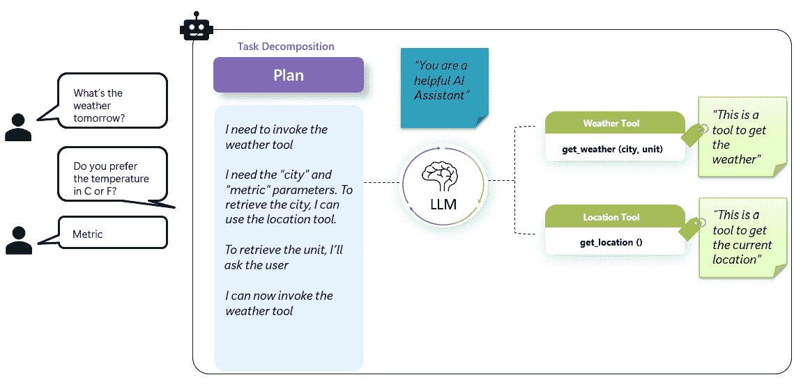
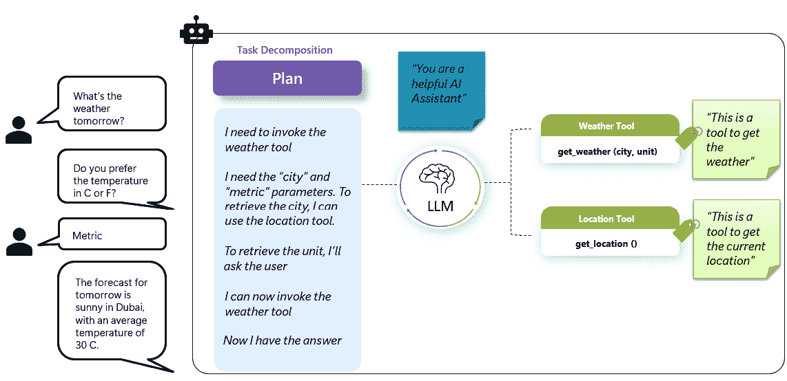
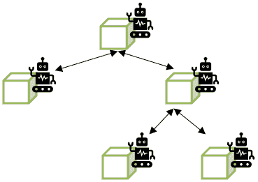

# 3

# 需要一个 AI 编排器

随着大型语言模型的出现和 AI 应用的爆炸式增长，开发者面临着日益增长的挑战：如何有效地管理和协调日益复杂的 AI 系统。随着 AI 代理变得更加能够和自主，它们的行为必须被结构化、监控和优化——通常涉及多个工具、服务和数据源。这种日益增长的复杂性产生了对编排的迫切需求：确保这些智能组件无缝地共同实现一个共同目标。

AI 编排器应运而生，以满足这一需求。它们不仅提供预构建的组件，还提供了一个框架来构建交互、管理依赖关系并保持对多代理或模块化工作流程的控制——同时加速开发并降低运营风险。

在本章中，我们将涵盖以下主题：

+   AI 编排器简介

+   AI 编排器的核心组件

+   市场上最流行的 AI 编排器概述

+   如何为你的 AI 代理选择合适的编排器

到本章结束时，你将熟悉最流行的 AI 编排器以及如何利用它们来满足你独特的代理用例。

# AI 编排器简介

现在很清楚，利用大型语言模型（LLMs）远不止简单的 API 调用——它涉及编排工具、管理内存和协调复杂交互，以构建真正智能的系统。虽然早期的 AI 集成依赖于与模型的直接交互，但现代 AI 代理需要一种更结构化的方法来管理工作流程、集成外部工具和高效处理内存。这正是**AI 编排器**发挥作用的地方。

AI 编排器作为中央枢纽，协调模型、工具、内存存储、API 和其他外部系统之间的交互。它确保 AI 代理以有效且受控的方式运行。

图 3.1：典型开发框架中 AI 编排器层的示例

AI 编排器可以帮助以下方面：

+   **管理复杂性**：AI 工作流程通常涉及多个协调步骤，如检索、推理和动作执行。编排器自动化并结构化这些流程，使系统更容易扩展和维护。

+   **增强可扩展性**：编排器通过分配任务、缓存响应和并行化操作来处理高负载——这对于处理多个用户或密集型任务至关重要。

+   **确保上下文感知**：由于大型语言模型（LLMs）的内存有限，编排器集成了向量数据库和内存系统，以帮助代理保留信息并提供更连贯、个性化的体验。

+   **促进工具集成**：协调器通过管理任务执行并确保 LLM 与外部工具之间交互顺畅，简化了 API、搜索引擎和数据库的使用。

+   **提高可靠性和监控**：从日志记录到人工反馈，协调器提供了捕捉错误、防止幻觉并确保系统安全可靠运行的工具。

为了更好地理解在 AI 代理的具体场景中需要 AI 协调器的原因，我们需要介绍后者的三个重要特性：自主性、抽象性和模块化。

## 自主性

自主性指的是 AI 代理能够**独立地**操作，在无需人类干预的情况下做出决策和执行动作。这种自我指导的行为使得 AI 代理能够执行任务、适应新情况并基于其学习经验追求目标。

AI 代理的自主性意味着代理将要采取的步骤不一定是可以事先知道的。

例如，让我们考虑一个非代理工作流程，它就像以下这样简单：

图 3.2：直接调用 LLM 的 API 示例

每当我们向大型语言模型（LLM）发出提示时，我们就是在进行一个 API 调用，这是这个工作流程中唯一的步骤。即使在**检索增强生成（RAG**）工作流程的场景中，步骤也是事先知道的：

图 3.3：RAG 模式的示例

现在让我们考虑一个自主的代理方法。假设我们有一个拥有两个工具的代理：

+   天气工具，一个接受两个参数：城市和单位。

+   位置工具，一个接受用户当前位置作为参数的功能，利用 GPS 位置。此函数不接受任何参数。

两个函数都附有自然语言描述，符合 AI 代理的结构。我们的工作流程设计将让代理决定调用哪个工具。

图 3.4：代理模式的示例

假设一个新用户问道：“明天的天气怎么样？”。以下事情将会发生：

1.  代理将阅读其工具的描述并理解它需要调用天气工具。然而，它缺少两个参数，但多亏了它的自主性，它可以四处寻找以检索它们。它很快意识到可以利用位置工具来获取第一个参数：该函数的输出将作为天气工具的参数。

图 3.5：AI 代理调用工具检索参数的示例

1.  对于第二个参数，代理无法单独完成：它需要询问用户。因此，它这样做，询问用户需要哪种类型的计量单位。一旦用户做出回应，代理就能正确地使用两个参数调用工具。

图 3.6：AI 代理请求用户提供缺失参数的示例

1.  代理观察天气工具的输出，并确认它现在知道用户的最终答案。

图 3.7：AI 代理使用检索到的参数调用工具的示例

你能想象在标准的**机器人流程自动化**（**RPA**）过程中需要多少个“if…else”语句才能复制这种程度的自主性吗？即使我们能够管理类似的场景，如果用户提出的过程中没有硬编码的问题，怎么办？适应性、自我批评和自我调整是代理自主性的关键特征。

我们可以为我们的代理提供许多程度的自主性：这一切都归结为我们设置的工作流程和指导代理遵循的计划策略。正如我们将在本章中看到的那样，我们可以定义一个计划，其中代理将按特定顺序执行工具，我们可以计划让代理在达到特定输出之前循环使用一个工具，或者我们可以让代理完全自由地根据需要多次使用所有工具。

设计适当的代理工作流程是构建代理状态时关键的建筑设计对话。

## 抽象和模块化

抽象是指分解和简化复杂性。它使得这些系统易于理解并可扩展。但除了简化之外，它还使模块化设计成为构建智能系统的一个基本原理。

模块化将复杂问题分解成更小、可重用的组件，每个组件处理挑战的特定部分。这种方法提供了一些优点：

+   **可互换性**：组件可以在不影响整个系统的情况下进行交换、升级或替换。

+   **可重用性**：设计良好的模块可以在不同的项目中重新使用，从而提高效率。

+   **可扩展性**：独立但无缝集成的组件使得扩展解决方案更加容易。

在多代理系统中，抽象和模块化允许创建协作代理，每个代理专注于特定任务，同时动态交互。这反映了人类的解决问题方式，我们通过分解、委派和协作来有效地应对复杂性。

通过观察繁忙大都市中多代理交通管理系统，我们可以很好地理解代理模式中的抽象和模块化。在这个系统中，不同级别的代理处理不同级别的抽象，确保平稳运行而不使任何单一实体超负荷。

**注意**

我们将在*第七章*中更详细地介绍多代理系统。然而，重要的是要注意，一个独立的代理始终可以被另一个代理作为“工具”所消耗，采用带有其能力自然语言描述的相同方法。例如，一个“SQL 代理”可以在“项目经理代理”需要查询 SQL 数据库时成为一个工具。

从此以后，在多代理系统中——以及即将到来的例子中——将代理视为其他代理的潜在工具。

在最细粒度级别，我们有交叉口控制器，它们在单个交通信号灯或交叉口操作。这些代理依赖于来自摄像头和传感器的实时数据，根据车辆拥堵、行人移动和紧急车辆优先级调整交通信号。

他们不关心下一个街区或更广泛的城市景观中发生的事情；他们的唯一任务是优化他们特定位置的交通流量。如果交叉口出现车辆突然涌入，他们可能会延长绿灯时长以缓解拥堵。

从更广阔的角度来看，我们有区域级交通协调员。这些代理不会微观管理单个交通信号灯，而是分析一个社区或区域内部多个交叉口的交通流量。

他们使用来自交叉口控制器、GPS 跟踪和公共交通系统的数据来识别拥堵模式，重新规划车辆路线，平衡该区域的车流量。如果他们检测到某个区域有过度延误，他们会调整多个交叉口的交通信号灯的亮灯时间，而不仅仅是单个交叉口。

更重要的是，他们指导交叉口级代理，确保他们的调整与更广泛的区域级交通目标相一致。

在最高级别，我们有城市级交通管理系统，负责优化整个大都市区域内数百万辆车的流量。这个代理不专注于特定的交通信号灯或单个拥堵点；相反，它分配资源，预测长期模式，并做出战略调整。

通过使用来自天气预报、重大事件日程、事故和公共交通网络的数据，这个代理可能会重新规划整个道路，协调施工时间表以最小化干扰，或者在发生重大事件时实施城市级紧急响应计划。

如果主要高速公路发生事故，城市级系统会重新分配区域级代理以调整交通模式，进而指导交叉口控制器高效地重新规划车辆路线。

这种分层结构展示了抽象和模块化在多代理系统中的力量：

+   交叉路口代理处理本地、实时的决策，调整交通灯并优先考虑即时流量

+   区域级代理分析和协调交叉路口的群体，优化更广泛区域的交通

+   市级代理关注大局，规划长期效率、应急响应和系统优化

这反映了软件架构、AI 系统和甚至企业结构在现实世界中的运作方式。无论是前线工作人员执行任务、中层管理人员协调努力，还是高管设定整体愿景，抽象化使复杂系统保持可扩展性、效率和弹性。

通过采用这种分层方法设计多代理 AI 架构，我们确保每个代理只关注它需要处理的任务，防止系统过载，并实现大规模的适应性、实时决策，就像一个智能交通系统管理繁忙的城市一样。

如果这听起来不像一个真实的事物，让我们看看 OpenAI 的工具**Operator**，它作为一个自主代理，能够在网页浏览器中执行任务，如预订机票或填写在线订单。

OpenAI 的 Operator 遵循类似于交通管理系统的分层多代理方法。每个代理在不同的抽象级别上运行，确保效率和适应性，而不使任何单个组件过载。

+   **Web 控制器（低级代理）**：这些代理处理执行任务：移动鼠标、点击按钮和输入文本。它们不进行分析或规划——它们只是简单地遵循命令。

+   **视觉和推理（中级代理）**：这些代理解释网页界面。视觉代理处理截图，检测相关元素，而推理代理确定下一步行动（点击、输入或滚动）。这一层抽象掉了执行细节，专注于理解和决策。

+   **规划者/协调者（高级代理）**：顶级代理监督整个系统，确保网页交互与更广泛的目标一致——无论是搜索信息还是填写表格。它将任务委托给中级代理，确保平稳和战略性的导航。

这种结构化的方法突出了抽象在多代理设计中的关键性：

+   低级代理执行任务时无需担心决策

+   中级代理专注于解释和规划

+   高级代理处理整体策略，而不涉及技术细节

通过利用这种模块化设计，OpenAI 的 Operator 能够动态适应，处理不同的网站而无需手动编程。这种可扩展和可泛化的架构是多代理系统驱动现实世界 AI 应用的典范。

从建筑学的角度来看，所有这些组件——代理、技能、插件——都可以被视为组织中可重复使用的资产。在这种情况下，AI 编排器确保这些组件能够协同工作，而不会紧密耦合，防止复杂性压倒系统。

按照前面的分层示例，使用 AI 编排器，你可以轻松定义以下内容：

+   **执行代理（低级）**：这些处理原始任务，如 API 调用、数据库查询或网络抓取，执行命令而不做决策

+   **推理代理（中级）**：它们分析数据，确定行动，并选择合适的工具，抽象执行细节

+   **编排和规划（高级）**：编排器监督工作流程，分解任务，分配给代理，并动态调整

图 3.8：AI 代理层次结构

通过这种方式结构化 AI 系统，编排器能够实现自适应、可泛化的智能，确保组件之间无需人工干预的顺畅交互。

# AI 编排器的核心组件

现在我们已经探讨了为什么 AI 编排器在管理代理系统中的复杂性、可扩展性、上下文和可靠性方面至关重要，现在是时候检查它们在幕后是如何工作的了。每个编排器的核心都有一组基础组件，包括工作流程执行、内存处理、工具集成、错误检测和安全执行。每个组件都在确保 AI 代理高效和可靠地运行中扮演着关键角色。

## 工作流程管理

AI 编排器的主要功能之一是定义和管理结构化工作流程。工作流程决定了任务是如何执行的，是按顺序、并行还是通过条件逻辑执行。以下列出了一些你可能会遇到的最常见工作流程：

+   **顺序工作流程**：任务按预定义的顺序逐步执行。*示例*：一个文档处理 AI 代理首先从图像中提取文本，然后总结内容，最后将其翻译成另一种语言。

+   **并行工作流程**：同时执行多个任务以优化效率。*示例*：一个金融分析 AI 代理可以同时处理多个股票趋势，以提供全面的市场报告。

+   **条件工作流程**：执行路径根据特定条件而改变。*示例*：如果情感分析检测到挫败感，客户支持 AI 代理可能会将复杂查询升级给人工代理。

+   **分层工作流程**：任务以结构化、多层次的方式组织，高级 AI 代理将子任务委派给专业代理。*示例*：一个项目管理 AI 代理监督工程工作流程，将任务委派给编码、测试和部署 AI 代理，同时确保整体进度跟踪。

+   **群聊工作流程**：AI 代理在对话环境中协作，根据实时交互交换见解并调整其行为。*示例*：一组 AI 代理（例如，研究助理、事实核查机器人、摘要模型）动态地讨论一个主题，在向用户展示最终响应之前，对输出进行细化。

    **注意**

    工作流程管理与我们在上一节中引入的自主性概念密切相关。例如，在群聊类型的工作流程中，你为你的多代理系统提供了高度自主性；另一方面，顺序工作流程更具可预测性，因为你明确地指出了要调用的代理的顺序。

人工智能编排者向开发者提供工具，以动态地设计、修改和优化这些工作流程，这对于创建可扩展和适应性强的 AI 应用至关重要。

## 记忆和上下文处理

有效的 AI 代理需要访问历史交互和外部知识库，以提供相关响应并保持连贯性。编排者通过各种内存管理技术来处理这一点：

+   **短期记忆**：存储基于会话的上下文，允许 AI 代理在持续对话中回忆细节。*示例*：一个虚拟助手会记住用户在聊天会话中的上一个问题。

+   **长期记忆**：在较长时间内保留知识，通常存储在向量数据库中。*示例*：一个医疗人工智能系统会记住患者的医疗历史，以便提供个性化的推荐，例如过去的就诊记录、医疗报告、过敏或服用的药物等。

+   **语义记忆缓存**：当 AI 编排者管理内存时，他们会使用缓存策略来优化检索速度和效率。语义记忆缓存涉及以允许 AI 代理在无需依赖基于会话的历史的情况下回忆事实、概念和关系的方式存储频繁询问的信息。*示例*：一个客户服务 AI 代理可能会回忆用户的过去投诉并更快地检索解决方案。

    **定义**

    在计算环境中，缓存是一种用于临时存储数据以加速未来访问的技术。传统上，具有低延迟和高吞吐量要求的程序利用内存缓存，这涉及到直接在系统的 RAM 中存储数据，由于 RAM 的高速特性，这使得数据检索变得快速。然而，内存缓存通常依赖于精确的键值对进行数据检索，这意味着请求必须与存储的键精确匹配才能检索相应的数据。

    随着 LLM 驱动应用程序的出现，引入了一种新的缓存系统：语义缓存。这侧重于数据的含义和上下文（利用嵌入），而不是精确匹配。这种方法存储查询及其语义上下文的结果，使系统能够识别和检索相关数据，即使新查询与之前的查询不完全匹配。

通过有效地管理内存，AI 编排器确保代理提供连贯、信息丰富和上下文感知的响应。

## 工具和 API 集成

AI 代理通常需要访问外部资源，如数据库、API 和计算工具。编排器通过使代理能够执行以下操作来实现无缝集成：

+   从 API 获取实时数据（例如，为旅行助手 AI 获取天气更新）

+   访问和查询数据库（例如，为电子商务 AI 助手检索订单详情）

+   利用外部计算工具（例如，在银行应用程序中使用机器学习 API 进行欺诈检测）

编排器允许这些集成得到有效管理，确保 AI 代理以最新和准确的信息运行。

## 错误处理和监控

为了确保 AI 应用程序保持可靠性，编排器实施强大的错误处理和监控机制：

+   **日志和分析**：捕获 AI 交互的详细日志，用于调试和优化。

+   **自动错误检测**：识别失败的进程并自动重试或升级。

+   **性能跟踪**：监控响应时间、准确性和整体系统健康。

+   **人机交互集成**：允许对关键决策进行人工审查。*示例*：医疗 AI 助手在做出诊断之前需要人工确认。

通过主动处理错误和提供全面的监控，AI 编排器有助于保持高系统可靠性和可信度。

## 安全性和合规性

在 AI 系统中，安全性是首要任务，尤其是在处理敏感数据时。AI 编排器整合了多项安全措施，包括以下内容：

+   **身份验证和访问控制**：确保只有授权的用户和系统能够与 AI 代理交互

+   **速率限制**：通过控制 AI 代理在特定时间段内可以处理的请求数量来防止滥用

+   **数据隐私合规性**：通过安全地管理用户数据来遵守 GDPR 或 HIPAA 等法规

+   **偏差和安全过滤器**：实施安全措施以防止有偏差或有害的 AI 输出

安全性和合规性机制有助于确保 AI 代理在安全、道德和合法框架内运行。

AI 编排器的核心组件——工作流程管理、内存处理、工具集成、错误检测和安全——是构建稳健和高效 AI 应用的基础。通过利用这些功能，开发者可以创建不仅强大而且可靠、可扩展和安全的 AI 智能体。了解这些组件有助于在选择或设计 AI 编排框架时做出更好的决策。

# 市场上最受欢迎的 AI 编排器概述

几个 AI 编排器已经在这个领域崭露头角，各自提供针对不同用例的独特功能。一些侧重于模块化和灵活性，允许开发者自定义工作流程，而另一些则优先考虑用户友好的界面以实现快速原型设计。在这里，我们将探讨截至 2025 年 5 月最广泛使用的 AI 编排器，突出它们的关键优势和理想应用。

+   **LangChain**：LangChain 是一个模块化框架，旨在构建由 LLM 驱动的应用。它提供了集成外部工具、管理交互间内存和定义基于智能体的工作流程的基本组件。作为一个开源项目，LangChain 拥有广泛的文档和强大的社区，使其成为开发者构建稳健 AI 驱动应用的优选。

+   **LlamaIndex（原名 GPT Index）**：LlamaIndex 专注于优化 LLM 的数据检索，确保高效访问结构化和非结构化数据源。当与 LangChain 结合使用时，它特别有效，可以构建需要复杂搜索和索引能力的知识驱动 AI 智能体。它能够在大规模数据和生成式 AI 之间架起桥梁，使其成为处理大量信息库的组织不可或缺的工具。

+   **AutoGen**：AutoGen 专为开发多智能体 AI 工作流程而设计，使 LLM 驱动的智能体能够在复杂任务中进行沟通和协作。通过自动化 AI 实体之间的交互，AutoGen 促进了研究、推理和内容生成，使 AI 系统通过结构化对话做出更明智的决策。它非常适合需要多个专业智能体共同实现共同目标的用例。

+   **Langflow**：Langflow 通过直观的视觉界面简化了设计 AI 智能体工作流程的过程。通过与 LangChain 和其他编排工具无缝集成，它实现了快速原型设计和智能体交互的实时可视化。这使得它对于想要实验 AI 驱动自动化但不想深入研究代码实现的开发者和研究人员特别有用。

+   **语义内核（SK）**：由微软开发，语义内核通过结合机器学习能力和传统软件开发实践，弥合了人工智能与企业应用之间的差距。它支持基于插件的架构，允许开发者将人工智能驱动的流程集成到现有的商业系统中。语义内核旨在通过将人工智能驱动的自动化直接嵌入到企业软件环境中来提高生产力。

+   **LangGraph**：LangGraph 通过利用基于图的工作流程引入了一种结构化的多代理协作方法。它提供了一个框架来设计复杂的代理间交互，确保人工智能系统以有组织和可扩展的方式进行通信。这使得它在编排需要不同代理动态协作以解决复杂问题的 AI 应用程序方面特别有价值。

现在，问题是：我如何为我的 AI 代理选择正确的编排器？

# 如何为你的 AI 代理选择正确的编排器

选择人工智能编排器取决于多个因素，包括应用程序的复杂性、所需的定制程度、可用的生态系统以及部署的简便性。在选择编排器时，以下是一些关键标准需要考虑：

+   **易用性和模块化**：如果你正在寻找一种快速且模块化的方式将 LLMs 集成到应用程序中，**LangChain**由于其良好的文档和灵活的架构，是一个很好的选择。*示例*：一个初创公司开发用于客户支持的人工智能聊天机器人，可能会使用 LangChain 快速原型设计和集成到其现有的数据库和 API 中。

+   **数据密集型应用程序**：如果你的 AI 代理严重依赖结构化或非结构化数据检索，**LlamaIndex**针对高效集成外部知识源进行了优化。*示例*：一个法律人工智能助手，在多个文档存储库中检索和分析案例法，将受益于 LlamaIndex 的检索能力。

+   **多代理工作流**：如果你的应用程序需要多个代理动态交互，**AutoGen**或**LangGraph**是编排复杂人工智能交互的理想选择。*示例*：研究助理人工智能，其中多个代理协作——一个总结文档，另一个核实事实，第三个生成报告——将受益于这些编排器。

+   **企业级人工智能应用程序**：如果你需要强大的企业集成和安全，**语义内核**非常适合基于微软的环境和结构化人工智能工作流。*示例*：一个与 Microsoft Teams 和 SharePoint 集成的企业级人工智能分析工具与语义内核非常契合。

+   **可视化工作流程设计**：如果您更喜欢无代码或低代码界面进行 AI 工作流程设计，**Langflow**提供了一个直观的用户界面，用于快速原型设计和调试 AI 代理交互。*示例*：一个没有深厚编码专长的营销团队可以借助 Langflow 的视觉界面进行快速工作流程设计。

选择 AI 编排器应与您的 AI 系统的目标和技术要求相一致。虽然一些编排器专注于模块化开发，而另一些则专注于可扩展性、多代理协作或企业集成。了解这些区别将帮助您为特定的用例选择最佳工具。

# 摘要

AI 编排器在智能系统的发展和部署中扮演着关键角色，提供了管理工作流程、集成工具和保持效率所需的框架。随着 AI 应用的持续发展，编排器确保 AI 代理能够自主运行、处理复杂任务并适应动态需求。

在本章中，我们探讨了 AI 编排器的基本组件，包括工作流程管理、内存处理和安全。我们还考察了今天一些最受欢迎的编排器，每个编排器都提供针对特定用例的独特优势。

选择合适的 AI 编排器取决于各种因素，如集成需求、可扩展性和工作流程复杂性。通过了解它们的核心功能，开发者和企业可以在选择与他们的目标相一致的编排工具时做出明智的决定。

从下一章开始，我们将深入探讨 AI 代理中最引人入胜的一些组件，从记忆和上下文管理开始。

# 参考文献

+   OpenAI Operator：[`openai.com/index/introducing-operator/`](https://openai.com/index/introducing-operator/)

+   LangChain：[`www.langchain.com/`](https://www.langchain.com/)

+   LlamaIndex（原名 GPT Index）：[`www.llamaindex.ai/`](https://www.llamaindex.ai/)

+   AutoGen：[`www.microsoft.com/en-us/research/project/autogen/`](https://www.microsoft.com/en-us/research/project/autogen/)

+   Langflow：[`www.langflow.org/`](https://www.langflow.org/)

+   语义内核（SK）：[`github.com/microsoft/semantic-kernel`](https://github.com/microsoft/semantic-kernel)

+   LangGraph：[`www.langchain.com/langgraph`](https://www.langchain.com/langgraph)

|

#### 现在解锁本书的独家优惠

扫描此二维码或访问 packtpub.com/unlock，然后按书名搜索 |  |

| *注意：在开始之前准备好您的购买发票。* |
| --- |
