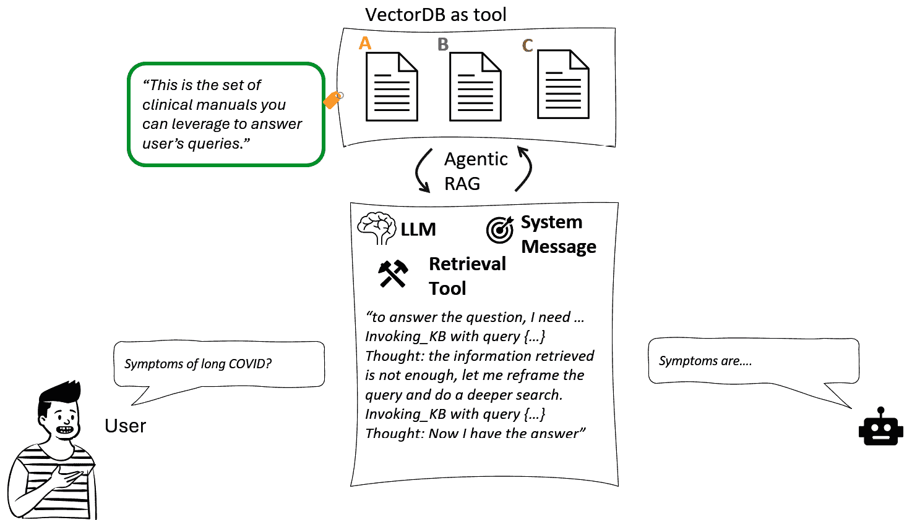
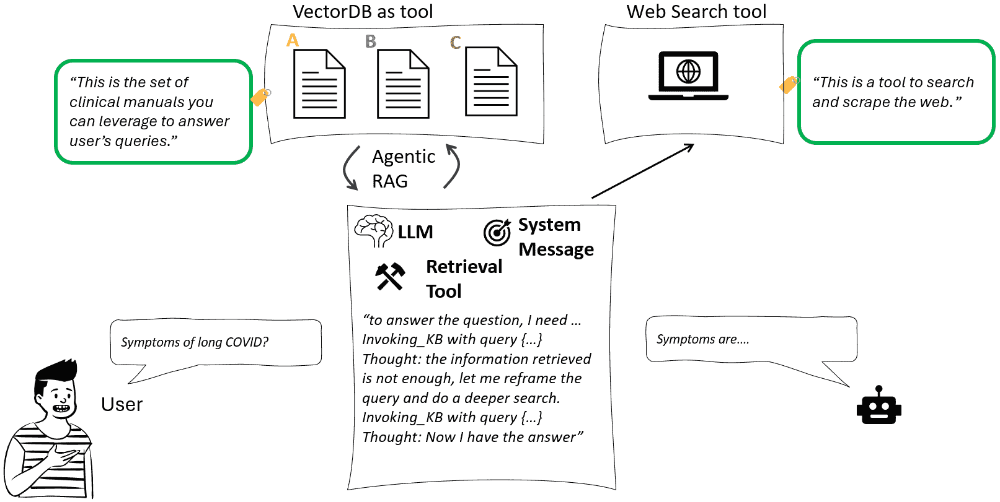
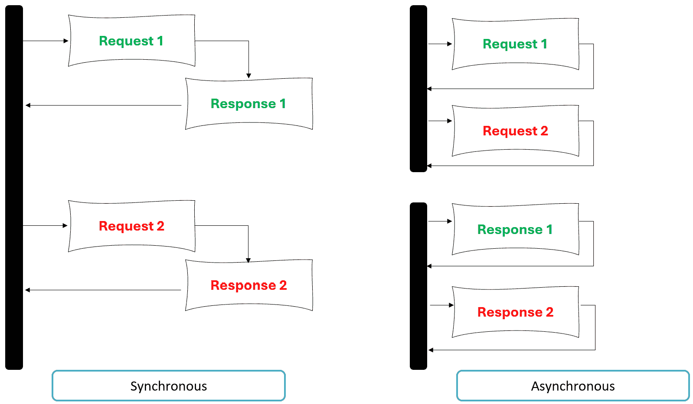
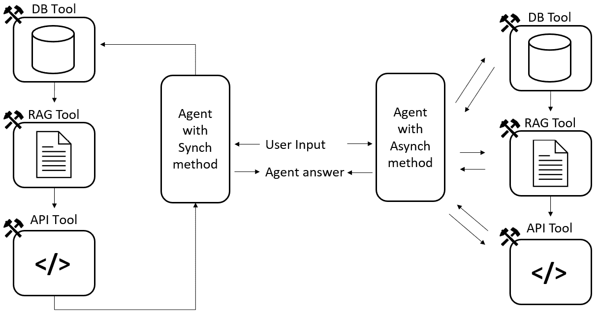

# 5

# 工具和外部集成需求

正如我们在前面的章节中提到的，AI 代理的一个关键特征和区别是它们可以*与世界互动*。虽然 LLMs 可以理解、推理和生成文本，但它们最终受限于其训练数据和当前上下文窗口中的内容。为了超越被动对话并执行真实、有用的操作——例如预订预约、查询数据库、检索实时信息或执行多步骤工作流程——AI 代理必须配备工具。

工具是代理智能的功能扩展。它们允许代理调用 API、访问外部系统、检索新数据，甚至操作结构化知识库。

在本章中，我们将涵盖以下主题：

+   AI 代理工具的解剖结构

+   固定和语义函数

+   API 和 Web 服务

+   数据库和知识库

+   同步与异步调用

到本章结束时，你将了解工具如何将 LLMs 转化为有能力的代理，以及如何设计、连接和管理这些工具来构建智能、面向行动的系统。

# 技术要求

你可以在本书附带的 GitHub 存储库中找到本章的完整代码：[`github.com/PacktPublishing/AI-Agents-in-Practice`](https://github.com/PacktPublishing/AI-Agents-in-Practice)。

# AI 代理工具的解剖结构

工具可以定义为 AI 代理“做事”的能力。这些事情可以从抓取网页到发送电子邮件，从获取你的日历预约到对网站执行操作。正如我们将在接下来的章节中看到的，工具可以根据其核心逻辑的设计方式以多种方式有效地赋予代理权力。尽管如此，工具具有一个共同的解剖结构，我们在设计我们的代理应用程序时可以记住这一点。

然而，在直接进入工具的解剖结构之前，我们首先需要弄清楚这些术语。

如*第二章*所述，当谈论 AI 代理时，你经常会听到任务、工具、技能、插件、功能和动作等术语，这些术语被视为指代代理“做事”能力的可互换方式。你还会看到不同的 AI 编排器带有不同的术语。例如，Semantic Kernel 利用术语*插件*，而*插件*又由一个或多个函数组成。另一方面，LangChain 使用术语*工具*。

尽管我们可以在语义上区分这些术语（插件作为集成，函数作为操作，技能作为专长……），但它们通常指的是相同的概念：代表用户行动的 AI 系统。为了保持一致性，我们将在这本书中始终使用术语**工具**。

因此，回到工具的解剖结构：AI 代理工具的主要成分是什么？

在高层次上，工具由以下组件定义：

+   **名称**，这是工具的唯一标识符。例如，可以在我们的日历中安排预约的工具可以被称为“CalendarTool。”

+   **描述**，它定义了工具的功能。正如本书中提到的，这个元素是关键的。实际上，它将成为我们的 AI 代理大脑——LLM——读取的标签，以了解是否调用它（取决于用户的查询），如果是的话，使用哪些参数。例如，CalendarTool 可以有一个如下所示的描述：

    此工具与用户的日历集成，能够读取现有会议、安排新会议，以及回忆与日历管理相关的会议和其他活动。

+   **核心逻辑**，这是工具的正确引擎。例如，CalendarTool 将具有不同的方法（获取现有会议、创建新会议等），这些方法可以定义为 Python 函数。在以下代码示例中，我们利用 Outlook 作为日历，这意味着我们需要连接到 Microsoft Graph：

    ```py
    def get_outlook_calendar_events(
        access_token: str, date: str = None
    ):
        """
        Fetches Outlook calendar events for a given date using Microsoft Graph API.
        """
        if not date:
            date = datetime.today().date().isoformat()
        start_datetime = f"{date}T00:00:00"
        end_datetime = f"{date}T23:59:59"
        url = (
            "https://graph.microsoft.com/v1.0/me/calendarview?"
            f"startDateTime={start_datetime}&endDateTime={end_datetime}"
        )
        headers = {
            "Authorization": f"Bearer {access_token}",
            "Content-Type": "application/json"
        }
        response = requests.get(
            url,
            headers=headers
        ) 
    ```

**快速提示**：使用**AI 代码解释器**和**快速复制**功能增强您的编码体验。在下一代 Packt Reader 中打开此书。点击**复制**按钮

（**1**）快速将代码复制到您的编码环境，或点击**解释**按钮

（**2**）让 AI 助手为您解释一段代码。


**下一代 Packt Reader**随本书免费赠送。扫描二维码或访问 packtpub.com/unlock，然后使用搜索栏通过名称查找此书。仔细检查显示的版本，以确保您获得正确的版本。


现在，在先前的例子中，该工具的核心逻辑基于 API 集成——实际上，我们正在使用 Microsoft Graph API 执行操作。然而，当我们谈论 AI 工具时，它们背后的核心逻辑可能会根据用例和集成需求而有所不同。

在接下来的章节中，我们将探讨其中的一些。

# 固定编码和语义功能

此类别指的是由开发者明确定义的逻辑，无论是通过传统的编程结构（固定逻辑）还是使用自然语言描述（语义功能）。

## 固定编码函数

**固定编码函数**是代码中实现的逻辑的传统部分。它们是确定性和任务特定的，意味着它们会做开发者告诉它们做的事情。这些函数非常适合简单的实用程序、计算、格式化或不需要外部 API 或学习的业务规则。

例如，我们可以有一个将摄氏度转换为华氏度的工具：

```py
def convert_celsius_to_fahrenheit(celsius: float) -> float:
    return (celsius * 9/5) + 32 
```

我们可以通过添加两个额外的元素：名称和描述，将这个功能封装成我们 AI 代理的工具。在众多实现方法中，我们可以利用 LangChain 的工具装饰器，它会自动推断名称和描述如下（我们将在*第六章*中广泛介绍 LangChain 的组件和分类）：

```py
@tool
def convert_celsius_to_fahrenheit(celsius: float) -> float:
"""tool to convert temperature from celsius to Fahrenheit"""
    return (celsius * 9/5) + 32 
```

工具将使用函数的名称作为其名称（`convert_celsis_to_fahrenheit`）和文档字符串作为其描述。AI 代理可以在被询问时调用它，例如，“20 摄氏度等于多少华氏度？”

这类硬编码函数快速、轻量级，且无需外部依赖，使它们非常适合实用逻辑。

## 语义函数

另一方面，语义函数以自然语言描述，但在底层映射到代码。它们在诸如语义内核这样的框架中特别强大：在这个框架中，分类是插件作为一组函数。当涉及到语义插件时，典型的结构如下。

让我们考虑 Semantic Kernel 框架中可用的内置插件之一，*WriterPlugin*：

```py
WriterPlugin/
└── Acronym/
        ├── config.json
        └── skprompt.txt
└── AcronymGenerator/
        ├── config.json
        └── skprompt.txt
└── Brainstorm/
        ├── config.json
        └── skprompt.txt
…. 
```

此插件包含 16 个功能。每个功能由一个 JSON 文件定义，其中设置了功能的描述和其他配置参数，以及一个文本文件，其中以自然语言描述了适当的语义技能。

让我们以`AcronymGenerator`函数的结构为例：

+   这是配置文件：

    ```py
    {
      "schema": 1,
      "description": "Given a request to generate an acronym from a string, generate an acronym and provide the acronym explanation.",
      "execution_settings": {
        "default": {
          "max_tokens": 256,
          "temperature": 0.7,
          "top_p": 1.0,
          "presence_penalty": 0.0,
          "frequency_penalty": 0.0,
          "stop_sequences": [
            "#"
          ]
        }
      }
    } 
    ```

+   这是文本文件（截断）：

    ```py
    # Name of a super artificial intelligence
    J.A.R.V.I.S. = Just A Really Very Intelligent System.
    # Name for a new young beautiful assistant
    F.R.I.D.A.Y. = Female Replacement Intelligent Digital Assistant Youth.
    # Mirror to check what's behind
    B.A.R.F. = Binary Augmented Retro-Framing.
    # Pair of powerful glasses created by a genius that is now dead
    E.D.I.T.H. = Even Dead I'm The Hero.
    # A company building and selling computers
    I.B.M. = Intelligent Business Machine.
    …. 
    ```

如您所见，在文本文件中，没有任何代码；它只是一系列缩写示例，以便提供此特定语义功能的代理能够以适当的方式生成缩写并提供解释（如函数描述中所述）。以下是一个示例：

1.  用户输入：“为魔法传送头盔生成一个缩写”

1.  AI 代理输出（由缩写技能提供支持）：“M.A.G.I.C. = 移动装置，保证即时传达”

通常，当你需要精确性、性能或低级逻辑时，可能会想利用硬编码的功能。另一方面，当你想让 AI 有更多的灵活性，根据自然语言描述来判断一个函数是否相关时，使用语义函数。

现在，当涉及到将你的代理与外部服务集成时，我们需要引入 API 和 Web 服务。

# API 和 Web 服务

当扩展 AI 代理或工具的功能时，API 和 Web 服务在连接语言模型到外部世界方面发挥着至关重要的作用。

**定义**

**应用程序编程接口**（**API**）是软件应用程序之间交流的一种方式。它定义了一组规则，说明一个程序如何从另一个程序请求数据或服务——通常是通过互联网。API 无处不在：当您的应用获取天气、加载您的电子邮件或预订 Uber 时，它正在使用 API。

API 通常遵循 HTTP 协议，并使用以下方法：

+   `GET`：用于检索数据（例如，获取您所在城市的当前天气）

+   `POST`：用于发送新数据（例如，提交新的用户注册表单）

+   `PUT`：用于更新现有数据（例如，编辑您的个人资料信息）

+   `DELETE`：用于删除数据（例如，从您的账户中删除已保存的地址）

这些操作是所谓的 RESTful API 的一部分——构建网络 API 的一种流行的架构风格。

这些工具作为连接到实时系统的桥梁，使 AI 能够执行操作或从云平台、第三方服务或企业后端检索实时数据。它们本质上在 LLM 的推理和它需要操作的实时、动态数字环境之间架起桥梁。

注意，当我们听到“API”时，我们的思维往往直接跳到像 Google Maps 或 OpenWeather 这样的网络服务，然而，并非所有 API 都是外部的——一些完全存在于您的应用程序或企业环境中。当您为代理构建工具或使用语言模型编排工作流时，这种区别非常重要。

让我们探索你将遇到的主要 API 类型。

## 网络 API

网络 API 在互联网上公开（或半公开）暴露，通常属于第三方提供商。它们附带文档、速率限制和访问令牌。这些是您在希望您的 AI 检查天气、通过 Slack 发送消息或从金融服务获取股票价格时调用的 API。

**注意**

**网络 API**是通过 HTTP 或 HTTPS 远程访问的服务，通常通过 REST 或 GraphQL 公开，允许应用程序检索或操作托管在其他地方的数据。大多数 SaaS 平台都提供面向公众的网络 API。

一些例子包括 OpenWeatherMap API（通过城市获取天气）、Stripe API（处理支付）、Microsoft Graph API（与 Outlook、Teams 和 OneDrive 交互）。

## 内部或企业 API

许多组织在其防火墙或虚拟网络后面运行内部 API。这些 API 为库存管理、客户数据库、预订引擎或 HR 平台等核心业务系统提供动力。

**注意**

内部 API 通常需要安全的网络访问（例如 VPN 或 VNet 集成）。

您可以使用内部 API 执行的一些操作示例如下：

+   GET /orders/{id}：从您的**企业资源规划**（**ERP**）系统中获取客户的订单

+   POST /leave-request：用于创建员工请假申请

+   GET /pricing-rules：返回内部定价逻辑

如果你正在为企业构建人工智能代理，你使用的工具可能大部分都会与**内部 API**接口，而不是外部 API。

## 后端功能 API（服务网格或微服务）

在基于微服务的架构中，不同的服务通过内部 HTTP API 互相通信。这些服务通常被容器化，并可能部署在 Kubernetes 上，位于服务网格，如 Istio 或 Linkerd 之后。

**定义**

微服务是一种软件架构风格，其中应用程序被分解成更小、可独立部署的服务。每个服务执行特定的业务功能，并通过轻量级协议，如 HTTP API 与其他服务通信。

服务网格是一个基础设施层，以安全、可靠和可观察的方式管理微服务之间的通信。它处理诸如流量路由、负载均衡、服务发现、身份验证和遥测等任务，而不会增加微服务本身的复杂性。

从人工智能的角度来看，这些行为就像任何其他 API 一样——但具有更低的延迟，并且可能不需要互联网访问。当你在构建处理跨内部服务多步逻辑的代理时，它们对于内部编排非常有用。

## 无服务器函数/轻量级 API

有时候，你可能需要的 API 还不存在。使用 Azure Functions、AWS Lambda 或 Google Cloud Functions 等工具，你可以快速创建自己的轻量级 HTTP 端点，这些端点充当动态工具。

类似的服务利用无服务器模型，这颠覆了传统的托管理念：不是管理服务器、扩展资源或担心基础设施，你只需编写函数，将其部署到云提供商，然后就可以通过 API 调用。

这种方法非常适合人工智能工具开发，因为它允许你启动小型、专注的函数——每个函数执行单个任务，例如总结文档、格式化报告或从系统中获取筛选数据。

一旦你理解了这种模式，可能性是无限的。以下是一些 API 工具在代理系统内部可以做到的例子：

| **场景** | **工具描述** | **示例 API** |
| --- | --- | --- |
| “向我的团队发送关于发布的消息。” | 向共享通信平台（如 Slack 或 Teams）发布实时消息。 | **Slack Web API**：使用 `chat.postMessage` 向特定频道发布更新。 |
| “在我们的内部财务系统中创建一张新发票。” | 将结构化数据（如客户和金额）推送到安全的内部会计应用程序中。 | **内部财务 API**：使用 `POST /invoices` 在公司的 ERP 系统内创建发票。 |
| “更新内部服务中的订单状态。” | 微服务接收订单状态变更并相应地更新其他服务。 | **订单服务 API**：使用 `PATCH /orders/{id}` 更新后端服务中的订单状态。 |
| “从文档中提取关键词进行标记。” | 一个轻量级函数接收原始文本并返回提取的关键词，用于搜索或元数据。 | **Azure Function**：使用自定义`POST /extract-keywords`端点从文本输入中返回关键词。 |

表 5.1：不同任务的 API 示例

通过理解 Web、内部、后端和无服务器 API 之间的区别，你可以设计更智能、更模块化和更安全的 AI 架构。

在构建你的工具时，请自问以下问题：

+   AI 是否需要与外界交流？Web API。

+   数据是否被锁定在公司的防火墙后面？内部 API。

+   这是你的应用程序自己的后端逻辑的一部分吗？微服务。

+   需要快速且简单的东西？无服务器函数。

通过为任务选择正确的 API 类型，你为你的 AI 代理的成功奠定了基础。

在下一节中，我们将探讨另一类旨在为你的代理添加外部知识的工具。

# 数据库和知识库

正如我们在本书第一章中探讨的那样，在 ChatGPT 发布后，将外部知识添加到 LLM 是 GenAI 领域中实现的第一项里程碑之一。我们看到了将我们的 LLM 建立在外部知识上的典型模式是**检索增强生成**（RAG）。然而，有两个主要考虑因素：

+   数据以各种格式存在，而 RAG 通常适用于非结构化数据（文本、图像、音频…）

+   当涉及到代理 AI 时，有方法可以使传统的 RAG 管道更加“智能”，这得益于额外的推理层，这是 AI 代理本身的一个特性

从此以后，让我们首先区分两种主要的数据类别。

## 结构化数据

这是指存在于行、列和模式中的数据——你的经典 SQL 表、CRM 字段和库存记录。这种数据是可预测的、可查询的，并且易于过滤或排序。对于这类数据，工具通常会包装以下内容：

+   SQL 查询（`SELECT * FROM orders WHERE status = 'pending'`）

+   对业务系统的 API 调用（例如 Salesforce、SAP）

第二个示例——对业务系统的 API 调用——属于我们在上一节中介绍的工具类别（API 和 Web 服务）。因此，我们将专注于通过结构化查询与结构化数据库交互的场景。

在 AI 代理和更广泛的 AI 应用背景下，从自然语言查询中启用智能数据库检索的典型综合模式是“文本到查询”方法。这些是高级步骤：

1.  用户以自然语言提出问题——例如：“在美国最畅销的专辑是什么？”

1.  LLM 将查询转换为 SQL 语句——例如：

    ```py
    SELECT album_name, artist_name, units_sold
    FROM album_sales
    WHERE country = 'US'
    ORDER BY units_sold DESC
    LIMIT 1; 
    ```

1.  LLM 从查询结果返回给用户一个写得很好且对话式的答案——例如，SQL 查询返回*“在美国最畅销的专辑是老鹰乐队的《最伟大的时刻》，销量达 3800 万张”*。

这种方法也适用于其他类型的结构化数据，其查询语言可能不同于 T-SQL。从我们的 AI 代理角度来看，它将归结为我们设置在系统消息级别和工具描述级别的指令集。

## 非结构化数据

这是一种混乱且信息丰富的数据类型：长篇文本、电子邮件、PDF 文件、音频转录和聊天记录。你不能简单地用`WHERE`子句查询它——你需要语义理解。

在 LLM 的背景下，我们探讨了非结构化数据通常如何在向量数据库中存储以及如何使用 RAG 管道检索。然而，随着 AI 系统变得更加主动，检索的作用必须演变。代理不仅仅是被动地对输入做出响应的模型；它是一个积极的决策者，评估任务、考虑可用工具并确定如何最好地继续进行。在这种情况下，将向量数据库视为一个动态工具——而不是一个固定步骤——增加了一个重要的推理层。它允许 AI 代理决定是否需要检索，如何制定有效的查询，针对哪个来源，以及如何处理接收到的信息。

这种从静态检索到代理检索的转变使 RAG 变得更加有目的性和目标导向。

让我们考虑以下例子。我们想调查长期 COVID 的症状，为此，我们将依赖存储在向量数据库中的一组临床论文。在传统的 RAG 场景中，当用户查询“长期 COVID 的症状是什么？”时，以下是可能发生的情况的高级视图：

1.  **输入**：用户直接提交问题。

1.  **嵌入和检索**：系统将问题转换为向量，并在医学文档的向量数据库中执行相似度搜索。

1.  **上下文注入**：将最匹配的前 3-5 个文档直接传递给语言模型。

1.  **响应生成**：模型基于检索到的文档生成答案。

输出很可能是基于最相似语义段落的一个合理的症状总结——但如果没有意识到文档类型、来源可信度或地区、日期或患者类型等上下文信息。

另一方面，在一个代理 RAG 系统中，我们可能会看到以下类似的情况：

1.  **理解意图**：代理解析问题并确定“长期 COVID”是一个医学术语，用户很可能在寻找可靠的临床总结。

1.  **工具选择**：它评估其可用的工具并确定在同行评审的医学期刊或官方健康指南文档中进行向量搜索是最合适的。

1.  **查询优化**：代理重新表述查询以

1.  “SARS-CoV-2 感染后急性后遗症（PASC）的当前临床症状和影响，也称为长期新冠。”

1.  **检索和推理**：使用这个精细的查询调用向量数据库工具。如果结果缺乏最新研究，代理可能会尝试使用日期过滤器（例如，2022 年后）或切换到另一个知识源（例如，CDC 的结构化 API）。

1.  **多源综合**：代理提取相关信息，过滤掉重复内容，并组成一个区分常见、罕见和新兴症状的响应。

在这种情况下，结果将是一个基于事实、情境感知的答案，针对用户的需求量身定制，可能包括“成人 versus 儿童”等区别或指出最新发现的时间。 



图 5.1：代理 RAG 的示例

这种方法还使得交互更加复杂，因为向量数据库最终将成为我们代理的许多可用工具之一。这意味着 AI 代理可以将检索到的数据与其他工具的输出相结合，或者如果向量数据库缺乏必要的领域覆盖，则完全切换到其他工具。这样做，检索不仅成为后端操作，还是代理更广泛决策循环的一部分。



图 5.2：包含 VectorDB 作为工具的多个工具的 AI 代理示例

将向量数据库作为可调用的工具嵌入，与基于代理的架构原则相一致：自主性、适应性和情境意识。代理现在不仅确定需要检索的内容，还确定为什么值得检索。这一额外的智能层不仅提高了响应的准确性和相关性，还在企业 AI 系统中解锁了全新的工作流程。

# 同步与异步调用

随着我们构建越来越智能的 AI 代理——能够推理、计划和与外部工具交互的系统——了解这些工具是如何被调用的变得至关重要。在代理工具设计中，一个经常被忽视但至关重要的区别是工具是同步操作还是异步操作。

这不仅仅是一个技术实现细节。工具的执行方式会影响你的代理应用的性能、可扩展性和响应性。

首先，让我们从定义编程中的同步和异步调用概念开始。



图 5.3：同步和异步过程的示例

编程中的同步调用是函数或方法调用，它会阻塞进一步执行，直到完成。程序等待函数返回结果，然后才继续执行下一条指令。这种模式简单直观，易于推理，但在处理如文件 I/O、网络请求或数据库访问等慢速操作时可能导致性能瓶颈。

例如，以下 Python 函数以同步方式读取文件：

```py
# Synchronous file read in Python
with open("report.txt", "r") as file:
    content = file.read()
print("File content loaded.") 
```

在这种情况下，程序将不会打印“文件内容已加载”，直到整个文件被读取。

另一方面，异步调用是一种非阻塞函数调用，允许程序在后台操作完成时继续执行。当结果准备好时，它通过回调、事件或语言依赖的承诺/未来来处理。异步编程对于构建响应性和可扩展的系统至关重要，尤其是在需要同时管理多个 I/O 密集型任务的环境中。

例如，以下 Python 函数以异步方式读取文件：

```py
import aiofiles
import asyncio
async def read_file():
    async with aiofiles.open("report.txt", "r") as file:
        content = await file.read()
    print("File content loaded.")
asyncio.run(read_file()) 
```

在这里，程序可以在读取文件的同时继续执行其他任务，这使得它非常适合 I/O 密集型应用。

回到 AI 代理的上下文，同步和异步调用的概念与工具的调用机制密切相关。



图 5.4：AI 代理上下文中同步和异步过程的示例

在同步过程中，代理发出请求并等待响应，然后才进行其他操作。它不能继续进行，直到收到响应。

在人工智能工作流程中，对于以下这类短时运行、可预测的任务来说，这通常是可行的：

+   单位转换（例如，摄氏度到华氏度）

+   格式化日期或数字

+   简单的数据库查找

+   调用快速 API（例如，本地微服务）

使用异步调用，代理启动调用但不会阻塞它；代理继续前进，并在结果到达时处理它。

这在以下情况下特别有用：

+   调用慢速或高延迟的 API（例如，第三方服务、外部数据库）

+   执行 I/O 密集型操作（例如，文件上传、网络爬取）

+   并行运行多个调用（例如，批量数据查找）

异步工具使您的代理更加响应，并允许它同时处理多个任务，从而提高性能和用户体验。

同步与异步的选择不仅仅是实现细节的问题——它直接影响到您代理的行为：

+   **响应性**：异步工具允许代理在等待长时间运行的操作时保持响应性

+   **并行性**：异步调用可以批量处理或并发运行，这在从多个来源检索数据时特别有用

+   **错误处理**：异步工具可以整合重试逻辑、回退或超时，而不会冻结代理。

让我们来看一个场景。假设你的代理需要从五个区域系统汇总每周的销售报告。同步版本会逐个获取它们——需要 5 倍的时间。异步版本会一次性获取所有报告。

```py
@tool
async def fetch_sales_report(region: str) -> str:
    """Fetches the weekly sales report for a given region."""
    await asyncio.sleep(2)  # Simulated network delay
    return f"{region} sales report: total sales $100k"
async def fetch_all_reports():
    regions = ["North", "South", "East", "West", "Central"]
    tasks = [fetch_sales_report(region) for region in regions]
    results = await asyncio.gather(*tasks)
    return "\n".join(results) 
```

异步模式允许代理在获取一个报告所需的大约时间内获取所有五个报告。

因此，问题是：我应该使用哪种方法？通常，当操作快速且阻塞且不会降低用户体验，或者任务必须按严格顺序执行，并且每一步都依赖于前一步的结果时，你可能想使用同步调用。然而，如果你处理的是高延迟操作，等待会效率低下，并且/或者代理需要同时处理多个任务，异步调用是首选方法。

许多 AI 系统会混合同步和异步工具。这是完全可以的。重要的是要故意设计工具——知道哪些任务可以阻塞，哪些应该是非阻塞的。

例如 LangChain 和语义内核这样的框架支持这两种模式，通常需要你适当地注册工具，以便代理运行时可以处理它们。

# 摘要

随着 AI 系统从简单的语言处理器发展到能够推理、规划和行动的自主代理，外部工具和集成的角色变得不可或缺。语言模型本身可以解释和生成文本，但正是通过工具——无论是 API、数据库还是特定领域的函数——它们获得了与真实世界互动的能力。这些集成扩展了模型的作用范围，使其能够访问实时信息、触发外部操作以及检索特定领域的知识。无论是同步还是异步，通过符号查询或语义搜索，工具提供了将被动模型转变为主动系统的框架。最终，这些外部组件的深思熟虑的设计和编排定义了现代 AI 代理的智能、可靠性和实用性。

在下一章中，我们将看到所有这些在实际中的应用，因为我们将会构建我们的第一个 AI 代理，利用到目前为止所讨论的所有组件。

# 参考文献

+   语义内核插件：[`learn.microsoft.com/en-us/semantic-kernel/concepts/plugins/?pivots=programming-language-csharp`](https://learn.microsoft.com/en-us/semantic-kernel/concepts/plugins/?pivots=programming-language-csharp)

+   LangChain 工具：[`python.langchain.com/docs/how_to/tool_calling/`](https://python.langchain.com/docs/how_to/tool_calling/)

|

#### 现在解锁本书的独家优惠

扫描此二维码或访问 packtpub.com/unlock，然后通过名称搜索此书 |  |

| *注意：请在开始之前准备好您的购买发票。* |
| --- |
