# 6

# 使用 LangChain 构建你的第一个 AI 代理

在前面的章节中，我们探讨了 AI 代理背后的理论——它们的架构、工具的作用、记忆和规划，以及框架如 LangChain 如何使这些组件的编排成为可能。现在，是时候从理论转向实践了。

在本章中，我们将通过一个实际用例——为数字*piadineria*的电子商务助手——来介绍构建你的第一个 AI 代理的过程。从理解场景和组装核心构建块到开发和评估代理的性能，你将获得 LangChain 功能的实际经验。你还将探索如何使用 LangSmith 等工具跟踪和观察代理行为，最后，如何将此助手扩展到移动体验。

我们将涵盖以下主题：

+   LangChain 生态系统简介

+   开箱即用的组件概述

+   用例 - 电子商务 AI 代理

到本章结束时，你不仅将拥有一个可工作的 AI 代理原型，你还将了解构建和维护现实应用中智能、值得信赖的助手所需的模式和组件。

# 技术要求

要复制 Piadineria 餐厅的 AI 助手，请按照以下步骤操作：

+   **克隆项目仓库**

首先克隆包含笔记本、源代码和必要资源的 GitHub 仓库：

```py
git clone https://github.com/PacktPublishing/AI-Agents-in-Practice
cd "your_folder" 
```

+   **安装所需的 Python 包**

创建一个虚拟环境并安装`requirements.txt`中列出的依赖项，或者手动安装以下包：

+   `langchain, openai, python-dotenv`

+   `faiss-cpu, sqlite3, pandas, requests`

+   `langsmith for evaluation and analytics`

    ```py
    pip install -r requirements.txt 
    ```

+   **配置环境变量**

在项目根目录中创建一个`.env`文件，包含你的配置密钥：

```py
AZURE_OPENAI_API_VERSION=
AZURE_OPENAI_ENDPOINT=
AZURE_OPENAI_API_KEY=
AZURE_OPENAI_CHAT_DEPLOYMENT_NAME=
LANGSMITH_API_KEY=
LANGSMITH_ENDPOINT=
LANGSMITH_PROJECT= 
```

**注意**

在这本书中，我们将利用 Azure OpenAI GPT-4o 作为 LLM，其成本为每 1M 个输入 2.50 美元，每 1M 个输出 10 美元（你可以在这里找到整个定价页面：[`azure.microsoft.com/en-us/pricing/details/cognitive-services/openai-service/?msockid=126c546e17da69082d204197166168f0`](https://azure.microsoft.com/en-us/pricing/details/cognitive-services/openai-service/?msockid=126c546e17da69082d204197166168f0)）。

如果你希望利用免费的 LLM，你可以利用**Hugging Face**（**HF**）Hub 及其与 LangChain 的本地集成。安装所需的包：

```py
pip install langchain-huggingface 
```

你将有两个选项：

+   直接从`from_model_id`方法加载你的模型：

    ```py
    from langchain_huggingface import HuggingFacePipeline
    llm = HuggingFacePipeline.from_model_id(
        model_id="microsoft/Phi-3-mini-4k-instruct", 
        task="text-generation", 
        pipeline_kwargs={ 
            "max_new_tokens": 100, "top_k": 50, 
            "temperature": 0.1, 
        }, 
    )
    llm.invoke("Your query here") 
    ```

**快速提示**：使用**AI 代码解释器**和**快速复制**功能增强你的编码体验。在下一代 Packt Reader 中打开这本书。点击**复制**按钮

（**1**）快速将代码复制到你的编码环境，或者点击**解释**按钮

（**2**）让 AI 助手为你解释一段代码。


**新一代 Packt Reader**随本书免费赠送。扫描二维码或访问 packtpub.com/unlock，然后使用搜索栏通过名称查找此书。请仔细检查显示的版本，以确保您获得正确的版本。


+   使用 Hugging Face 端点（您可以通过创建免费层账户来访问它——有关 HF 账户的更多信息请参阅[`huggingface.co/pricing`](https://huggingface.co/pricing)）：

    ```py
    from langchain_huggingface import HuggingFaceEndpoint
    llm = HuggingFaceEndpoint(
        repo_id="meta-llama/Meta-Llama-3-8B-Instruct", 
        task="text-generation", max_new_tokens=100,
        do_sample=False, ) llm.invoke("Hugging Face is") 
    ```

例如，如果您想从 HF 利用 LangChain 的聊天模型，请使用以下方法：

```py
from langchain_huggingface import (
    HuggingFaceEndpoint, ChatHuggingFace
)
llm = HuggingFaceEndpoint(
    repo_id="microsoft/Phi-3-mini-4k-instruct", 
    task="text-generation", max_new_tokens=512, 
    do_sample=False, repetition_penalty=1.03, )
chat = ChatHuggingFace(llm=llm, verbose=True) 
```

您可以在此处找到完整的教程：[`python.langchain.com/v0.2/api_reference/huggingface/chat_models/langchain_huggingface.chat_models.huggingface.ChatHuggingFace.html`](https://python.langchain.com/v0.2/api_reference/huggingface/chat_models/langchain_huggingface.chat_models.huggingface.ChatHuggingFace.html)

+   **准备本地资源**

确保以下文件和文件夹存在于项目目录中：

+   `piadineria.db`：包含产品和供应商的 SQLite 数据库

+   `documents/`：包含 PDF 文件（例如，食品安全证书，业主历史）的文件夹

+   **运行购物车 API**

在`localhost:3000`上启动模拟 JSON 服务器以启用购物车管理工具：

```py
json-server --watch cart-data.json --port 3000 
```

+   **熟悉笔记本**

打开存储库中提供的 Jupyter 笔记本，并开始与 AI 代理交互以执行以下操作：

+   查询产品详情

+   向购物车添加商品

+   搜索餐厅文档

+   使用 LangSmith 集成评估代理响应

+   **启动移动应用程序**

启动 Streamlit 前端与代理交互（应用程序将在您的 localhost:8080 上运行）：

```py
streamlit run app.py 
```

# LangChain 生态系统简介

LangChain 于 2022 年 10 月推出，是一个开源框架，旨在简化由**大型语言模型**（**LLMs**）驱动的应用程序的开发。最初，它为开发者提供了将 LLMs 连接到外部数据源和实用工具的工具，从而促进了更动态和上下文感知的应用程序的创建。

随着时间的推移，LangChain 已经从其原始框架演变成为一个全面的生态系统。这种转变是由 AI 应用的日益复杂性和对更强大的工具的需求所驱动的，这些工具可以管理 LLM 驱动的解决方案的整个生命周期。今天，LangChain 包含一系列组件和集成，旨在支持开发者从初始原型设计阶段到部署和持续管理。

*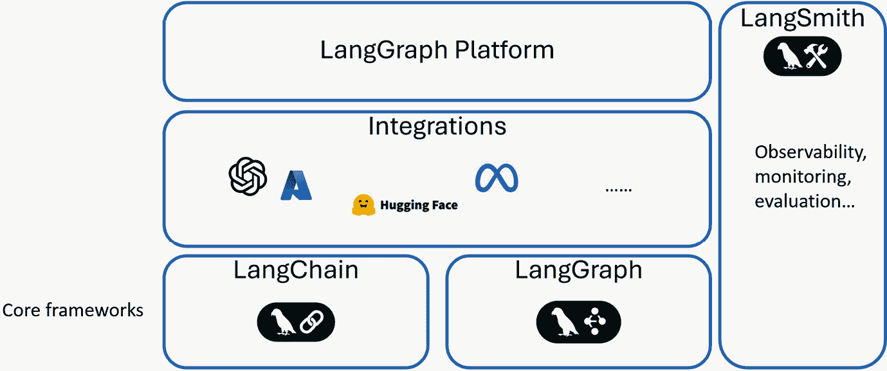*

图 6.1：LangChain 生态系统

根据官方文档，整个 LangChain 生态系统允许您构建、运行和部署您的 AI 解决方案。让我们根据前面的图示详细说明这三个步骤。

## 构建 – 架构基础

在生态系统的基础是基础开源库：LangChain 和 LangGraph。

这两个组件代表了 AI 应用逻辑的基本构建块：

+   LangChain 提供了模块化组件，如链、智能体、工具和内存，以帮助开发者编排 LLM 行为。它侧重于可组合性和集成，使得原型设计和工作流程扩展变得容易。

+   虽然 LangGraph 较新，但它引入了一种基于状态机的强大范式——一种定义一系列状态及其之间转换的计算模型，由事件或条件控制。它允许开发者使用基于图的抽象来构建*多智能体系统*和复杂控制流（例如，循环、分支、条件推理）。这对于需要持久状态和复杂规划的应用程序特别有价值。

备注

在本章中，我们将利用 LangChain 作为库，而在下一章处理多智能体系统时，我们将使用 LangGraph。

这些工具共同代表了 LangChain 生态系统的构建时逻辑和控制平面。它们是开源的，确保了灵活性、透明度和社区驱动的创新。

## 运行 – 运营层

一旦构建了智能体，下一步就是部署。这就是 LangGraph 平台发挥作用的地方。LangGraph 平台提供了一个托管环境来执行以下操作：

+   主机和部署 LangGraph 智能体或工作流程

+   启用流式交互

+   集成人工反馈流程

+   处理实时并发和状态管理

这个平台弥合了实验和生产之间的差距，抽象出了在云环境中运行 LLM 智能体通常相关的基础设施开销。

补充平台的是集成层（也是开源的），它允许开发者将他们的智能体连接到以下内容：

+   API 和 webhooks（后者是一种允许外部系统在 LangChain 过程的执行期间发生特定事件时**接收实时通知或数据**的方式）

+   矢量数据库和数据存储

+   外部工具，如计算器、检索系统或第三方服务

这些集成为智能体提供了实用功能，使其能够根据外部数据和系统执行有意义的操作，我们将在下一段中介绍其中的一些。

## 管理 – 可观察性和迭代

管理往往是现实世界 AI 应用成功的关键。在 LangChain 生态系统中，这由 LangSmith 处理。

LangSmith 是一个商业平台，它解决了这些基本需求：

+   调试智能体行为

+   监控使用情况和性能

+   评估输出质量

+   管理提示和数据集

+   标注和反馈循环以实现监督改进

与传统的日志记录或 APM 工具不同，LangSmith 是专门为 LLM 原生应用构建的，不仅提供“发生了什么”的洞察，还提供“为什么发生”的洞察——从提示结构到工具调用和中间推理步骤。

通过将 LangSmith 集成到您的代理开发生命周期中，您确保可以执行以下操作：

+   跟踪故障或意外输出

+   评估提示版本或工具逻辑的有效性

+   持续优化生产中的应用

基于前面的组件，LangChain 生态系统不再只是一个面向开发者的框架——它是一个针对 AI 代理整个生命周期以及更广泛的 AI 解决方案的结构化平台。

在下一节中，我们将深入了解一些在“构建”级别可以利用的预构建组件，以及我们将用于初始化我们的 AI 代理的组件。

# 现成组件概述

LangChain 提供了一套全面的预构建组件，这些组件有助于开发复杂的语言模型应用。这些组件被组织成四个主要类别：**检索增强生成**（**RAG**）、存储和索引、提取和代理：

+   **RAG**：正如我们在前面的章节中所探讨的，RAG 允许语言模型通过从外部来源（通常是文档存储或向量数据库）动态检索相关信息来超越其静态知识，在生成响应之前。LangChain 为完整的 RAG 生命周期提供原生支持：

    +   **文档摄入和分块**：源材料（如 PDF、Notion 页面、HTML 或 markdown）通过灵活的 TextSplitters 加载并分解成语义上有意义的片段。这些片段对于嵌入和检索更易于管理。

    +   **嵌入生成**：每个片段都使用嵌入模型（例如 OpenAI、Cohere、Hugging Face）嵌入到高维向量中。

    +   **向量数据库中的存储**：这些向量存储在可插拔的向量存储中，如 **FAISS**、**Chroma**、**Weaviate** 或 **Pinecone**，允许基于相似性的高效检索。

    +   **检索器接口**：LangChain 支持基本的检索器和高级检索策略，如 MultiQueryRetriever、ParentDocumentRetriever 和 ContextualCompressionRetriever，每个都针对具有不同精度、召回率和相关性的用例进行设计。

RAG 对于文档问答、法律助手、客户支持机器人以及研究副驾驶等应用至关重要——任何需要实时外部数据定位的场景。

+   **存储和索引**：支持 RAG 管道的工具套件专门用于存储和索引。这些组件处理数据的后端准备，确保在检索时可以高效访问：

    +   **文档加载器**：LangChain 包含超过 50 种针对各种数据源的文档加载器，如本地文件、API、网页、Notion 数据库、Google Docs 等。这些加载器将内容标准化为 LangChain 的文档格式。

    +   **文本分割器**：这些工具根据字符数、句子或递归启发式方法分割文档，同时保持内容的逻辑完整性（例如，保持段落或标题与内容相连）。

    +   **向量存储**：LangChain 通过通用接口支持与众多向量数据库的集成。开发者可以在 FAISS、Chroma、Qdrant 或 Azure Cognitive Search 之间切换，而无需更改他们的检索逻辑。

    +   **元数据和过滤**：嵌入的元数据（如来源、日期或主题）与文档块一起存储，允许进行过滤或混合检索，其中结合了关键词和向量搜索。

这一层是任何依赖大规模结构化或半结构化知识访问的系统的基础。

+   **提取**：LangChain 还提供了**信息提取**的能力，这涉及到从非结构化文本中识别和结构化特定的信息片段。这在需要从文档、聊天或响应中挖掘数据并将其以结构化形式（例如 JSON 或数据库记录）提供的领域中非常有用：

    +   **实体提取**：开发者可以定义命名实体或键值对的模式，语言模型将提取匹配的信息（例如，从简历、发票或临床笔记中提取）。

    +   **自定义模式解析器**：开发者可以使用 Pydantic 或 TypedDict 指导 LLM 输出结构化格式的数据，这些数据随后可以被验证、存储或用于下游应用。

    +   **结构化输出解析器**：LangChain 提供了工具来强制执行结构化输出，减少了在敏感用例中出现幻觉或格式错误的可能性。

应用案例包括自动填写表格、将会议记录总结到 CRM 字段中、将法律文本转换为条款映射或从事件描述中提取时间线。

+   **代理**：LangChain 中的代理框架引入了更高层次的自主性和灵活性。与静态链不同，代理可以推理任务，选择使用哪个工具，并根据中间步骤的结果进行适应：

    +   **工具抽象**：工具是带有元数据（名称、描述、输入模式）的 Python 函数，代理在相关时可以调用这些工具。LangChain 与 OpenAI 的函数/工具调用能力无缝集成。

    +   **工具集**：为常见平台（如 SQL 数据库、文件系统、Python REPL 或浏览器自动化）提供了预包装的工具集。工具集大大缩短了生产时间。

    +   **代理执行器**：这些组件编排代理的推理循环，跟踪记忆，调用工具并管理中间输出。选项包括 ReactAgent、OpenAIToolsAgent 和 ChatConversationalAgent，具体取决于所需的层次结构和灵活性。

    +   **多工具推理**：代理可以通过链式调用工具、解释结果和规划下一步行动来执行多步骤任务——非常适合复杂的工作流程，如“寻找供应商、检查库存、生成报价”。

LangChain 代理可以像动态助手一样行事，跨各种系统编排逻辑，无论是客户支持、销售自动化还是研究任务。

即使不是详尽的——并且随着时间的推移不断更新——上述列表也让你对 LangChain 预构建组件背后的“模型”有一个概念。事实上，这四个组件类别反映了 LangChain 致力于构建不仅仅是 LLM 包装器，而是可组合的 AI 系统——正如我们多次提到的，模块化和可组合性是关键，尤其是在构建代理系统时！

通过抽象化常见的挑战——例如如何摄取文档、存储和检索知识、提取结构化数据或跨工具进行推理——LangChain 使开发者能够自信地专注于构建智能、可扩展和现成的 AI 解决方案。

现在我们已经拥有了构建第一个 AI 代理所需的所有工具，让我们开始编码吧！

# 用例 - 电子商务人工智能代理

人工智能代理正在重塑企业与客户互动的方式——提供个性化、实时且感觉像对话般的功能性帮助。在食品和零售行业，这种转变开辟了增强客户体验、简化运营和通过智能自动化建立品牌忠诚度的新可能性。在本节中，我们将探讨该行业的一个具体例子。

## 场景描述

我们将构建一个针对现实场景的 AI 代理：一家现代的家庭经营意大利餐馆，名为`Mammachepiada`。这家披萨饼店以表达`"Mamma che piada!"`命名，该表达大致翻译为“哇，多好的披萨饼啊！”——最近通过推出在线商店扩大了其业务。

在其核心，`Mammachepiada` 以新鲜制作的披萨饼而闻名，饼内填充着高质量的意大利食材：生火腿、斯特拉奇诺奶酪、烤蔬菜、晒干的番茄等。但除了这些即食餐点之外，这家店还向想要在家重现体验的顾客出售单个食材——如手工奶酪、腌制蔬菜和橄榄油。

该业务作为一个电子商务商店运营，顾客可以执行以下操作：

+   订购新鲜制作的披萨饼和餐点进行本地配送（在一定距离内）

+   购买全国范围内配送的食材和产品

本章的目标是创建一个数字助手——人工智能代理，它能帮助客户以自然的方式与商店互动。用户可能想执行以下任何一项：

+   检查菜单上有什么

+   询问产品成分

+   询问库存中可用的商品

+   获取 piadina 搭配建议

+   创建定制的购物车并下单

代理将准备好帮助完成这些任务。

结果将是一个友好、高效的界面，将*Mammachepiada*的魅力带入数字世界——将传统与科技、语言与行动相结合。

我们将把我们的 AI 代理称为**AskMamma**。

在接下来的章节中，我们将逐步讲解如何创建这个人工智能代理界面，集成检索能力、外部工具和逻辑，以自然的方式处理现实世界的交互。

## AskMamma 的构建模块

在*第一章*中，我们概述了人工智能代理的主要成分：

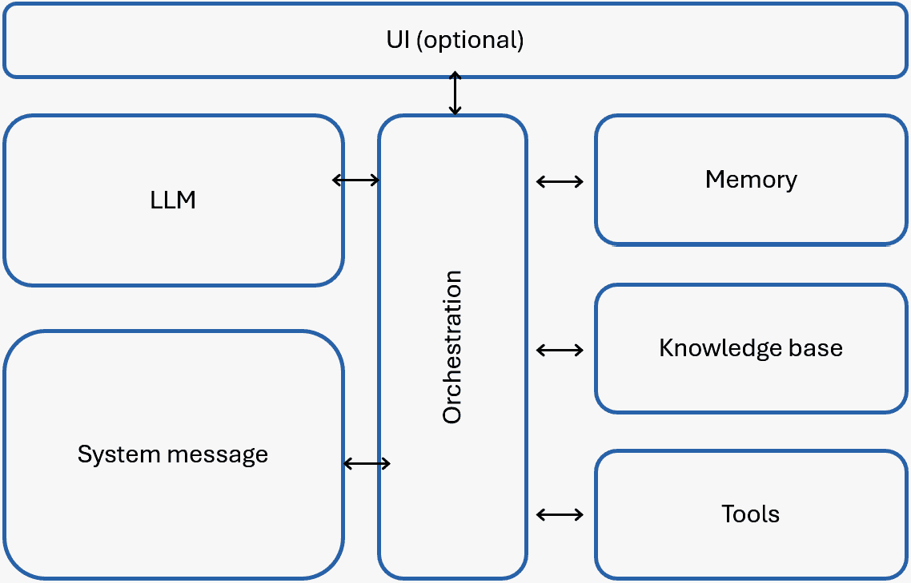

图 6.2：人工智能代理的解剖结构

让我们现在进一步详细说明它们来设计 AskMamma：

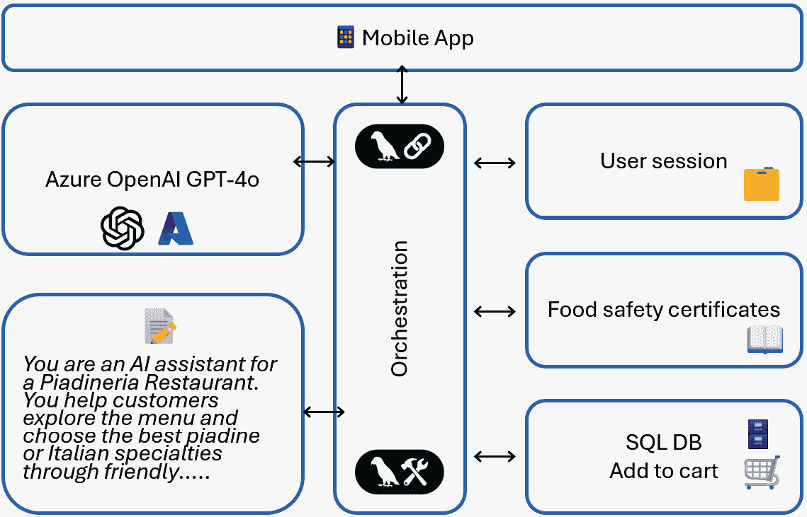

图 6.3：AskMamma 代理的解剖结构

让我们探索*图 6.3*中显示的每个组件：

+   **UI**: 人工智能代理将存在于餐厅移动应用程序的上下文中。在本节中，我们将逐一关注核心组件，而在下一节中，我们将通过 Streamlit UI 看到最终结果。

+   **LLM**: 我们将使用 Azure OpenAI GPT-4o，因为它提供了最先进的推理能力，同时优化了延迟——使其非常适合实时餐厅交互。

    **注意**

    选择 LLM 意味着平衡以下因素：

    +   **质量与成本**: 如 GPT-4o 这样的大模型更智能，但价格也更贵。

    +   **速度与力量**: 更快的模型响应迅速，但可能错过细微之处。

    +   **上下文需求**: 长对话或大文档？使用具有更大上下文窗口的模型。

    +   **多模态**: 如果您的代理需要查看图像，请选择 GPT-4o。

    选择最适合您应用程序需求的模型——不仅仅是最大的一个。

+   **系统消息**: 我们正在指导代理成为一个有用的 AI 助手，为意大利餐厅服务。

+   **编排**: 我们将利用 LangChain 进行编排，利用 LangSmith 进行可观察性和可追溯性。

+   **记忆**: 我们的代理将被赋予短期记忆，以跟踪正在进行的对话。

+   **知识库**: 我们的代理将了解餐厅业主多年来获得的所有相关证书和奖项。

+   **工具**: 除了提到的 RAG 工具之外，我们还将有两个额外的工具：

+   **数据库工具**: 此工具将检索库存商品、价格、供应商、过敏原和其他相关信息。

+   **添加到购物车工具**：这将是一个 API 工具，将与餐厅应用的后端进行通信。实际上，用户的购物车由数据库驱动，该工具将根据用户的查询向数据库添加项目。

注意，在这个场景中，我们使用三种不同类型的工具：一个非结构化知识库和一个结构化数据库作为检索器，以及 API 集成。

**注意**

我们将把知识库视为实现中的一个工具，利用在*第五章*中探讨的 agentic RAG 概念。

现在我们来看看如何在实践中实现这一点。

## 开发代理

让我们一步步地看看如何构建 AskMamma 代理：

1.  **导入库和初始化模型**：在这里，我们将初始化我们需要的两个模型：LLM，它将作为代理的大脑（Azure OpenAI GPT-4o），以及我们将用于向量化并索引我们的非结构化 PDF 的嵌入模型（Azure OpenAI text-embedding-3-large）。

    ```py
    import os
    from dotenv import load_dotenvfrom langchain_openai import (
        AzureChatOpenAI
    )
    import requests
    from langchain.agents import (
        AgentExecutor, create_openai_tools_agent
    )
    from langchain_core.prompts import (
        ChatPromptTemplate, MessagesPlaceholder
    )
    from langchain.tools import BaseTool, StructuredTool, tool
    # Load environment variables from .env file
    load_dotenv()
    # Access the environment variables
    openai_api_version = os.getenv("AZURE_OPENAI_API_VERSION")
    azure_endpoint = os.getenv("AZURE_OPENAI_ENDPOINT")
    openai_api_key = os.getenv("AZURE_OPENAI_API_KEY")
    azure_chat_deployment = \
        os.getenv("AZURE_OPENAI_CHAT_DEPLOYMENT_NAME")
    # Initialize the Azure OpenAI model
    model = AzureChatOpenAI(
        openai_api_version=openai_api_version,
        azure_deployment=azure_chat_deployment,
    )
    from langchain_openai import AzureOpenAIEmbeddings
    embeddings = AzureOpenAIEmbeddings(
        api_key = openai_api_key,
        azure_deployment="text-embedding-3-large"
    ) 
    ```

1.  **初始化 SQL 工具**：在这里，我们将利用 LangChain 的一个预构建组件，`SQLDatabaseToolkit`。这是一个可以与 SQL 数据库协同工作并执行许多任务的工具集——包括但不限于推断模式、运行查询和检查查询正确性。

要初始化工具包，你需要一个 LLM 和一个 DB 实例。对于后者，我们将使用一个具有以下模式的 SQLite 实例：

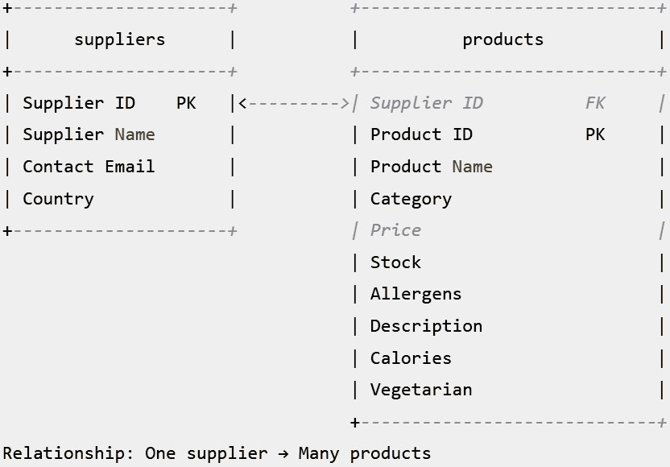

图 6.4：餐厅数据库结构

您可以在本书的 GitHub 仓库中找到数据库。

现在我们来初始化工具包和列表中的第一个工具：

```py
from langchain_community.utilities.sql_database import SQLDatabase
db = SQLDatabase.from_uri("sqlite:///piadineria.db")
from langchain_community.agent_toolkits.sql.toolkit import (
    SQLDatabaseToolkit
)
sql_toolkit = SQLDatabaseToolkit(db=db, llm=model)
sql_toolkit.get_tools()[0] 
```

这里是输出结果：

```py
[QuerySQLDatabaseTool(description="Input to this tool is a detailed and correct SQL query, output is a result from the database. If the query is not correct, an error message will be returned. If an error is returned, rewrite the query, check the query, and try again. If you encounter an issue with Unknown column 'xxxx' in 'field list', use sql_db_schema to query the correct table fields.", db=<langchain_community.utilities.sql_database.SQLDatabase object at 0x00000256933169F0>)] 
```

如您所见，该工具附带一个名称（`QuerySQLDatabaseTool`）及其功能描述，这样代理就能知道何时调用它。

3. **初始化添加到购物车工具**：在这里，我们需要编写一个适当的 HTTP 操作来将项目添加到我们餐厅应用的后端数据库中。为此，我们首先需要准备一个 DB 实例，该实例将在会话的上下文中托管用户的物品。在这种情况下，我初始化了一个空的`db.json`对象，如下所示：

```py
{
  "cart": []
} 
```

在运行代理之前，我们需要确保这个数据库是在线的（我们将在本演示中本地运行它）。

**注意**

这个数据库与 SQL 工具部分提到的 SQL 数据库不同！让我们明确地区分两者：

**SQL 数据库**：这是餐厅的记录存储系统，业主可以跟踪库存物品、价格、供应商等。

**db.json**：这是在会话上下文中为用户购物车提供动力的数据库。它是应用程序数据库。

现在我们有了购物车数据库，我们可以定义我们的工具：

```py
# Define the tool to add an item to the cart
@tool
def add_to_cart(item_name: str, item_price: float) -> str:
    """Add an item to the cart."""
    url = 'http://localhost:3000/cart'  # Ensure this matches the JSON Server endpoint
    cart_item = {
        'name': item_name,
        'price': item_price
    }

    response = requests.post(url, json=cart_item)

    if response.status_code == 201:
        return f"Item '{item_name}' added to cart successfully."
    else:
        return f"Failed to add item to cart: {response.status_code} {response.text}" 
```

如您所见，我们使用 LangChain 的典型装饰器 `@tool` 定义了我们的工具。然后，我们添加了一个名称（`add_to_cart`）和描述（格式为 `"""docstring"""`）。我们还指定了此工具正确调用所需的两个参数：物品的名称和相对价格；这意味着代理将尽力在调用工具之前检索这两个元素。最后，“正确的行为”是对实时购物车数据库端点的 POST 方法。

4. **初始化 RAG 工具**：在这里，我们希望将我们的代理与餐厅食品合规证书和多年来获得的奖项相关的某些上下文联系起来。以下是从提供的 PDF 中提取的几个段落的示例：

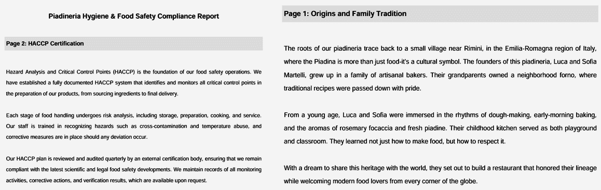

图 6.5：我们将用作知识库的食品证书快照

**快速提示**：需要查看此图像的高分辨率版本吗？在下一代 Packt Reader 中打开此书或查看 PDF/ePub 版本。


要创建我们的工具，我们首先需要将我们的 PDF 文件正确地向量化并索引到向量数据库中。为此，我们将使用 LangChain 中的某些预构建组件进行文档处理，并且作为存储，我们将使用 FAISS 向量数据库。

**定义**

**Facebook AI 相似度搜索**（**FAISS**）是由 Meta AI 开发的一个开源向量数据库和库，用于高效地进行密集向量的相似度搜索和聚类。它能够快速检索高维向量，非常适合用于语义搜索、推荐系统和基于 LLM 的检索等应用。

让我们从初始化我们的 `vectore_store` 对象开始。

```py
import faiss
from langchain_community.docstore.in_memory import InMemoryDocstore
from langchain_community.vectorstores import FAISS
#Create a FAISS index using L2 (Euclidean) distance with the same #dimensionality
#as the output of the embedding function (e.g., length of a single embedded #vector)
index = faiss.IndexFlatL2(len(embeddings.embed_query("hello world")))
vector_store = FAISS(
    embedding_function=embeddings,
    index=index,
    docstore=InMemoryDocstore(),
    index_to_docstore_id={},
) 
```

然后，我们可以利用 LangChain 的库来分块和处理我们的文档：

```py
from langchain_text_splitters import CharacterTextSplitter
from langchain.document_loaders import PyPDFDirectoryLoader
file_path = (
    "documents"
)
loader = PyPDFDirectoryLoader(file_path)
documents = loader.load()
text_splitter = CharacterTextSplitter(
    chunk_size=1000, chunk_overlap=0
)
docs = text_splitter.split_documents(documents) 
```

注意，在这种情况下，我们利用了一个文本分割库——CharacterTextSplitter，它根据字符数来分割文本。然而，LangChain 提供了多种类型的文本分割器，可以将大型文档分割成更小的、可管理的块，然后再将它们输入到向量存储中。其中一些最受欢迎的类型包括以下几种：

+   `RecursiveCharacterTextSplitter`（推荐）：尝试在更有意义的边界上进行分割（例如，段落 → 句子 → 单词 → 字符）。如果块太大，它会递归地回退到更小的单元。

+   `TokenTextSplitter`: 基于标记计数进行分割（适用于具有严格标记限制的 LLM，例如 OpenAI 的 GPT 模型）。对于将输入与模型上下文窗口对齐非常有效。

+   `NLTKTextSplitter` / `SpacyTextSplitter`：使用 NLP 库中的句子分割进行语言感知的分割器。适用于需要更多句法保留的用例。

一旦我们将文档分割成可管理的块并将它们传递给`vector_store.add_documents()`，每个块都会使用嵌入模型转换成高维向量表示。

```py
vector_store.add_documents(documents=docs) 
```

这些向量随后在向量存储中索引，以便稍后进行相似度搜索。以下是一个示例：

```py
Chunk 1: "Mozzarella is an Italian cheese..."  Vector: [0.21, -0.45, ...]
Chunk 2: "Prosciutto pairs well with melon..."  Vector: [0.67,  0.10, ...]
Chunk 3: "Our piadine are made fresh daily..."  Vector: [0.33, -0.88, ...] 
```

这些嵌入存储在向量数据库中，并附带元数据（例如，源文档 ID，原始文件中的位置）。当用户提问时，他们的查询也会被嵌入并与存储的向量进行比较，以检索最相关的块。

此过程允许系统根据**语义意义**“检索”知识，而不仅仅是关键词。

现在我们已经拥有了创建我们的 RAG 工具的所有成分：

```py
retriever = vector_store.as_retriever()
from langchain.tools.retriever import create_retriever_tool
rag_tool = create_retriever_tool(
    retriever,
    "document_search",
    """
    Search and return information about restaurant's health certificate and owner's history.
    """
) 
```

正如你所见，LangChain 中的`vector_store`对象自带一个方法（`.as_retriever`），它可以将它自动转换为检索对象。通过这样做，我们可以使用`create_retriever_tool`函数创建我们的工具，正如我们在许多示例中学到的，这将需要一个工具名称和工具功能的描述。

5. **初始化系统消息**：在创建代理之前，我们需要最后一个成分，即系统消息。在 LangChain 中，我们可以利用专为结构化基于聊天的语言模型提示而设计的`ChatPromptTemplate`类。

它具有以下关键特性：

+   **基于角色的消息**：定义具有特定角色的消息，以设置对话的上下文和流程。

+   **动态变量**：在消息中包含占位符，可以在运行时用用户输入或其他动态数据填充。

+   **上下文管理**：使用如`MessagesPlaceholder`之类的占位符维护对话历史和中间步骤，使 AI 能够生成连贯且与上下文相关的响应。

通过使用 ChatPromptTemplate，你可以创建动态和上下文感知的提示，这些提示包含变量和占位符。

对于我们的 AskMamma 代理，我们将有以下结构：

```py
# Define the prompt template
prompt = ChatPromptTemplate.from_messages(
    [
        ("system", """You are an AI assistant for a Piadineria Restaurant.
            You help customers explore the menu and choose the best piadine or Italian specialties through friendly, interactive questions.
            When the user asks for product details (ingredients, allergens, vegetarian options, price, etc.), you can query the product database.
            Once the user is ready to order, ask if they'd like to add the selected item to their cart.
            If they confirm, add the item to the cart using your tools.
            When using a tool, respond only with the final result. For example:
            Human: Add Classic Piadina to the cart with price 5.50
            AI: Item 'Classic Piadina' added to cart successfully.
        """),
        MessagesPlaceholder("chat_history", optional=True),
        ("human", "{input}"),
        MessagesPlaceholder("agent_scratchpad"),
    ] 
```

让我们将它分解为其三个主要组件：

+   **系统消息**：这是设置 AI 整体行为和边界的指导性消息。

    ```py
    ("system", """You are an AI assistant for a Piadineria Restaurant. ...""") 
    ```

+   **MessagesPlaceholder(“chat_history”)**：这是一个动态占位符，将完整的对话历史（如果可用）插入到提示中，以便 AI 了解已经说过什么。请注意，它被标记为`optional=True`，因此聊天可以从头开始或继续进行中的会话。

+   **带有输入占位符的人类消息**：这是当前用户消息被插入的地方。`{input}` 占位符将在运行时被替换为用户刚刚输入的内容（例如，“你们有不含麸质的选项吗？”）。

    ```py
    ("human", "{input}") 
    ```

+   **MessagesPlaceholder(“agent_scratchpad”)**：这是在工具增强工作流程中注入中间代理推理或工具使用痕迹的地方。

    **注意**

    这种结构化格式非常适合基于代理的系统，其中以下条件适用：

    +   你需要持久化内存（chat_history）

    +   代理可以调用工具（例如添加到购物车、查询产品）

    +   你希望一开始就给出清晰的行为指令（通过系统消息）。

    这确保了 AI 的行为一致，适应上下文，并像真实助手一样执行动作——不会产生幻觉或超出其允许的范围进行响应。

6. **初始化代理**：我们现在有了初始化代理的所有成分。为此，我们将利用 LangChain 中可用的预构建函数 `create_openai_tools_agent`，该函数旨在构建利用 OpenAI 工具调用能力的 AI 代理。

**定义**

OpenAI 的工具调用能力，以前称为函数调用，使语言模型能够以结构化和动态的方式与外部工具或函数交互。在人工智能代理的新领域，工具调用成为更大编排谜题的一部分，正如我们多次提到的，我们在 LLM 上添加了一个额外的智能层，这样我们就可以赋予代理决定是否使用工具、选择调用哪个工具、将工具链在一起、计划并执行后续动作等的能力。因此，尽管工具调用的 *机制* 仍然存在，开发者们正从编写原始工具调用逻辑转向处理这种推理的代理接口。

让我们初始化它：

```py
# Setup the toolkit
toolkit = [rag_tool, add_to_cart, *sql_toolkit.get_tools()[:4]]
from langchain_community.chat_message_histories import(
    ChatMessageHistory)
from langchain_core.runnables.history import( 
    RunnableWithMessageHistory)
message_history = ChatMessageHistory()
# Construct the OpenAI Tools agent
agent = create_openai_tools_agent(model, toolkit, prompt)
# Create an agent executor by passing in the agent and tools
agent_executor = AgentExecutor(agent=agent, tools=toolkit, 
    verbose=True)
agent_with_chat_history = RunnableWithMessageHistory(
    agent_executor,
    # This is needed because in most real world scenarios, a session id is needed
    # It isn't really used here because we are using a simple in memory ChatMessageHistory
    lambda session_id: message_history,
    input_messages_key="input",
    history_messages_key="chat_history",
) 
```

现在是时候测试它了。在运行我们的代理之前，我们需要部署 `db.json`，这样代理就可以在需要时从 `add_to_cart` 工具正确执行 POST 请求。要运行你的数据库，你可以在你的终端中执行以下命令：

```py
npm install -g json-server
cd path_to_your_db
json-server --watch db.json 
```

现在您的 `db.json` 正在您的本地主机上以端口 `3000`（默认端口）运行：

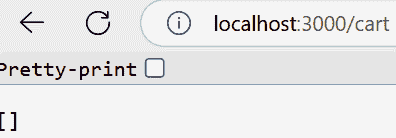

图 6.6：作为本地主机运行的应用数据库

太好了，现在我们可以运行我们的代理了。为了模拟对话，我将使用一个 `while` 循环：

```py
# Interactive loop
while True:
    user_input = input("Type your question here (or type 'exit' to quit): ")
    if user_input.lower() == 'exit':
        break
    result = agent_with_chat_history.invoke(
        {"input": user_input},
        # This is needed because in most real world scenarios, a session id is needed
        # It isn't really used here because we are using a simple in memory ChatMessageHistory
        config={"configurable": {"session_id": "<foo>"}
    )
    print(f'User: {user_input}')
    print(f'AI: {result['output']}') 
```

在运行代码后，我发送了以下输入（请注意，我发送了一些假设保留先前上下文的问题来测试短期记忆）：

+   “你好”

+   “你们有什么食品证书？”

+   “你们有意大利干酪吗？”

+   “是的，加到购物车”

+   “这个商品是由哪个供应商提供的？”

让我们看看结果。注意，我保持了代理的详细输出，这意味着我们可以看到中间步骤和工具输出。以下输出在中间步骤中被截断，但您可以在 GitHub 仓库中看到完整版本。

为了使以下内容更易于阅读，我将突出显示**用户输入**、**AI 输出**和**推理步骤**。在它们之间，我将添加**我的评论**来突出一些值得注意的特定代理模式：

```py
`User: Hello`
**The agent understands that this is a simple interaction that requires no specific tool.**
`AI: Hi there! Welcome to our Piadineria Restaurant. How can I assist you today? Are you looking to explore our menu or need help with something specific?`
`User: Which food certificates do you have?`
**The agent understands that it needs to invoke the specific RAG tool with a specific query to answer this question.** 
```

```py
> Entering new AgentExecutor chain...
Invoking: `document_search` with `{'query': 'food certificates'}`
Piadineria Hygiene & Food Safety Compliance Report
Page 2: HACCP Certification
Hazard Analysis […]
> Finished chain. 
```

```py
`AI: We have several food safety certificates and compliance measures in place:`
`1\. **HACCP Certification**: We have a fully documented Hazard Analysis and Critical Control Points (HACCP) system that identifies and monitors all critical control points in the preparation of our products. This system is reviewed and audited quarterly by an external certification body.`
`2\. **Local Food Safety Training & PIC**: Every food handler in our piadineria completes accredited food safety training in accordance with local regulations. We also have a Person In Charge (PIC) at each location to supervise hygiene standards and enforce best practices.`
`Would you like to know more about our menu or anything else?`
`User: Do you have ricotta cheese in stock?`
**The agent understands it needs to invoke some SQL tools for that. First, it needs to understand the schema with the sql_db_list_tables and sql_db_schema tools, then it will run the actual query with `sql_db_query`.** 
```

```py
> Entering new AgentExecutor chain...
Invoking: `sql_db_list_tables` with `{}`
responded: Let me check the availability of ricotta cheese for you. I'll need a moment to look it up.
products, suppliers
Invoking: `sql_db_schema` with `{'table_names': 'products'}`
[…]
Invoking: `sql_db_query` with `{'query': 'SELECT * FROM products WHERE "Product Name" = \'Ricotta Cheese\''}`
[…]
> Finished chain. 
```

```py
`AI: Yes, we do have ricotta cheese in stock! Here are the details:`
`**Product Name**: Ricotta Cheese`
`**Category**: Cheese`
`**Price**: $7.75`
`**Stock**: 15 units`
`**Allergens**: Dairy`
`**Description**: Creamy ricotta cheese, ideal for desserts or pasta.`
`**Calories**: 120`
`**Vegetarian**: Yes`
`Would you like to add this to your cart or need help with anything else?`
`User: Yes, add it to cart`
**The agent understands it needs to invoke the add_to_cart tool and it is able to retrieve the two parameters needed – name and price – from the previous conversation.** 
```

```py
> Entering new AgentExecutor chain...
Invoking: `add_to_cart` with `{'item_name': 'Ricotta Cheese', 'item_price': 7.75}`
Item 'Ricotta Cheese' added to cart successfully.The Ricotta Cheese has been successfully added to your cart. Is there anything else you would like to add or any other assistance you need?
> Finished chain. 
```

一旦这个工具被执行，如果你重新运行你的 db.json 服务器，你会看到它已经相应地更新了：

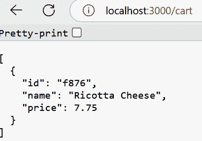

图 6.7：填充了项目后的应用程序数据库

```py
`AI: The Ricotta cheese has been successfully added to your cart. Is there anything else you would like to add or any other assistance you need?`
`User: And who is the supplier for the item?`
**The agent is able to invoke once more the SQL tools and, this time, is going to perform a join operation as well to look up the two tables and extract the Ricotta Cheese's supplier. Plus, we didn't specify the item but rather relied on the context-awareness of our agent.** 
```

```py
> Entering new AgentExecutor chain...
Invoking: `sql_db_list_tables` with `{}`
products, suppliers
Invoking: `sql_db_schema` with `{'table_names': 'products, suppliers'}`
[…]
Invoking: `sql_db_query` with `{'query': 'SELECT suppliers."Supplier Name" FROM suppliers JOIN products ON suppliers."Supplier ID" = products."Supplier ID" WHERE products."Product Name" = \'Ricotta Cheese\''}`
[…]
> Finished chain. 
```

```py
`AI: The supplier for our Ricotta Cheese is **Dolce Italia**.`
`Is there anything else you would like to know or add to your order?`
`User: Thanks!`
`AI: You're welcome! If you have any other questions or need further assistance, feel free to ask. Enjoy your meal!` 
```

如您所见，代理能够做到以下几点：

+   根据用户的请求调用合适的工具，多亏了每个工具配备的自然语言描述

+   在用户会话的上下文中保持记忆

+   以对话方式与用户互动

只需三个工具，我们就能够通过一个强大的代理来提升用户体验。

然而，我们还缺少一个重要的拼图碎片：我们如何监控代理的行为？实际上，在现实世界的场景中，可观察性、可追溯性，以及评估和持续改进，在设计你的端到端架构时是关键要素。

在下一节中，我们将探讨如何用几行代码来实现这一点。

## 可观察性、可追溯性和评估

可观察性、可追溯性和评估是实现这些目标的关键组成部分。它们提供了对人工智能代理内部运作的见解，促进了调试，并使持续改进成为可能。

可观察性指的是根据系统的外部输出理解系统内部状态的能力。在人工智能代理中，这涉及到监控输入、输出、中间过程以及与外部工具或 API 的交互。可追溯性通过提供代理决策过程的详细记录来补充可观察性，包括采取的动作序列和背后的理由。共同作用，它们使开发者能够定位问题、理解代理行为并确保系统按预期运行。

评估涉及根据预定义的指标或基准来评估人工智能代理的性能。这可能包括准确性、相关性、连贯性或其他特定领域的标准。定期的评估有助于确定改进领域、验证更新并确保代理达到期望的标准。它还在维护用户信任和满意度方面发挥着至关重要的作用。

**注意**

+   根据任务和上下文，可以使用几种方法来评估人工智能代理。以下包括以下内容：

+   人工评估，其中人类评判者评估代理响应的质量或有用性。

+   LLM 作为裁判，其中可信模型（例如 GPT-4）对响应进行评分以评估相关性或准确性。

+   **知识库**（**KB**）验证，对于检索增强系统中的检索文档的正确性很重要。

+   自动指标，如 BLEU、ROUGE 或对摘要或问答等任务的精确匹配。

选择正确的方法取决于您是在评估推理、事实准确性还是用户满意度。

然而，随着 AI 代理变得更加复杂——能够推理、使用工具并保持多轮记忆——对强大可观察性和评估的需求变得至关重要。与传统的软件系统不同，其中错误通常可以追溯到特定的代码行或逻辑分支，AI 代理在概率性和动态环境中运行。他们的决策不仅取决于输入数据，还取决于提示结构、检索的上下文、工具交互和之前的对话轮次。这使得调试和性能评估本质上更加困难。为了解决这个问题，像 **LangSmith** 这样的工具应运而生，提供了一种结构化的方式来实时监控、跟踪和评估代理行为。

LangSmith – LangChain 生态系统的一部分 – 是一个旨在增强 AI 应用程序的可观察性、可追溯性和评估的平台。它提供用于记录和可视化代理交互、分析性能指标和进行系统评估的工具。

LangSmith 的关键特性包括以下内容：

+   **执行跟踪**：可视化代理的逐步决策，包括输入、输出和工具使用

+   **性能洞察**：监控关键统计数据，如延迟、令牌计数和错误模式，以优化您的系统

+   **灵活的评估**：运行具有内置或自定义逻辑的结构化评估，以评估响应质量

+   **提示版本控制**：跟踪、比较和迭代提示，以随着时间的推移改进代理行为

+   **协作友好**：与您的团队共享运行、反馈和评估以支持联合开发

LangSmith 与各种 AI 框架无缝集成（不仅限于 LangChain！），提供了一个统一的接口来监控和改进 AI 代理。

让我们看看实际应用。

第一步是在以下链接的 LangSmith 设置页面上创建 API 密钥：[`smith.langchain.com/settings`](https://smith.langchain.com/settings)。

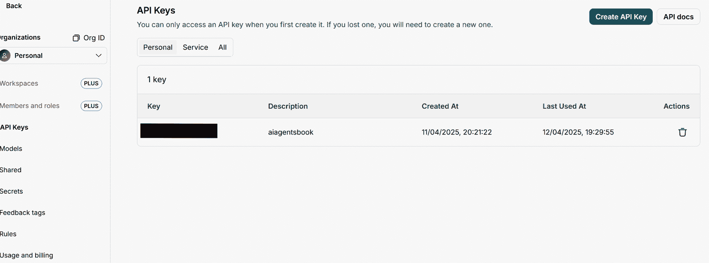

图 6.8：LangSmith 管理门户

注意，如果您还没有账户，您将被要求注册（这是免费的）。

然后，您可以安装 LangSmith 依赖项：

```py
pip install -U langsmith 
```

使用您的变量设置您的环境。在我们的案例中，因为我们在一个 Jupyter 笔记本中演示代理，我将使用 os 模块直接初始化我的变量，同时创建我的 LangSmith 客户端：

```py
from langsmith import Client
client = Client(
    api_key=os.getenv("LANGSMITH_API_KEY"),
    api_url=os.getenv("LANGSMITH_ENDPOINT"), 
) 
```

现在我们已经拥有了初始化 `LangChainTracer` 对象的所有要素，这是一个 LangChain 中的专用回调处理程序，旨在捕获应用程序组件（如链、工具和语言模型交互）的详细执行跟踪，并将此信息发送到 LangSmith。

```py
from langchain.callbacks.tracers import LangChainTracer
tracer = LangChainTracer(client=client, project_name="askmamma") 
```

如您所见，`LangChainTracer` 使用客户端和一个可选的 `project_name` 参数初始化 – 这将标记我们的日志将被保存和分析的文件夹。此跟踪器挂钩到 LangChain 的执行流程中，捕获事件，如链的开始和结束、工具调用和语言模型调用。

跟踪器是我们需要添加到现有代理的唯一附加元素。我们可以在调用代理时将其作为配置参数传递，如下所示：

```py
agent_with_chat_history.invoke(
        {"input": user_input},
        # This is needed because in most real world scenarios, a session id is needed
        # It isn't really used here because we are using a simple in memory ChatMessageHistory
        config={"configurable": {"session_id": "<foo>"}, 
            **"callbacks"****: [tracer]},**
    ) 
```

此配置确保代理执行的每一步都会记录到 LangSmith，让您能够可视化操作序列，检查输入和输出，并识别任何错误或性能瓶颈。

例如，一旦我们运行我们的代理，我们将在 LangSmith 仪表板上看到一个新的项目被初始化：

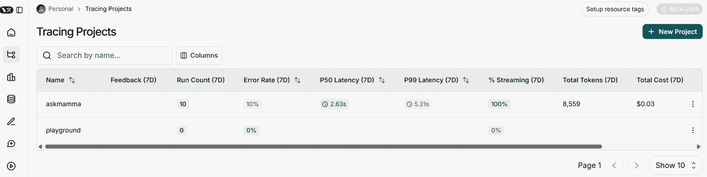

图 6.9：LangSmith 的跟踪项目

我们已经可以看到一些有趣的统计数据，如错误率、总成本、运行次数等。现在让我们从 `AskMamma` 项目概述中获取更多详细信息：

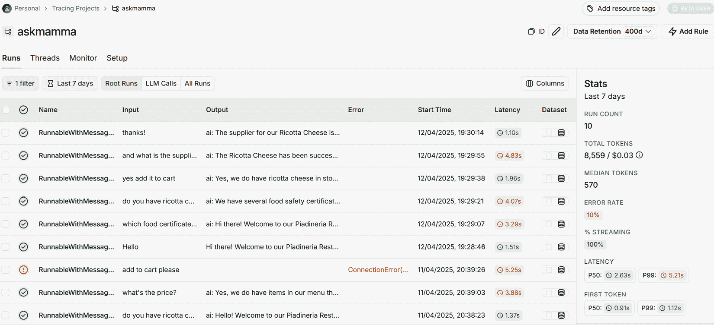

图 6.10：LangSmith 的项目概述

在这里，您可以查看三个主要的信息来源：

1.  **运行**：运行是与代理的单次交互。例如，如果用户输入“Hi”，那就是一个运行。

在每个运行下，我们可以探索关于代理活动的许多细节来回答问题。例如，在我们询问“你有哪些食品证书？”的运行中，代理执行了几个步骤，我们可以在 LangSmith 中查看所有这些步骤：

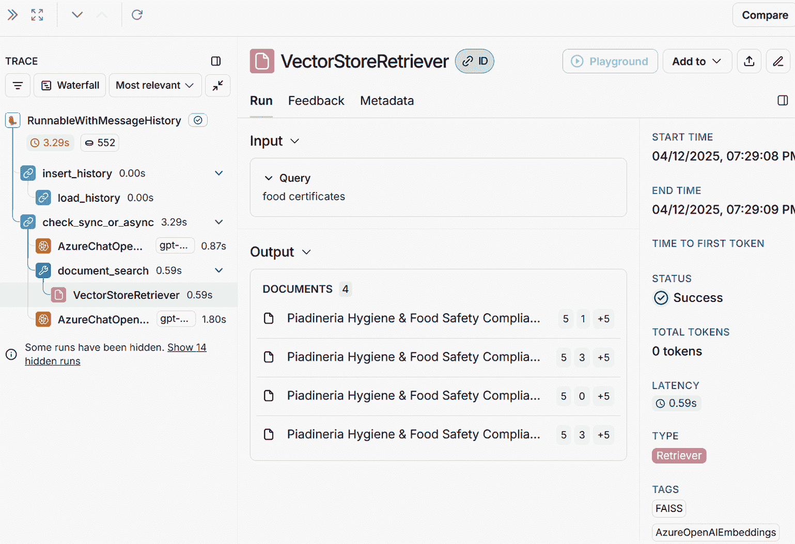

图 6.11：LangSmith 的运行概述

我们还可以检查那些失败的运行：

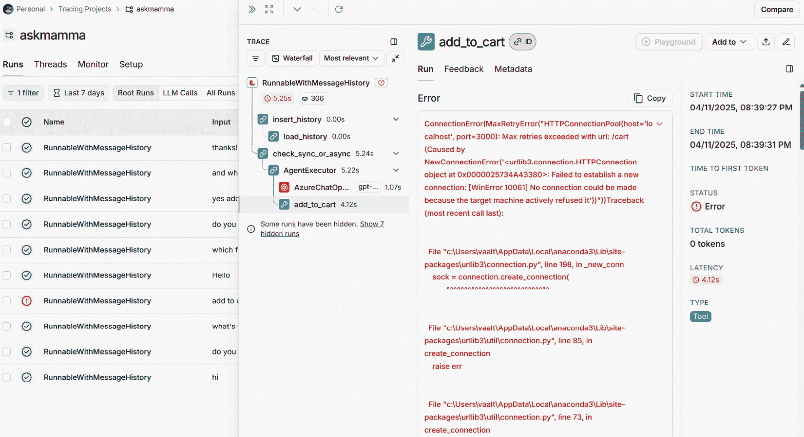

图 6.12：LangSmith 运行步骤概述

在这种情况下，原因是，在调用 `add_to_cart` 工具时，由于数据库离线，代理无法进一步执行。

2. **线程**：线程可以定义为会话。线程由唯一的标识符标记，您可以将其初始化为名称。例如，在我们的场景中，我们初始化了一个名为 `<foo>` 的线程：

实际上，您可以在 LangSmith 中看到这个线程的记录：

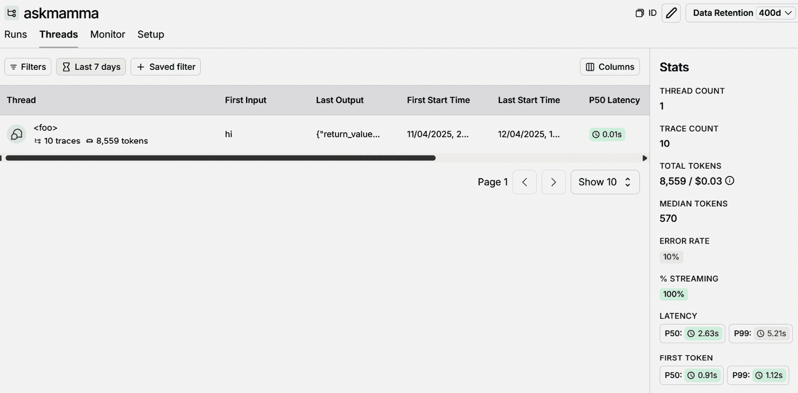

图 6.13：LangSmith 的线程概述

线程可以帮助您组织运行，并从更高层次查看您的代理背后的情况：

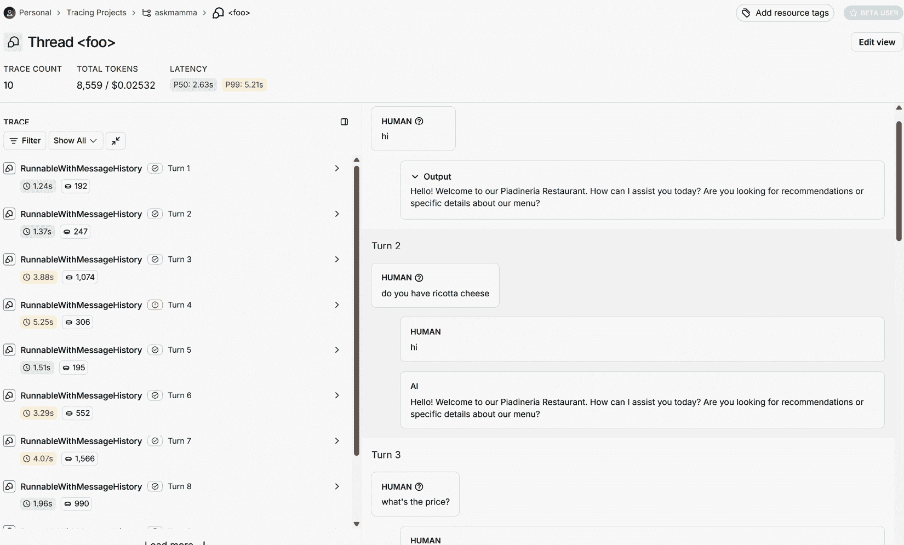

图 6.14：LangSmith 线程跟踪概述

3. **监控**：在这里，你可以看到一些有用的图表，以获得对代理的 360 度视图，包括跟踪计数、LLM 调用计数、成功率等：

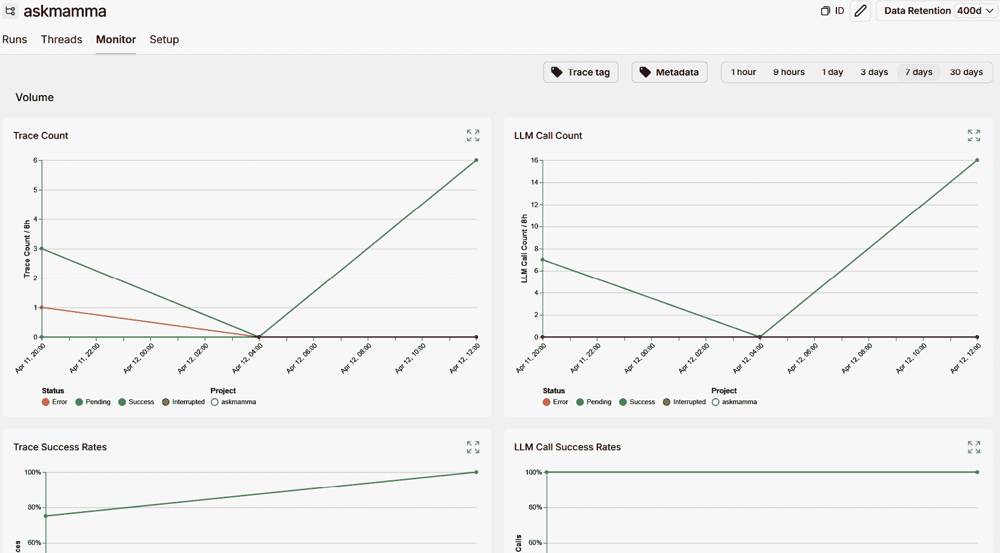

图 6.15：LangSmith 的监控仪表板

当涉及到评估时，AI 代理和更广泛的 LLM 驱动的应用不能依赖于传统的机器学习评估器，如准确率、假阳性率、ROC 曲线等。事实上，AI 输出是设计为对话式的，这意味着我们需要新的工具和技术来评估我们 AI 驱动的解决方案的性能。

通常，为了评估 LLM 或代理管道的质量，你有**三个主要组件**需要处理：

1.  **数据集**：这是测试用例的集合——包括输入和可选的预期输出，你的模型或代理将在这个集合上被评估。将其视为你的基准或参考集。

1.  **目标函数**：这是你想要测试的实际事物——在我们的案例中，是 AI 代理的输出。当你运行一个评估时，LangSmith 将把每个数据集输入传递给这个目标函数并捕获输出——就像自动测试执行一样。然后，输出将与预期输出进行比较或根据你选择的评估器独立评估。

1.  **评估器**：评估器用于判断目标函数输出的质量。它们可以是基于 LLM 的评估器，字符串指标如 BLEU 或 ROUGE，或传统的指标如准确率（如果我们使用 LLM 进行分类或预测等任务）。

    **定义**

    **BLEU**（或**双语评估助手**）和**ROUGE**（**面向召回的摘要评估助手**）是自然语言处理（NLP）中最广泛使用的自动评估指标之一，特别是在文本生成、翻译和摘要等任务中。

    BLEU 是一个基于精确率的指标，通过测量生成的文本与一个或多个参考文本之间的 n-gram 重叠来评估文本质量——常用于机器翻译。

    ROUGE 是一个基于召回率的指标，通过比较参考文本内容在输出中出现的多少来评估文本生成，常用于摘要任务。

让我们用一个`AskMamma`代理的例子来看看。在这个场景中，我们将利用 LangSmith SDK；然而，你也可以从 UI 游乐场运行样本评估：

+   **初始化数据集**：在这里，我们将使用一些输入-输出对初始化一个 LangSmith 测试数据集。请注意，在这里，我们将考虑不需要调用工具的一般答案——我们首先想测试我们的代理的一般回答能力。

    ```py
    from langsmith import Client
    client = Client(
        api_key=os.getenv("LANGSMITH_API_KEY"),  # This can be retrieved from a secrets manager
        api_url=os.getenv("LANGSMITH_ENDPOINT"),  # Update appropriately for self-hosted installations or the EU region
    )
    dataset = client.create_dataset(
        dataset_name="QA Askmamma", 
        description="A sample dataset in LangSmith."
    )
    # Create examples
    examples = [
        {
            "inputs": {"question": "What is Piadina?"},
            "outputs": {"answer": "A traditional Italian flatbread, 
                typically made with wheat flour, water, and salt."},
        },
        {
            "inputs": {"question": "What is the tradition of Piadina?"},
            "outputs": {"answer": "Piadina is a traditional Italian flatbread that originated in the Romagna region. It is typically filled with various ingredients and served warm."},
        },
    ]
    # Add examples to the dataset
    client.create_examples(dataset_id=dataset.id, examples=examples) 
    ```

你将能够在 LangSmith 控制面板下的**数据集与实验**部分可视化你的数据集：

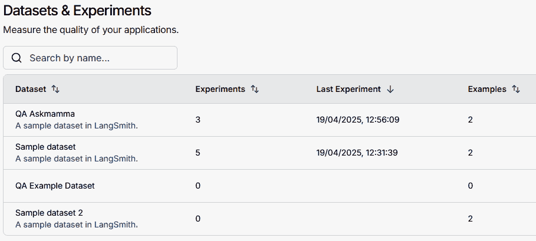

图 6.16：LangSmith 的数据集和实验

+   **定义评估器**：评估器将比较预期输出与实际输出，并根据特定指标对其进行评估。在我们的情况下，我们将利用 AI 驱动的评估。

    **注意**

    通过 AI 驱动的评估，我们指向具有非常特定提示的 LLM，使其成为其他 LLM 输出的“裁判”。

让我们初始化我们的 LLM 作为裁判。在这种情况下，我们将使用一个正确性指标来评估预期输出与实际输出之间的匹配：

```py
from openai import AzureOpenAI
aoai_client = AzureOpenAI(
    azure_endpoint = os.getenv("AZURE_OPENAI_ENDPOINT"),
    api_key = os.getenv("AZURE_OPENAI_API_KEY"),
    api_version = os.getenv("AZURE_OPENAI_API_VERSION")
    )
from langsmith import wrappers
eval_instructions = "You are an expert professor specialized in grading students' answers to questions."
def correctness(
    inputs: dict, outputs: dict, reference_outputs: dict
) -> bool:
    user_content = f"""You are grading the following question:
{inputs['question']}
Here is the real answer:
{reference_outputs['answer']}
You are grading the following predicted answer:
{outputs['response']}
Respond with a score of 1-5, where 1 is the worst and 5 is the best. Your answer ONLY contains the score.
"""
    response = openai_client.chat.completions.create(
        model="gpt-4o",
        temperature=0,
        messages=[
            {"role": "system", "content": eval_instructions},
            {"role": "user", "content": user_content},
        ],
    ).choices[0].message.content
    return response.strip() 
```

**注意**

如果你想利用预构建的评估器，可以选择 OpenEvals，这是一个开源的评估框架，它提供了一种标准化的方式来构建和注册评估函数——例如准确性检查、有用性评分或基于 LLM 的评论——并将它们一致地应用于数据集和模型。

+   **初始化目标函数**：最后一个成分是评估的逻辑——我们希望将我们的智能体输出结构与定义的评估器相匹配。

    ```py
    def target(inputs: dict) -> dict:
        response = agent_with_chat_history.invoke(
            {"input": inputs['question']},
            # This is needed because in most real world scenarios, a session id is needed
            # It isn't really used here because we are using a simple in memory ChatMessageHistory
            config={"configurable": {"session_id": "<foo>"}, 
                "callbacks": [tracer]},
        )
        return { "response": response['output'] } 
    ```

就这样！现在让我们运行我们的评估器：

```py
experiment_results = client.evaluate(
    target,
    data="QA Askmamma",
    evaluators=[
        correctness,
        # can add multiple evaluators here
    ],
    experiment_prefix="first-eval-in-langsmith",
    max_concurrency=2,
) 
```

您现在可以检查 UI 的结果：

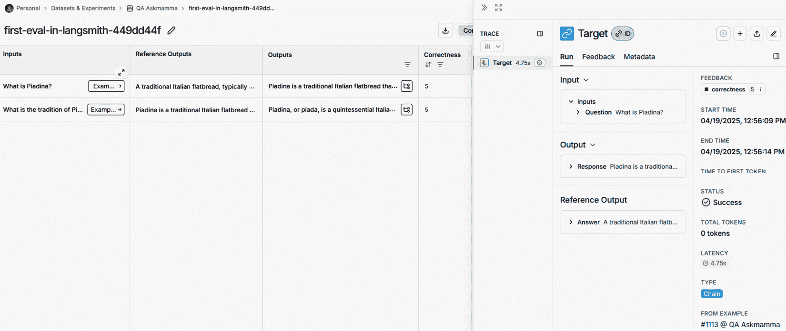

图 6.17：LangSmith 的评估结果

如您所见，我们的实际输出都返回了 5 的正确性分数。对于每个示例，您可以检查相关的指标，如实际输出、延迟、令牌等。

此外，在 AI 智能体的背景下，我们还需要考虑工具管理：

+   工具调用是否正常工作？

+   智能体能否调用多个工具来完成复杂的问题？

+   智能体是否足够智能，在不必要的情况下不会调用工具？

换句话说，你需要评估你的智能体的**轨迹**。让我们看看如何进行评估的例子（注意：以下代码是从官方 LangSmith 文档中改编的，您可以在以下链接找到：[`docs.smith.langchain.com/evaluation/how_to_guides`](https://docs.smith.langchain.com/evaluation/how_to_guides)）。

+   **初始化新的数据集**：在这种情况下，我们需要添加以下预期的中间步骤：

    ```py
    import uuid
    questions = [
        (
            "Do you have ricotta cheese in stock",
            {
                "reference": "Yes we do have ricotta cheese in stock.",
                "expected_steps": ["sql_db_list_tables", 
                    "sql_db_schema", "sql_db_query_checker", 
                    "sql_db_query"],
            },
        ),
        (
            "hi",
            {
                "reference": "Hello, how can I assist you?",
                "expected_steps": [],  # Expect a direct response
            },
        ),
        (
            "Can you add ricotta cheese to the cart with price 5.50?",
            {
                "reference": "The item 'ricotta cheese' has been added to the cart.",
                "expected_steps": ["add_to_cart"],
            },
        ),
        (
            "Do you have food safety certificate?",
            {
                "reference": "Yes, we have a food safety certificate.",
                "expected_steps": ["document_search"],
            },
        ),
    ]
    uid = uuid.uuid4()
    dataset_name = f"Agent Tool Eval Example {uid}"
    ds = client.create_dataset(
        dataset_name=dataset_name,
        description="An example agent evals dataset using search and calendar checks.",
    )
    client.create_examples(
        inputs=[{"input": q[0]} for q in questions],
        outputs=[q[1] for q in questions],
        dataset_id=ds.id,
    ) 
    ```

+   **初始化我们的评估器**：在这里，我们将评估中间步骤的正确性，确保调用正确的工具：

    ```py
    from typing import Optional
    from langsmith.schemas import Example, Run
    def intermediate_step_correctness(
        run: Run, example: Optional[Example] = None
    ) -> dict:
        if run.outputs is None:
            raise ValueError("Run outputs cannot be None")
        intermediate_steps = run.outputs.get("intermediate_steps") or []
        trajectory = [action.tool for action, _ in intermediate_steps]
        # This is what we uploaded to the dataset
        expected_trajectory = example.outputs["expected_steps"]
        score = int(trajectory == expected_trajectory)
        return {"key": "Intermediate steps correctness", "score": score} 
    ```

    **注意**

    为了获取访问我们智能体中间步骤的权限，我们需要确保`return_intermediate_steps`参数设置为`True`。

    ```py
    agent_executor = AgentExecutor(agent=agent, tools=toolkit, 
        verbose=True, return_intermediate_steps=True) 
    ```

我们还需要确保用适当的模式初始化我们的评估器，以便它能够解析测试数据集中我们拥有的多个输出。

```py
def prepare_data(run: Run, example: Example) -> dict:
    return {
        "input": example.inputs["input"],
        "prediction": run.outputs["output"],
        "reference": example.outputs["reference"],
    }
# Measures whether a QA response is "Correct", based on a reference answer
qa_evaluator = LangChainStringEvaluator(
    "qa", prepare_data=prepare_data, config={"llm": model}
) 
```

+   **定义目标函数**：在这里，我们只是创建一个将使用适当的配置参数调用我们的智能体的函数。

    ```py
    def agent(inputs: dict):
        return agent_with_chat_history.invoke(
            inputs, config={"configurable": {"session_id": "<foo>"}}
        ) 
    ```

现在我们已经拥有了运行评估的所有成分：

```py
chain_results = evaluate(
    agent,
    data=dataset_name,
    evaluators=[intermediate_step_correctness, qa_evaluator],
    experiment_prefix="Agent Eval Example",
    max_concurrency=1,
) 
```

让我们检查 LangSmith UI 的结果：

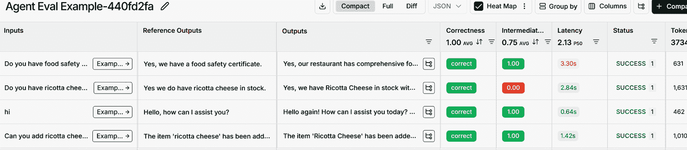

图 6.18：评估结果仪表板

太好了！正如你所看到的，我们的代理表现相当不错，但我们可以看到其中一个中间步骤被评估为不正确。让我们了解原因：

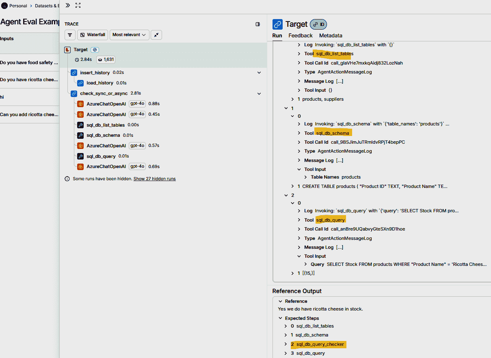

图 6.19：代理步骤评估结果

看起来代理没有运行 `sql_db_query_checker`。尽管如此，最终结果还是正确的。这是一个重要的见解，因为我们可能希望要么在不必要时删除该工具，要么在系统消息级别对代理使用该工具提出更具体的建议。

评估代理不仅是为了判断其最终响应的质量，而且是为了分析导致这些结果的全过程推理和工具使用。通过评估代理所说的内容以及它是如何一步步得出结论的，我们可以更深入地了解其可靠性、透明度和与预期行为的对齐。这种全面的评估在复杂的工作流程中尤为重要，因为信任、可追溯性和正确性至关重要。

## 在移动应用中嵌入 AI 代理

AI 代理可以通过多种方式使用：作为一个具有交互式用户界面的独立应用程序，由业务流程触发，或者嵌入到现有应用程序中。在我们的场景中，我们将探索最后一种选项。

假设我们有一个餐厅的移动应用程序，我们希望将其与由我们的 `askmamma` AI 代理驱动的会话式用户界面相结合。新界面的外观和感觉如下：


图 6.20：我们 Piadineria 移动应用的界面

为了开发用户界面，我们将利用 Streamlit，这是一个开源的 Python 库，它使得构建和共享交互式网络应用变得容易，特别是对于数据科学和机器学习工作流程。你不必花费时间在前端开发上，你可以专注于 Python 代码，Streamlit 会自动处理用户界面。

在其功能中，Streamlit 有社区支持的组件和模板，可以轻松集成到 LangChain 管道中（例如，创建聊天界面或文本生成演示）。这种协同作用让你能够快速启动 LLM 应用程序的验证版本，利用 Streamlit 的交互性和用户友好的界面以及 LangChain 强大的语言处理能力。

在我们的场景中，我们将利用这种集成在 UI 层面上处理代理组件。让我们看看在重新利用代理到 Streamlit 时需要考虑的一些主要代码块（你可以在 GitHub 仓库中找到完整的代码）：

+   **内存管理**：我们首先初始化一个与 Streamlit 兼容的消息历史记录对象，作为我们应用中发生的对话的后端内存存储。在这种情况下，我们将利用内置的 LangChain 内存类 `ConversationBufferMemory`，它将所有消息保存在缓冲区（即运行列表）中。

    ```py
    from langchain_community.chat_message_histories import (
        ChatMessageHistory
    )
    from langchain_core.runnables.history import (
        RunnableWithMessageHistory
    )
    from langchain_community.chat_message_histories import (
        StreamlitChatMessageHistory)
    msgs = StreamlitChatMessageHistory()
    memory = ConversationBufferMemory(
        chat_memory=msgs, return_messages=True,
        memory_key="chat_history", output_key="output"
    ) 
    ```

使用这种方法，我们将向 `agent_executor` 传递一个与 Streamlit 兼容的内存对象。

```py
agent_executor = AgentExecutor(
        agent=agent, tools=toolkit, memory=memory,
        return_intermediate_steps=True,
        handle_parsing_errors=True, verbose=True
) 
```

+   **初始化 Streamlit 会话状态**：在 Streamlit 中，状态指的是在用户交互之间保留变量的能力——例如，即使在重新运行后也能记住输入或点击的内容。

    ```py
    if 'chat_history' not in st.session_state:
        st.session_state['chat_history'] = []
    if "messages" not in st.session_state:
        st.session_state.messages = [] 
    ```

之前的代码确保当用户打开您的应用时，内存中有一个位置来存储对话历史（`chat_history`）和屏幕上显示的消息（`messages`）。这就像设置两个笔记本——一个用于跟踪幕后所说的话，另一个用于显示给用户的内容。如果没有这一步，应用将不知道在哪里保存或检索过去的消息。

+   **渲染基于持久内存的消息**：在这个块中，我们希望显示用户和 AI 之间的完整聊天历史，从内存中拉取，以便显示之前发生的一切。

    ```py
    avatars = {"human": "user", "ai": "assistant"}
    for idx, msg in enumerate(msgs.messages):
        with st.chat_message(avatars[msg.type]):
            # Render intermediate steps if any were saved
            for step in st.session_state.steps.get(str(idx), []):
                if step[0].tool == "_Exception":
                    continue
                with st.status(
                    f"**{step[0].tool}**: {step[0].tool_input}", 
                    state="complete"
                ):
                    st.write(step[0].log)
                    st.write(step[1])
            st.write(msg.content) 
    ```

+   **渲染当前状态消息**：这显示仅存储在当前会话状态中的消息——通常是当前运行中的消息。

    ```py
    for message in st.session_state.messages:
        with st.chat_message(message["role"]):
            st.markdown(message["content"]) 
    ```

+   **渲染 AI 代理的聊天界面**：此代码在 Streamlit 应用的底部设置聊天输入，邀请用户提问——例如 *“想知道菜单里有什么吗？”*。当用户发送消息时，它立即在聊天中以用户气泡的形式显示。然后，AI (`agent_executor`) 接管：它处理提示，可能沿途使用工具，并在助手气泡中回复答案。

    ```py
    prompt = st.chat_input("Want to know what's in the menu?")
    if prompt:
        st.chat_message("user").write(prompt)
        with st.chat_message("assistant"):
            st_cb = StreamlitCallbackHandler(st.container(), 
                expand_new_thoughts=False)
            response = agent_executor.invoke({"input": prompt}, 
                {"callbacks": [st_cb]})
            st.write(response["output"])
            st.session_state.steps[str(len(msgs.messages) - 1)] = \
                response["intermediate_steps"] 
    ```

这里很棒的是，AI 的推理步骤——例如它背后使用的工具——被 `StreamlitCallbackHandler` 捕获并存储在 `st.session_state.steps` 中。这使得您可以稍后详细可视化这些步骤，使用户能够窥视 AI 如何得出其答案。

一旦您的代码准备就绪并保存在 `app.py` 文件中，您可以通过 `streamlit run app.py` 运行它，在本地主机上查看结果。最终结果将如下所示：

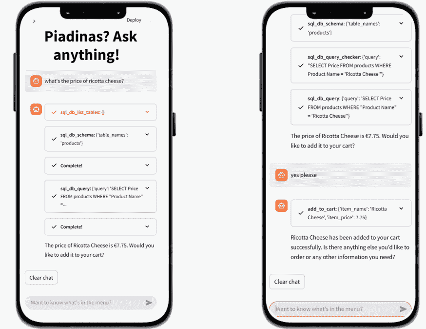

图 6.21：AskMamma 代理的对话界面 UI

如您所见，我们能够与 AskMamma 互动，并代表我们执行一些操作，例如向购物车添加一项商品。

# 摘要

在本章中，我们探讨了创建一个功能性的 AI 代理所必需的基本概念和实践步骤。从理解 LangChain 的基础知识到实现高级功能，你已经在 AI 开发领域获得了宝贵的见解。

通过利用 LangChain 的强大工具和框架，您可以创建能够执行复杂任务并做出明智决策的智能代理。在本章中获得的知识和技能将为 AI 领域的进一步探索和创新奠定坚实的基础。

在下一章中，我们将开始看到多个代理在更复杂的场景中协同工作，进入多代理应用领域。

# 参考文献

+   语义内核插件：[`learn.microsoft.com/en-us/semantic-kernel/concepts/plugins/?pivots=programming-language-csharp`](https://learn.microsoft.com/en-us/semantic-kernel/concepts/plugins/?pivots=programming-language-csharp)

+   LangChain 工具：[`python.langchain.com/docs/how_to/tool_calling/`](https://python.langchain.com/docs/how_to/tool_calling/)

+   LangChain 生态系统：[`www.langchain.com/`](https://www.langchain.com/)

+   LangSmith：[`docs.smith.langchain.com/`](https://docs.smith.langchain.com/)

+   LangSmith 中间步骤评估：[`docs.smith.langchain.com/evaluation/how_to_guides`](https://docs.smith.langchain.com/evaluation/how_to_guides)

+   LangChain 食谱：[`github.com/langchain-ai/langsmith-cookbook/blob/main/testing-examples/agent_steps/evaluating_agents.ipynb`](https://github.com/langchain-ai/langsmith-cookbook/blob/main/testing-examples/agent_steps/evaluating_agents.ipynb) 在 main · langchain-ai/langsmith-cookbook

# 订阅免费电子书

新框架、演进的架构、研究发布、生产分析——AI_Distilled 将噪音过滤成每周简报，供工程师和研究人员参考，他们正在亲手操作 LLMs 和 GenAI 系统。现在订阅，即可获得免费电子书，以及每周的洞察力，帮助您保持专注并获取信息。

在`packt.link/TRO5B`订阅或扫描下面的二维码。


