# 7

# 多智能体应用

到目前为止，我们探讨了如何构建强大的单个智能体系统——利用工具、知识、记忆和编排层来解决复杂任务的智能实体。当正确配置时，这些智能体可以非常强大，利用广泛的知识和集成独立行动。然而，当我们将目光从单个智能体转向更广阔的领域时，智能体系统的真正潜力才开始显现。

正如人类依赖具有不同角色和专长的团队一样，AI 系统可以从多个智能体协同工作中受益匪浅，每个智能体都有自己的专业化、视角或功能。

本章探讨了智能体如何**通信**、**协调**和**合作**以完成单个智能体单独处理困难甚至不可能完成的任务。在本章中，我们将涵盖以下主题：

+   多智能体系统简介

+   理解和设计您多智能体系统的不同工作流程

+   多智能体编排器概述

+   使用 LangGraph 构建您的第一个多智能体应用

到本章结束时，您将清楚地了解构建和启动多智能体 AI 应用以应对您独特用例所需的所有要素。

# 技术要求

本章所需的所有代码和依赖项均列在本书官方 GitHub 仓库的`requirements.txt`文件中，该仓库地址为[`github.com/PacktPublishing/AI-Agents-in-Practice`](https://github.com/PacktPublishing/AI-Agents-in-Practice)。

要设置您的环境，只需克隆仓库并运行以下命令来安装依赖项：

```py
pip install -r requirements.txt 
```

这将确保您拥有所有必要的库和工具，以便跟随实际操作示例。

# 多智能体系统简介

正如我们在前面的章节中看到的，一个**单个 AI 智能体**通常会提供诸如 Web API、数据库、Web 服务等工具。这些工具扩展了智能体的功能，使其不仅限于文本生成，还能与世界互动并执行目标驱动型任务。例如，在前一章中，我们探讨了如何将意大利餐厅的 AI 智能体与包含库存产品的后端数据库集成，从向量数据库中检索相关洞察，甚至执行添加商品到用户购物车等操作。

但如果我们再进一步会怎样呢？

就像单个智能体可以调用工具一样，智能体也可以调用另一个智能体。实际上，从高级智能体的角度来看，另一个智能体*就是*一个工具，只要它提供了对其能力的自然语言描述。这导致了多智能体系统的出现，其中智能实体进行沟通和协作，每个实体都向更大的系统贡献了其专业化的能力。

例如，想象一个简单的 AI 系统，其中 Python 函数用于从 Google Calendar 等在线服务中获取用户的日历事件。此函数接受特定的参数——例如日期或事件 ID——并返回所请求的确切内容，不再多加。

现在，在一个多智能体系统中，同样的日历功能可以由一个专门的“日历智能体”来处理。这个智能体不仅限于基本的数据检索。它还可以执行以下操作：

+   理解模糊的查询，例如“我下一个空闲的下午是什么时候？”

+   检测并解决调度冲突（例如，两个会议重叠）

+   与其他智能体协商变更——例如，提出对所有人都有利的新的会议时间

这种从简单功能到智能智能体的转变说明了多智能体系统如何将更丰富的推理、灵活性和自主性带入原本基本的任务中。

我们为什么要这样做？难道我们不能依赖一个简单的工具来完成吗？简短的回答——考虑到简单的例子——可能是的，我们可以依赖单个工具。然而，可能存在一些场景，您可能希望有一个非常专业的智能体而不是工具，这样您就可以向它提供清晰的系统消息并扩展其功能。此外，这个日历智能体可能被用于不同的流程和应用中，使其成为您组织中的可重复组件。

让我们考虑另一个例子——这次稍微复杂一些。假设我们想要启用一个 AI 应用程序，帮助您在多个商店进行在线购物。这是一个您可能想要执行的典型查询：*“从 XYW 购买 39 EU 码的新鞋子。”*

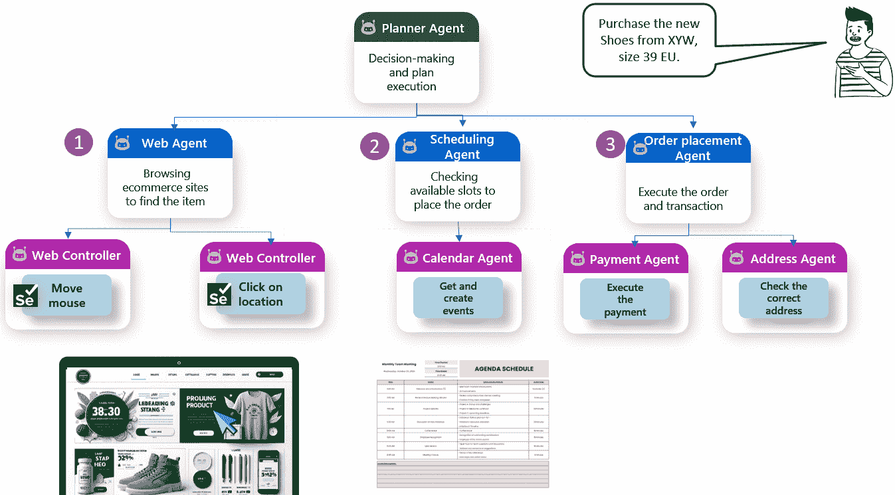

图 7.1：分层多智能体系统的示例

**快速提示**：需要查看此图像的高分辨率版本？请使用下一代 Packt Reader 打开此书或在其 PDF/ePub 副本中查看。

**下一代 Packt Reader**随本书免费赠送。扫描二维码或访问 packtpub.com/unlock，然后使用搜索栏通过名称查找此书。请仔细检查显示的版本，以确保您获得正确的版本。


在单智能体设置中，该智能体会依次搜索鞋子，管理调度，填写地址详情，并处理支付。但在模块化、多智能体设计中，这项任务被分解为专门的组件：

1.  计划智能体解释指令并协调以下执行。

1.  网络智能体浏览电子商务平台，使用低级 Web 控制器智能体（例如，由 Selenium 驱动的机器人）与界面交互——点击、滚动和视觉搜索。

1.  调度代理检查日历来确定配送可用性，调用日历代理获取或创建事件。

1.  订单放置代理通过与以下内容协调来完成购买：

    1.  支付代理，负责安全地处理交易

    1.  地址代理，用于验证和格式化送货地址

每个代理独立运行，但为更大的使命做出贡献。规划代理充当指挥家，协调一支由智能表演者组成的团队：网络代理、调度代理、订单放置代理、网络控制器、日历代理、地址代理和支付代理。

这种方法与我们在前几章中讨论的两个关键概念——模块化和抽象——非常吻合，提供了几个优点：

+   **可扩展性**：多代理系统在设计上自然具有可扩展性。由于每个代理封装了特定的功能或责任，代理可以独立地部署在不同的服务器、容器或甚至地理区域。如果某个代理成为瓶颈（例如，在高峰流量期间的网页抓取代理），它可以水平扩展——复制并负载均衡——而不会影响系统的其余部分。这种分布式特性使得构建随着用户需求增长的人工智能应用变得更容易。

+   **可维护性**：模块化促进了可维护性。因为每个代理都是自包含的，并通过定义的协议或接口进行通信，所以它可以被更新、重构或替换，而无需重写整个系统。例如，用一个更先进的模型（甚至不同的模型提供者）替换摘要代理不会影响处理检索、过滤或用户交互的代理的逻辑。这种关注点的清晰分离使得长期演化和实验更容易且更安全。

+   **专业化**：每个代理都可以使用最适合其工作的最佳工具进行精细调整或构建。一些代理可能使用代码生成型 LLM（如 GPT-4o），而其他代理可能基于检索增强架构或基于规则的逻辑。同样，只要它们遵守共享协议，代理可以用不同的语言（Python、JavaScript 等）或框架开发。这种灵活性允许团队优化性能和成本，为系统的每个组件选择正确的方案。

最后，为了构建和理解多代理系统，我们还必须从两个主要角度转向微服务领域：一个是基础设计，另一个是基础设施模式，它使多代理智能能够真正发挥作用。

**定义**

微服务是一种软件架构模式，其中应用程序被分解为小型、独立的微服务，每个微服务负责单一功能，并通过轻量级协议（如 HTTP 或消息队列）进行通信。这种模块化方法实现了可伸缩性、灵活性和易于维护，为现代分布式系统以及日益增长的多代理人工智能系统奠定了基础。

从设计角度来看，微服务基于模块化的原则——将大型应用程序分解为独立、专业的服务，每个服务都擅长一项任务。这正是代理系统应该设计的方式：

+   每个代理只有一个职责：浏览、调度、订购、验证或支付

+   每个代理就像微服务封装其 API 和数据库访问一样，封装其逻辑和工具

+   代理通过结构化协议（消息、事件和 API）进行通信，允许异步、灵活的协调

您可以替换一个智能代理，或者重新部署一个失败的代理，而不会影响系统的其余部分。

换句话说，多代理设计是将微服务设计应用于人工智能。它强调解耦、专业化和可组合性——现代软件工程的核心原则。

从基础设施的角度来看，微服务为在现实世界中部署和管理基于代理的系统提供了骨干。

每个代理可以是以下之一：

+   容器化（例如，使用 Docker）并作为独立应用程序部署，可以暴露为 API

+   在云原生环境中托管（例如，Kubernetes），独立扩展

+   通过服务网格或消息代理连接，实现安全高效的通信

+   在多语言环境中开发（例如，一个代理可以在 Python 上运行，另一个在 JavaScript 上运行—— whatever suits the task best）

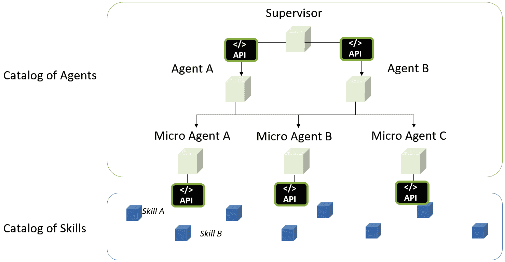

图 7.2：多代理系统的微服务后端

让我们回顾一下*图 7.1*中的示例。规划代理将任务（“购买 39 EU 码的鞋子”）分解为子任务，由模块化代理处理——Web 代理、调度代理、订单放置代理——每个代理都有自己的下游助手（例如，支付代理和地址代理）。

这些代理可以运行如下：

+   独立的微服务，每个部署在 Kubernetes 集群中

+   隔离的无服务器函数，仅在需要时启动

+   具有持久内存和状态的背景服务，通过事件驱动的架构进行编排

没有微服务基础设施，构建、部署和管理这样的分布式代理系统将是脆弱且低效的。正是模块化设计和可扩展托管相结合，使得现实世界的多代理人工智能系统成为可能。

同时，我们还需要定义这些代理之间想要通信的方式，这引出了多代理设计工作流程的主题。

# 理解和设计您多代理系统的不同工作流程

当我们从单代理系统过渡到**多代理架构**时，代理之间的交互方式变得至关重要。不同的工作流程（或者说，换句话说，通信模式）塑造了代理如何协作、共享信息和做出决策。选择正确的工作流程取决于任务的性质、每个代理的角色以及期望的结果。

让我们探索五个核心多代理工作流程（见图*7.3*）：

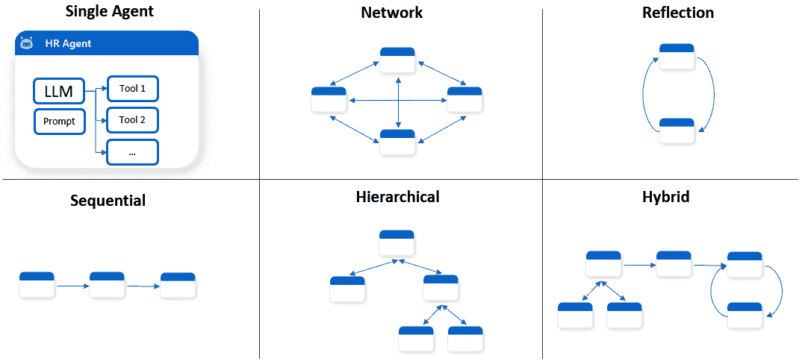

图 7.3：不同类型的代理工作流程

下面是五个核心多代理工作流程的详细说明：

+   **网络**：所有代理在一个完全连接的图中都是对等节点，每个代理可以直接与其他任何代理通信。这允许高度互动、动态的协作。

让我们考虑以下示例。在一个快速发展的初创公司中，一组 AI 代理协作构思、验证和计划一个新移动应用的发布。每个代理都有一个明确的领域，但它们以动态、迭代的模式一起工作，就像一个真正的产品团队：

+   **代理 A—市场研究代理**：此代理持续监控消费者趋势、应用商店数据和竞争对手活动。它发现对 AI 驱动健康应用的兴趣日益增长，并分享一份突出未满足用户需求的报告。

+   **代理 B—产品设计代理**：此代理利用市场研究代理的见解来绘制健康应用的初始概念，包括用户流程和功能原型。它咨询 UX 风格指南并适应以前成功的模式。然后与团队分享这些内容以获取反馈。

+   **代理 C—合规性代理**：一旦提出新的功能想法，此代理就会审查它们，以确定潜在的法律或隐私问题——例如健康数据的处理——并提出修改建议，以使应用符合 GDPR 和 HIPAA。

+   **代理 D—项目经理代理**：此代理跟踪任务之间的进度和依赖关系。它提出时间表并标记风险，例如可能需要额外合规性批准的设计功能。它还在决策悬而未决或任务阻碍他人时推动团队。

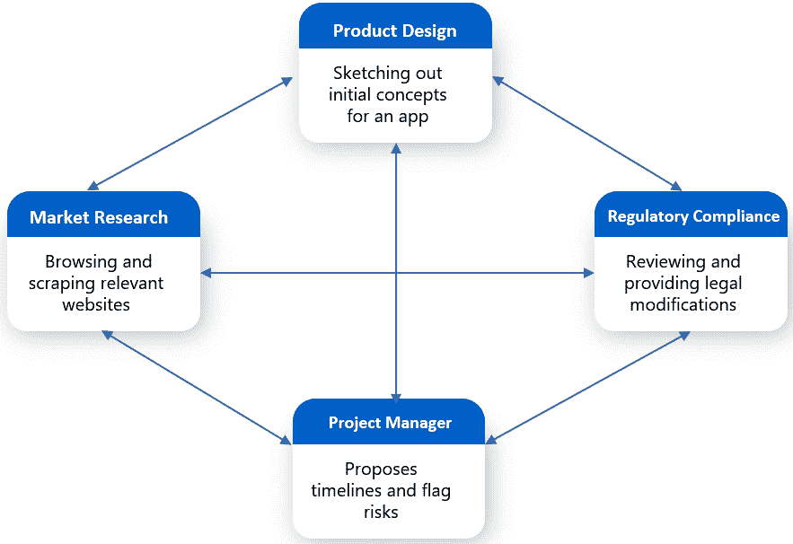

图 7.4：网络工作流程

如*图 7.4*所示，此设置模仿了跨职能敏捷团队，它们依靠持续的协调和快速反馈而蓬勃发展。

+   **反思**：一个自我评估的循环，其中代理对其自己的输出进行反思或批评（或者由另一个代理这样做），通过反馈实现迭代改进。例如，考虑一个希望使用写作助手生成科学论文草稿的大学研究小组。主要代理产生内容，而“审稿人”代理评估清晰度、逻辑和引用准确性。它标记薄弱的论点或缺失的参考文献。

第一个代理随后相应地修改文本，并重新提交以供审查。这个过程会重复进行，直到输出达到出版质量。

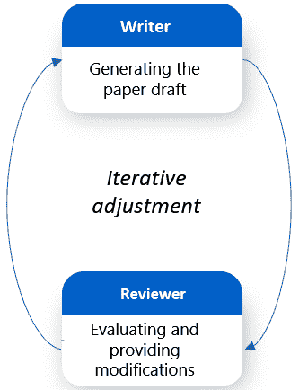

图 7.5：反思工作流程

反思工作流程对于质量控制以及 refinement 与生成同样重要的任务非常有效。

+   **顺序型**：代理以线性管道的形式组织。每个代理执行特定任务，并将输出传递给链中的下一个代理。例如，考虑一个媒体机构使用一系列专业代理自动创建和发布突发新闻文章的过程：

    +   **代理 A—新闻聚合代理**：监控新闻专线、社交媒体和新闻稿的实时流，以识别新兴故事。它选择一个突发新闻事件并提取相关事实。

    +   **代理 B—事实核查代理**：将收集到的信息与政府数据库、先前新闻报道和知识图谱等可信来源进行验证。它标记任何差异，并在故事进展之前确保准确性。

    +   **代理 C—作家代理**：使用经过验证的数据撰写引人入胜的新闻文章，遵循新闻风格和出版标准。

    +   **代理 D—SEO 和社交优化代理**：优化文章标题，添加元描述、标签，并调整格式以在搜索引擎和社交平台上实现最大覆盖范围。

    +   **代理 E—发布代理**：在网页、移动和新闻通讯平台上安排和发布文章。

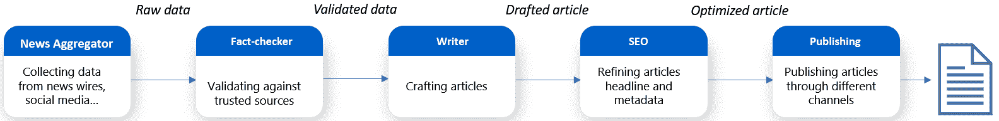

图 7.6：顺序型工作流程

使用这种工作流程，你将绝对对你的代理有更多的控制，因为你正在给他们一个明确的执行顺序。

+   **分层型**：管理代理监督并委派任务给下属代理，并汇总他们的输出。沟通通常自上而下和自下而上进行。例如，考虑一家 SaaS 公司部署分层 AI 系统用于客户服务。当客户提交查询，例如“为什么这个月我被收费两次？”时，**管理代理**解析请求并委派子任务：

    +   **计费代理**检查交易历史。

    +   **技术代理**检查系统日志中的重复收费。

    +   **FAQ 代理**检查是否为已知问题。一旦每个下属做出回应，经理就会汇编并交付一个连贯、统一的答案。这种设置反映了现实世界中的管理，促进了模块化和专业处理。

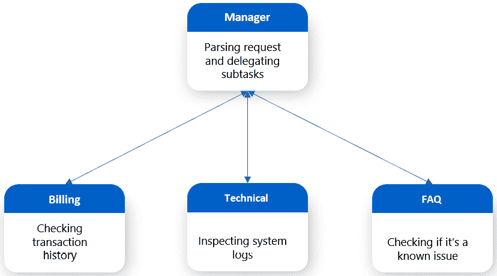

图 7.7：分层工作流程

如果执行顺序事先不清楚（与顺序模式不同），但仍然希望在上层保持一定程度的监控（与网络模式不同），则此模式特别适用。

+   **混合模式**：结合多个模式（例如，具有反射回路的分层骨干或嵌入网络的顺序步骤），允许灵活、分层的协作。让我们回顾一下在顺序架构中讨论的媒体发布流程，并在其中一步添加一个分层转折：

    +   **代理 A—新闻聚合器**：监控新闻社、社交媒体和新闻稿的实时流，以识别新兴故事。它选择一个突发新闻事件并提取相关事实。

    +   **代理 B—编辑经理**：负责处理已识别的故事，并担任副主编。它不是直接撰写文章，而是管理一组代理：

        +   **作家代理**：根据可用事实生成初稿

        +   **风格代理**：确保语气、语法和格式符合出版物的编辑指南

        +   **事实核查代理**：使用可靠的数据库交叉验证声明，并报告结果

    编辑经理代理监督这些代理，审查他们的工作，并在将其传递之前编译文章的最终版本。

    +   **代理 C—发布代理**：准备最终文章以供在线分发，添加标签和 SEO 元数据，并将其发布到新闻网站和社交媒体平台。

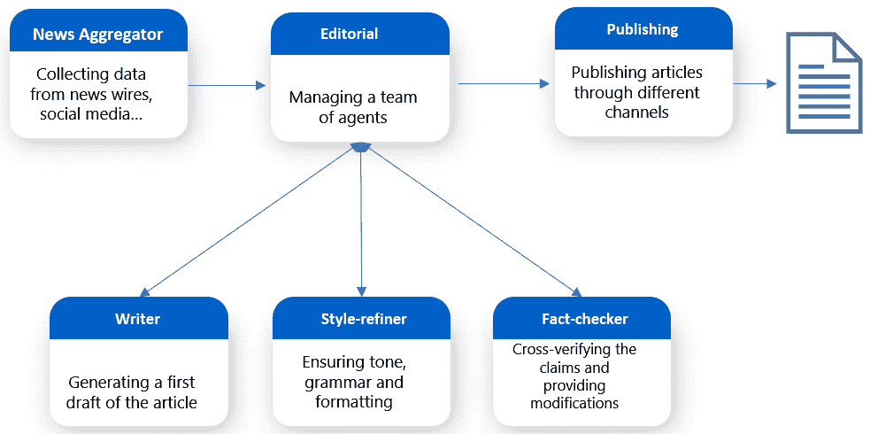

图 7.8：混合模式

这种混合结构为原本线性的流程增加了**灵活性**和**质量控制**。由编辑经理管理的分层子结构允许专业化并保持稳健，同时不会打断整体的任务流程。

在前面的章节中，我们探讨了在处理单个 AI 代理时拥有 AI 排程器的重要性，以便我们能够正确设计它们与工具交互的方式。当涉及到多代理系统时，AI 排程器变得更加重要，因为它们不仅需要管理单个代理与工具的交互，还需要管理多个代理之间的交互。

在下一节中，我们将探讨一些最受欢迎的多代理编排器。

# 多代理编排器概述

随着我们探讨了从单代理系统到协作多代理架构的演变，很明显，协调多个智能代理需要强大的编排。因此，对 AI 排程器的需求比以往任何时候都更加迫切。

当涉及到多代理应用时，还有一些额外的编排器值得探索，以适应您的场景。

## AutoGen

**AutoGen**，由微软开发，是一个开源框架，通过对话交互促进多代理系统的创建。它强调设计能够通信、协作和适应以完成复杂任务的代理。

该框架采用分层、模块化架构，其中每一层都有明确的职责，并建立在底层层的功能之上。这种结构允许开发者以不同复杂度级别与系统交互，从适合快速开发的高级抽象到提供精细控制的底层组件。

+   **核心 API**：在基础层面，核心 API 管理代理之间的消息传递、事件驱动行为，并为本地和分布式部署提供运行时支持。它旨在提供最大灵活性，甚至支持 Python 和.NET 环境之间的跨语言互操作性。

+   **AgentChat API**：位于核心层之上，AgentChat API 提供了一个更高层次、具有明确观点的接口，专注于易用性和快速原型设计。它简化了常见的模式，如双代理对话和群体交互，使得从框架早期版本过渡的用户感到熟悉。

+   **扩展 API**：最顶层允许通过官方和第三方扩展不断增强框架。这包括与流行的 LLM 提供商（如 OpenAI 和 Azure OpenAI）的集成，以及外部代码执行和工具使用等高级功能。

除了框架本身，AutoGen 还提供开发工具，包括一个无需代码的 GUI 工具 AutoGen Studio 和一个基准测试套件 AutoGen Bench。

AutoGen 非常适合自动化客户支持、协作内容创作和需要代理共同协商、规划和执行任务的复杂问题解决场景。

## TaskWeaver

TaskWeaver 是由微软开发的以代码优先的代理框架，旨在规划和执行复杂的数据分析工作流程。该框架的主要区别在于其代码驱动的执行：TaskWeaver 将用户请求解释为可执行的代码片段并执行它们，无缝协调多个功能或插件。此外，与主要关注基于文本的对话历史的传统代理系统不同，TaskWeaver 将聊天历史与代码执行历史和内存中的数据状态相结合，使其非常适合处理结构化、高维数据，如表格和数据库。

TaskWeaver 的关键特性包括以下内容：

+   **复杂任务规划和反思执行**：TaskWeaver 使智能任务分解、进度跟踪和反思执行成为可能，允许代理根据执行反馈动态调整其策略。

+   **丰富的数据处理和有状态执行**：该框架支持使用丰富的 Python 数据结构，如 DataFrames，在任务之间维护计算状态，并通过在执行前验证生成的代码来确保一致的用户体验。

+   **可定制、可扩展和安全的**：开发者可以轻松使用特定领域的插件扩展 TaskWeaver，封装自定义算法，并通过会话隔离和安全的代码执行安全地管理多代理工作流程。

+   **开发者友好且透明**：TaskWeaver 提供了一个简单的设置体验，包括现成的插件、详细的日志记录以方便调试，以及开放透明的架构，有助于用户理解和控制整个执行过程。

由于其代码驱动的方法和对结构化数据的强大支持，TaskWeaver 特别适合数据密集型应用、分析工作流程、科学研究、金融建模以及任何需要精确性、可重复性和执行透明度的环境。

## OpenAI 代理 SDK

OpenAI 代理 SDK 是一个轻量但强大的框架，旨在简化构建和编排多代理工作流程。由 OpenAI 开发，它提供了一种模块化的方法来连接代理，分配工具，应用安全措施，并在它们之间无缝转移控制。

它是提供商无关的，这意味着它可以与 OpenAI 的 API 一起工作，但也可以与 100 多种不同的 LLM 兼容，使其对不同 AI 后端具有极高的灵活性。

代理 SDK 的关键特性包括以下内容：

+   **代理协作的移交**：OpenAI 代理引入了移交——一种基于任务上下文的清晰、一等机制，用于在代理之间传递控制，使多代理协作直观且自然。

+   **内置安全措施**：安全性是一个核心关注点；您可以定义输入验证、输出检查和自定义约束的安全措施，提高工作流程的可靠性和道德行为。

+   **原生跟踪和调试工具**：SDK 包含内置的跟踪支持，允许您可视化代理交互，监控执行路径，并轻松调试多代理工作流程，这对于透明度和优化至关重要。

+   **简单、快速 API**：代理易于定义（名称、指令和工具），并且可以通过最小化样板代码组合成复杂的工作流程。它旨在快速原型设计，同时不牺牲深度。

+   **多提供商支持**：虽然它与 OpenAI 的模型紧密集成，但并非锁定——您可以轻松连接到其他模型提供商，满足多样化的部署需求。

总体而言，OpenAI 代理 SDK 使开发者能够构建智能的多代理系统，这些系统能够推理、委派任务，并自主地与工具交互。

## LangGraph

LangGraph 是 LangChain 生态系统的扩展，旨在通过基于图的架构编排多代理系统。

**定义**

在数学中，图是由节点（也称为顶点）通过边连接的结构，用于模拟对象对之间的关系或连接。图在网络理论、计算机科学和组合数学等领域的应用是基础性的。

在 LangGraph 的上下文中，通过以下元素使用图来建模 AI 工作流程：

+   **节点**：在 LangGraph 中，每个节点代表工作流程中的特定任务或操作。节点可以是 LLM 代理、工具或自定义函数，执行诸如文档检索、数据处理、文本生成或基于输入的决策等动作。

+   **边**：边定义了控制数据和节点之间的移动方式，决定了执行顺序。它们还可以包含条件逻辑，允许工作流程根据状态或先前节点的输出动态路由。

+   **状态**：状态是一个在执行过程中跨越节点共享的数据结构。它携带必要的上下文信息，例如消息、中间结果或相关的元数据，节点使用这些信息来执行其任务并协调动作。

+   **条件逻辑**：LangGraph 通过条件边实现动态决策。这些边评估当前状态以确定下一步，支持工作流程中的分支、循环和实时调整。

+   **工作流程编译**：一旦定义，LangGraph 将节点、边和条件逻辑编译成一个可执行的图。这个编译后的工作流程管理执行顺序、状态转换和节点间的协调，确保任务高效且可靠地执行。

例如，在*图 7.9*中，你可以看到一个 LangGraph 工作流程，其中我们有一个决定是否需要网络代理的第一个条件边；然后，根据输出，它决定查询是否需要重写，或者可以直接显示给最终用户作为最终结果。

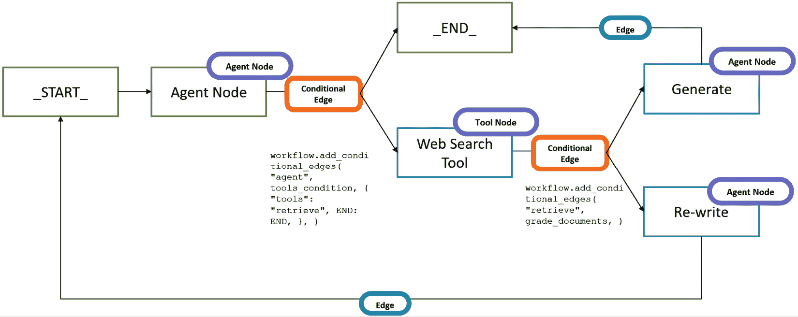

图 7.9：LangGraph 工作流程示例

通过结合这些元素，LangGraph 允许开发者构建模块化、可重用和动态的工作流程，这些工作流程能够支持复杂的智能体交互和基于 LLM 和外部工具的复杂决策。

在 AutoGen、TaskWeaver、智能体 SDK 或 LangGraph 之间没有绝对的“最佳”编排器。每个都设计有不同的哲学和优势，正确的选择在很大程度上取决于你的具体用例、你的技术偏好以及你打算构建的工作流程的复杂性。有些人偏好轻量级、快速原型设计；而其他人则在编排多个智能体之间的复杂、有状态交互方面表现出色。

在下一节中，我们将利用 LangGraph 进行我们的动手实践案例，探索如何通过基于图的编排逐步构建多智能体系统。

# 使用 LangGraph 构建您的第一个多智能体应用程序

是时候动手实践了！在本节中，我们将利用 LangGraph 构建一个多智能体应用程序。请注意，我不会在这里包含整个代码，而是只包含理解智能体构建块的相关部分。您可以在本书的 GitHub 仓库中找到完整的代码：[`github.com/PacktPublishing/AI-Agents-in-Practice`](https://github.com/PacktPublishing/AI-Agents-in-Practice)。

让我们介绍我们希望通过我们的多智能体应用程序解决的问题。

管理投资组合是一项复杂的任务，需要持续关注市场趋势、资产表现和风险敞口。许多个人投资者和财务顾问都难以手动分析大量财务数据以做出明智的决定。该应用程序旨在通过使用一组智能代理来分析用户的投资组合、提取相关的市场洞察力并提供可操作的推荐来减轻这一挑战。

目标是提供一份全面的报告——自动生成——帮助用户优化投资以获得更好的回报或降低风险。为了演示目的，我们将假设投资组合以 JSON 文件的形式表示，结构如下：

```py
[
    {
        "symbol": "AAPL",
        "sector": "Technology",
        "quantity": 13,
        "purchase_price": 1202.57,
        "total_invested": 15633.41,
        "purchase_date": "2022-03-12"
    },…
…] 
```

**快速提示**：使用**AI 代码解释器**和**快速复制**功能增强您的编码体验。在下一代 Packt Reader 中打开此书。点击**复制**按钮

（**1**）快速将代码复制到您的编码环境，或点击**解释**按钮

（**2**）让 AI 助手为您解释一段代码。


**下一代 Packt Reader**随本书免费赠送。扫描二维码或访问 packtpub.com/unlock，然后使用搜索栏通过名称查找此书。请仔细核对显示的版本，以确保您获得正确的版本。


为了完成这个任务，我们开发了一个具有以下结构的多智能体应用程序：

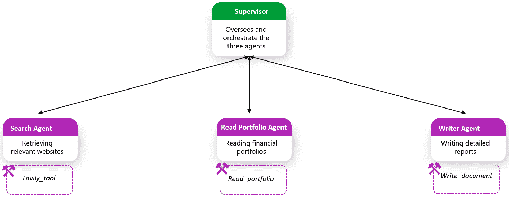

图 7.10：分层多智能体投资组合分析器

让我们根据*图 7.10*所示逐一检查每个组件：

+   **search_agent**：专门用于检索相关网站以回答用户的问题，并提供了以下工具：

    +   **tavily_tool**：LangChain 中可用的预构建工具，专门设计用于从 Tavily API 检索搜索结果

        **定义**

        Tavily 是一个由人工智能驱动的搜索 API，旨在通过提供实时、高质量的网页搜索结果来增强**检索增强生成**（**RAG**）和基于代理的应用程序。它允许开发者通过简单、快速且成本效益高的 API 调用将外部知识集成到 LLM 工作流程中。Tavily 通常用于通过将它们基于最新的网络内容来提高 AI 生成响应的准确性和相关性。

让我们初始化这个代理，从工具的初始化开始：

```py
# Load environment variables from .env file
load_dotenv()
# Initialize the Azure OpenAI model
llm = AzureChatOpenAI(
    openai_api_version=openai_api_version,
    azure_deployment=azure_chat_deployment,
)
tavily_tool = TavilySearchResults(max_results=5, 
    tavily_api_key=tavily_api_key) 
```

现在，我们可以创建代理并将其初始化为 LangGraph 图中的节点：

```py
search_agent = create_react_agent(llm, tools=[tavily_tool])
def search_node(state: State) -> Command[Literal["supervisor"]]:
    result = search_agent.invoke(state)
    return Command(
        update={
            "messages": [
                HumanMessage(
                    content=result["messages"][-1].content, 
                    name="search")
            ]
        },
# We want our workers to ALWAYS "report back" to the supervisor when done
        goto="supervisor",
    ) 
```

+   **read_portfolio_agent**：专门从提供的路径读取投资组合，并提供了以下工具：

    +   **read_portfolio**：读取保存为`JSON`文件的金融投资组合的硬编码函数

让我们初始化工具和代理：

```py
@tool
def read_sample_portfolio(
    json_path: str = "sample_portfolio.json"
) -> str:
    """
    Reads the sample_portfolio.json file and returns its content as a string.
    Each entry includes the stock symbol, sector, quantity, purchase price, and purchase date.
    """
    if not os.path.exists(json_path):
        return f"File not found: {json_path}"
    with open(json_path, "r") as f:
        portfolio = json.load(f)
    if not isinstance(portfolio, list):
        return "Unexpected portfolio format."
    response = "Sample Portfolio:\n"
    for stock in portfolio:
        response += (
            f"- {stock['symbol']} ({stock['sector']}): "
            f"{stock['quantity']}shares @${stock['purchase_price']}"
            f"(Bought on {stock['purchase_date']})\n"
        )
    return response
read_portfolio_agent = create_react_agent(
    llm, tools=[read_sample_portfolio]
)
def read_portfolio_node(
    state: State
) -> Command[Literal["supervisor"]]:
    result = read_portfolio_agent.invoke(state)
    return Command(
        update={
            "messages": [
                HumanMessage(content=result["messages"][-1].content, 
                name="read_portfolio")
            ]
        },
        # We want our workers to ALWAYS "report back" to the supervisor when done
        goto="supervisor",
    ) 
```

+   **doc_writer_agent**：专门编写具有结构化大纲的详细报告，并提供了以下工具：

    +   **write_document**：将代理的结果写入预定义目录的硬编码函数

让我们初始化工具和代理：

```py
from pathlib import Path
from tempfile import TemporaryDirectory
from typing import Dict, Optional
from typing_extensions import TypedDict
# Define a real directory path
REAL_DIRECTORY = Path(r"your_path")
#_TEMP_DIRECTORY = TemporaryDirectory()
WORKING_DIRECTORY = Path(REAL_DIRECTORY)
@tool
def write_document(
    content: Annotated[
        str, "Text content to be written into the document."],
    file_name: Annotated[str, "File path to save the document."],
) -> Annotated[str, "Path of the saved document file."]:
    """Create and save a text document."""
    with (WORKING_DIRECTORY / file_name).open("w") as file:
        file.write(content)
    return f"Document saved to {file_name}"
report_prompt = """
You are an expert report generator. Given the input from other agents, you generate a detailed report on how to optimize the provided portfolio.
The report will have the following outline:
-------------------------------
**Introduction on market landscape**
**Portfolio Overview**
**Investment Strategy**
**Performance Analysis**
**Recommendations**
**Conclusion**
**References**
--------------------------------
Once the report is generated, save it using your write_document tool.
"""
doc_writer_agent = create_react_agent(
    llm,
    tools=[write_document],
    prompt=report_prompt,
)
def doc_writing_node(state: State) -> Command[Literal["supervisor"]]:
    result = doc_writer_agent.invoke(state)
    return Command(
        update={
            "messages": [
                HumanMessage(content=result["messages"][-1].content, 
                    name="doc_writer")
            ]
        },
        # We want our workers to ALWAYS "report back" to the supervisor when done
        goto="supervisor",
    ) 
```

现在我们已经初始化了所有三个代理，是时候在更高层次上添加另一个抽象级别了。为此，我们将创建一个团队监督角色，该角色将根据用户的查询调用团队：

```py
class State(MessagesState):
    next: str
def make_supervisor_node(llm: BaseChatModel, members: list[str]) -> str:
    options = ["FINISH"] + members
    system_prompt = (
        "You are a supervisor tasked with managing a conversation between the"
        f" following workers: {members}. Given the following user request,"
        " respond with the worker to act next. Each worker will perform a"
        " task and respond with their results and status. When finished,"
        " respond with FINISH."
    )
    class Router(TypedDict):
        """Worker to route to next. If no workers needed, route to FINISH."""
        next: Literal[*options]
    def supervisor_node(state: State) -> Command[
        Literal[*members, "__end__"]
    ]:
        """An LLM-based router."""
        messages = [
            {"role": "system", "content": system_prompt},
        ] + state["messages"]
        response = llm.with_structured_output(Router).invoke(messages)
        goto = response["next"]
        if goto == "FINISH":
            goto = END
        return Command(goto=goto, update={"next": goto})
    return supervisor_node
supervisor_node = make_supervisor_node(llm, 
    ["search","read_portfolio", "doc_writer"]
) 
```

现在，我们可以编译图：

```py
# Define the graph.
builder = StateGraph(State)
builder.add_node("supervisor", supervisor_node)
builder.add_node("read_portfolio", read_portfolio_node)
builder.add_node("search", search_node)
builder.add_node("doc_writer", doc_writing_node)
builder.add_edge(START, "supervisor")
super_graph = builder.compile() 
```

让我们测试它：

```py
for s in super_graph.stream(
    {
        "messages": [
            ("user", "Generate a well structured report on how to improve my portfolio given the market landscape in Q4 2025.")
        ],
    },
    {"recursion_limit": 150},
):
    print(s)
    print("---") 
```

这里是截断的输出：

```py
{'supervisor': {'next': 'search'}}
---
{'search': {'messages': [HumanMessage(content='**Portfolio Improvement Report Based on Market Landscape Q4 2025**\n\n---\n\n### 1\. **Market Landscape Highlights for Q4 2025:**\nThe market trends observed for Q4 2025 suggest:\n- **Elevated Interest Rates:** Policy rates in developed markets, particularly in the US, are expected to remain high. This "higher-for-longer" rate narrative creates opportunities for varied asset positioning.\n- **Equity Market Dispersion:[...]]}}
---
{'supervisor': {'next': 'read_portfolio'}}
---
{'read_portfolio': {'messages': [HumanMessage(content='### Portfolio Improvement Report: Alignment with Market Landscape Q4 2025  \n\n---\n\n#### Portfolio Overview\nYour existing portfolio demonstrates strong exposure to technology (AAPL, GOOGL, MSFT, NVDA), consumer discretionary (AMZN, TSLA, BABA), and financials (V, JPM). [...]]}}
---
{'supervisor': {'next': 'doc_writer'}}
---
{'doc_writer': {'messages': [HumanMessage(content='The report on optimizing your portfolio for Q4 2025 has been successfully generated and saved. You can find it in the file named **Portfolio_Optimization_Q4_2025.txt**. Let me know if you need further assistance or any modifications!', additional_kwargs={}, response_metadata={}, name='doc_writer', id='8fa9e6a9-fafc-466c-8bbc-19514654c3be')]}}
---
{'supervisor': {'next': '__end__'}} 
```

您将在指定的文件夹下找到您的文件（在我的情况下，*outputs*）。

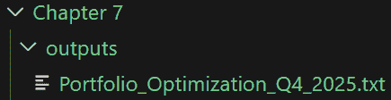

图 7.11：我在本地文件夹中创建的.txt 文件示例

这里是输出：

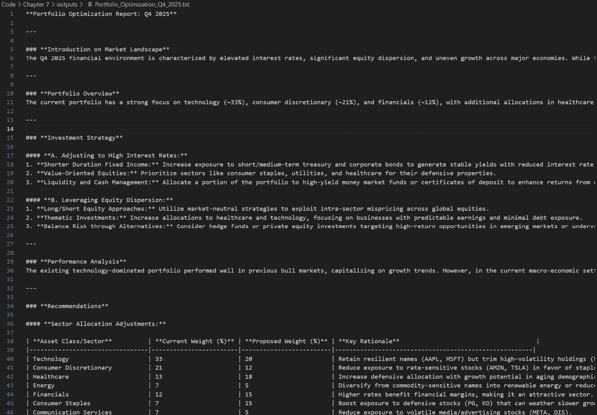

图 7.12：代理生成的最终报告示例

如您所见，输出遵循我们在报告生成代理中指定的系统消息大纲。

# 摘要

在本章中，我们超越了单个、工具增强代理的世界，探索了多代理系统的激动人心的领域。我们看到了代理如何像人类团队一样协作，每个代理都专注于自己的任务，但共同工作以解决单个代理单独难以解决的问题。

我们还确定，设计多代理系统既是架构挑战，也是人工智能挑战，需要仔细考虑模块化、通信、协调和可靠性。与微服务架构进行类比，我们认识到代理可以（并且应该）是模块化的、独立的，并且可以智能地编排以形成可扩展、健壮的系统。

我们介绍了多代理编排器，如 AutoGen、TaskWeaver 和 LangGraph，并使用后者进行了实际演示，构建了我们的第一个多代理应用程序。

本章还总结了本书的**第二部分**。在下一章中，我们将转换方向，探讨一个关键主题——构建负责任的 AI 系统。随着我们创建越来越自主的代理和多智能体生态系统，设计安全性、透明度、安全性和道德一致性变得至关重要。

# 参考文献

+   LangGraph: [`www.langchain.com/langgraph`](https://www.langchain.com/langgraph)

+   基于 LangGraph 的多智能体系统: [`langchain-ai.github.io/langgraph/concepts/multi_agent/`](https://langchain-ai.github.io/langgraph/concepts/multi_agent/)

+   LangGraph 代理概念: [`langchain-ai.github.io/langgraph/concepts/agentic_concepts/`](https://langchain-ai.github.io/langgraph/concepts/agentic_concepts/)

+   OpenAI 代理 SDK: [`github.com/openai/openai-agents-python`](https://github.com/openai/openai-agents-python)

+   AutoGen: [`github.com/microsoft/autogen`](https://github.com/microsoft/autogen)

+   TaskWeaver: [`github.com/microsoft/TaskWeaver`](https://github.com/microsoft/TaskWeaver)

|

#### 现在解锁本书的独家优惠

扫描此二维码或访问 packtpub.com/unlock，然后通过书名搜索此书 |  |

| *注意：在开始之前，请准备好您的购买发票。* |
| --- |
