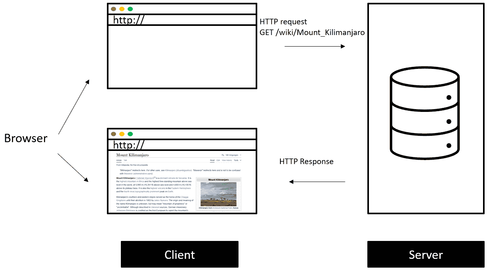
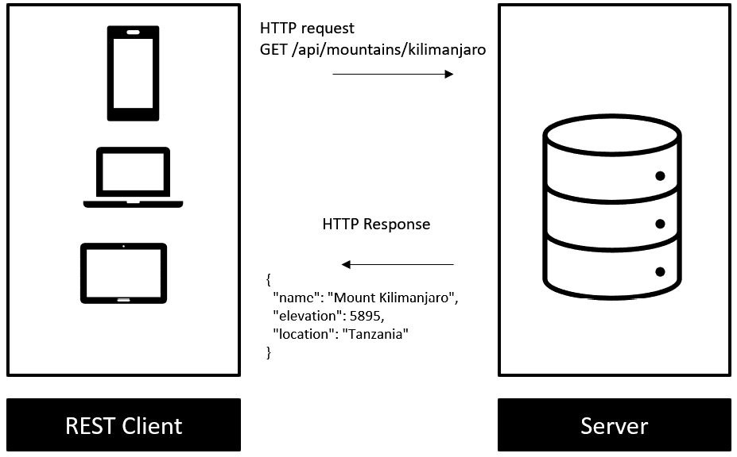
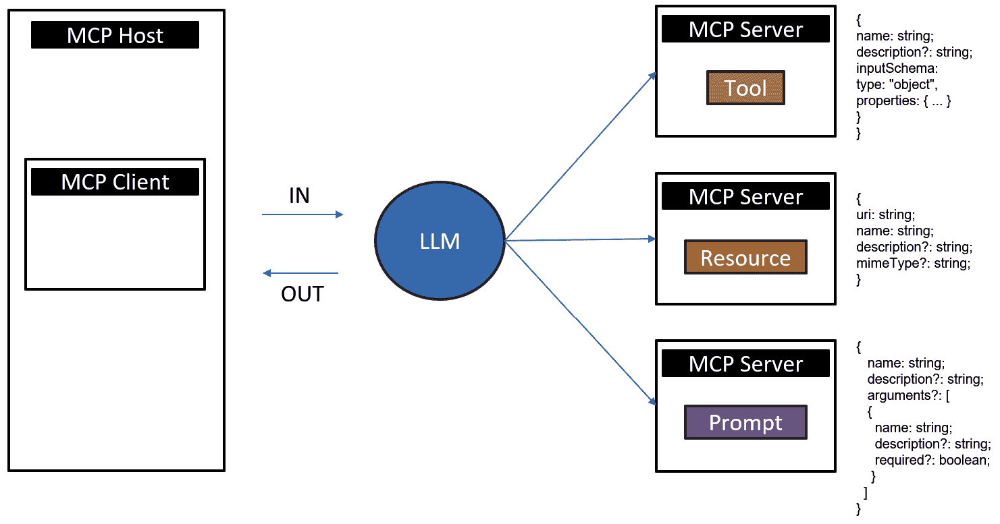
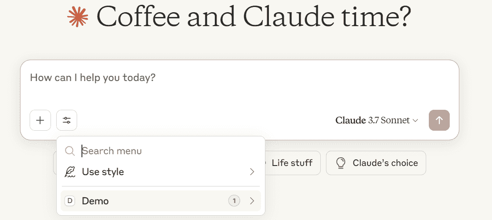
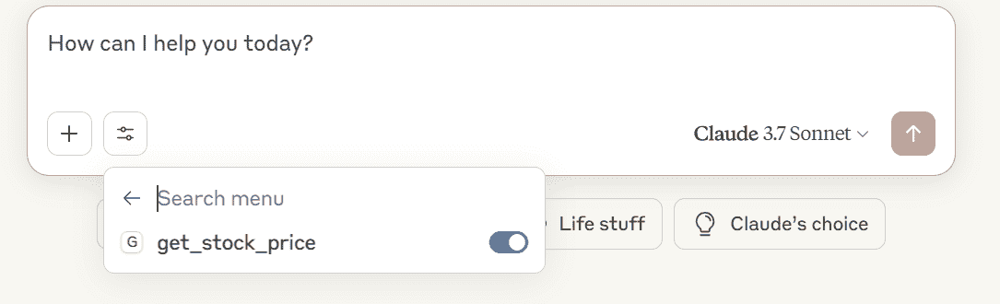
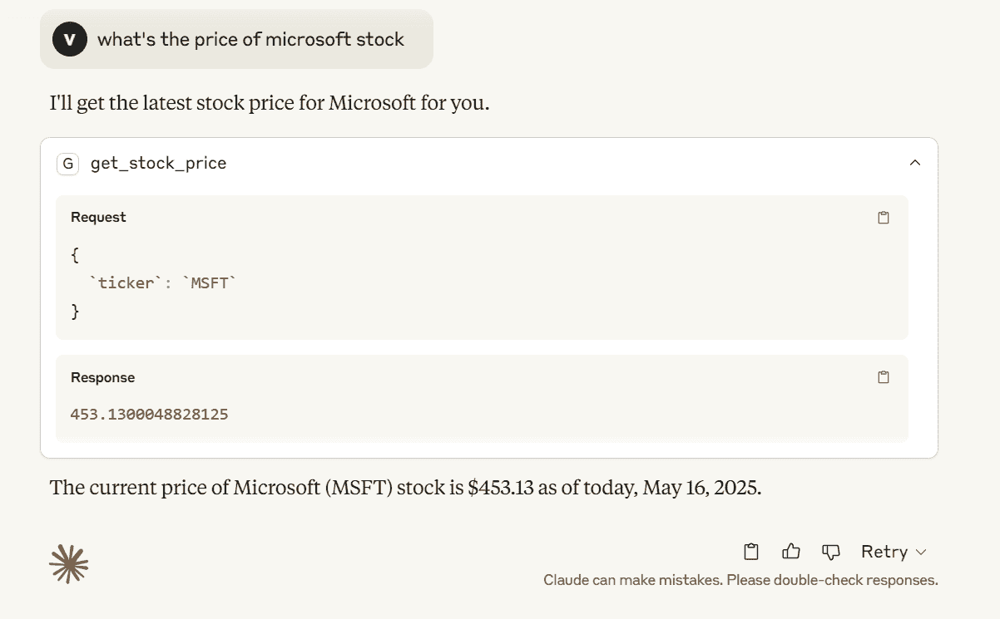
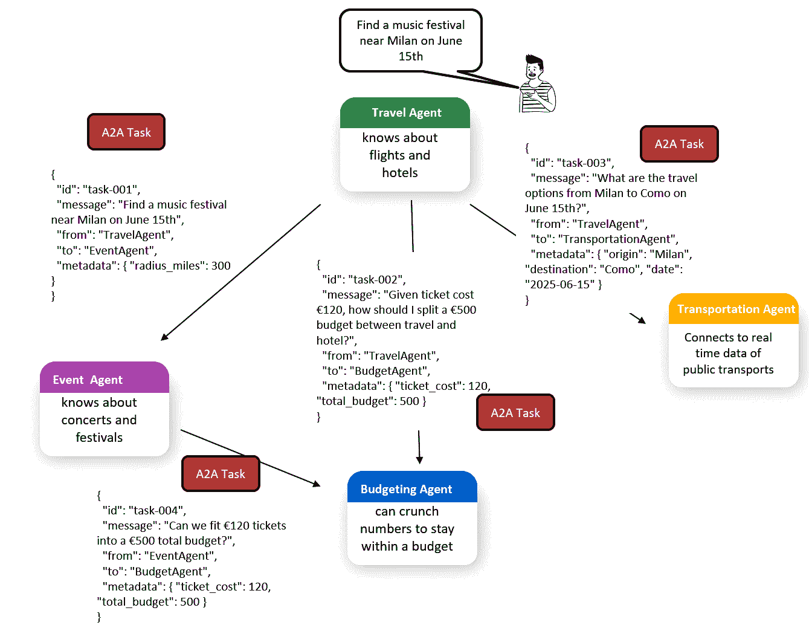
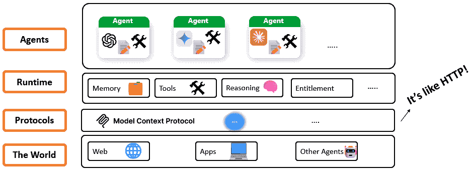

# 8

# 编排智能：下一代代理协议的蓝图

在人工智能（AI）发展的演变格局中，协议正迅速成为连接模型、工具和外部系统的连接组织。在最近几个月，我们看到了围绕旨在增强智能代理之间互操作性和协调的新协议的活动激增。其中最突出的是 Anthropic 的**模型上下文协议（MCP**）、Google 的**代理到代理（A2A**）和 Virtuals 的**代理商业协议（ACP**）。

初看之下，这些可能只是已经拥挤的人工智能生态系统中的又一波框架。毕竟，像 LangChain、Semantic Kernel 和 AutoGen 这样的框架长期以来都承诺提供可重用、模块化的 AI 组件，如插件、工具、提示和代理。但协议在抽象的不同层面上运作。虽然编排器帮助构建和控制智能工作流程，但协议定义了这些组件如何在系统之间进行通信，提供一致性、结构和治理。

在本章中，我们将彻底研究 MCP、A2A 和 ACP 协议，以及它们如何为一种新的消费方式铺平道路，不仅限于应用程序，还包括整个网络，引入了开创性的代理网络概念。

本章将涵盖以下关键主题：

+   什么是协议？

+   理解模型上下文协议

+   代理到代理

+   代理商业协议

+   向代理网络迈进

在深入研究这些主题之前，首先理解协议的基本概念是至关重要的。

# 技术要求

本章中所需的所有代码和必要的依赖项都列在本书官方 GitHub 仓库中的`requirements.txt`文件中，网址为[`github.com/PacktPublishing/AI-Agents-in-Practice`](https://github.com/PacktPublishing/AI-Agents-in-Practice)。

要设置您的环境，只需克隆仓库并遵循 README 文件中的说明。

或者，您可以从零开始，并遵循官方 MCP Python SDK 仓库中的快速入门指南：[`github.com/modelcontextprotocol/python-sdk`](https://github.com/modelcontextprotocol/python-sdk)。

# 什么是协议？

**协议**简单地说是一套规则，定义了两个或多个系统如何通信。最熟悉的例子是 HTTP——您的浏览器用来与网站通信的协议。当您访问一个 URL 时，您的浏览器会发送一个结构化的 HTTP 请求，服务器会响应一个页面或数据。

假设您访问了乞力马扎罗山的维基百科页面。您的浏览器会发送以下内容：

```py
GET /wiki/Mount_Kilimanjaro HTTP/1.1
Host: en.wikipedia.org
User-Agent: Mozilla/5.0 (Windows NT 10.0; Win64; x64) AppleWebKit/537.36 (KHTML, like Gecko) Chrome/125.0.0.0 Safari/537.36
Accept: text/html,application/xhtml+xml,application/xml;q=0.9,image/webp,*/*;q=0.8
Accept-Language: en-US,en;q=0.5
Connection: keep-alive 
```

服务器响应一个 HTML 页面，您的浏览器会渲染它：



图 8.1：浏览器渲染网页

现在，想象一下，您只想显示数据，而不是整个页面。这就是**表示状态传输**（**REST**）API 发挥作用的地方。REST API 允许应用程序通过 HTTP 以机器可读的格式交换数据。客户端可能会发送以下内容：

```py
GET /api/mountains/kilimanjaro 
```

他们可能会收到以下内容：

```py
{
  "name": "Mount Kilimanjaro",
  "elevation": 5895,
  "location": "Tanzania"
} 
```

**快速提示**：使用**AI 代码解释器**和**快速复制**功能增强您的编码体验。在下一代 Packt Reader 中打开此书。点击**复制**按钮

（**1**）快速将代码复制到您的编码环境，或点击**解释**按钮

（**2**）让 AI 助手为您解释一段代码。


**下一代 Packt Reader**随本书免费赠送。扫描二维码或访问 packtpub.com/unlock，然后使用搜索栏通过名称查找此书。仔细检查显示的版本，以确保您获得正确的版本。


下图说明了这一过程：



图 8.2：REST API 请求示例

这一相同的原则——通过标准协议进行结构化通信——是 MCP 等新 AI 原生协议的核心。

# 理解模型上下文协议

**MCP** 是一个基础协议，旨在标准化 LLMs 与外部工具、数据源和工作流程的交互方式。就像 Web 中的 HTTP 一样，MCP 为 AI 代理提供了一个统一和一致的接口，用于查询和调用模型本身之外的能力。

在 MCP 之前，AI 工具领域是碎片化的：

+   **碎片化编排器**：LangChain、AutoGen 和 Semantic Kernel 等框架提供自己的工具注册表和代理逻辑，但缺乏工具调用的共享标准

+   **自定义集成**：每个系统都使用定制代码集成工具，这使得重用和互操作性变得困难

+   **供应商依赖性**：编排器与供应商的 API 紧密耦合，这些 API 可能会不可预测地发生变化

+   **没有通用协议**：没有通用的方法让代理和模型在主机和平台之间发现、描述或调用工具

MCP 通过引入客户端-服务器架构并标准化工具和资源接口来解决这些限制。

从架构角度来看，MCP 由以下组件组成：

+   **MCP 主机**：运行 LLM 并促进通信的 AI 应用程序或环境。例如，包括 Claude Desktop、GitHub Copilot 和 Cursor。

+   **MCP 服务器**：一个外部服务，以结构化、可发现的方式公开工具、资源或提示。

+   **MCP 客户端**：主机内部的一个组件，连接到一个或多个 MCP 服务器。它处理协议消息和路由。



图 8.3：MCP 组件

与传统客户端硬编码工具逻辑不同，MCP 允许 LLM 根据用户意图，通过基于 JSON-RPC 的功能调用选择调用哪个服务器。

**定义**

**JSON-RPC 2.0**是一种轻量级、无状态的协议，用于通过**远程过程调用**（**RPC**）在系统之间进行结构化通信。它使用 JSON 来编码请求和响应，允许一个系统调用另一个系统公开的函数，并以一致格式接收结果或错误消息。

典型的 JSON-RPC 请求看起来像这样：

```py
{
  "jsonrpc": "2.0",
  "method": "get_stock_price",
  "params": { "ticker": "AAPL" },
  "id": 1
} 
```

一个有效的响应看起来像这样：

```py
{
  "jsonrpc": "2.0",
  "result": 189.23,
  "id": 1
} 
```

MCP 使用 JSON-RPC 2.0 来结构化请求和响应。它支持多种传输方式（包括 HTTP 和 STDIO），并且 MCP 服务器甚至可以将传统的 REST API 包装起来，将标准化的 MCP 请求转换为自定义的后端逻辑。

MCP 将能力分为三种服务器类型：

+   **工具**：工具是 AI 模型可以调用的可执行函数，以执行特定操作，例如检索股票价格、转换格式或查询 API。这些工具使用 JSON 模式进行描述，使它们对模型来说是可发现的，并且可以安全地调用。

例如，这里可以看到上述工具的 JSON 定义：

```py
{
  "name": "get_stock_price",
  "description": "Fetch the latest stock price",
  "inputSchema": {
    "type": "object",
    "properties": {
      "ticker": { "type": "string" }
    }
  }
} 
```

此架构允许 LLM 理解需要哪些输入以及工具执行什么操作。工具定义促进了不同主机之间的一致性和可重用性。

+   **资源**：资源代表 AI 模型可能需要检索和使用的数据结构化对象，例如文档、JSON 数据集或数据库输出。例如，一个负责合同分析的 MCP 兼容 AI 代理可能会使用其 URI 从文档管理系统检索法律文件，提取相关条款，并将它们与存储在 JSON 数据集中的合规清单进行比较。同样，在客户服务自动化流程中，AI 可以从数据库输出中获取客户交互日志，处理数据以检测情绪或未解决的问题，并生成摘要。这些资源使用**统一资源标识符**（**URIs**）进行引用，并包括如 MIME 类型和描述等元数据，允许模型有效地解释内容的格式和结构。

这里可以看到与 URI 资源相关联的典型模式示例：

```py
{
  "uri": "resource://finance/market_data",
  "name": "Market Data",
  "description": "Recent market summaries",
  "mimeType": "application/json"
} 
```

资源通过最小化解析或硬编码逻辑，为模型提供访问静态或动态数据的方式，提供了一种声明性检索相关信息的方法。

+   **提示**：MCP 中的提示是可重用的提示模板，可以引导模型通过特定的工作流程或任务。这些对于实现多步推理或与用户上下文精细调优的交互特别有用。

例如，考虑一个场景，一个 AI 助手被分配为为财务分析师总结季度收益报告。使用 MCP 中的可重复提示，助手首先提取关键指标，如收入、运营费用和净利润。然后，它将它们与上一季度进行比较，并突出显示异常或趋势。

此多步骤交互完全由提示模板指导，确保输出结构一致，并根据分析师过去的偏好定制摘要。以下是一个示例（提示已截断以供演示）：

```py
{
  "name": "summarize_report",
  "description": "Summarize a financial report [...]",
  "arguments": [
    { "name": "report_uri", "required": true }
  ]
} 
```

提示在工具执行之上添加了一个语义层，使交互更加丰富，并在协议接口中直接嵌入上下文指导。

让我们一步步地讲解构建和公开一个简单的 MCP 兼容工具。此示例将演示从 Python 代码到在支持的 MCP 主机（如 Claude 桌面）内进行实时交互的完整生命周期。

首先，我们定义一个简单的 Python 函数，使用`yfinance`包检索收盘价：

```py
def get_stock_price(ticker: str) -> float:
    stock = yf.Ticker(ticker)
    return stock.history(period="1d")["Close"].iloc[-1] 
```

此函数确实如其所言——它接受一个股票代码作为输入，并返回最近的收盘价。

我们然后使用`FastMCP`实用程序将此功能公开为 MCP 工具：

```py
mcp = FastMCP("Demo")
@mcp.tool()
def get_stock_price(ticker: str) -> float:
    """Fetch the latest stock price for a given ticker"""
    stock = yf.Ticker(ticker)
    return stock.history(period="1d")["Close"].iloc[-1] 
```

`FastMCP`注册工具并创建一个与 MCP 通过 STDIO 或 HTTP 通信的服务器接口。

现在，您可以通过您最喜欢的 MCP 主机来消费您的服务器。在我们的示例中，我们将连接到 Claude 桌面。按照以下步骤操作：

1.  运行以下命令：

    ```py
    uv mcp install server.py 
    ```

1.  这将更新`claude_desktop_config.json`文件：

    ```py
    {
      "mcpServers": {
        "Demo": {
          "command": "uv",
          "args": [
            "run",
            "--with",
            "mcp[cli]",
            "mcp",
            "run",
            "C:/path/to/server.py"
          ]
        }
      }
    } 
    ```

1.  重新启动 Claude 桌面。现在，您应该在服务器面板中看到您的自定义工具：



图 8.4：Claude 桌面作为 MCP 主机发现 MCP 服务器的示例

1.  在**演示**服务器下，您可以查看可用的 MCP 资源类型。在我们的案例中，我们将看到`get_stock_price`工具：



图 8.5：MCP 服务器中的可用工具

1.  一切设置完成后，您可以通过输入一个自然语言查询来测试集成，例如`今天微软的收盘价是多少？`。



图 8.6：Claude 桌面从 MCP 服务器调用工具的示例

如您所见，Claude 桌面背后的 LLM（在我们的案例中是 Claude 3.7 Sonnet，您可以在聊天栏的右下角列表中选择您的模型）理解要回答我们的问题，需要调用`get_stock_price`工具。

从认证的角度来看，MCP 通过强制执行严格的身份验证和客户端与模型之间的安全通信来处理认证和安全。它使用 OAuth 2.0 或类似的基于令牌的机制来认证用户和服务，确保只有授权实体可以启动或访问模型交互。为了安全起见，MCP 支持端到端加密、审计和访问控制策略，有助于保护传输中和静止状态下的敏感数据。此外，它可以与企业身份提供者集成并强制执行**基于角色的访问控制**（**RBAC**），以符合组织的安全标准。

最后，MCP 通过定义标准化的上下文、回退策略和错误处理机制来确保系统的稳健行为。它使用定义良好的 JSON-RPC 错误代码——例如解析错误（`32700`）、无效请求（`32600`）、“方法未找到”（`32601`）、无效参数（`32602`）和内部错误（`32603`）——以及能够扩展到 `32000` 以上的自定义代码的实现。MCP 错误响应通过请求-响应周期、传输层警报和专用协议处理程序进行通信，允许结构化的错误检测和恢复。

为了容错，MCP 支持智能回退：客户端可以配置错误阈值，当超过阈值或服务降级时，会自动切换到备份模型或服务器版本——理想情况下不会丢失对话上下文——确保高可用性。

这些机制共同为在动态或分布式环境中运行的 AI 系统提供了一种弹性、自愈的工作流程。

MCP 正在为更互操作的 AI 未来奠定基础。它为混乱的工具生态系统带来了结构，使可重用组件成为可能，并允许模型以可发现、安全、标准化的方式与工具交互。

在了解了 MCP 如何帮助 AI 代理访问工具和数据之后，我们将接下来探讨 AI 代理如何相互联系——这正是谷歌的 A2A 协议发挥作用的地方，它促进了代理之间的直接通信。

# Agent2Agent

由谷歌开发的 A2A 是一种旨在促进自主 AI 代理之间无缝通信和协调的协议，无论其底层平台或供应商如何。

虽然 A2A 专注于代理之间的交互，但它补充了 MCP 的代理到工具通信。在实践中，一个代理可能会使用 MCP 访问外部工具或数据源，并使用 A2A 来委派任务或与其他代理共享信息。这种分层方法使得构建复杂、互操作的 AI 生态系统成为可能。

A2A 的前提是，一个智能体应该能够请求另一个智能体的帮助或共享信息，即使它们由不同的组织构建或在不同的平台上运行。这对于扩展 AI 解决方案至关重要：而不是一个庞大的 AI 尝试做所有事情，我们可以拥有由较小的 AI 网络组成，每个 AI 都擅长自己擅长的事情，并通过相互交流来完成复杂任务。

A2A 的核心是建立智能体之间的**面向任务的对话**。它不仅仅是自由形式的聊天；它将交互结构化为任务、结果和可选的后续问题。关键原则包括以下内容：

+   **智能体可发现性**：为了进行通信，智能体需要知道如何相互联系以及每个智能体具有哪些能力。A2A 引入了**智能体卡片**的概念——一个智能体可以发布的元数据描述，描述其身份、支持的任务、输入/输出格式和端点 URL。这通常是一个机器可读的 JSON 文件。例如，让我们考虑以下针对天气智能体的卡片：

    ```py
    {
      "name": "WeatherBot",
      "description": "Provides accurate weather forecasts and historical data",
      "url": "https://weatherbot.example.com/a2a",
      "version": "1.0.0",
      "capabilities": {
        "streaming": true,
        "pushNotifications": true,
        "stateTransitionHistory": true
      },
      "authentication": {
        "schemes": ["bearer", "apiKey"]
      },
      "defaultInputModes": ["text/plain"],
      "defaultOutputModes": ["application/json"],
      "skills": [
        {
          "id": "forecast",
          "name": "Weather Forecast",
          "description": "Provides weather forecasts for specified locations and dates.",
          "tags": ["weather", "forecast"],
          "examples": ["What's the weather forecast for Milan tomorrow?"]
        },
        {
          "id": "historical",
          "name": "Historical Weather Data",
          "description": "Retrieves historical weather data for analysis.",
          "tags": ["weather", "historical"],
          "examples": ["What was the temperature in Rome last week?"]
        }
      ]
    } 
    ```

让我们分解每个组件：

+   `name`: 智能体的人类可读名称

+   `description`: 智能体目的和功能的简要总结

+   `url`: 智能体接受 A2A 协议请求的端点

+   `version`: 智能体或其遵循的 A2A 协议的版本

+   `capabilities`: 指示智能体对特定功能的支持：

    +   `streaming`: 支持通过**服务器发送事件**（**SSE**）进行实时数据流

    +   `pushNotifications`: 可以向客户端发送异步更新

    +   `stateTransitionHistory`: 维护任务状态变化的历史记录

+   `authentication`: 指定智能体支持的认证方法，例如载体令牌或 API 密钥

+   `defaultInputModes`: 智能体期望的传入数据的默认内容类型（例如，纯文本）

+   `defaultOutputModes`: 智能体在响应中产生的默认内容类型（例如，JSON）

+   `skills`: 智能体提供的特定功能列表：

    +   `id`: 技能的唯一标识符

    +   `name`: 技能的人类可读名称

    +   `description`: 关于技能功能的详细信息

    +   `tags`: 与技能相关的关键词，以便更容易发现

    +   `examples`: 技能可以处理的示例查询或任务

这种结构化格式允许其他智能体有效地发现和与天气智能体交互，促进多智能体系统中的无缝协作。

+   **结构化请求（任务）**：A2A 将通信形式化为任务请求。一个智能体（请求者）以 JSON 格式向另一个智能体（提供者）发送任务，其中包含请求的内容和任何必要的参数。例如，智能体 A 可能会向智能体 B 发送一个任务，“将以下文本翻译成西班牙语”，并附上文本。这些任务具有定义的架构，因此智能体 B 可以确切地知道在哪里找到指示和数据。

+   **异步交互**：如果任务需要时间或多个步骤，智能体可能不会立即响应。A2A 通过允许智能体提供中间状态更新（如“任务已接受”或“50%完成”）并在完成后发送完成消息来支持异步处理。它可以使用 HTTP 长轮询或 SSE 进行流式更新。这很重要，因为两个智能体的运行速度可能不同，或者其中一个可能需要进行长时间的工作（例如，搜索大型数据库）——该协议确保请求智能体不会被蒙在鼓里。

+   **多轮澄清**：通常，智能体的请求可能含糊不清或不完整。A2A 允许响应智能体提出澄清问题。这会在任务范围内创建一个迷你对话。例如，智能体 B 可能会回复，“我可以翻译文本，但你没有指定哪种西班牙语方言。应该是中性的还是地区特定的？”智能体 A 然后可以回答，任务继续进行。这种动态使得智能体协作更加坚韧，因为它不是一次性的；它们可以像人类一样协商以细化任务。

+   **标准数据格式**：交换的内容（如任务和结果的负载）采用标准格式（结构化数据使用 JSON，如需则引用二进制数据）。如果一个智能体需要向另一个智能体发送大文件，它可能会提供一个 URL 或句柄，而不是在 JSON 中的原始字节，具体取决于实现方式。A2A 故意建立在网络标准之上（传输使用 HTTP，数据使用 JSON，授权使用 OAuth），以便它能够自然地融入现有网络。

想象一个多智能体工作流程的场景。用户提出请求：“为我规划一个周末的音乐节之旅，包括门票、旅行和酒店。预算在 500 欧元以内。”单个单体智能体可能难以应对所有方面，但一组智能体可以高效地处理：

+   一个**旅行智能体**了解航班和酒店

+   一个**活动智能体**了解音乐会和节日

+   一个**预算智能体**可以计算数字以保持在预算内

+   一个**交通智能体**连接到可用的公共交通实时数据

让我们看看以下插图：



图 8.7：多个智能体通过 A2A 相互通信的示例

**快速提示**：需要查看此图像的高分辨率版本吗？请在下一代 Packt Reader 中打开此书或在其 PDF/ePub 副本中查看。

**下一代 Packt Reader**随本书免费赠送。扫描二维码或访问 packtpub.com/unlock，然后使用搜索栏通过名称查找此书。请仔细检查显示的版本，以确保您获得正确的版本。


交互从旅行代理开始，它作为初始协调者。用户的请求包括多个组件：寻找合适的音乐活动、识别交通选项、预订住宿，并保持在预算范围内。旅行代理不是依赖于单一的大型系统，而是将请求的不同部分委托给更适合处理它们的代理。

它首先联系事件代理，任务是寻找在特定日期靠近米兰的节日。一旦确定了相关事件，事件代理就会独立地联系预算代理，评估 120 欧元的票价是否在用户的 500 欧元总预算内可行。这种绕过原始旅行代理的横向沟通是 A2A 的特点——代理可以在没有中央协调的情况下相互启动任务。

同时，旅行代理与交通代理协商，探索从米兰到活动地点的交通选项，指定日期和起点。它还直接与预算代理互动，提供预期的成本早期分解，并要求提出旅行和住宿之间的分配建议。

每个代理都作为一个专家系统运行，专注于特定的领域——事件、交通和预算，但他们通过交换结构化任务消息流畅地协作。结果是协调一致、具有情境感知的响应，尽管它是通过去中心化、异步的代理协作产生的。

**提示**

在这个场景中，你可能会想：为什么不用 LangGraph 这样的框架单独使用呢？

这样的框架擅长在单个应用程序内编排多个代理——只要它们都是同一代码库或运行时的一部分，它就可以协调旅行、事件和预算代理。

然而，当需要代理具有自主性、可发现性和跨系统互操作性时，A2A 介入。有了 A2A，每个代理可以生活在不同的云中，由不同的团队构建，甚至可以使用不同的框架——但仍然可以通过共享协议进行协作。

想象一下像微服务一样：AI 框架管理一个紧密耦合的系统，而 A2A 使松散耦合的分布式代理生态系统成为可能。

在这个链条中，A2A 是这些代理协调的粘合剂。没有它，你需要一个代理直接了解所有领域，或者使用每个其他领域的专有 API。有了 A2A，任何理解该协议的代理都可以从任何其他代理那里寻求帮助，按需形成一个专家的临时团队。这很容易与软件架构中的微服务进行类比；每个代理就像一个具有清晰 API（其任务）的微服务，而 A2A 是交换语言。

Google 设计 A2A 时，强调开放性和供应商中立性。它并不依赖于 Google 的内部技术；相反，他们发布了规范和参考实现，并且一直在与合作伙伴合作以推动采用。事实上，Microsoft 宣布其自己的代理（在 Microsoft 365 Copilot 生态系统中）将兼容 A2A，以便与 Google 的代理协作，这是跨平台支持的显著展示。这种跨供应商的代理通信对于“代理网络”至关重要，因为用户不可避免地会使用来自不同来源的代理。A2A 意味着你的个人 AI 助手可以直接与，比如说，银行的 AI 代理沟通以协商贷款报价，而不仅仅是通过僵化的 API 传递消息。

总结来说，A2A 填补了代理协调的空白，标准化了自主 AI 服务对话和协作的方式。

**注意**

MCP 和 A2A 是相互补充的。MCP 标准化了代理访问工具和外部数据（例如，获取航班或酒店）的方式。A2A 使代理能够相互交谈，共享任务、结果和决策。将 MCP 视为代理到工具的桥梁，将 A2A 视为代理到代理的握手。

在 MCP 和 A2A 到位的情况下，我们有了代理使用工具和相互交谈的协议。下一个拼图是使代理能够参与交易和协议，这就是 ACP 的作用所在。

# 代理商业协议

随着 AI 代理变得更加自主并开始代表企业或个人行事，一个新问题出现了：这些代理能否可靠地相互签订合同或进行交易？由一家名为 Virtuals 的公司开发的 ACP 是一个雄心勃勃的尝试，旨在以结构化、最小化信任的方式赋予代理进行经济交流和协作协议的能力。ACP 本质上是为 AI 代理构建一个商业层，使他们能够买卖服务，互相补偿工作，并确保所有各方履行其义务。

考虑一个未来场景，你拥有一个管理你个人任务的 AI 代理。你可能需要它雇佣另一个代理（比如，一个自由职业的图形设计师代理）来为你的项目设计一个标志。这些代理如何正式化这种安排？你的代理如何支付设计师代理，以及如何确保交付的标志符合要求？今天，一个人类可能会使用一个自由职业平台，该平台将支付托管并在批准后释放。ACP 将这种机制推广到 AI 到 AI 的交易中。

ACP 的核心是使用**智能合约**和区块链技术来在代理之间创建防篡改的协议。

**定义**

**区块链**是一种分布式、去中心化的数字账本，以安全、防篡改的方式记录了许多计算机之间的交易。每个**区块**包含一系列交易，这些区块按时间顺序链接形成**链**。区块链通过共识机制和密码学确保数据完整性，并作为加密货币、智能合约和去中心化应用的基础。

智能合约是一种在代码中编写的自我执行数字协议，并存储在区块链上。当满足特定条件时，它会自动执行预定义的规则和操作，无需人工干预。智能合约是不可变的（一旦部署后不能更改）且透明，这使得它们非常适合双方之间基于信任的自动化交易。

当两个代理决定进行交易时，他们不仅仅依赖于信任；他们创建一个记录在去中心化账本上的数字合同。这个合同定义了条款（例如，“代理 X 将在时间 Z 前交付资产 Y，代理 A 将支付 W 作为回报”）并持有付款作为抵押。因为它在区块链上，任何一方都不能单方面更改或取消它，除非得到另一方的同意（或者不触发预定义的惩罚）。

例如，你的个人代理和设计代理可以建立一个 ACP 合同：你的代理将约定的费用（可能在数字货币或代币中）存入合同。设计代理将标志文件交付给合同。现在，合同如何知道释放资金？这就是验证介入的地方。

ACP 引入了**评估代理**（或**预言机**）的概念来判断合同条款是否得到满足。继续上述例子，一个评估代理（可能是中立的第三方 AI 或双方选择的服务）可以检查交付的标志是否符合要求。如果要求仅仅是“一个 PNG 格式的标志图像文件”，一个简单的程序性检查可能就足够了。如果要求是主观的（“一个看起来专业且符合品牌指南的标志”），评估代理可能会使用机器视觉甚至涉及人工评估质量。一旦评估代理表示可交付成果可接受，智能合约会自动将付款释放到设计代理的账户。

这种设置确保了**无需信任的交互**：设计代理相信如果它做得好，它将得到报酬，而你的代理相信它不会白费钱。双方都不需要完全信任对方；他们都将信任放在协议和选择的评估者上。ACP 利用密码学签名在签署合同时证明代理的身份，因此代理不能后来否认协议，类似于文档上的数字签名工作。

虚拟代理展示了这种方法的强大之处，例如在多代理供应链场景中。在一个演示中，他们展示了一个由 AI 代理运营的柠檬水摊，不同的代理自主协商供应采购（柠檬、糖和杯子）、生产和销售，所有这些都使用 ACP 智能合约来处理支付和执行货物交付。

如果你想观看现场演示，你可以访问[`echonade-demo.virtuals.io/`](https://echonade-demo.virtuals.io/)。

虽然柠檬水摊是一个玩具示例，但它反映了真实商业流程。可以想象大规模的应用：代表公司的代理协商运输合同（货物必须在某个日期到达，否则付款减少等），或者一个 AI 内容生产者将其内容的版权卖给另一个组装媒体的 AI。ACP 为这些代理经济提供了**数字基础设施**，以便在没有每个交易中持续的人类监督或干预的情况下运行。

在底层，ACP 通常涉及链上和链下组件的组合：

+   **智能合约**：这些链上组件持有资金并存储协议的状态。它们通常是 ACP 为常见交易类型（如托管合同、拍卖合同等）指定的通用模板。

+   **代理钱包/身份**：每个代理都有一个加密钱包（类似于加密货币钱包），它使用该钱包发送/接收资金并签署合同。这个钱包与代理的身份绑定。虚拟代理确保设置具有钱包和身份的代理可以与其正常操作环境集成。

+   **链下通信**：形成合同的谈判很可能会首先通过 A2A 或类似的方式进行（例如，一个代理说“我可以在明天之前以 Y 美元完成任务 X”，另一个代理说“成交”）。一旦他们达成一致，他们就会转向 ACP 来正式化。ACP 并不取代 A2A；相反，它可以作为下一步被调用。将 A2A 视为讨论条款，将 ACP 视为签署合同并在合同上签字以及处理支付。

+   **评估者/预言机**：这些可能是链下服务或半自主代理，它们将结果提供给智能合约。许多区块链合约（如去中心化金融中的合约）使用预言机来获取现实世界数据（例如，价格数据）。在 ACP 的情况下，预言机会报告任务完成或质量。对于某些领域，可能会有标准化的评估者代理，例如一个“图像质量评估者”代理服务，许多合约在设计工作中使用。该协议确保预言机的输入对于合同释放资金是必需的，使得预言机实际上成为参与者同意的裁判。

人们可能会对性能和成本产生疑问：区块链交易可能很慢或产生费用。ACP 可能建立在支持智能合约的区块链（如以太坊或其他）之上，虚拟公司的工作之一将是优化它。**账本的选择**可能在协议中被抽象化（即，只要所有参与者都支持所需的逻辑，ACP 就可以在不同的区块链网络上使用，取决于他们的偏好）。

ACP 还处于早期阶段。虚拟公司在 2025 年启动了它，最初的采用是在试点项目和实验平台上。人们对实现“代理经济”感到兴奋，但也面临着挑战。首先，并非每一笔交易都需要如此复杂的机器——在区块链上写入会有开销，因此 ACP 可能仅限于重要或高价值的互动，在这些互动中信任至关重要。对于快速、低风险的交易，代理可能仍然使用更简单的方法。此外，还会出现法律和伦理问题：如果两个代理签订合同但出现问题，谁将承担责任？从法律角度来看，背后的人类或公司可能是真正的当事人，因此 ACP 合同最终可能需要与法律身份联系起来。

尽管存在这些挑战，ACP 代表了代理生态系统中的前瞻性元素。它将边界从“代理帮助人们完成任务”推进到“代理代表人们参与商业和协作”。如果 MCP 和 A2A 协议为代理提供了行动和沟通的工具，那么 ACP 则为它们提供了**承诺和交易**的手段——这是资源或金钱交换的复杂合作的基础。

通过对 MCP、A2A 和 ACP 的理解，我们可以看到每个都针对不同的层次：MCP 用于代理工具/数据接口，A2A 用于代理之间的对话，ACP 用于代理之间的协议和价值交换。这些正在汇聚，以实现一些人称之为**代理网络**的东西，这是我们接下来要讨论的主题。

# 向代理网络迈进

“代理网络”这个术语指的是万维网的一种演变，其中自主代理是第一类参与者，而不仅仅是人类用户。这是一个网站和在线服务暴露出易于 AI 代理（除了或甚至代替人类点击和输入）使用的界面的愿景。实现这一愿景的一个具体步骤是微软在 2025 年宣布的**自然语言网络（NLWeb**）计划，该计划旨在使与网络服务的交互变得像对话一样简单。

## 从传统网络到代理网络

今天的网络是为人使用浏览器而构建的。尽管大部分内容在一定程度上是机器可读的（多亏了 HTML 标签、API 等），但想要在网络上进行操作的 AI 代理通常不得不做人类需要做的事情：浏览页面、填写表格、点击按钮——本质上就是**网络爬虫**或**自动化**。这是脆弱且低效的。代理网络提出，网站应该为代理提供更直接的通信线路，通常是通过自然语言理解或为 AI 定制的标准化 API。

微软的 NLWeb 通过鼓励网站提供自然语言界面来体现这一点。在实践中，一个网站可以托管一个端点（例如 API 端点），该端点接受以普通语言（或表示它们的结构化 JSON 格式）提出的问题或命令，并返回答案或执行操作。例如，在代理网络上的一个航班预订网站可能允许代理发送一个查询，如“在 6 月 15 日从西雅图飞往东京，6 月 20 日返回，价格低于 1000 美元的航班”，并直接以结构化结果或预订行程的形式做出回应，而无需代理模拟用户在网站页面上进行点击。



图 8.8：NLWeb 背后架构的示例

在底层，这些自然语言界面通常与网站移动应用或 API 可能使用的相同后端绑定，但区别在于它们可以解析灵活的请求。许多网站已经开始嵌入 AI 聊天机器人以提供客户服务。NLWeb 将这一概念推广，使得聊天机器人不仅对聊天框中的人类访客可用，而且通过标准协议对任何代理都可用。

## NLWeb 的关键组件

微软的 NLWeb 方法包括几个旨在标准化的组件：

+   **语义标记和模式**：网站可以使用模式（如 [schema.org](http://schema.org) 词汇表）来注释其内容，以帮助 AI 理解数据。例如，一个餐厅网站可以以结构化的方式标注其菜单项、价格和营业时间。这并不新鲜（搜索引擎使用这些），但 NLWeb 鼓励特别使用这些注释来促进代理查询。如果一个代理询问“这家餐厅有素食选项吗？”，如果菜单数据被标注，它可以快速解析，或者网站的自然语言界面可以从这些数据中给出答案。

+   **统一的 API 和 MCP 兼容性**：许多网络服务已经拥有 API。NLWeb 并不一定用自然语言替换所有 API；相反，它是它们的补充。实际上，微软已经将 NLWeb 与 MCP 对齐——每个 NLWeb 启用的服务也可以作为 MCP 服务器访问。这意味着如果一个开发者编写了 MCP 集成（例如从电子商务网站获取产品信息的功能），它就可以被任何代理轻松使用。NLWeb 可能允许更自由形式的查询（例如“显示类别 X 中销售排名前 5 的产品”），然后网站的人工智能后端进行解释，并可能将其映射到内部 API 调用。

+   **为代理提供标准端点**：类似于 A2A 中的代理配置文件，NLWeb 设想网站将在一个知名位置（例如，`/.well-known/nlweb.json`或类似）宣传其代理接口。这可能包括网站可以处理的查询类型、示例提示和技术细节，例如发送请求的 URL。本质上，这是一个宣言，告诉代理：“这是如何与我交流的方式。”代理搜索引擎可能会爬取这些宣言，就像网络爬虫为人类搜索索引 HTML 一样。

+   **自然语言到行动的管道**：在网站方面，实现 NLWeb 可能涉及使用 LLM 或语义解析器将代理的请求翻译成数据库查询或函数调用。微软一直在开发工具（如提示模板和适配器），以帮助网站开发者这样做，而无需为每个网站重新发明轮子。例如，一个网站可以使用在其 FAQ 和文档上微调的预训练语言模型来处理用户问题，但将其限制在从网站自身数据中抽取的事实性答案（避免幻觉）。NLWeb 工具包将提供此类模型和护栏。

让我们考虑一个具体的例子，在*购物和服务*方面。假设你想要你的个人 AI 比较多个零售商特定笔记本电脑的价格。在传统互联网上，AI 可能不得不抓取每个网站，处理不同的布局，如果网站发生变化，则存在损坏的风险。在代理互联网上，每个零售商都会有一个自然语言接口。你的 AI 可以向每个卖家/零售商发送基本上相同的查询：“你有型号 XYZ 的笔记本电脑吗？如果有，价格是多少？”每个网站的代理接口会解析这个查询并返回一个结构化答案（例如，“有，售价 1200 美元，产品页面链接”）。你的 AI 收集这些回答并告诉你最佳选择。如果你决定购买，你的 AI 甚至可以通过零售商的代理 API 完成交易（可能通过安全令牌提供支付详情等），再次，无需在网页上导航像素位置。

## 当前进展和应用

到 2025 年中，代理网络的概念仍处于早期采用阶段。微软已经开始为其一些服务推出 NLWeb 功能（例如，Bing 搜索本身可以作为 NLWeb 端点，这意味着其他代理可以通过自然语言 API 而不是旧的基于关键词的 API 查询 Bing）。一些合作伙伴，如电子商务网站和信息提供商，已加入试点计划以公开面向代理的接口。

一个直接的应用领域是**企业软件**。企业解决方案（如 CRM 和 ERP 系统）正在采用类似 Copilot 的 AI 功能。根据 NLWeb 原则，一个 CRM 系统可以让代理请求，“给我这个季度收入排名前五的客户名单”，然后提供结果表或甚至生成简短的报告叙述。如果所有企业应用都公开这样的接口，一个管理业务流程的 AI 代理可以无缝地从所有这些应用中提取数据来回答一个复杂的查询（以前可能需要手动集成多个 API 或数据导出）。

另一个领域是**内容消费**。例如，新闻和知识网站可以提供一个 NLWeb 接口，允许代理（如新闻摘要机器人）请求“总结今天关于气候政策的头条新闻。”然后该网站可以返回一个摘要（可能是通过其自己的 AI 使用文章全文生成的，外部代理可能由于付费墙而无法访问）。这种方法尊重内容所有权——新闻网站控制其侧面的摘要，并仅提供结果，同时仍然使用户的代理能够方便地获取所需的信息。

代理网络也带来了一些挑战：

+   **标准化与创造力**：我们需要共同的标准（例如如何格式化请求，如何处理针对特定用户请求的认证等），否则每个网站可能都会以不同的方式实现 NLWeb，代理将不得不适应。通过 W3C 或行业联盟等机构正在进行的努力正在创建这些标准，这些标准建立在诸如[schema.org](http://schema.org)和 OpenAPI 规范等事物之上。

+   **资源使用**：如果代理像人类（或更多）一样使用网站，那么网络服务需要处理这种负载。他们可能需要区分人类流量和代理流量来管理它。一些网站甚至可能选择对代理访问进行货币化（类似于现在 API 通常需要 API 密钥或付费计划）。

+   **滥用和监管**：向代理开放意味着恶意机器人也可能试图利用接口。强大的身份验证和速率限制将是必要的。此外，网站还希望确保代理不会，例如，使用自然语言界面快速抓取所有内容，违反条款。在开放性和滥用预防之间取得平衡将是关键重点。

即使面临挑战，也确实有真正的动力。主要科技公司正在认识到一个转变：随着 AI 代理变得更加普遍，网络需要适应，否则将面临如抓取和未经官方授权的 API 等混乱的解决方案。代理网络的背后理念是通过创建共享标准，如 MCP 和 A2A，使代理能够可靠和有意义地与在线服务互动。你已经在微软的 NLWeb 和谷歌的 PaLM API 及工具中看到这一点，所有这些都在努力使网络更加适合代理。

我们可能看到的是更大变化的开始：软件服务不再是仅仅为人类构建，也为代理构建。如果这个愿景得以实现，使用互联网可能会变得更加直观——更少的点击和搜索，更多地告诉你的 AI 你想要什么，让它处理其余的事情，就像拥有一个知道如何为你导航网络的智能助手。这是一个强大的想法，但只有当这些标准得到广泛采用时才能实现。

# 摘要

本章强调了 AI 的一个重大转变：从孤立的系统到一个由新兴协议支持的智能代理互联生态系统。我们讨论了以下作为代理协作、工具交互甚至经济交易骨干的协议：

+   MCP 允许 AI 代理以标准化的方式访问工具和数据，类似于 HTTP 如何打开互联网。它使代理能够获取实时上下文并执行超出其训练数据的操作，使它们更具适应性和强大。

+   A2A 使代理之间能够进行结构化沟通，允许它们委派任务、分享专业知识并朝着复杂的目标合作。它设想了一个模块化的未来，其中智能分布在专门的代理中。

+   ACP 通过区块链和智能合约引入了代理之间经济交易的机制。这建立了信任和问责制，为自主代理市场和业务自动化铺平了道路。

+   代理网络（NLWeb）扩展了范围，设想了一个代理是首要用户的网络。通过将自然语言映射到 API，代理可以在互联网上像人类一样导航和行动，只是更快、更有效。

这些创新共同为“代理互联网”奠定了基础，具有明确的方向：一个无处不在、协作和智能的代理的未来，将改变我们的生活方式、工作方式以及与技术的互动方式。

随着我们继续前进，认识到负责任的 AI 和伦理考量不是可选项——它们是基础性的这一点至关重要。这些内容将是下一章的重点。

# 参考文献

+   *MCP Python SDK*: [`github.com/modelcontextprotocol/python-sdk`](https://github.com/modelcontextprotocol/python-sdk)

+   *介绍模型上下文协议*. Anthropic (2024 年 11 月 25 日): [`www.anthropic.com/index/model-context-protocol`](https://www.anthropic.com/index/model-context-protocol)

+   *谷歌的 Agent2Agent 协议（A2A）：带示例的指南*。DataCamp（2025 年 5 月 6 日）: [`www.datacamp.com/blog/a2a-agent2agent`](https://www.datacamp.com/blog/a2a-agent2agent)

+   *微软推出 NLWeb 简化网站与代理交互*。福布斯（2025 年 5 月 21 日）: [`www.forbes.com/sites/janakirammsv/2025/05/21/microsoft-launches-nlweb-to-simplify-website-agent-interactions/`](https://www.forbes.com/sites/janakirammsv/2025/05/21/microsoft-launches-nlweb-to-simplify-website-agent-interactions/)

+   *微软 Build 2025：AI 代理时代和构建开放代理网络*。官方微软博客（2025 年 5 月 19 日）: [`blogs.microsoft.com/blog/2025/05/19/microsoft-build-2025-the-age-of-ai-agents-and-building-the-open-agentic-web/`](https://blogs.microsoft.com/blog/2025/05/19/microsoft-build-2025-the-age-of-ai-agents-and-building-the-open-agentic-web/)

# 免费电子书订阅

新框架、演进的架构、研究新发现、生产故障分析——AI_Distilled 将噪音过滤成每周简报，供与 LLMs 和 GenAI 系统实际工作的工程师和研究人员参考。现在订阅，即可获得免费电子书，以及每周的洞察力，帮助您保持专注并获取信息。

订阅请访问 `packt.link/TRO5B` 或扫描下方的二维码。


