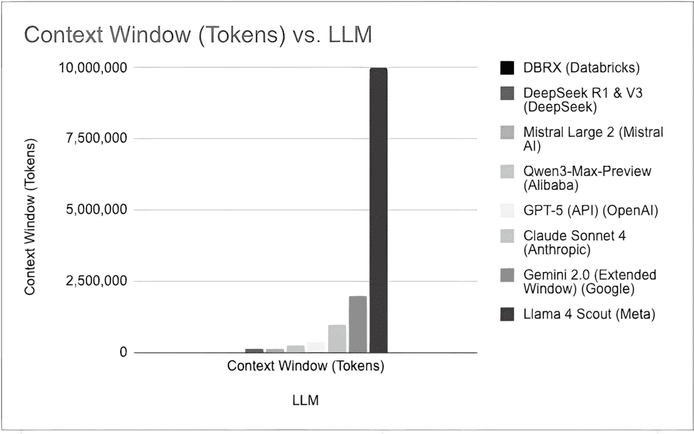
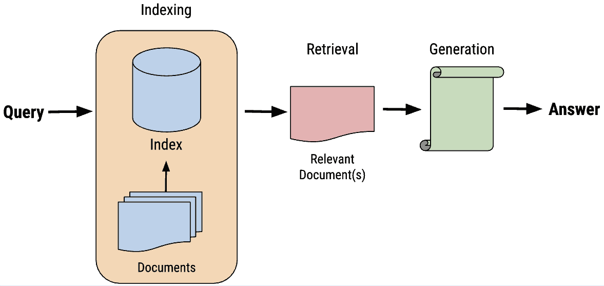

# 1

# 什么是检索增强生成？

人工智能（**AI**）领域正在迅速发展，生成式 AI 是其核心，而生成式 AI 的核心是**检索增强生成**（**RAG**）。RAG 已成为几乎所有生产级 AI 实现的核心组件，利用**大型语言模型**（**LLMs**）的智能和文本生成能力，并将它们与公司的内部数据相结合，显著提升组织运营效率。无论是驱动最基础的聊天机器人还是最先进的自主代理，RAG 都是一个不可或缺的核心组件。没有它，这些方法都无法有效运作。本书专注于 RAG 的众多方面，从基本的聊天机器人实现开始，一直到最后，我们将构建一个通过每次交互自主调整其方法的代理，利用 RAG 的核心进行自我学习和自我修复。通过这种方式，我们将展示 RAG 在现代生成式 AI 开发中的全部力量和应用。随着本书的推进，我们将概述 RAG 在企业中的潜力，建议它如何使 AI 应用更加响应和智能，与您的组织目标保持一致。RAG 已成为定制化、高效和有洞察力的 AI 解决方案的关键推动者，弥合了生成式 AI 的潜力与您的具体业务需求之间的差距。我们对 RAG 的探索将鼓励您释放企业数据的全部潜力，为您进入 AI 驱动创新时代铺平道路。

在本章中，我们将涵盖以下主题：

+   理解 RAG – 基础和原则

+   RAG 词汇

+   理解向量

+   在 AI 应用中实现 RAG

+   将 RAG 与传统的生成式 AI 进行比较

+   将 RAG 与模型微调进行比较

+   RAG 系统的架构和阶段

到本章结束时，您将在核心 RAG 概念上打下坚实的基础，并理解它为组织提供的巨大潜力，以便他们可以从数据中提取更多价值并赋予他们的 LLMs 更多能力。让我们开始吧！

# 本书中的免费优惠

您的购买包括本书的免费 PDF 副本以及其他独家优惠。请查阅前言中的“*本书的免费优惠*”部分，立即解锁它们并最大化您的学习体验。

# 理解 RAG – 基础和原则

当今的 LLM 令人印象深刻，但它们从未见过您公司的私有数据（希望如此！）这意味着 LLM 帮助您公司充分利用其数据的能力非常有限。这个非常大的障碍催生了 RAG 的概念，即您正在使用 LLM 的力量和能力，但将其与公司内部数据存储库中的知识和数据相结合。这是使用 RAG 的主要动机：使新数据对 LLM 可用，并显著增加您可以从这些数据中提取的价值。

除了内部数据之外，RAG 在 LLM 未在数据上训练的情况下也很有用，即使这些数据是公开的，例如关于您公司战略主题的最新研究论文或文章。在这两种情况下，我们谈论的是在 LLM 训练期间不存在的数据。您可以拥有训练过最多标记的最新 LLM，但如果这些数据在训练期间不存在，那么 LLM 在帮助您达到最大生产力方面将处于不利地位。

最终，这突出了这样一个事实，对于大多数组织来说，将新数据连接到 LLM 是一个基本需求。RAG 是执行此操作的最流行范式。本书旨在向您展示如何使用您的数据设置 RAG 应用程序，以及如何在各种情况下最大限度地发挥其作用。我们旨在让您深入了解 RAG 及其在利用公司私有或特定数据需求中的重要性。

现在您已经了解了实施 RAG 的基本动机，让我们回顾一下使用 RAG 的一些优点。

## RAG 的优点

使用 RAG 的一些潜在优点包括提高准确性和相关性、定制、灵活性和扩展模型知识以超越训练数据。让我们更深入地了解一下：

+   **提高准确性和相关性**：RAG 可以显著提高由 LLM 生成的响应的准确性和相关性。RAG 从数据库或数据集中获取并整合特定信息，通常是在实时进行的，并确保输出基于模型预先存在的知识和您直接提供的最新且相关的数据。

+   **定制**：RAG 允许您根据特定的领域或用例定制和调整模型的知识。通过将 RAG 指向与您的应用程序直接相关的数据库或数据集，您可以调整模型的输出，使其与对您的特定需求最重要的信息和风格紧密一致。这种定制使模型能够提供更针对性和有用的响应。

+   **灵活性**：RAG 在模型可以访问的数据源方面提供了灵活性。您可以将 RAG 应用于各种结构化和非结构化数据，包括数据库、网页、文档等。这种灵活性允许您利用多样化的信息来源，并以新颖的方式将它们结合起来，以增强模型的能力。此外，您可以根据需要更新或更换数据源，使模型能够适应不断变化的信息景观。

+   **超越训练数据的模型知识扩展**：LLMs 受限于其训练数据的范围。RAG 通过使模型能够访问和利用其初始训练集中未包含的信息来克服这一限制。这有效地扩展了模型的知识库，而无需重新训练，使 LLMs 更加灵活，能够适应新的领域或快速发展的主题。

+   **消除幻觉**：LLM 是 RAG 系统中的关键组件。LLMs 有可能提供错误信息，也称为幻觉。这些幻觉可以以多种方式表现出来，如虚构的事实、错误的事实，甚至无意义的措辞。通常，幻觉的措辞可能非常令人信服，导致难以识别。一个设计良好的 RAG 应用可以比直接使用 LLM 更容易地减少幻觉。

有了这些，我们已经涵盖了在您的组织中实施 RAG 的关键优势。接下来，让我们讨论一下您可能面临的挑战。

## RAG 的挑战

使用 RAG 也存在一些挑战，包括对内部数据质量的依赖、数据操作和清洗的需求、计算开销、更复杂的集成以及信息过载的可能性。让我们回顾这些挑战，更好地了解它们如何影响 RAG 管道，以及我们可以采取哪些措施：

+   **对数据质量的依赖性**：当谈论数据如何影响 AI 模型时，数据科学领域的说法是“垃圾进，垃圾出”。这意味着如果你给模型提供糟糕的数据，它将给出糟糕的结果。RAG 也不例外。RAG 的有效性直接与其检索到的数据质量相关联。如果底层数据库或数据集包含过时、有偏见或不准确的信息，RAG 生成的输出可能会出现同样的问题。

+   **数据操作和清洗的必要性**：公司深处的数据往往具有很高的价值，但它通常并不处于良好、易于访问的状态。例如，基于 PDF 的客户声明数据需要大量的处理，以便将其转换为 RAG 管道可以使用的格式。

+   **计算开销**：RAG 流水线将一系列新的计算步骤引入到响应生成过程中，包括数据检索、处理和集成。尽管 LLMs 每天都在变快，但即使是最快的响应也可能超过一秒，有些甚至可能需要几秒钟。如果你将这一点与其他数据处理步骤结合起来，以及可能的多个 LLM 调用，结果可能会导致接收响应所需的时间显著增加。所有这些都导致了计算开销的增加，影响了整个系统的效率和可扩展性。与任何其他 IT 倡议一样，组织必须权衡增强准确性和定制化的好处与这些额外流程引入的资源需求和潜在延迟。

+   **数据存储爆炸 - 集成和维护的复杂性**：传统上，你的数据存储在数据源中，通过各种方式查询以供内部和外部系统使用。但使用 RAG，你的数据以多种形式和位置存在，例如在向量数据库中的向量，它们代表相同的数据，但格式不同。再加上将这些各种数据源连接到 LLMs 和相关技术机制（如向量搜索）的复杂性，你将面临显著增加的复杂性。这种增加的复杂性可能是资源密集型的。随着时间的推移维护这种集成，尤其是在数据源演变或扩展时，还会增加更多的复杂性和成本。组织需要投资于技术专长和基础设施，以有效地利用 RAG 功能，同时考虑到这些系统带来的复杂性的快速增加。

+   **信息过载的潜在风险**：基于 RAG 的系统可能会引入过多的信息。实施机制来解决这一问题与处理找不到足够相关信息的情况一样重要。确定检索到的信息的相关性和重要性，以便包含在最终输出中，需要复杂的过滤和排名机制。没有这些机制，生成的内容的质量可能会因过多的不必要或边际相关的细节而受损。

+   **幻觉**：虽然我们将消除幻觉列为使用 RAG 的优势之一，但如果处理不当，幻觉确实是对 RAG 管道的最大挑战之一。一个设计良好的 RAG 应用必须采取措施来识别和消除幻觉，并在向最终用户提供最终输出文本之前进行大量的测试。这是一个难以实施的难题，通常需要在生产级应用中添加额外的逻辑层，但所有这些都需要 RAG 来工作（因为 RAG 提供了你用来验证和消除幻觉的数据）。相比之下，如果你只是直接使用 LLM 的响应，而没有 RAG 组件，当幻觉发生时几乎不可能消除它们。

+   **RAG 组件中的高复杂性**：典型的 RAG 应用往往具有很高的复杂性，需要优化许多组件以确保整体应用能够正常工作。这些组件可以以多种方式相互交互，通常比基本的 RAG 管道包含更多的步骤。管道中的每个组件都需要大量的试验和测试，包括你的提示设计和工程，你使用的 LLMs 以及如何使用它们，用于检索的各种算法及其参数，你用来访问 RAG 应用的接口，以及你在开发过程中需要添加的众多其他方面。

在本节中，我们探讨了在组织中实施 RAG 的关键优势，包括提高准确性和相关性、定制化、灵活性和扩展模型知识超越其初始训练数据的能力。我们还讨论了在部署 RAG 时可能遇到的挑战，例如对数据质量的依赖、数据操作和清洗的需求、增加的计算开销、集成和维护的复杂性以及信息过载的潜在可能性。了解这些优势和挑战为深入探讨 RAG 系统中使用的核心概念和词汇奠定了基础。

要理解我们将要介绍的方法，你需要对讨论这些方法所使用的词汇有很好的理解。在接下来的部分，我们将熟悉一些基础概念，以便你更好地理解构建有效的 RAG 管道所涉及的各个组件和技术。

# RAG 词汇

现在是回顾一些词汇的好时机，这些词汇可以帮助你熟悉 RAG 中的各种概念。在接下来的小节中，我们将熟悉一些这些词汇，包括 LLMs、提示概念、推理、上下文窗口、微调方法、向量数据库和向量/嵌入。这不是一个详尽的列表，但理解这些核心概念应该有助于你更有效地理解我们将教授你的关于 RAG 的其他所有内容。

## LLM

本书的大部分内容将涉及大型语言模型（LLMs）。LLMs 是一种生成式人工智能技术，专注于生成文本。我们将通过专注于大多数 RAG 管道使用的模型类型，即 LLM，来简化问题。然而，我们想澄清的是，虽然我们将主要关注 LLMs，但 RAG 也可以应用于其他类型的生成模型，例如图像、音频和视频的生成模型。我们将在 *第十四章* 中关注这些其他类型的模型以及它们在 RAG 中的应用。

一些流行的 LLM 示例包括 OpenAI 的 ChatGPT 模型、Meta 的 Llama 模型、Google 的 Gemini 模型以及 Anthropic 的 Claude 模型。

## 提示、提示设计和提示工程

这些术语有时可以互换使用，但从技术上讲，虽然它们都与提示有关，但它们确实有不同的含义：

+   **提示**是指向 LLM 发送查询或 *提示* 的行为。

+   **提示设计**指的是你实施的策略，用于 *设计* 你将发送给 LLM 的提示。不同的提示设计策略在不同的场景中有效。我们将在 *第十三章* 中回顾许多这些策略。

+   **提示工程**更关注围绕你用来改进 LLM 输出的提示的技术方面。例如，你可能将一个复杂的查询分解成两个或三个不同的 LLM 交互，*工程化*它以实现更优的结果。我们还将回顾 *第十三章* 中的提示工程。

## LangChain 和 LlamaIndex

本书将专注于使用 **LangChain** 作为构建我们的 RAG 管道的框架。LangChain 是一个开源框架，不仅支持 RAG，还支持任何希望在使用管道方法中结合 LLMs 的开发。截至 2025 年 2 月，LangChain 在 GitHub 上拥有超过 99,000 个星标，每月下载量约为 2800 万次，总下载量超过 1.3 亿次，涵盖 Python 和 JavaScript 平台。2025 年 5 月，LangChain 在一个月内的下载量超过 7000 万次，甚至超过了 OpenAI SDK。它特别支持 RAG，提供了一套模块化和灵活的工具，使得 RAG 开发比不使用框架的效率显著提高。

虽然 LangChain 目前是开发 RAG 管道最受欢迎的框架，但**LlamaIndex**是 LangChain 的一个领先替代品，在总体上具有相似的功能。截至 2025 年 10 月，LlamaIndex 的月下载量约为 520 万。LlamaIndex 以其对搜索和检索任务的关注而闻名，专门针对索引和检索通过高效文档处理的结构化和非结构化数据进行了优化。如果你需要高级搜索或需要处理大型、文档密集型数据集，其中检索速度和准确性至关重要，它可能是一个不错的选择。

许多其他选项专注于各种利基市场。一旦你熟悉了构建 RAG 管道，务必查看一些其他选项，看看是否有更适合你特定项目的框架。

## 推理

我们将不时使用术语**推理**。通常，这指的是 LLM 根据给定的输入使用预训练语言模型生成输出或预测的过程。例如，当你向 ChatGPT 提问时，它提供响应所采取的步骤被称为推理。

## AI 代理及其相关术语

AI 代理代表了 RAG 应用中最重大的发展之一。**AI 代理**是一个能够感知其环境、做出决策并采取行动以实现特定目标的自主系统。代理仍然非常依赖于 RAG 概念，但它们以新的和创新的方式使用它们，其中生成步骤在本书第一章节中将要讨论的传统生成之上进行推理。这一新的推理步骤允许代理执行诸如通过问题进行推理、使用工具和执行多步骤工作流程等活动。以下是与代理相关的关键术语：

+   **代理式 AI 或代理系统**：能够独立规划、执行任务并根据反馈调整其行为的 AI 系统。这些系统使用 RAG 作为核心组件来访问和推理信息。

+   **工具调用（也称为函数调用）**：LLM 或代理调用外部工具、API 或函数以完成超出文本生成任务的能力。例如，代理可能会调用计算器函数来解决数学问题或查询数据库以获取特定信息。

+   **模型上下文协议（MCP**）：由 Anthropic 开发的一种开放标准，为 AI 代理提供了一种通用的方式来连接外部数据源、工具和服务。MCP 标准化了代理如何发现和交互可用功能，使得构建可互操作的代理系统、通过一致接口访问各种资源变得更加容易。

+   **ReAct（推理与行动）**：一种提示范式，其中代理在推理问题和采取行动之间交替。代理逐步思考，决定使用什么工具，观察结果，并继续推理，直到任务完成。

+   **思维链**：一种技术，其中 LLM 将复杂问题分解为中间推理步骤，使其思维过程明确。这对于智能体规划和执行多步任务至关重要。

+   **智能体记忆**：允许智能体在交互中保留信息的系统，包括短期记忆（当前对话上下文）和长期记忆（从过去交互中获取的持久知识）。

+   **编排**：协调和管理多个智能体、工具或 LLM 调用以完成复杂任务。LangChain 和 LangGraph 在智能体编排方面具有专长。

+   **人机交互**（**HITL**）：一种模式，其中智能体在执行某些操作之前暂停执行，请求人类输入、批准或指导。这在高风险决策或智能体信心较低时至关重要。HITL 在 RAG 过程中进行，我们称之为*热路径*。如果这样做是在*热路径之外*，则称为**人机交互**（**HOTL**）。

+   **多智能体系统**：由多个具有特定角色和能力的专业智能体协同工作，共同解决单个智能体无法有效处理的复杂问题。

我们将在本书的前 11 章中逐步介绍众多 RAG 相关概念，并确保你具备 RAG 的基础知识，以便在 RAG 领域取得高度成功。但在*第十二章*中，我们将回到智能体的话题，并在*第十二章*至*第十九章*中讨论如何将 RAG 的这种最先进的使用方式提升你的生成式 AI 开发到一个全新的水平。

## 上下文窗口

在 LLM 的上下文中，**上下文窗口**指的是模型在一次处理中可以处理的最多标记（单词、子词或字符）的数量。它决定了模型在做出预测或生成响应时一次可以看到或关注的文本量。

上下文窗口大小是模型架构的关键参数，通常在模型训练期间固定。它直接关系到模型的输入大小，因为它设定了每次可以输入模型中的标记数量的上限。

例如，如果一个模型的上下文窗口大小为 4,096 个标记，这意味着该模型可以处理和生成最多 4,096 个标记的序列。当处理较长的文本，如文档或对话时，输入需要被分成适合上下文窗口的小段。这通常使用滑动窗口或截断等技术来完成。

上下文窗口的大小对模型理解并维持长距离依赖和上下文的能力有影响。具有更大上下文窗口的模型在生成响应时可以捕捉和利用更多的上下文信息，这可能导致更连贯和上下文相关的输出。然而，增加上下文窗口的大小也会增加训练和运行模型所需的计算资源。

在 RAG 的上下文中，上下文窗口的大小至关重要，因为它决定了检索到的文档中可以有多少信息被模型有效地利用来生成最终响应。语言模型最近的进步导致了具有显著更大上下文窗口的模型的发展，使它们能够处理和保留更多来自检索源的信息。参见*表 1.1*以查看许多流行 LLM 的上下文窗口，包括封闭源和开源：

| **LLM** | **上下文窗口（标记）** |
| --- | --- |
| ChatGPT-3.5 Turbo 0613 (OpenAI), Llama 2 (Meta) | 4,096 |
| Llama 3 (Meta) | 8,000 |
| ChatGPT-4 (OpenAI) | 8,192 |
| ChatGPT-3.5 Turbo 0125 (OpenAI) | 16,385 |
| ChatGPT-4.0-32k (OpenAI), Mistral (Mistral AI), Mixtral (Mistral AI), DBRX (Databricks), Gemini 1.0 Pro (Google) | 32,000 |
| ChatGPT-4.0 Turbo (OpenAI), ChatGPT-4o (OpenAI), Llama 3.1 (Meta), Mistral Large 2 (Mistral AI), Mistral Small 3.1 (Mistral AI), Mistral NeMo (Mistral AI), DeepSeek R1 & V3 (DeepSeek) | 128,000 |
| Claude 2.1, 3, Opus 4, Sonnet 3.7, Haiku 3.5 (Anthropic) | 200,000 |
| Qwen3-Max-Preview (Alibaba) | 258,000 |
| GPT-5 (API) (OpenAI) | 400,000 |
| Llama 4 Maverick (Meta) | 512,000 |
| Gemini 1.5 Pro, 2.5 Pro, 2.5 Flash (Google), Claude Sonnet 4 (Anthropic) | 1,000,000 |
| Gemini 2.0 (Extended Window) (Google) | 2,000,000 |
| Llama 4 Scout (Meta) | 10,000,000 |

表 1.1 – LLM 的不同上下文窗口（截至 2025 年 10 月）

*图 1.1*，基于*表 1.1*，以视觉方式显示了主要 LLM 服务的最大上下文窗口大小：

图 1.1 – 主要 LLM 服务的最大上下文窗口

注意，*图 1.1*显示了主要 LLM 提供商选择的最大上下文窗口大小，展示了出现的巨大规模差异。这种进展是显著的：从 DBRX 的 32,000 个标记到 Llama 4 Scout 的开创性 10 百万个标记——增加了 300 多倍。这种上下文窗口扩展的加速代表了最近 LLM 演变中最重大的发展之一，现在的模型能够一次性处理整本书、广泛的代码库或数千页的文档。虽然旧模型往往只有几千个标记的小上下文窗口，但最新的模型已经将边界推向了数百万，一些专业模型甚至达到了数亿个标记。这种趋势很可能会持续下去，从根本上改变 RAG 系统的设计和实现方式，因为更大的上下文窗口在某些用例中减少了复杂检索策略的需求，同时在其他用例中使全新的应用成为可能。然而，在这个标记级别，请注意成本，因为这些 LLM 根据标记输入和输出向你收费。如果你不断地向 LLM 发送 1000 万个标记，而不是几千个，你可能会从这个服务中得到一笔不小的账单！

## 微调 – 全模型微调和参数高效微调

**全模型微调**（**FMFT**）是指你从一个基础模型开始，进一步训练以获得新的能力。你可以简单地给它提供特定领域的知识，或者给它一个技能，比如成为一个会话聊天机器人。FMFT 会更新模型中的所有参数和偏差。

另一方面，**参数高效微调**（**PEFT**）是一种微调类型，你在微调模型时只关注参数或偏差的特定部分，但与一般微调有相似的目标。该领域最新的研究显示，你可以以远低于 FMFT 的成本、时间和数据投入实现类似的结果。

虽然这本书不专注于微调，但尝试使用用你的数据微调的模型来给它提供更多来自你领域的知识，或者给它更多来自你领域的*声音*，是一个非常有效的策略。例如，如果你在科学领域使用它，你可以训练它说话更像科学家而不是通用基础模型。或者，如果你在法律领域开发，你可能希望它听起来更像律师。

微调还有助于 LLM 更好地理解你的公司数据，使其在 RAG 过程中生成有效响应的能力更强。例如，如果你是一家科学公司，你可能会微调一个包含科学信息的模型，并将其用于总结你研究的 RAG 应用。这可能会提高你的 RAG 应用输出（即你研究总结）的质量，因为你的微调模型更好地理解了你的数据，并能提供更有效的总结。

## 向量存储或向量数据库？

两者都是！所有向量数据库都是向量存储，但并非所有向量存储都是向量数据库。好吧，当你拿出粉笔在黑板上画韦恩图时，我会继续解释这个说法。有存储向量的方式，但不是完整的数据库。它们只是向量的存储设备。因此，为了涵盖所有可能的存储向量方式，LangChain 将它们都称为**向量存储**。我们将在*第七章*中更深入地讨论这一点，但到目前为止，只需注意这些通常被认为是同一件事。

## 向量，向量，向量！

**向量**是您数据的数学表示。当具体谈到**自然语言处理**（NLP）和 LLMs 时，它们通常被称为**嵌入**。向量是理解最重要的概念之一，RAG 管道的许多不同部分都利用了向量。

我们刚刚介绍了许多关键词汇，这些词汇对于您理解本书的其余部分非常重要。许多这些概念将在未来的章节中进一步阐述。在下一节中，我们将进一步深入讨论向量。而且，在第七章和第八章中，我们将详细讨论向量及其如何用于查找相似内容。

# 理解向量

可以说，理解向量和它们在 RAG 中所有使用方式是本书最重要的部分。如前所述，向量只是您外部数据的数学表示，它们通常被称为嵌入。这些表示以算法可以处理的形式捕获语义信息，促进了诸如相似性搜索等任务，这是 RAG 过程中的关键步骤。

向量通常具有特定的维度，这取决于它们表示的数字数量。例如，这是一个四维向量：`[0.123, 0.321, 0.312, 0.231]`。

如果你不知道我们在谈论向量，你看到了这段 Python 代码，你可能会认出这是一个包含四个浮点数的列表，而且你并不离谱。然而，当你在 Python 中使用向量时，你希望将它们识别为 NumPy 数组，而不是列表。NumPy 数组通常更适用于机器学习，因为它们被优化得比 Python 列表更快、更高效，并且在机器学习包（如 SciPy、pandas、scikit-learn、TensorFlow、Keras、Pytorch 等）中被更广泛地认可为嵌入的默认表示。NumPy 还允许你直接在 NumPy 数组上执行向量数学，例如执行元素级操作，而无需编写循环和其他你可能需要使用的方法。

当处理用于向量化的向量时，通常会有数百或数千个维度，这指的是向量中存在的浮点数的数量。更高的维度可以捕捉到更详细的语义信息，这对于在 RAG 应用中准确匹配查询输入与相关文档或数据至关重要。

在*第七章*中，我们将介绍向量和向量数据库在 RAG 实现中的关键作用。然后，在*第八章*中，我们将更深入地探讨相似性搜索的概念，它利用向量以更快、更高效的方式搜索。这些是帮助你更深入理解如何更好地实现 RAG 管道的关键概念。

理解向量可能是理解如何实现 RAG 的关键基础概念，但在企业中 RAG 是如何在实际应用中被使用的呢？我们将在下一节讨论 RAG 的这些实际人工智能应用。

# 在人工智能应用中实现 RAG

RAG 迅速成为企业界生成式人工智能平台的基础。RAG 结合了检索内部或*新*数据与生成语言模型的力量，以增强生成文本的质量和相关性。这项技术对于各个行业的公司来说特别有用，可以帮助它们改进产品、服务和运营效率。以下是一些 RAG 如何被使用的例子：

+   **客户支持和聊天机器人**：这些可以在没有 RAG 的情况下存在，但与 RAG 集成后，它们可以连接到过去的客户互动、常见问题解答、支持文档以及任何特定于该客户的内容。

+   **技术支持**：通过更好地访问客户历史和相关信息，RAG 增强的聊天机器人可以显著提高当前技术支持聊天机器人的性能。

+   **自动报告**：RAG 可以帮助创建初始草案或总结现有的文章、研究论文和其他类型的非结构化数据，使其更易于消化。

+   **电子商务支持**：对于电子商务公司，RAG 可以帮助生成动态的产品描述和用户内容，以及提供更好的产品推荐。

+   **利用知识库**：RAG 通过生成摘要、提供直接答案以及检索跨越法律、合规、研究、医疗、学术界、专利和技术文档等多个领域的相关信息，提高了内部和通用知识库的可搜索性和实用性。

+   **创新侦察**：这就像搜索通用知识库，但重点是创新。通过这种方式，公司可以使用 RAG 扫描和总结来自优质来源的信息，以识别与公司专业相关的趋势和潜在的创新领域。

+   **培训和教育工作**：RAG 可以被教育机构和企业培训项目用来根据学习者的具体需求和知识水平生成或定制学习材料。通过 RAG，组织内部的知识可以在非常定制化的方式中融入教育课程，针对个人或角色。

+   **高级智能体应用**：RAG 是自主 AI 智能体的基础，这些智能体可以执行复杂的多步骤任务。这些智能系统将 RAG 与推理能力、工具调用和决策制定相结合，以处理复杂的流程，如自动代码审查和重构、多文档法律分析和合同生成、能够规划研究策略和综合发现的自主研究助手，以及适应不断变化的商业条件的智能工作流程自动化。通过在核心处集成 RAG，这些智能体可以在保持推理、规划和执行行动自主能力的同时访问庞大的知识库，代表着超越简单问答系统的下一阶段进化。

这些只是组织目前使用 RAG 来改进其运营的几种方式。我们将在*第三章*中深入探讨这些领域，帮助你了解如何在公司的多个地方实施这些颠覆性的创新举措。

你可能会想，“*如果我在公司使用 LLM 如 ChatGPT 来回答我的问题，这意味着我的公司已经使用 RAG 了吗？*”

答案是“*不*”。

如果你只是登录 ChatGPT 并提问，这并不等同于实现 RAG。ChatGPT 和 RAG 都是生成式 AI 的形式，它们有时会一起使用，但它们是两个不同的概念。在下一节中，我们将讨论生成式 AI 和 RAG 之间的区别。

# 将 RAG 与传统的生成式 AI 进行比较

传统的生成式 AI 已经显示出对公司的革命性变革，帮助员工达到新的生产力水平。LLM 如 ChatGPT 正在帮助用户处理快速增长的列表中的应用，包括撰写商业计划、编写和改进代码、撰写营销文案，甚至为特定饮食提供更健康的食谱。最终，用户所做的许多事情都变得更高效。

然而，传统的生成式 AI 并不知道它不知道什么。这包括你公司的大部分内部数据。你能想象，如果你能结合之前提到的所有好处，再加上你公司内部的所有数据——关于你公司所做的一切，关于你的客户及其所有互动，或者关于你所有产品和服务的组合，再加上对特定客户需求的认识，你能做什么吗？你不必想象——这正是 RAG 所做的事情！

在 RAG 出现之前，你看到的大多数将客户或员工与公司数据资源连接的服务，与如果他们能够访问公司**所有**数据相比，只是触及了可能性的表面。随着 RAG 和生成式 AI 的出现，企业正站在一个真正、真正重大的转折点上。

你可能会将 RAG 与调整模型的概念混淆的另一个领域。让我们讨论一下这些方法之间的区别。

# 比较 RAG 与模型微调

LLM 可以通过两种方式适应你的数据：

+   **微调**：通过微调，你根据新的训练数据调整定义模型智能的权重和/或偏差。这直接影响模型，永久改变其与新输入交互的方式。

+   **输入/提示**：这是你**使用**模型的地方，使用提示/输入引入 LLM 可以采取的新知识。

为什么不在所有情况下都使用微调呢？一旦你引入了新知识，LLM 总是会拥有它！这也是模型创建的方式——通过用数据进行训练，对吧？从理论上讲，这似乎是正确的，但在实践中，微调在教授模型特定任务（例如，教授模型如何以某种方式交谈）方面更为可靠，而在事实回忆方面则不太可靠。

原因很复杂，但总的来说，模型对事实的了解就像人类的长时记忆。如果你记住了演讲或书籍中的长篇大论，然后在几个月后尝试回忆，你可能会仍然理解信息的上下文，但你可能会忘记具体细节。另一方面，通过模型输入添加知识就像我们的短期记忆，其中事实、细节，甚至措辞的顺序都非常新鲜且可供回忆。在需要成功回忆事实的情况下，这种后一种情况更适合。鉴于微调可能更加昂贵，这使得考虑 RAG 更加重要。

虽然通常有方法将所有数据输入模型进行微调，但输入受限于模型的上下文窗口。这是一个正在积极解决的问题。例如，ChatGPT 3.5 的早期版本有一个 4,096 个标记的上下文窗口，相当于大约 5 页文本。现在有几种模型，上下文窗口从 1 到 1000 万个标记（1000-10,000 页文本）不等。

随着上下文窗口的扩大，又产生了另一个问题。研究表明，早期具有扩展上下文窗口的模型在细节上丢失了很多，尤其是在文本的*中间*部分。这个问题也在被解决。最新一代的模型，包括 Gemini 2.5 Pro、Claude Sonnet 4 和 GPT-5，在所谓的*大海捞针*测试中显示出显著的改进，这些测试旨在检验模型在处理整个输入文本时能否很好地记住所有细节。然而，这些模型在更复杂的场景中仍然面临挑战，例如*大海捞针*测试，在这些测试中，它们必须跟踪和回忆散布在大量上下文中的众多不同信息片段。此外，研究表明，即使有了这些改进，当相关信息被埋藏在非常长的上下文中间时，模型的表现可能会下降，这种现象有时被称为*迷失在中间*。随着上下文窗口的进一步扩大，我们预计在这个领域将继续进行持续的努力。如果你需要一次性处理大量文本，请记住这一点，并考虑将最关键的信息放在提示的开始或结束处的策略。

**注意**

需要注意的是，*标记数*与*词数*不同，因为标记包括标点、符号、数字和其他文本表示。复合词，如*ice cream*，在标记方面的处理取决于标记化方案，并且可能在不同的大型语言模型（LLMs）中有所不同。但大多数知名 LLMs（如 ChatGPT 和 Gemini）会将*ice cream*视为两个标记。在自然语言处理（NLP）的某些情况下，你可能会根据标记应代表一个有用的语义处理单元的概念来争论它应该是一个标记，但对于这些模型来说并非如此。此外，当谈论 LLM 的上下文窗口时，这包括输入和输出标记的组合，因此请确保为输出留出一些空间！

微调也可能相当昂贵，这取决于你拥有的环境和资源。近年来，由于代表性的微调、LoRA 相关技术和量化等新技术的出现，微调的成本大幅下降。但在许多 RAG 开发工作中，微调被视为已经昂贵的 RAG 工作之外的额外成本，因此它被视为对努力的一种更昂贵的补充。

最终，在决定使用 RAG 和微调之间，考虑您的具体用例和需求。RAG 通常在检索 LLM 训练数据中不存在或私有的事实性信息时表现更优。它允许您在不修改模型权重的情况下动态集成外部知识。另一方面，微调更适合教授模型特定任务或将其适应到特定领域。在微调特定数据集时，请记住上下文窗口大小的限制和过拟合的潜在可能性。

现在我们已经定义了什么是 RAG，尤其是与其他使用生成式 AI 的方法相比，让我们回顾一下 RAG 系统的通用架构。

# RAG 系统的架构和阶段

以下是从用户体验的角度来看 RAG 过程的阶段：

1.  用户输入一个查询/问题。

1.  应用程序在检查它所能访问的数据之前会稍微思考一下，以便它能看到最相关的信息。

1.  应用程序提供了一个专注于回答用户问题的响应，但使用通过 RAG 管道提供给它的大量数据。

从技术角度来看，这涵盖了您将编码的两个阶段：**检索**和**生成**阶段。但还有一个其他阶段，称为**索引**，它可以在用户输入查询之前执行。通过索引，您将辅助数据转换为向量，将它们存储在向量数据库中，并可能优化搜索功能，以便检索步骤尽可能快且有效。

从技术角度来看，一旦用户将他们的查询输入到系统中，以下步骤就会发生：

1.  用户查询被向量化。

1.  将向量化的查询传递到向量搜索中，以检索表示您外部数据的向量数据库中最相关的数据。

1.  向量搜索返回最相关的结果和引用原始内容的唯一键。

1.  使用唯一键来提取与这些向量相关联的原始数据，通常是一批多个文档。

1.  原始数据可能会被过滤或后处理，但通常随后会传递到一个基于您期望 RAG 过程要做什么的 LLM（大型语言模型）。

1.  LLM（大型语言模型）提供了一个提示，通常说类似以下内容：

`您是一个问答任务的辅助助手。请根据以下问题（用户查询）和以下有用的信息（相似性搜索中检索到的数据）来回答。如果您根据提供的信息不知道答案，只需说不知道即可。`

1.  LLM 处理该提示并根据您提供的扩展数据提供响应。

根据 RAG 系统的范围，这些步骤可以是实时的，或者像索引这样的步骤可以在查询之前完成，以便在需要时可以立即搜索。本书后面将介绍一些更高级的检索版本，例如语义缓存，但核心概念是相同的。

如前所述，我们可以将这些方面分解为三个主要阶段（见图*1.2*）：

+   索引

+   检索

+   生成

图 1.2 – RAG 的三个阶段

如前所述，这三个阶段构成了整体用户模式和通用 RAG 系统的设计。在第*4 章*中，我们将更深入地了解这些阶段。这将帮助您将此编码范式中的概念与其实际应用联系起来。

# 摘要

在本章中，我们探讨了 RAG 及其通过整合组织内部数据来增强 LLM 能力的能力。我们学习了 RAG 如何将 LLM 的力量与公司的私有数据相结合，使模型能够利用其最初训练时未使用的信息，从而使 LLM 的输出对特定组织更加相关和有价值。我们还讨论了 RAG 的优势，例如提高准确性和相关性、针对公司领域的定制化、数据源使用的灵活性以及将模型的知识扩展到其原始训练数据之外。此外，我们还考察了 RAG 的挑战和局限性，包括对数据质量的依赖性、数据清洗的需要、增加的计算开销和复杂性，以及如果未正确过滤，可能导致的信息过载。

在本章的中间部分，我们定义了关键词汇，并强调了理解向量的重要性。我们探讨了 RAG 在各个行业中实施的各种应用示例，并将 RAG 与传统的生成式 AI 和模型微调进行了比较。

最后，我们从用户视角和技术角度概述了典型 RAG 管道的架构和阶段，同时涵盖了 RAG 管道的索引、检索和生成阶段。在下一章中，我们将通过实际的编码示例来讲解这些阶段。

|

## 获取本书的 PDF 版本和独家额外内容

扫描二维码（或访问[packtpub.com/unlock](http://packtpub.com/unlock)）。通过书名搜索本书，确认版本，然后按照页面上的步骤操作。 |  |

| **注意**：请妥善保管您的发票。直接从 Packt 购买不需要发票。* |
| --- |
