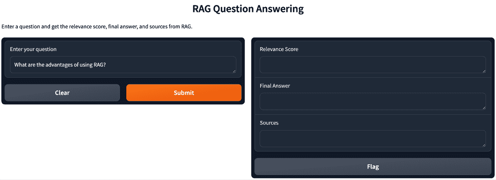
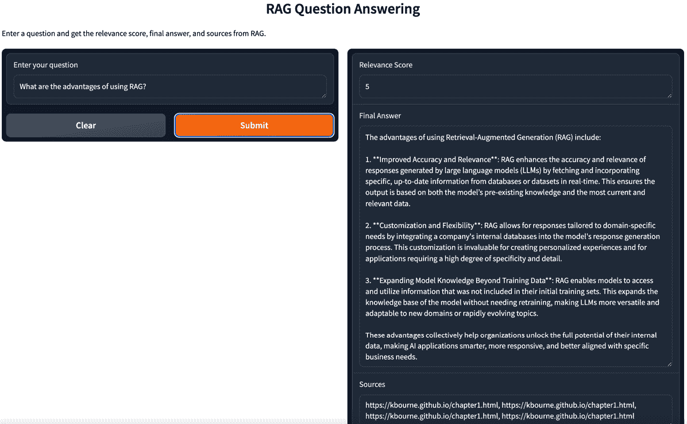

# 6

# 与 RAG 和 Gradio 的接口

几乎在所有情况下，**检索增强生成**（**RAG**）开发都涉及创建一个或多个应用程序，或简称为 *app*。在最初编码 RAG 应用程序时，您通常会创建一个变量，该变量代表一个提示或其他类型的输入，反过来，它代表 RAG 管道将从中工作的内容。但这是否就是未来用户将使用您构建的应用程序的方式？您如何使用您的代码与这些用户进行测试？您需要一个界面！

在本章中，我们将提供一份实用指南，教您如何使用 **Gradio** 作为 **用户界面**（**UI**）来使您的应用程序与 RAG 交互。它涵盖了设置 Gradio 环境、集成 RAG 模型、创建一个用户友好的界面，使用户能够像使用典型的网络应用程序一样使用您的 RAG 系统，并在永久且免费的在线空间中托管它。您将学习如何快速原型设计和部署 RAG 驱动的应用程序，使最终用户能够实时与 AI 模型交互。

关于如何构建界面的书籍已经有很多，你可以在很多地方提供界面，比如在网页浏览器或通过移动应用。但幸运的是，使用 Gradio，我们可以为您提供一种简单的方式来为您的基于 RAG 的应用程序提供界面，而无需进行广泛的网页或移动开发。虽然这不能替代完整的生产应用程序界面，但这确实使共享和演示您的应用程序变得更加容易。

在本章中，我们将具体涵盖以下主题：

+   为什么选择 Gradio？

+   使用 Gradio 的好处

+   使用 Gradio 的局限性

+   代码实验室 – 添加 Gradio 界面

让我们先讨论一下为什么 Gradio 是您 RAG 开发努力中的重要部分。

# 技术要求

本章的代码在此：[`github.com/PacktPublishing/Unlocking-Data-with-Generative-AI-and-RAG-Second-Edition/tree/main/CHAPTER_06`](https://github.com/PacktPublishing/Unlocking-Data-with-Generative-AI-and-RAG-Second-Edition/tree/main/CHAPTER_06)。

# 为什么选择 Gradio？

到目前为止，我们一直关注的是通常属于数据科学领域的话题。**机器学习**（**ML**）、**自然语言处理**（**NLP**）、**生成式人工智能**（**generative AI**）、**大型语言模型**（**LLMs**）和 RAG 是需要大量专业知识的技术，而且通常需要足够的时间，以至于我们无法在其他技术领域，如网页技术和构建网页前端，建立专业知识。**网页开发**是一个高度技术化的领域，需要丰富的经验和专业知识才能成功实施。

然而，使用 RAG 时，拥有一个 UI 非常有帮助，尤其是如果您想测试它或向潜在用户展示它。如果我们没有时间学习网页开发，我们如何提供这样的界面呢？

这就是为什么许多数据科学家，包括我自己，使用 Gradio 的主要原因。它允许您以可分享的格式快速搭建用户界面（相对于构建网页前端），甚至带有一些基本的身份验证功能。这不会让任何网页开发者失业，因为如果您想将您的 RAG 应用程序转变为一个功能齐全、稳健的网站，Gradio 将不是一个很好的选择。但它将允许您，作为一个时间非常有限来构建网站的人，在几分钟内搭建一个非常适合 RAG 应用程序的用户界面并投入使用！

由于这里的想法是让您将大部分精力集中在 RAG 开发上，而不是网页开发上，我们将简化对 Gradio 的讨论，仅讨论那些有助于您将 RAG 应用程序部署到网络并使其可分享的组件。然而，随着您的 RAG 开发继续进行，我们鼓励您进一步调查 Gradio 的功能，看看是否还有其他可以为您特定的努力提供帮助的地方！

考虑到这一点，让我们来谈谈 Gradio 在构建 RAG 应用程序时的主要好处。

# 使用 Gradio 的好处

除了对非网页开发者来说非常容易使用之外，Gradio 还有很多优点。Gradio 的核心库是开源的，这意味着开发者可以自由地使用、修改并为项目做出贡献。Gradio 与广泛使用的机器学习框架，如**TensorFlow**、**PyTorch**和**Keras**，集成良好。除了开源库之外，它还提供了一个托管平台，开发者可以在平台上部署他们的模型接口并管理访问权限。它还包括一些有助于在从事机器学习项目的团队之间协作的功能，例如共享接口和收集反馈。

Gradio 的另一个令人兴奋的功能是它与**Hugging Face**集成良好。Hugging Face 拥有许多旨在支持生成式 AI 社区的资源，例如模型共享和数据集托管。这些资源之一是能够使用**Hugging Face Spaces**在互联网上设置指向您的 Gradio 演示的永久链接。Hugging Face Spaces 提供了永久免费托管您的机器学习模型的基础设施！请访问 Hugging Face 网站以了解更多关于他们的 Spaces 的信息。

当使用 Gradio 为您的 RAG 应用程序服务时，也存在一些限制，了解这些限制是很重要的。

# 使用 Gradio 的限制

在使用 Gradio 时，最需要记住的一点是它并不提供足够的支持来构建一个将与其他数百、数千甚至数百万用户交互的生产级应用。在这种情况下，你可能需要雇佣一个在构建大规模生产级应用前端方面有专业知识的人。但对于我们所说的**概念验证**（**POC**）类型的应用，或者构建允许你测试具有基本交互性和功能的应用，Gradio 做得非常出色。

在使用 Gradio 进行 RAG 应用时，你可能会遇到的一个局限性是你能构建的内容缺乏灵活性。对于许多 RAG 应用，尤其是在构建原型时，这不会成为一个问题。但如果你或你的用户开始要求更复杂的 UI 功能，Gradio 相比于完整的 Web 开发框架将会受到更多的限制。不仅了解这一点对你有益，而且与用户设定这些期望也很重要，帮助他们理解这只是一个简单的演示应用。

让我们直接进入代码，看看 Gradio 如何为你的 RAG 应用提供应有的界面。

# 代码实验室 – 添加 Gradio 接口

这段代码从我们在*第五章*中停止的地方继续，除了最后一组代表提示探针攻击的行。正如我们在所有的代码实验室开始时做的那样，我们将从安装一个新的包开始，当然，这个包就是 Gradio！我们还将卸载 `uvloop`，因为它与我们的其他包冲突：

```py
%pip install gradio ==6.0.2
%pip install nest_asyncio==1.6.0
%pip uninstall uvloop -y 
```

第一行安装了 Gradio 本身，这是我们将在本章中使用的 UI 框架。第二行安装了 `nest_asyncio`，这是一个实用程序包，它修复了 Python 的 `asyncio` 模块，以允许嵌套事件循环。这是必要的，因为 Jupyter 笔记本已经运行了自己的事件循环，而 Gradio 需要在其中运行另一个事件循环。如果没有 `nest_asyncio`，当你尝试启动你的 Gradio 接口时，你会遇到“`RuntimeError: This event loop is already running`”错误。

第三行卸载了 `uvloop`，这是一个高性能的事件循环，一些包将其作为依赖项安装。虽然 uvloop 对于生产服务器来说非常出色，但它与我们在 Jupyter 笔记本中需要嵌套事件循环的方法冲突。通过移除它，我们确保 Python 回退到标准的 asyncio 事件循环，而 `nest_asyncio` 可以正确地修复它。

接下来，我们将向导入列表中添加多个包：

```py
import asyncio
import nest_asyncio
asyncio.set_event_loop_policy(asyncio.DefaultEventLoopPolicy())
nest_asyncio.apply()
import gradio as gr 
```

这些行配置了 Gradio 运行在 Jupyter 笔记本中所需的事件循环环境。首先，我们导入 `asyncio`，Python 的内置异步编程库，以及我们之前安装的 `nest_asyncio`。`asyncio.set_event_loop_policy(asyncio.DefaultEventLoopPolicy())` 这一行确保 Python 使用其标准事件循环而不是任何可能配置的替代方案。`nest_asyncio.apply()` 这一行激活了我们在安装部分讨论的补丁，使嵌套事件循环成为可能。最后，我们导入 `gradio` 包并将其分配给 `gr` 别名以方便使用，这是 Gradio 文档和示例中的标准约定。

在添加导入之后，我们只需在现有代码的末尾添加此代码来设置我们的 Gradio 接口：

```py
def process_question(question):
    result = rag_chain_with_source.invoke(question)
    relevance_score = result['answer']['relevance_score']
    final_answer = result['answer']['final_answer']
    sources = [doc.metadata['source'] for doc in result['context']]
    source_list = ", ".join(sources)
    return relevance_score, final_answer, source_list 
```

`process_question` 函数是在您点击 **提交** 按钮时被调用的函数。您将在 `gr.Interface` 代码中定义此调用，但这是被调用和处理的函数。`process_question` 函数接受用户提交的问题作为输入，并使用我们的 RAG 流程处理它。它使用给定的问题调用 `rag_chain_with_source` 对象，并从结果中检索相关性得分、最终答案和来源。然后函数将来源连接成一个以逗号分隔的字符串，并返回相关性得分、最终答案和来源列表。

接下来，我们将设置 Gradio 接口的实例：

```py
demo = gr.Interface(
    fn=process_question,
    inputs=gr.Textbox(label="Enter your question",
        value="What are the Advantages of using RAG?"),
    outputs=[
        gr.Textbox(label="Relevance Score"),
        gr.Textbox(label="Final Answer"),
        gr.Textbox(label="Sources")
    ],
    title="RAG Question Answering",
    description=" Enter a question about RAG and get an answer, a
        relevancy score, and sources."
) 
```

`demo = gr.Interface(...)` 这一行是 Gradio 魔法的所在。它使用 `gr.Interface` 函数创建一个 Gradio 接口。`fn` 参数指定了当用户与接口交互时要调用的函数，这正是我们在上一段中提到的，调用 `process_question` 并启动 RAG 流程。`inputs` 参数定义了接口的输入组件，用于输入问题，即 `gr.Textbox`。`outputs` 参数定义了接口的输出组件，包括三个 `gr.Textbox` 组件，用于显示相关性得分、最终答案和来源。`title` 和 `description` 参数设置了接口的标题和描述。

要停止 Gradio 服务器并重新控制您的笔记本，您有几个选择。在 Jupyter Notebook 或 JupyterLab 中，点击工具栏中的 **中断内核** 按钮（正方形停止图标）。在 Google Colab 中，点击运行单元格旁边的 **停止** 按钮。如果您有多个 Gradio 接口正在运行，您还可以从另一个单元格中调用 `gr.close_all()`，尽管您需要先中断内核才能运行该单元格。一旦停止服务器，公共 URL 将不再工作，如果用户尝试访问它，将会看到错误。

剩下的唯一操作就是启动接口：

```py
demo.launch(share=True, debug=True) 
```

`demo.launch(share=True, debug=True)`这一行将启动 Gradio 界面。`share=True`参数启用了 Gradio 的共享功能，生成一个公开可访问的 URL，您可以将它与他人分享以访问您的界面。Gradio 使用隧道服务提供此功能，允许任何拥有 URL 的人无需在本地运行代码即可与您的界面交互。`debug=True`参数配置 Gradio 以调试配置运行，提供额外的调试和开发信息及工具。启用此设置后，如果`process_question`函数执行期间发生任何错误，Gradio 将在浏览器控制台中显示详细的错误消息，这使得识别和修复代码中的问题更加容易。

我认为`demo.launch(share=True, debug=True)`与我们在本书中编写的所有其他代码相比，是一行特殊的代码。这是因为它做了您之前没有看到的事情；它调用 Gradio 启动一个本地 Web 服务器来托管由`gr.Interface(...)`定义的界面。当您运行单元格时，您会注意到它将持续运行，直到您停止它。您还会注意到，如果不停止它，您无法运行任何其他单元格。

我们还想让您了解一个可选参数：`auth`参数。您可以将它添加到`demo.launch`函数中，如下所示：

```py
demo.launch(share=True, debug=True, auth=("admin", "pass1234")) 
```

这将为您的应用程序提供简单的认证级别，以防您公开分享应用程序。它将生成一个额外的界面，该界面需要您添加的`用户名（admin）`和`密码（pass1234）`。将 admin 和 pass1234 更改为您想要的任何内容，但绝对要更改它们！仅将这些凭据分享给您希望访问您的 RAG 应用程序的用户。

请记住，这种认证机制有显著的局限性。凭据以纯文本形式传输和存储，这意味着任何可以查看您的代码或网络流量的人都可以看到密码。凭据本身没有加密，没有针对暴力攻击的保护，没有在失败尝试后的账户锁定，也没有会话超时。此外，您与任何人共享的凭据都可以进一步共享，您无法追踪实际使用应用程序的人。对于与小型受信任群体共享的 POC 演示，这种安全级别是可以接受的。然而，对于处理敏感数据或面向更广泛受众的应用程序，您希望通过具有哈希密码、HTTPS、速率限制和用户管理等功能的生成 Web 框架实现适当的认证。

现在，你有一个活跃的 web 服务器，它可以接收输入，处理它，并根据你为 Gradio 界面编写的代码来响应并返回新的界面元素。这曾经需要显著的 web 开发专业知识，但现在你可以在几分钟内将其设置并运行！这让你可以专注于你想要关注的事情：编写你的 RAG 应用程序的代码！

一旦你在单元格中运行了 Gradio 代码，界面就变得交互式，允许用户在输入框中输入问题。正如我们之前所描述的，当用户提交一个问题，`process_question` 函数被调用，并以用户的问题作为输入。该函数调用一个 RAG 管道 `rag_chain_with_source`，并从结果中检索相关性得分、最终答案和来源。然后它返回相关性得分、最终答案和来源列表。Gradio 使用返回的值更新输出文本框，向用户显示相关性得分、最终答案和来源。

界面保持活跃和响应，直到单元格执行完成或直到调用 `gr.close_all()` 来关闭所有活跃的 Gradio 界面。

最终，当你运行这个笔记本单元格中的 Gradio 代码时，你将得到一个看起来像 *图 6.1* 的界面。你可以在笔记本中显示 Gradio 界面，也可以在运行单元格时提供的链接指向的完整网页上显示：



图 6.1 – Gradio 界面

我们已经预先填充了这个问题：使用 RAG 的优点是什么？然而，你可以更改这个问题并询问其他内容。正如我们在上一章中讨论的，如果它与数据库的内容不相关，LLM 应该回答“我不知道。”我们鼓励你尝试使用相关和不相关的问题！看看你是否能找到一个按预期工作的场景来提高你的调试技能。

在你的笔记本中，这个界面上方你可能会看到类似这样的文本：

```py
Colab notebook detected. This cell will run indefinitely so that you can see errors and logs. To turn off, set debug=False in launch().
Running on public URL: https://pl09q9e4g8989braee.gradio.live
This share link expires in 72 hours. 
```

点击该链接应该在它自己的浏览器窗口中提供你界面视图！它看起来就像 *图 6.1*，但它将占据整个浏览器窗口。

点击 **提交** 按钮会在你的代码中启动 RAG 流程，将你输入的内容作为问题传递给 LangChain 链，使用 `result = rag_chain_with_source.invoke(question)` 并等待片刻后返回一个响应。生成的界面应该看起来类似于 *图 6.2*：



图 6.2 – 带有响应的 Gradio 界面

让我们谈谈当 LLM 返回响应时，在这个界面中发生的一些事情。它从相关性得分开始，这是我们使用 LLM 确定问题的相关性作为安全措施以阻止提示注入时在*第五章*中添加的。在你向用户展示的应用中，这很可能不会显示，但在这里作为显示与你的 LLM 响应一起显示额外信息的示例。

谈到 LLM 的响应，ChatGPT-4 的**最终答案**已经以标记的方式格式化，以便显示。Gradio 将自动使用该标记的换行符并相应地显示文本，在这种情况下，将段落分割开来。

最后，来源是一个包含四个来源的列表，表明检索器返回了四个来源。这来自于我们在*第三章*中设置的代码，当时我们添加了将检索结果来源携带到元数据中的功能，以便我们在 UI 中显示它。现在我们终于在这里看到了这项工作的结果，即在*第六章*中，因为我们有一个可以显示的 UI！你可能已经注意到，所有四个来源都是相同的。这是由于这是一个小示例，我们只拉入了一个数据来源。

在大多数应用中，你可能会将更多的信息来源拉入你的数据中，并且那个列表中会有更多的来源。如果你向这段代码中添加更多与所提问题相关的数据来源，你应该会看到它们出现在这个来源列表中。

# 摘要

在本章中，我们介绍了一个使用 RAG 和 Gradio 作为 UI 创建交互式应用的实用指南。我们涵盖了设置 Gradio 环境、集成 RAG 模型以及创建一个用户友好的界面，使用户能够像使用典型 Web 应用一样与 RAG 系统交互。开发者可以快速原型设计和部署 RAG 驱动的应用，使最终用户能够实时与 RAG 管道交互。

我们还讨论了使用 Gradio 的好处，例如其开源性质、与流行的 ML 框架的集成以及协作功能，以及 Gradio 与 Hugging Face 的集成，为生成式 AI 社区提供资源，包括使用 Hugging Face Spaces 永久和免费托管 Gradio 演示的能力。

在代码实验室中，我们学习了如何将 Gradio 接口添加到 RAG 应用程序中。我们使用 `gr.Interface` 创建了 Gradio 接口，指定了输入和输出组件、标题和描述。我们通过 `demo.launch()` 启动了接口，这会启动一个本地网络服务器来托管接口。这涉及到创建一个 `process_question` 函数，该函数调用 RAG 管道并使用用户的问题检索相关性分数、最终答案和来源。这个过程反映在 Gradio 接口中，使用户能够输入问题并接收 RAG 系统返回的相关性分数、最终答案和来源。

本章还讨论了如何将来源从检索器传递到 UI 中显示，展示了在前面章节中添加此功能所付出的努力。

这只是对 Gradio 的一个简单介绍。我们鼓励您访问 Gradio 网站 ([`www.gradio.app/`](https://www.gradio.app/))，浏览他们的**快速入门**指南和文档，以了解他们平台提供的所有其他重要功能。

在下一章中，我们将探讨向量和向量存储在增强 RAG 系统中扮演的关键角色。

# 订阅免费电子书

新框架、演进的架构、研究发布、生产分解——AI_Distilled 将噪音过滤成每周简报，供那些与 LLMs 和 GenAI 系统动手操作的工程师和研究人员阅读。现在订阅，即可获得免费电子书，以及每周的洞察力，帮助您保持专注并获取信息。

在 [`packt.link/8Oz6Y`](https://packt.link/8Oz6Y) 订阅或扫描下面的二维码。


