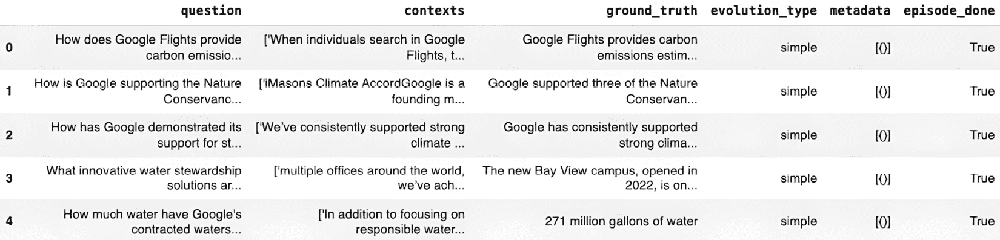
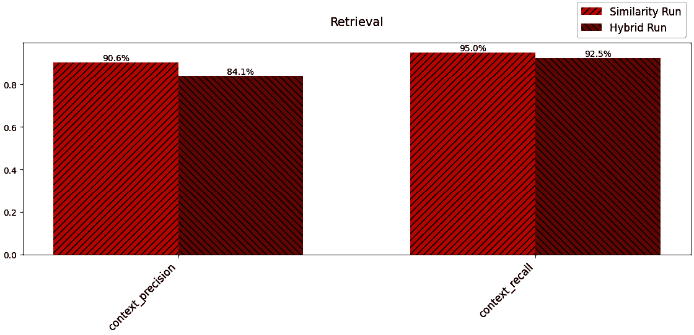
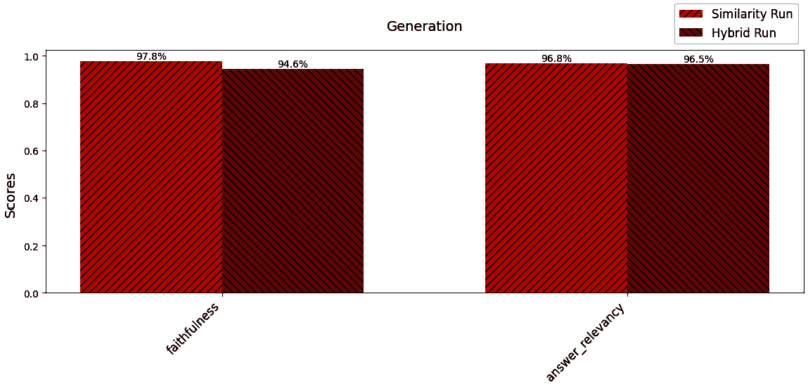
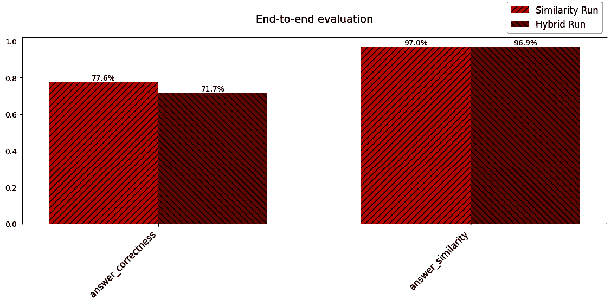

# 9

# 定量及可视化评估 RAG

评估在构建和维持**检索增强生成**（**RAG**）管道中起着至关重要的作用。当你构建管道时，你可以使用评估来识别改进领域，优化系统的性能，并系统地衡量改进的影响。当你的 RAG 系统部署后，评估可以帮助确保系统的有效性、可靠性和性能。

在本章中，我们将涵盖以下主题：

+   在构建 RAG 应用时进行评估

+   部署后评估 RAG 应用

+   标准化评估框架

+   真实情况

+   代码实验室 9.1 – ragas

+   RAG 系统的附加评估技术

让我们从讨论评估如何在构建你的 RAG 系统初期阶段提供帮助开始。

# 技术要求

本章的代码放置在以下 GitHub 仓库中：[`github.com/PacktPublishing/Unlocking-Data-with-Generative-AI-and-RAG-Second-Edition/tree/main/CHAPTER_09`](https://github.com/PacktPublishing/Unlocking-Data-with-Generative-AI-and-RAG-Second-Edition/tree/main/CHAPTER_09)。

# 在构建过程中进行评估

评估在 RAG 管道的开发过程中起着至关重要的作用。通过在构建过程中持续评估你的系统，你可以识别需要改进的领域，优化系统的性能，并系统地衡量任何修改或增强的影响。

评估对于理解 RAG 管道中不同方法的权衡和限制至关重要。RAG 管道通常涉及各种技术选择，例如向量存储、检索算法和语言生成模型。这些组件中的每一个都可能对系统的整体性能产生重大影响。通过系统地评估这些组件的不同组合，你可以获得关于哪些方法对你的特定任务和领域产生最佳结果的宝贵见解。

例如，你可能会对不同的嵌入模型进行实验，例如可以免费下载的本地开源模型或每次将文本转换为嵌入时收费的云服务 API。你可能需要了解云 API 服务是否优于免费模型，以及它是否足够好以抵消额外的成本。同样，你可以评估各种语言生成模型的表现，例如 ChatGPT、Llama 和 Claude。

这个迭代评估过程帮助你做出关于最适合你的 RAG 管道架构和组件的明智决策。通过考虑效率、可扩展性和泛化能力等因素，你可以微调你的系统以实现最佳性能，同时最小化计算成本并确保在不同场景下的鲁棒性。

评估对于理解 RAG 管道中不同方法的权衡和限制至关重要。但评估在部署后也可能很有用，我们将在下一节中讨论。

# 在部署后进行评估

一旦你的 RAG 系统部署完成，评估仍然是确保其持续有效性、可靠性和性能的关键方面。持续监控和评估你部署的 RAG 管道对于保持其质量以及识别任何潜在的随着时间的推移可能出现的问题或退化至关重要。

有许多原因可能导致 RAG 系统在部署后性能下降。例如，用于检索的数据可能随着新信息的出现而变得过时或不相关。语言生成模型可能难以适应不断变化的用户查询或目标领域的变更。此外，底层基础设施，如硬件或软件组件，可能遇到性能问题或故障。

想象一下，你是一家金融财富管理公司，该公司有一个基于 RAG 的应用程序，帮助用户了解可能影响其金融投资组合的最可能因素。你的数据源可能包括过去五年内主要金融公司发布的所有分析，涵盖了你的客户群所代表的全部金融资产。

然而，在金融市场，全球的重大（宏观）事件可能对过去五年数据中未捕获的投资组合产生重大影响。重大灾难、政治不稳定，甚至某些股票的区域性事件都可能为它们的性能设定全新的轨迹。对于你的 RAG 应用程序，这代表着数据可以为你的最终用户提供的价值的变化，而且随着时间的推移，这种价值可能会迅速下降，如果没有适当的更新。用户可能会开始询问 RAG 应用程序无法处理的具体事件，例如*“刚刚发生的五级飓风将在下一年对我的投资组合产生什么影响？”* 但通过持续的更新和监控，尤其是关于飓风影响的最新报告，这些问题很可能会得到妥善解决。

为了减轻这些风险，持续监控你的 RAG 系统至关重要，尤其是在常见的故障点。通过持续评估你 RAG 管道的这些关键组件，你可以主动识别并解决任何性能退化。这可能包括用新鲜和相关的数据更新检索语料库，在新数据上微调语言生成模型，或者优化系统的基础设施以处理增加的负载或解决性能瓶颈。

此外，建立反馈循环，使用户能够报告任何问题或提供改进建议，这一点至关重要。通过积极征求并整合用户反馈，你可以持续改进和增强你的 RAG 系统，更好地满足用户的需求。这也可以包括监控用户界面使用、响应时间以及用户视角下生成的输出的相关性及有用性等方面。进行用户调查、分析用户交互日志和监控用户满意度指标可以提供有价值的见解，了解你的 RAG 系统是否达到了预期的目的。你如何利用这些信息在很大程度上取决于你开发了哪种类型的 RAG 应用，但一般来说，这些是持续改进部署 RAG 应用时最常监控的领域。

通过定期评估你部署的 RAG 系统，你可以确保其长期的有效性、可靠性和性能。持续的监控、主动的问题检测和对持续改进的承诺是维护高质量 RAG 管道的关键，该管道随着时间的推移为用户提供价值。

# 评估帮助你变得更好

为什么评估如此重要？简单来说，如果你不去衡量你目前的位置，然后在改进之后再次衡量，那么将很难理解是如何或是什么改进（或损害）了你的 RAG 系统的性能。

当出现问题而没有任何客观标准可以比较时，很难理解出了什么问题。是检索机制出了问题吗？是提示出了问题？还是你的 LLM 响应出了问题？这些问题是一个好的评估系统可以帮助回答的。

评估提供了一个系统性和客观的方式来衡量管道的性能，确定改进的领域，并跟踪任何更改或改进的影响。没有强大的评估框架，将很难理解你的 RAG 系统是如何进展的，以及它需要进一步改进的地方。

通过将评估视为开发过程中的一个重要组成部分，你可以持续优化和改进你的 RAG 管道，确保它提供最佳的可能结果，并满足用户不断变化的需求。

在 RAG 系统开发初期，你必须开始决定你将要考虑哪些技术组件。在这个阶段，你甚至还没有安装任何东西，所以你还不能评估你的代码，但你可以使用**标准化的评估框架**来缩小你考虑的范围。让我们讨论一些最常见的 RAG 系统元素的标准评估框架。

# 标准化的评估框架

您的 RAG 系统中的关键技术组件包括创建嵌入的嵌入模型、向量存储、向量搜索和 LLM。当您查看每个技术组件的不同选项时，每个组件都有许多标准化的指标可供比较。以下是每个类别的常见指标。

## 嵌入模型基准

**大规模文本嵌入基准** (**MTEB**) 检索排行榜评估了嵌入模型在不同数据集上的各种检索任务中的性能。MTEB 排行榜根据模型在许多嵌入和检索相关任务上的平均性能进行排名。您可以通过此链接访问排行榜：[`huggingface.co/spaces/mteb/leaderboard`](https://huggingface.co/spaces/mteb/leaderboard)。

访问此网页时，请点击 **检索** 和 **带指令的检索** 选项卡以获取特定检索的嵌入评分。为了评估排行榜上的每个模型，使用涵盖广泛领域的多个数据集测试了模型的输出，如下所示：

+   **论点检索** (**ArguAna**)

+   **气候事实检索** (**ClimateFEVER**)

+   **重复问题检索** (**CQADupstackRetrieval**)

+   **实体检索** (**DBPedia**)

+   **事实提取和验证** (**FEVER**)

+   **金融问答** (**FiQA2018**)

+   **多跳问答** (**HotpotQA**)

+   **段落和文档排序** (**MSMARCO**)

+   **事实核查** (**NFCorpus**)

+   **开放域问答** (**NQ**)

+   **重复问题检测** (**QuoraRetrieval**)

+   **科学文档检索** (**SCIDOCS**)

+   **科学声明验证** (**SciFact**)

+   **论点检索** (**Touche2020**)

+   **COVID-19 相关信息检索** (**TRECCOVID**)

排行榜根据这些任务上的平均性能对嵌入模型进行排名，提供了它们优势和劣势的全面视图。您还可以点击任何指标按该指标排序排行榜。例如，如果您对更关注金融问答的指标感兴趣，请查看在 FiQA2018 数据集上得分最高的模型。

## 向量存储和向量搜索基准

**ANN-Benchmarks** 是一个基准测试工具，用于评估近似最近邻（**ANN**）算法的性能，我们已在 *第八章* 中详细讨论。ANN-Benchmarks 评估了不同向量搜索工具在各种数据集上的搜索精度、速度和内存使用情况，包括我们在 *第八章* 中提到的向量搜索工具，例如 **Facebook AI Similarity Search** (**FAISS**), **Approximate Nearest Neighbors Oh Yeah** (**ANNOY**), 和 **Hierarchical Navigable Small Worlds** (**HNSW**)。

**基准评估信息检索**（**BEIR**）是评估向量存储和搜索算法的另一项有用资源。它提供了一个异构基准，用于跨不同领域（包括问答、事实核查和实体检索）对信息检索模型进行零样本评估。我们将在*第十三章*中进一步讨论*零样本*的含义，但基本上，它意味着没有包含任何示例的问题/用户查询，这在 RAG 中是一种常见情况。BEIR 提供了一个标准化的评估框架，并包括以下流行数据集：

+   **MSMARCO**：一个从现实世界的查询和答案中提取的大规模数据集，用于评估搜索和问答中深度学习模型的技术

+   **HotpotQA**：一个具有自然、多跳问题的问答数据集，对支持事实有强烈的监督，以支持更可解释的问答系统

+   **CQADupStack**：一个用于**社区问答**（**cQA**）研究的数据集基准，来自 12 个 Stack Exchange 子论坛，并标注了重复问题信息

这些数据集以及 BEIR 基准中的其他数据集涵盖了广泛的领域和信息检索任务，使您能够评估您的检索系统在不同环境中的性能，并将其与最先进的方法进行比较。

## LLM 基准

人工分析 LLM 性能排行榜是评估开源和专有语言模型（如 ChatGPT、Claude 和 Llama）的全面资源。它评估模型在广泛任务上的性能。为了进行质量比较，它使用多个子排行榜：

+   **通用能力**

+   **聊天机器人竞技场**

+   **推理**和**知识**

+   **大规模多任务语言****理解**（**MMLU**）

+   **多轮基准**（**MT Bench**）

它们还跟踪速度和价格，并提供分析，让您能够比较这些领域的平衡。通过根据这些任务中的性能对模型进行排名，排行榜提供了它们能力的全面视角。

可以在这里找到：[`artificialanalysis.ai/`](https://artificialanalysis.ai/)

除了通用的 LLM 排行榜，还有专注于 LLM 性能特定方面的专业排行榜。人工分析 LLM 性能排行榜评估 LLM 的技术方面，例如推理速度、内存消耗和可扩展性。它包括吞吐量（每秒处理的令牌数）、延迟（生成响应的时间）、内存占用和扩展效率等指标。这些指标有助于您了解不同 LLM 的计算需求和性能特征。

Open LLM 排行榜跟踪开源语言模型在各种自然语言理解和生成任务上的性能。它包括如**AI2 推理挑战**（**ARC**）这样的基准，用于复杂科学推理，HellaSwag 用于常识推理，MMLU 用于特定领域的性能，TruthfulQA 用于生成真实且信息丰富的响应，WinoGrande 通过代词消歧进行常识推理，以及**小学数学 8K**（**GSM8K**）用于数学推理能力。

## 对标准化评估框架的最终思考

使用标准化的评估框架和基准为比较您 RAG 管道中不同组件的性能提供了一个有价值的起点。它们涵盖了广泛的任务和领域，使您能够评估各种方法的优缺点。通过考虑这些基准的结果，以及其他因素，如计算效率和易于集成，您可以缩小选择范围，并在选择最适合您特定 RAG 应用的组件时做出更明智的决策。

然而，重要的是要注意，虽然这些标准化评估指标对于初始组件选择有帮助，但它们可能无法完全捕捉到您具有独特输入和输出的特定 RAG 管道的性能。为了真正了解您的 RAG 系统在特定用例中的表现，您需要设置自己的评估框架，该框架针对您的特定要求量身定制。这个定制化的评估系统将为您的 RAG 管道的性能提供最准确和最相关的见解。

接下来，我们需要讨论 RAG 评估中最重要且经常被忽视的一个方面，即您的真实情况数据。

# 什么是真实情况？

简而言之，真实情况数据是代表您期望在 RAG 系统达到最佳性能时理想响应的数据。

以一个实际例子来说，如果您有一个专注于允许某人询问关于兽医医学中最新癌症研究的 RAG 系统，您的数据源是所有提交给 PubMed 的最新研究论文，那么您的真实情况可能是可以对该数据提出和回答的问题和答案。您希望使用目标受众真正会提出的问题，而答案应该是您认为从 LLM 期望的理想答案。这可能有一定的客观性，但无论如何，拥有可以与您的 RAG 系统的输入和输出进行比较的一组真实情况数据，是帮助比较您所做的更改的影响并最终使系统更有效的重要方式。

## 您如何使用真实情况？

真实数据作为衡量 RAG 系统性能的基准。通过将 RAG 系统生成的输出与真实数据进行比较，你可以评估系统检索相关信息的准确性和生成准确、连贯响应的能力。真实数据有助于量化不同 RAG 方法的有效性，并确定改进的领域。

## 生成真实数据

人工创建真实数据可能耗时。如果你的公司已经有一组针对特定查询或提示的理想响应数据集，那将是一个宝贵的资源。然而，如果此类数据不可用，我们将在下一部分探讨获取真实数据的其他方法。

## 人工标注

你可以雇佣人工标注员手动为一系列查询或提示创建理想的响应。这确保了高质量的真实数据，但可能成本高昂且耗时，尤其是在大规模评估中。

## 专家知识

在某些领域，你可能可以访问**领域专家**（**SMEs**），他们可以根据他们的专业知识提供真实数据响应。这在需要准确信息的专业或技术领域尤其有用。

一种帮助实现此方法的常见方法是称为**基于规则的生成**。在基于规则的生成中，对于特定的领域或任务，你可以定义一组规则或模板来生成合成真实数据，并利用你的领域专家（SMEs）来填写模板。通过利用领域知识和预定义的模式，你可以创建与预期格式和内容相符的响应。

例如，如果你正在构建一个用于支持手机的客户支持聊天机器人，你可能有一个这样的模板：要解决[问题]，你可以尝试[解决方案]。你的领域专家可以填写各种问题-解决方案方法，其中问题可能是*电池耗尽*，解决方案是*降低屏幕亮度和关闭后台应用*。这将输入到模板中（我们称之为“补水”），最终的输出将类似于这样：要解决[电池耗尽]，你可以尝试[降低屏幕亮度和关闭后台应用]。

## 群众外包

平台如 Amazon Mechanical Turk 和 Figure Eight 允许你将创建真实数据的工作外包给大量工作者。通过提供清晰的指示和质量控制措施，你可以获得一组多样化的响应。

## 合成真实数据

在获取真实真实数据具有挑战性或不可行的情况下，生成合成真实数据可以是一个可行的替代方案。合成真实数据涉及使用现有的 LLM 或技术自动生成合理的响应。以下是一些方法：

+   **微调语言模型**：您可以在高质量响应的小数据集上微调 LLMs。通过向模型提供理想响应的示例，它可以学习为新查询或提示生成类似的响应。生成的响应可以作为合成真实值。

+   **基于检索的方法**：如果您拥有大量高质量文本数据的大型语料库，您可以使用基于检索的方法来找到与查询或提示紧密匹配的相关段落或句子。这些检索到的段落可以用作真实值响应的代理。

在构建您的 RAG 系统时，获取真实值可能是一个具有挑战性的步骤，但一旦您获得了它，您将为有效的 RAG 评估打下坚实的基础。在下一节中，我们有一个代码实验室，我们将生成合成真实值数据，并将一个有用的评估平台集成到我们的 RAG 系统中，它将告诉我们上一章中使用的混合搜索对我们结果的影响。

# 代码实验室 9.1 – ragas

**检索增强生成评估**（**ragas**）是一个专门为 RAG 设计的评估平台。在本代码实验室中，我们将逐步实现 ragas 在您的代码中的实现，生成合成真实值，然后建立一套全面的指标，您可以将其集成到您的 RAG 系统中。但评估系统是用来评估某物的，对吧？在我们的代码实验室中我们将评估什么？

如果您还记得，在*第八章*中，我们介绍了一种新的检索阶段搜索方法，称为**混合搜索**。在本代码实验室中，我们将实现基于密集向量语义的原始搜索，然后使用 ragas 评估使用混合搜索方法的影响。这将为您提供一个真实世界的实际工作示例，说明如何在自己的代码中实现一个全面的评估系统！

在我们深入探讨如何使用 ragas 之前，重要的是要注意，它是一个高度发展的项目。新功能和 API 更改在新版本中经常发生，因此在使用代码示例时，请务必参考文档网站：[`docs.ragas.io/`](https://docs.ragas.io/)。

本代码实验室从上一章结束的地方继续，当时我们添加了来自 LangChain 的`EnsembleRetriever`（*代码实验室 8.3*）：

1.  让我们从一些需要安装的新包开始：

    ```py
    $ pip install ragas==0.4.0
    $ pip install tqdm==4.67.1 -q –user
    $ pip install matplotlib==3.10.7 
    ```

1.  我们安装`ragas`，这是我们将在本代码实验室中关注的评估平台。`ragas`使用的`tqdm`包是一个流行的 Python 库，用于创建进度条并显示迭代过程的进度信息。您可能之前已经遇到过`matplotlib`包，因为它是一个广泛使用的 Python 绘图库。我们将使用它来为我们的评估指标结果提供可视化。

1.  接下来，我们需要添加一些与我们刚刚安装的相关的导入语句：

    ```py
    import tqdm as notebook_tqdm
    import pandas as pd
    import matplotlib.pyplot as plt
    from ragas import EvaluationDataset, SingleTurnSample, evaluate
    from ragas.llms import LangchainLLMWrapper
    from ragas.embeddings import LangchainEmbeddingsWrapper
    from ragas.testset import TestsetGenerator
    from ragas.testset.synthesizers.single_hop.specific import (
        SingleHopSpecificQuerySynthesizer)
    from ragas.metrics import (
        LLMContextRecall,
        Faithfulness, FactualCorrectness,
        ResponseRelevancy,
        LLMContextPrecisionWithoutReference,
        SemanticSimilarity
    ) 
    ```

1.  如前所述，`tqdm`将使我们的`ragas`平台在执行耗时处理任务时能够使用进度条。我们将使用流行的 pandas 数据操作和分析库将我们的数据拉入`DataFrames`作为我们分析的一部分。`matplotlib.pyplot as plt`的导入使我们能够为我们的指标结果添加可视化（在这种情况下是图表）。我们还从`datasets`中导入`Dataset`。`datasets`库是由 Hugging Face 开发和维护的开源库。`datasets`库提供了一个标准化的接口，用于访问和操作各种数据集，通常专注于**自然语言处理**（**NLP**）领域。最后，我们将从`ragas`库中导入多个包。让我们更深入地审查这些导入：

    +   `from ragas import EvaluationDataset, SingleTurnSample, evaluate`: `evaluate`函数接受`EvaluationDataset`和指标，并在 RAG 管道上运行评估。`SingleTurnSample`表示一个包含其上下文和参考的单个问题-答案对。`EvaluationDataset`是一个容器，用于存储多个`SingleTurnSample`对象以进行评估。

    +   `from ragas.llms import LangchainLLMWrapper`: 这个包装器允许使用 RAGAS 指标进行 LLM 评估的 LangChain LLM 对象。

    +   `from ragas.embeddings import LangchainEmbeddingsWrapper`: 这个包装器允许使用 RAGAS 指标进行嵌入的 LangChain 嵌入模型。

    +   `from ragas.testset import TestsetGenerator`: `TestsetGenerator`类用于为评估 RAG 管道生成合成的真实数据集。它接受文档并生成问题-答案对以及相应的上下文。

    +   `from ragas.testset.synthesizers.single_hop.specific import SingleHopSpecificQuerySynthesizer`: 这个合成器生成可以使用单个文档块中的信息回答的单跳问题。

    +   `from ragas.metrics import…()`: 这个`import`语句引入了各种评估指标：`Faithfulness`、`ResponseRelevancy`、`LLMContextPrecisionWithoutReference`、`LLMContextRecall`、`FactualCorrectness`和`SemanticSimilarity`。

总体而言，从`ragas`库中导入的这些内容提供了一套全面的工具，用于生成合成测试数据集、使用各种指标评估 RAG 管道以及分析性能结果。

## 设置 LLM/嵌入模型

现在，我们将升级我们处理我们的 LLM 和嵌入服务的方式。使用`ragas`，我们正在引入我们使用的 LLM 数量的更多复杂性；我们希望通过提前设置嵌入服务和 LLM 服务的初始化来更好地管理它们。让我们看看代码：

```py
embedding_ada = "text-embedding-ada-002"
model_gpt35="gpt-3.5-turbo"
model_gpt4="gpt-4o-mini"
embedding_function = OpenAIEmbeddings(
    model=embedding_ada, openai_api_key=openai.api_key)
llm = ChatOpenAI(
    model=model_gpt35, openai_api_key=openai.api_key, temperature=0.0)
generator_llm = ChatOpenAI(
    model=model_gpt35, openai_api_key=openai.api_key, temperature=0.0)
generator_embeddings = LangchainEmbeddingsWrapper(
    OpenAIEmbeddings(model=embedding_ada,openai_api_key=openai.api_key))
critic_llm_raw = ChatOpenAI(
    model=model_gpt4,openai_api_key=openai.api_key, temperature=0.0)
embeddings_raw = OpenAIEmbeddings(
    model=embedding_ada,openai_api_key=openai.api_key)
critic_llm_wrapped = LangchainLLMWrapper(critic_llm_raw)
embeddings_wrapped = LangchainEmbeddingsWrapper(embeddings_raw) 
```

注意，尽管我们仍然只使用一个嵌入服务，但我们现在有两个不同的 LLM 可以调用。然而，这个的主要目标是建立我们想要直接用于 LLM 的*主要* LLM，然后是两个额外的 LLM，它们被指定用于评估过程（`generator_llm`和`critic_llm`）。

我们有使用更先进的 LLM（ChatGPT-4o-mini）的好处，我们可以将其用作评估 LLM，从理论上讲，这意味着它可以更有效地评估我们输入给它的输入。但这并不总是如此，或者你可能有一个专门针对评估任务微调的 LLM。无论如何，将这些 LLM 区分开来，以专门的设计来使用，展示了不同的 LLM 如何在 RAG 系统中用于不同的目的。你可以从之前初始化 LLM 对象的代码中删除以下行：

```py
llm = ChatOpenAI(model_name="gpt-4o-mini", temperature=0) 
```

接下来，我们将添加一个新的 RAG 链来运行相似度搜索（这是我们最初仅使用密集嵌入运行的）：

```py
rag_chain_similarity = RunnableParallel(
        {"context": dense_retriever,
        "question": RunnablePassthrough()
}).assign(answer=rag_chain_from_docs) 
```

为了使事情更清晰，我们将使用此名称更新混合 RAG 链：

```py
rag_chain_hybrid = RunnableParallel(
        {"context": ensemble_retriever,
        "question": RunnablePassthrough()
}).assign(answer=rag_chain_from_docs) 
```

注意`rag_chain_hybrid`，它以前是`rag_chain_with_source`，代表混合搜索方面。

现在我们将更新我们提交用户查询的原始代码，但这次我们将使用相似度和混合搜索版本。

创建相似度版本：

```py
user_query = "What are Google's environmental initiatives?"
result = rag_chain_similarity.invoke(user_query)
retrieved_docs = result['context']
print(f"Original Question to Similarity Search: {user_query}\n")
print(f"Relevance Score: {result['answer']['relevance_score']}\n")
print(f"Final Answer:\n{result['answer']['final_answer']}\n\n")
print("Retrieved Documents:")
for i, doc in enumerate(retrieved_docs, start=1):
    print(f"Document {i}: Document ID: {doc.metadata['id']}
        source: {doc.metadata['source']}")
    print(f"Content:\n{doc.page_content}\n") 
```

现在，创建混合版本：

```py
user_query = "What are Google's environmental initiatives?"
result = rag_chain_hybrid.invoke(user_query)
retrieved_docs = result['context']
print(f"Original Question to Dense Search:: {user_query}\n")
print(f"Relevance Score: {result['answer']['relevance_score']}\n")
print(f"Final Answer:\n{result['answer']['final_answer']}\n\n")
print("Retrieved Documents:")
for i, doc in enumerate(retrieved_docs, start=1):
    print(f"Document {i}: Document ID: {doc.metadata['id']}
        source: {doc.metadata['source']}")
    print(f"Content:\n{doc.page_content}\n") 
```

这两套代码之间的主要区别在于，它们展示了我们创建的不同 RAG 链的使用，`rag_chain_similarity`和`rag_chain_hybrid`。

首先，让我们看看相似度搜索的输出：

```py
Google's environmental initiatives include empowering individuals to take action, working together with partners and customers, operating sustainably, achieving net-zero carbon emissions, water stewardship, and promoting a circular economy. They have implemented sustainability features in products like Google Maps, Google Nest thermostats, and Google Flights to help individuals make more sustainable choices. Google also supports various environmental organizations and initiatives, such as the iMasons Climate Accord, ReFED, and The Nature Conservancy, to accelerate climate action and address environmental challenges. Additionally, Google is involved in public policy advocacy and is committed to reducing its environmental impact through its operations and value chain. 
```

接下来是混合搜索的输出：

```py
Google's environmental initiatives include empowering individuals to take action, working together with partners and customers, operating sustainably, achieving net-zero carbon emissions, focusing on water stewardship, promoting a circular economy, engaging with suppliers to reduce energy consumption and greenhouse gas emissions, and reporting environmental data. They also support public policy and advocacy for low-carbon economies, participate in initiatives like the iMasons Climate Accord and ReFED, and support projects with organizations like The Nature Conservancy. Additionally, Google is involved in initiatives with the World Business Council for Sustainable Development and the World Resources Institute to improve well-being for people and the planet. They are also working on using technology and platforms to organize information about the planet and make it actionable to help partners and customers create a positive impact. 
```

说什么更好可能是主观的，但如果你回顾一下*第八章*的代码，每个链的检索机制都会返回一组不同的数据，供 LLM 作为回答用户查询的基础。你可以看到这些差异在前面的响应中有所反映，每个都有略微不同的信息和突出显示该信息的不同方面。

到目前为止，我们已经设置了我们的 RAG 系统，使其能够使用两个不同的 RAG 链，一个专注于仅使用相似度/密集搜索，另一个使用混合搜索。这为将`ragas`应用于我们的代码，以建立对从这些链中获取的结果进行更客观评估的方法奠定了基础。

## 生成合成的真实数据

正如我们在上一节中提到的，真实数据是我们进行此评估分析的关键元素。但我们没有真实数据；哦不！没问题——我们可以使用`ragas`为此目的生成合成数据。

**警告**

`ragas`库广泛使用了你的 LLM API。`ragas`将提供的分析是 LLM 辅助评估，这意味着每次生成或评估真实示例时，都会调用一个 LLM（有时为一个指标多次调用）并产生 API 费用。如果你生成 100 个真实示例，包括问题和答案的生成，然后运行六个不同的评估指标，你进行的 LLM API 调用数量会大幅增加，远远超过千次调用。建议在使用之前谨慎使用，直到你很好地掌握了调用频率。这些是产生费用的 API 调用，它们有可能使你的 LLM API 账单大幅增加！在撰写本文时，我每次运行整个代码实验室（仅使用 10 个真实示例和 6 个指标）时，费用约为 2 到 2.50 美元。如果你有更大的数据集，或者将`test_size`设置为你的`testset`生成器以生成超过 10 个示例，费用将大幅增加。

我们首先创建一个生成器实例，我们将使用它来生成我们的真实数据集：

```py
# Prepare documents
generator = TestsetGenerator(
    llm=generator_llm,
    embedding_model=generator_embeddings
)
documents = [Document(page_content=chunk) for chunk in splits]
# Define query distribution (only single-hop)
query_distribution = [
    (SingleHopSpecificQuerySynthesizer(llm=generator_llm), 1.0),
]
# Generate testset
testset = generator.generate_with_langchain_docs(
    documents,
    testset_size=10,
    query_distribution=query_distribution
)
testset_df = testset.to_pandas()
testset_df.to_csv(os.path.join('testset_data.csv'), index=False)
print("testset DataFrame saved successfully in the local directory.") 
```

如此代码所示，我们正在使用`generator_llm`和`generator_embeddings`。`query_distribution`参数取代了旧的`distributions`参数，我们使用`SingleHopSpecificQuerySynthesizer`来生成问题。正如之前的*警告*框所述，请注意这一点！这里有三个不同的 API 可以生成大量的费用，如果你在这个代码中的设置不小心的话。在这个代码中，我们还对我们的早期生成的数据分割进行预处理，以便更有效地与`ragas`一起工作。每个分割中的块都被假定为表示文档一部分的字符串。`Document`类来自`LangChain`库，是一种方便的方式来表示带有其内容的文档。

`testset`使用我们的生成器对象中的`generator_with_langchain_docs`函数来生成一个合成的测试。这个函数接受`documents`列表作为输入。`test_size`参数设置要生成的测试问题的数量（在这种情况下，10）。`distributions`参数定义了问题类型的分布，在这个例子中，简单问题占数据集的 50%，推理问题占 25%，多上下文问题占 25%。然后我们将`testset`转换为 pandas 的`DataFrame`，我们可以用它来查看结果，并将其保存为文件。考虑到我们刚才提到的费用，在这个时候将数据保存为 CSV 文件，可以提供额外的便利，只需运行一次此代码即可！

现在让我们将保存的数据集重新调取并查看它！

```py
saved_testset_df = pd.read_csv(os.path.join('testset_data.csv'))
print("testset DataFrame loaded successfully from local directory.")
saved_testset_df.head(5) 
```

输出应该看起来像你在*图 9.1*中看到的那样：



图 9.1 – 显示合成真实数据的 DataFrame

在这个数据集中，你可以看到由你之前初始化的`generator_llm`实例生成的`user_input`（问题）和参考（答案）。现在你有了你的真实答案！LLM 将尝试为我们的真实答案生成 10 个不同的问答对，但在某些情况下，可能会发生失败，这限制了这种生成。这将导致比你在`test_size`变量中设置的更少的真实示例。在这种情况下，生成结果是 7 个示例，而不是 10 个。总的来说，你可能希望生成超过 10 个示例，以便彻底测试你的 RAG 系统。然而，在这个简单的例子中，我们将接受 7 个示例，主要是为了降低你的 API 成本！

接下来，让我们准备评估数据集：

```py
def generate_ragas_sample(question, ground_truth, rag_chain):
    result = rag_chain.invoke(question)

    return SingleTurnSample(
        user_input=question,
        response=result["answer"]["final_answer"],
        retrieved_contexts=[
            doc.page_content for doc in result["context"]],
        reference=ground_truth
    ) 
```

这个函数创建一个`SingleTurnSample`对象，它接受一个问题、`ground_truth`数据和`rag_chain`作为输入。`SingleTurnSample`对象需要以下内容：

+   `user_input`: 用户提出的问题

+   `response`: 来自我们的 RAG 链生成的答案

+   `retrieved_contexts`: 被检索到的文档内容列表

+   `reference`: 真实答案

这个函数很灵活，它可以接受我们提供的任意一个链，这在我们需要生成相似性和混合链的分析时将非常有用。

现在我们已经准备好更充分地准备我们的数据集以与`ragas`一起使用：

```py
similarity_samples = []
for _, row in saved_testset_df.iterrows():
    try:
        sample = generate_ragas_sample(
            row["user_input"],
            row["reference"],
            rag_chain_similarity
        )
        similarity_samples.append(sample)
    except Exception as e:
        print(f"Error: {e}")
        continue
evaluation_dataset_similarity = EvaluationDataset(
    samples=similarity_samples) 
```

在此代码中，我们遍历我们的保存的测试集`DataFrame`并为每一行创建`SingleTurnSample`对象。然后，这些样本被收集到`EvaluationDataset`对象中，这是`ragas`用于评估数据的容器。

最后，让我们在两个数据集上运行`ragas`。首先，我们初始化指标：

```py
metrics = [
    Faithfulness(llm=critic_llm_wrapped),
    ResponseRelevancy(
        llm=critic_llm_wrapped, embeddings=embeddings_wrapped),
    LLMContextPrecisionWithoutReference(llm=critic_llm_wrapped),
    LLMContextRecall(llm=critic_llm_wrapped),
    FactualCorrectness(llm=critic_llm_wrapped),
    SemanticSimilarity(embeddings=embeddings_wrapped)
] 
```

下面是应用 ragas 到我们的相似性 RAG 链的代码：

```py
score_similarity = evaluate(
    dataset=evaluation_dataset_similarity,
    metrics=metrics
)
similarity_df = score_similarity.to_pandas() 
```

在这里，我们应用`ragas`来评估`evaluation_dataset_similarity`，使用`ragas`库中的`evaluate()`函数。评估使用指定的指标进行，包括`Faithfulness`（忠实度）、`ResponseRelevancy`（响应相关性）、`LLMContextPrecisionWithoutReference`（无参考的 LLM 上下文精确度）、`LLMContextRecall`（LLM 上下文召回率）、`FactualCorrectness`（事实正确性）和`SemanticSimilarity`（语义相似度）。评估结果存储在`score_similarity`变量中，然后使用`to_pandas()`方法将其转换为 pandas DataFrame，即`similarity_df`。我们也将对混合数据集做同样处理：

```py
score_hybrid = evaluate(
    dataset=evaluation_dataset_hybrid,
    metrics=metrics
)
hybrid_df = score_hybrid.to_pandas() 
```

一旦你达到这个阶段，`ragas`的使用就完成了！我们现在已经使用`ragas`对两个链进行了全面评估，在这两个 DataFrame，即`similarity_df`和`hybrid_df`中，我们有了所有的指标数据。我们剩下要做的就是分析`ragas`提供的数据。

## 分析 ragas 的结果

我们将在接下来的代码实验室中花费时间格式化数据，以便我们首先保存和持久化它（因为，再次强调，这可能是我们 RAG 系统成本较高的部分）。其余的代码可以在未来重用，以从`.csv`文件中提取数据，如果你保存了它们，这将防止你不得不重新运行这个可能成本高昂的评估过程。

让我们从设置一些重要变量并保存我们收集到的数据到 CSV 文件开始：

```py
key_columns = [
    'faithfulness',
    'answer_relevancy',
    'llm_context_precision_without_reference',
    'context_recall',
    'factual_correctness(mode=f1)',
    'semantic_similarity'
]
similarity_means = similarity_df[key_columns].mean()
hybrid_means = hybrid_df[key_columns].mean()
comparison_df = pd.DataFrame({
    'Similarity Run': similarity_means,
    'Hybrid Run': hybrid_means
})
comparison_df['Difference'] = comparison_df['Similarity Run'] - 
    comparison_df['Hybrid Run']
# Save dataframes
similarity_df.to_csv(os.path.join('similarity_run_data.csv'), index=False)
hybrid_df.to_csv(os.path.join('hybrid_run_data.csv'), index=False)
comparison_df.to_csv(os.path.join('comparison_data.csv'), index=True)
print("Dataframes saved successfully in the local directory.") 
```

在这段代码中，我们首先定义一个包含用于比较的关键列名称的`key_columns`列表。然后，我们使用`mean()`方法计算`similarity_df`和`hybrid_df`中每个关键列的平均分数，并将它们分别存储在`similarity_means`和`hybrid_means`中。

接下来，我们创建一个新的名为`comparison_df`的 DataFrame，用于比较相似性运行和混合运行的平均分数。在`comparison_df`中添加了一个名为`Difference`的列，该列是相似性运行和混合运行平均分数之间的差值。最后，我们将`similarity_df`、`hybrid_df`和`comparison_df`DataFrame 保存为`.csv`文件。我们将再次保存这些文件，未来我们可以从这些文件中工作，而无需返回并重新生成一切。

此外，请记住，这只是进行分析的一种方式。这是你将想要发挥创意并调整此代码以进行关注你特定 RAG 系统中重要方面的分析的地方。例如，你可能只专注于改进你的检索机制。或者，你可以将此应用于从部署环境中流出的数据，在这种情况下，你很可能没有真实数据，并将希望关注可以在没有真实数据的情况下工作的指标（有关该概念的更多信息，请参阅本章后面的*Ragas 创始人洞察*部分）。

尽管如此，我们继续进行这项分析，现在我们希望将我们保存的文件拉回以完成我们的分析，然后打印出我们对 RAG 系统在两个不同链上的每个阶段的分析的总结：

```py
sem_df = pd.read_csv(os.path.join('similarity_run_data.csv'))
rec_df = pd.read_csv(os.path.join('hybrid_run_data.csv'))
comparison_df = pd.read_csv(os.path.join('comparison_data.csv'),
    index_col=0)
print("Dataframes loaded successfully from the local directory.")
print("Performance Comparison:")
print("\n**Retrieval**:")
print(comparison_df.loc[
     ['llm_context_precision_without_reference', 'context_recall']])
print("\n**Generation**:")
print(comparison_df.loc[['faithfulness', 'answer_relevancy']])
print("\n**End-to-end evaluation**:")
print(comparison_df.loc[
     ['factual_correctness(mode=f1)', 'semantic_similarity']]) 
```

代码的这一部分将生成一系列我们将进一步检查的指标。我们首先从之前代码块中生成的 CSV 文件中加载`DataFrames`。然后，我们应用一个分析，将所有内容合并为更易于阅读的分数。

我们继续使用在之前的代码块中定义的变量来帮助使用 Matplotlib 生成绘图：

```py
fig, axes = plt.subplots(3, 1, figsize=(12, 18), sharex=False)
bar_width = 0.35
categories = ['Retrieval', 'Generation', 'End-to-end evaluation']
metrics_list = [
    ['llm_context_precision_without_reference', 'context_recall'],
    ['faithfulness', 'answer_relevancy'],
    ['factual_correctness(mode=f1)', 'semantic_similarity']
] 
```

在这里，我们为每个类别创建具有增加间距的子图。

接下来，我们将遍历每个这些类别并绘制相应的指标：

```py
for i, (category, metric_list) in enumerate(zip(categories, metrics)):
    ax = axes[i]
    x = range(len(metric_list))
    similarity_bars = ax.bar(
    x, comparison_df.loc[metric_list, 'Similarity Run'],
    width=bar_width, label='Similarity Run',
    color='#D51900')
    for bar in similarity_bars:
        height = bar.get_height()
        ax.text(
            bar.get_x() + bar.get_width() / 2,
            height, f'{height:.1%}', ha='center',
            va='bottom', fontsize=10)
    hybrid_bars = ax.bar(
        [i + bar_width for i in x],
        comparison_df.loc[metric_list, 'Hybrid Run'],
        width=bar_width, label='Hybrid Run',
        color='#992111')
    for bar in hybrid_bars:
        height = bar.get_height()
        ax.text(
            bar.get_x() + bar.get_width() / 2,
            height, f'{height:.1%}', ha='center',
            va='bottom', fontsize=10)
    ax.set_title(category, fontsize=14, pad=20)
    ax.set_xticks([i + bar_width / 2 for i in x])
    ax.set_xticklabels(metric_list, rotation=45,
        ha='right', fontsize=12)
    ax.legend(fontsize=12, loc='lower right',
        bbox_to_anchor=(1, 0)) 
```

这段代码主要关注格式化我们的可视化，包括为相似性和混合运行绘制条形图，以及向这些条形图中添加值。我们给这些条形图添加了一些颜色，甚至添加了一些散列来提高视觉障碍者的可访问性。

我们需要对可视化进行一些额外的改进：

```py
fig.text(0.04, 0.5, 'Scores', va='center',
    rotation='vertical', fontsize=14)
fig.suptitle('Performance Comparison', fontsize=16)
plt.tight_layout(rect=[0.05, 0.03, 1, 0.95])
plt.subplots_adjust(hspace=0.6, top=0.92)
plt.show() 
```

在此代码中，我们为可视化添加了标签和标题。我们还调整了子图之间的间距并增加了顶部边距。最后，我们使用`plt.show()`在笔记本界面中显示可视化。

总体来说，本节中的代码将生成一个基于文本的分析，展示来自两个链的结果，然后以条形图的形式生成可视化。虽然代码会一起生成所有这些内容，但我们将会将输出拆分，并针对我们 RAG 系统的主要阶段逐一讨论。

正如我们在前面的章节中讨论的那样，当 RAG 被激活时，它有两个主要的行为阶段：检索和生成。在评估一个 RAG 系统时，您也可以根据这两个类别来分解您的评估。让我们首先讨论如何评估检索。

## 检索评估

Ragas 为评估 RAG 管道的每个阶段提供了指标。对于检索，`ragas`有两个指标，称为**上下文精确度**和**上下文召回率**。您可以在输出和图表的这一部分看到这一点：

**性能比较：**

```py
**Retrieval**:
                   Similarity Run  Hybrid Run  Difference
context_precision        0.906113    0.841267    0.064846
context_recall           0.950000    0.925000    0.025000 
```

您可以在*图 9.2*中看到检索指标的图表：



图 9.2 – 显示相似性搜索和混合搜索之间检索性能比较的图表

检索评估专注于评估检索到的文档的准确性和相关性。我们使用 ragas 通过以下两个指标来完成这项工作，如 ragas 文档网站所述：

+   `llm_context_precision_without_reference`：检索到的上下文的信噪比。此指标评估上下文中是否存在所有真实相关项，并且这些项是否都被排名较高。

+   `context_recall`：它能否检索到回答问题所需的所有相关信息？`context_recall`衡量的是检索到的上下文与标注答案（被视为真实情况）的一致程度。它是基于真实情况和检索到的上下文计算的，其值介于 0 和 1 之间，值越高表示性能越好。

如果您来自传统的数据科学或信息检索背景，您可能会识别出术语*精确度*和*召回率*，并想知道这些术语之间是否有任何关系。ragas 中使用的上下文精确度和上下文召回率指标在概念上与传统精确度和召回率指标相似。

在传统意义上，**精确度**衡量的是检索到的相关项的比例，而**召回率**衡量的是检索到的相关项占所有相关项的比例。

同样，上下文精确度通过评估是否将真实相关项排名更高来评估检索到的上下文的相关性，而上下文召回度衡量检索到的上下文覆盖所需回答问题的相关信息的程度。

然而，有一些关键差异需要注意。

传统精度和召回通常基于每个项目的二元相关性判断（相关或不相关），而`ragas`中的上下文精度和召回考虑了检索到的上下文与真实答案的排名和一致性。此外，上下文精度和召回专门设计来评估问答任务中的检索性能，考虑到检索相关信息的特定要求以回答给定问题。

当查看我们分析的结果时，我们需要记住，我们使用的小数据集作为我们的真实情况。事实上，我们整个 RAG 系统基于的原始数据集也很小，这也可能影响我们的结果。因此，我不会太在意您在这里看到的数字。但这一点确实向您展示了如何使用 ragas 进行分析，并提供关于我们 RAG 系统检索阶段的非常信息性的表示。这个代码实验室主要是为了演示您在构建 RAG 系统时可能会遇到的真实世界挑战，其中您必须考虑您特定用例中的不同指标，这些不同指标之间的权衡，以及必须决定哪种方法以最有效的方式满足您的需求。

接下来，我们将回顾我们 RAG 系统生成阶段的类似分析。

## 生成评估

如前所述，`ragas` 为评估 RAG 管道每个阶段的独立性能提供了指标。对于生成阶段，`ragas` 有两个指标，称为忠实度和答案相关性，正如您在这里，输出部分的这部分和以下图表中所示：

```py
**Generation**:
                  Similarity Run  Hybrid Run  Difference
faithfulness            0.977500    0.945833    0.031667
answer_relevancy        0.968222    0.965247    0.002976 
```

生成指标可以在*图 9.3*中的图表中看到：



图 9.3 – 展示相似性搜索和混合搜索之间生成性能比较的图表

生成评估衡量当提供上下文时，系统生成的响应的适当性。我们使用`ragas`通过以下两个指标进行此操作，如`ragas`文档中所述：

+   `忠实度`：生成的答案在事实上的准确性如何？这衡量了生成的答案与给定上下文的事实一致性。它从答案和检索到的上下文中计算得出。答案被缩放到（0-1）的范围，分数越高越好。

+   `answer_relevancy`：生成的答案与问题相关性强吗？答案相关性侧重于评估生成的答案与给定提示的相关性。对于不完整或包含冗余信息的答案，会分配较低的分数，而较高的分数表示更好的相关性。此指标使用问题、上下文和答案来计算。

再次强调，我们使用的小数据集作为我们的真实数据和数据集，这可能导致这些结果的可信度较低。但你可以从这里看到这些结果如何为我们 RAG 系统的生成阶段提供一个非常有信息量的表示。

这就引出了我们下一组指标，即端到端评估指标，我们将在下一部分讨论。

# 端到端评估

除了提供评估 RAG 管道每个阶段独立指标的度量外，`ragas`还提供了评估整个 RAG 系统的指标，称为端到端评估。对于生成阶段，`ragas`有两个指标，称为**答案正确性**和**答案相似性**，正如你在输出和图表的最后部分所看到的：

```py
**End-to-end evaluation**:
                    Similarity Run  Hybrid Run  Difference
answer_correctness        0.776018    0.717365    0.058653
answer_similarity         0.969899    0.969170    0.000729 
```

*图 9.4*中的图表显示了这些结果的可视化：



图 9.4 – 显示相似性搜索和混合搜索端到端性能比较的图表

端到端指标用于评估管道的端到端性能，衡量使用管道的整体体验。结合这些指标提供了对 RAG 管道的全面评估。我们使用`ragas`通过以下三个指标来完成这项工作，如`ragas`文档中所述：

+   `factual_correctness`：衡量生成的答案与真实值相比的准确性。对事实正确性的评估涉及衡量生成的答案与真实值相比的准确性。

+   `semantic_similarity`：评估生成的答案与真实值之间的语义相似度。语义相似度涉及评估生成的答案与真实值之间的语义相似度。

+   `answer_similarity`：评估生成的答案与真实值之间的语义相似度。答案语义相似度的概念涉及评估生成的答案与真实值之间的语义相似度。这种评估基于真实值和答案，值在 0 到 1 之间。较高的分数表示生成的答案与真实值之间的更好对齐。

评估管道的端到端性能同样至关重要，因为它直接影响用户体验，并有助于确保全面评估。

为了使这个代码实验室保持简单，我们省略了一些你可能也会考虑在分析中使用的更多指标。让我们接下来讨论这些指标。

# 其他按组件评估

按组件评估涉及评估管道的各个单独组件，例如检索和生成阶段，以了解其有效性并确定改进领域。我们已分享了每个这些阶段的两个指标，但这里还有几个在`ragas`平台上可用的指标：

+   **上下文相关性**: 此指标衡量检索到的上下文的相关性，基于问题和上下文进行计算。值在（0-1）范围内，值越高表示相关性越好。

+   **上下文实体召回率**: 此指标提供了检索到的上下文的召回率度量，基于参考数据和上下文数据中存在的实体数量与仅参考数据中存在的实体数量的相对数量。

+   **方面批评**: 方面批评旨在根据预定义的方面（如无害性和正确性）评估提交内容。此外，用户可以根据他们的特定标准定义自己的方面来评估提交内容。方面批评的输出是二进制的，表示提交是否与定义的方面一致。此评估使用“答案”作为输入。

这些额外的按组件评估指标在评估检索到的上下文和生成的答案时提供了更细粒度的评估。为了完成这个代码实验室，我们将引入一些创始人直接提供的见解，以帮助你进行 RAG 评估。

**创始人视角**

在准备本章内容时，我们有机会与`ragas`的创始人之一 Shahul Es 交谈，以获取有关平台以及如何更好地利用它进行 RAG 开发和评估的额外见解。`Ragas`是一个年轻平台，但正如你在代码实验室中看到的，它已经建立了一个坚实的指标基础，你可以实施这些指标来评估你的 RAG 系统。但这也意味着`ragas`有很大的成长空间；这个专门为 RAG 实现而构建的平台将继续发展。Shahul 提供了一些有用的提示和见解，我们将在此总结并与你分享。我们将在以下部分分享那次讨论的笔记。

## Ragas 创始人见解

以下是从与 ragas 联合创始人 Shahul Es 的讨论中摘录的笔记，讨论了如何使用 ragas 进行 RAG 评估：

+   **合成数据生成**：人们在 RAG 评估中通常遇到的第一道障碍是没有足够的测试真实数据。Ragas 的主要重点是创建一个算法，可以创建一个覆盖广泛问题类型的测试数据集，从而产生它们的合成数据生成能力。一旦你使用 ragas 合成了你的真实数据，检查生成的真实数据并挑选出任何不属于的问题将是有帮助的。

+   **反馈指标**：目前在其开发中被强调的是将各种反馈循环纳入评估，包括性能和用户反馈，其中存在明确的指标（出了问题）和隐含指标（满意度水平、点赞/踩和类似机制）。与用户的任何互动都可能具有潜在的隐含性。隐含反馈可能嘈杂（从数据的角度看），但如果使用得当，仍然是有用的。

+   **参考和非参考指标**：Shahul 将指标分为参考指标和非参考指标，其中参考意味着它需要真实数据来处理。ragas 团队在其工作中强调构建非参考指标，你可以在 ragas 论文中了解更多信息（[`arxiv.org/abs/2309.15217`](https://arxiv.org/abs/2309.15217)）。对于许多领域，真实数据难以收集，这是一个重要的观点，因为这至少使得一些评估仍然成为可能。Shahul 提到的参考非参考指标包括忠实度和答案相关性。

+   **部署评估**：无参考评估指标也适用于部署评估，在这种情况下，你不太可能有一个可用的真实数据。

这些是一些关键见解，看到 ragas 在未来如何发展以帮助我们所有人不断改进我们的 RAG 系统将会非常令人兴奋。你可以在以下链接找到最新的 ragas 文档：[`docs.ragas.io/en/stable/`](https://docs.ragas.io/en/stable/)。

这就结束了我们使用 ragas 进行的评估代码实验室。但 ragas 并不是用于 RAG 评估的唯一工具；还有很多其他工具！接下来，我们将讨论一些你可以考虑的其他方法。

# 其他评估技术

Ragas 只是众多评估工具和技术中的一种，用于评估你的 RAG 系统。这不是一个详尽的列表，但在接下来的小节中，我们将讨论一些更受欢迎的技术，你可以在获得或生成真实数据后使用这些技术来评估你的 RAG 系统的性能。

## 双语评估助手（BLEU）

BLEU 指标衡量生成响应和真实响应之间的 n-gram 重叠。它提供了一个表示两者之间相似度的分数。在 RAG 的背景下，BLEU 可以通过将生成答案与真实答案进行比较来评估生成答案的质量。通过计算 n-gram 重叠，BLEU 评估生成答案在词汇选择和措辞方面与参考答案的匹配程度。然而，需要注意的是，BLEU 更关注表面层的相似性，可能无法捕捉到生成答案的语义意义或相关性。

## Gisting 评估的召回导向辅助者（ROUGE）

ROUGE 通过将生成响应与真实响应在召回方面进行比较来评估生成响应的质量。它衡量有多少真实响应被包含在生成响应中。在 RAG 评估中，ROUGE 可以用来评估生成答案的覆盖率和完整性。通过计算生成答案和真实答案之间的召回率，ROUGE 评估生成答案在多大程度上捕捉到参考答案中的关键信息和细节。当真实答案更长或更详细时，ROUGE 特别有用，因为它关注信息的重叠而不是精确的词匹配。

## 语义相似度

可以使用余弦相似度或**语义文本相似度**（**STS**）等指标来评估生成响应与真实响应之间的语义相关性。这些指标捕捉了超出精确词匹配的意义和上下文。在 RAG 评估中，语义相似度指标可以用来评估生成答案的语义连贯性和相关性。通过比较生成答案和真实答案的语义表示，这些指标评估生成答案在多大程度上捕捉到参考答案的潜在意义和上下文。当生成答案可能使用不同的词汇或措辞，但仍然传达与真实答案相同的意义时，语义相似度指标特别有用。

## 人工评估

虽然自动化指标提供了定量评估，但人工评估在评估生成响应与真实响应之间的连贯性、流畅性和整体质量方面仍然很重要。在 RAG 的背景下，人工评估涉及让人类评分者根据各种标准评估生成答案。这些标准可能包括与问题的相关性、事实的正确性、答案的清晰度以及整体连贯性。人类评估者可以提供自动化指标可能无法捕捉到的定性反馈和见解，例如答案语气的适当性、是否存在任何不一致或矛盾，以及整体用户体验。人工评估可以通过提供更全面和细致的评估来补充自动化指标，从而更全面地评估 RAG 系统的性能。

在评估 RAG 系统时，通常使用这些评估技术的组合来获得系统性能的整体视图是有益的。每种技术都有其优势和局限性，使用多个指标可以提供更稳健和全面的评估。此外，在选择适当的评估技术时，考虑您 RAG 应用的具体需求和目标也很重要。某些应用可能优先考虑事实的正确性，而其他应用可能更关注生成的答案的流畅性和连贯性。通过将评估技术与您的具体需求对齐，您可以有效地评估 RAG 系统的性能并确定改进领域。

# 摘要

在本章中，我们探讨了评估在构建和维护 RAG 管道中的关键作用。我们讨论了评估如何帮助开发者确定改进领域、优化系统性能以及在整个开发过程中衡量修改的影响。我们还强调了在部署后评估系统的重要性，以确保持续的效力、可靠性和性能。

我们为 RAG 管道的各个组件引入了标准化的评估框架，例如嵌入模型、向量存储、向量搜索和 LLMs。这些框架为比较不同模型和组件的性能提供了有价值的基准。我们强调了在 RAG 评估中真实数据的重要性，并讨论了获取或生成真实数据的方法，包括人工标注、专家知识、众包和合成真实数据生成。

本章包含了一个动手代码实验室，我们将 ragas 评估平台集成到我们的 RAG 系统中。我们生成了合成真实数据，并建立了一套全面的指标来评估使用混合搜索与原始密集向量语义搜索相比的影响。我们探讨了 RAG 评估的不同阶段，包括检索评估、生成评估和端到端评估，并分析了评估中获得的结果。代码实验室提供了一个在 RAG 管道中实施全面评估系统的真实世界示例，展示了开发者如何利用评估指标来获得见解并做出数据驱动的决策以改进他们的 RAG 管道。我们还能够分享 ragas 创始人之一的关键见解，以进一步帮助您的 RAG 评估工作。

在下一章中，我们将开始讨论如何以最有效的方式利用 LangChain 与 RAG 系统的关键组件。

# 参考文献

+   **MSMARCO**: [`microsoft.github.io/msmarco/`](https://microsoft.github.io/msmarco/)

+   **HotpotQA**: [`hotpotqa.github.io/`](https://hotpotqa.github.io/)

+   **CQADupStack**: [`findanexpert.unimelb.edu.au/scholarlywork/1028211-cqadupstack--a-benchmark-data-set-for-community-question-answering-research#`](https://findanexpert.unimelb.edu.au/scholarlywork/1028211-cqadupstack--a-benchmark-data-set-for-community-question-answering-research#)

+   **Chatbot** **Arena**: [`lmsys.org/blog/2023-05-25-leaderboard/`](https://lmsys.org/blog/2023-05-25-leaderboard/)

+   **MMLU**: [`arxiv.org/abs/2009.03300`](https://arxiv.org/abs/2009.03300)

+   **MT** **Bench**: [`arxiv.org/pdf/2402.14762`](https://arxiv.org/pdf/2402.14762)

|

## 获取此书的 PDF 版本和独家额外内容

扫描二维码（或访问 [packtpub.com/unlock](http://packtpub.com/unlock)）。通过书名搜索此书，确认版本，然后按照页面上的步骤操作。 |  |

| **注意**：请妥善保管您的发票。直接从 Packt 购买不需要发票。* |
| --- |
