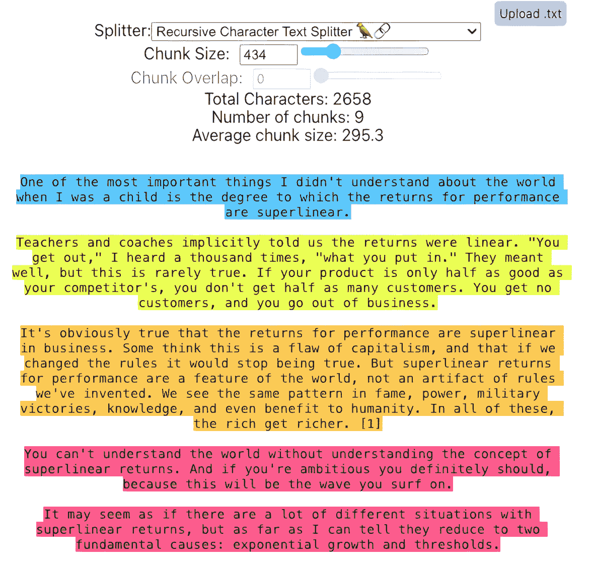
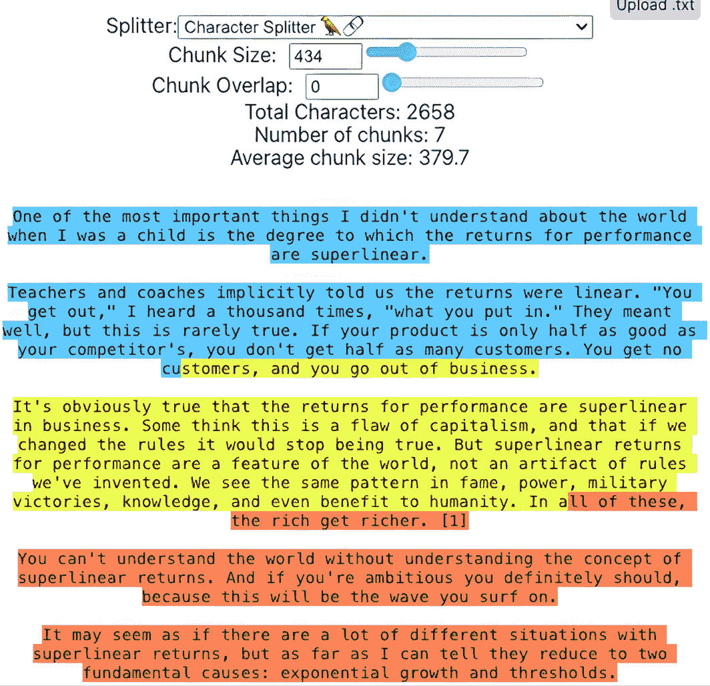

# 11

# 使用 LangChain 从 RAG 中获取更多

我们已经多次提到 **LangChain**，并且已经向您展示了大量的 LangChain 代码，包括实现 LangChain 特定语言的代码：**LangChain 表达语言**（**LCEL**）。现在您已经熟悉了使用 LangChain 实现检索增强生成（**RAG**）的不同方法，我们认为现在是深入了解 LangChain 的各种功能的好时机，这些功能可以帮助您使您的 RAG 管道更加完善。

在本章中，我们将探讨 LangChain 中不太为人所知但非常重要的组件，这些组件可以增强 RAG 应用程序。我们将涵盖以下内容：

+   代码实验室 11.1 – 从不同来源加载和处理文档的文档加载器

+   代码实验室 11.2 – 用于将文档分割成适合检索的块文本分割器

+   代码实验室 11.3 – 结构化语言模型响应的输出解析器

我们将使用不同的代码实验室逐步展示每种类型组件的示例，从文档加载器开始。

# 技术要求

本章的代码已放置在以下 GitHub 仓库中：[`github.com/PacktPublishing/Unlocking-Data-with-Generative-AI-and-RAG-Second-Edition/tree/main/CHAPTER_11`](https://github.com/PacktPublishing/Unlocking-Data-with-Generative-AI-and-RAG-Second-Edition/tree/main/CHAPTER_11)。

每个代码实验室的个别文件名在相应的章节中提到。

# 代码实验室 11.1 – 文档加载器

您需要从 GitHub 仓库访问的文件标题为 `CHAPTER11-1_DOCUMENT_LOADERS.ipynb`。

文档加载器在访问、提取和拉取使我们的 RAG 应用程序运行所需的数据方面发挥着关键作用。文档加载器用于从各种来源加载和处理文档，例如文本文件、PDF、网页或数据库。它们将文档转换为适合索引和检索的格式。

让我们安装一些新的包来支持我们的文档加载，正如您可能已经猜到的，这涉及到一些与不同文件格式相关的包：

```py
%pip install bs4
%pip install python-docx
%pip install docx2txt
%pip install jq 
```

第一个可能看起来很熟悉，`bs4`（代表 Beautiful Soup 4），因为我们曾在 *第二章* 中使用它来解析 HTML。我们还有一些与 Microsoft Word 相关的包，例如 `python_docx`，它有助于创建和更新 Microsoft Word（`.docx`）文件，以及 `docx2txt`，它从 `.docx` 文件中提取文本和图像。`jq` 包是一个轻量级的 JSON 处理器。

接下来，我们将采取一个您可能不会在 *真实* 情况下需要采取的额外步骤，即将我们的 PDF 文档转换为其他多种格式，以便我们可以测试这些格式的提取。我们将在 OpenAI 设置之后立即在我们的代码中添加一个全新的文档加载器部分。

在本节中，我们将提供生成文件的代码，然后是不同的文档加载器和它们相关的包，用于从这些类型的文件中提取数据。目前，我们有一个文档的 PDF 版本。我们需要文档的 HTML/网络版本、Microsoft Word 版本和 JSON 版本。

我们将在 OpenAI 设置单元格下开始一个新的单元格，我们将导入我们进行这些转换所需的新包：

```py
from bs4 import BeautifulSoup
import docx
import json 
```

正如我们提到的，`BeautifulSoup`包帮助我们解析基于 HTML 的网页。我们还导入了`docx`，它代表 Microsoft Word 处理格式。最后，我们导入了`json`来解释和管理 JSON 格式的代码。

接下来，我们想要确定我们将用于每种格式的文件名：

```py
pdf_path = "google-2023-environmental-report.pdf"
html_path = "google-2023-environmental-report.html"
word_path = "google-2023-environmental-report.docx"
json_path = "google-2023-environmental-report.json" 
```

在这里，我们定义了我们使用此代码中每个文件的路径，稍后当我们使用加载器加载每个文档时。这些将是我们将从原始 PDF 文档中生成的最终文件。

然后，我们新代码的这个关键部分将提取 PDF 中的文本，并使用它来生成所有这些新类型的文档：

```py
with open(pdf_path, "rb") as pdf_file:
    pdf_reader = PdfReader(pdf_file)
    pdf_text = "".join(
        page.extract_text() for page in pdf_reader.pages)
    soup = BeautifulSoup("<html><body></body></html>",
                         "html.parser")
    soup.body.append(pdf_text)
    with open(html_path, "w",
              encoding="utf-8") as html_file:
                  html_file.write(str(soup))
                  doc = docx.Document()
                  doc.add_paragraph(pdf_text)
                  doc.save(word_path)
    with open(json_path, "w") as json_file:
        json.dump({"text": pdf_text}, json_file) 
```

我们以非常基本的方式生成文档的 HTML、Word 和 JSON 版本。如果您生成这些文档是为了在实际的管道中使用，我们建议应用更多的格式化和提取，但为了演示的目的，这将为我们提供必要的数据。

接下来，我们将在代码的索引阶段添加我们的文档加载器。我们已经与前两个文档加载器合作过，我们将在本代码实验室中展示，但进行了更新，以便它们可以互换使用。对于每个文档加载器，我们展示了与加载器代码相关的特定于该加载器的包导入。在早期章节中，我们使用了一个直接从网站加载的 Web 加载器，所以如果您有这种情况，请参考该文档加载器。同时，我们在这里分享了一种稍微不同类型的文档加载器，它专注于使用本地 HTML 文件，例如我们刚刚生成的文件。

这是这个 HTML 加载器的代码：

```py
from langchain_community.document_loaders import BSHTMLLoader
loader = BSHTMLLoader(html_path)
docs = loader.load() 
```

在这里，我们使用我们之前定义的 HTML 文件来从 HTML 文档中加载代码。最终的变量`docs`可以与在以下文档加载器中定义的任何其他`docs`互换使用。这段代码的工作方式是，您一次只能使用一个加载器，并且它会用其版本的文档（包括来源文档的元数据标签）替换`docs`。如果您运行这个单元格，然后跳到运行拆分单元格，您可以在实验室中运行剩余的代码，并看到来自不同源文件类型相同数据的类似结果。我们后来在代码中做了一些小的更新，我们将在稍后说明。

在 LangChain 网站上列出了一些替代的 HTML 加载器，您可以通过以下链接查看：

[`python.langchain.com/v0.2/docs/how_to/document_loader_html/`](https://python.langchain.com/v0.2/docs/how_to/document_loader_html/ )

我们接下来要讨论的下一个文件类型是我们已经一直在使用的另一种类型，即 PDF：

```py
from PyPDF2 import PdfReader
docs = []
with open(pdf_path, "rb") as pdf_file:
    pdf_reader = PdfReader(pdf_file)
    pdf_text = "".join(page.extract_text() for page in
               pdf_reader.pages)
    docs = [Document(page_content=page) for page in
            pdf_text.split("\n\n")] 
```

在这里，我们有一个比之前使用的从 PDF 中提取数据的代码略为精简的版本。使用这种新的方法向您展示了一种访问这些数据的替代方式，但无论哪种方式，在您的代码中都可以工作，最终使用`PyPDF2`的`PdfReader`从 PDF 中提取数据来加载文档。

应该指出的是，将 PDF 文档加载到 LangChain 中有许多众多且功能强大的方法，这得益于与许多流行 PDF 提取工具的集成。以下是一些方法：`PyPDF2`（我们在这里使用），`PyPDF`，`PyMuPDF`，`MathPix`，`Unstructured`，`AzureAIDocumentIntelligenceLoader`，和`UpstageLayoutAnalysisLoader`。

我们建议您查看最新的 PDF 文档加载器列表。LangChain 为其中许多提供了有用的教程，您可以在这里找到：

[`python.langchain.com/v0.2/docs/how_to/document_loader_pdf/`](https://python.langchain.com/v0.2/docs/how_to/document_loader_pdf/ )

接下来，我们将从 Microsoft Word 文档中加载数据：

```py
from langchain_community.document_loaders import Docx2txtLoader
loader = Docx2txtLoader(word_path)
docs = loader.load() 
```

这段代码使用了 LangChain 的`Docx2txtLoader`文档加载器，将我们之前生成的 Word 文档转换为文本，并将其加载到我们的`docs`变量中，这个变量可以供分词器稍后使用。再次强调，遍历其余的代码将使用这些数据，就像它处理 HTML 或 PDF 文档一样。加载 Word 文档也有许多选项，您可以在以下列表中找到：[`python.langchain.com/v0.2/docs/integrations/document_loaders/microsoft_word/`](https://python.langchain.com/v0.2/docs/integrations/document_loaders/microsoft_word/ )

最后，我们看到与 JSON 加载器类似的方法：

```py
from langchain_community.document_loaders import JSONLoader
loader = JSONLoader(
    file_path=json_path,
    jq_schema='.text',
)
docs = loader.load() 
```

在这里，我们使用 JSON 加载器来加载存储在 JSON 对象格式中的数据，但结果是一样的：一个`docs`变量，可以传递给分词器并转换为我们在剩余代码中使用的格式。其他 JSON 加载器的选项可以在以下位置找到：

[`python.langchain.com/v0.2/docs/how_to/document_loader_json/`](https://python.langchain.com/v0.2/docs/how_to/document_loader_json/ )

注意，一些文档加载器会在生成`Document`对象的过程中向元数据字典中添加额外的元数据。当我们添加自己的元数据时，这会导致我们的代码出现一些问题。为了解决这个问题，我们在索引和创建向量存储时更新这些行：

```py
dense_documents = [
    Document(
        page_content=doc.page_content,
        metadata={**doc.metadata, "id": str(i), "search_source": "dense"}
    )for i, doc in enumerate(splits)
]
sparse_documents = [
    Document(
        page_content=doc.page_content,
        metadata={**doc.metadata, "id": str(i),
            "search_source": "sparse"}
    )for i, doc in enumerate(splits)] 
```

我们还更新了最终输出中的代码以测试响应，将此代码的第二行更改为处理更改后的元数据标签：

```py
for i, doc in enumerate(retrieved_docs, start=1):
    print(f"Document {i}: Document ID: {doc.metadata['id']}
        source: {doc.metadata['source']}")
    print(f"Content:\n{doc.page_content}\n") 
```

运行每个加载器，然后运行剩余的代码，以查看每个文档的实际效果！有大量的第三方集成，允许您访问几乎任何可以想象的数据源，并以一种您可以更好地利用 LangChain 其他组件的方式格式化数据。请在此处查看 LangChain 网站上的更多示例：[`python.langchain.com/docs/modules/data_connection/document_loaders/`](https://python.langchain.com/docs/modules/data_connection/document_loaders/ )

文档加载器在您的 RAG 应用中扮演着支持和非常重要的角色。但对于通常利用数据**块**的 RAG 特定应用来说，直到您将它们通过文本分割器处理，文档加载器几乎没有什么用处。接下来，我们将回顾文本分割器以及如何使用每个分割器来改进您的 RAG 应用。

# 代码实验室 11.2 – 文本分割器

您需要从 GitHub 仓库访问的文件标题为`CHAPTER11-2_TEXT_SPLITTERS.ipynb`。

文本分割器将文档分割成可用于检索的**块**。较大的文档对我们的 RAG 应用中的许多部分构成了威胁，分割器是我们的第一道防线。如果您能够将一个非常大的文档矢量化，那么文档越大，在向量嵌入中丢失的上下文表示就越多。但这假设您甚至能够将一个非常大的文档矢量化，而这通常是不可能的！与许多人都处理的大文档相比，大多数嵌入模型对我们可以向其传递的文档大小有相对较小的限制。例如，我们用于生成嵌入的 OpenAI 模型的上下文长度为 8,191 个标记。如果我们尝试向模型传递比这更大的文档，它将生成一个错误。这些是分割器存在的主要原因，但这些都是在此过程步骤中引入的复杂性的主要原因之一。

我们需要考虑文本分割器的关键元素是它们如何分割文本。假设您有 100 个段落想要分割。在某些情况下，可能有两三个段落在语义上应该放在一起，例如本节中的段落。在某些情况下，您可能有一个章节标题、一个 URL 或某种其他类型的文本。理想情况下，您希望将语义相关的文本片段放在一起，但这可能比最初看起来要复杂得多！为了一个现实世界的例子，请访问此网站并复制一大段文本：[`chunkviz.up.railway.app/`](https://chunkviz.up.railway.app/)。

ChunkViz 是由 Greg Kamradt 创建的一个实用工具，它可以帮助您可视化您的文本分割器是如何工作的。更改分割器的参数以使用我们正在使用的设置：块大小为 1,000，块重叠为 200。尝试与递归字符文本分割器相比的字符分割器。请注意，根据他们提供的示例，如*图 11.1*所示，递归字符分割器在约 434 块大小的情况下分别捕获了所有段落：



图 11.1 – 递归字符文本拆分器在 434 个字符处捕获整个段落

随着块大小的增加，它很好地保持在段落拆分上，但最终每个块中会有越来越多的段落。请注意，但这将因文本而异。如果您有非常长的段落的文本，您将需要一个更大的块设置来捕获整个段落。

同时，如果您尝试字符拆分器，它将在任何设置下在句子中间截断：



图 11.2 – 字符拆分器在 434 个字符处捕获部分段落

句子的这种拆分可能会对您块捕捉其中所有重要语义意义的能力产生重大影响。您可以通过改变块重叠来抵消这一点，但您仍然会有部分段落，这将对您的 LLM 产生噪音，分散其提供最佳响应的注意力。

让我们通过实际的编码示例逐步了解每个选项，以了解一些可用的选项。

## 字符文本拆分器

这是拆分文档的最简单方法。文本拆分器允许您将文本分成任意 N 字符大小的块。您可以通过添加一个分隔符参数（如`\n`）来略微改进这一点。但这是一个了解块分割如何工作的绝佳起点，然后我们可以继续探讨更有效但复杂性增加的方法。

这里是使用`CharacterTextSplitter`对象与我们的文档的代码示例，这些代码可以与其他拆分器输出互换使用：

```py
from langchain_text_splitters import CharacterTextSplitter
text_splitter = CharacterTextSplitter(
    separator="\n",
    chunk_size=1000,
    chunk_overlap=200,
    is_separator_regex=False,
)
splits = text_splitter.split_documents(docs) 
```

第一次拆分的输出（`split[0]`）看起来像这样：

```py
Document(page_content='Environmental \nReport\n2023What's \ninside\nAbout this report\nGoogle's 2023 Environmental Report provides an overview of our environmental \nsustainability strategy and targets and our annual progress towards them.\u20091  \nThis report features data, performance highlights, and progress against our targets from our 2022 fiscal year (January 1 to December 31, 2022). It also mentions some notable achievements from the first half of 2023\. After two years of condensed reporting, we're sharing a deeper dive into our approach in one place.\nADDITIONAL RESOURCES\n• 2023 Environmental Report: Executive Summary\n• Sustainability.google\n• Sustainability reports\n• Sustainability blog\n• Our commitments\n• Alphabet environmental, social, and governance (ESG)\n• About GoogleIntroduction  3\nExecutive letters  4\nHighlights  6\nOur sustainability strategy 7\nTargets and progress summary 8\nEmerging opportunities 9\nEmpowering individuals  12\nOur ambition 13\nOur appr\noach 13\nHelp in\ng people make  14') 
```

有很多`\n`（也称为换行符）标记字符，还有一些`\u`。我们看到它计数大约 1,000 个字符，找到最近的`\n`字符，这就在句子的中间，可能会出现问题！

下一个块看起来像这样：

```py
Document(page_content='Highlights  6\nOur sustainability strategy 7\nTargets and progress summary 8\nEmerging opportunities 9\nEmpowering individuals  12\nOur ambition 13\nOur appr\noach 13\nHelp in\ng people make  14 \nmore sustainable choices  \nReducing home energy use 14\nProviding sustainable  \ntrans\nportation options  17 \nShari\nng other actionable information 19\nThe journey ahead  19\nWorking together 20\nOur ambition 21\nOur approach 21\nSupporting partners  22\nInvesting in breakthrough innovation 28\nCreating ecosystems for collaboration  29\nThe journey ahead  30Operating sustainably 31\nOur ambiti\non 32\nOur oper a\ntions  32\nNet-\nzero c\narbon  33\nWater stewardship 49\nCircular econom\ny 55\nNature and biodiversity 67\nSpotlight: Building a more sustainable  \ncam\npus in Mountain View73 \nGovernance and engagement  75\nAbout Google\n 76\nSustainab i\nlity governance  76\nRisk management  77\nStakeholder engagement  78\nPublic policy and advocacy  79\nPartnerships  83\nAwards and recognition 84\nAppendix  85') 
```

如您所见，它稍微回溯了一点，这是由于我们设置的 200 个字符的块重叠。然后它从那里再向前 1,000 个字符，并在另一个`\n`字符处断开。

让我们逐步了解这些参数：

+   **分隔符**：根据您使用的分隔符，您可能会得到各种各样的结果。对于这个，我们使用了`\n`，并且它适用于这份文档。但如果您在这个特定文档中使用`\n\n`（双换行符）作为分隔符，而该文档中没有双换行符，它永远不会拆分！`\n\n`实际上是默认设置，所以请确保您注意这一点，并使用与您内容兼容的分隔符！

+   **块大小**：这定义了你希望通过块大小达到的任意字符数。这仍然可能有所变化，例如在文本的末尾，但大部分情况下，块的大小将保持一致。

+   **块重叠**：这是你希望在顺序块中重叠的字符数。这是一种简单的方法来确保你捕捉到了块内的所有上下文。例如，如果你没有块重叠并且将句子切半，那么大部分上下文可能都不会很好地被两个块捕捉到。但是有了重叠，你可以更好地覆盖这个上下文的边缘。

+   **分隔符正则表达式**：这是另一个参数，表示所使用的分隔符是否为正则表达式格式。

在这种情况下，我们将块大小设置为 1,000，块重叠设置为 200。通过这段代码，我们想要的是使用小于 1,000 个字符的块，但具有 200 个字符的重叠。这种重叠技术类似于你在**卷积神经网络**（**CNNs**）中看到的滑动窗口技术，当你将窗口滑动到图像的较小部分上并重叠时，以便捕捉不同窗口之间的上下文。在这种情况下，我们试图捕捉的是块内的上下文。

这里还有一些其他需要注意的事项：

+   **文档对象**：我们使用 LangChain 的 `Document` 对象来存储我们的文本，因此我们使用允许它在下一步中工作的 `create_documents` 函数。如果你想要直接获取字符串内容，可以使用 `split_text` 函数。

+   **`create_documents` 期望一个列表**：`create_documents` 期望一个文本列表，所以如果你只有一个字符串，你需要将其包裹在`[]`中。在我们的例子中，我们已经将`docs`设置为一个列表，因此满足了这个要求。

+   **分割与块化**：这两个术语可以互换使用。

你可以在 LangChain 网站上找到有关此特定文本分割器的更多信息：[`python.langchain.com/v0.2/docs/how_to/character_text_splitter/`](https://python.langchain.com/v0.2/docs/how_to/character_text_splitter/).

API 文档可以在以下位置找到：[`api.python.langchain.com/en/latest/character/langchain_text_splitters.character.CharacterTextSplitter.html`](https://api.python.langchain.com/en/latest/character/langchain_text_splitters.character.CharacterTextSplitter.html).

尽管如此，我们还能做得更好；让我们看看一种更复杂的方法，称为**递归字符文本分割**。

## 递归字符文本分割器

我们之前见过这个！到目前为止，我们在代码实验室中使用的这个分割器最多，因为它正是 LangChain 推荐在分割通用文本时使用的。这正是我们所做的！

正如其名所示，这个分割器递归地分割文本，目的是将相关的文本片段放在一起。你可以传递一个字符列表作为参数，并且它将按顺序尝试分割这些字符，直到块足够小。默认列表是`["\n\n", "\n", " ", ""]`，这效果很好，但我们还将`". "`添加到这个列表中。这会尝试将所有段落保持在一起，句子由`"\n"`和`". "`定义，并且尽可能长地保持单词。

下面是我们的代码：

```py
recursive_splitter = RecursiveCharacterTextSplitter(
    separators=["\n\n", "\n", ". ", " ", ""],
    chunk_size=1000,
    chunk_overlap=200
)
splits = recursive_splitter.split_documents(docs) 
```

在这个分割器的底层，块是根据`"\n\n"`分隔符分割的，表示段落分割。但它不会止于此；它将查看块大小，如果它大于我们设置的 1,000，那么它将根据下一个分隔符（`"\n"`）进行分割，依此类推。

让我们谈谈这个递归方面，它使用递归算法将文本分割成块。只有当提供的文本长度超过块大小时，才会应用此算法，但它遵循以下步骤：

1.  它根据可用的分隔符在或之前`chunk_size`（即，在`[0, chunk_size]`范围内）找到一个合适的分割边界。在发出一个块之后，它从`chunk_overlap`个字符之前开始下一个块（目标重叠），因此相邻的块共享上下文。

1.  如果找到一个合适的分割点，它将文本分割成两部分：分割点之前的块和分割点之后剩余的文本。

1.  它递归地应用相同的分割过程到剩余的文本上，直到所有块都在`chunk_size`限制内。

与字符分割器方法类似，递归分割器主要受你设置的块大小驱动，但它将此与之前概述的递归方法结合起来，以提供一种简单且逻辑的方法来正确地捕获块内的上下文。

`RecursiveCharacterTextSplitter`在处理需要由具有输入大小限制的语言模型处理的较大文本文档时特别有用。通过将文本分割成较小的块，你可以单独将块喂给语言模型，如果需要，然后合并结果。

显然，递归分割器比字符分割器更进了一步，但它们仍然没有像基于语义的段落和句子分隔符那样根据语义来分割我们的内容。然而，这并不能处理两个段落在语义上属于一个持续思考的情况，这些段落实际上应该一起在它们的向量表示中被捕获。

这个代码实验室设置得可以让你使用每种类型的分割器。运行每个分割器，然后运行其余的代码，看看每种分割器如何影响你的结果。此外，尝试更改参数设置，如`chunk_size`和`chunk_overlap`，以更好地理解它们如何影响你的块。

# 代码实验室 11.3 – 输出解析器

你需要从 GitHub 仓库访问的文件标题为`CHAPTER11-3_OUTPUT_PARSERS.ipynb`。

任何 RAG 应用程序的结果都将是文本，可能还有一些格式、元数据和一些其他相关数据。这种输出通常来自 LLM 本身。但有时你希望得到比文本更结构化的格式。输出解析器是帮助在 RAG 应用程序中结构化 LLM 响应的类。它提供的输出将被传递到链中的下一步，或者在我们的所有代码实验室中，作为模型的最终输出。

我们将同时介绍两种不同的输出解析器，并在我们的 RAG 管道中的不同时间使用它们。我们将从我们已知的解析器开始，即字符串输出解析器。

在 `relevance_prompt` 函数下，将以下代码添加到一个新的单元中：

```py
from langchain_core.output_parsers import StrOutputParser
str_output_parser = StrOutputParser() 
```

注意，我们之前已经在 LangChain 的链代码中使用过这个解析器，但我们将把这个解析器分配给一个名为 `str_output_parser` 的变量。让我们更深入地讨论一下这种解析器。

## 字符串输出解析器

这是一个基本的输出解析器。在非常简单的方法中，就像我们之前的代码实验室一样，你可以直接使用 `StrOutputParser` 类作为输出解析器的实例。或者，你可以像我们刚才做的那样，将其分配给一个变量，特别是如果你预计会在代码的多个区域看到它，我们将会这样做。但我们已经看到这种情况很多次了。它从 LLM 的两个使用位置获取输出，并将 LLM 的字符串响应输出到链中的下一个链接。有关此解析器的文档可以在这里找到：[`api.python.langchain.com/en/latest/output_parsers/langchain_core.output_parsers.string.StrOutputParser.html#langchain_core.output_parsers.string.StrOutputParser`](https://api.python.langchain.com/en/latest/output_parsers/langchain_core.output_parsers.string.StrOutputParser.html#langchain_core.output_parsers.string.StrOutputParser)。

让我们看看一种新的解析器类型，即 JSON 输出解析器。

## JSON 输出解析器

如你所想，这个输出解析器从 LLM 获取输入并将其输出为 JSON。需要注意的是，你可能不需要这个解析器，因为许多新的模型提供商支持内置的返回结构化输出（如 JSON 和 XML）的方式。这种方法是为那些不需要这些功能的人准备的。

我们开始引入一些新的导入，这些导入来自我们已安装的 LangChain 库（`langchain_core`）：

```py
from langchain_core.output_parsers import JsonOutputParser
from pydantic import BaseModel, Field
from langchain_core.outputs import Generation
import json 
```

这些行从 `langchain_core` 库和 `json` 模块导入了必要的类和模块。`JsonOutputParser` 用于解析 JSON 输出。`BaseModel` 和 `Field` 用于定义 JSON 输出模型的结构。`Generation` 用于表示生成的输出。不出所料，我们导入了 `json` 包，以便更好地管理我们的 JSON 输入/输出。

接下来，我们将创建一个名为 `FinalOutputModel` 的 `Pydantic` 模型，它表示 JSON 输出的结构：

```py
class FinalOutputModel(BaseModel):
    relevance_score: float = Field(description="The
        relevance score of the retrieved context to the
        question")
    answer: str = Field(description="The final answer to
        the question") 
```

它有两个字段：`relevance_score`（浮点数）和 `answer`（字符串），以及它们的描述。在 *实际应用* 中，这个模型可能会变得更加复杂，但这也为你提供了一个如何定义它的基本概念。

接下来，我们将创建 `JsonOutputParser` 解析器的实例：

```py
json_parser = JsonOutputParser(pydantic_model=FinalOutputModel) 
```

这行代码将 `FinalOutputModel` 类作为参数分配给 `json_parser`，以便在代码中稍后使用此解析器时使用。

接下来，我们将在两个其他辅助函数之间添加一个新函数，然后我们将更新 `conditional_answer` 以使用该新函数。此代码位于现有的 `extract_score` 函数之下，该函数保持不变：

```py
def format_json_output(x):
    # print(x)
    json_output = {"relevance_score":extract_score(
        x['relevance_score']),"answer": x['answer'],
    }
    return json_parser.parse_result(
        [Generation(text=json.dumps(json_output))]) 
```

这个 `format_json_output` 函数接收一个字典 `x` 作为输入，并将其格式化为 JSON 输出。它创建一个 `json_output` 字典，包含两个键：`"relevance_score"`（通过在 `x` 的 `'relevance_score'` 值上调用 `extract_score` 获取）和 `"answer"`（直接从 `x` 中获取）。然后它使用 `json.dumps` 将 `json_output` 字典转换为 JSON 字符串，并创建一个包含该 JSON 字符串的 `Generation` 对象。最后，它使用 `json_parser` 解析 `Generation` 对象并返回解析结果。

我们需要在之前使用的函数 `conditional_answer` 中引用此函数。按照以下方式更新 `conditional_answer`：

```py
def conditional_answer(x):
    relevance_score = extract_score(x['relevance_score'])
    if relevance_score < 4:
        return "I don't know."
    else:
        return format_json_output(x) 
```

在这里，我们更新 `conditional_answer` 函数，如果它确定答案相关，则应用 `format_json_output` 函数，并在提供返回的输出之前。

接下来，我们将把代码中之前的两个链合并成一个更大的链，处理整个流程。在过去，将这部分单独展示有助于更专注于某些区域，但现在我们有了一个机会来清理并展示这些链如何组合在一起来处理我们的整个逻辑流程：

```py
rag_chain = (
    RunnableParallel(
        {"context": ensemble_retriever,
            "question": RunnablePassthrough()})
    | RunnablePassthrough.assign(
        context=(lambda x: format_docs(x["context"])))
    | RunnableParallel(
        {
            "relevance_score": (
                RunnablePassthrough()
                | (
                    lambda x: relevance_prompt_template.format(
                        question=x["question"],
                        retrieved_context=x["context"]
                    )
                )
                | llm
                | str_output_parser
            ),
            "answer": (
                RunnablePassthrough()
                | prompt
                | llm
                | str_output_parser
            ),
        }
    )
    | RunnablePassthrough().assign(final_result=conditional_answer)
) 
```

如果你回顾之前的代码实验室，这部分是通过两个链来表示的。请注意，这里使用 `str_output_parser` 的方式与之前相同。你在这里看不到 JSON 解析器，因为它在 `format_json_output` 函数中应用，该函数是从 `conditional_answer` 函数中调用的，你可以在最后一行看到它。这种简化这些链的方法适用于这个示例，专注于将输出解析为 JSON，但我们应注意的是，我们确实失去了之前代码实验室中使用的上下文。这实际上只是一个设置我们的链（s）的替代方法的示例。

最后，因为我们的最终输出是 JSON 格式，我们需要添加上下文，所以我们需要更新我们的 *测试运行* 代码：

```py
result = rag_chain.invoke(user_query)
print(f"Original Question: {user_query}\n")
print(f"Relevance Score: {result['relevance_score']}\n")
print(f"Final Answer:\n{result[
    'final_result']['answer']}\n\n")
print(f"Final JSON Output:\n{result}\n\n") 
```

当我们打印出来时，我们看到的结果与过去相似，但我们展示了 JSON 格式的最终输出看起来如何：

```py
Original Question: What are Google's environmental initiatives?
Relevance Score: 5
Final Answer:
Google's environmental initiatives include empowering individuals to take action, working together with partners and customers, operating sustainably… [TRUNCATED]
Final JSON Output:
{
'relevance_score': '5',
'answer': "Google's environmental initiatives include empowering individuals to take action, working together with partners and customers, operating sustainably, achieving net-zero carbon emissions, water stewardship, engaging in a circular economy, and supporting sustainable consumption of public goods. They also engage with suppliers to reduce energy consumption and greenhouse gas emissions, report environmental data, and assess environmental criteria. Google is involved in various sustainability initiatives, such as the iMasons Climate Accord, ReFED, and projects with The Nature Conservancy. They also invest in breakthrough innovation and support sustainability-focused accelerators. Additionally, Google focuses on renewable energy, data analytics tools for sustainability, and AI for sustainability to drive more intelligent supply chains.",
'final_result': {
     'relevance_score': 5.0,
     'answer': "Google's environmental initiatives include empowering individuals to take action, working together with partners and customers, operating sustainably, achieving net-zero carbon emissions, water stewardship, engaging in a circular economy, and supporting sustainable consumption of public goods. They also engage with suppliers to reduce energy consumption and greenhouse gas emissions, report environmental data, and assess environmental criteria. Google is involved in various sustainability initiatives, such as the iMasons Climate Accord, ReFED, and projects with The Nature Conservancy. They also invest in breakthrough innovation and support sustainability-focused accelerators. Additionally, Google focuses on renewable energy, data analytics tools for sustainability, and AI for sustainability to drive more intelligent supply chains."
}
} 
```

这是一个简单的 JSON 输出示例，但你可以在此基础上构建并使用我们定义并传递给输出解析器的 `FinalOutputModel` 类来调整 JSON 格式以满足你的需求。

您可以在此处找到有关 JSON 解析器的更多信息：[`python.langchain.com/v0.2/docs/how_to/output_parser_json/`](https://python.langchain.com/v0.2/docs/how_to/output_parser_json/)。

需要注意的是，很难依赖 LLM 以特定格式输出。一个更健壮的系统会将解析器更深入地集成到系统中，它可能会更好地利用 JSON 输出，但这也意味着需要进行更多检查，以确保格式符合下一步操作对正确格式 JSON 的要求。在我们的代码中，我们实现了一个非常轻量级的 JSON 格式化层，以展示输出解析器如何以非常简单的方式集成到我们的 RAG 应用中。

# 摘要

在本章中，我们学习了 LangChain 的各种组件，这些组件可以增强 RAG 应用。*代码实验室 11.1*专注于文档加载器，用于从各种来源（如文本文件、PDF、网页或数据库）加载和处理文档。本章涵盖了使用不同的 LangChain 文档加载器从 HTML、PDF、Microsoft Word 和 JSON 格式加载文档的示例，并指出某些文档加载器会添加元数据，这可能在代码中需要进行调整。

*代码实验室 11.2*讨论了文本分割器，它将文档分割成适合检索的块，解决了大型文档和向量嵌入中的上下文表示问题。本章涵盖了`CharacterTextSplitter`，它将文本分割成任意 N 字符大小的块，以及`RecursiveCharacterTextSplitter`，它递归地分割文本，同时尝试将相关部分保持在一起。最后，*代码实验室 11.3*专注于输出解析器，它以结构化的方式组织 RAG 应用中的语言模型响应。本章涵盖了字符串输出解析器，它将 LLM 的响应作为字符串输出，以及 JSON 输出解析器，它使用定义的结构将输出格式化为 JSON。提供了一个示例，展示了如何将 JSON 输出解析器集成到 RAG 应用中。

在下一章中，我们将介绍一个相对高级但非常强大的主题，即 LangGraph 和 AI 代理。

|

## 获取本书的 PDF 版本和独家额外内容

扫描二维码（或访问[packtpub.com/unlock](http://packtpub.com/unlock)）。通过名称搜索本书，确认版本，然后按照页面上的步骤操作。 |   |

| **注意**：请妥善保管您的发票。直接从 Packt 购买不需要发票。* |
| --- |
