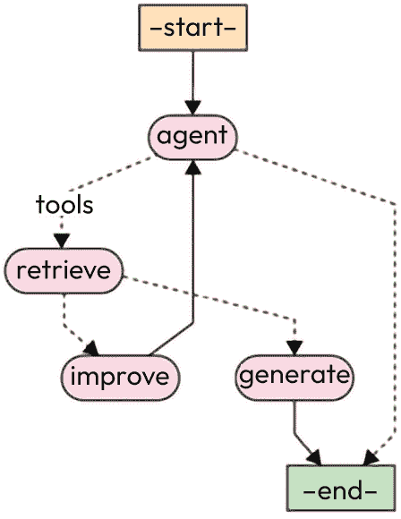
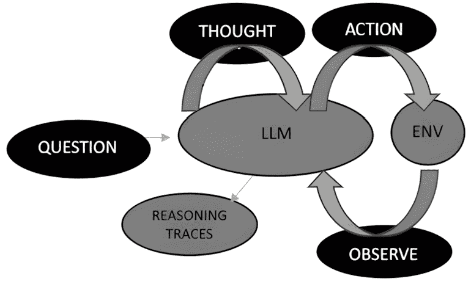
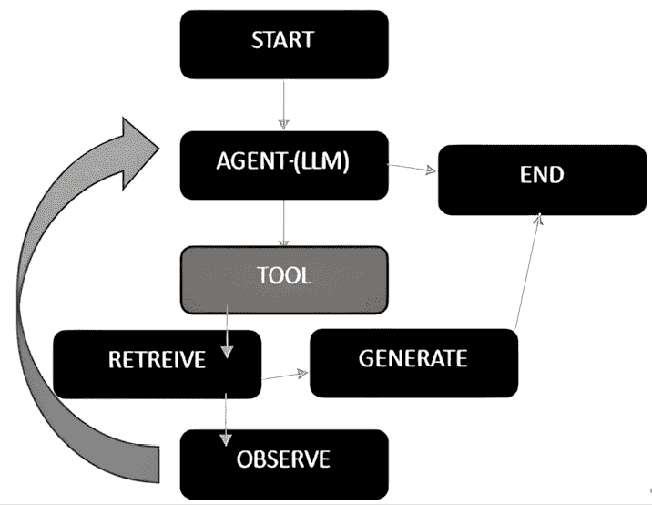

# 12

# 结合 RAG 与 AI 代理和 LangGraph 的力量

对**大型语言模型**（**LLM**）的一次调用可能很有力量，但将你的逻辑放入一个循环中，目标是实现更复杂的任务，你就可以将你的**检索增强生成**（**RAG**）开发提升到一个全新的水平。这就是**代理**背后的概念。LangChain 已经投入了大量精力来改进对*代理*工作流程的支持，增加了能够更精确控制代理行为和功能的功能。这一进步的一部分是**LangGraph**的出现，LangChain 的另一个相对较新的部分。共同而言，代理和 LangGraph 作为提高 RAG 应用的有效方法搭配得很好。

在本章中，我们将专注于深入了解可用于 RAG 的代理元素，然后将它们与你自己的 RAG 工作联系起来，涵盖以下主题：

+   AI 代理和 RAG 集成的原理

+   图表、AI 代理和 LangGraph

+   代码实验室 12.1 – 向 RAG 添加 LangGraph 检索代理

到本章结束时，你将牢固地掌握 AI 代理和 LangGraph 如何增强你的 RAG 应用。在下一节中，我们将深入探讨 AI 代理和 RAG 集成的原理，为后续的概念和代码实验室奠定基础。

# 技术要求

本章的代码放置在以下 GitHub 仓库中：[`github.com/PacktPublishing/Unlocking-Data-with-Generative-AI-and-RAG-Second-Edition/tree/main/CHAPTER_12`](https://github.com/PacktPublishing/Unlocking-Data-with-Generative-AI-and-RAG-Second-Edition/tree/main/CHAPTER_12)。

# AI 代理和 RAG 集成的原理

当与生成式 AI 的新开发者交谈时，我们被告知，AI 代理的概念往往是更难以掌握的概念之一。当专家们谈论代理时，他们经常用非常抽象的术语来谈论，关注 AI 代理在 RAG 应用中可以负责的所有事情，但未能真正彻底地解释 AI 代理是什么以及它是如何工作的。

我认为通过解释 AI 代理的真正含义来消除其神秘性是最容易的，这实际上是一个非常简单的概念。要构建最基本形式的 AI 代理，你只需将你已经在这些章节中一直在使用的相同的 LLM 概念添加一个循环，当预期任务完成时循环终止。就是这样！它只是一个循环，朋友们！

*图 12.1* 表示你将在即将开始的代码实验室中与之合作的 **RAG 代理循环**：



图 12.1 – 代理控制流程图

这代表了一系列相对简单的逻辑步骤，这些步骤会循环执行，直到代理决定它已经成功完成了你给它分配的任务。例如，*代理*和*检索*这样的椭圆形框被称为**节点**，而线条被称为**边**。虚线也是边，但它们是特定类型的**条件边**，这种边同时也是决策点。

尽管很简单，但在你的 LLM 调用中添加循环的概念确实使其比直接使用 LLMs 更强大，因为它更多地利用了 LLM 的推理能力，将任务分解成更简单的任务。这提高了你在追求任何任务时的成功机会，并且对于更复杂的多步 RAG 任务来说尤其有用。

当你的 LLM 在循环执行代理任务时，你也会向代理提供称为**工具**的功能，LLM 将利用其推理能力来确定使用哪个工具，如何使用该工具，以及向其提供什么数据。这就是它可能迅速变得非常复杂的地方。你可以有多个代理，众多工具，集成的知识图谱帮助引导你的代理沿着特定路径前进，众多提供不同*风味*的代理框架，众多代理架构的方法，等等。但在本章中，我们将特别关注 AI 代理如何帮助改进 RAG 应用。然而，一旦你看到了使用 AI 代理的力量，我毫不怀疑你将想要在其他生成式 AI 应用中使用它，你应该这么做！

## 生活在一个 AI 代理的世界中

在代理带来的所有兴奋情绪中，你可能会认为 LLMs 已经过时了。但事实远非如此。通过 AI 代理，你实际上是在挖掘一个更强大的 LLM 版本，在这个版本中，LLM 充当代理的“大脑”，让它能够进行推理并想出多步解决方案，这远远超出了大多数人使用它们进行的一次性聊天问题。代理只是在用户和 LLM 之间提供了一个层次，推动 LLM 完成可能需要多次查询的任务，但最终，从理论上讲，会得到一个更好的结果。

如果你仔细想想，这更符合现实世界中解决问题的方式，即使简单的决策也可能很复杂。我们做的许多任务都是基于一系列的观察、推理和对新经验的调整。在现实世界中，我们与人们、任务和事物的互动方式很少像我们在网上与 LLM 互动那样。经常会有这种建立理解、知识和背景的过程发生，帮助我们找到最佳解决方案。AI 代理更能处理这种类型的解决问题的方法。

代理可以对你的 RAG（检索即生成）工作产生重大影响，但关于 LLMs（大型语言模型）作为其大脑的概念又如何呢？让我们进一步探讨这个概念。

## LLM 作为代理的大脑

如果你将 LLM 视为你的 AI 代理的大脑，那么下一个合乎逻辑的步骤是你可能希望找到最聪明的 LLM 来作为那个大脑。LLM 的能力将影响你的 AI 代理推理和做决策的能力，这无疑将影响你对 RAG 应用程序的查询结果。

然而，这种 LLM 大脑的隐喻有一个主要的问题，但以一种非常好的方式。与现实世界中的代理不同，AI 代理可以随时更换他们的 LLM 大脑。我们甚至可以给它多个 LLM 大脑，这些大脑可以相互检查并确保一切按计划进行。这为我们提供了更大的灵活性，有助于我们不断改进代理的能力。

那么，LangGraph 或一般意义上的图如何与 AI 代理相关联呢？我们将在下一节讨论这个问题。

# 图、AI 代理和 LangGraph

LangChain 在 2024 年引入了 LangGraph，因此它仍然相对较新。它是建立在 **LangChain 表达语言**（**LCEL**）之上的扩展，用于创建可组合和可定制的代理工作负载。LangGraph 严重依赖于图论概念，如节点和边（前面已描述），但重点是使用它们来管理你的 AI 代理。虽然较老的代理管理方法 `AgentExecutor` 类仍然存在，但 LangGraph 现在是 LangChain 中**推荐**的构建代理的方式。

LangGraph 为支持代理添加了两个重要组件：

+   容易定义循环（循环图）的能力

+   内置内存

它提供了一个与 `AgentExecutor` 相等的预构建对象，允许开发者使用基于图的方法编排代理。

在过去几年中，出现了许多将代理构建到 RAG 应用程序中的论文、概念和方法，例如编排代理、ReAct 代理、自我优化的代理和多代理框架。这些方法中的一个共同主题是循环图的概念，它代表了代理的控制流。虽然许多这些方法从实现的角度来看正在变得过时，但它们的概念仍然非常有用，并且被捕获在 LangGraph 的基于图的环境中。

**LangGraph** 已成为支持代理并在 RAG 应用程序中管理它们的流程和过程的有力工具。它使开发者能够将单代理和多代理流程描述为图，提供极受控制的**流程**。这种可控性对于避免开发者在早期创建代理时遇到的陷阱至关重要。

例如，流行的 ReAct 方法是构建智能体的早期范例。**ReAct**代表**reason + act**。在这个模式中，LLM 首先思考要做什么，然后决定采取的行动。该行动在环境中执行，并返回一个观察结果。有了这个观察结果，LLM 然后重复这个过程。它使用推理来思考接下来要做什么，决定采取另一个行动，并继续进行，直到确定目标已经实现。如果您将这个过程绘制出来，可能看起来就像您在*图 12.2*中看到的那样：



图 12.2 – ReAct 循环图表示

*图 12.2*中的循环集合可以用 LangGraph 中的循环图来表示，每个步骤由节点和边表示。使用这种图形范式，您可以看到 LangGraph 这样的工具，LangChain 中构建图的工具，如何成为您智能体框架的骨干。当我们构建智能体框架时，我们可以使用 LangGraph 来表示这些智能体循环，这有助于我们描述和编排控制流。这种对控制流的关注对于解决智能体的一些早期挑战至关重要，缺乏控制会导致无法完成循环或专注于错误任务的流氓智能体。

LangGraph 中构建的另一个关键元素是**持久性**。持久性可以用来保持智能体的记忆，为其提供所需的信息，以便反思迄今为止的所有行动，并代表*图 12.2*中展示的*观察*组件。这对于同时进行多个对话或记住之前的迭代和行动非常有帮助。这种持久性还使人类在循环中具有更好的控制权，在智能体行动的关键间隔期间更好地控制智能体的行为。我们将在*第十六章*中更详细地探讨记忆和持久性，我们将深入探讨如何在您的 RAG 应用程序中有效地实现和利用这些功能。

介绍了 ReAct 方法构建智能体的论文可以在这里找到：[`arxiv.org/abs/2210.03629`](https://arxiv.org/abs/2210.03629)。

让我们直接进入代码实验室，构建我们的智能体，并在代码中遇到时逐步了解更多关键个体概念。

# 代码实验室 12.1 – 向 RAG 添加 LangGraph 检索智能体

在这个代码实验室中，我们将向现有的 RAG 管道添加一个代理，该代理可以决定是否从索引中检索或使用网络搜索。我们将展示代理在处理检索到的数据时的内部想法，目的是为你提供更全面的回答。随着我们添加代理的代码，我们将看到新的组件，例如工具、工具包、图、节点、边，当然还有代理本身。对于每个组件，我们将更深入地探讨该组件如何交互和支持你的 RAG 应用程序。我们还将添加代码，使其更像是一个聊天会话，而不是问答会话：

1.  首先，我们将安装一些新的包来支持我们的代理开发：

    ```py
    %pip install tiktoken ==0.12.0
    %pip install langgraph ==1.0.4 
    ```

在第一行，我们安装了 `tiktoken` 包，这是一个 OpenAI 包，用于在将文本数据输入语言模型之前对文本数据进行标记化。最后，我们引入了我们一直在讨论的 `langgraph` 包。

1.  接下来，我们将添加一个新的 LLM 定义并更新现有的一个：

    ```py
    llm = ChatOpenAI(model_name="gpt-4o-mini",
        temperature=0, streaming=True)
    agent_llm = ChatOpenAI(model_name="gpt-4o-mini",
        temperature=0, streaming=True) 
    ```

新的 `agent_llm` LLM 实例将作为我们代理的大脑，处理推理和执行代理任务，而原始的 `llm` 实例仍然存在于我们的通用 LLM 中，执行我们过去使用它完成的相同 LLM 任务。虽然在我们的示例中这两个 LLM 使用了相同的模型和参数定义，但你应该尝试使用不同的 LLM 来完成这些不同的任务，看看是否有更适合你的 RAG 应用程序的组合。你甚至可以添加额外的 LLM 来处理特定任务，例如，如果发现某个 LLM 在这些任务上表现更好，或者你已经为这些特定操作训练或微调了自己的 LLM，那么可以添加 `improve` 或 `score_documents` 函数。例如，对于简单任务，只要它们能成功完成任务，通常可以使用更快、成本更低的 LLM。这段代码中内置了很多灵活性，你可以充分利用！此外，请注意，我们在 LLM 定义中添加了 `streaming=True`。这开启了从 LLM 的流式数据，这对可能进行多次调用（有时是并行调用）并不断与 LLM 交互的代理更有利。

现在，我们将跳过检索器定义（`dense_retriever`、`sparse_retriever` 和 `ensemble_retriever`）之后的部分，并添加我们的第一个工具。在代理中，工具具有非常具体和重要的含义；所以，让我们现在就来谈谈这一点。

## 工具和工具包

在下面的代码中，我们将添加一个 **网络** **搜索** 工具：

```py
from langchain_tavily import TavilySearch
_ = load_dotenv(dotenv_path='env.txt')
os.environ['TAVILY_API_KEY'] = os.getenv('TAVILY_API_KEY')
web_search = TavilySearchResults(max_results=4)
web_search_name = web_search.name 
```

你需要获取另一个 API 密钥并将其添加到我们过去用于 OpenAI 和 Together API 的 `env.txt` 文件中。就像使用那些 API 一样，你需要访问那个网站，设置你的 API 密钥，然后将它复制到你的 `env.txt` 文件中。Tavily 网站可以在以下 URL 找到：[`tavily.com/`](https://tavily.com/)。

我们再次运行代码，从 `env.txt` 文件加载数据，然后使用 `max_results` 的 `4` 设置 `TavilySearchResults` 对象，这意味着当我们运行搜索时，我们只想获取最多 4 个搜索结果。然后我们将 `web_search.name` 变量分配给一个名为 `web_search_name` 的变量，以便我们稍后当需要告诉代理时可以使用。你可以直接使用此代码运行此工具：

```py
web_search.invoke(user_query) 
```

使用 `user_query` 运行此工具代码将给出如下结果（为了简洁而截断）：

```py
[{'url': 'http://sustainability.google/',
  'content': "Google Maps\nChoose the most fuel-efficient route\nGoogle Shopping\nShop for more efficient appliances for your home\nGoogle Flights\nFind a flight with lower per-traveler carbon emissions\nGoogle Nest\...[TRUNCATED HERE]"},
…
  'content': "2023 Environmental Report. Google's 2023 Environmental Report outlines how we're driving positive environmental outcomes throughout our business in three key ways: developing products and technology that empower individuals on their journey to a more sustainable life, working together with partners and organizations everywhere to transition to resilient, low-carbon systems, and operating ..."}] 
```

我们截断这部分内容以减少书籍的空间占用，但在代码中尝试这样做，你将看到我们请求的四个结果，并且它们似乎都与 `user_query` 提出的问题主题高度相关。请注意，你不需要像我们刚才那样直接在代码中运行此工具。

到目前为止，你刚刚建立了你的第一个代理工具！这是一个搜索引擎工具，你的代理可以使用它从互联网检索更多信息，以帮助它实现回答用户提出的问题的目标。

LangChain 中的 *工具* 概念，以及构建代理时，来源于你希望为代理提供可执行动作的想法，以便它能够执行其任务。工具是实现这一目标的机制。你定义一个工具，就像我们刚才为网络搜索所做的那样，然后稍后将其添加到代理可以用来完成任务的工具列表中。在我们设置这个列表之前，我们还想创建另一个对于 RAG 应用至关重要的工具，一个检索工具：

```py
from langchain.tools.retriever import create_retriever_tool
retriever_tool = create_retriever_tool(
    ensemble_retriever,
    "retrieve_google_environmental_question_answers",
    "Extensive information about Google environmental
     efforts from 2023.",
)
retriever_tool_name = retriever_tool.name 
```

注意，使用网络搜索工具时，我们从 `langchain_community.tools.tavily_search` 导入了它，而使用这个工具时，我们使用 `langchain.tools.retriever`。这反映了 Tavily 是一个第三方工具，而我们在这里创建的检索工具是 LangChain 核心功能的一部分。导入 `create_retriever_tool` 函数后，我们使用它为我们的代理创建 `retriever_tool` 工具。同样，就像 `web_search_name` 一样，我们提取出 `retriever_tool.name` 变量，以便稍后当我们想要引用它来为代理提供信息时使用。你可能已经注意到，这个工具实际使用的检索器名称是 `ensemble_retriever`，这是我们在第 *8 章* 的 *8.3* 代码实验室中创建的！

你还应该注意，这个工具的名称，从代理的角度来看，位于第二个字段中，我们将其命名为 `retrieve_google_environmental_question_answers`。当我们编写代码中的变量时，我们通常尝试保持它们较小，但对于代理将使用的工具，提供更详细的名称有助于代理完全理解可以使用的内容。

现在，我们为代理有了两个工具！然而，我们最终还需要告诉代理它们，因此我们将它们打包成一个列表，我们稍后可以与代理共享：

```py
tools = [web_search, retriever_tool] 
```

你在这里看到的是我们之前创建的两个工具，`web_search` 和 `retriever_tool`，被添加到 `tools` 列表中。如果我们有其他想要提供给代理的工具，我们也可以将它们添加到列表中。在 LangChain 生态系统中，有数百种工具可供使用：[`python.langchain.com/v0.2/docs/integrations/tools/`](https://python.langchain.com/v0.2/docs/integrations/tools/)。

你需要确保你使用的 LLM 在推理和使用工具方面“很好”。一般来说，聊天模型通常已经针对工具调用进行了微调，因此在使用工具方面会更好。非聊天微调模型可能无法使用工具，尤其是当工具复杂或需要多次调用时。使用良好的名称和描述也可以在为你的代理 LLM 设置成功方面发挥重要作用。

在我们构建的代理中，我们拥有所有需要的工具，但你也会想看看工具包，这些是方便的工具组合。LangChain 在其网站上提供当前可用的工具包列表：[`python.langchain.com/v0.2/docs/integrations/toolkits/`](https://python.langchain.com/v0.2/docs/integrations/toolkits/)。

例如，如果你有一个使用 pandas DataFrame 的数据基础设施，你可以使用 pandas `DataFrame` 工具包为你代理提供各种工具，以便以不同的方式访问这些 DataFrame。直接从 LangChain 网站摘录，工具包被描述如下 ([`python.langchain.com/v0.1/docs/modules/agents/concepts/#toolkits`](https://python.langchain.com/v0.1/docs/modules/agents/concepts/#toolkits))。

对于许多常见任务，代理将需要一套相关的工具。为此，LangChain 提供了工具包的概念，这些工具包是完成特定目标所需的 3-5 个工具的组合。例如，GitHub 工具包包含用于搜索 GitHub 问题的工具、用于读取文件的工具、用于评论的工具等等。

因此，基本上，如果你专注于为你的代理或与 LangChain 集成的流行合作伙伴（如 Salesforce 集成）执行的一组常见任务，很可能有一个工具包可以让你一次性访问所有需要的工具。

既然我们已经建立了工具，让我们开始构建我们代理的组件，从代理状态开始。

## 代理状态

**代理状态**是使用 LangGraph 构建的任何代理的关键组件。使用 LangGraph，你创建一个 `AgentState` 类来为你的代理建立工作上下文，并在代理执行周期中跟踪它。将状态视为代理在单个任务中的“草稿本”；它保存到目前为止发生的运行记录：用户的问题、工具输出、LLM 响应以及任何中间结果。

此状态通过引用传递给图中的所有节点，这意味着每个节点都共享对同一状态对象的访问权限。当一个节点完成其工作后，它将新信息附加到状态中而不是替换它。这种上下文的积累允许后续节点看到早期步骤中发生的一切。

在这里，我们为我们的 RAG 代理设置此状态：

```py
from typing import Annotated, Literal, Sequence, TypedDict
from langchain_core.messages import BaseMessage
from langgraph.graph.message import add_messages
class AgentState(TypedDict):
    messages: Annotated[Sequence[BaseMessage], add_messages] 
```

这导入设置`AgentState`的相关包。`Sequence[BaseMessage]`类型表示消息的有序历史，`add_messages`注解告诉 LangGraph 每个节点应该将内容附加到该列表而不是覆盖它。对于我们的 RAG 代理，我们配置状态以跟踪表示用户、工具和 LLM 之间对话流程的消息列表。

注意，这种状态仅持续当前代理执行的时间。在*第十六章*中，我们将探讨如何添加真正的长期记忆，使其在会话和对话之间持续存在。

在定义了状态结构之后，我们需要导入额外的包来设置代理的其余组件：

```py
from langchain_core.messages import HumanMessage
from pydantic import BaseModel, Field
from langgraph.prebuilt import tools_condition 
```

在此代码中，我们首先导入`HumanMessage`。`HumanMessage`是一种特定类型的消息，表示由人类用户发送的消息。当构建代理生成响应的提示时将使用它。我们还导入`BaseModel`和`Field`。`BaseModel`是 Pydantic 库中的一个类，用于定义数据模型和验证数据。`Field`是 Pydantic 中的一个类，用于定义数据模型中字段的属性和验证规则。最后，我们导入`tools_condition`。`tools_condition`函数是 LangGraph 库提供的预构建函数。它用于根据对话的当前状态评估代理是否使用特定工具。

这些导入的类和函数在代码中用于定义消息的结构、验证数据和根据代理的决定控制对话的流程。它们为使用 LangGraph 库构建语言模型应用程序提供了必要的构建块和实用工具。

然后，我们定义我们的主要提示（表示用户会输入的内容）如下：

```py
generation_prompt = PromptTemplate.from_template(
    """You are an assistant for question-answering tasks.
    Use the following pieces of retrieved context to answer
    the question. If you don't know the answer, just say
    that you don't know. Provide a thorough description to
    fully answer the question, utilizing any relevant
    information you find.
    Question: {question}
    Context: {context}
    Answer:"""
) 
```

这是对我们过去在代码实验室中使用的代码的替代：

```py
prompt = hub.pull("jclemens24/rag-prompt") 
```

我们将名称更改为`generation_prompt`以使此提示的使用更清晰。

我们在代码中即将开始使用图，但首先，我们需要介绍一些基本的图论概念。

## 图论的核心概念

为了更好地理解我们如何在接下来的代码块中使用 LangGraph，回顾一些**图论**中的关键概念是有帮助的。**图**是数学结构，可以用来表示不同对象之间的关系。这些对象被称为节点，它们之间的关系，通常用线表示，被称为边。您已经在*图 12.1*中看到了这些概念，但了解它们如何与任何图相关联，以及如何在 LangGraph 中使用它们是很重要的。

使用 LangGraph，也有表示不同类型这些关系的特定类型的边。我们提到的“条件边”，例如，与*图 12.1*一起，表示当你需要决定下一步应该访问哪个节点时，因此它们代表了决策。当讨论 ReAct 范式时，这也被称为**动作边**，因为动作在这里发生，与 ReAct 的*原因+动作*方法相关。*图 12.3*显示了一个由节点和边组成的基本图：



图 12.3 – 表示我们的 RAG 应用的基图

在*图 12.3*中显示的这个循环图中，您可以看到代表开始、代理、检索工具、生成、观察和结束的节点。关键边是 LLM 决定使用哪个工具（这里只有检索可用），观察检索到的信息是否足够，然后推动到生成。如果决定检索的数据不足，有一条边将观察结果发送回代理，以决定是否想要再次尝试。这些决策点是我们在讨论的*条件边*。

## 我们代理中的节点和边

好的，让我们回顾一下。我们提到，一个有代理的 RAG 图有三个关键组件：我们已经讨论过的*状态*，添加到或更新状态的*节点*，以及决定下一个要访问哪个节点的*条件边*。我们现在已经到了可以逐个在代码块中查看这些组件，并了解这三个组件如何相互作用的阶段。

在这个背景下，我们首先将在代码中添加的是条件边，这是做出决策的地方。在这种情况下，我们将定义一个边，用于确定检索到的文档是否与问题相关。这个函数将决定是否进入生成阶段，或者返回重试。

我们将分多步导航这段代码，但请记住，这是一个大函数，从定义开始：

```py
def score_documents(state) -> Literal[
    "generate", "improve"]: 
```

1.  如此看来，这段代码首先定义了一个名为`score_documents`的函数，该函数确定检索到的文档是否与给定问题相关。该函数以我们一直在讨论的状态作为参数，即收集到的消息集合。这就是我们如何使状态可用于此条件边函数。

1.  现在，我们构建数据模型：

    ```py
     class scoring(BaseModel):
            binary_score: str = Field(
              description="Relevance score 'yes' or 'no'") 
    ```

这定义了一个名为`scoring`的数据模型类，使用 Pydantic 的`BaseModel`类。`scoring`类有一个名为`binary_score`的字段，它是一个表示相关性得分的字符串，可以是`yes`或`no`。

1.  接下来，我们添加将做出此决定的 LLM：

    ```py
     llm_with_tool = llm.with_structured_output(scoring) 
    ```

通过调用`llm.with_structured_output(scoring)`创建`llm_with_tool`的实例，将 LLM 与用于结构化输出验证的评分数据模型相结合。

1.  如我们过去所见，我们需要设置一个`PromptTemplate`类以传递给 LLM。以下是该提示：

    ```py
     prompt = PromptTemplate(
            template="""You are assessing relevance of a retrieved document to a user question with a binary grade. Here is the retrieved document:
    {context}
    Here is the user question: {question}
    If the document contains keyword(s) or semantic meaning related to the user question, grade it as relevant. Give a binary score 'yes' or 'no' score to indicate whether the document is relevant to the question.""",
            input_variables=["context", "question"],
        ) 
    ```

这使用`PromptTemplate`类定义了一个提示，为 LLM 提供根据给定问题对检索到的文档的相关性应用二进制评分的说明。

1.  我们可以使用 LCEL 构建一个链，将提示与刚刚设置的`llm_with_tool`工具结合起来：

    ```py
     chain = prompt | llm_with_tool 
    ```

这个链表示文档评分的流程。这定义了链，但我们还没有调用它。

1.  首先，我们想要拉入状态。接下来，我们将状态（`"messages"`）拉入函数中，以便我们可以使用它，并取最后一条消息：

    ```py
     messages = state["messages"]
        last_message = messages[-1]
        question = messages[0].content
        docs = last_message.content 
    ```

这从`state`参数中提取必要的信息，然后准备状态/消息作为我们将传递给我们的代理大脑（LLM）的上下文。这里提取的具体组件包括以下内容：

+   `messages`: 对话中的消息列表

+   `last_message`: 对话中的最后一条消息

+   `question`: 第一条消息的内容，假设是用户的问题

+   `docs`: 最后一条消息的内容，假设为检索到的文档

1.  然后，最后，我们使用填充提示（如果你记得，我们称之为**激活**提示）调用链，带有问题和上下文文档以获取评分结果：

    ```py
     scored_result = chain.invoke({"question":
            question, "context": docs})
        score = scored_result.binary_score 
    ```

这从`scored_result`对象中提取`binary_score`变量并将其分配给`score`变量。

1.  `llm_with_tool`步骤，LangChain 链中的最后一个步骤，恰当地称为**chain**，将根据评分函数的响应返回基于字符串的二进制结果：

    ```py
     if score == "yes":
            print("---DECISION: DOCS RELEVANT---")
            return "generate"
        else:
            print("---DECISION: DOCS NOT RELEVANT---")
            print(score)
            return "improve" 
    ```

这检查评分的值。如果`score`值为`yes`，它打印一条消息，表明文档是相关的，并从`score_documents`函数返回`generate`作为最终输出，建议下一步是生成响应。如果`score`值是`no`，或者技术上讲，任何不是`yes`的值，它打印消息表明文档是不相关的，并返回`improved`，建议下一步是改进用户的问题。

总体而言，此函数在工作流程中充当决策点，确定检索到的文档是否与问题相关，并根据相关性分数将流程导向生成响应或重写问题。

1.  现在我们已经定义了条件边缘，我们将继续定义我们的节点，首先是代理：

    ```py
    def agent(state):
        print("---CALL AGENT---")
        messages = state["messages"]
        llm = llm.bind_tools(tools)
        response = llm.invoke(messages)
        return {"messages": [response]} 
    ```

1.  此函数代表我们图上的代理节点，并调用代理模型根据当前状态生成响应。代理函数以当前状态（`state`）作为输入，其中包含对话中的消息，打印一条消息表明它正在调用代理，从状态字典中提取消息，使用我们之前定义的`ChatOpenAI`类的`agent_llm`实例，代表代理的“大脑”，然后使用`bind_tools`方法将工具绑定到模型。然后我们使用消息调用代理的`llm`实例，并将结果分配给`response`变量。当你使用`llm.bind_tools(tools)`将工具绑定到 LLM 时，你正在为代理提供它所需的信息来决定使用哪个工具以及如何使用它。这就是为什么我们强调了清晰、描述性的工具名称，如`retrieve_google_environmental_question_answers`的重要性，而不是像`retriever`这样的通用名称。LLM 使用这些描述来推理哪个工具最适合当前任务。良好的描述充当代理的指令，帮助它理解何时以及如何有效地使用每个工具。具体来说，代理接收：

    +   **工具模式**：函数签名及其参数类型，告诉代理每个工具期望什么输入

    +   **工具描述**：你在定义每个工具时提供的自然语言解释

    +   **工具名称**：代理用来选择和调用特定工具的标识符

1.  我们下一个节点`improve`负责将`user_query`转换为更好的问题，如果代理确定这是必要的：

    ```py
    def improve(state):
        print("---TRANSFORM QUERY---")
        messages = state["messages"]
        question = messages[0].content
        msg = [
            HumanMessage(content=f"""\n
                Look at the input and try to reason about
                the underlying semantic intent / meaning.
                \n
                Here is the initial question:
                \n ------- \n
                {question}
                \n ------- \n
                Formulate an improved question:
                """,
            )
        ]
        response = llm.invoke(msg)
        return {"messages": [response]} 
    ```

此函数，就像我们所有的节点和边缘相关函数一样，以当前状态（`state`）作为输入。函数返回一个字典，其中包含附加到`messages`列表中的响应。函数打印一条消息，表明它正在转换查询，从状态字典中提取消息，检索第一条消息的内容（`messages[0].content`），假设它是初始问题，并将其分配给`question`变量。然后我们使用`HumanMessage`类设置一条消息，表明我们希望`llm`实例推理问题的潜在语义意图并制定一个改进的问题。`llm`实例的结果分配给`response`变量。最后，它返回一个包含响应附加到`messages`列表的字典。

1.  我们下一个节点函数是`generate`函数：

    ```py
    def generate(state):
        print("---GENERATE---")
        messages = state["messages"]
        question = messages[0].content
        last_message = messages[-1]
        question = messages[0].content
        docs = last_message.content
        rag_chain = generation_prompt | llm |
            str_output_parser
        response = rag_chain.invoke({"context": docs,
            "question": question})
        return {"messages": [response]} 
    ```

此函数类似于前一章代码实验室中的生成步骤，但简化了以仅提供响应。它根据检索到的文档和问题生成一个答案。该函数以当前状态（`state`）作为输入，其中包含对话中的消息，打印一条消息表示正在生成答案，从状态字典中提取消息，检索第一条消息的内容（`messages[0].content`），假设它是问题，并将其分配给`question`变量。

函数随后检索最后一条消息（`messages[-1]`），并将其分配给`last_message`变量。`docs`变量被分配给`last_message`的内容，假设它是检索到的文档。在此阶段，我们通过使用`|`运算符组合`generation_prompt`、`llm`和`str_output_parser`变量来创建一个名为`rag_chain`的链。与其他 LLM 提示一样，我们将预定义的`generation_prompt`作为生成答案的提示，它返回一个包含`response`变量附加到`messages`列表的字典。

接下来，我们希望使用 LangGraph 设置我们的循环图，并将我们的节点和边分配给它们。

## 循环图设置

我们代码中的下一个重要步骤是使用 LangGraph 设置我们的图：

1.  首先，我们导入一些重要的包以开始我们的工作：

    ```py
    from langgraph.graph import END, StateGraph
    from langgraph.prebuilt import ToolNode 
    ```

此代码从`langgraph`库中导入以下必要的类和函数：

+   `END`：表示工作流程结束的特殊节点

+   `StateGraph`：用于定义工作流程状态图的类

+   `ToolNode`：用于定义表示工具或动作的节点的类

1.  然后，我们将`AgentState`作为参数传递给刚刚导入的`StateGraph`类，用于定义工作流程的状态图：

    ```py
    workflow = StateGraph(AgentState) 
    ```

这创建了一个名为`workflow`的新`StateGraph`实例，并为该`workflow`实例定义了一个新图。

1.  接下来，我们定义我们将循环的节点，并将我们的节点函数分配给它们：

    ```py
    workflow.add_node("agent", agent)  # agent
    retrieve = ToolNode(tools)
    workflow.add_node("retrieve", retrieve)
    # retrieval from web and or retriever
    workflow.add_node("improve", improve)
    # Improving the question for better retrieval
    workflow.add_node("generate", generate)  # Generating a response after we know the documents are relevant 
    ```

1.  此代码使用`add_node`方法将多个节点添加到`workflow`实例中：

    +   `"agent"`：此节点代表代理节点，它调用`agent`函数。

    +   `"retrieve"`：此节点代表检索节点，它是一个包含我们之前定义的`web_search`和`retriever_tool`工具的`tools`列表的特殊`ToolNode`。在此代码中，为了提高可读性，我们明确地提取了`ToolNode`类实例，并使用它定义了`retrieve`变量，这更明确地表示了此节点的“检索”焦点。然后，我们将该`retrieve`变量传递给`add_node`函数。

    +   `"improve"`：此节点代表改进问题的节点，它调用`improve`函数。

    +   `"generate"`：此节点代表生成响应的节点，它调用`generate`函数。

1.  接下来，我们需要定义我们的工作流程的起点：

    ```py
    workflow.set_entry_point("agent") 
    ```

这将`workflow`实例的入口点设置为`"agent"`节点，使用`workflow.set_entry_point("agent")`实现。

1.  接下来，我们调用`"agent"`节点来决定是否检索：

    ```py
    workflow.add_conditional_edges("agent", tools_condition,
        {
            "tools": "retrieve",
            END: END,
        },
    ) 
    ```

在此代码中，`tools_condition`用作工作流程图中的条件边。它根据代理的决定确定代理是否应该继续到检索步骤（`"tools": "retrieve"”）或结束对话（`END: END`）。检索步骤代表我们为代理提供的两个工具，供代理在需要时使用，而另一个选项，结束对话，只是简单地结束工作流程。

1.  在这里，我们添加了更多边，这些边在调用`"action"`节点之后使用：

    ```py
    workflow.add_conditional_edges("retrieve", score_documents)
    workflow.add_edge("generate", END)
    workflow.add_edge("improve", "agent") 
    ```

在调用`"retrieve"`节点之后，它使用`workflow.add_conditional_edges("retrieve", score_documents)`添加条件边。这使用`score_documents`函数评估检索到的文档，并根据分数确定下一个节点。这还使用`workflow.add_edge("generate", END)`从`"generate"`节点到`END`节点添加一个边。这表示在生成响应后，工作流程结束。最后，它使用`workflow.add_edge("improve", "agent")`从`"improve"`节点回到`"agent"`节点添加一个边。这创建了一个循环，其中改进的问题被发送回代理进行进一步处理。

1.  我们现在准备好编译图：

    ```py
    graph = workflow.compile() 
    ```

这行代码使用`workflow.compile`编译工作流程图，并将编译后的图赋值给`graph`变量，现在它代表了我们最初启动的`StateGraph`图实例的编译版本。

1.  我们已经在本章前面展示了这个图的可视化，如图 12.1 所示，但如果你想要自己运行可视化，可以使用以下代码：

    ```py
    from IPython.display import Image, display
    try:
        display(Image(graph.get_graph(
            xray=True).draw_mermaid_png()))
    except:
        pass 
    ```

我们可以使用`IPython`生成这个可视化。

1.  最后，我们将最终让我们的代理开始工作：

    ```py
    import pprint
    inputs = {
        "messages": [
            ("user", user_query),
        ]
    } 
    ```

这导入了`pprint`模块，它提供了一个格式化和打印数据结构的 pretty-print 函数，使我们能够看到我们代理输出的更易读版本。然后我们定义了一个名为`inputs`的字典，它表示工作流程图的初始输入。`inputs`字典包含一个`"messages"`键，其中有一个元组列表。在这种情况下，它有一个单一的元组`("user", user_query)`，其中`"user"`字符串表示消息发送者的角色（`user`），而`user_query`是用户的查询或问题。

1.  然后我们初始化一个名为`final_answer`的空字符串变量来存储工作流程生成的最终答案：

    ```py
    final_answer = '' 
    ```

1.  然后我们以图实例为基础启动我们的代理循环：

    ```py
    for output in graph.stream(inputs):
        for key, value in output.items():
            pprint.pprint(f"Output from node '{key}':")
            pprint.pprint("---")
            pprint.pprint(value, indent=2, width=80, depth=None)
            final_answer = value 
    ```

这启动了一个双重循环，使用`graph.stream(inputs)`中的输出。这遍历由图实例在处理输入时生成的输出。`graph.stream(inputs)`方法从图实例执行中流式传输输出。

在外循环内部，它为两个变量`key`和`value`启动另一个循环，这两个变量代表`output.items`变量中的键值对。这遍历每个键值对，其中`key`变量代表节点名称，`value`变量代表该节点生成的输出。这将使用`pprint.pprint(f"Output from node '{key}':")`打印节点名称，以指示哪个节点生成了输出。

代码使用`pprint.pprint(value, indent=2, width=80, depth=None)`来漂亮地打印值（`output`）。`indent`参数指定缩进级别，`width`指定输出的最大宽度，`depth`指定要打印的嵌套数据结构的最大深度（`None`表示无限制）。

它将值（`output`）赋给`final_answer`变量，并在每次迭代中覆盖它。循环结束后，`final_answer`将包含工作流中最后一个节点生成的输出。

这段代码的一个不错的特点是，它允许你看到图中每个节点生成的中间输出，并跟踪查询处理的进度。这些打印输出代表了代理在循环中做出决策时的“思考”。漂亮的打印格式有助于格式化输出，使其更易于阅读。

当我们启动代理并开始看到输出时，我们可以看到有很多事情在进行中！

1.  我将截断大量的打印输出，但这将给你一个大致的了解：

    ```py
    ---CALL AGENT---
    "Output from node 'agent':"
    '---'
    { 'messages': [ AIMessage(content='', additional_kwargs={'tool_calls': [{'index': 0, 'id': 'call_46NqZuz3gN2F9IR5jq0MRdVm', 'function': {'arguments': '{"query":"Google\'s environmental initiatives"}', 'name': 'retrieve_google_environmental_question_answers'}, 'type': 'function'}]}, response_metadata={'finish_reason': 'tool_calls'}, id='run-eba27f1e-1c32-4ffc-a161-55a32d645498-0', tool_calls=[{'name': 'retrieve_google_environmental_question_answers', 'args': {'query': "Google's environmental initiatives"}, 'id': 'call_46NqZuz3gN2F9IR5jq0MRdVm'}])]}
    '\n---\n' 
    ```

这是我们的打印输出的第一部分。在这里，我们看到代理决定使用`retrieve_google_environmental_question_answers`工具。如果你还记得，这是我们定义检索器工具时为其赋予的基于文本的名称。选择得很好！

1.  接下来，代理将确定它认为检索到的文档是否相关：

    ```py
    ---CHECK RELEVANCE---
    ---DECISION: DOCS RELEVANT--- 
    ```

决定是它们是。再次，代理，你的思考很聪明。

1.  最后，我们看到代理正在查看的内容的输出，这些内容是从 PDF 文档和我们一直在使用的集成检索器中检索到的（这里检索到了很多数据，所以我截断了大部分实际内容）：

    ```py
    "Output from node 'retrieve':"
    '---'
    { 'messages': [ ToolMessage(content='iMasons Climate AccordGoogle is a founding member and part of the governing body of the iMasons Climate Accord, a coalition united on carbon reduction in digital infrastructure.\nReFEDIn 2022, to activate industry-wide change…[TRUNCATED]', tool_call_id='call_46NqZuz3gN2F9IR5jq0MRdVm')]}
    '\n---\n' 
    ```

当你查看这部分的实际打印输出时，你会看到检索到的数据被连接在一起，为我们的代理提供了大量和深入的数据来处理。

1.  在这一点上，就像我们的原始 RAG 应用所做的那样，代理接收问题，检索数据，并根据我们给出的生成提示制定响应：

    ```py
    ---GENERATE---
    "Output from node 'generate':"
    '---'
    { 'messages': [ 'Google has a comprehensive and multifaceted approach to '
    'environmental sustainability, encompassing various '
    'initiatives aimed at reducing carbon emissions, promoting'
    'sustainable practices, and leveraging technology for '
    "environmental benefits. Here are some key aspects of Google's "
    'environmental initiatives:\n''\n'
    '1\. **Carbon Reduction and Renewable Energy**…']}
    '\n---\n' 
    ```

1.  我们在这里加入了一个机制，以便为了可读性而单独打印出最终消息：

    ```py
    final_answer['messages'][0] 
    ```

1.  这将打印出以下内容：

    ```py
    "Google has a comprehensive and multifaceted approach to environmental sustainability, encompassing various initiatives aimed at reducing carbon emissions, promoting sustainable practices, and leveraging technology for environmental benefits. Here are some key aspects of Google's environmental initiatives:\n\n1\. **Carbon Reduction and Renewable Energy**:\n   - **iMasons Climate Accord**: Google is a founding member and part of the governing body of this coalition focused on reducing carbon emissions in digital infrastructure.\n   - **Net-Zero Carbon**: Google is committed to operating sustainably with a focus on achieving net-zero carbon emissions. This includes investments in carbon-free energy and energy-efficient facilities, such as their all-electric, net water-positive Bay View campus..." 
    ```

这就是我们的代理的全部输出！

# 摘要

在本章中，我们探讨了如何将 AI 代理和 LangGraph 结合起来创建更强大和复杂的 RAG 应用。我们了解到，AI 代理本质上是一个具有循环的 LLM，允许它进行推理并将任务分解成更简单的步骤，从而提高在复杂 RAG 任务中成功的可能性。LangGraph，作为 LCEL 之上的扩展，提供了构建可组合和可定制代理工作负载的支持，使开发者能够使用基于图的方法编排代理。

我们深入探讨了 AI 代理和 RAG 集成的原理，讨论了代理可以使用以执行任务的工具概念，以及 LangGraph 的`AgentState`类如何跟踪代理随时间变化的状态。我们还涵盖了图论的核心概念，包括节点、边和条件边，这些对于理解 LangGraph 的工作原理至关重要。

标准 RAG 与增强型代理 RAG 之间的关键区别在于控制流。在标准 RAG 中，流程是线性的：检索文档，将它们传递给 LLM，并生成响应。如果检索到的文档不相关，你无论如何都会得到一个糟糕的答案。有了代理，LLM 可以推理出该做什么：在多个检索源（如我们的网络搜索和文档检索器）之间进行选择，评估检索到的文档是否真正相关，如果需要，改进查询，并循环尝试再次检索。这种自我纠正的能力使得代理 RAG 在处理复杂问题时更加稳健。

在代码实验室中，我们为我们的 RAG 应用构建了一个 LangGraph 检索代理，展示了如何创建工具、定义代理状态、设置提示以及使用 LangGraph 建立循环图。我们看到了代理如何使用其推理能力来确定使用哪些工具，如何使用它们，以及向它们提供什么数据，最终为用户的问题提供更全面的回答。

展望未来，下一章将通过引入基于本体论的知识工程，将我们的代理能力提升到更深的层次。虽然我们当前的代理可以推理任务和工具的使用，但它们缺乏对领域概念及其关系的明确理解。第十三章将向您展示如何使用本体构建形式化的知识结构，为您的代理提供进行更复杂推理和特定领域专业知识所需的语义基础。

# 订阅免费电子书

新框架、演进的架构、研究突破、生产故障——AI_Distilled 将噪音过滤成每周简报，供实际操作 LLM 和生成式 AI 系统的工程师和研究人员参考。现在订阅，即可获得免费电子书，以及每周的洞察力，帮助您保持专注并获取信息。

在[`packt.link/8Oz6Y`](https://packt.link/8Oz6Y)订阅或扫描下面的二维码。


