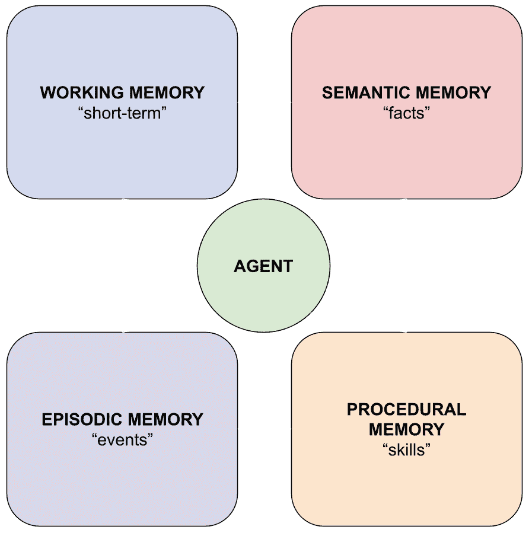

# 16

# 代理记忆：通过状态智能扩展 RAG

记忆将人工智能（**AI**）代理从无状态的响应者转变为一个能够学习、适应并在一段时间内建立有意义关系的智能系统。虽然**大型语言模型**（**LLMs**）在其权重中编码了大量的参数化知识，但它们缺乏记住特定交互、从经验中学习或在不同对话中保持一致性的能力。在本质上，这是**检索增强生成**（**RAG**）的演变：其中基本的 RAG 检索静态文档以增强响应，代理记忆则创建动态、不断演变的知识库，这些知识库通过代理交互不断更新。代理记忆通过提供存储、组织和检索信息的结构化机制来弥合这一差距，这些机制远远超出了模型的训练数据或上下文窗口。本章探讨了记忆架构如何使代理能够在会话之间保持上下文，个性化其响应，从过去的成功和失败中学习，并最终提供更像是与知识渊博的同事互动而不是与健忘的助手互动的体验。

在本章中，我们将涵盖以下内容：

+   什么是代理记忆？

+   代理记忆的演变

+   核心记忆类型（CoALA 框架）

+   记忆范围维度

+   实施 CoALA 的挑战

+   比较三种记忆框架方法

+   评估和监控

通过掌握这些记忆架构和实施策略，你将能够构建随着用户发展而演变的代理，将一次性交互转变为持续的关系，提供越来越有价值且个性化的体验。无论你是在构建一个能够记住客户投资组合的财务顾问，一个随着时间的推移跟踪患者症状的医疗助手，一个从调试会话中学习的客户支持机器人，还是一个适应学生学习模式的辅导教师，本章中的原则为创建真正智能、自适应的 AI 系统提供了基础。

# 什么是代理记忆？

**代理记忆**代表了一组存储和检索机制，这些机制将无状态 AI 系统转变为能够维持上下文、从经验中学习并随时间建立关系的系统。这建立在基本的 RAG 检索-然后生成模式之上，但通过持久存储、持续学习和多级检索策略进行了扩展。与传统将每次交互视为孤立的聊天机器人不同，配备记忆系统的代理可以回忆先前的对话，跟踪不断变化的患者偏好，积累领域知识，并根据过去的成果调整其行为。这种从无状态到有状态操作的根本转变，反映了每天与新人见面与建立持续关系之间的差异，共享的历史丰富了每一次互动。

代理记忆的力量不仅在于存储信息，还在于信息的组织、检索和利用方式，这些方式可以增强代理的能力。当得到恰当实施时，记忆使代理能够基于用户历史提供个性化的响应，避免重复错误，在不需要用户重新解释上下文的情况下，基于之前的讨论进行构建，并通过累积的经验逐步提高其性能。例如，在金融行业，具有强大记忆能力的顾问代理可以记住几个月前用户的风险承受能力，并跟踪投资组合的演变。同样，在医疗保健领域，医疗助理可以跟踪跨预约、药物反应和治疗进展的症状模式。在教育领域，辅导代理可以记住哪种教学方法最适合每个学生，并基于之前掌握的概念进行构建。

现代代理记忆系统从人类认知架构中汲取灵感，同时适应 AI 系统独特的功能和限制。它们通常采用多种存储机制协同工作：知识图谱用于结构化关系和事实，向量数据库用于语义相似性搜索，关系数据库用于事务数据和系统状态，以及用于时间或程序信息的专用存储。这些存储机制以不同的方式增强基本的 RAG 检索模式：向量数据库实现了与传统 RAG 类似的语义搜索，但现在是在个性化的对话历史中；知识图谱增加了结构化推理，以补充 RAG 的文档检索；时间存储允许 RAG 查询考虑信息随时间的变化。这种多语言方法确保每种类型的记忆都使用最合适的技术进行存储和访问，最大化性能和能力。

要理解我们是如何达到这些复杂的记忆架构的，了解过去二十年来对话式人工智能记忆的演变过程很有帮助，从早期聊天机器人的刚性状态机到我们今天构建的灵活、多层次的系统。

# 代理记忆的演变

在过去的二十年里，对话式人工智能中的记忆概念经历了巨大的转变，从简单的状态跟踪发展到与人类记忆组织相媲美的复杂认知架构。

## 预 ChatGPT 时代 – 状态机和槽位填充

在变压器革命之前，对话代理依赖于根本不同的记忆方法。2000 年代和 2010 年代的早期聊天机器人作为有限状态机运行，通过预定义的对话流程进行操作，其记忆仅限于跟踪对话达到了哪个状态。建立在**人工智能标记语言**（**AIML**）等技术之上的系统可以识别模式并检索预先准备好的响应，但它们的记忆仅由模式匹配规则和会话变量组成。当你询问客户服务机器人你的订单状态时，它会通过将订单号存储在一个变量中，在会话期间记住你的订单号，然后一旦对话结束，立即忘记所有内容。

以任务为导向的对话系统通过对话状态跟踪实现了小幅度的改进。这些系统维护着用户目标和约束的结构化表示，例如在航班预订系统中，有起始城市、目的地城市和旅行日期等槽位。记忆意味着填写这些预定义字段并在多轮对话中持续它们。系统可以记住你想要在星期二飞往纽约，但这仅仅是因为“目的地”和“日期”在其架构中被明确设计为槽位。任何超出这些预定义类别的信息都根本无法被记住。

在这个时代，个性化通常意味着存储在数据库中的用户配置文件，包含用户手动配置的显式偏好或系统通过直接问题提取的偏好。一个音乐推荐系统可能会记住你喜欢爵士乐，但这仅仅是因为你从下拉菜单中选择了它或回答了一个直接问题。通过对话自然学习你的偏好、从细微的提示中推断你的品味，或者随着时间的推移建立对您需求的细微理解的想法，仍然牢牢地停留在科幻领域。

### ChatGPT 转折点 – 从无状态到有状态

2022 年底 ChatGPT 的发布从根本上改变了人们对对话人工智能的期望。突然之间，用户体验到了感觉非常自然的对话，其响应展示了深刻的理解和上下文意识。然而，这种复杂性伴随着一个关键的限制：每次对话都是孤立的。模型没有记住先前会话、随时间学习用户偏好或建立过去互动的机制。你可能在周一就投资策略进行了精彩的对话，然后在周二回来时发现代理根本不记得你们讨论过什么。

作为开发者，我们确切地理解了这种隔离存在的原因，答案令人沮丧地简单：上下文窗口限制。早期的 GPT 模型只提供了几千个上下文标记的空间，大约相当于几页文本。这个空间必须容纳系统提示、当前的对话历史和用户的最新消息。在考虑到这些基本要素之后，剩下的空间就非常有限了。我们尝试实施基本的长期记忆解决方案，将对话摘要或提取的事实存储在数据库中，并在 RAG 过程中检索它们。但是，由于对话本身消耗了大部分可用的标记，并且模型需要大量的空间来进行推理和响应，你可能只有几百个标记可用于注入记忆。尝试将几周内细微的用户交互总结成几百个标记，同时保持有用的上下文，你很快就会意识到这项练习的无用。这项技术还没有成熟到能够实现复杂记忆架构的程度。

当用户试图与人工智能助手建立持续关系时，这种限制变得越来越明显。开发者以最简单的解决方案做出回应：将对话历史连接到提示中。如果模型无法自己记住之前的消息，应用程序就会简单地将其作为上下文反馈。这种方法适用于简短的对话，但立即遇到了同样的上下文窗口上限。任何超过标记限制的对话都需要截断、摘要或选择性地保留历史消息的复杂策略。这些方法每一种都涉及权衡：截断可能会丢失关键早期上下文，摘要会压缩掉细微和细节，同时增加延迟，而选择性地保留则需要复杂的启发式算法来确定什么最重要。

扩展记忆超出这些狭窄窗口的压力激发了多方向上的快速创新。RAG 背后的核心概念证明了其变革性：引入 LLM 之外的数据以帮助其生成有见地的响应。这个看似简单的想法，即检索相关外部信息并将其注入上下文，解锁了真正长期记忆的可能性。开发者不再需要将所有内容都塞入受限的上下文窗口，他们可以在几乎无限容量的外部数据库中存储对话历史和提取的事实。挑战随后从存储转向检索。当代理在数月或数年内积累了数千次交互后，找到与当前时刻相关的少数记忆变得至关重要。RAG 对有效检索的强调，使用语义相似性搜索和其他相关性排序技术，提供了从大量档案中提取相关记忆所需的机制。现在，代理可以通过搜索语义上相似的过去交流，并将最相关的部分拉入当前上下文，来“记住”六个月前的对话。

在用户需求和竞争压力的推动下，上下文窗口的大小急剧增长。从 4,000 个标记增加到 8,000，然后是 32,000、128,000，最终超过 1 百万个标记，这表明随着上下文容量的增加，记忆问题可能会简单地消失。然而，即使拥有巨大的上下文窗口，挑战依然存在。在每一个提示中包含数百页的对话历史变得成本高昂，增加了延迟，并且矛盾的是，当模型在浩瀚的上下文中努力识别相关信息时，可能会降低响应质量。使 Transformer 变得强大的注意力机制也意味着，当上下文窗口变得过大时，信号可能会在噪声中丢失。

与这些发展并行，随着研究人员认识到语言模型能够做的不仅仅是简单地响应查询，智能体范式出现了。记忆始终是智能体发展的核心，可能比任何其他 LLM 应用都更重要。原因很简单：智能体在较长的时间内自主运行，做出基于彼此的决策和采取行动。聊天机器人可以通过将每次对话孤立处理而合理地良好运行，但被分配管理复杂项目的智能体则不能。它必须记住它已经采取的行动、这些行动产生的结果、它沿途发现的约束以及哪些策略有效或无效。没有强大的记忆，智能体将反复尝试失败的方法，忘记关键约束，并失去自己的进度。这一基本需求推动了长期记忆架构的重大创新。智能体开发者不能等待上下文窗口足够大以容纳所有相关历史。他们需要复杂的记忆系统，能够存储大量的操作历史，并在决策点精确地呈现正确的信息。智能体用例推动了记忆系统从简单的对话回忆向追踪因果关系、从结果中学习以及在整个时间范围内保持一致目标的方向发展，这些能力对所有记忆增强应用都有益。

### 从简单的二分法到认知架构

早期尝试组织智能体记忆通常采用直接的二进制分类：短期记忆在模型的工怍空间内持有即时对话上下文，而长期记忆则在外部数据库中存储信息以供后续检索。Mem0 这样的框架代表了这一范式的重要进步，它通过语义搜索使长期记忆高度可检索，同时通过自动提取、去重和整合来管理记忆随时间的变化。Mem0 在技术前沿上迈出了重要的一步，证明了长期记忆既可扩展又适用于生产应用。我们将在本章后面比较记忆平台时详细检查 Mem0 的架构。然而，即使有了这些进步，简单的短期与长期二分法在智能体应用变得更加复杂时证明是不够的。不同类型的信息需要根本不同的存储和检索策略，而二进制区分未能捕捉到这些细微差别。

考虑一个智能代理必须管理的各种信息。原始对话记录与用户偏好的提炼事实有显著差异。过去交互中发生的事情的知识服务于不同的目的，与如何执行特定任务的知识不同。理解用户喜欢简洁的回复需要不同的处理方式，与记住他们表达这种偏好的具体对话相比。将这些所有信息存储在未区分的“长时记忆”中使得检索变得困难，并且经常返回不相关或不适当的上下文。

研究人员开始从认知科学中汲取灵感，几十年的研究揭示了人类记忆是通过多个协同工作的专业系统运作的。心理学家长期以来一直区分不同的记忆类型：我们用于积极推理的即时工作空间、我们个人经验的存储库、我们对世界的普遍知识和我们执行学习技能的能力。这些系统中的每一个都以不同的方式存储和检索信息，针对其特定目的进行了优化。事件记忆保存有助于我们重温经历的上下文细节，而语义记忆抽象出上下文以存储一般事实。程序记忆在很大程度上是无意识的，指导我们的行动而不需要明确的回忆。

这项认知科学基础导致了人工智能代理更复杂的记忆架构。而不是将所有信息强制放入一个单一的长时存储中，系统可以维护针对不同信息类型优化的独立记忆模块。对话记录可以流入保存时间上下文和经验细节的事件存储。从这些经验中提取的事实可以被提炼成针对快速事实检索优化的语义存储。行为模式和有效策略可以作为程序知识编码，指导代理的行动。每个模块都可以采用最适合其特定功能的存储技术和检索策略。

**认知架构语言代理**（**CoALA**）框架将这些见解结晶为一个连贯的理论基础，为理解代理记忆提供了一个共同的词汇和概念结构。通过明确定义工作记忆、事件记忆、语义记忆和程序记忆为不同的但相互作用的系统，CoALA 为开发者提供了一个原则性的记忆架构设计方法。这个框架将代理记忆从随意收集的数据库转变为一个精心设计的认知系统，其中每个组件都服务于特定的目的，并有助于代理的整体智能。

几个现代框架明确在其实现中采用了 CoALA 的认知架构。由 LangChain 团队开发的 LangMem，提供了专门针对 CoALA 内存类型的工具，使代理能够通过可配置的管道提取和组织记忆，将其转化为语义事实、情景经验和程序知识。Zep 的 Graphiti 引擎进一步实现了时间知识图，跟踪情景和语义记忆随时间的变化，为 CoALA 原始框架未明确解决的问题添加了一个关键的时间维度。我们将在本章后面比较内存平台方法时，深入探讨这些框架，探讨它们的架构选择如何反映对 CoALA 框架的不同解读。

要理解这些内存类型如何协同工作以创建真正智能的代理，我们需要详细检查 CoALA 框架的每个组件，从工作记忆开始，然后逐步过渡到三种长期内存类型，这些长期内存类型使代理能够进行持续的学习和适应。

# 核心内存类型（CoALA 框架）

现代代理内存系统的基础在于一个反映人类记忆组织的认知架构。正如人类通过协同工作的不同记忆系统处理信息一样，AI 代理也受益于一种类似的结构化方法来管理信息。CoALA 框架通过定义四种基本内存类型提供了这种结构，使代理能够维持上下文、从经验中学习、存储知识和执行熟练的行为。理解这些内存类型对于构建能够在长时间内进行复杂、上下文感知交互的代理至关重要。

图 16.1 – CoALA 框架中的四种内存类型

四种内存类型包括用于即时上下文和主动处理的工作记忆，用于过去经验和事件的情景记忆，用于事实知识的语义记忆，以及用于技能和行为的程序记忆，它们相互连接并相互影响。

让我们从考察代理如何通过工作记忆管理其即时操作状态开始。

## 工作记忆（短期）

**工作记忆**作为代理的主动工作区，持有即时对话上下文和当前操作状态，就像计算机的 RAM 持有用于主动处理的数据一样。这种内存类型维护最近的对话轮次、当前目标、中间计算以及代理在推理步骤之间需要持续的信息。在 RAG 术语中，工作记忆决定了每个查询检索上下文中包含的内容：不仅包括用户的即时问题，还包括对话历史、当前任务状态以及任何最近检索的仍相关的信息。

重要的是，工作记忆本身并不是 CoALA 框架的正式部分，该框架主要关注长期记忆架构。然而，工作记忆是成功实施 CoALA 的基础，因为它代表了所有其他记忆类型起源的素材。填充你长期存储的情景经历、语义事实和程序模式都源自于通过工作记忆的内容。从实际开发的角度来看，你需要在实施早期就优先考虑工作记忆的质量。如果你的智能体工作记忆中的数据不完整、结构差或噪声大，每个下游的记忆提取和存储操作都会受到影响。我们将在*实施 CoALA 的挑战*部分进一步讨论这个问题。

工作记忆的挑战在于其固有的局限性：语言模型在固定的上下文窗口内运行，通常从几千到几十万个标记不等，这意味着智能体必须仔细管理在这个宝贵空间中保留哪些信息。随着对话的进行，旧信息必须被总结或转移到长期存储中，为新输入腾出空间，这需要诸如滚动摘要或选择性保留关键事实等复杂策略。智能体维持连贯对话的能力在很大程度上取决于它如何管理这个有限的短期记忆，平衡即时上下文的需求与模型注意力机制的约束。

当工作记忆处理当前时刻时，智能体还需要回忆特定的过去经历来指导它们当前的行为，这引出了情景记忆的概念。

## 情景记忆（经历/事件）

**情景记忆**捕捉智能体的具体经历和互动，将它们存储为离散的事件，当类似情况出现时可以召回。这种记忆类型保留了过去的对话、解决查询所采取的解决方案路径以及先前决策的结果，本质上创建了一个可搜索的智能体经历历史。当用户返回几周前讨论的主题时，情景记忆使智能体能够检索那个特定的互动，包括不仅仅是说过的话，还包括导致特定回应的背景和推理。例如，项目管理助手可能会回忆为什么截止日期被推迟的具体原因，而食谱推荐系统会记住用户喜欢或觉得太辣的菜系。

事件记忆的力量在于其提供基于案例的推理能力：当面对新问题时，代理可以搜索类似过去的案例，并从那些经验中适应成功的解决方案策略。这代表了 RAG 检索机制的复杂进化。代理不是在静态的文档语料库中搜索，而是在自己的经验数据库上执行 RAG，检索的不仅仅是信息，还有整个问题解决背景，这可以指导当前的决策。这创造了一种经验学习形式，其中每次互动都可能改善未来的表现，因为代理构建了一个已解决问题和成功互动模式的库，这可以指导其在新情况下的行为。

除了具体经验之外，代理还需要对事实和概念有更抽象的理解，这正是语义记忆变得至关重要的地方。

## 语义记忆（事实/知识）

**语义记忆**存储代理的事实知识库，包括通用的世界知识和在会话之间持续存在的用户特定信息。这种记忆类型存储结构化事实，如用户的偏好、传记细节和特定领域的知识，以及关于世界的更广泛的概念理解。在语义记忆中，用户特定知识与社区知识之间的区别尤为重要。虽然社区语义记忆可能包含所有用户都能访问的关于金融市场、科学原理或编码最佳实践的普遍事实，但个人语义记忆则持有个人细节。在金融领域，这可能涉及投资目标；在医疗保健领域，过敏和病史；在电子商务领域，风格偏好和尺寸信息；或在教育领域，学习速度和首选的学习方法。

这种双重特性使得代理能够提供既全面又个性化的建议和回应。语义记忆通常利用知识图谱来表示概念之间的关系，使代理能够遍历连接并做出超越简单事实检索的推理。这通过实现多跳推理增强了传统的 RAG（Retrieval-Augmented Generation）：一个 RAG 查询可能首先检索用户的投资目标，然后使用图遍历找到相关的风险因素，最后在单个 RAG 周期内检索相关的市场分析。随着新事实的学习或纠正而持续更新语义记忆，确保代理的知识库保持最新和准确。

记忆拼图中最后一块涉及代理对如何执行任务的理解，这些理解编码在程序性记忆中。

## 程序性记忆（技能）

**程序性记忆**编码智能体的操作知识，包括指导其行动的规则、工作流程和行为模式。这种记忆类型包括模型训练中嵌入的隐性技能和通过提示、工具和编码程序定义的显式程序。虽然其他记忆类型关注智能体知道什么，但程序性记忆决定了智能体的行为：进行分析的逐步过程、它采用的对话管理策略以及应用于不同场景的问题解决方法。在实践中，程序性记忆表现为定义智能体行为的系统提示、确定何时以及如何调用外部能力的工具使用模式，以及基于反馈的学习改进。这包括复杂的 RAG 策略：何时触发检索、如何根据上下文制定检索查询、搜索不同查询类型的内存存储以及如何将检索到的记忆与基础模型的知识融合。与主要存储信息的其他记忆类型不同，程序性记忆直接塑造智能体的行为，更新它需要仔细考虑，因为变化可以从根本上改变智能体的操作方式。挑战在于使程序性记忆足够适应，以随着时间的推移进行改进，同时保持智能体核心行为的稳定性和可预测性。

这四种记忆类型协同工作，使智能体能够维持即时情境，回忆过去经验，访问广泛知识，并执行复杂行为，从而为持续智能交互创建一个丰富的认知架构。

**有趣的事实**

**什么是 CoALA 框架？**

2024 年由普林斯顿大学和其他机构的研究人员提出的 CoALA 框架，代表了一种理解和构建基于语言的 AI 智能体的系统方法。从认知科学中汲取灵感，CoALA 提供了一个统一的概念框架，将智能体认知分解为不同但相互作用的记忆系统和处理模块。该框架明确定义了智能体应该如何处理工作记忆以应对即时任务，情景记忆以应对过去经验，语义记忆以应对事实知识，以及程序记忆以应对技能和行为。使 CoALA 特别有价值的是其对这些记忆类型之间相互作用的强调：它展示了工作记忆如何从长期存储中提取，情景经验如何结晶为语义知识，以及程序常规如何协调所有记忆系统的使用。通过提供这种结构化方法，CoALA 帮助开发者超越临时的智能体设计，转向更原则性的架构，这种架构可以在复杂性增加的同时保持一致的行为。该框架在智能体开发社区中产生了重大影响，因为它弥合了理论认知模型与现代基于 LLM 系统的实际实施策略之间的差距。

# 记忆范围维度

在确立了智能体使用的四种基本记忆类型之后，我们现在必须考虑另一个关键维度：对这些记忆的访问范围。正如人类社会在个人知识与集体智慧之间取得平衡一样，智能体系统必须仔细管理哪些记忆属于特定用户，哪些记忆对整个社区有益。这个范围维度与每种记忆类型相交，形成了一个细致的记忆类别矩阵，它既实现了个性化，又促进了共享学习。

考虑一下金融顾问如何将行业最佳实践与对每位客户独特情况的深入了解相结合。AI 智能体面临着同样的挑战：它们必须从广泛共享的知识中汲取，同时严格保护个人信息的边界。这种集体智慧与个人隐私之间的平衡塑造了现代记忆系统的架构。

让我们先通过考察服务于集体利益的记忆来探讨这个问题。

## 社区/公共记忆 - 由所有用户共享

社区记忆代表了代理系统的集体智慧，包括对所有用户有益的共享知识，同时保护个人隐私。这个共享库包含关于世界的普遍事实、领域专业知识、最佳实践，以及从匿名化用户交互中得出的宝贵见解。当某个用户的代理发现有效的解决方案时，这种知识可以被抽象化并共享——例如，在客户支持中，找到解决常见软件问题的有效故障排除序列；在教育中，确定解释复杂概念的特别清晰方式；或在金融中，发现关于税收抵扣的常见误解。

社区记忆的力量在于其能够加速整个用户基础的学习。而不是每个代理独立地发现模式，例如用户混淆类似的技术术语、视觉学习者受益于图表，或客户经常需要帮助相同的软件功能，这些见解通过共享记忆层传播。

然而，将知识从个人记忆提升到社区记忆的过程需要谨慎的整理。系统必须采用复杂的匿名化技术，在提取模式和洞察的同时，去除任何识别信息。例如，如果某个地理区域内多个用户询问特定的地方税收法规，系统可能会将此作为标记在该地区的社区知识添加，而不透露哪些具体用户提出了问题。某些框架甚至要求在多个用户之间达到相似经验的阈值，才将模式提升到社区记忆，确保统计意义和隐私保护。

虽然社区记忆提供了知识的基础，但真正的个性化需要属于个别用户的独特记忆。

## 个人/用户特定记忆 – 个体上下文

个人记忆包括代理通过与其特定用户的互动积累的亲密知识。这不仅仅包括用户分享的明确事实，如他们的年龄、投资目标或风险承受能力，还包括从他们的行为中获得的隐含模式：他们的沟通风格偏好、他们通常与系统互动的时间、与他们产生共鸣的例子类型，以及反复出现在他们问题中的关注点。

个人记忆的深度使得真正个性化的交互成为可能。当用户在离开几周后返回，代理可以无缝地继续之前的对话，不仅记得讨论了什么，还记得如何讨论。如果一个用户之前表示他们更喜欢简洁的、以项目符号形式呈现的摘要而不是详细的解释，代理会相应地调整其沟通风格。在医疗保健领域，如果一个患者表示对针头有恐惧，代理可以建议替代的检测方法。在电子学习领域，如果一个学生在早晨的会话中遇到困难，系统可以推荐下午的学习时间。在金融领域，如果有人表示对市场波动感到焦虑，代理可以主动解决这些担忧。

隐私和数据隔离是个人记忆管理中的首要关注点。每个用户的记忆必须存在于一个完全隔离的命名空间中，强大的访问控制可以防止任何交叉污染的可能性。现代系统通过各种机制实现这一点：每个用户都有自己的数据库模式，使用用户特定的密钥进行加密存储，或者通过严格的查询过滤器进行仔细的元数据标记。在多租户系统中，挑战加剧，数千或数百万用户共享相同的基础设施，需要逻辑上和有时物理上分离内存存储。

个人记忆也提出了关于数据保留和用户控制的重要问题。用户必须能够审查、纠正和删除他们的个人记忆，这不仅是为了符合监管要求，也是为了维护信任。一些系统实现了记忆衰减，其中较旧且未使用的记忆会逐渐消失，除非通过持续的关联性得到强化，从而模仿人类遗忘曲线，同时确保系统不会因过时信息而变得杂乱。

理解这两个作用域如何与每种记忆类型相互作用，揭示了现代内存架构的全部复杂性。

## 如何记忆类型和作用域相交

记忆类型与作用域维度的交集创造了不同的类别，这些类别塑造了代理的认知架构。然而，并非所有记忆类型都跨越了两个作用域。工作记忆作为一个纯粹的个人结构而独立存在，本质上具有暂时性和会话特定性。它只持有单个用户在模型上下文窗口内的即时对话上下文。虽然工作记忆本身不能在用户之间共享（因为每个对话都存在于其自己的孤立上下文中），但观察到的许多工作记忆会话模式可以告知社区层面的程序记忆关于最佳对话流程、查询制定策略和上下文管理技术。

对于三种长期记忆类型（事件、语义和程序），社区/个人分割创建了六个不同的类别，它们共同工作以实现共享学习和个性化。每种记忆类型在两个范围中表现不同，在代理的架构中发挥着独特的作用。

事件记忆同样在范围上进行了分割。公共/社区事件记忆可能包含匿名案例研究或许多用户中出现的成功问题解决模式，而个人事件记忆则保留了单个用户的特定对话和经历。这使得代理能够从集体经验中学习，同时保持个人交互的隐私和特定性。

程序记忆的分割在实践中特别有趣且较为罕见。社区程序记忆包括系统学习或编程中共享的“最佳实践”，例如调试代码错误的最高效序列、解释数学概念或指导用户完成表单的最佳方法。个人程序记忆虽然较为罕见，但可能包括用户特定的调整：“对于这个用户，在介绍新概念后始终提供视觉示例”或“这个用户更喜欢在最佳情况预测之前看到最坏情况。”这些个性化的程序实际上为每个用户定制了代理的 RAG 策略。

这六个类别加上工作记忆，在实践中创造了强大的协同效应。当回答一个复杂问题时，代理会在多个记忆类型和范围内进行检索。例如，一个帮助治疗选择的医疗助手可能会利用社区语义记忆中的医学知识、社区事件记忆中的成功治疗模式、个人语义记忆中的患者的医疗历史，以及个人事件记忆中关于治疗偏好的先前讨论。同样，一个编码助手可能会结合语言文档（社区语义）、常见的调试模式（社区事件）、用户的项目结构（个人语义）和过去的调试会话（个人事件）。响应综合了集体智慧与个人上下文，提供既专业又与个人相关的建议。

这四种记忆类型共同工作，使代理能够维持即时上下文，回忆过去经历，访问广泛的知识，并执行复杂的行为，为持续的智能交互创造丰富的认知架构。然而，CoALA 理论框架的优雅掩盖了实施的实际困难。在我们考察不同平台如何应对这些挑战之前，我们必须首先了解开发者在将 CoALA 概念转化为生产系统时面临的共同障碍。

**有趣的事实：语义缓存与公共事件记忆之间的关系**

我们刚刚描述了“公开情景记忆”是指“可能包含匿名案例研究或成功的问题解决模式，这些模式在许多用户中产生。”我们在哪里还看到过这种模式？在上一个章节中的语义缓存！使用语义缓存时，你正在处理传入的查询（或合成你预期会被询问的新查询），并建立处理该查询的基础设施，通常是将传入的查询与语义缓存列表中的现有查询相匹配（使用向量搜索）。如果不匹配，我们甚至展示了如何设置它以填充数据库中的查询，以便下次被询问时能够匹配。然而，在情景记忆中，我们谈论的是从用户的聊天历史中提取查询（和响应），以及我们的编排智能体已经为我们找到了解决方案路径，并且可能将其转换为公开情景记忆，以便我们下次任何用户请求时能够以相同的方式处理它。这本质上是一个相同的概念！所以，如果你想知道情景记忆机制是否可以以更稳健的方式替换你的语义缓存，答案是肯定的！我们将在下一章的代码实验室中展示这是如何工作的！

# 实施 CoALA 的挑战

虽然 CoALA 框架为组织智能体记忆提供了一个优雅的理论基础，但将这些概念转化为生产系统则带来了几个实际挑战，开发者必须提前解决这些问题，以避免在规模扩大时出现重大的重构和性能问题。

## 工作记忆数据的质量

最基本的挑战在于工作记忆数据的质量，因为这种原材料为所有下游的记忆提取提供支持。聊天历史记录，工作记忆的典型来源，很少是为智能体记忆而设计的。它们是为了调试或合规而构建的，捕获消息文本和时间戳，但缺少丰富的上下文信息，如工具调用、推理跟踪、置信度水平或外部数据咨询。当记忆提取管道试图从这些贫瘠的日志中推导出语义事实或情景经验时，它们是在不完整的信息下操作的。提高工作记忆质量需要对你的智能体管道进行仪器化，以捕获更丰富的事件流：带有参数和结果的工具调用、检索到的上下文及其相关性评分、内部推理步骤以及处理过程中的状态变化。这种遥测提供了记忆提取模型生成有意义的长期记忆所需的上下文。

## 收集全面的用户体验事件

仅聊天历史无法捕捉用户互动的全貌。用户通过多个渠道进行互动：点击按钮、导航菜单、调整设置或与可视化进行交互。当用户在收到推荐后点击“保存”，这比口头认可更能清楚地表示同意。当他们忽略未读通知时，这揭示了他们的偏好。用户自然期望代理能够意识到这些互动，然而许多实现仅专注于基于文本的对话。构建一个全面的事件收集系统需要映射每个交互接触点，并确定哪些事件表明用户偏好、信号同意或不同意、揭示任务完成模式或为后续轮次提供上下文。目标是确保聊天界面之外的重要用户行为有助于代理不断发展的理解。

## 管理和维护不断增长的内存存储

随着记忆集合的增长，出现了一些管理挑战，尤其是记忆硬化，其中较老、过时的记忆主导了检索结果。向量相似性搜索不理解时间相关性，因此即使完全过时，两年前的偏好记忆也可能出现。记忆管理需要积极的管理：合并相关记忆的巩固机制、使较老记忆失去检索优先级的衰减策略（除非得到强化）、解决矛盾信息的冲突解决以及清理过时数据的归档过程。不同的记忆类型老化速度不同，语义事实可能稳定数年，而情景记忆很快就会失去相关性，因此一刀切的方法必然失败。成功的 CoALA 实现将管理视为一个持续的操作问题，包括监控系统、自动巩固管道和反馈循环，这些反馈循环根据检索效果提高记忆质量。

这些实现挑战，从确保高质量的工作记忆到全面的事件收集再到可持续的记忆管理，代表了 CoALA 理论上的优雅与生产现实之间的差距。不同的开发团队以不同的策略来处理这些问题，从而产生了多样化的记忆框架生态系统。每个框架都做出了独特的架构选择，关于如何提取、存储、检索和维护记忆，反映了不同的优先级和用例。通过比较领先框架如何应对这些挑战，我们可以更好地理解其中的权衡，并确定哪些方法最适合特定的应用需求。

# 比较三种记忆框架方法

记忆框架领域已经发展到包括既与 CoALA 的认知架构明确对齐又采取更实用方法的系统。Mem0 代表了短期/长期记忆二分法方法的顶峰，提供了没有认知类型区分的复杂统一存储。LangMem 通过为每个类别提供专门的提取和管理管道，显式实现了 CoALA 记忆类型的分离。由 Graphiti 知识图谱引擎驱动的 Zep，扩展了 CoALA 的情景和语义记忆概念，但明显缺乏程序性记忆支持。每个框架都针对不同的技术要求和实现复杂性。让我们从 Mem0 的内存管理简化方法开始。

## Mem0 架构

Mem0 实现了一个提取-更新-检索管道，通过交互不断优化其记忆语料库。系统使用基于 LLM 的提取来识别对话中的显著事实，然后通过自动去重、合并和冲突解决来维护这些记忆。该架构使用混合存储：键值存储用于结构化事实检索，向量数据库用于语义相似性搜索，以及可选的图数据库（通过 Mem0g）用于复杂实体关系。这种多语言方法优化了检索性能，而不是认知分类。

该框架将所有长期记忆视为一个统一的存储库，无论信息代表事实、经验还是行为模式，都应用相同的提取和检索逻辑。记忆更新通过两阶段管道进行：提取阶段从对话轮次中识别新信息，而更新阶段基于语义相似性和时间近度合并、无效化或巩固现有记忆。系统通过可配置的到期日期和基于冲突的无效化来实施记忆衰减，当出现矛盾信息时。

Mem0 在 LOCOMO 上的基准测试结果表明，与 OpenAI 的记忆实现相比，准确率提高了 26%，同时与全上下文基线相比，降低了大约 90% 的延迟和令牌消耗。生产采用指标（41,000+ GitHub 星标，1.86 亿+每月 API 调用）验证了该方法的实际有效性。对于那些显式情景/语义/程序区分对统一内存管理提供的益处微乎其微的应用，Mem0 的简化架构降低了实现复杂性，同时保持了强大的检索性能。

在看到 Mem0 对统一长期记忆的实用方法后，我们可以将其与 LangMem 的基于 CoALA 的记忆类型区分的显式实现进行对比。

## LangMem

LangMem 通过单独的存储命名空间和提取管道直接实例化 CoALA 的内存类型分类法。该框架为每个内存类别提供不同的 API：语义记忆操作使用向量相似性存储和检索事实，情节记忆维护会话序列以进行少样本检索，程序性记忆修改系统提示以编码学习行为。这种分离使内存类型特定的优化成为可能：语义记忆使用积极的去重和合并，情节记忆保留完整的会话上下文以进行基于案例的推理，程序性记忆应用提示优化算法以细化代理指令。

记忆形成通过两种操作模式发生。热路径更新允许代理在会话期间通过工具调用显式管理记忆，提供带有完整代理上下文的即时记忆形成。背景提取在会话完成后异步运行，应用更计算密集型的分析以提取记忆，而不影响响应延迟。该框架支持多种程序性记忆优化策略，包括基于元提示的反思、梯度式批评-然后更新方法以及单步提示细化。

LangMem 与 LangGraph 的 BaseStore 抽象原生集成，允许从内存存储到 PostgreSQL、MongoDB 或其他生产数据库的可插拔后端。基于命名空间的内存隔离防止跨用户污染，同时允许在团队或组织范围内进行选择性记忆共享。显式的 CoALA 对齐使应用程序能够根据查询类型应用不同的检索策略：语义搜索用于事实查找，k-NN 情节检索用于相似案例识别，以及程序性记忆注入用于一致性行为执行。

虽然 LangMem 提供了显式的 CoALA 内存类型实现，但 Zep 及其 Graphiti 引擎通过添加对记忆随时间演变的时序感知，将认知架构概念进一步深化。

## Zep 和 Graphiti

Zep 提供了一个基于 Graphiti 的托管内存平台，Graphiti 是一个开源的时序知识图谱引擎。这种关系是架构性的：Graphiti 提供了基于图的内存基础设施作为独立框架的核心，而 Zep 则通过企业功能、安全控制和托管基础设施对其进行封装。选择它们之间的开发者需要在操作复杂性和部署灵活性之间进行权衡。

Graphiti 知识图谱实现了三层子图层次结构。情节子图将原始对话数据作为节点存储，通过情节边连接到提取的实体，以保持原始输入的完整保真度，用于溯源跟踪。语义实体子图包含代表人物、地点、概念和对象的实体节点，语义边编码为事实三元组的关系。社区子图使用标签传播对密集连接的实体进行聚类，为图区域提供高级摘要。这种架构直接将 CoALA 的情节和语义记忆映射到图结构中，但值得注意的是，没有提供程序性记忆的实现。

时间建模通过双时间跟踪将 Graphiti 与其他框架区分开来。每个边维护四个时间戳：`t_valid`和`t_invalid`标记事实在现实世界中为真时的时间，而`t_created`和`t_expired`跟踪摄入信息的系统级有效性。当新事实与现有边冲突时，系统通过语义比较它们，并使用时间逻辑通过设置`t_invalid`来无效化被取代的信息，从而在不丢失数据的情况下保留历史状态。这使点时间查询能够重建在任何时刻的知识图谱状态，并跟踪知识在长期内的演变。

检索结合了三种搜索策略：向量嵌入上的余弦相似度用于语义相关性，BM25 全文搜索用于关键词匹配，以及从种子节点开始的广度优先图遍历用于上下文邻近度。结果通过互反排名融合合并，然后再进行重新排序。该实现通过避免检索过程中的 LLM 调用，而是利用 Neo4j 的本地向量和倒排索引，实现了 300 毫秒的 P95 延迟。基准测试结果表明，在深度记忆检索任务上达到 94.8%的准确率，在`LongMemEval`上提高了高达 18.5%，与基线相比，延迟降低了 90%。

程序性记忆支持的缺失意味着 Graphiti 无法编码学习行为或自主更新代理指令。需要程序性学习的应用必须单独实现此功能或结合 Graphiti 与互补框架，如 LangMem。

现在已经探索了三种不同的内存管理方法，自然而然的问题是：您应该为您的特定用例选择哪个框架？

## 选择正确的记忆框架

框架选择取决于您的应用程序是否从显式的记忆类型区分中受益，以及是否在演变信息上的时间推理提供了价值。

当统一长期记忆足以满足需求而不需要认知分类时，请选择 Mem0。具有简单持久性要求的应用程序、跟踪用户上下文的客户支持系统、维护学生历史的学术平台以及管理持续项目的个人助理都可以有效地使用 Mem0 的简化架构。经过生产测试的实现（41K+星标，186M+每月 API 调用）和强大的基准性能为希望拥有经过实战考验的记忆但不需要实现复杂性的团队提供了信心。当检索质量比与认知记忆类型的理论一致性更重要时，Mem0 表现良好。

当您的应用程序真正需要将事实、经验和程序视为具有不同生命周期管理的不同实体时，请选择 LangMem。需要将语义事实存储与情景少样本学习分离的系统，或应根据交互模式演变程序指令的智能体，与 LangMem 的显式记忆类型分离相一致。本地的 LangGraph 集成使其对已经投资于 LangChain 生态系统的团队具有吸引力。LangMem 的双热路径和后台提取模式提供了在内存形成时间上的灵活性。重要的是，LangMem 在这些框架中提供了唯一的生产就绪程序性记忆实现。

当时间动态成为主要需求时，请选择 Zep/Graphiti。跟踪患者进展的医疗系统、监控演变投资组合的金融平台、跟踪不断变化的客户需求的客户成功应用程序以及需要审计跟踪的合规系统都受益于双时态知识图。显式的情景和语义子图提供 CoALA 一致性，而时间元数据使历史推理成为可能，这是其他框架无法实现的。然而，缺乏程序性记忆意味着需要适应学习行为的程序必须单独实现或结合 Graphiti 和 LangMem 以实现全面的 CoALA 覆盖。

混合架构可能对复杂需求来说是最优的。将 LangMem 的程序性记忆与 Graphiti 的时间情景和语义存储相结合，提供了具有时间推理的完整 CoALA 实现。或者，使用 Mem0 进行简单的偏好跟踪，同时利用 Graphiti 进行复杂的关系和时间数据，可以有效地分离关注点。评估每个应用程序组件所需的每个功能，而不是强迫统一的内存基础设施。

需要考虑的额外因素包括团队的专业技能（Graphiti 需要 Neo4j 的专业知识；Mem0 需要最少的专门知识），基础设施限制（Zep 依赖于图数据库；LangMem 支持各种后端），性能要求（延迟、吞吐量和存储成本差异很大），以及运营成熟度（生产部署、社区支持和文档质量差异很大）。

理解这些选择标准有助于我们在记忆框架的多样化领域中导航，引导我们更广泛地反思这种多样性对领域意味着什么。

在考察了`Mem0`、`LangMem`和`Zep`/`Graphiti`如何以不同级别的 CoALA 对齐和时序复杂性实现记忆架构后，关键问题从理论设计转向了操作有效性。如果系统在生产中性能下降、检索无关的记忆或随着时间的推移积累膨胀，那么基于架构优雅性的框架选择就微不足道了。记忆系统需要持续测量和维护，以确保随着对话历史增长、用户基数扩大和信息演变，它们能够提供价值。了解如何评估记忆有效性、检测退化模式并实施自动化维护策略，将原型实现与能够跨数百万次交互保持性能的生产就绪系统区分开来。

# 评估与监控

构建记忆系统只是挑战的一半。理解它们是否真正提高了代理性能需要复杂的评估方法。与传统软件指标不同，记忆的有效性跨越多个维度，从技术性能到用户体验，因此对生产系统进行全面评估至关重要。

评估记忆增强代理的复杂性源于记忆影响的间接性。一个记忆系统可能完美地存储和检索信息，但如果记忆没有正确地整合到决策中，它可能无法改善代理行为。相反，即使是不完美的记忆，如果应用得当，也能显著提升用户体验。这需要多方面的评估策略，既要捕捉系统级指标，也要捕捉涌现行为。

让我们先考察记忆如何从根本上改变我们在代理系统中需要测量的内容。

## 评估基于记忆的系统与无记忆系统

测量记忆的有效性需要定量指标和定性评估，因为记忆影响代理性能的众多方面。传统上对无记忆代理的评估主要关注单轮准确性：代理是否在给定即时上下文的情况下提供了正确的答案？记忆增强系统需要一种根本不同的评估范式，该范式考虑纵向一致性、知识积累和行为适应。

传统上对无记忆代理的评价集中在单回合指标上，即孤立交互中的响应质量、事实准确性和任务完成率。这些简单的基准对于每个查询都得到独立响应的无状态系统来说效果很好。然而，记忆从根本上改变了评估要求。我们不再测量特定时间点的性能，而必须现在跟踪会话之间的纵向连贯性、长期的知识积累以及从持续上下文中出现的适应性行为。这种从孤立指标到轨迹分析的转变需要全新的评估方法。

基于记忆的系统需要一种全新的评估方法，这种方法考虑了信息如何在多个时间尺度上持续并影响行为。我们不再评估孤立交互，而必须现在跟踪系统如何保持连贯性、积累知识以及在长期内提高其性能：

+   **短期评估**：

    +   代理是否在对话中保持上下文

    +   跟踪单次会话中多个回合之间的连贯性

    +   衡量工作记忆管理即时上下文的能力

+   **中期评估**：

    +   信息是否在会话之间持续

    +   验证关键事实和偏好在对话之间是否保留

    +   在时间延迟后测试检索准确性

+   **长期评估**：

    +   代理是否真正随着时间的推移学习和改进

    +   跟踪性能轨迹而不是点测量

    +   衡量知识积累和细化

这个时间维度将评估从点测量转变为轨迹分析，需要新的方法来跟踪代理的演变。随着我们必须现在考虑的不仅仅是代理是否给出正确答案，还包括它是否保持一致性、建立在前知识的基础上以及是否表现出真正的学习，复杂性呈指数增长。

理解这些评估需求的基本差异后，我们现在可以探索用于衡量记忆有效性的具体指标。

## 记忆有效性指标

关键指标包括检索精度（检索到的记忆实际上有多相关）、召回完整性（是否成功检索到重要记忆）、响应延迟影响（记忆操作的时间成本）和存储效率（记忆大小与价值之间的关系）。高级系统还跟踪记忆利用率模式，确定哪些记忆经常被访问，哪些保持休眠。

### 检索指标

任何记忆系统的核心在于其能够在正确的时间找到并呈现正确的信息。检索指标帮助我们了解系统是否能够有效地导航其存储的知识以支持代理当前的需：

+   **检索精度**：

    +   衡量检索到的记忆实际上有多相关于当前上下文

    +   在具有记忆的 RAG 系统中，这个指标对于区分文档相关性（传统 RAG）和记忆相关性（基于用户历史的上下文适宜性）变得至关重要

    +   这尤其关键，因为无关的记忆可能会通过噪声污染上下文而主动损害性能

    +   系统必须在避免遗漏重要记忆和专注于真正相关信息之间取得平衡

    +   高精确度确保了清晰的上下文，但风险是错过边缘情况相关的记忆

+   **召回完整性**：

    +   测量在需要时是否成功检索到重要记忆

    +   通常在精确度上进行权衡；检索更多记忆增加了找到相关记忆的机会，但也引入了更多潜在噪声

    最佳点因应用而异：

    +   客户服务代表可能会优先考虑回忆，以确保不遗漏重要上下文

    +   决策支持系统可能倾向于精确度以保持清晰

    +   错过关键记忆可能导致行为不一致或重复提问

+   **响应延迟影响**：

    +   记忆操作在整体系统性能上的时间成本

    +   必须在检索的彻底性和响应时间要求之间取得平衡

    +   包括检索时间和检索记忆的处理开销

    +   对于用户期望快速响应的实时应用至关重要

+   **记忆利用模式**：

    +   跟踪哪些记忆经常被访问，哪些保持休眠

    +   揭示了哪些存储信息实际上影响了代理行为

    +   帮助识别应该缓存以供快速访问的“热”记忆，以及可以存档的“冷”记忆

    +   使针对记忆系统的优化变得可能

+   **潜在实现方法**：记录每次记忆检索的查询、检索到的记忆和相关性评分。为了精确度，让评估者在查询样本上对检索到的记忆进行相关/不相关评级。为了召回，创建包含已知相关记忆的测试集，并检查它们是否被检索。通过检索调用周围的简单计时工具跟踪延迟。通过为每个记忆 ID 维护计数器来监控访问频率。

这些检索指标揭示了记忆系统是否能够高效地找到相关信息，但它们并没有告诉我们这些信息最初是否被高效地存储

### 存储指标

除了检索之外，我们还必须评估系统管理其记忆资源效率的高低。存储指标有助于确定系统是在积累有价值知识还是在简单地囤积数据：

+   **存储效率**：

    +   记忆大小与提供价值之间的关系

    +   并非所有记忆都提供同等价值，而原始系统可能对琐碎信息和关键信息分配同等资源

    +   复杂的评估跟踪存储记忆的价值每字节

    +   识别压缩、总结或遗忘低价值信息的机会

    +   在存储成本上升的规模上变得至关重要

+   **记忆增长模式**：

    +   随时间积累的速率

    +   增长是线性的、指数的还是对数的

    +   有助于预测未来的存储需求和成本

    +   指示系统是否高效学习或只是积累数据

+   **去重和压缩**：

    +   系统避免存储冗余信息的程度

    +   摘要和巩固策略的有效性

    +   压缩对检索精度的影响

    +   保存空间和信息损失之间的平衡

+   **潜在的实现方法**：通过在数据库中对记忆大小随时间的变化进行查询来跟踪存储指标。通过将每个记忆的检索频率除以存储大小来计算每字节的值。在存储之前使用相似性哈希或嵌入距离实现去重检查。通过每天/每周的内存总数和大小快照来监控增长。

虽然这些技术指标提供了关于系统性能的基本反馈，但它们并不能捕捉到记忆对代理行为和用户体验的全面影响。一个系统可能具有完美的检索精度和最佳存储效率，但在实际使用中仍然无法带来有意义的改进。

## 行为评估

行为评估检查记忆如何影响代理在特定任务上的表现。这包括衡量会话之间的对话连贯性、个性化准确性、学习效率（代理如何随着经验快速提高）以及错误恢复（代理是否避免重复过去的错误）。用户满意度通常与有效的记忆密切相关，因为当代理记住他们的上下文时，用户会感到被听到和理解。

### 对话连贯性指标

一个记忆系统的真正考验往往在于对话的微妙之处，以及代理是否能够维持连贯、语境化的对话，感觉自然并意识到过去的交互：

+   **跨会话一致性**：

    +   代理是否不仅记得事实，还记住之前交互的情感背景？

    +   是否能够自然地参考之前的讨论，而不显得机械？

    +   代理在对话中保持一致的性格和知识

    +   它避免与之前会话中的信息相矛盾

+   **参考质量**：

    +   代理将过去的信息自然地融入当前响应中

    +   避免尴尬的“正如你之前提到的...”结构

    +   无缝地将历史背景编织到对话流程中

    +   这些品质源于有效的记忆，但自动测量起来却很困难

+   **语境适宜性**：

    +   代理知道何时参考过去的交互，何时不参考

    +   它尊重之前对话的情感权重

    +   它可以根据关系历史调整其正式程度和语气

    +   许多团队采用人工评估或复杂的评分标准，这些标准检查对话流畅性、参考一致性以及语境的适宜性

+   **潜在的实现方法**：创建跨越多个会话并包含已知事实的对话测试套件以进行验证。使用具有评分标准（1-5 级）的人类评估者对自然性和适当性进行评分。通过跨会话比较实体/事实断言来自动检测矛盾。使用模式匹配或 LLM 分类在响应中跟踪显式记忆引用。

对话连贯性只是行为改进的一个方面。同样重要的是，系统能够从经验中学习并随着时间的推移调整其行为。

### 学习和适应指标

记忆系统的最终价值往往不在于完美的回忆，而在于其帮助代理学习、适应并避免重复错误的能力：

+   **学习效率**：

    +   代理如何快速适应用户偏好或特定领域的模式

    +   一个设计良好的记忆系统应该随着时间的推移减少所需的更正次数

    +   它应该比无记忆的替代方案更快地收敛到适当的行为

    +   这通过跟踪更正频率与交互次数之间的关系来衡量

    +   这表明系统是否真正在学习或只是记忆

+   **错误恢复模式**：

    +   记忆评估中最有价值但被忽视的方面之一

    +   当代理犯错误时，有效的记忆系统应该防止重复相同的错误

    这需要跟踪以下内容：

    +   错误模式和类型

    +   用户提供的成功更正

    +   随后的行为以验证是否真正学到了教训

    +   重复错误的缺失往往比任何积极的指标更能提供有效记忆的证据

+   **个性化准确性**：

    +   系统能否根据个体用户定制响应

    +   是否记得并正确应用用户特定的偏好？

    +   它应该为不同的用户维护不同的交互模式

    +   这通过用户满意度评分和偏好依从率来衡量

+   **潜在的实现方法**：记录所有用户更正并跟踪是否发生类似的错误。通过测量尝试次数中的任务成功率来计算学习曲线。创建偏好测试场景，其中已知用户偏好应影响响应。通过启用/禁用记忆的 A/B 测试来比较个性化与通用响应质量。

这些行为指标提供了洞察力，了解记忆是否转化为用户体验的真正改进。然而，学习和适应只是故事的一部分。代理还必须保持对事件发生的时间和它们之间相互关系的连贯理解，这需要评估时间一致性。

### 时间一致性指标

记忆系统必须准确跟踪并维持事件之间的时间关系，确保代理在长时间交互中对时间的理解保持连贯。与简单的按时间顺序排列不同，时间一致性需要理解相对时间参考、因果关系序列以及信息随时间的发展：

+   **事件序列跟踪准确性**：

    +   衡量记忆系统在会话间保持事件正确顺序的效果

    +   超越简单的时间戳，理解相对时间关系

    +   必须正确地将时间锚点，如“我度假前的会议”，映射到特定事件

    +   评估系统即使在间接引用的情况下也能保持事件顺序

    +   对于在长时间对话中保持叙事连贯至关重要

+   **时间关系保持**：

    +   评估系统维持复杂时间关系的能力

    +   包括重叠事件、重复模式和条件序列

    +   必须理解项目跨越多个会议，事件每周重复，等等

    +   跟踪一个决策的级联效应是否在时间上正确链接

    +   通过测试对持续时间、重叠和周期性的理解来衡量

+   **因果关系链一致性**：

    +   跟踪系统是否在时间上保持准确的因果关系

    +   当事件 A → 事件 B → 事件 C 时，这些因果关系必须持续

    +   对于决策至关重要，以避免重复错误

    +   需要跟踪在会话间为什么做出某些选择

    +   通过需要理解因果关系序列的问题进行评估

+   **潜在实现方法**：创建时间线重建测试，其中代理必须正确排序事件。使用探询问题，如“X 之后但 Y 之前发生了什么？”来测试时间理解。构建具有已知因果关系链的因果推理测试，并验证代理能否追踪它们。存储事件时，同时使用绝对时间戳和相对时间标记进行验证。

虽然时间一致性确保代理理解何时以及为什么事情发生，但现实任务需要更复杂的能力，例如连接和综合多个记忆和会话中的信息以解决复杂问题的能力。

### 多跳和跨会话推理

复杂的实际任务通常需要综合多个交互中分散的信息，使多跳推理成为记忆增强代理的关键能力。这些评估测试代理是否能够将不同的信息片段连接起来形成连贯的结论：

+   **多跳查询成功率**：

    +   衡量回答需要多次记忆检索的问题的能力

    +   示例：“在 Q2 规划中，莎拉提到的项目的预算是多少？”

    +   第一跳：确定莎拉讨论的项目

    +   第二跳：定位 Q2 规划发生的时间

    +   第三跳：检索预算信息

    +   成功率通常随着每个额外跳转指数级下降

    +   区分简单查找和真正的信息综合

+   **跨会话信息综合**:

    +   评估来自不同对话会话的信息整合

    +   跟踪基于新信息的主题演变和信念更新

    +   识别一个会话中的事实与另一个会话的事实相矛盾或补充

    +   必须积极将记忆综合成连贯的响应

    +   超越检索，测量全面理解构建

+   **复杂推理链评估**:

    +   测试扩展推理序列中的逻辑一致性

    +   包括三段论推理（如果 A→B 和 B→C，则 A→C）

    +   在多个会话中评估约束满足度

    +   根据积累的知识衡量假设推理

    +   通常需要 3+推理步骤，中间进行验证

    +   评估最终准确性和推理过程的有效性

+   **潜在实现方法**：设计包含已知答案的多跳问题集，这些答案需要连接 2-5 条信息。跟踪检索链以验证代理是否遵循正确的推理路径。创建包含分布式事实的合成对话历史并测试综合能力。使用转化为对话情境的正式逻辑问题来评估推理一致性。

行为评估揭示代理如何使用他们的记忆，但在生产环境中维持这些能力需要持续监控和优化底层系统性能。

## 性能跟踪

生产内存系统需要持续监控以检测退化、识别优化机会并确保一致的质量。性能跟踪包括技术指标，如查询延迟和检索准确性，以及业务指标，如用户保留率和任务完成率。挑战在于将低级系统指标与高级结果连接起来，理解哪些技术改进对用户真正重要。

### 实时监控要求

生产系统需要立即了解内存系统健康状况，以便在问题影响用户之前捕捉到它们。实时监控提供了早期预警信号，防止小问题演变成重大事件：

+   **内存操作延迟**:

    +   跟踪内存操作的 P50、P95 和 p99 延迟

    +   退化通常首先表现为延迟增加，然后才会影响用户可见的行为

    +   设置异常延迟峰值警报，可能表明系统问题

    +   监控延迟趋势以预测何时需要优化

+   **缓存性能**:

    +   监控不同级别的内存缓存命中率以确保最佳性能。

    +   衡量缓存在减少各种查询类型检索时间上的有效性。

    +   跟踪内存压力和驱逐模式以识别容量限制。

    +   缓存效率降低通常先于用户可见的性能问题。

+   **检索分布**：

    +   无论系统是否使用其全部内存容量，还是反复访问相同的小子集

    +   帮助识别某些记忆在检索中是否过度表示

    +   暗示优化机会或内存组织潜在问题

    +   可以揭示检索系统中的偏差

+   **潜在实施方法**：使用 APM 工具（如 Datadog 或 New Relic）或自定义指标管道来跟踪延迟。实现分布式跟踪以追踪内存操作通过系统。设置带有百分位延迟和缓存命中率的仪表板。配置延迟峰值大于基线 2 倍和缓存命中率低于阈值的警报。

实时指标提供即时反馈，但了解系统健康也需要分析仅在长期内出现的模式。

### 纵向分析模式

长期监测揭示了短期指标所遗漏的趋势和退化模式。这些纵向洞察指导着关于系统维护和演化的战略决策：

+   **内存增长特征**：

    +   每日、每周和每月的存储增长率

    +   在基础设施约束下，增长是否可持续

    +   识别快速积累期与稳态期

    +   帮助进行容量规划和预算预测

+   **质量退化模式**：

    +   内存膨胀：这发生在系统存储每个对话细节而不进行重要性筛选时，或者当类似信息以略微不同的形式反复存储时，逐渐稀释内存存储中的信噪比：

        +   以随着时间的推移检索精度下降为特征

        +   通常由不充分的去重或摘要引起

        +   需要干预以压缩或修剪低价值记忆

    +   **内存硬化**：旧、过时的记忆主导检索结果：

        +   系统陷入过去的模式

        +   无法适应新信息或变化的环境

        +   通常需要重新加权检索算法中的近期性

+   **漂移监控**：

    +   随时间检索精度的变化

    +   检索内存类型分布的变化

    +   内存访问模式的演变

    +   指示何时需要重新训练或重新校准

+   **潜在实施方法**：安排每周/每月分析作业，计算增长率和质量指标。构建时间序列数据库以跟踪指标演变。创建漂移检测算法，将当前分布与基线期进行比较。使用统计过程控制图来识别指标何时超出正常变异界限。

理解这些模式使团队能够实施主动维护策略，而不是被动修复。

### 自动化维护策略

最复杂的内存系统包括自我修复机制，这些机制可以自动解决在影响性能之前出现的常见问题：

+   **常规分析触发器**：

    +   内存组成分析（内存类型和年龄的分布）

    +   年龄分布研究（记忆的年龄分布）

    +   相关性评分跟踪（较旧的记忆是否保持相关性）

    +   所有这些都会随着时间的推移而出现，并需要纵向跟踪

+   **自动化维护常规**：

    +   根据访问模式压缩内存

    +   合并相似或冗余的内存

    +   根据相关性衰减修剪内存

    +   将冷内存存档到更便宜的存储层

    +   这些常规操作确保即使在系统积累了数月或数年的交互后，性能也能持续。

+   **性能优化周期**：

    +   定期重新索引内存存储

    +   重新训练检索模型

    +   重新校准相关性评分

    +   调整内存分配策略

+   **潜在的实现方法**：为维护任务构建 cron 作业或编排工作流（如 Airflow 或 Temporal）。实现结合近期性、频率和相关性信号的内存评分算法。创建自动管道，在 30 天后压缩低访问内存，并在 90 天后存档。使用功能标志逐步推出优化更改，同时监控影响。

高级团队实施这些模式以维护系统健康，并确保随着系统规模和演变，内存继续提供价值。实时监控、纵向分析和自动化维护的组合创建了一个强大的操作框架，即使在内存系统积累了多年的交互和 PB 级存储知识后，也能保持最佳性能。

# 摘要

代理记忆通过将 RAG 从静态文档检索扩展到动态、持续演变的知识库，将无状态的 LLMs 转化为能够随时间学习和适应的系统。这种能力代表了二十年的演变成果，从早期的聊天机器人状态机到 ChatGPT 的上下文窗口限制，再到今天的认知架构，这些架构由不断扩大的上下文窗口、RAG 模式和自主代理的出现所驱动。CoALA 框架通过三种长期记忆类型为这种演变提供结构，这些类型是经验的事件记忆、知识的语义记忆和技能的程序记忆——这些记忆与社区和个人范围相交，以平衡集体学习与个人隐私。现代框架以不同的哲学理念实现这些概念：Mem0 提供复杂的统一存储，优先考虑实际效果而不是认知分类，LangMem 直接实现 CoALA 的记忆类型分离，为每个类别提供专门的提取管道，而 Zep 和 Graphiti 通过时间知识图扩展事件和语义记忆，跟踪信息随时间的变化，尽管没有程序记忆支持。在生产中部署这些系统需要超越架构的优雅，进行全面评估检索精度、存储效率、对话连贯性和时间一致性，并支持自动化维护策略，防止系统扩展到数百万次交互时记忆退化。

虽然我们已经建立了代理记忆的理论基础和架构模式，但从概念到生产的转变需要具体的实现。在下一章中，我们将深入代码，探索使用具有 RAG 集成的 CoALA 框架构建这些记忆系统的实际示例。您将学习如何初始化记忆模块，实现检索-生成-更新管道，并协调不同记忆类型之间的复杂交互，从而将我们讨论的概念转化为可以驱动下一代智能代理的运行系统。

# 免费订阅电子书

新框架、演进的架构、研究突破、生产分解——AI_Distilled 将噪音过滤成每周简报，供实际操作 LLMs 和 GenAI 系统的工程师和研究人员阅读。现在订阅，即可获得免费电子书，以及每周的洞察力，帮助您保持专注并获取信息。

在[`packt.link/8Oz6Y`](https://packt.link/8Oz6Y)订阅或扫描下面的二维码。

