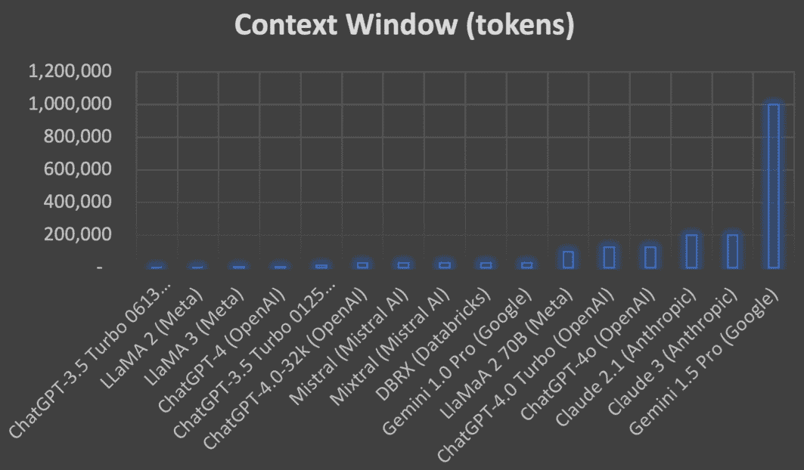
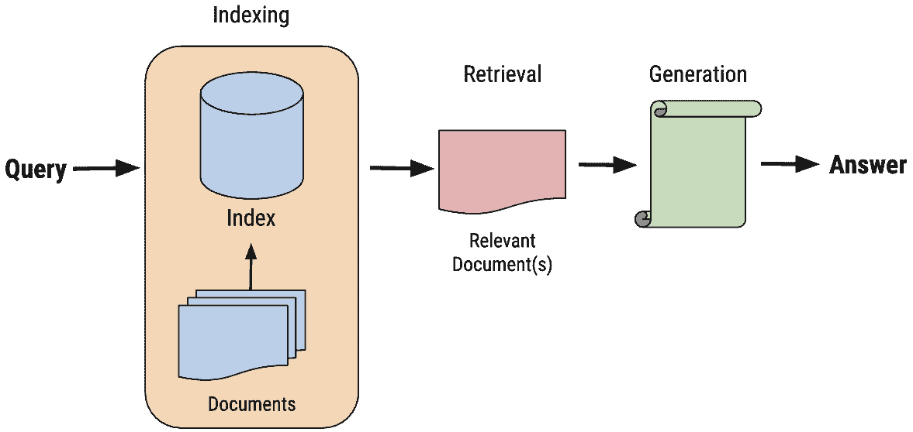

# 什么是检索增强生成（RAG）

**人工智能**（**AI**）领域正在迅速发展。**人工智能**（**AI****）的核心是**生成式 AI**。生成式 AI 的核心是**检索增强生成**（**RAG****）。RAG 正在成为生成式 AI 工具箱中的一个重要补充，利用大型语言模型（**LLMs****）的智能和文本生成能力，并将它们与公司的内部数据相结合。RAG 正在成为增强组织运营效率的重要方法。 这本书重点介绍了 RAG 的多个方面，探讨了其在增强 LLMs 能力以及利用内部企业数据获得战略优势中的作用。 

随着本书的深入，我们将概述 RAG 在企业中的潜力，建议如何使其使 AI 应用更加响应和智能，与您的组织目标保持一致。RAG 非常适合成为定制化、高效和有洞察力的 AI 解决方案的关键促进者，弥合生成式 AI 的潜力与您的具体业务需求之间的差距。我们对 RAG 的探索将鼓励您挖掘企业数据的全部潜力，为您进入**AI 驱动创新时代**铺平道路。

本章将涵盖以下主题：

+   RAG 的基本原理以及它如何将大型语言模型（LLMs）与公司的私有数据相结合

+   RAG 的关键优势，如提高准确性、定制化和灵活性

+   RAG 的挑战和限制，包括数据质量和计算复杂性

+   重要的 RAG 词汇术语，重点介绍向量和嵌入

+   RAG 在各个行业中的应用实例

+   RAG 与传统的生成式 AI 和模型微调有何不同

+   从用户和技术角度出发，RAG 系统的整体架构和阶段

到本章结束时，你将对 RAG 的核心概念有坚实的基础，并了解它为组织提供的巨大潜力，以便他们能够从数据中提取更多价值并赋予他们的 LLMs 更多能力。让我们开始吧！

# 理解 RAG - 基本原理和原则

现代的大型语言模型（LLM）令人印象深刻，但它们从未见过贵公司的私有数据（希望如此！）。 这意味着 LLM 帮助贵公司充分利用其数据的能力非常有限。 这一个非常大的障碍催生了 RAG 的概念，即您正在使用 LLM 的强大功能和能力，但将其与公司内部数据存储库中包含的知识和数据相结合。 这是使用 RAG 的主要动机：使新数据对 LLM 可用，并显著增加您可以从这些数据中提取的价值。 这使您可以从这些数据中提取的价值。

除了内部数据之外，RAG 在 LLM 未在数据上训练的情况下也很有用，即使这些数据是公开的，例如关于对公司战略至关重要的主题的最新研究论文或文章。 在这两种情况下，我们谈论的是在 LLM 训练期间不存在的数据。 您可以让最新的 LLM 在最多的标记上训练，但如果这些数据在训练期间不存在，那么 LLM 在帮助您达到完全生产力方面将处于不利地位。 您可以让最新的 LLM 在最多的标记上训练，但如果这些数据在训练期间不存在，那么 LLM 在帮助您达到完全生产力方面将处于不利地位。 您达到完全生产力。

最终，这突出了这样一个事实，对于大多数组织来说，将新数据连接到 LLM 是一个基本需求。 RAG 是实现这一目标的最受欢迎的方法。 本书的重点是向您展示如何使用您的数据设置 RAG 应用程序，以及如何在各种情况下最大限度地发挥其作用。 我们旨在让您深入了解 RAG 及其在满足公司私有或特定数据需求时利用 LLM 的重要性。

现在您已经了解了实施 RAG 背后的基本动机，让我们回顾一下使用 RAG 的一些优势。 RAG 的优势

## RAG 的优势

使用 RAG 的一些潜在优势包括提高准确性和相关性、定制、灵活性和扩展模型知识，使其超越训练数据。 让我们更深入地了解一下：

+   **提高准确性和相关性**：RAG 可以显著提高 LLM 生成的响应的准确性和相关性。 RAG 从数据库或数据集中获取并整合特定信息，通常是在实时进行的，并确保输出基于模型预先存在的知识和您直接提供的最新和最相关数据。 您直接提供的最新和最相关数据。

+   **定制化**：RAG 允许您根据特定的领域或用例定制和调整模型的知识。 通过将 RAG 指向与您的应用程序直接相关的数据库或数据集，您可以定制模型的输出，使其与您特定需求最相关的信息和风格紧密一致。 这种定制化使得模型能够提供更精准和有用的响应。

+   **灵活性**：RAG 在模型可以访问的数据源方面提供了灵活性。 您可以将 RAG 应用于各种结构化和非结构化数据，包括数据库、网页、文档等。 这种灵活性使您能够利用多样化的信息来源，并以新颖的方式将它们结合起来，以增强模型的能力。 此外，您可以根据需要更新或更换数据源，使模型能够适应不断变化的信息环境。

+   **扩展模型知识超越训练数据**：LLM 受限于其训练数据的范围。 RAG 通过使模型能够访问和利用其初始训练集未包含的信息来克服这一限制。 这实际上扩展了模型的知识库，而无需重新训练，使 LLM 更加灵活，并能适应新的领域或快速发展的主题。

+   **消除幻觉**：LLM（大型语言模型）是 RAG 系统中的关键组件。 LLM 有可能提供错误信息，也称为幻觉。 这些幻觉可以以多种方式表现出来，如虚构的事实、错误的事实，甚至无意义的措辞。 通常，幻觉的措辞可能非常令人信服，导致难以识别。 一个设计良好的 RAG 应用程序可以比直接使用 LLM 更容易地消除幻觉。

至此，我们已经介绍了在您的组织中实施 RAG 的关键优势。 接下来，让我们讨论一些您可能面临的挑战。

## RAG 的挑战

使用 RAG（检索增强生成）也存在一些挑战，包括对内部数据质量的依赖、数据操作和清洗的需求、计算开销、更复杂的集成以及信息过载的潜在风险。 让我们回顾这些挑战，并更好地理解它们如何影响 RAG 管道以及可以采取哪些措施来应对：

+   **对数据质量的依赖**：当谈论数据如何影响 AI 模型时，数据科学领域的说法是 *垃圾进，垃圾出。* 这意味着如果你给模型提供糟糕的数据，它将给出糟糕的结果。 RAG 也不例外。 RAG 的有效性直接与其检索到的数据质量相关。 如果底层数据库或数据集包含过时、有偏见或不准确的信息，RAG 生成的输出可能会出现同样的问题。 相同的问题。

+   **数据操作和清洗的必要性**：公司深处的数据往往具有很高的价值，但它通常并不处于良好、易于访问的状态。 例如，基于 PDF 的客户声明数据需要大量的处理才能被放入一个对 RAG 管道有用的格式。 RAG 管道。

+   **计算开销**：RAG 管道将一系列新的计算步骤引入到响应生成过程中，包括数据检索、处理和集成。 LLMs（大型语言模型）每天都在变快，但即使是最快的响应也可能超过一秒，有些可能需要几秒钟。 响应。 如果你将这一点与其他数据处理步骤结合起来，以及可能的多个 LLM 调用，结果可能是接收响应所需时间的显著增加。 这所有的一切都导致了计算开销的增加，影响了整个系统的效率和可扩展性。 与其他任何 IT 项目一样，组织必须平衡这些额外流程带来的增强准确性和定制化的好处与资源需求和潜在延迟。 这些额外流程。

+   **数据存储爆炸；集成和维护的复杂性**：传统上，您的数据存储在数据源中，通过各种方式查询以供您的内部和外部系统使用。 但使用 RAG，您的数据以多种形式和位置存在，例如向量数据库中的向量，代表相同的数据，但格式不同。 再加上将这些各种数据源连接到 LLM 和相关技术机制（如向量搜索）的复杂性，您将面临显著的增加复杂性。 这种增加的复杂性可能会非常消耗资源。 随着时间的推移维护这种集成，尤其是在数据源演变或扩展时，还会增加更多的复杂性和成本。 组织需要投资于技术专长和基础设施，以有效地利用 RAG 功能，同时考虑到这些系统带来的复杂性的快速增加 及其带来的挑战。

+   **信息过载的潜在风险**：基于 RAG 的系统可能会引入过多的信息。 实施机制来解决这个问题与处理找不到足够相关信息的情况一样重要。 确定要包含在最终输出中的检索信息的关联性和重要性需要复杂的过滤和排序机制。 没有这些机制，生成内容的质量可能会因过多的不必要或边际相关的细节而受损。

+   **幻觉**：虽然我们将消除幻觉列为使用 RAG 的优势之一，但如果处理不当，幻觉确实是对 RAG 管道的最大挑战之一。 一个设计良好的 RAG 应用必须采取措施来 识别和消除幻觉，并在向最终用户提供最终输出文本之前进行重大测试。

+   **RAG 组件中的高度复杂性**：典型的 RAG 应用往往具有高度复杂性，需要许多组件进行优化，以确保整体应用正常工作。 这些组件可以以多种方式相互交互，通常比您开始的基本 RAG 管道有更多的步骤。 管道中的每个组件都需要大量的试验和测试，包括您的提示设计和工程、您使用的 LLM 以及您如何使用它们、检索的各种算法及其参数、您用于访问 RAG 应用的界面，以及您在开发过程中需要添加的众多其他方面。

在本节中，我们探讨了在组织中实施 RAG 的关键优势，包括提高准确性和相关性、定制化、灵活性和将模型的知识扩展到其初始训练数据之外的能力。 我们还讨论了在部署 RAG 时可能会遇到的挑战，例如对数据质量的依赖、数据操作和清洗的需求、计算开销的增加、集成和维护的复杂性以及信息过载的可能性。 理解这些优势和挑战为深入探讨 RAG 系统中使用的核心概念和词汇奠定了基础。

为了理解我们将要介绍的方法，你需要对讨论这些方法所使用的词汇有很好的理解。 在接下来的部分，我们将熟悉一些基础概念，以便你更好地理解构建有效的 RAG 管道所涉及的各个组件和技术。

# RAG 词汇

现在是 审查一些有助于你熟悉 RAG 中各种概念的词汇的好时机。 在接下来的子节中，我们将熟悉一些这些词汇，包括 LLM、提示概念、推理、上下文窗口、微调方法、向量数据库和向量/嵌入。 这不是一个详尽的列表，但理解这些核心概念应该有助于你更有效地理解我们将教授你关于 RAG 的所有其他内容。

## LLM

本书的大部分内容 将涉及 LLM。 LLM 是专注于生成文本的生成式 AI 技术。 我们将通过专注于大多数 RAG 管道使用的模型类型，即 LLM，来简化问题。 然而，我们想澄清的是，虽然我们将主要关注 LLM，但 RAG 也可以应用于其他类型的生成模型，例如图像、音频和视频的生成模型。 我们将在 *第十四章*中关注这些其他类型的模型以及它们在 RAG 中的应用。

一些流行的 LLM 示例包括 OpenAI 的 ChatGPT 模型、Meta 的 Llama 模型、Google 的 Gemini 模型以及 Anthropic 的 Claude 模型。

## 提示、提示设计、提示工程

这些术语有时可以互换使用，但从技术上讲，虽然它们都与提示有关，但它们确实有不同的含义： 提示、提示设计、提示工程

+   **提示** 是 发送 查询或 *提示 到 一个 LLM。

+   **提示设计** 指的是 您实施的策略，用于 *设计 您将发送到 LLM 的 提示。 许多不同的提示设计策略在不同的场景中有效。 我们将在 *第十三章中回顾许多这些策略。

+   **提示工程** 更侧重于 围绕您用于改进 LLM 输出的提示的技术方面。 例如，您可以将一个复杂的查询拆分为两个或三个不同的 LLM 交互， *工程化 它以实现更优的结果。 我们还将回顾 *第十三章中的提示工程。

## LangChain 和 LlamaIndex

本书 将专注于使用 LangChain 作为构建我们的 RAG 管道的框架。 LangChain 是一个开源框架 ，不仅支持 RAG，还支持任何希望在使用管道方法时使用 LLM 的开发。 拥有超过 1500 万次的月下载量，LangChain 是最受欢迎的生成式 AI 开发框架。 它特别支持 RAG，提供了一套模块化和灵活的工具，使得 RAG 开发比不使用 框架 的开发效率显著提高。

虽然 LangChain 目前是开发 RAG 管道最流行的框架，但 LlamaIndex 是 LangChain 的一个领先替代品，在总体上具有相似的功能。 LlamaIndex 以其对搜索和检索任务的关注而闻名，如果您需要高级搜索或需要处理 大量数据集。

许多其他选项专注于各种利基市场。 一旦您熟悉了构建 RAG 管道，请务必查看一些其他选项，看看是否有适合您特定 项目 的框架。

## 推理

我们将不时使用 术语 **推理** 。 通常，这指的是 LLM 根据给定的输入使用预训练的语言模型生成输出或预测的过程。 例如，当你向 ChatGPT 提问时，它提供响应所采取的步骤被称为推理。

## 上下文窗口

在 LLM 的上下文中，上下文窗口是指模型在一次遍历中可以处理的标记（单词、子词或字符）的最大数量。 它决定了模型在做出预测或 *看到 * 或 *关注 * 时可以一次性处理或 生成响应的文本量。

上下文窗口大小是模型架构的关键参数，通常在模型训练期间固定。 它直接关系到模型的输入大小，因为它为一次可以输入模型中的标记数量设定了一个上限。

例如，如果一个模型的上下文窗口大小为 4,096 个标记，这意味着该模型可以处理和生成最多 4,096 个标记的序列。 在处理较长的文本，如文档或对话时，输入需要被分成适合上下文窗口的小段。 这通常使用滑动窗口 或截断等技术来完成。

上下文窗口的大小对模型理解并维持长距离依赖和上下文的能力有影响。 具有更大上下文窗口的模型在生成响应时可以捕获和利用更多的上下文信息，这可能导致更连贯和上下文相关的输出。 然而，增加上下文窗口大小也会增加训练和运行 模型所需的计算资源。

在 RAG 的上下文中，上下文窗口大小至关重要，因为它决定了检索到的文档中的多少信息可以被模型在生成最终响应时有效地利用。 语言模型在最近的发展中导致了具有显著更大的上下文窗口的模型的发展，这使得它们能够处理和保留更多来自检索源的信息。 见 *表 1.1* 以查看许多流行的 LLM 的上下文窗口，包括封闭和 开源的：

| **LLM** | **上下文** **窗口（标记）** |
| --- | --- |
| ChatGPT-3.5 Turbo 0613 (OpenAI) | 4,096 |
| Llama 2 (Meta) | 4,096 |
| Llama 3 (Meta) | 8,000 |
| ChatGPT-4 (OpenAI) | 8,192 |
| ChatGPT-3.5 Turbo 0125 (OpenAI) | 16,385 |
| ChatGPT-4.0-32k (OpenAI) | 32,000 |
| Mistral (Mistral AI) | 32,000 |
| Mixtral (Mistral AI) | 32,000 |
| DBRX (Databricks) | 32,000 |
| Gemini 1.0 Pro (Google) | 32,000 |
| ChatGPT-4.0 Turbo (OpenAI) | 128,000 |
| ChatGPT-4o (OpenAI) | 128,000 |
| Claude 2.1 (Anthropic) | 200,000 |
| Claude 3 (Anthropic) | 200,000 |
| Gemini 1.5 Pro (Google) | 1,000,000 |

表 1.1 – LLMs 的不同上下文窗口

*图 1**.1*，基于 *表 1.1*，显示 Gemini 1.5 Pro 远大于其他模型。



图 1.1 – LLMs 的不同上下文窗口

请注意 *图 1**.1* 显示了从右到左普遍老龄化的模型，这意味着较老的模型倾向于具有较小的上下文窗口，而最新的模型具有较大的上下文窗口。 这种趋势很可能会继续，随着时间的推移，典型的上下文窗口会越来越大。

## 微调 – 全模型微调（FMFT）和参数高效微调（PEFT）

FMFT 是 您将基础模型进一步训练以获得新能力的地方。 您可以简单地为其提供特定领域的知识，或者您可以给它一项技能，例如成为一个会话聊天机器人。 FMFT 更新模型中的所有参数和偏差。

PEFT，另一方面，是一种微调类型，在微调模型时您只关注参数或偏差的特定部分，但与通用微调有相似的目标。 该领域的最新研究显示，您可以用更少的成本、时间和数据实现与 FMFT 相似的结果。 和数据。

虽然这本书不专注于微调，但尝试使用您自己的数据微调的模型来赋予它更多来自您领域的知识，或者给它更多来自您领域的 *声音* ，是一个非常有效的策略。 例如，如果您在科学领域使用它，您可以训练它说话更像科学家而不是通用基础模型。 或者，如果您在法律领域开发，您可能希望它听起来更像 律师。

微调还有助于大型语言模型更好地理解贵公司的数据，使其在 RAG 过程中生成有效响应的能力更强。 例如，如果您是一家科技公司，您可能会微调一个包含科学信息的模型，并将其用于总结您的研究的 RAG 应用。 这可能提高了您的 RAG 应用输出（您的研究总结）的质量，因为您的微调模型对您的数据理解得更好，并能提供更有效的总结。 总结。

## 向量存储还是向量数据库？

两者都是！ 所有 向量数据库 都是向量存储，但并非所有向量 存储都是向量数据库。 好的，当您拿出粉笔在黑板上画 Venn 图时，我会继续解释 这个陈述。

有存储向量的方法，并不一定是完整的数据库。 它们只是向量的存储设备。 因此，为了 涵盖所有可能的向量存储方式，LangChain 将它们都称为 **向量存储**。让我们做 同样的事情！ 只需知道，并非所有 LangChain 连接的 *向量存储* 都被官方视为向量数据库，但一般来说，大多数都是，许多人将它们都称为向量数据库，即使它们在功能上并不是完整的数据库。 好了——很高兴我们澄清了这一点！

## 向量，向量，向量！

向量是 你数据的数学表示。 当具体谈到**自然语言处理** (**NLP****)和**LLMs**时，它们通常被称为嵌入。 向量是理解最重要的概念之一，RAG 管道的许多部分都利用了向量。

我们刚刚介绍了许多关键词汇，这些词汇对于理解本书的其余部分非常重要。 这些概念中的许多将在未来的章节中进一步阐述。 在下一节中，我们将进一步深入讨论向量。 而且，我们将用 *第七章 和 *第八章 来介绍向量以及它们如何用于查找**相似内容**。

# 向量

可以认为 理解向量和它们在 RAG 中的所有应用方式是这本书最重要的部分。 如前所述，向量只是你外部数据的数学表示，它们通常被称为嵌入。 这些表示以算法可以处理的形式捕获语义信息，从而促进诸如相似度搜索等任务，这是 RAG 过程中的关键步骤。

向量的维度通常是特定的，这取决于它们表示了多少个数字。 例如，这是一个 四维向量：

```py
 [0.123, 0.321, 0.312, 0.231]
```

如果你不知道 我们正在谈论向量，并且你在 Python 代码中看到了这个，你可能会认出这是一个包含四个浮点数的列表，而且你并不离谱。 然而，当你在 Python 中使用向量时，你希望将它们识别为 NumPy 数组，而不是列表。 NumPy 数组通常更受机器学习友好，因为它们被优化得可以比 Python 列表更快、更有效地处理，并且在机器学习包（如 SciPy、pandas、scikit-learn、TensorFlow、Keras、Pytorch 等）中被更广泛地认可为嵌入的默认表示。 NumPy 还允许你直接在 NumPy 数组上执行向量数学，例如执行元素级操作，而无需使用循环和其他你可能需要使用不同类型序列的方法。

在处理向量进行向量化的工作时，通常会有数百或数千个维度，这指的是向量中存在的浮点数数量。 更高的维度可以捕捉更详细的语义信息，这对于在 RAG 应用中准确匹配查询输入与相关文档或数据至关重要。

在第7 章](B22475_07.xhtml#_idTextAnchor122)中，我们将介绍向量和向量数据库在 RAG 实现中的关键作用。 然后，在第8 章](B22475_08.xhtml#_idTextAnchor152)中，我们将更深入地探讨相似性搜索的概念，它利用向量以更快、更高效的方式搜索。 这些是帮助你更深入理解如何更好地实现 RAG 管道的关键概念。

理解向量可以是一个关键的基础概念，以了解如何实现 RAG，但在企业中 RAG 是如何在实际应用中被使用的呢？ 我们将在下一节讨论 RAG 的这些实际 AI 应用。

# 在 AI 应用中实现 RAG

RAG 正在迅速成为企业界生成式 AI 平台的基础。 RAG 结合了检索内部或 **新** 数据与生成式语言模型的力量，以增强生成文本的质量和相关性。 这项技术对于各个行业的公司来说特别有用，可以帮助它们改进产品、服务和运营效率。 以下是一些 RAG 可以 被使用的例子：

+   **客户支持和聊天机器人**：这些可以在没有 RAG 的情况下存在，但当与 RAG 集成时，它可以连接那些聊天机器人与过去的客户互动、常见问题解答、支持文档以及与该客户相关的任何其他内容。

+   **技术支持**：通过更好地访问客户历史和相关信息，增强 RAG 的聊天机器人可以显著提高当前技术支持聊天机器人的性能。

+   **自动报告**：RAG 可以帮助创建初始草案或总结现有的文章、研究论文和其他类型的非结构化数据，使其更易于消化。

+   **电子商务支持**：对于电子商务公司，RAG 可以帮助生成动态的产品描述和用户内容，以及做出更好的 产品推荐。

+   **利用知识库**：RAG 通过生成摘要、提供直接答案以及对法律、合规、研究、医疗、学术界、专利和技术文档等各个领域的相关信息进行检索，从而提高了内部和通用知识库的可搜索性和实用性。 技术文档。

+   **创新侦察**：这就像在搜索通用知识库，但重点是创新。 利用这一点，公司可以使用 RAG 扫描和总结来自优质来源的信息，以识别与公司专业化相关的趋势和潜在的创新领域。 公司。

+   **培训和教育工作**：教育组织和企业培训计划可以使用 RAG 根据学习者的具体需求和知识水平生成或定制学习材料。 利用 RAG，可以将组织内部的知识以非常定制化的方式融入教育课程中，针对个人或角色。

这些只是组织目前使用 RAG 来改进其运营的一些方法。 我们将在 *第三章*中更深入地探讨这些领域，帮助你了解如何在公司的多个地方实施所有这些变革性举措。 公司。

你可能想知道，“*如果我使用 LLM 如 ChatGPT 来回答公司的问题，这意味着我的公司已经使用* *RAG 了吗？*”

答案是“*不。*”

如果你只是登录 ChatGPT 并提问，这并不等同于实施 RAG。 ChatGPT 和 RAG 都是生成式 AI 的形式，它们有时会一起使用，但它们是两个不同的概念。 在下一节中，我们将讨论生成式 AI 与 RAG 之间的区别。 和 RAG。

# 比较 RAG 与传统生成式 AI

传统的生成式 AI 已经 证明 是公司的一次革命性变革，帮助员工达到新的生产力水平。 例如 ChatGPT 这样的 LLM 正在帮助用户使用快速增长的列表中的应用程序，包括撰写商业计划、编写和改进代码、撰写营销文案，甚至为特定饮食提供更健康的食谱。 最终，用户所做的许多事情都变得 更快。

然而，传统的生成式 AI 不知道它不知道的东西。 这包括你公司的大部分内部数据。 你能想象，如果将之前提到的所有好处结合起来，再加上你公司内部的所有数据——关于你公司所做的一切，关于你的客户及其所有互动，或者关于所有产品和服务，再加上对特定客户需求的认识，你能做什么吗？ 你不必想象——这就是 RAG 所做的！

在 RAG 之前，你看到的大多数将客户或员工与公司数据资源连接的服务，与它们能够访问 *所有* 公司数据相比，只是触及了可能性的皮毛。 随着 RAG 和通用生成式 AI 的出现，企业正站在一个真正的、 真正重大的转折点上。

你可能将 RAG 与调整模型的概念混淆。 让我们讨论一下这些方法之间的区别。

# 比较 RAG 与模型微调

LLM 可以通过两种方式来 适应你的 数据：

+   **微调**：通过微调，你根据新的训练数据调整定义模型智能的权重和/或偏差。 这直接影响模型，永久地改变它将如何与 新输入交互。

+   **输入/提示**：这是你使用模型的地方，使用提示/输入来引入 LLM 可以 *使用* 的新知识。

为什么不在所有情况下都使用微调呢？ 一旦你引入了新的知识，LLM 总是会保留它！ 这也是模型是如何被创建的——通过用数据训练，对吧？ 在理论上听起来是正确的，但在实践中，微调在教授模型专门任务（例如教授模型如何以某种方式交谈）方面更为可靠，而在 事实回忆方面则不太可靠。

原因很复杂，但总的来说，模型对事实的了解就像人类的长时记忆。 如果你记住了演讲或书籍中的长篇大论，然后几个月后尝试回忆，你可能会仍然理解信息的上下文，但你可能会忘记具体的细节。 另一方面，通过模型输入添加知识就像我们的短期记忆，其中事实、细节，甚至措辞的顺序都非常新鲜且可供回忆。 在需要成功回忆事实的情况下，这种后一种情况更适合。 鉴于微调可能更加昂贵，这使得考虑 RAG 变得尤为重要。

然而，也存在权衡。 虽然通常有方法将所有数据输入模型进行微调，但输入受限于模型的上下文窗口。 这是一个正在积极解决的问题。 例如，ChatGPT 3.5 的早期版本有一个 4,096 个标记的上下文窗口，相当于大约五页文本。 当 ChatGPT 4 发布时，他们将其上下文窗口扩展到 8,192 个标记（10 页），还有一个 Chat 4-32k 版本，其上下文窗口为 32,768 个标记（40 页）。 这个问题非常重要，以至于他们将其上下文窗口大小包含在模型名称中。 这是上下文窗口重要性的一个强烈指标！

有趣的事实！

关于最新的 Gemini 1.5 型号呢？它拥有 100 万个标记的上下文窗口，或者说超过 1,000 页！

随着上下文窗口的扩大，另一个问题也随之产生。 早期具有扩展上下文窗口的模型在测试中显示，细节丢失很多，尤其是在 *文本的中间* 部分。 这个问题也在被解决。 具有 100 万个标记上下文窗口的 Gemini 1.5 模型在所谓的*大海捞针* 测试中表现良好，这些测试用于测试*记住 *整个文本中它所能接受的输入的所有细节。 不幸的是，该模型在*多针大海捞针* 测试中的表现并不理想。 随着这些上下文窗口变得更大，预计在这个领域将会有更多的努力。 如果你需要一次性处理大量文本，请记住这一点。

注意

需要注意的是，标记数与词数不同，因为标记包括标点符号、符号、数字和其他文本表示。 复合词，例如 *ice cream* 在标记方面的处理取决于标记化方案，并且可能在不同的大型语言模型（LLM）中有所不同。 但大多数知名的大型语言模型（如 ChatGPT 和 Gemini）会将 *ice cream* 视为两个标记。 在自然语言处理（NLP）的某些情况下，你可能认为它应该是一个标记，基于标记应该代表一个有用的语义处理单元的概念，但对于这些模型来说并非如此。 这些模型。

微调也可能相当昂贵，这取决于你拥有的环境和资源。 近年来，由于代表性的微调、LoRA 相关技术和量化等新技术，微调的成本大幅下降。 但在许多 RAG 开发工作中，微调被视为对已经昂贵的 RAG 努力的额外成本，因此它被视为对努力的更昂贵补充。 这些努力。

最终，在决定选择 RAG 还是微调时，请考虑您的具体用例和需求。 RAG 通常在检索 LLM 训练数据中不存在或私有的事实信息方面更优越。 它允许您在不修改模型权重的情况下动态集成外部知识。 另一方面，微调更适合教授模型专业任务或将其适应特定领域。 在微调特定数据集时，请记住上下文窗口大小的限制和过拟合的潜在可能性。

既然我们已经定义了什么是 RAG，尤其是与其他使用生成式 AI 的方法相比，让我们回顾一下 RAG 系统的通用架构。

# RAG 系统的架构

以下是从 用户的角度看 RAG 过程的 各个阶段：

1.  用户输入 一个查询/问题。

1.  应用程序会稍作思考，然后检查它所能访问的数据，以便确定什么是最相关的。

1.  应用程序提供响应，专注于回答用户的问题，但使用通过 RAG 管道 提供给它 的数据。

从技术角度来看，这 捕捉了您将编码的两个阶段： **检索** 和 **生成** 阶段。 但是 还有一个其他阶段，被称为 索引**，这可以在用户输入查询之前执行，并且通常是这样做的。 通过索引，您将辅助数据转换为向量，将它们存储在向量数据库中，并可能优化搜索功能，以便检索步骤尽可能快且有效。 尽可能快且有效。

一旦用户将他们的查询传递到系统中，以下 步骤就会发生：

1.  用户查询 被向量化。

1.  将向量查询传递到向量搜索中，以检索表示您 外部数据 的向量数据库中最相关的数据。

1.  向量搜索返回最相关的结果和引用这些向量所代表原始内容的唯一键。

1.  唯一的键用于提取与这些向量相关的原始数据，通常是在 多个文档的批次中。

1.  原始数据可能被过滤或后处理，但通常会传递给基于您期望 RAG 过程 执行的操作的 LLM。

1.  LLM 被提供了一个提示，通常会说类似“`您是一个问答任务的助手。 使用以下问题（用户查询）并使用此有用的信息（相似性搜索中检索到的数据）来回答它。 如果您根据提供的信息不知道答案，只需说您` `不知道。`”

1.  LLM 处理这些提示并根据您提供的 外部数据 提供响应。

根据 RAG 系统的范围，这些步骤可以实时完成，或者像 索引 这样的步骤可以在查询之前完成，以便在需要时可以立即搜索。 需要时可以立即搜索。

如前所述，我们可以将这些方面分解为三个主要阶段（见 *图 1**.2*）：

+   索引

+   检索

+   生成



图 1.2 – RAG 的三个阶段

正如之前所描述的 ，这三个阶段构成了通用 RAG 系统的整体用户模式和设计。 在 *第四章*中，我们将更深入地探讨这些阶段。 这将帮助您将这一编码范式中的概念与它们的 实际实现联系起来。

# 总结

在本章中，我们探讨了 RAG 及其通过整合组织内部数据来增强大型语言模型（LLM）能力的能力。 我们学习了 RAG 如何结合 LLM 的力量和公司的私有数据，使模型能够利用其最初训练时未使用的信息，从而使 LLM 的输出对特定组织更加相关和有价值。 我们还讨论了 RAG 的优势，例如提高准确性和相关性、针对公司领域的定制化、数据源使用的灵活性以及将模型的知识扩展到其原始训练数据之外。 此外，我们还考察了 RAG 的挑战和局限性，包括对数据质量的依赖、数据清洗的需求、增加的计算开销和复杂性，以及如果未 适当过滤，可能导致的信息过载。

在本章的中间部分，我们定义了关键词汇，并强调了理解向量的重要性。 我们探讨了 RAG 在各个行业中的应用实例，并将其与传统生成式 AI 和 模型微调进行了比较。

最后，我们从用户视角和技术角度概述了典型 RAG 管道的架构和阶段，同时涵盖了 RAG 管道的索引、检索和生成阶段。 在下一章中，我们将通过实际的 编码示例来逐步讲解这些阶段。
