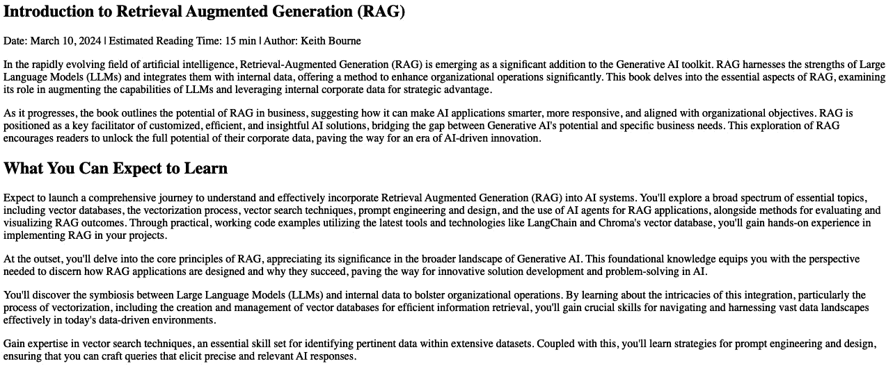

# 代码实验室 – 整个 RAG 管道

本代码实验室为本书中其余代码奠定了基础。 我们将花费整个章节的时间，为您提供整个 **检索增强生成** (**RAG****)管道。然后，随着我们逐步阅读本书，我们将查看代码的不同部分，并在过程中添加增强功能，以便您全面了解代码如何演变以解决更多和更复杂的难题。 

我们将花费这一章的时间，逐一介绍 RAG 管道的每个组件，包括以下方面： 

+   无界面

+   在 OpenAI 上设置一个大型语言模型（LLM）账户 

+   安装所需的Python 包 

+   通过网络爬虫、分割文档和嵌入块来索引数据 

+   使用向量相似度搜索检索相关文档

+   通过将检索到的上下文整合到 LLM 提示中生成响应

随着我们逐步分析代码，您将通过使用 LangChain、Chroma DB 和 OpenAI 的 API 等工具，以编程方式全面理解 RAG 过程中的每一步。这将为您提供一个坚实的基础，我们将在后续章节中在此基础上构建，增强和改进代码，以解决越来越复杂的难题。 这将为您提供一个坚实的基础，我们将在后续章节中在此基础上构建，增强和改进代码，以解决越来越复杂的难题。 

在后续章节中，我们将探讨可以帮助改进和定制管道以适应不同用例的技术，并克服在构建由 RAG 驱动的应用程序时出现的常见挑战。 让我们深入其中，开始构建！

# 技术要求

本章的代码可在以下位置找到： [`github.com/PacktPublishing/Unlocking-Data-with-Generative-AI-and-RAG/tree/main/Chapter_02`](https://github.com/PacktPublishing/Unlocking-Data-with-Generative-AI-and-RAG/tree/main/Chapter_02) ](https://github.com/PacktPublishing/Unlocking-Data-with-Generative-AI-and-RAG/tree/main/Chapter_02)

您需要在已配置为运行 Jupyter 笔记本的环境下运行本章的代码。 熟悉 Jupyter 笔记本是使用本书的先决条件，而且很难在简短的文字中涵盖。 设置笔记本环境有众多方法。 有在线版本，可以下载的版本，大学为学生提供的笔记本环境，以及您可以使用的不同界面。 如果您在公司进行这项操作，他们可能有一个您需要熟悉的环境。 这些选项的设置指令各不相同，而且这些指令经常变化。 如果您需要更新关于此类环境的知识，可以从 Jupyter 网站（[https://docs.jupyter.org/en/latest/](https://docs.jupyter.org/en/latest/)）开始。 从这里开始，然后向您最喜欢的语言模型请求更多帮助以设置您的环境。 。

我该使用什么？ 当我使用我的 Chromebook，通常在旅行时，我会在云环境中设置一个笔记本。 我更喜欢 Google Colab 或他们的 Colab Enterprise 笔记本，您可以在 Google Cloud Platform 的 Vertex AI 部分找到。 但这些环境需要付费，如果您活跃使用，通常每月超过 20 美元。 如果您的活跃程度像我一样，每月可能超过 1000 美元！

作为一个成本效益的替代方案，当我很活跃时，我会在我的 Mac 上使用 Docker Desktop，它本地托管一个 Kubernetes 集群，并在集群中设置我的笔记本环境。 所有这些方法都有一些环境要求，这些要求经常变化。 最好做一点研究，找出最适合您情况的方法。 对于基于 Windows 的计算机也有类似的解决方案。

最终，主要要求是找到一个您可以使用 Python 3 运行 Jupyter 笔记本的环境。 我们将提供的代码将指示您需要安装的其他包。

注意

所有这些代码都假设您正在 Jupyter 笔记本中工作。 您可以直接在 Python 文件（`.py`）中这样做，但您可能需要对其进行一些修改。 在笔记本中运行它允许您逐个单元格地执行，并查看每个点发生的情况，以便更好地理解整个过程。 。

# 没有界面！

在下面的编码示例中，我们不会处理接口；我们将在 *第六章*中介绍这一点。同时，我们将创建一个表示用户会输入的提示字符串变量，并将其用作完整接口输入的占位符。

# 设置大型语言模型（LLM）账户

对于 公众，OpenAI 的 ChatGPT 模型 目前是最受欢迎和最知名的 LLM。 然而，市场上还有许多其他 LLM，适用于各种用途。 您并不总是需要使用最昂贵、最强大的 LLM。 一些 LLM 专注于一个领域，例如 Meditron LLM，它是 Llama 2 的专注于医学研究的微调版本。 如果您在医学领域，您可能想使用该 LLM，因为它可能在您的领域内比大型通用 LLM 表现得更好。 通常，LLM 可以用作其他 LLM 的二次检查，因此在这些情况下您可能需要不止一个。 我强烈建议您不要只使用您已经使用过的第一个 LLM，而要寻找最适合您需求的 LLM。 但为了使本书早期内容更简单，我将讨论如何设置 OpenAI 的 ChatGPT：

1.  访问 OpenAI **API** 部分： [https://openai.com/api/](https://openai.com/api/)。

1.  如果您尚未设置账户，请现在就设置。 网页可能会经常更改，但请查找注册位置。

警告

使用 OpenAI 的 API 需要付费！ 请谨慎使用！

1.  一旦您完成注册，请访问以下文档 [https://platform.openai.com/docs/quickstart](https://platform.openai.com/docs/quickstart) 并按照说明设置您的第一个 API 密钥。

1.  在创建 API 密钥时，请给它一个容易记住的名字，并选择您想要实施的权限类型（**全部**、**受限**或 **只读**）。 如果您不知道选择哪个选项，目前最好选择**全部** 。 然而，请注意其他选项——您可能希望与其他团队成员分担各种责任，但限制某些类型的访问：

    1.  **全部**：此密钥将具有对所有 OpenAI API 的读写访问权限。

    1.  **受限**：将显示可用 API 列表，为您提供对密钥可以访问哪些 API 的细粒度控制。 您可以选择为每个 API 提供只读或写入访问权限。 请确保您至少已启用在这些演示中将使用的模型和嵌入 API。

    1.  **只读**：此选项为您提供对所有 API 的只读访问权限。

1.  复制提供的密钥。 您将很快将其添加到代码中。 在此期间，请记住，如果此密钥与他人共享，任何获得此密钥的人都可以使用它，并且您将付费。 因此，这是一个您希望视为绝密并采取适当预防措施以防止未经授权使用的密钥。

1.  OpenAI API 要求您提前购买积分才能使用 API。 购买您感到舒适的金额，并且为了更安全，请确保 **启用自动充值** 选项已关闭。 这将确保您 只花费您打算花费的金额。

有了这些，您已经设置了将作为您 RAG 管道 *大脑 的关键组件：LLM！ 接下来，我们将设置您的开发环境，以便您可以连接到 LLM。

# 安装必要的软件包

确保这些软件包已安装到您的 Python 环境中。 在笔记本的第一个单元中添加以下代码行：

```py
 %pip install langchain_community
%pip install langchain_experimental
%pip install langchain-openai
%pip install langchainhub
%pip install chromadb
%pip install langchain
%pip install beautifulsoup4
```

前面的代码使用 `pip` 包管理器安装了几个 Python 库，这是运行我提供的代码所必需的。 以下是每个库的 分解：

+   `langchain_community`：这是一个 由社区驱动的 LangChain 库的软件包，LangChain 是一个用于构建具有 LLMs 应用程序的开源框架。 它提供了一套工具和组件，用于与 LLMs 协同工作并将它们集成到 各种应用程序中。

+   `langchain_experimental`： `langchain_experimental` 库 提供了核心 LangChain 库之外的一些额外功能和工具，这些功能和工具尚未完全稳定或适用于生产，但仍可用于实验 和探索。

+   `langchain-openai`：这个 包提供了 LangChain 与 OpenAI 语言模型之间的集成。 它允许你轻松地将 OpenAI 的模型，如 ChatGPT 4 或 OpenAI 嵌入服务，集成到你的 LangChain 应用程序中。

+   `langchainhub`：这个 包提供了一组预构建的组件和模板，用于 LangChain 应用程序。 它包括各种代理、内存组件和实用函数，可用于加速基于 LangChain 的应用程序的开发。

+   `chromadb`：这是 Chroma DB 的 包名，Chroma DB 是一个高性能的嵌入/向量数据库，旨在进行高效的相似性搜索和检索。

+   `langchain`：这是 核心 LangChain 库本身。 它提供了一个框架和一系列抽象，用于构建基于 LLM 的应用程序。 LangChain 包括构建有效的 RAG 管道所需的所有组件，包括提示、内存管理、代理以及与其他各种外部工具和服务集成。

在运行前面的第一行之后，你需要重启内核才能访问你刚刚在环境中安装的所有新包。 根据你所在的环境，这可以通过多种方式完成。 通常，你会看到一个可以使用的刷新按钮，或者菜单中的 **重启内核** 选项。

如果你找不到重启内核的方法，请添加此单元格并 运行它：

```py
 import IPython
app = IPython.Application.instance(;
app.kernel.do_shutdown(True)
```

这是一个在 IPython 环境（笔记本）中执行内核重启的代码版本（注意：通常不需要它，但这里提供以备不时之需）。 你不应该需要它，但它在这里供你使用。 以防万一！

一旦安装了这些包并重启了你的内核，你就可以开始编码了！ 让我们从导入你环境中刚刚安装的许多包开始。

## 导入

现在，让我们导入所有执行 RAG 相关任务所需的 库。 我在每个导入组顶部提供了注释，以指示这些导入与 RAG 的哪个领域相关。 结合以下列表中的描述，这为你的第一个 RAG 管道提供了基本介绍：

```py
 import os
from langchain_community.document_loaders import WebBaseLoader
import bs4
import openai
from langchain_openai import ChatOpenAI, OpenAIEmbeddings
from langchain import hub
from langchain_core.output_parsers import StrOutputParser
from langchain_core.runnables import RunnablePassthrough
import chromadb
from langchain_community.vectorstores import Chroma
from langchain_experimental.text_splitter import SemanticChunker
```

让我们逐一查看 这些导入：

+   `import os`: 这 提供了一种与操作系统交互的方式。 这对于执行诸如访问环境变量和操作 文件路径等操作非常有用。

+   `from langchain_community.document_loaders import WebBaseLoader`: `WebBaseLoader` 类是一个文档加载器，可以获取并加载网页 作为文档。

+   `import bs4`: `bs4` 模块，代表 **Beautiful Soup 4**，是一个流行的网络抓取和解析 HTML 或 XML 文档的库。 由于我们将处理网页，这为我们提供了一个简单的方法来分别提取标题、内容和 头部信息。

+   `import openai`: 这提供了与 OpenAI 语言模型和 API 交互的接口。 它允许我们使用 OpenAI 的模型与 LangChain 直接交互。

+   `from langchain_openai import ChatOpenAI, OpenAIEmbeddings`: 这导入了 `ChatOpenAI` (用于 LLM) 和 `OpenAIEmbeddings` (用于嵌入)，它们是使用 OpenAI 模型并直接与 LangChain 工作的特定语言模型和嵌入的实现。

+   `from langchain import hub`: `hub` 组件提供了访问各种预构建组件和工具的途径，用于与 语言模型一起工作。

+   `from langchain_core.output_parsers import StrOutputParser`: 此组件解析语言模型生成的输出并提取相关信息。 在这种情况下，它假定语言模型的输出是一个字符串，并返回 它本身。

+   `from langchain_core.runnables import RunnablePassthrough`: 此组件将问题或查询直接传递，不进行任何修改。 它允许将问题直接用于链的后续步骤。

+   `Import chromadb`: 如前所述， `chromadb` 导入 Chroma DB 向量存储库，这是一个为高效相似性搜索和检索而设计的高性能嵌入/向量数据库。

+   `from langchain_community.vectorstores import Chroma`: 这提供了使用 LangChain 与 Chroma 向量数据库交互的接口。 Chroma 是一个高性能的嵌入/向量数据库，专为高效的相似性搜索和检索而设计。

+   `from langchain_experimental.text_splitter import SemanticChunker`：文本分割器通常是一个函数，我们使用它根据指定的块大小和重叠来将文本分割成小块。 这个分割器被称为 `SemanticChunker`，是 Langchain_experimental 库提供的一个实验性文本分割工具。 SemanticChunker 的主要目的是将长文本分解成更易于管理的片段，同时保留每个片段的 语义连贯性和上下文。

这些导入提供了设置您的 RAG 管道所需的 Python 基本包。 您的下一步将是将您的环境连接到 OpenAI 的 API。

## OpenAI 连接

以下代码行是一个非常 简单的示例，展示了您的 API 密钥如何被系统接收。 然而，这不是使用 API 密钥的安全方式。 有许多更安全的方式来完成这项任务。 如果您有偏好，现在就实施它，否则，我们将在 *第五章**中介绍一种流行的更安全的方法。*

您需要将 `sk-###################` 替换为您实际的 OpenAI API 密钥：

```py
 os.environ['OPENAI_API_KEY'] = 'sk-###################'
openai.api_key = os.environ['OPENAI_API_KEY']
```

重要

这只是一个简单的示例；请使用安全的方法来隐藏您的 API 密钥！

您可能已经猜到了，这个 OpenAI API 密钥将被用来连接到 ChatGPT LLM。 但 ChatGPT 并不是我们将从 OpenAI 使用的唯一服务。 这个 API 密钥也用于访问 OpenAI 嵌入服务。 在下一节中，我们将专注于 RAG 过程的索引阶段编码，我们将利用 OpenAI 嵌入服务将您的内容转换为向量嵌入，这是 RAG 管道的关键方面。

# 索引

下几个步骤代表的是索引 阶段，在这个阶段我们获取目标数据，对其进行预处理，并将其矢量化。 这些 步骤通常是在 离线 完成的，这意味着它们是为了 为后续的应用使用做准备。 但在某些情况下，实时完成所有这些步骤可能是有意义的，例如在数据变化迅速的环境中，所使用的数据相对较小。 在这个特定的例子中，步骤如下： 。

1.  网页加载 和抓取。

1.  将数据分割成 Chroma DB向量化算法 可消化的块。

1.  嵌入和索引 这些块。

1.  将这些块和嵌入添加到 Chroma DB向量存储。 。

让我们从第一步开始：网页加载和抓取。 。

## 网页加载和抓取

首先，我们需要拉取 我们的数据。 这当然可以是任何东西，但我们必须 从某个地方开始！

对于我们的例子，我提供了一个基于 LangChain 提供的某些内容的网页示例。 我采用了 LangChain 在 第一章中提供的原始结构。 在 [https://lilianweng.github.io/posts/2023-06-23-agent/](https://lilianweng.github.io/posts/2023-06-23-agent/)。

如果你在阅读时该网页仍然可用，你也可以尝试那个网页，但务必将你用于查询内容的提问改为更适合该页面上内容的提问。 如果你更改网页，你还需要重新启动你的内核；否则，如果你重新运行加载器，它将包含两个网页的内容。 这可能正是你想要的，但我只是让你知道！ 。

我还鼓励你尝试使用其他网页，看看这些其他网页会带来什么挑战。 与大多数网页相比，这个例子涉及的数据非常干净，而大多数网页通常充满了你不想看到的广告和其他内容。 但也许你可以找到一个相对干净的博客文章并将其拉取进来？ 也许你可以自己创建一个？ 尝试不同的网页 并看看结果！

```py
 loader = WebBaseLoader(
    web_paths=("https://kbourne.github.io/chapter1.html",),
    bs_kwargs=dict(
        parse_only=bs4.SoupStrainer(
           class_=("post-content", "post-title",
                   "post-header")
        )
    ),
)
docs = loader.load()
```

前面的 代码开始使用 `WebBaseLoader` 类从 `langchain_community document_loaders` 模块 加载网页作为文档。 让我们分解一下：

1.  创建 `WebBaseLoader` 实例：The `WebBaseLoader` 类使用以下参数实例化：

    +   `web_paths`：一个包含要加载的网页 URL 的元组。 在这种情况下，它包含一个单独的 URL： `https://kbourne.github.io/chapter1.html`。

    +   `bs_kwargs`：一个字典，包含要传递给 `BeautifulSoup` 解析器的关键字参数。

    +   `parse_only`：一个 `bs4.SoupStrainer` 对象指定了要解析的 HTML 元素。 在这种情况下，它被设置为仅解析具有 CSS 类别的元素，例如 `post-content`, `post-title`, 和 `post-header`。

1.  The `WebBaseLoader` 实例启动一系列步骤，代表将文档加载到您的环境中：在 `loader`上调用 load 方法，这是 `WebBaseLoader` 实例，它将指定的网页作为文档获取和加载。 内部， `loader` 做了很多工作！

    以下是基于这段小代码所执行的步骤：

    1.  向指定的 URL 发送 HTTP 请求以获取 网页。

    1.  使用 `BeautifulSoup`解析网页的 HTML 内容，仅考虑由 `parse_only` 参数指定的元素。

    1.  从解析的 HTML 元素中提取相关文本内容。

    1.  为包含提取的文本内容和元数据（如 源 URL）的每个网页创建 Document 对象。

生成的 `Document` 对象存储在 `docs` 变量中，以便在 我们的代码中进一步使用！

我们传递给 `bs4` (`post-content`, `post-title`, 和 `post-header`) 的类是 CSS 类。 如果您正在使用没有这些 CSS 类的 HTML 页面，这将不起作用。 因此，如果您使用不同的 URL 并且没有获取数据，请查看您正在爬取的 HTML 中的 CSS 标签。 许多网页确实使用这种模式，但并非所有！ 爬取网页会带来许多挑战 ，就像这样。

一旦您从数据源收集了文档，您需要对其进行预处理。 在这种情况下，这 涉及到分割。

## 分割

如果您正在使用提供的 URL，您 将只会解析具有 `post-content`, `post-title`, 和 `post-header` CSS 类 的元素。 这将从主要文章主体（通常通过 `post-content` 类）提取文本内容，博客文章的标题（通常通过 `post-title` 类）以及任何标题信息（通常通过 `post-header` 类）。

如果您好奇，这是该文档在网页上的样子（*Figure 2**.1*）：



Figure 2.1 – A web page that we will process

它也涉及到很多页面！ 这里的内容也很多，对于 LLM 直接处理来说太多了。 因此，我们需要将文档分割成 可消化的块：

```py
 text_splitter = SemanticChunker(OpenAIEmbeddings())
splits = text_splitter.split_documents(docs)
```

LangChain 中有很多文本分割器可用，但我选择从一种实验性但非常有趣的选项开始，称为 `SemanticChunker`。正如我之前提到的，当谈到导入时， `SemanticChunker` 专注于将长文本分解成更易于管理的片段，同时保留每个片段的语义连贯性和上下文。

其他文本分割器通常采用任意长度的块，这不是上下文感知的，当重要内容被分割器分割时，这会引发问题。 有方法可以解决这个问题，我们将在 *第十一章*中讨论，但到目前为止，只需知道 `SemanticChunker` 专注于考虑上下文，而不仅仅是块中的任意长度。 还应注意的是，它仍然被视为实验性的，并且正在持续开发中。 在第 *第十一章*中，我们将对其进行测试，与可能的其他最重要的文本分割器 `RecursiveCharacter TextSplitter`进行比较，看看哪个分割器与 此内容配合得最好。

还应注意的是，你在这段代码中使用的 `SemanticChunker` 分割器使用的是 `OpenAIEmbeddings`，处理嵌入需要付费。 目前，OpenAI 的嵌入模型每百万个标记的成本在 0.02 美元到 0.13 美元之间，具体取决于你使用的模型。 在撰写本文时，如果你没有指定嵌入模型，OpenAI 将默认使用 `text-embedding-ada-002` 模型，每百万个标记的成本为 0.02 美元。 如果你想避免成本，可以回退到 `RecursiveCharacter TextSplitter`，我们将在 *第十一章*中介绍。

我鼓励你尝试不同的分割器，看看会发生什么！ 例如，你认为你从 `RecursiveCharacter TextSplitter` 》中获得的结果比从 `SemanticChunker`》获得的结果更好吗？ 也许在你的特定情况下，速度比质量更重要——哪一个更快？

一旦将内容分块，下一步就是将其转换为我们已经讨论了很多的向量嵌入！ ！

## 嵌入和索引块

接下来的几个步骤 代表检索和生成步骤，我们将使用 Chroma DB 作为向量数据库。 正如之前多次提到的，Chroma DB 是一个非常好的向量存储！ 我选择这个向量存储是因为它易于本地运行，并且对于此类演示效果良好，但它确实是一个相当强大的向量存储。 如您所回忆的，当我们讨论词汇和向量存储与向量数据库之间的区别时，Chroma DB 确实既是！ 尽管如此，Chroma 只是您向量存储的许多选项之一。 在第 *7 章*中，我们将讨论许多向量存储选项以及选择其中一个而不是另一个的原因。 其中一些选项甚至提供免费的向量 嵌入生成。

我们在这里也使用 OpenAI 嵌入，它将使用您的 OpenAI 密钥将您的数据块发送到 OpenAI API，将它们转换为嵌入，并以数学形式发送回来。 请注意，这 *确实* 需要付费！ 每个嵌入的费用是几分之一便士，但这是值得注意的。 因此，如果您预算紧张，请谨慎使用此代码！ 在第 *7 章*中，我们将回顾一些使用免费向量服务免费生成这些嵌入的方法 的方法：

```py
 vectorstore = Chroma.from_documents(
    documents=splits,
    embedding=OpenAIEmbeddings())
retriever = vectorstore.as_retriever()
```

首先，我们使用 `Chroma.from_documents` 方法创建 Chroma 向量存储，该方法用于从分割文档创建 Chroma 向量存储。 这是我们创建 Chroma 数据库的许多方法之一。 这通常取决于来源，但针对这种方法，它需要以下参数： 以下参数：

+   `文档`：从上一个代码片段中获得的分割文档（分割）列表

+   `嵌入`：OpenAIEmbeddings 类的实例，用于生成文档的嵌入

在内部，该方法执行以下操作：

1.  它遍历分割列表中的每个 `Document` 对象。

1.  对于每个 `Document` 对象，它使用提供的 `OpenAIEmbeddings` 实例生成一个 `嵌入向量`。

1.  它将文档文本及其对应的嵌入向量存储在 Chroma 向量数据库中。

在这个阶段，你现在有一个名为 `vectorstore`的向量数据库，里面充满了嵌入，这些是…？ 没错——是你刚刚爬取的网页上所有内容的数学表示！ 太酷了！

但下一部分是什么——一个检索器？ 这是狗类的吗？ 不是。 这是创建你将用于在新向量数据库上执行向量相似性搜索的机制。 你直接在 `as_retriever` 方法上调用 `vectorstore` 实例来创建检索器。 检索器是一个提供方便接口以执行这些相似性搜索，并根据 这些搜索从向量数据库中检索相关文档的对象。

如果你只想执行文档检索过程，你可以。 这并不是代码的官方部分，但如果你想测试这个，请在一个额外的单元中添加它并 运行它：

```py
 query = "How does RAG compare with fine-tuning?" relevant_docs = retriever.get_relevant_documents(query)
relevant_docs
```

输出 应该是我在此代码中稍后列出当我指出传递给 LLM 的内容时，但它本质上是一个存储在 `vectorstore` 向量数据库中的内容列表，该数据库与 查询最相似。

你不觉得印象深刻吗？ 这是一个简单的例子，但这是你用来访问数据和为你的组织超级充电生成式 AI 应用的基础工具！

然而，在这个应用阶段，你只创建了接收器。 你还没有在 RAG 管道中使用它。 我们将在下一部分回顾如何做到这一点！

# 检索和生成

在代码中，检索和生成阶段 被组合在我们设置的链中，以表示整个 RAG 流程。 这利用了来自 **LangChain Hub**的预构建组件，例如 **提示模板**，并将它们与选定的 LLM 集成。 我们还将 利用 **LangChain 表达式语言** (**LCEL**) 来 定义一个操作链，根据输入问题检索相关文档，格式化检索内容，并将其输入到 LLM 以生成响应。 总的来说，我们在检索和生成中采取的步骤 如下：

1.  接收一个 用户查询。

1.  将那个 用户查询向量化。

1.  对向量存储执行相似度搜索，以找到与用户查询向量最接近的向量及其 相关内容。

1.  将检索到的内容传递给一个提示模板，这个过程被称为 激活 。

1.  将那个 *激活的* 提示传递给 LLM。

1.  一旦你 从 LLM 收到响应，将其呈现给 用户。

从编码的角度来看，我们将首先定义提示模板，以便在接收到用户查询时有所依据。 我们将在下一节中介绍这一点。

## 来自 LangChain Hub 的提示模板

LangChain Hub 是一个包含预构建组件和模板的集合，可以轻松集成到 LangChain 应用程序中。 它提供了一个集中式存储库，用于 共享和发现可重用组件，例如提示、代理和实用工具。 在此，我们从 LangChain Hub 调用一个提示模板，并将其分配给 `prompt`，这是一个表示我们将传递给 LLM 的提示模板：

```py
 prompt = hub.pull("jclemens24/rag-prompt")
print(prompt)
```

此代码使用 LangChain 中心的 `pull` 方法从 `hub` 模块中检索预构建的提示模板。 提示模板通过 `jclemens24/rag-prompt` 字符串进行标识。 此标识符遵循 *仓库/组件 约定，其中 *仓库 代表托管组件的组织或用户，而 *组件 代表被拉取的具体组件。 `rag-prompt` 组件表明它是一个为 RAG 应用设计的提示。

如果你使用 `print(prompt)`打印提示信息，你可以看到这里使用了什么，以及 输入的内容：

```py
 input_variables=['context', 'question'] messages=[HumanMessagePromptTemplate(prompt=PromptTemplate(input_variables=['context', 'question'], template="You are an assistant for question-answering tasks. Use the following pieces of retrieved-context to answer the question. If you don't know the answer, just say that you don't know.\nQuestion: {question} \nContext: {context} \nAnswer:"))]
```

这是传递给 LLM 的提示信息的初始部分，它在这个例子中告诉 它：

```py
 "You are an assistant for question-answering tasks. Use the following pieces of retrieved-context to answer the question. If you don't know the answer, just say that you don't know. Question: {question}
Context: {context}
Answer:"
```

稍后，你将添加 问题 和 `上下文` 变量来 *填充 提示信息，但以这种格式开始可以优化它以更好地适用于 RAG 应用。

注意

`jclemens24/rag-prompt` 字符串是预定义起始提示信息的一个版本。 访问 LangChain 中心以找到更多选项——你甚至可能找到一个更适合你 需求的：[https://smith.langchain.com/hub/search?q=rag-prompt](https://smith.langchain.com/hub/search?q=rag-prompt)。

你也可以使用自己的！ 在撰写本文时，我可以数出超过 30 个选项！

提示模板是 RAG 管道的关键部分，因为它代表了如何与 LLM 通信以获取你寻求的响应。 但在大多数 RAG 管道中，将提示信息转换为可以与提示模板一起工作的格式并不像只是传递一个字符串那样简单。 在这个例子中， `上下文` 变量代表我们从检索器获取的内容，但还不是字符串格式 ！ 我们将逐步说明如何将检索到的内容转换为所需的正确字符串格式。

## 格式化函数以匹配下一步输入

首先，我们将设置一个 函数，该函数接受检索到的文档列表（docs） 作为输入：

```py
 def format_docs(docs):
    return "\n\n".join(doc.page_content for doc in docs)
```

在这个函数内部，使用了一个生成器表达式， `(doc.page_content for doc in docs)`，用于从每个文档对象中提取 `page_content` 属性。 `page_content` 属性代表每个文档的 `文本内容。

注意

在这种情况下，一个 *文档* 并不是你之前爬取的整个文档。 它只是其中的一小部分，但我们通常称 这些文档。

`join` 方法被调用在 `\n\n` 字符串上，用于将每个文档的内容之间插入两个换行符来连接 `page_content` 。 格式化的字符串由`format_docs` 函数返回，以表示字典中通过管道输入到提示对象中的`context` 键。

此函数的目的是将检索器的输出格式化为字符串格式，以便在检索器步骤之后，在链中的下一步中使用。 我们稍后会进一步解释这一点，但像这样的简短函数对于 LangChain 链来说通常是必要的，以便在整个 链中匹配输入和输出。

接下来，在我们能够创建我们的 LangChain 链之前，我们将回顾最后一步 – 那就是定义我们将要在 该链中使用的 LLM。

## 定义你的 LLM

让我们设置你将使用的 LLM 模型：

```py
 llm = ChatOpenAI(model_name="gpt-4o-mini", temperature=0)
```

前面的代码创建了一个来自 `langchain_openai` 模块的 `ChatOpenAI` 类的实例，该模块作为 OpenAI 语言模型的接口，具体是 `GPT-4o mini` 模型。 尽管这个模型较新，但它以比旧模型大幅折扣的价格发布。 使用这个模型可以帮助你降低推理成本，同时仍然允许你使用最新的模型！ 如果你想尝试 ChatGPT 的不同版本，例如 `gpt-4`，你只需更改模型名称。 在 OpenAI API 网站上查找最新的模型 – 他们经常添加！

## 使用 LCEL 设置 LangChain 链

这个 *链* 是以 LangChain 特有的代码格式 LCEL 编写的。 从现在开始，你将看到我会在代码中一直使用 LCEL。 这不仅使代码更容易阅读和更简洁，而且开辟了专注于提高你 LangChain 代码的速度和效率的新技术。

如果你遍历这个链，你会看到它提供了整个 RAG 过程的绝佳表示：

```py
 rag_chain = (
    {"context": retriever | format_docs,
     "question": RunnablePassthrough()}
         | prompt
         | llm
         | StrOutputParser()
)
```

所有这些组件都已经描述过了，但为了总结， `rag_chain` 变量代表了一个使用 LangChain 框架的操作链。 让我们遍历链的每一步，深入挖掘每个点正在发生的事情： ：

1.  `rag_chain` 变量稍后我们将传递一个“问题”。如前述代码所示，链从定义了两个键的字典开始： `"context"` 和 `"question"`。问题部分相当直接，但上下文从何而来？ “ `"context"` 键分配的结果是 `retriever` | `format_docs` 操作的结果。

+   我们可以看到另一个管道（`|`）后面跟着 `提示` 对象，我们将 *管道* 变量（在一个字典中）放入那个提示对象。 这被称为提示的填充。 如前所述， `提示` 对象是一个提示模板，它定义了我们将要传递给 LLM 的内容，并且通常包括首先填充/填充的输入变量（上下文和问题）。 这一步骤的结果是完整的提示文本，作为字符串，变量填充了上下文和问题的占位符。 然后，我们又有另一个管道（`|`）和 `llm` 对象，这是我们之前定义的。 正如我们已经看到的，链中的这一步取前一步的输出，即包含前几步所有信息的提示字符串。  `llm` 对象代表我们设置的 `语言模型` ChatGPT 4o`。格式化的提示字符串作为输入传递给语言模型，根据提供的上下文 `和问题` 生成响应。 *   这似乎已经足够了，但当你使用 LLM API 时，它不仅仅发送你可能在 ChatGPT 中输入文本时看到的文本。 它是以 JSON 格式发送的，并包含很多其他数据。 因此，为了使事情简单，我们将 *管道* LLM 的输出传递到下一步，并使用 LangChain 的 `StrOutputParser()` 对象。 请注意， `StrOutputParser()` 是 LangChain 中的一个实用类，它将语言模型的关键输出解析为字符串格式。 它不仅去除了你现在不想处理的所有信息，而且还确保生成的响应以 `字符串` 的形式返回。

让我们花点时间来欣赏我们刚才所做的一切。 我们使用 LangChain 创建的这个 *链* 代表了整个 RAG 管道的核心代码，而且它只有几个 `字符串` 那么长！

当用户使用您的应用程序时，它将从用户查询开始。 但从编程的角度来看，我们设置了所有其他内容，以便我们可以正确处理查询。 此时，我们已经准备好接受用户查询，所以让我们回顾一下我们代码中的最后一步。

# `提交 RAG 问题`

`到目前为止，你已经` `定义了链，但你还没有运行它。` `所以，让我们用你输入的查询运行整个 RAG 管道，一行代码即可：` ``

```py
 rag_chain.invoke("What are the advantages of using RAG?")
```

如同在遍历链中发生的事情时提到的，`"使用 RAG 的优势是什么?"` `是我们一开始要传递给链的字符串。` `链中的第一步期望这个字符串作为 *问题* `我们在上一节讨论的作为两个期望变量之一。` `在某些应用中，这可能不是正确的格式，需要额外的函数来准备，但在这个应用中，它已经是我们期望的字符串格式，所以我们直接传递给那个` `RunnablePassThrough()` `对象。`

`将来，这个提示将包括来自用户界面的查询，但现在，我们将它表示为这个变量字符串。` `请记住，这不仅仅是 LLM 会看到的唯一文本；你之前添加了一个更健壮的提示，由` `prompt` `定义，并通过` `"context"` `和` `"``question"` `变量来填充。`

`这就是从编程角度的全部内容了！` `但当你运行代码时会发生什么呢？` `让我们回顾一下从这个 RAG` `管道代码中可以预期的输出。`

# `最终输出`

`最终的输出将看起来像这样：` `` ``

```py
 "The advantages of using Retrieval Augmented Generation (RAG) include:\n\n1\. **Improved Accuracy and Relevance:** RAG enhances the accuracy and relevance of responses generated by large language models (LLMs) by fetching and incorporating specific information from databases or datasets in real time. This ensures outputs are based on both the model's pre-existing knowledge and the most current and relevant data provided.\n\n2\. **Customization and Flexibility:** RAG allows for the customization of responses based on domain-specific needs by integrating a company's internal databases into the model's response generation process. This level of customization is invaluable for creating personalized experiences and for applications requiring high specificity and detail.\n\n3\. **Expanding Model Knowledge Beyond Training Data:** RAG overcomes the limitations of LLMs, which are bound by the scope of their training data. By enabling models to access and utilize information not included in their initial training sets, RAG effectively expands the knowledge base of the model without the need for retraining. This makes LLMs more versatile and adaptable to new domains or rapidly evolving topics."
```

`这包含了一些` `基本的格式化，所以当它显示时，它将看起来像这样（包括项目符号和` `粗体文本）：`

`使用检索增强生成（``RAG）的优势包括：`

+   `提高准确性和相关性：RAG 通过实时从数据库或数据集中检索并整合特定信息，增强了大型语言模型（LLM）生成的响应的准确性和相关性。` `这确保了输出基于模型预先存在的知识和最新且相关的` `数据。`

+   `定制和灵活性：通过将公司的内部数据库集成到模型的响应生成过程中，RAG 允许根据特定领域的需求定制响应。` `这种程度的定制对于创建个性化的体验以及需要高度特定性和详细的应用程序来说是无价的。`

+   `扩展模型知识超越训练数据：RAG 克服了 LLMs 的限制，LLMs 受限于其训练数据的范围。 通过使模型能够访问和利用其初始训练集之外的信息，RAG 有效地扩展了模型的知识库，而无需重新训练。 这使得 LLMs 更加灵活，能够适应新的领域或快速` `发展的主题。`

在你的用例中，你需要通过提出诸如，一个更便宜的模式能否以显著降低的成本完成足够好的工作等问题来做出决策？ 或者我需要额外花钱以获得更稳健的响应？ 你的提示可能要求非常简短，但你最终得到的响应与较便宜的模式一样短，那么为什么还要额外花钱呢？ 这在使用这些模型时是一个常见的考虑因素，在许多情况下，最大的、最昂贵的模型并不总是满足应用需求所必需的。

以下是 LLM 在结合之前 RAG 重点提示时将看到的内容： 如下： （提示内容）

```py
 "You are an assistant for question-answering tasks. Use the following pieces of retrieved context to answer the question. If you don't know the answer, just say that you don't know. Question:    What are the Advantages of using RAG? Context:    Can you imagine what you could do with all of the benefits mentioned above, but combined with all of the data within your company, about everything your company has ever done, about your customers and all of their interactions, or about all of your products and services combined with a knowledge of what a specific customer's needs are? You do not have to imagine it, that is what RAG does! Even smaller companies are not able to access much of their internal data resources very effectively. Larger companies are swimming in petabytes of data that are not readily accessible or are not being fully utilized. Before RAG, most of the services you saw that connected customers or employees with the data resources of the company were just scratching the surface of what is possible compared to if they could access ALL of the data in the company. With the advent of RAG and generative AI in general, corporations are on the precipice of something really, really big. Comparing RAG with Model Fine-Tuning#\nEstablished Large Language Models (LLM), what we call the foundation models, can be learned in two ways:\n Fine-tuning - With fine-tuning, you are adjusting the weights and/or biases that define the model\'s intelligence based
[TRUNCATED FOR BREVITY!]
Answer:"
```

正如你所见，上下文相当大——它返回了原始文档中最相关的所有信息，以帮助 LLM 确定如何回答新问题。 上下文 是向量相似度搜索返回的内容，我们将在第八章中更深入地讨论这一点。

# 完整代码

以下是代码的完整内容： 如下：

```py
 %pip install langchain_community
%pip install langchain_experimental
%pip install langchain-openai
%pip install langchainhub
%pip install chromadb
%pip install langchain
%pip install beautifulsoup4
```

在运行以下代码之前，请重新启动内核： 如下：

```py
 import os
from langchain_community.document_loaders import WebBaseLoader
import bs4
import openai
from langchain_openai import ChatOpenAI, OpenAIEmbeddings
from langchain import hub
from langchain_core.output_parsers import StrOutputParser
from langchain_core.runnables import RunnablePassthrough
import chromadb
from langchain_community.vectorstores import Chroma
from langchain_experimental.text_splitter import SemanticChunker
os.environ['OPENAI_API_KEY'] = 'sk-###################'
openai.api_key = os.environ['OPENAI_API_KEY']
#### INDEXING ####
loader = WebBaseLoader(
    web_paths=("https://kbourne.github.io/chapter1.html",),
    bs_kwargs=dict(parse_only=bs4.SoupStrainer(
                       class_=("post-content",
                               "post-title",
                               "post-header")
                   )
         ),
)
docs = loader.load()
text_splitter = SemanticChunker(OpenAIEmbeddings())
splits = text_splitter.split_documents(docs)
vectorstore = Chroma.from_documents(
    documents=splits,
    embedding=OpenAIEmbeddings())
retriever = vectorstore.as_retriever()
#### RETRIEVAL and GENERATION ####
prompt = hub.pull("jclemens24/rag-prompt")
def format_docs(docs):
    return "\n\n".join(doc.page_content for doc in docs)
llm = ChatOpenAI(model_name="gpt-4o-mini")
rag_chain = (
    {"context": retriever | format_docs,
     "question": RunnablePassthrough()}
         | prompt
         | llm
         | StrOutputParser()
)
rag_chain.invoke("What are the Advantages of using RAG?")
```

# 摘要

本章提供了一个全面的代码实验室，介绍了完整 RAG 管道的实现过程。 我们首先安装了必要的 Python 包，包括 LangChain、Chroma DB 以及各种 LangChain 扩展。 然后，我们学习了如何设置 OpenAI API 密钥，使用 `WebBaseLoader`从网页中加载文档，并使用 BeautifulSoup 预处理 HTML 内容以提取 相关部分。

接下来，使用 LangChain 实验模块中的 `SemanticChunker` 将加载的文档分成可管理的块。 然后，这些块被嵌入到 OpenAI 的嵌入模型中，并存储在 Chroma DB 向量数据库中。

接下来，我们介绍了检索器的概念，它用于根据给定的查询在嵌入的文档上执行向量相似度搜索。 我们逐步了解了 RAG 的检索和生成阶段，在这个案例中，它们通过 LCEL 结合成一个 LangChain 链。 该链集成了来自 LangChain Hub 的预构建提示模板、选定的 LLM 以及用于格式化检索文档和解析 LLM 输出的实用函数。

最后，我们学习了如何向 RAG 流水线提交问题，并接收一个包含检索上下文的生成响应。 我们看到了 LLM 模型的输出，并讨论了基于准确性、深度和成本选择适当模型的关键考虑因素。

最后，RAG 流水线的完整代码已经提供！ 这就完了——你现在可以关闭这本书，仍然能够构建一个完整的 RAG 应用程序。 祝你好运！ 但在你离开之前，还有许多概念需要复习，以便你能够优化你的 RAG 流水线。 如果你在网上快速搜索 `RAG 问题` 或类似的内容，你可能会发现数百万个问题和问题被突出显示，其中 RAG 应用程序在除了最简单的应用程序之外的所有应用程序中都存在问题。 还有许多其他 RAG 可以解决的问题需要调整刚刚提供的代码。 本书的其余部分致力于帮助你建立知识，这将帮助你克服任何这些问题，并形成许多新的解决方案。 如果你遇到类似的挑战，不要绝望！ 有一个解决方案！ 这可能会需要花费时间去超越 *第二章*！

在下一章中，我们将讨论我们在 *第一章* 中讨论的一些实际应用，并深入探讨它们在各个组织中的实现方式。 我们还将提供一些与 RAG 最常见实际应用之一相关的动手代码：提供 RAG 应用程序引用的内容来源 给你。
