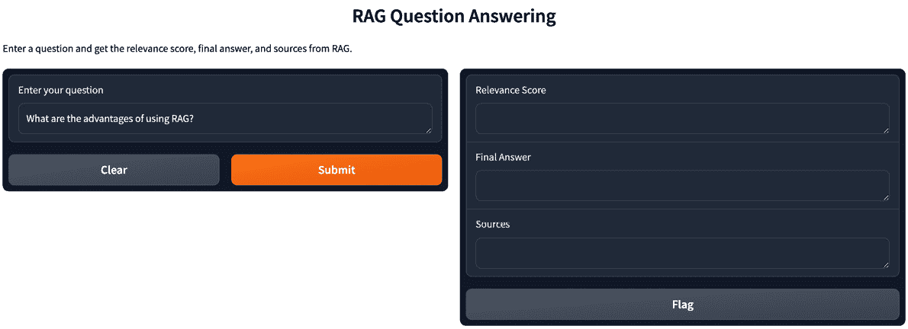
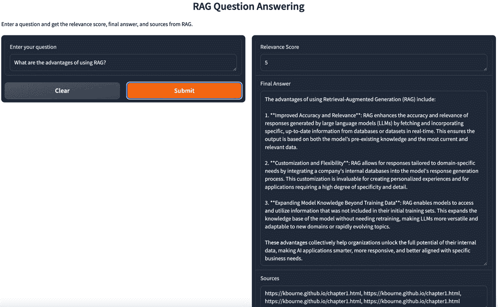

# 与 RAG 和 Gradio 交互

在几乎所有情况下，**检索增强生成** (**RAG**) 开发涉及创建一个或多个应用程序，或**应用** （简称 apps）。 在最初编码 RAG 应用程序时，你通常会创建一个变量，在代码中表示提示或其他类型的输入，这些输入反过来又表示 RAG 管道将基于其进行操作。 但未来的用户会怎样使用你正在构建的应用程序呢？ 你如何使用你的代码与这些用户进行测试？ 你需要一个界面！

在本章中，我们将提供使用 Gradio 作为用户界面（**Gradio**）的实用指南，以使您的应用程序通过 RAG 交互。 它涵盖了设置 Gradio 环境、集成 RAG 模型、创建用户友好的界面，使用户能够像使用典型的网络应用程序一样使用您的 RAG 系统，并在永久且免费的在线空间中托管它。 您将学习如何快速原型设计和部署 RAG 驱动的应用程序，使最终用户能够实时与 AI 模型交互。

关于如何构建界面的书籍已经有很多，你可以在很多地方提供界面，例如在网页浏览器或通过移动应用。 但幸运的是，使用 Gradio，我们可以为您提供一种简单的方法来为您的基于 RAG 的应用程序提供界面，而无需进行大量的网页或移动开发。 这使得共享和演示模型变得更加容易。 模型。

在本章中，我们将具体介绍以下主题： 以下主题：

+   为什么选择 Gradio？

+   使用 Gradio 的好处

+   使用 Gradio 的局限性

+   代码实验室 – 添加一个 Gradio 界面

让我们首先讨论为什么 Gradio 是您 RAG 开发工作的重要组成部分。 努力。

# 技术要求

本章的代码在此： 这里： [https://github.com/PacktPublishing/Unlocking-Data-with-Generative-AI-and-RAG/tree/main/Chapter_06](https://github.com/PacktPublishing/Unlocking-Data-with-Generative-AI-and-RAG/tree/main/Chapter_06 )

# 为什么选择 Gradio？

到目前为止，我们一直 关注的是通常被归入 数据科学领域的主题。 **机器学习**、**自然语言处理** (**NLP**)、**生成式人工智能** (**生成式 AI**)、**大型语言模型** (**LLMs**)和 RAG 都是需要大量**专业知识**的技术，通常需要投入足够多的**时间**，以至于我们无法在其他技术领域，如使用网络技术和构建网络前端，建立专业知识。 **Web 开发** 本身是一个高度技术化的领域，需要大量的**经验和专业知识**才能**成功实施**。

然而，对于 RAG 来说，拥有一个 UI 非常有帮助，特别是如果你想测试它或向潜在用户展示它。 如果我们没有时间学习**网络开发**，我们该如何提供这样的 UI 呢？

这就是为什么许多数据科学家，包括我自己，都使用**Gradio**的原因。它允许你非常快速地（相对于构建网络前端）以可共享的格式启动一个用户界面，甚至还有一些基本的身份验证功能。 这不会让任何网络开发者失业，因为如果你想要将你的 RAG 应用变成一个完整的、健壮的网站，Gradio 可能不是一个很好的选择。 但它将允许你，作为一个时间非常有限来构建网站的人，在几分钟内就启动一个非常适合 RAG 应用的 UI！

因为这里的想法是让你将大部分精力集中在 RAG 开发上，而不是网络开发上，我们将简化我们对 Gradio 的讨论，只讨论那些能帮助你将 RAG 应用部署到网络并使其可共享的组件。 然而，随着你的 RAG 开发继续进行，我们鼓励你进一步调查 Gradio 的功能，看看是否还有其他什么可以帮助你**特定努力**的地方！

考虑到这一点，让我们来谈谈使用 Gradio 构建**RAG 应用**的主要好处。

# 使用 Gradio 的好处

除了对非网页开发者来说非常容易使用之外，Gradio 还有很多优点。除了 仅仅对非网页开发者来说非常容易使用之外，Gradio 还有很多优点。 Gradio 的核心库是开源的，这意味着开发者可以自由地使用、修改并为项目做出贡献。 Gradio 与广泛使用的机器学习框架集成良好，例如 如下 **TensorFlow**，**PyTorch**，和 **Keras**。除了开源库之外，Gradio 还提供了一个托管平台，开发者可以在该平台上部署他们的模型接口并管理访问权限。 此外，Gradio 还包含一些有助于机器学习项目团队协作的功能，例如共享接口和 收集反馈。

Gradio 的另一个令人兴奋的功能是它与**Hugging Face**集成得很好。 由 OpenAI 的前员工创立的 Hugging Face 拥有许多旨在支持生成式 AI 社区的资源，例如模型共享和数据集托管。 这些资源之一是能够使用**Hugging Face Spaces**在互联网上设置指向您的 Gradio 演示的永久链接。 Hugging Face Spaces 提供了免费永久托管您的机器学习模型的必要基础设施！查看 Hugging Face 网站以了解更多关于 他们的 Spaces 的信息。

当使用 Gradio 为您的 RAG 应用程序时，也存在一些限制，了解这些限制是很重要的。

# 使用 Gradio 的限制

在使用 Gradio 时，最重要的是要记住的是，它并不提供足够的支持来构建一个将与其他数百、数千甚至数百万用户交互的生产级应用程序。 在这种情况下，您可能需要雇佣一位在构建大规模生产级应用程序前端方面有专业知识的人。 但对我们所说的**概念验证** (**POC**)类型的应用程序，或者构建允许您测试具有基本交互性和功能的应用程序，Gradio 做得非常出色。 Gradio 做得非常出色。

当你使用 Gradio 进行 RAG 应用时可能会遇到的一个限制是，你所能构建的内容缺乏灵活性。 对于许多 RAG 应用，尤其是在构建原型时，这不会成为问题。 但如果你或你的用户开始要求更复杂的 UI 功能，Gradio 将比完整的 Web 开发框架限制得多。 不仅了解这一点对你很重要，而且与你的用户设定这些期望也很重要，帮助他们理解这只是一个简单的 演示 应用程序。

让我们直接进入代码，了解 Gradio 如何为你的 RAG 应用程序提供它应得的界面。 它应得的。

# 代码实验室 – 添加 Gradio 接口

此代码从我们 在 *第五章*停止的地方继续，除了最后一组代表提示探针攻击的行。 正如我们在所有代码实验室的开始一样，我们将从安装一个新的包开始，当然是 Gradio！ 我们还将卸载 `uvloop`，因为它与我们的 其他包存在冲突：

```py
 %pip install gradio
%pip uninstall uvloop -y
```

这会安装 `gradio` 包并移除冲突的 `uvloop` 包。

接下来，我们将向导入列表中添加多个包： 导入：

```py
 import asyncio
import nest_asyncio
asyncio.set_event_loop_policy(asyncio.DefaultEventLoopPolicy())
nest_asyncio.apply()
import gradio as gr
```

这些行导入 `asyncio` 和 `nest_asyncio` 库，并设置事件循环策略。 `asyncio` 是一个用于使用协程和事件循环编写并发代码的库。 `nest_asyncio` 是一个允许 Jupyter 笔记本中嵌套事件循环的库。 `asyncio.set_event_loop_policy(asyncio.DefaultEventLoopPolicy())` 行将事件循环策略设置为默认策略。 `nest_asyncio.apply()` 应用必要的补丁以启用嵌套事件循环。 然后，最后，我们导入 `gradio` 包，并将其分配给 `gr` 别名 以方便使用。

在添加导入之后，我们 只需要在现有代码的末尾添加此代码来设置我们的 Gradio 接口：

```py
 def process_question(question):
    result = rag_chain_with_source.invoke(question)
    relevance_score = result['answer']['relevance_score']
    final_answer = result['answer']['final_answer']
    sources = [doc.metadata['source'] for doc in result['context']]
    source_list = ", ".join(sources)
    return relevance_score, final_answer, source_list
```

该 `process_question` 函数是在你点击那个 `gr.Interface` 代码时被调用的函数，但这是被调用并处理的函数。 该 `process_question` 函数接收用户提交的问题作为输入，并使用我们的 RAG 管道进行处理。 它调用 `rag_chain_with_source` 对象，并使用给定的问题检索相关性得分、最终答案和来源。 然后该函数将来源合并成一个以逗号分隔的字符串，并返回相关性得分、最终答案和 来源列表。

接下来，我们将设置一个 Gradio 界面的实例：

```py
 demo = gr.Interface(
    fn=process_question,
    inputs=gr.Textbox(label="Enter your question",
        value="What are the Advantages of using RAG?"),
    outputs=[
        gr.Textbox(label="Relevance Score"),
        gr.Textbox(label="Final Answer"),
        gr.Textbox(label="Sources")
    ],
    title="RAG Question Answering",
    description=" Enter a question about RAG and get an answer, a 
        relevancy score, and sources." )
```

该 `demo = gr.Interface(...)` 行是 Gradio 魔法发生的地方。 它使用 `gr.Interface` 函数创建一个 Gradio 界面。 该 `fn` 参数指定当用户与界面交互时调用的函数，这正是我们在上一段中提到的，调用 `process_question` 并启动 RAG 管道。 该 `inputs` 参数定义了界面的输入组件，用于输入问题的是 `gr.Textbox` 。 该 `outputs` 参数定义了界面的输出组件，有三个 `gr.Textbox` 组件用于显示相关性得分、最终答案和来源。 该 `title` 和 `description` 参数设置了界面的标题和描述。

剩下的唯一行动就是启动 界面：

```py
 demo.launch(share=True, debug=True)
```

这条 `demo.launch(share=True, debug=True)` 行启动了 Gradio 界面。 这个 `share=True` 参数启用了 Gradio 的共享功能，生成一个公开可访问的 URL，你可以与他人分享以访问你的界面。 Gradio 使用隧道服务来提供此功能，允许任何拥有 URL 的人与你的界面交互，而无需在本地运行代码。 这个 `debug=True` 参数启用了调试模式，提供了额外的信息和工具，用于调试和开发。 在调试模式下，如果执行过程中发生错误，Gradio 会在浏览器控制台中显示详细的错误消息。

我认为 `demo.launch(share=True, debug=True)` 是这本书中所有其他代码中的一条特殊代码行。 这是因为它做了一些你以前没有看到的事情；它调用 Gradio 来启动一个本地 Web 服务器来托管由 `gr.Interface(...)`定义的界面。当你运行这个单元格时，你会注意到它会持续运行，直到你停止它。 你还会注意到，除非停止它，否则你不能运行任何其他单元格。

还有一个我们想要让你注意的附加参数：auth 参数。 你可以像这样将其添加到 `demo.launch` 函数 中：

```py
 demo.launch(share=True, debug=True, auth=("admin", "pass1234"))
```

这将添加一个简单的认证级别，以防你公开分享你的应用程序。 它生成一个额外的界面，需要你添加的用户名（`admin`）和密码（`pass1234`）。 将 `admin/pass1234` 改为你想要的任何内容，但绝对要更改它！ 仅将这些凭据分享给那些你想让他们访问你的 RAG 应用程序的用户。 请记住，这并不非常安全，但它至少提供了一个基本的目的，以限制 用户访问。

现在，你有一个活跃的 Web 服务器，它可以接收输入，处理它，并根据你为你的 Gradio 界面编写的代码来响应和返回新的界面元素。 这曾经需要显著的 Web 开发专业知识，但现在你可以在几分钟内将其设置并运行！ 这使得你可以专注于你想要关注的事情：编写你的 RAG 应用程序的代码！

一旦你在该单元中运行了 Gradio 代码，界面就会变得交互式，允许用户在输入框中输入问题。 正如我们之前所描述的，当用户提交一个问题， `process_question` 函数会以用户的问题作为输入被调用。 该函数调用一个 RAG 流程， `rag_chain_with_source`，并使用问题检索相关性得分、最终答案和来源。 然后它返回相关性得分、最终答案和来源列表。 Gradio 会用返回的值更新输出文本框，向用户显示相关性得分、最终答案和来源。

界面保持活跃和响应，直到单元执行完成或直到 `gr.close_all()` 被调用以关闭所有活动的 Gradio 界面。

最终，当你使用 Gradio 代码运行这个笔记本单元时，你将得到一个看起来像 *图 6**.1*. 的界面。你可以在笔记本中直接显示 Gradio 界面，也可以在运行 单元时提供的链接的完整网页上显示。



图 6.1 – Gradio 界面

我们已经预先填充了这个问题： `使用 RAG 的优点是什么？`。然而，你可以更改这个问题并询问其他内容。 正如我们在上一章所讨论的，如果它与数据库的内容不相关，LLM 应该响应 `我不知道`。我们鼓励你尝试使用相关和不相关的问题来测试它！ 看看你是否能找到一个按预期工作的场景来提高你的 调试技能。

在你的笔记本中，这个界面上方你可能会看到类似 以下 的文本：

```py
 Colab notebook detected. This cell will run indefinitely so that you can see errors and logs. To turn off, set debug=False in launch(). Running on public URL: https://pl09q9e4g8989braee.gradio.live
This share link expires in 72 hours.
```

点击该链接应该会在自己的浏览器窗口中提供界面的视图！ 它看起来就像 *图 6**.1*，但它将占据整个 浏览器窗口。

点击 `result = rag_chain_with_source.invoke(question)` 并在等待几秒钟后返回一个响应。 生成的界面应该看起来类似于 *图 6**.2*：



图 6.2 – 带有响应的 Gradio 界面

当 LLM 返回响应时，让我们谈谈在这个界面中发生的一些事情。 它从相关性得分开始，这是我们添加在 *第五章* 中，当使用 LLM 来确定问题的相关性作为安全措施以阻止提示注入时。 在你向用户展示的应用程序中，这很可能不会显示，但在这里作为展示你 LLM 响应旁边额外信息的示例。 LLM 响应。

说到 LLM 响应， **最终答案** 来自 ChatGPT 4 已经格式化为带有标记的方式显示。 Gradio 将自动使用该标记的换行符并相应地显示文本，在这种情况下，将段落分割。 。

最后，来源是一个包含四个来源的列表，表明检索器返回了四个来源。 这来自于我们在 *第三章* 中设置的代码，当时我们增加了在元数据中携带检索结果来源的能力，以便我们在 UI 中显示。 现在我们终于在这里看到了这个努力的成果 *第六章*，因为我们现在有一个 UI 可以展示了！ 你可能已经注意到，所有四个来源都是相同的。 这是由于这是一个小示例，我们只拉入了一个数据来源 。

在大多数应用程序中，你可能会 将更多的信息来源拉入你的数据中，并且在该列表中会有更多的来源。 如果你向此代码添加更多与所提问题相关的数据来源，你应该会看到它们出现在这个来源 列表中。

# 摘要

在本章中，我们介绍了一个使用 RAG 和 Gradio 作为 UI 创建交互式应用的实用指南。 我们涵盖了设置 Gradio 环境、集成 RAG 模型以及创建一个用户友好的界面，使用户能够像典型 Web 应用一样与 RAG 系统交互。 开发者可以快速原型设计和部署 RAG 驱动的应用，使最终用户能够实时与 RAG 管道交互。 。

我们还讨论了使用 Gradio 的好处，例如其开源性质、与流行机器学习框架的集成、协作功能以及 Gradio 与 Hugging Face 的集成，后者为生成式 AI 社区提供资源，包括使用 Hugging Face Spaces 永久和免费托管 Gradio 演示的能力。

通过代码实验室，我们学习了如何将 Gradio 界面添加到 RAG 应用中。 我们使用 `gr.Interface`创建 Gradio 界面，指定输入和输出组件、标题和描述。 我们使用 `demo.launch()`启动界面，该命令启动一个本地 Web 服务器以托管界面。 这涉及到创建一个 `process_question` 函数，该函数调用 RAG 管道处理用户的问题，并从结果中检索相关性得分、最终答案和来源。 这个过程反映了 Gradio 界面，使用户能够输入问题并接收由 RAG 系统返回的相关性得分、最终答案和来源。

本章还讨论了如何将来源从检索器传递到 UI 中显示，展示了在前面章节中添加此功能所付出的努力。

这只是对 Gradio 的一个简单介绍。 我们鼓励您访问 Gradio 网站（[https://www.gradio.app/](https://www.gradio.app/)）并浏览他们的 **快速入门** 指南和文档，以了解他们平台提供的其他重要功能。

在下一章中，我们将探讨向量和向量存储在增强 RAG 系统中所扮演的关键角色。
