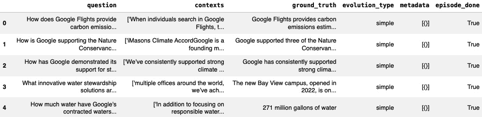
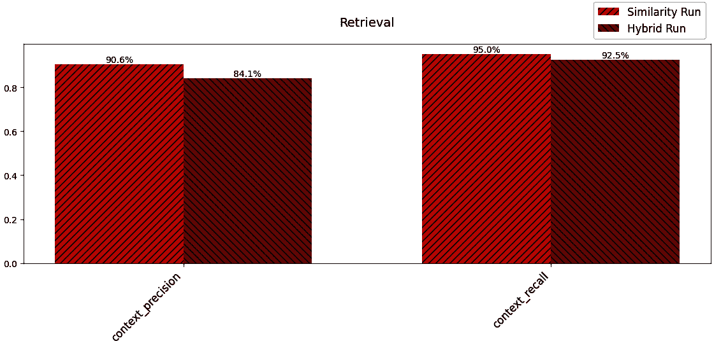
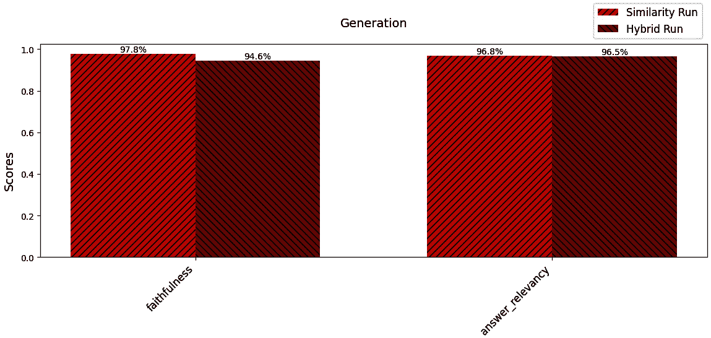
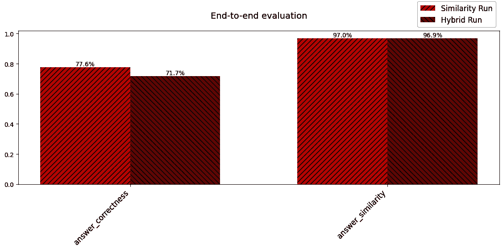

# <st c="0">9</st>

# <st c="2">以量和可视化评估 RAG</st>

<st c="55">评估在构建和维护</st> **<st c="116">检索增强生成</st>** <st c="146">(</st>**<st c="148">RAG</st>**<st c="151">) 管道中发挥着关键作用。</st> <st c="165">在构建管道时，你可以使用评估来识别改进领域，优化系统性能，并系统地衡量改进的影响。</st> <st c="343">当你的 RAG 系统部署后，评估可以帮助确保系统的有效性、可靠性和性能</st> <st c="455">。</st>

<st c="466">在本章中，我们将涵盖以下主题：</st> <st c="502">以下内容：</st>

+   <st c="519">在构建</st> <st c="547">RAG 应用</st>时进行评估

+   <st c="562">部署后评估</st> <st c="592">RAG 应用</st>

+   <st c="608">标准化</st> <st c="622">评估框架</st>

+   <st c="643">真实值</st>

+   <st c="656">代码实验室 9.1 –</st> <st c="672">ragas</st>

+   <st c="677">针对 RAG 系统的额外评估技术</st>

<st c="726">让我们先谈谈评估如何帮助你在构建你的</st> <st c="823">RAG 系统</st>的初期阶段。

# <st c="834">技术要求</st>

<st c="857">本章的代码放置在以下 GitHub</st> <st c="918">仓库中：</st> [<st c="930">https://github.com/PacktPublishing/Unlocking-Data-with-Generative-AI-and-RAG/tree/main/Chapter_09</st>](https://github.com/PacktPublishing/Unlocking-Data-with-Generative-AI-and-RAG/tree/main/Chapter_09)

# <st c="1027">构建时评估</st>

<st c="1049">评估在整个 RAG 管道开发过程中发挥着关键作用。</st> <st c="1136">在构建系统时，通过持续评估你的系统，你可以确定需要改进的领域，优化系统的性能，并系统地衡量你做出的任何修改或增强的影响</st> <st c="1348">。</st>

<st c="1357">评估对于理解 RAG 管道中不同方法的权衡和限制至关重要。</st> <st c="1372">RAG 管道通常涉及各种技术选择，例如向量存储、检索算法和语言生成模型。</st> <st c="1480">这些组件中的每一个都可能对系统的整体性能产生重大影响。</st> <st c="1621">通过系统地评估这些组件的不同组合，你可以获得宝贵的见解，了解哪些方法对你的特定任务和领域产生最佳结果</st> <st c="1891">。</st>

<st c="1902">例如，你可能尝试不同的嵌入模型，例如可以免费下载的本地开源模型或每次将文本转换为嵌入时收费的云服务 API。</st> <st c="2113">你可能需要了解云 API 服务是否优于免费模型，如果是的话，它是否足够好以抵消额外的成本。</st> <st c="2269">同样，你可以评估各种语言生成模型的表现，例如 ChatGPT、Llama</st> <st c="2376">和 Claude。</st>

<st c="2387">这个迭代评估过程帮助你做出关于最适合你的 RAG 管道架构和组件的明智决策。</st> <st c="2531">通过考虑效率、可扩展性和泛化能力等因素，你可以微调你的系统以实现最佳性能，同时最小化计算成本并确保在不同场景下的鲁棒性。</st> <st c="2744">这至关重要。</st>

<st c="2764">评估对于理解 RAG 管道中不同方法的权衡和限制至关重要。</st> <st c="2887">但评估在部署后也可能很有用，我们将在下一节中讨论。</st>

# <st c="2969">部署后进行评估</st>

<st c="2995">一旦你的 RAG</st> <st c="3010">系统部署完成，评估仍然是确保其持续有效性、可靠性和性能的关键方面。</st> <st c="3135">对已部署的 RAG 管道进行持续监控和评估对于保持其质量以及识别任何潜在问题或随时间退化至关重要。</st> <st c="3296">随着时间的推移，这至关重要。</st>

<st c="3306">有众多原因可能导致 RAG 系统在部署后性能下降。</st> <st c="3397">例如，用于检索的数据可能随着新信息的出现而变得过时或不相关。</st> <st c="3500">语言生成模型可能难以适应不断变化的患者查询或目标领域的变更。</st> <st c="3610">此外，底层基础设施，如硬件或软件组件，可能会遇到性能问题</st> <st c="3730">或故障。</st>

<st c="3742">想象一下，你是一家金融财富管理公司，该公司有一个基于 RAG 的应用程序，帮助用户了解可能影响其金融投资组合的最可能因素。</st> <st c="3940">你的数据源可能包括过去五年内由主要金融公司发布的所有分析，涵盖了你的客户群所代表的全部金融资产。</st>

然而，在金融市场，全球范围内的重大（宏观）事件可以对过去五年数据中未捕捉到的投资组合产生重大影响。<st c="4290">重大灾难、政治不稳定，甚至某些股票的区域性事件都可能为它们的业绩设定全新的轨迹。</st> <st c="4428">对于您的 RAG 应用来说，这代表着数据可以为您的最终用户提供的价值的变化，而且如果没有适当的更新，这种价值可能会随着时间的推移而迅速下降。</st> <st c="4605">用户可能会开始询问 RAG 应用无法处理的具体事件，例如</st> *<st c="4727">“刚刚发生的五级飓风将在下一年对我的投资组合产生什么影响？”</st>* <st c="4828">但是，通过持续的更新和监控，尤其是关于飓风影响的最新报告，这些问题很可能会得到妥善解决。</st>

<st c="4993">为了减轻这些风险，持续监控您的 RAG 系统至关重要，尤其是在常见的故障点。</st> <st c="5113">通过持续评估您 RAG 管道的这些关键组件，您可以主动识别并解决任何性能下降。</st> <st c="5261">这可能包括用新鲜和相关的数据更新检索语料库，在新数据上微调语言生成模型，或者优化系统的基础设施以处理增加的负载或解决</st> <st c="5471">性能瓶颈。</st>

<st c="5495">此外，建立允许用户报告任何问题或提供改进建议的反馈循环至关重要。</st> <st c="5633">通过积极征求并整合用户反馈，您可以持续改进和增强您的 RAG 系统，更好地满足用户的需求。</st> <st c="5784">这也可以包括监控用户界面使用、响应时间以及用户视角下生成的输出的相关性有用性等方面。</st> <st c="5958">进行用户调查、分析用户交互日志和监控用户满意度指标可以提供有关您的 RAG 系统是否满足其预期目的的有价值见解。</st> <st c="6150">您如何利用这些信息在很大程度上取决于您开发了哪种类型的 RAG 应用，但一般来说，这些是部署的 RAG 应用持续改进中最常见的监控领域。</st>

通过定期评估您部署的 RAG 系统，您可以确保其长期的有效性、可靠性和性能。<st c="6489">持续监控、主动问题检测以及持续改进的承诺是维护高质量 RAG 管道的关键，该管道能够随着时间的推移为用户带来价值</st> <st c="6663">。</st>

# <st c="6673">评估帮助你变得更好</st>

<st c="6705">为什么评估如此重要？</st> <st c="6738">简单来说，如果你不衡量你目前的位置，然后在改进之后再次衡量，那么将很难理解</st> <st c="6881">如何或是什么改进（或损害）了你的</st> <st c="6936">RAG 系统。</st>

<st c="6947">当出现问题时，如果没有客观标准进行比较，理解出了什么问题也很困难。</st> <st c="7080">是你的检索机制出了问题吗？</st> <st c="7113">是提示出了问题吗？</st> <st c="7132">是你的 LLM 响应出了问题吗？</st> <st c="7158">这些问题是一个好的评估系统可以帮助回答的。</st>

<st c="7219">评估提供了一个系统性和客观的方式来衡量你的管道性能，确定需要改进的领域，并跟踪你做出的任何更改或改进的影响。</st> <st c="7410">没有强大的评估框架，理解你的 RAG 系统进展如何以及它需要</st> <st c="7540">进一步改进的地方变得具有挑战性。</st>

<st c="7559">通过将评估视为开发过程的一个基本部分，你可以持续改进和优化你的 RAG 管道，确保它提供最佳可能的结果，并满足其用户不断变化的需求。</st>

<st c="7787">在 RAG 系统开发过程的早期，你必须开始决定你将考虑哪些技术组件。</st> <st c="7927">在这个时候，你甚至还没有安装</st> <st c="7969">任何东西，所以你还不能评估你的代码，但你仍然可以使用</st> **<st c="8038">标准化的评估框架</st>** <st c="8072">来缩小你考虑的范围。</st> <st c="8114">让我们讨论一些最常见的 RAG</st> <st c="8201">系统元素的标准化评估框架。</st>

# <st c="8217">标准化的评估框架</st>

<st c="8252">你的 RAG 系统的关键技术组件包括创建嵌入的嵌入模型、向量存储、向量搜索和 LLM。</st> <st c="8336">当你查看每个技术组件的不同选项时，每个组件都有一些标准化的指标可供选择，这些指标可以帮助你比较它们。</st> <st c="8403">以下是每个类别的一些常见指标。</st> <st c="8590">这里有一些常见指标。</st>

## <st c="8637">嵌入模型基准</st>

**<st c="8664">大规模文本嵌入基准</st>** <st c="8701">(</st>**<st c="8703">MTEB</st>**<st c="8707">) 检索排行榜评估了</st> <st c="8742">不同数据集上各种检索任务中嵌入模型的性能。</st> <st c="8832">MTEB 排行榜根据模型在多个嵌入和</st> <st c="8927">检索相关任务上的平均性能进行排名。</st> <st c="8952">您可以通过此</st> <st c="8993">链接访问排行榜：</st> [<st c="8999">https://huggingface.co/spaces/mteb/leaderboard</st>](https://huggingface.co/spaces/mteb/leaderboard)

<st c="9045">访问此网页时，点击</st> **<st c="9088">检索</st>** <st c="9097">和</st> **<st c="9102">带说明的检索</st>** <st c="9126">选项卡以获取</st> <st c="9136">特定检索的嵌入评分。</st> <st c="9174">为了评估排行榜上的每个模型，使用涵盖广泛领域的多个数据集测试模型的输出，例如</st> <st c="9327">以下内容：</st>

+   <st c="9341">论点</st> <st c="9351">检索（</st>`<st c="9362">ArguAna</st>`<st c="9370">）</st>

+   <st c="9372">气候事实</st> <st c="9385">检索（</st>`<st c="9396">ClimateFEVER</st>`<st c="9409">）</st>

+   <st c="9411">重复问题</st> <st c="9430">检索（</st>`<st c="9441">CQADupstackRetrieval</st>`<st c="9462">）</st>

+   <st c="9464">实体</st> <st c="9471">检索（</st>`<st c="9482">DBPedia</st>`<st c="9490">）</st>

+   <st c="9492">事实抽取和</st> <st c="9512">验证（</st>`<st c="9526">FEVER</st>`<st c="9532">）</st>

+   <st c="9534">金融</st> <st c="9544">问答（</st>`<st c="9564">FiQA2018</st>`<st c="9573">）</st>

+   <st c="9575">多跳</st> <st c="9585">问答（</st>`<st c="9605">HotpotQA</st>`<st c="9614">）</st>

+   <st c="9616">段落和文档</st> <st c="9637">排序（</st>`<st c="9646">MSMARCO</st>`<st c="9654">）</st>

+   <st c="9656">事实核查（</st>`<st c="9671">NFCorpus</st>`<st c="9680">）</st>

+   <st c="9682">开放域</st> <st c="9694">问答（</st>`<st c="9714">NQ</st>`<st c="9717">）</st>

+   <st c="9719">重复问题</st> <st c="9738">检测（</st>`<st c="9749">QuoraRetrieval</st>`<st c="9764">）</st>

+   <st c="9766">科学文档</st> <st c="9786">检索（</st>`<st c="9797">SCIDOCS</st>`<st c="9805">）</st>

+   <st c="9807">科学声明</st> <st c="9824">验证（</st>`<st c="9838">SciFact</st>`<st c="9846">）</st>

+   <st c="9848">论点</st> <st c="9857">检索（</st>`<st c="9868">Touche2020</st>`<st c="9879">）</st>

+   <st c="9881">与 COVID-19 相关的信息</st> <st c="9910">检索（</st>`<st c="9921">TRECCOVID</st>`<st c="9931">）</st>

<st c="9933">排行榜</st> <st c="9949">根据</st> <st c="9981">这些任务的平均性能对嵌入模型进行排名，从而全面展示它们的优缺点。</st> <st c="10093">您还可以点击任何指标，按该指标对排行榜进行排序。</st> <st c="10161">例如，如果您对更关注金融问答的指标感兴趣，请查看在</st> <st c="10309">FiQA2018 数据集上得分最高的模型。</st>

## <st c="10326">向量存储和向量搜索基准测试</st>

**<st c="10368">近似最近邻基准测试</st>** <st c="10383">是一个</st> <st c="10389">基准测试工具，用于评估</st> **<st c="10441">近似最近邻</st>** <st c="10469">(</st>**<st c="10471">ANN</st>**<st c="10474">) 算法的性能，我们已在</st> *<st c="10522">第八章</st>*<st c="10531">中详细讨论。</st> ANN-Benchmarks <st c="10548">评估了不同向量搜索工具在各种数据集上的搜索准确性、速度和内存使用情况，包括</st> <st c="10666">我们在</st> *<st c="10706">第八章</st>*<st c="10715">中提到的向量搜索工具</st>—**<st c="10717">Facebook AI 相似度搜索</st>** <st c="10746">(</st>**<st c="10748">FAISS</st>**<st c="10753">)，**<st c="10757">近似最近邻哦，是的</st>** <st c="10794">(</st>**<st c="10796">ANNOY</st>**<st c="10801">)，以及**<st c="10809">分层可导航小世界</st>** **<st c="10838">（HNSW）</st>**。</st>

**<st c="10853">信息检索基准测试</st>** <st c="10869">(</st>**<st c="10871">BEIR</st>**<st c="10875">) 是另一个</st> <st c="10889">有用的</st> <st c="10896">资源，用于评估向量存储和搜索算法。</st> <st c="10957">它提供了一个异构基准，用于跨多个领域（包括问答、事实核查和实体检索）对信息检索模型进行零样本评估。</st> <st c="11143">我们将在</st> *<st c="11172">第十三章</st>* <st c="11191">中进一步讨论</st> *<st c="11172">零样本</st>* <st c="11181">的含义</st> *<st c="11191"><st c="11201">，但基本上，这意味着没有包含任何示例的问题/用户查询，这在 RAG 中是一种常见情况。</st> <st c="11336">BEIR 提供了一个标准化的评估框架，包括以下流行数据集：</st>

+   `<st c="11436">MSMARCO</st>`<st c="11444">：一个从现实世界的查询和答案中提取的大规模数据集，用于评估搜索和问答中的深度学习模型</st> <st c="11559">和问答</st>

+   `<st c="11581">HotpotQA</st>`<st c="11590">：一个具有自然、多跳问题的问答数据集，对支持事实进行强监督，以支持更可解释的</st> <st c="11741">问答系统</st>

+   `<st c="11767">CQADupStack</st>`<st c="11779">：一个用于</st> **<st c="11806">社区问答</st>** <st c="11834">(</st>**<st c="11836">cQA</st>**<st c="11839">) 研究的基准数据集，从 12 个 Stack Exchange 子论坛中提取，并标注了重复</st> <st c="11920">问题信息</st>

<st c="11940">这些数据集，以及 BEIR 基准中的其他数据集，涵盖了广泛的领域和信息检索任务，使您能够评估您的检索系统在不同环境中的性能，并将其与</st> <st c="12173">最先进的方法进行比较。</st>

## <st c="12198">LLM 基准</st>

<st c="12213">人工分析 LLM 性能排行榜是一个全面的资源，用于评估</st> <st c="12309">开源和专有语言模型，如</st> <st c="12367">ChatGPT、Claude 和 Llama。</st> <st c="12395">它</st> <st c="12398">评估了模型在广泛任务上的性能。</st> <st c="12431">为了进行质量比较，它使用了一系列子排行榜：</st>

+   **<st c="12519">通用能力</st>**<st c="12535">：</st> <st c="12538">聊天机器人竞技场</st>

+   **<st c="12551">推理</st>** **<st c="12562">和知识</st>**<st c="12575">：</st>

    +   **<st c="12577">大规模多任务语言</st>** **<st c="12604">理解</st>** <st c="12617">(</st>**<st c="12619">MMLU</st>**<st c="12623">)</st>

    +   **<st c="12625">多轮基准</st>** <st c="12645">(</st>**<st c="12647">MT Bench</st>**<st c="12655">)</st>

<st c="12657">他们还跟踪速度和价格，并提供分析，以便您比较这些领域的平衡。</st> <st c="12768">通过根据这些任务上的性能对模型进行排名，排行榜提供了对它们能力的全面看法。</st>

<st c="12900">它可以在以下位置找到：</st> <st c="12917">[</st> <st c="12923">https://artificialanalysis.ai/</st>](https://artificialanalysis.ai/)

除了通用的 LLM 排行榜，还有专注于 LLM 性能特定方面的专业排行榜。<st c="12953">《人工分析 LLM 性能排行榜</st> <st c="13084">》评估 LLM 的技术方面，例如推理速度、内存消耗和可扩展性。</st> <st c="13136">它包括吞吐量（每秒处理的令牌数）、延迟（生成响应的时间）、内存占用和扩展效率等指标。</st> <st c="13239">这些指标有助于您了解不同 LLM 的计算需求和性能特征。</st> <st c="13490">。

<st c="13505">开放 LLM 排行榜跟踪开源语言模型在各种</st> <st c="13596">自然语言理解和生成任务上的性能。</st> <st c="13649">它包括基准测试，如**<st c="13684">AI2 推理挑战</st>** <st c="13707">(**<st c="13709">ARC</st>**<st c="13712">)用于复杂科学推理，HellaSwag 用于常识推理，MMLU 用于特定领域的性能，TruthfulQA 用于生成真实和有信息量的响应，WinoGrande</st> <st c="13898">通过代词消歧进行常识推理，以及**<st c="13961">小学数学 8K</st>** <st c="13981">(**<st c="13983">GSM8K</st>**<st c="13988">)用于数学</st> <st c="14008">推理能力。</st>

## <st c="14028">关于标准化评估框架的最终思考</st>

<st c="14081">使用标准化评估框架和基准测试为比较您 RAG 管道中不同组件的性能提供了一个有价值的起点。</st> <st c="14175">它们涵盖了广泛的任务和领域，使您能够评估各种方法的优缺点。</st> <st c="14247">通过考虑这些基准测试的结果，以及其他因素如计算效率和易于集成，您可以在选择最适合您特定</st> <st c="14629">RAG 应用的最佳组件时缩小选择范围并做出更明智的决策。</st>

<st c="14645">然而，需要注意的是，尽管这些标准化评估指标对于初始组件选择有帮助，但它们可能无法完全捕捉到您特定 RAG 管道与独特输入和输出的性能。</st> <st c="14882">为了真正了解您的 RAG 系统在特定用例中的表现，您需要设置自己的评估框架，以适应您特定的需求。</st> <st c="15054">这个定制化的评估</st> <st c="15081">系统将为您的</st> <st c="15170">RAG 管道提供最准确和相关的见解。</st>

<st c="15183">接下来，我们需要讨论 RAG 评估中最重要且经常被忽视的一个方面，那就是您的</st> <st c="15291">真实数据。</st>

# <st c="15309">什么是基准数据？</st>

<st c="15335">简单来说，基准数据是代表如果你 RAG 系统处于</st> <st c="15463">最佳性能时你期望的理想响应的数据。</st>

<st c="15480">作为一个实际例子，如果你有一个专注于允许某人询问关于</st> <st c="15580">犬类兽医医学最新癌症研究的 RAG 系统，你的数据源是所有提交给 PubMed 的关于该主题的最新研究论文，你的基准数据很可能是可以对该数据提出和回答的问题和答案。</st> <st c="15855">你希望使用目标受众真正会提出的问题，并且答案应该是你认为从 LLM 期望的理想答案。</st> <st c="16031">这可能有一定的客观性，但无论如何，拥有可以与你的 RAG 系统的输入和输出进行比较的基准数据集是帮助比较你做出的更改的影响并最终使系统更有效的一种关键方式。</st> <st c="16271">更有效。</st>

## <st c="16286">如何使用基准数据？</st>

<st c="16315">基准数据作为衡量 RAG 系统性能的基准。</st> <st c="16399">通过比较</st> <st c="16412">RAG 系统生成的输出与基准数据，你可以评估系统检索相关信息和生成准确、连贯响应的能力。</st> <st c="16585">基准数据有助于量化不同 RAG 方法的有效性并确定改进领域。</st>

## <st c="16698">生成基准数据</st>

<st c="16726">手动创建基准数据</st> <st c="16736">可能耗时。</st> <st c="16786">如果你的公司已经有一组针对特定查询或提示的理想响应的数据集，那将是一个宝贵的资源。</st> <st c="16909">然而，如果此类数据不可用，我们将在下一部分探讨获取基准数据的替代方法。</st>

## <st c="17042">人工标注</st>

<st c="17059">你可以</st> <st c="17068">雇佣人工标注员手动为一系列查询或提示创建理想响应。</st> <st c="17160">这确保了高质量的基准数据，但可能成本高昂且耗时，尤其是对于</st> <st c="17257">大规模评估。</st>

## <st c="17281">专家知识</st>

<st c="17298">在某些</st> <st c="17307">领域，你可能可以访问</st> **<st c="17339">领域专家</st>** <st c="17361">(</st>**<st c="17363">SMEs</st>**<st c="17367">) 他们可以根据他们的</st> <st c="17424">专业知识</st> <st c="17435">提供基准响应。</st> <st c="17531">这在需要准确信息的专业或技术领域尤其有用。</st>

<st c="17542">一种常见的帮助此方法的方法称为</st> **<st c="17598">基于规则生成</st>**<st c="17619">。使用基于规则生成，对于特定领域或任务，您可以定义一组规则或模板来生成合成地面实况，并利用您的 SMEs 来填写模板。</st> <st c="17809">通过利用领域知识和预定义的模式，您可以创建与预期格式和内容相符的响应。</st>

<st c="17938">例如，如果您正在构建一个用于支持手机的客户支持聊天机器人，您可能有一个这样的模板：</st> `<st c="18063">要解决[问题]，您可以尝试[解决方案]</st>`<st c="18105">。您的 SMEs 可以在可能的问题-解决方案方法中填写各种问题-解决方案，其中问题可能是</st> *<st c="18187">电池耗尽</st>* <st c="18200">，解决方案是</st> *<st c="18218">降低屏幕亮度和关闭后台应用</st>*<st c="18272">。这将输入到模板中（我们称之为“加水”），最终输出将是这样的：</st> `<st c="18387">要解决[电池耗尽]，您可以尝试[降低屏幕亮度和关闭</st>` `<st c="18467">后台应用]</st>`<st c="18483">。</st>

## <st c="18484">众包</st>

<st c="18498">平台</st> <st c="18509">如 Amazon Mechanical Turk 和 Figure Eight 允许您将创建地面实况数据的任务外包给大量工作者。</st> <st c="18647">通过提供清晰的指示和质量控制措施，您可以获得多样化的响应集。</st>

## <st c="18751">合成地面实况</st>

在获取真实地面实况数据具有挑战性或不切实际的情况下，生成合成地面实况可以是一个可行的替代方案。<st c="18920">合成地面实况涉及使用现有的 LLM 或技术自动生成合理的响应。</st> <st c="19037">以下是一些方法：</st>

+   **<st c="19063">微调语言模型</st>**<st c="19090">：您可以在较小的高质量响应数据集上微调 LLM。</st> <st c="19140">通过向模型提供理想响应的示例，它可以学习为新查询或提示生成类似的响应。</st> <st c="19164">生成的响应可以用作合成</st> <st c="19341">地面实况。</st>

+   **<st c="19354">基于检索的方法</st>**<st c="19378">：如果您拥有大量高质量的文本数据，您可以使用基于检索的方法来找到与查询或提示紧密匹配的相关段落或句子。</st> <st c="19439">这些检索到的段落可以用作地面实况响应的代理。</st>

<st c="19625">获取真实信息是构建您的 RAG 系统中的一个具有挑战性的步骤，但一旦您获得了它，您将为有效的 RAG 评估打下坚实的基础。</st> <st c="19803">在下一节中，我们有一个代码实验室，我们将生成合成真实信息数据，然后整合一个有用的评估平台到我们的 RAG 系统中，这将告诉我们上一章中使用的混合搜索对我们结果的影响。</st>

# <st c="20050">代码实验室 9.1 – ragas</st>

**<st c="20071">检索增强生成评估</st>** <st c="20113">(**<st c="20115">ragas</st>**<st c="20120">) 是一个专门为 RAG 设计的评估平台。</st> <st c="20158">在本代码实验室中，我们将逐步实现 ragas 在您的代码中的实现，生成合成真实信息，然后建立一个全面的指标集，您可以将其集成到您的 RAG 系统中。</st> <st c="20396">但评估系统是用来评估某物的，对吧？</st> <st c="20459">在我们的</st> <st c="20488">代码实验室中，我们将评估什么？</st>

<st c="20497">如果您还记得</st> *<st c="20517">第八章</st>*<st c="20526">，我们介绍了一种新的检索阶段搜索方法，称为</st> **<st c="20593">混合搜索</st>**<st c="20606">。在本</st> <st c="20616">代码实验室中，我们将实现基于密集向量语义的原始搜索，然后使用 ragas 来评估使用混合搜索方法的影响。</st> <st c="20774">这将为您提供一个真实世界的实际工作示例，说明如何在自己的代码中实现一个全面的评估系统！</st>

<st c="20899">在我们深入探讨如何使用 ragas 之前，重要的是要注意它是一个高度发展的项目。</st> <st c="20915">随着新版本的发布，新功能和 API 变更经常发生，因此在使用代码</st> <st c="21143">示例时，务必参考文档网站：</st> [<st c="21153">https://docs.ragas.io/</st>](https://docs.ragas.io/)

<st c="21175">本代码实验室从上一章我们添加的</st> `<st c="21257">EnsembleRetriever</st>` <st c="21274">（</st>*<st c="21291">代码</st>* *<st c="21297">实验室 8.3</st>*<st c="21304">）</st>继续进行：</st>

1.  <st c="21307">让我们从一些需要安装的新软件包开始：</st> <st c="21343">开始：</st>

    ```py
    <st c="21354">$ pip install ragas</st>
    ```

    ```py
    <st c="21374">$ pip install tqdm -q –user</st>
    ```

    ```py
    <st c="21515">tqdm</st> package, which is used by ragas, is a popular Python library used for creating progress bars and displaying progress information for iterative processes. You have probably come across the <st c="21708">matplotlib</st> package before, as it is a widely used plotting library for Python. We will be using it to provide visualizations for our evaluation metric results.
    ```

1.  <st c="21867">接下来，我们需要添加一些与我们刚刚安装的</st> <st c="21924">相关的一些导入：</st>

    ```py
    <st c="21939">import tqdm as notebook_tqdm</st>
    ```

    ```py
    <st c="21968">import pandas as pd</st>
    ```

    ```py
    <st c="21988">import matplotlib.pyplot as plt</st>
    ```

    ```py
    <st c="22020">from datasets import Dataset</st>
    ```

    ```py
    <st c="22049">from ragas import evaluate</st>
    ```

    ```py
    <st c="22076">from ragas.testset.generator import TestsetGenerator</st>
    ```

    ```py
    <st c="22129">from ragas.testset.evolutions import (</st>
    ```

    ```py
     <st c="22168">simple, reasoning, multi_context)</st>
    ```

    ```py
    <st c="22202">from ragas.metrics import (</st>
    ```

    ```py
     <st c="22230">answer_relevancy,</st>
    ```

    ```py
     <st c="22248">faithfulness,</st>
    ```

    ```py
     <st c="22262">context_recall,</st>
    ```

    ```py
     <st c="22278">context_precision,</st>
    ```

    ```py
    **<st c="22297">answer_correctness,</st>**
    ```

    ```py
     **<st c="22317">answer_similarity</st>**
    ```

    ```py
    `<st c="22347">tqdm</st>` <st c="22351">will give our ragas platform the ability to use progress bars during the time-consuming processing tasks it implements.</st> <st c="22472">We are going to use the</st> <st c="22496">popular pandas data manipulation and analysis library to pull our data into DataFrames as part of our analysis.</st> <st c="22608">The</st> `<st c="22612">matplotlib.pyplot as plt</st>` <st c="22636">import gives us the ability to add visualizations (charts in this case) for our metric results.</st> <st c="22733">We also import</st> `<st c="22748">Dataset</st>` <st c="22755">from</st> `<st c="22761">datasets</st>`<st c="22769">. The</st> `<st c="22775">datasets</st>` <st c="22783">library is an open source library developed and maintained by Hugging Face.</st> <st c="22860">The</st> `<st c="22864">datasets</st>` <st c="22872">library provides</st> <st c="22890">a standardized interface for accessing and manipulating a wide variety of datasets, typically focused on the field of</st> `<st c="23157">from ragas import evaluate</st>`<st c="23184">: The</st> `<st c="23191">evaluate</st>` <st c="23199">function takes a dataset in the ragas format, along with optional metrics, language models, embeddings, and other configurations, and runs the evaluation on the RAG pipeline.</st> <st c="23375">The</st> `<st c="23379">evaluate</st>` <st c="23387">function returns a</st> `<st c="23407">Result</st>` <st c="23413">object containing the scores for each metric, providing a convenient way to assess the performance of RAG pipelines using various metrics</st> <st c="23552">and configurations.</st>
    ```

1.  **`<st c="23571">from ragas.testset.generator import TestsetGenerator</st>`<st c="23624">: The</st> `<st c="23631">TestsetGenerator</st>` <st c="23647">class is used to generate synthetic ground-truth datasets for evaluating RAG pipelines.</st> <st c="23736">It takes a set of documents and generates question-answer pairs along with the corresponding contexts.</st> <st c="23839">One key aspect of</st> `<st c="23857">TestsetGenerator</st>` <st c="23873">is that it allows the customization of the test data distribution by specifying the</st> <st c="23958">proportions of different question types (e.g., simple, multi-context, or reasoning) using the</st> `<st c="24052">distributions</st>` <st c="24065">parameter.</st> <st c="24077">It supports generating test sets using both LangChain and LlamaIndex</st> <st c="24146">document loaders.</st>****

1.  **`<st c="24163">from ragas.testset.evolutions import simple, reasoning, multi_context</st>`<st c="24233">: These imports represent different types of question evolutions used in the test dataset generation process.</st> <st c="24344">These evolutions help create a diverse and comprehensive test dataset that covers various types of questions encountered in</st> <st c="24468">real-world scenarios:</st>**

    +   **`<st c="24807">from ragas.metrics import…()</st>`<st c="24836">: This</st> `<st c="24844">import</st>` <st c="24850">statement brings in various evaluation metrics provided by the ragas library.</st> <st c="24929">The metrics imported include</st> `<st c="24958">answer_relevancy</st>`<st c="24974">,</st> `<st c="24976">faithfulness</st>`<st c="24988">,</st> `<st c="24990">context_recall</st>`<st c="25004">,</st> `<st c="25006">context_precision</st>`<st c="25023">,</st> `<st c="25025">answer_correctness</st>`<st c="25043">, and</st> `<st c="25049">answer_similarity</st>`<st c="25066">. There are currently two more component-wise metrics (context relevancy and context entity recall) that we can import, but to reduce the complexity of this, we will skip over them here.</st> <st c="25253">We will talk about additional metrics you can use toward the end of the code lab.</st> <st c="25335">These metrics assess different aspects of the RAG pipeline’s performance that relate to the retrieval and generation and, overall, all the end-to-end stages of the</st> <st c="25499">active pipeline.</st>****

**`<st c="25515">Overall, these</st> <st c="25531">imports from the ragas library provide a comprehensive set of tools for generating synthetic test datasets, evaluating RAG pipelines using various metrics, and analyzing the</st> <st c="25705">performance results.</st>**

## **`<st c="25725">Setting up LLMs/embedding models</st>**

<st c="25758">现在，我们将升级我们处理 LLM 和嵌入服务的方式。</st> <st c="25834">使用 ragas，我们在使用的 LLM 数量上引入了更多复杂性；我们希望通过提前设置嵌入服务和 LLM 服务来更好地管理这一点。</st> <st c="25934">让我们看看</st> <st c="26038">代码：</st>

```py
 embedding_ada = "text-embedding-ada-002"
model_gpt35="gpt-3.5-turbo"
model_gpt4="gpt-4o-mini"
embedding_function = OpenAIEmbeddings(
    model=embedding_ada, openai_api_key=openai.api_key)
llm = ChatOpenAI(model=model_gpt35,
    openai_api_key=openai.api_key, temperature=0.0)
generator_llm = ChatOpenAI(model=model_gpt35,
    openai_api_key=openai.api_key, temperature=0.0)
critic_llm = ChatOpenAI(model=model_gpt4,
    openai_api_key=openai.api_key, temperature=0.0)
```

<st c="26514">请注意，尽管我们仍然只使用一个嵌入服务，但我们现在有两个不同的 LLM 可以调用。</st> <st c="26612">然而，这个主要目标是建立我们想要直接用于 LLM 的</st> *<st c="26663">主要</st> <st c="26670">LLM</st>，然后是两个额外的 LLM，它们被指定用于评估过程（</st>`<st c="26714">llm</st>`<st c="26718">)，以及</st> `<st c="26799">generator_llm</st>` <st c="26813">和</st> `<st c="26818">critic_llm</st>`<st c="26828">）。</st>

<st c="26831">我们有一个好处，那就是有一个更先进的 LLM 可用，ChatGPT-4o-mini，我们可以将其用作评论 LLM，理论上这意味着它可以更有效地评估我们输入给它的内容。</st> <st c="27035">这并不总是如此，或者你可能有一个专门针对评估任务微调的 LLM。</st> <st c="27091">无论如何，将这些 LLM 分离成专门的设计表明了不同的 LLM 可以在 RAG 系统中用于不同的</st> <st c="27272">目的。</st> <st c="27302">你可以从之前初始化 LLM 对象的代码中删除以下行，我们最初使用的是：</st> <st c="27409"></st>

```py
 llm = ChatOpenAI(model_name="gpt-4o-mini", temperature=0)
```

<st c="27484">接下来，我们将添加一个新的 RAG 链来运行相似度搜索（这是我们最初仅使用密集嵌入运行的内容）：</st>

```py
<st c="27627">rag_chain_similarity</st> = RunnableParallel(
        {"context": dense_retriever,
        "question": RunnablePassthrough()
}).assign(answer=rag_chain_from_docs)
```

为了使事情更清晰，我们将使用以下名称更新混合 RAG 链：<st c="27769"></st> <st c="27835"></st>

```py
<st c="27845">rag_chain_hybrid</st> = RunnableParallel(
        {"context": ensemble_retriever,
        "question": RunnablePassthrough()
}).assign(answer=rag_chain_from_docs)
```

<st c="27986">请注意，粗体显示的变量发生了变化，它曾经是</st> `<st c="28052">rag_chain_with_source</st>`<st c="28073">。现在它被称为</st> `<st c="28092">rag_chain_hybrid</st>`<st c="28108">，代表混合</st> <st c="28134">搜索方面。</st>

<st c="28148">现在我们将更新我们提交用户查询的原始代码，但这次我们将使用相似度和混合</st> <st c="28290">搜索版本。</st>

<st c="28306">创建相似度版本：</st> <st c="28318"></st>

```py
 user_query = "What are Google's environmental initiatives?" result = rag_chain_similarity.invoke(user_query)
retrieved_docs = result['context']
print(f"Original Question to Similarity Search: {user_query}\n")
print(f"Relevance Score: {result['answer']['relevance_score']}\n")
print(f"Final Answer:\n{result['answer']['final_answer']}\n\n")
print("Retrieved Documents:")
for i, doc in enumerate(retrieved_docs, start=1):
    print(f"Document {i}: Document ID: {doc.metadata['id']}
        source: {doc.metadata['source']}")
    print(f"Content:\n{doc.page_content}\n")
```

<st c="28889">现在，创建</st> <st c="28902">混合版本：</st>

```py
 user_query = "What are Google's environmental initiatives?" result = rag_chain_hybrid.invoke(user_query)
retrieved_docs = result['context']
print(f"Original Question to Dense Search:: {user_query}\n")
print(f"Relevance Score: {result['answer']['relevance_score']}\n")
print(f"Final Answer:\n{result['answer']['final_answer']}\n\n")
print("Retrieved Documents:")
for i, doc in enumerate(retrieved_docs, start=1):
    print(f"Document {i}: Document ID: {doc.metadata['id']}
        source: {doc.metadata['source']}")
    print(f"Content:\n{doc.page_content}\n")
```

<st c="29465">这两组代码之间的主要区别在于它们展示了我们创建的不同</st> <st c="29470">RAG 链的使用，</st> `<st c="29591">rag_chain_similarity</st>` <st c="29611">和</st> `<st c="29616">rag_chain_hybrid</st>`<st c="29632">。</st>

<st c="29633">首先，让我们看看相似度搜索的输出：</st> <st c="29682"></st>

```py
 Google's environmental initiatives include empowering individuals to take action, working together with partners and customers, operating sustainably, achieving net-zero carbon emissions, water stewardship, and promoting a circular economy. They have implemented sustainability features in products like Google Maps, Google Nest thermostats, and Google Flights to help individuals make more sustainable choices. Google also supports various environmental organizations and initiatives, such as the iMasons Climate Accord, ReFED, and The Nature Conservancy, to accelerate climate action and address environmental challenges. Additionally, Google is involved in public policy advocacy and is committed to reducing its environmental impact through its operations and value chain.
```

<st c="30477">接下来是混合搜索的输出：</st>

```py
 Google's environmental initiatives include empowering individuals to take action, working together with partners and customers, operating sustainably, achieving net-zero carbon emissions, focusing on water stewardship, promoting a circular economy, engaging with suppliers to reduce energy consumption and greenhouse gas emissions, and reporting environmental data. They also support public policy and advocacy for low-carbon economies, participate in initiatives like the iMasons Climate Accord and ReFED, and support projects with organizations like The Nature Conservancy. Additionally, Google is involved in initiatives with the World Business Council for Sustainable Development and the World Resources Institute to improve well-being for people and the planet. They are also working on using technology and platforms to organize information about the planet and make it actionable to help partners and customers create a positive impact.
```

<st c="31464">说哪个更好可能是主观的，但如果你回顾一下</st> *<st c="31545">第八章</st>*<st c="31554">中的代码，每个链的检索机制都会为 LLM 返回一组不同的数据，作为回答用户查询的基础。</st> <st c="31645">你可以在前面的响应中看到这些差异的反映，每个响应都有略微不同的信息和突出显示该信息的不同方面。</st>

到目前为止，我们已经设置了我们的 RAG 系统，使其能够使用两个不同的 RAG 链，一个专注于仅使用相似性/密集搜索，另一个使用混合搜索。<st c="32060">这为将拉加斯应用于我们的代码以建立评估我们从中获得的结果的更客观方法奠定了基础。</st>

## <st c="32224">生成合成真实情况</st>

如前所述，**真实情况**是我们进行此评估分析的关键要素。<st c="32352">但我们没有真实情况——哦不！</st> <st c="32413">没问题，我们可以使用拉加斯来生成用于此目的的合成数据。</st>

<st c="32486">警告</st>

拉加斯库广泛使用了您的 LLM API。<st c="32544">拉加斯提供的分析是 LLM 辅助评估，这意味着每次生成或评估一个真实情况示例时，都会调用一个 LLM（有时为一个指标调用多次），并产生 API 费用。</st> <st c="32768">如果您生成 100 个真实情况示例，包括问题和答案的生成，然后运行六个不同的评估指标，您进行的 LLM API 调用次数将大幅增加，达到数千次。</st> <st c="33016">建议您在使用之前谨慎使用，直到您对调用频率有很好的了解。</st> <st c="33121">这些是产生费用的 API 调用，它们有可能使您的 LLM API 账单大幅增加！</st> <st c="33214">在撰写本文时，我每次运行整个代码实验室（仅使用 10 个真实示例和 6 个指标）时，费用约为 2 到 2.50 美元。</st> <st c="33376">如果您有一个更大的数据集或设置了</st> `<st c="33412">test_size</st>` <st c="33421">，用于您的</st> `<st c="33431">testset</st>` <st c="33438">生成器以生成超过 10 个示例，费用将大幅增加。</st>

<st c="33522">我们首先</st> <st c="33532">创建一个我们将用于生成我们的</st> <st c="33608">真实情况数据集的生成器实例：</st>

```py
 generator = TestsetGenerator.from_langchain(
    generator_llm,
    critic_llm,
    embedding_function
)
documents = [Document(page_content=chunk) for chunk in splits]
testset = generator.generate_with_langchain_docs(
    documents,
    test_size=10,
    distributions={
        simple: 0.5,
        reasoning: 0.25,
        multi_context: 0.25
    }
)
testset_df = testset.to_pandas()
testset_df.to_csv(
    os.path.join('testset_data.csv'), index=False)
print("testset DataFrame saved successfully in the local directory.")
```

`<st c="34099">如你在代码中所见，我们正在使用</st>` `<st c="34147">generator_llm</st>` `<st c="34160">和</st>` `<st c="34165">critic_llm</st>` `<st c="34175">，以及</st>` `<st c="34188">embedding_function</st>` `<st c="34206">。正如之前</st>` `<st c="34223">警告</st>` `<st c="34231">框中所述，请注意这一点！</st>` `<st c="34267">这是三个不同的 API，如果不小心设置此代码中的设置，它们可能会产生大量成本。</st>` `<st c="34387">在此代码中，我们还对我们的早期代码中生成的数据拆分进行预处理，以便更有效地与 ragas 一起工作。</st>` `<st c="34520">拆分中的每个</st>` `<st c="34525">块</st>` `<st c="34520">被假定为表示文档一部分的字符串。</st>` `<st c="34605">类</st>` `<st c="34609">Document</st>` `<st c="34617">来自 LangChain 库，是一种方便的方式，用其内容表示文档。</st>`

`<st c="34719">testset</st>` `<st c="34727">使用</st>` `<st c="34737">generator_with_langchain_docs</st>` `<st c="34766">函数</st>` 从我们的生成器对象中生成一个合成测试。`<st c="34832">此函数接受文档列表作为输入。</st>` `<st c="34881">参数</st>` `<st c="34885">test_size</st>` `<st c="34894">设置要生成的期望测试题数量（在本例中为 10）。</st>` `<st c="34983">参数</st>` `<st c="34987">distributions</st>` `<st c="35000">定义了问题类型的分布，其中简单问题占数据集的 50%，推理问题占 25%，多上下文问题占 25%，在本例中。</st>` `<st c="35183">然后</st>` 将 `<st c="35199">testset</st>` `<st c="35206">转换为 pandas DataFrame，我们可以用它来查看结果，并将其保存为文件。</st>` `<st c="35293">鉴于我们刚才提到的成本，将数据保存到 CSV 文件中，以便在文件目录中持久化，提供了只需运行此</st>` `<st c="35463">代码一次</st>` 的额外便利！

`<st c="35473">现在让我们将保存的数据集拉回来并查看</st>` `<st c="35524">它！</st>`

```py
 saved_testset_df = pd.read_csv(os.path.join('testset_data.csv'))
print("testset DataFrame loaded successfully from local directory.")
saved_testset_df.head(5)
```

`<st c="35689">输出应该看起来像你在</st>` `<st c="35749">图 9</st>` `<st c="35757">.1</st>` `<st c="35759">中看到的那样</st>`：



`<st c="36615">图 9.1 – 显示合成真实数据的 DataFrame</st>`

<st c="36675">在这个数据集中，你可以看到由</st>`<st c="36724">ground_truth</st>`<st c="36737">) 生成的</st> `<st c="36772">generator_llm</st>` <st c="36785">实例你之前初始化的。</st> <st c="36820">你现在有了你的基准答案了！</st> <st c="36852">LLM 将尝试为我们的基准答案生成 10 个不同的问答对，但在某些情况下，可能会发生失败，这限制了这种生成。</st> <st c="37015">这将导致</st> <st c="37032">基准答案的例子数量少于你在</st> `<st c="37087">test_size</st>` <st c="37096">变量中设置的。</st> <st c="37107">在这种情况下，生成结果是 7 个例子，而不是 10 个。</st> <st c="37176">总的来说，你可能希望为彻底测试你的 RAG 系统生成超过 10 个例子。</st> <st c="37280">尽管如此，我们在这个简单示例中只接受 7 个例子，主要是为了降低你的 API</st> <st c="37377">成本！</st>

<st c="37388">接下来，让我们准备</st> <st c="37413">相似度数据集：</st>

```py
 saved_testing_data = \
    saved_testset_df.astype(str).to_dict(orient='list')
saved_testing_dataset = Dataset.from_dict(saved_testing_data)
saved_testing_dataset_sm = saved_testing_dataset.remove_columns(
    ["evolution_type", "episode_done"])
```

<st c="37670">在这里，我们正在进行一些更多的数据转换，以使格式与其他代码部分兼容（在这种情况下是 ragas 输入）。</st> <st c="37809">我们将使用</st> `<st c="37824">saved_testset_df</st>` <st c="37840">DataFrame 通过</st> `<st c="37886">to_dict()</st>` <st c="37895">方法转换为字典格式，使用</st> `<st c="37908">orient='list'</st>`<st c="37921">，在将所有列转换为字符串类型后使用</st> `<st c="37977">astype(str)</st>`<st c="37988">。生成的</st> `<st c="38004">saved_testing_data</st>` <st c="38022">字典随后用于使用</st> `<st c="38113">from_dict()</st>` <st c="38124">方法从</st> `<st c="38141">datasets</st>` <st c="38149">库创建一个名为</st> `<st c="38190">saved_testing_dataset</st>` <st c="38102">的</st> `<st c="38059">Dataset</st>` <st c="38066">对象。</st> <st c="38159">我们创建一个新的数据集</st> `<st c="38190">saved_testing_dataset_sm</st>` <st c="38214">，它代表数据的一个较小部分，只包含我们需要的列。</st>

<st c="38294">在这种情况下，我们使用</st> `<st c="38373">remove_columns()</st>` <st c="38389">方法删除了</st> `<st c="38323">evolution_type</st>` <st c="38337">和</st> `<st c="38342">episode_done</st>` <st c="38354">列。</st> <st c="38398">让我们通过在单独的单元中添加此代码来查看：</st>

```py
 saved_testing_dataset_sm
```

<st c="38480">输出应该看起来</st> <st c="38504">像这样：</st>

```py
 Dataset({
    features: ['question', 'contexts', 'ground_truth', 'metadata'],
    num_rows: 7
})
```

<st c="38603">如果您</st> <st c="38611">有更多的 ground-truth 示例，</st> `<st c="38648">num_rows</st>` <st c="38656">变量将反映这一点，但其余部分应该相同。</st> <st c="38718">`<st c="38722">Dataset</st>` <st c="38729">对象表示我们拥有的“特征”，代表我们传递给它的列，然后这表明我们有七行</st> <st c="38863">的数据。</st>

<st c="38871">接下来，我们将设置一个函数来运行我们传递给它的 RAG 链，然后添加一些额外的格式化，使其能够与 ragas 一起工作：</st> <st c="39005">with ragas:</st>

```py
 def generate_answer(question, ground_truth, rag_chain):
    result = rag_chain.invoke(question)
    return {
        "question": question,
        "answer": result["answer"]["final_answer"],
        "contexts": [doc.page_content for doc in result["context"]],
        "ground_truth": ground_truth
    }
```

<st c="39275">此块定义了一个</st> `<st c="39297">generate_answer()</st>` <st c="39314">函数，它接受一个问题、</st> `<st c="39351">ground_truth</st>` <st c="39363">数据，以及</st> `<st c="39374">rag_chain</st>` <st c="39383">作为输入。</st> <st c="39395">此函数非常灵活，因为它接受我们提供的任意一条链，这在我们需要生成相似性和混合链的分析时将非常有用。</st> <st c="39588">此函数的第一步是调用</st> `<st c="39637">rag_chain</st>` <st c="39646">输入，该输入已通过给定的问题传递给它，并检索结果。</st> <st c="39704">第二步是返回一个包含问题、结果中的最终答案、从结果中提取的上下文，以及</st> `<st c="39878">ground truth</st>` 的字典。</st>

<st c="39891">现在我们已准备好进一步准备我们的数据集以与 ragas 一起工作：</st> <st c="39943">with ragas:</st>

```py
 testing_dataset_similarity = saved_testing_dataset_sm.map(
    lambda x: generate_answer(x["question"],
        x["ground_truth"], rag_chain_similarity),
    remove_columns=saved_testing_dataset_sm.column_names)
testing_dataset_hybrid = saved_testing_dataset_sm.map(
    lambda x: generate_answer(x["question"],
        x["ground_truth"], rag_chain_hybrid),
    remove_columns=saved_testing_dataset_sm.column_names)
```

<st c="40338">在此代码中，我们通过将</st> `<st c="40452">generate_answer()</st>` <st c="40469">函数应用于每个 RAG 链（相似性和混合）的</st> `<st c="40494">saved_testing_dataset_sm</st>` <st c="40518">行的每一行来创建两个新的数据集，</st> `<st c="40381">testing_dataset_similarity</st>` <st c="40407">和</st> `<st c="40412">testing_dataset_hybrid</st>`<st c="40434">，使用</st> `<st c="40580">map()</st>` <st c="40585">方法。</st> `<st c="40594">rag_chain_similarity</st>` <st c="40614">和</st> `<st c="40619">rag_chain_hybrid</st>` <st c="40635">分别用作相应数据集创建中的</st> `<st c="40652">rag_chain</st>` <st c="40661">参数。</st> <st c="40708">使用</st> `<st c="40775">remove_columns=saved_testing_dataset_sm.column_names</st>`<st c="40827">移除了</st> `<st c="40732">saved_testing_dataset_sm</st>` <st c="40756">的原始列。</st>

<st c="40828">最后，让我们在两个数据集上运行 ragas。</st> <st c="40879">以下是应用 ragas 到我们的相似性</st> <st c="40933">RAG 链</st> 的代码：</st>

```py
 score_similarity = evaluate(
    testing_dataset_similarity,
    metrics=[
        faithfulness,
        answer_relevancy,
        context_precision,
        context_recall,
        answer_correctness,
        answer_similarity
    ]
)
similarity_df = score_similarity.to_pandas()
```

<st c="41164">在这里，我们</st> <st c="41174">应用 ragas 来评估</st> `<st c="41198">testing_dataset_similarity</st>` <st c="41224">，使用 ragas 库中的</st> `<st c="41235">evaluate()</st>` <st c="41245">函数。</st> <st c="41279">评估使用指定的指标进行，包括</st> `<st c="41350">faithfulness</st>`<st c="41362">、</st> `<st c="41364">answer_relevancy</st>`<st c="41380">、</st> `<st c="41382">context_precision</st>`<st c="41399">、</st> `<st c="41401">context_recall</st>`<st c="41415">、</st> `<st c="41417">answer_correctness</st>`<st c="41435">和</st> `<st c="41441">answer_similarity</st>`<st c="41458">。评估结果存储在</st> `<st c="41501">score_similarity</st>` <st c="41517">变量中，然后使用</st> `<st c="41600">to_pandas()</st>` <st c="41611">方法将其转换为 pandas DataFrame，</st> `<st c="41575">similarity_df</st>`<st c="41588">。</st>

<st c="41619">我们将对</st> <st c="41649">混合数据集</st> <st c="41619">进行相同的处理：</st>

```py
 score_hybrid = evaluate(
    testing_dataset_hybrid,
    metrics=[
        faithfulness,
        answer_relevancy,
        context_precision,
        context_recall,
        answer_correctness,
        answer_similarity
    ]
)
hybrid_df = score_hybrid.to_pandas()
```

<st c="41869">一旦</st> <st c="41875">你达到这一点，ragas 的使用就完成了！</st> <st c="41930">我们现在已经使用 ragas 对两条链进行了全面评估，并且在这两个 DataFrame 中，</st> `<st c="42034">similarity_df</st>` <st c="42047">和</st> `<st c="42052">hybrid_df</st>`<st c="42061">，我们有了所有的指标数据。</st> <st c="42096">我们剩下要做的就是分析 ragas 提供的数据。</st>

## <st c="42154">分析 ragas 的结果</st>

<st c="42182">我们将在这段代码实验室的剩余部分中格式化数据，以便我们首先将其保存和持久化（因为，同样，这可能是我们 RAG 系统成本较高的部分）。</st> <st c="42354">这段代码的其余部分可以在将来重用，以从</st> `<st c="42430">.csv</st>` <st c="42434">文件中提取数据，如果您保存它们，这将防止您不得不重新运行这个可能成本较高的</st> <st c="42523">评估过程。</st>

<st c="42542">让我们先设置一些重要的变量，然后将我们收集到的数据保存到</st> `<st c="42640">csv</st>` <st c="42643">文件中：</st>

```py
 key_columns = [
    'faithfulness',
    'answer_relevancy',
    'context_precision',
    'context_recall',
    'answer_correctness',
    'answer_similarity'
]
similarity_means = similarity_df[key_columns].mean()
hybrid_means = hybrid_df[key_columns].mean()
comparison_df = pd.DataFrame(
        {'Similarity Run': similarity_means,
        'Hybrid Run': hybrid_means})
comparison_df['Difference'] = comparison_df['Similarity Run'] \
        - comparison_df['Hybrid Run']
similarity_df.to_csv(
    os.path.join('similarity_run_data.csv'), index=False)
hybrid_df.to_csv(
    os.path.join('hybrid_run_data.csv'), index=False)
comparison_df.to_csv(os.path.join('comparison_data.csv'), index=True)
print("Dataframes saved successfully in the local directory.")
```

<st c="43350">在这段</st> <st c="43359">代码中，我们首先定义了一个</st> `<st c="43383">key_columns</st>` <st c="43394">列表，包含用于比较的关键列的名称。</st> <st c="43467">然后，我们使用</st> `<st c="43562">mean()</st>` <st c="43568">方法计算</st> `<st c="43524">similarity_df</st>` <st c="43537">和</st> `<st c="43542">hybrid_df</st>` <st c="43551">中每个关键列的平均分数，并将它们分别存储在</st> `<st c="43594">similarity_means</st>` <st c="43610">和</st> `<st c="43615">hybrid_means</st>`<st c="43627">中。</st>

<st c="43642">接下来，我们创建一个新的 DataFrame，称为</st> `<st c="43682">comparison_df</st>` <st c="43695">，用于比较相似性运行和混合运行的均值分数。</st> <st c="43768">在</st> `<st c="43772">Difference</st>` <st c="43782">列被添加到</st> `<st c="43802">comparison_df</st>`<st c="43815">中，计算为相似性运行和混合运行均值分数之间的差异。</st> <st c="43912">最后，我们将</st> `<st c="43937">similarity_df</st>`<st c="43950">，`<st c="43952">hybrid_df</st>`<st c="43961">，和</st> `<st c="43967">comparison_df</st>` <st c="43980">DataFrame 保存为</st> `<st c="43995">.csv</st>` <st c="43999">文件。</st> <st c="44007">我们将再次保存文件，我们可以在未来从这些文件中工作，而无需返回并重新生成一切。</st>

<st c="44144">此外，请记住，这只是进行分析的一种方式。</st> <st c="44214">这就是你想要发挥创意并调整此代码以进行关注你特定 RAG 系统中重要方面的分析的地方。</st> <st c="44378">例如，你可能只专注于改进你的检索机制。</st> <st c="44457">或者，你可以将此应用于从部署环境中流出的数据，在这种情况下，你可能没有真实数据，并希望关注可以在没有真实数据的情况下工作的指标（有关该概念的更多信息，请参阅本章后面的</st> *<st c="44672">ragas 创始人见解</st>* <st c="44694">部分）。</st>

<st c="44766">尽管如此，我们继续分析，现在我们希望将我们保存的文件拉回来以完成我们的分析，然后打印出我们对 RAG 系统两个不同链的每个阶段的分析的总结：</st> <st c="44965">：</st>

```py
 sem_df = pd.read_csv(os.path.join('similarity_run_data.csv'))
rec_df = pd.read_csv(os.path.join('hybrid_run_data.csv'))
comparison_df = pd.read_csv(
    os.path.join('comparison_data.csv'), index_col=0)
print("Dataframes loaded successfully from the local directory.")
print("Performance Comparison:")
print("\n**Retrieval**:")
print(comparison_df.loc[['context_precision', 'context_recall']])
print("\n**Generation**:")
print(comparison_df.loc[['faithfulness', 'answer_relevancy']])
print("\n**End-to-end evaluation**:")
print(comparison_df.loc[['answer_correctness', 'answer_similarity']])
```

<st c="45570">此代码段将生成一系列我们将进一步检查的指标。</st> <st c="45668">我们首先从我们在前面的代码块中生成的 CSV 文件中加载 DataFrame。</st> <st c="45753">然后，我们应用一个分析，将所有内容整合为</st> <st c="45813">更易于阅读的分数。</st>

<st c="45835">我们继续前进，使用我们在前面的代码块中定义的变量来帮助生成</st> <st c="45929">使用</st> `<st c="45934">matplotlib</st>`<st c="45944">:</st>

```py
 fig, axes = plt.subplots(3, 1, figsize=(12, 18), sharex=False)
bar_width = 0.35
categories = ['Retrieval', 'Generation', 'End-to-end evaluation']
metrics = [
    ['context_precision', 'context_recall'],
    ['faithfulness', 'answer_relevancy'],
    ['answer_correctness', 'answer_similarity']
]
```

<st c="46229">在这里，我们</st> <st c="46239">正在为每个类别创建子图，并</st> <st c="46284">增加间距。</st>

<st c="46302">接下来，我们将遍历这些类别中的每一个，并绘制</st> <st c="46368">相应的指标：</st>

```py
 for i, (category, metric_list) in enumerate(zip(categories, metrics)):
    ax = axes[i]
    x = range(len(metric_list))
    similarity_bars = ax.bar(
    x, comparison_df.loc[metric_list, 'Similarity Run'],
    width=bar_width, label='Similarity Run',
    color='#D51900')
    for bar in similarity_bars:
        height = bar.get_height()
        ax.text(
            bar.get_x() + bar.get_width() / 2,
            height, f'{height:.1%}', ha='center',
            va='bottom', fontsize=10)
    hybrid_bars = ax.bar(
        [i + bar_width for i in x],
        comparison_df.loc[metric_list, 'Hybrid Run'],
        width=bar_width, label='Hybrid Run',
        color='#992111')
    for bar in hybrid_bars:
        height = bar.get_height()
        ax.text(
            bar.get_x() + bar.get_width() / 2,
            height, f'{height:.1%}', ha='center',
            va='bottom', fontsize=10)
    ax.set_title(category, fontsize=14, pad=20)
    ax.set_xticks([i + bar_width / 2 for i in x])
    ax.set_xticklabels(metric_list, rotation=45,
        ha='right', fontsize=12)
    ax.legend(fontsize=12, loc='lower right',
        bbox_to_anchor=(1, 0))
```

<st c="47334">大部分</st> <st c="47340">代码都集中在格式化我们的可视化上，包括为相似性和混合运行绘制条形图，以及向这些条形图中添加值。</st> <st c="47503">我们给条形图添加了一些颜色，甚至添加了一些散列来提高对</st> <st c="47590">视觉障碍者的可访问性。</st>

<st c="47608">我们只需对</st> <st c="47657">可视化</st> 进行一些更多的改进：</st>

```py
 fig.text(0.04, 0.5, 'Scores', va='center',
    rotation='vertical', fontsize=14)
fig.suptitle('Performance Comparison', fontsize=16)
plt.tight_layout(rect=[0.05, 0.03, 1, 0.95])
plt.subplots_adjust(hspace=0.6, top=0.92)
plt.show()
```

<st c="47902">在这段代码中，我们添加了标签和标题到我们的可视化中。</st> <st c="47967">我们还调整了子图之间的间距并增加了顶部边距。</st> <st c="48044">然后，最后，我们</st> `<st c="48062">使用 plt.show()</st>` <st c="48076">在笔记本界面中显示可视化。</st>

<st c="48136">总的来说，本节中的代码将生成一个基于文本的分析，显示你从两个链中获取的结果，然后以条形图的形式生成一个比较结果的可视化。</st> <st c="48230">虽然代码会一起生成所有这些内容，但我们将将其拆分，并讨论输出中的每个部分，以及它与我们的 RAG 系统主要阶段的相关性。</st> <st c="48335">我们将讨论每个部分与我们的 RAG 系统主要阶段的相关性。</st> <st c="48492">RAG 系统。</st>

<st c="48503">正如我们在前面的章节中讨论的，当 RAG 被激活时，它有两个主要的行为阶段：检索和生成。</st> <st c="48625">在评估一个 RAG 系统时，你也可以根据这两个类别来分解你的评估。</st> <st c="48723">让我们首先来谈谈</st> <st c="48746">如何评估检索。</st>

## <st c="48767">检索评估</st>

<st c="48788">Ragas</st> <st c="48795">提供了用于评估 RAG 管道每个阶段的指标。</st> <st c="48812">对于检索，ragas 有两个指标，称为</st> **<st c="48917">上下文精确度</st>** <st c="48934">和</st> **<st c="48939">上下文召回率</st>**<st c="48953">。你</st> <st c="48959">可以在输出部分的这里和图表中看到这一点：</st> <st c="49004">和图表：</st>

```py
 Performance Comparison:
**Retrieval**:
                   Similarity Run  Hybrid Run  Difference
context_precision        0.906113    0.841267    0.064846
context_recall           0.950000    0.925000    0.025000
```

<st c="49178">你可以在</st> *<st c="49230">图 9</st>**<st c="49238">.2</st>**<st c="49240">中看到检索指标的图表：</st>



<st c="49254">图 9.2 – 显示相似性搜索和混合搜索之间检索性能比较的图表</st>

<st c="49357">检索评估</st> <st c="49368">侧重于评估检索到的文档的准确性和相关性。</st> <st c="49468">我们使用 ragas 的这两个指标来完成这项工作，如 ragas</st> <st c="49541">文档网站</st> 上所述：</st>

+   `<st c="49632">context_precision</st>` <st c="49649">是一个指标，用于评估上下文中是否所有真实相关项都被排名更高。</st> <st c="49774">理想情况下，所有相关片段都必须出现在顶部排名。</st> <st c="49837">此指标使用问题，</st> `<st c="49881">ground_truth</st>`<st c="49893">，和</st> `<st c="49899">contexts</st>`<st c="49907">来计算，其值介于</st> `<st c="49937">0</st>` <st c="49938">和</st> `<st c="49943">1</st>`<st c="49944">之间，更高的分数表示</st> <st c="49975">更好的精确度。</st>

+   `<st c="50088">context_recall</st>` <st c="50102">衡量检索到的上下文与作为真实情况的标注答案的一致性程度。</st> <st c="50217">它是基于真实情况和检索到的上下文计算的，其值介于</st> `<st c="50314">0</st>` <st c="50315">和</st> `<st c="50320">1</st>`<st c="50321">之间，更高的值表示</st> <st c="50353">更好的性能。</st>

<st c="50372">如果你来自传统的数据科学或信息检索背景，你可能已经认识到了术语</st> *<st c="50482">精确度</st>* <st c="50491">和</st> *<st c="50496">召回度</st>* <st c="50502">，并想知道这些术语之间是否有任何关系。</st> <st c="50566">ragas 中使用的上下文精确度和召回度指标在概念上与传统精确度和召回度指标相似。</st>

<st c="50704">在传统意义上，精确度衡量检索到的相关项目的比例，而召回度衡量被检索到的相关项目的比例。</st> <st c="50859">。</st>

类似地，上下文精确度通过评估是否<st c="50873">真实相关项被排名更高来评估检索到的上下文的相关性，而上下文召回度衡量检索到的上下文覆盖所需回答问题的相关信息的程度。</st> <st c="51147">。</st>

<st c="51160">然而，也有一些关键的区别</st> <st c="51201">需要注意。</st>

<st c="51209">传统的精确度和召回度通常基于每个项目的二元相关性判断（相关或不相关）来计算，而 ragas 中的上下文精确度和召回度考虑了检索到的上下文与真实答案的排名和一致性。</st> <st c="51492">此外，上下文精确度和召回度专门设计来评估问答任务中的检索性能，考虑到检索相关信息以回答一个</st> <st c="51736">特定问题</st>的具体要求。

<st c="51751">在查看我们的分析结果时，我们需要记住，我们使用的小数据集作为我们的基准。</st> <st c="51879">事实上，我们整个 RAG 系统基于的原始数据集很小，这也可能影响我们的结果。</st> <st c="51992">因此，我不会太在意您在这里看到的数字。</st> <st c="52066">但这一点确实向您展示了如何使用 ragas 进行分析，并提供关于我们 RAG 系统检索阶段发生情况的非常有信息量的表示。</st> <st c="52252">这个代码实验室主要是为了演示您在构建 RAG 系统时可能会遇到的真实世界挑战，在您的特定用例中，您必须考虑不同的指标，这些不同指标之间的权衡，以及必须决定哪种方法以最有效的方式满足您的需求。</st> <st c="52569">最有效的方式</st>。

<st c="52583">接下来，我们将回顾我们 RAG 系统生成阶段的类似分析。</st>

## <st c="52666">生成评估</st>

如<st c="52688">所述</st>，ragas 为评估 RAG 管道每个阶段的独立指标提供了度量标准。<st c="52692">对于生成阶段</st>，ragas 有两个指标，称为<st c="52842">忠实度</st> <st c="52854">和</st> <st c="52859">答案相关性</st>，正如您在这里的输出部分和以下图表中看到的那样：

```py
 **Generation**:
                  Similarity Run  Hybrid Run  Difference
faithfulness            0.977500    0.945833    0.031667
answer_relevancy        0.968222    0.965247    0.002976
```

<st c="53081">生成指标可以在*<st c="53133">图 9</st>**<st c="53141">.3</st>**<st c="53143">中的图表中看到：</st>



<st c="53175">图 9.3 – 比较相似性搜索和混合搜索生成性能的图表</st>

<st c="53279">生成评估衡量的是当提供上下文时，系统生成的响应的适当性。</st> <st c="53401">我们使用 ragas 通过以下两个指标来完成这项工作，如 ragas 文档中所述：</st> <st c="53476">ragas 文档</st>：

+   `<st c="53496">忠实度</st>`<st c="53510">：生成的答案在事实上的准确性如何？</st> <st c="53561">这衡量的是生成的答案与给定上下文的事实一致性。</st> <st c="53650">它从答案和检索到的上下文中计算得出。</st> <st c="53706">答案被缩放到（</st>`<st c="53733">0-1</st>`<st c="53737">）范围内，分数越高表示越好。</st>

+   `<st c="53780">answer_relevancy</st>`<st c="53797">：生成的答案与问题有多相关？</st> <st c="53854">答案相关性侧重于评估生成的答案与给定提示的相关性。</st> <st c="53951">对于不完整或包含冗余信息的答案，将分配较低的分数，而较高的分数表示更好的相关性。</st> <st c="54086">此指标使用问题、上下文和</st> <st c="54147">答案来计算。</st>

<st c="54158">再次，我想</st> <st c="54173">重申，我们正在使用一个小数据集作为我们的真实值和数据集，这可能会使这些结果不太可靠。</st> <st c="54302">但您可以看到这里这些结果如何成为为我们 RAG 系统的生成阶段提供非常有信息量的表示的基础。</st> <st c="54461">RAG 系统。</st>

<st c="54472">这使我们来到了下一组指标，即端到端评估指标，我们将在下文中进行讨论。</st> <st c="54559">讨论。</st>

# <st c="54572">端到端评估</st>

<st c="54594">除了提供评估 RAG 管道每个阶段的指标外，ragas</st> <st c="54690">还提供了整个 RAG 系统的指标，称为端到端</st> <st c="54752">评估。</st> <st c="54764">对于生成阶段，ragas 有两个</st> <st c="54804">指标，称为</st> **<st c="54820">答案正确性</st>** <st c="54838">和</st> **<st c="54843">答案相似度</st>**<st c="54860">，正如您在输出</st> <st c="54909">和图表的最后一部分所看到的：</st>

```py
 **End-to-end evaluation**:
                    Similarity Run  Hybrid Run  Difference
answer_correctness        0.776018    0.717365    0.058653
answer_similarity         0.969899    0.969170    0.000729
```

<st c="55075">图*<st c="55089">9</st>**<st c="55097">.4</st>* <st c="55099">中的图表显示了这些结果的</st> <st c="55128">可视化：</st>



<st c="55186">图 9.4 – 展示相似性搜索和混合搜索之间端到端性能比较的图表</st>

<st c="55290">端到端</st> <st c="55302">指标用于评估管道的端到端性能，衡量使用管道的整体体验。</st> <st c="55425">结合这些指标提供了对 RAG 管道的全面评估。</st> <st c="55506">我们使用 ragas 通过以下两个指标来完成这项工作，如 ragas 文档中所述：</st> <st c="55581">ragas 文档：</st>

+   `<st c="55601">answer_correctness</st>`<st c="55620">：衡量生成的答案与真实值相比的准确性。</st> <st c="55702">答案正确性的评估涉及衡量生成的答案与真实值相比的准确性。</st> <st c="55828">这种评估依赖于真实值和答案，分数范围从 0 到 1。</st> <st c="55920">更高的分数表示生成的答案与真实值之间的接近程度更高，意味着</st> <st c="56026">更好的正确性。</st>

+   `<st c="56045">answer_similarity</st>`<st c="56063">：评估生成的答案与 ground truth 之间的语义相似度。</st> <st c="56151">答案语义相似度的概念涉及对生成的答案与 ground truth 之间的语义相似度的评估。</st> <st c="56299">这种评估基于 ground truth 和答案，其值在`<st c="56400">0</st>` <st c="56401">到`<st c="56405">1</st>`<st c="56406">之间。更高的分数表示生成的答案与 ground truth 之间的对齐更好。</st>

<st c="56502">评估</st> <st c="56514">管道的端到端性能也非常关键，因为它直接影响用户体验，并有助于确保</st> <st c="56637">全面的评估。</st>

为了使这个代码实验室保持简单，我们省略了一些你可能也在分析中考虑的更多指标。<st c="56769">接下来，让我们谈谈这些指标。</st>

# <st c="56805">其他分项评估</st>

<st c="56837">分项评估涉及评估管道的各个组成部分，例如检索和生成阶段，以了解它们的有效性并确定改进领域。</st> <st c="57046">我们已经分享了这些阶段中每个阶段的两个指标，但这里还有一些在 ragas 平台中可用的指标：</st>

+   `<st c="57338">(0-1)</st>`<st c="57343">，更高的值表示</st> <st c="57375">更好的相关性。</st>

+   `<st c="57531">ground_truth</st>` <st c="57543">数据</st>和`<st c="57553">contexts</st>` <st c="57561">数据相对于`<st c="57617">ground_truth</st>` <st c="57629">数据中存在的实体数量。</st> <st c="57642">简单来说，这是一个衡量从`<st c="57717">ground_truth</st>` <st c="57729">数据中召回的实体比例的指标。</st> <st c="57736">这个指标在基于事实的使用案例中特别有用，例如旅游帮助台和历史问答。</st> <st c="57843">这个指标可以帮助评估实体检索机制，通过与`<st c="57956">ground_truth</st>` <st c="57968">数据中的实体进行比较，因为在这种情况下，实体很重要，我们需要涵盖它们的上下文。</st>

+   **<st c="58052">方面批评</st>**<st c="58068">：方面批评旨在根据预定义的方面（如无害性和正确性）评估提交内容。</st> <st c="58187">此外，用户可以根据其特定标准定义自己的方面来评估提交内容。</st> <st c="58321">方面批评的输出是二进制的，表示提交是否与定义的方面一致。</st> <st c="58436">此评估使用“</st>*<st c="58476">答案</st>*<st c="58483">”</st> <st c="58486">作为输入。</st>

<st c="58495">这些额外的按组件评估指标提供了进一步细化以评估检索到的上下文和生成的答案。</st> <st c="58635">为了完成这个代码实验室，我们将</st> <st c="58677">引入一些创始人直接提供的见解，以帮助您进行</st> <st c="58777">RAG 评估。</st>

<st c="58792">创始人视角</st>

<st c="58814">为了准备这一章，我们有机会与 ragas 的创始人之一 Shahul Es 交谈，以获得对平台以及如何更好地利用它进行 RAG 开发和评估的额外见解。</st> <st c="59034">Ragas 是一个年轻平台，但正如您在代码实验室中看到的，它已经建立了一个坚实的指标基础，您可以使用这些指标来评估您的 RAG 系统。</st> <st c="59196">但这也意味着 ragas 有很大的成长空间，这个专门为 RAG 实现构建的平台将继续发展。</st> <st c="59342">Shahul 提供了一些有用的提示和见解，我们将在此总结并分享给您。</st> <st c="59437">我们将在以下部分分享那次讨论的笔记。</st>

## <st c="59498">Ragas 创始人见解</st>

<st c="59521">以下</st> <st c="59536">是从与 ragas 联合创始人 Shahul Es 的讨论中摘录的笔记，讨论了如何使用 ragas 进行</st> <st c="59649">RAG 评估：</st>

+   **<st c="59664">合成数据生成</st>**<st c="59690">：人们在 RAG 评估中通常遇到的第一大障碍是没有足够的测试真实数据。</st> <st c="59803">Ragas 的主要重点是创建一个算法，可以创建一个覆盖广泛问题类型的测试数据集，从而产生其合成数据生成能力。</st> <st c="59985">一旦您使用 ragas 合成您的真实数据，检查生成的真实数据并挑选出任何不属于的任何问题将是有帮助的。</st>

+   **<st c="60136">反馈指标</st>**<st c="60153">：他们在开发中目前强调的是将各种反馈循环从性能和用户反馈中纳入评估，其中存在明确的指标（出了问题）和隐含指标（满意度水平、点赞/踩和类似机制）。</st> <st c="60466">与用户的任何互动都可能具有隐含性。</st> <st c="60533">隐含反馈可能嘈杂（从数据角度来看），但如果</st> <st c="60617">使用得当，仍然可以是有用的。</st>

+   **<st c="60631">参考和非参考指标</st>**<st c="60668">：Shahul 将这些指标分为参考指标和非参考指标，其中参考意味着它需要真实数据进行处理。</st> <st c="60814">ragas 团队在其工作中强调构建非参考指标，您可以在 ragas 论文中了解更多信息（</st>[<st c="60944">https://arxiv.org/abs/2309.15217</st>](https://arxiv.org/abs/2309.15217)<st c="60977">）。</st> <st c="60981">对于许多领域，由于难以收集真实数据，这是一个重要的点，因为这至少使得</st> <st c="61097">一些评估仍然成为可能。</st> <st c="61136">Shahul 提到了忠实度和答案相关性是非参考指标</st> <st c="61198">。</st>

+   **<st c="61215">部署评估</st>**<st c="61237">：非参考评估指标也适用于部署评估，在这种情况下，您不太可能有一个可用的真实</st> <st c="61359">数据。</st>

<st c="61375">这些都是一些关键见解，看到未来 ragas 的发展将如何帮助我们所有人不断改进我们的 RAG 系统将会非常令人兴奋。</st> <st c="61531">您可以在以下位置找到最新的 ragas 文档</st> <st c="61575">：</st> [<st c="61581">https://docs.ragas.io/en/stable/</st>](https://docs.ragas.io/en/stable/)

<st c="61613">这就是我们使用 ragas 进行的评估代码实验室的结束。</st> <st c="61666">但 ragas 并不是用于 RAG 评估的唯一工具；还有更多！</st> <st c="61762">接下来，我们将讨论一些您</st> <st c="61810">可以考虑的其他方法。</st>

# <st c="61823">额外的评估技术</st>

<st c="61856">Ragas 只是众多评估工具和技术中的一种，可用于评估您的 RAG 系统。</st> <st c="61954">这不是一个详尽的列表，但在接下来的小节中，我们将讨论一些更受欢迎的技术，您可以使用这些技术来评估您的 RAG 系统性能，一旦您获得或生成了</st> <st c="62168">真实数据。</st>

## <st c="62186">双语评估助理（BLEU）</st>

<st c="62225">BLEU 衡量生成响应和真实响应之间的 n-gram 重叠</st> <st c="62315">。</st> <st c="62325">它提供了一个表示两者之间相似度的分数。</st> <st c="62388">在 RAG 的背景下，BLEU 可以通过将生成的答案与真实答案进行比较来评估生成答案的质量。</st> <st c="62524">通过计算 n-gram 重叠，BLEU 评估生成的答案在词汇选择和措辞方面与参考答案的匹配程度。</st> <st c="62673">然而，需要注意的是，BLEU 更关注表面相似性，可能无法捕捉到生成答案的语义意义或相关性。</st> <st c="62820">。</st>

## <st c="62838">用于摘要评估的召回率导向的辅助研究（ROUGE）</st>

<st c="62896">ROUGE 通过比较生成的响应与真实值在召回率方面的表现来评估生成响应的质量</st> <st c="62986">来衡量真实值中有多少被捕获在生成的响应中。</st> <st c="63006">它衡量真实值中有多少被捕获在生成的响应中。</st> <st c="63086">在 RAG 评估中，ROUGE 可以用来评估生成答案的覆盖率和完整性。</st> <st c="63192">通过计算生成的答案和真实答案之间的召回率，ROUGE 评估生成的答案在多大程度上捕获了参考答案中的关键信息和细节。</st> <st c="63398">当真实答案更长或更详细时，ROUGE 特别有用，因为它关注的是信息的重叠，而不是精确的</st> <st c="63548">单词匹配。</st>

## <st c="63561">语义相似度</st>

<st c="63581">指标</st> <st c="63590">如余弦相似度或</st> **<st c="63619">语义文本相似度</st>** <st c="63646">(</st>**<st c="63648">STS</st>**<st c="63651">)可以用来评估生成的响应与真实值之间的语义相关性。</st> <st c="63754">这些指标捕捉了超出精确单词匹配的意义和上下文。</st> <st c="63827">在 RAG 评估中，语义相似度指标可以用来评估生成答案的语义一致性和相关性。</st> <st c="63959">通过比较生成的答案和真实答案的语义表示，这些指标评估生成的答案在多大程度上捕捉了参考答案的潜在意义和上下文。</st> <st c="64179">当生成的答案可能使用不同的单词或措辞，但仍然传达与真实值相同的意义时，语义相似度指标特别有用。</st>

## <st c="64348">人工评估</st>

<st c="64365">虽然自动指标提供了定量评估，但人类评估在评估生成的响应与事实真相相比的连贯性、流畅性和整体质量方面仍然很重要。</st> <st c="64460">在 RAG 的背景下，人类评估涉及让人类评分者根据各种标准评估生成的答案。</st> <st c="64575">这些标准可能包括与问题的相关性、事实的正确性、答案的清晰度以及整体连贯性。</st> <st c="64700">人类评估者可以提供自动化指标可能无法捕捉到的定性反馈和见解，例如答案语气的适当性、是否存在任何不一致或矛盾，以及整体用户体验。</st> <st c="64821">人类评估可以通过提供对 RAG 系统性能的更全面和细致的评估来补充自动化指标。</st>

<st c="65199">在评估 RAG 系统时，通常有益于结合使用这些评估技术，以获得对系统性能的整体看法。</st> <st c="65359">每种技术都有其优势和局限性，使用多个指标可以提供更稳健和全面的评估。</st> <st c="65492">此外，在选择适当的评估技术时，考虑您 RAG 应用程序的具体需求和目标也很重要。</st> <st c="65647">某些应用程序可能优先考虑事实的正确性，而其他应用程序可能更关注生成的答案的流畅性和连贯性。</st> <st c="65784">通过将评估技术与您的具体需求对齐，您可以有效地评估 RAG 系统的性能并确定改进领域。</st>

# <st c="65945">总结</st>

<st c="65953">在本章中，我们探讨了评估在构建和维护 RAG 管道中的关键作用。</st> <st c="66061">我们讨论了评估如何帮助开发者识别改进领域、优化系统性能，并在整个开发过程中衡量修改的影响。</st> <st c="66243">我们还强调了在部署后评估系统的重要性，以确保持续的效力、可靠性和性能。</st>

<st c="66382">我们介绍了 RAG 管道各个组件的标准化评估框架，例如嵌入模型、向量存储、向量搜索和 LLMs。</st> <st c="66540">这些框架为比较不同模型和组件的性能提供了有价值的基准。</st> <st c="66651">我们强调了在 RAG 评估中真实数据的重要性，并讨论了获取或生成真实数据的方法，包括人工标注、专家知识、众包和合成真实数据生成。</st>

本章包含了一个动手代码实验室，我们将 ragas 评估平台集成到我们的 RAG 系统中。我们生成了合成的真实数据，并建立了一套全面的指标来评估使用混合搜索与原始密集向量语义搜索相比的影响。我们探讨了 RAG 评估的不同阶段，包括检索评估、生成评估和端到端评估，并分析了我们的评估结果。代码实验室提供了一个在 RAG 管道中实施全面评估系统的真实世界示例，展示了开发者如何利用评估指标来获得洞察力，并做出数据驱动的决策以改进他们的 RAG 管道。我们还能够分享 ragas 创始人之一的关键见解，以进一步帮助您的 RAG 评估工作。

在下一章中，我们将开始讨论如何以最有效的方式利用 LangChain 与 RAG 系统的关键组件。

# 参考文献

**MSMARCO**：[`microsoft.github.io/msmarco/`](https://microsoft.github.io/msmarco/)

**HotpotQA**：[`hotpotqa.github.io/`](https://hotpotqa.github.io/)

**CQADupStack**：[`nlp.cis.unimelb.edu.au/resources/cqadupstack/`](http://nlp.cis.unimelb.edu.au/resources/cqadupstack/)

**Chatbot** **Arena**：[`chat.lmsys.org/?leaderboard`](https://chat.lmsys.org/?leaderboard)

**MMLU**：[`arxiv.org/abs/2009.03300`](https://arxiv.org/abs/2009.03300)

**MT** **Bench**：[`arxiv.org/pdf/2402.14762`](https://arxiv.org/pdf/2402.14762)
