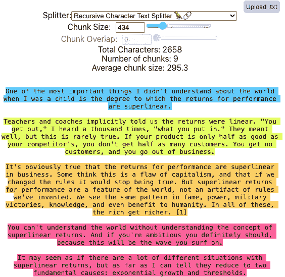
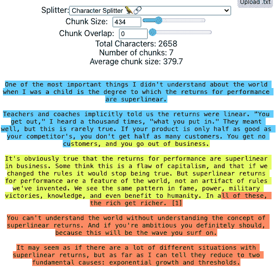

# 11（<st c="0">11</st>）

# 使用 LangChain 从 RAG 中获得更多（<st c="3">Using LangChain to Get More from RAG</st>）

我们已经提到过**LangChain**（<st c="40">We have mentioned</st> **<st c="59">LangChain</st>** <st c="68">several</st> <st c="76">times already, and we have shown you a lot of LangChain code, including code that implements the LangChain-specific language:</st> **<st c="203">LangChain Expression Language</st>** <st c="232">(</st>**<st c="234">LCEL</st>**<st c="238">).</st> <st c="242">Now that you are familiar with</st> <st c="272">different ways to implement</st> **<st c="301">retrieval-augmented generation</st>** <st c="331">(</st>**<st c="333">RAG</st>**<st c="336">) with LangChain, we thought now would be a good time to dive more into the various capabilities of LangChain that you can use to make your RAG</st> <st c="481">pipeline better.</st>）

在本章中，我们探讨了 LangChain 中一些不太为人所知但非常重要的组件，这些组件可以增强 RAG 应用（<st c="497">In this chapter, we explore lesser-known but highly important components in LangChain that can enhance a RAG application.</st> <st c="620">We will cover</st> <st c="634">the following:</st>）

+   用于从不同来源加载和处理文档的文档加载器（<st c="648">Document loaders for loading and processing documents from</st> <st c="708">different sources</st>）

+   用于将文档分割成适合检索的块的文字分割器（<st c="725">Text splitters for dividing documents into chunks suitable</st> <st c="785">for retrieval</st>）

+   用于结构化语言模型响应的输出解析器（<st c="798">Output parsers for structuring the responses from the</st> <st c="853">language model</st>）

我们将使用不同的代码实验室来逐步演示每种类型组件的示例，首先是文档加载器（<st c="867">We will use different code labs to step through examples of each type of component, starting with</st> <st c="966">document loaders.</st>）

# 技术要求（<st c="983">Technical requirements</st>）

本章的代码放置在以下 GitHub 仓库中：[`github.com/PacktPublishing/Unlocking-Data-with-Generative-AI-and-RAG/tree/main/Chapter_11`](https://github.com/PacktPublishing/Unlocking-Data-with-Generative-AI-and-RAG/tree/main/Chapter_11)（<st c="1006">The code for this chapter is placed in the following GitHub</st> <st c="1067">repository:</st> [<st c="1079">https://github.com/PacktPublishing/Unlocking-Data-with-Generative-AI-and-RAG/tree/main/Chapter_11</st>](https://github.com/PacktPublishing/Unlocking-Data-with-Generative-AI-and-RAG/tree/main/Chapter_11 )）

每个代码实验室的单独文件名在各自的章节中提到（<st c="1176">Individual file names for each code lab are mentioned in the</st> <st c="1238">respective sections.</st>）

# 代码实验室 11.1 – 文档加载器（<st c="1258">Code lab 11.1 – Document loaders</st>）

您需要从 GitHub 仓库访问的文件名为`<st c="1357">CHAPTER11-1_DOCUMENT_LOADERS.ipynb</st>`（<st c="1291">The file you need to</st> <st c="1313">access from the GitHub repository is</st> <st c="1350">titled</st> `<st c="1357">CHAPTER11-1_DOCUMENT_LOADERS.ipynb</st>`<st c="1391">.</st>）

文档加载器在访问、提取和拉取使我们的 RAG 应用功能的数据中起着关键作用（<st c="1392">Document loaders play a key role in accessing, extracting, and pulling in the data that makes our RAG application function.</st> <st c="1517">Document loaders are used to load and process documents from various sources such as text files, PDFs, web pages, or databases.</st> <st c="1645">They convert the documents into a format suitable for indexing</st> <st c="1708">and retrieval.</st>）

让我们安装一些新的包来支持我们的文档加载，正如你可能已经猜到的，这涉及到一些不同的文件格式相关的包（<st c="1722">Let’s install some</st> <st c="1741">new packages to support our document loading, which, as you might have guessed, involves some different file</st> <st c="1851">format-related packages:</st>）

```py
 %pip install bs4
%pip install python-docx
%pip install docx2txt
%pip install jq
```

<st c="1955">第一个可能看起来很熟悉，</st> `<st c="1989">bs4</st>` <st c="1992">(代表 Beautiful Soup 4)，因为我们曾在</st> *<st c="2034">第二章</st>* <st c="2043">用它来解析 HTML。</st> <st c="2062">我们还有一些与 Microsoft Word 相关的包，例如</st> `<st c="2128">python_docx</st>`<st c="2139">，它有助于创建和更新 Microsoft Word (</st>`<st c="2196">.docx</st>`<st c="2201">) 文件，以及</st> `<st c="2215">docx2txt</st>`<st c="2223">，它从</st> `<st c="2261">.docx</st>` <st c="2266">文件中提取文本和图像。</st> <st c="2274">`<st c="2278">jq</st>` <st c="2280">包是一个轻量级的</st> <st c="2306">JSON 处理器。</st>

<st c="2321">接下来，我们将采取一个额外的步骤，你可能不需要在</st> *<st c="2401">实际</st> * <st c="2405">情况下采取，即将我们的 PDF 文档转换为其他多种格式，以便我们可以测试这些格式的提取。</st> <st c="2534">我们将在 OpenAI 设置之后立即在我们的代码中添加一个全新的</st> `<st c="2566">文档加载器</st>` <st c="2582">部分。</st>

<st c="2632">在本节中，我们将提供生成文件的代码，然后是不同文档加载器和它们相关的包，用于从这些类型的文件中提取数据。</st> <st c="2804">目前，我们有一个文档的 PDF 版本。</st> <st c="2854">我们需要文档的 HTML/web 版本、Microsoft Word 版本和 JSON 版本。</st>

<st c="2949">我们将在 OpenAI 设置单元格下创建一个新的单元格，我们将导入进行这些转换所需的</st> <st c="3067">新包：</st>

```py
 from bs4 import BeautifulSoup
import docx
import json
```

<st c="3139">正如我们提到的，</st> `<st c="3161">BeautifulSoup</st>` <st c="3174">包帮助我们解析基于 HTML 的网页。</st> <st c="3220">我们还导入</st> `<st c="3235">docx</st>`<st c="3239">，它代表 Microsoft Docx 文档格式。</st> <st c="3301">最后，我们导入</st> `<st c="3319">json</st>` <st c="3323">来解释和管理</st> `<st c="3348">json</st>` <st c="3352">格式的代码。</st>

<st c="3368">接下来，我们想要确定我们将保存每种格式的</st> <st c="3431">文件名：</st>

```py
 pdf_path = "google-2023-environmental-report.pdf"
html_path = "google-2023-environmental-report.html"
word_path = "google-2023-environmental-report.docx"
json_path = "google-2023-environmental-report.json"
```

<st c="3649">在这里，我们</st> <st c="3663">定义了我们在代码中使用的每个文件的路径，稍后当我们使用加载器加载每个文档时。</st> <st c="3787">这些将是我们将从我们一直在使用的原始 PDF 文档中生成的最终文件。</st>

<st c="3892">然后，我们新代码的这个关键部分将提取 PDF 中的文本，并使用它来生成所有这些新类型的</st> <st c="4013">文档：</st>

```py
 with open(pdf_path, "rb") as pdf_file:
    pdf_reader = PdfReader(pdf_file)
    pdf_text = "".join(
        page.extract_text() for page in pdf_reader.pages)
    soup = BeautifulSoup("<html><body></body></html>",
                         "html.parser")
    soup.body.append(pdf_text)
    with open(html_path, "w",
              encoding="utf-8") as html_file:
                  html_file.write(str(soup))
                  doc = docx.Document()
                  doc.add_paragraph(pdf_text)
                  doc.save(word_path)
    with open(json_path, "w") as json_file:
        json.dump({"text": pdf_text}, json_file)
```

<st c="4497">我们在非常基本的意义上生成了文档的 HTML、Word 和 JSON 版本。</st> <st c="4581">如果您生成这些文档是为了在实际的管道中使用，我们建议应用更多的格式化和提取，但为了演示的目的，这将为我们提供</st> <st c="4779">必要的数据。</st>

<st c="4794">接下来，我们将在代码的索引阶段添加我们的文档加载器。</st> <st c="4813">我们已经使用过前两个文档加载器，我们将在本代码实验室中展示它们，但进行了更新，以便它们可以互换使用。</st> <st c="4880">对于每个文档加载器，我们展示了与加载器代码相关的特定于该加载器的包导入。</st> <st c="5031">在早期章节中，我们使用了一个直接从网站加载的 Web 加载器，因此如果您有这种情况，请参考该文档加载器。</st> <st c="5288">同时，我们在这里分享了一种略微不同的文档加载器，它专注于使用本地 HTML 文件，例如我们刚刚生成的文件。</st> <st c="5448">以下是此</st> <st c="5474">HTML 加载器的代码：</st>

```py
 from langchain_community.document_loaders import BSHTMLLoader
loader = BSHTMLLoader(html_path)
docs = loader.load()
```

<st c="5602">在这里，我们使用之前定义的 HTML 文件来加载 HTML 文档中的代码。</st> <st c="5689">最终的变量，</st> `<st c="5709">docs</st>`<st c="5713">，可以与在以下文档加载器中定义的任何其他</st> *<st c="5758">docs</st>* <st c="5762">互换使用。</st> <st c="5808">这种代码的工作方式是，您一次只能使用一个加载器，并且它会用其版本的文档替换 docs（包括一个元数据源标签，表明文档来自何处）。</st> <st c="5995">如果您运行此单元格，然后跳到运行拆分单元格，您可以在实验室中运行剩余的代码，并看到来自不同源文件类型相同数据的类似结果。</st> <st c="6195">我们后来在代码中不得不进行一些小的更新，我们将在</st> <st c="6272">稍后说明。</st>

<st c="6281">LangChain 网站上列出了一些备选的 HTML 加载器，您可以在以下链接中查看：</st> <st c="6367">[此处](https://python.langchain.com/v0.2/docs/how_to/document_loader_html/)</st>

[<st c="6376">https://python.langchain.com/v0.2/docs/how_to/document_loader_html/</st>](https://python.langchain.com/v0.2/docs/how_to/document_loader_html/ )

<st c="6444">接下来，我们将讨论的另一种文件类型是我们之前已经使用过的类型，</st> <st c="6536">即 PDF：</st>

```py
 from PyPDF2 import PdfReader
docs = []
with open(pdf_path, "rb") as pdf_file:
    pdf_reader = PdfReader(pdf_file)
    pdf_text = "".join(page.extract_text() for page in
               pdf_reader.pages)
    docs = [Document(page_content=page) for page in
            pdf_text.split("\n\n")]
```

<st c="6796">在这里，我们有我们之前用于从 PDF 中提取数据的代码的一个稍微精简的版本。</st> <st c="6813">使用这种新方法向您展示了访问这些数据的另一种方式，但无论哪种方式都可以在您的代码中工作，最终使用</st> `<st c="7105">PdfReader</st>` <st c="7114">从</st> `<st c="7120">PyPDF2</st>`<st c="7126">。</st>

<st c="7127">应该注意的是，有众多非常强大的方法可以将 PDF 文档加载到 LangChain 中，这得益于与许多流行 PDF 提取工具的集成。</st> <st c="7310">以下是一些方法：</st> `<st c="7326">PyPDF2</st>` <st c="7332">(我们在这里使用)，</st> `<st c="7353">PyPDF</st>`<st c="7358">,</st> `<st c="7360">PyMuPDF</st>`<st c="7367">,</st> `<st c="7369">MathPix</st>`<st c="7376">,</st> `<st c="7378">Unstructured</st>`<st c="7390">,</st> `<st c="7392">AzureAIDocumentIntelligenceLoader</st>`<st c="7425">,</st> <st c="7427">和</st> `<st c="7431">UpstageLayoutAnalysisLoader</st>`<st c="7458">。</st>

<st c="7459">我们建议您查看最新的 PDF 文档加载器列表。</st> <st c="7526">LangChain 在这里提供了一系列有用的教程，涵盖了其中许多：</st>

[<st c="7594">https://python.langchain.com/v0.2/docs/how_to/document_loader_pdf/</st>](https://python.langchain.com/v0.2/docs/how_to/document_loader_pdf/ )

<st c="7661">接下来，我们将从 Microsoft</st> <st c="7707">Word 文档中加载数据：</st>

```py
 from langchain_community.document_loaders import Docx2txtLoader
loader = Docx2txtLoader(word_path)
docs = loader.load()
```

<st c="7841">此代码使用了</st> `<st c="7861">Docx2txtLoader</st>` <st c="7875">文档加载器来自 LangChain，将我们之前生成的 Word 文档转换为文本并加载到我们的</st> `<st c="7991">docs</st>` <st c="7995">变量中，该变量可以稍后由分割器使用。</st> <st c="8045">同样，遍历其余代码将使用这些数据，就像它处理 HTML 或 PDF 文档一样。</st> <st c="8121">此外，还有许多加载 Word 文档的选项，您可以在以下位置找到列表：</st> [<st c="8254">https://python.langchain.com/v0.2/docs/integrations/document_loaders/microsoft_word/</st>](https://python.langchain.com/v0.2/docs/integrations/document_loaders/microsoft_word/ )

<st c="8338">最后，我们看到与 JSON 加载器类似的方法：</st>

```py
 from langchain_community.document_loaders import JSONLoader
loader = JSONLoader(
    file_path=json_path,
    jq_schema='.text',
)
docs = loader.load()
```

<st c="8538">在这里，我们使用 JSON 加载器加载存储在 JSON 对象格式中的数据，但结果是一样的：一个</st> `<st c="8652">docs</st>` <st c="8656">变量，可以传递给分割器并转换为我们在剩余代码中使用的格式。</st> <st c="8769">JSON 加载器的其他选项可以在以下位置找到：</st>

[<st c="8818">https://python.langchain.com/v0.2/docs/how_to/document_loader_json/</st>](https://python.langchain.com/v0.2/docs/how_to/document_loader_json/ )

<st c="8886">请注意，一些文档加载器会在生成文档对象的过程中向</st> `<st c="8950">metadata</st>` <st c="8958">字典中添加额外的元数据。</st> <st c="8981">当我们添加自己的元数据时，这会导致我们的代码出现一些问题。</st> <st c="9038">为了解决这个问题，我们在索引和创建向量存储时更新这些行：</st>

```py
 dense_documents = [Document(page_content=doc.page_content,
    metadata={"id": str(i), "search_source": "dense"}) for
        i, doc in enumerate(splits)]
sparse_documents = [Document(page_content=doc.page_content,
    metadata={"id": str(i), "search_source": "sparse"}) for
        i, doc in enumerate(splits)]
```

<st c="9475">我们还更新了最终输出中的代码以测试响应，将此代码的第二行更改为处理已更改的</st> `<st c="9602">元数据</st>` <st c="9610">标签：</st>

```py
 for i, doc in enumerate(retrieved_docs, start=1):
    print(f"Document {i}: Document ID: {doc.metadata['id']}
    source: {doc.metadata['source']}")
    print(f"Content:\n{doc.page_content}\n")
```

<st c="9797">运行每个加载器</st> <st c="9813">然后运行剩余的代码，以查看每个文档的实际效果！</st> <st c="9878">还有许多与第三方集成的例子，允许您访问几乎任何可以想象的数据源，并以一种更好地利用 LangChain 其他组件的方式格式化数据。</st> <st c="10089">在此 LangChain 网站上查看更多示例：</st> <st c="10140">网站：</st> [<st c="10149">https://python.langchain.com/docs/modules/data_connection/document_loaders/</st>](https://python.langchain.com/docs/modules/data_connection/document_loaders/ )

<st c="10224">文档加载器在您的 RAG 应用中扮演着支持和非常重要的角色。</st> <st c="10309">但对于通常利用</st> *<st c="10366">数据块</st>* <st c="10372">的 RAG 特定应用来说，直到您通过文本分割器处理它们之前，文档加载器几乎没有什么用处。</st> <st c="10474">接下来，我们将回顾文本分割器以及如何使用每个分割器来改进您的</st> <st c="10555">RAG 应用。</st>

# <st c="10571">代码实验室 11.2 – 文本分割器</st>

<st c="10602">您需要从 GitHub 仓库访问的文件名为</st> <st c="10661">标题为</st> `<st c="10668">CHAPTER11-2_TEXT_SPLITTERS.ipynb</st>`<st c="10700">。</st>

<st c="10701">文本分割器</st> <st c="10717">将文档分割成可用于检索的块。</st> <st c="10778">较大的文档对我们的 RAG 应用中的许多部分构成了威胁，分割器是我们的第一道防线。</st> <st c="10893">如果您能够将一个非常大的文档向量化，那么文档越大，在向量嵌入中丢失的上下文表示就越多。</st> <st c="11042">但这是假设您甚至能够将一个非常大的文档向量化，而这通常是不可能的！</st> <st c="11128">与许多我们处理的大文档相比，大多数嵌入模型对我们可以传递给它的文档大小有相对较小的限制。</st> <st c="11276">例如，我们用于生成嵌入的 OpenAI 模型的上下文长度为 8,191 个标记。</st> <st c="11386">如果我们尝试向模型传递比这更大的文档，它将生成一个错误。</st> <st c="11473">这些都是分割器存在的主要原因，但这些并不是在处理步骤中引入的唯一复杂性。</st>

<st c="11598">我们需要考虑的文本分割器的关键元素是它们如何分割文本。</st> <st c="11615">假设你想要分割 100 个段落。</st> <st c="11680">在某些情况下，可能有两三个段落在语义上应该放在一起，比如这个部分中的段落。</st> <st c="11741">在某些情况下，你可能有一个章节标题、一个 URL 或某些其他类型的文本。</st> <st c="11870">理想情况下，你希望将语义相关的文本片段放在一起，但这可能比最初看起来要复杂得多！</st> <st c="11950">为了一个现实世界的例子，请访问这个网站并</st> <st c="12081">复制一大块</st> <st c="12138">文本：</st> [<st c="12167">https://chunkviz.up.railway.app/</st>](https://chunkviz.up.railway.app/)<st c="12199">。</st>

<st c="12200">ChunkViz 是由 Greg Kamradt 创建的一个</st> <st c="12215">实用工具，帮助你可视化你的文本分割器是如何工作的。</st> <st c="12307">更改分割器的参数以使用我们正在使用的参数：块大小为</st> `<st c="12389">1000</st>` <st c="12393">和块重叠为</st> `<st c="12417">200</st>`<st c="12420">。尝试与递归字符文本分割器相比的字符分割器。</st> <st c="12500">请注意，他们提供的示例显示在</st> *<st c="12549">图 11</st>**<st c="12558">.1</st>*<st c="12560">中，递归字符分割器在约</st> `<st c="12649">434</st>` <st c="12652">块大小处分别捕获了所有段落：</st>



<st c="13572">图 11.1 – 递归字符文本分割器在 434 个字符处捕获整个段落</st>

<st c="13663">随着块大小的增加，它很好地保持在段落分割上，但最终每个块中会有越来越多的段落。</st> <st c="13790">然而，请注意，这会因不同的文本而异。</st> <st c="13859">如果你有非常长的段落文本，你需要更大的块设置来捕获</st> <st c="13951">整个段落。</st>

<st c="13968">同时，如果你尝试字符分割器，它将在任何设置下在句子的中间切断：</st>



<st c="14652">图 11.2 – 字符分割器在 434 个字符处捕获部分段落</st>

<st c="14730">这个句子的分割可能会对你的块捕获其中所有重要语义意义的能力产生重大影响。</st> <st c="14893">你可以通过改变块重叠来抵消这一点，但你仍然会有部分段落，这将对你的 LLM 来说等同于噪音，分散了它提供</st> <st c="15062">最佳响应的能力。</st>

<st c="15079">让我们逐步分析每个实际的编码示例，以了解一些可用的</st> <st c="15156">选项。</st>

## <st c="15174">字符文本分割器</st>

<st c="15198">这是分割你的文档的最简单方法。</st> <st c="15211">文本分割器允许你将文本分割成任意 N 字符大小的块。</st> <st c="15257">你可以通过添加一个分隔符参数稍微改进这一点，例如</st> `<st c="15417">\n</st>`<st c="15419">。但这是一个了解块分割工作原理的好起点，然后我们可以转向更有效但增加了复杂性的方法。</st>

<st c="15584">这里有一个</st> <st c="15593">使用</st> `<st c="15612">CharacterTextSplitter</st>` <st c="15633">对象与我们的文档的代码，这些文档可以与其他</st> <st c="15692">分割器输出</st> <st c="15633">互换使用：</st>

```py
 from langchain_text_splitters import CharacterTextSplitter
text_splitter = CharacterTextSplitter(
    separator="\n",
    chunk_size=1000,
    chunk_overlap=200,
    is_separator_regex=False,
)
splits = text_splitter.split_documents(docs)
```

<st c="15948">第一次分割的输出（</st>`<st c="15982">split[0]</st>`<st c="15991">）看起来</st> <st c="16000">像这样：</st>

```py
 Document(page_content=<st c="16033">'Environmental \nReport\n2023What's \ninside\nAbout this report\nGoogle's 2023 Environmental Report provides an overview of our environmental \nsustainability strategy and targets and our annual progress towards them.\u20091  \nThis report features data, performance highlights, and progress against our targets from our 2022 fiscal year (January 1 to December 31, 2022).</st> <st c="16405">It also mentions some notable achievements from the first half of 2023\.</st> <st c="16477">After two years of condensed reporting, we're sharing a deeper dive into our approach in one place.\nADDITIONAL RESOURCES\n• 2023 Environmental Report: Executive Summary\n• Sustainability.google\n• Sustainability reports\n• Sustainability blog\n• Our commitments\n• Alphabet environmental, social, and governance (ESG)\n• About GoogleIntroduction  3\nExecutive letters  4\nHighlights  6\nOur sustainability strategy 7\nTargets and progress summary 8\nEmerging opportunities 9\nEmpowering individuals  12\nOur ambition 13\nOur appr\noach 13\nHelp in\ng people make  14</st>')
```

<st c="17042">有很多</st> `<st c="17062">\n</st>` <st c="17064">(也称为换行符) 标记字符，还有一些</st> `<st c="17115">\u</st>` <st c="17117">也是如此。</st> <st c="17127">我们看到它大约计数了 1,000 个字符，找到</st> `<st c="17188">\n</st>` <st c="17190">最近的字符，然后</st> <st c="17227">它成为第一个块。</st> <st c="17252">它位于句子的中间，这可能会</st> <st c="17305">有问题！</st>

<st c="17320">下一个</st> <st c="17330">块看起来</st> <st c="17342">像这样：</st>

```py
 Document(page_content=<st c="17375">'Highlights  6\nOur sustainability strategy 7\nTargets and progress summary 8\nEmerging opportunities 9\nEmpowering individuals  12\nOur ambition 13\nOur appr\noach 13\nHelp in\ng people make  14 \nmore sustainable choices  \nReducing home energy use 14\nProviding sustainable  \ntrans\nportation options  17 \nShari\nng other actionable information 19\nThe journey ahead  19\nWorking together 20\nOur ambition 21\nOur approach 21\nSupporting partners</st> <st c="17820">22\nInvesting in breakthrough innovation 28\nCreating ecosystems for collaboration  29\nThe journey ahead  30Operating sustainably 31\nOur ambiti\non 32\nOur oper a\ntions  32\nNet-\nzero c\narbon  33\nWater stewardship 49\nCircular econom\ny 55\nNature and biodiversity 67\nSpotlight: Building a more sustainable  \ncam\npus in Mountain View73 \nGovernance and engagement  75\nAbout Google\n 76\nSustainab i\nlity governance  76\nRisk management  77\nStakeholder engagement  78\nPublic policy and advocacy</st> <st c="18318">79\nPartnerships  83\nAwards and recognition 84\nAppendix  85</st>')
```

<st c="18381">正如你所见，它稍微回溯了一点，这是由于我们设置的 200 个字符的块重叠。</st> <st c="18488">然后它从那里再向前移动 1,000 个字符，并在另一个</st> `<st c="18567">\</st>``<st c="18568">n</st>` <st c="18569">字符处断开。</st>

<st c="18580">让我们逐步分析这个</st> <st c="18615">参数：</st>

+   `<st c="18730">\n</st>`<st c="18732">，并且它适用于这份文档。</st> <st c="18766">但是如果你在这个特定文档中使用</st> `<st c="18781">\n\n</st>` <st c="18785">(双换行符字符) 作为分隔符，而在这个文档中没有双换行符，它永远不会分割！</st> `<st c="18928">\n\n</st>` <st c="18932">实际上是默认值，所以请确保你注意这一点，并使用一个与</st> <st c="19035">你的内容兼容的分隔符！</st>

+   **<st c="19048">块大小</st>** <st c="19059">– 这</st> <st c="19067">定义了你希望块大小达到的任意字符数。</st> <st c="19151">这可能会有些变化，例如在文本的末尾，但大部分块将保持这个大小。</st>

+   **<st c="19269">块重叠</st>** <st c="19283">– 这是</st> <st c="19293">你希望在顺序块中重叠的字符数量。</st> <st c="19373">这是一种确保你捕捉到块内所有上下文的简单方法。</st> <st c="19457">例如，如果你没有块重叠并且将句子切半，那么大部分上下文可能都不会很好地被两个块捕捉到。</st> <st c="19611">但是，有了重叠，你可以在边缘获得更好的上下文覆盖。</st>

+   **<st c="19686">分隔符正则表达式</st>** <st c="19705">– 这是</st> <st c="19715">另一个参数，表示所使用的分隔符是否为</st> <st c="19786">正则表达式格式。</st>

<st c="19799">在这种情况下，我们将块大小设置为</st> `<st c="19847">1000</st>` <st c="19851">并将块重叠设置为</st> `<st c="19877">200</st>`<st c="19880">. 这段代码所表达的意思是我们希望使用小于 1,000 个字符的块，但具有 200 个字符的重叠。</st> <st c="20027">这种重叠技术类似于你在</st> **<st c="20108">卷积神经网络</st>** <st c="20137">(</st>**<st c="20139">CNNs</st>**<st c="20143">) 中看到的滑动窗口技术，当你</st> <st c="20150">*<st c="20159">滑动</st>* <st c="20166">窗口覆盖图像的较小部分并重叠时，以便捕捉不同窗口之间的上下文。</st> <st c="20286">在这种情况下，我们试图捕捉的是块内的上下文。</st>

<st c="20366">以下是一些其他需要注意的事项：</st>

+   `<st c="20449">文档</st>` <st c="20457">对象来存储我们的文本，因此我们使用</st> `<st c="20498">create_documents</st>` <st c="20514">函数，以便在文档向量化时在下一步中使用它。</st> <st c="20601">如果你想直接获取字符串内容，可以使用</st> `<st c="20668">split_text</st>` <st c="20678">函数。</st>

+   `<st c="20723">create_documents</st>` <st c="20739">期望一个文本列表，所以如果你只有一个字符串，你需要将其包裹在</st> `<st c="20821">[]</st>`<st c="20823">. 在我们的例子中，我们已经将</st> `<st c="20858">docs</st>` <st c="20862">设置为一个列表，所以这个要求</st> <st c="20894">已经满足。</st>

+   **<st c="20907">分割与分块</st>** <st c="20933">– 这些术语可以</st> <st c="20955">互换使用。</st>

<st c="20976">你可以在 LangChain</st> <st c="21058">网站上找到有关此特定文本分割器的更多信息：</st> [<st c="21067">https://python.langchain.com/v0.2/docs/how_to/character_text_splitter/</st>](https://python.langchain.com/v0.2/docs/how_to/character_text_splitter/ )

<st c="21137">API 文档可以在</st> <st c="21173">这里找到：</st> [<st c="21179">https://api.python.langchain.com/en/latest/character/langchain_text_splitters.character.CharacterTextSplitter.html</st>](https://api.python.langchain.com/en/latest/character/langchain_text_splitters.character.CharacterTextSplitter.html )

<st c="21293">我们可以做得更好；让我们看看一种更复杂的方法，称为</st> **<st c="21387">递归字符</st>** **<st c="21407">文本拆分</st>**<st c="21421">。</st>

## <st c="21422">递归字符文本拆分器</st>

<st c="21456">我们已经</st> <st c="21464">见过这个了！</st> <st c="21487">到目前为止，在我们的代码实验室中，我们最常使用这个</st> <st c="21505">拆分器，因为它正是 LangChain 推荐用于拆分通用文本的。</st> <st c="21622">这正是我们</st> <st c="21638">所做的事情！</st>

<st c="21648">正如其名所示，这个</st> <st c="21673">拆分器会递归地拆分文本，目的是将相关的文本片段放在一起。</st> <st c="21781">你可以传递一个字符列表作为参数，并且它会尝试按顺序拆分这些字符，直到块的大小足够小。</st> <st c="21916">默认列表是</st> `<st c="21936">["\n\n", "\n", " ", ""]</st>`<st c="21959">，这效果很好，但我们打算也将</st> `<st c="22003">"。</st> <st c="22006">"</st>` <st c="22007">添加到这个列表中。</st> <st c="22030">这会使得尝试将所有段落、由</st> `<st c="22119">"\n"</st>` <st c="22123">和</st> `<st c="22128">"。</st> <st c="22131">"</st>`<st c="22132">定义的句子，以及尽可能长的单词</st> <st c="22152">放在一起。</st>

<st c="22164">以下是</st> <st c="22173">我们的代码：</st>

```py
 recursive_splitter = RecursiveCharacterTextSplitter(
    separators=["\n\n", "\n", ". ", " ", ""],
    chunk_size=1000,
    chunk_overlap=200
)
splits = character_splitter.split_documents(docs)
```

<st c="22364">在这个拆分器内部，块是基于</st> `<st c="22434">"\n\n"</st>` <st c="22440">分隔符拆分的，代表段落拆分。</st> <st c="22483">但它不会停止在这里；它还会查看块的大小，如果它大于我们设置的 1,000，那么它将使用下一个分隔符（</st>`<st c="22629">"\n"</st>`<st c="22634">），以此类推。</st>

<st c="22648">让我们谈谈</st> <st c="22660">这个递归方面，它使用递归算法将文本拆分成块。</st> <st c="22757">只有当提供的文本长度超过块大小时，算法才会被应用，但它遵循</st> <st c="22859">以下步骤：</st>

1.  <st c="22871">它会在范围</st> `<st c="22934">[chunk_size - chunk_overlap, chunk_size]</st>`<st c="22974">内找到最后一个空格或换行符。这确保了块会在单词边界或</st> <st c="23033">行中断开。</st>

1.  <st c="23045">如果找到一个合适的拆分点，它会将文本拆分为两部分：拆分点之前的块和拆分点之后的剩余文本。</st>

1.  <st c="23195">它递归地应用相同的分割过程到剩余的文本中，直到所有块都在</st> `<st c="23300">chunk_size</st>` <st c="23310">限制内。</st>

<st c="23317">与字符分割方法类似，递归分割器主要是由你设置的块大小驱动的，但它将此与之前概述的递归方法结合起来，提供了一种简单且逻辑的方法来正确地捕获你块中的上下文。</st> <st c="23584">你的块。</st>

`<st c="23596">RecursiveCharacterTextSplitter</st>` <st c="23627">在处理需要通过具有输入大小限制的语言模型处理的较大文本文档时特别有用。</st> <st c="23764">通过将文本分割成更小的块，您可以单独将块喂给语言模型，然后在需要时将结果</st> <st c="23895">组合起来。</st>

<st c="23905">显然，递归分割器比字符分割器更进了一步，但它们仍然不是基于语义来分割我们的内容，而是基于一般的分隔符，如段落和句子断句。</st> <st c="24120">但这不会处理两个段落在语义上属于一个持续思考的情况，这些段落实际上应该在它们的向量表示中一起捕获。</st> <st c="24290">让我们看看我们是否可以用</st> **<st c="24334">语义块分割器</st>**<st c="24350">做得更好。</st>

## <st c="24351">语义块分割器</st>

<st c="24368">这是</st> <st c="24376">另一个你可能认识到的，因为我们已经在第一个代码实验室中使用过它了！</st> `<st c="24445">SemanticChunker</st>` <st c="24460">是一个有趣的工具，目前列为实验性，但在 LangChain 网站上描述如下：“</st>*<st c="24570">首先在句子上分割。</st> <st c="24598">然后（它）如果它们在语义上足够相似，就合并相邻的句子</st>*<st c="24680">。”换句话说，这里的目的是避免定义这个任意的块大小数字</st> <st c="24775">，这是一个关键参数，它驱动着字符和递归分割器如何分割文本，并使分割更关注于你正在分割的文本的语义。</st> <st c="24944">在 LangChain</st> <st c="24969">网站上了解更多关于这个</st> *<st c="24976">分割器</st> * <st c="24994">的信息：</st> [<st c="25003">https://python.langchain.com/docs/modules/data_connection/document_transformers/semantic-chunker</st>](https://python.langchain.com/docs/modules/data_connection/document_transformers/semantic-chunker )

<st c="25099">在底层，</st> `<st c="25116">SemanticChunker</st>` <st c="25131">将你的文本分割成句子，将这些句子分成三句一组，然后在它们在</st> <st c="25270">嵌入空间中相似时将它们合并。</st>

<st c="25286">这种情况下不会像预期那样有效吗？</st> <st c="25321">当你的文档语义难以辨别时。</st> <st c="25382">例如，如果你有很多代码、地址、名称、内部参考 ID 和其他对嵌入模型来说语义意义很小的文本，这可能会降低</st> `<st c="25586">SemanticChunker</st>` <st c="25601">正确分割你的文本的能力。</st> <st c="25631">但总的来说，</st> `<st c="25647">SemanticChunker</st>` <st c="25662">有很大的潜力。</st> <st c="25685">以下是一个使用它的代码示例：</st> <st c="25719">：</st>

```py
 from langchain_experimental.text_splitter import SemanticChunker
embedding_function = OpenAIEmbeddings()
semantic_splitter = SemanticChunker(embedding_function,
    number_of_chunks=200)
splits = semantic_splitter.split_documents(docs)
```

<st c="25958">在这里，我们从</st> `<st c="25979">SemanticChunker</st>` <st c="25994">类从</st> `<st c="26010">langchain_experimental.text_splitter</st>` <st c="26046">模块。</st> <st c="26055">我们使用与我们将文档向量化并传递给</st> `<st c="26143">SemanticChunker</st>` <st c="26158">类相同的嵌入模型。</st> <st c="26166">请注意，这会花费一点钱，因为它使用了我们用于生成嵌入的相同的 OpenAI API 密钥。</st> `<st c="26274">SemanticChunker</st>` <st c="26289">使用这些嵌入来确定如何根据语义相似度分割文档。</st> <st c="26382">我们还设置了</st> `<st c="26398">number_of_chunks</st>` <st c="26414">变量为</st> `<st c="26427">200</st>`<st c="26430">，这表示希望将文档分割成多少个块。</st> <st c="26506">这决定了分割过程的粒度。</st> <st c="26564">`<st c="26582">number_of_chunks</st>` <st c="26598">`的值越高，分割将越细粒度，而较低的值将产生更少且</st> <st c="26683">更大的块。</st>

<st c="26697">这个</st> <st c="26702">代码实验室</st> <st c="26712">被设置为一次使用每种类型的分割器。</st> <st c="26775">运行每个分割器，然后运行剩余的代码，看看每个分割器如何影响你的结果。</st> <st c="26873">还可以尝试更改参数设置，例如</st> `<st c="26919">chunk_size</st>`<st c="26929">，</st> `<st c="26931">chunk_overlap</st>` <st c="26944">和</st> `<st c="26949">number_of_chunks</st>`<st c="26965">，具体取决于你使用的分割器。</st> <st c="27009">探索所有这些选项将帮助你更好地了解它们如何用于</st> <st c="27102">你的项目。</st>

<st c="27116">作为最后一个支持组件，我们将讨论输出解析器，它们负责从我们的</st> <st c="27232">RAG 应用</st> <st c="27232">中塑造最终输出。</st>

# <st c="27248">代码实验室 11.3 – 输出解析器</st>

<st c="27279">你需要从 GitHub 仓库访问的文件</st> <st c="27338">被命名为</st> `<st c="27345">CHAPTER11-3_OUTPUT_PARSERS.ipynb</st>`<st c="27377">。</st>

<st c="27378">任何 RAG 应用程序的最终结果都将是文本，可能还有一些格式、元数据和一些其他相关数据。</st> <st c="27517">这种输出通常来自 LLM 本身。</st> <st c="27566">但有时你希望得到比文本更结构化的格式。</st> <st c="27648">输出解析器是帮助在 RAG 应用程序中 LLM 的任何使用位置结构化响应的类。</st> <st c="27768">此提供的输出将随后提供给链中的下一个步骤，或者在我们的所有代码实验室中，作为模型的最终输出。</st>

<st c="27926">我们将同时介绍两种不同的输出解析器，并在我们的 RAG 管道的不同时间使用它们。</st> <st c="28041">我们首先介绍我们熟悉的解析器，即字符串</st> <st c="28086">输出解析器。</st>

<st c="28100">在</st> `<st c="28111">relevance_prompt</st>` <st c="28127">函数下，将此代码添加到一个</st> <st c="28157">新单元格中：</st>

```py
 from langchain_core.output_parsers import StrOutputParser
str_output_parser = StrOutputParser()
```

<st c="28262">请注意，我们已经在稍后出现的 LangChain 链代码中使用了这个功能，但我们将把这个解析器分配给一个名为</st> `<st c="28408">str_output_parser</st>`<st c="28425">的变量。让我们更深入地讨论这种解析器。</st>

## <st c="28478">字符串输出解析器</st>

<st c="28499">这是一个</st> <st c="28510">基本的输出解析器。</st> <st c="28531">在非常简单的方法中，就像我们之前的代码实验室一样，你可以直接使用</st> `<st c="28604">StrOutputParser</st>` <st c="28619">类作为</st> <st c="28638">你的输出解析器的实例。</st> <st c="28675">或者，你可以像我们刚才做的那样，将其分配给一个变量，特别是如果你预期在代码的多个区域看到它，我们将会这样做。</st> <st c="28818">但我们已经多次看到这种情况了。</st> <st c="28860">它从 LLM 在两个地方的使用中获取输出，并将 LLM 的字符串响应输出到链中的下一个链接。</st> <st c="28995">有关此解析器的文档可以在</st> <st c="29042">这里找到：</st> [<st c="29048">https://api.python.langchain.com/en/latest/output_parsers/langchain_core.output_parsers.string.StrOutputParser.html#langchain_core.output_parsers.string.StrOutputParser</st>](https://api.python.langchain.com/en/latest/output_parsers/langchain_core.output_parsers.string.StrOutputParser.html#langchain_core.output_parsers.string.StrOutputParser )

<st c="29216">让我们看看一种新的解析器类型，JSON</st> <st c="29262">输出解析器。</st>

## <st c="29276">JSON 输出解析器</st>

<st c="29295">正如你所想，这个输出解析器从</st> <st c="29302">LLM</st> <st c="29355">那里获取输入，并以 JSON 格式输出。</st> <st c="29383">需要注意的是，你可能不需要这个解析器，因为许多新的模型提供商支持内置的返回结构化输出（如 JSON 和 XML）的方式。</st> <st c="29544">这种方法是为那些</st> <st c="29576">不支持此功能的人准备的。</st>

<st c="29583">我们首先添加一些新的导入，这些导入来自我们之前已安装的 LangChain 库（</st>`<st c="29669">langchain_core</st>`<st c="29695">）：</st>

```py
 from langchain_core.output_parsers import JsonOutputParser
from langchain_core.pydantic_v1 import BaseModel, Field
from langchain_core.outputs import Generation
import json
```

<st c="29871">这些行从</st> `<st c="29934">langchain_core</st>` <st c="29949">库和</st> `<st c="29965">json</st>` <st c="29969">模块中导入必要的类和模块。</st> `<st c="29978">JsonOutputParser</st>` <st c="29994">用于解析 JSON 输出。</st> `<st c="30029">BaseModel</st>` <st c="30038">和</st> `<st c="30043">Field</st>` <st c="30048">用于定义 JSON 输出模型的结构。</st> `<st c="30108">Generation</st>` <st c="30118">用于表示生成的输出。</st> <st c="30162">不出所料，我们导入了一个用于</st> `<st c="30208">json</st>`<st c="30212">的包，以便更好地管理我们的</st> <st c="30247">JSON 输入/输出。</st>

<st c="30267">接下来，我们将创建一个名为</st> `<st c="30313">FinalOutputModel</st>` <st c="30329">的 Pydantic 模型，它表示 JSON 输出的结构：</st>

```py
 class FinalOutputModel(BaseModel):
    relevance_score: float = Field(description="The
        relevance score of the retrieved context to the
        question")
    answer: str = Field(description="The final answer to
        the question")
```

<st c="30589">它有两个</st> <st c="30601">字段：</st> `<st c="30609">relevance_score</st>` <st c="30624">(浮点数) 和</st> `<st c="30637">answer</st>` <st c="30643">(字符串)，以及它们的描述。</st> <st c="30685">在实际应用中，这个模型可能会</st> *<st c="30690">变得更加复杂</st>*，但这也为你提供了一个如何定义它的基本概念。</st>

<st c="30832">接下来，我们将创建一个</st> `<st c="30873">JsonOutputParser</st>` <st c="30889">解析器的实例：</st>

```py
 json_parser = JsonOutputParser(
    pydantic_model=FinalOutputModel)
```

<st c="30962">这一行将</st> `<st c="30981">JsonOutputParser</st>` <st c="30997">与</st> `<st c="31007">FinalOutputModel</st>` <st c="31023">类作为参数分配给</st> `<st c="31048">json_parser</st>` <st c="31059">，以便在代码中稍后使用此解析器时使用。</st>

<st c="31118">接下来，我们将在两个其他辅助函数之间添加一个新函数，然后我们将更新</st> `<st c="31230">conditional_answer</st>` <st c="31248">以使用该新函数。</st> <st c="31275">此代码位于现有的</st> `<st c="31309">extract_score</st>` <st c="31322">函数之下，该函数保持不变：</st>

```py
 def format_json_output(x):
    # print(x)
    json_output = {"relevance_score":extract_score(
        x['relevance_score']),"answer": x['answer'],
    }
    return json_parser.parse_result(
        [Generation(text=json.dumps(json_output))])
```

<st c="31566">这个</st> `<st c="31572">format_json_output</st>` <st c="31590">函数接受一个字典</st> `<st c="31620">x</st>`<st c="31621">，并将其格式化为 JSON 输出。</st> <st c="31667">它创建一个</st> `<st c="31680">json_output</st>` <st c="31691">字典，包含两个键：</st> `<st c="31718">"relevance_score"</st>` <st c="31735">(通过调用</st> `<st c="31757">extract_score</st>` <st c="31770">从</st> `<st c="31778">'relevance_score</st>`<st c="31794">’值中获取</st> `<st c="31808">x</st>`<st c="31809">) 和</st> `<st c="31815">"answer"</st>` <st c="31823">(直接从</st> `<st c="31845">x</st>`<st c="31846">中获取)。</st> <st c="31849">然后，它使用</st> `<st c="31862">json.dumps</st>` <st c="31872">将</st> `<st c="31888">json_output</st>` <st c="31899">字典转换为 JSON 字符串，并创建一个包含该 JSON 字符串的</st> `<st c="31942">Generation</st>` <st c="31952">对象。</st> <st c="31994">最后，它使用</st> `<st c="32011">json_parser</st>` <st c="32022">解析</st> `<st c="32036">Generation</st>` <st c="32046">对象，并返回解析后的结果。</st>

<st c="32084">我们</st> <st c="32092">需要在之前使用的函数中引用这个函数，即</st> `<st c="32148">conditional_answer</st>`<st c="32185">。按照以下方式更新</st> `<st c="32194">conditional_answer</st>` <st c="32212">：</st>

```py
 def conditional_answer(x):
    relevance_score = extract_score(x['relevance_score'])
    if relevance_score < 4:
        return "I don't know." else:
        return format_json_output(x)
```

<st c="32386">在这里，我们更新了</st> `<st c="32407">conditional_answer</st>` <st c="32425">函数，以便在它确定答案相关且在提供</st> `<st c="32449">format_json_output</st>` <st c="32467">函数之前，应用该</st> `<st c="32449">format_json_output</st>` <st c="32467">函数。</st>

<st c="32560">接下来，我们将把之前在代码中使用的两个链合并成一个更大的链，以处理整个</st> `<st c="32698">管道。</st>` <st c="32698">在过去，将这部分单独展示有助于更专注于某些区域，但现在我们有了一个机会来清理并展示这些链如何组合在一起来处理我们的整个</st> `<st c="32895">逻辑流程：</st>`

```py
 rag_chain = (
    RunnableParallel({"context": ensemble_retriever,
        "question": RunnablePassthrough()})
    | RunnablePassthrough.assign(context=(lambda x:
        format_docs(x["context"])))
    | RunnableParallel({"relevance_score": (
          RunnablePassthrough()
          | (lambda x: relevance_prompt_template.format(
                 question=x["question"],
                 retrieved_context=x["context"]
                 )
             )
             | llm
             | str_output_parser
        ),
        "answer": (
            RunnablePassthrough()
            | prompt
            | llm
            | str_output_parser
            ),
        }
    )
    | RunnablePassthrough().assign(
         final_result=conditional_answer)
)
```

<st c="33422">如果你</st> <st c="33429">回顾之前的代码实验室，这被表示为两个链。</st> <st c="33483">请注意，这里使用的是</st> `<st c="33523">str_output_parser</st>` <st c="33540">，与之前的方式相同。</st> <st c="33572">你在这里看不到 JSON 解析器，因为它是在</st> `<st c="33637">format_json_output</st>` <st c="33655">函数中应用的，该函数是从</st> `<st c="33691">conditional_answer</st>` <st c="33709">函数中调用的，你可以在最后一行看到这个函数。</st> <st c="33752">这种简化这些链的方法适用于这个示例，它专注于将我们的输出解析为 JSON，但我们应注意的是，我们确实失去了之前代码实验室中使用的上下文。</st> <st c="33941">这实际上只是设置我们的链（s）的另一种方法的示例。</st>

<st c="34026">最后，由于我们的最终输出是 JSON 格式，我们需要添加上下文，因此我们需要更新我们的</st> *<st c="34140">测试</st>* *<st c="34145">运行</st> <st c="34148">代码：</st>

```py
 result = rag_chain.invoke(user_query)
print(f"Original Question: {user_query}\n")
print(f"Relevance Score: {result['relevance_score']}\n")
print(f"Final Answer:\n{result[
    'final_result']['answer']}\n\n")
print(f"Final JSON Output:\n{result}\n\n")
```

<st c="34401">当我们</st> <st c="34407">打印出这个结果时，我们看到的结果与之前类似，但我们展示了如何以 JSON 格式展示最终的</st> <st c="34507">输出：</st>

```py
 Original Question: What are Google's environmental initiatives? Relevance Score: 5
Final Answer:
Google's environmental initiatives include empowering individuals to take action, working together with partners and customers, operating sustainably… [TRUNCATED]
Final JSON Output:
{
'relevance_score': '5',
'answer': "Google's environmental initiatives include empowering individuals to take action, working together with partners and customers, operating sustainably, achieving net-zero carbon emissions, water stewardship, engaging in a circular economy, and supporting sustainable consumption of public goods. They also engage with suppliers to reduce energy consumption and greenhouse gas emissions, report environmental data, and assess environmental criteria. Google is involved in various sustainability initiatives, such as the iMasons Climate Accord, ReFED, and projects with The Nature Conservancy. They also invest in breakthrough innovation and support sustainability-focused accelerators. Additionally, Google focuses on renewable energy, data analytics tools for sustainability, and AI for sustainability to drive more intelligent supply chains.",
'final_result': {
     'relevance_score': 5.0,
     'answer': "Google's environmental initiatives include empowering individuals to take action, working together with partners and customers, operating sustainably, achieving net-zero carbon emissions, water stewardship, engaging in a circular economy, and supporting sustainable consumption of public goods. They also engage with suppliers to reduce energy consumption and greenhouse gas emissions, report environmental data, and assess environmental criteria. Google is involved in various sustainability initiatives, such as the iMasons Climate Accord, ReFED, and projects with The Nature Conservancy. They also invest in breakthrough innovation and support sustainability-focused accelerators. Additionally, Google focuses on renewable energy, data analytics tools for sustainability, and AI for sustainability to drive more intelligent supply chains." }
}
```

<st c="36580">这是一个</st> <st c="36591">简单的 JSON 输出示例，但你可以在其基础上</st> <st c="36651">构建并使用</st> `<st c="36701">FinalOutputModel</st>` <st c="36717">类来调整 JSON 格式，以满足你的需求。</st> <st c="36755">我们定义了这个类并将其传递给我们的输出解析器。</st>

<st c="36769">你可以在以下链接中找到有关 JSON 解析器的更多信息：</st> <st c="36822">[这里](https://python.langchain.com/v0.2/docs/how_to/output_parser_json/)</st> [<st c="36828">https://python.langchain.com/v0.2/docs/how_to/output_parser_json/</st>](https://python.langchain.com/v0.2/docs/how_to/output_parser_json/ )

<st c="36893">需要注意的是，很难依赖 LLMs 以特定格式输出。</st> <st c="36986">一个更健壮的系统会将解析器更深入地集成到系统中，这样它可能能够更好地利用 JSON 输出，但这也意味着需要更多的检查来确保格式符合下一步操作对正确格式 JSON 的要求。</st> <st c="37177">格式</st> <st c="37187">必须符合要求，以便正确地处理 JSON。</st> <st c="37258">在我们的代码中，我们实现了一个非常轻量级的 JSON 格式化层，以展示输出解析器如何以非常简单的方式集成到我们的 RAG 应用中。</st> <st c="37411">。</st>

# <st c="37422">摘要</st>

<st c="37430">在本章中，我们了解了 LangChain 中可以增强 RAG 应用的各个组件。</st> *<st c="37533">代码实验室 11.1</st>* <st c="37546">专注于文档加载器，这些加载器用于从各种来源（如文本文件、PDF、网页或数据库）加载和处理文档。</st> <st c="37693">本章涵盖了使用不同的 LangChain 文档加载器从 HTML、PDF、Microsoft Word 和 JSON 格式加载文档的示例，并指出某些文档加载器会添加元数据，这可能在代码中需要进行调整。</st>

*<st c="37925">代码实验室 11.2</st>* <st c="37939">讨论了文本分割器，这些分割器将文档分割成适合检索的块，解决了大型文档和向量嵌入中的上下文表示问题。</st> <st c="38113">本章涵盖了</st> `<st c="38133">CharacterTextSplitter</st>`<st c="38154">，它将文本分割成任意 N 字符大小的块，以及</st> `<st c="38219">RecursiveCharacterTextSplitter</st>`<st c="38249">，它递归分割文本同时尝试将相关部分保持在一起。</st> `<st c="38327">SemanticChunker</st>` <st c="38342">被介绍为一个实验性的分割器，它将语义相似的句子组合成更具</st> <st c="38446">意义的块。</st>

<st c="38464">最后，</st> *<st c="38473">代码实验室 11.3</st>* <st c="38486">专注于输出解析器，它将语言模型在 RAG 应用中的响应结构化。</st> <st c="38590">本章涵盖了字符串输出解析器，它将 LLM 的响应输出为字符串，以及 JSON 输出解析器，它使用定义的结构将输出格式化为 JSON。</st> <st c="38770">提供了一个示例，展示了如何将 JSON 输出解析器集成到</st> <st c="38856">RAG 应用中。</st>

<st c="38872">在下一章中，我们将介绍一个相对高级但非常强大的主题，LangGraph 和</st> <st c="38969">AI 代理。</st>

# <st c="0">第三部分 – 实施高级 RAG</st>

<st c="35">在本部分，您将学习增强您的 RAG 应用的高级技术，包括将 AI 代理与 LangGraph 集成以实现更复杂的控制流，利用提示工程策略优化检索和生成，以及探索查询扩展、查询分解和多模态 RAG 等前沿方法。</st> <st c="391">您将通过代码实验室获得这些技术的实践经验，并发现涵盖索引、检索、生成以及整个</st> <st c="575">RAG 流程</st>的丰富方法。

<st c="588">本部分包含以下章节：</st>

+   *<st c="631">第十二章</st>*<st c="642">，*<st c="644">结合 RAG 与 AI 代理和 LangGraph 的力量</st>*

+   *<st c="699">第十三章</st>*<st c="710">,</st> *<st c="712">使用提示工程来提高 RAG 工作</st>*

+   *<st c="759">第十四章</st>*<st c="770">,</st> *<st c="772">用于改进结果的先进 RAG 相关技术</st>*
