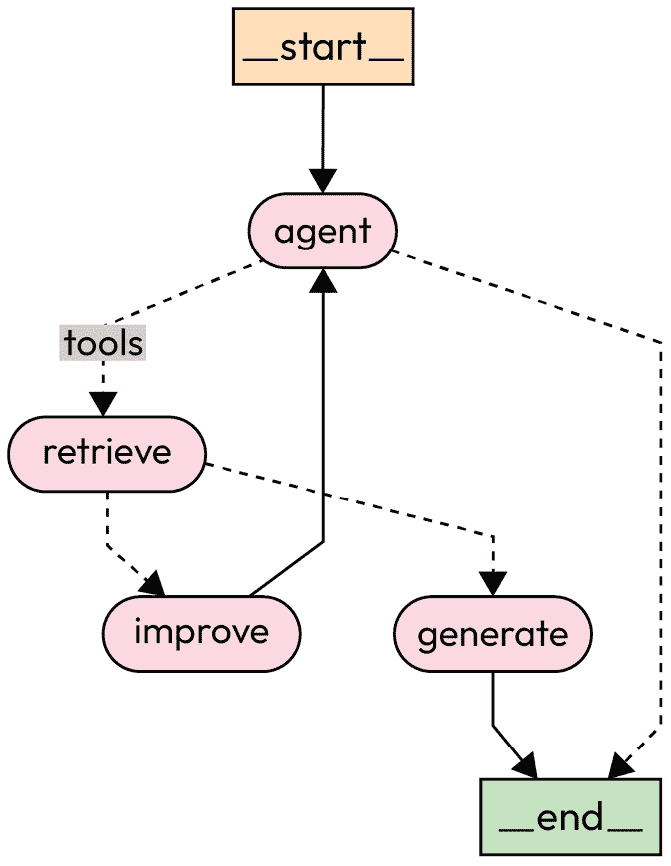
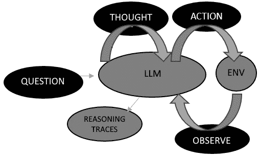
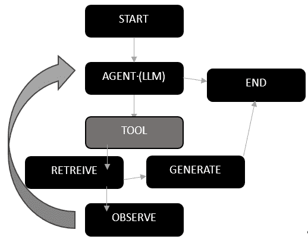

# 结合 RAG 与 AI 代理和 LangGraph 的力量

一次调用一个 **大型语言模型** (**LLM**) 可以非常强大，但将你的逻辑放在一个循环中，以实现更复杂的任务为目标，你就可以将你的 **检索增强生成** (**RAG**) 开发提升到全新的水平。 这就是 **代理**背后的概念。过去一年 LangChain 的开发重点放在了提高对 *代理* 工作流程的支持上，增加了能够更精确控制代理行为和功能的功能。 这一进步的部分成果是 **LangGraph**的出现，LangChain 的另一个相对较新的部分。 共同来说，代理和 LangGraph 作为提高 RAG 应用 的强大方法，配合得很好。

在本章中，我们将专注于深入了解可用于 RAG 的代理元素，然后将它们与你自己的 RAG 工作联系起来，涵盖以下主题： 以下内容：

+   AI 代理和 RAG 集成的 fundamentals

+   图，AI 代理， 和 LangGraph

+   将 LangGraph 检索代理添加到你的 RAG 应用

+   工具 和工具包

+   代理状态

+   图论的核心概念

到本章结束时，你将牢固掌握 AI 代理和 LangGraph 如何增强你的 RAG 应用。 在下一节中，我们将深入探讨 AI 代理和 RAG 集成的 fundamentals，为后续的概念和代码实验做好准备。

# 技术要求

本章的代码放置在以下 GitHub 仓库中： [https://github.com/PacktPublishing/Unlocking-Data-with-Generative-AI-and-RAG/tree/main/Chapter_12](https://github.com/PacktPublishing/Unlocking-Data-with-Generative-AI-and-RAG/tree/main/Chapter_12)

# AI 代理和 RAG 集成的 fundamentals

在与生成式 AI 的新开发者交谈时，我们被告知，AI 代理的概念往往是更难理解的概念之一。 当专家们谈论代理时，他们经常用非常抽象的术语来谈论它们，关注 AI 代理在 RAG 应用中可以负责的所有事情，但未能真正彻底地解释 AI 代理是什么以及它是如何 工作的。

我发现，通过解释它实际上是什么来消除 AI 代理的神秘感是最容易的，这是一个非常简单的概念。 要构建最基本形式的 AI 代理，你只是将你在这些章节中一直在使用的相同的 LLM 概念添加一个循环，当预期任务完成时循环终止。 就是这样！ 这只是个循环而已！

*图 12**.1* 表示你将在即将投入使用的代码实验室中与之合作的**RAG 代理循环** ：



图 12.1 – 代理控制流程图

这代表了一系列相对简单的逻辑步骤，循环执行，直到代理决定它已经成功完成了你给它分配的任务。 椭圆形框，例如 *代理 * 和 *检索*, 被称为**节点** ，而线条被称为**边**。虚线也是边，但它们是特定类型的边，称为**条件边**，这些边也是**决策点**。

尽管简单，但在 LLM 调用中添加循环的概念确实使它比直接使用 LLM 更强大，因为它更多地利用了 LLM 推理和将任务分解成更简单任务的能力。 这提高了你在追求的任何任务中取得成功的可能性，并且对于更复杂的多步骤**RAG 任务**将特别有用。

当你的 LLM 在循环执行代理任务时，你还会向代理提供称为**工具** 的函数，LLM 将使用其推理能力来确定使用哪个工具，如何使用该工具，以及向其提供什么数据。 这很快就会变得非常复杂。 你可以有多个代理，众多工具，集成的知识图谱来引导你的代理沿着特定路径前进，众多框架提供不同**风味** 的代理，众多代理架构的方法，等等。 但在这个章节中，我们将专门关注 AI 代理如何帮助改进 RAG 应用。 一旦你看到了使用 AI 代理的力量，我毫不怀疑你将想要在其他生成式 AI 应用中使用它，而且**你应该这样做**！

## 生活在智能体世界中

在智能体周围的兴奋情绪中 ，你可能会认为 LLM 已经过时了。 但事实远非如此。 与 AI 智能体一起，你实际上是在挖掘一个更强大的 LLM 版本，在这个版本中，LLM 充当智能体的“大脑”，使其能够进行推理并提出超越一次性聊天问题的多步解决方案。 智能体只是在用户和 LLM 之间提供一个层次，推动 LLM 完成可能需要多次查询的任务，但最终，从理论上讲，将得到一个更好的结果。 更好的结果。

如果你这么想，这更符合现实世界中解决问题的方式，即使简单的决策也可能很复杂。 我们做的许多任务都是基于一系列观察、推理和对新经验的调整。 在现实世界中，我们很少以与在线使用 LLM 相同的方式与人们、任务和事物互动。 通常会有这种理解和知识的构建过程，帮助我们找到最佳解决方案。 AI 智能体更能处理这种类型的解决问题的方法 。

智能体可以对您的 RAG 工作产生重大影响，但关于 LLM 作为其大脑的概念又如何呢？ 让我们进一步探讨 这个概念。

## 作为智能体的大脑

如果你认为 LLM 是您 AI 智能体的大脑，那么下一个合乎逻辑的步骤是，你很可能希望找到 *最聪明* 的 LLM 来充当这个大脑。 LLM 的能力将影响您的 AI 智能体推理和决策的能力，这无疑将影响您 RAG 应用的查询结果。

然而，这种 LLM 大脑的隐喻有一个主要的 缺陷，但以一种非常好的方式。 与现实世界中的智能体不同，AI 智能体可以随时更换其 LLM 大脑为另一个 LLM 大脑。 我们甚至可以给它多个 LLM 大脑，这些大脑可以相互检查并确保一切按计划进行。 这为我们提供了更大的灵活性，将有助于我们不断改进智能体的能力。

那么，LangGraph 或一般意义上的图与 AI 智能体有何关联？ 我们将在下一节讨论 这一点。

# 图、AI 智能体和 LangGraph

LangChain 在 2024 年引入了 LangGraph，因此它仍然相对较新。 它是建立在 `AgentExecutor` 类之上的扩展，仍然存在，LangGraph 现在是 *推荐* 在 LangChain 中构建代理的 *方式*

LangGraph 增加了两个重要的组件 以支持代理：

+   轻松定义周期（循环图）

+   内置内存

它提供了一个与 `AgentExecutor`等效的预构建对象，允许开发者使用基于 图的方法来编排代理。

在过去的几年里，出现了许多将代理构建到 RAG 应用中的论文、概念和方法，例如编排代理、ReAct 代理、自我优化代理和多代理框架。 这些方法中的一个共同主题是表示代理控制流的循环图概念。 虽然许多这些方法从实现的角度来看正在变得过时，但它们的概念仍然非常有用，并且被 LangGraph 的基于图的环境所捕捉。 LangGraph 已经成为支持代理并在 RAG 应用中管理它们的流程和过程的有力工具。

**LangGraph** 已经成为 支持代理和管理它们在 RAG 应用中的流程和过程的有力工具。 它使开发者能够将单代理和多代理流程描述和表示为图，提供极其可控的 *流程*。这种可控性对于避免开发者早期创建代理时遇到的陷阱至关重要。

例如，流行的 ReAct 方法是为构建代理的早期范例。 **ReAct** 代表 **reason + act**。在这个模式中，一个 LLM 首先思考要做什么，然后决定采取的行动。 然后在这个环境中执行该行动，并返回一个观察结果。 有了这个观察结果，LLM 随后重复这个过程。 它使用推理来思考接下来要做什么，决定另一个要采取的行动，并继续直到确定目标已经达成。 如果你将这个过程绘制出来，它可能看起来就像你在 *图 12**.2*中看到的那样：



图 12.2 – ReAct 循环图表示

图 12.2 中的循环集合可以用 LangGraph 中的循环图来表示，每个步骤由节点和边表示。 *图 12**.2**可以用 LangGraph 中的循环图来表示，每个步骤由节点和边表示。 使用这种图形范式，你可以看到像 LangGraph 这样的工具，LangChain 中构建图的工具，如何成为您代理框架的核心。 在我们构建代理框架时，我们可以使用 LangGraph 来表示这些代理循环，这有助于您描述和编排控制流。 这种对控制流的关注对于解决代理的一些早期挑战至关重要，缺乏控制会导致无法完成循环或专注于错误任务的代理。

LangGraph 内置的另一个关键元素是持久性。 持久性可以用来保持代理的记忆，给它提供所需的信息来反思迄今为止的所有行动，并代表在 *图 12**.2**中展示的* OBSERVE *组件。这非常有帮助，可以同时进行多个对话或记住之前的迭代和行动。 这种持久性还使人类在循环中具有功能，让您在代理行动的关键间隔期间更好地控制其行为。

介绍 ReAct 方法构建代理的论文可以在以下位置找到： [https://arxiv.org/abs/2210.03629](https://arxiv.org/abs/2210.03629)

让我们直接进入构建代理的代码实验室，并在代码中遇到它们时，更深入地探讨一些关键概念。 。

# 代码实验室 12.1 – 向 RAG 添加 LangGraph 代理

在这个代码实验室中，我们将向现有的 RAG 管道添加一个代理，它可以决定是否从索引中检索或使用网络搜索。 我们将展示代理在处理数据时的内部想法，这些数据是为了向您提供更全面的回答。 当我们添加代理的代码时，我们将看到新的组件，例如工具、工具包、图表、节点、边，当然还有代理本身。 对于每个组件，我们将更深入地了解该组件如何与您的 RAG 应用程序交互和支持。 我们还将添加代码，使这个功能更像是一个聊天会话，而不是一个 问答会话：

1.  首先，我们将安装一些新的包来支持我们的 代理开发：

    ```py
    %pip install tiktoken
    ```

    ```py
    tiktoken package, which is an OpenAI package used for tokenizing text data before feeding it into language models. Last, we pull in the langgraph package we have been discussing.
    ```

1.  接下来，我们添加一个新的 LLM 定义并更新我们的 现有定义：

    ```py
    llm = ChatOpenAI(model_name="gpt-4o-mini",
    ```

    ```py
     temperature=0, streaming=True)
    ```

    ```py
    agent_llm = ChatOpenAI(model_name="gpt-4o-mini",
    ```

    ```py
     temperature=0, streaming=True)
    ```

新的 `agent_llm` LLM 实例将作为我们代理的大脑，处理推理和执行代理任务，而原始的 `llm` 实例仍然存在于我们的通用 LLM 中，执行我们过去使用的相同 LLM 任务。 虽然在我们的示例中，两个 LLM 使用相同的模型和参数定义，但您应该尝试使用不同的 LLM 来完成这些不同的任务，以查看是否有更适合您 RAG 应用的组合。 您甚至可以添加额外的 LLM 来处理特定任务，例如，如果在这个代码中您发现某个 LLM 在那些任务上表现更好，或者您已经为这些特定操作训练或微调了自己的 LLM，那么可以添加 `improve` 或 `score_documents` 函数。 例如，对于简单任务，只要它们能成功完成任务，通常可以使用更快、成本更低的 LLM 来处理。 此代码中内置了大量的灵活性，您可以充分利用这些灵活性！ 此外，请注意，我们在 LLM 定义中添加了 `streaming=True` 。 这会开启从 LLM 流式传输数据，这对可能进行多次调用（有时是并行调用）并不断与 LLM 交互的代理更有利。

现在，我们将跳过检索器定义（`dense_retriever`， `sparse_retriever`，和 `ensemble_retriever`）之后的部分，并添加我们的第一个工具。 在代理方面， **工具** 有一个非常具体且重要的含义；因此，让我们现在来谈谈 它。

## 工具和工具包

在下面的代码中，我们将添加 一个 **web** **search** 工具：

```py
 from langchain_community.tools.tavily_search import TavilySearchResults
_ = load_dotenv(dotenv_path='env.txt')
os.environ['TAVILY_API_KEY'] = os.getenv('TAVILY_API_KEY')
!export TAVILY_API_KEY=os.environ['TAVILY_API_KEY']
web_search = TavilySearchResults(max_results=4)
web_search_name = web_search.name
```

您需要获取另一个 API 密钥并将其添加到 `env.txt` 文件中，这是我们过去用于 OpenAI 和 Together API 的文件。 就像那些 API 一样，您需要访问那个网站，设置您的 API 密钥，然后将它复制到您的 `env.txt` 文件中。 Tavily 网站可以通过此 URL 找到：[https://tavily.com/](https://tavily.com/)

我们再次运行 从 `env.txt` 文件加载数据的代码，然后我们设置了一个名为 `TavilySearchResults` 的对象，其 `max_results` 为 `4`，这意味着当我们运行搜索时，我们只想获得最多四个搜索结果。 然后我们将 `web_search.name` 变量分配给一个名为 `web_search_name` 的变量，以便我们稍后当需要告诉代理关于它时可以使用。 您可以直接使用以下代码运行此工具：

```py
 web_search.invoke(user_query)
```

使用 `user_query` 运行此工具代码将得到如下结果（为了简洁而截断）：

```py
 [{'url': 'http://sustainability.google/',
  'content': "Google Maps\nChoose the most fuel-efficient route\nGoogle Shopping\nShop for more efficient appliances for your home\nGoogle Flights\nFind a flight with lower per-traveler carbon emissions\nGoogle Nest\...[TRUNCATED HERE]"},
…
  'content': "2023 Environmental Report. Google's 2023 Environmental Report outlines how we're driving positive environmental outcomes throughout our business in three key ways: developing products and technology that empower individuals on their journey to a more sustainable life, working together with partners and organizations everywhere to transition to resilient, low-carbon systems, and operating ..."}]
```

我们截断了这部分内容，以便在书中占用更少的空间，但在代码中尝试这样做，您将看到我们请求的四个结果，并且它们似乎都与 `user_query` 用户询问的主题高度相关。 请注意，您不需要像我们 刚才那样直接在代码中运行此工具。

到此为止，您已经建立了您的第一个代理工具！ 这是一个搜索引擎工具，您的代理可以使用它从互联网上检索更多信息，以帮助它实现回答用户提出的问题的目标。 到它。

在 LangChain *工具* 概念以及构建代理时，其灵感来源于您希望使动作对代理可用，以便它可以执行其任务。 工具是实现这一目标的机制。 您定义一个工具，就像我们刚才为网络搜索所做的那样，然后您稍后将其添加到代理可以用来完成任务的工具列表中。 在我们设置该列表之前，我们想要创建另一个对于 RAG 应用至关重要的工具：一个 检索工具：

```py
 from langchain.tools.retriever import create_retriever_tool
retriever_tool = create_retriever_tool(
    ensemble_retriever,
    "retrieve_google_environmental_question_answers",
    "Extensive information about Google environmental
     efforts from 2023.",
)
retriever_tool_name = retriever_tool.name
```

请注意，使用 网络搜索 工具时，我们从 `langchain_community.tools.tavily_search`》导入，而使用这个工具时，我们使用 `langchain.tools.retriever`》。这反映了 Tavily 是一个第三方工具，而我们在这里创建的检索工具是 LangChain 核心功能的一部分。 导入 `create_retriever_tool` 函数后，我们使用它来创建 `retriever_tool` 工具供我们的代理使用。 同样，就像 `web_search_name`》一样，我们提取出 `retriever_tool.name` 变量，稍后当我们需要为代理引用它时可以引用。 你可能注意到了这个工具将使用的实际检索器名称，即 `ensemble_retriever` 检索器，我们在 *第八章*》的 *8.3* *代码实验室*》中创建的！

你还应该注意，这个工具的名称，从代理的角度来看，位于第二个字段，我们将其命名为 `retrieve_google_environmental_question_answers`》。在代码中命名变量时，我们通常尝试使它们更小，但对于代理将使用的工具，提供更详细的名称有助于代理理解可以使用的内容。 完全。

我们现在为我们的代理有了两个工具！ 然而，我们最终还需要告诉代理关于它们的信息；因此，我们将它们打包成一个列表，稍后我们可以与 代理共享：

```py
 tools = [web_search, retriever_tool]
```

你在这里可以看到我们之前创建的两个工具，即 `web_search` 工具和 `retriever_tool` 工具，被添加到工具列表中。 如果我们有其他想要提供给代理的工具，我们也可以将它们添加到列表中。 在 LangChain 生态系统中有数百种工具 可供使用： [https://python.langchain.com/v0.2/docs/integrations/tools/](https://python.langchain.com/v0.2/docs/integrations/tools/)

你想要确保你使用的 LLM 在推理和使用工具方面是“优秀”的。 一般来说，聊天模型通常已经针对工具调用进行了微调，因此在使用工具方面会更好。 未针对聊天进行微调的模型可能无法使用工具，尤其是当工具复杂或需要多次调用时。 使用良好的名称和描述可以在为你的代理 LLM 设定成功方面发挥重要作用。 同样。

在我们构建的代理中，我们拥有所有需要的工具，但你也会想看看工具包，这些是方便的工具组合。 LangChain 在其网站上提供当前可用的工具包列表 ： [https://python.langchain.com/v0.2/docs/integrations/toolkits/](https://python.langchain.com/v0.2/docs/integrations/toolkits/)

例如，如果你有一个使用 pandas DataFrames 的数据基础设施，你可以使用 pandas DataFrame 工具包为你提供各种工具，以不同的方式访问这些 DataFrames。 直接从 LangChain 网站引用，工具包被描述如下： （[https://python.langchain.com/v0.1/docs/modules/agents/concepts/#toolkits](https://python.langchain.com/v0.1/docs/modules/agents/concepts/#toolkits)）

对于许多常见任务，代理将需要一套相关工具。 为此，LangChain 提供了工具包的概念——大约 3-5 个工具的组合，用于完成特定目标。 例如，GitHub 工具包包含用于搜索 GitHub 问题的工具、用于读取文件的工具、用于评论的工具等。

因此，基本上，如果你正在关注你的代理或 LangChain（例如 Salesforce 集成）的一组常见任务，很可能有一个工具包可以让你一次性获得所有需要的工具。 对于许多常见任务，代理将需要一套相关工具。

现在我们已经建立了工具，让我们开始构建代理的组件，从 代理状态 开始。

## 代理状态

用于为你的代理建立“状态”并随时间跟踪的 `AgentState` 类。 此状态是代理的本地机制，你可以将其提供给图的所有部分，并可以存储在持久层中。

在这里，我们为我们的 RAG 代理 设置此状态：

```py
 from typing import Annotated, Literal, Sequence, TypedDict
from langchain_core.messages import BaseMessage
from langgraph.graph.message import add_messages
class AgentState(TypedDict):
    messages: Annotated[Sequence[BaseMessage],
                        add_messages]
```

这导入设置`AgentState`的相关包。例如，`BaseMessage` 是用于表示用户与 AI 智能体之间对话的消息的基类。 它将用于定义对话状态中消息的结构和属性。 然后它定义了一个图和一个`"state"` 对象，并将其传递给每个节点。 您可以设置状态为各种类型的对象，以便存储不同类型的数据，但对我们来说，我们设置我们的状态为一个`"messages"`列表。

我们需要导入另一轮包来设置我们的智能体其他部分： 我们的智能体：

```py
 from langchain_core.messages import HumanMessage
from langchain_core.pydantic_v1 import BaseModel, Field
from langgraph.prebuilt import tools_condition
```

在这段代码中，我们首先导入 `HumanMessage`。 `HumanMessage` 是一种特定的消息类型，代表由人类用户发送的消息。 它将在构建智能体生成响应的提示时使用。 我们还导入 `BaseModel` 和 `Field`。 `BaseModel` 是来自`Pydantic` 库的一个类，用于定义数据模型和验证数据。 `Field` 是来自`Pydantic` 的一个类，用于定义数据模型中字段的属性和验证规则。 最后，我们导入 `tools_condition`。`tools_condition` 函数是`LangGraph` 库提供的预构建函数。 它用于根据当前对话状态评估智能体是否使用特定工具的决策。

这些导入的类和函数在代码中用于定义消息的结构、验证数据和根据智能体的决策控制对话流程。 它们为使用`LangGraph` 库构建语言模型应用程序提供了必要的构建块和实用工具。

然后我们定义我们的主要提示（表示用户会输入的内容）： 如下所示：

```py
 generation_prompt = PromptTemplate.from_template(
    """You are an assistant for question-answering tasks. Use the following pieces of retrieved context to answer
    the question. If you don't know the answer, just say
    that you don't know. Provide a thorough description to
    fully answer the question, utilizing any relevant
    information you find. Question: {question}
    Context: {context}
    Answer:"""
)
```

这是过去我们在代码实验室中使用的代码的替代品： 代码实验室：

```py
 prompt = hub.pull("jclemens24/rag-prompt")
```

我们将名称更改为 `generation_prompt` ，以使此提示的使用 更加清晰。

我们的代码中的图使用即将增加，但首先，我们需要介绍一些基本的图 理论概念。

# 图论的核心概念

为了更好地理解我们将在接下来的几段代码中使用 LangGraph 的方式，回顾一些 图论 中的关键概念是有帮助的。 **图** 是数学 结构，可以用来表示不同对象之间的关系。 这些对象被称为 **节点** ，它们之间的关系，通常用线表示，被称为 **边**。您已经在 *图 12**.1* 中看到了这些概念，但了解它们如何与任何图相关联以及如何在 LangGraph 中使用它们是很重要的。

在 LangGraph 中，也有表示这些关系不同类型的特定类型的边。 例如，与 *图 12**.1* 一起提到的“条件边”，表示您需要决定下一步应该访问哪个节点；因此，它们代表决策。 在讨论 ReAct 范式时，这也被称为 **动作边****，因为它是在动作发生的地方，与 ReAct 的 *原因 + 动作** 方法相关。 *图 12**.3* 显示了由节点 和边组成的 基本图：



图 12.3 – 表示我们 RAG 应用基本图的图形

如图 图 12**.3* 所示的循环图中，您可以看到代表开始、代理、检索工具、生成、观察和结束的节点。 关键边是 LLM 决定使用哪个工具（这里只有检索可用），观察检索到的信息是否足够，然后推动到生成。 如果决定检索到的数据不足，有一条边将观察结果发送回代理，以决定是否再次尝试。 这些决策点是我们讨论的 *条件边* 。

# 我们的智能体中的节点和边

好的，让我们 回顾一下。 我们提到，一个代理 RAG 图有三个关键组件：我们之前提到的 *状态* ，添加到或更新状态的 *节点 ，以及决定下一个要访问哪个节点的 *条件边* 。 我们现在已经到了可以逐个在代码块中逐步通过这些组件，看到这三个组件如何相互作用的程度。

基于这个背景，我们将首先向代码中添加条件边，这是决策的地方。 在这种情况下，我们将定义一个边，以确定检索到的文档是否与问题相关。 这是将决定是否进入生成阶段或返回并 重试的函数：

1.  我们将分多步逐步通过此代码，但请记住，这是一个大函数，从 定义开始：

    ```py
     def score_documents(state) -> Literal[
    ```

    ```py
     "generate", "improve"]:
    ```

    此代码首先定义了一个名为 `score_documents` 的函数，该函数确定检索到的文档是否与给定问题相关。 该函数接受我们一直在讨论的状态作为参数，这是一个收集到的消息集合。 这就是我们使状态 `可用` 于此条件 边函数的方式。

1.  现在，我们构建 数据模型：

    ```py
     class scoring(BaseModel):
    ```

    ```py
     binary_score: str = Field(
    ```

    ```py
     description="Relevance score 'yes' or 'no'")
    ```

    这定义了一个名为 `scoring` 的数据模型类，使用 `Pydantic`的 `BaseModel`。`scoring` 类有一个名为 `binary_score`的单个字段，它是一个表示相关性得分的字符串，可以是 `是` 或 `否`。

1.  接下来，我们添加将做出此决定的 LLM：

    ```py
     llm_with_tool = llm.with_structured_output(
    ```

    ```py
     scoring)
    ```

    这通过调用 `llm_with_tool` 并使用 `llm.with_structured_output(scoring)`创建了一个实例，将 LLM 与评分数据模型结合用于结构化 输出验证。

1.  正如我们过去所看到的，我们需要设置一个 `PromptTemplate` 类，并将其传递给 LLM。 以下是 该提示：

    ```py
     prompt = PromptTemplate(
    ```

    ```py
     template="""You are assessing relevance of a retrieved document to a user question with a binary grade. Here is the retrieved document:
    ```

    ```py
     {context}
    ```

    ```py
     Here is the user question: {question}
    ```

    ```py
     If the document contains keyword(s) or semantic meaning related to the user question, grade it as relevant. Give a binary score 'yes' or 'no' score to indicate whether the document is relevant to the question.""",
    ```

    ```py
     input_variables=["context", "question"],
    ```

    ```py
     )
    ```

    这使用 `PromptTemplate` 类定义了一个提示，为 LLM 提供根据给定问题对检索到的文档的相关性应用二进制评分的说明。

1.  然后我们可以使用 LCEL 构建一个链，将提示与刚刚 `llm_with_tool` 设置的工具 `结合：

    ```py
     chain = prompt | llm_with_tool
    ```

    这个链表示了评分文档的管道。 这定义了链，但我们还没有调用 它。

1.  首先，我们想要 获取状态。 接下来，我们将状态（`"messages"`）拉入函数中，以便我们可以使用它，并取最后一条 消息：

    ```py
     messages = state["messages"]
    ```

    ```py
     last_message = messages[-1]
    ```

    ```py
     question = messages[0].content
    ```

    ```py
     docs = last_message.content
    ```

    这从 `"state"` 参数中提取必要的信息，然后准备状态/消息作为我们将传递给我们的智能大脑（LLM）的上下文。 这里提取的具体组件包括 以下内容：

    +   `messages`: 对话中的消息列表

    +   `last_message`: 对话中的最后一条消息

    +   `question`: 第一条消息的内容，假设它是 用户的问题

    +   `docs`: 最后一条消息的内容，假设它是 检索到的文档

    然后，最后，我们使用填充的提示调用链（如果你还记得，我们称之为 `question` 和上下文 `docs` 以获取 评分结果：

    ```py
     scored_result = chain.invoke({"question":
    ```

    ```py
     question, "context": docs})
    ```

    ```py
     score = scored_result.binary_score
    ```

    这从 `binary_score` 变量从 `scored_result` 对象中提取，并将其分配给 `score` 变量。 `llm_with_tool` 步骤，这是 LangChain 链中的最后一步，恰当地称为 `chain`，将根据评分函数的响应返回基于字符串的二进制结果：

    ```py
     if score == "yes":
    ```

    ```py
     print("---DECISION: DOCS RELEVANT---")
    ```

    ```py
     return "generate"
    ```

    ```py
     else:
    ```

    ```py
     print("---DECISION: DOCS NOT RELEVANT---")
    ```

    ```py
     print(score)
    ```

    ```py
     return "improve"
    ```

    这检查得分的值。 如果 `得分` 值是 `是`，它将打印一条消息，表明文档是相关的，并从 `generate` 函数返回作为最终输出，这表明下一步是生成一个响应。 如果 `得分` 值是 `否`，或者技术上讲，任何不是 `是`的东西，它将打印消息表明文档是不相关的，并返回 `改进`，这表明下一步是从 `用户` `那里改进查询。

    总的来说，这个函数在工作流程中充当决策点，确定检索到的文档是否与问题相关，并根据相关性得分将流程导向生成响应或重写问题。 的。

1.  现在我们已经定义了我们的条件边，我们将继续定义我们的节点，从 代理 `开始：

    ```py
     def agent(state):
    ```

    ```py
     print("---CALL AGENT---")
    ```

    ```py
     messages = state["messages"]
    ```

    ```py
     llm = llm.bind_tools(tools)
    ```

    ```py
     response = llm.invoke(messages)
    ```

    ```py
     return {"messages": [response]}
    ```

    这个函数代表我们图上的代理节点，并调用代理模型根据当前状态生成响应。 代理 `函数接受当前状态（`"状态"`）作为输入，其中包含对话中的消息，打印一条消息表明它正在调用代理，从状态字典中提取消息，使用 `agent_llm` 实例的 `ChatOpenAI` 类，我们之前定义的，代表代理的 *大脑*，然后使用 `bind_tools` 方法将工具绑定到模型。 然后我们调用代理的 `llm` 实例，将消息传递给它，并将结果赋值给 `response` 变量。

1.  我们的下一个节点 `改进`，负责将 `用户查询` 转换为更好的问题，如果代理确定这是必需的：

    ```py
     def improve(state):
    ```

    ```py
     print("---TRANSFORM QUERY---")
    ```

    ```py
     messages = state["messages"]
    ```

    ```py
     question = messages[0].content
    ```

    ```py
     msg = [
    ```

    ```py
     HumanMessage(content=f"""\n
    ```

    ```py
     Look at the input and try to reason about
    ```

    ```py
     the underlying semantic intent / meaning.
    ```

    ```py
     \n
    ```

    ```py
     Here is the initial question:
    ```

    ```py
     \n ------- \n
    ```

    ```py
     {question}
    ```

    ```py
     \n ------- \n
    ```

    ```py
     Formulate an improved question:
    ```

    ```py
     """,
    ```

    ```py
     )
    ```

    ```py
     ]
    ```

    ```py
     response = llm.invoke(msg)
    ```

    ```py
     return {"messages": [response]}
    ```

    此函数，就像我们所有的 节点和边相关函数一样，接受 当前状态（`"状态"`）作为输入。 该函数返回一个字典，其中将响应附加到消息列表中。 该函数打印一条消息表示正在转换查询，从状态字典中提取消息，检索第一条消息的内容（`messages[0].content`），假设它是初始问题，并将其分配给 `问题` 变量。 然后我们使用 `HumanMessage` 类设置一条消息，表示我们希望 `llm` 实例推理问题的潜在语义意图并制定一个改进的问题。 来自 `llm` 实例的结果分配给 `响应` 变量。 最后，它返回一个字典，其中将响应附加到 `消息列表`。

1.  我们的下一个节点函数是 `generate` 函数：

    ```py
     def generate(state):
    ```

    ```py
     print("---GENERATE---")
    ```

    ```py
     messages = state["messages"]
    ```

    ```py
     question = messages[0].content
    ```

    ```py
     last_message = messages[-1]
    ```

    ```py
     question = messages[0].content
    ```

    ```py
     docs = last_message.content
    ```

    ```py
     rag_chain = generation_prompt | llm |
    ```

    ```py
     str_output_parser
    ```

    ```py
     response = rag_chain.invoke({"context": docs,
    ```

    ```py
     "question": question})
    ```

    ```py
     return {"messages": [response]}
    ```

    此函数 类似于上一章代码中的生成步骤 实验室，但简化了以仅提供响应。 它基于检索到的文档和问题生成一个答案。 该函数接受当前状态（`"状态"`）作为输入，其中包含对话中的消息，打印一条消息表示正在生成答案，从状态字典中提取消息，检索第一条消息的内容（`messages[0].content`），假设它是问题，并将其分配给 `问题` 变量。

    该函数随后检索最后一条消息（`messages[-1]`）并将其分配给 `last_message` 变量。 `docs` 变量被分配给`last_message`的内容，假设这是检索到的文档。 在此阶段，我们通过使用`|` 操作符组合`generation_prompt``、`llm``和`str_output_parser` 变量来创建一个名为`rag_chain` 的链。 与其他 LLM 提示一样，我们将预定义的`generation_prompt` 作为生成答案的提示，它返回一个包含`response` 变量并附加到`messages` 列表中的字典。

接下来，我们想要使用 LangGraph 设置我们的循环图，并将我们的节点和边 分配给它们。

# 循环图设置

我们代码中的下一个 大步骤是使用 LangGraph 设置我们的图 ：

1.  首先，我们导入一些重要的包以开始： ：

    ```py
     from langgraph.graph import END, StateGraph
    ```

    ```py
     from langgraph.prebuilt import ToolNode
    ```

    此代码从 `langgraph` 库中导入以下必要的类和函数：

    +   `END`: 表示工作流程结束的特殊节点 的

    +   `StateGraph`: 用于定义工作流程 的状态图的类

    +   `ToolNode`: 用于定义表示工具 或动作的节点的类

1.  然后，我们将 `AgentState` 作为参数传递给 `StateGraph` 类，我们刚刚导入它来定义工作流程 的状态图：

    ```py
     workflow = StateGraph(AgentState)
    ```

    这创建了一个名为 `workflow` 的新 `StateGraph` 实例 ，并为该 `工作流程` `StateGraph` 实例定义了一个新的图。

1.  接下来，我们定义我们将循环的节点，并将我们的节点函数 分配给它们：

    ```py
     workflow.add_node("agent", agent)  # agent
    ```

    ```py
     retrieve = ToolNode(tools)
    ```

    ```py
     workflow.add_node("retrieve", retrieve)
    ```

    ```py
     # retrieval from web and or retriever
    ```

    ```py
     workflow.add_node("improve", improve)
    ```

    ```py
     # Improving the question for better retrieval
    ```

    ```py
     workflow.add_node("generate", generate)  # Generating a response after we know the documents are relevant
    ```

    此代码使用 `add_node` 方法 将多个节点添加到 `工作流程` 实例 中：

    +   `"agent"`：此节点代表代理节点，它调用 agent 函数。

    +   `"retrieve"`：此节点代表检索节点，它是一个特殊的 `ToolNode` ，包含我们早期定义的工具列表，包括 `web_search` 和 `retriever_tool` 工具。 在此代码中，为了提高可读性，我们明确地分离出 `ToolNode` 类实例，并使用它定义了 `retrieve` 变量，这更明确地表示了此节点的“检索”焦点。 然后我们将该 `retrieve` 变量传递给 `add_node` 函数。

    +   `"improve"`：此节点代表改进问题的节点，它调用 `improve` 函数。

    +   `"generate"`：此节点代表生成响应的节点，它调用 `generate` 函数。

1.  接下来，我们需要定义我们的工作流 的起点：

    ```py
     workflow.set_entry_point("agent")
    ```

    这设置了 `工作流` 实例的 `"agent"` 节点 使用 `workflow.set_entry_point("agent")`.

1.  接下来，我们调用 `"agent"` 节点来决定是否检索 ：

    ```py
     workflow.add_conditional_edges("agent", tools_condition,
    ```

    ```py
     {
    ```

    ```py
     "tools": "retrieve",
    ```

    ```py
     END: END,
    ```

    ```py
     },
    ```

    ```py
     )
    ```

    在此代码中， `tools_condition` 被用作工作流程图中的条件边。 它根据代理的决定确定代理是否应继续到检索步骤（`"tools": "retrieve"`）或结束对话（`END: END`）。 检索步骤代表我们为代理提供的两个工具，供其按需使用，而另一个选项，简单地结束对话，则结束 工作流程。

1.  在此，我们添加更多 边，这些边在调用 `"action"` 节点 之后使用：

    ```py
     workflow.add_conditional_edges("retrieve",
    ```

    ```py
     score_documents)
    ```

    ```py
     workflow.add_edge("generate", END)
    ```

    ```py
     workflow.add_edge("improve", "agent")
    ```

    在调用 `"retrieve"` 节点后，它使用 `workflow.add_conditional_edges("retrieve", score_documents)`添加条件边。这使用 `score_documents` 函数评估检索到的文档，并根据分数确定下一个节点。 这还会使用 `workflow.add_edge("generate", END)`从 `"generate"` 节点到 `END` 节点添加一个边。这表示在生成响应后，工作流程结束。 最后，它使用 `workflow.add_edge("improve", "agent")`从 `"improve"` 节点回到 `"agent"` 节点添加一个边。这创建了一个循环，改进的问题被发送回代理进行 进一步处理。

1.  我们现在准备好编译 `图：

    ```py
     graph = workflow.compile()
    ```

    此行使用 `workflow.compile` 编译工作流程图，并将编译后的图赋值给 `graph` 变量，它现在代表了我们最初开始的 `StateGraph` 图实例的编译版本。

1.  我们已经在本章前面展示了此图的可视化， *图 12.1**，但如果你想要自己运行可视化，你可以使用 `此代码：`

    ```py
     from IPython.display import Image, display
    ```

    ```py
     try:
    ```

    ```py
     display(Image(graph.get_graph(
    ```

    ```py
     xray=True).draw_mermaid_png()))
    ```

    ```py
     except:
    ```

    ```py
     pass
    ```

    我们可以使用 `IPython` 生成 `此可视化。

1.  最后，我们将最终让我们的代理 开始工作：

    ```py
     import pprint
    ```

    ```py
     inputs = {
    ```

    ```py
     "messages": [
    ```

    ```py
     ("user", user_query),
    ```

    ```py
     ]
    ```

    ```py
     }
    ```

    此行导入 `pprint` 模块，它提供了一个格式化和打印数据结构的 pretty-print 函数，使我们能够看到我们代理输出的更易读版本。 然后我们定义一个名为 `inputs` 的字典，它表示工作流程图的初始输入。 输入字典包含一个 `"messages"` 键，其中包含一个元组列表。 在这种情况下，它有一个单个元组， `("user", user_query)`，其中 `"user"` 字符串表示消息发送者的角色（`user`）和 `user_query` 是用户的查询或问题。

1.  然后我们初始化一个名为 `final_answer` 的空字符串变量来存储工作流程 生成的最终答案：

    ```py
     final_answer = ''
    ```

1.  然后我们使用图实例 作为 基础来启动我们的代理 循环：

    ```py
     for output in graph.stream(inputs):
    ```

    ```py
     for key, value in output.items():
    ```

    ```py
     pprint.pprint(f"Output from node '{key}':")
    ```

    ```py
     pprint.pprint("---")
    ```

    ```py
     pprint.pprint(value, indent=2, width=80,
    ```

    ```py
     depth=None)
    ```

    ```py
     final_answer = value
    ```

    这使用 `graph.stream(inputs)`中的输出启动一个双重循环。 graph 实例在处理输入时生成输出。 `graph.stream(inputs)` 方法从 `graph` 实例执行中流式传输输出。

    在外层循环内部，它为两个变量启动另一个循环， `key` 和 `value`，代表在 `output.items` 变量中的键值对。 这会遍历每个键值对，其中 `key` 变量代表节点名称，而 `value` 变量代表该节点生成的输出。 这将使用 `pprint.pprint(f"Output from node '{key}':")` 来指示哪个节点生成了 `输出。

    代码使用 `pprint.pprint(value, indent=2, width=80, depth=None)`来美化打印值（输出）。 `indent` 参数指定缩进级别， `width` 指定输出最大宽度， `depth` 指定要打印的嵌套数据结构的最大深度（`None` 表示 `无限制）。

    它将值（输出）赋给 `final_answer` 变量，并在每次迭代中覆盖它。 循环结束后， `final_answer` 将包含工作流程中最后一个节点生成的输出。

    此代码的一个优点是它允许您看到 图中每个节点生成的中间输出，并跟踪查询处理的进度。 这些打印输出代表了代理在循环中做出决策时的“思考”。 美化打印有助于格式化输出，使其更易于阅读。

    当我们启动代理并开始看到输出时，我们可以看到有很多事情在进行！

    我将截断大量的打印输出，但这将给你一个关于提供内容的 概念：

    ```py
     ---CALL AGENT---
    ```

    ```py
     "Output from node 'agent':"
    ```

    ```py
     '---'
    ```

    ```py
     { 'messages': [ AIMessage(content='', additional_kwargs={'tool_calls': [{'index': 0, 'id': 'call_46NqZuz3gN2F9IR5jq0MRdVm', 'function': {'arguments': '{"query":"Google\'s environmental initiatives"}', 'name': 'retrieve_google_environmental_question_answers'}, 'type': 'function'}]}, response_metadata={'finish_reason': 'tool_calls'}, id='run-eba27f1e-1c32-4ffc-a161-55a32d645498-0', tool_calls=[{'name': 'retrieve_google_environmental_question_answers', 'args': {'query': "Google's environmental initiatives"}, 'id': 'call_46NqZuz3gN2F9IR5jq0MRdVm'}])]}
    ```

    ```py
     '\n---\n'
    ```

    这是我们的打印输出的第一部分。 在这里，我们看到代理决定使用 `retrieve_google_environmental_question_answers` 工具。 如果你还记得，这是我们定义检索器工具时给它起的基于文本的名称。 选择得很好！

1.  接下来，代理将确定它认为检索到的文档是否相关：

    ```py
     ---CHECK RELEVANCE---
    ```

    ```py
     ---DECISION: DOCS RELEVANT---
    ```

    决定是它们是。 再次，明智的思考， 先生， 代理。

1.  最后，我们看到代理正在查看的 输出，这些数据是从 PDF 文档和我们一直在使用的集成检索器中检索到的（这里有很多检索到的数据，所以我截断了大部分的实际 内容）：

    ```py
     "Output from node 'retrieve':"
    ```

    ```py
     '---'
    ```

    ```py
     { 'messages': [ ToolMessage(content='iMasons Climate AccordGoogle is a founding member and part of the governing body of the iMasons Climate Accord, a coalition united on carbon reduction in digital infrastructure.\nReFEDIn 2022, to activate industry-wide change…[TRUNCATED]', tool_call_id='call_46NqZuz3gN2F9IR5jq0MRdVm')]}
    ```

    ```py
     '\n---\n'
    ```

    当你查看这部分的实际打印输出时，你会看到检索到的数据被连接在一起，并为我们的代理提供了大量和深入的数据，以便 使用。

1.  在这个阶段，就像我们的原始 RAG 应用程序所做的那样，代理接受问题、检索到的数据，并根据我们给出的生成 提示来制定响应：

    ```py
     ---GENERATE---
    ```

    ```py
     "Output from node 'generate':"
    ```

    ```py
     '---'
    ```

    ```py
     { 'messages': [ 'Google has a comprehensive and multifaceted approach to '
    ```

    ```py
     'environmental sustainability, encompassing various '
    ```

    ```py
     'initiatives aimed at reducing carbon emissions, promoting'
    ```

    ```py
     'sustainable practices, and leveraging technology for '
    ```

    ```py
     "environmental benefits. Here are some key aspects of Google's "
    ```

    ```py
     'environmental initiatives:\n''\n'
    ```

    ```py
     '1\. **Carbon Reduction and Renewable Energy**…']}
    ```

    ```py
     '\n---\n'
    ```

    我们在这里加入了一个机制，以便单独打印出最终消息，以便于阅读：

    ```py
     final_answer['messages'][0]
    ```

    这将打印 以下内容：

    ```py
    "Google has a comprehensive and multifaceted approach to environmental sustainability, encompassing various initiatives aimed at reducing carbon emissions, promoting sustainable practices, and leveraging technology for environmental benefits. Here are some key aspects of Google's environmental initiatives:\n\n1\. **Carbon Reduction and Renewable Energy**:\n   - **iMasons Climate Accord**: Google is a founding member and part of the governing body of this coalition focused on reducing carbon emissions in digital infrastructure.\n   - **Net-Zero Carbon**: Google is committed to operating sustainably with a focus on achieving net-zero carbon emissions. This includes investments in carbon-free energy and energy-efficient facilities, such as their all-electric, net water-positive Bay View campus..."
    ```

这就是我们代理的全部输出！

# 摘要

在本章中，我们探讨了如何将 AI 代理和 LangGraph 结合起来创建更强大和复杂的 RAG 应用程序。 我们了解到，AI 代理本质上是一个具有循环的 LLM，允许它进行推理并将任务分解成更简单的步骤，从而提高在复杂 RAG 任务中成功的可能性。 LangGraph，建立在 LCEL 之上的扩展，为构建可组合和可定制的代理工作负载提供支持，使开发者能够使用基于 图的方法来编排代理。

我们深入探讨了 AI 代理和 RAG 集成的根本，讨论了代理可以用来执行任务的工具的概念，以及 LangGraph 的 `AgentState` 类如何跟踪代理随时间的状态。 我们还涵盖了图论的核心概念，包括节点、边和条件边，这对于理解 LangGraph 如何工作至关重要。

在代码实验室中，我们为我们的 RAG 应用构建了一个 LangGraph 检索代理，展示了如何创建工具、定义代理状态、设置提示以及使用 LangGraph 建立循环图。我们看到了代理如何利用其推理能力来确定使用哪些工具、如何使用它们以及提供什么数据，最终为 用户的问题提供更全面的回答。

展望未来，下一章将重点介绍如何使用提示工程来改进RAG 应用。
