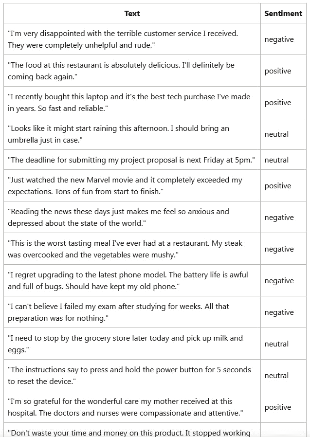
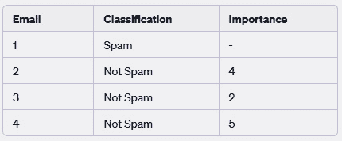
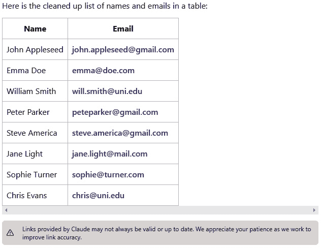
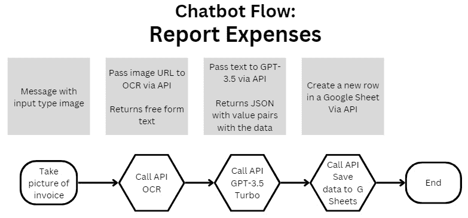
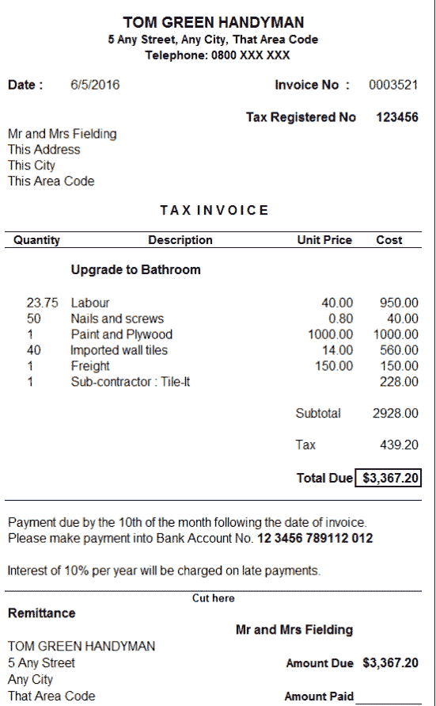
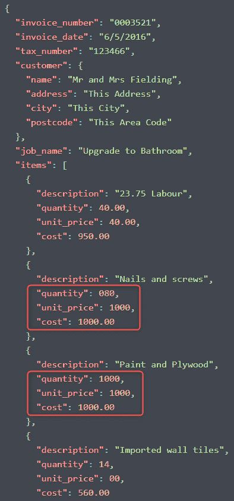

# 5

# 从非结构化文本中解锁见解——文本分析的 AI 技术

非结构化文本数据蕴含着宝贵的见解，但大规模理解定性信息是一项巨大的挑战。本章探讨了使生成式 AI 系统能够自动化分析和组织自由文本的技术。

我们将学习情感分析如何将词语背后的情感基调分类，以确定内容是正面、中性还是负面。我们将看到数据分类如何使用机器学习将文本分类到预定义的主题和标签中。我们还将发现模式匹配技术如何从非结构化数据中提取关键信息并将其转换为结构化输出。

这些 AI 能力帮助企业和组织高效地处理大量非结构化数据，以发现可操作的见解。情感分析揭示了消费者对产品或品牌的感受。数据分类自动将客户支持票据等内容组织到主题中。模式匹配从发票等文档中提取数据，形成整洁的结构化记录。

这个实用工具包使任何人都能挖掘出每天产生的文本数据中隐藏的知识。让我们探讨生成式 AI 如何帮助大规模地理解语言。

本章涵盖的主题如下：

+   情感分析——AI 在文本中检测情感的技术

+   组织非结构化数据——AI 如何自动化文本分类

+   清理脏数据——AI 如何识别和解决数据集中的问题

+   理解非结构化数据——信息提取的模式匹配

# 情感分析——AI 在文本中检测情感的技术

情感分析是 AI 技术在提示工程领域的关键应用之一。作为我们将要介绍的一系列 AI 应用的第一项，情感分析利用自然语言处理从文本数据中识别和提取情感信号。目标是评估一篇写作中的整体态度或情感，例如，确定产品评论是正面还是负面。

情感分析最常用的用途如下：

+   *品牌监控*：品牌可以跟踪在线发生的对话以监控其声誉。情感分析使他们能够检测公关问题并在其出现时进行衡量，以及衡量营销活动的影响。

+   *客户服务*：客户体验团队可以通过分析调查、评论和社交媒体提及来大规模地汇总反馈。这提供了关于人们对于产品和服务满意或不满意的数据驱动见解。

+   *市场研究*：通过理解客户情感，企业可以发现其服务或产品中的差距并相应地填补。

+   *政治分析*：政治团体可以通过监控有关候选人和问题的讨论来关注选民态度。这项技术有助于信息测试和确定需要更多接触的区域。

+   *社交媒体监控*：公司使用情感分析来识别社交媒体帖子的情绪，以了解更广泛的消费者行为和趋势。

+   *投资分析*：投资者可以使用情感分析来帮助预测市场走势。通过处理相关的新闻、论坛和博客，工具可以确定投资者对某些股票或行业是看涨还是看跌。

+   *公共卫生*：卫生当局可以将情感分析应用于理解在流行病等危机期间公众的担忧、错误信息和情绪状态。这种输入有助于指导沟通策略和资源分配。

这里有一些情感分析提示示例。

提示 1。

提示：

```py
Identify and categorize the sentiment (positive, neutral, negative) expressed in the [text].
Text = "This product is amazing! It has really improved my life."
```

这是响应。

响应：

```py
Sentiment: positive
```

这是提示 2。

提示：

```py
Text =  "I haven't noticed any changes since I started using this product."
```

这是响应。

响应：

```py
Sentiment: neutral
```

你可以一次传递许多文本，并要求 ChatGPT、Bard 或 Claude 以表格格式提供结果。

这是另一个提示。

提示：

```py
Identify and categorize the sentiment (positive, neutral, negative) expressed in the [text].
I will add many texts at once. Return the sentiment for each in tabular format. Don't include the word sentiment in the responses, only positive, negative or neutral.
Texts: "I'm very disappointed with the terrible customer service I received. They were completely unhelpful and rude."
"The food at this restaurant is absolutely delicious. I'll definitely be coming back again."
"I recently bought this laptop and it's the best tech purchase I've made in years. So fast and reliable."
"Looks like it might start raining this afternoon. I should bring an umbrella just in case."
"The deadline for submitting my project proposal is next Friday at 5pm."
"Just watched the new Marvel movie and it completely exceeded my expectations. Tons of fun from start to finish."
"Reading the news these days just makes me feel so anxious and depressed about the state of the world."
"This is the worst tasting meal I've ever had at a restaurant. My steak was overcooked and the vegetables were mushy."
"I regret upgrading to the latest phone model. The battery life is awful and full of bugs. Should have kept my old phone."
"I can't believe I failed my exam after studying for weeks. All that preparation was for nothing."
"I need to stop by the grocery store later today and pick up milk and eggs."
"The instructions say to press and hold the power button for 5 seconds to reset the device."
"I'm so grateful for the wonderful care my mother received at this hospital. The doctors and nurses were compassionate and attentive."
"Don't waste your time and money on this product. It stopped working after a month and their warranty support is useless."
```

这里是 Claude 生成的响应：



图 5.1：表格格式的响应

你的评分系统可以是任意的。在先前的示例中，情感可以是三个选项之一：正面、负面或中性。然而，你可以告诉 LLM 在任意尺度上分配一个值。例如，从`-1`（非常负面）到`1`（非常正面）。

总结来说，情感分析在规模上从定性数据中释放了价值。它使组织能够基于公众情绪而非仅仅基于直觉做出决策。随着自然语言处理技术的持续进步，这项技术在未来的应用范围有潜力变得更加广泛。

此外，在本节中，你了解到你可以要求 LLM 以特定格式生成输出：表格格式。这并非唯一选项。你可以要求 LLM 以 Markdown、HTML、HTML 表格、XML、JSON 或甚至是你自己的模式生成输出。这将在本章后面讨论。

在下一节中，我们将探讨一个类似的主题：数据分类。

# 组织非结构化数据 - 使用 AI 进行自动文本分类和数据分类

在数据分类的背景下，一个训练有素的 LLM 可以分析数据集中的各种特征，并准确地对数据进行分类。例如，如果任务是分类客户投诉到预定义的类别，如*账单问题*、*技术问题*、*客户服务问题*等，LLM 可以分析客户投诉的文本，理解上下文和使用的语言，并将它们准确分类到相应的类别中。

在许多情况下，LLM 应该能够做出准确的分类，而无需任何训练。然而，在某些情况下，它将需要一些示例来理解你想要的模式。

数据分类的典型用途包括以下内容：

+   区分不同类别的数据，并将每个数据点分配到其合适的类别。以下是一些例子：

    +   根据发件人地址或电子邮件内容等特征将收到的电子邮件分类为垃圾邮件或非垃圾邮件

    +   根据文章中使用的关键词和短语将新闻文章分类到如体育、政治和娱乐等主题

+   使用特定的分类算法或标准分析数据集，并将数据分类到不同的组：

    +   使用机器学习算法根据购买历史将客户分类到不同的细分市场（如高价值客户和低价值客户）

    +   使用逻辑回归或决策树算法将银行贷款申请人分类为低风险或高风险类别

+   将给定的数据集划分为单独的类别或类别，确保每个类别具有共同的特征，如下例所示：

    +   将动物数据集划分为如哺乳动物、爬行动物、鸟类和鱼类等类别，每个类别具有独特的特征

    +   将汽车数据集组织到如轿车、SUV 和卡车等类别，每个类别具有特定的特征

+   通过理解其特征，将给定的数据中的每一部分分配到适当的类别。以下是一些例子：

    +   根据其特定特征将水果列表分配到如柑橘、浆果和热带等类别

    +   根据学生在某一学科中的熟练程度将学生分配到不同的组

+   将收集到的数据分类到预定义的类别中，如下所示：

    +   将客户投诉分类到预定义的类别，如账单问题、技术问题和客户服务问题

    +   根据内容主题将书籍集合分类到预定义的流派，如悬疑、浪漫和科幻

以下示例展示了如何将收到的电子邮件分类为垃圾邮件/非垃圾邮件，以及在不属于垃圾邮件的情况下根据重要性进行分类：

提示：

```py
Classify the following [Emails] as spam or not spam. For the ones that are not spam, classify them as importance: n. n is a scale from 1 to 5, where 5 is very important. Provide the results in a table.
Emails: "Subject Line: Here's how you can claim your FREE HOLIDAY VOUCHER!
Sender: unknownsender@freedeals.com
Email Content:
Click here to enjoy a luxurious holiday for absolutely FREE! Hurry up! Offers like this don't last long!"
"Subject Line: Performance Evaluation for Q1 2023
Sender: HR_dept@yourcompany.com
Email Content:
Dear John,
The first quarter performance evaluations will take place next week. Please update your tasks and achievements in the employee portal by Tuesday.
Best regards,
HR Team"
"Subject Line: Introducing our New Product
Sender: newsletter@electronicsstore.com
Email Content:
Dear John,
We are excited to announce the arrival of our much-awaited smart TV. Check out our best deals and offers. Happy Shopping!
Best,
Electronics Store"
"Subject Line: Reunión del proyecto mañana a las 3 PM
Sender: gerente@tuempresa.com
Contenido del correo electrónico:
Equipo,
La reunión del proyecto está programada para mañana a las 3 PM en la sala de conferencias del quinto piso. Estén preparados para brindar actualizaciones sobre sus tareas.
Atentamente,
Gerente del Proyecto"
```

在这种情况下，我们使用 ChatGPT，你可以在这里看到响应：



图 5.2：电子邮件在两个类别中的分类

它也提供了一个解释，但为了简洁起见，未包含在内。

如你所见，你可以同时在多个维度上对事物进行分类，甚至处理一些不同语言的内容。需要注意的是，虽然 GPT-3.5/GPT-4 可以处理许多语言，但其他 LLM 则不能。因此，在使用 LLM 进行特定用例之前，请做一些研究。

一旦数据成功分类，prompt 工程流程中的下一个关键步骤就是通过去除不一致性和不准确性来清理数据。我们将在下一节中介绍这一点。

# 清理脏数据——AI 如何识别和解决数据集中的问题

数据清理，也称为数据清洗或数据刮擦，是从数据集中识别和纠正（或删除）错误、差异和不准确性的过程。这可能包括检测重复记录、处理缺失或不完整的数据、验证和纠正值、格式化、标准化或归一化数据，以及处理异常值。

数据清理的主要目标是提高数据的质量和可靠性，确保数据准确、一致，并且适合您的目的。这对于脏乱数据可能会干扰您的分析、导致不准确的观点和结论，以及负面地影响决策过程至关重要。

重要的是要注意，数据清理应该是数据管理的一个常规部分——它不是一个一次性任务，因为当添加新数据或修改现有数据时，可能会引入新的错误。

通常，数据清理是一个复杂且昂贵的流程，但使用生成式 AI，它可以高效且有效地完成。

例如，假设你从 LinkedIn 爬取了一些数据。你得到了潜在客户的姓名和来自不同来源的电子邮件，但它们可能格式错误。一些姓名可能包含表情符号或额外的属性，如 Dr.、PhD 或 MBA。在这种情况下，你需要清理数据以便能够发送电子邮件活动。这里的目的是获取没有头衔、表情符号或额外字符的数据。

Prompt:

```py
You are an expert on cleaning data.
Please clean the  list of [names and emails]. From the names remove the emojis and the titles such as doctor, PhD, etc. Also make sure the emails are correctly formatted.
Return the corrected list as a table.
names and emails:  Dr. John Appleseed*🍎*,  john.applecom
Mrs. Emma Doe*😺*, emma@doe.com
Prof. William Smith*🎩* , will.smith@uni.
Peter Parker*🕸️*, PhD, peteparker#gmail
Capt. Steve America💪, @america.com
Dr. Jane Light*💡*, MB  , jane.light.mailcom
 Miss Sophie Turner*🌸*  , sophie@.com
 Prof. Chris Evans🎯, PhD ,chris#uni.edu
```

在这个案例中，我们使用的是 Claude，这是它的回答：

Response:



图 5.3：清理后的姓名和电子邮件列表的表格结果

如您所见，如果您需要清理数百甚至数千条记录，这将节省大量时间。然而，可能存在 LLMs 无法完全解决这个问题的情况，如果某些关键信息缺失。因此，始终检查结果。

这里有一些使用 AI 清理数据的其他用例：

+   *移除重复项*：识别并删除数据集中的任何重复条目

+   *处理缺失值*：确定如何处理缺失值，要么通过插补要么删除它们

+   *标准化数据格式*：确保日期、电话号码或地址等数据字段格式的一致性

+   *移除特殊字符*：消除可能影响数据质量的不必要特殊字符或符号

+   *转换数据类型*：将数据字段转换为适当的数据类型（例如，将字符串转换为数字）

+   *处理异常值*：识别和处理可能扭曲分析或建模结果的异常值

+   *解决不一致的拼写*：标准化并纠正同一实体的不一致拼写或变体。

+   *验证电子邮件地址*：验证电子邮件地址的有效性，并纠正任何格式错误。

+   *规范化文本数据*：删除不必要的空白，转换为小写，并处理文本字段中的标点符号。

+   *检查数据完整性*：通过验证字段之间的关系和交叉引用来确保数据的一致性和完整性。

在确保数据干净可靠之后，重点随后转向利用模式匹配技术来生成连贯且具有上下文意识的响应。

# 理解非结构化数据——信息提取中的模式匹配

响应中的模式匹配涉及将非结构化文本作为输入，通过识别和提取相关模式或信息来生成结构化输出。

现在，让我们通过一个例子来说明在这种情况下如何使用模式匹配。

让我们考虑一个场景，其中输入是一个包含有关个人信息的非结构化文本，包括他们的姓名、年龄和职业。目标是提取并结构化这些信息，使其以更组织化的格式呈现。

这里是未结构化的文本输入：

*John Smith is a 35-year-old* *software engineer.*

在这种情况下，可以使用模式匹配来识别与所需信息相对应的特定模式或关键词。例如，我们可以定义如*[name] is a [age]-year-old [occupation]*的模式来捕获相关细节。

通过对输入文本应用模式匹配，系统可以识别模式与提供的信息匹配，并提取相应的值如下：

*模式: “[name] is a [**age**]-year-old [occupation]”*

*输入: “John Smith is a 35-year-old* *software engineer.”*

*提取的值:*

*姓名:* *John Smith*

*年龄: 35*

*职业:* *Software Engineer*

一旦提取了结构化值，它们就可以用来生成更组织化的输出或进行进一步处理。例如，提取的信息可以存储在结构化数据库中，或用于填充预定义的模板以生成结构化响应。

结构化输出可以用于各种目的，例如以结构化格式显示信息、执行计算或比较、与其他系统集成或根据提取的数据生成个性化响应。

响应中的模式匹配使非结构化文本转换为结构化信息，从而促进对提取数据的更好组织、分析和利用。

让我们通过一个令人兴奋的使用案例来探讨：使用 AI 将使用**光学字符****识别**（**OCR**）从图像中提取的非结构化文本进行结构化。

情景是这样的：一个人想要从发票中捕获数据以跟踪她的开支。她可以执行以下任一操作：

+   打开电子表格，并为每个新的费用创建一个记录（手动）。

+   将文档图像上传到允许您进行 OCR 以从图像中获取文本的网站，然后使用 LLM 来结构化这些数据，最后自动将其保存到电子表格中。

虽然捕获每张发票/文档的数据似乎要做很多工作，但对于以下情况，一个更自动化的流程非常有用：公司 A 有一支司机团队，他们在多个城市的不同客户那里进行配送。司机必须报告他们产生的费用，如汽油、过路费、车辆维护、食物和住宿。在当前情况下，他们需要在每天结束时发送一封电子邮件，详细说明每一项费用，并附上发票或收据的图像。这是耗时且易出错的。

此外，办公室里的人必须阅读每一封电子邮件，将数据复制到电子表格或其他系统中，并将图像放入驱动器目录或类似的地方。这个过程易出错、耗时，并在数据链接中创建复杂性。

例如，如果电子邮件中的图像保存在驱动器文件夹中，而其他字段则复制到电子表格中，那么很难连接哪个图像与电子表格中的哪个记录或行相对应。这些分离的数据之间没有自动链接。

在 AI 的帮助下，这可以大大简化。

每个司机都可以使用会话自动化工具，例如 Twnel、Manychat、UChat 或 Landbot，或任何允许他们创建基于树的流程并能拍照调用 API 的工具。

聊天机器人流程应该类似于以下图示：



图 5.4：报告费用流程

因此，用户在会话自动化工具中打开一个流程，并选择**报告费用**。然后，流程要求他们拍摄一张收据的照片。该图像经过 OCR 处理，然后将非结构化文本发送到 GPT-3.5 Turbo 进行处理，它返回一个 JSON。最后，流程从 JSON 中提取一些值，并在 Google 表格（或另一个电子表格）上创建一个新的行。

使用 Bard 或 Claude 创建典型收据的 JSON 模型。您可以将典型发票的图像上传到 Bard，并输入以下提示：

提示：

```py
From the image attached of an invoice extract all the data and format it as a JSON object. Try to include all the fields that you get from the invoice.
```

这种方法似乎可行，但在撰写本文时，结果并不非常准确。除了上传图像外，您还可以提供图像的 URL。到本书出版时，这应该会更好。

一个更好的方法是使用 LLM（如 GPT-3.5 Turbo、GPT-4、Bard 或 Claude）创建典型发票的 JSON 模型。通过 API 调用的 OCR 应用程序生成的文本进行喂养。

或者，您可以使用互联网上许多可用的工具进行 OCR，例如[`ocr.space/`](https://ocr.space/)。

假设发票与此类似：



图 5.5：示例发票

使用 OCR 从这张发票中提取的文本如下：

*“||TOM GREEN 手艺人||5 Any Street. Any City, That Area Code||电话：0800 XXX XXX||日期：||6/5/2016||发票号||0003521||税务登记号||123466||菲尔丁夫妇||此地址||此城市||此区号||税发票||数量||描述||升级浴室||23.75 劳动||钉子和螺丝||油漆和胶合板||进口墙砖||运费||分包商 Tie-t||单价||成本||40.00||950.00||080||40.00||1000 00||1000 00||14 00||560 00||150 00||228.00||小计||2928 00||总计应付$3.367.20||发票日期后的下一个月的 10 日付款，请将款项存入银行账户 12 3456 789112 012||逾期付款将按年利率 10%收取利息||汇款||菲尔丁夫妇||TOM GREEN 手艺人||qS||金额 Que $3.367.20||金额* *已付||了解更多”*

然后，输入这个提示（在克劳德 2 或巴德中使用效果最好）：

提示：

```py
The [OCR text] is the text obtained when doing OCR on an invoice. Generate a JSON model for that kind of document. In the JSON structure include placeholders (e.g., "string", "number") for the expected data types.
OCR Text = ||TOM GREEN HANDYMAN||5 Any Street. Any City, That Area Code||Telephone: 0800 XXX XXX||Date:||6/5/2016||Invoice No||0003521||Tax Registered No||123466||Mr and Mrs Fielding||This Address||This City||This Area Code||TAX INVOICE||Quantity||Description||Upgrade to Bathroom||23.75 Labour||Nails and screws||Paint and Plywood||Imported wall tiles||Freight||Sub-contractor Tie-t||Unit Price||Cost||40.00||950.00||080||40.00||1000 00||1000 00||14 00||560 00||150 00||228.00||Subtotal||2928 00||Total Due $3.367.20||Payment due by the 10th of the month following the date of invoice Please make payment into Bank Account No. 12 3456 789112 012||Interest of 10% per year will be charged on te paNDIS||Remittance||Mr and Mrs Fielding||TOM GREEN HANDYMAN||વડ||Amount Que $3.367.20||Amount Paid||Learn More||
```

这里是响应：

响应：

```py
{
  "invoice_number": "0003521",
 "invoice_date": "6/5/2016",
  "tax_number": "123466",
  "customer": {
    "name": "Mr and Mrs Fielding",
    "address": "This Address",
    "city": "This City",
    "postcode": "This Area Code"
  },
  "items": [
    {
      "description": "Upgrade to Bathroom",
      "quantity": 23.75,
      "unit_price": 40,
      "cost": 950
    },
    {
      "description": "Labour",
      "quantity": "string",
      "unit_price": "number",
      "cost": "number"
    },
    {
      "description": "Nails and screws",
      "quantity": 0.8,
      "unit_price": 40,
      "cost": 1000
    },
    {
      "description": "Paint and Plywood",
      "quantity": "number",
      "unit_price": "number",
      "cost": 1000
    },
    {
      "description": "Imported wall tiles",
      "quantity": 14,
      "unit_price": "number",
      "cost": 560
    },
    {
      "description": "Freight",
      "quantity": "number",
      "unit_price": "number",
      "cost": 150
    },
    {
      "description": "Sub-contractor Tie-t",
      "quantity": "number",
      "unit_price": 228,
      "cost": "number"
    }
  ],
  "subtotal": 2928,
  "total_due": 3367.20,
  "payment_info": {
    "account_number": "12 3456 789112 012",
    "due_date": "10th of the month following the date of invoice",
    "interest_rate": 10
  }
}
```

克劳德 2 和 B 阿德都误解了指令。我们可以通过提供进一步的指令来修复这个问题：

提示：

```py
No. instead of each value put the data type. Example, if the value is a number put "number", if it's a string put "string"
```

这里是响应：

响应：

```py
  "invoice_number": "string",
  "invoice_date": "string",
  "tax_number": "string",
  "customer": {
    "name": "string",
    "address": "string",
    "city": "string",
    "postcode": "string"
  },
  "items": [
    {
      "description": "string",
      "quantity": number,
      "unit_price": number,
      "cost": number
    },
   … [more items here]
  ],
  "subtotal": number,
  "total_due": number,
  "payment_info": {
    "account_number": "string",
    "due_date": "string",
    "interest_rate": number
  }
}{
```

现在这是好的。我们可以手动调整它，只保留`items`数组中的一个项目，并添加工作名称和税。由于`items`元素是一个数组，LLM 可以推断出它可能包含模型中包含的几种类型的对象。此外，`number`应该包含引号：“`number`”。这是因为“`number`”是一个表示该类型变量的字符串，而不是一个变量本身。修改后的 JSON 模型应该看起来像这样：

```py
{
  "invoice_number": "string",
  "invoice_date": "string",
  "tax_number": "string",
  "customer": {
    "name": "string",
    "address": "string",
    "city": "string",
    "postcode": "string"
  },
  "job_name": "string",
  "items": [
    {
      "description": "string",
      "quantity": "number",
      "unit_price": "number",
      "cost": "number"
    }
  ],
  "subtotal": "number",
  "tax": "number",
  "total_due": "number",
  "payment_info": {
    "account_number": "string",
    "due_date": "string",
    "interest_rate": "number"
  }
}
```

然后，当你想要处理另一张发票时，你应该写一些像以下这样的提示。

提示：

```py
Given that you have the text extracted from an invoice in [ORC text], format it as a JSON object with the following format:
{  JSON FORMAT HERE }
OCR text = "||TOM GREEN HANDYMAN||5 Any Street. Any City, That Area Code||Telephone: 0800 XXX XXX||Date:||6/5/2016||Invoice No||0003521||Tax Registered No||123466||Mr and Mrs Fielding||This Address||This City||This Area Code||TAX INVOICE||Quantity||Description||Upgrade to Bathroom||23.75 Labour||Nails and screws||Paint and Plywood||Imported wall tiles||Freight||Sub-contractor Tie-t||Unit Price||Cost||40.00||950.00||080||40.00||1000 00||1000 00||14 00||560 00||150 00||228.00||Subtotal||2928 00||Total Due $3.367.20||Payment due by the 10th of the month following the date of invoice Please make payment into Bank Account No. 12 3456 789112 012||Interest of 10% per year will be charged on te paNDIS||Remittance||Mr and Mrs Fielding||TOM GREEN HANDYMAN||વડ||Amount Que $3.367.20||Amount Paid||Learn More||"
```

这里是响应。

响应：



图 5.6：突出显示一些错误的响应截图

它几乎完成了。然而，在响应图像中，有几个错误，用红色矩形标记。

幸运的是，这是一个简单的修复。在提示中，你应该提供，连同 JSON 模型，甚至可以不用它，一些示例来展示 LLM 你期望放置的位置。

新的提示应该看起来像这样。

提示：

```py
Given that you have the text extracted from an invoice in [ORC text], format it as a JSON object with the following format:
{  JSON FORMAT HERE }
Here is one example:
OCR text = "||TOM GREEN HANDYMAN||5 Any Street. Any City, That Area Code||Telephone: 0800 XXX XXX||Date:||6/5/2016||Invoice No||0003521||Tax Registered No||123466||Mr and Mrs Fielding||This Address||This City||This Area Code||TAX INVOICE||Quantity||Description||Upgrade to Bathroom||23.75 Labour||Nails and screws||Paint and Plywood||Imported wall tiles||Freight||Sub-contractor Tie-t||Unit Price||Cost||40.00||950.00||080||40.00||1000 00||1000 00||14 00||560 00||150 00||228.00||Subtotal||2928 00||Total Due $3.367.20||Payment due by the 10th of the month following the date of invoice Please make payment into Bank Account No. 12 3456 789112 012||Interest of 10% per year will be charged on te paNDIS||Remittance||Mr and Mrs Fielding||TOM GREEN HANDYMAN||વડ||Amount Que $3.367.20||Amount Paid||Learn More||"
```

这里是结果：

响应：

```py
{
  "invoice_number": "0003521",
  "invoice_date": "6/5/2016",
  "tax_number": "123466",
  "customer": {
    "name": "Mr and Mrs Fielding",
    "address": "This Address",
    "city": "This City",
    "postcode": "This Area Code"
  },
  "job_name": "Upgrade to Bathroom",
  "items": [
    {
      "description": "23.75 Labour",
      "quantity": 40.00,
      "unit_price": 40.00,
      "cost": 950.00
    },
    {
      "description": "Nails and screws",
      "quantity": 50,
      "unit_price": 0.80,
      "cost": 40.00
    },
    {
      "description": "Paint and Plywood",
      "quantity": 1,
      "unit_price": 1000,
      "cost": 1000.00
    },
    {
      "description": "Imported wall tiles",
      "quantity": 40,
      "unit_price": 14.00,
      "cost": 560.00
    },
    {
      "description": "Freight",
      "quantity": 1,
      "unit_price":150.00,
      "cost": 150.00
    },
    {
      "description": "Sub-contractor Tile-t",
      "quantity": 1,
      "unit_price":"",
      "cost": 228.00
    }
  ],
  "subtotal": 2928.00,
  "tax": 439.20
  "total_due": 3367.20,
  "payment_info": {
    "account_number": "12 3456 789112 012",
    "due_date": "10th of the month following the date of invoice",
    "interest_rate": 10
  }
}
OCR text = [ ANOTHER TEXT EXTRACTED FROM ANOTHER INVOICE]
```

现在它应该可以处理类似的发票。

LLMs 在模式匹配方面非常出色。因此，这类应用通常工作得很好。你只需要微调你的提示，直到你得到正确的结果。

当使用 GPT-3.5 Turbo 或 GPT-4 的 API 时，你总是需要将训练部分传递给调用，并添加最后 OCR 文本与 OCR 过程返回的值。测试 GPT-3.5 Turbo 和 GPT-4。如果两者渲染相同的结果，则使用 GPT-3.5 Turbo，它比 GPT-4 便宜 20 倍。

如果你可以访问克劳德 2 API，你也可以测试它。

我们将在*第八章*中再次回顾这个案例，探讨如何使用这项技术与多人现场使用的聊天机器人结合使用。

# 摘要

AI 通过启用各种技术，如情感分析、数据分类、数据清洗和模式匹配，已经彻底改变了提示工程领域。这些技术大大提高了生成高质量响应的准确性和效率。

情感分析利用自然语言处理来识别词语和短语背后的情感基调。这使得我们能够自动将内容分类为具有积极、消极或中性情感。

数据分类使用机器学习算法将文本分类到预定义的组或标签中。这对于将非结构化数据组织成有意义的类别很有用。

数据清洗是与现实世界数据打交道的一个基本步骤。AI 技术，如模式匹配，可以自动查找和修复拼写错误、格式错误和重复条目等问题。这清理了数据，使其更适合下游分析和机器学习模型。

模式匹配，AI 的另一种强大能力，使提示模型能够识别和解释用户输入和模型输出中的特定模式或结构。这使得 AI 系统能够生成与常见模式和期望相符的响应。通过使用模式匹配技术，开发者可以确保他们的 AI 助手提供连贯且相关的响应，从而提升整体用户体验。

情感分析、分类、清洗和信息提取都可以由 AI 自动处理。这节省了大量的人力和时间，同时也提高了一致性。有了正确的技术和训练数据，AI 有望揭示文本中的洞察，这些洞察手动挖掘是不切实际的。

虽然本章探讨了从非结构化文本数据中提取洞察的 AI 技术，但下一章将重点转向 LLMs 在教育、法律和其他专业领域的应用。

# 第三部分：不同行业的先进用例

随着 GPT-4、Claude 和 Bard 等大型语言模型迅速发展，出现了将这些强大的 AI 工具应用于不同行业和领域的新机遇。本书的*第三部分*探讨了创新用例和提示工程技术，以针对特定需求定制**大型语言模型**（**LLMs**）。

我们首先考察了教育、法律等关键领域的应用。教育工作者可以利用 LLMs 快速生成针对学习目标的定制课程材料。法律专业人士可以利用 AI 简化研究、审阅文件、起草合同和丰富培训。

对于软件工程师来说，编码助手承诺可以自动化单调的编程工作，同时增强人类的创造力。我们通过一些示例项目展示了在人工智能支持下开发网站和浏览器扩展。

对话式界面通过与 LLMs 的集成也能获得巨大的好处。由 GPT-4 和 Claude 等工具驱动的聊天机器人，能够通过基于文本的对话实现更自然、连贯的对话和复杂的流程自动化。

最后，我们揭示了通过现有基础设施的集成来优化和扩展 LLMs 提示技术的技巧。无论是使用无代码自动化平台、自定义开发者库如 LangChain，还是共享提示模板，集成 AI 解锁了新的效率。

在这些多样化的应用场景中，总体主题是利用 AI 作为多用途的生产力引擎。通过精心设计的提示工程，我们可以定制 LLMs 来增强专门的流程，而不是取代人类的专业知识。

本部分包含以下章节：

+   *第六章*, *LLMs 在教育和法律中的应用*

+   *第七章*, *AI 配对程序员的崛起：与智能助手合作编写更好的代码*

+   *第八章*, *AI 聊天机器人*

+   *第九章*, *构建更智能的系统：高级 LLMs 集成*
