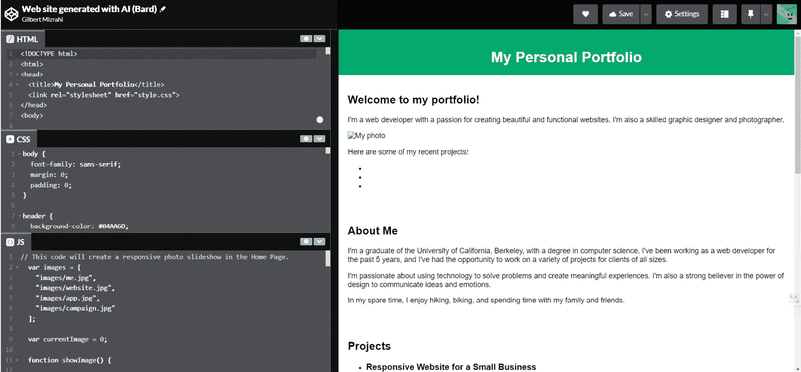
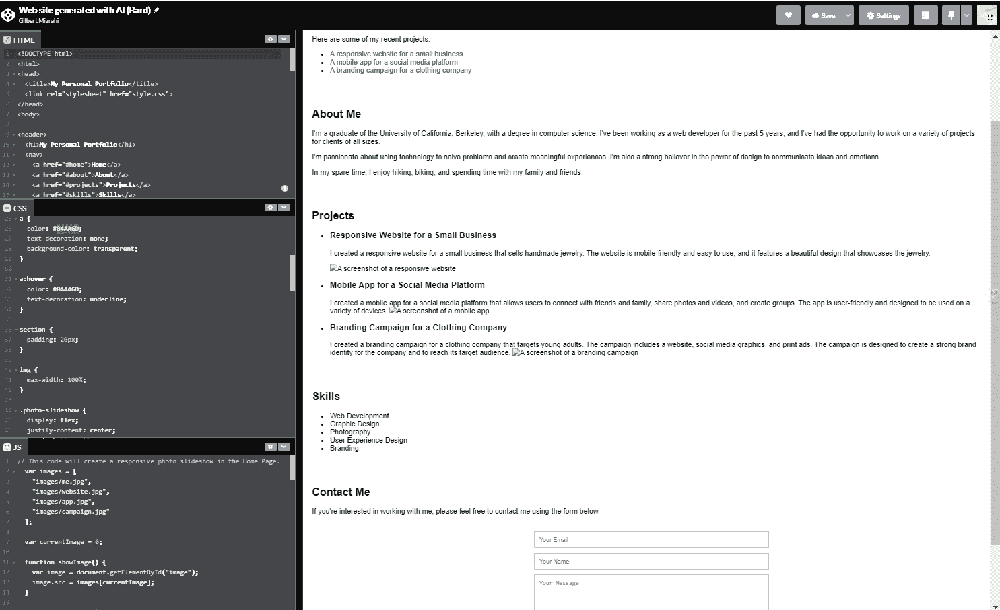
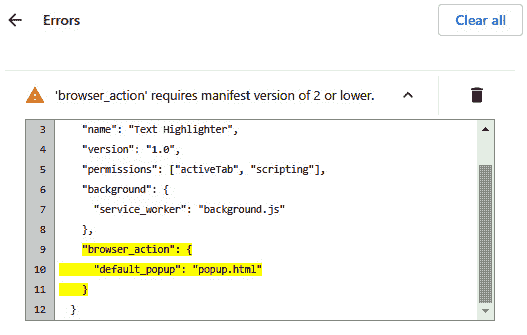

# 7

# 人工智能配对程序员的崛起——与智能助手团队合作以编写更好的代码

随着**人工智能**（AI）的持续进步，代码助手已成为帮助软件开发者的强大工具。在本章中，我们将探讨现代代码助手的特性以及它们如何改变编写计算机程序的过程。

代码助手可以生成样板代码，用普通语言解释代码功能，添加注释和重新格式化现有代码，调试错误，以及优化代码性能。它们甚至可以将代码从一种编程语言翻译成另一种语言。

使用大型语言模型（LLMs），这些人工智能系统理解开发者的意图，并生成相关的代码片段和文档。我们将研究使用代码助手开发网站代码和 Chrome 扩展的案例研究，展示它们如何加快开发周期。

代码助手的目标不是完全取代人类程序员，而是旨在增强程序员的技能。人工智能的进步承诺将带来更多自主的系统，这些系统可以在最少监督下编写功能代码。通过与人工智能合作，开发者可以更多地关注创新和宏观思考，而将日常编码任务自动化。这种人机共生可能使程序员更加高效和富有创造力。随着代码助手从基本的自动补全发展到人工智能配对程序员，未来的可能性令人兴奋。

本章我们将涵盖以下主题：

+   代码生成

+   使用人工智能解释某些代码的功能

+   注释和代码格式化

+   调试

+   使用人工智能进行代码优化

+   将代码从一种语言翻译成另一种语言

+   案例研究——使用人工智能开发网站代码

+   案例研究——使用人工智能创建 Chrome 扩展

# 使用代码助手进行代码生成

高级代码助手，如 GPT-4，现在可以从高级提示中生成完全功能性的代码块。这自动化了代码的大量生产，并针对开发者的需求进行定制。人工智能模型比人类程序员更快地综合模块化代码。这种代码生成承诺将显著加速开发周期并提高程序员的生产力。通过自动化代码起草，人工智能使开发者能够专注于更多需要人类创造力的战略任务。

让我们来看一个例子。你可以使用如下模板来生成一些代码：`为名为[name]的[语言]类/模块/组件生成以下功能的样板代码：[功能描述]。`

假设你想为名为`Circle`的类创建一个样板 Python 代码：

提示：

```py
Generate a boilerplate Python code for a class named Circle with the following functionality:
The class has an attribute radius to store the radius of the circle.
The class has two methods:
calculate_area() to calculate the area of the circle.
calculate_perimeter() to calculate the perimeter of the circle.
The class has a constructor that takes the radius of the circle as input and initializes the radius attribute.
```

响应：

```py
class Circle:
def init(self, radius):
self.radius = radius
def calculate_area(self):
      return math.pi * self.radius ** 2
def calculate_perimeter(self):
      return 2 * math.pi * self.radius
This code is a great starting point for creating a Python class for a circle. It includes all of the necessary functionality, and it is well-organized and easy to read. The code also uses the math module to calculate the area and perimeter of the circle, which is a good practice to follow.
```

尽管这个例子相当简单，但它很好地说明了如何使用大型语言模型（LLMs）来生成代码。

除了前面的模板，还有其他模板可以用来生成代码，例如以下内容：

+   `设计一个[语言]函数，用于在[数据结构]上执行[操作]，利用以下输入参数：[输入变量]，并将预期的结果投影为：[输出描述]。`

+   `创建一个针对[应用领域]的[语言]类别，包含[方法列表]中的函数，并包含如[属性列表]等特性。`

+   `以[设计模式]为指导，用[语言]编写一个代码片段，以展示其在[用例]场景中的应用。`

+   `编写一个[语言]脚本，通过使用[库/框架]，满足[任务]，并符合以下规范：[要求列表]。`

正如我们所见，人工智能如何促进代码生成，我们现在将注意力转向另一个创新应用：使用人工智能来解码和解释某些代码的功能。接下来的这一节将深入探讨人工智能如何成为解开和解释复杂代码的强大工具，改变我们与编程互动的方式。

# 从困惑到清晰——人工智能用通俗易懂的语言解释代码的功能

理解复杂的代码可能具有挑战性。幸运的是，人工智能技术在这里提供帮助。这项技术可以分解并阐明各种代码片段的目的，节省时间并减少困惑。在本节中，我们将关注人工智能的这一方面，讨论其在提高程序员效率和发展技能方面的作用。这可以帮助开发者更高效地工作并学习新技能。

我们将使用 TypeScript 代码片段来说明如何提示一个 LLM 来解释它。

提示：

```py
Explain to me the following code written in TypeScript:
type FunctionPropertyNames<T> = {
   [K in keyof T]: T[K] extends (…args: any[]) => any ? K : never;
}[keyof T];
type FunctionProperties<T> = Pick<T, FunctionPropertyNames<T>>;
interface IComplex {
   id: number;
   name: string;
   execute: (command: string) => void;
}
function runCommand<T extends IComplex>(obj: FunctionProperties<T>, command: string): void {
   obj.execute(command);
}
const complexObject: IComplex = {
   id: 1,
   name: "Complex",
   execute: (command: string) => console.log(`Executing command: ${command}`),
};
runCommand(complexObject, "Test Command");
```

这是使用 Claude 2 的响应。

响应：

```py
This code is using some advanced TypeScript types to create a reusable function that can execute a method on an object if it exists.
The key parts:
1.FunctionPropertyNames is using generics to extract all the properties on the type T that are functions. It does this by mapping over all keys and filtering out any that are not function types.
2.FunctionProperties uses Pick to create a new type that only includes those function property names.
3.runCommand accepts a FunctionProperties<T> rather than just a T. This means you can pass in an object and it will restrict you to only calling properties that are functions.
4.The IComplex interface defines an object with some properties including an execute method.
5.complexObject implements IComplex.
6.When calling runCommand, we pass complexObject. The FunctionProperties means only the execute method is available to call, so we can safely call obj.execute() without having to check if it exists.
So in summary, it allows writing a reusable utility function that can execute a method on an object in a typesafe way. The FunctionProperties utility ensures at compile time that only valid methods can be called.
You should try running the prompt in different LLMs to see the differences. Sometimes one is better for a given task than the others, so it's good practice to try them out to identify which one works best in your case.
```

在借助人工智能探索代码解释领域之后，现在是时候将我们的注意力转向编程的其他关键方面：代码注释、格式化和优化。这些是提高代码可读性和可维护性的关键。让我们深入了解人工智能如何在这些领域提供帮助，使程序员的日常生活更加轻松高效。

# 注释、格式化和优化代码

编写健壮、可维护的代码不仅仅是功能性的问题。它需要仔细的组织、清晰的注释、一致的样式和最优的性能。人工智能可以在高质量代码的所有这些方面提供有价值的帮助。

强大的语言模型可以分析代码并添加描述性注释，以阐明意图和逻辑，提高可读性。人工智能还可以使用语义和可读性强的名称重命名变量和方法。

此外，人工智能还可以重新格式化代码，使其符合风格指南和最佳实践。这增强了大型代码库的一致性和可维护性。

人工智能甚至可以通过重构低效的逻辑、简化数据结构和改进算法来优化代码。这种自动优化可以提供巨大的性能提升并降低资源消耗。

让我们看看一个示例提示和响应，展示人工智能在注释、重新格式化和优化代码方面的能力。

提示：

```py
Improve the readability, formatting, performance, and efficiency of this code:
def calcFactorial(num):
   if num==1 or num==0:
      return 1
   else:
      return num*calcFactorial(num-1)
print(calcFactorial(5))
```

回复：

```py
# Function to calculate factorial recursively
def factorial(number):
   # Base case
   if number <= 1:
      return 1
      # Recursive case
   else:
      return number * factorial(number-1)
print(factorial(5))
To optimize performance, the recursive factorial function can be rewritten iteratively using memoization:
# Iterative factorial with memoization
def factorial(number):
   memo = {0: 1, 1: 1} # Base cases
      for i in range(2, number+1):
      memo[i] = memo[i-1] * i
      return memo[number]
print(factorial(5))
```

这种迭代方法避免了深层递归栈和冗余计算，为大型输入提供了更快的性能。

现在我们已经了解了 AI 如何帮助代码注释、格式化和优化，从而生成更易读和维护的代码，让我们继续探讨编程的另一个关键方面：调试。调试是开发过程中的一个重要组成部分，AI 可以在这一领域提供重大帮助。因此，让我们深入了解 AI 如何帮助识别和解决编码错误，从而简化调试过程。

# 修复有缺陷的代码——AI 如何改变调试过程

AI 可以自动化并简化调试过程——定位错误、解释错误并提出修复建议。

想象你正在处理一个涉及多个模块的 Node.js 项目。其中一个模块被设计用来处理用户认证。然而，在测试过程中，你注意到每当新用户尝试注册时，应用程序都会崩溃。错误消息表明是类型错误，但由于代码库的复杂性，你很难找到这个错误的源头。

因此，以下是您如何借助 AI 提示解决这个问题的方法。

提示：

```py
The following code is generating an error. The error message indicates a type error.
Code:
`database.js`:
const users = [];
function addUser(user) {
      users.push(user);
}
function getUser(username) {
      return users.find(user => user.username === username);
}
module.exports = { addUser, getUser };
`authentication.js`:
const db = require("./database");
function signUp(username, password) {
      const user = db.getUser(username);
      if (user) {
            throw new Error("Username already exists");
      }
      db.addUser({ username, password });
}
module.exports = { signUp };
`app.js`:
const auth = require("./authentication");
auth.signUp("testuser", "testpassword");
auth.signUp("testuser", "testpassword");
Can you help identify the issue in this code and suggest a fix?"
```

回复：

```py
The problem is that when signing up a new user, it first checks if that username already exists by calling db.getUser(username). However, since the users array is initially empty in database.js, this will always return undefined.
So when signing up the first user, it will not throw the error and allow the user to be created. But then on the second sign up attempt with the same username, it will try getting that user from the now populated array, find it, and throw the error about the username already existing.
To fix this, the signUp function should be updated to check if the getUser call actually returned a user object rather than just truthy:
```javascript

function signUp(username, password) {

const user = db.getUser(username);

if (user) {

return "用户名已存在"； // 返回消息而不是抛出错误

}

db.addUser({ username, password });

return "用户注册成功"； // 返回成功消息

}

```py
In `app.js`, you can then log the response of `auth.signUp()` to see if the operation was successful or not:
```javascript

console.log(auth.signUp("testuser", "testpassword")); // 用户注册成功

console.log(auth.signUp("testuser", "testpassword")); // 用户名已存在

```py
```

该回复解释了错误可能的来源并提出了解决问题的方法。回复识别了一个与测试代码时产生的不同错误。开发者应该实施建议的更改并再次测试代码，如果它继续失败，则将错误编辑后的代码以及错误消息反馈以获取更多反馈。这是一个迭代过程，直到错误被修复。

接下来，让我们看看一些在尝试编写调试代码提示时有用的模板：

+   `在以下[language]` `代码片段中查找任何错误：`

+   `改进以下[language]代码以防止[``error type]：`

+   `在以下[``language]代码中检查内存泄漏：`

+   `防止以下[``language]代码中的竞态条件：`

+   `在以下[``language]代码中修复任何安全漏洞：`

在发现 AI 在代码优化、注释和格式化中的有用性之后，现在让我们将注意力转向 AI 的另一个令人印象深刻的用途：将代码从一种编程语言翻译成另一种编程语言。这种能力确实可以改变游戏规则，尤其是在理解不熟悉的代码或将项目迁移到新语言时。在我们下一节中，我们将揭示 AI 辅助代码翻译的神奇之处。

# 将代码从一种语言翻译成另一种语言

在当今多样化的编程语言世界中，开发者经常需要将代码从一种语言翻译成另一种语言。这可能是为了利用新平台、使用现代语言或理解不熟悉的代码。

传统上，这需要精通多种语言的深厚专业知识。但现在，人工智能正在自动化代码翻译，轻松地将代码库从一种语言转换到另一种语言。

例如，可以将 Python 机器学习管道翻译成可用于生产的 Java 代码。人工智能在保持功能的同时，转换了两种语言之间的语法和结构。

这种代码转换利用了诸如解析、优化和代码生成等技术。人工智能分析输入代码，提取意义和逻辑，然后重新生成等效的输出代码。

尽管仍需要一些手动审查，人工智能大大减少了翻译代码的时间和精力。它使开发者能够更快地切换语言和平台，从而提高灵活性。

为了演示，这里有一个简单的 Python 脚本，用于添加两个您想要翻译成 JavaScript 的数字。

提示：

```py
You have the following Python code that adds two numbers.
Translate it to JavaScript .
Python code:
def add(a, b):
   return a + b
print(add(3, 5))
```

响应：

```py
function add(a, b) {
   return a + b;
}
console.log(add(3, 5));
```

人工智能抽象化代码，然后在语言之间重新编写。这自动化了将项目转换为现代化堆栈和访问新功能的过程。有了人工智能，代码的世界正在变得多语言化。

到目前为止，我们已经探讨了人工智能在生成、调试、注释和优化代码片段方面的几种用途。通过适当的指令（提示），可以实现更多功能，例如创建完整的网络应用程序或开发 Chrome 扩展，仅举两例。在接下来的几节中，我们将探讨一些这样的用例。

# 案例研究 1 - 使用人工智能开发网站代码

网站开发是人工智能编码助手最常见用例之一。在本节中，我们将通过生成式人工智能的帮助，从头开始构建一个简单的网站。

对于这个例子，我们希望获取构建个人作品集网站的代码。因此，我们将向 LLM 提供网站的所有规格和细节。在这种情况下，我们将创建一个静态网站，以简化事情。您可以从一个基本骨架开始编写代码，然后通过询问*我该如何添加一个包含链接到主页、关于、服务和联系页面的导航栏？* 来寻求助手的帮助。然后，助手将生成满足要求的 HTML 代码。

一旦结构设置好，您可能就会进入个人作品集的 CSS 部分。在定义样式时，您可能会询问，*我该如何设置导航栏，使其背景颜色为黑色，文字颜色为白色？* 然后，大型语言模型（LLM）将根据请求提供代码。

最后，让我们请求人工智能帮助处理 JavaScript。

使用 LLM，设置服务器、部署网站或甚至调试代码等日常任务可以相对无烦恼。它通过识别潜在的障碍并提供有价值的解决方案，帮助避免错误和故障。

一旦有了静态版本，你可以提示 LLM 获取帮助以连接到数据库，使网站更加动态，而不仅仅是纯硬编码的内容版本。

提示：

```py
Write the code to build a Personal Portfolio Website.
Description:
For this development task, we aim to create a dynamic personal portfolio website that will showcase a user's professional accomplishments and act as an online resume. Not only will this website list the user's qualifications, skills, and projects, but it will also contain interactive elements that make the website engaging to browse through.
Specifications:
1\. Content Structure and Site Navigation (HTML):
- A Home Page showing a brief overview of the portfolio owner
- An About Page featuring the portfolio owner's background, experience, and personal story
- A Projects Page listing the portfolio owner's key projects with brief descriptions and an option to view further details
- A Skills Page cataloging the portfolio owner's professional skills and competencies
- A Contact Page with a contact form and information on how to get in touch with the portfolio owner
- Navigation Bar facilitating easy navigation between the different parts of the website
2\. Dynamism and Interactivity (JavaScript):
- A responsive photo slideshow in the Home Page showcasing the portfolio owner's achievements or events
- An interactive timeline in the About Page, highlighting important milestones in the portfolio owner's career
- A dynamic form in the Contact Page, validating user input and submitting the form to a back-end service
- Button or scroll-triggered animations throughout the website to enhance the overall user experience
3\. Layout and Presentation (CSS):
- A responsive web layout that adapts to different screen sizes, devices, and orientations
- Consistent and appealing color scheme complementing the portfolio owner's personal brand
- Professional and easy-to-read typography
- Usage of shapes, icons, and other graphical design elements to augment the website's aesthetics
By creatively integrating HTML, JavaScript, and CSS, we aim to create a personal portfolio website that stands out and effectively communicates the portfolio owner's brand to its visitors.
For the first version, make the website static without loading or saving data to any backend.
```

响应：

```py
Sure, here is the code to build a dynamic personal portfolio website, without loading or saving data to any backend:
HTML:
<!DOCTYPE html>
<html>
<head>
   <title>My Personal Portfolio</title>
   <link rel="stylesheet" href="style.css">
</head>
<body>
<header>
   <h1>My Personal Portfolio</h1>
   <nav>
      <a href="#home">Home</a>
      <a href="#about">About</a>
      <a href="#projects">Projects</a>
      <a href="#skills">Skills</a>
      <a href="#contact">Contact</a>
   </nav>
</header>
<section id="home">
   <h2>Welcome to my portfolio!</h2>
   <p>I'm a web developer with a passion for creating beautiful and functional websites. I'm also a skilled graphic designer and photographer.</p>
   
   <p>Here are some of my recent projects:</p>
   <ul>
      <li><a href="#">A responsive website for a small business</a></li>
      <li><a href="#">A mobile app for a social media platform</a></li>
      <li><a href="#">A branding campaign for a clothing company</a></li>
   </ul>
</section>
<section id="about">
   <h2>About Me</h2>
   <p>I'm a graduate of the University of California, Berkeley, with a degree in computer science. I've been working as a web developer for the past 5 years, and I've had the opportunity to work on a variety of projects for clients of all sizes.</p>
   <p>I'm passionate about using technology to solve problems and create meaningful experiences. I'm also a strong believer in the power of design to communicate ideas and emotions.</p>
   <p>In my spare time, I enjoy hiking, biking, and spending time with my family and friends.</p>
</section>
<section id="projects">
   <h2>Projects</h2>
   <ul>
      <li>
         <h3>Responsive Website for a Small Business</h3>
         <p>I created a responsive website for a small business that sells handmade jewelry. The website is mobile-friendly and easy to use, and it features a beautiful design that showcases the jewelry.</p>
         
      </li>
      <li>
         <h3>Mobile App for a Social Media Platform</h3>
         I created a mobile app for a social media platform that allows users to connect with friends and family, share photos and videos, and create groups. The app is user-friendly and designed to be used on a variety of devices.
         
      </li>
      <li>
         <h3>Branding Campaign for a Clothing Company</h3>
         I created a branding campaign for a clothing company that targets young adults. The campaign includes a website, social media graphics, and print ads. The campaign is designed to create a strong brand identity for the company and to reach its target audience.
         
      </li>
   </ul>
</section>
<section id="skills">
   <h2>Skills</h2>
   <ul>
      <li>Web Development</li>
      <li>Graphic Design</li>
      <li>Photography</li>
      <li>User Experience Design</li>
      <li>Branding</li>
   </ul>
</section>
<section id="contact">
   <h2>Contact Me</h2>
   <p>If you're interested in working with me, please feel free to contact me using the form below.</p>
   <form action="mailto:me@example.com">
      <input type="email" name="email" placeholder="Your Email">
      <input type="text" name="name" placeholder="Your Name">
      <textarea name="message" placeholder="Your Message"></textarea>
      <input type="submit" value="Send">
 </form>
</section>
<script>
   // This code will create a responsive photo slideshow in the Home Page.
   var images = [
      "images/me.jpg",
      "images/website.jpg",
      "images/app.jpg",
      "images/campaign.jpg"
   ];
   var currentImage = 0;
   function showImage() {
      var image = document.getElementById("image");
      image.src = images[currentImage];
   }
   function nextImage() {
      currentImage = (currentImage + 1) % images.length;
      showImage();
   }
   function prevImage() {
      currentImage = (currentImage - 1 + images.length) % images.length;
      showImage();
   }
   showImage();
   // This code will create an interactive timeline in the About Page.
   var years = [
      2017,
      2018,
      2019,
      2020,
      2021,
      2022
   ];
   var events = [
      "Graduated from UC Berkeley with a degree in computer science",
      "Started working as a web developer",
      "Created a responsive website for a small business",
      "Created a mobile app for a social media platform",
      "Created a branding campaign for a clothing company",
      "Started working on this personal portfolio website"
   ];
   var timeline = document.getElementById("timeline");
   for (var i = 0; i < years.length; i++) {
      var year = document.createElement("div");
      year.className = "year";
      year.innerHTML = years[i];
      timeline.appendChild(year);
      for (var j = 0; j < events.length; j++) {
         if (years[i] == events[j][0]) {
            var event = document.createElement("div");
            event.className = "event";
            event.innerHTML = events[j][1];
            year.appendChild(event);
         }
      }
   }
   // This code will create a dynamic form in the Contact Page.
   var form = document.getElementById("contactForm");
   form.addEventListener("submit", function(event) {
      event.preventDefault();
      var email = form.querySelector("input[name='email']").value;
      var name = form.querySelector("input[name='name']").value;
      var message = form.querySelector("textarea[name='message']").value;
      if (!email || !name || !message) {
         alert("Please fill out all of the fields.");
         return;
      }
      var xhr = new XMLHttpRequest();
      xhr.open("POST", "mailto:me@example.com");
      xhr.setRequestHeader("Content-Type", "application/x-www-form-urlencoded");
      xhr.send("email=" + email + "&name=" + name + "&message=" + message);
      alert("Your message has been sent.");
   });
</script>
</body>
</html>
This code will create a responsive personal portfolio website that meets the specifications you provided. The website has a Home Page, About Page, Projects Page, Skills Page, and Contact Page. The Home Page features a responsive photo slideshow, the About Page features an interactive timeline, the Contact Page features a dynamic form, and all of the pages use CSS to create a consistent and appealing color scheme, professional and easy-to-read typography, and other graphical design elements to augment the website's aesthetics.
```

下一步是测试此代码。然而，请注意，LLM（在本例中为 Bard）没有生成 CSS 代码来样式化网站。因此，在测试之前，让我们要求生成 CSS 代码。

提示：

```py
Where is the CSS code?
```

响应：

```py
The CSS code for the website is in a separate file called style.css. Here is the code:
body {
   font-family: sans-serif;
   margin: 0;
   padding: 0;
}
header {
   background-color: #04AA6D;
   height: 60px;
   padding: 20px;
   text-align: center;
}
h1 {
   color: white;
   font-size: 2em;
}
nav {
   display: flex;
   justify-content: space-between;
   margin-top: 20px;
}
a {
   color: white;
   text-decoration: none;
}
a:hover {
   color: #fff;
   text-decoration: underline;
}
section {
   padding: 20px;
}
img {
   max-width: 100%;
}
.photo-slideshow {
   display: flex;
   justify-content: center;
   margin-bottom: 20px;
}
.photo {
   width: 200px;
   height: 200px;
   border-radius: 50%;
   margin: 10px;
}
.photo:hover {
   box-shadow: 0 0 10px #04AA6D;
}
.timeline {
   width: 100%;
   max-width: 500px;
   margin: 0 auto;
}
.year {
   width: 100px;
   height: 50px;
   background-color: #eee;
   text-align: center;
   margin: 10px 0;
   line-height: 50px;
   cursor: pointer;
}
.year.active {
   background-color: #04AA6D;
   color: white;
}
.event {
   margin-top: 10px;
   color: #666;
}
form {
   width: 100%;
   max-width: 500px;
   margin: 0 auto;
   padding: 20px;
}
input[type="email"],
input[type="text"],
textarea {
   width: 100%;
   padding: 10px;
   border: 1px solid #ccc;
   margin-bottom: 10px;
}
textarea {
   height: 150px;
}
input[type="submit"] {
   background-color: #04AA6D;
   color: white;
   padding: 10px 20px;
   border: none;
   cursor: pointer;
}
input[type="submit"]:hover {
   background-color: #fff;
   color: #04AA6D;
}
This CSS code will style the HTML code to create a responsive and visually appealing personal portfolio website. The CSS code uses a variety of properties to control the font, colors, margins, padding, and other aspects of the website's appearance.
```

为了测试此代码，我们将使用 CodePen。CodePen 是一个在线代码编辑器和开发环境。它允许开发者直接在网页浏览器中编写 HTML、CSS 和 JavaScript 代码，并实时查看结果。

在 CodePen 中，我们需要将 HTML、JavaScript 和 CSS 放置在相应的块中。在 AI 生成的代码中，JavaScript 代码包含在 HTML 中，位于`<script>`元素内。

以下截图显示了每个代码块中的代码组织以及生成的网站：



图 7.1：CodePen 中的代码和结果

如您所见，项目符号中的一些文本没有显示出来。`a`和`a:hover`元素的 CSS 颜色为白色（`#FFF`），由于页面背景也是白色，所以我们看不到文本。

你可以要求 LLM 更改字体颜色为其他值。然而，这个更改非常简单，你可以直接自己完成。

结果页面可以在[`codepen.io/gilbertmizrahi/pen/MWzMVRG`](https://codepen.io/gilbertmizrahi/pen/MWzMVRG)查看。

网站看起来是这样的：



图 7.2：CodePen 中的结果网页

在生成的网站代码中，HTML 包含指向本地图像文件的``标签，例如`"images/img1.jpg"`用于显示照片和截图。然而，由于此代码是程序生成的，没有实际的图像资源，这些` src`路径指向不存在的文件。

为了解决这个问题，需要手动将图像添加到项目目录结构中的 images 文件夹。然后，可以将 HTML 中的``源引用更新为匹配实际文件名——例如，将`"images/img1.jpg"`替换为实际文件名，如`"images/photo1.jpg"`。

如果没有将引用的图像文件放置在预期位置，``标签将在渲染的网站上显示为损坏的图像。更新`src`属性到有效路径可以解决这个问题，并允许照片按原意显示。

在网站底部，我们可以看到如提示中要求的一个联系表单。下一步是提示 LLM 生成代码以将表单数据保存到后端数据库，Airtable 或 Google Sheets。我将把这个任务留给你作为练习。

我们刚刚看到如何利用 LLM 快速生成网站代码，从而为开发者节省大量时间和精力。这些智能工具不仅限于 Web 开发。它们对于编码应用程序也有帮助。接下来，我们将通过逐步创建一个 Chrome 扩展来探索这一点，借助 AI 的帮助。

# 案例研究 2 – 使用 AI 创建 Chrome 扩展

在本节中，我们将利用 ChatGPT 快速开发一个自定义 Chrome 扩展。然后，我们将指导它构建核心功能，如内容脚本、背景脚本和 UI 元素，以创建一个简单但有用的扩展。

对于这个例子，我们将创建一个简单的 Chrome 扩展，当激活时，将显示一个包含输入字段以显示一些文本和按钮的弹出窗口。当点击按钮时，它将在所选标签页的网站上突出显示该文本的所有实例。

虽然您不需要知道如何编程，但了解 Chrome 扩展需要一个清单并且需要是版本 3 是有用的。这很重要，因为我们将会使用免费的 ChatGPT，它使用 GPT-3.5。如您所知，它无法访问互联网，并且它使用截至 2021 年的数据进行训练。当时，清单版本 3 处于测试阶段。因此，默认情况下，ChatGPT 会基于清单的版本 2 创建代码。

提示：

```py
Write the code for a Chrome extension in which the user can type some text. If that text exists in the page in the current tab, the extension will highlight it in all instances that it appears. Use manifest version 3.
Do you understand?
```

响应：

```py
Yes, I understand. You want to create a Chrome extension using Manifest V3 that allows the user to input some text. The extension should then search the current tab's content for instances of that text and highlight them if found. Here's a basic outline of the code you can use to achieve this:
Create the Manifest File (manifest.json):
{
   "manifest_version": 3,
   "name": "Text Highlighter",
   "version": "1.0",
   "permissions": ["activeTab"],
   "background": {
      "service_worker": "background.js"
   },
   "browser_action": {
      "default_popup": "popup.html",
      "default_icon": {
         "16": "images/icon16.png",
         "48": "images/icon48.png",
         "128": "images/icon128.png"
      }
   }
}
Create the Popup HTML (popup.html):
<!DOCTYPE html>
<html>
<head>
   <title>Text Highlighter</title>
   <style>
      body {
         width: 200px;
         padding: 10px;
      }
   </style>
</head>
<body>
   <h2>Highlight Text</h2>
   <input type="text" id="searchText" placeholder="Enter text">
   <button id="highlightButton">Highlight</button>
   <script src="img/popup.js"></script>
</body>
</html>
Create the Popup JavaScript (popup.js):
document.getElementById('highlightButton').addEventListener('click', () => {
   const searchText = document.getElementById('searchText').value;
   if (searchText) {
      chrome.tabs.query({ active: true, currentWindow: true }, (tabs) => {
         const activeTab = tabs[0];
         chrome.scripting.executeScript({
            target: { tabId: activeTab.id },
            function: highlightText,
            args: [searchText],
         });
      });
   }
});
function highlightText(searchText) {
   const regex = new RegExp(searchText, 'gi');
   const elements = document.querySelectorAll('*:not(script):not(style)');
   for (const element of elements) {
      if (element.innerHTML.match(regex)) {
         const html = element.innerHTML.replace(regex, '<span style="background-color: yellow;">$&</span>');
         element.innerHTML = html;
      }
   }
}
Create the Background JavaScript (background.js):
// Background script is required for Manifest V3
Prepare Images:
Place icon images in the "images" folder with filenames "icon16.png", "icon48.png", and "icon128.png".
This code provides a basic structure for your Chrome extension. When the user enters some text and clicks the "Highlight" button, the extension searches the current tab's content for instances of the text and highlights them with a yellow background.
Please note that this is a simple implementation and might need adjustments and optimizations based on your specific use case and requirements.
```

由于它没有为`background.js`文件提供任何代码，我们需要询问 ChatGPT 原因。

提示：

```py
Do I need some code for the background.js file?
```

响应：

```py
Apologies for any confusion. In this specific case, since you're not using any background functionality, you don't actually need any code in the background.js file. You can keep it empty, as shown in the code snippets I provided earlier.
The background script is required in Manifest V3, but if your extension doesn't require any background functionality, you can leave the background script file empty. The key logic for searching and highlighting text is handled in the popup.js file using the chrome.scripting.executeScript function.
So, your extension structure will include:
1.manifest.json (with the required permissions, browser action, and popup details)
2.popup.html (the HTML for the popup interface)
3.popup.js (the JavaScript for handling popup interactions)
4.background.js (empty, since you don't require background functionality)
Images for your extension icon (in the "images" folder as mentioned)
This should work for your specific use case. If you later decide to add more complex functionality that requires background processes, you can modify the background.js file accordingly.
```

我们将删除`default_icon`参数，以避免创建扩展的图标。如果您愿意，您仍然可以为图标创建一个图像。

然后，我们需要向 ChatGPT 询问下一步该做什么。

提示：

```py
What do I need to do to make this Chrome extension?
```

响应：

```py
To turn the code provided into a functional Chrome extension, follow these steps:
1.Create the Extension Folder: Create a new folder for your extension. Name it something like "TextHighlighterExtension".
2.Add Files to the Folder: Inside the extension folder, add the following files:
 a.manifest.json (with the content mentioned in previous responses)
 b.popup.html (with the HTML content mentioned in previous responses)
 c.popup.js (with the JavaScript content mentioned in previous responses)
 d.An "images" folder containing the icon images (icon16.png, icon48.png, icon128.png)
3.Load the Extension: Open Google Chrome and go to the address chrome://extensions/.
4.Enable Developer Mode: Toggle on the "Developer mode" switch located at the top-right corner of the extensions page.
5.Load Your Extension: Click the "Load unpacked" button and select your extension folder ("TextHighlighterExtension").
6.Test the Extension: After loading, you should see your extension's icon in the Chrome toolbar. Click the icon to open the popup with the text input field and highlight button. Enter some text and click the "Highlight" button to test the highlighting functionality.
Remember that this is a basic implementation and doesn't include all possible features or error handling. You might need to refine and expand upon this code to meet your specific requirements. If you encounter any issues during testing, you can inspect the console in the Chrome Developer Tools for debugging information.
Please note that my responses are based on the state of technology and Chrome extensions as of September 2021\. If there have been any changes or updates since then, the steps might vary slightly.
```

按照以下步骤操作，我们在 Chrome **扩展**标签页中得到了以下错误：



图 7.3：Chrome 扩展标签页中的错误信息

因此，使用错误作为提示，我们得到以下提示：

提示：

```py
'browser_action' requires manifest version of 2 or lower.
```

这里是响应：

响应：

```py
I apologize for the confusion. You are correct; the 'browser_action' property is used in Manifest V2 for Chrome extensions. In Manifest V3, you'll use the 'action' property instead. Let's update the code accordingly.
Here's the updated version of the 'manifest.json' file for your Chrome extension using Manifest V3:
{
   "manifest_version": 3,
   "name": "Text Highlighter",
   "version": "1.0",
   "permissions": ["activeTab"],
   "background": {
      "service_worker": "background.js"
   },
   "action": {
      "default_popup": "popup.html",
      "default_icon": {
         "16": "images/icon16.png",
         "48": "images/icon48.png",
         "128": "images/icon128.png"
      }
   }
}
```

其余的代码（`popup.html`、`popup.js`和`background.js`）保持不变。更新清单后，按照前面的步骤加载您的扩展。现在，扩展图标应该出现在 Chrome 工具栏中，点击它将打开弹出窗口，您可以在其中输入文本以突出显示。

唯一改变的是，在清单中`browser-action`变为了`action`。现在，当我们再次尝试时，我们可以看到它运行得很好。

现在，我们可以测试 Chrome 扩展。如果我们在一个 CNN 页面上测试扩展以突出显示`human`，我们会得到以下结果：


图 7.4：Chrome 扩展的实际应用

因此，它按预期工作。然而，如果你输入不同的文本，它将保留之前文本的高亮显示，以及新文本的匹配项。这是你想要解决的问题。为了做到这一点，你需要提示 ChatGPT 在突出显示新文本之前移除高亮文本。

你可能还想增强弹出内容中的内容样式。

在成功创建一个功能性的 Chrome 扩展之后，我们现在已经完成了我们的两个实战案例研究。因此，我们到达了探索人工智能对软件工程变革性影响的这一章节的结尾。

# 摘要

在这一章中，我们探讨了人工智能如何通过自动化编码任务来改变软件工程。案例研究展示了人工智能如何快速构建网站和 Chrome 扩展。

在下一章中，我们将看到人工智能如何正在革命性地改变技术的另一个核心领域——对话式界面。
