# 第二章：有限状态机与您

在本章中，我们将扩展我们对 FSM 模式和其在游戏中的应用的知识，并学习如何在简单的 Unity 游戏中实现它。我们将使用本书附带示例代码创建一个坦克游戏。我们将剖析这个项目中的代码和组件。我们将讨论的主题如下：

+   理解 Unity 的状态机功能

+   创建我们自己的状态和转换

+   使用示例创建一个场景

Unity 5 引入了状态机行为，这是对 4.x 周期中引入的 Mecanim 动画状态的通用扩展。然而，这些新的状态机行为与动画系统无关，我们将学习利用这些新功能快速实现基于状态的人工智能系统。

在我们的游戏中，玩家将能够控制一个坦克。敌方坦克将在场景中以四个航点为参考移动。一旦玩家坦克进入它们的可见范围内，它们将开始追逐我们，一旦它们足够接近可以攻击，它们就会开始向我们的坦克代理射击。这个简单的例子将是一个在人工智能和状态 FSM 世界中获得乐趣的好方法。

# 寻找 FSM 的应用

虽然我们将主要关注使用 FSM 来实现游戏中的 AI，使其更加有趣和吸引人，但重要的是要指出，FSMs 在游戏和软件设计和编程中被广泛使用。实际上，我们将使用的 Unity 2017 系统最初是在 Mecanim 动画系统中引入的。

在我们的日常生活中，我们可以将许多事物分类为状态。编程中最有效的模式是那些模仿现实生活设计的简单性，FSM 也不例外。环顾四周，你很可能会注意到许多事物处于任何可能的多种状态之一。例如，附近有灯泡吗？灯泡可以处于两种状态之一——开或关（只要我们不谈论那些花哨的调光灯泡）。让我们暂时回到小学，回想一下我们学习物质不同状态的时间。例如，水可以是固体、液体或气体。就像在编程中的 FSM 模式中，变量可以触发状态变化一样，水的状态从一种到另一种的转变是由热量引起的：

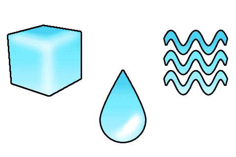

水的三个不同状态

虽然编程设计模式中没有超出我们自身实现之外的硬性规则，但 FSM 的一个特点是任何给定时间都处于一个，并且只有一个状态。话虽如此，转换允许在两个状态之间进行“交接”，就像冰慢慢融化成水一样。此外，一个代理可以拥有多个 FSM，驱动任何数量的行为，状态甚至可以包含它们自己的状态机——想想克里斯托弗·诺兰的*盗梦空间*，但用状态机代替梦境。

在 C# 和 Unity 中，有限状态机（FSM）有许多不同的实现和变体，其中许多可以在 Unity Asset Store 中找到，但它们有一些关键特性：

+   它们定义了对象可能处于的各种状态

+   它们提供了一种从一种状态转换到另一种状态的机制

+   它们提供了一种定义控制转换规则的方式

Unity 的 Mecanim 系统，虽然最初是为了以基于状态的方式驱动动画而设计的，但它非常适合提供更通用、更少为人所知的 FSM 功能。

# 创建状态机行为

既然我们已经熟悉了状态机的概念，让我们动手实现我们自己的状态机。

截至 Unity 2017.1，状态机仍然是动画系统的一部分，但不用担心，它们是灵活的，实际上不需要动画来实现它们。如果你看到引用 `Animator` 组件或 `AnimationController` 资产的代码，不要感到惊讶或困惑，因为这仅仅是当前实现的一个特性。Unity 可能会在以后的版本中解决这个问题，但概念可能不会改变。

让我们启动 Unity，创建一个新的项目，并开始操作。

# 创建 AnimationController 资产

`AnimationController` 资产是 Unity 中的一种资源类型，用于处理状态和转换。本质上，它是一个 FSM，但它还做了更多。我们将专注于其功能中的 FSM 部分。动画控制器可以从资产菜单创建，如下面的图像所示：

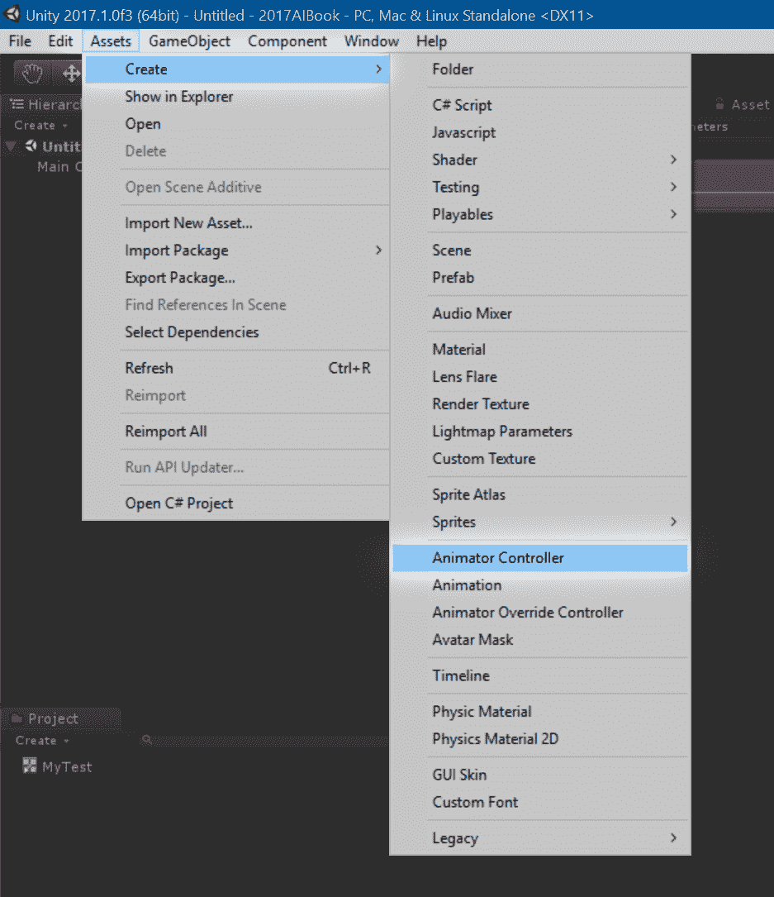

一旦创建动画控制器，它就会出现在你的项目资源文件夹中，准备被命名。我们将命名为 `TankFsm`。当你选择动画控制器时，与大多数其他资源类型不同，层次结构是空的。这是因为动画控制器使用它们自己的窗口。你可以简单地点击层次结构中的“打开”来打开动画器窗口，或者像以下截图所示，在窗口菜单中打开：

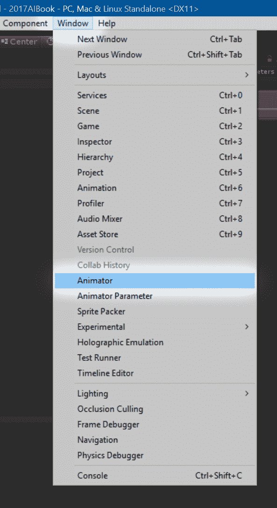

确保选择“Animator”而不是“Animation”，因为这两个窗口和功能完全不同。

在继续之前，让我们熟悉这个窗口。

# 层和参数

如同其名，层允许我们在彼此之上堆叠不同的状态机级别。这个面板允许我们轻松组织层，并有一个视觉表示。目前我们在这个面板上不会做太多，因为它主要与动画相关，但了解它是好的。参考以下窗口截图以了解如何在层中导航：

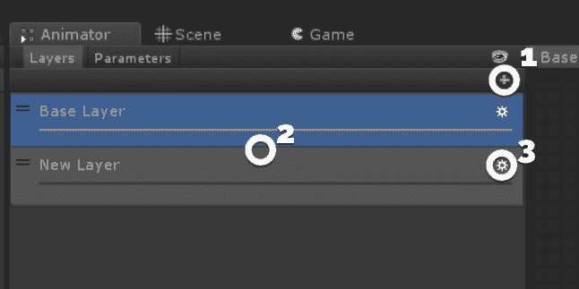

以下是上一张截图中所显示的项目摘要：

+   **添加层**：+ 按钮在列表底部创建一个新的层。

+   **层列表**：这些是目前在动画控制器内部的层。你可以点击来选择一个层，并通过拖放来重新排列层。

+   **层设置**：齿轮图标会弹出一个菜单，用于编辑层的特定动画设置。

其次，我们有参数面板，这与我们的动画控制器使用密切相关。参数是决定何时在状态之间转换的变量，我们可以通过脚本访问它们来驱动我们的状态。有四种类型的参数——`float`、`int`、`bool`和`trigger`。你应该已经熟悉前三种，因为它们是 C#中的基本类型，但`trigger`是特定于动画控制器的，不要与物理触发器混淆，物理触发器在这里不适用。触发器只是显式触发状态之间转换的一种手段。

以下截图显示了参数面板中的元素：

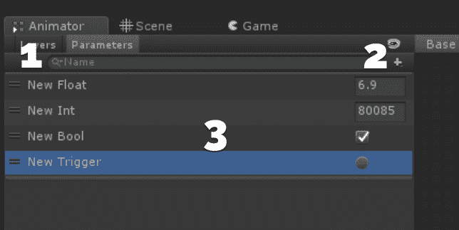

下面是上一张截图中所展示的项目摘要：

+   **搜索**：我们可以在这里快速搜索我们的参数。只需输入名称，列表就会填充搜索结果。

+   **添加参数**：此按钮允许你添加新参数。当你点击它时，你必须选择参数类型。

+   **参数列表**：这是你创建的参数列表。你可以在这里分配和查看它们的值。你也可以通过拖放来重新排列参数，以符合你的喜好。这只是为了组织，根本不影响功能。

最后，有一个眼球图标，你可以点击来完全隐藏层和参数面板。当面板关闭时，你仍然可以通过点击层下拉菜单并选择创建新层来创建新层：

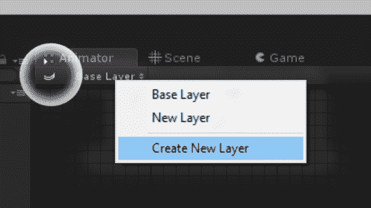

# 动画控制器检查器

动画控制器检查器与 Unity 中找到的常规检查器略有不同。虽然常规检查器允许你向游戏对象添加组件，但动画控制器检查器有一个名为“添加行为”的按钮，允许你向其中添加`StateMachineBehaviour`。这是两种类型检查器之间的主要区别，但除此之外，它将显示任何选定状态、子状态、过渡或混合树的序列化信息，就像常规检查器显示选定游戏对象及其组件的数据一样。

# 将行为引入画面

状态机行为是 Unity 5 中的一个独特、新的概念。虽然状态在 Mecanim 的原版实现中在概念上存在，但过渡是在幕后处理的，你无法对进入、转换或退出状态时发生的事情有太多控制。Unity 5 通过引入行为来解决这一问题；它们提供了处理典型有限状态机（FSM）逻辑的内置功能。

行为（Behaviors）是狡猾且复杂的。尽管它们的名称可能让你认为它们与`MonoBehaviour`有关联，但不要上当；实际上，这两者最多只是远亲。实际上，行为是从`ScriptableObject`派生出来的，而不是从`MonoBehaviour`，因此它们仅作为资产存在，不能放置在场景中或作为组件添加到`GameObject`中。

# 创建我们的第一个状态

好吧，所以这个标题并不完全准确，因为 Unity 在我们的动画控制器中为我们创建了一些默认状态——New State、Any State、Entry 和 Exit，但让我们先同意现在我们不考虑这些。让我们看看我们可以在新创建的动画控制器中做些什么：

+   您可以通过单击此窗口中的状态来选择它们，并且可以通过拖放它们到画布上的任何位置来移动它们。

+   选择名为“New State”的状态，并通过右键单击然后点击删除或简单地按键盘上的*Delete*键来删除它。

+   如果您选择 Any State 状态，您会注意到您没有删除它的选项。Entry 状态也是如此。这些是在动画控制器中必需的状态，并且有独特的用途，我们将在稍后讨论：

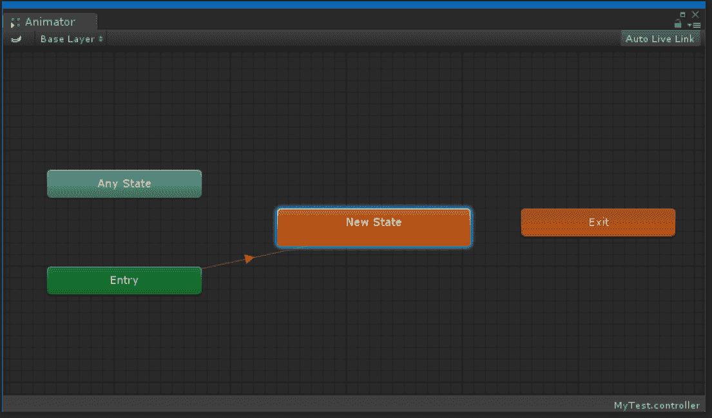

要创建我们的（真正的）第一个状态，请在画布上的任何位置右键单击，然后选择创建状态，这将打开一些选项，我们将从中选择空状态。其他两个选项，从所选剪辑和从新混合树创建，对我们当前的项目并不立即适用，所以我们将跳过这些选项。现在我们已经正式创建了我们的第一个状态。

# 状态之间的转换

您会注意到，在创建我们的状态时，一个箭头被创建，连接到 Entry 状态，并且它的节点是橙色的。Unity 会自动将默认状态设置为橙色，以区分其他状态。当您只有一个状态时，它将自动被选中为默认状态，并且因此，它将自动连接到入口状态。您可以通过右键单击它并点击设置为层默认状态来手动选择哪个状态是默认状态。它将变成橙色，入口状态将自动连接到它。连接的箭头是**转换连接器**。转换连接器允许我们控制转换如何以及何时发生，但从入口状态到默认状态的连接器是独特的，因为它不为我们提供任何选项，因为这个转换是自动发生的。

您可以通过右键单击状态节点并选择创建转换来手动分配状态之间的转换。这将从您选择的状态创建一个转换箭头到鼠标光标。要选择转换的目标，只需单击目标节点即可。请注意，您不能重定向转换。我们只能希望 Unity 背后的好心人在以后添加该功能，但到目前为止，您必须通过选择它并删除它来删除转换，然后手动分配全新的转换。

# 设置我们的玩家坦克

打开本书附带的本章示例项目。

在您的项目文件夹中按组组织类似资产是一个好主意，以保持它们有序。例如，您可以将您的状态机放在名为`StateMachines`的文件夹中。本章提供的资产已经分组，因此您可以将本章创建的资产和脚本拖放到相应的文件夹中。

# 创建敌人坦克

让我们继续在你的资产文件夹中创建一个动画控制器。这将是你敌人坦克的状态机。命名为`EnemyFsm`。

这个状态机将驱动坦克的基本动作。正如之前在示例中所述，敌人可以巡逻、追逐并射击玩家。让我们继续设置我们的状态机。选择`EnemyFsm`资产并打开动画器窗口。

现在，我们将继续创建三个空状态，这些状态在概念上和功能上代表我们的敌人坦克的状态。命名为`Patrol`、`Chase`和`Shoot`。一旦创建并命名，我们就要确保我们分配了正确的默认状态。目前，这取决于你创建和命名状态的顺序，但我们希望巡逻状态是默认状态，所以右键单击它并选择设置为层默认状态。现在它被涂成橙色，入口状态连接到它。

# 选择转换

在这一点上，我们必须就我们的状态如何相互流动做出一些设计和逻辑决策。当我们规划这些转换时，我们还想记住触发转换的条件，以确保它们是逻辑的，并且从设计角度来说是可行的。在野外，当你自己应用这些技术时，不同的因素将影响这些转换的处理方式。为了最好地说明当前的主题，我们将保持我们的转换简单且逻辑清晰：

+   **巡逻**：从巡逻状态，我们可以过渡到追逐状态。我们将使用一系列条件来选择我们将过渡到哪个状态，如果有的话。敌人坦克能看到玩家吗？如果是，我们进入下一步；如果不是，我们继续巡逻。

+   **追逐**：从这个状态开始，我们希望继续检查玩家是否在视线范围内以继续追逐，是否足够近可以射击，或者完全看不见——这将使我们回到巡逻状态。

+   **射击**：和之前一样，我们想要检查射击范围，然后是视线，以确定我们是否可以追击进入射程。

这个特定的例子有一组简单且清晰的转换规则。如果我们相应地连接我们的状态，最终得到的图将大致类似于这个：

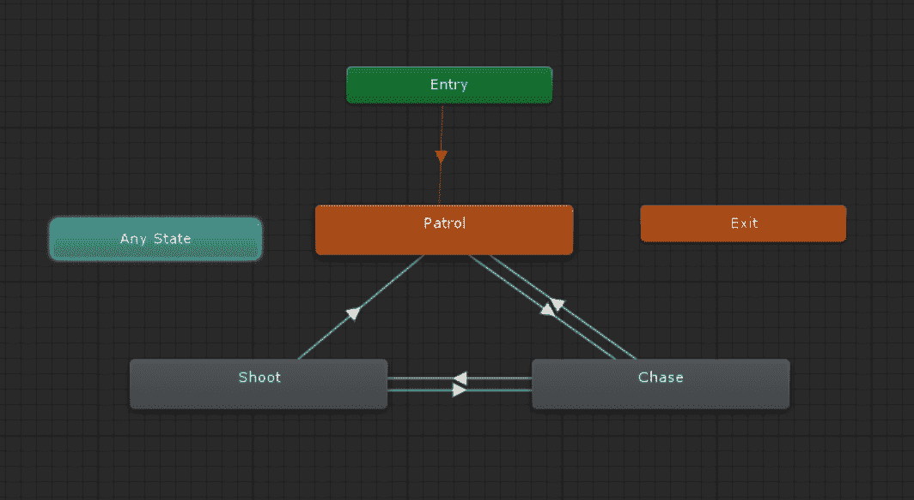

请记住，节点的放置完全取决于你，并且它不会以任何方式影响状态机的功能。你可以尝试以保持它们组织的方式放置节点，这样你就可以通过视觉跟踪你的转换。

现在我们已经绘制了状态图，让我们给它们分配一些行为。

# 让齿轮转动

这正是你一直等待的部分。我知道，我让你等了，但这是有原因的。现在我们准备开始编码，我们对 FSM 中状态之间的逻辑联系有了很好的理解。无需多言，选择我们的巡逻状态。在层次结构中，你会看到一个标有添加行为（Add Behaviour）的按钮。点击这个按钮会弹出一个上下文菜单，它与常规游戏对象上的添加组件（Add Component）按钮非常相似，但正如我们之前提到的，这个按钮创建的是独一无二的州机行为。

好吧，给这个行为命名为`TankPatrolState`。这样做会在你的项目中创建一个同名的脚本，并将其附加到创建它的状态上。你可以通过项目窗口打开这个脚本，或者通过在检查器中双击脚本的名称。你将看到的内容将类似于这个：

```py
using UnityEngine; 
using System.Collections; 

public class TankPatrolState : StateMachineBehaviour { 

   // OnStateEnter is called when a transition starts and the state machine starts to evaluate this state 
   //override public void OnStateEnter(Animator animator, AnimatorStateInfo stateInfo, int layerIndex) { 
   // 
   //} 

   // OnStateUpdate is called on each Update frame between OnStateEnter and OnStateExit callbacks 
   //override public void OnStateUpdate(Animator animator, AnimatorStateInfo stateInfo, int layerIndex) { 
   // 
   //} 

   // OnStateExit is called when a transition ends and the state machine finishes evaluating this state 
   //override public void OnStateExit(Animator animator, AnimatorStateInfo stateInfo, int layerIndex) { 
   // 
   //} 

   // OnStateMove is called right after Animator.OnAnimatorMove(). Code that processes and affects root motion should be implemented here 
   //override public void OnStateMove(Animator animator, AnimatorStateInfo stateInfo, int layerIndex) { 
   // 
   //} 

   // OnStateIK is called right after Animator.OnAnimatorIK(). Code that sets up animation IK (inverse kinematics) should be implemented here. 
   //override public void OnStateIK(Animator animator, AnimatorStateInfo stateInfo, int layerIndex) { 
   // 
   //} 
}
```

下载示例代码

你可以从你购买的所有 Packt Publishing 书籍的账户中下载示例代码文件。[`www.packtpub.com`](http://www.packtpub.com)。如果你在其他地方购买了这本书，你可以访问[`www.packtpub.com/support`](http://www.packtpub.com/support)并注册，以便将文件直接通过电子邮件发送给你。

在我们开始之前，取消注释每个方法。让我们一步一步来分析。Unity 为你创建了此文件，但所有方法都被注释掉了。本质上，被注释的代码充当指南。就像为`MonoBehaviour`提供的那些方法一样，这些方法是由底层逻辑为你调用的。你不需要了解幕后发生了什么就可以使用它们；你只需要知道它们何时被调用，以便利用它们。幸运的是，被注释的代码提供了每个方法被调用时的简要描述，并且名称本身相当具有描述性。这里有两个我们不需要担心的方法，`OnStateIK`和`OnStateMove`，它们是动画消息，所以你可以直接删除它们并保存文件。

为了重申代码注释中所述的内容，以下事情会发生：

+   `OnStateEnter`在进入状态时被调用，紧接着`MonoBehaviors`更新之后

    转换开始

+   `OnStateUpdate`在每一帧调用，在`MonoBehaviors`更新之后

+   `OnStateExit` 在离开状态完成后被调用

如我们所述，以下两个状态是动画特定的，因此我们不会为我们的目的使用它们：

+   `OnStateIK` 在 IK 系统更新之前被调用；这是一个动画和绑定特定的概念

+   `OnStateMove` 用于设置了根运动的头像

另一个需要注意的重要信息是传递给这些方法的参数：

+   `animator` 参数是对包含此动画控制器以及因此状态机的动画器的引用。通过扩展，你可以获取动画控制器所在的游戏对象的引用，然后你可以从中获取附加到它上的任何其他组件。记住，状态机行为仅作为一个资产存在，并不存在于类中，这意味着这是获取运行时类引用（如 Mono 行为）的最佳方式。

+   动画器状态信息提供了关于你当前所在状态的信息；然而，这个用途主要集中在对动画状态信息的处理上，因此对我们应用程序来说并不那么有用。

+   最后，我们有层索引，它是一个整数，告诉我们我们的状态在状态机中的哪一层。基本层索引为零，并且每个高于该层的层都有一个更高的数字。

现在我们已经了解了状态机行为的基本原理，让我们整理好其余的组件。在我们真正看到这些行为发挥作用之前，我们必须回到我们的状态机并添加一些将驱动状态的参数。

# 设置条件

我们需要为我们的敌人坦克提供一些条件以转换状态。这些是实际驱动功能的参数。

让我们从巡逻状态开始。为了让我们的敌人坦克从巡逻状态切换到射击状态，我们需要在玩家的范围内；换句话说，我们将检查敌人和玩家之间的距离，这最好用浮点值表示。因此，在你的参数面板中添加一个浮点数，并将其命名为 `distanceFromPlayer`。我们还可以使用此参数来确定是否进入追逐状态。

射击状态和追逐状态将共享一个共同的条件，即玩家是否可见。我们将通过一个简单的射线投射来确定这一点，这将反过来告诉我们玩家是否在视线范围内。最适合这个的参数是布尔值，因此创建一个布尔值并将其命名为 `isPlayerVisible`。保持参数未选中，这意味着 false。

现在我们将通过过渡连接器的检查器分配条件。为此，只需选择一个连接器。选择后，检查器将显示有关当前过渡的一些信息，最重要的是条件，它们将显示为一个列表。要添加条件，只需单击+（加号）符号：

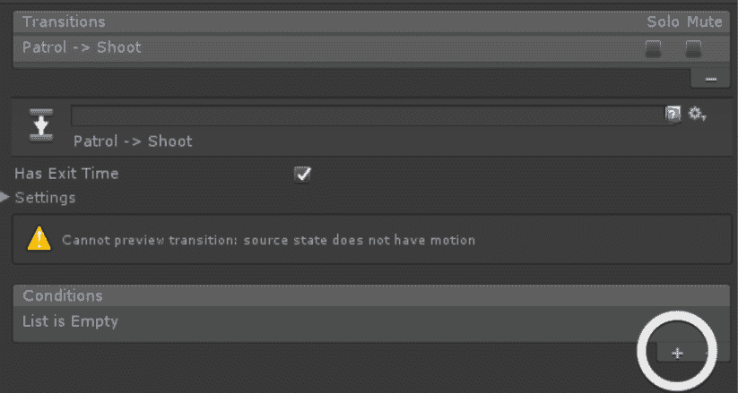

让我们逐个解决每个过渡：

+   巡逻追击

    +   distanceFromPlayer < 5

    +   isPlayerVisible == true

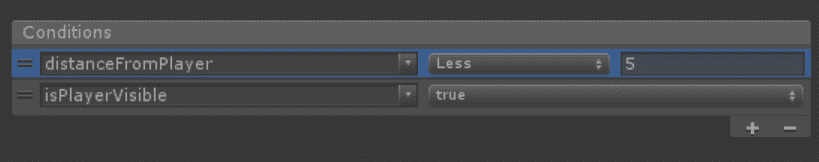

巡逻到追击的转换条件

追击巡逻变得更有趣，因为我们有两个**独立**的条件可以触发转换。如果我们简单地在那个转换中添加两个条件，两个条件都必须评估为真，转换才会发生。但我们要检查玩家是否超出范围或看不见。幸运的是，我们可以在相同两个状态之间有多个转换。就像通常那样添加另一个转换连接。在“追击”状态上右键单击，然后转换到“巡逻”状态。你会注意到现在在检查器顶部列出了两个转换。此外，你的转换连接指示器显示多个箭头而不是一个，以表示这两个状态之间存在多个转换。在检查器中选择每个转换，你可以为每个转换设置不同的条件：

+   追击巡逻（A）

    +   distanceFromPlayer > 5

+   追击巡逻（B）

    +   isPlayerVisible == false

+   追击射击

    +   distanceFromPlayer < 3

    +   isPlayerVisible == true

+   射击追击

    +   distanceFromPlayer > 3

    +   distanceFromPlayer < 5

    +   isPlayerVisible == true

+   射击巡逻（A）

    +   distanceFromPlayer > 6

+   射击巡逻（B）

    +   isPlayerVisible == false

我们现在已经设置了状态和转换。接下来，我们需要创建一个脚本，来驱动这些值。我们只需要设置这些值，状态机就会处理其余的部分。

# 通过代码驱动驾驶参数

在继续之前，我们需要从本章早期导入的资产中获取一些东西。首先，打开本章的`DemoScene`。你会注意到场景相当简化，只包含一个环境预制体和一些航点变换。现在就放下`EnemyTankPlaceholder`预制体到场景中。

你可能会注意到`EnemyTank`上的一些你可能熟悉或不熟悉的组件。我们将在第四章“寻找你的路”中彻底探索`NavMesh`和`NavMeshAgent`，但到目前为止，这些是使整个系统工作所必需的组件。你将想要关注的是`Animator`组件，它将包含我们之前创建的状态机（动画控制器）。继续并放下状态机到空槽中，然后继续。

我们还需要为玩家设置一个占位符。现在就放一个`PlayerTankPlaceholder`预制体进去。目前我们不会对它做太多操作。就像敌人坦克占位符预制体一样，玩家坦克占位符预制体有几个组件我们现在可以忽略。只需将其放置在场景中，然后继续。

接下来，你需要在`EnemyTankPlaceholder`游戏对象上添加一个新的组件——位于`Chapter 2`脚本文件夹中的`TankAi.cs`脚本。如果我们打开脚本，我们会发现它里面是这样的：

```py
using UnityEngine; 
using System.Collections; 

public class TankAi : MonoBehaviour { 
    // General state machine variables 
    private GameObject player; 
    private Animator animator; 
    private Ray ray; 
    private RaycastHit hit; 
    private float maxDistanceToCheck = 6.0f; 
    private float currentDistance; 
    private Vector3 checkDirection; 

    // Patrol state variables 
    public Transform pointA; 
    public Transform pointB; 
    public NavMeshAgent navMeshAgent; 

    private int currentTarget; 
    private float distanceFromTarget; 
    private Transform[] waypoints = null; 

    private void Awake() { 
        player = GameObject.FindWithTag("Player"); 
        animator = gameObject.GetComponent<Animator>(); 
        pointA = GameObject.Find("p1").transform; 
        pointB = GameObject.Find("p2").transform; 
        navMeshAgent = gameObject.GetComponent<NavMeshAgent>(); 
        waypoints = new Transform[2] { 
            pointA, 
            pointB 
        }; 
        currentTarget = 0; 
        navMeshAgent.SetDestination(waypoints[currentTarget].position); 
    } 

    private void FixedUpdate() { 
        //First we check distance from the player  
        currentDistance = Vector3.Distance(player.transform.position, transform.position); 
        animator.SetFloat("distanceFromPlayer", currentDistance); 

        //Then we check for visibility 
        checkDirection = player.transform.position - transform.position; 
        ray = new Ray(transform.position, checkDirection); 
        if (Physics.Raycast(ray, out hit, maxDistanceToCheck)) { 
            if(hit.collider.gameObject == player){ 
                animator.SetBool("isPlayerVisible", true); 
            } else { 
                animator.SetBool("isPlayerVisible", false); 
            } 
        } else { 
            animator.SetBool("isPlayerVisible", false); 
        } 

        //Lastly, we get the distance to the next waypoint target 
        distanceFromTarget = Vector3.Distance(waypoints[currentTarget].position, transform.position); 
        animator.SetFloat("distanceFromWaypoint", distanceFromTarget); 
    } 

    public void SetNextPoint() { 
        switch (currentTarget) { 
            case 0: 
                currentTarget = 1; 
                break; 
            case 1: 
                currentTarget = 0; 
                break; 
        } 
        navMeshAgent.SetDestination(waypoints[currentTarget].position); 
    } 
}
```

我们有一系列变量是运行此脚本所必需的，所以我们将逐一说明它们的作用：

+   `GameObject player`：这是我们对之前放置的玩家占位符预制体的引用。

+   `Animator animator`：这是我们敌方坦克的动画控制器，其中包含我们创建的状态机。

+   `Ray ray`：这是一个用于在 `FixedUpdate` 循环中进行射线投射测试的射线声明。

+   `RaycastHit hit`：这是一个用于从我们的射线投射测试中接收到的碰撞信息的声明。

+   `Float maxDistanceToCheck`：这个数字与我们之前在状态机中设置的值相匹配。本质上，我们是在说我们只检查玩家这个距离范围内的值。超出这个范围，我们可以假设玩家已经超出范围。

+   `Float currentDistance`：这是玩家和敌方坦克之间的当前距离。

你会注意到我们跳过了一些变量。不用担心，我们稍后会回来覆盖这些。这些是我们将在巡逻状态中使用的变量。

我们的 `Awake` 方法处理获取玩家和动画控制器变量的引用。你还可以将前面的变量声明为公共的或使用 `[SerializeField]` 属性作为前缀，并通过检查器设置它们。

`FixedUpdate` 方法相当直接；第一部分获取玩家位置和敌方坦克之间的距离。需要特别注意的部分是 `animator.SetFloat("distanceFromPlayer", currentDistance)`，它将此脚本中的信息传递到我们之前为状态机定义的参数。对于代码的前一部分也是如此，它将射线投射的结果作为布尔值传递。最后，它设置了 `distanceFromTarget` 变量，我们将在下一节中使用它。

如你所见，没有代码涉及状态机如何或为什么处理转换；它只是传递状态机所需的信息，状态机处理其余部分。很酷，对吧？

# 让我们的敌方坦克移动

你可能已经注意到，除了我们尚未覆盖的变量之外，我们的坦克还没有移动逻辑。这可以通过一个子状态机轻松处理，这是一个状态内的状态机。这听起来可能有些令人困惑，但我们可以轻松地将巡逻状态分解为子状态。在我们的例子中，巡逻状态将处于两个子状态之一——移动到当前航标或寻找下一个航标。航标本质上是我们智能体移动的目标。为了进行这些更改，我们需要再次进入我们的状态机。

首先，通过在画布上的空白区域单击并选择创建子状态机来创建一个子状态。由于我们已经有原始的 Patrol 状态及其所有相关连接，我们只需将 Patrol 状态拖放到新创建的子状态中即可合并这两个状态。当你将 Patrol 状态拖动到子状态上时，你会注意到光标旁边出现一个加号；这意味着你正在向另一个状态添加一个状态。当你放下 Patrol 状态时，新的子状态将吸收它。子状态有独特的外观：它们是六边形的而不是矩形的。继续将子状态重命名为`Patrol`：

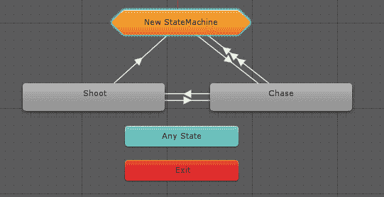

要进入子状态，只需双击它。把它想象成进入子状态的一个层级。窗口看起来相当相似，但你将会注意到一些事情——你的 Patrol 状态连接到一个名为（Up）Base Layer 的节点，这实际上是从这个层级到子状态机所在的上层级的连接。入口状态直接连接到 Patrol 状态。

很遗憾，这不是我们想要的功能，因为它是一个闭环，不允许我们进入和退出状态到我们需要创建的单独航点状态；所以让我们做一些修改。首先，我们将子状态的名字改为`PatrolEntry`。接下来，我们需要分配一些转换。当我们进入这个入口状态时，我们想要决定是继续移动到当前航点，还是找到一个新的航点。我们将每个结果表示为一个状态，因此创建两个状态，`MovingToTarget`和`FindingNewTarget`，然后从 PatrolEntry 状态到每个新状态创建转换。同样，你也会想要在这两个新状态之间创建一个转换，即从`MovingToTarget`状态到`FindingNewTarget`状态以及相反的转换。现在，添加一个新的浮点参数`distanceFromWaypoint`并设置如下条件：

+   从 PatrolEntry 到 MovingToTarget：

    +   distanceFromWaypoint > 1

+   从 PatrolEntry 到 FindingNewTarget：

    +   distanceFromWaypoint < 1

+   从 MovingToTarget 到 FindingNewTarget：

    +   distanceFromWaypoint < 1

你可能想知道为什么我们没有将转换规则从 FindingNewTarget 状态分配到 MovingToTarget 状态。这是因为我们将通过状态机行为执行一些代码，然后自动进入 MovingToTarget 状态，而不需要任何条件。继续选择 FindingNewTarget 状态并添加一个行为，命名为`SelectWaypointState`。

打开新的脚本并删除所有方法，除了`OnStateEnter`。向其中添加以下功能：

```py
TankAi tankAi = animator.gameObject.GetComponent<TankAi>();
tankAi.SetNextPoint();
```

我们在这里做的是获取我们的`TankAi`脚本的引用并调用其`SetNextPoint()`方法。很简单，对吧？

最后，我们需要重新设计我们的输出连接。我们的新状态没有从这个级别退出的转换，因此我们需要添加一个，使用与巡逻进入状态相同的条件，到（向上）基本层状态。这就是 Any State 派上用场的地方——它允许我们从任何状态转换到另一个状态，无论是否存在单独的转换连接，这样我们就不必为每个状态添加到（向上）基本层状态的转换；我们只需将其添加一次到 Any State，就设置好了！从 Any State 添加一个到巡逻进入状态的转换，并使用与进入状态相同的条件到（向上）基本层状态。这是解决无法直接从 Any State 连接到（向上）基本层状态的解决方案。

当你完成时，你的子状态机应该看起来类似于这样：

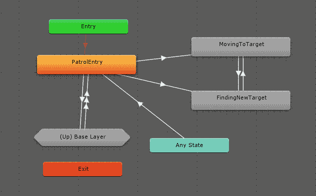

# 测试

现在，我们只需按下播放键，观察我们的敌方坦克在两个提供的航点之间来回巡逻。如果我们把玩家放置在编辑器中，在敌方坦克的路径上，我们会看到在动画器中发生转换，从巡逻状态退出并进入追逐状态，当我们把玩家移出范围时，又回到巡逻状态。你会注意到我们的追逐和射击状态还没有完全完善。这是因为我们将通过我们在第三章，“实现传感器”，和第四章，“找到你的路”中将要介绍的概念来实现这些状态。

# 摘要

在本章中，我们学习了如何在 Unity 2017 中实现状态机，使用基于动画器和控制器的状态机来构建我们的坦克游戏。我们了解了状态机行为以及状态之间的转换。在掌握了所有这些概念之后，我们将简单的状态机应用于一个智能体，从而创建了我们的第一个人工智能实体！

在下一章中，我们将继续构建我们的坦克游戏，并给我们的智能体提供更复杂的方法来感知周围的世界。
