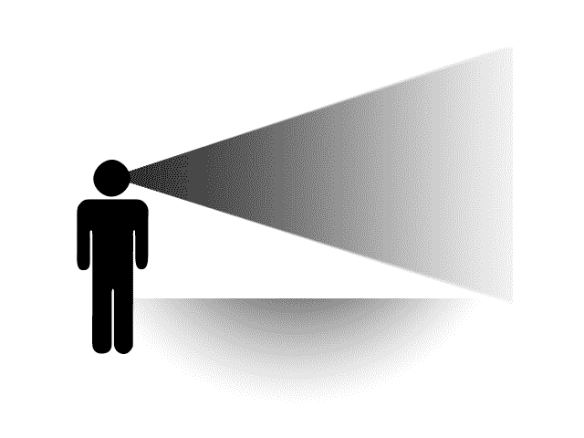
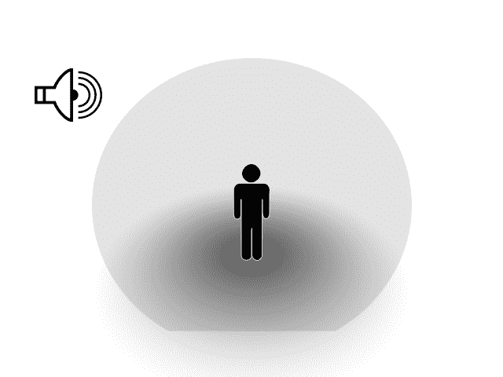
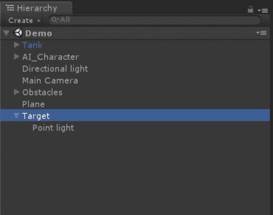
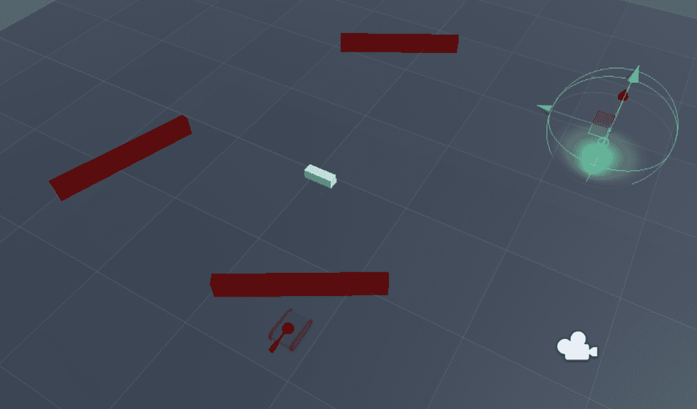
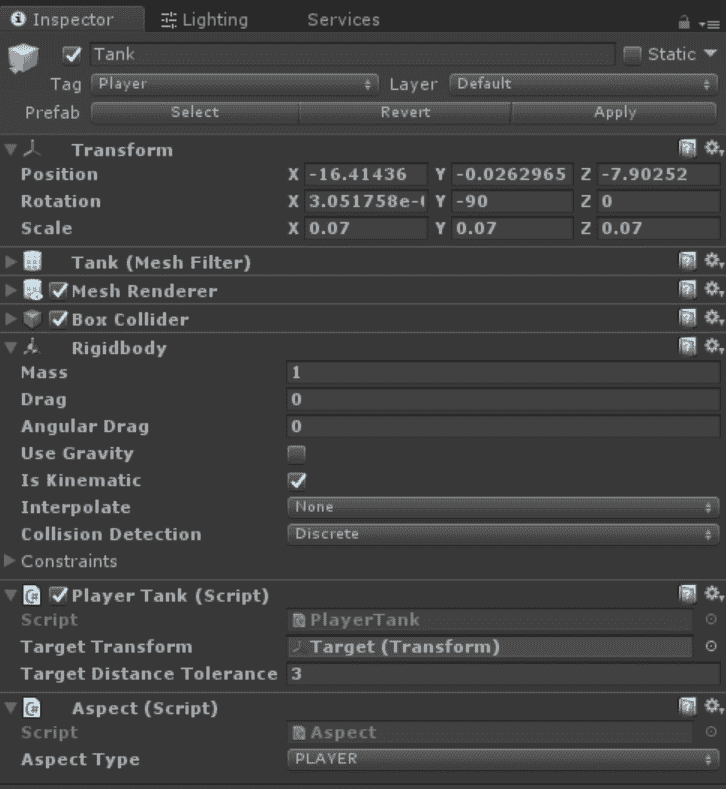
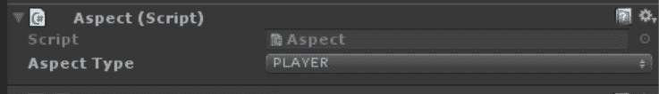
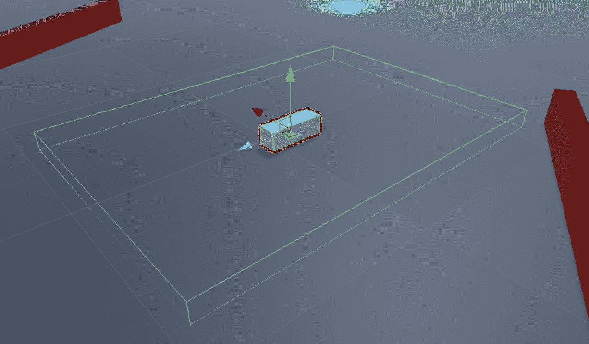
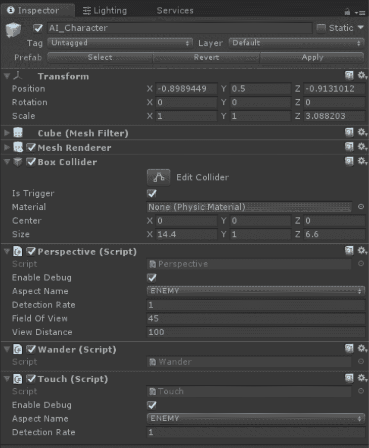
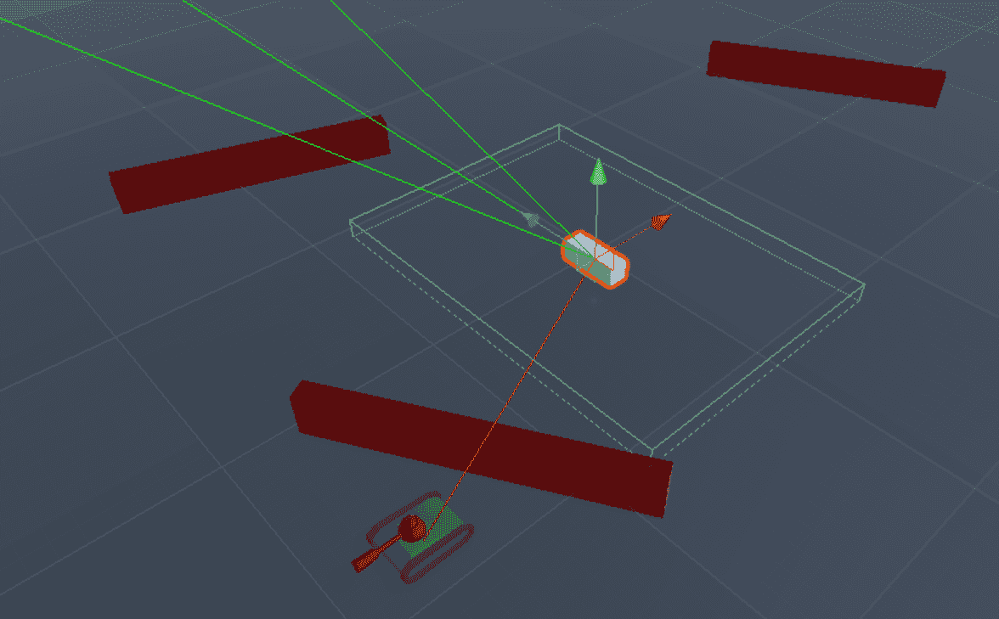

# 实现传感器

在本章中，我们将学习如何使用类似于生物体所具有的感官系统概念来实现人工智能行为。正如我们之前讨论的，一个角色人工智能系统需要对其环境有所了解，例如障碍物的位置、正在寻找的敌人的位置、敌人是否在玩家的视野中，等等。我们 NPC 的人工智能质量完全取决于它从环境中获取的信息。没有任何事情能像 NPC 卡在墙后那样打破游戏的沉浸感。基于 NPC 可以收集的信息，人工智能系统可以决定对那些数据执行哪种逻辑。如果感官系统没有提供足够的数据，或者人工智能系统无法对那些数据采取适当的行动，代理可能会开始出现故障，或者以与开发者或更重要的是玩家期望相反的方式行事。有些游戏因其滑稽的糟糕人工智能故障而臭名昭著，快速进行一次网络搜索就能找到一些人工智能故障的视频，让人忍俊不禁。

如果我们想检测所有环境参数并检查它们是否与我们的预定值相符，我们可以做到。但是，使用适当的设计模式将帮助我们维护代码，从而更容易扩展。本章将介绍我们可以用来实现感官系统的一个设计模式。我们将涵盖：

+   感官系统是什么

+   存在的一些不同的感官系统

+   如何设置带有传感器的样本罐

# 基本感官系统

我们代理的感官系统应该能够逼真地模拟现实世界的感官，如视觉、听觉等，以构建其环境模型，就像我们作为人类所做的那样。你在关掉灯后尝试在黑暗中导航房间吗？当你从关灯时的初始位置移动时，这变得越来越困难，因为你的视角发生了变化，你必须越来越多地依赖对房间布局的模糊记忆。虽然我们的感官依赖于并吸收一个不断的数据流来导航它们的环境，但我们的代理的 AI 要宽容得多，它给了我们自由，可以在预定的间隔内检查环境。这使得我们能够构建一个更高效的系统，我们可以只关注对代理相关的环境部分。

基本感官系统的概念是它将包含两个组件，`Aspect`和`Sense`。我们的 AI 角色将具有感官，例如感知、嗅觉和触觉。这些感官将寻找特定的方面，如敌人和强盗。例如，你可以有一个具有感知感官的巡逻守卫 AI，它在寻找具有敌人方面的其他游戏对象，或者它可能是一个具有嗅觉感官的僵尸实体，它在寻找被定义为大脑方面的其他实体。

对于我们的演示，这基本上是我们将要实现的内容——一个基础接口称为`Sense`，它将由其他自定义感官实现。在本章中，我们将实现视角和触觉感官。视角是动物用来观察周围世界的方式。如果我们的 AI 角色看到敌人，我们希望得到通知，以便我们可以采取一些行动。同样，对于触觉，当敌人过于接近时，我们希望能够感知到这一点，几乎就像我们的 AI 角色能听到敌人就在附近一样。然后我们将编写一个最小的`Aspect`类，我们的感官将寻找这个类。

# 视野锥

在第二章*，*《有限状态机与您*，我们设置了我们的智能体，使用视线来检测玩家坦克，这实际上是一个以射线形式存在的线。**射线**是 Unity 中的一个功能，允许你确定哪些对象被从一点向给定方向发射的线投射所交叉。虽然这是一种以简单方式处理视觉检测的相当有效的方法，但它并不能准确模拟大多数实体视觉工作的方式。使用视线的替代方案是使用锥形视野。如图所示，视野实际上是用锥形形状来模拟的。这可以是 2D 或 3D，根据你的游戏类型而定：



前面的图示说明了视野锥的概念。在这种情况下，从源开始，即智能体的眼睛，锥体逐渐增长，但随着距离的增加，其准确性降低，如锥体颜色逐渐变淡所示。

锥形的实际实现可以从基本的重叠测试到更复杂的现实模型，模仿视觉。在简单实现中，只需要测试一个对象是否与视野锥重叠，忽略距离或边缘。复杂实现更接近地模仿视觉；随着锥体从源向外扩展，视野增长，但看到锥体边缘事物的机会与源中心附近的事物相比减少。

# 使用球体进行听觉、触觉和嗅觉

一种非常简单而有效的方式来模拟声音、触觉和嗅觉，就是通过使用球体。例如，对于声音，我们可以想象中心是声源，而响度随着听众离中心越远而逐渐消散。相反，听众可以被模拟，代替或补充声音源。听众的听觉通过一个球体来表示，离听众最近的声源更有可能被“听到”。我们可以修改球体的大小和位置相对于我们的智能体，以适应感觉和嗅觉。

下图展示了我们的球体以及我们的智能体如何适应这个设置：



就像视觉一样，根据传感器距离或简单的重叠事件（即只要源重叠球体，感官事件总是被检测到），可以修改代理注册感官事件的可能性。

# 通过全知全能扩展人工智能

简而言之，全知全能实际上只是让你的 AI 作弊的一种方式。虽然你的代理不一定知道一切，但这仅仅意味着他们*可以*知道任何事情。在某种程度上，这似乎与现实主义相反，但通常最简单的解决方案是最好的解决方案。让我们的代理访问其周围环境或游戏世界中看似隐藏的信息，可以是一个强大的工具，为游戏提供额外的复杂性。

在游戏中，我们倾向于使用具体值来建模抽象概念。例如，我们可能用一个从 0 到 100 的数值来表示玩家的健康。让我们的代理访问这类信息允许它做出现实的决定，即使获取这类信息在现实中并不现实。你也可以将全知全能视为你的代理能够*使用原力*或感知游戏世界中的事件，而无需*物理上*体验它们。

虽然全知全能不一定是一个特定的模式或技术，但它作为游戏开发者工具箱中的另一个工具，可以稍微作弊一下，通过在本质上弯曲人工智能的规则，并给你的代理提供他们可能无法通过*物理*手段获得的数据，从而使你的游戏更有趣。

# 在感知方面发挥创意

尽管锥形、球体和线条是代理可以看到、听到和感知其环境的最基本方式，但它们绝不是实现这些感官的唯一方式。如果你的游戏需要其他类型的感知，请随意组合这些模式。想要用圆柱体或球体来表示视野范围？那就这么做吧。想要用盒子来表示嗅觉？那就嗅吧！

利用你手中的工具，想出创造性的方法来根据你的玩家建模感知。通过混合和匹配这些概念，结合不同的方法为你的游戏创建独特的游戏机制。例如，一个对魔法敏感但失明的生物可以完全忽略他们面前的人物，直到他们施展或接收到魔法咒语的效果。也许某些 NPC 可以通过气味追踪玩家，而穿过标记为*水*的碰撞体可以清除玩家的气味，这样 NPC 就再也无法追踪他。随着你阅读本书的进展，你将获得所有实现这些和其他许多机制的工具——感知、决策、路径查找等等。在我们介绍这些技术的同时，开始思考你游戏中创意的变体。

# 设置场景

为了开始实现感知系统，你可以直接跳到本章提供的示例，或者按照以下步骤自己设置场景：

1.  让我们创建一些障碍物来阻挡 AI 角色到坦克的视线。这些障碍物将是短而宽的立方体，它们位于一个名为 `Obstacles` 的空游戏对象下。

1.  添加一个用作地面的平面。

1.  然后，我们添加一个方向光，以便我们可以看到场景中正在发生的事情。

如示例所示，有一个目标 3D 模型，我们用它作为玩家，我们用一个简单的立方体来表示我们的 AI 代理。我们还将有一个 `Target` 对象来显示我们的坦克在场景中将移动到何处。

为了简化，我们的示例提供了一个点光作为 `Target` 的子对象，这样我们就可以在游戏视图中轻松地看到我们的目标目的地。设置正确后，我们的场景层次结构将类似于以下截图：



场景层次结构

现在，我们将坦克、AI 角色和墙壁随机地放置在我们的场景中。增加平面的尺寸，使其看起来更美观。幸运的是，在这个演示中，我们的对象可以漂浮，所以没有什么会从平面上掉下来。同时，确保调整相机，以便我们可以清楚地看到以下场景：



我们的游戏场景

在完成基本设置后，我们可以开始处理驱动各种系统的代码。

# 设置玩家坦克和视角

我们的 `Target` 对象是一个简单的球体游戏对象，移除了网格渲染，因此我们最终只有 **Sphere Collider**。

查看以下位于 `Target.cs` 文件中的代码：

```py
using UnityEngine;

public class Target : MonoBehaviour
{
    public Transform targetMarker;

    void Start (){}

    void Update ()
    {
        int button = 0;

        //Get the point of the hit position when the mouse is being clicked
        if(Input.GetMouseButtonDown(button)) 
        {
            Ray ray = Camera.main.ScreenPointToRay(Input.mousePosition);
            RaycastHit hitInfo;

            if (Physics.Raycast(ray.origin, ray.direction, out hitInfo)) 
            {
                Vector3 targetPosition = hitInfo.point;
                targetMarker.position = targetPosition;
            }
        }
    }
}
```

你会注意到我们在代码中留下了一个空的 `Start` 方法。虽然留下空的 `Start`、`Update` 和其他不执行任何操作的 `MonoBehaviour` 事件会有一定的成本，但我们有时可以选择在开发过程中留下 `Start` 方法，以便在检查器中显示组件的启用/禁用切换。

将此脚本附加到我们的 `Target` 对象上，这是我们分配给检查器中的 `targetMarker` 变量的对象。该脚本检测鼠标点击事件，然后使用射线投射，检测 3D 空间中的鼠标点击点。之后，它将 `Target` 对象更新到场景中的世界空间中的该位置。

射线投射是 Unity 物理 API 的一个功能，它从给定的起点向给定的方向发射一个虚拟射线，并返回沿途遇到的任何碰撞器的数据。

# 实现玩家坦克

我们的玩家坦克是我们在 第二章 中使用的简单坦克模型，*有限状态机与您*，并附加了一个刚体组件。刚体组件是必需的，以便在与其他任何 AI 角色进行碰撞检测时生成触发事件。我们需要做的第一件事是将标签 `Player` 分配给我们的坦克。

Unity 的 Rigidbody 组件中的`isKinematic`标志使得外部力被忽略，这样您就可以完全从代码或从动画中控制 Rigidbody，同时仍然可以访问 Rigidbody API。

坦克由`PlayerTank`脚本控制，我们将在稍后创建此脚本。此脚本检索地图上的目标位置，并相应地更新其目的地点和方向。

`PlayerTank.cs`文件中的代码如下：

```py
using UnityEngine;

public class PlayerTank : MonoBehaviour 
{
    public Transform targetTransform;
    public float targetDistanceTolerance = 3.0f;

    private float movementSpeed;
    private float rotationSpeed;

  // Use this for initialization
  void Start () 
    {
        movementSpeed = 10.0f;
        rotationSpeed = 2.0f;
  }

  // Update is called once per frame
  void Update () 
    {
        if (Vector3.Distance(transform.position, targetTransform.position) < targetDistanceTolerance) 
        {
            return;
        }

        Vector3 targetPosition = targetTransform.position;
        targetPosition.y = transform.position.y;
        Vector3 direction = targetPosition - transform.position;

        Quaternion tarRot = Quaternion.LookRotation(direction);
        transform.rotation = Quaternion.Slerp(transform.rotation, tarRot, rotationSpeed * Time.deltaTime);

        transform.Translate(new Vector3(0, 0, movementSpeed * Time.deltaTime));
  }
}
```



我们坦克对象的属性

前面的截图显示了我们的脚本在应用至坦克后的检查器快照。

此脚本查询地图上`目标`对象的位置，并相应地更新其目的地点和方向。在我们将此脚本分配给我们的坦克后，务必将我们的`目标`对象分配给`targetTransform`变量。

# 实现 Aspect 类

接下来，让我们看一下`Aspect.cs`类。`Aspect`是一个非常简单的类，只有一个名为`aspectType`的公共枚举类型属性。这就是我们在这个组件中需要的所有变量。每当我们的 AI 角色感知到某物时，我们将检查`aspectType`以确定它是否是 AI 正在寻找的属性。

`Aspect.cs`文件中的代码如下：

```py
using UnityEngine;

public class Aspect : MonoBehaviour {
  public enum AspectTypes {
    PLAYER,
    ENEMY,
  }
  public AspectTypes aspectType;
}
```

将此属性脚本附加到我们的玩家坦克上，并将`aspectType`设置为`PLAYER`，如下面的截图所示：



设置坦克的属性类型

# 创建 AI 角色

我们的 NPC 将在场景中以随机方向漫游。它将具有以下两种感官：

+   视角感官将检查坦克属性是否在设定的可见范围和距离内

+   触摸感官将检测敌人属性是否与其将要添加到坦克中的盒子碰撞器发生碰撞

由于我们的玩家坦克将具有`PLAYER`属性类型，NPC 将寻找任何与其自身属性类型不相同的`aspectType`。

`Wander.cs`文件中的代码如下：

```py
using UnityEngine;

public class Wander : MonoBehaviour {
    private Vector3 targetPosition;

    private float movementSpeed = 5.0f;
    private float rotationSpeed = 2.0f;
    private float targetPositionTolerance = 3.0f;
    private float minX;
    private float maxX;
    private float minZ;
    private float maxZ;

    void Start() {
        minX = -45.0f;
        maxX = 45.0f;

        minZ = -45.0f;
        maxZ = 45.0f;

        //Get Wander Position
        GetNextPosition();
    }

    void Update() {
        if (Vector3.Distance(targetPosition, transform.position) <= targetPositionTolerance) {
            GetNextPosition();
        }

        Quaternion targetRotation = Quaternion.LookRotation(targetPosition - transform.position);
        transform.rotation = Quaternion.Slerp(transform.rotation, targetRotation, rotationSpeed * Time.deltaTime);

        transform.Translate(new Vector3(0, 0, movementSpeed * Time.deltaTime));
    }

    void GetNextPosition() {
        targetPosition = new Vector3(Random.Range(minX, maxX), 0.5f, Random.Range(minZ, maxZ));
    }
}

```

当 AI 角色达到其当前目的地点时，`Wander`脚本会在指定范围内生成一个新的随机位置。然后，`Update`方法将旋转我们的敌人并将其移动到这个新目的地。将此脚本附加到我们的 AI 角色上，以便它可以在场景中移动。`Wander`脚本相当简单，但我们在后面的章节中会介绍更高级的运动方法。

# 使用 Sense 类

`Sense`类是我们感官系统的接口，其他自定义感官可以实现它。它定义了两个虚拟方法，`Initialize`和`UpdateSense`，这些方法将在自定义感官中实现，并分别从`Start`和`Update`方法中执行。

虚拟方法是可以使用派生类中的`override`修饰符重写的方法。与`abstract`类不同，虚拟类不需要您重写它们。

`Sense.cs`文件中的代码如下所示：

```py
using UnityEngine;

public class Sense : MonoBehaviour {
  public bool enableDebug = true;
  public Aspect.AspectTypes aspectName = Aspect.AspectTypes.ENEMY;
  public float detectionRate = 1.0f;

  protected float elapsedTime = 0.0f;

  protected virtual void Initialize() { }
  protected virtual void UpdateSense() { }

  // Use this for initialization
  void Start () 
    {
    elapsedTime = 0.0f;
    Initialize();
  }

  // Update is called once per frame
  void Update () 
    {
    UpdateSense();
  }
}
```

基本属性包括执行感知操作的检测率以及它应该寻找的方面的名称。由于我们将从它派生我们的实际感知，因此此脚本将不会附加到我们的任何对象上。

# 给予一点视角

视角感知将检测特定方面是否在其视野和可见距离内。如果它看到任何东西，它将执行指定的操作，在这种情况下是将消息打印到控制台。

`Perspective.cs` 文件中的代码如下所示：

```py
using UnityEngine;

public class Perspective : Sense
{
    public int fieldOfView = 45;
    public int viewDistance = 100;

    private Transform playerTransform;
    private Vector3 rayDirection;

    protected override void Initialize() 
    {
        playerTransform = GameObject.FindGameObjectWithTag("Player").transform;
    }

    protected override void UpdateSense() 
    {
        elapsedTime += Time.deltaTime;

        if (elapsedTime >= detectionRate) 
        {
            DetectAspect();
        }
  }

    //Detect perspective field of view for the AI Character
    void DetectAspect()
    {
        RaycastHit hit;
        rayDirection = playerTransform.position - transform.position;

        if ((Vector3.Angle(rayDirection, transform.forward)) < fieldOfView)
        {
            // Detect if player is within the field of view
            if (Physics.Raycast(transform.position, rayDirection, out hit, viewDistance))
            {
                Aspect aspect = hit.collider.GetComponent<Aspect>();
                if (aspect != null)
                {
                    //Check the aspect
                    if (aspect.aspectType != aspectName)
                    {
                        print("Enemy Detected");
                    }
                }
            }
        }
    }
```

我们需要实现`Initialize`和`UpdateSense`方法，这些方法将分别从父`Sense`类的`Start`和`Update`方法中调用。在`DetectAspect`方法中，我们首先检查玩家和 AI 当前方向之间的角度。如果它在视野范围内，我们将向玩家坦克所在的方向发射一条射线。射线长度是可见距离属性的值。

`Raycast`方法将在第一次击中另一个对象时返回。这样，即使玩家在可见范围内，AI 角色也无法看到它是否隐藏在墙壁后面。然后我们检查`Aspect`组件，并且只有当被击中的对象具有`Aspect`组件且其`aspectType`与其自身不同时，它才会返回 true。

`OnDrawGizmos`方法根据视角视野角度和观看距离绘制线条，这样我们就可以在游戏测试期间在编辑器窗口中看到 AI 角色的视线。将此脚本附加到我们的 AI 角色上，并确保方面类型设置为`ENEMY`。

此方法可以表示如下：

```py
  void OnDrawGizmos()
    {
        if (playerTransform == null) 
        {
            return;
        }

        Debug.DrawLine(transform.position, playerTransform.position, Color.red);

        Vector3 frontRayPoint = transform.position + (transform.forward * viewDistance);

        //Approximate perspective visualization
        Vector3 leftRayPoint = frontRayPoint;
        leftRayPoint.x += fieldOfView * 0.5f;

        Vector3 rightRayPoint = frontRayPoint;
        rightRayPoint.x -= fieldOfView * 0.5f;

        Debug.DrawLine(transform.position, frontRayPoint, Color.green);
        Debug.DrawLine(transform.position, leftRayPoint, Color.green);
        Debug.DrawLine(transform.position, rightRayPoint, Color.green);
    }
}
```

# 触手可及即为信

我们接下来要实现的是`Touch.cs`，它在玩家坦克实体在 AI 实体附近的一定区域内时触发。我们的 AI 角色具有一个盒子碰撞体组件，并且其`IsTrigger`标志处于开启状态。

我们需要实现`OnTriggerEnter`事件，该事件将在另一个碰撞体进入此游戏对象碰撞体的碰撞区域时被调用。由于我们的坦克实体也有碰撞体和刚体组件，因此当 AI 角色的碰撞体和玩家坦克的碰撞体碰撞时，将立即引发碰撞事件。

Unity 提供了两个其他触发事件，除了`OnTriggerEnter`之外：`OnTriggerExit`和`OnTriggerStay`。使用这些事件来检测碰撞体何时离开触发器，以及在每个帧中触发器内的碰撞体何时被触发。

`Touch.cs`文件中的代码如下所示：

```py
using UnityEngine;

public class Touch : Sense
{
    void OnTriggerEnter(Collider other)
    {
        Aspect aspect = other.GetComponent<Aspect>();
        if (aspect != null)
        {
            //Check the aspect
            if (aspect.aspectType != aspectName)
            {
                print("Enemy Touch Detected");
            }
        }
    }
}
```

我们的示例 NPC 和坦克已经具有`BoxCollider`组件。NPC 的传感器碰撞体设置为`IsTrigger = true`。如果您自己设置场景，请确保您自己添加`BoxCollider`组件，并且它覆盖足够大的区域以便于测试。我们的触发器可以在以下屏幕截图中看到：



我们玩家周围的碰撞器

上一张截图显示了我们的敌人 AI 上的盒子碰撞器，我们将使用它来触发触摸感应事件。在下一张截图中，我们可以看到我们的 AI 角色是如何设置的：



我们 NPC 的属性

为了演示目的，我们只是打印出敌人方面已被触摸感应检测到，但在你自己的游戏中，你可以实现任何你想要的事件和逻辑。这个系统与本书中涵盖的其他概念结合得非常好，例如状态，我们在第二章“有限状态机与您”中学习了这些内容。

# 测试结果

在 Unity 编辑器中点击播放，并通过点击地面将玩家坦克移动到附近的游荡 AI NPC 附近。你应该在控制台日志窗口中看到“敌人触摸检测”消息，每当我们的 AI 角色靠近我们的玩家坦克时：



我们正在行动中的 NPC 和坦克

上一张截图显示了一个具有触摸和视角感应的 AI 代理正在寻找另一个方面。将玩家坦克移至 NPC 前面，你会收到“敌人检测”消息。如果你在运行游戏的同时进入编辑器视图，你应该会看到正在渲染的调试线条。这是因为我们在视角“感应”类中实现了 `OnDrawGizmos` 方法。

# 概述

本章介绍了使用传感器的概念，并为我们的 AI 角色实现了两种不同的感应——视角和触摸。感官系统是整个决策系统的一个组成部分。我们可以将感官系统与行为系统结合使用，以执行某些感官的特定行为。例如，一旦我们检测到视线范围内有敌人，我们可以使用有限状态机（FSM）从巡逻状态切换到追逐和攻击状态。我们还将介绍如何在第六章“行为树”中应用行为树系统。

在下一章中，我们将探讨流行的路径查找算法。我们将学习如何使用流行的 A* 路径查找算法，以及 Unity 自身的 `NavMesh` 系统来让我们的 AI 代理在复杂环境中导航。
