# 寻找路径

障碍物避免是一种简单的行为，允许 AI 实体到达目标点。需要注意的是，本章中实现的具体行为旨在用于如人群模拟等行为，其中每个代理实体的主要目标只是避免其他代理并到达目标。这里没有考虑最有效和最短的路径。我们将在下一节学习 A*路径查找算法。

在本章中，我们将涵盖以下主题：

+   跟随路径和转向

+   自定义 A*路径查找实现

+   Unity 内置的 NavMesh

# 沿路径行进

在深入探讨 A*算法之前，这是一种路径查找的进程式方法，我们将先实现一个更基础的基于航点的系统。虽然更高级的技术，如前面提到的 A*方法或 Unity 的 NavMesh，通常会是路径查找的首选方法，但查看一个更简单、更纯粹版本将有助于为理解更复杂的路径查找方法打下基础。不仅如此，还有许多场景中，基于航点的系统将绰绰有余，并允许对 AI 代理的行为进行更精细的控制。

在这个例子中，我们将创建一个路径，它由单独的航点组成。就我们的目的而言，航点只是一个具有 X、Y 和 Z 值的空間点；我们可以简单地使用`Vector3`来表示这些数据。通过在我们的脚本中创建一个`Vector3`的序列化数组，我们可以在检查器中轻松编辑这些点。如果你想挑战自己并调整这个系统使其更具用户友好性，你可能想要考虑使用游戏对象的数组，并使用它们的位置（一个`Vector3`）来代替。为了演示目的，提供的示例将坚持使用`Vector3`数组。在设置好数组中的某些点之后，我们希望得到的路径看起来像以下截图：

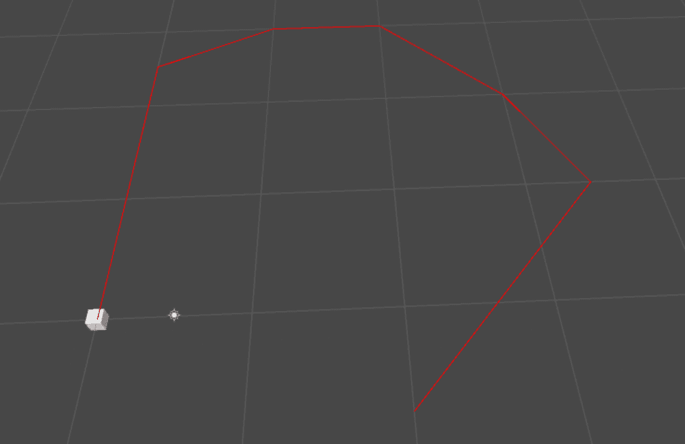

对象路径

在前面的截图，我们使用了一些调试线来绘制航点之间的连接。别担心，这里没有发生任何魔法。通过使用 Unity 的调试功能，我们可以可视化我们的代理将要穿越的路径。让我们分解`Path.cs`脚本，看看我们是如何实现这一点的。

# 路径脚本

这是我们的`Path.cs`脚本，它负责管理我们的航点：

```py
using UnityEngine;

public class Path: MonoBehaviour
{
    [SerializeField]
    private Vector3[] waypoints;

    public bool isDebug = true;
    public float radius = 2.0f;

    public float PathLength {
        get { return waypoints.Length; }
    }

    public Vector3 GetPoint(int index)
    {
        return waypoints[index];
    }

    private void OnDrawGizmos()
    {
        if (!isDebug) {
            return;
        }

        for (int i = 0; i < waypoints.Length; i++)
        {
            if (i + 1 < waypoints.Length)
            {
                Debug.DrawLine(waypoints[i], waypoints[i + 1], Color.red);
            }
        }
    }
}
```

`SerializeField`属性可以用来强制 Unity 序列化一个私有字段，并在检查器中显示它。

我们航点的`Vector3`数组是之前提到的路径中航点的集合。为了初始化航点，我们必须将脚本添加到场景中的游戏对象。在示例场景中，我们简单地创建了一个空的游戏对象并将`Path.cs`脚本附加到它。为了清晰起见，我们还把我们的游戏对象重命名为`Path`。有了准备好的`Path`游戏对象，我们可以在检查器中分配路径值。示例值如下所示：

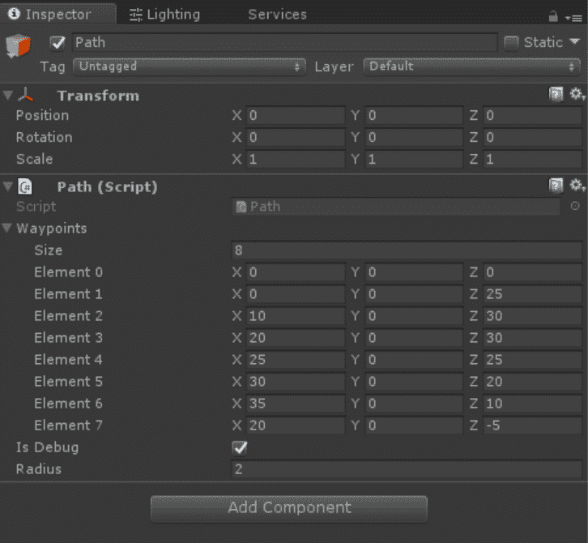

样本项目提供的路径值

这里截图中的值是任意的，可以根据您的喜好进行调整。您只需确保沿路径至少有两个航点。

`PathLength`属性简单地返回我们的航点数组的长度。它为我们私有的字段提供了一个公共的获取器，并被后来的脚本使用。`radius`变量允许我们定义路径查找的容差。我们不会期望代理精确地位于航点的位置，而是将使用一个半径来确定代理何时“足够接近”以考虑航点已被访问。`GetPoint`方法是一个简单的辅助方法，用于从数组中获取给定索引的航点。

默认将字段设置为`private`是一种常见且合适的做法，尤其是在包含的数据对类的功能至关重要时。在我们的例子中，航点顺序、数组大小等都不应在运行时修改，因此我们确保外部类只能通过使用辅助方法和属性从它们获取数据，并通过将它们设置为私有来保护它们免受外部更改。

最后，我们使用`OnDrawGizmos`，这是一个 Unity 自动为我们调用的`MonoBehaviour`方法，在编辑器的场景视图中绘制调试信息。我们可以通过将`isDebug`的值设置为`true`或`false`来切换此功能。

# 使用路径跟随器

接下来，我们将设置我们的代理以跟随上一节中定义的路径。在示例中，我们将使用一个简单的立方体，但您可以使用任何您想要的美术资源。让我们更仔细地看看示例代码中提供的`Pathing.cs`脚本：

```py
public class Pathing : MonoBehaviour 
{
    [SerializeField]
    private Path path;
    [SerializeField]
    private float speed = 20.0f;
    [SerializeField]
    private float mass = 5.0f;
    [SerializeField]
    private bool isLooping = true;

    private float currentSpeed;
    private int currentPathIndex = 0;
    private Vector3 targetPoint;
    private Vector3 direction;
    private Vector3 targetDirection;
```

第一组字段是我们希望序列化的变量，以便可以通过检查器设置。`path`是我们之前创建的`Path`对象的引用；我们可以简单地从`path`游戏对象中拖放组件到这个字段。`speed`和`mass`用于计算代理沿路径的运动。`isLooping`用于确定是否应该沿着路径循环。当为`true`时，代理将到达最后一个航点，然后转到路径上的第一个航点并重新开始。一旦所有值都分配完毕，检查器应该看起来像这样：

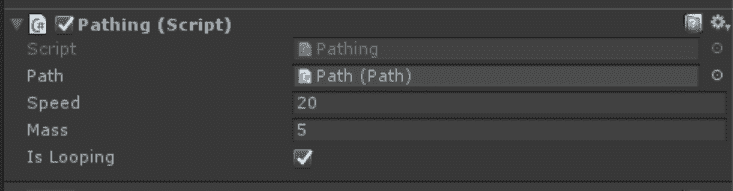

带有默认值的路径查找脚本检查器

我们的`Start`方法处理一些剩余的私有字段——`direction`和`targetPoint`的初始化：

```py
private void Start () 
    {
        // Initialize the direction as the agent's current facing direction
        direction = transform.forward; 
        // We get the firt point along the path
        targetPoint = path.GetPoint(currentPathIndex);
  }
```

我们的`Update`方法为我们做了几件事情。首先，它进行了一些模板化的空安全检查，更新代理的速度，检查目标是否已到达，调用`SetNextTarget`方法来确定下一个目标点，最后，根据需要应用方向和旋转变化：

```py
  private void Update () 
  {
        if(path == null) {
            return;
        }

        currentSpeed = speed * Time.deltaTime;

        if(TargetReached())
        {
            if (!SetNextTarget()) {
                return;
            }
        }

        direction += Steer(targetPoint);
        transform.position += direction; //Move the agent according to the direction
        transform.rotation = Quaternion.LookRotation(direction); //Rotate the agent towards the desired direction
  }
```

为了使内容更加清晰易读，我们将一些功能从`Update`方法中移出。`TargetReached`方法相当直接。它使用`path`的半径来判断代理是否足够接近目标航点，正如你在这里看到的：

```py
private bool TargetReached() 
{
    return (Vector3.Distance(transform.position, targetPoint) < path.radius);
}
```

`SetNextTarget`方法有点更有趣。正如你所见，它返回一个`bool`。如果我们还没有到达数组的末尾，它将只增加值，但如果方法无法设置下一个点，因为我们已经到达数组的末尾，并且`isLooping`为`false`，它将返回`false`。如果你回到我们的`Update`方法，你会看到当这种情况发生时，我们只是简单地退出`Update`并什么都不做。这是因为我们已经到达了路的尽头，我们的代理没有其他地方可以去。在相同的场景中，但`isLooping == true`评估为`true`时，我们将下一个目标点重置为数组中的第一个（0）：

```py
private bool SetNextTarget() 
{
    bool success = false;
    if (currentPathIndex < path.PathLength - 1) {
        currentPathIndex++;
        success = true;
    } 
    else 
    {
        if(isLooping) 
        {
            currentPathIndex = 0;
            success = true;
        } 
        else 
        {
            success = false;
        }
    }
    targetPoint = path.GetPoint(currentPathIndex);
    return success;
}
```

`Steer`方法使用给定的目标点进行一些计算，以获得新的方向和旋转。通过从当前位置（*a*）减去目标点（*b*），我们得到从*a*到*b*的方向向量。我们对该向量进行归一化，然后应用当前速度来确定这一帧在新`targetDirection`上的移动距离。最后，我们使用质量来平滑`targetDirection`和当前方向之间的加速度，并将该值作为`acceleration`返回：

```py
public Vector3 Steer(Vector3 target)
{
    // Subtracting vector b - a gives you the direction from a to b. 
    targetDirection = (target - transform.position);
    targetDirection.Normalize(); 
    targetDirection*= currentSpeed;

    Vector3 steeringForce = targetDirection - direction; 
    Vector3 acceleration = steeringForce / mass;
    return acceleration;
}
```

当你运行场景时，代理立方体将按照预期跟随路径。如果你关闭`isLooping`，代理将到达最终航点并停止在那里，但如果你保持它开启，代理将无限循环路径。尝试调整各种设置，看看它如何影响结果。

# 避免障碍

接下来，我们将查看一个避障机制。要开始，打开名为`ObstacleAvoidance`的相同场景。样本场景相当直接。除了相机和方向光之外，还有一个带有一系列块的面，这些块将作为我们的障碍物，一个立方体将作为我们的代理，以及包含一些说明文本的画布。场景将如下截图所示：

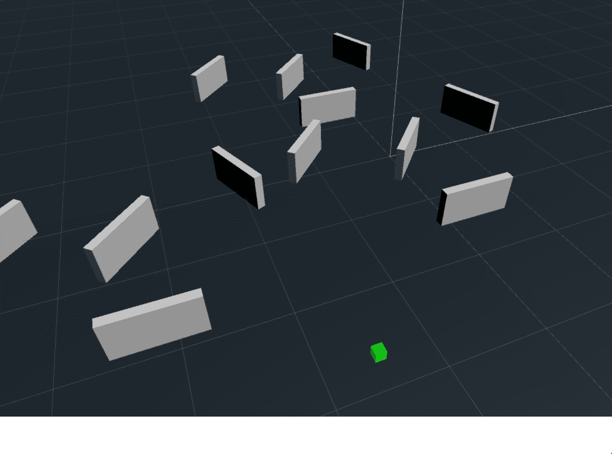

样本场景设置

前一场景图片的层次结构如下所示：

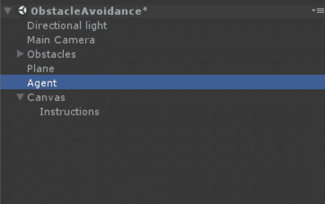

有序的层次结构

值得注意的是，这个`Agent`对象不是一个路径查找器。因此，如果我们设置太多的墙壁，我们的`Agent`可能很难找到目标。尝试几种墙壁设置，看看我们的`Agent`的表现如何。

# 添加自定义层

我们的机制依赖于射线投射来检测障碍物。我们不是假设每个对象都是障碍物，而是特别使用一个名为“障碍物”的层，并过滤掉其他所有内容。这不是 Unity 中的默认层，因此我们必须手动设置它。示例项目已经为您设置了，但如果您想添加自己的层，您可以通过两种不同的方式访问层设置窗口。第一种是通过菜单——编辑 | **项目设置** | 标签和层——第二种方法是在层次结构中选择层下拉菜单，然后选择添加层...以下截图显示了菜单在检查器右上角的位置：

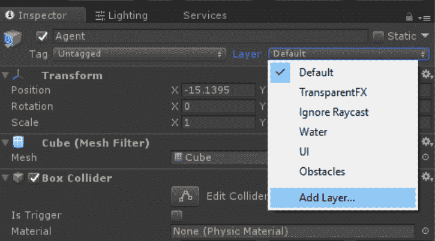

通过前一个截图所示的菜单或通过 Unity 的菜单栏选择“标签和层”菜单，将打开一个窗口，您可以在其中自由添加、编辑或删除层（以及标签，但我们目前对此不感兴趣）。让我们在第八个插槽中添加“障碍物”，如下面的截图所示：

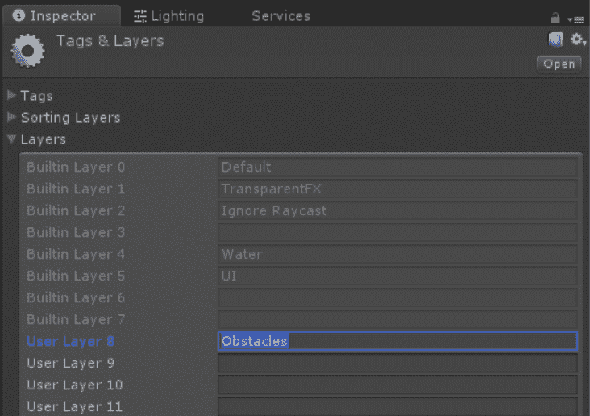

创建新层

在对设置进行任何更改后，您应该保存项目，但层没有专门的保存按钮。现在您可以在检查器中相同的下拉菜单中分配层，就像我们刚刚使用的那样，如下面的截图所示：

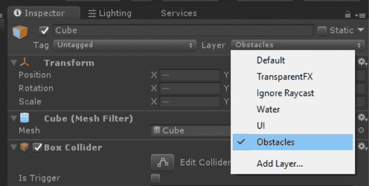

分配我们的新层

层最常被摄像机用来渲染场景的一部分，以及被灯光用来照亮场景的某些部分。但它们也可以被射线投射用来选择性地忽略碰撞体或创建碰撞。您可以在[`docs.unity3d.com/Documentation/Components/Layers.html`](https://docs.unity3d.com/Manual/Layers.html)了解更多信息。

# 避障

现在我们已经设置了场景，让我们看看我们的避障行为脚本。它包含驱动我们的代理的所有逻辑，并将避障应用于代理的运动。在示例项目中，查看`Avoidance.cs`脚本：

```py
using UnityEngine;

public class Avoidance : MonoBehaviour 
{
    [SerializeField]
    private float movementSpeed = 20.0f;
    [SerializeField]
    private float rotationSpeed = 5.0f;
    [SerializeField]
    private float force = 50.0f;
    [SerializeField]
    private float minimumAvoidanceDistance = 20.0f;
    [SerializeField]
    private float toleranceRadius = 3.0f;

    private float currentSpeed;
    private Vector3 targetPoint;
    private RaycastHit mouseHit;
    private Camera mainCamera;
    private Vector3 direction;
    private Quaternion targetRotation;
    private RaycastHit avoidanceHit;
    private Vector3 hitNormal;

    private void Start () 
    {
        mainCamera = Camera.main;
        targetPoint = Vector3.zero;
    }
```

您将在前面的代码片段中找到一些熟悉的字段名称。例如，移动速度、旋转速度、容差半径等值与我们使用的航点系统中的值相似。同样，我们使用`SerializeField`属性在检查器中公开我们的私有字段，以便于编辑和分配，同时保护我们的值在运行时免受外部对象的篡改。在`Start`方法中，我们只是初始化一些值。例如，我们在这里缓存了对`Camera.main`的引用，这样我们就不必每次需要引用它时都进行查找。接下来，让我们看看`Update`方法：

```py
  private void Update () 
  {
        CheckInput();
        direction = (targetPoint - transform.position);
        direction.Normalize();

        //Apply obstacle avoidance
        ApplyAvoidance(ref direction);

        //Don't move the agent when the target point is reached
        if(Vector3.Distance(targetPoint, transform.position) < toleranceRadius) {
            return;
        }

        currentSpeed = movementSpeed * Time.deltaTime;

        //Rotate the agent towards its target direction 
        targetRotation = Quaternion.LookRotation(direction);
        transform.rotation = Quaternion.Slerp(transform.rotation, targetRotation, rotationSpeed *                   Time.deltaTime);

        //Move the agent forard
        transform.position += transform.forward * currentSpeed;
    }
```

立刻调用 `CheckInput()` 函数，它看起来是这样的：

```py
private void CheckInput() 
{
    if (Input.GetMouseButtonDown(0)) 
    {
        var ray = mainCamera.ScreenPointToRay(Input.mousePosition);
        if (Physics.Raycast(ray, out mouseHit, 100.0f)) {
            targetPoint = mouseHit.point;
        }
    }
}
```

我们检查用户是否点击了左鼠标按钮（默认情况下，它映射到 "`0`"）。如果是这样，我们检查从主摄像机发出的物理射线投射，射向鼠标的位置。如果我们得到一个积极的命中，我们只需将 `mouseHit` 中的命中点分配给新的 `targetPoint`。这就是我们的代理将尝试移动到的位置。回到 `Update` 函数，我们有以下几行，紧随 `CheckInput()` 方法之后：

```py
direction = (targetPoint - transform.position);
direction.Normalize();

//Apply obstacle avoidance
ApplyAvoidance(ref direction);
```

我们以与我们在 `Pathing.cs` 脚本中所做的方式计算到目标点的方向，并归一化该向量，使其大小不超过 1。接下来，我们修改该方向并应用规避，通过将那个方向向量发送到我们的 `ApplyAvoidance()` 方法，该方法看起来像这样：

```py
private void ApplyAvoidance(ref Vector3 direction)
{
    //Only detect layer 8 (Obstacles)
    //We use bitshifting to create a layermask with a value of 
    //0100000000 where only the 8th position is 1, so only it is active.
    int layerMask = 1 << 8;

    //Check that the agent hit with the obstacles within it's minimum distance to avoid
    if (Physics.Raycast(transform.position, transform.forward, out avoidanceHit, minimumAvoidanceDistance, layerMask))
    {
        //Get the normal of the hit point to calculate the new direction
        hitNormal = avoidanceHit.normal;
        hitNormal.y = 0.0f; //Don't want to move in Y-Space

        //Get the new directional vector by adding force to agent's current forward vector
        direction = transform.forward + hitNormal * force;
    }
}
```

在深入研究前面的代码之前，了解 Unity 如何处理掩码层非常重要。正如我们之前提到的，我们希望我们的射线投射只击中我们关心的层，在这种情况下，我们的 `Obstacles` 层。如果你很细心，你可能已经注意到我们的层数组有 32 个槽位，从索引 0 到 31。我们将 `Obstacles` 层放在槽位 8（索引 9）。这样做的原因是 Unity 使用 32 位整数值来表示层，每个位代表一个槽位，从右到左。让我们用图示来分解这一点。

假设我们想要表示一个层掩码，其中只有第一个槽位（第一个位）是激活的。在这种情况下，我们将位赋予值为 1。它看起来会是这样：

```py
0000 0000 0000 0000 0000 0000 0000 0001
```

如果你对计算机科学基础知识非常扎实，你会记得，在二进制中，这个值转换为一个整数值为 1。假设你有一个只选择了前四个槽位/索引的掩码。它看起来会是这样：

```py
0000 0000 0000 0000 0000 0000 0000 1111
```

再次将二进制数转换，它给我们一个整数值为 *15 (1 + 2 + 4 + 8)*。

在我们的脚本中，我们想要一个只有第 9 个位置激活的掩码，它看起来会是这样：

```py
0000 0000 0000 0000 0000 0001 0000 0000
```

再次进行数学计算，我们知道该掩码的整数值为 256。但手动进行计算不方便。幸运的是，C# 提供了一些操作位的方法。前面代码中的这一行正是这样做的：

```py
int layerMask = 1 << 8;
```

它使用位运算符——具体来说是左移运算符——来创建我们的掩码。它的工作方式相当简单：它取一个整数值操作数（表达式左侧的整数值）为 1，然后将该位表示向左移动八次。它看起来像这样：

```py
0000 0000 0000 0000 0000 0000 0000 0001 //Int value of 1
                              <<<< <<<< //Shift left 8 times
0000 0000 0000 0000 0000 0001 0000 0000 //Int value of 256
```

如你所见，位运算符很有帮助，尽管它们并不总是导致非常可读的代码，但在这种情况下它们非常方便。

你也可以在网上找到关于在 Unity3D 中使用图层掩码的良好讨论。问答网站可以在[`answers.unity3d.com/questions/8715/how-do-i-use-layermasks.html`](http://answers.unity3d.com/questions/8715/how-do-i-use-layermasks.html)找到。或者，你也可以考虑使用`LayerMask.GetMask()`，这是 Unity 内置的用于处理命名图层的函数。

清理完这些后，让我们回到`ApplyAvoidance()`代码的其余部分。在创建图层掩码后，接下来的几行代码如下所示：

```py
//Check that the agent hit with the obstacles within it's minimum distance to avoid
if (Physics.Raycast(transform.position, transform.forward, out avoidanceHit, minimumAvoidanceDistance,     layerMask))
{
    //Get the normal of the hit point to calculate the new direction
    hitNormal = avoidanceHit.normal;
    hitNormal.y = 0.0f; //Don't want to move in Y-Space

    //Get the new direction vector by adding force to agent's current forward vector
    direction = transform.forward + hitNormal * force;
}
```

再次，我们使用射线投射，但这次，原点是代理的位置，方向是它的前进向量。你也会注意到我们使用了`Physics.Raycast()`方法的重载，它将我们的`layerMask`作为参数，这意味着我们的射线投射只会击中我们的障碍物层中的对象。当发生击中时，我们得到我们击中的表面的法线并计算新的方向向量。

我们`Update`函数的最后部分看起来是这样的：

```py
//Don't move the agent when the target point is reached
if(Vector3.Distance(targetPoint, transform.position) < toleranceRadius) {
    return;
}

currentSpeed = movementSpeed * Time.deltaTime;

//Rotate the agent towards its target direction 
targetRotation = Quaternion.LookRotation(direction);
transform.rotation = Quaternion.Slerp(transform.rotation, targetRotation, rotationSpeed *                   Time.deltaTime);

//Move the agent forard
transform.position += transform.forward * currentSpeed;
```

再次，你可能认出一些这段代码，因为它与`Pathing.cs`脚本中使用的代码非常相似。如果我们已经到达目的地可接受半径内，我们就不做任何事情。否则，我们旋转代理并向前移动它。

在示例场景中，你可以找到一个带有`Avoidance.cs`脚本的`Agent`游戏对象。所有值都已分配的检查器看起来如下所示：

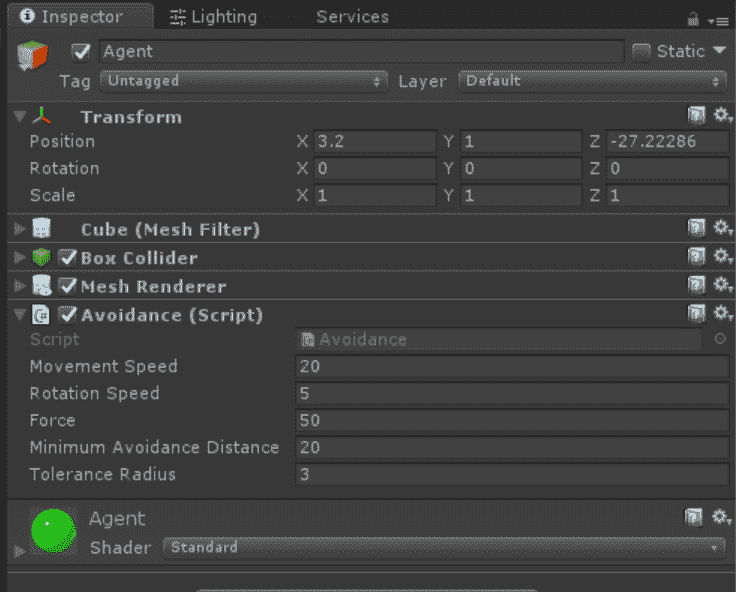

代理检查视图

尝试调整这些值，看看你能得到什么样的结果。简单地按播放并点击场景，告诉你的代理移动。你可能注意到，尽管代理智能地避开障碍物，但它并不总是选择到达目标的最有效路径。这就是 A*算法发挥作用的地方。

# A*路径查找

接下来，我们将使用 C#在 Unity 环境中实现 A*算法。尽管还有其他算法，如 Dijkstra 算法，但 A*路径查找算法因其简单性和有效性而被广泛应用于游戏和交互式应用程序中。我们之前在第一章《游戏 AI 基础》中简要介绍了这个算法，但现在让我们从实现的角度再次回顾这个算法。

# 再次探讨 A*算法

我们在书中简要提到了 A*算法，所以在我们深入实现之前，让我们先回顾一下基础知识。首先，我们需要创建我们地图的基于网格的表示。最好的选择是 2D 数组。这个网格及其所有相关数据都将包含在我们的`GridManager`类中。`GridManager`类将包含一个`Node`对象列表，代表我们网格中的每个单元格。节点本身将包含一些关于它们自己的额外数据，例如它们的启发式成本以及它们是否是障碍物节点。

我们还需要保留两个列表——我们的开放列表，即要探索的节点列表，以及我们的关闭列表，它将包含我们已访问的节点。我们将在`PriorityQueue`类中实现这些，它提供了一些额外的辅助功能。

从本质上讲，我们实现的 A*算法，在`AStar`类中，必须执行以下操作：

1.  从起始节点开始，并将其放入开放列表。

1.  只要开放列表中还有节点，我们就会执行以下过程：

    1.  从开放列表中选择第一个节点并将其保留为当前节点。（这是假设我们已经对开放列表进行了排序，并且第一个节点具有最小的成本值，这一点将在代码的末尾提到。）

    1.  获取当前节点的相邻节点，这些相邻节点不是障碍物类型，例如墙壁或峡谷，无法通过。

    1.  对于每个相邻节点，检查此相邻节点是否已经在关闭列表中。如果没有，我们将使用以下公式计算此相邻节点的总成本（`F`）：

```py
F = G + H
```

1.  1.  在前面的公式中，`G`是从起始节点到该节点的总成本，`H`是从该节点到最终目标节点的总成本。

    1.  将此成本数据存储在相邻节点对象中。同时，将当前节点作为父节点存储。稍后，我们将使用此父节点数据来追踪实际路径。

    1.  将此相邻节点放入开放列表。按到达目标节点的总成本对开放列表进行升序排序。

    1.  如果没有更多的相邻节点要处理，将当前节点放入关闭列表，并从开放列表中删除它。

    1.  使用开放列表中的下一个节点回到步骤 2。

完成此过程后，你的当前节点应该位于目标目标节点位置，但前提是从起始节点到目标节点的路径无障碍。如果它不在目标节点，则从当前节点位置到目标节点的路径不可用。如果存在有效路径，我们现在要做的就是从当前节点的父节点开始追踪，直到再次到达起始节点。这将给我们一个在路径查找过程中选择的节点路径列表，从目标节点到起始节点排序。然后我们只需反转这个路径列表，因为我们想知道从起始节点到目标目标节点的路径。

这是我们将在 Unity 中使用 C#实现的算法的一般概述。那么，让我们开始吧。

# 实现

为了开始使用 A*，我们必须将概念应用到代码中的具体实现。在我们的示例代码中，我们将 A*系统分解为几个关键组件：`Node`、`GridManager`、`PriorityQueue`和`AStart`类。

让我们在接下来的几个部分中分解每个类的作用。

# 节点类

我们可以把 `Node` 类想象成包含我们网格中每个瓦片相关信息的容器。我们存储有关节点成本、节点父节点和其位置等信息：

```py
using UnityEngine;
using System;

public class Node : IComparable
{
    //Total cost so far for the node
    public float gCost;
    //Estimated cost from this node to the goal node
    public float hCost;
    //Is this an obstacle node
    public bool bObstacle;
    //Parent of the node in the linked list
    public Node parent;
    //Position of the node in world space
    public Vector3 position; 

    public Node()
    {
        hCost = 0.0f;
        gCost = 1.0f;
        bObstacle = false;
        parent = null;
    }

    public Node(Vector3 pos)
    {
        hCost = 0.0f;
        gCost = 1.0f;
        bObstacle = false;
        parent = null;

        position = pos;
    }

    public void MarkAsObstacle()
    {
        bObstacle = true;
    }

    //IComparable Interface method implementation
    public int CompareTo(object obj)
    {
        Node node = (Node)obj;
        if (hCost < node.hCost) 
        {
            return -1;
        }
        if (hCost > node.hCost) 
        {
            return 1;
        }
        return 0;
    }
}
```

在代码中，我们分别用 `gCost` 和 `hCost` 来表示我们的 G 和 H 成本。G 指的是从起始节点到该节点的成本，而 H 指的是从该节点到终点节点的估计成本。根据你对 A* 的熟悉程度，你可能考虑将它们重命名为更具描述性的名称。在我们的例子中，我们希望尽可能接近于纸上概念名称的 *实际版本*，以便解释 C# 实现。

该类提供了一个简单的构造函数，它不接受任何参数，并且有一个重载函数接受一个位置，它将传递的值预先填充到位置字段中。这里没有什么太复杂的。

你可能已经注意到我们的类实现了 `IComparable` 接口，这要求我们实现 `CompareTo()` 方法以满足接口合同要求。

你可以把接口想象成一个合同。单独来看，它什么也不做。你无法在接口中实现任何逻辑。通过从接口继承，你只是同意在实现类中实现所有具有提供签名的所有方法。这样，任何其他想要调用你类中接口给定方法的类都可以假设该方法存在。

方法的实际实现根据给定的节点与该节点的 `hCost` 进行比较。我们稍后会看看它的用法。

# 建立优先队列

我们使用 `PriorityQueue` 类来表示我们的开放列表和关闭列表。这种方法允许我们实现一些方便的辅助方法。`PriorityClass.cs` 文件看起来像这样：

```py
using System.Collections;

public class PriorityQueue 
{
    private ArrayList nodes = new ArrayList();

    public int Length
    {
        get { return nodes.Count; }
    }

    public bool Contains(object node)
    {
        return nodes.Contains(node);
    }

    public Node GetFirstNode()
    {
        if (nodes.Count > 0)
        {
            return (Node)nodes[0];
        }
        return null;
    }

    public void Push(Node node)
    {
        nodes.Add(node);
        nodes.Sort();
    }

    public void Remove(Node node)
    {
        nodes.Remove(node);
        nodes.Sort();
    }
}
```

这段代码中没有太多值得注意的，但特别是 `Sort()` 方法很有趣。还记得 `Node` 类中的 `CompareTo()` 方法吗？`ArrayList.Sort()` 实际上依赖于节点类中 `CompareTo()` 的实现来排序数组。更具体地说，它将根据节点的 `hCost` 进行排序。

# 设置我们的网格管理器

`GridManager` 类在安排和可视化我们的网格方面做了很多繁重的工作。与这本书中我们迄今为止看到的某些代码相比，它是一个相当长的类，因为它提供了几个辅助方法。打开 `GridManager.cs` 类以继续阅读：

```py
 [SerializeField]
 private int numberOfRows = 20;
 [SerializeField]
 public int numberOfColumns = 20;
 [SerializeField]
 public float gridCellSize = 2;
 [SerializeField]
 public bool showGrid = true;
 [SerializeField]
 public bool showObstacleBlocks = true;

 private Vector3 origin = new Vector3();
 private GameObject[] obstacleList;
 private Node[,] nodes { get; set; } 
```

我们首先设置一些变量。我们指定网格中的行数和列数，并指定它们的大小（以世界单位计）。这里没有太多值得注意的，但我们应该指出，`Node[,]` 语法表示我们正在初始化一个 `nodes` 的二维数组，这是有意义的，因为网格本身就是一个二维数组。

在我们的 `Awake` 方法中，我们看到以下行：

```py
obstacleList = GameObject.FindGameObjectsWithTag("Obstacle");
```

这只是通过查找标记为 `"Obstacle"` 的对象来初始化 `obstacleList` 游戏对象数组。然后 `Awake` 调用两个设置方法：`InitializeNodes()` 和 `CalculateObstacles()`：

```py
private void InitializeNodes() 
{
    nodes = new Node[numberOfColumns, numberOfRows];

    int index = 0;
    for (int i = 0; i < numberOfColumns; i++) 
    {
        for (int j = 0; j < numberOfRows; j++) 
        {
            Vector3 cellPosition = GetGridCellCenter(index);
            Node node = new Node(cellPosition);
            nodes[i, j] = node;
            index++;
        }
    }
}
```

这些方法的名称非常直接，所以正如你可能猜到的，`InitializeNodes()` 初始化我们的节点，并通过填充 `nodes` 2D 数组来实现。此代码调用一个辅助方法 `GetGridCellCenter()`，我们稍后会看到，但方法相当直接。我们按列和行的顺序遍历 2D 数组，并创建根据网格大小间隔的节点：

```py
private void CalculateObstacles()
{
    if (obstacleList != null && obstacleList.Length > 0)
    {
        foreach (GameObject data in obstacleList)
        {
            int indexCell = GetGridIndex(data.transform.position);
            int column = GetColumnOfIndex(indexCell);
            int row = GetRowOfIndex(indexCell);

            nodes[row, column].MarkAsObstacle();
        }
    }
}
```

`CalculateObstacles()` 方法简单地遍历我们在 `Awake` 期间初始化的障碍物列表，确定障碍物占据的网格槽位，并使用 `MarkAsObtacle()` 将该网格槽位的节点标记为障碍物。

`GridManager` 类有几个辅助方法来遍历网格并获取网格单元格数据。以下是一些它们的列表，以及它们所做简要描述。实现很简单，所以我们不会深入细节：

+   `GetGridCellCenter`：给定一个单元格的索引，它返回该单元格的中心位置（在世界空间中）。

+   `GetGridCellPositionAtIndex`：返回单元格的起点位置（角落）。用作 `GetGridCellCenter` 的辅助工具。

+   `GetGridIndex`：给定一个位置（作为世界空间中的 `Vector3`），它返回最接近该位置的单元格。

+   `GetRowOfIndex` 和 `GetColumnOfIndex`：正如其名称所示，它们返回给定索引的单元格的行或列。例如，在一个 2 x 2 的网格中，索引为 2 的单元格（从 0 开始），位于第 2 行，第 1 列。

接下来，我们有一些帮助确定给定节点的邻居的方法：

```py
public void GetNeighbors(Node node, ArrayList neighbors)
{
    Vector3 neighborPosition = node.position;
    int neighborIndex = GetGridIndex(neighborPosition);

    int row = GetRowOfIndex(neighborIndex);
    int column = GetColumnOfIndex(neighborIndex);

    //Bottom
    int leftNodeRow = row - 1;
    int leftNodeColumn = column;
    AssignNeighbor(leftNodeRow, leftNodeColumn, neighbors);

    //Top
    leftNodeRow = row + 1;
    leftNodeColumn = column;
    AssignNeighbor(leftNodeRow, leftNodeColumn, neighbors);

    //Right
    leftNodeRow = row;
    leftNodeColumn = column + 1;
    AssignNeighbor(leftNodeRow, leftNodeColumn, neighbors);

    //Left
    leftNodeRow = row;
    leftNodeColumn = column - 1;
    AssignNeighbor(leftNodeRow, leftNodeColumn, neighbors);
}

// Check the neighbor. If it's not an obstacle, assign the neighbor.
private void AssignNeighbor(int row, int column, ArrayList neighbors)
{
    if (row != -1 && column != -1 && row < numberOfRows && column < numberOfColumns)
    {
        Node nodeToAdd = nodes[row, column];
        if (!nodeToAdd.bObstacle)
        {
            neighbors.Add(nodeToAdd);
        }
    } 
}
```

首先，我们有 `GetNeighbors()`，它使用给定节点在网格中的位置来确定其下方、上方、右侧和左侧的单元格。它使用 `AssignNeighbor()` 将节点作为邻居，该函数执行一些验证，例如检查潜在的邻居是否在数组范围内，以及邻居是否未标记为障碍物。

最后，我们有 `OnDrawGizmos()` 和 `DebugDrawGrid()`，它们用于显示我们在场景视图中指定的网格，以便进行调试。接下来，是主要内容。我们使用我们的 `AStar` 类将这些内容整合在一起。

# 深入了解 A* 的实现

`AStar` 类是 A* 算法的实际实现。这里发生了魔法。`AStar.cs` 文件中的代码如下：

```py
using UnityEngine;
using System.Collections;

public class AStar
{
    public static PriorityQueue closedList;
    public static PriorityQueue openList;

    private static ArrayList CalculatePath(Node node)
    {
        ArrayList list = new ArrayList();
        while (node != null)
        {
            list.Add(node);
            node = node.parent;
        }
        list.Reverse();
        return list;
    }

    /// Calculate the estimated Heuristic cost to the goal 
    private static float EstimateHeuristicCost(Node curNode, Node goalNode)
    {
        Vector3 vecCost = curNode.position - goalNode.position;
        return vecCost.magnitude;
    }

    // Find the path between start node and goal node using A* Algorithm
    public static ArrayList FindPath(Node start, Node goal)
    {
        openList = new PriorityQueue();
        openList.Push(start);
        start.gCost = 0.0f;
        start.hCost = EstimateHeuristicCost(start, goal);

        closedList = new PriorityQueue();
        Node node = null;
        GridManager gridManager = GameObject.FindObjectOfType<GridManager>();
        if(gridManager == null) {
            return null;
        }

        while (openList.Length != 0)
        {
            node = openList.GetFirstNode();

            if (node.position == goal.position)
            {
                return CalculatePath(node);
            }

            ArrayList neighbors = new ArrayList();
            gridManager.GetNeighbors(node, neighbors);

            //Update the costs of each neighbor node.
            for (int i = 0; i < neighbors.Count; i++)
            {
                Node neighborNode = (Node)neighbors[i];

                if (!closedList.Contains(neighborNode))
                { 
                  //Cost from current node to this neighbor node
                  float cost = EstimateHeuristicCost(node, neighborNode); 

                  //Total Cost So Far from start to this neighbor node
                  float totalCost = node.gCost + cost;

                  //Estimated cost for neighbor node to the goal
                  float neighborNodeEstCost = EstimateHeuristicCost(neighborNode, goal); 

                  //Assign neighbor node properties
                  neighborNode.gCost = totalCost;
                  neighborNode.parent = node;
                  neighborNode.hCost = totalCost + neighborNodeEstCost;

                  //Add the neighbor node to the open list if we haven't already done so.
                  if (!openList.Contains(neighborNode))
                  {
                      openList.Push(neighborNode);
                  }
                }
            } 
            closedList.Push(node);
            openList.Remove(node);
        }

        //We handle the scenario where no goal was found after looping thorugh the open list
        if (node.position != goal.position)
        {
            Debug.LogError("Goal Not Found");
            return null;
        }

        //Calculate the path based on the final node
        return CalculatePath(node);
    }
}
```

这里有很多内容需要讲解，所以让我们一步一步来分析：

```py
 public static PriorityQueue closedList;
 public static PriorityQueue openList;
```

我们首先声明我们的开放列表和关闭列表，它们将分别包含已访问和未访问的节点：

```py
private static float EstimateHeuristicCost(Node currentNode, Node goalNode)
{
    Vector3 cost= currentNode.position - goalNode.position;
    return cost.magnitude;
}
```

在前面的代码中，我们实现了一个名为`EstimateHeuristicCost`的方法来计算两个给定节点之间的成本。计算很简单。我们只需通过从一个位置向量减去另一个位置向量来找到两个节点之间的方向向量。这个结果向量的幅度给出了从当前节点到目标节点的直接距离。

接下来，我们有我们的`FindPath`方法，它做了大部分工作：

```py
  public static ArrayList FindPath(Node start, Node goal)
  {
      openList = new PriorityQueue();
      openList.Push(start);
      start.gCost = 0.0f;
      start.hCost = EstimateHeuristicCost(start, goal);

      closedList = new PriorityQueue();
      Node node = null;

      GridManager gridManager = GameObject.FindObjectOfType<GridManager>();
      if(gridManager == null) {
          return null;
      }
```

它初始化我们的开放和关闭列表。一开始，我们`openList`中只有起始节点。我们还初始化`gCost`，它为零，因为到起始节点（它自己）的距离为零。然后我们使用我们刚才讨论的`EstimateHeuristicCost()`方法分配`hCost`。

从现在开始，我们需要引用我们的`GridManager`，所以我们使用`FindObjectOfType()`获取它，并进行一些空值检查。接下来，我们开始处理开放列表：

```py
   while (openList.Length != 0)
   {
       node = openList.GetFirstNode();

       if (node.position == goal.position)
       {
           return CalculatePath(node);
       }

       ArrayList neighbors = new ArrayList();
       gridManager.GetNeighbors(node, neighbors);

       //Update the costs of each neighbor node.
       for (int i = 0; i < neighbors.Count; i++)
       {
           Node neighborNode = (Node)neighbors[i];

           if (!closedList.Contains(neighborNode))
           { 
               //Cost from current node to this neighbor node
               float cost = EstimateHeuristicCost(node, neighborNode); 

               //Total Cost So Far from start to this neighbor node
               float totalCost = node.gCost + cost;

               //Estimated cost for neighbor node to the goal
               float neighborNodeEstCost = EstimateHeuristicCost(neighborNode, goal); 

               //Assign neighbor node properties
               neighborNode.gCost = totalCost;
               neighborNode.parent = node;
               neighborNode.hCost = totalCost + neighborNodeEstCost;

               //Add the neighbor node to the open list if we haven't already done so.
               if (!openList.Contains(neighborNode))
               {
                   openList.Push(neighborNode);
               }
             }
         } 
         closedList.Push(node);
         openList.Remove(node);
     }

     //We handle the scenario where no goal was found after looping thorugh the open list
     if (node.position != goal.position)
     {
         Debug.LogError("Goal Not Found");
         return null;
     }

     //Calculate the path based on the final node
     return CalculatePath(node);
 }
```

这段代码实现类似于我们之前讨论过的 A*算法。现在是复习它的好时机。

用简单的话来说，前面的代码可以描述为以下步骤：

1.  获取我们的`openList`的第一个节点。请注意，每次添加新节点后，我们的`openList`总是排序的，这样第一个节点总是具有到目标节点最低估计成本的节点。

1.  检查当前节点是否已经到达目标节点。如果是，退出`while`循环并构建`path`数组。

1.  创建一个数组列表来存储正在处理的当前节点的相邻节点。使用`GetNeighbors()`方法从网格中检索相邻节点。

1.  对于`neighbors`数组中的每个节点，我们检查它是否已经在`closedList`中。如果没有，我们计算成本值，使用新的成本值以及父节点数据更新节点属性，并将其放入`openList`。

1.  将当前节点推入`closedList`并从`openList`中移除。重复此过程。

如果`openList`中没有更多的节点，那么如果存在有效路径，我们的当前节点应该位于目标节点。然后，我们只需将当前节点作为参数调用`CalculatePath()`方法。`CalcualtePath()`方法看起来像这样：

```py
private static ArrayList CalculatePath(Node node) 
{ 
    ArrayList list = new ArrayList(); 
    while (node != null) 
    { 
      list.Add(node); 
      node = node.parent; 
    } 
    list.Reverse(); 
    return list; 
} 
```

`CalculatePath`方法遍历每个节点的父节点对象并构建一个数组列表。这给我们一个从目标节点到起始节点的节点数组列表。由于我们想要从起始节点到目标节点的路径数组，我们只需调用`Reverse`方法。就这样！随着我们的算法和辅助类已经处理完毕，我们可以继续到我们的测试脚本，它将所有这些整合在一起。

# 实现一个 TestCode 类

现在我们已经通过我们的`AStar`类（以及相关的辅助类）实现了 A*算法，我们实际上使用`TestCode`类来实现它。`TestCode.cs`文件看起来像这样：

```py
using UnityEngine;
using System.Collections;

public class TestCode : MonoBehaviour 
{
    private Transform startPosition;
    private Transform endPosition;

    public Node startNode { get; set; }
    public Node goalNode { get; set; }

    private ArrayList pathArray;

    private GameObject startCube;
    private GameObject endCube;

    private float elapsedTime = 0.0f;
    public float intervalTime = 1.0f; 
    private GridManager gridManager;
```

我们在这里声明我们的变量，并再次设置一个变量来保存对`GridManager`的引用。然后，`Start`方法进行一些初始化并触发我们的`FindPath()`方法，如下所示代码：

```py

  private void Start () 
  {
      gridManager = FindObjectOfType<GridManager>();
      startCube = GameObject.FindGameObjectWithTag("Start");
      endCube = GameObject.FindGameObjectWithTag("End");

      //Calculate the path using our AStart code.
      pathArray = new ArrayList();
      FindPath();
  }

  private void Update () 
  {
      elapsedTime += Time.deltaTime;

      if(elapsedTime >= intervalTime)
      {
          elapsedTime = 0.0f;
          FindPath();
      }
  }
```

在`Update`方法中，我们以一定的时间间隔检查路径，这是一种在运行时目标移动时刷新路径的暴力方法。你可能希望考虑使用事件来实现此代码，以避免在每一帧（或在这种情况下，间隔）中产生不必要的开销。在`Start`中调用的`FindPath()`方法如下所示：

```py
private void FindPath()
{
    startPosition = startCube.transform;
    endPosition = endCube.transform;

    startNode = new Node(gridManager.GetGridCellCenter(gridManager.GetGridIndex(startPosition.position)));
    goalNode = new Node(gridManager.GetGridCellCenter(gridManager.GetGridIndex(endPosition.position)));

    pathArray = AStar.FindPath(startNode, goalNode);
}
```

首先，它获取我们的起始和结束游戏对象的位置。然后，它使用`GridManager`和`GetGridIndex`辅助方法创建新的`Node`对象，以计算它们在网格中的相应行和列索引位置。有了这些必要的值，我们只需调用`AStar.FindPath`方法并使用起始节点和目标节点，然后将返回的数组列表存储在局部`pathArray`变量中。

接下来，我们实现`OnDrawGizmos`方法来绘制和可视化找到的路径：

```py
private void OnDrawGizmos()
{
    if (pathArray == null) 
    {
        return;
    }

    if (pathArray.Count > 0)
    {
        int index = 1;
        foreach (Node node in pathArray)
        {
            if (index < pathArray.Count)
            {
                Node nextNode = (Node)pathArray[index];
                Debug.DrawLine(node.position, nextNode.position, Color.green);
                index++;
            }
        };
    }
}
```

我们遍历`pathArray`并使用`Debug.DrawLine`方法绘制连接`pathArray`中节点的线条。这样，当我们运行并测试游戏时，我们将能够看到一条从起点到终点的绿色线条，形成一个路径。

# 在示例场景中测试它

示例场景看起来如下：

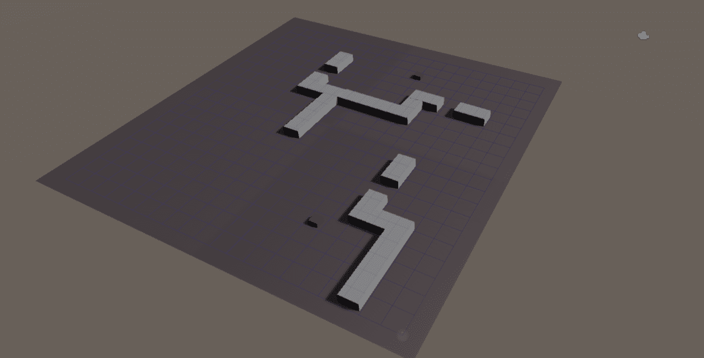

在路径寻优网格上绘制的我们的示例场景

如前一个截图所示，有一个红色起始节点，一个绿色目标节点，一个平面和一些浅灰色障碍物。

以下截图是我们场景层次结构的快照：

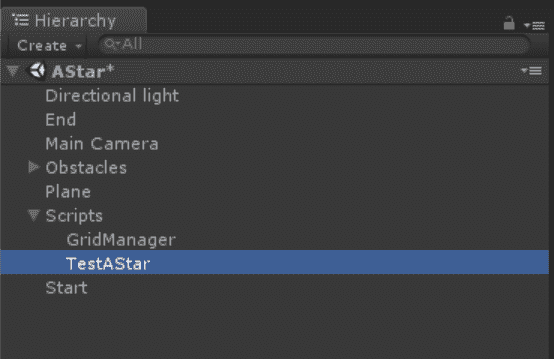

在前面的截图中有几点需要注意（是的，你可以忽略方向光，因为它只是在这里让我们的场景看起来更漂亮）。首先，我们将所有的障碍物都分组在父`Obstacles`变换下。其次，我们在`Scripts`游戏对象下有单独的游戏对象用于我们的`TestCode`类和`GridManager`类。正如你之前在代码示例中看到的，`GridManager`中暴露了一些字段，它们在我们的示例场景中应该看起来像以下截图：

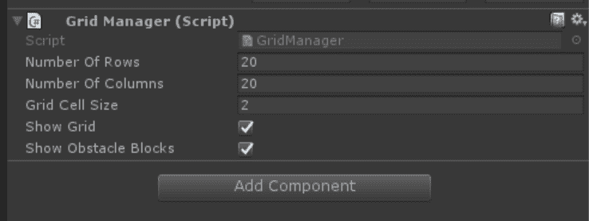

如前一个截图所示，我们已将“显示网格”选项设置为 true。这将使我们能够在场景视图中看到网格。

# 测试所有组件

现在我们已经了解了所有组件的连接方式，点击播放按钮并观察从我们的起始节点到目标节点的路径是如何绘制的，如下所示截图：

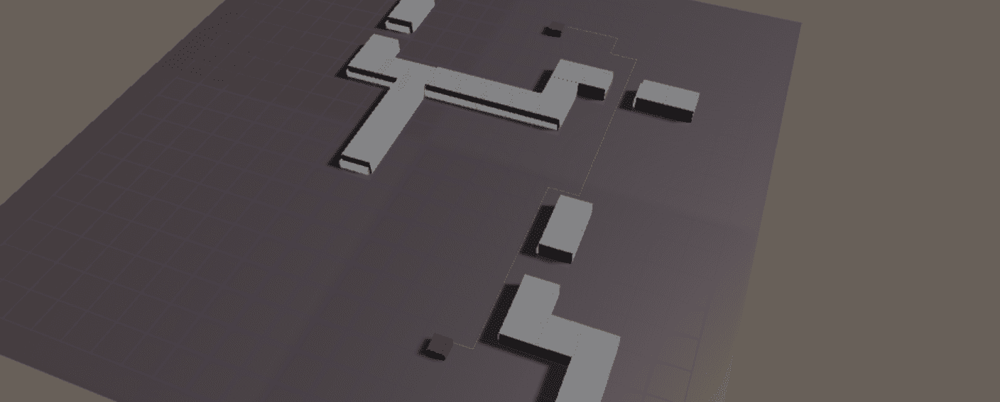

由于我们在`Update`循环中每隔一段时间检查路径，我们可以在播放模式下移动目标节点，并看到路径更新。以下截图显示了将目标节点移动到不同位置后的新路径：

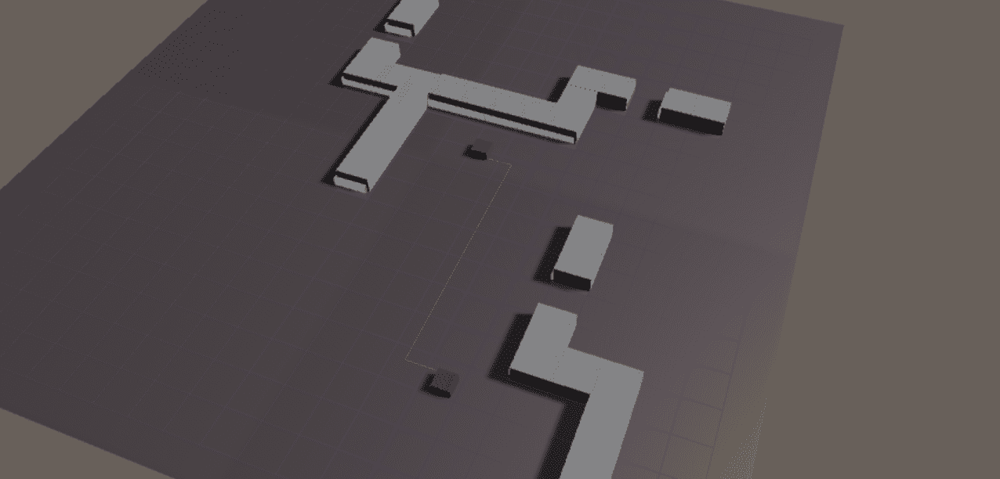

如你所见，由于目标更近，所以到达它的最佳路径也近。简而言之，这就是 A*。一个非常强大的算法可以浓缩为几个类，总共只有几百行代码（其中大部分是由于格式化和注释）。

# A* vs IDA*

在第一章《游戏 AI 基础》中，我们提到了 A*和 IDA*之间的一些区别。现在你已经实现了 A*，你可以看到 A*实现会保留一些内容在内存中——路径数组、开放列表和关闭列表。在实现的不同阶段，你可能会在遍历你的列表时分配更多或更少的内存。在这方面，A*比 IDA*更贪婪，但请记住，在大多数情况下，在现代硬件上，这并不是一个问题——即使是我们更大的网格。

IDA*方法只关注当前迭代的相邻/邻近位置，并且因为它不记录访问过的节点，所以可能会多次访问相同的节点。在类似情况下，这意味着比更快的 A*版本低得多的内存开销。

虽然这个观点可以争论，但这位谦逊的作者认为 IDA*在现代游戏开发中不是一个相关的模式——即使在资源敏感的应用程序，如移动游戏中也是如此。在其他领域，人们可以为迭代加深方法提出更有力的论据，但幸运的是，即使是老化的移动设备相对于将实现某种寻路功能的 99%的游戏的需求来说，也有大量的内存。

# 导航网格

接下来，我们将学习如何使用 Unity 内置的导航网格生成器，它可以使 AI 代理的寻路变得容易得多。在 Unity 5.x 周期的早期，NavMesh 对所有用户开放，包括个人版许可证持有者，而在此之前，它仅是 Unity Pro 的独占功能。在 2017.1 版本发布之前，该系统已升级以允许基于组件的工作流程，但由于它需要额外的可下载包，而截至写作时，这个包仅作为预览版提供，我们将坚持默认的场景基础工作流程。不用担心，概念是一致的，当最终实现最终进入 2017.x 版本时，不应该有剧烈的变化。

想了解更多关于 Unity 的 NavMesh 组件系统信息，请访问 GitHub：[`github.com/Unity-Technologies/NavMeshComponents`](https://github.com/Unity-Technologies/NavMeshComponents)。

现在，我们将深入探索这个系统所能提供的一切。AI 路径查找需要一个特定格式的场景表示；我们已经看到在 2D 地图上使用 2D 网格（数组）进行 A*路径查找。AI 代理需要知道障碍物的位置，特别是静态障碍物。处理动态移动对象之间的碰撞避免是另一个主题，主要称为转向行为。Unity 有一个内置工具用于生成 NavMesh，该工具以对 AI 代理有意义的方式表示场景，以便它们可以找到到目标的最优路径。打开演示项目，导航到 NavMesh 场景以开始。

# 检查我们的地图

一旦您打开了演示场景、NavMesh，它应该看起来像以下截图：

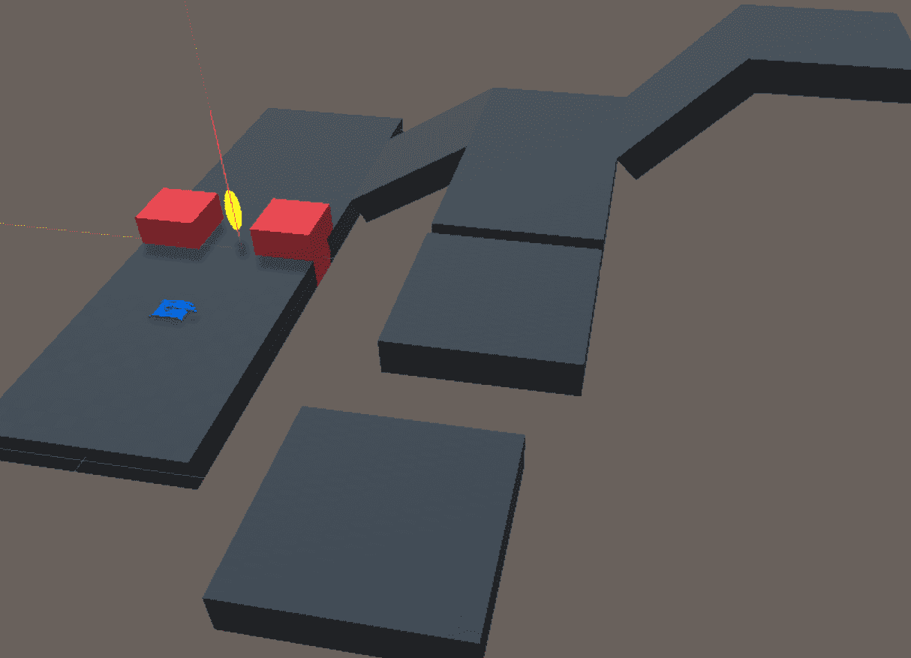

一个带有障碍物和斜坡的场景

这将是我们的沙盒，用于解释和测试 NavMesh 系统功能。一般的设置类似于实时策略（RTS）游戏。您控制蓝色坦克。只需点击一个位置，坦克就会移动到该位置。黄色指示器是坦克当前的目标位置。

# 导航静态

首先要指出的是，您需要将场景中将被烘焙到 NavMesh 中的任何几何体标记为导航静态。您可能在其他地方遇到过这种情况，例如在 Unity 的光照映射系统中。将游戏对象设置为静态很容易。您可以轻松切换所有目的的`Static`标志（导航、光照、剔除、批处理等），或者您可以使用下拉菜单来具体选择您想要的内容。切换按钮位于所选对象（s）检查器的右上角。查看以下截图以了解您要寻找的一般概念：

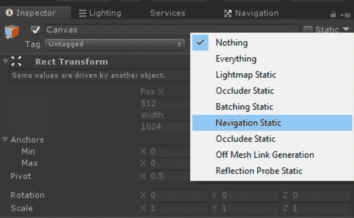

导航静态属性

您可以按对象逐个进行此操作，或者，如果您在层次结构中有嵌套的游戏对象层次结构，您可以将设置应用于父对象，Unity 将提示您将其应用于所有子对象。

# 烘焙导航网格

导航网格的导航设置是通过导航窗口在场景范围内应用的。您可以通过菜单栏中的**窗口** | 导航来打开此窗口。像任何其他窗口一样，您可以将其分离为自由浮动，或者将其停靠。我们的截图显示它停靠在层次结构旁边的选项卡中，但您可以将此窗口放置在任何您想要的位置。

窗口打开后，您会注意到四个独立的选项卡。它看起来可能像以下截图：

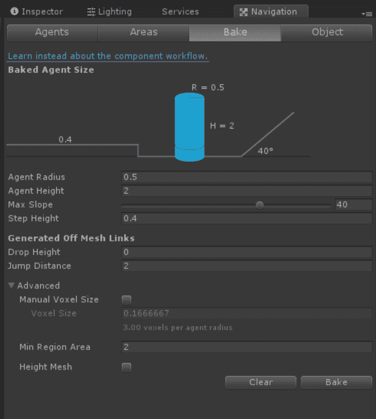

导航窗口

在我们的例子中，前面的截图显示了已选择“烘焙”选项卡，但你的编辑器可能默认选择了其他选项卡之一。

让我们查看每个选项卡，从左侧开始，向右工作，从以下截图所示的“代理”选项卡开始：

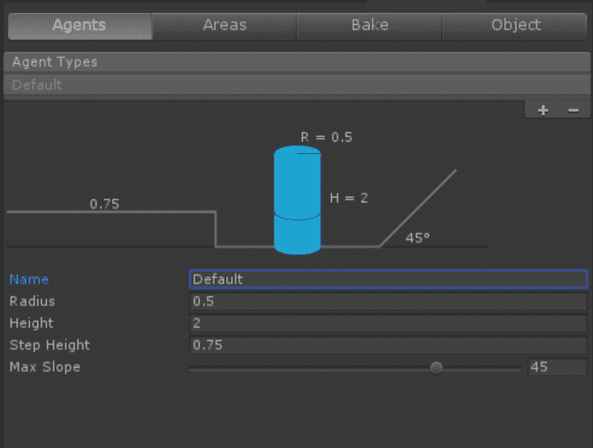

代理标签页

如果你正在处理不同的项目，你可能会发现其中一些设置与我们从先前的截图所用的示例项目中设置的设置不同。在标签页的顶部，你可以看到一个列表，你可以通过按“+”按钮添加额外的代理类型。你可以通过选择并按“-”按钮来移除任何这些额外的代理。窗口提供了一个很好的视觉，展示了当你调整这些设置时各种设置的作用。让我们看看每个设置的作用：

+   **名称**: 要在代理类型下拉列表中显示的代理类型的名称。

+   **半径**: 可以将其视为代理的“个人空间”。代理将根据此值尝试避免与其他代理过于亲近，因为它用它来进行回避。

+   **高度**: 如你所猜，它决定了代理的高度，它可以用于垂直回避（例如，穿过东西）。

+   **步高**: 此值决定了代理可以爬越的障碍物的高度。

+   **最大坡度**: 正如我们将在下一节中看到的，此值决定了代理可以爬升的最大角度。这可以用来使地图上的陡峭区域对代理不可达。

接下来，我们有“区域”标签页，它看起来如下截图所示：

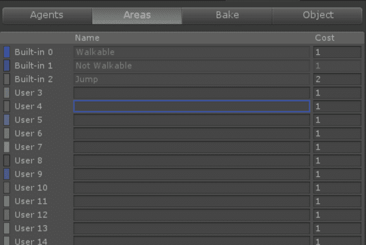

正如你在先前的截图中所见，Unity 提供了一些默认的区域类型，这些类型不能被编辑：可通行、不可通行和跳跃。除了命名和创建新的区域外，你还可以将这些区域的默认成本分配给它们。

区域有两个作用：根据代理使区域可访问或不可访问，以及将区域标记为导航成本较低。例如，你可能有 RPG 游戏，其中恶魔敌人不能进入标记为“圣地”的区域。你也可以在你的地图上标记一些像“沼泽”或“湿地”的区域，你的代理可以根据成本避免这些区域。

第三个标签页“烘焙”可能是最重要的。它允许你为场景创建实际的 NavMesh。你会认出一些设置。烘焙标签页看起来如下：

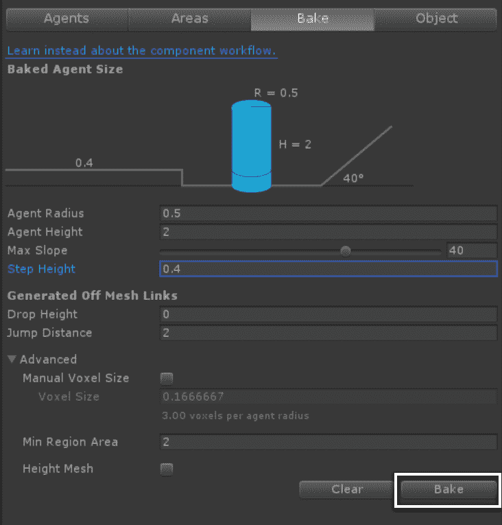

烘焙标签页

在此标签页中的代理大小设置决定了代理如何与环境交互，而代理标签页中的设置决定了它们如何与其他代理和移动对象交互，但它们控制相同的参数，所以我们在这里将跳过这些设置。下落高度和跳跃距离控制代理可以“跳跃”多远以到达与当前所在区域不直接相连的 NavMesh 部分。我们将在稍后详细介绍这一点，所以如果你现在还不完全清楚这意味着什么，请不要担心。

此外，还有一些默认情况下通常折叠的高级设置。只需单击“高级”标题旁边的下拉三角形即可展开这些选项。您可以将“手动体素大小”设置视为“质量”设置。大小越小，您可以在网格中捕获的细节就越多。最小区域面积用于跳过低于给定阈值的平台或表面烘焙。高度网格在烘焙网格时提供更详细的垂直数据。例如，它将帮助在爬楼梯时保持代理的正确位置。

清除按钮将清除场景中的任何 NavMesh 数据，而烘焙按钮将为您的场景创建网格。此过程相当快。只要您选择了窗口，您就可以在场景视图中看到由烘焙按钮生成的 NavMesh。请点击烘焙按钮以查看结果。在我们的示例场景中，您应该得到以下截图所示的内容：

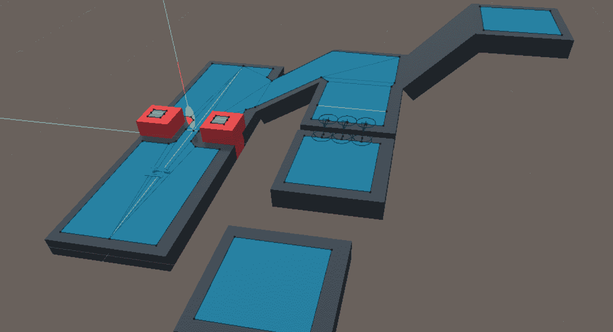

蓝色区域代表 NavMesh。我们稍后会再次讨论这个问题。现在，让我们继续到最后一个标签页，即对象标签页，它看起来如下截图所示：

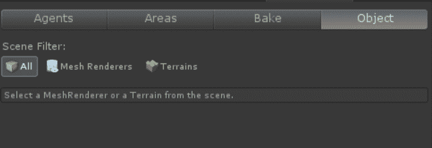

在前面的截图中所显示的三个按钮，全部、网格渲染器和地形，是您场景的过滤器。当在具有大量对象的复杂场景中工作时，这些非常有用。选择一个选项将过滤出您层次结构中的该类型，以便更容易选择。您可以使用此功能在场景中查找要标记为导航静态的对象。

# 使用 NavMesh 代理

现在我们已经设置了带有 NavMesh 的场景，我们需要让我们的代理使用这些信息。幸运的是，Unity 提供了一个可以附加到我们的角色上的 Nav Mesh Agent 组件。示例场景中有一个名为`Tank`的游戏对象，该组件已经附加到它上面。在层次结构中查看它，应该看起来像以下截图：

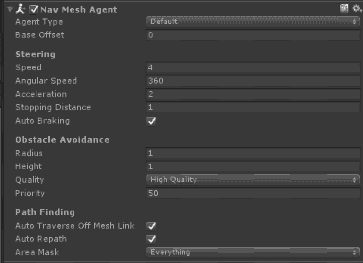

这里有相当多的设置，我们不会全部介绍，因为它们相当直观，您可以在官方 Unity 文档中找到完整的描述，但让我们指出一些关键点：

+   代理类型：还记得导航窗口中的代理标签吗？您在那里定义的代理类型将在这里可选择。

+   自动穿越离网链接：我们稍后会详细介绍离网链接，但此设置允许代理自动使用该功能。

+   区域遮罩：您在导航窗口的区域标签页中设置的区域将在这里可选择。

就这些了。该组件为您处理了 90%的繁重工作：路径放置、路径查找、障碍物避免等。您唯一需要做的是为代理提供一个目标目的地。让我们看看下一个。

# 设置目的地

现在我们已经设置了我们的 AI 代理，我们需要一种方法来告诉它去哪里。我们的示例项目提供了一个名为`Target.cs`的脚本，它正是这样做的。

这是一个简单的类，它做了三件事：

+   使用射线从相机原点射向鼠标世界位置

+   更新标记位置

+   更新所有导航网格代理的目标属性

代码相当简单。整个类看起来是这样的：

```py
using UnityEngine;
using UnityEngine.AI;

public class Target : MonoBehaviour
{
    private NavMeshAgent[] navAgents;
    public Transform targetMarker;

    private void Start ()
    {
      navAgents = FindObjectsOfType(typeof(NavMeshAgent)) as NavMeshAgent[];
    }

    private void UpdateTargets ( Vector3 targetPosition )
    {
      foreach(NavMeshAgent agent in navAgents) 
      {
        agent.destination = targetPosition;
      }
    }

    private void Update ()
    {
        if(GetInput()) 
        {
            Ray ray = Camera.main.ScreenPointToRay(Input.mousePosition);
            RaycastHit hitInfo;

            if (Physics.Raycast(ray.origin, ray.direction, out hitInfo)) 
            {
                Vector3 targetPosition = hitInfo.point;
                UpdateTargets(targetPosition);
                targetMarker.position = targetPosition;
            }
        }
    }

    private bool GetInput() 
    {
        if (Input.GetMouseButtonDown(0)) 
        {
            return true;
        }
        return false;
    }

    private void OnDrawGizmos() 
    {
        Debug.DrawLine(targetMarker.position, targetMarker.position + Vector3.up * 5, Color.red);
    }
}
```

这里发生了一些事情。在`Start`方法中，我们使用`FindObjectsOfType()`方法初始化我们的`navAgents`数组。

`UpdateTargets()`方法遍历我们的`navAgents`数组，并将它们的目标目的地设置为给定的`Vector3`。这实际上是使其工作的关键。你可以使用任何你想要的机制来获取目标目的地，而你需要做的只是设置`NavMeshAgent.destination`字段；代理会完成剩下的工作。

我们的示例使用点击移动的方法，所以每当玩家点击时，我们就从相机向世界中的鼠标光标发射一条射线，如果击中了什么，我们就将击中的位置分配给代理的新`targetPosition`。我们还相应地设置了目标标记，以便在游戏中轻松可视化目标目的地。

为了测试它，请确保你已按照上一节所述烘焙了导航网格，然后进入游戏模式，并选择地图上的任何区域。如果你点击得过于频繁，可能会注意到有些区域你的代理**无法**到达——红色立方体的顶部，最上面的平台，以及屏幕底部的平台。

在红色立方体的例子中，它们太高了。通往最上面平台的斜坡太陡峭，根据我们的最大坡度设置，代理无法爬上去。以下截图说明了最大坡度设置如何影响导航网格：

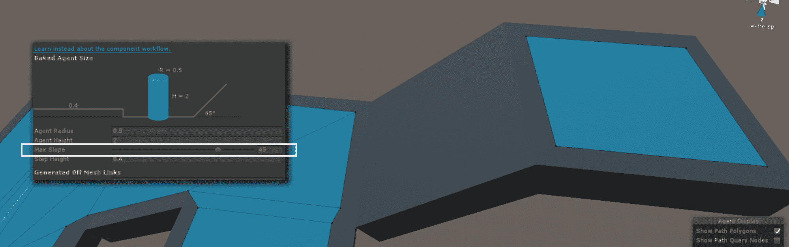

最大坡度设置为 45 的导航网格

如果你将最大坡度调整到大约 51，然后再次点击烘焙按钮重新烘焙导航网格，它将产生如下结果：

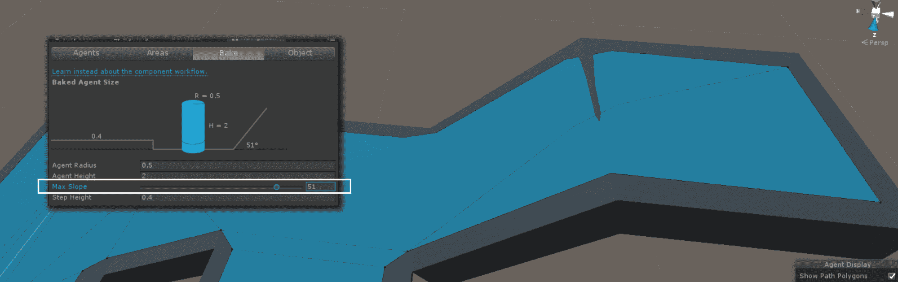

最大坡度设置为 51 的导航网格

如你所见，你可以通过简单的数值调整来调整你的关卡设计，使整个区域无法步行进入。一个这样的例子是，如果你有一个平台或边缘，你需要绳子、梯子或电梯才能到达。也许甚至需要特殊技能，比如攀爬能力？我会让你的想象力去工作，想出所有有趣的用法。

# 理解离网链接

你可能已经注意到我们的场景有两个缺口。第一个缺口我们的代理可以到达，但屏幕底部的那个太远了。这并不是完全随机的。Unity 的**离网链接**有效地在未连接的导航网格段之间架起了桥梁。你可以在编辑器中看到这些链接，如下一张截图所示：

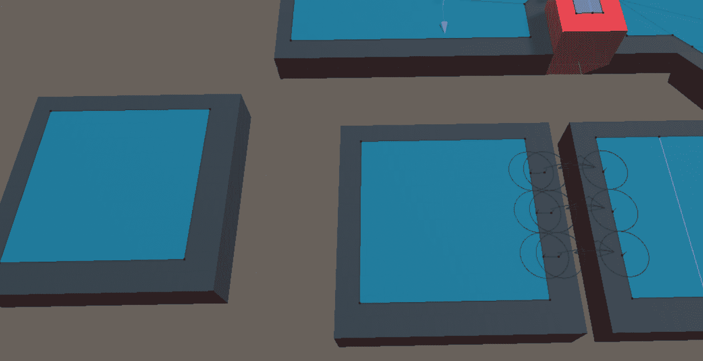

带有连接线的蓝色圆圈是链接

Unity 可以以两种方式生成这些链接。第一种我们已经讨论过了。还记得导航窗口的烘焙选项卡中的跳跃距离值吗？当烘焙 NavMesh 时，Unity 会自动使用该值为我们生成链接。尝试在我们的测试场景中将该值调整为 5 并重新烘焙。注意，现在平台是如何连接起来的？这是因为网格现在位于新指定的阈值内。

将值恢复到 2 并重新烘焙。现在，让我们看看第二种方法。创建将用于连接两个平台的球体。将它们大致放置如下面的截图所示：

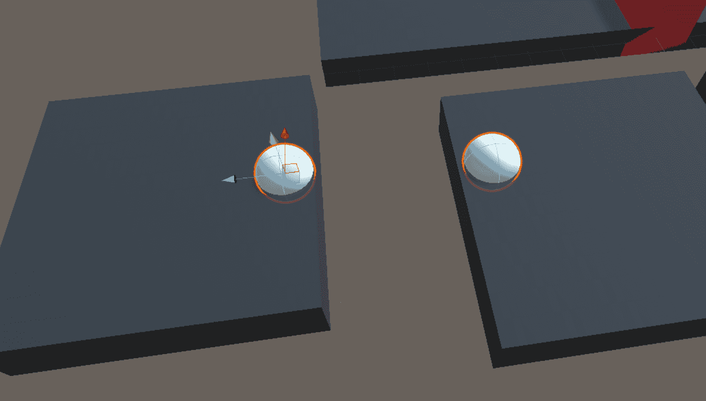

您可能已经看到了这里的发展方向，但让我们通过这个过程来了解如何连接这些。在这种情况下，我将右侧的球体命名为`start`，左侧的球体命名为`end`。您将在下一秒看到原因。接下来，在右侧的平台（相对于前面的截图）上添加 Off Mesh Link 组件。您会注意到组件有`start`和`end`字段。如您所猜，我们将把之前创建的球体放入相应的槽中——将起始球体放入`start`字段，将结束球体放入`end`字段。我们的检查器将看起来像这样：

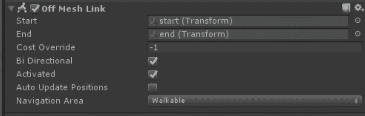

当您将其设置为正数时，成本覆盖值开始起作用。它将对使用此链接应用成本乘数，而不是，可能的话，一条更经济的到达目标的路线。

双向值允许代理在设置为 true 时向两个方向移动。您可以将它关闭以在级别设计中创建单向链接。激活值正如其名。当设置为 false 时，代理将忽略此链接。您可以打开和关闭它以创建游戏场景，例如，玩家必须按下开关来激活它。

您无需重新烘焙即可启用此链接。看看您的 NavMesh，您会看到它看起来像以下截图：

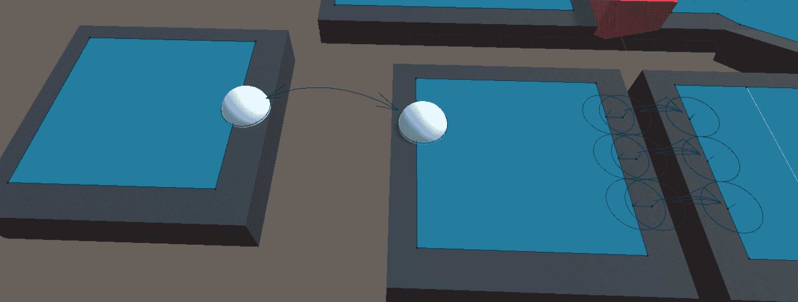

如您所见，较小的间隙仍然自动连接，现在我们在两个球体之间通过我们的 Off Mesh Link 组件生成了一个新的链接。进入游戏模式并点击远处的平台，正如预期的那样，代理现在可以导航到分离的平台，如下面的截图所示：

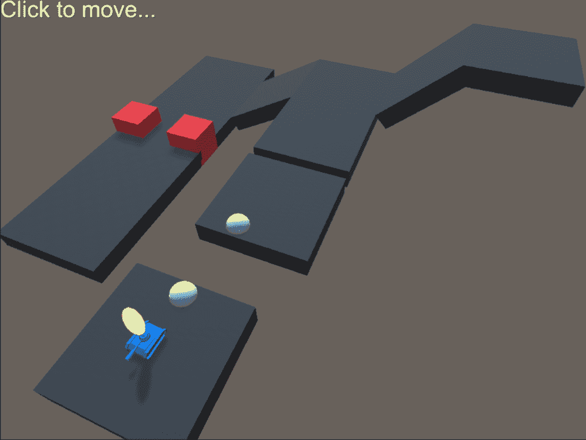

在您自己的级别中，您可能需要调整这些设置以获得您期望的确切结果，但结合这些功能，您将获得很多即插即用的功能。您可以使用 Unity 的 NavMesh 功能相当快地将一个简单的游戏运行起来。

# 摘要

你现在已经顺利地导航到了本章的结尾（无耻地开个玩笑）。从简单的航点，到高效快速的 A*算法，再到 Unity 自带的强大且稳健的 NavMesh 系统，我们已经为你制作游戏工具箱添加了一些重要且灵活的工具。这些概念不仅彼此兼容，而且与本书中我们已经看到的其他系统也配合得很好，我们将在接下来的几章中对其进行探讨。

在下一章中，我们将开始探讨如何为需要统一移动的多个智能体创建高效且逼真的模拟。让我们开始吧！
