# 使用模糊逻辑让你的 AI 看起来更有生命力

模糊逻辑是一种以更细腻的方式表示你的游戏规则的方法。也许比这本书中的其他概念更甚，模糊逻辑是一个非常数学化的主题。大部分信息都可以用纯数学函数来表示。为了教学目的，将重要概念应用于 Unity，大部分数学都已被简化，并使用 Unity 的内置功能实现。当然，如果你是那种喜欢数学的人，这个话题在某种程度上相当深入，所以请随意运用这本书中涵盖的概念！在本章中，我们将学习以下内容：

+   模糊逻辑是什么

+   模糊逻辑的应用领域

+   如何实现模糊逻辑控制器

+   模糊逻辑概念的其他创造性用途是什么

# 定义模糊逻辑

定义模糊逻辑最简单的方法是通过与二进制逻辑的比较。在前面的章节中，我们研究了作为真或假、0 或 1 值的转换规则。某物可见吗？它至少距离我们多远？即使在评估多个值的情况下，所有值都有确切的两个结果；因此，它们是二进制的。相比之下，模糊值代表了一个更丰富的可能性范围，其中每个值都表示为浮点数而不是整数。我们不再将值视为 0 或 1，而是将它们视为 0 到 1。

描述模糊逻辑的一个常见例子是温度。模糊逻辑允许我们根据非具体数据做出决策。我可以在阳光明媚的加利福尼亚夏日的一天外出，确信天气温暖，而无需知道确切的温度。相反，如果我冬天在阿拉斯加，我会知道天气很冷，同样，无需知道确切的温度。冷、凉爽、温暖和热这些概念都是模糊的。从温暖到热的转变点存在相当多的歧义。模糊逻辑允许我们将这些概念建模为集合，并通过使用一组规则来确定它们的有效性或真实性。

当人们做决策时，人们有一些灰色区域。也就是说，并不总是非黑即白。同样的概念也适用于依赖于模糊逻辑的代理。比如说，如果你几个小时没吃东西，开始觉得有点饿。在什么时刻你饿到足以去拿零食？你可以把饭后立刻的时间看作是 0，而 1 则是接近饥饿的点。以下图示说明了这一点：

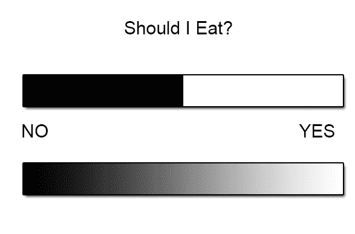

在做决定时，有许多因素决定了最终的选择。这引出了模糊逻辑控制器的一个方面——它们可以考虑到所需的所有数据。让我们继续看看我们的“我应该吃饭吗？”的例子。我们只考虑了一个值来做这个决定，那就是自上次你吃饭以来经过的时间。然而，还有其他因素会影响这个决定，比如你当时消耗了多少能量，以及你当时有多懒。或者我是唯一一个把那作为一个决定因素的人吗？无论如何，你可以看到多个输入值如何影响输出，我们可以将其视为“再次用餐的可能性。”

由于模糊逻辑系统的通用性，它们可以非常灵活。你提供输入，模糊逻辑提供输出。这个输出对你游戏的意义完全取决于你。我们主要看了输入如何影响一个决定，实际上，这是将输出用于计算机、我们的代理可以理解的方式。然而，输出也可以用来确定做某事多少，某事发生多快，或者某事持续多久。

例如，想象一下你的代理是一个科幻赛车游戏中的汽车，它有一个“氮气助推”能力，可以让它消耗资源来加速。我们的 0 到 1 值可以代表使用该助推的标准化时间，或者可能是使用该助推的标准化燃料量。

# 选择模糊系统而非二元系统

就像我们在本书中之前介绍的系统一样，以及游戏编程中的大多数事情，我们必须在决定最佳解决问题的方法时评估我们游戏的需求、技术和硬件限制。

如你所想，从简单的是/否系统到更微妙的模糊逻辑系统，会有一定的性能成本，这也是我们可能选择不使用它的原因之一。当然，更复杂的系统并不一定总是更好的。有时你只是想要二元系统的简单性和可预测性，因为它可能更适合你的游戏。

虽然老话“简单就是最好”有一定的道理，但我们也应该考虑另一句话，“尽可能简单，但不能更简单”。虽然这句话通常归功于相对论的创始人阿尔伯特·爱因斯坦，但并不完全清楚是谁说的。重要的是要考虑这句话本身的意义。你应该让你的 AI 尽可能简单，但不能更简单。吃豆人的 AI 对游戏来说工作得很好——它足够简单。然而，规则说，简单在现代射击游戏或策略游戏中可能不合适。

将本书中的知识和例子拿去，找到最适合你的方法。

# 使用模糊逻辑

一旦你理解了模糊逻辑背后的简单概念，就很容易开始思考它可能有多少种有用的方式。实际上，它只是我们工具箱中的另一个工具，每个工作都需要不同的工具。

模糊逻辑擅长处理一些数据，并以类似于人类的方式（尽管方式更为简单）对其进行评估，然后将数据转换成系统可用的信息。

模糊逻辑控制器有几个实际应用案例。有些比其他的应用更明显，尽管这些案例与我们在游戏 AI 中的使用并不是一一对应的，但它们有助于说明一个观点：

+   **供暖、通风和空调（HVAC）系统**：在谈论模糊逻辑时提到的温度例子，不仅是一个很好的理论方法来解释模糊逻辑，而且也是一个模糊逻辑控制器在实际中非常常见的例子。

+   **汽车**：现代汽车配备了非常复杂的计算机化系统，从空调系统（再次提到），到燃油输送，再到自动制动系统。实际上，在汽车中安装计算机已经导致了比过去有时使用的旧二进制系统更加高效的系统。

+   **你的智能手机**：你是否注意过，根据周围光线的多少，你的屏幕会变暗或变亮？现代智能手机操作系统会考虑周围光线、正在显示的数据的颜色以及当前电池寿命，以优化屏幕亮度。

+   **洗衣机**：不一定是我家的洗衣机，因为它的年代相当久远，但大多数现代洗衣机（过去 20 年生产的）都使用了一些模糊逻辑。从一次循环到下一次循环，会考虑装载量、水的污浊程度、温度和其他因素，以优化用水、能耗和时间。

如果你环顾你的房子，你很可能会发现一些有趣的模糊逻辑应用，当然，除了你的电脑之外。虽然这些是概念上的巧妙应用，但它们并不特别令人兴奋或与游戏相关。我偏爱涉及巫师、魔法和怪物游戏，所以让我们看看一个更相关的例子。

# 实现简单的模糊逻辑系统

对于这个例子，我们将使用我的好朋友鲍勃，这位巫师。鲍勃生活在一个 RPG 世界中，他有一些非常强大的治疗魔法可以使用。鲍勃必须根据他剩余的**生命值（HPs**）来决定何时对自己使用这种魔法。

在二进制系统中，鲍勃的决策过程可能看起来像这样：

```py
if(healthPoints <= 50)  
{ 
  CastHealingSpell(me); 
}
```

我们可以看到，鲍勃的健康状态可以是两种状态之一——高于 50，或者不是。这并没有什么问题，但让我们看看这个场景的模糊版本可能是什么样子，从确定鲍勃的健康状态开始：

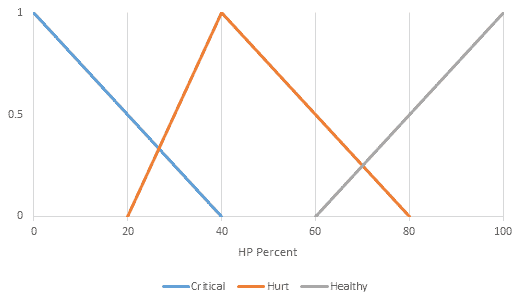

表示模糊值的典型函数

在看到图表和值时，在恐慌之前，让我们剖析我们所看到的内容。我们最初的冲动可能是尝试将鲍勃施展治疗咒语的概率映射到他缺失的健康程度。用简单的话说，这只是一个线性函数。这根本不是模糊的——它是一个线性关系，虽然在复杂性方面比二元决策高一个层次，但它仍然不是真正的模糊。

进入成员函数的概念。它是我们系统的关键，因为它允许我们确定一个陈述有多真实。在这个例子中，我们并不是简单地查看原始值来判断鲍勃是否应该施展咒语；相反，我们将它分解成逻辑信息块，供鲍勃使用，以确定他应该采取的行动。

在这个例子中，我们比较三个陈述，并评估每个陈述有多真实，以及哪个是最真实的：

+   鲍勃处于危急状态

+   鲍勃受伤

+   鲍勃是健康的

如果你喜欢官方术语，我们称之为确定集合的成员度。一旦我们有了这些信息，我们的代理就可以确定如何处理它。

乍一看，你会发现两个陈述同时为真是有可能的。鲍勃可以处于危急状态和受伤状态。他也可以有点受伤和有点健康。你可以自由选择每个的阈值，但在这个例子中，让我们根据前面的图表评估这些陈述。垂直值表示陈述的真实度，作为一个归一化的浮点数（0 到 1）：

+   在 0%健康状态下，我们可以看到关键陈述评估为 1。当鲍勃的健康耗尽时，这是一个绝对的真实陈述。

+   在 40%健康状态下，鲍勃受伤，这是最真实的陈述。

+   在 100%健康状态下，最真实的陈述是鲍勃是健康的。

任何超出这些绝对真实陈述的东西都完全处于模糊区域。例如，假设鲍勃的健康状况为 65%。在同一张图表中，我们可以这样可视化：

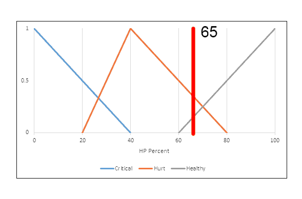

鲍勃 65%的健康状况

在图表上画出的垂直线代表**65**表示鲍勃的健康状况。正如我们所见，它与两个集合相交，这意味着鲍勃有点受伤，但他也很健康。然而，一眼就能看出，垂直线在图表中截取**受伤**集合的点比**健康**集合的点更高。我们可以理解为鲍勃受伤的程度比健康程度更高。具体来说，鲍勃受伤 37.5%，健康 12.5%，危急状态 0%。让我们看看代码；在 Unity 中打开我们的`FuzzySample`场景。层次结构将如下所示：

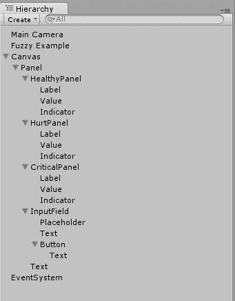

我们样本场景中的层次结构设置

需要关注的重要游戏对象是`模糊示例`。它包含我们将要查看的逻辑。除此之外，我们还有包含所有标签和输入字段以及使此示例工作的按钮的`Canvas`。最后，还有 Unity 生成的`EventSystem`和`Main Camera`，我们可以忽略它们。场景的设置没有特别之处，但熟悉它是好主意，我们鼓励你在了解为什么一切都在那里以及它们各自的作用之后，尽情地探索和调整。

当选择`模糊示例`游戏对象时，检查器将类似于以下图片：

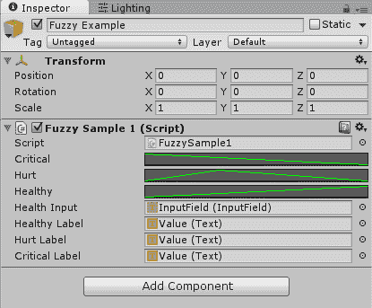

模糊示例游戏对象检查器

我们的示例实现不一定是你可以直接拿去在游戏中实现的东西，但它的目的是以清晰的方式说明前面的要点。我们为每个不同的集合使用 Unity 的`AnimationCurve`。这是一种快速且简单的方式来可视化我们早期图表中的相同线条。

不幸的是，没有简单的方法可以在同一个图表中绘制所有线条，所以我们为每个集合使用一个单独的`AnimationCurve`。在前面的截图中，它们被标记为“关键”、“受伤”和“健康”。这些曲线的巧妙之处在于它们自带一个内置方法来评估给定点的值（*t*）。对我们来说，*t*并不代表时间，而是鲍勃的健康量。

正如前面的图表所示，Unity 示例查看的是 0 到 100 的 HP 范围。这些曲线还提供了一个简单的用户界面来编辑这些值。你只需在检查器中点击曲线即可。这会打开曲线编辑窗口。你可以添加点、移动点、更改切线等，如以下截图所示：

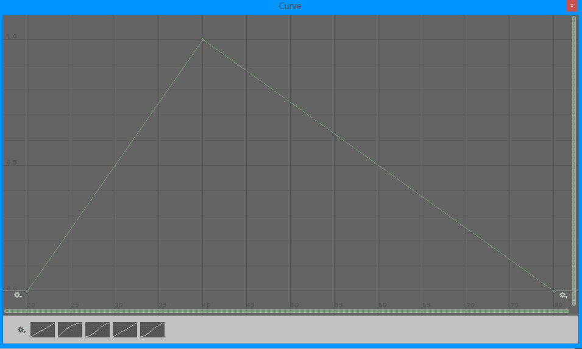

Unity 的曲线编辑器窗口

我们的例子专注于三角形形状的集合。也就是说，每个集合的线性图。你绝对不必局限于这种形状，尽管它是最常见的。你可以使用钟形曲线或梯形，如果需要的话。为了保持简单，我们将坚持使用三角形。

你可以在[`docs.unity3d.com/ScriptReference/AnimationCurve.html`](http://docs.unity3d.com/ScriptReference/AnimationCurve.html)了解更多关于 Unity 的`AnimationCurve`编辑器的信息。

其余的字段只是对我们在本章后面将要查看的代码中使用的不同 UI 元素的引用。然而，这些变量的名称相当直观，所以这里不需要太多的猜测。

接下来，我们可以看看场景是如何设置的。如果你播放场景，游戏视图将类似于以下截图：

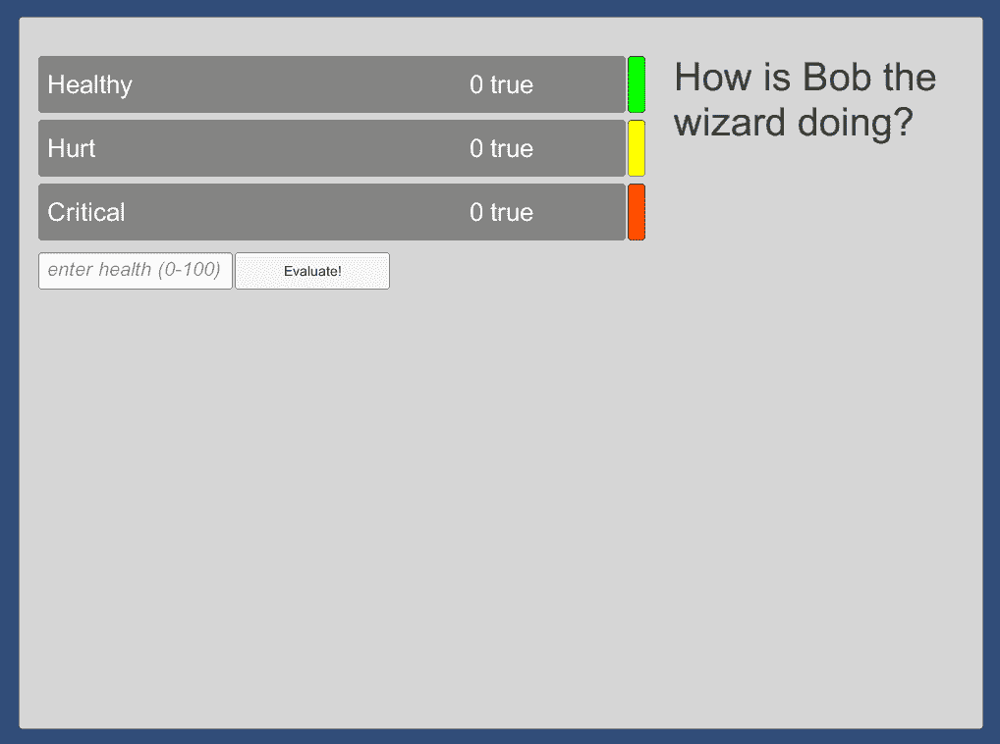

一个简单的用户界面来演示模糊值

我们可以看到，我们有三个不同的组，代表“鲍勃，巫师”示例中的每个问题。鲍勃有多健康，鲍勃有多受伤，鲍勃有多危急？对于每个集合，在评估时，最初为**0 真**的值将动态调整以表示实际成员度。

在这里有一个输入框，你可以输入用于测试的健康百分比。这个输入框没有复杂的控制，所以请确保输入一个介于 0 到 100 之间的值。为了保持一致性，让我们在框中输入`65`，然后按下“评估！”按钮。

这将运行一些代码，查看曲线，并产生我们在之前的图表中看到的精确结果。虽然这不应该令人惊讶（毕竟数学就是这样），但在游戏编程中，没有比测试你的假设更重要的事情了，而且确实，我们已经测试并验证了之前的声明。

通过点击“评估！”按钮运行测试后，游戏场景将类似于以下截图：

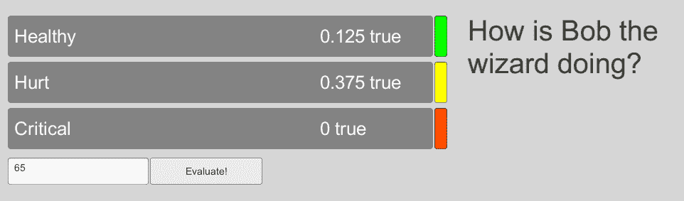

这就是鲍勃在 65%健康时的状态

再次，值是 0.125（或 12.5%）的健康和 0.375（或 37.5%）的受伤。在这个时候，我们还没有对这个数据进行任何操作，但让我们看看处理这一切的代码：

```py
using UnityEngine; 
using UnityEngine.UI; 
using System.Collections; 

public class FuzzySample1 : MonoBehaviour { 
    private const string labelText = "{0} true"; 
    public AnimationCurve critical; 
    public AnimationCurve hurt; 
    public AnimationCurve healthy; 

    public InputField healthInput; 

    public Text healthyLabel; 
    public Text hurtLabel; 
    public Text criticalLabel; 

    private float criticalValue = 0f; 
    private float hurtValue = 0f; 
    private float healthyValue = 0f; 
```

我们首先声明一些变量。`labelText`只是一个我们用来插入标签的常量。我们将`{0}`替换为实际值。

接下来，我们声明之前提到的三个`AnimationCurve`变量。将这些变量设置为公共或从检查器中可访问是能够通过视觉编辑它们的关键（尽管也可以通过代码构建曲线），这正是使用它们的目的。

以下四个变量只是对我们之前在检查器截图中所看到的 UI 元素的引用，而最后三个变量是我们曲线将评估到的实际浮点值：

```py
    private void Start () { 
        SetLabels(); 
    } 

    /* 
     * Evaluates all the curves and returns float values 
     */ 
    public void EvaluateStatements() { 
        if (string.IsNullOrEmpty(healthInput.text)) { 
            return; 
        } 
        float inputValue = float.Parse(healthInput.text); 

        healthyValue = healthy.Evaluate(inputValue); 
        hurtValue = hurt.Evaluate(inputValue); 
        criticalValue = critical.Evaluate(inputValue); 

        SetLabels(); 
    } 
```

`Start()`方法不需要太多解释。我们在这里只是更新我们的标签，以便它们初始化为非默认文本。`EvaluateStatements()`方法则更有趣。我们首先对我们的输入字符串进行一些简单的空值检查。我们不希望尝试解析一个空字符串，所以如果它是空的，我们就从函数中返回。如前所述，没有检查来验证你是否输入了一个数值，所以请确保不要意外输入一个非数值，否则你会得到一个错误。

对于每个`AnimationCurve`变量，我们调用`Evaluate(float t)`方法，其中我们将`t`替换为从输入字段中获取的解析值。在我们运行的示例中，这个值将是`65`。然后，我们再次更新我们的标签以显示我们得到的价值。代码看起来像这样：

```py
    /* 
     * Updates the GUI with the evluated values based 
     * on the health percentage entered by the 
     * user. 
     */ 
    private void SetLabels() { 
        healthyLabel.text = string.Format(labelText, healthyValue); 
        hurtLabel.text = string.Format(labelText, hurtValue); 
        criticalLabel.text = string.Format(labelText, criticalValue);         
    } 
} 
```

我们只是取每个标签，并用格式化的`labelText`常量替换文本，将`{0}`替换为实际值。

# 扩展集合

我们之前详细讨论了这个问题，重要的是要理解，构成我们例子中集合的值是独一无二的，属于鲍勃和他的疼痛阈值。假设我们有一个第二位巫师吉姆，他有点鲁莽。对他来说，关键可能低于 20%，而不是鲍勃的 40%。这就是我喜欢称之为使用模糊逻辑的“快乐奖金”。游戏中的每个代理都可以有不同的规则来定义它们的集合，但系统并不关心。你可以预先定义这些规则，或者让某种程度的随机性决定极限，每个代理都会以独特的方式行为并做出反应。

此外，我们没有理由将我们的集合限制为只有三个。为什么不是四个或五个呢？对于模糊逻辑控制器来说，唯一重要的是你确定你试图达到什么真理，以及你是如何达到的；它不关心系统中存在多少不同的集合或可能性。

# 数据去模糊化

是的，这是一个真正的（或者说）词。我们开始于一些清晰规则，在模糊逻辑的上下文中，这意味着明确、明确的数据，然后我们通过为集合分配隶属函数来模糊化（再次，这是一个（或者说）真正的词）数据。过程的最后一步是去模糊化数据并做出决策。为此，我们使用简单的布尔运算，如下所示：

```py
IF health IS critical THEN cast healing spell 
```

现在，在这个时候，你可能想说，“等等，这看起来非常像二进制控制器，”你是对的。那么为什么要费这么大的劲呢？还记得我们之前说的关于模糊信息的话吗？没有模糊控制器，我们的代理如何理解什么是关键、受伤或健康呢？这些都是对计算机本身意义不大的抽象概念。

通过使用模糊逻辑，我们现在能够使用这些模糊的术语，从中推断出一些东西，并做具体的事情；在这种情况下，施展治愈咒语。此外，我们能够允许每个代理在个人层面上确定这些模糊术语对他们的意义，这不仅使我们能够在个人层面上实现不可预测性，甚至在几个类似代理之间也能实现。

以下图表最好地描述了这一过程：

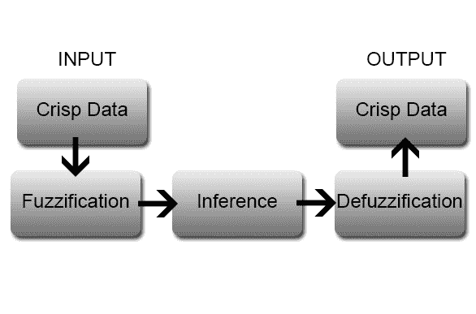

模糊逻辑控制器流程

最后，它们仍然是计算机，所以我们受限于计算机最基本理解的东西，0 和 1：

+   我们从清晰的数据开始，即具体、明确的价值，它们告诉我们一些非常具体的事情。

+   模糊化步骤是我们决定我们的代理需要做出决策的抽象或模糊数据的地方。

+   在推理步骤中，我们的智能体需要决定这些数据意味着什么。智能体根据提供的一组旨在模仿人类决策细微差别的规则，来确定什么是“真实”的。

+   模糊化步骤将这种对人类友好的数据转换为简单、计算机友好的信息。

+   我们最终得到清晰的数据，准备供我们的巫师智能体使用。

# 使用得到的结果数据

模糊控制器的数据输出可以连接到行为树或有限状态机。当然，我们也可以组合多个控制器的输出来做决策。实际上，我们可以使用一大堆它们来达到最真实或最有趣的结果（无论如何，一个使用魔法的巫师可以有多真实）。以下图示展示了它可能用到的模糊逻辑控制器，以确定是否施放治疗术：

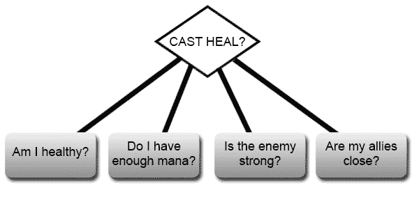

我们已经讨论了健康问题，但其他问题呢？我们还有另一组问题，单独来看对智能体来说并没有太多意义：

你有足够的法力吗？好吧，你可以有一点点法力，一些法力，或者很多法力。一个人类玩家在游戏中选择施放魔法或使用技能时询问这个问题并不罕见。“足够”可能是一个二进制数量，但更有可能的是，“足够施放治疗术，并且还有剩余的法力用于其他法术。”我们从一个简单清晰的价值开始——智能体可用的法力数量，然后将其连接到模糊逻辑控制器，并在另一端获得一些清晰的数据。

那么，敌人的力量如何？他可能是弱的、普通的、强大的或不可战胜的。你可以对你的模糊逻辑控制器输入进行创新。例如，你可以直接从敌人那里获取原始的“力量”值，但你也可以将你的“防御”属性与敌人的“攻击力”之间的差异放入模糊逻辑控制器。记住，在数据进入控制器之前，你处理数据的方式没有限制。

我的盟友离我近吗？正如我们在第二章“有限状态机与您”中看到的，简单的距离检查可以对简单的设计产生神奇的效果，但有时你可能需要更多。你可能需要考虑沿途的障碍——那个在锁着的门后面的盟友，使他无法到达智能体？这类问题甚至可能是一组需要评估的嵌套语句。

现在，如果我们用嵌套控制器来处理最后一个问题，它可能开始看起来有点熟悉：

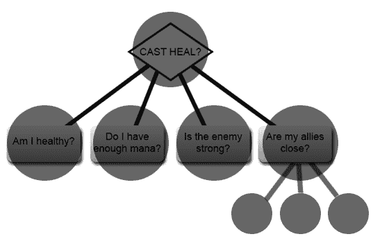

前面的图示非常像树状结构，不是吗？当然，没有理由不能使用模糊逻辑来评估每个节点，构建一个行为树。通过结合这两个概念，我们最终得到一个非常灵活、强大且细腻的人工智能系统。

# 使用更简单的方法

如果你选择坚持使用简单的清晰输出评估，换句话说，不是特定的树或有限状态机，你可以使用更多的布尔运算符来决定你的代理将要做什么。伪代码将如下所示：

```py
IF health IS critical AND mana IS plenty THEN cast heal 
```

我们可以检查不成立的条件：

```py
IF health IS critical AND allies ARE NOT close THEN cast heal 
```

我们也可以将多个条件串联起来：

```py
IF health IS critical AND mana IS NOT depleted AND enemy IS very strong THEN cast heal 
```

通过查看这些简化的语句，你会注意到使用模糊逻辑的另一个“快乐奖励”——清晰的输出抽象了大部分决策条件，并将它们组合成简化的数据。

而不是需要在你的 `if/else` 语句中解析所有可能性，最终导致有成千上万条或者更多 switch 语句，你可以将逻辑块整洁地打包成更少、更有意义的几块数据。

换句话说，你不需要以程序化的方式嵌套所有语句，这样既难以阅读也难以重用。作为一个设计模式，通过模糊逻辑控制器抽象数据最终会变得更加面向对象和友好。

# 道德计示例

本章的派系/道德计示例通过 Unity 实现模糊逻辑的方法略有不同。我们基于我们在基本模糊逻辑示例中介绍的实施方法进行构建。

在这个例子中，我们创建了一个简单的对话序列，玩家将面对一系列场景或问题，然后根据他们的道德来回答。为了简化起见，我们为每个问题都包含了“好”、“中立”和“邪恶”的答案。让我们看看代码，以便更好地理解这一点。

# 问题和答案类

`Question` 和 `Answer` 类非常简单，用作数据容器。让我们首先看看 `Question.cs` 类：

```py
[System.Serializable]
public class Question { 
    public string questionText; 
    public Answer[] answers;
}
```

你可能已经注意到 `Question` 类并没有从 `MonoBehaviour` 继承。它是一个普通的 C# 类。因此，Unity 默认不会序列化它，它也不会在检查器中显示。为了让 Unity 知道你想要这个类被序列化，请在类定义的顶部使用 `System.Serializable` 属性。

如你所见，这只有几行代码。第一个字段 `questionText` 将在后续步骤中通过检查器进行编辑。它是我们向用户展示的问题/场景的显示文本。`answers` 字段是一个 `Answer` 类型的数组。`Answer.cs` 代码如下：

```py
[System.Serializable]
public class Answer {
    public string answerText; 
    public float moralityValue;
}
```

再次，你会注意到这个类非常简单。`answerText` 是用于玩家响应按钮中显示的文本，而 `moralityValue` 字段是我们用来稍后计算玩家道德对齐的隐藏值。在这个例子中，我们假设每个问题有三个答案，每个答案的道德值分别是 0、50 和 100。

# 管理对话

我们的`ConversationManager.cs`类是本示例中所有重头戏发生的地方。它管理我们的对话 UI，处理事件，并为我们计算结果。对于第一部分，我们初始化问题数组，然后处理 UI。我们在类的顶部设置了一些变量，如下所示：

```py
    [Header("UI")]
    [SerializeField]
    private GameObject questionPanel;
    [SerializeField]
    private GameObject resultPanel;
    [SerializeField]
    private Text resultText;
    [SerializeField]
    private Text questionText;
    [SerializeField]
    private Button firstAnswerButton;
    [SerializeField]
    private Button secondAnswerButton;
    [SerializeField]
    private Button thirdAnswerButton;
```

我们将能够看到这些变量对应的 UI 元素，但请注意，我们明确期望一个固定的答案数量，因为我们只为 UI 提供了三个答案按钮。当然，你可以修改它以使其更灵活或满足你的需求，但请记住，如果你想使用更多或更少的答案，你也需要在这里做出相应的更改：

```py
[Header("Morality Gradient")]
[SerializeField]
private AnimationCurve good;
[SerializeField]
private AnimationCurve neutral;
[SerializeField]
private AnimationCurve evil;
```

与我们之前的例子类似，我们使用 Unity 的`AnimationCurve`来指定我们的模糊值。在这个设置中，我们假设了几件事情：

+   在*t=0*时，我们的“好”值是 1，然后从那里下降到 0

+   在*t=50*时，我们的“中立”值是 1

+   在*t=100*时，我们的“邪恶”评分是 1

这些值可以根据你的喜好进行调整，但当前的设置对于示例来说效果很好。以下截图显示了在检查器中设置的曲线：

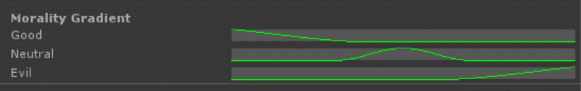

我们道德梯度的模糊曲线

注意这里显示的值对应于我们之前的假设，即我们的“好”答案给出 0 的值，我们的“中立”答案有 50 的值，我们的“邪恶”答案有 100 的值。

# 加载问题

我们提供了一个名为`LoadQuestion`的简单方法，用于从我们的数据类中提取值到 UI，并显示给玩家。代码如下：

```py
private void LoadQuestion(int index) 
{
    if (index < questions.Length) 
    {
        questionText.text = questions[index].questionText;
        firstAnswerButton.GetComponentInChildren<Text>().text = questions[index].answers[0].answerText;
        secondAnswerButton.GetComponentInChildren<Text>().text = questions[index].answers[1].answerText;
        thirdAnswerButton.GetComponentInChildren<Text>().text = questions[index].answers[2].answerText;
    } 
    else 
    {
        EndConversation();
    }
}
```

`LoadQuestion`方法接受一个问题索引，该索引对应于数组`questions[]`中问题的索引。我们首先检查我们的索引是否在范围内，如果不在范围内，就通过调用`EndConversation()`结束对话。如果我们处于范围内，我们只需为每个答案按钮填充问题文本和答案文本。

# 处理用户输入

当用户在 UI 上按下答案按钮时调用的事件是`OnAnswerSubmitted`。该方法相当简单，只有几行代码：

```py
public void OnAnswerSubmitted(int answerIndex) 
{
    answerTotal += questions[questionIndex].answers[answerIndex].moralityValue;
    questionIndex++;
    LoadQuestion(questionIndex);
}
```

该方法做了几件事情：

+   它将答案值聚合到答案总数中。我们将在下面查看这些值是如何分配的。

+   它增加问题索引值。

+   最后，它使用前一个要点中增加的索引值调用`LoadQuestion`。

# 计算结果

最后，我们有`EndConversation`方法，正如我们所看到的，当回答了所有问题（并且基于我们的`questions[]`数组长度，问题索引超出范围）时会被调用。

第一行简单地禁用了包含问题 UI 的面板游戏对象：

```py
questionPanel.SetActive(false);
```

计算在下一块代码中：

```py
 float average = answerTotal / questions.Length;
 float goodRating = good.Evaluate(average);
 float neutralRating = neutral.Evaluate(average);
 float evilRating = evil.Evaluate(average);
```

我们通过将 `answerTotal` 值（所有答案的总和）除以问题的数量来计算所有答案的平均值。然后我们使用刚刚计算出的平均值分别评估每个曲线的好、中、恶评价。我们在评估方法中使用平均值为我们的 *t* 值。

接下来，我们使用一些简单的 `if` 逻辑来确定哪个评价更高，如下面的代码片段所示：

```py
if(goodRating > neutralRating) 
        {
            if(goodRating > evilRating) 
            {
                //good wins
                alignmentText = "GOOD";
            }
            else 
            {
                //evil wins
                alignmentText = "EVIL";
            }
        }
        else 
        {
            if(neutralRating > evilRating) 
            {
                //neutral wins
                alignmentText = "NEUTRAL";
            }
            else 
            {
                //evil win
                alignmentText = "EVIL";
            }
        }
```

如前述代码所示，我们有一个分支条件结构来确定最高值，然后根据这个值设置 `alignmentText` 的值。

如果开始添加太多条件，`if` 块可能会变得有些复杂。在这种情况下，您可能想要考虑将评价放入一个数组或字典中，然后对它们进行排序，并/或使用 LINQ 从中获取最高值。有关排序字典的更多信息，请参阅 Dot Net Perls：[ https://www.dotnetperls.com/sort-dictionary](https://www.dotnetperls.com/sort-dictionary)

最后，我们向用户展示结果：

```py
resultPanel.SetActive(true);
resultText.text = "Your morality alignment is: " + alignmentText;
```

我们只需简单地启用结果面板，然后将 `alignmentText` 添加到 `"您的道德对齐是："` 消息中，在游戏模式中（如果您有“良好”评价）将看起来像这样：

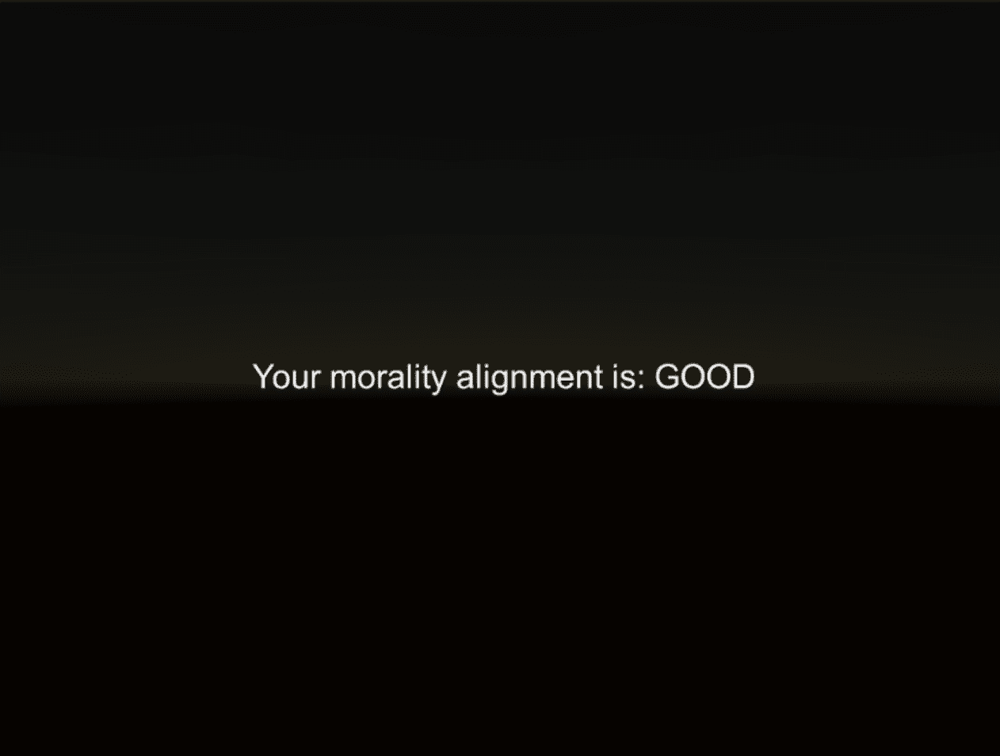

当你获得“良好”评价时的游戏屏幕

接下来，我们可以看看我们的场景设置，以及所有值是如何在示例项目中初始化的。

# 场景设置

当您首次打开 `FactionScene` 示例场景时，您会注意到一个看起来像这张截图的用户界面：

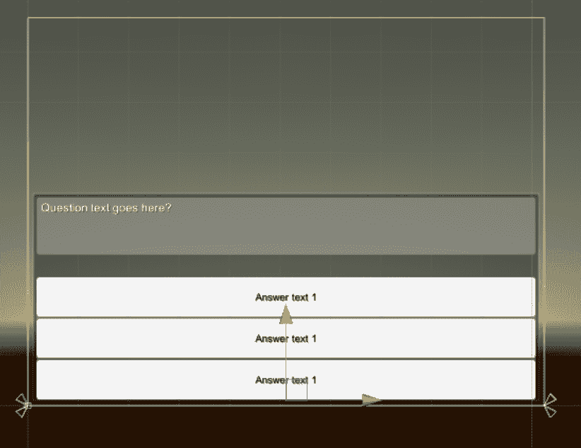

示例场景用户界面设置

如前一张截图所示，用户界面由几个不同的面板组成，文本组件已经用一些示例文本初始化，以帮助组织一切。场景的层次结构如下所示：

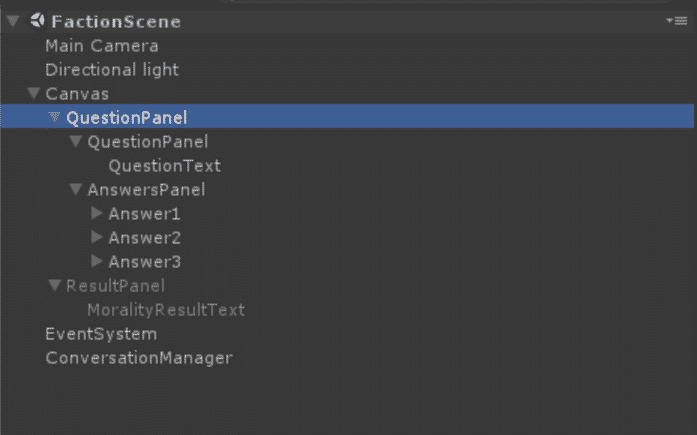

FactionScene 层次结构

如您所见，我们的画布在根级别有两个主要面板——QuestionPanel 和默认禁用的 ResultPanel。这是因为，如您可能记得的，我们在 `EndConversation` 方法中通过代码将此面板设置为 `enabled`。列表底部是我们的 ConversationManager 游戏对象，其中包含我们的 `ConversationManager` 脚本。

如果您选择它，您会看到检查器看起来像这样：

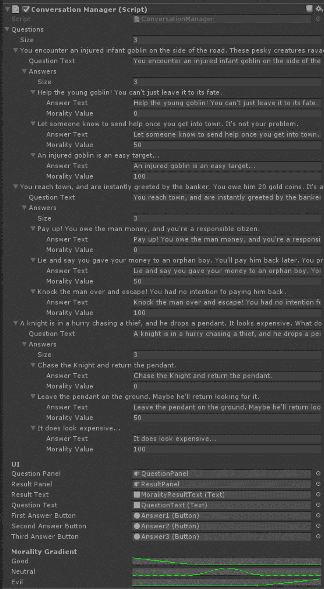

我们 Conversation Manager 的检查器，所有值都已分配

初看，这里的信息量可能看起来令人畏惧，但让我们看看每一步，您会发现我们已经涵盖了所有这些内容。

我们首先有一个序列化的问题数组。在这种情况下，我们有三个问题（请随意添加更多！）。每个问题包含一个（正好）三个答案的数组，以及我们之前看到的提问文本。对于每个答案，我们都有之前看到的答案文本和道德价值。请注意，问题或答案的顺序并不一定重要，只要你的道德价值对应于善良、中立或邪恶。

然后是 UI 部分，其中我们分配所有必要的元素。层次结构中的每个元素都适当地命名，以便确保每个字段都填充了正确的游戏对象。

最后，我们有之前看到的道德曲线。再次提醒，请随意调整到您满意的程度！

# 测试示例

剩下的就是测试示例了！点击播放，并选择一些答案。提供的场景让你扮演一个进入城镇的冒险者。在他的路上，他遇到了一个哥布林、一个银行家和一位骑士。你会在每种情况下做什么？请随意玩弄措辞，并添加你自己的道德困境！

# 寻找模糊逻辑的其他用途

模糊数据非常奇特且有趣，因为它可以与我们在本书中介绍的所有主要概念一起使用。我们看到了一系列模糊逻辑控制器如何轻松地适应行为树结构，并且不难想象它如何与 FSM 一起使用。

# 与其他概念合并

感官系统也倾向于使用模糊逻辑。虽然看到某物可能是一个二元条件，但在低光或低对比度环境中，我们可能会突然看到条件可以变得多么模糊。你可能晚上有过这样的经历：看到远处的一个奇怪的形状，在阴影中，你可能会想“那是一只猫吗？”结果却是一只垃圾袋，或其他动物，甚至可能是你的想象。同样的情况也适用于声音和气味。

当涉及到路径查找时，我们会遇到穿越网格某些区域的成本，模糊逻辑控制器可以轻松地帮助模糊化并使其更有趣。

鲍勃应该过桥与守卫战斗，还是冒险过河与水流战斗？嗯，如果他是一个好的游泳者但不是一个好的战士，选择是明显的，对吧？

# 创造真正独特的体验

我们的人工智能代理可以使用模糊逻辑来模仿性格。一些代理可能比其他代理更“勇敢”。突然，他们的个人特征——他们的速度、他们能跑多远、他们的体型等——可以被用来做出独特的决策。

性格可以应用于敌人、盟友和好友、NPC，甚至可以应用于游戏规则。游戏可以从玩家的进度、游戏风格或进度水平中获取清晰的数据，并动态调整难度，以提供更独特和个性化的挑战。

模糊逻辑甚至可以用来分配技术游戏规则，例如给定多人游戏大厅中的玩家数量、向玩家显示的数据类型，甚至如何将玩家与其他玩家匹配。将玩家的统计数据输入到匹配系统中，可以通过让玩家在与风格相似的合作环境中对抗匹配他们的游戏风格，或在竞争环境中对抗技能水平相似的玩家来保持玩家的参与度。

# 摘要

我很高兴看到你已经到达了这一章的结尾。一旦你理解了基本概念，模糊逻辑就会变得不再那么模糊。作为书中较为纯粹数学概念之一，如果你不熟悉术语，可能会觉得有点令人畏惧，但一旦在熟悉的环境中呈现，神秘感就会消失，你将拥有一个在游戏中使用的非常强大的工具。

我们学习了模糊逻辑在现实世界中的应用，以及它如何以二进制系统无法实现的方式帮助说明模糊概念。我们还学习了如何使用成员函数、隶属度和模糊集的概念来实现我们自己的模糊逻辑控制器。除此之外，我们还尝试了一个派系/道德系统，以进一步说明在自选冒险风格交互中的模糊逻辑概念。最后，我们探讨了我们可以使用结果的多种方式，以及它如何帮助使我们的智能体更加独特。

在最后一章，我们将探讨这本书中介绍的一些概念是如何共同工作的。
