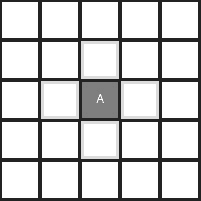
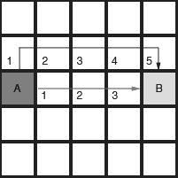
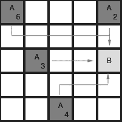
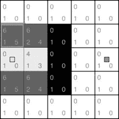
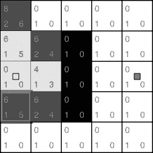
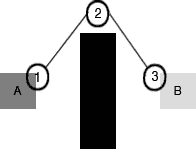
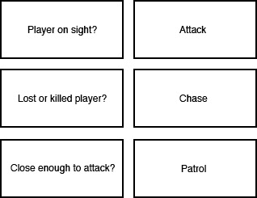
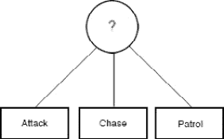
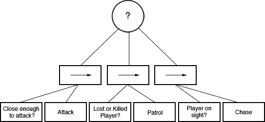
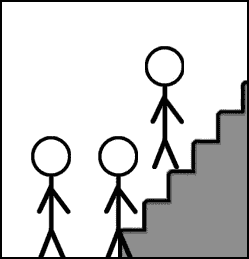

# 第一章：*第一章*: 人工智能简介

本书旨在教你使用最流行的商业游戏引擎之一：Unity3D，进行游戏人工智能编程的基础知识。在接下来的章节中，你将学习如何实现任何现代游戏的基础技术，例如行为树和有限状态机。

在此之前，尽管如此，你必须对人工智能有一个基本的了解，尤其是在其更广泛的、学术的、传统的领域。我们将在这个介绍性章节中提供这些信息。然后，我们将学习人工智能在游戏中的应用和实现与其他领域有何不同，以及游戏人工智能的基本和独特需求。最后，我们将探讨游戏中使用的 AI 的基本技术。

在本章中，我们将涵盖以下主题：

+   理解人工智能

+   游戏中的 AI

+   游戏人工智能技术

# 理解人工智能

智力是所有生物体，如动物和人类，生活中自然且必要的方面。没有智力——在这里以最广泛的方式提及——动物将无法寻找食物，蜜蜂将无法找到花朵，而我们人类将永远无法制造物体或点燃火焰，更不用说在 Unity 中开发游戏了！相反，计算机只是可以接受数据、以高速执行逻辑和数学运算并输出结果的电子设备。它们缺乏任何形式的智力。如果没有人的指示和指导，计算机将永远像石头一样静止不动，毫无生气。

从这个角度来看，人工智能本质上是研究如何赋予机器自然智能火花的一个领域。这是一门教授计算机如何像生物体一样思考和决策，以实现任何目标而不需要人类干预的学科。

如你所想，这是一个庞大的主题。这样一本小书不可能涵盖与人工智能相关的所有内容。幸运的是，为了游戏人工智能的目标，我们不需要对人工智能有全面的知识。我们只需要掌握基本概念并精通基本技术。这正是本书要做的。

但在我们继续探讨特定游戏的技术之前，让我们先看看人工智能的一些主要研究领域：

+   **计算机视觉**：这是从视觉源——如视频和照片——获取视觉输入并分析它们以识别对象（对象识别）、面孔（面部识别）、手写文档中的文本（光学字符识别），甚至从立体图像中重建 3D 模型的能力。

+   **自然语言处理**（**NLP**）：这允许机器阅读和理解人类语言——也就是说，我们如何书写和说话。问题是人类语言对机器来说很难理解。语言歧义是主要问题：有很多种说法可以表达相同的意思，同一个句子可以根据上下文有不同的含义。NLP 是机器的一个重大认知步骤，因为它们在处理和相应地做出反应之前需要理解我们使用的语言和表达方式。幸运的是，网络上有很多数据集可以帮助研究人员训练机器完成这个复杂任务。

+   **机器学习**：这一分支的 AI 研究机器如何仅使用原始数据和经验来学习执行任务，无论是否有人类的干预。这些任务包括从识别一张图片是否包含猫的图像，到玩棋类游戏（例如 AlphaGo 软件，在 2017 年能够击败围棋世界排名第一的选手），再到完美地在我们自制的视频中插值著名演员的面部（所谓的**深度伪造**）。机器学习是一个涵盖所有其他 AI 领域的广阔领域。我们将在*第十一章*，*Unity 中的机器学习*中更多地讨论它。

+   **常识推理**：有一种知识几乎是人类与生俱来的。例如，我们轻易地知道*如果没有支撑，东西会掉在地上*或者*我们不能把一个大东西放进一个小东西里*。然而，这种知识和推理（也称为**常识知识**）对计算机来说是完全无法理解的。在撰写本文时，没有人知道如何教会机器这些对我们来说微不足道的事情。尽管如此，这仍然是一个非常活跃（且令人沮丧）的研究方向。

幸运的是，对于游戏 AI 来说，其范围要窄得多。相反，正如我们将在下一节中看到的，游戏 AI 有一个但却是至关重要的目标：让游戏变得有趣。

# 游戏中的 AI

与通用 AI 不同，游戏 AI 只需要提供**智能的错觉**。它的目标不是提供类似人类的智能代理，而是足够聪明，能让游戏变得有趣的角色。

当然，让游戏*变得有趣*并非易事，而且公平地说，一个好的 AI 只是问题的一部分。尽管如此，如果一个好的 AI 不足以让游戏*变得有趣*，一个差的 AI 甚至可能破坏最精心设计的游戏。如果你对*什么让游戏变得有趣*这个问题感兴趣，我建议你阅读一本关于游戏设计的优秀书籍，例如 Jesse Schell 的*游戏设计艺术*。

然而，对于我们来说，重要的是要说明，提供足够的挑战水平给玩家是至关重要的。在这种情况下，公平的挑战意味着游戏不应该太难以至于玩家无法击败对手，也不应该太容易以至于胜利变得乏味。因此，找到正确的挑战水平是使游戏有趣的关键。

正是在这里，AI 开始发挥作用。游戏中的 AI 角色是通过提供具有挑战性的对手和在游戏世界中表现适当的**非玩家角色**（NPCs）来使游戏变得有趣。因此，这里的目的是不是复制人类或动物的全部思维过程，而是通过让 NPC 在游戏世界中的变化情况下的反应显得智能，从而使它们对玩家有意义。正如我们之前提到的，这提供了智能的错觉。

信息

必须提到的是，游戏中的 AI 不仅限于模拟 NPC 的行为。AI 还用于生成游戏内容（正如我们将在*第十章*，*程序内容生成*)，控制故事事件和叙事节奏（一个显著的例子来自《求生之路》系列的 AI 导演）或甚至创造整个叙事弧线。

注意，一个好的游戏 AI 不需要是复杂的 AI。一个反复出现的例子是原始《吃豆人》街机游戏的 AI。按照任何现代标准，控制四个鬼魂追逐吃豆人的算法几乎不能被认为是 AI。每个鬼魂都使用一个非常简单的规则来决定下一步移动的方向：测量鬼魂和目标方块之间的距离，并选择最小化距离的方向。

目标方块可能是吃豆人的位置（如红色鬼魂的情况），也可能是吃豆人前方的东西（如粉色鬼魂），或者是一些其他的方块。通过简单地改变目标方块的位置，吃豆人街机游戏可以为每个鬼魂赋予独特的个性和 AI，即使经过 40 年后，它仍然能挑战我们！

金科玉律是使用最少的 AI 来实现游戏的设计目标。当然，如果我们发现 AI 是不必要的，我们可以将这一规则推向极致，不使用任何 AI。例如，在《传送门》和《传送门 2》中，所有角色都是完全脚本化的，没有涉及 AI，但没有人对 AI 的缺失表示不满。

信息

如果你想要深入了解《吃豆人》AI，我建议你观看来自*Retro Game Mechanics Explained* YouTube 频道的这个非常详细的视频：[`www.youtube.com/watch?v=ataGotQ7ir8`](https://www.youtube.com/watch?v=ataGotQ7ir8)。

或者，如果你更喜欢阅读，你可以访问这个非常有信息量的网页：[`gameinternals.com/understanding-pac-man-ghost-behavior`](https://gameinternals.com/understanding-pac-man-ghost-behavior)。

游戏 AI 另一个挑战是，其他操作，如图形渲染和物理模拟，需要与 AI 所需的计算能力共享。别忘了，这一切都是在实时发生的，所以在整个游戏中保持稳定的帧率至关重要。这意味着游戏 AI 需要设计得不会耗尽计算资源。这通常是通过设计一个可以中断并在多个帧上扩展的算法来实现的。

在一般 AI 领域，许多公司投资于一个专门的 AI 计算处理器，称为 AI 加速器（例如谷歌的 Tensor Processing Unit）。然而，直到游戏广泛地访问这样的专用 AI 处理器之前，我们游戏 AI 开发者仍然需要关注我们算法的性能。

下一节将提供对在视频游戏中使用最广泛的 AI 技术的一般介绍。

# 视频游戏 AI 技术

在本节中，我们将探讨一些在不同类型游戏中常用的 AI 技术。我们将在接下来的章节中学习如何在 Unity 中实现这些功能。由于本书的重点不是 AI 技术本身，而是在 Unity 中实现这些技术，因此我们不会在这里过多地详细讨论它们。所以，让我们将其视为在深入了解实现细节之前的一个快速课程。

如果你想了解更多关于游戏 AI 的信息，有一些很好的书籍，例如 Mat Buckland 的《通过实例编程游戏 AI》和 Ian Millington 与 John Funge 的《游戏人工智能》。此外，*AI 游戏编程智慧* 和 *游戏 AI 专业人士* 系列也包含大量关于最新 AI 技术的有价值资源和文章。

## 有限状态机

**有限状态机**（**FSM**）可能是最简单、最常用、最常讨论的 AI 模型之一，对于大多数游戏来说，它们代表了唯一的 AI 技术。状态机由有限数量的 **状态** 组成，这些状态通过一个或多个 **转换** 相连，形成一个称为 **图** 的数据结构。每个游戏实体都从一个初始状态开始。然后，环境事件触发特定的规则，使实体移动到另一个状态。这种触发规则称为 **转换**。游戏实体在任何给定时间只能处于一个状态。

例如，让我们考虑一个典型射击游戏中的 AI 守卫角色。其状态可能像 *巡逻*、*追逐* 和 *射击* 这样简单：

图 1.1 – 一个简单的用于 AI 守卫角色的有限状态机 (FSM)

简单 FSM 有四个组成部分：

+   **状态**：此组件定义了游戏实体或 NPC 可以选择的一组状态（**巡逻**、**追逐** 和 **射击**）。

+   **转换**：此组件定义了不同状态之间的关系。

+   **规则**：此组件定义了何时执行状态转换（**玩家在视野中**、**足够近可以攻击**和**失去/杀死玩家**）。

+   **事件**：这是将触发以检查规则（守卫的可见区域、与玩家的距离等）的组件。

所以，在《Quake 2》中的怪物可能具有以下状态：站立、行走、奔跑、躲避、攻击、空闲和搜索。

状态机（FSMs）在游戏中被广泛使用，因为它们仅使用一些*if*或*switch*语句就很容易实现，但它们仍然足够强大，可以用于简单和相对复杂的游戏。另一方面，当我们需要大量状态和转换时，它们可能会变得混乱。我们将在下一章学习如何管理一个简单的状态机。

## AI 中的随机性和概率

想象一下在一个**第一人称射击游戏**（**FPS**）中，一个敌人机器人总是可以用头槌或对手在赛车游戏中总是选择最佳路线且从不与任何障碍物碰撞。这种程度的**智能**会使游戏变得非常困难，几乎不可能获胜，因此游戏体验会变得令人沮丧。在光谱的另一端，想象一下，当敌人试图从玩家那里逃脱时，总是选择相同的可预测路线。经过几场比赛后，玩家会学会敌人的模式，游戏会变得乏味。当玩家每次遇到都表现出相同行为的 AI 控制实体，会使游戏变得可预测、容易获胜，因此变得乏味。

当然，有些情况下，*有意可预测性*是一个期望的特性。例如，在潜行游戏中，我们希望玩家能够预测敌人的路径，以便玩家可以计划潜行路线。但在其他情况下，*无意可预测性*可能会干扰游戏的参与度，使玩家感觉游戏不够具有挑战性或公平性。修复这些**过于完美**或**过于愚蠢**的 AI 的一种方法是在它们的行为中引入有意错误。在游戏中，我们在 AI 计算的决策过程中引入随机性和概率。

有多种场景，我们可能希望引入一些随机性。最直接的情况是当 NPC 没有信息，或者它所做的决定无关紧要时。例如，在射击游戏中，一个被攻击的敌人可能想要决定在哪里躲避。因此，我们可能希望指示 NPC 有时选择一个稍微远一点的躲避点。

在其他情况下，我们可以使用随机性来决定结果。例如，我们可以使用随机性来决定命中率，对基础伤害进行随机增减，或者在 NPC 开始射击前让他们犹豫。

## 传感器系统

我们的人工智能角色需要了解他们的周围环境和他们与之交互的世界，以便做出特定的决定。此类信息包括以下内容：

+   **玩家的位置**：这用于决定是攻击、追击还是继续巡逻。

+   **建筑和附近物体**：这用于隐藏或掩护。

+   **玩家的健康和 AI 的健康**：这用于决定是撤退还是前进。

+   **实时策略（RTS）游戏中地图上资源的位置**：这用于占领和收集更新和/或生产其他单位所需的资源。

如您所想，选择正确的方法来收集游戏信息可能会因我们试图构建的游戏类型而大相径庭。在接下来的几节中，我们将探讨两种基本策略：**轮询**和**消息（事件）系统**。

### 投票

收集此类信息的一种方法是我们 AI 角色的`FixedUpdate`方法。这样，AI 角色可以从游戏世界中轮询它们感兴趣的信息，进行检查，并据此采取行动。如果需要检查的项目不多，轮询效果很好。

为了使这种方法更高效，我们可能想要编程角色以不同的速率轮询世界状态，这样我们就不需要所有角色同时检查一切。例如，我们可以将轮询代理分成 10 组（G1、G2、G3 等），并为每组分配不同的帧进行轮询（例如，G1 将在帧 0、60、120 等轮询；G2 将在帧 10、70、130 等轮询）。

作为另一个例子，我们可能会决定根据敌人的类型或状态来改变轮询频率。例如，未参与战斗且远离的敌人可能每 3-4 秒轮询一次，而接近玩家且正在受到攻击的敌人可能希望每 0.5 秒轮询一次。

然而，随着游戏的扩大，轮询就不再足够了。因此，在更大型、更复杂的 AI 系统中，我们需要实现一个使用全局消息系统的基于事件的驱动方法。

### 消息系统

在消息系统中，游戏通过异步消息在 AI 实体、玩家、世界或其他 AI 实体之间传递事件。例如，当玩家攻击一群巡逻守卫中的敌方单位时，其他 AI 单位需要了解这一事件，以便它们可以开始搜索并攻击玩家。

如果我们使用轮询方法，我们的 AI 实体需要检查所有其他 AI 实体的状态，以确定是否有实体被攻击。然而，我们可以以更易于管理和可扩展的方式实现这一点：我们可以将感兴趣特定事件的 AI 角色注册为该事件的监听器；然后，如果该事件发生，我们的消息系统将向所有监听器广播此信息。AI 实体可以据此采取适当的行动或进行进一步的检查。

这个事件驱动系统并不一定比轮询机制更快。然而，它提供了一个方便的、集中的检查系统，它感知世界并向感兴趣的 AI 代理报告，而不是让每个代理在每一帧检查相同的事件。在现实中，轮询和消息系统通常一起使用。例如，当 AI 从消息系统中收到事件时，它可能会轮询更详细的信息。

## 群聚、盘旋和放牧

许多生物，如鸟类、鱼类、昆虫和陆地动物，在群体中进行特定的操作，如移动、狩猎和觅食。它们以群体形式停留和狩猎，因为这样比单独追求目标更强大、更安全。所以，假设你想要一群鸟在空中群聚、盘旋；对于动画师来说，为每只鸟设计运动和动画将花费太多时间和精力。然而，如果我们为每只鸟应用一些简单的规则，我们就可以通过复杂的全局行为实现整个群体的涌现智能。

这个概念的先驱是 Craig Reynolds，他在 1987 年的 SIGGRAPH 论文《Flocks, Herds, and Schools – A Distributed Behavioral Model》中提出了这样的群聚算法。他创造了**boid**这个术语，听起来像“bird”（鸟），但实际上指的是类似鸟的对象。他提出了三个简单的规则应用于每个单元：

+   **分离**：每个 boid 需要与邻近的 boid 保持最小距离，以避免碰撞（短程排斥）。

+   **对齐**：每个 boid 需要与邻居的平均方向对齐，然后以相同的速度与它们一起移动，作为一个群体。

+   **凝聚力**：每个 boid 被吸引到群体的质心（长程吸引）。

这三个简单的规则就足以实现一个逼真且相对复杂的鸟类群聚行为。这不仅适用于鸟类。群聚行为对于模拟人群或甚至在游戏中跟随玩家的几个 NPC 都很有用。

我们将在*第五章*“群聚”中学习如何在 Unity 中实现这样一个群聚系统。

## 跟随路径和转向

有时候，我们希望我们的 AI 角色在游戏世界中漫游并跟随一个大致引导或详细定义的路径。例如，在赛车游戏中，AI 对手需要导航道路。在这种情况下，像我们的群聚 boid 算法这样的简单反应算法不足以解决这个问题。然而，最终，这都归结于处理实际的运动和转向行为。AI 角色的转向行为已经成为几十年的研究课题。

在这个领域，一篇值得注意的论文是 Craig Reynolds 在 1999 年游戏开发者大会（**GDC**）上提出的**《自主角色的转向行为**》，他再次提出了以下三个层次的转向行为：

![图 1.2 – 运动行为层次结构

![图片 B17984_01_02.jpg]

图 1.2 – 运动行为层次结构

为了理解这些层次，让我们来看一个例子。想象一下，在一个炎热的夏日午后，你坐在办公桌前工作。你感到口渴，想要一杯冰茶。因此，我们从第一层开始：我们想要一杯冰茶（设定目标），并规划出我们为了得到它需要做什么。我们可能需要去厨房（除非你的桌子下有一个迷你冰箱），拿一个空杯子，然后移动到冰箱，打开它，拿冰茶（我们已经制定了一个高级计划）。

现在，我们转到第二层。除非你的厨房是从你的桌子直接延伸的直线，否则你需要确定一条路径：绕过桌子，穿过走廊，绕过厨房家具，直到你到达放玻璃杯的橱柜，等等。现在你已经有了路径，是时候移动到第三层：沿着路径行走。在这个例子中，第三层由你的身体、骨骼和肌肉沿着路径移动来表示。

信息

别担心——你不需要掌握所有三层。作为一个 AI 程序员，你只需要专注于前两层。第三层通常由图形程序员处理——特别是动画师。

在描述了这三层之后，克雷格·雷诺兹解释了如何为单个 AI 角色设计和实现标准的转向行为。这些行为包括 *寻找* 和 *逃离*，*追逐* 和 *躲避*，*徘徊*，*到达*，*避障*，*沿墙行走* 和 *路径跟随*。

我们将在 *第六章* 中实现这些行为中的一些，*路径跟随和转向行为*。

## A* 路径查找

在许多游戏中，你可以找到跟随玩家或避开障碍物移动到特定点的怪物或敌人。例如，让我们看看一个典型的实时战略游戏。你可以选择一组单位并点击你想要它们移动的位置，或者点击敌方单位进行攻击。

然后，你的单位需要找到一种方法在不与障碍物碰撞的情况下达到目标。当然，敌方单位也需要能够做到同样的事情。不同的单位可能有不同的障碍物。例如，空军单位可以飞越山脉，而地面或炮兵单位则需要找到绕过它的方法。

**A***（发音为“A-star”）是一种路径查找算法，由于其性能、准确性和易于实现，在游戏中被广泛使用。让我们通过一个例子来看看它是如何工作的。假设我们想让我们的单位从点 **A** 移动到点 **B**，但中间有一堵墙，它不能直接朝目标前进。因此，它需要找到一种方法到达点 **B** 同时避开墙壁：

![图 1.3 – 我们地图的俯视图

![图片 B17984_01_03.jpg]

图 1.3 – 我们地图的俯视图

这是一个简单的 2D 示例，但我们可以将同样的想法应用到 3D 环境中。为了从点 **A** 到点 **B** 寻找路径，我们需要了解更多关于地图的信息，例如障碍物的位置。为此，我们可以将整个地图分成代表整个地图的小瓷砖，以网格格式表示，如图所示：

图 1.4 – 以 2D 网格表示的地图

瓷砖也可以是其他形状，例如六边形或三角形。每种形状都有其优点。例如，六边形瓷砖很方便，因为它们没有 **对角线移动** 的问题（围绕目标六边形的所有六边形都在相同的距离上）。然而，在这个例子中，我们使用了正方形瓷砖，因为当我们想到 **网格** 时，它们是更直观的形状。

现在，我们可以在一个小的 2D 数组中引用我们的地图。

我们可以用一个 5x5 的正方形瓷砖网格来表示我们的地图，总共 25 个瓷砖。现在，我们可以开始寻找到达目标的最佳路径。我们如何做？通过计算与起始瓷砖相邻且未被障碍物占据的每个瓷砖的移动得分，然后选择成本最低的瓷砖。

如果我们不考虑对角线移动，玩家周围有四个可能的相邻瓷砖。现在，我们需要使用两个数字来计算每个这些瓷砖的移动得分。让我们称它们为 *G* 和 *H*，其中 *G* 是从起始瓷砖移动到当前瓷砖的成本，而 *H* 是从当前瓷砖到达目标瓷砖的估计成本。

让我们称 *F* 为 *G* 和 *H* 的和 (*F = G + H*) – 即该瓷砖的最终得分：

图 1.5 – 有效的相邻瓷砖

在我们的例子中，为了估算 *H*，我们将使用一种称为 **曼哈顿距离**（也称为 **出租车几何**）的简单方法。根据这种方法，点 **A** 和 **B** 之间的距离（成本）是 **A** 和 **B** 之间的水平瓷砖数量，加上 **A** 和 **B** 之间的垂直瓷砖数量：

图 1.6 – 计算 G

另一方面，*G* 值代表搜索过程中的 **当前成本**。前面的图示显示了使用两条不同路径计算 *G* 的过程。为了计算当前的 *G*，我们必须将 `1`（移动一个瓷砖的成本）加到前一个瓷砖的 *G* 分数上。然而，我们可以给不同的瓷砖分配不同的成本。例如，我们可能希望为对角线移动设置更高的移动成本（如果我们正在考虑它们），或者，例如，为池塘或泥泞的道路上的瓷砖。

现在我们知道了如何得到 *G*，让我们学习如何计算 *H*。以下图示显示了不同起始瓷砖的 *H* 值。即使在这种情况下，我们也使用曼哈顿距离：

图 1.7 – 计算 H

因此，现在我们已经知道了如何获取 *G* 和 *H*，让我们回到我们的原始例子，找出从 **A** 到 **B** 的最短路径。首先，我们必须选择起始瓷砖，并收集所有相邻的瓷砖，如图所示。然后，我们必须计算每个瓷砖的 *G* 和 *H* 分数，如图中瓷砖的左下角和右下角所示。最后，我们必须通过将 *G* 和 *H* 相加来获取最终分数 *F*。您可以在瓷砖的左上角看到 *F* 分数。

现在，我们必须选择具有最低 *F* 分数的瓷砖作为我们的下一个瓷砖，并将前一个瓷砖作为其父瓷砖存储。请注意，记录每个瓷砖的父瓷砖是至关重要的，因为我们稍后会使用这个回链来从终点到起点追踪节点序列以获得最终路径。在这个例子中，我们必须选择起始位置右侧的瓷砖，并将其视为当前瓷砖：

图 1.8 – 起始位置

从当前瓷砖开始，我们重复这个过程，首先收集有效的相邻瓷砖。这次只有两个空闲的相邻瓷砖：当前瓷砖上方的那个和底部的那个（实际上，左边的瓷砖是起始瓷砖——我们已经检查过——障碍物占据了右边的瓷砖）。我们计算 *G* 和 *H*，然后计算这些新相邻瓷砖的 *F* 分数。

这次，我们在地图上有四个瓷砖，它们的分数都相同：六。因此，我们可以选择其中的任何一个。实际上，最终我们会发现，无论我们首先探索哪个瓷砖，我们都会找到最短路径（证明这个陈述背后的数学原理超出了本书的范围）：

图 1.9 – 第二步

在这个例子中，我们从成本为 `6` 的瓷砖组中选择了左上角的瓷砖作为起始位置。同样，我们必须检查相邻的瓷砖。在这一步中，只有一个新的相邻瓷砖，其计算出的 *F* 分数为 `8`。因为目前最低的分数仍然是 `6`，所以我们可以选择任何分数为 `6` 的瓷砖：

图 1.10 – 第三步

如果我们重复这个过程，直到我们到达目标瓷砖，我们最终会得到一个显示每个空闲瓷砖分数的板：

图 1.11 – 达到目标

剩下只有一步了。你还记得我们存储在每个节点中的父链接吗？现在，从目标瓷砖开始，我们必须使用存储的父瓷砖来追踪一个瓷砖列表。结果列表将是一条看起来像这样的路径：

图 1.12 – 追踪回溯路径

我们在这里解释的是 A*路径查找算法的精髓，这是任何路径查找算法的基本基石。幸运的是，自从 Unity 3.5 以来，一些新功能，如自动导航网格生成和 NavMesh 代理，使得在游戏中实现路径查找变得更加容易。因此，你可能甚至不需要了解 A*就能为你的 AI 角色实现路径查找。然而，了解幕后系统的工作原理对于成为一名优秀的 AI 程序员至关重要。

我们将在下一节中讨论导航网格，然后在*第八章*，*导航网格*中更详细地讨论。

## 导航网格

现在你已经了解了 A*路径查找算法的基础知识，你可能注意到在 A*中使用网格需要许多步骤才能在起始位置和目标位置之间找到最短路径。这可能看起来并不显著，但搜索巨大地图上的路径，其中大多数是空格，并且逐个搜索路径方块是一种严重的计算资源浪费。因此，游戏通常使用航点作为指南，以简单有效的方式移动 AI 角色，从而减少计算资源的使用。

假设我们想将我们的 AI 角色从点**A**移动到点**B**，并且我们已经设置了三个航点，如下面的图所示：

图 1.13 – 航点

现在我们只需要将 A*算法应用于航点（这些航点的数量比方块的数量少），然后简单地从航点到航点直线移动角色。

然而，航点并非没有问题。如果我们想更新地图中的障碍物怎么办？我们将不得不为更新的地图重新放置航点，如下面的图所示：

图 1.14 – 新航点

此外，跟随每个节点到目标会产生看起来不真实的角色。例如，它们直线移动，然后突然改变方向，就像主题公园的景点中的机械木偶一样。或者连接两个航点的路径可能太靠近障碍物。例如，看看前面的图；AI 角色可能会在路径靠近墙壁的地方撞到墙上。

如果发生这种情况，我们的 AI 将继续尝试穿过墙壁以到达下一个目标，但它将无法做到，并且会卡在那里。当然，我们可以通过使用样条曲线平滑地调整路径来使路径更真实，或者我们可以手动检查每条路径以避免擦过障碍物的边缘。然而，问题在于航点不包含任何关于环境的信息，除了连接两个节点的轨迹。

为了应对这种情况，我们需要大量的航点，这非常难以管理。因此，对于除了简单游戏之外的所有事情，我们必须用管理数百个航点的心理和设计成本来交换网格的计算成本。

幸运的是，有一个更好的解决方案：使用导航网格。**导航网格**（通常称为**NavMesh**）是我们可以用来说明我们世界的另一种图结构，类似于基于方块的网格和航点图：

![图 1.15 – 导航网格]

![img/B17984_01_15.jpg]

![图 1.15 – 导航网格]

NavMesh 使用凸多边形来表示地图中 AI 实体可以行走的区域。使用 NavMesh 的最关键好处是它比航点系统包含更多关于环境的信息。有了 NavMesh，我们可以自动调整我们的路径，因为我们知道我们的 AI 实体可以在一个区域内自由移动。使用 NavMesh 的另一个优点是我们可以为不同类型的 AI 实体使用相同的网格。不同的 AI 实体可以有不同的属性，例如大小、速度和移动能力。例如，一组航点可能适合人类角色，但可能不适合飞行生物或 AI 控制的车辆。这些可能需要不同的航点集（这会带来所有这些问题）。

然而，根据场景程序生成 NavMesh 是一个相对复杂的过程。幸运的是，Unity 包含一个内置的 NavMesh 生成器。

由于这不是一本关于核心 AI 技术的书，我们不会深入探讨如何生成这样的 NavMesh。相反，我们将学习如何有效地使用 Unity 的 NavMesh 来实现 AI 角色的路径查找。

## 行为树

**行为树**是另一种用于表示和控制 AI 角色决策背后逻辑的技术。由于其在 AAA 游戏如*光环*和*孢子*中的应用而变得流行。我们在本章前面简要介绍了 FSM，这是一种基于游戏事件反应中不同状态之间转换来定义 AI 角色逻辑的简单方法。然而，FSM 有两个主要问题：它们难以扩展和重用。

为了支持我们希望角色存在的所有场景，我们需要添加很多状态并硬编码许多转换。因此，我们需要某种可以更好地与更广泛的问题缩放的东西。行为树代表了正确方向上的一个合理步骤。

如其名所示，行为树的本质是一种树状的数据结构。这种树的叶子被称为**任务**，它们代表我们角色的动作（例如，*攻击*、*追逐*、*巡逻*、*隐藏*等）或感官输入（例如，*玩家是否靠近？*或*我是否足够接近可以攻击？*）。相反，树的内节点由控制流节点表示，它们指导树的执行。**序列**、**选择器**和**并行装饰器**是常用的控制流节点。

现在，让我们尝试使用行为树重新实现“有限状态机”部分中的示例。首先，我们可以将所有转换和状态分解成基本任务：

图 1.16 – 任务

现在，让我们看看选择器节点。我们用一个带有问号的圆圈来表示选择器。当执行时，选择器节点会按顺序尝试执行所有子任务/子树，直到第一个返回成功的任务。换句话说，如果我们有一个有四个子节点（例如，A、B、C 和 D）的选择器，选择器节点会首先执行 A。如果 A 失败，那么选择器会执行 B。如果 B 失败，那么它会执行 C，依此类推。如果*任何*任务返回成功，那么序列在完成那个任务后立即返回成功。

在以下示例中，选择器节点首先选择攻击玩家。如果**攻击**任务返回成功（即玩家在攻击范围内），选择器节点停止执行并返回成功给其父节点（如果有的话）。相反，如果**攻击**任务返回失败，选择器节点会移动到**追逐**任务。在这里，我们重复之前所做的事情：如果**追逐**任务成功，选择器节点成功；如果**追逐**任务失败，它会尝试**巡逻**任务，依此类推：

图 1.17 – 选择器节点

那么，其他类型的任务——检查游戏状态的任务怎么办？我们与序列节点一起使用它们，通常用带有箭头的矩形表示。序列节点类似于选择器节点，但有一个关键的区别：只有当每个子树都返回成功时，它才返回成功消息。换句话说，如果我们有一个有四个子节点（例如，A、B、C 和 D）的序列，序列节点将执行 A，然后是 B，然后是 C，最后是 D。如果*所有*任务都返回成功，那么序列返回成功。

在以下示例中，第一个序列节点检查玩家角色是否足够接近以进行攻击。如果这个任务成功，它将进入下一个任务：攻击玩家。如果**攻击**任务也返回成功消息，整个序列将成功结束。相反，如果**足够接近以攻击？**任务失败，那么序列节点将不会进入**攻击**任务，并将失败状态返回给父选择器节点。然后，选择器选择序列中的下一个任务，**玩家失去或被杀**，执行继续：

图 1.18 – 序列任务

另外两个常见的节点是**并行**和**装饰器**。并行节点同时执行其所有子任务（而序列和选择器节点只依次执行其子树）。装饰器是另一种只有单个子节点的节点。它用于改变其单个子树的行为，例如，运行它多次或反转子树的结果（如果子树返回成功消息，装饰器返回失败，反之亦然）。

我们将在*第九章* *行为树*中学习如何在 Unity 中实现基本的行为树系统。

## 运动方式

动物（包括人类）拥有一个非常复杂的肌肉骨骼系统，使它们能够在环境中移动。动物还拥有复杂的头脑，告诉它们如何使用这样的系统。例如，我们本能地知道在攀爬梯子、楼梯或不平地形时应该把脚放在哪里，我们还知道如何平衡身体以稳定我们想要做出的所有复杂姿势。我们可以通过控制我们的骨骼、肌肉、关节和其他组织的头脑来完成所有这些，这些被统称为我们的运动系统。

现在，让我们从游戏开发的角度来看这个问题。假设我们有一个人类角色，他需要在不平坦的表面或小斜坡上行走，而我们只有一个行走循环的动画。由于我们的虚拟角色缺少运动系统，这将是以下样子：

图 1.19 – 无运动方式爬楼梯

首先，我们播放行走动画并将玩家向前移动。但现在，角色正在穿透表面。因此，碰撞检测系统将角色拉到表面以上以停止这种不可能的配置。

现在，让我们看看我们在现实中如何上楼。我们坚定地将脚放在楼梯上，并使用力量将身体的其他部分拉到下一个台阶上。然而，在游戏中实现这种级别的现实感并不简单。我们需要为不同的场景准备许多动画，包括攀爬梯子、上楼行走/跑步等。因此，在过去，只有拥有许多动画师的大型工作室才能做到这一点。然而，如今，我们有了自动化的系统来完成这项工作：

图 1.20 – Unity 逆运动学扩展

该系统可以自动混合我们的动画行走/跑步周期，并调整玩家腿部骨骼的运动，以确保玩家的脚正确地踩在地面上（在文献中，这被称为**逆运动学**）。它还可以调整最初为特定速度和方向设计的动画，以适应任何表面上的任何速度和方向，例如台阶和斜坡。在*第六章*，“路径跟随和转向行为”中，我们将学习如何使用这个运动系统为我们的 AI 角色应用逼真的动作。

# 摘要

在本章中，我们了解到游戏人工智能和学术人工智能有不同的目标。学术人工智能研究人员试图解决现实世界的问题，并开发与人类智能竞争的人工智能算法，其最终目标是取代人类在复杂情况下的工作。另一方面，游戏人工智能侧重于使用有限资源构建看起来对玩家来说很智能的非玩家角色（NPC），其最终目标是娱乐他们。游戏人工智能的目标是提供一个具有挑战性的对手，使游戏更具趣味性。

我们还学习了在游戏中使用的不同人工智能技术，例如有限状态机（FSMs）、随机性和概率、传感器、输入系统、群体行为和群体行为、路径跟随和转向行为、人工智能路径查找、导航网格生成和行为树。

我们将在接下来的章节中学习如何在 Unity 引擎中实现这些技术。在下一章中，我们将从基础知识开始：有限状态机（FSMs）。
