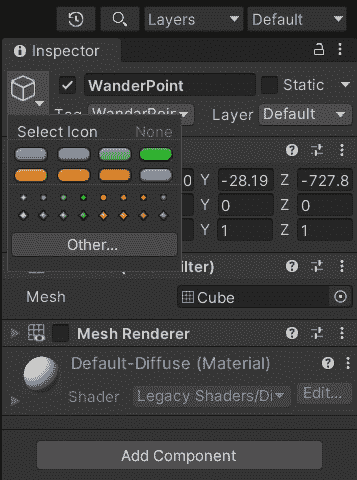

# *第二章*：有限状态机

在本章中，我们将通过研究本书附带的一个简单的坦克游戏机制示例，学习如何在 Unity3D 游戏中实现**有限状态机**（**FSM**）。

在我们的游戏中，玩家控制一辆坦克。敌方坦克在场景中移动，遵循四个航点。一旦玩家的坦克进入敌方坦克的视野范围，它们就开始追逐它；然后，一旦它们足够接近可以攻击，它们就会开始向我们的玩家坦克射击。

为了控制我们的敌方坦克的 AI，我们使用 FSM。首先，我们将使用简单的`switch`语句来实现我们的坦克 AI 状态。然后，我们将使用一个更复杂且经过工程设计的 FSM 框架，这将使我们能够更灵活地设计角色的 FSM。

本章我们将讨论以下主题：

+   实现玩家的坦克

+   实现子弹类

+   设置航点

+   创建抽象 FSM 类

+   使用简单的 FSM 实现敌方坦克 AI

+   使用 FSM 框架

# 技术要求

对于本章，您只需要 Unity3D 2022。您可以在本书仓库的`Chapter 2`文件夹中找到本章描述的示例项目：[`github.com/PacktPublishing/Unity-Artificial-Intelligence-Programming-Fifth-Edition/tree/main/Chapter02`](https://github.com/PacktPublishing/Unity-Artificial-Intelligence-Programming-Fifth-Edition/tree/main/Chapter02)。

# 实现玩家的坦克

在为我们的玩家坦克编写脚本之前，让我们看看我们是如何设置`Rigidbody`和`Box Collider`组件的。

`controller`类：

![Figure 2.1 – Our tank entity

![img/B17984_02_1.jpg]

图 2.1 – 我们的坦克实体

`PlayerTankController`类控制玩家的坦克。我们使用*W*、*A*、*S*和*D*键来移动和转向坦克，并使用左鼠标按钮从**Turret**对象瞄准和射击。

信息

在这本书中，我们假设您正在使用一个*QWERTY*键盘和两个按钮的鼠标，其中左鼠标按钮被设置为主要的鼠标按钮。如果您使用的是不同的键盘，您只需假装您正在使用一个*QWERTY*键盘，或者尝试修改代码以适应您的键盘布局。这相当简单！

## 初始化坦克对象

让我们从在`PlayerTankController.cs`文件中设置`Start`函数和`Update`函数开始创建`PlayerTankController`类：

```py
using UnityEngine;
using System.Collections;
public class PlayerTankController : MonoBehaviour {
    public GameObject Bullet;
    public GameObject Turret;
    public GameObject bulletSpawnPoint;
    public float rotSpeed = 150.0f;
     public float turretRotSpeed = 10.0f;
    public float maxForwardSpeed = 300.0f; 
    public float maxBackwardSpeed = -300.0f;
    public float shootRate = 0.5f; 
    private float curSpeed, targetSpeed;
    protected float elapsedTime;
    void Start() {
   }
    void Update() {
        UpdateWeapon();
        UpdateControl();
    }
```

我们可以在层次结构中看到，**PlayerTank**游戏对象有一个名为**Turret**的子对象，而**Turret**对象的第一个子对象被称为**SpawnPoint**。为了设置控制器，我们需要将**Turret**和**SpawnPoint**拖放到检查器中相应的字段：

![Figure 2.2 – The Player Tank Controller component in the Inspector

![img/B17984_02_2.jpg]

Figure 2.2 – The Player Tank Controller component in the Inspector

之后，在创建 `Bullet` 变量后，最后，`Update` 函数调用 `UpdateControl` 和 `UpdateWeapon` 函数。我们将在下一节讨论这些函数的内容。

## 射击子弹

射击子弹的机制很简单。每当玩家点击鼠标左键时，我们检查自上次射击以来经过的总时间是否大于武器的射击速率。如果是，则创建一个新的 `bulletSpawnPoint` 变换的位置。这个检查防止玩家连续射击子弹流。

因此，我们在 `PlayerTankController.cs` 文件中添加以下函数：

```py
void UpdateWeapon() {
    elapsedTime += Time.deltaTime;
    if (Input.GetMouseButtonDown(0)) {
        if (elapsedTime >= shootRate) {
            //Reset the time 
            elapsedTime = 0.0f;
            //Instantiate the bullet
            Instantiate(Bullet,
              bulletSpawnPoint.transform.position,
              bulletSpawnPoint.transform.rotation);
        }
    }
}
```

现在，我们可以将此控制器脚本附加到 **PlayerTank** 对象上。如果我们运行游戏，我们应该能够从我们的坦克中射击。现在，是时候实现坦克的移动控制了。

## 控制坦克

玩家可以将 `UpdateControl` 函数旋转到 `PlayerTankController.cs` 文件中：

```py
void UpdateControl() {
    // AIMING WITH THE MOUSE
    // Generate a plane that intersects the Transform's
    // position with an upwards normal.
    Plane playerPlane = new Plane(Vector3.up,
      transform.position + new Vector3(0, 0, 0));
    // Generate a ray from the cursor position 
    Ray RayCast =
      Camera.main.ScreenPointToRay(Input.mousePosition);
    // Determine the point where the cursor ray intersects
    // the plane.
    float HitDist = 0;
    // If the ray is parallel to the plane, Raycast will
    // return false.
    if (playerPlane.Raycast(RayCast, out HitDist)) {
        // Get the point along the ray that hits the
        // calculated distance.
        Vector3 RayHitPoint = RayCast.GetPoint(HitDist);
        Quaternion targetRotation = 
          Quaternion.LookRotation(RayHitPoint –
                                  transform.position);
        Turret.transform.rotation = Quaternion.Slerp(
          Turret.transform.rotation, targetRotation,
          Time.deltaTime * turretRotSpeed);
    }
}
```

我们使用射线投射来确定转向方向，通过找到战场上的 `mousePosition` 坐标：


图 2.3 – 使用鼠标射线瞄准

信息

**射线投射** 是 Unity 物理引擎默认提供的一个工具。它允许我们在场景中找到一条假想线（射线）与碰撞器之间的交点。想象一下这是一个激光笔：我们可以向一个方向发射激光，并看到它击中的点。然而，这是一个相对昂贵的操作。虽然一般来说，你可以自信地处理每帧 100-200 次射线投射，但它们的性能会受到射线长度和场景中碰撞器的数量和类型的影响很大。所以，作为一个快速提示，尽量不要使用大量的射线投射与网格碰撞器，并使用层掩码来过滤掉不必要的碰撞器。

这就是它的工作原理：

1.  设置一个与玩家坦克相交且法线向上的平面。

1.  从屏幕空间中用鼠标位置（在先前的图中，我们假设我们正在向下看坦克）射出射线。

1.  找到射线与平面的交点。

1.  最后，找到从当前位置到该交点的旋转。

然后，我们检查按键输入并相应地移动或旋转坦克。我们在 `UpdateControl` 函数的末尾添加以下代码：

```py
if (Input.GetKey(KeyCode.W)) {
    targetSpeed = maxForwardSpeed;
} else if (Input.GetKey(KeyCode.S)) {
    targetSpeed = maxBackwardSpeed;
} else {
    targetSpeed = 0;
}
if (Input.GetKey(KeyCode.A)) {
    transform.Rotate(0, -rotSpeed * Time.deltaTime, 0.0f);
} else if (Input.GetKey(KeyCode.D)) {
    transform.Rotate(0, rotSpeed * Time.deltaTime, 0.0f);
}
//Determine current speed
curSpeed = Mathf.Lerp(curSpeed, targetSpeed, 7.0f *
                      Time.deltaTime);
transform.Translate(Vector3.forward * Time.deltaTime *
                    curSpeed);
```

上述代码表示经典的 *WASD* 控制方案。坦克通过 *A* 和 *D* 键旋转，通过 *W* 和 *S* 键前进和后退。

信息

根据你对 Unity 的熟练程度，你可能想知道关于 `Lerp` 和 `Time.deltaTime` 乘法的细节。这可能值得稍作解释。首先，`Lerp` 函数用于在多个帧上平滑地传播速度变化，这样坦克的运动就不会看起来是瞬间加速和减速的。`7.0f` 的值只是一个 *平滑因子*，你可以玩弄它以找到你喜欢的值（值越大，坦克的加速度就越大）。

然后，我们将所有内容乘以 `Time.deltaTime`。这个值表示从现在到上一帧之间的秒数，我们使用它来使速度独立于帧率。更多信息，请参阅[`learn.unity.com/tutorial/delta-time`](https://learn.unity.com/tutorial/delta-time)。

接下来，是时候实现玩家和敌方坦克发射的弹丸了。

# 实现 Bullet 类

接下来，我们使用两个正交平面和一个盒子碰撞器设置我们的 **Bullet** 预制体，在 **Shader** 字段中使用类似激光的材料和 **Particles/Additive-Layer** 属性：


图 2.4 – 我们的子弹预制体

`Bullet.cs` 文件中的代码如下：

```py
using UnityEngine;
using System.Collections;
public class Bullet : MonoBehaviour {
    //Explosion Effect 
    [SerializeField] // Used to expose in the inspector private 
                     // fields!
    private GameObject Explosion;
    [SerializeField]
    private float Speed = 600.0f;
    [SerializeField]
    private float LifeTime = 3.0f;
    public int damage = 50;
    void Start() {
        Destroy(gameObject, LifeTime);
    }
    void Update() {
        transform.position +=
        transform.forward * Speed * Time.deltaTime;
    }
    void OnCollisionEnter(Collision collision) {
        ContactPoint contact = collision.contacts[0];
        Instantiate(Explosion, contact.point,
                    Quaternion.identity);
        Destroy(gameObject);
    }
}
```

`Bullet` 类有三个属性：`damage`、`Speed` 和 `Lifetime` – 后者使得子弹在一段时间后自动销毁。请注意，我们使用 `[SerializeField]` 来在检查器中显示私有字段；实际上，Unity 默认只显示公共字段。将我们需要从其他类访问的字段设置为公共字段是一个好习惯。

如您所见，子弹的 `Explosion` 属性链接到 `ParticleExplosion` 预制体，我们不会详细讨论。这个预制体在 `ParticleEffects` 文件夹中，所以我们将其放入 `OnCollisionEnter` 方法中。`ParticleExplosion` 预制体使用 `AutoDestruct` 脚本来自动在一段时间后销毁 `Explosion` 对象：

```py
using UnityEngine;
public class AutoDestruct : MonoBehaviour {
    [SerializeField]
    private float DestructTime = 2.0f;
    void Start() {
        Destroy(gameObject, DestructTime);
    }
}
```

`AutoDestruct` 脚本虽小但方便。它只需经过一定时间后就会销毁附加的对象。许多 Unity 游戏几乎在每种情况下都会使用类似的脚本。

现在我们有一个可以发射和移动的坦克，我们可以为敌方坦克设置一个简单的巡逻路径。

# 设置航点

默认情况下，敌方坦克将在游戏竞技场巡逻。要实现这种行为，我们首先需要指定巡逻路径。我们将在 *第六章* 中彻底探讨路径跟随，*路径跟随和转向行为*。现在，我们只限于一个简单的 *航点路径*。

要实现它，我们放置了四个 `WanderPoint`：


图 2.5 – WanderPoint

这是我们 **WanderPoint** 对象的外观：


图 2.6 – WanderPoint 属性

注意，我们需要将这些点标记为名为 **WanderPoint** 的标签。稍后，当我们尝试从我们的坦克 AI 中找到航点时，我们将使用这个标签。如你所见，在其属性中，航点只是一个带有 **Mesh Renderer** 复选框禁用的 **Cube** 游戏对象：



图 2.7 – 工具选择面板

为了在编辑器中显示这些点（但不在游戏中），我们使用一个带有工具图标的无内容对象，因为我们从航点中需要的只是其位置和变换数据。为此，请点击检查器中对象图标附近的小三角形，如图 *图 2.7* 所示。

现在，我们准备利用有限状态机 (FSM) 的力量让敌方坦克获得生命。

# 创建抽象 FSM 类

接下来，我们实现一个通用的抽象类来定义敌方坦克 AI 类的方法。这个抽象类将是我们的 AI 的骨架，并代表敌方坦克应该做什么的高级视图。

我们可以在 `FSM.cs` 文件中看到这个类的代码：

```py
using UnityEngine;
using System.Collections;
public class FSM : MonoBehaviour {
    protected virtual void Initialize() { } 

    protected virtual void FSMUpdate() { } 

    protected virtual void FSMFixedUpdate() { }
    // Use this for initialization 
    void Start () {
        Initialize();
    }
    // Update is called once per frame 
    void Update () {
        FSMUpdate();
    }
    void FixedUpdate() {
        FSMFixedUpdate();
    }
}
```

敌方坦克只需要知道玩家坦克的位置、它们的下一个目的地以及巡逻时可以选择的航点列表。一旦玩家坦克进入射程，它们就会旋转炮塔对象，并以它们的射击速率从子弹发射点开始射击。

正如我们之前解释的，我们将以两种方式扩展这个类：使用基于简单 *if-then-else* 的 FSM（`SimpleFSM` 类）和更工程化但更灵活的 FSM（`AdvancedFSM`）。这两个 FSM 实现将继承 `FSM` 抽象类，并将实现三个抽象方法：`Initialize`、`FSMUpdate` 和 `FSMFixedUpdate`。

在下一节中，我们将看到实现这三种方法的不同方式。现在，让我们从基本实现开始。

# 使用简单的 FSM 为敌方坦克 AI 实现

让我们看看我们 AI 坦克的实际代码。首先，让我们创建一个新的类，称为 `SimpleFSM`，它继承自我们的 FSM 抽象类。

你可以在 `SimpleFSM.cs` 文件中找到源代码：

```py
using UnityEngine;
using System.Collections;
public class SimpleFSM : FSM {
    public enum FSMState {
        None, Patrol, Chase, Attack, Dead,
    }
    //Current state that the NPC is reaching
    public FSMState curState = FSMState.Patrol;
    //Speed of the tank
    private float curSpeed = 150.0f;
    //Tank Rotation Speed
    private float curRotSpeed = 2.0f;
    //Bullet
    public GameObject Bullet;
    //Whether the NPC is destroyed or not
    private bool bDead = false;
    private int health = 100;
    // We overwrite the deprecated built-in rigidbody 
    // variable.
    new private Rigidbody rigidbody;
    //Player Transform
    protected Transform playerTransform;
    //Next destination position of the NPC Tank
    protected Vector3 destPos;
    //List of points for patrolling
    protected GameObject[] pointList;
    //Bullet shooting rate
    protected float shootRate = 3.0f;
    protected float elapsedTime = 0.0f;
    public float maxFireAimError = 0.001f;
    // Status Radius
    public float patrollingRadius = 100.0f;
    public float attackRadius = 200.0f;
    public float playerNearRadius = 300.0f;
    //Tank Turret
    public Transform turret;
    public Transform bulletSpawnPoint;
```

在这里，我们声明了一些变量。我们的坦克 AI 有四种不同的状态：**巡逻**、**追逐**、**攻击**和**死亡**。我们正在实现我们在 *第一章* 中描述的 FSM，即 *人工智能简介*：


图 2.8 – 敌方坦克 AI 的有限状态机 (FSM)

在我们的 `Initialize` 方法中，我们使用默认值设置我们的 AI 坦克的属性。然后，我们将航点的位置存储在我们的局部变量中。我们使用 `FindGameObjectsWithTag` 方法从场景中获取这些航点，尝试找到带有 **WandarPoint** 标签的对象：

```py
//Initialize the Finite state machine for the NPC tank protected override void Initialize () {
    // Get the list of points 
    pointList = 
      GameObject.FindGameObjectsWithTag("WandarPoint");
    // Set Random destination point first 
    FindNextPoint();
    // Get the target enemy(Player) 
    GameObject objPlayer =
    GameObject.FindGameObjectWithTag("Player");
    // Get the rigidbody
    rigidbody = GetComponent<Rigidbody>();
    playerTransform = objPlayer.transform;
    if (!playerTransform) {
        print("Player doesn't exist. Please add one with
               Tag named 'Player'");
    }
}
```

每帧被调用的 `Update` 方法看起来如下：

```py
protected override void FSMUpdate() {
    switch (curState) {
        case FSMState.Patrol: 
            UpdatePatrolState(); 
            break; 
        case FSMState.Chase: 
            UpdateChaseState(); 
            break; 
        case FSMState.Attack: 
            UpdateAttackState(); 
            break; 
        case FSMState.Dead: 
            UpdateDeadState();
            break;
   }
    // Update the time
    elapsedTime += Time.deltaTime;
    // Go to dead state is no health left 
    if (health <= 0) {
        curState = FSMState.Dead;
    }
}
```

我们检查当前状态，然后调用适当的状态方法。一旦健康对象的价值为零或更少，我们将坦克设置为 `Dead` 状态。

调试私有变量

检查器中的公共变量不仅因为我们可以快速尝试不同的值而有用，还因为我们可以在调试时快速查看它们的值。因此，你甚至可能会想将不应由组件用户更改的变量设置为公共（或暴露给检查器）。不用担心——有一个解决方案：你可以在**调试**模式下显示检查器。在**调试**模式下，检查器也会显示私有字段。要启用调试模式，点击右上角的三个点，然后点击**调试**：


图 2.9 – Unity 的调试模式下的检查器

现在，让我们逐一看看如何实现每个状态。

## **巡逻**状态

**巡逻**状态是坦克在从路标到路标之间移动，寻找玩家的状态。**巡逻**状态的代码如下所示：

```py
protected void UpdatePatrolState() {
    if (Vector3.Distance(transform.position, destPos) <=
        patrollingRadius) {
        print("Reached to the destination point\n 
               calculating the next point");
        FindNextPoint();
    } else if (Vector3.Distance(transform.position,
        playerTransform.position) <= playerNearRadius) {
        print("Switch to Chase Position");
        curState = FSMState.Chase;
    }
    // Rotate to the target point 
    Quaternion targetRotation = Quaternion.LookRotation(
      destPos - transform.position);
    transform.rotation = Quaternion.Slerp(
      transform.rotation, targetRotation,
      Time.deltaTime * curRotSpeed);
    // Go Forward
    transform.Translate(Vector3.forward * Time.deltaTime *
                        curSpeed);
}
protected void FindNextPoint() {
    print("Finding next point");
    int rndIndex = Random.Range(0, pointList.Length); 
    float rndRadius = 10.0f;
    Vector3 rndPosition = Vector3.zero;
    destPos = pointList[rndIndex].transform.position + 
      rndPosition;
    // Check Range to decide the random point as the same
    // as before
    if (IsInCurrentRange(destPos)) {
        rndPosition = new Vector3(Random.Range(-rndRadius,
          rndRadius), 0.0f, Random.Range(-rndRadius,
          rndRadius));
        destPos = pointList[rndIndex].transform.position +
          rndPosition;
    }
}
protected bool IsInCurrentRange(Vector3 pos) {
    float xPos = Mathf.Abs(pos.x - transform.position.x);
    float zPos = Mathf.Abs(pos.z - transform.position.z);
    if (xPos <= 50 && zPos <= 50) return true;
    return false;
}
```

当我们的坦克在`FindNextPoint`方法中时。这个方法只是简单地从我们之前定义的路标中选择一个随机点。

另一方面，如果坦克尚未到达其目标点，它将检查与玩家坦克的距离。如果玩家坦克在范围内（在这个例子中，我们选择为`300`单位），AI 将切换到`UpdatePatrolState`函数来旋转坦克并移动到下一个路标。

## **追逐**状态

在**追逐**状态下，坦克积极尝试靠近玩家的坦克。简单来说，目标点变成了玩家的坦克本身。**追逐**状态的实施代码如下所示：

```py
protected void UpdateChaseState() {
    // Set the target position as the player position 
    destPos = playerTransform.position;
    // Check the distance with player tank When
    // the distance is near, transition to attack state 
    float dist = Vector3.Distance(transform.position,
      playerTransform.position);
    if (dist <= attackRadius) {
        curState = FSMState.Attack;
    } else if (dist >= playerNearRadius {
        curState = FSMState.Patrol;
    }
    transform.Translate(Vector3.forward * Time.deltaTime *
                        curSpeed);
}
```

在这个状态下，我们首先将目标点设置为玩家。然后，我们继续检查玩家与坦克的距离。如果玩家足够近，AI 将切换到**攻击**状态。另一方面，如果玩家坦克设法逃脱并走得太远，AI 将回到**巡逻**状态。

## **攻击**状态

**攻击**状态正是你所期待的：敌方坦克瞄准并射击玩家。以下代码块是**攻击**状态的实施代码：

```py
protected void UpdateAttackState() {
    destPos = playerTransform.position;
    Vector3 frontVector = Vector3.forward;
    float dist = Vector3.Distance(transform.position,
      playerTransform.position);
    if (dist >= attackRadius && dist < playerNearRadius {
        Quaternion targetRotation = 
          Quaternion. FromToRotation(destPos – 
                                     transform.position); 
        transform.rotation = Quaternion.Slerp(
          transform.rotation, targetRotation,
          Time.deltaTime * curRotSpeed);
        transform.Translate(Vector3.forward * 
                            Time.deltaTime * curSpeed);
        curState = FSMState.Attack;
    } else if (dist >= playerNearRadius) {
        curState = FSMState.Patrol;
    }
    // Rotate the turret to the target point
    // The rotation is only around the vertical axis of the
    // tank.
    Quaternion targetRotation = Quaternion.FromToRotation(
      frontVector, destPos - transform.position);
    turret.rotation = Quaternion.Slerp(turret.rotation,
      turretRotation, Time.deltaTime * curRotSpeed);
    //Shoot the bullets
    if (Mathf.Abs(Quaternion.Dot(turretRotation,
      turret.rotation)) > 1.0f - maxFireAimError) {
        ShootBullet();
    }
}
private void ShootBullet() {
    if (elapsedTime >= shootRate) {
        Instantiate(Bullet, bulletSpawnPoint.position,
                    bulletSpawnPoint.rotation);
        elapsedTime = 0.0f;
    }
}
```

在第一行，我们仍然将目标点设置为玩家的位置。毕竟，即使在攻击时，我们也需要保持与玩家保持较近的距离。然后，如果玩家坦克足够近，AI 坦克将`turret`对象旋转到玩家坦克的方向，并开始射击。最后，如果玩家的坦克超出范围，坦克将回到**巡逻**状态。

## **死亡**状态

**死亡**状态是最终状态。一旦坦克进入**死亡**状态，它就会爆炸并消失。以下是**死亡**状态的代码：

```py
protected void UpdateDeadState() {
    // Show the dead animation with some physics effects 
    if (!bDead) {
        bDead = true;
        Explode();
    }
}
```

如你所见，代码很简单——如果坦克达到了**死亡**状态，我们让它爆炸：

```py
protected void Explode() {
    float rndX = Random.Range(10.0f, 30.0f); 
    float rndZ = Random.Range(10.0f, 30.0f); 
    for (int i = 0; i < 3; i++) {
        rigidbody.AddExplosionForce(10000.0f,
          transform.position - new Vector3(rndX, 
          10.0f, rndZ), 40.0f, 10.0f);
        rigidbody.velocity = transform.TransformDirection(
          new Vector3(rndX, 20.0f, rndZ));
    }
    Destroy(gameObject, 1.5f);
}
```

这是一个小函数，它提供了一个很好的爆炸效果。我们给坦克的 `Rigidbody` 组件应用一个随机的 `ExplosionForce` 函数。如果一切正常，你应该会看到坦克在空中以随机方向飞起，供玩家娱乐。

## 受伤

为了完成这个演示，我们需要添加另一个小细节：当坦克被子弹击中时，它们需要受到伤害。每次子弹进入坦克的碰撞区域，`health` 属性的值就会根据 `Bullet` 对象的 `damage` 值减少：

```py
void OnCollisionEnter(Collision collision) {
    // Reduce health 
    if(collision.gameObject.tag == "Bullet") {
        health -=collision.gameObject.GetComponent
          <Bullet>().damage;
    }
}
```

你可以在 Unity 中打开 `SimpleFSM.scene` 文件；你应该能看到 AI 坦克正在巡逻、追逐和攻击玩家。我们的玩家坦克目前还没有受到 AI 坦克的伤害，所以它永远不会被摧毁。但是 AI 坦克有生命属性，会受到玩家子弹的伤害，所以你会看到它们的生命属性达到零时爆炸。

如果你的演示不起作用，请尝试在检查器中调整 **SimpleFSM** 组件的不同值。毕竟，这些值可能会根据你项目的规模而变化：


图 2.10 – AI 坦克在行动

在这个演示中，我们使用了一个非常简单的有限状态机（FSM），但现在是我们提高挑战并实现一个完整的 FSM 框架的时候了。

# 使用 FSM 框架

我们将要使用的 FSM 框架是从书籍仓库的 `Chapter02` 文件夹中改编的（[`github.com/PacktPublishing/Unity-Artificial-Intelligence-Programming-Fifth-Edition`](https://github.com/PacktPublishing/Unity-Artificial-Intelligence-Programming-Fifth-Edition)）。特别是，我们将查看 **AdvancedFSM** 场景。

在本节中，我们将研究框架的工作原理以及我们如何使用它来实现我们的坦克 AI。`AdvancedFSM` 和 `FSMState` 是我们框架的两个主要类。所以，让我们先看看它们。

## AdvancedFSM 类

`AdvancedFSM` 类管理我们实现的所有 `FSMState` 类，并保持它们通过转换和当前状态更新。因此，在使用我们的框架之前，我们首先要声明我们计划为我们的 AI 坦克实现的转换和状态。

让我们从创建 `AdvancedFSM.cs` 开始：

```py
using UnityEngine;
using System.Collections;
using System.Collections.Generic;
public enum Transition {
    None = 0, SawPlayer, ReachPlayer, LostPlayer, NoHealth,
}
public enum FSMStateID {
    None = 0, Patrolling, Chasing, Attacking, Dead,
}
```

在这里，我们定义了两个枚举，一个用于状态集合，另一个用于转换集合。然后，我们添加了一个列表对象来存储 `FSMState` 对象，以及两个局部变量来存储 `FSMState` 类的当前 ID 和当前的 `FSMState` 本身。

`AddFSMState` 和 `DeleteState` 方法分别在我们的列表中添加和删除 `FSMState` 类的实例。当 `PerformTransition` 方法被调用时，它会根据转换更新 `CurrentState` 变量：

```py
public class AdvancedFSM : FSM {
    private List<FSMState> fsmStates; 
    private FSMStateID currentStateID; 
    public FSMStateID CurrentStateID {
        get {
            return currentStateID;
        }
    }
    private FSMState currentState; 
    public FSMState CurrentState {
        get {
            return currentState;
        }
    }
```

现在类的数据部分已经准备好了，我们可以继续实现 FSM 框架的内部逻辑。

## FSMState 类

`FSMState`管理到其他状态的转换。它有一个名为`map`的字典对象，其中我们存储转换和状态的键值对。例如，`SawPlayer`转换映射到`Chasing`状态，`LostPlayer`映射到`Patrolling`状态，等等。

让我们创建一个`FSMState.cs`文件：

```py
using UnityEngine;
using System.Collections;
using System.Collections.Generic;
public abstract class FSMState {
    protected Dictionary<Transition, FSMStateID> map = 
      new Dictionary<Transition, FSMStateID>();
    // Continue...
```

`AddTransition`和`DeleteTransition`方法向它们的状态转换字典映射对象中添加和删除转换。`GetOutputState`方法从映射对象中查找，并根据输入转换返回状态。

`FSMState`类还声明了两个抽象方法，其子类需要实现。它们如下：

```py
...
    public abstract void CheckTransitionRules(Transform 
      player, Transform npc);
    public abstract void RunState(Transform player,
      Transform npc);
...
```

`CheckTransitionRules`方法必须检查状态是否应该执行到另一个状态的转换。相反，`RunState`方法执行`currentState`变量的实际任务，例如向目标点移动和追逐或攻击玩家。这两个方法都需要使用此类从玩家和**不可玩角色**（**NPC**）实体获得的转换数据。

## 状态类

与之前的`SimpleFSM`示例不同，我们为我们的坦克 AI 在继承自`FSMState`类的单独类中编写状态，例如`AttackState`、`ChaseState`、`DeadState`和`PatrolState`。所有这些类都实现了`CheckTransitionRules`和`RunState`方法。让我们以`PatrolState`类为例进行查看。

### `PatrolState`类

这个类有三个方法：构造函数、`CheckTransitionRules`和`RunState`。让我们在`PatrolState.cs`文件中创建`PatrolState`类：

```py
using UnityEngine;
using System.Collections;
public class PatrolState : FSMState {
    private Vector3 destPos;
    private Transform[] waypoints;
    private float curRotSpeed = 1.0f;
    private float curSpeed = 100.0f;
    private float playerNearRadius;
    private float patrollRadius;
    public PatrolState(Transform[] wp, float
      playerNearRadius, float patrollRadius) {
        waypoints = wp;
        stateID = FSMStateID.Patrolling;
        this.playerNearRadius = playerNearRadius;
        this.patrollRadius = patrollRadius;
    }
    public override void CheckTransitionRules(
      Transform player, Transform npc) {
        // Check the distance with player tank
        // When the distance is near, transition to chase
       // state 
        if (Vector3.Distance(npc.position, player.position)
            <= playerNearRadius) {
            Debug.Log("Switch to Chase State");
            NPCTankController npcTankController = 
              npc.GetComponent<NPCTankController>();
            if (npcTankController != null) {
                npcTankController.SetTransition(
                Transition.SawPlayer);
            } else {
                Debug.LogError("NPCTankController not found
                                in NPC");
            }
        }
    }
    public override void RunState(Transform player,
      Transform npc) {
        // Find another random patrol point if the current
        // point is reached
        if (Vector3.Distance(npc.position, destPos) <= 
            patrollRadius) {
            Debug.Log("Reached to the destination point\n
                       calculating the next point"); 
            FindNextPoint();
        }
        // Rotate to the target point
        Quaternion targetRotation =
          Quaternion.FromToRotation(Vector3.forward,
          destPos - npc.position);
        npc.rotation = Quaternion.Slerp(npc.rotation,
          targetRotation, Time.deltaTime * curRotSpeed);
        // Go Forward 
        npc.Translate(Vector3.forward * Time.deltaTime * 
                      curSpeed);
    }
}
```

`constructor`方法接受`waypoints`数组，将其存储在本地数组中，然后初始化如移动和旋转速度等属性。`Reason`方法检查自身（AI 坦克）和玩家坦克之间的距离。如果玩家坦克在范围内，它使用`NPCTankController`类的`SetTransition`方法将转换 ID 设置为`SawPlayer`转换，该方法如下所示：

```py
public void SetTransition(Transition t) {
    PerformTransition(t);
}
```

前面的函数只是一个包装方法，它调用`AdvanceFSM`类的`PerformTransition`方法。反过来，该方法使用`Transition`对象和来自`FSMState`类的状态转换字典映射对象来更新`CurrentState`变量，以负责这个转换。`Act`方法更新 AI 坦克的目标点，将坦克旋转到那个方向，并向前移动。

其他状态类也遵循这个模板，具有不同的推理和行动程序。我们已经在之前的简单有限状态机（FSM）示例中见过它们，因此在这里不再描述。看看你是否能自己找出如何设置这些类。如果你卡住了，这本书附带的内容中包含了你可以查看的代码。

## `NPCTankController`类

对于坦克 AI，我们通过使用`NPCTankController`类为我们的 NPC 设置状态。这个类从`AdvanceFSM`继承：

```py
private void ConstructFSM() {
    PatrolState patrol = new PatrolState(waypoints,
      playerNearRadius, patrollingRadius);
    patrol.AddTransition(Transition.SawPlayer,
                         FSMStateID.Chasing);
    patrol.AddTransition(Transition.NoHealth,
                         FSMStateID.Dead);
    ChaseState chase = new ChaseState(waypoints); 
     chase.AddTransition(Transition.LostPlayer,
                         FSMStateID.Patrolling); 
    chase.AddTransition(Transition.ReachPlayer,
                        FSMStateID.Attacking); 
    chase.AddTransition(Transition.NoHealth,
                        FSMStateID.Dead);
    AttackState attack = new AttackState(waypoints); 
   attack.AddTransition(Transition.LostPlayer,
                        FSMStateID.Patrolling); 
    attack.AddTransition(Transition.SawPlayer,
                         FSMStateID.Chasing); 
    attack.AddTransition(Transition.NoHealth,
                         FSMStateID.Dead);
    DeadState dead = new DeadState(); 
    dead.AddTransition(Transition.NoHealth,
                       FSMStateID.Dead);
    AddFSMState(patrol); 
    AddFSMState(chase); 
    AddFSMState(attack);
    AddFSMState(dead);
}
```

这就是使用我们的 FSM 框架的美丽之处：由于状态在其各自的类中自我管理，我们的`NPCTankController`类只需要调用当前活动状态的`Reason`和`Act`方法。

这一事实消除了编写长串的`if`/`else`和`switch`语句的需求。相反，我们的状态现在被很好地封装在自己的类中，这使得代码更加易于管理，因为在大型项目中，状态的数量以及它们之间的转换越来越多：

```py
protected override void FSMFixedUpdate() {
    CurrentState.Reason(playerTransform, transform);
    CurrentState.Act(playerTransform, transform);
}
```

使用此框架的主要步骤可以总结如下：

1.  在`AdvanceFSM`类中声明转换和状态。

1.  编写从`FSMState`类继承的状态类，然后实现`Reason`和`Act`方法。

1.  编写从`AdvanceFSM`继承的自定义 NPC AI 类。

1.  从状态类创建状态，然后使用`FSMState`类的`AddTransition`方法添加转换和状态对。

1.  使用`AddFSMState`方法将这些状态添加到`AdvanceFSM`类的状态列表中。

1.  在游戏更新周期中调用`CurrentState`变量的`Reason`和`Act`方法。

你可以在 Unity 中尝试`AdvancedFSM`场景。它将以与我们之前的`SimpleFSM`示例相同的方式运行，但现在代码更加有序和易于管理。

# 摘要

在本章中，我们学习了如何在 Unity3D 中根据简单的坦克游戏实现状态机。我们首先探讨了如何通过使用`switch`语句来实现有限状态机（FSM）。然后，我们研究了如何使用框架使 AI 实现更容易管理和扩展。

在下一章中，我们将探讨随机性和概率，并看看我们如何利用它们使游戏的结果更加不可预测。
